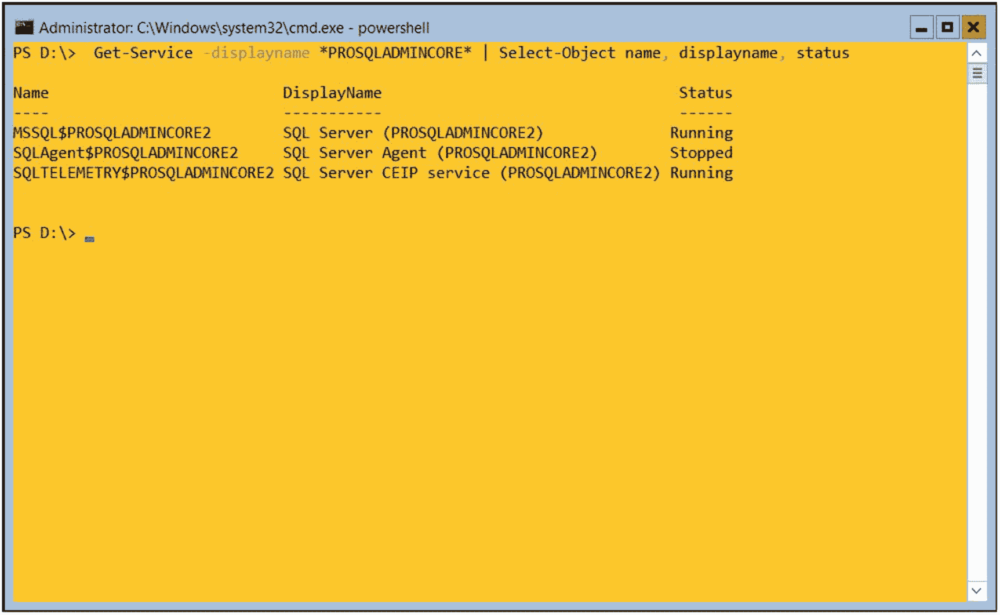
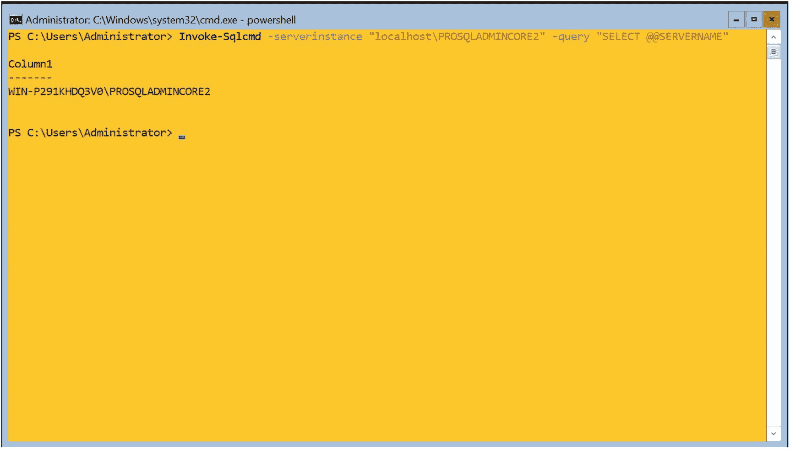
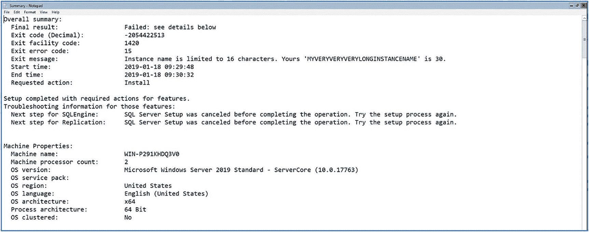
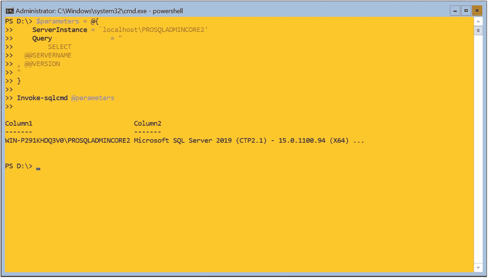

# 3. Server Core 安装

由于 SQL Server 不支持远程安装，并且 Windows Server Core 仅提供命令行界面（CLI）而没有图形用户界面（GUI），因此您必须在 Windows Server Core 上将 SQL Server 安装作为命令行操作执行。您还可以使用配置文件来生成一致、可重复的安装。

在本章中，我们将回顾在 Windows Server Core 上安装 SQL Server 的注意事项，然后演示如何在此平台上执行安装。我们还将讨论使用配置文件以及如何利用它们来简化未来的安装并确保一致性。

在第 1 章中，您可能记得我们讨论了 SQL Server 在 Windows Server Core 上的限制，以及某些功能（如 **Reporting Services**、**Master Data Services** 和 **Data Quality Services**）不受支持，而其他功能（如 **Management Tools** 和 **Distributed Replay Client**）仅受远程支持。您还应确保在组织内的各种能力范围内具有操作可维护性，包括 **PowerShell** 的熟练程度以及操作工具的兼容性。

##### 安装实例

在 Windows Server Core 中安装 SQL Server 需要从 **PowerShell** 终端运行 `setup.exe`。`setup.exe` 可在 SQL Server 安装介质的根目录中找到。从 **PowerShell** 终端运行 `setup.exe` 时，可以使用开关和参数传入值，这些值将用于配置实例。

> 注意：如果需要，您可以遵循相同的过程在基于 GUI 的 Windows 版本上安装 SQL Server。


#### 必需参数

虽然许多开关和参数是可选的，但有些参数必须始终包含。当您安装数据库引擎的独立实例时，表 3-1 中列出的参数始终是必需的。

表 3-1

必需参数

| 参数 | 用法 |
| --- | --- |
| `/IACCEPTSQLSERVERLICENSETERMS` | 确认您接受 SQL Server 许可条款 |
| `/ACTION` | 指定您想要执行的操作，例如“安装”或“升级” |
| `/FEATURES` 或 `/ROLE` | 指定您希望安装的功能 |
| `/INSTANCENAME` | 将分配给该实例的名称 |
| `/SQLSYSADMINACCOUNTS` | 将在数据库引擎实例中被授予管理权限的 Windows 安全上下文 |
| `/AGTSVCACCOUNT` | 将用于运行 SQL Server 代理服务的帐户 |
| `/SQLSVCACCOUNT` | 将用于运行数据库引擎服务的帐户 |
| `/qs` | 执行无人参与安装。在 Windows Server Core 上这是必需的，因为不支持安装向导 |

##### IACCEPTSQLSERVERLICENSETERMS 开关

因为 `/IACCEPTSQLSERVERLICENSETERMS` 是一个表示您接受许可条款的简单开关，所以它不需要传递任何参数值。

##### ACTION 参数

当您执行独立实例的基本安装时，传递给 `/ACTION` 参数的值将是 `install`；但是，`/ACTION` 参数的可能值的完整列表如表 3-2 所示。

表 3-2

`/ACTION` 参数接受的值

| 值 | 用法 |
| --- | --- |
| `install` | 安装独立实例 |
| `PrepareImage` | 准备一个纯净的独立映像，不包含帐户、计算机或网络的特定详细信息 |
| `CompleteImage` | 通过添加帐户、计算机和网络详细信息来完成已准备的独立映像的安装 |
| `Upgrade` | 从 SQL Server 2012、2014、2017 或 2019 升级实例 |
| `EditonUpgrade` | 将 SQL Server 2019 从较低版本（如开发者版）升级到较高级别（如企业版） |
| `Repair` | 修复损坏的实例 |
| `RebuildDatabase` | 重建损坏的系统数据库 |
| `Uninstall` | 卸载独立实例 |
| `InstallFailoverCluster` | 安装故障转移群集实例 |
| `PrepareFailoverCluster` | 准备一个纯净的群集映像，不包含帐户、计算机或网络的特定详细信息 |
| `CompleteFailoverCluster` | 通过添加帐户、计算机和网络详细信息来完成已准备的群集映像的安装 |
| `AddNode` | 向故障转移群集添加节点 |
| `RemoveNode` | 从故障转移群集中移除节点 |

##### FEATURES 参数

如表 3-3 所示，`/FEATURES` 参数用于指定一个以逗号分隔的功能列表，这些功能将由安装程序安装，但并非所有功能都可以在 Windows Server Core 上使用。

表 3-3

`/FEATURES` 参数的可接受值

| 参数值 | 在 Windows Core 上使用 | 描述 |
| --- | --- | --- |
| `SQL` | 否 | 完整的 SQL 引擎，包括全文搜索、复制和数据质量服务器 |
| `SQLEngine` | 是 | 数据库引擎 |
| `FullText` | 是 | 全文搜索 |
| `Replication` | 是 | 复制组件 |
| `DQ` | 否 | 数据质量服务器 |
| `PolyBase` | 是 | PolyBase 组件 |
| `AdvancedAnalytics` | 是 | 机器学习解决方案和数据库内的 R 服务 |
| `SQL_INST_MR` | 是 | 用于机器学习的 R 包 |
| `SQL_INST_MPY` | 是 | 用于机器学习的 Anaconda 和 Python 包 |
| `AS` | 是 | 分析服务 |
| `DQC` | 否 | 数据质量客户端 |
| `IS` | 是 | 集成服务 |
| `MDS` | 否 | 主数据服务 |
| `Tools` | 否 | 所有客户端工具 |
| `BC` | 否 | 向后兼容组件 |
| `Conn` | 是 | 连接组件 |
| `DREPLAY_CTLR` | 否 | 分布式重播控制器 |
| `DREPLAY_CLT` | 否 | 分布式重播客户端 |
| `SNAC_SDK` | 否 | 客户端连接 SDK |
| `SDK` | 否 | 客户端工具 SDK |
| `LocalDB` | 是 | SQL Server Express 的一种执行模式，供应用程序开发人员使用 |

#### 注意

如果您选择安装其他 SQL Server 功能，例如分析服务或集成服务，那么其他参数也会变为必需。

#### 角色参数

除了使用 `/FEATURES` 参数指定要安装的功能列表外，还可以使用 `/ROLE` 参数以预定义的角色安装 SQL Server。`/ROLE` 参数支持的角色详见表 3-4。

表 3-4

`/ROLE` 参数的可用值

| 参数值 | 描述 |
| --- | --- |
| `SPI_AS_ExistingFarm` | 在现有的 SharePoint 场中将 SSAS 安装为 PowerPivot 实例 |
| `SPI_AS_NewFarm` | 在新的未配置的 SharePoint 场中将数据库引擎和 SSAS 安装为 PowerPivot 实例 |
| `AllFeatures_WithDefaults` | 安装 SQL Server 及其组件的所有功能。我不建议使用此选项，除非在极少数情况下，因为安装比实际需要更多的功能会增加 SQL Server 的安全性和资源利用 footprint |

#### 基本安装

当您使用 `setup.exe` 的命令行参数时，您应遵守表 3-5 中概述的语法规则。

表 3-5

命令行参数的语法规则

| 参数类型 | 语法 |
| --- | --- |
| 简单开关 | `/SWITCH` |
| 真/假 | `/PARAMETER=true/false` |
| 布尔值 | `/PARAMETER=0/1` |
| 文本 | `/PARAMETER="值"` |
| 多值文本 | `/PARAMETER="值 1" "值 2"` |
| `/FEATURES` 参数 | `/FEATURES=功能 1,功能 2` |

#### 提示

对于文本参数，仅当值包含空格时才需要引号。但是，始终包含它们被认为是良好的实践。

假设您已经导航到安装媒体根目录，那么清单 3-1 中的命令提供了用于安装数据库引擎、复制和客户端连接组件的 PowerShell 语法。它对所有可选参数使用默认值，但我们将排序规则设置为 Windows 排序规则 `Latin1_General_CI_AS` 除外。

#### 提示

当 Windows Server Core 启动时，您看到的界面是命令提示符，而不是 PowerShell 提示符。键入 `powershell` 以进入 PowerShell 提示符。

```
.\SETUP.EXE /IACCEPTSQLSERVERLICENSETERMS /ACTION="Install" /FEATURES=SQLEngine,Replication,Conn /INSTANCENAME="PROSQLADMINCORE2" /SQLSYSADMINACCOUNTS="Administrator" /SQLCOLLATION="Latin1_General_CI_AS" /qs
```
清单 3-1
从 PowerShell 安装 SQL Server

#### 注意

如果使用命令提示符而不是 PowerShell，则不需要开头的 `.\` 字符。

在此示例中，将安装一个名为 `PROSQLADMINCORE` 的 SQL Server 实例。数据库引擎和 SQL 代理服务都将在 `SQLServiceAccount1` 帐户下运行，名为 `SQLDBA` 的 Windows 组将被设为管理员。安装开始时，会出现一个精简的、非交互式的安装向导版本，让您了解安装进度。


### 冒烟测试

在 Windows Server Core 上安装实例后（安装结束时没有摘要屏幕），执行一些冒烟测试总是一个好主意。这里的 `smoke tests` 指的是快速、高层次的测试，用于确保服务正在运行并且实例可以访问。

清单 3-2 中的代码将使用 PowerShell 的 `Get-Service` cmdlet，以确保与 `PROSQLADMINCORE` 实例相关的服务存在并检查它们的状态。此脚本使用星号作为通配符，返回所有包含我们实例名称的服务。这当然意味着，像 SQL Browser 这样的服务不会被返回。

```
Get-Service -displayname *PROSQLADMINCORE2* | Select-Object name, displayname, status
清单 3-2
检查服务状态
```

结果如图 3-1 所示。你可以看到 SQL Server 和 SQL Agent 服务都已安装。你还可以看到 SQL Server 服务已启动，而 SQL Agent 服务已停止。这符合我们的预期，因为我们没有为任何服务使用启动模式参数。SQL Server 服务的默认启动模式是自动，而 SQL Agent 服务的默认启动模式是手动。


*图 3-1*
*检查服务状态冒烟测试的结果*

第二个推荐的冒烟测试是使用 `invoke-sqlcmd` 运行一个返回实例名称的 T-SQL 语句。要使用 `invoke-sqlcmd` cmdlet（或任何其他 SQL Server PowerShell cmdlet），需要安装 `sqlserver` PowerShell 模块。此模块取代了已弃用的 `SQLPS` 模块，并且包含更多的 cmdlet。

如果你运行的是带桌面体验的 Windows Server，那么安装 SQL Server Management Studio（可从 [`https://docs.microsoft.com/en-us/sql/ssms/download-sql-server-management-studio-ssms`](https://docs.microsoft.com/en-us/sql/ssms/download-sql-server-management-studio-ssms) 下载）时就会包含 `sqlserver` 模块。但是，如果你使用的是核心模式的 Windows Server（或者你选择不安装 SSMS），那么 `sqlserver` 模块可以从 PowerShell Gallery 下载。或者，如果你的服务器可以访问互联网，清单 3-3 中的脚本将首先找到该模块的最新版本，然后下载并安装它。

```
#查找并列出 sqlserver 模块的当前版本
Find-Module sqlserver
#下载并安装 sqlserver 模块
Install-Module sqlserver
清单 3-3
安装 sqlserver 模块
```

#### 提示

第一次运行 `Find-Module` 时，系统会提示你安装 NuGet 提供程序。

一旦安装了 `sqlserver` 模块，就可以使用清单 3-4 中的脚本来返回实例的名称。

#### 注意

这也是集群执行的 `IsAlive` 测试所使用的查询。它对系统影响很小，只是检查实例是否可以访问。

```
Invoke-Sqlcmd –serverinstance "localhost\PROSQLADMINCORE2" -query "SELECT @@SERVERNAME"
清单 3-4
检查实例是否可访问
```

在这个例子中，`- serverinstance` 开关用于指定你要连接到的实例名称，`-query` 开关指定了将要运行的查询。此冒烟测试的结果如图 3-2 所示。如你所见，查询成功解析并返回了实例的名称。


*图 3-2*
*检查实例可访问性冒烟测试的结果*

### 故障排除安装

如果在实例安装过程中发生错误，或者你的冒烟测试失败，那么你将需要对安装进行故障排除。没有 GUI，这看起来可能是一项艰巨的任务，但幸运的是，SQL Server 安装过程提供了一套完整的详细日志，你可以用它们来识别问题。这些日志中最有用的列在表 3-6 中。

*表 3-6*
*SQL Server 安装日志*

| 日志文件 | 位置 |
| --- | --- |
| `Summary.txt` | `%programfiles%\Microsoft SQL Server\150\Setup Bootstrap\Log\` |
| `Detail.txt` | `%programfiles%\Microsoft SQL Server\150\Setup\Bootstrap\Log\<YYYYMMDD_HHMM>\` |
| `SystemConfigurationCheck_Report.htm` | `%programfiles%\Microsoft SQL Server\150\Setup Bootstrap\Log\<YYYYMMDD_HHMM>\` |

#### Summary.txt

当对 SQL Server 安装问题进行故障排除时，`Summary.txt` 通常是你第一个查看的文件。它提供了有关安装的基本信息，通常可以用来确定问题。例如，图 3-3 中的样本清楚地在退出消息中显示，由于指定的实例名称过长，导致实例安装失败。


*图 3-3*
*Summary.txt*

除了返回高级信息（如退出代码、退出消息以及安装的开始和结束时间）外，`summary.txt` 还会提供有关操作系统环境的详细信息。此外，它还将详细说明安装程序尝试安装的组件、每个执行的 MSI（Microsoft 安装程序）的状态，以及指定的任何命令行参数。在文件的末尾，你还会找到一个异常摘要，其中包括堆栈跟踪。

你可以在 Windows Server Core 中使用记事本打开文本文件。所以，假设你已经导航到 `%programfiles%\Microsoft SQL Server\150\Setup Bootstrap\Log\` 文件夹，你可以使用命令 `notepad summary.txt` 来打开这个文件。

#### Detail.txt

如果 `summary.txt` 没有提供你需要的详细粒度，那么你的下一个查看点将是 `detail.txt`。这是安装执行动作的详细日志，这些动作是按执行发生的时间组织的，而不是按执行它们的组件组织的。要在此日志中查找错误，你应该搜索字符串 `error` 和 `exception`。

#### SystemConfigurationCheck_Report.htm

`SystemConfigurationCheck_Report.htm` 文件以网页格式提供了安装期间发生的每条规则检查的描述和状态。不幸的是，Windows Server Core 不支持渲染 HTML。因此，要查看此文件，你有两个选择。第一个是在记事本中查看，这会给你所需的细节，但它会被埋在 HTML 标签之间，没有直观的格式。这几乎违背了 Microsoft 以用户友好格式提供信息的初衷。

第二个选择是从安装了 GUI 的远程计算机打开该文件。这听起来是一个更好的选择，而且确实如此，前提是你在服务器上有一个可以快速放入并访问该文件的共享。然而，如果情况并非如此，并且如果你的环境没有提供快速将此文件移动到另一台机器的能力，你可能不想在这方面花太多时间——特别是因为你通常访问它的唯一原因是安装刚刚失败，而项目团队可能要求你快速解决问题。

##### 其他日志文件

SQL Server 安装例程会生成许多额外的日志文件，包括一个名为 `Datastore` 的文件夹，其中包含一系列 `XML` 文件，每个文件代表一个已配置的独立设置。同样值得注意的是，您会找到安装程序生成的配置文件副本和一个名为 `settings.xml` 的文件。此文件定义了配置选项的元数据，包括配置值的来源，例如默认值或用户指定值。

安装过程中运行的每个 `MSI` 都会创建一个详细日志。这些日志的数量当然取决于您选择安装的功能。在 `Windows Server Core` 上，只要您不是仅执行 `SSAS` 安装，至少会有一个与 SQL 引擎相关的 `.log` 文件。这些 `.log` 文件可以提供关于其特定 `MSI` 更为详细的粒度信息，有助于您进行故障排除。

然而，使用 `MSI` 日志并非完全直接明了，因为您可能会发现许多错误是由前一个错误引起的，而不是问题的根本原因。要使用这些日志文件，您应该按创建时间对它们进行排序。然后，您可以从后往前处理它们。您找到的最后一个错误将是根本原因问题。要在这些文件中搜索错误，请搜索字符串 `Return value 3`。但这可能会变得更复杂，因为并非所有出现的 `Return value 3` 都与意外错误相关。其中一些可能是预期结果。

#### 可选参数

有许多开关和参数可以可选地用于自定义您正在安装的实例的配置。可用于安装数据库引擎的可选开关和参数列于表 3-7 中。

表 3-7 可选参数

| 参数 | 用法 |
| --- | --- |
| `/AGTSVCSTARTUPTYPE` | 指定 SQL Agent 服务的启动模式。可设置为 `Automatic`、`Manual` 或 `Disabled`。 |
| `/BROWSERSVCSTARTUPTYPE` | 指定 SQL Browser 服务的启动模式。可设置为 `Automatic`、`Manual` 或 `Disabled`。 |
| `/CONFIGURATIONFILE` | 指定配置文件的路径，该文件包含开关和参数列表，从而在运行安装程序时无需内联指定它们。 |
| `/ENU` | 指示将使用英文版 SQL Server。如果您在具有本地化设置的服务器上安装英文版 SQL Server，且安装介质同时包含英文和本地化操作系统的语言包，请使用此开关。 |
| `/FILESTREAMLEVEL` | 用于启用 `FILESTREAM` 并设置所需的访问级别。可设置为 `0` 禁用 `FILESTREAM`，`1` 仅允许通过 SQL Server 连接，`2` 允许 IO 流式传输，或 `3` 允许远程流式传输。选项 `1` 到 `3` 是逐级递进的，因此指定级别 `3` 即隐式指定了级别 `1` 和 `2`。 |
| `/FILESTREAMSHARENAME` | 指定存储 `FILESTREAM` 数据的 Windows 文件共享名称。当 `/FILESTREAMLEVEL` 设置为 `2` 或 `3` 时，此参数成为必需项。 |
| `/FTSVCACCOUNT` | 用于运行全文筛选器启动器服务的账户。 |
| `/FTSVCPASSWORD` | 用于运行全文筛选器启动器服务的账户密码。 |
| `/HIDECONSOLE` | 指定应隐藏控制台。 |
| `/INDICATEPROGRESS` | 使用此开关时，安装日志将在安装过程中输出到屏幕。 |
| `/IACCEPTPYTHONLICENSETERMS` | 如果使用 `/q` 或 `/qs` 安装 Anaconda Python 包，则必须指定此项。 |
| `/IACCEPTROPENLICENSETERMS` | 使用 `/q` 或 `/qs` 安装 Microsoft R 包时必须指定。 |
| `/INSTANCEDIR` | 指定实例的文件夹位置。 |
| `/INSTANCEID` | 指定实例的 ID。使用此参数被认为是不好的做法，如第 2 章所述。 |
| `/INSTALLSHAREDDIR` | 指定实例间共享的 64 位组件的文件夹位置。 |
| `/INSTALLSHAREDWOWDIR` | 指定实例间共享的 32 位组件的文件夹位置。此位置不能与 64 位共享组件的位置相同。 |
| `/INSTALLSQLDATADIR` | 指定实例数据的默认文件夹位置。 |
| `/NPENABLED` | 指定是否应启用命名管道。可设置为 `0` 禁用或 `1` 启用。 |
| `/PID` | 指定 SQL Server 的 `PID`。除非安装介质已预置 PID，否则未指定此参数将导致安装评估版。 |
| `/PBENGSVCACCOUNT` | 指定用于运行 Polybase 服务的账户。 |
| `/PBDMSSVCPASSWORD` | 指定将运行 Polybase 服务的账户密码。 |
| `/PBENGSVCSTARTUPTYPE` | 指定 Polybase 的启动模式。可设置为 `Automatic`、`Manual` 或 `Disabled`。 |
| `/PBPORTRANGE` | 指定 PolyBase 服务要监听的端口范围。必须包含至少六个端口。 |
| `/PBSCALEOUT` | 指定数据库引擎是否是 PolyBase 横向扩展组的一部分。 |
| `/SAPWD` | 指定 `SA` 账户的密码。当使用 `/SECURITYMODE` 将实例配置为混合模式身份验证时使用此参数。如果 `/SECURITYMODE` 设置为 `SQL`，则此参数成为必需项。 |
| `/SECURITYMODE` | 使用此参数，值为 `SQL`，以指定混合模式。如果不使用此参数，则将使用 Windows 身份验证。 |
| `/SQLBACKUPDIR` | 指定 SQL Server 备份的默认位置。 |
| `/SQLCOLLATION` | 指定实例将使用的排序规则。 |
| `/SQLMAXDOP` | 指定针对实例运行的查询的最大并行度。 |
| `/SQLMAXMEMORY` | 指定应分配给数据库引擎的最大 `RAM` 量。 |
| `/SQLMINMEMORY` | 指定应分配给数据库引擎的最小内存量。实例启动时，数据库引擎将立即消耗此内存量。 |
| `/SQLSVCSTARTUPTYPE` | 指定数据库引擎服务的启动模式。可设置为 `Automatic`、`Manual` 或 `Disabled`。 |
| `/SQLTEMPDBDIR` | 指定 `TempDB` 数据文件的文件夹位置。 |
| `/SQLTEMPDBLOGDIR` | 指定 `TempDB` 日志文件的文件夹位置。 |
| `/SQLTEMPDBFILECOUNT` | 指定应创建的 `TempDB` 数据文件数量。 |
| `/SQLTEMPDBFILESIZE` | 指定每个 `TempDB` 数据文件的大小。 |
| `/SQLTEMPDBFILEGROWTH` | 指定 `TempDB` 数据文件的增长增量。 |
| `/SQLTEMPDBLOGFILESIZE` | 指定 `TempDB` 日志文件的初始大小。 |
| `/SQLTEMPDBLOGFILEGROWTH` | 指定 `TempDB` 日志文件的增长增量。 |
| `/SQLUSERDBDIR` | 指定用户数据库数据文件的默认位置。 |
| `/SQLUSERDBLOGDIR` | 指定用户数据库日志文件的默认文件夹位置。 |
| `/SQMREPORTING` | 指定是否启用 SQL Reporting。使用值 `0` 禁用或 `1` 启用。 |
| `/SQLSVCINSTANTFILEINIT` | 指定应授予数据库引擎服务账户执行卷维护任务的权限。可接受的值为 `true` 或 `false`。 |
| `/TCPENABLED` | 指定是否启用 `TCP`。使用值 `0` 禁用或 `1` 启用。 |
| `/UPDATEENABLED` | 指定是否使用产品更新功能。传递值 `0` 禁用或 `1` 启用。 |
| `/UPDATESOURCE` | 指定产品更新搜索更新的位置。值 `MU` 将搜索 Windows Update，但您也可以传递文件共享或 `UNC` 路径。 |

### 产品更新与配置安装指南

#### 注意事项
如果使用的账户是 MSA/gMSA，则不应指定账户密码。这包括数据库引擎和 SQL Server Agent 服务的账户，否则这些是必需项。

#### 功能概述
**产品更新**功能取代了 SQL Server 已弃用的“流式安装”功能，使您能够在安装 SQL Server 基础二进制文件的同时，安装最新的 CU（累积更新）或 GDR（一般分发发布—针对安全问题的修补程序）。此功能可以节省 DBA 在安装 SQL Server 实例后立即安装最新更新所需的时间和精力，也有助于确保新构建的实例具有一致的修补级别。

> **提示：** 从 SQL Server 2017 开始，不再发布服务包。所有更新均为 CU 或 GDR。

#### 命令行安装参数
要使用此功能，必须在命令行安装过程中使用两个参数。第一个是 `/UPDATEENABLED` 参数。应将此参数的值指定为 `1` 或 `True`。第二个是 `/UPDATESOURCE` 参数。此参数将告诉安装程序在哪里查找产品更新。如果向此参数传入值 `MU`，则安装程序将检查 Microsoft Update 或 WSUS 服务；或者，您也可以提供文件夹的相对路径或网络共享的 UNC（通用命名约定）路径。

#### 包含 CU 的安装示例
以下示例将研究如何使用此功能安装包含 CU1 的 SQL Server 2019，该 CU 位于网络共享中。当您下载 GDR 或 CU 时，它们将以自解压可执行文件的形式提供。这非常有用，因为即使您的环境中未使用 WSUS，一旦您确认了新的修补级别，只需替换网络共享中的 CU 即可；执行此操作后，所有新构建都可以接收最新更新，而您无需更改用于构建新实例的 PowerShell 脚本。

> **注意：** 用于运行安装的账户需要对文件共享具有访问权限。

清单 3-5 中的 PowerShell 命令将安装一个名为 `PROSQLADMINCU1` 的 SQL Server 实例，同时安装位于文件服务器上的 CU1。

```
.\SETUP.EXE / IACCEPTSQLSERVERLICENSETERMS /ACTION="Install" /FEATURES=SQLEngine,Replication,Conn /INSTANCENAME="PROSQLADMINCU1" /SQLSVCACCOUNT="MyDomain\SQLServiceAccount1" /SQLSVCPASSWORD="Pa$$w0rd" /AGTSVCACCOUNT="MyDomain\SQLServiceAccount1" /AGTSVCPASSWORD="Pa$$w0rd" /SQLSYSADMINACCOUNTS="MyDomain\SQLDBA" /UPDATEENABLED=1 /UPDATESOURCE="\\192.168.183.1\SQL2019_CU1\" /qs
```
清单 3-5 安装期间安装 CU

#### 验证实例版本
清单 3-6 中的代码演示了如何查询两个实例之间的差异。该代码使用 `invoke-sqlcmd` 连接到 `PROSQLADMINCORE2` 实例并返回包含该实例完整版本详细信息（包括内部版本号）的系统变量。为了便于我们识别结果，其中也包含了实例的名称。

```
$parameters = @{
ServerInstance = 'localhost\PROSQLADMINCORE2'
Query               = "
SELECT
@@SERVERNAME
, @@VERSION
"
}
Invoke-sqlcmd @parameters
```
清单 3-6 确定每个实例的构建版本

在此示例中，我们使用了名为“Splatting”的 PowerShell 技术。通过预先定义参数，这使我们的代码更具可读性。因为我们可以在 `invoke-sqlcmd` 语句中使用多个 Splatting 组，所以也可以使用 Splatting 使代码可重用。例如，我们可以将查询放在与其他参数单独的 Splatting 组中，这意味着每次调用 `invoke-sqlcmd` 都可以使用相同的参数集。结果如图 3-4 所示。


图 3-4 PROSQLADMINCORE2 版本详细信息

从结果中我们可以看到，`PROSQLADMINCORE2` 运行在 SQL Server 内部版本号 `15.0.1100.94` 上，这是 SQL Server 2019 CTP 2.1 的版本号。

### 使用配置文件
本书前面已在多处提及使用配置文件来生成一致的构建。清单 3-7 中的示例是一个配置文件的内容，该文件已填充了在 Windows Server Core 上安装名为 `PROSQLADMINCONF1` 的实例所需的所有必需参数。它还包含启用命名管道和 TCP/IP 的可选参数、将 FILESTREAM 启用级别设置为只能通过 T-SQL 访问、将 SQL Agent 服务设置为自动启动以及将排序规则配置为 `Latin1_General_CI_AS`。在此 `.ini` 文件中，以分号开头的行定义为注释。

```
; SQL Server 2019 Configuration File
[OPTIONS]
; Accept the SQL Server License Agreement
IACCEPTSQLSERVERLICENSETERMS
; Specifies a Setup work flow, like INSTALL, UNINSTALL, or UPGRADE.
; This is a required parameter.
ACTION="Install"
; Setup will display progress only, without any user interaction.
QUIETSIMPLE="True"
; Specifies features to install, uninstall, or upgrade.
FEATURES=SQLENGINE,REPLICATION,CONN
; Specify a default or named instance. MSSQLSERVER is the default instance for
; non-Express editions and SQLExpress is for Express editions. This parameter is
; required when installing the SQL Server Database Engine (SQL), Analysis
; Services (AS)
INSTANCENAME="PROSQLADMINCONF1"
; Agent account name
AGTSVCACCOUNT="MyDomain\SQLServiceAccount1"
; Agent account password
AGTSVCPASSWORD="Pa$$w0rd"
; Auto-start service after installation.
AGTSVCSTARTUPTYPE="Automatic"
; Level to enable FILESTREAM feature at (0, 1, 2 or 3).
FILESTREAMLEVEL="1"
; Specifies a Windows collation or an SQL collation to use for the Database
; Engine.
SQLCOLLATION="Latin1_General_CI_AS"
; Account for SQL Server service: Domain\User or system account.
SQLSVCACCOUNT="MyDomain\SQLServiceAccount1"
; Password for the SQL Server service account.
SQLSVCPASSWORD="Pa$$w0rd"
; Windows account(s) to provision as SQL Server system administrators.
SQLSYSADMINACCOUNTS="MyDomain\SQLDBA"
; Specify 0 to disable or 1 to enable the TCP/IP protocol.
TCPENABLED="1"
; Specify 0 to disable or 1 to enable the Named Pipes protocol.
NPENABLED="1"
```
清单 3-7 用于 PROSQLADMINCONF1 的配置文件


#### 提示

如果你使用先前 SQL Server 安装创建的配置文件作为自己配置文件的模板，你会注意到以下参数被指定：`MATRIXCMBRICKCOMMPORT`、`MATRIXCMSERVERNAME`、`MATRIXNAME`、`COMMFABRICENCRYPTION`、`COMMFABRICNETWORKLEVEL` 和 `COMMFABRICPORT`。这些参数仅供 Microsoft 内部使用，应予以忽略。它们对构建没有影响。

假设此配置文件已保存为 `c:\SQL2019\configuration1.ini`，那么可以使用清单 3-8 中的代码从 PowerShell 运行 `setup.exe`。

```
.\setup.exe /CONFIGURATIONFILE="c:\SQL2019\Configuration1.ini"
清单 3-8
使用配置文件安装 SQL Server
```

尽管这是对配置文件的完全有效的用法，但你实际上可以更进一步，使用此方法创建一个可重用的脚本，该脚本可以在任何服务器上运行，以帮助你引入一致的构建过程。本质上，你是在使用 Windows Server Core 的准备式独立映像的脚本化版本。如果你们的 Windows 运维团队尚未采用 Sysprep 或使用其他方法来构建服务器，这将特别有用。

在清单 3-9 中，你会看到另一个配置文件。然而，这次它仅包含你期望在整个环境中保持一致的静态参数。每次安装时会变化的参数（如实例名称和服务帐户详细信息）已被省略。

```
;SQL Server 2019 配置文件
[OPTIONS]
; 接受 SQL Server 许可协议
IACCEPTSQLSERVERLICENSETERMS
; 指定安装工作流，如 INSTALL、UNINSTALL 或 UPGRADE。
; 这是一个必需参数。
ACTION="Install"
; 安装程序将仅显示进度，无需任何用户交互。
QUIETSIMPLE="True"
; 指定要安装、卸载或升级的功能。
FEATURES=SQLENGINE,REPLICATION,CONN
; 安装后自动启动服务。
AGTSVCSTARTUPTYPE="Automatic"
; 启用 FILESTREAM 功能的级别（0、1、2 或 3）。
FILESTREAMLEVEL="1"
; 指定数据库引擎要使用的 Windows 排序规则或 SQL 排序规则。
SQLCOLLATION="Latin1_General_CI_AS"
; 要配置为 SQL Server 系统管理员的 Windows 帐户。
SQLSYSADMINACCOUNTS="MyDomain\SQLDBA"
; 指定 0 以禁用或 1 以启用 TCP/IP 协议。
TCPENABLED="1"
; 指定 0 以禁用或 1 以启用 Named Pipes 协议。
NPENABLED="1"
清单 3-9
用于 PROSQLADMINCONF2 的配置文件
```

这意味着要成功安装实例，你将需要使用来自配置文件的参数和运行 `setup.exe` 的命令中的行内参数的组合，如清单 3-10 所示。此示例假设清单 3-9 中的配置已保存为 `C:\SQL2019\Configuration2.ini`，并将安装名为 `PROSQLADMINCONF2` 的实例。

```
.\SETUP.EXE /INSTANCENAME="PROSQLADMINCONF2" /SQLSVCACCOUNT="MyDomain\SQLServiceAccount1" /SQLSVCPASSWORD="Pa$$w0rd" /AGTSVCACCOUNT="MyDomain\SQLServiceAccount1" /AGTSVCPASSWORD="Pa$$w0rd" /CONFIGURATIONFILE="C:\SQL2019\Configuration2.ini"
清单 3-10
使用混合参数和配置文件安装 SQL Server
```

### 自动化安装例程

这种方法的好处是，我们拥有一个一致的配置文件，无需在每次构建新实例时进行修改。然而，这个想法可以更进一步。如果我们将 PowerShell 命令保存为 PowerShell 脚本，那么我们可以运行该脚本并传入参数，而不是每次重写命令。这将提供一个用于构建新实例的一致脚本，我们可以将其置于变更控制之下。清单 3-11 中的代码演示了如何构造一个参数化的 PowerShell 脚本，该脚本将使用相同的配置文件。该脚本假设 `D:\` 是安装介质的根文件夹。

```
param(
[string] $InstanceName,
[string] $SQLServiceAccount,
[string] $SQLServiceAccountPassword,
[string] $AgentServiceAccount,
[string] $AgentServiceAccountPassword
)
D:\SETUP.EXE /INSTANCENAME=$InstanceName /SQLSVCACCOUNT=$SQLServiceAccount /SQLSVCPASSWORD=$SQLServiceAccountPassword /AGTSVCACCOUNT=$AgentServiceAccount /AGTSVCPASSWORD=$AgentServiceAccountPassword /CONFIGURATIONFILE="C:\SQL2019\Configuration2.ini"
清单 3-11
用于自动安装的 PowerShell 脚本
```

假设此脚本保存为 `SQLAutoInstall.ps1`，则可以使用清单 3-12 中的命令来构建名为 `PROSQLADMINAUTO1` 的实例。此命令运行 PowerShell 脚本，传入参数，这些参数随后用于 `setup.exe` 命令。

```
./SQLAutoInstall.ps1 -InstanceName 'PROSQLADMIN1' -SQLServiceAccount 'MyDomain\SQLServiceAccount1' -SQLServiceAccountPassword 'Pa$$w0rd' -AgentServiceAccount 'MyDomain\SQLServiceAccount1' -AgentServiceAccountPassword 'Pa$$w0rd'
清单 3-12
运行 SQLAutoInstall.ps1
```

#### 提示

因为我已经指定了参数的名称，所以不需要按照它们在脚本中声明的顺序来指定。这也使代码更具可读性。

#### 增强安装例程

你还可以进一步扩展 `SQLAutoInstall.ps1` 脚本，并利用你在第 1 章学到的用于配置操作系统组件的技术和本章前面学到的用于执行冒烟测试的技术。

安装实例后，修改后的脚本（清单 3-13，我们将其称为 `SQLAutoInstall2.ps1`）使用 `powercfg` 设置高性能电源计划，并使用 `set-ItemProperty` 优先考虑后台服务而非前台应用程序。然后运行冒烟测试以确保 SQL Server 和 SQL Agent 服务都在运行并且实例可访问。

```
param(
[string] $InstanceName,
[string] $SQLServiceAccount,
[string] $SQLServiceAccountPassword,
[string] $AgentServiceAccount,
[string] $AgentServiceAccountPassword
)
##### 初始化 ConnectionString 变量
$ServerName = $env:computername
$ConnectionString = $ServerName + '\' + $InstanceName
#安装实例
./SETUP.EXE /INSTANCENAME=$InstanceName /SQLSVCACCOUNT=$SQLServiceAccount /SQLSVCPASSWORD=$SQLServiceAccountPassword /AGTSVCACCOUNT=$AgentServiceAccount /AGTSVCPASSWORD=$AgentServiceAccountPassword /CONFIGURATIONFILE="C:\SQL2019\Configuration2.ini"
##### 配置操作系统设置
powercfg -setactive 8c5e7fda-e8bf-4a96-9a85-a6e23a8c635c
Set-ItemProperty -path HKLM:\SYSTEM\CurrentControlSet\Control\PriorityControl -name Win32PrioritySeparation -Type DWORD -Value 24
##### 运行冒烟测试
Get-service -displayname *$InstanceName*
Invoke-sqlcmd -Serverinstance $ConnectionString -Query "SELECT @@SERVERNAME"
清单 3-13
增强的 PowerShell 自动安装脚本
```

除了将变量传递到 `setup.exe` 命令外，此脚本还使用 `$InstanceName` 参数作为冒烟测试的输入。该参数可以直接传递给 `get-service` cmdlet，两侧使用通配符。然而，对于 `invoke-sqlcmd`，我们需要做一点额外的工作。`invoke-sqlcmd` 需要实例的全名，包括服务器名称或 `local`（假设脚本始终在本地运行）。该脚本从 `ComputerName` 环境变量中提取服务器名称，然后将其与 `$InstanceName` 变量连接，两者之间放置一个 `\`。这个连接后的值填充了 `$ConnectionString` 变量，然后可以将其传递给 `-Serverinstance` 开关。


#### 生产环境就绪

最后，你可能希望为脚本添加一些防御性编码，使其达到生产环境就绪状态。尽管`PowerShell`具备`try`/`catch`功能，但由于`setup.exe`是外部应用程序，它会生成自己的消息和错误，因此确保此脚本平稳运行的最有效技术是强制使用必填参数。

清单 3-14 中的代码是脚本的修改版本，我们将其称为`SQLAutoInstall3.ps1`。此版本的脚本使用`Parameter`关键字为每个参数将`Mandatory`属性设置为`true`。这很重要，因为如果运行此脚本的人遗漏了任何参数，或者参数名称存在拼写错误，安装将会失败。这通过确保在允许脚本运行前已输入所有参数，提供了一种故障保护机制。我们在此脚本中所做的另一项更改是在每个步骤前后添加注释，这样如果脚本确实失败，我们可以轻松查看错误发生的位置。

```powershell
param(
[Parameter(Mandatory=$true)]
[string] $InstanceName,
[Parameter(Mandatory=$true)]
[string] $SQLServiceAccount,
[Parameter(Mandatory=$true)]
[string] $SQLServiceAccountPassword,
[Parameter(Mandatory=$true)]
[string] $AgentServiceAccount,
[Parameter(Mandatory=$true)]
[string] $AgentServiceAccountPassword
)
##### 初始化连接字符串变量
$ServerName = $env:computername
$ConnectionString = $ServerName + '\' + $InstanceName
"初始化变量完成..."
##### 安装实例
./SETUP.EXE /INSTANCENAME=$InstanceName /SQLSVCACCOUNT=$SQLServiceAccount /SQLSVCPASSWORD=$SQLServiceAccountPassword /AGTSVCACCOUNT=$AgentServiceAccount /AGTSVCPASSWORD=$AgentServiceAccountPassword /CONFIGURATIONFILE="C:\SQL2019\Configuration2.ini"
"实例安装完成..."
##### 配置操作系统设置
powercfg -setactive 8c5e7fda-e8bf-4a96-9a85-a6e23a8c635c
"高性能电源计划配置完成..."
Set-ItemProperty -path HKLM:\SYSTEM\CurrentControlSet\Control\PriorityControl -name Win32PrioritySeparation -Type DWORD -Value 24
"后台服务优化配置完成..."
##### 运行冒烟测试
Get-service -displayname *$InstanceName* -ErrorAction Stop
"服务运行检查完成..."
Invoke-sqlcmd -Serverinstance $ConnectionString -Query "SELECT @@SERVERNAME"
"实例可访问性检查完成..."
```

清单 3-14 带有防御性代码的自动安装脚本

`SQLAutoInstall3.ps1`脚本已被运行，但未指定任何参数。在脚本的先前版本中，`PowerShell`会继续执行代码，然后`setup.exe`会因为未为所需参数指定值而失败。然而，在此版本中，你可以看到系统会依次提示你为每个参数输入一个值。

运行脚本时，你会注意到在脚本执行的每个阶段之后，都会显示我们的注释。这可以帮助你响应错误，因为你甚至可以在开始解读可能显示的任何错误消息之前，轻松查看是哪个命令导致了问题。

### 总结

在`Windows Server Core`上安装`SQL Server`可以简单到从`PowerShell`运行单个命令并传递适当的参数。然而，为了保持企业内的一致性并减少手动工作量，你可能希望自动化构建过程。你可以通过使用配置文件来实现这一点，但也可以将此过程扩展为完全自动化安装，包括操作系统配置。然后，你就能将`PowerShell`脚本置于变更控制之下，每次希望构建新实例时，只需运行它并传递参数即可。

安装实例后，应运行冒烟测试以确保服务正在运行且实例可访问。这将突出显示任何阻碍性问题。如果你确实需要对构建进行故障排除，那么你的起点应是检查`summary.txt`日志文件，如果需要，再检查`detail.txt`日志文件。

除了安装基础二进制文件外，你还可以使用`SQL Server`的产品更新功能同时安装最新的累积更新。产品更新可以配置为检查 Microsoft 更新、文件夹位置或网络文件夹。如果你将最新且经过充分测试的更新存储在网络共享上，那么就可以在网络中的任何实例安装时使用它，并且当你希望提高所支持的更新级别时，只需替换网络共享上的更新文件即可。

