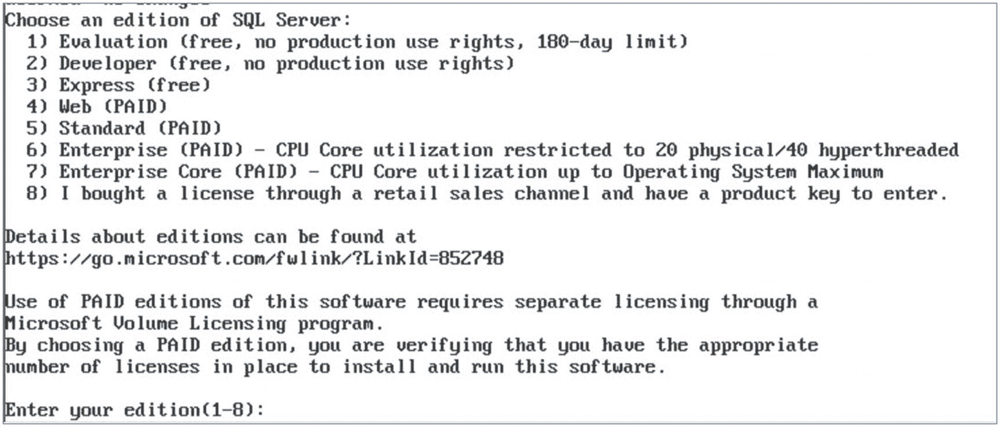
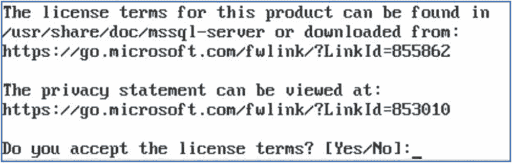
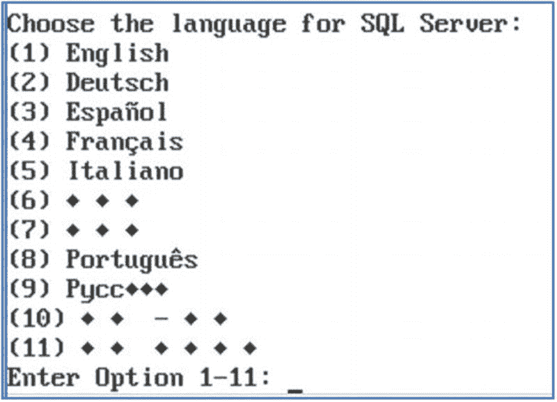

# 4. 在异构操作系统上安装

`SQL Server`的最后两个主要版本都非常注重提供在各种非传统环境中安装`SQL Server`的能力。在本章中，我们将探讨如何在`Linux`上安装`SQL Server`，以及如何构建和运行包含`SQL Server`的`Docker`镜像和容器。

#### 提示

在`Linux`上安装和配置`SQL Server`的命令因发行版而略有不同。本章重点关注`Ubuntu`，因为它可以说对基于`Windows`的`DBA`最友好，本章的目的是让你熟悉概念和流程。Microsoft 为每个发行版提供了快速入门指南，网址为[`https://docs.microsoft.com/en-us/sql/linux/sql-server-linux-setup?view=sql-server-2019`](https://docs.microsoft.com/en-us/sql/linux/sql-server-linux-setup?view=sql-server-2019)。

### 在 Linux 上安装 SQL Server

表 4-1 详细列出了`SQL Server`支持的`Linux`发行版和版本。版本很重要，例如，在撰写本文时，`Ubuntu`的当前版本是 19.4.1。`SQL Server`支持版本 16.4。在我个人的测试中，`SQL Server`可以成功安装在`Ubuntu`19.4.1 上，但（在撰写本文时）`Pacemaker`和`PCS`服务无法安装在此版本上，这意味着无法在此版本的`Ubuntu`上为高可用性/灾难恢复配置`AlwaysOn 可用性组`。

表 4-1 支持的 Linux 发行版和版本

| 发行版 | 支持的版本 |
| --- | --- |
| Red Hat Enterprise | 7.3–7.6 |
| SUSE Enterprise Server | V12 SP2 |
| Ubuntu | 16.4 |

在以下各节中，我们将探讨如何在`Linux`上手动安装`SQL Server`以及如何创建无人参与安装。


#### 手动安装 SQL Server

在 Windows 上安装 SQL Server 时，你可以在安装前指定实例的配置方式。在 Linux 上则相反，你首先安装一个基础版本的 SQL Server，然后在部署后配置实例。在本节中，我们将回顾在 Linux 平台上手动安装 SQL Server 的过程。本次演示将使用 Ubuntu 16.4。

##### 导入公共 GPG 密钥

安装 SQL Server 的第一步是导入公共 gpg 密钥，这将使我们能够访问 SQL Server 软件仓库（repository）。这可以通过清单 4-1 中的 `bash` 命令来实现。

```
wget -qO- https://packages.microsoft.com/keys/microsoft.asc | sudo apt-key add –
清单 4-1
导入公共 GPG 密钥
```

如果我们分解这个命令，我们是使用 `wget` 命令从 Microsoft 网站拉取密钥。`wget` 是一个用于获取网页内容的命令。然后我们使用 `|` 操作符将密钥传递给 `apt-key` 命令，这是一个密钥管理工具。`add` 命令将密钥添加到受信任密钥列表中。一旦 SQL Server 软件包使用受信任密钥进行验证，该软件包就会变为受信任状态。使用 `sudo` 类似于 Windows 平台上的“以管理员身份运行”原则。它用于将用户权限提升至 `root` 级别（相当于 Windows 的管理员）。

##### 注册 SQL Server 软件仓库

下一步是注册 SQL Server 软件仓库。这可以使用清单 4-2 中的 `bash` 命令完成。该命令使用 `add-apt-repository` 脚本来添加一个外部仓库。其中嵌入的 `wget` 命令从 Microsoft 网站拉取软件包列表。

```
sudo add-apt-repository "$(wget -qO- https://packages.microsoft.com/config/ubuntu/16.04/mssql-server-2019.list)"
清单 4-2
注册 SQL Server 软件仓库
```

##### 更新软件包列表

接下来，我们将使用 `apt-get`（Linux 的软件包管理器）从软件仓库拉取软件包列表，并用软件包的最新版本更新这些列表。清单 4-3 演示了这一点。

```
sudo apt-get update
清单 4-3
更新软件仓库的软件包列表
```

##### 安装 SQL Server 软件包

在清单 4-4 中，我们将再次使用 `apt-get`，这次配合 `install` 命令来安装 SQL Server 软件包。`-y` 开关用于自动接受用户提示。

```
sudo apt-get install -y mssql-server
清单 4-4
安装 SQL Server 软件包
```

##### 配置实例

软件包安装完成后，输出将提示你运行 `sudo /opt/mssql/bin/mssql-conf setup`，这是 SQL Server 配置工具，允许你配置实例。运行 `mssql-conf setup` 工具后，系统将提示你选择希望使用的 SQL Server 版本，如图 4-1 所示。使用数字 1 到 8 进行选择。


图 4-1. 选择版本

接下来，系统会要求你接受 SQL Server 许可条款，如图 4-2 所示。键入 `Yes` 即可接受。


图 4-2. 接受许可条款

如图 4-3 所示，接下来你需要使用数字 1 到 11 选择你的语言。


图 4-3. 语言选择

**提示**：在图 4-3 中未正确显示的语言是多字符语言，例如中文。

现在，系统将提示你输入并确认 `sa` 账户的密码，如图 4-4 所示。


图 4-4. 添加 `sa` 密码

##### 连接到实例

你的实例现已配置完成，你可以通过 `sqlcmd`（作为 SQL Server 工具包的一部分安装在 Linux 服务器上——在本章的“无人参与安装”部分讨论）连接，或者使用 SSMS（SQL Server Management Studio）远程连接。


### 配置 SQL Server

尽管 SQL Server 现已安装并已完成基本配置，但要使其完全满足你的需求功能，在操作系统和实例级别可能仍有许多配置方面需要处理。在本节中，我们将探讨在 Linux 环境中可能需要执行的一些常见配置要求。

配置 SQL Server 实例的主要工具是 `mssql-conf`，这也是我们在安装过程中用来配置版本、语言以及为 `sa` 账户设置密码的同一个工具。该工具还提供了许多其他可配置参数，这些参数在表 4-2 中有详细说明。

表 4-2 `mssql-conf` 参数

| 参数 | 描述 |
| --- | --- |
| Agent | 启用或禁用 SQL Server 代理 |
| Collation | 设置实例排序规则 |
| Customer feedback | 指定是否向 Microsoft 发送客户反馈。默认开启，且对于免费版本无法关闭 |
| Database Mail profile | 用于电子邮件警报的数据库邮件配置文件 |
| Default data directory | 用户数据库文件的默认目录 |
| Default log directory | 用户数据库事务日志文件的默认目录 |
| Default Master database directory | Master 数据库数据和日志文件的目录 |
| Default Master database file name | 更改 Master 数据库的数据库文件名 |
| Default dump directory | 内存转储文件的目录 |
| Default error log directory | 用于新的 SQL Server 错误日志、默认分析器跟踪、系统运行状况会话 XE 和 Hekaton 会话 XE 文件的目录 |
| Default backup directory | 新备份的目录 |
| Dump type | 指定要捕获的内存转储文件类型。除了迷你转储外，还允许捕获完全转储。还允许你指定转储文件类型（mini、miniplus、filtered 和 full） |
| High availability | 启用或禁用 AlwaysOn 可用性组 |
| Local Audit directory | 本地审核文件的目录 |
| Locale | SQL Server 实例的区域设置 |
| Memory limit | 分配给 SQL Server 实例的物理内存量 |
| TCP port | SQL Server 将监听连接的端口 |
| TLS | 用于配置 SQL Server 实例的网络方面，包括 `forceencryption`、`tlscert`、`tlskey`、`tlsprotocols`、`tlsciphers` 和 `kerberoskeytabfile` |
| Traceflags | 在实例上设置全局跟踪标志 |

最常见的配置需求之一可能是启动 SQL Server 代理。这可以通过 `Agent` 参数来实现，如代码清单 4-5 所示。

```
sudo /opt/mssql/bin/mssql-conf set sqlagent.enabled true
代码清单 4-5
启动服务器代理
```

另一个展示如何使用该工具的好例子是 `TCP port` 参数。与在 Windows 环境中一样，TCP 1433 是 SQL Server 的默认端口号。然而，你可能希望更改此端口，例如在高安全环境中，以避免使用可能被攻击的知名端口号。

代码清单 4-6 中的命令将配置 SQL Server 实例监听端口 50001。50001-500xx 是我经常使用的端口范围，因为它未被保留。

```
sudo /opt/mssql/bin/mssql-conf set network.tcpport 50001
代码清单 4-6
配置端口
```

要使设置生效，我们首先需要重新启动 SQL Server 服务。这可以使用 `systemctl` 来完成，它是一个用于管理服务的 Linux 工具。代码清单 4-7 中的命令将重新启动 SQL Server 服务。

```
sudo systemctl restart mssql-server
代码清单 4-7
重新启动 SQL Server 服务
```

`systemctl` 工具也可用于检查服务是否正在运行，如代码清单 4-8 所示。

```
sudo systemctl status mssql-server
代码清单 4-8
检查服务是否正在运行
```

现在我们已将 SQL Server 配置为监听端口 50001，我们还需要配置本地防火墙，以允许通过此端口的流量。本地防火墙使用一个名为 `ufw`（简单防火墙）的工具进行管理。代码清单 4-9 中的脚本演示了如何安装 `ufw`、设置默认规则、允许通过端口 50001 的流量，然后重置它以使规则生效。最后，该脚本将显示已配置的规则。

```
#安装 ufw
sudo apt-get install ufw
#启动 ufw
sudo systemctl start ufw
#启用 ufw
sudo systemctl enable ufw
#设置默认防火墙规则
sudo ufw default allow outgoing
sudo ufw default deny incoming
#添加 SQL 规则
sudo ufw allow 50001/tcp
#重新加载 ufw
sudo ufw reload
#显示 ufw 状态
sudo ufw status
代码清单 4-9
使用 ufw
```

#### 注意

在 SQL Server 2019 中，`TempDB` 将自动配置为每个核心一个数据文件，最多八个文件。但对于早期版本，安装过程中只会创建一个数据文件。

### 无人参与安装

因为 Bash 是一种脚本语言，所以 SQL Server 安装可以编写脚本，就像你可以在 Windows 环境中使用 PowerShell 编写安装脚本一样。为此，我们将首先使用文本编辑器 `vi` 创建一个文本文件。代码清单 4-10 中的命令将创建并打开一个名为 `sqlconfig.sh` 的文件。`.sh` 是 bash 脚本常用的扩展名。

```
vi sqlconfig.sh
代码清单 4-10
用 Vi 创建 Bash 脚本
```

全面讨论 `vi` 命令超出了本书的范围。但是，要插入文本，请使用 `i` 命令。完成后，使用 `ESC` 返回命令模式。在这里，`:q!` 将不保存退出 `vi`，而 `:wq` 将保存并退出。

代码清单 4-11 中的脚本可以添加到 bash 脚本中。文件的第一行表明它是可执行的。你还会注意到我们正在为此实例安装全文索引，并为 SQL Server 配置一个跟踪标志和最大内存限制。

然而，最有趣的事情可能是，我们还在安装一个名为 `mssql-tools` 的包。此包包含 Linux 上 SQL Server 的命令行工具，包括 `sqlcmd`。我们将在脚本末尾使用它来创建一个新用户并将其添加到 `sysadmins` 固定服务器角色中。


#### 提示

微软正在为 SQL Server 开发一款新的跨平台命令行工具，名为 `mssql-cli`。此工具可在 Linux、Windows 和 Mac 上使用。在撰写本文时，该工具处于预览阶段，但更多详细信息请访问 [`https://github.com/dbcli/mssql-cli`](https://github.com/dbcli/mssql-cli)。

```bash
#! /bin/bash
MSSQL_SA_PASSWORD='Pa££w0rd'
MSSQL_PID='developer'
SQL_USER='SQLAdmin'
SQL_USER_PASSWORD='Pa££w0rd'
wget -qO- https://packages.microsoft.com/keys/microsoft.asc | sudo apt-key add -
sudo add-apt-repository "$(wget -qO- https://packages.microsoft.com/config/ubuntu/16.04/mssql-server-2019.list)"
sudo add-apt-repository "$(wget -qO- https://packages.microsoft.com/config/ubuntu/16.04/prod.list)"
sudo apt-get update -y
sudo apt-get install -y mssql-server
sudo ACCEPT_EULA=Y apt-get install -y mssql-tools unixodbc-dev
sudo MSSQL_SA_PASSWORD=$MSSQL_SA_PASSWORD \
MSSQL_PID=$MSSQL_PID \
/opt/mssql/bin/mssql-conf -n setup accept-eula
sudo /opt/mssql/bin/mssql-conf set sqlagent.enabled true
sudo /opt/mssql/bin/mssql-conf set memory.memorylimitmb 2048
sudo /opt/mssql/bin/mssql-conf traceflag 3226 on
sudo apt-get install -y mssql-server-fts
sudo systemctl restart mssql-server
/opt/mssql-tools/bin/sqlcmd \
-S localhost \
-U SA \
-P $MSSQL_SA_PASSWORD \
-Q "CREATE LOGIN [$SQL_USER] WITH PASSWORD=N'$SQL_INSTALL_PASSWORD'; ALTER SERVER ROLE [sysadmin] ADD MEMBER [$SQL_USER]"
代码清单 4-11
脚本化安装 SQL Server
```

代码清单 4-12 中的命令将授予该脚本执行权限。

```bash
chmod +x sqlconfig.sh
代码清单 4-12
授予执行权限
```

可以使用代码清单 4-13 中的命令来执行此脚本。

```bash
sh sqlconfig.sh
代码清单 4-13
执行安装
```

### 在 Docker 容器中安装 SQL Server

容器是一种隔离、轻量级的运行单元，可用于运行应用程序。与模拟硬件的虚拟机不同，容器运行在操作系统之上并模拟内核。使用容器进行内核模拟被称为容器化。容器因其高效和可移植性，正日益受到各类组织的青睐。容器的可移植性也简化了部署流程，使其在 DevOps 环境中非常流行。

Docker 是用于运行容器的应用平台。它最初为 Linux 开发，但现在也支持 Windows。这意味着，无论所需的底层操作系统是什么，SQL Server 都能利用容器技术。

Docker 镜像是一个单一文件，其中包含完全打包好的应用程序。因此，就 SQL Server 而言，一个 Docker 镜像可能基于 Windows Server 2019 Core 等操作系统以及 SQL Server 二进制文件构建。你的实例将按照最佳实践进行完全配置，这样每次从镜像创建容器时，它都可以直接使用。

#### 注意

对 SQL Server 进行容器化时，一个重要的考虑因素是容器是无状态的。它们的一个优势是，你可以非常快速轻松地删除并重启一个容器，并且它会和原来完全一样。由此带来的一个副作用是，如果容器内有数据文件，当删除容器时，这些数据文件也会被销毁。因此，用户数据文件和 `msdb` 数据文件应存储在容器外部。我通常建议将 `master` 的数据文件保留在容器内，因为此数据库存储了许多实例配置详情，但在某些情况下，你可能也希望将这些文件存储在容器外部。

#### 运行 Microsoft 提供的 Docker 镜像

微软为 SQL Server 提供少量 Docker 镜像。例如，在撰写本文时，有一个用于 Ubuntu 16.4 的 SQL Server 2017 镜像，以及一个运行 SQL Server 2017 开发人员版的 Windows Server Core 2016 镜像。在下面的示例中，我们将为 Windows Server 2016 Core 配置容器并部署标准的 SQL Server 2017 开发人员版容器。

我们的第一步是安装容器功能并重新启动计算机。这可以通过运行代码清单 4-14 中的 PowerShell 脚本完成。

```powershell
Install-WindowsFeature -name Containers
Restart-Computer -Force
代码清单 4-14
安装容器功能
```

现在，我们需要安装 Docker 引擎和 Microsoft Docker 提供程序。这可以通过代码清单 4-15 中的脚本实现。

```powershell
Install-Module -Name DockerMsftProvider -Repository PSGallery -Force
Install-Package -Name docker -ProviderName DockerMsftProvider -Force
代码清单 4-15
安装 Docker 引擎
```

#### 提示

如果尚未安装，代码清单 4-15 中的脚本将提示你安装 `NuGet` 提供程序。你应该接受此安装，因为 `NuGet` 是安装 Docker 等其他软件包所必需的包管理器。

Docker 安装的最后一步是启动 Docker 服务。使用 PowerShell，可以通过代码清单 4-16 中的命令完成。

```powershell
Start-Service docker
代码清单 4-16
启动 Docker 服务
```

现在，我们可以从 Microsoft 容器注册表 (MCR) 拉取镜像。这是一个基础 Windows 容器的仓库。Docker Hub 是容器镜像的默认仓库，但即使 Windows 镜像在 Docker Hub 上列出，它们也存储在 MCR 中。我们可以使用代码清单 4-17 中的命令拉取镜像。

```bash
Docker image pull microsoft/mssql-server-windows-developer
代码清单 4-17
拉取 Docker 镜像
```

最后，我们需要启动容器。我们可以使用代码清单 4-18 中的命令启动容器。在此示例中，`-d` 开关表示容器应在分离模式下运行。这意味着容器将作为后台进程运行，而不是交互式运行。我们还使用 `-p` 将容器的端口发布到主机，并使用 `-e` 设置环境变量。在此例中，我们设置了 `sa` 帐户的密码并接受 SQL Server 许可条款。

```bash
docker run -d -p 1433:1433 -e sa_password=Pa££w0rd -e ACCEPT_EULA=Y microsoft/mssql-server-windows-developer
代码清单 4-18
运行容器
```

#### 创建用于 SQL Server 的简单 Docker 镜像

虽然 Microsoft 的镜像可能适用于某些目的，但在大多数情况下，你需要根据自己的配置要求创建自己的 Docker 镜像。在本节中，我们将探讨如何使用 Docker 文件创建一个镜像，该镜像将在 Windows Server Core 上安装 SQL Server 2019 和 SQL Server 命令行工具。

#### 提示

在本节中，我们将使用一台 Windows Server 2019 主机，该主机已安装容器功能、Docker 模块和 Microsoft Docker 提供程序。如何执行这些准备步骤的详细信息，请参阅本章的“运行 Microsoft 提供的 Docker 镜像”部分。

Dockerfile 是一个部署脚本，它指定了应如何构建容器镜像。该文件由一组指令构成。与基于 Windows 创建 SQL Server 容器最相关的指令在表 4-3 中详述。

表 4-3：Dockerfile 指令

| 指令 | 描述 |
| --- | --- |
| `FROM` | 你的新镜像所应基于的容器镜像 |
| `RUN` | 指定要运行的命令 |
| `COPY` | 将文件从主机复制到容器镜像 |
| `ADD` | 类似于 COPY，但允许从远程源复制文件 |
| `WORKDIR` | 为其他 Docker 指令指定工作目录 |
| `CMD` | 设置当容器镜像实例部署时要运行的默认命令 |
| `VOLUME` | 创建一个挂载点 |

创建我们自己的容器镜像的第一步是从 MCR 拉取 Windows Server 2019 Core 镜像。这将是我们镜像的基础镜像。我们可以使用 PowerShell 来完成此操作，使用的是清单 4-19 中的命令。

```
docker pull mcr.microsoft.com/windows/servercore:ltsc2019
```
**清单 4-19：** 拉取基础镜像

我们的下一步是在主机上创建一个简单的文件夹结构。首先，我们将创建一个名为 `C:\DockerBuild` 的文件夹。此文件夹将存储我们的构建脚本。我们还将在其下创建一个名为 `C:\DockerBuild\SQL2019` 的文件夹。此文件夹应包含 SQL Server 2019 安装介质。

我们现在需要创建两个脚本，都将放置在 `C:\DockerBuild` 文件夹中。第一个文件是 Dockerfile。此文件必须命名为 `Dockerfile` 且没有扩展名。

#### 提示

保存 `dockerfile` 时，请确保你的文本/代码编辑器没有自动向文件附加默认文件扩展名。如果附加了，那么镜像的构建将失败。

清单 4-20 中的脚本包含了我们将要使用的 Dockerfile 的内容。

```
#使用 Server Core 基础镜像
FROM mcr.microsoft.com/windows/servercore:ltsc2019
#为 SQL Server 和 SQL 命令行实用工具介质创建临时文件夹
RUN powershell -Command (mkdir C:\SQL2019)
#将 SQL Server 介质复制到容器中
COPY \SQL2019 C:/SQL2019
#安装 SQL Server
RUN C:/SQL2019/SETUP.exe /Q /ACTION=INSTALL /FEATURES=SQLENGINE /INSTANCENAME=MSSQLSERVER \
/SECURITYMODE=SQL /SAPWD="Passw0rd" /SQLSVCACCOUNT="NT AUTHORITY\System" \
/AGTSVCACCOUNT="NT AUTHORITY\System" /SQLSYSADMINACCOUNTS="BUILTIN\Administrators" \
/IACCEPTSQLSERVERLICENSETERMS=1 /TCPENABLED=1 /UPDATEENABLED=False
#安装 Chocolatey 和 SQL Server 命令行实用工具
RUN @"%SystemRoot%\System32\WindowsPowerShell\v1.0\powershell.exe" -NoProfile -InputFormat None -ExecutionPolicy Bypass -Command "iex ((New-Object System.Net.WebClient).DownloadString('https://chocolatey.org/install.ps1'))" && SET "PATH=%PATH%;%ALLUSERSPROFILE%\chocolatey\bin"
RUN choco install sqlserver-cmdlineutils -y
#设置 SQL Server 自动启动
RUN powershell -Command (Set-Service MSSQLSERVER -StartupType Automatic)
#移除安装介质
RUN powershell -Command (Remove-Item -Path C:/SQL2019 -Recurse -Force)
#为数据文件创建一个挂载点
VOLUME C:/DataFiles
#将 start.ps1 复制到容器中
COPY \start.ps1 /
WORKDIR /
CMD powershell -Command (.\start.ps1)
```
**清单 4-20：** Dockerfile

即使没有 Docker 经验，通过理解文件内容，也很容易看出发生了什么。我们的第一条语句表明，我们的构建将基于由 Microsoft 提供的 Windows Server 2019 Core 构建。然后我们使用 `RUN` 和 `COPY` 指令将 SQL Server 介质复制到容器中。

之后，我们直接进入 SQL Server 的安装。通过 PowerShell 安装 SQL Server 在第 3 章中讨论过。这段代码与在传统的运行 Windows Server Core 的服务器上安装 SQL Server 没有区别。唯一值得注意的是，由于命令跨越多行，我们在每行末尾使用了 `\`，以告知 Docker 这是一条指令。

脚本的下一部分相当有趣。我们正在安装 Chocolatey。Chocolatey 是 Windows 的一个包管理器，拥有一个庞大的预打包应用程序库。在这种情况下，它很有帮助，因为它允许我们轻松安装 SQL Server 命令行实用工具，该工具在 Chocolatey 库中可用。

#### 提示

Chocolatey 也可用于打包你自己的 SQL Server 构建。我最近为一个客户做了这件事，它非常契合 DevOps/配置管理式的运维风格。

接下来，我们使用 `RUN` 指令来运行 PowerShell 命令，这些命令将清理我们的安装文件并确保数据库引擎服务已启动。我们的下一步是使用 `VOLUME` 指令为 `DataFiles` 创建一个挂载点。当我们运行容器实例时，我们将能够将其映射到主机上的一个文件夹，以允许我们的数据被持久化。

最后，我们将一个名为 `Start.ps1` 的文件复制到我们的容器中并运行它。`Start.ps1` 的内容如清单 4-21 所示。此脚本用于运行一个无限循环。如果我们不这样做，那么一旦最后一条指令发送完毕，容器就会停止。

```
$lastCheck = (Get-Date).AddSeconds(-2)
while ($true)
{
$lastCheck = Get-Date
Start-Sleep -Seconds 2
}
```
**清单 4-21：** Start.ps1

将这两个文件保存在主机的 `C:\DockerBuild` 文件夹中之后，我们可以通过运行清单 4-22 中的命令来构建镜像。我们使用 `-t` 开关来标记构建。我使用了 `major.minor` 表示法来指示构建版本。

#### 提示

确保在运行命令前位于`C:\DockerBuild`目录。

```
docker build -t sql2019:1.0 .
清单 4-22
构建镜像
```

构建完成后，我们可以使用清单 4-23 中的命令创建一个容器实例。

```
docker run -p 1433:1433 --name sql-2019 -d --volume c:\Datafiles:c:\datafiles sql2019:1.0
清单 4-23
运行 Docker 容器
```

在这个命令中，我们使用`-p`来向主机暴露一个端口，并使用`-d`将容器作为后台进程运行。我们还使用`--name`来标识容器。最有趣的是，我们使用`--volume`将容器中的挂载点映射到主机上的一个文件夹。其格式为`source:target`。

我们没有为容器指定 IP 地址，因此可以使用清单 4-24 中的命令检查它被分配的 IP 地址。这个命令使用 Docker inspect 从基于 JSON 的配置中提取特定节点，后跟您感兴趣的容器名称。

```
docker inspect --format "{{ .NetworkSettings.Networks.nat.IPAddress }}" sql-2019
清单 4-24
获取容器的 IP 地址
```

现在，我们可以从容器外部，使用 SSMS（或其他 SQL 客户端）通过这个 IP 地址连接到实例。

让我们使用清单 4-25 中的脚本在挂载卷上创建一个数据库。

```
CREATE DATABASE PersistedData
ON  PRIMARY
( NAME = N'PersistedData', FILENAME = N'C:\Datafiles\PersistedData.mdf' , SIZE = 8192KB , FILEGROWTH = 65536KB )
LOG ON
( NAME = N'PersistedData_log', FILENAME = N'C:\Datafiles\PersistedData.ldf' , SIZE = 8192KB , FILEGROWTH = 65536KB )
GO
清单 4-25
创建数据库
```

如果我们现在销毁容器，数据将会持久保存。我们可以使用清单 4-26 中的脚本来删除容器。该脚本首先停止容器，然后将其移除。

```
docker stop sql-2019
docker rm sql-2019
清单 4-26
移除容器
```

如果你现在使用清单 4-23 中的脚本重新创建容器，并使用清单 4-24 中的脚本获取新的 IP 地址，当你连接到实例时，会注意到`PersistedData`数据库不再在实例上。这是因为在构建过程中数据库没有被附加。然而，由于文件存储在主机上，你可以使用清单 4-27 中的命令简单地重新附加数据库。

```
CREATE DATABASE PersistedData ON
( FILENAME = N'C:\datafiles\PersistedData.mdf' ),
( FILENAME = N'C:\datafiles\PersistedData.ldf' )
FOR ATTACH
GO
清单 4-27
重新附加数据库
```

### 创建可配置的 SQL Server Docker 镜像

虽然“为 SQL Server 创建一个简单的 Docker 镜像”一节中讨论的构建过程易于遵循，但它也相当不灵活。所有内容都是硬编码的，并且没有在构建过程中附加数据库的方法。因此，在接下来的演示中，我们将对构建进行重大更改，允许我们对其进行参数化，使构建在现实场景中更加可用。

遵循与之前相同的过程，并使用主机上相同的文件夹结构，让我们首先创建一个新的 Docker 文件。我们将使用的`Dockerfile`内容可以在清单 4-28 中找到。该文件相似，但你会注意到一些变化。首先，我们删除了安装 SQL Server 命令行实用工具的代码。这是因为我们将使用`sqlserver` PowerShell provider 代替。

我们还将 SQL Server 安装步骤中硬编码的 sa 密码更改为`TempPassw0rd`。这是因为当我们运行容器实例时，我们将传入想要使用的密码。

最显著的是，你会注意到对`Start.ps1`的调用被扩展为传递参数。在这个构建中，`Start.ps1`是所有魔法发生的地方。你会注意到我们将环境变量传递给脚本的每个参数。

```
#使用 Server Core 基础镜像
FROM mcr.microsoft.com/windows/servercore:ltsc2019
#为 SQL Server 和 SQL 命令行实用工具媒体创建临时文件夹
RUN powershell -Command (mkdir C:\SQL2019)
#将 SQL Server 媒体复制到容器中
COPY \SQL2019 C:/SQL2019
#安装 SQL Server
RUN C:/SQL2019/SETUP.exe /Q /ACTION=INSTALL /FEATURES=SQLENGINE /INSTANCENAME=MSSQLSERVER \
/SECURITYMODE=SQL /SAPWD="TempPassw0rd" /SQLSVCACCOUNT="NT AUTHORITY\System" \
/AGTSVCACCOUNT="NT AUTHORITY\System" /SQLSYSADMINACCOUNTS="BUILTIN\Administrators" \
/IACCEPTSQLSERVERLICENSETERMS=1 /TCPENABLED=1 /UPDATEENABLED=False
#设置 SQL Server 自动启动
RUN powershell -Command (Set-Service MSSQLSERVER -StartupType Automatic)
#移除安装媒体
RUN powershell -Command (Remove-Item -Path C:/SQL2019 -Recurse -Force)
#为数据文件创建挂载点
VOLUME C:/DataFiles
#将 shell 切换到 PowerShell
#SHELL ["powershell", "-Command", "$ErrorActionPreference = 'Stop'; $ProgressPreference = 'SilentlyContinue';"]
#将 start.ps1 复制到容器
COPY \start.ps1 /
WORKDIR /
CMD powershell -Command (.\start.ps1 -saPassword $env:saPassword -databases $env:databases -agentStartupType $env:agentStartupType)
清单 4-28
Dockerfile
```

我们的下一步将是创建一个新的`Start.ps1`文件。这次，如清单 4-29 所示，该文件要复杂得多。该脚本接受三个参数，允许我们传入 sa 帐户的密码、实例上应该存在的数据库数组以及 SQL Server 代理服务所需的启动类型。

脚本中的第一个命令用于从 PowerShell 库安装`sqlserver` PowerShell 模块。这使我们能够使用`Invoke-SqlCmd` cmdlet。然后，脚本使用 sa 帐户的临时密码对 SQL 实例运行查询，并将密码更改为传入的密码。

脚本的下一部分是最复杂的部分。此部分检查传入的数据库名称数组中的每个数据库是否存在于实例上。如果不存在，它会尝试从挂载卷附加数据库。如果数据库文件不存在，它将检查挂载卷中是否存在备份文件并还原数据库。最后，如果其他所有方法都失败，则将创建一个新数据库。


#### 提示

此版本的脚本严重依赖于数据库和备份文件的命名约定。它还假设始终只有一个`.mdf`和`.ldf`文件。当然，你可以编辑此脚本，以添加对`.ndf`文件、你自己的命名约定或应用程序需求的支持。

脚本中的下一个命令将修改 SQL Server 代理服务以使用传递给脚本的启动类型。最后，脚本进入与上一个示例相同的无限循环。这可以防止容器在最后一个指令传递后停止。

```powershell
param(
    [Parameter(Mandatory=$true)]
    [string]$saPassword,
    [Parameter(Mandatory=$false)]
    [string]$databases,
    [Parameter(Mandatory=$false)]
    [String]$agentStartupType
)

#Install SQL Server PowerShell Provider
If(-not(Get-InstalledModule SQLServer -ErrorAction silentlycontinue)){
    Install-Module SQLServer -Confirm:$False -Force
}

#Update sa Password
$params = @{
    ServerInstance = "localhost"
    Username = "sa"
    Password = "TempPassw0rd"
    Query = "ALTER LOGIN [sa] WITH PASSWORD='{0}'; ALTER LOGIN sa ENABLE ;" -f $saPassword
}
Invoke-Sqlcmd @params

#Shred the database array
$databasesClean = $databases -split ","

#Create each database
ForEach ($database in $databasesClean) {
    $params = @{
        ServerInstance = "localhost"
        Username = "sa"
        Password = $saPassword
        Variable = "dbName='{0}'" -f $database
        Query = "SELECT COUNT(*) AS dbExists FROM sys.databases WHERE name = `$(dbName)"
    }
    $dbExists = Invoke-Sqlcmd @params

    if ($dbexists.dbExists -eq 0) {
        $mdf = "C:\DataFiles\{0}.mdf" -f $database
        if (Test-Path $mdf) {
            $params = @{
                ServerInstance = "localhost"
                Username = "sa"
                Password = $saPassword
                Variable = "dbName='{0}'" -f $database
                Query = "DECLARE @SQL NVARCHAR(MAX) = 'CREATE DATABASE [' + `$(dbName) + '] ON ( FILENAME = N'C:\datafiles\' + `$(dbName) + '.mdf' ),( FILENAME = N'C:\datafiles\' + `$(dbName) + '.ldf' ) FOR ATTACH'; EXEC(@SQL)"
            }
            Invoke-Sqlcmd @params
        } else {
            $bak = "C:\DataFiles\{0}.bak" -f $database
            if (Test-Path $bak) {
                $params = @{
                    ServerInstance = "localhost"
                    Username = "sa"
                    Password = $saPassword
                    Variable = "dbName='{0}'" -f $database
                    Query = "DECLARE @SQL NVARCHAR(MAX) = 'RESTORE DATABASE [' + `$(dbName) + '] FROM  DISK = N'C:\Datafiles\' + `$(dbName) + '.bak';'; EXEC(@SQL)"
                }
                Invoke-Sqlcmd @params
            } else {
                $params = @{
                    ServerInstance = "localhost"
                    Username = "sa"
                    Password = $saPassword
                    Variable = "dbName='{0}'" -f $database
                    Query = "DECLARE @SQL NVARCHAR(MAX) = 'CREATE DATABASE [' + `$(dbName) + ']' EXEC(@SQL)"
                }
                Invoke-Sqlcmd @params
            }
        }
    }
}

#Set Agent service startup type
Set-Service SQLSERVERAGENT -StartupType $agentStartupType

#Start infinite loop
$lastCheck = (Get-Date).AddSeconds(-2)
while ($true)
{
    $lastCheck = Get-Date
    Start-Sleep -Seconds 2
}
```

*清单 4-29*
*Start.ps1*

#### 提示

环境变量不支持数组。因此，我们需要将数据库列表作为逗号分隔的字符串传递。然后，我们在 PowerShell 中使用 `Split` 来创建数组。

现在我们可以使用清单 [4-30] 中的命令来构建镜像。请注意，我已增加主版本号。

```bash
docker build -t sql-2019:2.0 .
```

*清单 4-30*
*构建 Docker 镜像*

最后，我们可以如清单 [4-31] 所示运行容器。请注意，我们使用 `-e` 开关在容器中创建环境变量。

```bash
docker run -p 1433:1433 --name sql-2019 -e "saPassword=PermPassw0rd" -e "databases=test,persisteddata" -e "agentStartupType=Automatic" -d --volume c:\Datafiles:c:\datafiles sql-2019:2.0
```

*清单 4-31*
*运行容器*

#### 提示

容器自动化的可能性本身就值得写一本书，我鼓励你进行实验。例如，你可以尝试将运行容器的命令包装在 PowerShell 脚本中，在其中传递所需的容器名称。该脚本随后可以在主机上创建一个包含容器名称的文件夹，使其具有唯一性。容器的挂载卷可以映射到一个唯一的文件夹名称。你还应该尝试将 `sa` 密码作为加密文件的路径传递，因为在生产环境中将其作为环境变量传递并不安全。你也可以尝试向容器添加 gMSA（组托管服务账户）。这将允许 SQL Server 与 AD 交互，尽管容器不支持域加入。

#### Kubernetes 支持

Kubernetes 是一个容器编排器。它允许在服务器集群上运行容器，为容器提供高可用性。使用最新版本的 Kubernetes，Windows Server 2019 服务器可以与 Linux 服务器一起添加到集群中。

SQL Server 2019 远非忽视这一事实，并引入了一项名为大数据集群（Big Data Clusters）的新技术。该技术利用 Kubernetes 的力量来部署可扩展的 SQL Server、Spark 和 HDFS 容器集群。大数据集群超出了本书的范围，但更多细节可以在 [`https://docs.microsoft.com/en-us/sql/big-data-cluster/big-data-cluster-overview`](https://docs.microsoft.com/en-us/sql/big-data-cluster/big-data-cluster-overview) 找到。

此外，从 SQL Server 2019 开始，AlwaysOn 可用性组也可用于在 Kubernetes 编排的容器中，为托管容器的数据库提供高可用性和灾难恢复。这利用了 SQL Server Kubernetes 操作员（operator）的概念，它是一个扩展 Kubernetes API 的应用程序特定软件。在这种情况下，结果是一个操作员，它协助在集群内打包、部署和管理 AlwaysOn 容器。在 Kubernetes 集群中构建可用性组超出了本书的范围，但更多细节可以在 [`https://docs.microsoft.com/en-us/sql/linux/sql-server-linux-kubernetes-deploy`](https://docs.microsoft.com/en-us/sql/linux/sql-server-linux-kubernetes-deploy) 找到。在这里，你会发现一个使用 Azure 托管 Kubernetes 服务配置可用性组的演练。

### 总结

SQL Server 现在不仅可以安装在 Windows 上，还可以安装在 Linux 上和容器内。这为数据库架构师提供了更大的灵活性，可以将 SQL Server 托管在最适合其应用程序需求的平台上。

SQL Server 可以安装在 Ubuntu、Red Hat 和 Suse Linux 发行版上。在规划部署时，你应确保使用的是受支持的 Linux 版本以及受支持的 Linux 发行版。

SQL Server 可以安装在 Windows 和 Linux 容器上。Microsoft 提供了一些基本的 Docker 镜像，但对于大多数用途，你将需要构建自己的自定义 Docker 镜像来部署 SQL Server。除了独立的 Docker 容器外，SQL Server 2019 还引入了对 Kubernetes 的支持，包括大数据集群和 SQL Server Kubernetes 操作员，这允许在 Kubernetes 集群内安装 AlwaysOn 可用性组。

