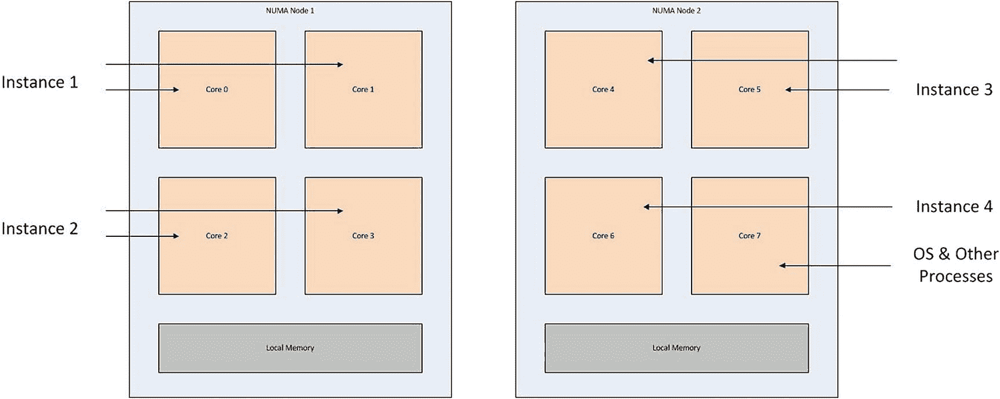
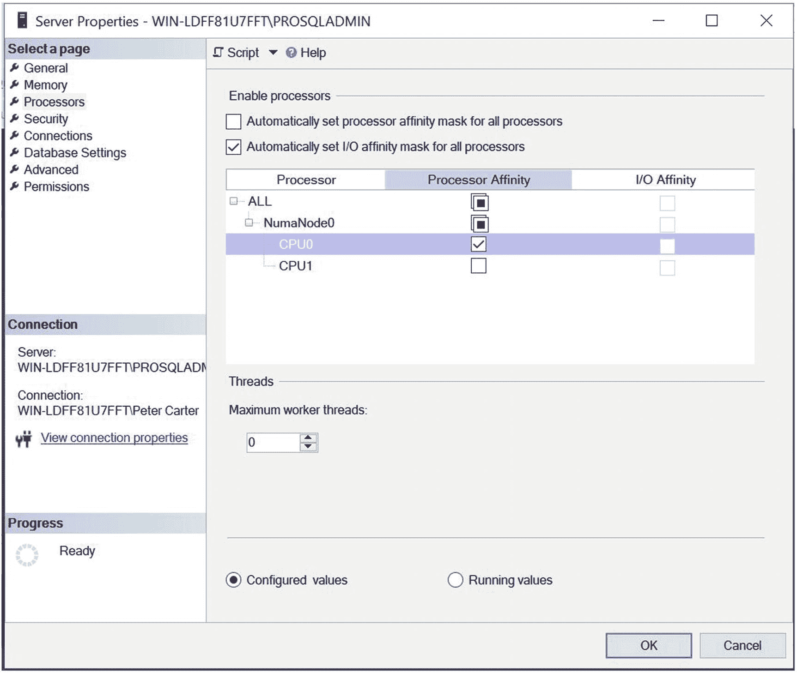
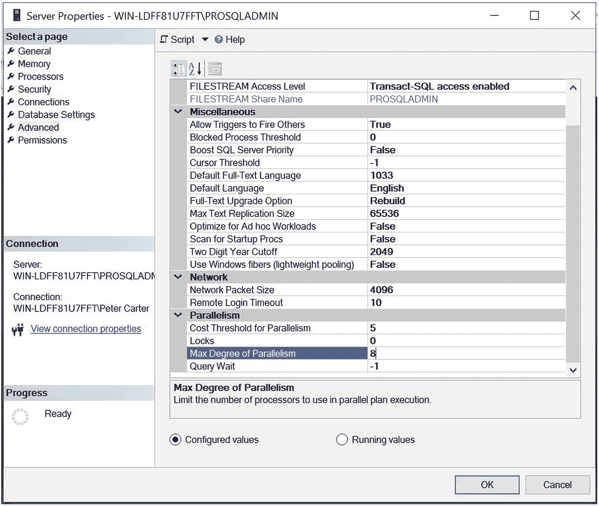
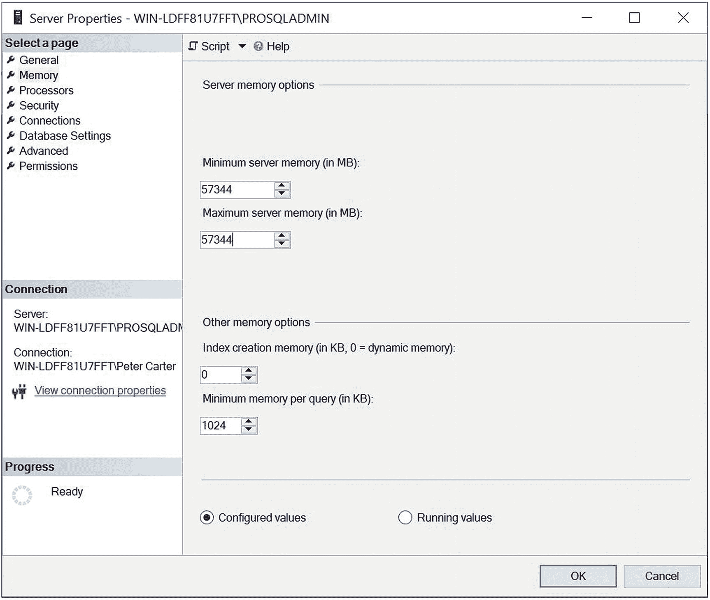
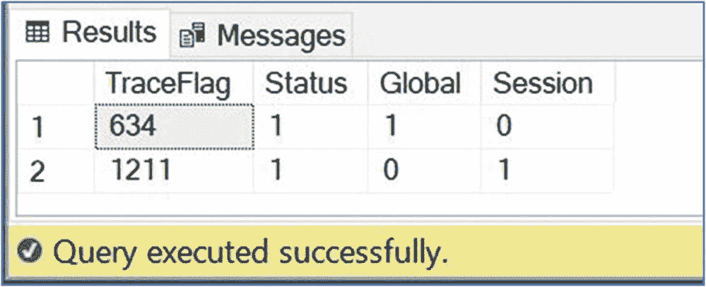
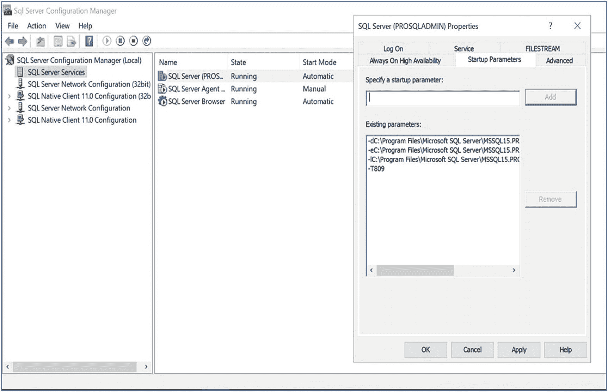
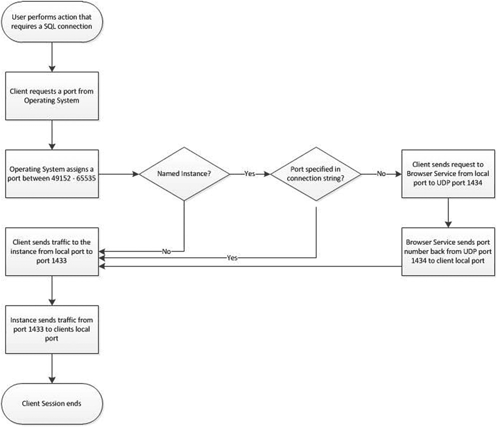
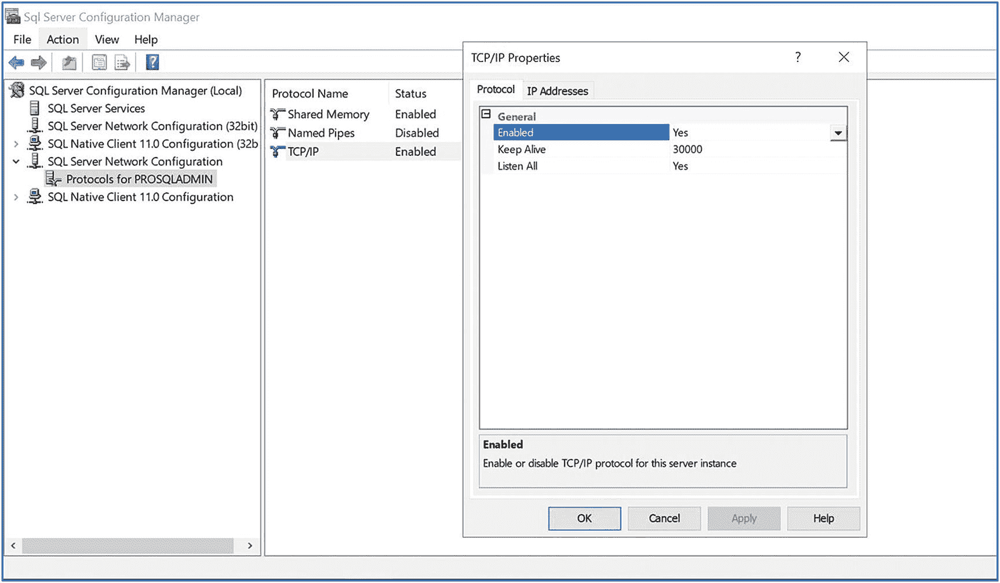
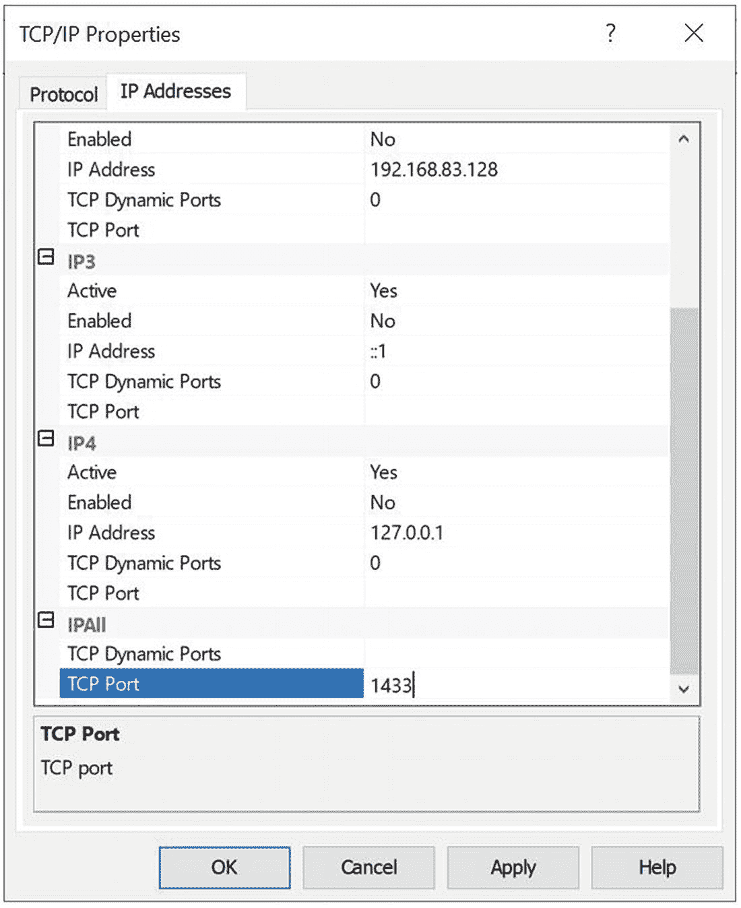

# 5. 配置实例

SQL Server 实例的安装和配置在安装成功完成时并未结束。无论是在数据库引擎内部还是外部（使用诸如 SQL Server 配置管理器之类的工具），你都需要考虑许多其他因素。在本章中，我们将讨论许多最重要的实例级配置选项，包括 SQL Server 新的缓冲池扩展技术以及系统数据库的重要配置选择。我们还将了解如何配置你的实例以使其与防火墙协同工作。

### 实例配置

在实例层面，有无数可以配置的设置和标志。在以下部分中，我们将探讨使用诸如 `sp_configure`、`sys.configurations`、`DBCC TRACEON` 和 `ALTER SERVER` 等工具来查看和配置这些设置。


#### 使用 sp_configure

您可以使用系统存储过程 `sp_configure` 更改许多可在实例级别配置的设置。您可以使用 `sp_configure` 过程来查看和更改实例级设置。本书的许多示例都将使用此过程，因此理解其工作原理非常重要。如果过程是批处理中的第一条语句，则可以在没有 `EXEC` 关键字的情况下运行它；但如果前面有任何语句，则必须使用 `EXEC` 关键字。如果该过程在没有参数的情况下运行，它将返回一个包含五列的结果集。这些列的含义详见表 5-1。

表 5-1

sp_configure 返回的结果集

| 列 | 描述 |
| --- | --- |
| `Name` | 实例级设置的名称。 |
| `Minimum` | 该设置可接受的最小值。 |
| `Maximum` | 该设置可接受的最大值。 |
| `Config_value` | 为此设置配置的值。如果此值与 `Run_value` 列中的值不同，则需要重新启动或重新配置实例才能使此配置生效。 |
| `Run_value` | 该设置当前正在使用的值。 |

如果您希望使用 `sp_configure` 更改某个设置的值（而不仅仅是查看），则必须在运行该过程时传入两个参数。第一个参数名为 `configname`，其数据类型定义为 `VARCHAR(35)`。此参数用于传递您希望更改的设置的名称。第二个参数名为 `configvalue`，定义为整数。此参数用于传递该设置的新值。使用 `sp_configure` 更改实例级设置后，它不会立即生效。要激活该设置，您需要重新启动数据库引擎服务或重新配置实例。

重新配置实例有两个选项。第一个是名为 `RECONFIGURE` 的命令。第二个是名为 `RECONFIGURE WITH OVERRIDE` 的命令。只要新配置的值被 SQL Server 视为“合理”，`RECONFIGURE` 命令就会更改设置的运行值。例如，当实例上存在包含数据库时，`RECONFIGURE` 将不允许您禁用它们。但是，如果您使用 `RECONFIGURE WITH OVERRIDE` 命令，则将允许此操作，即使您的包含数据库将无法再访问。即便如此，SQL Server 仍然会运行检查以确保您输入的值在设置的 `Min` 和 `Max` 值之间。它也不允许您执行任何会导致严重错误的操作。例如，它不会允许您将“最小服务器内存 (MB)”设置配置为高于“最大服务器内存 (MB)”设置，因为这会导致数据库引擎出现致命错误。

在 SQL Server 2019 中，首次运行不带参数的 `sp_configure` 存储过程时，它将返回 18 行。这些行包含实例的基本配置选项。其中一个选项称为“显示高级选项”。如果您打开此选项然后重新配置实例，如代码清单 5-1 所示，那么当您再次运行该过程时，将显示另外 52 个高级设置。如果您在打开“显示高级选项”设置之前尝试更改某个高级选项的值，则命令将失败。

```
EXEC sp_configure 'show advanced options', 1
RECONFIGURE
Listing 5-1
显示高级选项
```

作为使用 sp_configure 查看这些设置的替代方法，您也可以通过查询 `sys.configurations` 来检索相同的信息。如果使用 `sys.configurations` 返回信息，则会返回两个额外的列。其中一列称为 `is_dynamic`，它指定该选项是否可以使用 `RECONFIGURE` 命令配置 (1)，或者是否需要重新启动实例 (0)。另一列称为 `is_Advanced`，它指示该设置是否无需打开“显示高级选项”即可配置。

#### 处理器和内存配置

配置实例时，首要考虑事项之一应是处理器和内存资源的配置。对于处理器，您应主要考虑两个方面：处理器亲和性以及 MAXDOP（最大并行度）。

##### 处理器亲和性

默认情况下，您的实例将能够使用服务器中的所有处理器核心。（物理处理器，也称为插槽或 CPU，由多个核心组成，每个核心都是独立的处理器）。但是，如果您使用处理器亲和性，则特定的处理器核心将与您的实例对齐，这些将是该实例唯一可以访问的核心。通过这种方式限制您的实例主要有两个原因。第一个原因是您在同一服务器上运行多个实例。在这种配置下，您可能会发现实例竞争相同的处理器资源并因此相互阻塞。处理器亲和性通过一个名为 `affinity mask` 的设置来控制。

假设您有一台具有四个物理处理器的服务器，每个处理器有两个核心。为本例目的假设超线程已关闭，则 SQL Server 总共有八个可用核心。如果您在服务器上有四个实例，那么为了避免实例竞争资源，您可以将核心 0 和 1 与实例 1 对齐，核心 2 和 3 与实例 2 对齐，核心 4 和 5 与实例 3 对齐，核心 6 和 7 与实例 4 对齐。当然，这样做的缺点是，如果一个实例处于空闲状态，CPU 资源将无法得到利用。

如果您在服务器上运行其他服务，例如 SQL Server Integration Services (SSIS)，您可能希望保留一个核心供 Windows 和其他应用程序使用，任何实例都不能使用它。在这种情况下，您可能已经发现实例 4 比其他实例使用的处理器资源少。例如，它可能是一个专用于 ETL（提取、转换和加载）的实例，主要用于托管 SSIS 目录。在这种情况下，您可能只将实例 4 与核心 6 对齐。这将把核心 7 留作其他用途。此设计如图 5-1 所示。

#### 注意

SSIS 已集成到数据库引擎中。但是，当 SSIS 包运行时，它们在单独的 DTSHost 进程中运行，因此不与实例的处理器和内存配置对齐。



图 5-1

处理器亲和性图示

使用处理器亲和性时，为了获得最佳性能，将实例与同一 NUMA（非统一内存访问）节点上的核心对齐至关重要。这是因为如果处理器需要远程访问不同 NUMA 节点的内存，它需要通过互连进行，这比访问本地 NUMA 节点要慢得多。在图 5-1 所示的示例中，如果我们将实例 1 与核心 0 和 7 对齐，那么我们将跨越 NUMA 边界，性能将会受损。


#### 注意事项

虽然对于 SQL Server 不推荐，但一些虚拟环境使用一种称为 `over-subscribed processors` 的技术。这意味着分配给客户的内核数多于物理主机上实际存在的内核数。在这种情况下，你不应使用处理器亲和性，因为 NUMA 边界将不会被尊重。

减少争用的亲和性掩码同样适用于集群环境。想象一个主动/主动配置的双节点集群。集群的每个节点托管一个实例。对于你的业务而言，确保在发生故障转移时具有一致的性能可能很重要。在这种情况下，假设你的每个节点有八个核心，那么在节点 1 上，你可以将实例 1 配置为使用核心 0、1、2 和 3。在节点 2 上，你可以将实例 2 配置为使用核心 4、5、6 和 7。现在，在发生故障转移时，你的实例将继续使用相同的处理器核心，而不会争夺资源。

使用处理器亲和性的第二个原因是为了避免操作系统级别线程在处理器之间移动带来的开销。当你的实例处于高负载时，通过将 SQL Server 线程与特定核心对齐，你可能会看到性能提升。在这种情况下，可以将标准 SQL Server 任务与 SQL Server IO 相关任务分开。

想象你有一台单处理器服务器，它有两个核心。超线程已关闭，并且你安装了一个实例。你可以选择将与 IO 亲和性相关的任务（如 `Lazy Writer`）与核心 0 对齐，而将其他 SQL Server 线程与核心 1 对齐。要将 IO 任务与特定处理器对齐，你需要使用一个额外的设置，称为 `Affinity I/O Mask`。启用此设置后，会创建一个隐藏的调度程序，专门用于 `Lazy Writer`。因此，重要的是不要将亲和性掩码和 `Affinity I/O Masks` 与同一个核心对齐。否则，你将无意中造成你试图避免的争用。

### 关于 I/O 掩码的注意事项

很少需要使用 `Affinity I/O Mask`。要对齐来自多个实例的工作负载，`Affinity Mask` 就足够了。它通常只适用于在 32 位系统上运行的非常大的数据库。对于具有更大内存容量的 64 位系统，IO 抖动较少；因此上下文切换也较少。

`Affinity Mask` 和 `Affinity I/O Mask` 都可以通过 SQL Server Management Studio 中的 GUI 进行设置，方法是在实例属性对话框中选择“处理器”选项卡，如图 5-2 所示。



图 5-2
“处理器”选项卡

处理器亲和性基于位图工作。因此，如果你希望使用 `sp_configure` 来设置处理器亲和性，那么你首先需要计算位图值的整数表示。这变得更加复杂，因为 `INT` 数据类型是 32 位有符号整数，意味着某些表示将是负数。分配给每个处理器的值列于表 5-2。

表 5-2
处理器亲和性位图

| 处理器编号 | 位掩码 | 有符号整数表示 |
| --- | --- | --- |
| 0 | 0000 0000 0000 0000 0000 0000 0000 0001 | 1 |
| 1 | 0000 0000 0000 0000 0000 0000 0000 0010 | 2 |
| 2 | 0000 0000 0000 0000 0000 0000 0000 0100 | 4 |
| 3 | 0000 0000 0000 0000 0000 0000 0000 1000 | 8 |
| 4 | 0000 0000 0000 0000 0000 0000 0001 0000 | 16 |
| 5 | 0000 0000 0000 0000 0000 0000 0010 0000 | 32 |
| 6 | 0000 0000 0000 0000 0000 0000 0100 0000 | 64 |
| 7 | 0000 0000 0000 0000 0000 0000 1000 0000 | 128 |
| 8 | 0000 0000 0000 0000 0000 0001 0000 0000 | 256 |
| 9 | 0000 0000 0000 0000 0000 0010 0000 0000 | 512 |
| 10 | 0000 0000 0000 0000 0000 0100 0000 0000 | 1024 |
| 11 | 0000 0000 0000 0000 0000 1000 0000 0000 | 2028 |
| 12 | 0000 0000 0000 0000 0001 0000 0000 0000 | 4096 |
| 13 | 0000 0000 0000 0000 0010 0000 0000 0000 | 8192 |
| 14 | 0000 0000 0000 0000 0100 0000 0000 0000 | 16384 |
| 15 | 0000 0000 0000 0000 1000 0000 0000 0000 | 32768 |
| 16 | 0000 0000 0000 0001 0000 0000 0000 0000 | 65536 |
| 17 | 0000 0000 0000 0010 0000 0000 0000 0000 | 131072 |
| 18 | 0000 0000 0000 0100 0000 0000 0000 0000 | 262144 |
| 19 | 0000 0000 0000 1000 0000 0000 0000 0000 | 524288 |
| 20 | 0000 0000 0001 0000 0000 0000 0000 0000 | 1048576 |
| 21 | 0000 0000 0010 0000 0000 0000 0000 0000 | 2097152 |
| 22 | 0000 0000 0100 0000 0000 0000 0000 0000 | 4194304 |
| 23 | 0000 0000 1000 0000 0000 0000 0000 0000 | 8388608 |
| 24 | 0000 0001 0000 0000 0000 0000 0000 0000 | 16777216 |
| 25 | 0000 0010 0000 0000 0000 0000 0000 0000 | 33554432 |
| 26 | 0000 0100 0000 0000 0000 0000 0000 0000 | 67108864 |
| 27 | 0000 1000 0000 0000 0000 0000 0000 0000 | 134217728 |
| 28 | 0001 0000 0000 0000 0000 0000 0000 0000 | 268435456 |
| 29 | 0010 0000 0000 0000 0000 0000 0000 0000 | 536870912 |
| 30 | 0100 0000 0000 0000 0000 0000 0000 0000 | 1073741824 |
| 31 | 1000 0000 0000 0000 0000 0000 0000 0000 | -2147483648 |

#### 提示

互联网上有很多免费的计算器可以帮助你将二进制转换为有符号整数。

在 32 核服务器上，处理器亲和性有 2.631308369336935e+35 种可能的组合，但表 5-3 中包含了一些示例。

表 5-3
亲和性掩码示例

| 对齐的处理器 | 位掩码 | 有符号整数表示 |
| --- | --- | --- |
| 0 和 1 | 0000 0000 0000 0000 0000 0000 0000 0011 | 3 |
| 0, 1, 2, 和 3 | 0000 0000 0000 0000 0000 0000 0000 1111 | 15 |
| 8 和 9 | 0000 0000 0000 0000 0000 0011 0000 0000 | 768 |
| 8, 9, 10, 和 11 | 0000 0000 0000 0000 0000 1111 0000 0000 | 3840 |
| 30 和 31 | 1100 0000 0000 0000 0000 0000 0000 0000 | -1073741824 |
| 28, 29, 30, 和 31 | 1111 0000 0000 0000 0000 0000 0000 0000 | -268435456 |

由于亲和性掩码的性质以及整数数据类型的最大范围是 2³²，如果你的服务器有 33 到 64 个处理器，那么你还需要设置 `Affinity64 Mask` 和 `Affinity64 I/O Mask` 设置。这些将为额外的处理器提供掩码。

本节讨论的所有设置都可以使用 `sp_configure` 进行配置。清单 5-2 中的示例演示了将实例与核心 0 到 3 对齐。

```
EXEC sp_configure 'affinity mask', 15
RECONFIGURE
```
清单 5-2
设置处理器亲和性

即使使用 64 位掩码，使用此方法对齐前 64 个核心仍然存在限制，而 SQL Server 最多支持 256 个逻辑处理器。因此，新版本的 SQL Server 引入了一种增强的设置处理器亲和性的方法。这是通过一个名为 `ALTER SERVER CONFIGURATION` 的命令实现的。清单 5-3 演示了使用此命令的两种方式。第一种以我们迄今为止看到的方式将实例与特定处理器对齐。在此示例中，对齐的是 CPU 0、1、2 和 3。第二种将实例与两个 NUMA 节点内的所有处理器对齐，在本例中是节点 0 和 4。正如使用 `sp_configure` 进行更改一样，使用 `ALTER SERVER CONFIGURATION` 进行的更改将反映在 `sys.configurations` 中。

```
ALTER SERVER CONFIGURATION
SET PROCESS AFFINITY CPU=0 TO 3
ALTER SERVER CONFIGURATION
SET PROCESS AFFINITY NUMANODE=0, 4
```
清单 5-3
`ALTER SERVER CONFIGURATION`


### 最大并行度 (MAXDOP)

**最大并行度 (MAXDOP)** 将设置为每个独立查询执行可用的最大核心数。这个想法初听起来可能有些反直觉。你肯定希望每个查询都尽可能地并行化吧？嗯，情况并非总是如此。

虽然一些数据仓库查询可能从高并行度中受益，但许多联机事务处理 (OLTP) 工作负载在较低的并行度下可能表现更好。这是因为如果一个查询在多个并行线程上执行，而有一个线程比其他线程花费更长的时间才能完成，那么其他线程可能需要等待最后一个线程结束，以便同步它们的数据流。如果发生这种情况，你很可能会看到大量的等待，且等待类型为 `CXPACKET`。

在许多 OLTP 系统中，查询优化器选择高并行度实际上表明存在索引缺失或高度碎片化、统计信息过时等问题。解决这些问题带来的性能提升，远比以高并行度运行查询要大得多。

对于支持繁重数据仓库工作负载的实例，应测试并相应设置不同的 `MAXDOP` 配置。需要理解的是，如果少数查询与实例的大部分工作负载相比受益于不同的设置，也可以通过使用查询提示在查询级别设置 `MAXDOP`。然而，在绝大多数情况下，实例级别的 `MAXDOP` 设置应配置为以下三个值中的最低值：

*   `8`
*   实例可用的核心数 (`MAXDOP` 的默认值)
*   一个 NUMA 节点内的核心数

`MAXDOP` 的默认值是 `0`，这意味着查询仅受实例可见的核心数限制。你可以通过图形用户界面 (GUI) 配置 `MAXDOP`，方法是在服务器属性的“高级”选项卡上配置 `最大并行度` 设置。图 5-3 展示了此设置被配置为 `8`。



图 5-3
高级选项卡

你也可以使用 `sp_configure` 配置 `MAXDOP`。代码清单 5-4 演示了使用 `sp_configure` 将 `MAXDOP` 设置为 `8`。

```
EXEC sys.sp_configure 'max degree of parallelism', 8
RECONFIGURE
```

代码清单 5-4
使用 sp_configure 配置 MAXDOP

降低 `MAXDOP` 设置的一个辅助措施是提高查询优化器选择并行计划而非串行计划的阈值。此阈值的默认设置是估计串行执行时间为 5 秒，但你可以将其配置为 0 到 32767 秒之间的任何值。在许多环境中，一个实际的限制是大约 30 秒，但这当然是具体工作负载相关的，并且应该始终进行测试。然而，如果你将 `MAXDOP` 配置为 `1`，或者实例只有一个核心可用，`并行度的成本阈值` 选项将被忽略。代码清单 5-5 中的脚本将 `并行度的成本阈值` 增加到 `10` 秒。

```
EXEC sp_configure 'cost threshold for parallelism', 10
RECONFIGURE
```

代码清单 5-5
配置并行度的成本阈值

### 最小和最大服务器内存

`最小服务器内存 (MB)` 和 `最大服务器内存 (MB)` 设置用于控制 SQL Server 内存池可用的内存量。内存池包含许多组件。其中一些最大的组件详见表 5-4。

表 5-4
SQL Server 内存池

| 组件 | 描述 |
| --- | --- |
| 缓冲池 | 缓冲池在数据和索引页从磁盘读取或写入磁盘之前和之后存储它们。即使你的查询所需的页面不在缓存中，它们也会先写入缓冲池，然后从内存中检索，而不是直接从磁盘写入。 |
| 过程缓存 | 过程缓存包含执行计划，不仅用于存储过程，还用于即席查询、预 pared 语句和触发器。当 SQL Server 开始优化查询时，它首先检查此缓存以查看是否存在合适的计划。 |
| 日志缓存 | 日志缓存存储日志记录，然后将它们写入事务日志。 |
| 日志池 | 一个哈希表，允许高可用性/灾难恢复 (HA/DR) 和数据分发技术（如 AlwaysOn、镜像和复制）快速访问所需的日志记录。 |
| CLR | CLR 指在实例内部使用的 .NET 代码。在旧版本的 SQL Server 中，CLR 位于主内存池之外，因为内存池仅处理单个 8KB 页面分配。从 SQL Server 2012 开始，内存池现在同时处理单页和多页分配，因此 CLR 已被纳入其中。 |

在许多环境中，你可能希望为 `最小` 和 `最大` 服务器内存提供相同的值。这将避免 SQL Server 动态管理其保留内存量的开销。

但是，如果你有多个实例，动态内存管理可能是有益的，这样在任何给定时间工作负载最重的实例可以消耗最多的资源。如果你的实例托管在主动/主动集群上，你必须额外考虑。我曾见过一个例子，客户启用了 `锁定内存页`，然后像配置独立服务器一样配置了每个节点上实例的最小和最大内存。在故障转移发生时，剩余节点崩溃了，因为没有足够的 RAM 来支持一台服务器上所有实例的内存需求。

无论你的环境如何配置，你总是需要为操作系统留出足够的内存。假设你只有一个实例，并且服务器上没有运行其他应用程序（如 SSIS 包），你通常应将 `最小` 和 `最大` 内存设置配置为以下两者中的较低值：

*   RAM - 2GB
*   (RAM / 8) ∗ 7

如果你有多个实例，你当然会根据它们的需求，在这些实例之间适当分配这个数字。如果你在服务器上运行其他应用程序，那么你还必须考虑它们的内存需求，并将其加入操作系统需求中。

`最小服务器内存 (MB)` 和 `最大服务器内存 (MB)` 都可以通过使用服务器属性对话框中的“内存”选项卡进行配置，如图 5-4 所示。



图 5-4
内存选项卡

你也可以通过 T-SQL 使用 `sp_configure` 存储过程配置这两个设置。代码清单 5-6 演示了这一点。

```
DECLARE @MemOption1 INT = (SELECT physical_memory_kb/1024 - 2048 FROM sys.dm_os_sys_info)
DECLARE @MemOption2 INT = (SELECT ((physical_Memory_kb/1024)/8) * 7 FROM sys.dm_os_sys_info)
IF @MemOption1 <= 0
BEGIN
    EXEC sys.sp_configure 'min server memory (MB)', @MemOption2
    EXEC sys.sp_configure 'max server memory (MB)', @MemOption2
    RECONFIGURE
END
ELSE IF @MemOption2 < @MemOption1
BEGIN
    EXEC sys.sp_configure 'min server memory (MB)', @MemOption2
    EXEC sys.sp_configure 'max server memory (MB)', @MemOption2
    RECONFIGURE
END
ELSE
BEGIN
    EXEC sys.sp_configure 'min server memory (MB)', @MemOption1
    EXEC sys.sp_configure 'max server memory (MB)', @MemOption1
    RECONFIGURE
END
```

代码清单 5-6
配置最小和最大服务器内存


#### 跟踪标志

跟踪标志是 SQL Server 中的开关，可用于开启或关闭特定功能。在实例范围内，它们可以在会话级别进行设置，也可以通过名为 `DBCC TRACEON` 的 DBCC 命令全局应用于实例。并非所有跟踪标志都能在会话级别设置，这取决于其性质。跟踪标志 634 就是一个例子。设置此标志会关闭负责定期压缩列存储索引中行组的后台线程。显然，这并不适用于特定的会话。代码清单 5-7 使用 `DBCC TRACEON` 全局设置跟踪标志 634。它还仅为当前会话开启了 1211。跟踪标志 1211 会基于内存压力或锁的数量禁用锁升级。然后，脚本使用 `DBCC TRACESTATUS` 显示标志的状态，最后使用 `DBCC TRACEOFF` 将行为切换回默认值。可以看到，要指定全局作用域，我们使用参数 `-1`。默认是在会话级别设置标志。

```
DBCC TRACEON(634, -1)
DBCC TRACEON(1211)
DBCC TRACESTATUS
DBCC TRACEOFF(634, -1)
DBCC TRACEOFF(1211)
Listing 5-7
使用 DBCC TRACEON 设置跟踪标志
```

#### 注意

此处使用跟踪标志 1211 仅为演示 `DBCC TRACEON` 的目的。然而，它可能导致过多的锁，应极其谨慎地使用。它甚至可能因为分配锁的内存不足而导致 SQL Server 抛出错误。

图 5-5 显示了运行此脚本后产生的结果屏幕，假设当前没有其他跟踪标志偏离其默认设置。`DBCC TRACEON` 和 `DBCC TRACEOFF` 命令没有结果显示。但是，消息窗口将显示执行完成消息或通知您任何错误。



图 5-5：`DBCC TRACESTATUS` 结果

即使使用全局作用域，使用 `DBCC TRACEON` 的局限性在于设置是临时的，实例重启后不会持久化。因此，如果您希望对实例进行永久性的配置更改，则必须在 SQL Server 服务上使用 `-T` 启动参数。

启动参数可以在 SQL Server 配置管理器中配置。展开左侧窗口中的“服务”将显示服务器上所有与 SQL Server 相关的服务列表。进入数据库引擎服务的属性并选择“启动参数”选项卡，即可添加或删除启动参数。图 5-6 说明了如何设置跟踪标志 809。（请参考本章的“混合缓冲池”部分以了解此跟踪标志的作用。）



图 5-6：启动参数

如果您的实例运行在 Windows Server Core 上，或者您想在基于 GUI 的服务器上编写配置脚本，那么可以通过运行代码清单 5-8 中的 PowerShell 脚本来实现相同的结果。此脚本允许您在顶部的两个变量中指定要配置的实例名称和跟踪标志。如果您希望创建可重用的脚本，这些也可以参数化。同样，该脚本可以添加到我们在第 3 章创建的自动安装脚本中。

PowerShell 脚本通过确定启动参数的注册表路径，然后计算已有的参数数量来工作。计算参数数量可以确定序列中的下一个参数编号。然后，它添加新参数，并指定所需的跟踪标志。

```
##### 定义初始变量
$InstanceName = "PROSQLADMINCORE"
$TraceFlag = "809"
##### 配置要插入到注册表路径中的完整服务名称
$Instance = "MSSQL12.$InstanceName"
##### 创建完整的注册表路径
$RegistryPath = "HKLM:\SOFTWARE\Microsoft\Microsoft SQL Server\MSSQL12.$InstanceName\MSSQLServer\Parameters"
##### 从注册表路径收集所有属性
$Properties = Get-ItemProperty $RegistryPath
##### 计算已存在的 SQLArg 属性的数量，以便确定序列中的下一个编号
$Arguments = $Properties.psobject.properties | ?{$_.Name -like 'SQLArg*'} | select Name, Value
##### 根据序列中的下一个参数编号创建新参数的名称
$NewArgument = "SQLArg"+($Arguments.Count)
##### 构造参数的完整值
$FullTraceFlag = "-T$TraceFlag"
##### 设置跟踪标志
Set-ItemProperty -Path $RegistryPath -Name $NewArgument -Value $FullTraceFlag
Listing 5-8
在 Windows Server Core 上配置跟踪标志
```

许多跟踪标志可以指定为启动参数，其中绝大多数仅在非常特定的情况下才有帮助。然而，有少数几个脱颖而出，具有更广泛使用的潜力。这些跟踪标志将在以下部分详细说明。

#### 注意

在旧版本的 SQL Server 中，经常配置的两个跟踪标志是 T1117 和 T1118，它们分别导致文件组中的所有文件以相同速率增长，以及导致所有区（即使是小表的区）都是统一区。然而，这些功能现在已成为有文档记录的、数据库级别的选项。因此，T1117 和 T1118 不再有效，不应使用。

##### 跟踪标志 3042

当您在 SQL Server 中使用备份压缩执行备份时，会使用一种预分配算法为备份文件分配数据库大小的一定百分比。与动态按需增长备份文件大小相比，这为您提供了性能优势。但另一方面，如果您需要在备份卷上保留磁盘空间，仅使用所需的最小空间量，那么您可以使用跟踪标志 3042 来关闭此行为，并按需增长文件。

##### 跟踪标志 3226

默认情况下，每次执行备份时，SQL Server 日志中都会记录一条消息。但是，如果您执行频繁的日志备份，这很快就会在日志中产生大量“噪音”，使得故障排除问题变得更加困难和耗时。如果是这种情况，那么您可以开启跟踪标志 3226。这将导致成功的备份消息在日志中被抑制，从而产生更小、更易于管理的日志。另一种避免噪音的方法是创建一个使用 `sys.xp_readerrorlog` 系统存储过程读取日志的脚本。您可以将结果写入表并过滤出“感兴趣的”事件。

##### 跟踪标志 3625

SQL Server 对元数据的可见性实施严格控制。用户只能查看他们拥有的对象或已明确授予查看元数据权限的对象的元数据。然而，这种保护方法仍然有缺陷，熟练的攻击者仍然可以获取信息。他们实现这一点的一种方式是通过操纵查询中的优先级顺序以产生错误消息。

为了减轻这种风险，您可以设置跟踪标志 3625。此跟踪标志将通过用星号屏蔽某些数据来限制错误消息中可见的元数据量。然而，这种防御策略的缺点是错误消息变得不那么有意义且更难理解。这可能会使故障排除问题变得更加困难。


### 端口与防火墙

在现代企业网络拓扑中，你的 SQL Server 实例很可能需要通过至少两个防火墙进行通信。其中一个将是硬件防火墙，另一个将是 Windows 防火墙，也称为本地防火墙。为了让你的实例能够与其他接口（无论是网络上的应用程序还是其他实例）通信，同时保持防火墙提供的安全性，就需要开放端口，以便 SQL Server 可以通过这些端口进行通信。

#### 通信过程

为了理解需要开放哪些端口来允许 SQL Server 流量，你首先必须理解客户端如何与 SQL Server 通信。图 5-7 展示了 TCP/IP 连接的过程流。此示例假设实例正在监听端口 `1433`——这将在本章后面详细讨论。它还假设客户端运行在 Windows Vista/Windows Server 2008 或更高版本上。



图 5-7 通信过程流

如果你希望客户端通过命名管道而非 TCP/IP 访问实例，那么 SQL Server 将通过端口 `445` 进行通信。这与文件和打印机共享使用的端口相同。

#### SQL Server 所需的端口

如果你安装的是 SQL Server 的默认实例，那么安装程序将自动分配端口 `1433`，这是 IANA（互联网号码分配机构）为 SQL Server 注册的端口。然而，许多 DBA 出于增强安全性的考虑，会选择更改此端口号。攻击者会知道你很可能在端口 `1433` 上运行实例，因此知道要攻击哪个端口。在较小的环境中，除非你对网络的安全性有信心，否则使用非标准端口号可能是增加一层混淆的好主意。然而，在大型企业中，你需要考虑对运营可支持性的影响。例如，如果每个实例都有不同的端口号，你将需要一种记录并能在浏览器服务故障时快速获取给定实例端口号的方法。在允许多个命名实例共存于每台服务器的环境中，这将不那么令人担忧，因为你已经拥有了用于记录这些端口号的清单工具。

#### 注

IANA，即互联网号码分配机构，负责协调互联网协议资源的分配，如 IP 地址、域名、协议参数和网络服务的端口号。其网站是 `www.internetassignednumbersauthority.org/`。

如果你安装的是 SQL Server 的命名实例，那么安装程序将配置该实例使用动态端口。当配置了动态端口时，每次实例启动时，它都会向操作系统请求一个端口号。操作系统随后会从动态范围中分配一个随机的可用端口，假设你运行的是 Windows Server 2008 或更高版本，该范围是 `49152` 到 `65535`。在早期版本的 Windows 中，动态端口范围是 `1024` 到 `5000`，但微软在 Windows Vista 和 Windows Server 2008 中更改了此范围以符合 IANA 规定。

如果你的实例配置为使用动态端口，那么配置防火墙可能具有挑战性。在 Windows 防火墙级别，可以将特定服务配置为在任何端口上通信，但这在硬件防火墙级别可能难以复制。或者，你需要双向保持整个动态端口范围开放。因此，我建议将实例配置为使用特定端口。

重要的是要记住，SQL Server 为各种功能使用许多其他端口。数据库引擎可能需要的完整端口集列在表 5-5 中。如果你安装了数据库引擎之外的功能，如 SSAS 或 SSRS，则将需要额外的端口。如果你计划在实例中使用其他服务，如用于加密的 IPSec、用于分布式事务的 `MSDTC`（Microsoft 分布式事务协调器）或用于监控的 `SCOM`（System Center Operations Manager），也将有额外的要求。

#### 表 5-5：数据库引擎所需的端口

| 功能 | 端口 |
| --- | --- |
| 浏览器服务 | `UDP 1433`。 |
| 通过 TCP/IP 的实例 | `TCP 1433`，动态或静态配置。 |
| 通过命名管道的实例 | `TCP 445`。 |
| DAC（专用管理员连接） | `TCP 1434`。如果 `TCP 1434` 已被占用，端口号将在实例启动时打印到 SQL Server 日志中。 |
| Service Broker | `TCP 4022` 或按配置设定。 |
| AlwaysOn 可用性组 | `TCP 5022` 或按配置设定。 |
| 带 Web 同步的合并复制 | `TCP 21`、`TCP 80`、`UDP 137`、`UDP 138`、`TCP 139`、`TCP 445`。 |
| T-SQL 调试器 | `TCP 135`。 |

#### 配置实例将监听的端口

如本章前面所述，如果你有一个命名实例，那么在配置防火墙之前，你可能希望为该实例配置一个静态端口。该端口可以在 SQL Server 配置管理器中 TCP/IP 协议的“TCP/IP 属性”对话框内配置。要导航到此对话框，请在 SQL Server 配置管理器的左侧窗格中展开 `SQL Server Network Configuration` ➤ `Protocols for *INSTANCENAME*`（其中 `*INSTANCENAME*` 是你的实例名称）。在右侧窗格中双击 `TCP/IP` 将显示该对话框。

在“协议”选项卡上，你会注意到一个名为 `Listen All` 的设置，其默认值为“是”，如图 5-8 所示。此设置的意义稍后会变得清晰。



图 5-8 “协议”选项卡

在“IP 地址”选项卡上，你会注意到有多个 IP 地址的配置详细信息。但是，由于 `Listen All` 设置为“是”，SQL Server 将忽略所有这些配置。相反，它将只查看对话框最底部为 `IP All` 指定的设置。`TCP Dynamic Ports` 字段将显示操作系统分配的随机端口，而 `TCP Port` 字段将为空，如图 5-9 所示。要分配静态端口号，我们需要反转此设置。我们需要清空 `TCP Dynamic Ports` 字段，并在 `TCP Port` 字段中填入我们选择的端口号 `1433`。SQL Server 服务需要重启后此更改才能生效。



图 5-9 “IP 地址”选项卡


#### 提示

请记住，默认实例默认情况下将使用端口 `1433`。因此，如果服务器上已经存在一个默认实例，那么在创建命名实例时，你必须使用一个不同的端口。

我们可以通过运行清单 5-9 中的 PowerShell 脚本来实现相同的结果。该脚本顶部有两个变量，你需要插入你的实例名称和你想要分配的端口号。这些也可以被参数化，以创建一个可复用的脚本。该脚本加载了相关的 SMO 程序集。然后，它创建一个新的 SMO 对象并连接到该对象的 TCP 属性以配置端口。该脚本必须以管理员身份运行。

```powershell
##### Initialize variables
$Instance = "PROSQLADMIN"
$Port = "1433"
##### Load SMO Wmi.ManagedComputer assembly
[System.Reflection.Assembly]::LoadWithPartialName("Microsoft.SqlServer.SqlWmiManagement") | out-null
##### Create a new smo object
$m = New-Object ('Microsoft.SqlServer.Management.Smo.Wmi.ManagedComputer')
#Disable dynamic ports
$m.ServerInstances[$Instance].ServerProtocols['Tcp'].IPAddresses['IPAll'].IPAddressProperties['TcpDynamicPorts'].Value = ""
##### Set static port
$m.ServerInstances[$Instance].ServerProtocols['Tcp'].IPAddresses['IPAll'].IPAddressProperties['TcpPort'].Value = "$Port"
##### Reconfigure TCP
$m.ServerInstances[$Instance].ServerProtocols['Tcp'].Alter()
```

清单 5-9: 分配静态端口

### 系统数据库

SQL Server 维护五个系统数据库，每个数据库对于实例的高效运行都至关重要。以下各节描述了这些数据库中的每一个，并详细说明了配置它们时的任何特殊注意事项。

#### mssqlsystemresource (Resource)

虽然被称为 Resource，但 Resource 数据库的全名是 `mssqlsystemresource`。它是用于存储出现在每个数据库的 `sys` 架构中的系统对象的物理存储库。它是只读的，除了在 Microsoft 的指导下，否则绝不应修改。它在 Management Studio 中不可见，如果你尝试从查询窗口连接它，将会失败，除非你处于单用户模式。配置 Resource 没有需要考虑的事项。

#### MSDB

`MSDB` 被用作许多 SQL Server 功能的元数据存储库，包括服务器代理、备份/还原、数据库邮件、日志传送、策略等。尽管这显然是一个关键且有用的数据库，但没有特定的配置选项需要考虑。话虽如此，在一个由大量数据库组成且所有数据库都有频繁日志备份的非常大的实例中，该数据库可能会变得非常大。这意味着你将需要清理旧数据，有时还需要考虑索引策略。可以使用 `sp_deletebackuphistory` 存储过程或维护计划中的历史记录清理任务来清理历史备份数据。自动例行维护任务将在第 22 章中更详细地讨论。

#### Master

`Master` 是系统数据库，包含实例级对象的元数据，例如登录名、链接服务器、TCP 终端点以及用于实现加密的主密钥和证书。`Master` 数据库最大的考虑因素是备份策略。虽然它不需要像用户数据库那样频繁备份，但你应始终确保你有一个当前的备份。至少，在创建或更改登录名、链接服务器和系统配置后；创建或更改密钥和证书后；或者在创建或删除用户数据库后，应该备份数据库。许多人选择每周对 `Master` 进行一次完整备份的计划，但这将取决于你的操作要求，例如你创建新用户的频率。

#### 注意

登录名和用户将在第 9 章讨论，备份将在第 15 章讨论，密钥和证书将在第 10 章讨论。

虽然技术上可行，但将用户对象存储在 `Master` 数据库中被认为是不好的做法。我见过客户为需要由实例上所有数据库共享的存储过程而这样做，但它增加了复杂性，因为他们分散了用户对象的存储，同时也增加了必须备份 `Master` 的频率。

#### 提示

因为开发人员通常不设置默认数据库，他们最终会错误地在 `Master` 数据库中创建存储过程。你应该在代码部署过程中检查此问题。

#### Model

`Model` 用作实例上创建的所有新数据库的模板。这意味着花一些时间配置这个数据库，可以在你创建用户数据库时节省时间并减少人为错误。例如，如果你在 `Model` 数据库上将恢复模式设置为完整，那么所有新的用户数据库将自动以相同方式配置。你仍然可以选择在 `CREATE DATABASE` 语句中覆盖此设置。此外，如果你需要某个特定对象（如维护存储过程或数据库角色）存在于所有数据库中，那么在 `Model` 中创建它将意味着该对象将自动在每个新数据库中创建。`Model` 也用于在每次实例启动时创建 `TempDB`。这意味着如果你在 `Model` 数据库中创建对象，它们将在实例重启时自动添加到 `TempDB` 中。

#### 提示

当你配置或向 `Model` 添加新对象时，现有数据库不会被更新。更改将仅适用于你随后创建的新数据库。


#### TempDB

TempDB 是 SQL Server 在需要创建临时对象时使用的一个工作区。这既适用于用户创建的临时表，也适用于一个较少被提及的场景：表变量。表变量总是在 TempDB 中创建对象，但数据只有在超过大小阈时才会被溢出到磁盘。此外，SQL Server 还有很多内部原因需要创建临时对象。部分关键原因如下：

*   排序和溢出数据
*   哈希数据，例如用于联接和聚合分组
*   在线索引操作
*   结果需要在 TempDB 中排序的索引操作
*   触发器
*   DBCC 命令
*   DML 语句的 `OUTPUT` 子句
*   快照隔离、已提交读快照隔离、在 MARS 上查询等场景的行版本控制

由于 TempDB 负责如此多的任务，在高吞吐量的实例中，它很可能具有非常高的吞吐量。因此，为了确保数据层应用程序的最佳性能，它是你最应该花时间配置的系统数据库。

你首先应该考虑的是 TempDB 的大小。理想情况下，对于大型或高事务量的实例，应进行 TempDB 的容量规划。完整的容量规划讨论超出了本书范围，但理想情况下，这涉及到使用一台测试服务器，将实例上所有用户数据库扩展到通过它们自身的容量规划活动所预期的增长大小。然后，你会通过这些数据库运行代表性工作负载，并监控 TempDB 的使用情况。此外，你还应该对已扩展到预期大小的数据库执行管理任务。具体来说，这包括诸如重建索引等活动，以便你可以检查 TempDB 在这些活动期间的使用情况。有多个 `DMV`（动态管理视图）可以协助你进行此规划。其中最有用的一些在表 5-6 中描述。

表 5-6：用于 TempDB 容量规划的 DMV

| DMV | 描述 |
| --- | --- |
| `sys.dm_db_session_space_usage` | 显示为每个当前会话分配的页数。这将包括以下对象的页数：• 用户表和系统表• 用户索引和系统索引• 临时表• 临时索引• 表变量• 函数返回的表• 用于排序和哈希操作的内部对象• 用于溢出和大型对象操作的内部对象 |
| `sys.dm_db_task_space_usage` | 显示由任务分配的页数。这将包括与 `sys.dm_db_session_space_usage` 相同的对象类型的页数。 |
| `sys.dm_db_file_space_usage` | 显示数据库中所有文件的完整使用信息，包括页数和区数。要返回 TempDB 的数据，你必须在 TempDB 数据库的上下文中查询此 `DMV`，因为它也可以返回用户数据库的数据。 |
| `sys.dm_tran_version_store` | 为版本存储区中的每条记录返回一行。你可以查看原始数据或聚合它以获取大小总计。 |
| `sys.dm_tran_active_snapshot_database_transactions` | 为每一个当前可能需要访问版本存储区的事务返回一行，原因可能是隔离级别、触发器、`MARS`（多活动结果集）或在线索引操作。 |

##### 优化 TempDB

除了 TempDB 的大小，你还应仔细考虑所需的文件数量。这很重要，因为许多对象被非常快速地创建和删除，如果文件太少，你可能会遇到 `GAM` 和 `SGAM` 页的争用。另一方面，如果文件太多，开销可能会增加。这是因为 SQL Server 为了保持比例填充，会在文件组内依次为每个文件分配页。当文件数量很多时，为了确定是否应更改每个文件的分配权重，将会有额外的同步开销。

#### 提示

一些 SQL Server 专家建议不应显式删除临时表，而应由垃圾回收线程来清理。就我个人而言，虽然我理解这样做的好处，但我认为需要权衡其他考虑因素，例如代码质量，尤其是在大型、复杂的存储过程中。

当前的通用建议是，应该为实例可用的每个核心分配一个 TempDB 文件，最少两个文件，最多八个文件。只有当你明确观察到 `GAM/SGAM` 争用时，才应添加超过八个文件。这将表现为针对 TempDB 的 `PAGELATCH` 等待。你将在第 6 章找到关于如何添加文件及其大小调整的讨论。

#### 提示

`PAGEIOLATCH` 等待表明的问题与 `PAGELATCH` 等待不同。如果你看到针对 TempDB 的 `PAGEIOLATCH` 等待，这表明底层存储是瓶颈。等待类型将在第 17 章中更详细地讨论。

SQL Server 2019 引入了一项针对 TempDB 的新优化，称为内存优化 TempDB 元数据。顾名思义，此功能将负责管理 TempDB 元数据的系统表存储在非持久化的内存优化表中。

#### 提示

有关内存优化表的更多详细信息，请参阅第 7 章。

这是一项重要的新功能，通过消除 TempDB 系统页上的争用瓶颈，提高了 SQL Server 的可扩展性。然而，它并非没有代价，在实施此功能之前，你必须意识到单个事务不能跨多个数据库访问内存优化表。如果你有执行诸如自定义监控等活动的脚本，这可能会导致问题。

例如，你可能有一个如代码清单 5-10 所示的记录脚本。该脚本的第一部分创建了 `Chapter5` 数据库。`CaptureTempTableCount` 存储过程将临时表的数量插入到一个内存优化表中。假设此过程配置为通过 SQL Server Agent 每分钟运行一次（参见第 22 章）。然后，你可以在持续的容量规划工作中使用 `TempTableCount` 表。

```sql
--创建 Chapter5 数据库
CREATE DATABASE Chapter5
GO
USE Chapter5
GO
--添加一个内存优化文件组
ALTER DATABASE Chapter5 ADD FILEGROUP memopt
CONTAINS MEMORY_OPTIMIZED_DATA;
ALTER DATABASE Chapter5 ADD (
name='memopt1', filename='c:\data\memopt1'
) TO FILEGROUP memopt ;
ALTER DATABASE Chapter5
SET MEMORY_OPTIMIZED_ELEVATE_TO_SNAPSHOT = ON ;
GO
CREATE TABLE TempTableCount (
ID                INT                IDENTITY(1,1)    NOT NULL   PRIMARY KEY NONCLUSTERED,
TableCount   INT               NOT NULL,
DateTime     DateTime2         NOT NULL
) WITH(MEMORY_OPTIMIZED=ON) ;
GO
CREATE PROCEDURE CaptureTempTableCount
AS
BEGIN
BEGIN TRANSACTION
INSERT INTO TempTableCount (TableCount, DateTime)
SELECT COUNT(*) As TableCount, SYSDATETIME() AS DateTime
FROM tempdb.sys.tables t
WHERE type = 'U'
COMMIT
END
GO
--代码清单 5-10
--在 TempDB 中使用内存优化表
```

如果你测试此过程，会发现它按预期工作。但现在，让我们使用代码清单 5-11 中的命令开启内存优化 TempDB 元数据。

```sql
ALTER SERVER CONFIGURATION SET MEMORY_OPTIMIZED TEMPDB_METADATA = ON ;
--代码清单 5-11
--启用内存优化 TempDB 元数据
```

如果你再次测试该过程，会注意到它现在失败了，因为它试图访问多个数据库中的内存优化表。要解决此问题，你需要使用基于磁盘的表，而不是内存优化表。


### 缓冲池扩展

如前所述，缓冲池是 SQL Server 使用的一块内存区域，用于在页面写入磁盘前进行缓存，以及在页面从磁盘读取后进行缓存。缓冲区缓存中存在的页面有两种不同类型：干净页和脏页。一个`干净页`是指未经过任何修改的页面。干净页通常存在于缓存中是因为它们已被读取操作（例如 `SELECT` 语句）访问过。一旦进入缓存，它们可以支持所有语句。例如，一个 DML 语句可以访问干净页，修改它，然后更新其脏页标记。

脏页是已被诸如 `INSERT`、`UPDATE` 和 `DELETE` 等语句修改过的页面。这些页面需要将其关联的日志记录写入磁盘，随后，脏页本身才会被刷新到磁盘，之后它们才被视为干净页。先写入日志记录的过程被称为 WAL（预写式日志），这是 SQL Server 确保即使发生系统故障，已提交数据也不会丢失的机制。

脏页总是保留在缓存中，直到它们被刷新到磁盘。另一方面，干净页则会在缓存中尽可能长时间地保留，但当需要为要缓存的新页面腾出空间时，它们会被移除。SQL Server 基于最近最少使用策略来淘汰页面。这意味着，如果缓冲区缓存的大小设置不当，读取密集型工作负载可能很快就会开始受到内存压力的影响。

这里的问题在于，与存储相比，RAM 很昂贵，而且可能无法通过不断增加更多内存来解决问题。为了解决这个问题，微软在 SQL Server 2014 中引入了一项名为缓冲池扩展的技术。

缓冲池扩展设计用于非常快速的 SSD，这些 SSD 通常直接连接到服务器，而不是位于 SAN 上。简而言之，存储需要尽可能快地运行。该扩展随后将成为仅用于缓存干净页的二级缓存。当干净页从缓存中被淘汰时，它们将被移动到缓冲池扩展中，在那里它们可以比返回主 I/O 子系统更快地被检索。

这是一个非常有用的功能，但它并非万能药。首先，必须记住，缓冲池扩展永远无法提供与正确调整大小、无需扩展的缓冲区缓存相同的性能提升。其次，使用缓冲池扩展所能获得的性能提升是特定于工作负载的。例如，一个读取密集型的 OLTP 工作负载可能会从缓冲池扩展中显著受益，而写入密集型工作负载则几乎看不到任何好处。这是因为脏页不能被刷新到扩展中。大型数据仓库也不太可能从缓冲池扩展中获得显著收益。这是因为表可能非常大，以至于全表扫描（在此类工作负载场景中很常见）可能会消耗缓存和扩展中的大部分空间。这意味着它会从扩展中清除其他数据，并且不太可能使后续查询受益。

使用弹性 SSD 卷（例如 RAID 10 条带化）是明智的。这是因为如果卷发生故障，而没有冗余，你的服务器性能将立即下降。如果存储扩展的 SSD 驱动器发生故障，SQL Server 将自动禁用该扩展。它可以手动重新启用，或者在实例重新启动时自动尝试重新启用。

我还建议你将扩展的大小设置为 `Max Server Memory` 设置的四到八倍，以获得最佳性能。扩展的最大可能大小是 `Max Server Memory` 设置大小的 32 倍。

可以使用清单 5-12 中所示的语句启用缓冲池扩展。此脚本假定你希望使用的 SSD 驱动器映射为 `S:\` 卷。它还假设我们将 `Max Server Memory` 设置为 32GB，因此我们将把扩展配置为 128GB，即大小的四倍。

```sql
ALTER SERVER CONFIGURATION
SET BUFFER POOL EXTENSION ON
(FILENAME = 'S:\SSDCache.BPE', SIZE = 128 GB )
```
清单 5-12
启用缓冲池扩展

如果需要，可以使用清单 5-13 中的命令禁用缓冲池扩展。但请注意，移除缓冲池扩展可能会导致性能突然下降。

```sql
ALTER SERVER CONFIGURATION
SET BUFFER POOL EXTENSION OFF
```
清单 5-13
禁用缓冲池扩展

### 混合缓冲池

SQL Server 2019 引入了混合缓冲池，提供对 PMEM（持久内存）的支持。PMEM 也称为 SCM（存储级内存）。PMEM 设备位于内存总线上，是固态且可按字节寻址的。这使其比闪存磁盘更快，比 DRAM 更便宜。存储在 PMEM 设备上的数据在服务器断电后仍然保持。

在 Windows（Windows Server 2016 及更高版本支持 PMEM 设备）中格式化用于混合缓冲池的 PMEM 设备时，应在 Windows Server 2019 上启用 `DirectAccess` 并使用 2MB 的分配单元大小，或在其他版本的 Windows Server 上使用最大的可用大小。

驱动器创建后，可以将 SQL Server 事务日志存储在该设备上。然后，SQL Server 在从缓冲池读取干净页时将使用内存映射 I/O（也称为 enlightenment）。这减少了在访问页面之前将其复制到 DRAM 的需要，从而降低了 I/O 延迟。

Enlightenment 只能用于干净页。如果页面变脏，那么它将被写入 DRAM，最终再刷新回 PMEM 设备。

要在运行 Windows 操作系统的 SQL Server 中启用 PMEM 支持，只需在 SQL Server 服务上启用跟踪标志 `809`。对于在 Linux 上运行的 SQL Server，必须在 SQL Server 服务上启用跟踪标志 `3979`。（有关如何启用跟踪标志的信息，请参阅本章的“跟踪标志”部分。）


### 概要

你需要考虑如何为实例配置处理器和内存。对于处理器，这些考虑应包括多实例的**亲和性掩码**设置，或在 I/O 操作期间避免上下文切换。你还应该考虑环境中 `MAXDOP` 的适当设置。

关于内存，你需要考虑 `最小服务器内存` 和 `最大服务器内存` 最合适的用法，以及是否适合将它们配置为相同的值。你还应该考虑缓冲池扩展是否有助于提升系统性能，如果是，你应该使用 `最大服务器内存` 作为计算此暖缓存正确大小的基础。

跟踪标志用于切换设置，将它们添加为启动参数可确保你的实例始终按需配置。许多跟踪标志用于非常特定的目的，但有些具有更通用的用途，例如 `3226`，它会抑制成功的备份消息，以避免日志中的噪声掩盖问题。

为了使你的 SQL Server 实例能够与网络上的应用程序和其他实例通信，你应该适当地配置实例端口和本地防火墙。通常认为为 SQL Server 连接使用动态端口是不好的做法，因此你应该将实例配置为使用特定的 TCP 端口。

所有五个系统数据库对于实例的正常运行都至关重要。然而，在配置方面，你应该最关注 `TempDB`。`TempDB` 被许多 SQL Server 功能大量使用，因此在繁忙的系统中它可能迅速成为瓶颈。你应该确保有正确数量的文件并且它们的大小设置正确。

可以从控制面板或命令行卸载实例或从中移除功能。你应该注意，即使在实例卸载后，文件系统和注册表中仍会留有残留。

