# 第二部分 数据库管理

## 6. 数据库配置

在数据库中，数据存储在一个或多个数据文件中。这些文件被分组到称为文件组的逻辑容器中。每个数据库还至少有一个日志文件。日志文件位于文件组容器之外，并且不遵循与数据文件相同的规则。本章首先讨论数据库管理员 (DBA) 可以采用的文件组策略，然后再探讨 DBA 如何维护数据和日志文件。

### 数据存储

在考虑采用哪种文件组策略之前，理解 SQL Server 如何存储数据非常重要。图 6-1 中的图表说明了数据库内的存储层次结构。

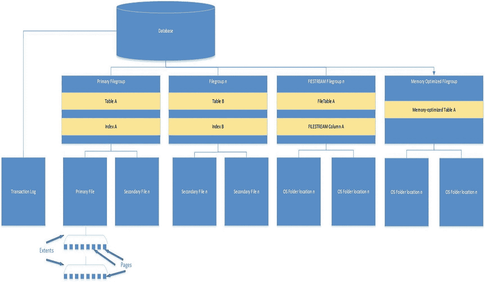

*图 6-1 SQL Server 如何存储数据*

数据库总是由至少一个文件组组成，该文件组至少包含一个文件。数据库中的第一个文件称为 *主文件*。默认情况下，此文件具有 `.mdf` 文件扩展名。但是，如果需要，你可以更改此扩展名。此文件可用于存储数据，但也用于存储提供数据库启动信息和指向数据库内其他文件指针的元数据。包含主文件的文件组称为 *主文件组*。

如果在数据库中创建了其他文件，则它们称为 *辅助文件*，默认情况下具有 `.ndf` 扩展名。但是，如果需要，你可以更改此扩展名。这些文件可以在主文件组和/或辅助文件组中创建。辅助文件和文件组是可选的，但正如我们将在本章后面讨论的那样，它们对数据库管理员非常有用。

#### 提示

保留默认的文件扩展名是一个好主意。使用不同的扩展名没有真正的好处，而且这样做会增加额外的复杂性。例如，你不仅需要记住使用了哪些扩展名，而且如果你的防病毒软件使用文件扩展名作为其排除列表，你可能会突然看到性能的严重下降。

#### 文件组

表和索引存储在文件组上，而不是容器内的特定文件中。这意味着对于包含多个文件的文件组，你无法控制使用哪个文件来存储对象。事实上，由于 SQL Server 使用轮询方式分配数据到文件，存储在文件组中的每个对象极有可能被分割到文件组内的每个文件上。

为了见证此行为，请运行清单 6-1 中的脚本。该脚本创建一个数据库，其主文件组包含三个文件。然后在该文件组上创建一个表并填充数据。最后，使用 `%%physloc%%` 来确定表中每一行的物理位置。然后脚本计算每个文件中的行数。

#### 提示

将文件路径更改为匹配你自己的首选位置。

```sql
USE Master
GO
--创建一个数据库，主文件组中有三个文件。
CREATE DATABASE [Chapter6]
CONTAINMENT = NONE
ON  PRIMARY
( NAME = N'Chapter6', FILENAME = N'F:\MSSQL\MSSQL15.PROSQLADMIN\MSSQL\DATA\Chapter6.mdf'),
( NAME = N'Chapter6_File2',
FILENAME = N'F:\MSSQL\MSSQL15.PROSQLADMIN\MSSQL\DATA\Chapter6_File2.ndf'),
( NAME = N'Chapter6_File3',
FILENAME = N'F:\MSSQL\MSSQL15.PROSQLADMIN\MSSQL\DATA\Chapter6_File3.ndf')
LOG ON
( NAME = N'Chapter6_log',
FILENAME = N'E:\MSSQL\MSSQL15.PROSQLADMIN\MSSQL\DATA\Chapter6_log.ldf');
GO
IF NOT EXISTS (SELECT name FROM sys.filegroups WHERE is_default=1 AND name = N'PRIMARY')
ALTER DATABASE [Chapter6] MODIFY FILEGROUP [PRIMARY] DEFAULT;
GO
USE Chapter6
GO
--在新数据库中创建一个表。该表包含一个宽的、固定长度的列
--以增加分配的数量。
CREATE TABLE dbo.RoundRobinTable
(
ID       INT     IDENTITY    PRIMARY KEY,
DummyTxt    NCHAR(1000),
);
GO
--创建一个 Numbers 表，用于辅助表的填充。
DECLARE @Numbers TABLE
(
Number    INT
)
--填充 Numbers 表。
;WITH CTE(Number)
AS
(
SELECT 1 Number
UNION ALL
SELECT Number +1
FROM CTE
WHERE Number <= 99
)
INSERT INTO @Numbers
SELECT *
FROM CTE;
--用 100 行虚拟文本来填充示例表。
INSERT INTO dbo.RoundRobinTable
SELECT 'DummyText'
FROM @Numbers a
CROSS JOIN @Numbers b;
--从表中选择所有数据，以及行物理位置的详细信息。
--然后按文件 ID 分组计算行数。
SELECT b.file_id, COUNT(*) AS [RowCount]
FROM
(
SELECT ID, DummyTxt, a.file_id
FROM dbo.RoundRobinTable
CROSS APPLY sys.fn_PhysLocCracker(%%physloc%%) a
) b
GROUP BY b.file_id;
```
*清单 6-1 SQL Server 轮询分配*

图 6-2 中显示的结果表明，行已均匀分布在文件组内的三个文件上。如果文件大小不同，那么空间最多的文件会由于比例填充算法而接收到更多的行，该算法试图权衡分配到每个文件的数据量，以便在每个文件之间均匀分布数据。

#### 提示

你可能会注意到没有为文件 2 返回行。这是因为 `file_id` 2 始终是事务日志文件（或者如果你有多个日志文件，则是第一个事务日志文件）。`file_id` 1 始终是主数据库文件。

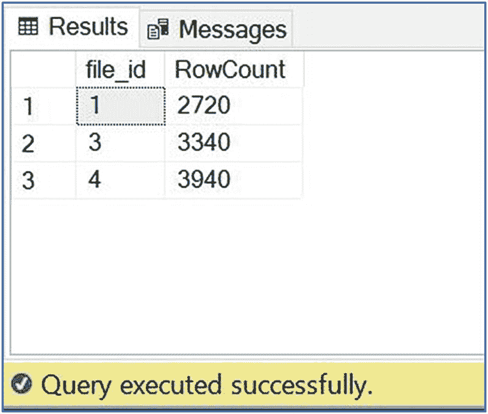

*图 6-2 均匀分布的行*


#### 注意

`physloc`函数未被文档化。因此，Microsoft 不会提供对其使用的**技术支持**。

标准数据和索引存储在一系列 8KB 的页面中；这些页面由包含页面元数据的 96 字节页眉和用于存储数据本身的 8096 字节组成。这些 8KB 页面随后被组织成由八个连续页面组成的单元，合在一起称为一个*区（extent）*。一个*区（extent）* 是 SQL Server 可以从磁盘读取的最小单位。

#### FILESTREAM 文件组

FILESTREAM 是一种允许您以非结构化方式存储二进制数据的技术。二进制数据通常存储在操作系统中，而不是数据库中，而 FILESTREAM 使您能够继续这样做，同时在这类非结构化数据与存储在数据库中的结构化元数据之间提供事务一致性。使用此技术将使您能够克服 SQL Server 单个对象 2GB 的最大大小限制。对于大型二进制对象，您还将看到比将其存储在数据库中更好的性能。如果文件大小超过 1MB，使用 FILESTREAM 的读取性能可能会更快。

然而，您需要记住，使用 FILESTREAM 存储的对象使用的是 Windows 缓存，而不是 SQL Server 缓冲区缓存。这样做的好处是，您不会有大文件填满缓冲区缓存，导致其他数据被刷写到缓冲区缓存扩展或磁盘。另一方面，这意味着在为实例配置“最大服务器内存”设置时，您应该记住，如果您计划缓存这些对象，Windows 需要额外的内存，因为使用的是 Windows 二进制缓存，而不是 SQL Server 的缓冲区缓存。

FILESTREAM 数据需要单独的文件组。这些文件组不包含文件，而是指向操作系统中的文件夹位置。每个位置称为一个*容器（container）*。必须在实例上启用 FILESTREAM 才能创建 FILESTREAM 文件组。您可以在实例设置期间执行此操作，如第 2 章所述，或者可以在 SQL Server Management Studio 的实例属性中配置它。

我们可以通过使用“数据库属性”对话框的“文件组”选项卡上的“添加文件组”按钮，然后在“名称”字段中为文件组添加名称，如图 6-3 所示，将 FILESTREAM 文件组添加到我们的 Chapter6 数据库。

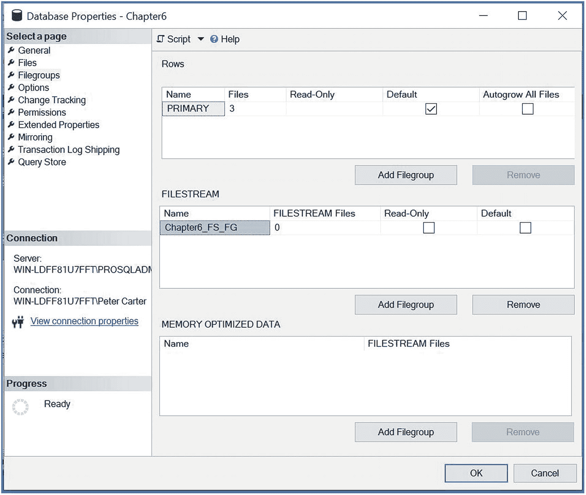

图 6-3  文件组选项卡

然后，我们可以使用“数据库属性”对话框的“文件”选项卡来添加容器。在这里，我们需要为容器输入一个名称，并将文件类型指定为 FILESTREAM 数据。然后，我们可以从“文件组”下拉框中选择我们的 FILESTREAM 文件组，如图 6-4 所示。

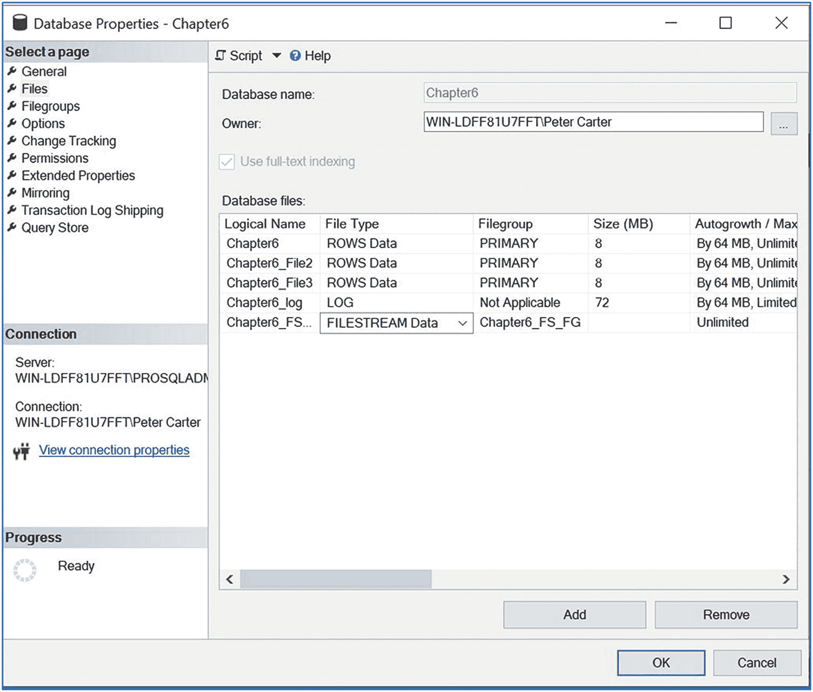

图 6-4  文件选项卡

我们可以通过运行清单 6-2 中的 T-SQL 命令来实现相同的结果。该脚本创建一个 FILESTREAM 文件组，然后添加一个容器。您应该更改脚本中的目录以匹配您自己的配置。

```sql
ALTER DATABASE [Chapter6] ADD FILEGROUP [Chapter6_FS_FG] CONTAINS FILESTREAM;
GO
ALTER DATABASE [Chapter6] ADD FILE ( NAME = N'Chapter6_FA_File1', FILENAME = N'F:\MSSQL\MSSQL15.PROSQLADMIN\MSSQL\DATA\Chapter6_FA_File1' ) TO FILEGROUP [Chapter6_FS_FG];
GO
```

清单 6-2  添加 FILESTREAM 文件组

为了探索 FILESTREAM 容器的文件夹结构，我们首先需要创建一个表并填充数据。清单 6-3 中的脚本创建了一个表，该表包含一个唯一标识符（所有包含 FILESTREAM 数据的表都需要此标识符）、二进制对象的文本描述，以及一个我们将用于存储本章前面图 6-1 中插图的 `VARBINARY(MAX)` 列。我们使用的文件并不重要，因此要自己运行脚本，请将正在导入文件的名称和位置更改为系统上的文件。

```sql
USE Chapter6
GO
CREATE TABLE dbo.FilestreamExample
(
ID                UNIQUEIDENTIFIER ROWGUIDCOL NOT NULL UNIQUE,
PictureDescription    NVARCHAR(500),
Picture              VARBINARY(MAX) FILESTREAM
);
GO
INSERT INTO FilestreamExample
SELECT NEWID(), 'Figure 6-1. Diagram showing the SQL Server storage hierachy.', * FROM
OPENROWSET(BULK N'c:\Figure_6-1.jpg', SINGLE_BLOB) AS import;
```

清单 6-3  创建包含 FILESTREAM 数据的表

#### 注意

我们使用了 `UNIQUE` 约束，而不是主键，因为 GUID 通常不是一个好的主键选择。如果表必须有主键，添加一个指定 `IDENTITY` 属性的额外整数列可能更合理。我们使用了 GUID 并设置了 `ROWGUIDCOL` 属性，因为这是 SQL Server 映射到 FILESTREAM 对象所必需的。

如果我们现在在文件系统中打开容器的位置，我们可以看到我们有一个文件夹，其名称是一个 GUID。这代表我们创建的表。在这个文件夹内是另一个同样具有 GUID 名称的文件夹。此文件夹代表我们创建的 `FILESTREAM` 列。在此文件夹中，我们将找到一个文件，该文件是我们插入到列中的图片。此文件的名称是文件创建时的日志序列号。理论上可以将此文件的扩展名更改为原始扩展名，然后打开它。但是，这当然不推荐，因为它可能在 SQL Server 中产生不良影响。在容器的根级别，您还会找到一个名为 `filestream.hdr` 的文件，其中包含容器的元数据，以及一个名为 `$FSLog` 的文件夹。此文件夹包含构成 FILESTREAM 事务日志等效项的一系列文件。此文件夹层次结构如图 6-5 所示。


#### 提示

SQL Server 服务账户会被自动授予对 `FILESTREAM` 容器的文件系统权限。将此文件夹结构的权限授予任何其他用户被认为是**不良做法**。如果您尝试使用 Windows 管理员账户访问该文件夹，系统会给出权限警告，说明如果您继续操作，将永久授予您对该文件夹的权限。

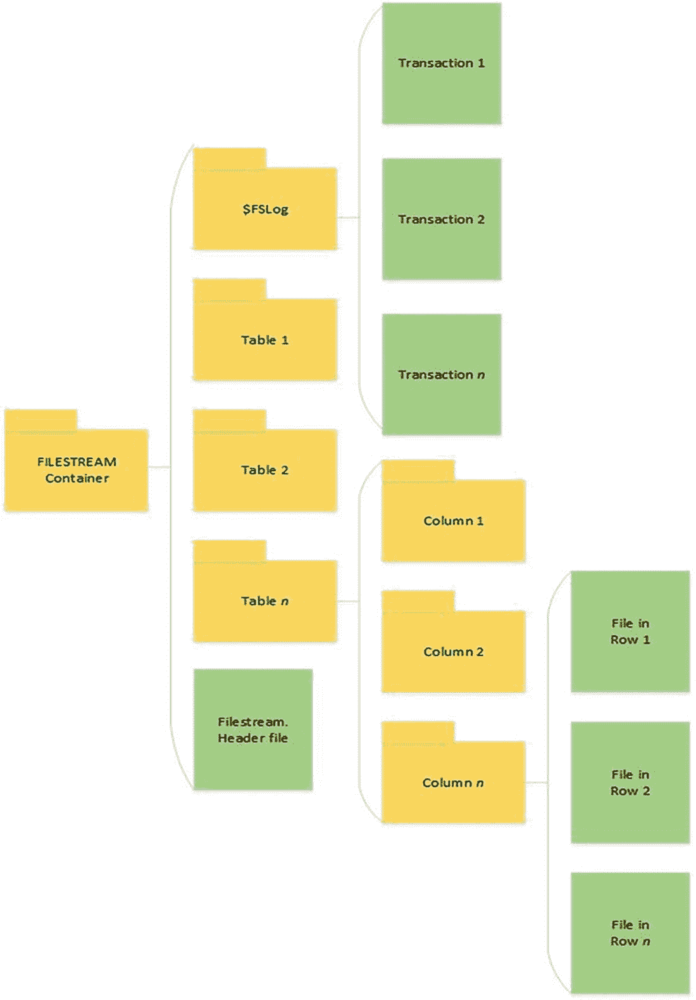
*图 6-5: FILESTREAM 文件夹层级结构*

`FileTable` 是一种构建在 `FILESTREAM` 之上的技术，允许将数据存储在文件系统中。因此，要使用它，您必须启用具有流式访问权限的 `FILESTREAM`。然而，与 `FILESTREAM` 不同，`FileTable` 允许对数据进行非事务性访问。这意味着您可以将数据移动到 SQL 引擎中存储，而不是存储在操作系统中，而无需修改现有应用程序。您还可以像处理操作系统中的任何其他文件一样，通过 Windows 资源管理器打开和修改这些文件。

为实现这一点，SQL Server 使 Windows 应用程序能够在没有事务的情况下请求文件句柄。由于此功能，您需要在数据库级别指定应用程序可以请求的非事务性访问级别。您可以配置以下访问级别：

*   `NONE`（默认值—仅允许事务性访问。）
*   `READ_ONLY`（可以查看文件系统中的对象，但不能修改。）
*   `FULL`（可以查看并修改文件系统中的对象。）
*   `IN_TRANSITION_TO_READ_ONLY`（正在转换为 `READ_ONLY`）
*   `IN_TRANSITION_TO_OFF`（正在转换为 `NONE`）

您还需要指定 `FileTable` 容器的根目录。这两项任务都可以使用同一条 `ALTER DATABASE` 语句来完成，如清单 6-4 所示。

```sql
ALTER DATABASE Chapter6
SET FILESTREAM ( NON_TRANSACTED_ACCESS = FULL, DIRECTORY_NAME = N'Chapter6_FileTable' );
-- 清单 6-4: 设置非事务性访问级别
```

SQL Server 现在会创建一个共享，其名称与您的实例名称相同。在此共享中，您将找到一个以您指定名称命名的文件夹。当您创建 `FileTable` 时，可以再次指定一个目录名称。这将创建一个以您指定名称命名的子文件夹。由于 `FileTable` 没有关系型架构，并且存储的关于文件的元数据是固定的，因此创建它们的语法仅包含表名、目录和要使用的排序规则。清单 6-5 中的代码演示了如何创建一个名为 `Chapter6_FileTable` 的 `FileTable`。

```sql
USE Chapter6
GO
CREATE TABLE dbo.ch06_test AS FILETABLE
WITH
(
    FILETABLE_DIRECTORY = 'Chapter6_FileTable',
    FILETABLE_COLLATE_FILENAME = database_default
);
GO
-- 清单 6-5: 创建 FileTable
```

要将文件加载到表中，您可以简单地将它们复制或移动到该文件夹位置，或者开发人员可以在其应用程序中使用 `System.IO` 命名空间。SQL Server 会相应地更新 `FileTable` 的元数据列。在我们的示例中，可以找到 `FileTable` 文件的容器的文件路径是 `\\127.0.0.1\prosqladmin\Chapter6_FileTable\Chapter6_FileTable`。这里，`127.0.0.1` 是我们服务器的环回地址，`prosqladmin` 是基于我们的实例名称创建的共享，而 `Chapter6_FileTable\Chapter6_FileTable FILESTREAM\FileTable` 是容器。

#### 内存优化文件组

SQL Server 2014 引入了一项名为 `内存优化表` 的功能。这些表完全存储在内存中；但是，数据也会写入磁盘上的文件中。这是为了持久性。针对内存中表的事务具有与传统的基于磁盘的表相同的 ACID（原子性、一致性、隔离性和持久性）属性。我们将在第 7 章进一步讨论内存中表，并在第 18 章讨论内存中事务。

由于内存中表需要将数据的副本存储在磁盘上以实现持久性，因此我们有了内存优化文件组。这种类型的文件组类似于 `FILESTREAM` 文件组，但有一些细微的差别。首先，每个数据库只能创建一个内存优化文件组。其次，除非您计划同时使用这两个功能，否则不需要显式启用 `FILESTREAM`。

内存中数据通过使用两种文件类型持久化到磁盘。一种是数据文件，另一种是增量文件。这两种文件类型总是成对操作，并覆盖特定的事务范围，因此您应该始终拥有相同数量的文件。数据文件用于跟踪对内存中表进行的插入操作，增量文件用于跟踪删除操作。更新语句通过这两种文件的组合进行跟踪，因为更新被跟踪为一次删除和一次插入。这些文件是顺序写入的，并且是表不可知的，这意味着每个文件可能包含多个表的数据。

我们可以通过在“数据库属性”对话框的“文件组”选项卡中使用“内存优化数据”区域的“添加文件组”按钮，并指定文件组的名称，将内存优化文件组添加到我们的数据库中。如图 6-6 所示。

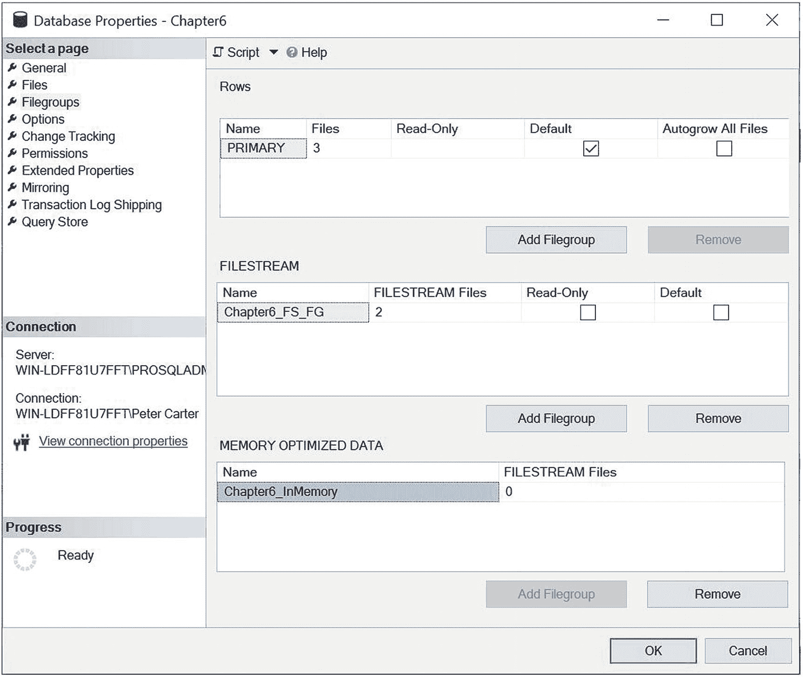
*图 6-6: 添加内存优化文件组*

然后，我们可以通过在“数据库属性”对话框的“文件”选项卡中使用“添加文件”按钮，将容器添加到文件组中。在这里，我们需要指定文件的逻辑名称，并选择 `FILESTREAM` 文件类型。然后，我们可以使用下拉框选择将文件添加到我们的内存优化文件组中，如图 6-7 所示。

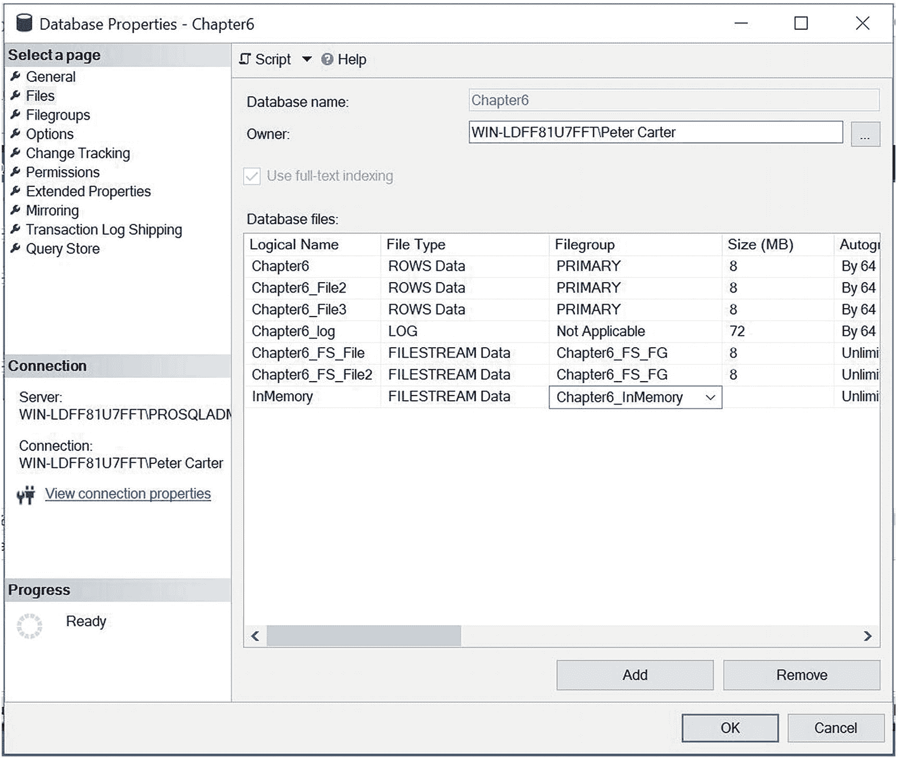
*图 6-7: 添加内存优化容器*

或者，我们可以使用清单 6-6 中的 T-SQL 脚本实现相同的结果。请务必将文件位置更改为与您的目录结构匹配。

```sql
ALTER DATABASE [Chapter6] ADD FILEGROUP [Chapter6_InMemory] CONTAINS MEMORY_OPTIMIZED_DATA;
GO
ALTER DATABASE [Chapter6] ADD FILE ( NAME = N'InMemory', FILENAME = N'F:\MSSQL\MSSQL15.PROSQLADMIN\MSSQL\DATA\InMemory' ) TO FILEGROUP [Chapter6_InMemory];
GO
-- 清单 6-6: 添加内存优化文件组和容器
```

#### 结构化文件组策略

DBA 可以采用不同的文件组策略来帮助满足性能、备份时间、恢复时间目标和分层存储等要求。以下各节将探讨这些策略。


### 性能策略

在为性能设计文件组策略时，需考虑对象放置与应用程序查询执行的联接操作之间的关系。例如，想象一个大型数据仓库。您有一个包含数十万行的宽大事实表，该表与两个维度表进行联接，每个维度表有数百万行。如果将这三个对象都放置在同一个文件组上，您可以通过使用多个文件来分散 I/O，将每个文件放置在不同的磁盘轴上。然而，这里的问题在于，即使可以分散 I/O，您也无法对哪些表放置在哪些逻辑单元号上进行精细控制。正如本章前面所演示的，所有对象都将使用 `round-robin` 和 `proportional fill` 算法的组合，均匀地跨每个文件进行条带化。因此，通过将这三个表拆分到三个独立的文件组上，每个文件组创建在独立的逻辑单元号上，有可能获得性能优势。这可能会让 SQL Server 提高表扫描的并行化程度。

另一种可能的场景是，您有一个海量数据仓库，达到数十 TB，以及一个具有平衡吞吐量的超大服务器，例如使用 Fast Track Data Warehouse 参考架构构建的服务器（详细信息可在 MSDB 库中找到）；在这种情况下，通过在每个可用磁盘上创建文件组，您可能会获得最佳性能。这为服务器提供了 I/O 吞吐量方面的最佳性能，并有助于防止 I/O 子系统成为瓶颈。

同时，请考虑可能进行水平分区的表的放置。想象一个非常大的表，其数据按月分区。如果您的应用程序工作负载意味着经常需要同时读取几个月的数据，那么将每个月拆分到独立的文件组上可能会提高性能，每个文件组使用一组独立的磁盘轴，类似于前面提到的联接示例。关于分区的详细讨论将在第 7 章进行。

#### 注意

这种方法的缺点是，将分区放置在不同的文件组上会妨碍您使用分区功能，例如 `SWITCH`。

### 备份和恢复策略

SQL Server 允许您在文件和文件组级别以及数据库级别进行备份。随后，您可以执行所谓的 ``片段恢复``。片段恢复允许您分阶段将数据库联机。这对于恢复时间目标非常短的大型数据库非常有用。

想象一下，您有一个大型数据库，其中包含少量非常关键的数据，业务中断时间不能超过最多 2 小时。该数据库还包含大量历史数据，业务需要每天访问这些数据用于报告，但并非必须在 2 小时窗口内恢复。在此场景下，最佳实践是拥有两个辅助文件组。第一个包含关键数据，第二个包含历史数据。在发生灾难时，您可以先恢复主文件组和第一个辅助文件组。此时，您可以将数据库联机，业务将能够访问这些数据。随后，可以将包含历史报告数据的文件组联机。

文件组也可以协助备份策略。想象一个场景：您有一个大型数据库，需要 2 小时进行备份。不幸的是，您有一个长时间运行的 ETL 过程，只有 1 小时的窗口可以每晚备份数据库。如果是这种情况，那么您可以将数据拆分到两个文件组之间。第一个文件组可以在周一、周三和周五备份，第二个文件组可以在周二、周四和周六备份。备份和恢复将在第 12 章详细讨论。

### 存储分层策略

一些组织可能决定希望为大型数据库实施存储分层。如果是这种情况，那么通常需要通过使用分区来实现。例如，假设一个表包含 6 年的数据。当前年份的数据每天被多次访问和更新。前 3 年的数据在月度报告中被访问，除此之外很少使用。距今 6 年的数据必须能够即时访问（如果出于监管原因需要的话），但实际上很少访问。

在刚刚描述的场景中，可以使用分区，并按年分区。包含当前年份数据的文件组可以由本地连接的 `RAID 10` 逻辑单元号上的文件组成，以获得最佳性能。存放第 2 年和第 3 年数据的分区可以放置在企业级 `SAN` 设备的优质层级上。超过 3 年的分区可以放置在 SAN 内的近线存储中，从而以最具成本效益的方式满足监管要求。

一些组织还引入了自动存储分层技术，例如 `AO（自适应优化）`。尽管自动存储分层技术在某些环境中效果极佳，但其在 SQL Server 上的实施有时可能会出现问题。这是因为它分为两个阶段工作。第一阶段是分析阶段，决定每个块或文件应驻留在哪个层级上，以实现成本与开销的最佳平衡。第二阶段将实际数据移动到最合适的层级。

问题在于，数据移动的窗口往往会降低 SAN 的性能。因此，频繁（例如每小时）运行分析然后移动数据可能会导致不可接受的性能下降。然而，另一方面，减少运行分析的频率（例如在工作时间），并在夜间移动数据，有时与 SQL Server 的使用模式不符。例如，想象一个需要最佳性能的报表应用程序，但其每周报告在周五生成。由于此高峰时段前的最后一个分析窗口是周四，当时活动不多，数据很可能驻留在较慢但更具成本效益的层级上，这意味着性能将受损。然而，当周六到来时，应用程序几乎再次空闲，由于周五高峰使用期间的分析窗口，数据将驻留在优质层级上。因此，自动存储分层通常在数据库具有固定运行时间且日常使用模式变化不大的环境中效果最佳。

### 内存优化文件组策略

与结构化文件组一样，内存优化文件组将使用 `round-robin` 方法在容器之间分配数据。通常做法是将这些多个容器放置在独立的磁盘轴上，以最大化 I/O 吞吐量。然而，问题是，如果您将一个容器放在磁盘轴 A 上，另一个容器放在磁盘轴 B 上，那么 `round-robin` 方法会将所有数据文件放在一个卷上，所有增量文件放在另一个卷上。

为避免此问题，最佳实践是在您希望用于内存优化文件组的每个卷上放置两个容器。这将确保您获得平衡的 I/O 分布，如图 6-8 所示。这与 Microsoft 推荐的最佳实践一致。

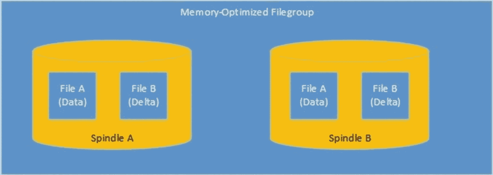

图 6-8

内存优化文件组的平衡 I/O 分布


### 文件与文件组维护

在数据层应用程序的生命周期中，有时出于性能或容量管理等原因，你可能需要对数据库文件和文件组执行维护活动。以下部分将描述如何添加、扩展和收缩文件。

#### 添加文件

出于容量和性能的双重原因，你可能需要向文件组添加文件。如果你的数据库增长超出了容量估算，并且承载数据文件的卷无法调整大小，那么你可以向文件组添加位于不同 LUN 上的额外文件。

如果存储子系统成为应用程序的瓶颈，你可能还需要向文件组添加额外文件以提高 IO 吞吐量。我们可以通过“数据库属性”对话框的“文件”选项卡向 `Chapter6` 数据库添加一个额外文件。在此，我们将使用“添加”按钮，然后指定文件的逻辑名称、文件要驻留的文件组、文件的初始大小、自动增长设置、文件的最大大小以及文件将存储的物理路径。

或者，我们可以使用清单 6-7 中的脚本来达到相同的结果。你应该将脚本中的目录路径更改为与你自己的目录结构相匹配。

```sql
ALTER DATABASE [Chapter6] ADD FILE ( NAME = N'Chapter6_File4', FILENAME = N'G:\DATA\Chapter6_File4.ndf', SIZE = 5120KB, FILEGROWTH = 1024KB ) TO FILEGROUP [PRIMARY];
GO
```

清单 6-7
使用 T-SQL 添加新文件

然而，在这种情况下，重要的是要记住比例填充算法。如果你向文件组添加文件，那么 SQL Server 将首先针对空文件，直到它们剩余的可用空间与原始文件相同。这意味着如果你创建它们时与原始文件大小相同，你可能无法获得预期的益处。你可以通过运行清单 6-8 中的脚本来见证此行为。该脚本使用了我们在最初创建和填充 `RoundRobin` 表时使用的相同技术，来生成额外的 10,000 行，然后识别每个文件中有多少行。

```sql
--Create a Numbers table that will be used to assit the population of the table
DECLARE @Numbers TABLE
(
Number    INT
)
--Populate the Numbers table
;WITH CTE(Number)
AS
(
SELECT 1 Number
UNION ALL
SELECT Number +1
FROM CTE
WHERE Number <= 99
)
INSERT INTO @Numbers
SELECT *
FROM CTE;
--Populate the example table with 10000 rows of dummy text
INSERT INTO dbo.RoundRobinTable
SELECT 'DummyText'
FROM @Numbers a
CROSS JOIN @Numbers b;
--Select all the data from the table, plus the details of the rows' physical location.
--Then group the row count
--by file ID
SELECT b.file_id, COUNT(*)
FROM
(
SELECT ID, DummyTxt, a.file_id
FROM dbo.RoundRobinTable
CROSS APPLY sys.fn_PhysLocCracker(%%physloc%%) a
) b
GROUP BY b.file_id;
```

清单 6-8
向 RoundRobin 表添加额外行

从图 6-9 的结果中，你可以看到比例填充算法专门使用了新文件，直到其填满，然后才在每个文件之间重新启动轮询分配。然而，在重新启动比例填充算法后，文件组中的第一个文件发生了一次自动增长事件。这意味着第一个文件现在比其他文件有更多的可用空间，并接收了大部分剩余的新行。

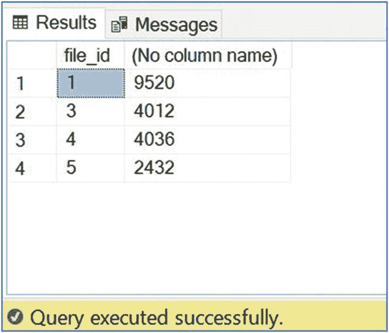
图 6-9
分配给新文件的行

解决新文件首先被填满的方法是创建更小的文件或增大现有文件的大小。这两种方法都可以均衡每个文件中剩余的可用空间，使 SQL Server 能够均匀地分布写入操作。

另一种选择是使用数据库作用域配置，以强制文件组中的所有文件在每次发生自动增长事件时都增长。这将在本章的“数据库作用域配置”部分进一步讨论。

#### 提示

我们已经讨论了添加新文件对轮询算法的影响。然而，同样值得一提的是，当你最初创建文件组时，你应该在该文件组中创建大小相等的文件，以充分利用该算法。

#### 扩展文件

如果你是使用 GUI 而不是脚本添加文件的，那么你可能已经注意到，每个文件旁边指示的初始大小分别为 11MB、6MB 和 7MB，而不是本章前面我们配置的 5MB。这是因为“初始大小”字段的更准确名称实际上是“当前大小”。因为我们为文件配置了自动增长，当它们变满时，SQL Server 已自动为我们扩展了文件。

这是一个非常实用的故障安全功能，但理想情况下，我们应该仅将其用作故障安全。扩展文件会消耗资源，并且会导致获取锁，从而阻塞其他进程。因此，建议根据容量估算预设数据库文件的大小，而不是从一个较小的文件开始并依赖自动增长。

出于同样的原因，在指定文件的自动增长设置时，你应该避免使用默认的 1MB，并指定一个大得多的值。如果不这样做，当你的文件变满并触发自动增长时，你的文件将以非常小的增量增长，这可能会损害性能，即使你使用的是即时文件初始化。你应该将文件增长值设置为多少取决于你的环境。例如，你应该考虑卷上可用的可用空间量以及共享该卷的其他数据库的数量。你可以使用 `sys.dm_db_file_space_usage` 动态管理视图 (DMV) 查看文件中剩余的空间量。此 DMV 将返回一个名为 `unallocated_extent_page_count` 的列，该列将告诉我们还有多少空闲页可供分配。我们可以使用它来计算每个文件中的剩余可用空间，如清单 6-9 所示。

```sql
SELECT
file_id
,unallocated_extent_page_count * 1.0 / 128 'Free Space (MB)'
FROM sys.dm_db_file_space_usage;
```

清单 6-9
计算每个文件中的可用空间

如果我们想扩展一个文件，我们不需要等待自动增长触发。我们可以通过更改“数据库属性”对话框“文件”选项卡中的“初始大小”字段的值，或使用 `ALTER DATABASE` 命令来手动扩展文件。清单 6-10 中的命令将把 `Chapter6` 数据库中最新的文件大小调整为 20MB。

```sql
ALTER DATABASE [Chapter6] MODIFY FILE ( NAME = N'Chapter6_File4', SIZE = 20480KB );
```

清单 6-10
扩展文件


### 收缩文件

正如你可以扩展数据库文件一样，你也可以收缩它们。实现此目的有多种方法，包括收缩单个文件、收缩数据库中的所有文件（包括日志文件），甚至可以在数据库级别设置 `自动收缩` 选项。

要收缩单个文件，你需要使用 `DBCC SHRINKFILE` 命令。使用此选项时，你可以指定文件的目标大小，或者指定 `EMPTYFILE` 选项。`EMPTYFILE` 选项会将文件内的所有数据移动到同一文件组内的其他文件中。这意味着你随后可以从数据库中删除该文件。

如果你为数据库指定了目标大小，那么你可以选择指定 `TRUNCATEONLY` 或 `NOTRUNCATE`。如果你选择前者，那么 SQL Server 将从文件末尾开始回收空间，直到达到最后一个已分配的区。如果你选择后者，那么 SQL Server 将从文件末尾开始，将已分配的区移动到文件开头的第一个可用空间。

为了移除我们已扩展的 `Chapter6_File4` 文件末尾的未使用空间，我们可以使用 SQL Server Management Studio 中的“收缩文件”屏幕，可以通过右键单击数据库并依次选择“任务”➤“收缩”➤“文件”来找到。在“收缩文件”屏幕中，我们可以从“文件名”下拉框中选择相应的文件，然后确保选中“释放未使用的空间”单选按钮。此选项强制执行 `TRUNCATEONLY`。

我们也可以通过运行清单 6-11 中的命令来实现相同的结果。

```sql
USE [Chapter6]
GO
DBCC SHRINKFILE (N'Chapter6_File4', 0, TRUNCATEONLY);
```
清单 6-11
使用 `TRUNCATEONLY` 收缩文件

如果我们想要回收数据库中所有文件末尾的未使用空间，我们可以右键单击数据库并依次选择“任务”➤“收缩”➤“数据库”。然后，确保“在释放未使用的空间前重新组织文件”选项未被选中，并单击“确定”。

我们可以通过运行清单 6-12 中的 T-SQL 命令来实现相同的结果。

```sql
USE [Chapter6]
GO
DBCC SHRINKDATABASE(N'Chapter6' );
```
清单 6-12
通过 T-SQL 收缩数据库

需要收缩数据库甚至单个文件的情况非常少见。有一种误解认为大型的空文件备份需要更长时间，但这是错误的。事实上，在我的职业生涯中，我只有一次需要收缩数据文件。那次发生在我们从数据库中移除了几百 GB 的存档数据后，接近 2TB LUN 限制时，但这属于特殊情况。一般来说，你不应该考虑收缩数据库文件，并且绝对不应该在数据库上使用 `自动收缩` 选项。

如果你确实必须收缩数据库，请做好过程缓慢的准备。这是一个单线程操作，运行时会消耗资源。你也绝不应该考虑使用 `NOTRUNCATE` 选项。如前所述，这将导致区在文件内部移动，并导致严重的碎片化问题，就像你可以使用清单 6-13 中的脚本看到的那样。此脚本首先在我们的 `RoundRobin` 表上创建一个聚集索引。然后使用 `sys.dm_db_index_physical_stats` DMV 来检查聚集索引叶级别的碎片级别。随后，它收缩数据库，然后重新检查我们聚集索引叶级别的碎片级别。

```sql
USE Chapter6
GO
--在 RoundRobinTable 上创建聚集索引
CREATE UNIQUE CLUSTERED INDEX CIX_RoundRobinTable ON dbo.RoundRobinTable(ID);
GO
--检查新索引的碎片
SELECT * FROM sys.dm_db_index_physical_stats(DB_ID('Chapter6'),OBJECT_ID('dbo.RoundRobinTable'),1,NULL,'DETAILED')
WHERE index_level = 0;
--收缩数据库
DBCC SHRINKDATABASE(N'Chapter6', NOTRUNCATE);
GO
--重新检查索引碎片
SELECT * FROM sys.dm_db_index_physical_stats(DB_ID('Chapter6'),OBJECT_ID('dbo.RoundRobinTable'),1,NULL,'DETAILED')
WHERE index_level = 0;
GO
```
清单 6-13
由收缩引起的碎片

如图 6-10 所示的结果，索引叶级别的碎片从 0.08% 增加到了惊人的 71.64%，这将严重影响针对该索引运行的查询。索引和碎片将在第 8 章中详细讨论。

#### 注意

碎片级别可能因文件内区的布局而异。

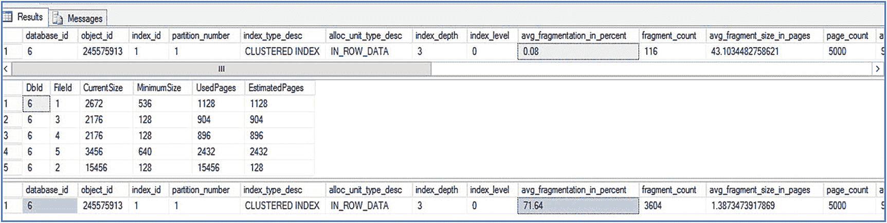

图 6-10
碎片结果

### 数据库范围配置

在 SQL Server 2016 之前，可以在 SQL Server 服务上配置跟踪标志（参见第 5 章），这些标志改变了 SQL Server 存储数据和执行自动增长事件的默认行为。其中第一个是 `T1117`，用于使文件组中的所有文件同时增长，这有助于均匀分布数据，尤其是在数据仓库场景中。另一个是 `T1118`，用于强制专门使用统一区——本质上是关闭了混合区（其中区内的不同页可以分配给不同的表）。`T1118` 对于优化 `TempDB` 很有用，但在数据仓库场景中也可能被证明是有用的。

从 SQL Server 2016 开始，如果启用 `T1117` 和 `T1118`，它们将不再有效。它们已被数据库范围配置所取代，这些配置有两个主要好处。首先，数据库范围配置是在数据库级别配置的，而不是实例级别。这意味着一个统一的整合实例可以轻松支持具有不同工作负载配置文件的数据库。其次，数据库范围配置有 Microsoft 的文档记录和支持。虽然 `T1117` 和 `T1118` 众所周知且被广泛使用，但它们没有来自 Microsoft 的官方支持。

#### 注意

`T1117` 和 `T1118` 的等效行为在 `TempDB` 数据库上默认启用。然而，对于用户数据库，则采用传统的默认行为。

我们可以使用清单 6-14 中的命令，在 `Chapter6` 数据库的 `Primary` 文件组上启用等同于 `T1117` 的行为。

```sql
ALTER DATABASE Chapter6 MODIFY FILEGROUP [Primary] AUTOGROW_ALL_FILES
```
清单 6-14
开启“自动增长所有文件”

清单 6-15 中的命令将为 `Chapter6` 数据库启用等同于 `T1118` 的行为。

```sql
ALTER DATABASE Chapter6 SET MIXED_PAGE_ALLOCATION OFF
```
清单 6-15
关闭“混合页分配”

### 日志维护

事务日志是 SQL Server 武器库中的一项关键工具；它不仅提供恢复功能，还支持许多功能，例如 AlwaysOn 可用性组、事务复制、变更数据捕获等等。

在内部，日志文件被划分为一系列 VLF（虚拟日志文件）。当文件中的最后一个 VLF 变满时，SQL Server 会尝试回绕到日志开头的第一个 VLF。如果此 VLF 尚未被截断且无法被重用，那么 SQL Server 将尝试增长日志文件。如果由于磁盘空间不足或达到最大大小设置而无法扩展文件，则将引发 9002 错误，并且事务将被回滚。图 6-11 说明了日志文件的结构及其循环使用方式。

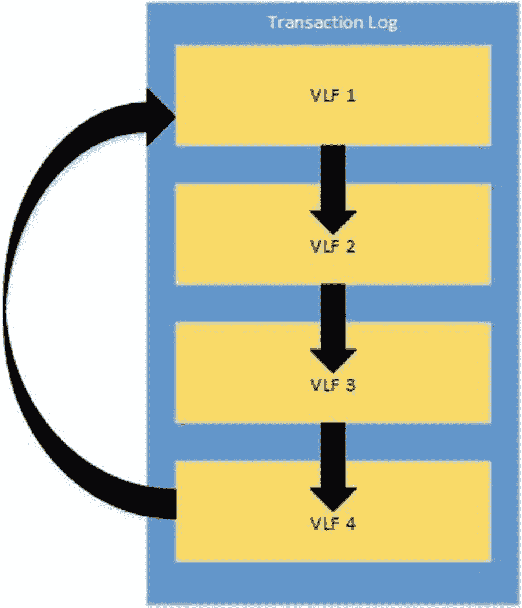

图 6-11：日志文件结构

日志文件中 VLF 的数量由日志最初创建时的大小以及每次增长的大小决定。如果日志文件是以小于 64MB 的增量创建或增长的，则会向文件添加 4 个 VLF。如果它是以介于 64MB 和 1GB 之间的增量创建或增长的，则会添加 8 个 VLF。如果它是以超过 1GB 的大小创建或增长的，则会添加 16 个 VLF。

事务日志是 SQL Server 组件中一个维护需求相当低的组件。然而，有时也会出现需要维护的场景；这些将在以下章节中讨论。

#### 恢复模型

`恢复模型` 是一个数据库级别的属性，它控制着事务的记录方式，因此会影响事务日志维护。SQL Server 中的三种恢复模型描述于表 6-1 中。

表 6-1：恢复模型

| 恢复模型 | 描述 |
| --- | --- |
| `SIMPLE` | 在 `SIMPLE` 恢复模型中，无法备份事务日志。事务以最小方式记录，日志将自动截断。在 `SIMPLE` 恢复模型中，事务日志的存在仅是为了允许回滚事务。它与一些 HADR（高可用性/灾难恢复）技术不兼容，例如 AlwaysOn 可用性组、日志传送和数据库镜像。此模型适用于仅偶尔发生更新的报表数据库。这是因为不可能进行时间点恢复。恢复点目标将是上一次 `FULL` 或 `DIFFERENTIAL` 备份的时间。 |
| `FULL` | 在 `FULL` 恢复模型中，必须进行事务日志备份。日志仅在日志备份过程中被截断。事务被完整记录，这意味着可以进行时间点恢复。这也意味着您必须拥有完整的日志文件备份链才能将数据库恢复到最近的时间点。 |
| `BULK LOGGED` | `BULK_LOGGED` 恢复模型旨在临时使用，当您正在使用 `FULL` 恢复模型但需要执行大型 `BULK INSERT` 操作时。当您切换到此模式时，`BULK INSERT` 操作以最小方式记录。然后，在导入完成后，您可以切换回 `FULL` 恢复模型。在此恢复模型中，您可以恢复到任何备份的结尾，但无法恢复到备份之间的特定时间点。 |

#### 注意

恢复模型将在第 12 章中进一步讨论。

#### 日志文件数量

我曾多次目睹一种误解，认为拥有多个日志文件可以提高数据库的性能。这是一种谬论。这种想法源于这样一种信念：如果您在不同的驱动器上有多个日志文件，就可以分散 I/O 并缓解日志瓶颈。

事实是，事务日志是顺序的，即使您添加了多个日志文件，SQL Server 也会将它们视为单个文件。这意味着只有在第一个文件变满后才会使用第二个文件。因此，这种做法无法获得任何性能收益。实际上，您唯一可能需要一个以上事务日志文件的情况是：承载日志的 LUN 空间已用完，并且由于某种原因无法将其移动到其他地方，也无法扩展卷。在我的职业生涯中，虽然我多次遇到多个日志文件，但我从未遇到过拥有它们的合理理由。

#### 收缩日志

收缩日志文件绝不应该是您标准维护例程的一部分。采用此策略没有任何益处。然而，在某些情况下，您可能不得不收缩日志文件，而且值得庆幸的是，它不像收缩数据文件那样带来同样的风险。

通常需要收缩日志文件的原因是数据库中发生了非典型的活动，例如初始数据填充或一次性 ETL 加载。如果是这种情况，并且您的日志文件已扩展到超出卷上空间阈值的程度，那么减少文件大小可能是最佳行动方案，而不是扩展承载它的卷。然而，在这种情况下，您应该仔细分析情况，以确保这确实是一个非典型事件。如果它似乎可能再次发生，那么您应该考虑增加容量来处理它。

要收缩日志文件，您可以使用“收缩文件”对话框。在此处，从“文件类型”下拉框中选择“日志”。这会导致“文件组”下拉框变灰，并且假设您只有一个日志文件，它将在“文件名”下拉框中被自动选中。如果您有多个事务日志文件，您将能够从下拉列表中选择相应的文件。与收缩数据文件类似，选择“释放未使用的空间”选项将导致使用 `TRUNCATEONLY`。

或者，您可以使用清单 6-16 中的脚本来实现相同的结果。然而，重要的是要注意，收缩日志文件实际上可能不会回收任何空间。如果文件中的最后一个 VLF 无法被重用，就会发生这种情况。本章后面将包含可能无法重用 VLF 的完整原因列表。

```
USE [Chapter6]
GO
DBCC SHRINKFILE (N'Chapter6_log', 0, TRUNCATEONLY);
GO
清单 6-16：使用 TRUNCATEONLY 收缩日志
```

#### 提示

因为收缩事务日志总是涉及从日志末尾回收空间，直到遇到第一个活动的 VLF，所以在执行此活动之前，进行日志备份并将数据库置于单用户模式是明智的。


### 日志碎片化

当因完整恢复模型中的备份或简单恢复模型中的检查点操作导致日志被截断时，实际发生的是任何可重用的虚拟日志文件（VLF）被截断。VLF 可能无法被重用的原因包括：包含与活动事务关联的日志记录的 VLF，或者包含尚未发送到复制或 AlwaysOn 拓扑中其他数据库的事务的 VLF。类似地，如果缩小日志文件，则会从文件末尾移除 VLF，直到遇到第一个活动的 VLF。

对于日志文件内的最佳 VLF 数量，没有硬性规定，但对于大型事务日志（达到数十 GB 范围），我尝试维持大约每 GB 两个 VLF。对于较小的事务日志，这个比率可能会更高。如果 VLF 过多，你可能会观察到任何使用事务日志的活动性能下降。另一方面，VLF 过少也可能带来问题。在这种情况下，如果每个 VLF 达到数 GB 大小，那么每个 VLF 被截断时，将需要大量时间来清除，在此过程中你可能会观察到系统变慢。因此，对于大型日志文件，建议以 8GB 为块来增长事务日志，以维持 VLF 的最佳数量和大小。

为了演示这一现象，我们将创建一个名为 `Chapter6LogFragmentation` 的新数据库，该数据库在主文件组上有一个名为 `Inserts` 的表，然后使用清单 6-17 中的脚本用 100 万行填充它。这将导致创建大量 VLF，从而对性能产生负面影响。

```sql
--创建 Chapter6LogFragmentation 数据库
CREATE DATABASE [Chapter6LogFragmentation]
CONTAINMENT = NONE
ON  PRIMARY
( NAME = N'Chapter6LogFragmentation', FILENAME = N'F:\MSSQL\MSSQL15.PROSQLADMIN\MSSQL\DATA\Chapter6LogFragmentation.mdf', SIZE = 5120KB, FILEGROWTH = 1024KB )
LOG ON
( NAME = N'Chapter6LogFragmentation_log', FILENAME = N'E:\MSSQL\MSSQL15.PROSQLADMIN\MSSQL\DATA\Chapter6LogFragmentation_log.ldf', SIZE = 1024KB, FILEGROWTH = 10%);
GO
USE Chapter6LogFragmentation
GO
--创建 Inserts 表
CREATE TABLE dbo.Inserts
(ID        INT        IDENTITY,
DummyText    NVARCHAR(50)
);
--创建一个 Numbers 表来辅助填充数据
DECLARE @Numbers TABLE
(
Number    INT
)
--填充 Numbers 表
;WITH CTE(Number)
AS
(
SELECT 1 Number
UNION ALL
SELECT Number +1
FROM CTE
WHERE Number <= 99
)
INSERT INTO @Numbers
SELECT *
FROM CTE;
--用虚拟文本填充示例表，共 100 行
INSERT INTO dbo.Inserts
SELECT 'DummyText'
FROM @Numbers a
CROSS JOIN @Numbers b
CROSS JOIN @Numbers c;
```
清单 6-17
创建 Chapter6LogFragmentation 数据库

你可以通过运行清单 6-18 中的脚本来查看事务日志的大小以及日志中有多少 VLF。

```sql
--创建一个变量来存储 DBCC LOGINFO 的结果
DECLARE @DBCCLogInfo TABLE
(
RecoveryUnitID    TINYINT
,FieldID        TINYINT
,FileSize        BIGINT
,StartOffset    BIGINT
,FseqNo        INT
,Status        TINYINT
,Parity        TINYINT
,CreateLSN    NUMERIC
);
--使用 DBCC LOGINFO 的结果填充表变量
INSERT INTO @DBCCLogInfo
EXEC('DBCC LOGINFO');
--显示日志文件大小，结合 VLF 数量和每 GB 的 VLF 数量
SELECT
name
,[Size in MBs]
,[Number of VLFs]
,[Number of VLFs] / ([Size in MBs] / 1024) 'VLFs per GB'
FROM
(
SELECT
name
,size * 1.0 / 128 'Size in MBs'
,(SELECT COUNT(*)
FROM @DBCCLogInfo) 'Number of VLFs'
FROM sys.database_files
WHERE type = 1
) a;
```
清单 6-18
日志大小与 VLF 数量

在 `Chapter6LogFragmentation` 数据库中运行此脚本的结果如图 6-12 所示。你可以看到有 61 个 VLF，考虑到日志大小仅为 345MB，这个数量是过多的。

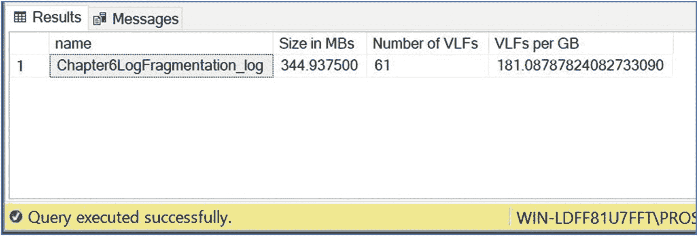

图 6-12
每 GB 的 VLF 数量

#### 注意

`DBCC LOGINFO` 是未公开的文档，因此不会得到 Microsoft 的支持。例如，在 SQL Server 2012 中，Microsoft 在输出中添加了一个名为 `RecoverUnitID` 的列，但他们从未公开过其描述。

`DBCC LOGINFO` 返回的每个列的含义如表 6-2 所述。

表 6-2
DBCC LOGINFO 列

| 列 | 描述 |
| --- | --- |
| `FileID` | 物理文件的 ID。假设你只有一个文件，这应该总是返回相同的值。 |
| `FileSize` | VLF 的大小（以字节为单位）。 |
| `StartOffset` | 从物理文件的开始到 VLF 起始位置的字节数。 |
| `FSeqNo` | 定义 VLF 的当前使用顺序。最高的 `FSeqNo` 表示当前正在写入的 VLF。 |
| `Status` | 状态为 2 表示 VLF 当前是活动的。状态为 0 表示不是活动的，因此可以被重用。 |
| `Parity` | 校验位从 0 开始。当 VLF 首次被使用时，它被设置为 64。随后，它可以设置为 64 或 128。每次 VLF 被重用时，此标志会切换到相反的值。 |
| `CreateLSN` | `CreateLSN` 表示创建 VLF 时使用的日志序列号。 |

了解了这些列之后，我们可以识别出前面所示结果的一些有趣事实。首先，因为前四个 VLF 的 `CreateLSN` 值为 0，我们知道这些是在日志文件本身生成时最初创建的 VLF。其余的则是由日志扩展而非循环使用创建的。我们还可以看到结果中的最后十个 VLF 尚未被使用，因为它们的 Parity 为 0。`FSeqNo` 为 83 的 VLF 是当前正在写入记录的 VLF，因为它具有最高的 `FSeqNo`。

最有趣的是，就本示例而言，我们可以看到前 51 个 VLF 被标记为活动状态，这意味着它们无法被重用。这意味着如果我们尝试收缩日志文件，只能移除十个 VLF，文件只能缩小它们文件大小的总和。

我们的日志增长且无法循环使用的原因是所有空间都在单个事务过程中被使用了，当然，我们的日志没有被备份。清单 6-19 中的查询将帮助你确定事务日志增长是否有其他原因。该查询检查 `sys.databases` 目录视图并返回 VLF 最后一次无法被重用的原因。

```sql
SELECT log_reuse_wait_desc
FROM sys.databases
WHERE name = 'Chapter6LogFragmentation';
```
清单 6-19
sys.databases

表 6-3 描述了在 SQL Server 2019 中仍在使用且并非仅供 Microsoft 内部使用的日志重用等待类型。重要的是要理解，日志重用等待适用于日志尝试循环的时刻，并且在你查询 `sys.databases` 时可能仍然无效。例如，如果在上一次尝试日志循环时存在一个活动事务，它会在 `sys.databases` 中反映出来，即使你在查询 `sys.databases` 时可能没有任何活动事务。

表 6-3
日志重用等待


| `Log_reuse_wait` | `Log_reuse_wait_description` | 描述 |
| --- | --- | --- |
| `0` | `NOTHING` | 日志在上次尝试时能够循环使用。 |
| `1` | `CHECKPOINT` | 通常表示自上次日志截断以来尚未发生 `CHECKPOINT`。 |
| `2` | `LOG_BACKUP` | 在进行日志备份之前，日志无法被截断。 |
| `3` | `ACTIVE_BACKUP_OR_RESTORE` | 数据库上当前正在进行备份或还原操作。 |
| `4` | `ACTIVE_TRANSACTION` | 存在长时间运行或已延迟的事务。延迟事务将在第 18 章讨论。 |
| `5` | `DATABASE_MIRRORING` | 异步副本仍在同步中，或镜像已暂停。 |
| `6` | `REPLICATION` | 日志中存在尚未被分发服务器接收的事务。 |
| `7` | `DATABASE_SNAPSHOT_CREATION` | 当前正在创建数据库快照。数据库快照将在第 16 章讨论。 |
| `8` | `LOG_SCAN` | 正在进行日志扫描操作。 |
| `9` | `AVAILABILITY_REPLICA` | 未完全同步辅助副本，或可用性组已暂停。 |
| `13` | `OLDEST_PAGE` | 数据库中最旧的页面比检查点 LSN 还要旧。当使用间接检查点时会发生这种情况。 |
| `16` | `XPT_CHECKPOINT` | 在日志可以被截断之前，需要一次针对内存优化表的 `CHECKPOINT`。 |

在我们的场景中，为了将 `VLF` 标记为可重用，我们需要备份事务日志。理论上，我们也可以切换到 `SIMPLE` 恢复模式，但这会破坏我们的日志链。在此之前，我们需要进行一次完整备份。这是因为所有备份序列都必须从完整备份开始。（备份和还原将在第 12 章讨论。）这样操作后，只有 `FSeqNo` 为 83 的 `VLF` 保持活动状态，其他的将被标记为可重用。

为了改善日志碎片化，我们需要先收缩日志文件，然后以更大的增量再次扩展它。因此，在我们的案例中，我们将日志文件尽可能收缩，这将收缩到 `FSeqNo` 为 83 的 `VLF`，因为这是文件中最后一个活动 `VLF`。然后我们将其扩展回 500MB。我们可以使用清单 6-20 中的脚本来执行这些任务。

```
USE Chapter6LogFragmentation
GO
DBCC SHRINKFILE ('Chapter6LogFragmentation _log', 0, TRUNCATEONLY);
GO
ALTER DATABASE Chapter6LogFragmentation MODIFY FILE ( NAME = 'Chapter6LogFragmentation _log', SIZE = 512000KB );
GO
清单 6-20
对事务日志进行碎片整理
```

最后，我们再次运行清单 6-18 中的查询，以便检查差异。图 6-13 显示，尽管日志增长了大约 155GB，但我们拥有的 `VLF` 数量比开始时更少。

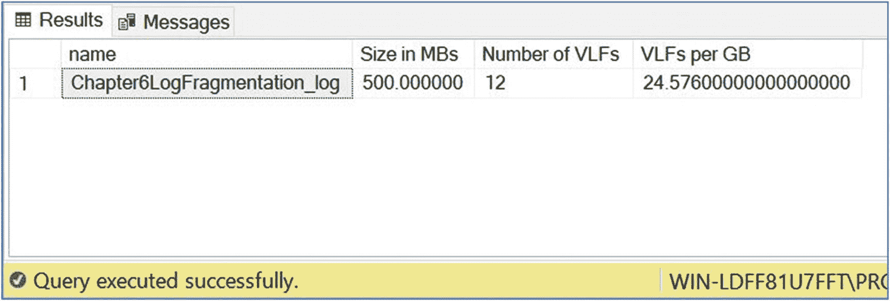

图 6-13

收缩和扩展后的日志碎片化情况

### 总结

`文件组` 是数据文件的逻辑容器。也存在用于 `FILESTREAM`/`FileTable` 数据以及内存优化数据的特殊 `文件组`。当创建表和索引时，它们是在 `文件组` 上创建的，而不是直接在文件上创建，并且对象中的数据会均匀分布在该 `文件组` 内的各个文件上。

你可以采用多种 `文件组` 策略来辅助性能、备份/恢复活动，甚至存储分层。为了提升性能，你可以选择将频繁连接的对象放入不同的 `文件组`，或者将所有对象分布到服务器的所有磁盘上以最大化 IO 吞吐量。

为了在维护窗口有限的情况下支持超大型数据库的备份，你可以将数据分布在不同的 `文件组` 上，并在隔夜轮换备份这些 `文件组`。为了缩短关键数据的恢复时间，你可以将关键数据隔离在单独的 `文件组` 中，然后先于其他 `文件组` 恢复它。

为了支持手动存储分层，请实现表分区，使每个分区存储在单独的 `文件组` 上。然后，你可以将每个 `文件组` 内的文件放置在适当的存储设备上。

`FILESTREAM` 和内存优化 `文件组` 都指向操作系统中的文件夹，而不是包含文件。每个文件夹位置被称为容器。对于内存优化 `文件组`，建议为你使用的每个磁盘阵列准备两个容器，以便均匀分布 IO。

你可以扩展和收缩数据文件。但是，收缩文件（尤其是自动收缩）被认为是不良实践，并可能导致严重的碎片化问题，从而引发性能问题。扩展文件时，应使用较大的增量以减少重复开销。

你也可以扩展和收缩日志文件，尽管很少需要收缩它们。以小增量扩展日志文件可能导致日志碎片化，即你的日志文件包含大量的 `VLF`。你可以通过先收缩日志文件，然后以更大的增量再次扩展它来解决日志碎片化问题。

