# 7. 表优化

在你的数据层应用程序的生命周期中，你可能需要对保存应用程序数据的表执行许多维护任务和性能优化操作。这些操作可能包括对表进行分区、压缩表或将数据迁移到内存优化表。在本章中，我们将详细探讨这三个概念。

### 表分区

*分区* 是针对大型表和索引的一种性能优化方法，它将对象水平拆分为更小的单元。当随后访问表或索引时，`SQL Server` 可以执行一种称为 *分区消除* 的优化，允许仅读取所需的分区，而不是整个表。此外，每个分区可以存储在单独的 `文件组` 上；这允许你将不同分区存储在不同的存储层上。例如，你可以将较旧、访问频率较低的数据存储在较便宜的存储上。图 7-1 展示了一个大型 `Orders` 表可能的结构。

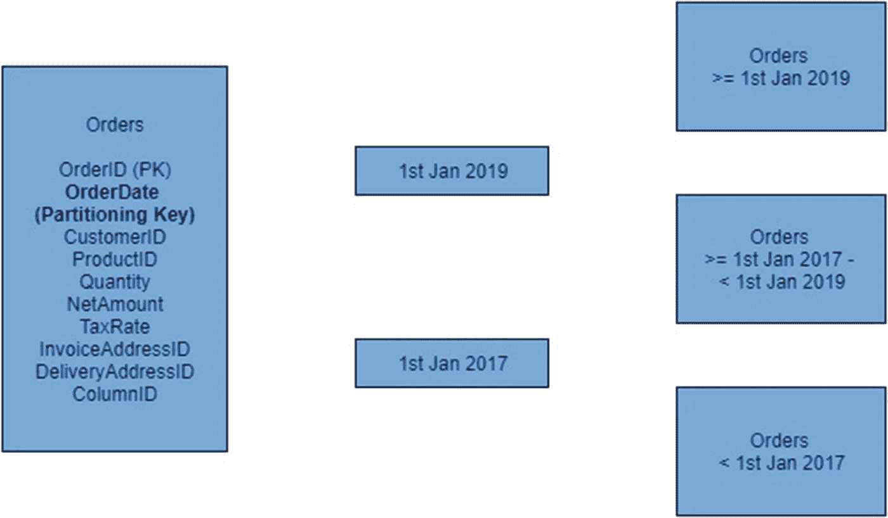

图 7-1

分区结构

#### 分区概念

在深入探讨分区的技术实现之前，理解相关概念会有所帮助，例如分区键、分区函数、分区方案和分区对齐。这些概念将在以下各节中讨论。


##### 数据库分区

##### 分区键

`分区键`用于确定表中每一行应放置在哪个分区中。如果表具有聚集索引，则分区键必须是聚集索引键的子集。表上所有其他`UNIQUE`索引，包括主键（如果与聚集索引不同），也需要包含分区键。分区键可以由任何数据类型组成，但以下类型除外：`TEXT`、`NTEXT`、`IMAGE`、`XML`、`TIMESTAMP`、`VARCHAR(MAX)`、`NVARCHAR(MAX)`和`VARBINARY(MAX)`。它也不能是用户定义的 CLR 类型列或具有别名数据类型的列。但是，它可以是计算列，只要该列是持久化的。许多场景会使用日期或日期时间列作为分区键。这允许你基于时间实现滑动窗口。我们将在本章后面讨论滑动窗口。在图 7-1 中，`OrderData`列被用作分区键。

由于该列用于在分区之间分布行，因此你应使用能够实现行均匀分布的列，以从解决方案中获得最大收益。你选择的列也应该是查询用作筛选条件的列。这将允许你实现分区消除。

##### 分区函数

你使用边界点来设置每个分区的上限和下限。在图 7-1 中，你可以看到边界点被设置为 2019 年 1 月 1 日和 2017 年 1 月 1 日。这些边界点在一个称为`分区函数`的数据库对象中进行配置。在创建分区函数时，你可以指定范围是左对齐还是右对齐。如果将范围左对齐，则任何严格等于边界点值的值都将存储在该边界点左侧的分区中。如果将范围右对齐，则严格等于边界点值的值将被放置在该边界点右侧的分区中。分区函数还规定了分区键的数据类型。

##### 分区方案

每个分区可以存储在单独的文件组上。`分区方案`是一个你创建的对象，用于指定每个分区将存储在哪个文件组上。从图 7-1 可以看出，分区的数量总是比边界点多一个。然而，当你创建分区方案时，可以指定一个“额外”的文件组。这将定义如果添加额外的边界点，下一个应使用的文件组。也可以指定`ALL`关键字，而不是指定各个文件组。这将强制所有分区存储在同一个文件组上。

##### 索引对齐

如果索引建立在与表相同的分区函数上，则该索引被视为与表对齐。如果索引建立在不同的分区函数上，但两个函数完全相同（即它们共享相同的数据类型、相同数量的分区和相同的边界点值），则它也被视为对齐。

由于聚集索引的叶级由表的实际数据页组成，因此聚集索引始终与表对齐。然而，非聚集索引可以存储在与堆或聚集索引不同的文件组上。这延伸到分区，其中基础表或非聚集索引可以独立分区。如果非聚集索引存储在相同的分区方案或相同的分区方案上，则它们是对齐的。如果不是这种情况，则它们是非对齐的。

除非有特定原因不这样做，否则将索引与基础表对齐是良好的实践。这是因为对齐索引有助于实现分区消除。索引对齐也是某些操作（如`SWITCH`）所必需的，这将在本章后面讨论。

##### 分区层次结构

涉及分区的对象以一对多的层次结构工作，因此多个表可以共享一个分区方案，多个分区方案可以共享一个分区函数，如图 7-2 所示。

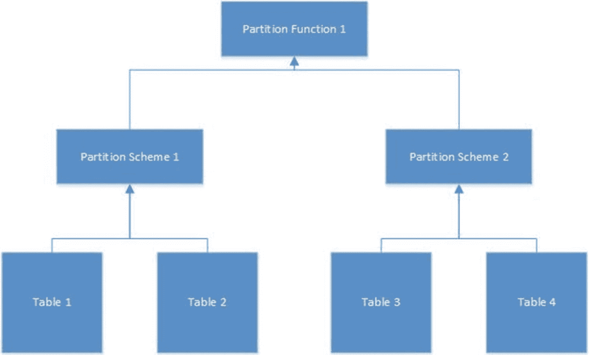

图 7-2
分区层次结构

#### 提示

虽然图数据库超出了本书的范围，但值得一提的是，SQL Server 2019 引入了对分区图数据库表和索引的支持，它将数据划分为单元，这些单元可以分布在多个文件组上。

### 实现分区

实现分区涉及创建分区函数和分区方案，然后在分区方案上创建表。如果表已存在，则需要删除并重新创建表的聚集索引。这些任务将在以下部分中讨论。

#### 创建分区对象

你需要创建的第一个对象是分区函数。这可以使用`CREATE PARTITION FUNCTION`语句创建，如代码清单 7-1 所示。此脚本创建一个名为`Chapter7`的数据库，然后创建一个名为`PartFunc`的分区函数。该函数指定分区键的数据类型为`DATE`，并为 2019 年 1 月 1 日和 2017 年 1 月 1 日设置边界点。表 7-1 详细说明了日期将如何分布在分区之间。

表 7-1
日期分布

| 日期 | 分区 | 备注 |
| --- | --- | --- |
| 2015 年 6 月 6 日 | 1 | |
| 2016 年 1 月 1 日 | 1 | 如果使用了`RANGE RIGHT`，此值将在分区 2 中。 |
| 2017 年 10 月 11 日 | 2 | |
| 2018 年 1 月 1 日 | 2 | 如果使用了`RANGE RIGHT`，此值将在分区 3 中。 |
| 2019 年 5 月 9 日 | 3 | |

```sql
USE Master
GO
--Create Database Chapter7 using default settings from Model
CREATE DATABASE Chapter7 ;
GO
USE Chapter7
GO
--Create Partition Function
CREATE PARTITION FUNCTION PartFunc(Date)
AS RANGE LEFT
FOR VALUES('2017-01-01', '2019-01-01') ;
Listing 7-1
创建分区函数
```

我们需要创建的下一个对象是分区方案。这可以使用`CREATE PARTITION SCHEME`语句创建，如代码清单 7-2 所示。此脚本创建一个名为`PartScheme`的分区方案，它基于`PartFunc`分区函数，并指定所有分区都将存储在`PRIMARY`文件组上。虽然将所有分区存储在同一个文件组上不允许我们实现存储分层，但它确实使我们能够自动化滑动窗口。

```sql
CREATE PARTITION SCHEME PartScheme
AS PARTITION PartFunc
ALL TO ([PRIMARY]) ;
Listing 7-2
创建分区方案
```


##### 创建新的分区表

现在我们已经有了分区函数和分区方案，剩下的就是创建分区表了。清单 7-3 中的脚本创建了一个名为 `Orders` 的表，并基于 `OrderDate` 列进行分区。尽管 `OrderNumber` 为我们的表提供了天然的主键，但我们仍需要将 `OrderDate` 包含在键中，以便它能用作分区列。显然，`OrderDate` 列本身并不适合作为主键，因为它无法保证唯一性。

```sql
CREATE TABLE dbo.Orders
(
OrderNumber int    NOT NULL,
OrderDate date     NOT NULL,
CustomerID int     NOT NULL,
ProductID int      NOT NULL,
Quantity int       NOT NULL,
NetAmount money    NOT NULL,
TaxAmount money    NOT NULL,
InvoiceAddressID int    NOT NULL,
DeliveryAddressID int   NOT NULL,
DeliveryDate date       NULL
)  ON PartScheme(OrderDate)  ;
GO
ALTER TABLE dbo.Orders ADD CONSTRAINT
PK_Orders PRIMARY KEY CLUSTERED
(
OrderNumber,
OrderDate
) WITH( STATISTICS_NORECOMPUTE = OFF, IGNORE_DUP_KEY = OFF,
ALLOW_ROW_LOCKS = ON, ALLOW_PAGE_LOCKS = ON) ON PartScheme(OrderDate) ;
GO
```

清单 7-3
创建分区表

这个脚本中需要注意的重要部分是 `ON` 子句。通常，你会在文件组上创建表，但在这里，我们是在分区方案上创建表，并传入将用作分区键的列名。分区键的数据类型必须与分区函数中指定的数据类型相匹配。

##### 分区现有表

由于聚集索引总是与基表对齐，因此将表移动到分区方案的过程非常简单：只需删除聚集索引，然后在分区方案上重新创建聚集索引即可。清单 7-4 中的脚本创建了一个名为 `ExistingOrders` 的表并填充数据。

```sql
--Create the ExistingOrders table
CREATE TABLE dbo.ExistingOrders
(
OrderNumber int    IDENTITY    NOT NULL,
OrderDate date     NOT NULL,
CustomerID int     NOT NULL,
ProductID int      NOT NULL,
Quantity int           NOT NULL,
NetAmount money        NOT NULL,
TaxAmount money        NOT NULL,
InvoiceAddressID int   NOT NULL,
DeliveryAddressID int  NOT NULL,
DeliveryDate date      NULL
)  ON [PRIMARY] ;
GO
ALTER TABLE dbo.ExistingOrders ADD CONSTRAINT
PK_ExistingOrders PRIMARY KEY CLUSTERED
(
OrderNumber,
OrderDate
) WITH( STATISTICS_NORECOMPUTE = OFF, IGNORE_DUP_KEY = OFF,
ALLOW_ROW_LOCKS = ON, ALLOW_PAGE_LOCKS = ON) ON [PRIMARY] ;
GO
--We will now populate the data with data so that we can view the storage properties
--and then partition the table when the data already exists.
--Build a numbers table for the data population
DECLARE @Numbers TABLE
(
Number    INT
)
;WITH CTE(Number)
AS
(
SELECT 1 Number
UNION ALL
SELECT Number + 1
FROM CTE
WHERE Number < 20
)
INSERT INTO @Numbers
SELECT Number FROM CTE ;
--Populate ExistingOrders with data
INSERT INTO dbo.ExistingOrders
SELECT
(SELECT CAST(DATEADD(dd,(SELECT TOP 1 Number
FROM @Numbers
ORDER BY NEWID(), a.Number, b.Number),GETDATE()) AS DATE)),
(SELECT TOP 1 Number -10 FROM @Numbers ORDER BY NEWID()),
(SELECT TOP 1 Number FROM @Numbers ORDER BY NEWID()),
(SELECT TOP 1 Number FROM @Numbers ORDER BY NEWID()),
500,
100,
(SELECT TOP 1 Number FROM @Numbers ORDER BY NEWID()),
(SELECT TOP 1 Number FROM @Numbers ORDER BY NEWID()),
(SELECT CAST(DATEADD(dd,(SELECT TOP 1 Number - 10
FROM @Numbers
ORDER BY NEWID(), a.Number, b.Number),GETDATE()) as DATE))
FROM @Numbers a
CROSS JOIN @Numbers b ;
```

清单 7-4
创建新表并用数据填充

如图 7-3 所示，通过查看“表属性”对话框的“存储”选项卡，我们可以看到该表是在 PRIMARY 文件组上创建的，并且未进行分区。

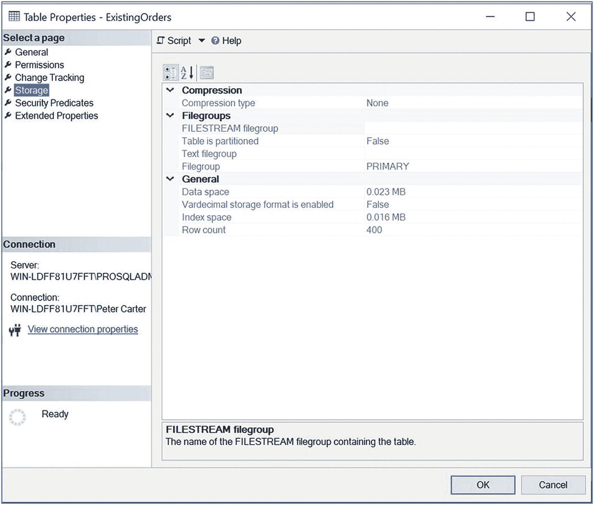

图 7-3
未分区的表属性

清单 7-5 中的脚本现在删除了 `ExistingOrders` 表的聚集索引，并在 `PartScheme` 分区方案上重新创建它。同样，需要注意的关键行是 `ON` 子句，它指定了 `PartScheme` 作为目标分区方案，并传入 `OrderDate` 作为分区键。

```sql
--Drop Clustered Index
ALTER TABLE dbo.ExistingOrders DROP CONSTRAINT PK_ExistingOrders ;
GO
--Re-created clustered index on PartScheme
ALTER TABLE dbo.ExistingOrders ADD  CONSTRAINT PK_ExistingOrders PRIMARY KEY CLUSTERED
(
OrderNumber ASC,
OrderDate ASC
)WITH (PAD_INDEX = OFF, STATISTICS_NORECOMPUTE = OFF, SORT_IN_TEMPDB = OFF,
IGNORE_DUP_KEY = OFF, ONLINE = OFF, ALLOW_ROW_LOCKS = ON,
ALLOW_PAGE_LOCKS = ON) ON PartScheme(OrderDate) ;
GO
```

清单 7-5
将现有表移动到分区方案上

在图 7-4 中，您可以看到，再次查看“表属性”对话框的“存储”选项卡，会发现该表现在已针对 `PartScheme` 分区方案进行了分区。

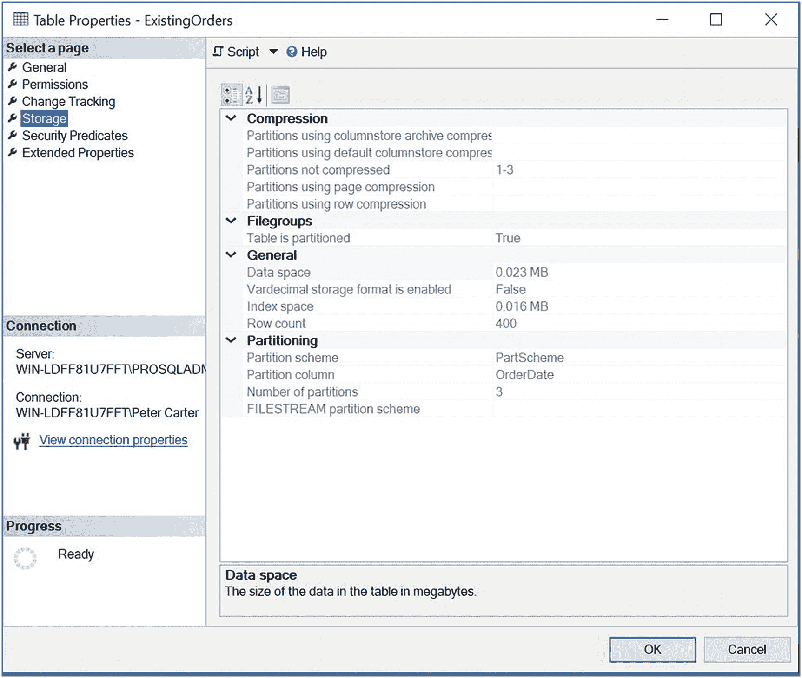

图 7-4
已分区的表属性

#### 监视分区表

您可能希望跟踪表中每个分区的行数。这样做可以确保您的行分布均匀。如果不是，您可能需要重新评估分区策略，以确保您能从该技术中获得全部收益。有两种方法可以实现这一点：`$PARTITION` 函数和 SSMS 的“按分区的磁盘使用情况”报表。


##### $PARTITION 函数

你可以使用 `$PARTITION` 函数来确定表中每个分区包含多少行。当你对分区函数运行此函数时，它接受分区键的列名作为参数，如代码清单 7-6 所示。

```sql
SELECT
COUNT(*) 'Number of Rows'
,$PARTITION.PartFunc(OrderDate) 'Partition'
FROM dbo.ExistingOrders
GROUP BY $PARTITION.PartFunc(OrderDate) ;
```
*代码清单 7-6 使用 $PARTITION 函数*

从图 7-5 的结果可以看出，我们表中的所有行都位于同一个分区中，这基本上违背了分区的意义，意味着我们应该重新评估我们的策略。

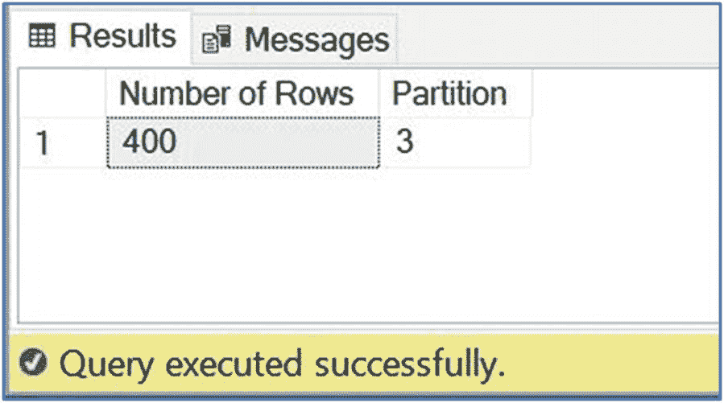

我们也可以使用 `$PARTITION` 函数来评估一个表在不同分区函数下的分区情况。这可以帮助我们规划如何解决 `ExistingOrders` 表的问题。代码清单 7-7 中的脚本创建了一个名为 `PartFuncWeek` 的新分区函数，该函数为 2019 年 11 月创建每周分区。然后，它使用 `$PARTITION` 函数来确定，如果实施此策略，我们的 `ExistingOrders` 表中的行将如何分布。目前，我们不需要创建分区方案或重新分区表。运行脚本前，请更改边界点值，使其基于你运行脚本的日期。这是因为表中的数据是使用 `GETDATE()` 函数生成的。

```sql
--Create new partition function
CREATE PARTITION FUNCTION PartFuncWeek(DATE)
AS RANGE LEFT
FOR VALUES ('2019-03-7','2019-03-14','2019-03-21','2019-03-28') ;
--Assess spread of rows
SELECT
COUNT(*) 'Number of Rows'
,$PARTITION.PartFuncWeek(OrderDate) 'Partition'
FROM dbo.ExistingOrders
GROUP BY $PARTITION.PartFuncWeek(OrderDate) ;
```
*代码清单 7-7：针对新分区函数使用 $PARTITION 函数*

图 7-6 中的结果显示，`ExistingOrders` 表中的行在每周分区之间分布得相当均匀，因此这可能为我们的表提供了一个合适的策略。

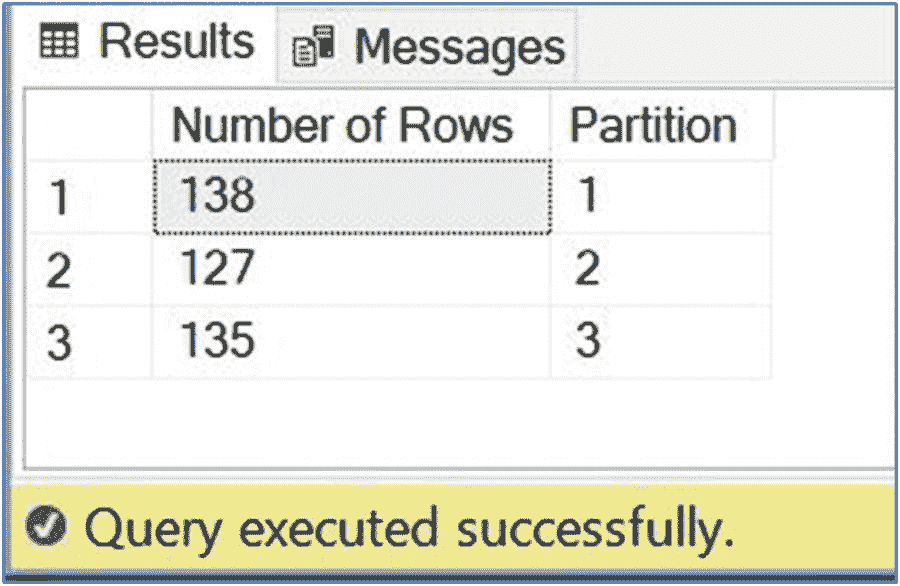

##### 滑动窗口

我们的每周分区策略似乎运行良好，但当我们进入 12 月会怎样呢？目前看来，2019 年 11 月 28 日之后的所有新订单都将进入同一个分区，该分区将不断增长。为了解决这个问题，SQL Server 为我们提供了创建滑动窗口的工具。在我们的案例中，这意味着每周都会为下一周创建一个新分区，并移除最早的分区。

为了实现这一点，我们可以使用 `SPLIT`、`MERGE` 和 `SWITCH` 操作。`SPLIT` 操作添加一个新的边界点，从而创建一个新分区。`MERGE` 操作移除一个边界点，从而将两个分区合并在一起。`SWITCH` 操作将一个分区移动到一个空表或分区中。

在我们的场景中，我们创建了一个暂存表，名为 `OldOrdersStaging`。我们使用此表作为暂存区来保存来自最早分区的数据。一旦数据进入暂存表，你就可以执行任何所需的操作或转换。例如，你的开发人员可能希望创建一个脚本来汇总数据，并将其传输到历史 `Orders` 表中。尽管 `OldOrdersStaging` 表被设计为临时对象，但需要注意的是，你不能使用临时表。相反，你必须使用永久表，并在最后 `drop` 它。这是因为临时表驻留在 TempDB 中，这意味着它们将位于不同的文件组上，而 `SWITCH` 将无法工作。`SWITCH` 是一个元数据操作，因此，所涉及的两个分区必须驻留在同一个文件组上。

代码清单 7-8 中的脚本实现了一个滑动窗口。首先，它为旧订单创建一个暂存表。该表的索引和约束必须与分区表的索引和约束相同。该表还必须位于同一个文件组上，以便 `SWITCH` 操作能够成功。然后，它确定分区表中的最高和最低边界点值，这些值将用作 `SPLIT` 和 `MERGE` 操作的参数。接着，它使用 `ALTER PARTITION FUNCTION` 命令来移除最低的边界点值并添加新的边界点。最后，它重新运行 `$PARTITION` 函数以显示新的行分布情况，并查询 `sys.partition_functions` 和 `sys.partition_range_values` 目录视图以显示 `PartFuncWeek` 分区函数的新边界点值。该脚本假设 `PartSchemeWeek` 分区方案已创建，并且 `ExistingOrders` 表已移动到该分区方案。


###### 实现滑动窗口

```sql
--创建 OldOrders 表
CREATE TABLE dbo.OldOrdersStaging(
[OrderNumber] [int] IDENTITY(1,1) NOT NULL,
[OrderDate] [date] NOT NULL,
[CustomerID] [int] NOT NULL,
[ProductID] [int] NOT NULL,
[Quantity] [int] NOT NULL,
[NetAmount] [money] NOT NULL,
[TaxAmount] [money] NOT NULL,
[InvoiceAddressID] [int] NOT NULL,
[DeliveryAddressID] [int] NOT NULL,
[DeliveryDate] [date] NULL,
CONSTRAINT PK_OldOrdersStaging PRIMARY KEY CLUSTERED
(
OrderNumber ASC,
OrderDate ASC
)WITH (PAD_INDEX = OFF, STATISTICS_NORECOMPUTE = OFF, IGNORE_DUP_KEY = OFF,
ALLOW_ROW_LOCKS = ON, ALLOW_PAGE_LOCKS = ON)
) ;
GO
--计算最低边界点值
DECLARE @LowestBoundaryPoint DATE = (
SELECT TOP 1 CAST(value  AS DATE)
FROM sys.partition_functions pf
INNER JOIN sys.partition_range_values prv
ON pf.function_id = prv.function_id
WHERE pf.name = 'PartFuncWeek'
ORDER BY value ASC) ;
--计算最高边界点值
DECLARE @HighestboundaryPoint DATE = (
SELECT TOP 1 CAST(value  AS DATE)
FROM sys.partition_functions pf
INNER JOIN sys.partition_range_values prv
ON pf.function_id = prv.function_id
WHERE pf.name = 'PartFuncWeek'
ORDER BY value DESC) ;
--向最高边界点值加 7 天以确定新的边界点
DECLARE @NewSplitRange DATE = (
SELECT DATEADD(dd,7,@HighestboundaryPoint)) ;
--将最旧的分区切换到 OldOrders 表
ALTER TABLE ExistingOrders
SWITCH PARTITION 1 TO OldOrdersStaging PARTITION 2 ;
--移除最旧的分区
ALTER PARTITION FUNCTION PartFuncWeek()
MERGE RANGE(@LowestBoundaryPoint) ;
--创建新分区
ALTER PARTITION FUNCTION PartFuncWeek()
SPLIT RANGE(@NewSplitRange) ;
GO
--重新运行 $PARTITION 以评估新的行分布
SELECT
COUNT(*) 'Number of Rows'
,$PARTITION.PartFuncWeek(OrderDate) 'Partition'
FROM dbo.ExistingOrders
GROUP BY $PARTITION.PartFuncWeek(OrderDate) ;
SELECT name, value FROM SYS.partition_functions PF
INNER JOIN SYS.partition_range_values PFR ON PF.function_id = PFR.function_id
WHERE name = 'PARTFUNCWEEK' ;
```

图 7-7 中显示的结果展示了分区是如何重新对齐的。

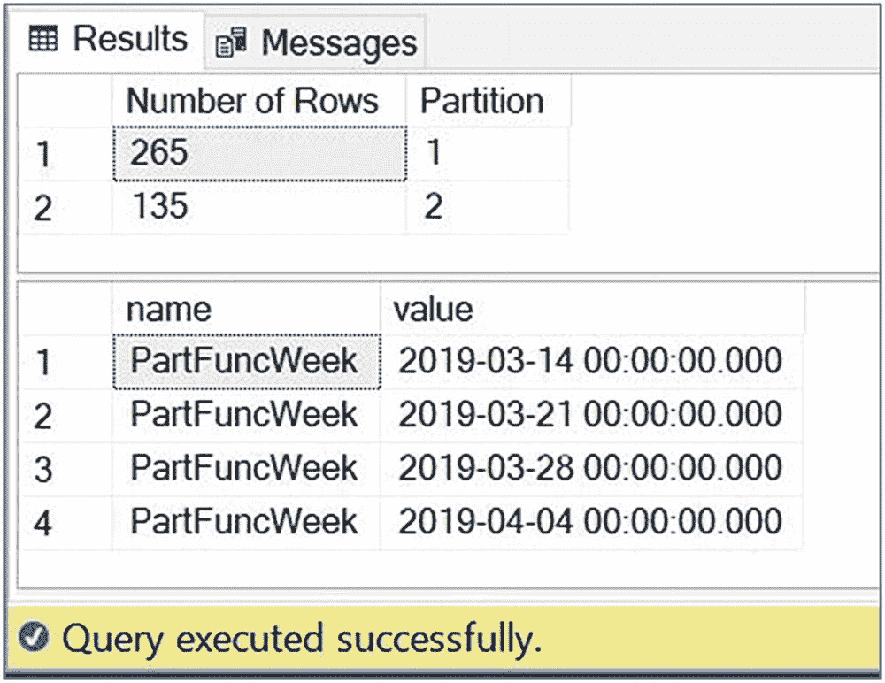

图 7-7 新分区对齐

使用`SWITCH`函数有几个限制。首先，表的所有非聚集索引必须与基表对齐。此外，您要移入数据的空表或分区必须具有相同的索引结构。它还必须与切换出的分区位于同一文件组上。这是因为`SWITCH`函数实际上并不移动任何数据，它是一个元数据操作，更改构成分区的页面的指针。

您可以在不同的文件组上执行`MERGE`和`SPLIT`，但这会带来性能上的阻碍。与`SWITCH`类似，如果涉及的所有分区都位于同一文件组上，`MERGE`和`SPLIT`可以作为元数据操作执行。但是，如果它们位于不同的文件组上，那么 SQL Server 就需要执行物理数据移动，这可能会花费更长的时间。

#### 分区消除

分区的一个关键优势是，查询优化器能够只访问满足查询结果所需的分区，而不是整个表。要使分区消除成功，分区键必须作为筛选条件包含在`WHERE`子句中。我们可以通过针对`ExistingOrders`表运行清单 7-9 中的查询，并选择包含实际执行计划的选项来见证此功能。

```sql
SELECT OrderNumber, OrderDate
FROM dbo.ExistingOrders
WHERE OrderDate BETWEEN '2019-03-01' AND '2019-03-07' ;
```

如果我们现在查看执行计划，并通过 SQL Server Management Studio 检查索引扫描运算符的属性，我们会看到只有一个分区被访问，如图 7-8 所示。


图 7-8 启用分区消除后的索引扫描运算符属性

然而，分区消除功能可能有点脆弱。例如，如果您以任何方式操作`OrderDate`列，而不仅仅是将其用于求值，那么分区消除就无法发生。例如，如果您将`OrderDate`列转换为`DATETIME2`数据类型，如清单 7-10 所示，那么所有分区都将需要被访问。此问题也会影响分区索引。

```sql
SELECT OrderNumber, OrderDate
FROM dbo.ExistingOrders
WHERE CAST(OrderDate AS DATETIME2) BETWEEN '2019-03-01' AND '2019-03-31' ;
```

图 7-9 展示了通过 SQL Server Management Studio 查看到的索引扫描运算符的相同属性。在这里，您可以看到所有分区都被访问了，而不仅仅是一个。


图 7-9 索引扫描属性，无分区消除

### 表压缩

当您想到压缩时，很自然会认为这是以牺牲性能为代价来节省空间。然而，这对于 SQL Server 表压缩来说并不总是成立。SQL Server 中的压缩实际上可以提供性能优势。这是因为 SQL Server 通常是一个受 IO 限制的应用程序，而不是受 CPU 限制。这意味着，如果 SQL Server 需要从磁盘读取的页面数量急剧减少，那么即使这会消耗 CPU 周期，性能也会提高。当然，如果您的数据库实际上受 CPU 限制（例如，因为您的磁盘速度非常快且只有一个 CPU 核心），那么压缩可能会产生负面影响，但这并不典型。为了理解表压缩，深入了解 SQL Server 如何在页面内存储数据会有所帮助。尽管对页面内部的完整讨论超出了本书的范围，但图 7-10 从高层次上展示了磁盘上页面和行的默认结构。

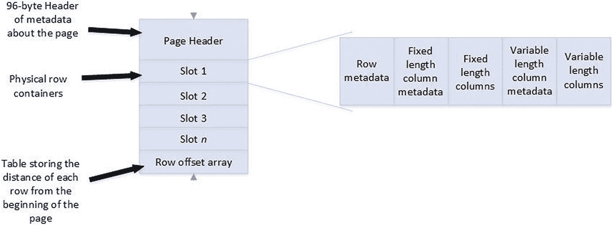

图 7-10 页面结构

在行内，行元数据包含诸如行是否存在版本控制信息以及行是否具有`NULL`值等详细信息。固定长度列元数据记录页面固定长度部分的长度。可变长度元数据包括一个可变长度列的列偏移数组，以便 SQL Server 可以跟踪每个列相对于行开始的位置。

#### 行压缩

在未压缩的页面中，如前所述，SQL Server 会先存储固定长度列，然后是可变长度列。唯一可以是可变长度的列是具有可变长度数据类型的列，例如 `VARCHAR` 或 `VARBINARY`。当为表实现行压缩时，SQL Server 也会为其他数据类型使用最小的存储空间。例如，如果有一个整数列，其在第 1 行包含一个 `NULL` 值，第 2 行值为 `50`，第 3 行值为 `40,000`，那么在第 1 行，该列根本不占用任何空间；在第 2 行它使用 1 个字节，因为系统会将其存储为 `TINYINT`；在第 3 行它使用 4 个字节，因为系统需要将其存储为 `INT`。这与未压缩的表每行（包括第 1 行）都使用 4 个字节形成对比。

此外，SQL Server 还会压缩 Unicode 列，使得可以存储为单字节的字符只使用单字节，而不是像在未压缩页面中那样使用 2 个字节。为了实现这些优化，SQL Server 必须使用不同的页面格式，如图 7-11 所示。

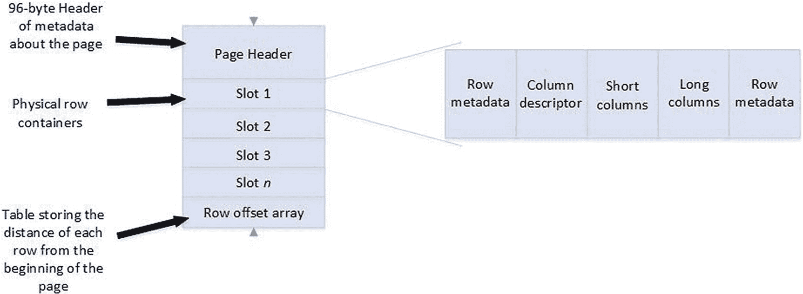
*图 7-11：采用行压缩的页面结构*

#### 注意

短列是指 8 字节或更少的列。

在图 7-11 中，行元数据的第一区域包含详细信息，例如是否存在有关该行的版本信息以及是否存在任何长数据列。列描述符包含短列的数量和每个长列的长度。元数据的第二区域包含详细信息，例如版本信息和堆的转发行指针。

#### 页压缩

当实现页压缩时，会首先实现行压缩。页压缩本身实际上由两种不同的压缩形式组成。第一种是*前缀压缩*，第二种是*字典压缩*。这些压缩类型在以下部分概述。

##### 前缀压缩

前缀压缩的工作原理是为页面内跨行的列建立一个公共前缀。一旦确定了最佳前缀值，SQL Server 会选择包含完整前缀的最长值作为锚点行，并将该列中的所有其他值存储为锚点行的差分，而不是存储值本身。例如，表 7-2 详细说明了存储在列中的值，并随后描述了 SQL Server 将如何使用前缀压缩存储这些值。值 `Postfreeze` 被选为锚点值，因为它是最长的、包含已识别的完整前缀 `Post` 的值。`<>` 中的数字是使用了多少前缀字符的标记。

*表 7-2：前缀压缩差分*

| 列 A 值 | 列 A 存储 | 列 B 值 | 列 B 存储 |
| --- | --- | --- | --- |
| `Postcode` | `<4>code` | `Teethings (锚点)` | — |
| `Postfreeze (锚点)` | — | `Teacher` | `<2>acher` |
| `Postpones` | `<4>pones` | `Teenager` | `<3>nager` |
| `Postilion` | `<4>ilion` | `Teeth` | `<5>` |
| `Imposters` | `<0>Imposters` | `Tent` | `<2>nt` |
| [`Poacher`](http://www.morewords.com/word/poacher/) | `<2>acher` | `Rent` | `<0>Rent` |

##### 字典压缩

字典压缩是在所有列都使用前缀压缩之后执行的。它查看页面中的所有列，并找到匹配的值。匹配是使用值的二进制表示执行的，这使得该过程与数据类型无关。当它找到重复值时，会将它们添加到页面顶部的特殊字典中，并在行中简单地存储一个指向该值在字典中位置的指针。表 7-3 扩展了上表，以便您对此有一个概览。

*表 7-3：字典压缩指针*

| 列 A 值 | 列 A 存储 | 列 B 值 | 列 B 存储 |
| --- | --- | --- | --- |
| `Postcode` | `<4>code` | `Teethings (锚点)` | — |
| `Postfreeze (锚点)` | — | `Teacher` | `[指针 1]` |
| `Postpones` | `<4>pones` | `Teenager` | `<3>nager` |
| `Postilion` | `<4>ilion` | `Teeth` | `<5>` |
| `Imposters` | `<0>Imposters` | `Tent` | `<2>nt` |
| [`Poacher`](http://www.morewords.com/word/poacher/) | `[指针 1]` | `Rent` | `<0>Rent` |

在这里，您可以看到前一表中出现在两列中的值 `<2>acher` 已被指向存储该值的字典的指针所取代。

##### 页压缩结构

为了便于页压缩，在页面头部之后立即插入一个特殊的行，该行包含有关锚点记录和字典的信息。此行称为压缩信息记录，如图 7-12 所示。

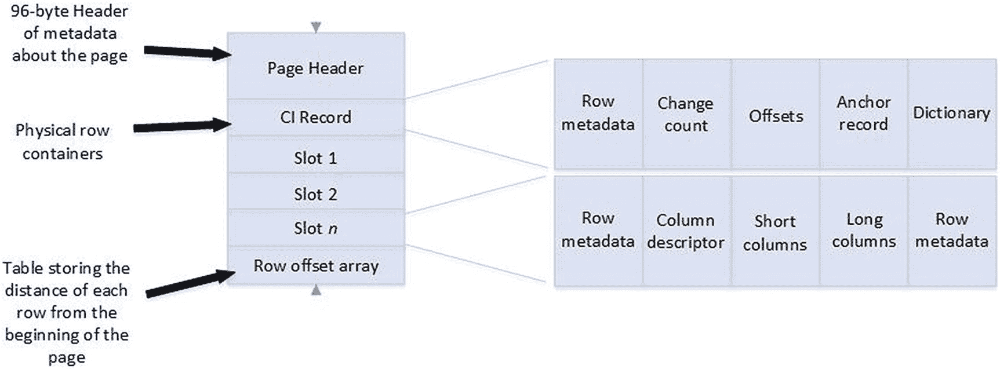
*图 7-12：采用页压缩的页面结构*

压缩信息记录的行元数据指定了记录是否包含锚点记录和字典。更改计数记录了对页面进行了多少次更改，这可能会影响锚点和字典的有用性。当表重建时，SQL Server 可以使用此信息来确定是否应重建页面。偏移量包含字典的开始和结束位置（从页面开头算起）。锚点记录包含每个列的前缀值，字典包含已为其创建指针的重复值。

#### 列存储压缩

列存储索引始终是自动压缩的。这意味着如果您在表上创建聚集列存储索引，您的表也将被压缩，并且这不能与行压缩或页压缩结合使用。您有两种类型的列存储压缩可用：`COLUMNSTORE`（在 SQL Server 2012 中引入）和 `COLUMNSTORE_ARCHIVE`（在 SQL Server 2014 中引入）。

您可以将 `COLUMNSTORE` 视为列存储索引的标准压缩类型，并且应仅对不常访问的数据使用 `COLUMNSTORE_ARCHIVE` 算法。这是因为就性能而言，此压缩算法打破了 SQL Server 数据压缩的规则。如果实现此算法，请预期会有非常高的压缩比，但也要准备好为此付出查询性能的代价。

#### 实现行压缩和页压缩

行压缩和页压缩的规划与实现是一个相当直接的过程，将在以下部分讨论。

##### 选择压缩级别

正如你可能从前文关于行压缩和页压缩的描述中已经意识到的，页压缩提供比行压缩更高的压缩率，这意味着更好的 I/O 性能。然而，这是以牺牲 CPU 周期为代价的，无论是在压缩表时，还是在访问表时都会产生开销。因此，在开始压缩表之前，请务必了解每种压缩类型能减少多少表的大小，以便评估你能获得多少 I/O 效率提升。

你可以通过使用一个名为 `sp_estimate_data_compression_savings` 的系统存储过程来实现这一点。该过程用于估算实施压缩可以节省的空间量。它接受表 7-4 中列出的参数。

表 7-4：`sp_estimate_data_compression_savings` 参数

| 参数 | 说明 |
| --- | --- |
| `@schema_name` | 包含你要对其运行该过程的表的架构名称。 |
| `@object_name` | 你要对其运行该过程的表的名称。 |
| `@index_ID` | 对所有索引传入 `NULL`。对于堆，索引 ID 始终为 `0`，而聚集索引的 ID 始终为 `1`。 |
| `@partition_number` | 对所有分区传入 `NULL`。 |
| `@data_compression` | 传入 `ROW`、`PAGE`、`COLUMNSTORE`、`COLUMNSTORE_ARCHIVE`，或者如果你希望评估从已压缩的表中移除压缩的影响，则传入 `NONE`。 |

代码清单 7-11 中对 `sp_estimate_data_compression_savings` 存储过程的两次执行，分别评估了行压缩和页压缩对我们 `ExistingOrders` 表所有分区的影响。

```
EXEC sp_estimate_data_compression_savings @schema_name = 'dbo', @object_name = 'ExistingOrders',
@index_id = NULL, @partition_number = NULL, @data_compression ='ROW' ;
EXEC sp_estimate_data_compression_savings @schema_name = 'dbo', @object_name = 'ExistingOrders',
@index_id = NULL, @partition_number = NULL, @data_compression ='PAGE' ;
```
代码清单 7-11：`Sp_estimate_data_compression_savings`

图 7-13 中的结果显示，对于当前正在使用的两个分区，页压缩相比行压缩不会带来额外的好处。因此，增加与页压缩相关的额外 CPU 开销是没有意义的。这是因为行压缩总是对表中每个页面的每一行实施。而页压缩则是在逐页的基础上进行评估，只有那些从压缩中受益的页面才会被重建。由于我们插入该表的数据主要是数字且具有随机性，SQL Server 已经确定我们表的页面不会从页压缩中受益。

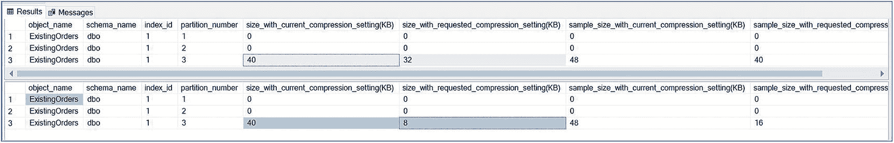
图 7-13：`sp_estimate_data_compression_savings` 的结果

**提示**
SQL Server 2019 在 `sp_estimate_data_compression_savings` 中引入了对列存储索引的支持。压缩类型 `COLUMNSTORE` 和 `COLUMNSTORE_ARCHIVE` 现在既可以作为源对象，也可以作为压缩类型使用。列存储压缩将在本章的“列存储压缩”一节中讨论。

##### 压缩表和分区

我们已经确定行压缩减小了表的大小，但实施页压缩无法获得进一步的好处。因此，我们可以使用代码清单 7-12 中的命令来压缩整个表。

```
ALTER TABLE ExistingOrders
REBUILD WITH (DATA_COMPRESSION = ROW) ;
```
代码清单 7-12：对整个表实施行压缩

然而，如果我们更仔细地查看结果，会发现实际上只有分区 1 受益于行压缩。分区 2 的大小保持不变。因此，压缩分区 2 不值得其开销。运行代码清单 7-13 中的 `ALTER TABLE` 语句将仅重建分区 1。然后，它将通过使用 `DATA_COMPRESSION = NONE` 重建整个表来移除压缩。

```
--使用 ROW 压缩压缩分区 1
ALTER TABLE ExistingOrders
REBUILD PARTITION = 1 WITH (DATA_COMPRESSION = ROW) ;
GO
--移除整个表的压缩
ALTER TABLE ExistingOrders
REBUILD WITH (DATA_COMPRESSION = NONE) ;
```
代码清单 7-13：对特定分区实施行压缩

##### 数据压缩向导

数据压缩向导可以通过表的上下文菜单，依次点击 **存储 ➤ 管理压缩** 来访问。它提供了一个图形用户界面（GUI）来管理压缩。向导的主页如图 7-14 所示。在此屏幕上，你可以使用 **对所有分区使用相同压缩类型** 选项在表上统一实施一种压缩类型。或者，你可以为每个单独的分区指定不同的压缩类型。**计算** 按钮运行 `sp_estimate_data_compression_savings` 存储过程，并显示每个分区的当前和预估结果。

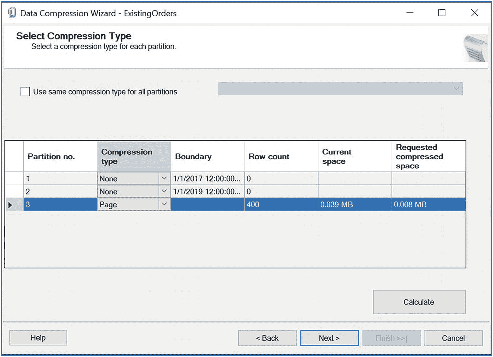
图 7-14：数据压缩向导

在向导的最后一页，你可以选择立即运行该过程、将操作编写为脚本，或使用 SQL Server Agent 计划其运行。

##### 维护堆上的压缩

当新页面被添加到堆（没有聚集索引的表）时，它们不会自动应用页压缩。这意味着重建压缩表应成为你在表没有聚集索引时的标准维护例程的一部分。要重建表上的压缩，你应该先移除压缩，然后再重新实施。

**提示**
如果新堆页面是使用 `INSERT INTO...WITH (TABLOCK)` 插入的，或者作为启用了优化的大容量插入的一部分插入的，它们将会被压缩。

##### 维护压缩分区

为了对分区使用 `SWITCH` 操作，两个分区必须选择相同的压缩级别。如果你使用 `MERGE`，则使用目标分区的压缩级别。当你使用 `SPLIT` 时，新分区从原始分区继承其压缩级别。

就像非分区表一样，如果你删除表的聚集索引，则堆会继承聚集索引的压缩级别。但是，如果你是在修改分区方案的操作中删除聚集索引，则压缩会从表中移除。


### 内存优化表

内存中 OLTP 是 SQL Server 的一项功能，它通过将所有表数据存储在内存中，从而提供显著的性能提升。当然，这可以极大地减少 IO，尽管这些表为了持久性也会保存到磁盘上。这是因为基于磁盘的表版本使用基于 FILESTREAM 的技术，以非结构化格式存储在数据库引擎之外。此外，内存优化的检查点操作发生得更为频繁。自从上一次自动检查点发生后，事务日志每增长 512MB 就会进行一次自动检查点。这消除了与检查点活动相关的 IO 峰值。由于记录的数据更少，内存优化表也能减少事务日志上的 IO 争用。同样值得一提的是，只有表的变更会被记录，索引变更则不会。

除了最小化 IO，内存中 OLTP 还能降低 CPU 开销。这是因为可以使用本机编译存储过程来访问数据，而不是传统的、解释型的代码。本机编译存储过程使用的指令显著更少，这意味着消耗的 CPU 时间更少。然而，内存优化表无助于减少网络开销，因为仍然需要将相同数量的数据传送给客户端。

就其本质而言，内存优化表会增加内存压力而非减少它，因为即使您从不使用这些数据，它仍然驻留在内存中，从而减少了传统资源可用于缓存的可用空间。这意味着内存中功能是为 OLTP 工作负载设计的，而不是数据仓库工作负载。预期是数据仓库中的事实表和维度表太大，无法驻留在内存中。

除了较低的资源使用率，内存优化表还有助于减少争用。当您访问内存优化表中的数据时，SQL Server 不会获取闩锁。这意味着闩锁和自旋锁争用会自动消除。由于一种用于实现隔离级别的新的乐观并发方法，读写事务之间的阻塞也可以减少。事务和隔离级别，包括内存优化的，将在第 18 章中讨论。

##### 持久性

创建内存优化表时，您可以将持久性设置指定为 `SCHEMA_AND_DATA` 或 `SCHEMA_ONLY`。如果您选择 `SCHEMA_AND_DATA`，则表的所有数据都将持久化到磁盘，并且事务会被记录。然而，如果您选择 `SCHEMA_ONLY`，则数据不会被持久化，事务也不会被记录。这意味着在 SQL Server 服务重启后，表的结构将保持完整，但它将不包含任何数据。这对于临时过程很有用，例如 ETL 加载期间的数据暂存。

#### 创建和管理内存优化表

> **提示**
>
> 乍一看，您可能很想在整个数据库中使用内存优化表。然而，它们有许多限制，事实上，您只应在例外情况下使用它们。这些限制将在本节后面讨论。

在创建内存优化表之前，必须已存在一个内存优化文件组。内存优化文件组在第 6 章中讨论。

您可以像创建基于磁盘的表一样，使用 `CREATE TABLE T-SQL` 语句创建内存优化表。不同之处在于，您必须指定一个 `WITH` 子句，该子句指明该表将进行内存优化。`WITH` 子句还用于指示您所需的持久性级别。

内存优化表还必须包含索引。我们将在第 8 章中全面讨论索引，包括内存优化表的索引，但现在您应该知道内存优化表支持以下索引类型：

*   非聚集哈希索引
*   非聚集索引

哈希索引组织到存储桶中，创建时必须使用 `BUCKET_COUNT` 参数指定存储桶计数。理想情况下，您的存储桶计数应该是索引键中不同值数量的两倍。您并不总是知道有多少个不同的值；在这种情况下，您可能希望显著增加 `BUCKET_COUNT`。权衡之处在于，存储桶越多，索引消耗的内存就越多。创建表后，索引大小是固定的，无法更改表或其索引。

清单 7-14 中的脚本创建了一个名为 `OrdersMem` 的完全持久化内存优化表，并用数据填充它。它在 `ID` 列上创建了一个非聚集哈希索引，存储桶计数为 2,000,000，因为我们将插入 1,000,000 行。该脚本假设内存优化文件组已经创建。

```
USE [Chapter7]
GO
CREATE TABLE dbo.OrdersMem(
OrderNumber int IDENTITY(1,1) NOT NULL PRIMARY KEY NONCLUSTERED HASH
WITH (BUCKET_COUNT= 2000000),
OrderDate date NOT NULL,
CustomerID int NOT NULL,
ProductID int NOT NULL,
Quantity int NOT NULL,
NetAmount money NOT NULL,
TaxAmount money NOT NULL,
InvoiceAddressID int NOT NULL,
DeliveryAddressID int NOT NULL,
DeliveryDate date NULL,
)WITH (MEMORY_OPTIMIZED = ON, DURABILITY = SCHEMA_AND_DATA) ;
DECLARE @Numbers TABLE
(
Number    INT
)
;WITH CTE(Number)
AS
(
SELECT 1 Number
UNION ALL
SELECT Number + 1
FROM CTE
WHERE Number < 100
)
INSERT INTO @Numbers
SELECT Number FROM CTE ;
--Populate ExistingOrders with data
INSERT INTO dbo.OrdersMem
SELECT
(SELECT CAST(DATEADD(dd,(SELECT TOP 1 Number
FROM @Numbers
ORDER BY NEWID()),getdate())as DATE)),
(SELECT TOP 1 Number -10 FROM @Numbers ORDER BY NEWID()),
(SELECT TOP 1 Number FROM @Numbers ORDER BY NEWID()),
(SELECT TOP 1 Number FROM @Numbers ORDER BY NEWID()),
500,
100,
(SELECT TOP 1 Number FROM @Numbers ORDER BY NEWID()),
(SELECT TOP 1 Number FROM @Numbers ORDER BY NEWID()),
(SELECT CAST(DATEADD(dd,(SELECT TOP 1 Number - 10
FROM @Numbers
ORDER BY NEWID()),getdate()) as DATE))
FROM @Numbers a
CROSS JOIN @Numbers b
CROSS JOIN @Numbers c ;
```

**清单 7-14** 创建内存优化表

#### 性能概况

在内存优化表开发期间，它们被称为 `Hekaton`，这是一个文字游戏，意思是快 100 倍。那么让我们看看内存中表和基于磁盘的表在不同查询类型上的性能对比如何。清单 7-15 中的代码创建了一个名为 `OrdersDisc` 的新表，并使用来自 `OrdersMem` 的数据填充它，以便您可以针对这两个表运行公平的测试。


#### 注意事项

对于本次基准测试，测试运行在虚拟机（VM）上，配置为 2×2 核 vCPU、8GB 内存和混合式 SSHD（固态混合技术）SATA 磁盘。

```sql
USE [Chapter7]
GO
CREATE TABLE dbo.OrdersDisc(
OrderNumber int NOT NULL,
OrderDate date NOT NULL,
CustomerID int NOT NULL,
ProductID int NOT NULL,
Quantity int NOT NULL,
NetAmount money NOT NULL,
TaxAmount money NOT NULL,
InvoiceAddressID int NOT NULL,
DeliveryAddressID int NOT NULL,
DeliveryDate date NULL,
CONSTRAINT [PK_OrdersDisc] PRIMARY KEY CLUSTERED
(
[OrderNumber] ASC,
[OrderDate] ASC
)
) ;
INSERT INTO dbo.OrdersDisc
SELECT *
FROM dbo.OrdersMem ;
```

**清单 7-15** 创建基于磁盘的表并填充数据

首先，我们将运行最基本的测试——对每个表执行 `SELECT *` 查询。清单 7-16 中的脚本在清除计划缓存和缓冲区缓存后运行这些查询，以确保测试公平。

```sql
SET STATISTICS TIME ON
--清除计划缓存
DBCC FREEPROCCACHE
--清除缓冲区缓存
DBCC DROPCLEANBUFFERS
--运行基准测试
SELECT *
FROM dbo.OrdersMem ;
SELECT *
FROM dbo.OrdersDisc ;
```

**清单 7-16** SELECT * 基准测试

从图 7-15 的结果中可以看出，内存优化表返回结果的速度刚好快了近 4.5%。

#### 提示

自然，您看到的结果可能会因运行脚本的系统而异。例如，如果您使用的是 SSD，那么针对基于磁盘的表的查询结果可能会更具可比性。另外请注意，此测试使用的是冷数据（不在缓冲区缓存中）。如果基于磁盘的表中的数据是温数据（在缓冲区缓存中），那么您可以预期结果会具有可比性，或者在某些情况下，针对基于磁盘的表的查询甚至可能略快一些。

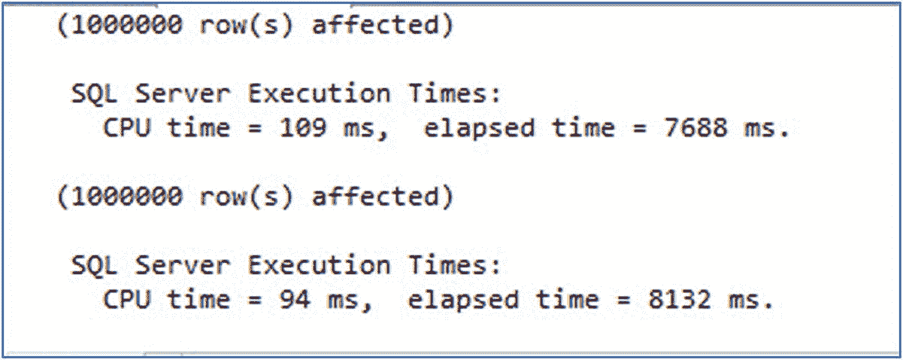

**图 7-15** SELECT ∗ 基准测试结果

在下一个测试中，我们看看如果加入聚合操作会发生什么。清单 7-17 中的脚本对每个表运行 `COUNT(*)` 查询。

```sql
SET STATISTICS TIME ON
--清除计划缓存
DBCC FREEPROCCACHE
--清除缓冲区缓存
DBCC DROPCLEANBUFFERS
--运行基准测试
SELECT COUNT(*)
FROM dbo.OrdersMem ;
SELECT COUNT(*)
FROM dbo.OrdersDisc ;
```

**清单 7-17** COUNT(*) 基准测试

从图 7-16 的结果中，我们可以看到这次内存优化表的性能显著优于基于磁盘的表，相比基于磁盘的表提供了 340% 的性能提升。

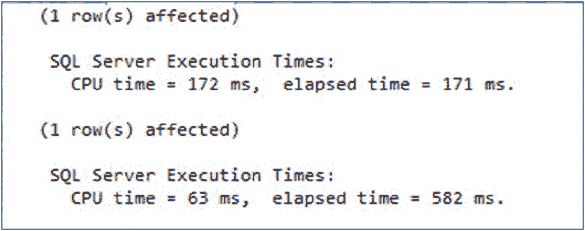

**图 7-16** COUNT(∗) 基准测试结果

观察在 `OrderNumber` 列上应用筛选器时，内存优化表与基于磁盘的表相比表现如何也很有趣，因为该列在两个表上都被索引覆盖。清单 7-18 中的脚本汇总了 `NetAmount` 列的数据，但它也在 `OrderNumber` 列上进行了筛选，只考虑超过 950,000 的 `OrderNumber`。

```sql
SET STATISTICS TIME ON
--清除计划缓存
DBCC FREEPROCCACHE
--清除缓冲区缓存
DBCC DROPCLEANBUFFERS
--运行基准测试
SELECT SUM(NetAmount)
FROM dbo.OrdersMem
WHERE OrderNumber > 950000 ;
SELECT SUM(NetAmount)
FROM dbo.OrdersDisc
WHERE OrderNumber > 950000 ;
```

**清单 7-18** 主键筛选器基准测试

在此情况下，由于内存优化表进行了扫描，而基于磁盘的表上的聚集索引能够执行索引查找，基于磁盘的表的执行速度大约是内存优化表的十倍。如图 7-17 所示。

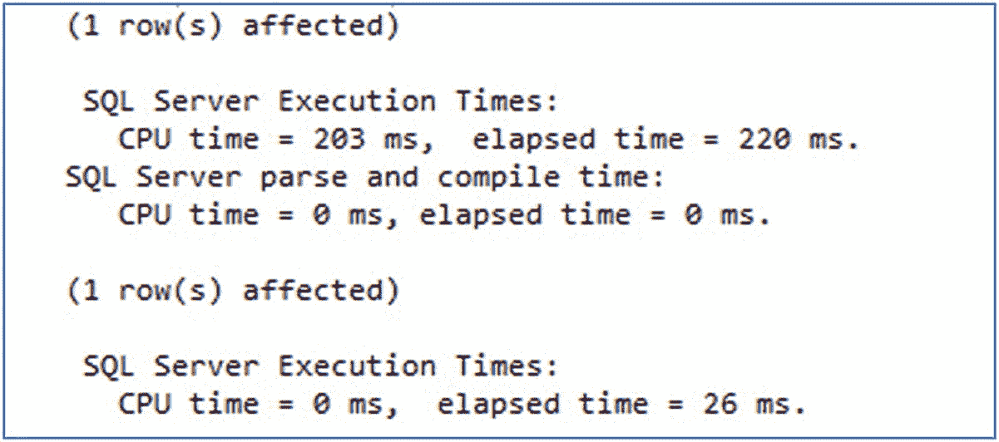

**图 7-17** SUM 主键筛选基准测试结果

#### 注意事项

如果我们实现的是非聚集索引，而不是非聚集哈希索引，那么内存优化表上最后一个查询的性能会优越得多。我们将在第 8 章完整讨论索引的影响。

#### 表内存优化顾问

“表内存优化顾问”是一个向导，可针对现有的基于磁盘的表运行，它将引导您完成迁移过程。向导的第一页会检查您的表是否存在不兼容的功能，例如稀疏列和针对基于磁盘的表的外键约束。

下一页会提供一个警告，涉及内存优化表不支持的功能，例如分布式事务和 `TRUNCATE TABLE` 语句。

向导的“迁移选项”页允许您指定表的持久性级别。勾选该框将导致表以 `DURABILITY = SCHEMA_ONLY` 创建。在此屏幕上，您还可以为正在迁移的基于磁盘的表选择一个新名称，因为显然新对象不能与现有对象共享名称。最后，您可以使用复选框指定是否要将现有表中的数据复制到新表。

“主键迁移”页允许您选择希望用来构成表主键的列，以及要在表上创建的索引。如果选择非聚集哈希索引，则需要指定桶计数；如果选择非聚集索引，则需要指定列和顺序。

向导的“摘要”屏幕提供了将执行的活动的概述。单击“迁移”按钮将开始迁移表。

#### 注意

尽管内存优化表与 SQL Server 功能集的兼容性在过去几个版本中已有显著改善，但仍有许多功能是内存优化表不支持的。不支持的 T-SQL 构造的完整列表可在 [`https://docs.microsoft.com/en-us/sql/relational-databases/in-memory-oltp/transact-sql-constructs-not-supported-by-in-memory-oltp?view=sql-server-ver15`](https://docs.microsoft.com/en-us/sql/relational-databases/in-memory-oltp/transact-sql-constructs-not-supported-by-in-memory-oltp%253Fview%253Dsql-server-ver15) 找到。

#### 本机编译对象

内存 OLTP 引入了本机编译，适用于内存优化表和存储过程。以下各节将讨论这些概念。

### 原生编译表

当你创建一个内存优化表时，SQL Server 会使用本机代码将表编译成一个 DLL（动态链接库），并将该 DLL 加载到内存中。你可以通过运行清单 7-19 中的查询来检查这些 DLL。该脚本检查 `dm_os_loaded_modules` DMV，然后根据 DLL 文件名中嵌入的表的 `object_id` 与 `sys.tables` 进行联接。这使得查询能够返回表的名称。

```sql
SELECT
m.name DLL
,t.name TableName
,description
FROM sys.dm_os_loaded_modules m
INNER JOIN sys.tables t
ON t.object_id =
(SELECT SUBSTRING(m.name, LEN(m.name) + 2 - CHARINDEX('_', REVERSE(m.name)),
len(m.name) - (LEN(m.name) + 2 - CHARINDEX('_', REVERSE(m.name)) + 3) ))
WHERE m.name like '%xtp_t_' + cast(db_id() as varchar(10)) + '%' ;
-- 清单 7-19
-- 查看内存优化表的 DLL
```

出于安全原因，每次 SQL Server 服务启动时，这些文件都会根据数据库元数据重新编译。这意味着如果 DLL 被篡改，所做的更改将不会持久化。此外，这些文件与 SQL Server 进程关联，以防止它们被修改。

当不再需要时，SQL Server 会自动删除这些 DLL。在表被删除并随后发出检查点之后，这些 DLL 将在实例重启时，或者当数据库脱机或被删除时，从内存中卸载并从文件系统中物理删除。

### 原生编译存储过程

除了原生编译的内存优化表之外，SQL Server 2019 还支持原生编译存储过程。如本章前面所述，与传统的解释型存储过程相比，这些过程可以减少 CPU 开销，并在执行时提供性能优势，因为它们所需的 CPU 周期更少。

创建原生编译存储过程的语法与创建解释型存储过程的语法类似，但有一些细微的差别。首先，该过程必须以 `BEGIN ATOMIC` 子句开头。过程体必须包含且仅包含一个 `BEGIN ATOMIC` 子句。该块内的事务将在块结束时提交。该块必须以 `END` 语句终止。当你开始这个原子块时，你`必须`指定隔离级别和使用的语言。

你还会注意到 `WITH` 子句包含 `NATIVE_COMPILATION`、`SCHEMABINDING` 和 `EXECUTE AS` 选项。对于原生编译过程，必须指定 `SCHEMABINDING`。这可以防止它所依赖的对象被更改。你还必须指定 `EXECUTE AS` 子句，因为 `EXECUTE AS` 的默认值是 `Caller`，但这并非原生编译支持的选项。如果你希望将现有的解释型 SQL 代码迁移到原生编译过程，这一点具有重要影响，这意味着你应该在代码迁移前重新评估你的安全策略。这个选项的含义相当直观。

你可以在清单 7-20 中看到一个创建原生编译存储过程的示例。此过程可用于更新 `OrdersMem` 表。

```sql
CREATE PROCEDURE UpdateOrdersMem
WITH NATIVE_COMPILATION, SCHEMABINDING, EXECUTE AS OWNER
AS
BEGIN ATOMIC WITH (TRANSACTION ISOLATION LEVEL = SNAPSHOT, LANGUAGE = 'English')
UPDATE dbo.OrdersMem
SET DeliveryDate = DATEADD(dd,1,DeliveryDate)
WHERE DeliveryDate < GETDATE()
END ;
-- 清单 7-20
-- 创建一个原生编译存储过程
```

在规划向原生编译过程的代码迁移时，你应该建议你的开发团队存在许多限制，他们将无法使用包括表变量、CTE（公用表表达式）、子查询、`WHERE` 子句中的 `OR` 运算符以及 `UNION` 等特性。

与内存优化表类似，也会为原生编译存储过程创建 DLL。清单 7-21 中修改后的脚本显示了与原生编译过程关联的 DLL 列表。

```sql
SELECT
m.name DLL
,o.name ProcedureName
,description
FROM sys.dm_os_loaded_modules m
INNER JOIN sys.objects o
ON o.object_id =
(SELECT SUBSTRING(m.name, LEN(m.name) + 2 - CHARINDEX('_', REVERSE(m.name)),
len(m.name) - (LEN(m.name) + 2 - CHARINDEX('_', REVERSE(m.name)) + 3) ))
WHERE m.name like '%xtp_p_' + cast(db_id() as varchar(10)) + '%' ;
-- 清单 7-21
-- 查看原生编译过程的 DLL
```

### 总结

SQL Server 提供了许多用于优化表的功能。分区允许将表拆分成更小的结构，这意味着 SQL Server 可以读取更少的页面来定位需要返回的行。此过程称为分区消除。分区还允许你通过将较旧的、访问频率较低的数据存储在廉价的存储设备上来执行存储分层。

`SWITCH`、`SPLIT` 和 `MERGE` 操作将帮助你为分区表实现滑动窗口。`SWITCH` 允许你将数据从其当前分区作为元数据操作移动到空分区或表中。`SPLIT` 和 `MERGE` 允许你在分区函数中插入和删除边界点。

基于行的表有两种压缩选项。这些压缩类型旨在作为性能增强，因为它们允许 SQL Server 减少从表中读取所有所需行所需的 I/O 量。行压缩的工作原理是将数值和 Unicode 值存储在可接受值所需的最小空间中，而不是最大空间中。页面压缩实现了行压缩，并增加了前缀和字典压缩。这提供了更高的压缩比，意味着更少的 I/O，但以消耗 CPU 为代价。

列存储索引有两种压缩方法。`COLUMNSTORE` 是标准压缩类型。`COLUMNSTORE_ARCHIVE` 应仅用于不常访问的数据。

内存优化表是 SQL Server 的一项功能，通过将整个表常驻内存来实现巨大的性能提升。这可以显著减少 I/O 压力。你可以将此类表与原生编译存储过程结合使用，后者通过与内存优化表的原生编译 DLL 直接交互，并减少所需的 CPU 周期（与解释型代码相比），也能提高性能。

## 8. 索引和统计信息

最近版本的 SQL Server 支持多种不同类型的索引，用于增强查询性能。这些包括建立在 B 树（平衡树）结构上的传统聚集和非聚集索引，它们增强了基于磁盘的表的读取性能。还有支持复杂数据类型的索引，例如 XML、JSON 和地理空间数据类型。这些高级数据类型索引超出了本书的范围，但完整的讨论可以在 Apress 的书籍 *SQL Server Advanced Data Types* 中找到，该书位于 [`www.apress.com/gp/book/9781484239001`](http://www.apress.com/gp/book/9781484239001)。DBA 还可以创建列存储索引以支持数据仓库风格的查询，即在非常大的表上进行分析。SQL Server 还支持内存中索引，这些索引增强了使用内存 OLTP 存储的表的性能。本章讨论了数据库引擎内部许多可用的索引类型。

SQL Server 维护关于索引和表列的统计信息，通过改进基数估计来增强查询性能。这使得查询优化器能够生成高效的查询计划。本章还讨论了如何使用和维护统计信息。


### 聚集索引

一个 `B 树` 是一种你可以用来组织键值的数据结构，使得用户可以比必须读取整张表快得多地搜索他们要查找的数据。它是一种基于树的结构，其中每个节点允许拥有两个以上的子节点。该树是平衡的，这意味着检索任何单行数据所需的步骤数始终相同。

一个 `聚集索引` 是一种 B 树结构，它使得表的数据页根据聚集索引键的逻辑顺序进行存储。聚集索引键可以是单个列，也可以是一组确保表中每行唯一性的列。该键通常是表的主键，尽管这是最典型的用法，但在某些情况下，你可能希望使用不同的列。本章稍后将更详细地讨论这一点。

#### 没有聚集索引的表

当一张表存在但没有聚集索引时，它被称为 `堆`。一个堆由一个或多个 IAM（索引分配映射）页和一系列未链接在一起或未按顺序存储的数据页组成。SQL Server 确定表的数据页的唯一方式是读取 IAM 页。当表作为堆存储，即没有索引时，每次访问该表，SQL Server 都必须读取表中的每一个数据页，即使你只想返回一行数据。图 8-1 中的示意图说明了堆的结构。

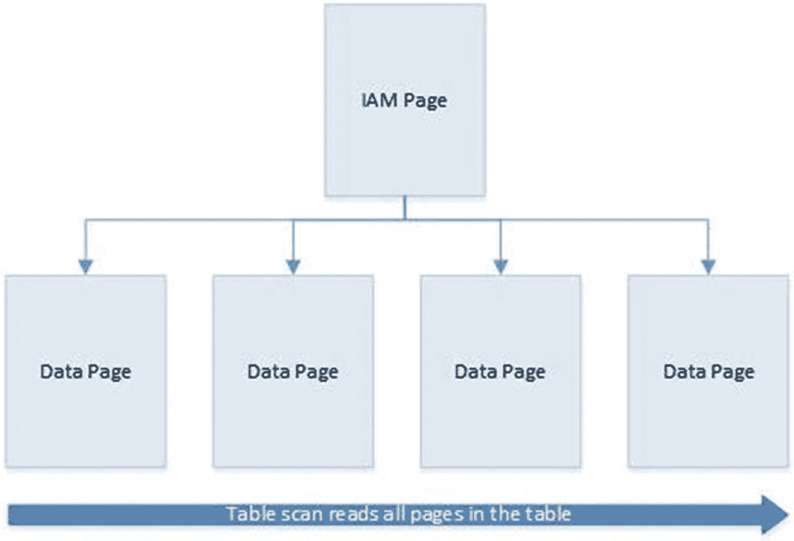

图 8-1：堆结构

当数据存储在堆上时，SQL Server 需要为每一行维护一个唯一标识符。它通过创建一个 RID（行标识符）来实现这一点。RID 的格式为 `文件 ID:页 ID:槽号`，这是一个物理位置。即使一张表有非聚集索引，除非存在聚集索引，否则它仍然作为堆存储。当在堆上创建非聚集索引时，RID 被用作指针，使得非聚集索引能够链接回基表中的正确行。

#### 有聚集索引的表

当你在表上创建聚集索引时，就会创建一个 B 树结构。这个 B 树基于聚集键的值，如果聚集索引不是唯一的，它还会包含一个唯一值生成器。一个 `唯一值生成器` 是一个用于在键值相同时识别行的值。这允许 SQL Server 通过创建到数据的分层指针集来执行更高效的搜索操作，如图 8-2 所示。此层次结构顶层的页面称为 `根节点`。结构的底层称为 `叶级别`，对于聚集索引，叶级别由表的实际数据页组成。根据表的大小，B 树结构可以有一个或多个中间级别。

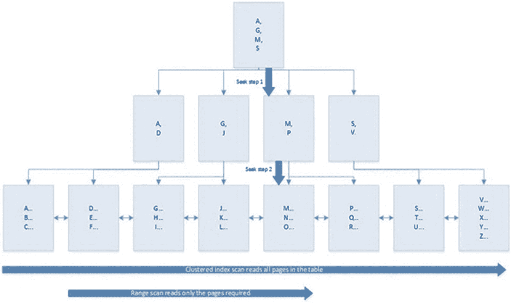

图 8-2：聚集索引结构

图 8-2 显示，尽管叶级别是数据本身，但其上的级别包含指向其下方树中页面的指针。这使得 SQL Server 可以执行查找操作，这是一种返回少量行的非常高效的方法。它的工作原理是沿着 B 树向下导航，使用指针来找到所需的行。在此图中，我们可以看到，如果需要，SQL Server 仍然可以扫描所有表页面来检索所需的行——这被称为 `聚集索引扫描`。或者，SQL Server 可能决定结合这两种方法来执行范围扫描。这里，SQL Server 查找所需范围的第一个值，然后扫描叶级别，直到遇到第一个不需要的值。SQL Server 可以这样做，因为表是按照索引键排序的，这意味着它可以保证没有其他匹配值出现在表中更靠后的位置。

#### 主键聚簇

表的主键通常是聚集索引的自然选择，因为许多 OLTP 应用程序 99% 的数据访问是通过主键进行的。事实上，默认情况下，除非你另有指定，或者表上已存在聚集索引，否则创建主键会自动在该键上生成聚集索引。存在一些情况，主键不是聚集索引的正确选择。我亲身经历过的一个例子是一个第三方应用程序，它要求表的主键是一个 GUID。

如果聚集索引要建立在主键上，那么在 GUID 上创建聚集索引会带来两个主要问题。第一个是大小。一个 GUID 长 16 字节。当表有非聚集索引时，聚集索引键会存储在每一个非聚集索引中。对于唯一的非聚集索引，它在叶级别为每一行存储；对于非唯一的非聚集索引，它也在索引的根级别和中间级别的每一行存储。当你将 16 字节乘以数百万行时，这会极大地增加索引的大小，使其效率降低。

第二个问题是，当 GUID 生成时，它是一个随机值。为了获得良好的性能，表中的数据按照聚集索引键的顺序存储，因此你需要此键的值按顺序生成。为聚集索引键生成随机值会导致每次插入新行时，索引变得越来越碎片化。碎片将在本章后面讨论。

不过，对于第二个问题有一个解决方法。SQL Server 有一个名为 `NEWSEQUENTIALID()` 的函数。此函数总是生成一个比之前在服务器上生成的值更高的 GUID 值。因此，如果你在主键的默认约束中使用此函数，就可以强制顺序插入。

#### 注意

服务器重启后，`NEWSEQUENTIALID()` 可能从一个较低的值开始。这可能会导致碎片。

如果主键必须是 GUID 或其他宽列（例如社会保障号），或者它必须是一组构成自然键的列（例如客户 ID、订单日期和产品 ID），那么强烈建议你在表中创建一个额外的列。你可以根据预期表中的行数，将此列设为 `INT` 或 `BIGINT`，并可以使用 `IDENTITY` 属性或 `SEQUENCE` 来为你的聚集索引创建一个窄的、顺序的键。

#### 提示

请记住，窄的聚集键很重要，因为它将包含在表的所有其他索引中。

#### 管理聚集索引

你可以使用 `CREATE CLUSTERED INDEX` 语句创建聚集索引，如代码清单 8-1 所示。其他可用于创建聚集索引的方法包括：使用带有 `PRIMARY KEY` 子句的 `ALTER TABLE` 语句，以及在 `CREATE TABLE` 语句中使用 `INDEX` 子句（只要你使用的是 SQL Server 2014 或更高版本）。此脚本创建了一个名为 `Chapter8` 的数据库，然后创建了一个名为 `CIDemo` 的表。最后，它在表的 `ID` 列上创建了一个聚集索引。

```sql
-- 代码清单 8-1：创建聚集索引
CREATE CLUSTERED INDEX IX_CIDemo_ID ON dbo.CIDemo(ID);
```


#### 注意

请记得修改文件路径以匹配您自己的配置。

```sql
--创建 Chapter8 数据库
CREATE DATABASE Chapter8
ON  PRIMARY
( NAME = N'Chapter8', FILENAME =
N'F:\Program Files\Microsoft SQL Server\MSSQL15.PROSQLADMIN\MSSQL\DATA\Chapter8.mdf'),
FILEGROUP [MEM] CONTAINS MEMORY_OPTIMIZED_DATA  DEFAULT
( NAME = N'MEM', FILENAME = N'H:\DATA\CH08')
LOG ON
( NAME = N'Chapter8_log', FILENAME =
N'E:\Program Files\Microsoft SQL Server\MSSQL15.PROSQLADMIN\MSSQL\DATA\Chapter8_log.ldf') ;
GO
USE Chapter8
GO
--创建 CIDemo 表
CREATE TABLE dbo.CIDemo
(
ID       INT       IDENTITY,
DummyText     VARCHAR(30)
) ;
GO
--创建聚集索引
CREATE UNIQUE CLUSTERED INDEX CI_CIDemo ON dbo.CIDemo([ID]) ;
GO
清单 8-1
创建聚集索引
```

当创建索引时，有许多 `WITH` 选项可以指定。这些选项在表 8-1 中概述。

**表 8-1**
**聚集索引的 WITH 选项**

| 选项 | 描述 |
| --- | --- |
| `MAXDOP` | 指定用于构建索引的核心数。每个使用的核心构建自己的索引部分。权衡之处在于，较高的 `MAXOP` 构建索引更快，但较低的 `MAXDOP` 意味着索引构建时产生的碎片更少。 |
| `FILLFACTOR` | 指定应在索引叶子级的每个页面中保留多少可用空间。这有助于减少因插入导致的碎片，但代价是索引更宽，读取需要更多 IO。对于聚集索引，如果其键值不变且始终递增，请始终将其设置为 0，即 100% 满减去足够一行的空间。 |
| `PAD_INDEX` | 将填充因子百分比应用于 B 树的中间级别。 |
| `STATISTICS_NORECOMPUTE` | 打开或关闭分布统计信息的自动更新。本章后面将讨论统计信息。 |
| `SORT_IN_TEMPDB` | 指定索引的中间排序结果应存储在 TempDB 中。使用此选项可以将 IO 卸载到承载 TempDB 的磁盘，但代价是使用更多磁盘空间。如果 `RESUMABLE` 为 `ON`，则此项不能为 `ON`。 |
| `STATISTICS_INCREMENTAL` | 指定是否应按分区创建统计信息。本章后面将讨论其限制。 |
| `DROP_EXISTING` | 用于删除并重建同名的现有索引。 |
| `IGNORE_DUP_KEY` | 启用此选项后，尝试向唯一索引中插入重复键值的 `INSERT` 语句不会失败。而是会生成警告，只有违反唯一约束的行会失败。 |
| `ONLINE` | 可设置为 `ON` 或 `OFF`，默认为 `OFF`。指定在索引构建或重建期间是否应对整个表和索引加锁。如果为 `ON`，则查询仍可在操作期间访问表。这以索引构建时间为代价。对于聚集索引，如果表包含 LOB 数据，则此选项不可用。* |
| `OPTIMIZE_FOR_SEQUENTIAL_KEY` | 优化高并发插入，其中索引键是顺序的。此功能于 SQL Server 2019 引入，专为遭受最后一页插入争用的索引设计。 |
| `RESUMABLE` | 可设置为 `ON` 或 `OFF`，默认为 `OFF`。指定索引创建或构建是否可以暂停和恢复，或者是否可以在失败后恢复。仅当 `ONLINE` 设置为 `ON` 时，此项才能设置为 `ON`。 |
| `MAX_DURATION` | 以分钟为单位，指定索引重建或重新生成在暂停前将执行的最大时长。仅当 `ONLINE` 设置为 `ON` 且 `RESUMABLE` 设置为 `ON` 时才能指定。 |
| `ALLOW_ROW_LOCKS` | 指定在访问表时可以获取行锁。这并不意味着它们一定会被获取。 |
| `ALLOW_PAGE_LOCKS` | 指定在访问表时可以获取页锁。这并不意味着它们一定会被获取。 |

*空间数据被视为 LOB 数据。*

如本章前面所述，如果在表上创建主键，除非您指定了 `NONCLUSTERED` 关键字，或者已存在聚集索引，否则会自动创建一个聚集索引来覆盖主键的列。同时，请记住，有时如果主键很宽或者它不是始终递增的，您可能希望将聚集索引移动到更合适的列上。

为了实现这一点，您需要删除主键约束，然后使用 `NONCLUSTERED` 关键字重新创建它。这会强制 SQL Server 用唯一的非聚集索引覆盖主键。此操作完成后，您就可以在您选择的列上创建聚集索引。

如果您需要删除一个未覆盖主键的聚集索引，可以使用 `DROP INDEX` 语句来完成，如清单 8-2 所示，该语句删除了我们在上一个示例中创建的聚集索引。

```sql
DROP INDEX CI_CIDemo ON dbo.CIDemo ;
清单 8-2
删除索引
```

### 非聚集索引

非聚集索引与聚集索引一样，基于 B 树结构。不同之处在于，非聚集索引的叶子级包含指向表数据页的指针，而不是表的数据页本身，如图 8-3 所示。这意味着一个表可以有多个非聚集索引来支持查询性能。

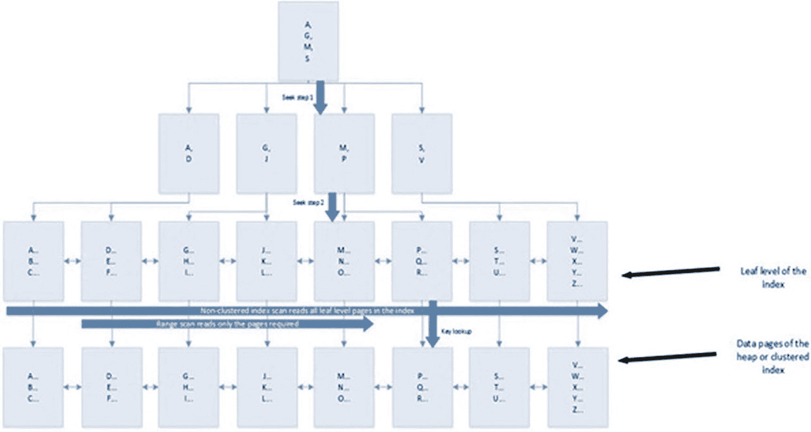

**图 8-3**
**非聚集索引结构**

与聚集索引一样，非聚集索引支持查找、扫描和范围扫描操作以查找所需数据。如果非聚集索引的索引键包含查询期间需要访问的所有列，那么您就不需要 SQL Server 访问基础表。如果访问的列仅包含在非聚集索引和聚集索引键中，这也同样成立。这是因为非聚集索引的叶子级总是包含聚集索引键。这被称为索引*覆盖查询*，将在下一节讨论。

如果查询需要返回未包含在非聚集索引或聚集索引键中的列，SQL Server 需要在基础表中找到匹配的行。这通过称为*键查找*的过程完成。键查找操作使用聚集索引键值或 RID（如果表没有聚集索引）从基础表访问所需的行。

对于少量行来说，这可能是高效的，但如果查询返回许多行，它很快就会变得代价高昂。这意味着，如果将返回许多行，SQL Server 可能决定忽略非聚集索引而使用聚集索引或堆的开销更低。此决策称为索引的*临界点*。临界点因表而异，但通常介于表的 0.5% 到 2% 之间。


#### 覆盖索引

虽然将所有必需的列都包含在非聚集索引中意味着你无需从基础表中检索数据，但权衡之处在于，非聚集索引中包含过多列会导致索引变得非常宽且低效。为了取得更好的平衡，SQL Server 为你提供了“包含列”的选项。

包含列仅包含在索引的叶级，而索引键值则继续包含在 B 树的每一级。此功能可以帮助你在保持索引键尽可能窄的同时，覆盖你的查询。此概念在图 8-4 中有说明。该图展示了索引是使用 `Balance` 作为索引键构建的，但 `FirstName` 和 `LastName` 列也被包含在叶级。你可以看到 `CustomerID` 也被包含在所有级中；这是因为 `CustomerID` 是聚集索引键。由于聚集索引键包含在所有级中，这意味着该索引不是唯一的。如果它是唯一的，那么聚集键只包含在 B 树的叶级。这意味着唯一的非聚集索引总是比其非唯一等效索引更窄。此索引非常适合于在 `WHERE` 子句中过滤 `Balance` 并返回 `FirstName` 和 `LastName` 列的查询。它也覆盖那些在结果中返回 `CustomerID` 的查询。

#### 提示

如果聚集索引和非聚集索引都是非唯一的，则非聚集 B 树的每一级都包括聚集唯一标识符以及聚集键。

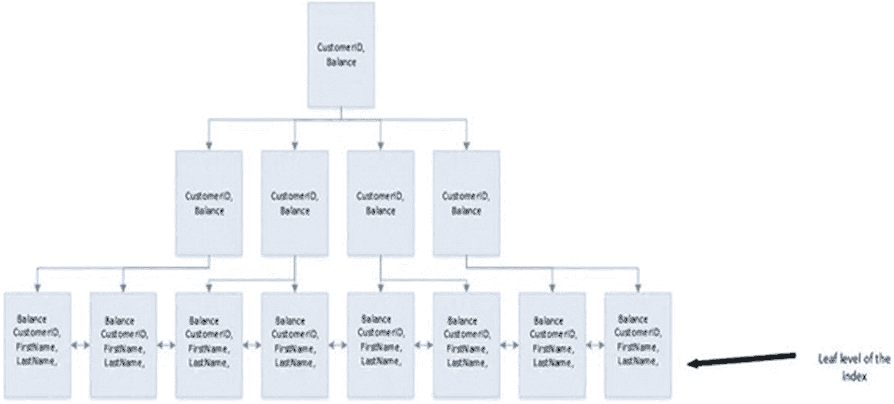
*图 8-4：包含列的非聚集索引*

你也可以使用图 8-4 所示的索引来覆盖那些在 `WHERE` 子句中过滤 `FirstName` 或 `LastName` 的查询，前提是不返回表中的其他列。然而，为了处理查询，SQL Server 需要执行索引扫描，而不是索引查找或范围扫描，这当然效率较低。

#### 管理非聚集索引

你可以使用 `CREATE NONCLUSTERED INDEX` T-SQL 语句创建非聚集索引。代码清单 8-3 中的脚本在 `Chapter8` 数据库中创建了一个名为 `Customers` 的表和一个名为 `Orders` 的表。然后，它在 `CustomerID` 列上创建了一个外键约束。最后，在 `Customers` 表的 `Balance` 列上创建了一个非聚集索引。聚集索引会自动在每个表的主键列上创建。

```sql
USE Chapter8
GO
--Create and populate numbers table
DECLARE @Numbers TABLE
(
Number    INT
)
;WITH CTE(Number)
AS
(
SELECT 1 Number
UNION ALL
SELECT Number + 1
FROM CTE
WHERE Number < 100
)
INSERT INTO @Numbers
SELECT Number FROM CTE ;
--Create and populate name pieces
DECLARE @Names TABLE
(
FirstName    VARCHAR(30),
LastName     VARCHAR(30)
) ;
INSERT INTO @Names
VALUES('Peter', 'Carter'),
('Michael', 'Smith'),
('Danielle', 'Mead'),
('Reuben', 'Roberts'),
('Iris', 'Jones'),
('Sylvia', 'Davies'),
('Finola', 'Wright'),
('Edward', 'James'),
('Marie', 'Andrews'),
('Jennifer', 'Abraham') ;
--Create and populate Customers table
CREATE TABLE dbo.CustomersDisk
(
CustomerID         INT          NOT NULL    IDENTITY    PRIMARY KEY,
FirstName          VARCHAR(30)  NOT NULL,
LastName           VARCHAR(30)  NOT NULL,
BillingAddressID   INT          NOT NULL,
DeliveryAddressID  INT          NOT NULL,
CreditLimit        MONEY        NOT NULL,
Balance            MONEY        NOT NULL
) ;
SELECT * INTO #CustomersDisk
FROM
(SELECT
(SELECT TOP 1 FirstName FROM @Names ORDER BY NEWID()) FirstName,
(SELECT TOP 1 LastName FROM @Names ORDER BY NEWID()) LastName,
(SELECT TOP 1 Number FROM @Numbers ORDER BY NEWID()) BillingAddressID,
(SELECT TOP 1 Number FROM @Numbers ORDER BY NEWID())  DeliveryAddressID,
(SELECT TOP 1
CAST(RAND() * Number AS INT) * 10000
FROM @Numbers
ORDER BY NEWID()) CreditLimit,
(SELECT TOP 1
CAST(RAND() * Number AS INT) * 9000
FROM @Numbers
ORDER BY NEWID()) Balance
FROM @Numbers a
CROSS JOIN @Numbers b
) a ;
INSERT INTO dbo.CustomersDisk
SELECT * FROM #CustomersDisk ;
GO
--Create Numbers table
DECLARE @Numbers TABLE
(
Number    INT
)
;WITH CTE(Number)
AS
(
SELECT 1 Number
UNION ALL
SELECT Number + 1
FROM CTE
WHERE Number < 100
)
INSERT INTO @Numbers
SELECT Number FROM CTE ;
--Create the Orders table
CREATE TABLE dbo.OrdersDisk
(
OrderNumber     INT      NOT NULL    IDENTITY    PRIMARY KEY,
OrderDate       DATE     NOT NULL,
CustomerID      INT      NOT NULL,
ProductID       INT      NOT NULL,
Quantity        INT      NOT NULL,
NetAmount       MONEY    NOT NULL,
DeliveryDate    DATE        NULL
)  ON [PRIMARY] ;
--Populate Orders with data
SELECT * INTO #OrdersDisk
FROM
(SELECT
(SELECT CAST(DATEADD(dd,(SELECT TOP 1 Number
FROM @Numbers
ORDER BY NEWID()),GETDATE())as DATE)) OrderDate,
(SELECT TOP 1 CustomerID FROM CustomersDisk ORDER BY NEWID()) CustomerID,
(SELECT TOP 1 Number FROM @Numbers ORDER BY NEWID()) ProductID,
(SELECT TOP 1 Number FROM @Numbers ORDER BY NEWID()) Quantity,
(SELECT TOP 1 CAST(RAND() * Number AS INT) +10 * 100
FROM @Numbers
ORDER BY NEWID()) NetAmount,
(SELECT CAST(DATEADD(dd,(SELECT TOP 1 Number - 10
FROM @Numbers
ORDER BY NEWID()),GETDATE()) as DATE)) DeliveryDate
FROM @Numbers a
CROSS JOIN @Numbers b
CROSS JOIN @Numbers c
) a ;
INSERT INTO OrdersDisk
SELECT * FROM #OrdersDisk ;
--Clean-up Temp Tables
DROP TABLE #CustomersDisk ;
DROP TABLE #OrdersDisk ;
--Add foreign key on CustomerID
ALTER TABLE dbo.OrdersDisk ADD CONSTRAINT
FK_OrdersDisk_CustomersDisk FOREIGN KEY
(
CustomerID
) REFERENCES dbo.CustomersDisk
(
CustomerID
) ON UPDATE  NO ACTION
ON DELETE  NO ACTION ;
--Create a nonclustered index on Balance
CREATE NONCLUSTERED INDEX NCI_Balance ON dbo.CustomersDisk(Balance) ;
```
*代码清单 8-3：创建表，然后添加非聚集索引*

我们可以通过使用 `CREATE NONCLUSTERED INDEX` 语句并指定 `DROP_EXISTING` 选项，来更改 `NCI_Balance` 索引的定义以包含 `FirstName` 和 `LastName` 列，如代码清单 8-4 所示。

```sql
CREATE NONCLUSTERED INDEX NCI_Balance ON dbo.CustomersDisk(Balance)
INCLUDE(LastName, FirstName)
WITH(DROP_EXISTING = ON) ;
```
*代码清单 8-4：修改索引以包含列*

你可以像本章前面删除聚集索引那样删除该索引——使用 `DROP INDEX` 语句。在这种情况下，完整的语句是 `DROP INDEX NCI_Balance ON dbo.CustomersDisk`。


#### 筛选索引

筛选索引是建立在表中存储的数据子集上的索引，而不是建立在表的全部数据上。因为索引更小，它们可以带来查询性能的提升和存储成本的降低。它们还可能减少对 DML 操作的开销，因为只有当 DML 操作影响到索引内的数据时，才需要更新索引。例如，如果一个索引筛选条件为 `OrderDate >= '2019-01-01' AND OrderDate <= '2019-12-31'`，随后更新了表中所有 `OrderDate >= '2020-01-01'` 的行，那么该更新操作的性能将与索引不存在时相同。

筛选索引是通过在创建索引时使用 `WHERE` 子句来构建的。在 `WHERE` 子句中可以进行许多操作，例如筛选 `NULL` 或 `NOT NULL` 值；使用等于和不等于运算符，如 `=`、`>`、`<` 和 `IN`；以及使用逻辑运算符，如 `AND` 和 `OR`。然而，也存在一些限制。例如，不能使用 `BETWEEN`、`CASE` 或 `NOT IN`。此外，只能使用简单的谓词；例如，禁止使用日期/时间函数，因此无法创建滚动筛选器。也不能将列与其他列进行比较。

清单 8-5 中的语句在 `DeliveryDate` 列上创建了一个筛选索引，条件为值是 `NULL`。这允许你对运行以确定哪些订单尚未安排交付的查询进行性能优化。

```
CREATE NONCLUSTERED INDEX NonDeliveredItems ON dbo.OrdersDisk(DeliveryDate)
WHERE DeliveryDate IS NULL ;
Listing 8-5
创建筛选索引
```

#### 专业应用的索引

除了传统的 B 树索引外，SQL Server 还提供了几种特殊类型的索引，以帮助提升针对内存优化表的查询性能，以及有助于数据仓库场景查询性能的列存储索引。以下各节将讨论这些特殊索引。虽然超出了本书的范围，但 SQL Server 还为地理空间数据、XML 和 JSON 提供了特殊索引。

#### 列存储索引

正如你所见，传统的索引在数据页上存储数据行。这被称为 `行存储`。SQL Server 还支持 `列存储` 索引。这些索引将数据翻转过来，使用一个页来存储一个列，而不是一组行。这在图 8-5 中进行了说明。

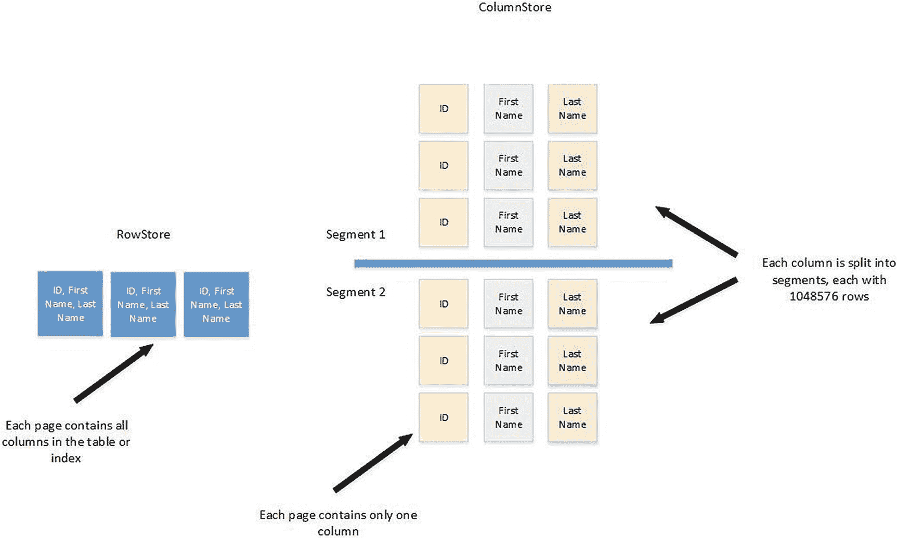

图 8-5
列存储索引结构

列存储索引将表中的行切片成每个 102,400 到 1,048,576 行之间的块。每个切片称为一个 `行组`。每个行组中的数据随后被按列拆分，并使用 VertiPaq 技术进行压缩。行组内的每个列称为一个 `列段`。

在适当的应用场景下，列存储索引相对于传统索引提供了若干优势。首先，由于它们是高度压缩的，可以提高 IO 效率并减少内存开销。它们能够实现如此高的压缩率，是因为单列内的数据在行与行之间通常非常相似。此外，因为查询能够仅检索其所需列的数据页，IO 可以再次减少。这甚至得到了进一步的帮助，因为每个列段都包含一个带有段内数据元数据的标头。这意味着 SQL Server 可以仅访问其需要的段，而不是整个列。为了支持列存储索引，还引入了一种新的查询执行机制。它被称为批处理执行模式，允许以 1000 行为一块处理数据，而不是逐行处理。这意味着 CPU 使用率要高效得多。然而，列存储索引并非万能药，它们的设计目标是优化针对超大型表执行只读操作的数据仓库型查询。OLTP 型查询不太可能看到任何益处，在某些情况下，执行速度甚至可能更慢。SQL Server 同时支持聚集和非聚集列存储索引，这些将在以下各节中讨论。


#### 列存储索引

##### 聚集列存储索引

聚集列存储索引将整个表以列存储格式存储。对于具有聚集列存储索引的表，没有传统的行存储；但是，新插入到表中的行可能会暂时放置在一个称为*deltastore*的行存储表中。这是为了防止列存储索引碎片化并增强 DML 操作的性能。图 8-6 中的图示说明了这一点。

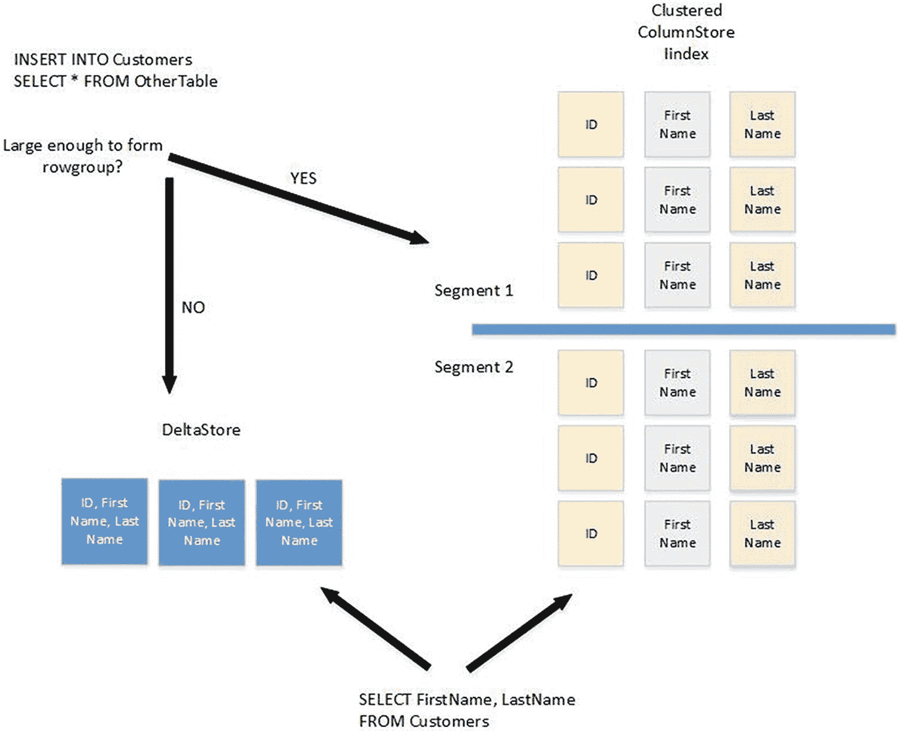

图 8-6

具有增量存储的聚集列存储索引

该图显示，当数据插入到聚集列存储索引时，SQL Server 会评估行数。如果行数足够多以达到良好的压缩率，SQL Server 会将它们视为一个或多个行组，并立即压缩它们并将其添加到列存储索引中。然而，如果行数太少，SQL Server 会将它们插入到内部的增量存储结构中。当您对表运行查询时，数据库引擎会无缝地连接这些结构并将结果作为一个整体返回。一旦有足够的行，增量存储就会被标记为关闭，一个称为*元组移动器*的后台进程会将这些行压缩到列存储索引的一个行组中。

每个聚集列存储索引可以有多个增量存储。这是因为当 SQL Server 确定插入操作需要使用增量存储时，它会尝试访问现有的增量存储。然而，如果所有现有的增量存储都被锁定，那么就会创建一个新的，而不是强制查询等待锁释放。

在聚集列存储索引中删除行时，该行仅被逻辑删除。数据在物理上仍保留在行组中，直到下次重建索引。SQL Server 维护一个指向已删除行的 B 树结构，以便轻松识别它们。如果被删除的行位于增量存储中而不是索引本身，则会被立即物理和逻辑删除。当您在聚集列存储索引中更新一行时，SQL Server 会将该行标记为逻辑删除，并在增量存储中插入一个包含该行新值的新行。

您可以使用 `CREATE CLUSTERED COLUMNSTORE INDEX` 语句创建聚集列存储索引。清单 8-6 中的脚本将 `OrdersDisk` 表的内容复制到一个名为 `OrdersColumnstore` 的新表中，然后在该表上创建聚集列存储索引。创建索引时，您无需指定键列；这是因为所有列都被添加到列存储索引内的列段中。然后，您的查询可以使用该索引在需要满足查询的任何列上进行搜索。聚集列存储索引是表上唯一的索引。您无法创建传统的非聚集索引或非聚集列存储索引。此外，表不能有主键、外键或唯一约束。

```sql
SELECT * INTO dbo.OrdersColumnstore
FROM dbo.OrdersDisk ;
GO
CREATE CLUSTERED COLUMNSTORE INDEX CCI_OrdersColumnstore ON dbo.OrdersColumnstore ;
清单 8-6
创建聚集列存储索引
```

使用列存储索引时，并非所有数据类型都受支持。无法在包含以下数据类型的表上创建聚集列存储索引：

*   `TEXT`
*   `NTEXT`
*   `IMAGE`
*   `VARCHAR(MAX)`
*   `NVARCHAR(MAX)`
*   `ROWVERSION`
*   `SQL_VARIANT`
*   `HIERARCHYID`
*   `GEOGRAPHY`
*   `GEOMETRY`
*   `XML`

##### 非聚集列存储索引

非聚集列存储索引不可更新。这意味着如果您在表上创建了非聚集列存储索引，该表将变为只读。更新或删除该表中数据的唯一方法是先删除或禁用列存储索引，然后在 DML 过程完成后重新创建它。要向具有非聚集列存储索引的表中插入数据，您必须首先删除或禁用列存储索引，或者使用分区切换来导入数据。分区切换在第 7 章中讨论。

当表支持多种工作负载时，使用非聚集列存储索引代替聚集列存储索引是合适的。在此场景中，非聚集列存储索引支持实时分析，而 OLTP 风格的查询可以利用传统的聚集索引。

清单 8-7 中的语句在 `CustomersDisk` 表的 `FirstName`、`LastName`、`Balance` 和 `CustomerID` 列上创建了一个非聚集列存储索引。从创建此索引可以看出，与聚集列存储索引不同，非聚集列存储索引可以与传统索引共存，并且在本例中，我们甚至覆盖了一些相同的列。

```sql
CREATE NONCLUSTERED COLUMNSTORE INDEX NCCI_FirstName_LastName_Balance_CustomerID
ON dbo.CustomersDisk(FirstName,LastName,Balance,CustomerID) ;
清单 8-7
创建非聚集列存储索引
```

### 内存优化索引

正如我们在第 7 章中看到的，SQL Server 为内存优化表提供了两种索引类型：非聚集索引和非聚集哈希索引。每个内存优化表必须至少有一个索引，并且最多可以支持八个。所有内存优化索引都覆盖表中的所有列，因为它们使用内存指针链接到数据行。

内存优化表上的索引必须在 `CREATE TABLE` 语句中创建。没有用于内存优化索引的 `CREATE INDEX` 语句。基于内存优化表构建的索引始终仅存储在内存中，并且无论表的持久性设置如何，都永远不会持久化到磁盘。然后，它们会在实例从表的底层数据重新启动后重新创建。您无需担心内存优化索引的碎片，因为它们从不具有基于磁盘的结构。

#### 内存中非聚集哈希索引

一个非聚集哈希索引由一组存储桶构成。对每个索引键运行一个哈希函数，然后将哈希后的键值放入存储桶中。所使用的哈希算法是确定性的，这意味着具有相同值的索引键总是具有相同的哈希值。这一点很重要，因为重复的哈希值总是会被放入同一个哈希存储桶中。当许多键位于同一个哈希存储桶中时，索引的性能可能会下降，因为需要扫描整个重复项链才能找到正确的键。因此，如果您在一个包含大量重复键的非唯一列上构建哈希索引，则应使用大得多的存储桶数量来创建索引。这个数量应该是唯一键值数量的 20 到 100 倍，而不是通常为唯一索引推荐的唯一键数量的 2 倍。或者，在非唯一列上使用非聚集索引可能是一个更好的解决方案。哈希函数具有确定性的第二个后果是，同一行的不同版本总是存储在同一个哈希存储桶中。

即使是在唯一索引的情况下，即只存在一个当前行版本，哈希值在存储桶中的分布也不是均匀的。如果存储桶的数量等于唯一键值的数量，那么大约三分之一的存储桶是空的，三分之一包含一个值，三分之一包含多个值。当多个值共享一个存储桶时，这被称为`哈希冲突`，大量的`哈希冲突`会导致性能下降。因此，对于唯一索引，建议将存储桶数量设置为表中预期唯一值数量的两倍。

#### 提示

当您有一个唯一的非聚集哈希索引时，在某些情况下，许多唯一值可能会哈希到同一个存储桶。如果您遇到这种情况，那么增加存储桶数量会有所帮助，这与处理非唯一索引的方式相同。

例如，如果您的表有 100 万行，并且索引列是唯一的，则最优的存储桶数量（称为`BUCKET_COUNT`）是 200 万。但是，如果您知道您的表预计将增长到 200 万行，那么创建 400 万个哈希存储桶可能是明智之举。这个数量的存储桶足够低，不会对内存产生影响。同时，它也允许预期的行数增长，而不会因为存储桶太少而损害性能。索引值和哈希存储桶之间潜在映射关系的示意图如图 8-7 所示。

#### 提示

非聚集哈希索引使用的内存量始终保持静态，因为存储桶的数量不会改变。

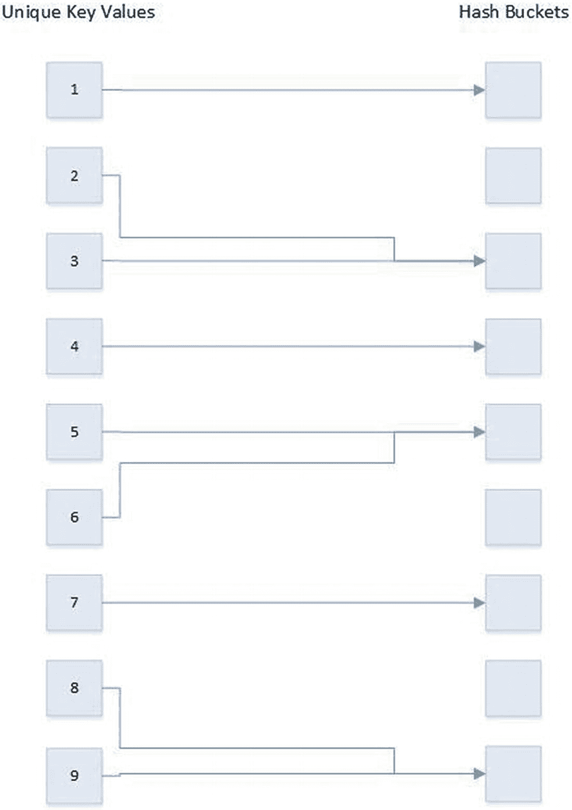

图 8-7

到非聚集哈希索引的映射

哈希索引针对带有`=`谓词的查找操作进行了优化。然而，对于查找操作，谓词评估中必须存在完整的索引键。如果不存在，则需要进行完整的索引扫描。如果使用了诸如`<`或`>`之类的不等式谓词，也需要进行索引扫描。此外，由于索引是无序的，索引无法按照索引键的排序顺序返回数据。

#### 注意

您可能还记得，在第 7 章中，我们观察到基于磁盘的表的性能优于内存优化表。这可以通过我们在查询中使用了`>`谓词来解释；这意味着尽管基于磁盘的索引能够执行索引查找，但我们的内存优化哈希索引却必须执行索引扫描。

现在，让我们使用清单 8-8 中的脚本，创建一个`OrdersDisk`表的内存优化版本，该版本包含在`OrderID`列上的非聚集哈希索引。最初，该表有 100 万行，但我们预计这个数字会增长到 200 万，因此我们使用 400 万作为`BUCKET_COUNT`。

```
CREATE TABLE dbo.OrdersMemHash
(
    OrderNumber    INT    NOT NULL    IDENTITY    PRIMARY KEY
        NONCLUSTERED HASH WITH(BUCKET_COUNT = 4000000),
    OrderDate      DATE    NOT NULL,
    CustomerID     INT     NOT NULL,
    ProductID      INT     NOT NULL,
    Quantity       INT     NOT NULL,
    NetAmount      MONEY   NOT NULL,
    DeliveryDate   DATE    NULL,
) WITH(MEMORY_OPTIMIZED = ON, DURABILITY = SCHEMA_AND_DATA) ;

INSERT INTO dbo.OrdersMemHash(OrderDate,CustomerID,ProductID,Quantity,NetAmount,DeliveryDate)
SELECT OrderDate
      ,CustomerID
      ,ProductID
      ,Quantity
      ,NetAmount
      ,DeliveryDate
FROM dbo.OrdersDisk ;
```
清单 8-8
创建带有非聚集哈希索引的表

如果我们现在希望向表中添加一个额外的索引，我们需要先删除再重新创建它。然而，表中已有数据，因此我们首先需要创建一个临时表并将数据复制进去，然后才能删除并重新创建内存优化表。清单 8-9 中的脚本向`OrderDate`列添加了一个非聚集索引。

```
--创建并填充临时表
SELECT * INTO #OrdersMemHash
FROM dbo.OrdersMemHash ;

--删除现有表
DROP TABLE dbo.OrdersMemHash ;

--使用新索引重新创建表
CREATE TABLE dbo.OrdersMemHash
(
    OrderNumber     INT     NOT NULL    IDENTITY    PRIMARY KEY
        NONCLUSTERED HASH WITH(BUCKET_COUNT = 4000000),
    OrderDate       DATE    NOT NULL     INDEX NCI_OrderDate NONCLUSTERED,
    CustomerID      INT     NOT NULL,
    ProductID       INT     NOT NULL,
    Quantity        INT     NOT NULL,
    NetAmount       MONEY   NOT NULL,
    DeliveryDate    DATE    NULL,
) WITH(MEMORY_OPTIMIZED = ON, DURABILITY = SCHEMA_AND_DATA) ;
GO

--允许向标识列插入值
SET IDENTITY_INSERT OrdersMemHash ON ;
GO

--重新填充表
INSERT INTO
dbo.OrdersMemHash(OrderNumber,OrderDate,CustomerID,ProductID,Quantity,NetAmount,DeliveryDate)
SELECT *
FROM #OrdersMemHash ;

--停止向标识列插入并清理临时表
SET IDENTITY_INSERT OrdersMemHash OFF ;

DROP TABLE #OrdersMemHash ;
```
清单 8-9
向内存优化表添加索引

我们可以通过查询`sys.dm_db_xtp_hash_index_stats` DMV 来检查哈希索引中的值分布。清单 8-10 中的查询演示了如何使用此 DMV 查看哈希冲突数并计算空存储桶的百分比。

```
SELECT
    OBJECT_SCHEMA_NAME(HIS.OBJECT_ID) + '.' + OBJECT_NAME(HIS.OBJECT_ID) '表名',
    I.name as '索引名',
    HIS.total_bucket_count,
    HIS.empty_bucket_count,
    FLOOR((CAST(empty_bucket_count AS FLOAT)/total_bucket_count) * 100) '空存储桶百分比',
    total_bucket_count - empty_bucket_count '已使用存储桶数',
    HIS.avg_chain_length,
    HIS.max_chain_length
FROM sys.dm_db_xtp_hash_index_stats AS HIS
INNER JOIN sys.indexes AS I
    ON HIS.object_id = I.object_id
    AND HIS.index_id = I.index_id ;
```
清单 8-10
`sys.dm_db_xtp_hash_index_stats`


##### 从结果看索引性能

从图 8-8 的结果可以看出，对于我们的哈希索引，78%的桶是空的。这个比例之所以这么高，是因为我们考虑到了表的增长而指定了一个较大的`BUCKET_COUNT`。如果这个比例低于 33%，我们就会希望指定更高的桶数以避免哈希冲突。我们还可以看到，平均链长度为 1，最大链长度为 5。这是健康的。如果平均链计数增加，性能就会开始下降，因为 SQL Server 必须扫描多个值才能找到正确的键。如果平均链长度达到 10 或更高，则意味着键不是唯一的，并且键中有太多重复值，使得哈希索引不可行。此时，我们应该删除并重新创建表，为索引指定更高的桶数，或者理想情况下，考虑改用非聚集索引。

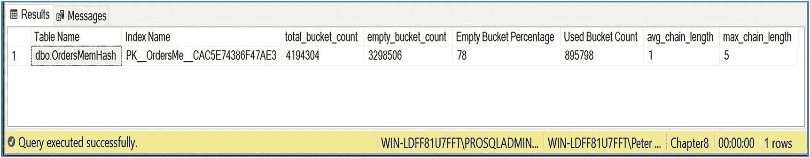

**图 8-8**

`sys.dm_db_xtp_hash_index_stats`结果

#### 内存中非聚集索引

内存中的非聚集索引具有与基于磁盘的非聚集索引类似的结构，称为 *bw-tree*。这种结构使用页面映射表而不是指针，并使用“小于”而不是“大于”进行遍历（基于磁盘的索引使用“大于”）。索引的叶级别是一个单向链表。在查询使用不等式谓词（如`BETWEEN`、`>`或`<`）时，非聚集索引比非聚集哈希索引性能更好。在使用`=`谓词但不是键中的所有列都用于筛选时，内存中的非聚集索引也比非聚集哈希索引性能更好。非聚集索引也可以按照索引键的排序顺序返回数据。然而，与基于磁盘的索引不同，这些索引无法按照索引键的逆序返回结果。

### 维护索引

索引创建后，DBA 的工作并未完成。索引需要持续维护。以下部分讨论索引维护的注意事项。

#### 缺失索引

当您运行查询时，数据库引擎会跟踪其在构建计划时希望使用的任何索引，以帮助提高查询性能。当您在 SSMS 中查看执行计划时，它会提供关于缺失索引的建议，但这些数据也可以通过 DMV 稍后获得。

> **提示**
> 由于建议是基于单个计划的，您应该审查它们，而不是盲目地实施。

为了演示此功能，我们可以执行清单 8-11 中的查询，并选择包含实际的执行计划。

> **提示**
> 您可以通过查看估计的查询计划来查看缺失索引信息。

```sql
SELECT SUM(c.creditlimit) TotalExposure, SUM(o.netamount) 'TotalOrdersValue'
FROM dbo.CustomersDisk c
INNER JOIN dbo.OrdersDisk o
ON c.CustomerID = o.CustomerID ;
```

**清单 8-11 生成缺失索引详情**

运行此查询后，我们可以检查执行计划，看看它告诉我们什么。此查询的执行计划如图 8-9 所示。

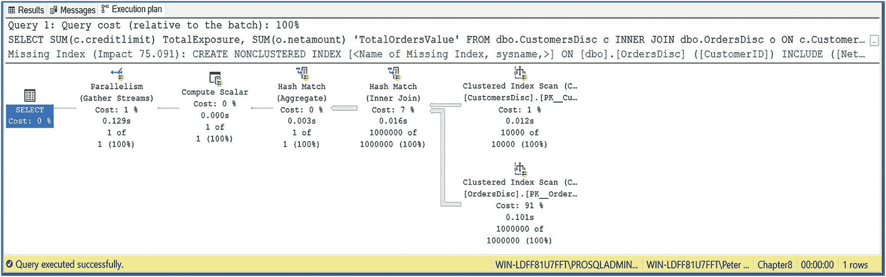

**图 8-9 显示缺失索引的执行计划**

在图 8-9 的执行计划顶部，您可以看到 SQL Server 建议我们在`OrdersDisk`表的`CustomerID`列上创建一个索引，并在叶级别包含`NetAmount`列。我们还被告知，这应该能为查询提供 75%的性能提升。

如前所述，SQL Server 也通过 DMV 提供此信息。`sys.dm_db_missing_index_details` DMV 通过中间 DMV `sys.dm_db_missing_index_groups`连接到`sys.dm_db_missing_index_group_stats`，以避免多对多关系。清单 8-12 中的脚本演示了我们如何使用这些 DMV 来返回有关缺失索引的详细信息。

```sql
SELECT
    mid.statement TableName
    ,ISNULL(mid.equality_columns, '')
        + ','
        + ISNULL(mid.inequality_columns, '') IndexKeyColumns
    ,mid.included_columns
    ,migs.unique_compiles
    ,migs.user_seeks
    ,migs.user_scans
    ,migs.avg_total_user_cost
    ,migs.avg_user_impact
FROM sys.dm_db_missing_index_details mid
INNER JOIN sys.dm_db_missing_index_groups mig
    ON mid.index_handle = mig.index_handle
INNER JOIN sys.dm_db_missing_index_group_stats migs
    ON mig.index_group_handle = migs.group_handle ;
```

**清单 8-12 缺失索引 DMV**

此查询的结果如图 8-10 所示。它们显示了以下信息：具有缺失索引的表的名称；SQL Server 建议应构成索引键的列；SQL Server 建议应添加为 B 树叶级别包含列的列；本应从索引中受益的查询已被编译的次数；如果索引存在，本应对索引执行的查找次数；如果索引存在，本应对索引执行的扫描次数；使用索引本可节省的平均成本；以及使用索引本可节省的平均成本百分比。在我们的例子中，我们可以看到，如果我们在运行查询时索引已经存在，查询的成本本可以降低 95%。

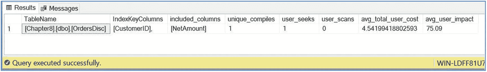

**图 8-10 缺失索引结果**


#### 索引碎片化

基于磁盘的索引会产生碎片化。B 树中可能发生两种形式的碎片化：内部碎片化和外部碎片化。

`内部碎片化` 指的是页面拥有大量空闲空间。如果页面存在大量空闲空间，那么 SQL Server 就需要读取比实际返回查询所需全部行更多的页数。

`外部碎片化` 指的是索引的页面在物理顺序上变得不连续。这会降低性能，因为数据无法从磁盘上被顺序读取。

例如，假设你有一个包含 100 万行数据的表，并且当数据页 100% 满时，所有这些数据行正好能放入 5000 个页中。这意味着 SQL Server 只需读取略多于 39MB 的数据就能扫描整个表（`8KB * 5000`）。然而，如果表的页只有 50% 被填满，这就会使使用的页数增加到 10,000 个，同时也使需要读取的数据量增加到 78MB。这就是内部碎片化。

当执行 `DELETE` 语句以及发生 `DML` 语句（例如插入一个非递增的键值）时，内部碎片化可能会自然发生。这是因为 SQL Server 可能会通过执行页拆分来响应这种情况。页拆分会创建一个新页，将现有页中一半的数据移动到新页，并将另一半留在现有页上，从而在两个页上都创建出 50% 的空闲空间。然而，它们也可能由于误用 `FILLFACTOR` 和 `PAD_INDEX` 设置而人为产生。

`FILLFACTOR` 控制在创建或重建索引时，其每个叶级页上保留多少空闲空间。默认情况下，`FILLFACTOR` 设置为 `0`，这意味着它在页面上恰好为一行留出足够的空间。然而，在某些情况下，当由于 DML 操作导致大量页拆分发生时，数据库管理员可以通过调整 `FILLFACTOR` 来减少碎片化。例如，设置 `FILLFACTOR` 为 `80` 会在页面上留下 20% 的空闲空间，这意味着新行可以被添加到该页面而无需发生页拆分。然而，许多 DBA 在并非必需的情况下也更改了 `FILLFACTOR`，这会在索引构建完成后立即自动导致内部碎片化。`PAD_INDEX` 只能在使用 `FILLFACTOR` 时应用，它将相同百分比的空闲空间应用于 B 树的中间级别。

外部碎片化同样由页拆分引起，它指的是按索引键排序的页面的逻辑顺序与磁盘上页面的物理顺序相比不连续。外部碎片化使得 SQL Server 较少能够使用顺序读取来执行扫描操作，因为磁头需要在磁盘上来回移动以定位文件中的页面。

#### 注意

这与文件系统级别的碎片化不同，后者是指一个数据文件可能被分散存储在多个无序的磁盘扇区中。

##### 检测碎片化

你可以使用 `sys.dm_db_index_physical_stats` DMF 来识别索引的碎片化。此函数接受表 8-2 中列出的参数。

表 8-2
sys.dm_db_index_physical_stats 参数

| 参数 | 描述 |
| --- | --- |
| `Database_ID` | 你想要对其运行此函数的数据库 ID。如果你不知道它，可以传入 `DB_ID('MyDatabase')`，其中 `MyDatabase` 是你的数据库名称。 |
| `Object_ID` | 你想要对其运行此函数的表的对象 ID。如果你不知道它，传入 `OBJECT_ID('MyTable')`，其中 `MyTable` 是你的表名。传入 `NULL` 则对数据库中的所有表运行此函数。 |
| `Index_ID` | 你想要对其运行此函数的索引的索引 ID。对于聚集索引，此值始终为 `1`。传入 `NULL` 则对表上的所有索引运行此函数。 |
| `Partition_Number` | 你想要对其运行此函数的分区 ID。如果你想对所有分区运行此函数或该表未分区，则传入 `NULL`。 |
| `Mode` | 选择 `LIMITED`、`SAMPLED` 或 `DETAILED`。`LIMITED` 仅扫描索引的非叶级。`SAMPLED` 扫描表中 1% 的页，除非该表的页数少于或等于 10,000 个，在这种情况下将使用 `DETAILED` 模式。`DETAILED` 模式扫描表中 100% 的页。对于非常大的表，由于 `DETAILED` 模式返回数据所需的时间可能很长，通常更倾向于使用 `SAMPLED`。 |

清单 8-13 展示了如何使用 `sys.dm_db_index_physical_stats` 来检查我们的 `OrdersDisk` 表的碎片化水平。

```sql
USE Chapter8
GO
SELECT
    i.name
    ,IPS.index_type_desc
    ,IPS.index_level
    ,IPS.avg_fragmentation_in_percent
    ,IPS.avg_page_space_used_in_percent
    ,i.fill_factor
    ,CASE
        WHEN i.fill_factor = 0
            THEN 100-IPS.avg_page_space_used_in_percent
        ELSE i.fill_factor-ips.avg_page_space_used_in_percent
     END Internal_Frag_With_Fillfactor_Offset
    ,IPS.fragment_count
    ,IPS.avg_fragment_size_in_pages
FROM sys.dm_db_index_physical_stats(DB_ID('Chapter8'),OBJECT_ID('dbo.OrdersDisk'),NULL,NULL,'DETAILED') IPS
INNER JOIN sys.indexes i
    ON IPS.Object_id = i.object_id
    AND IPS.index_id = i.index_id ;
```
清单 8-13
`sys.dm_db_index_physical_stats`

从该查询的结果中，你可以看到每个 B 树的每个级别都返回了一行。如果表是分区的，这也会按分区进行细分。`index_level` 列指示该行代表的是 B 树的哪一级别。级别 0 表示 B 树的叶级，而级别 1 是最低的中间级别，或者如果不存在中间级别则为根级别，依此类推，最高编号始终反映根节点。

`avg_fragmentation_in_percent` 列告诉我们存在多少外部碎片化。我们希望这个值尽可能接近零。

`avg_page_space_used_in_percent` 告诉我们存在多少内部碎片化，所以我们希望这个值尽可能接近 100。`Internal_Frag_With_FillFactor_Offset` 列也告诉我们存在多少内部碎片化，但这次，它应用了一个偏移量来考虑已应用于索引的填充因子。

`fragment_count` 列表示该索引级别存在多少个连续页的块，所以我们希望这个值尽可能低。

`avg_fragment_size_in_pages` 列告诉我们每个碎片的平均大小，所以显然这个数字也应该尽可能高。

### 移除碎片

你可以通过重组或重建索引来移除碎片。当你重组一个索引时，SQL Server 会重新组织索引叶级别的数据。它会查看页面上是否有可用的空闲空间。如果有，它会将下一页的行移动到该页上。如果在此过程结束时存在空页面，则它们将被删除。SQL Server 仅将页面填充到指定的 `FillFactor` 级别。一旦完成，叶级别页面内的数据会被重新排列，使其物理顺序更接近其逻辑键顺序。重组索引始终是一个 `ONLINE` 操作，这意味着在操作进行期间，其他进程仍可以使用该索引。由于它始终是一个 `ONLINE` 操作，如果 `ALLOW_PAGE_LOCKS` 选项被关闭，它将会失败。重组索引的过程适用于移除内部碎片和 30% 或更低程度的外部碎片。然而，即使在这种使用模式下，它也不能保证操作完成后完全没有碎片。

清单 8-14 中的脚本在 `OrdersDisk` 表上创建了一个名为 `NCI_CustomerID` 的索引，然后演示了如何重组它。

```
--创建将在后续示例中使用的索引
CREATE NONCLUSTERED INDEX NCI_CustomerID ON dbo.OrdersDisk(CustomerID) ;
GO
--重组索引
ALTER INDEX NCI_CustomerID ON dbo.OrdersDisk REORGANIZE ;
```
清单 8-14
重组索引

当你重建一个索引时，现有索引会被删除然后完全重建。根据定义，这移除了内部和外部碎片，因为索引是从零开始构建的。然而，重要的是要注意，此操作之后你仍然不能保证达到 100% 无碎片。这是因为 SQL Server 会将索引的不同部分分配给参与重建的每个 CPU 核心。每个 CPU 核心应该以完美的顺序构建自己的部分，但当这些部分同步时，可能会产生少量碎片。你可以通过指定 `MAXDOP = 1` 来最小化这个问题。即使设置了这个选项，在某些情况下你仍然可能遇到碎片。例如，如果 `ALLOW_PAGES_LOCKS` 被配置为 `OFF`，那么工作线程会共享分配缓存，这可能导致碎片。此外，当你设置 `MAXDOP = 1` 时，这是以重建索引所需的时间为代价的。

你可以通过执行 `ONLINE` 或 `OFFLINE` 操作来重建索引。如果你选择以 `ONLINE` 操作重建索引，那么在操作进行时，原始版本的索引仍然可以访问。`ONLINE` 操作是以时间和资源利用率为代价的。你需要启用 `ALLOW_PAGE_LOCKS` 才能使你的 `ONLINE` 重建成功。

清单 8-15 中的脚本演示了如何重建 `OrdersDisk` 表上的 `NCI_Balance` 索引。因为我们没有指定 `ONLINE = ON`，所以它使用默认设置 `ONLINE = OFF`，并且在整个操作期间索引都被锁定。因为我们指定了 `MAXDOP = 1`，所以操作速度较慢，但没有碎片。

```
ALTER INDEX NCI_CustomerID ON dbo.OrdersDisk REBUILD WITH(MAXDOP = 1) ;
```
清单 8-15
重建索引

如果你创建一个维护计划来重建或重组索引，那么指定数据库内的所有索引都将被重建，无论它们是否需要——这可能是耗时且消耗资源的。你可以通过使用 `sys.dm_db_index_physical_stats` DMF 创建一个智能脚本来解决此问题，你可以从 SQL Server Agent 运行该脚本，并仅对需要操作的索引进行重组或重建。这在第 17 章中有更详细的讨论。

#### 提示

有一种误解认为使用 SSD 可以消除索引碎片问题。这是不正确的。尽管 SSD 降低了乱序页面对性能的影响，但它们并没有消除这种影响。它们对内部碎片也没有影响。

#### 可恢复的索引操作

SQL Server 2019 支持可恢复的联机索引创建和索引重建，适用于传统（聚集和非聚集）索引以及列存储索引。可恢复的索引操作允许你暂停一个联机索引操作（创建或重建），以便释放系统资源，然后当资源利用率不再是问题时，再从中断处重新启动。这些操作还允许在联机索引操作因常见原因（例如磁盘空间不足）失败后重新启动。

此功能为 DBA 带来的一些优势是显而易见的。例如，如果一个大型索引重建需要适应短暂的维护窗口，那么可以在维护窗口结束时暂停重建，并在下一个维护窗口开始时重新启动，而不是必须中止操作来释放系统资源。然而，还有一些隐藏的好处。例如，可恢复的索引操作不会消耗大量的日志空间，即使对大型索引执行也是如此。这是因为所有重启索引操作所需的数据都存储在数据库内。一个附带说明是，索引操作在暂停时不会保持一个长时间运行的事务。

在大多数情况下，使用可恢复索引操作的缺点很少。达到的碎片整理质量与标准联机索引操作的质量相当，并且可恢复操作与标准联机索引操作在速度上没有真正的区别（当然，不包括潜在的暂停时间）。然而，一如既往，天下没有免费的午餐，在暂停的可恢复操作期间，由于需要更新索引的两个版本，受影响表和索引的写入性能将会下降。在大多数情况下，这种下降不应超过 10%。在暂停期间，对读取操作应该没有影响，因为它们继续使用原始版本的索引，直到操作完成。

清单 8-16 中的命令演示了如何将 `OrdersDisk` 表上的 `NCI_CustomerID` 索引重建为可恢复操作。

```
ALTER INDEX NCI_CustomerID ON dbo.OrdersDisk REBUILD WITH(MAXDOP = 1, ONLINE=ON, RESUMABLE=ON) ;
```
清单 8-16
可恢复索引重建

清单 8-17 中的命令将暂停清单 8-16 中启动的索引重建。

#### 提示

仅当 8-16 清单中的命令尚未执行完毕时，8-17 清单中的命令才会生效。

```sql
ALTER INDEX NCI_CustomerID ON dbo.OrdersDisk PAUSE
Listing 8-17
暂停索引重建
```

运行此脚本后，索引重建操作将暂停，并显示如图 8-11 所示的消息。

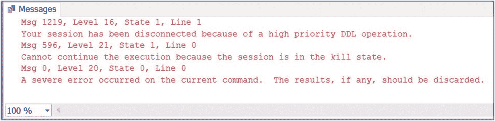
*图 8-11：索引操作暂停时抛出的消息*

8-18 清单中的脚本将根据分配给`@Action`变量的值，恢复或中止索引重建。

```sql
DECLARE @Action NVARCHAR(6) = 'Resume'
IF (@Action = 'Resume')
BEGIN
ALTER INDEX NCI_CustomerID ON dbo.OrdersDisk RESUME
END
ELSE
BEGIN
ALTER INDEX NCI_CustomerID ON dbo.OrdersDisk ABORT
END
Listing 8-18
恢复或中止索引操作
```

您不必为每个单独的索引操作开启`ONLINE`和`RESUMABLE`选项，而是可以通过使用数据库作用域配置，在数据库级别全局开启它们。`ELEVATE_ONLINE`配置将把数据库内受支持的索引操作的`ONLINE`默认值更改为`ON`。`ELEVATE_RESUMABLE`配置则会将`RESUMABLE`的默认值设为`ON`。

`ELEVATE_ONLINE`和`ELEVATE_RESUMABLE`均可配置为`OFF`（默认行为）、`WHEN_SUPPORTED`或`FAIL_UNSUPPORTED`。当设置为`WHEN_SUPPORTED`时，不兼容的操作（如重建 XML 索引）将以离线且不可恢复的方式执行。但如果设置为`FAIL_UNSUPPORTED`，此类操作将失败并抛出错误。

8-19 清单中的脚本演示了如何为`Chapter8`数据库将`ELEVATE_ONLINE`和`ELEVATE_RESUMABLE`设置为`WHEN_SUPPORTED`。

```sql
USE Chapter8
GO
ALTER DATABASE SCOPED CONFIGURATION SET ELEVATE_ONLINE = WHEN_SUPPORTED ;
GO
ALTER DATABASE SCOPED CONFIGURATION SET ELEVATE_RESUMABLE = WHEN_SUPPORTED ;
GO
Listing 8-19
默认为 ONLINE 和 RESUMABLE
```

#### 分区索引

如第 7 章所述，不仅可以对表进行分区，也可以对索引进行分区。聚集索引总是与基础表共享相同的分区方案，因为聚集索引的叶级由表的实际数据页组成。而非聚集索引则可以选择与表对齐或不对齐。如果索引共享相同的分区方案或在相同的分区方案上创建，则这些索引是对齐的。

在大多数情况下，将非聚集索引与基表对齐是良好的实践，但有时您可能希望偏离此策略。例如，即使基表未分区，您仍可以为性能而对索引进行分区。此外，如果您的索引键是唯一的且不包含分区键，则它需要是不对齐的。如果表涉及在不同列上与其他表进行排序规则连接，不对齐的非聚集索引也有可能带来性能提升。

您可以使用`ON`子句指定分区方案来创建分区索引，方式与创建分区表相同。如果索引已存在，您可以重建它，并在`ON`子句中指定分区方案。8-20 清单中的脚本创建了一个分区函数和一个分区方案。然后，它重建`OrdersDisk`表的聚集索引以将其移动到新的分区方案。最后，它创建了一个新的非聚集索引，该索引与表分区对齐。

**提示：** 运行脚本前，请将主键名称更改为您自己的名称。

```sql
--创建分区函数
CREATE PARTITION FUNCTION OrdersPartFunc(int)
AS RANGE LEFT
FOR VALUES(250000,500000,750000) ;
GO
--创建分区方案
CREATE PARTITION SCHEME OrdersPartScheme
AS PARTITION OrdersPartFunc
ALL TO([PRIMARY]) ;
GO
--对 OrdersDisk 表进行分区
ALTER TABLE dbo.OrdersDisk DROP CONSTRAINT PK__OrdersDi__CAC5E7420B016A9F ;
GO
ALTER TABLE dbo.OrdersDisk
ADD PRIMARY KEY CLUSTERED(OrderNumber) ON OrdersPartScheme(OrderNumber) ;
GO
--创建分区对齐的非聚集索引
CREATE NONCLUSTERED INDEX NCI_Part_CustID ON dbo.OrdersDisk(CustomerID, OrderNumber)
ON OrdersPartScheme(OrderNumber) ;
Listing 8-20
重建和创建分区索引
```

重建索引时，您还可以指定仅重建特定分区。8-21 清单中的示例仅重建`NCI_Part_CustID`索引的分区 1。

```sql
ALTER INDEX NCI_Part_CustID ON dbo.OrdersDisk REBUILD PARTITION = 1 ;
Listing 8-21
重建特定分区
```

### 统计信息

SQL Server 维护关于列或列组内数据分布的统计信息。这些列可以位于表或非聚集索引中。当统计信息建立在一组列上时，它们也包括这些列值分布之间的相关性统计信息。查询优化器随后可以利用这些统计信息，基于查询预期返回的行数来构建高效的查询计划。缺乏统计信息可能导致生成低效的计划。例如，当查找操作更高效时，查询优化器可能决定执行索引扫描。

您可以允许 SQL Server 自动管理统计信息。一个名为`AUTO_CREATE_STATISTICS`的数据库级别选项会在 SQL Server 认为更好的基数估计有助于查询性能时自动生成单列统计信息。但这存在限制。例如，筛选的统计信息或多列统计信息无法自动创建。


#### 提示

唯一的例外是在创建索引时。当你创建索引时，无论`AUTO_CREATE_STATS`设置如何，系统总会生成统计信息（包括多列统计信息）来覆盖索引键。这还包括在筛选索引上创建的筛选统计信息。

`Auto Create Incremental Stats`选项导致分区表上的统计信息按分区自动创建，而不是为整个表生成。这可以减少争用，因为它避免了扫描整个表的需要。

随着 DML 操作在表上执行，统计信息会变得过时。数据库级别的选项`AUTO_UPDATE_STATISTICS`会在统计信息过时时重建它们。表 8-3 中列出了用于确定统计信息是否过时的规则。

表 8-3 统计信息更新算法

| 表中行数 | 规则 |
| --- | --- |
| 0 | 表行数大于 0。 |
| <= 500 | 统计信息对象的第一列中有 500 个或更多值发生了变化。 |
| > 500 | 统计信息对象的第一列中有 500 + 20%或更多值发生了变化。 |
| 具有`INCREMENTAL`统计信息的分区表 | 特定分区的统计信息对象的第一列中有 20%或更多值发生了变化。 |

`AUTO_UPDATE_STATISTICS`过程非常有用，通常建议启用它。然而，可能会出现一个问题，因为这个过程是同步且阻塞的。因此，当运行查询时，SQL Server 会检查统计信息是否需要更新。如果需要，SQL Server 会更新它们，但这会阻塞该查询以及任何其他需要相同统计信息的查询，直到操作完成。在高读写负载期间，例如针对超大表的 ETL 过程，这可能会导致性能问题。解决此问题是另一个数据库级别的选项，称为`AUTO_UPDATE_STATISTICS_ASYNC`。即使启用了此选项，它也仅在`AUTO_UPDATE_STATISTICS`同时启用时才会生效。启用后，`AUTO_UPDATE_STATS_ASYNC`会强制统计信息对象的更新作为后台异步进程运行。这意味着触发更新的查询和其他查询不会被阻塞。然而，代价是这些查询无法从更新后的统计信息中受益。

前面提到的选项可以在“数据库属性”对话框的“选项”页上进行配置。或者，你也可以使用`ALTER DATABASE`命令来配置它们，如清单 8-22 所示。

```
--开启 Auto_Create_Stats
ALTER DATABASE Chapter8 SET AUTO_CREATE_STATISTICS ON ;
GO
--开启 Auto_Create_Incremental_Stats
ALTER DATABASE Chapter8 SET AUTO_CREATE_STATISTICS ON  (INCREMENTAL=ON) ;
GO
--开启 Auto_Update_Stats_Async
ALTER DATABASE Chapter8 SET AUTO_UPDATE_STATISTICS ON WITH NO_WAIT ;
GO
--开启 Auto_Update_Stats_Async
ALTER DATABASE Chapter8 SET AUTO_UPDATE_STATISTICS_ASYNC ON WITH NO_WAIT ;
GO
清单 8-22 切换自动统计信息选项
```

#### 筛选统计信息

筛选统计信息允许你在创建统计信息时通过`WHERE`子句，基于列中数据的子集创建统计信息。这使得查询优化器能够生成更好的执行计划，因为统计信息只包含明确定义的子集内的值分布。例如，如果我们在`OrdersDisk`表的`NetAmount`列上创建筛选统计信息，筛选条件为`OrderDate`大于 2019 年 1 月 1 日，那么统计信息将不包含旧订单的行，从而使我们能够更高效地搜索大额的新近订单。

#### 增量统计信息

增量统计信息有助于减少在大型分区表上因更新统计信息而导致的表扫描。启用后，统计信息按分区创建和更新，而不是全局地为整个表进行更新。这可以显著减少在大型分区表上更新统计信息所需的时间，因为未过时的统计信息所在的分区不会被触及，从而减少了不必要的开销。

然而，增量统计信息并非在所有场景下都受支持。如果将此选项与以下类型的统计信息一起使用，系统会生成警告并忽略该设置：

*   视图上的统计信息
*   XML 列上的统计信息
*   Geography 或 Geometry 列上的统计信息
*   筛选索引上的统计信息
*   非分区对齐的索引的统计信息

此外，你无法在只读数据库上使用增量统计信息，也无法在作为可读辅助副本参与`AlwaysOn 可用性组`的数据库上使用。


### 管理统计信息

除了由 SQL Server 自动创建和更新之外，您还可以使用 `CREATE STATISTICS` 语句手动创建和更新统计信息。如果希望创建筛选统计信息，请在语句末尾添加一个 `WHERE` 子句。清单 8-23 中的脚本首先在 `CustomersDisk` 表的 `FirstName` 和 `LastName` 列上创建一个多列统计信息。然后，它在 `OrdersDisk` 表的 `NetAmount` 列上创建一个筛选统计信息，该统计信息仅基于 `OrderDate` 大于 2019 年 1 月 1 日的行构建。

```
USE Chapter8
GO
--在 FirstName 和 LastName 上创建多列统计信息
CREATE STATISTICS Stat_FirstName_LastName ON dbo.CustomersDisk(FirstName, LastName) ;
GO
--在 NetAmount 上创建筛选统计信息
CREATE STATISTICS Stat_NetAmount_Filter_OrderDate ON dbo.OrdersDisk(NetAmount)
WHERE OrderDate > '2019-01-01' ;
GO
清单 8-23
创建统计信息
```

创建统计信息时，可以使用表 8-4 中详述的选项。

表 8-4 创建统计信息的选项

| 选项 | 描述 |
| --- | --- |
| `FULLSCAN` | 在表中 100% 的行样本上创建统计信息对象。此选项创建最准确的统计信息，但生成所需时间最长。 |
| `SAMPLE` | 指定用于构建统计信息对象的行数或行百分比。样本越大，统计信息越准确，但生成时间也越长。指定 0 会创建统计信息对象但不填充它。 |
| `NORECOMPUTE` | 将统计信息对象排除在使用 `AUTO_UPDATE_STATISTICS` 自动更新的范围之外。 |
| `INCREMENTAL` | 覆盖数据库级别的增量统计信息设置。 |

可以使用 `UPDATE STATISTICS` 语句来更新单个统计信息，或单个表上的所有统计信息。清单 8-24 中的脚本首先更新我们在 `OrdersDisk` 表上创建的 `Stat_NetAmount_Filter_OrderDate` 统计信息对象，然后更新 `CustomersDisk` 表上的所有统计信息。

```
--更新单个统计信息对象
UPDATE STATISTICS dbo.OrdersDisk Stat_NetAmount_Filter_OrderDate ;
GO
--更新表上的所有统计信息
UPDATE STATISTICS dbo.CustomersDisk ;
GO
清单 8-24
更新统计信息
```

使用 `UPDATE STATISTICS` 时，除了表 8-4 中创建统计信息的选项（这些选项在更新统计信息时同样有效）之外，表 8-5 中详述的选项也可用。

表 8-5 更新统计信息的选项

| 选项 | 描述 |
| --- | --- |
| `RESAMPLE` | 使用最近的采样率来更新统计信息。 |
| `ON PARTITIONS` | 为列出的分区生成统计信息，然后将它们合并以创建全局统计信息。 |
| `ALL \| COLUMNS \| INDEX` | 指定是仅更新列、仅更新索引，还是两者都更新。默认值为 `ALL`。 |

您还可以使用系统存储过程 `sp_updatestats` 来更新整个数据库的统计信息。此过程会更新基于磁盘的表上的过时统计信息，以及内存优化表上的所有统计信息（无论其是否过时）。清单 8-25 演示了使用此系统存储过程来更新 `Chapter8` 数据库中的统计信息。传入 `RESAMPLE` 参数会导致使用最近的采样率。省略此参数则使用默认采样率。

```
EXEC sp_updatestats 'RESAMPLE' ;
清单 8-25
Sp_updatestats
```

#### 注

更新统计信息会导致使用这些统计信息的查询在下次运行时重新编译。唯一例外的情况是，所引用的表和索引只有一个可能的执行计划。例如，`SELECT * FROM MyTable` 总是执行聚集索引扫描（假设该表具有聚集索引）。

SQL Server 2019 引入了额外的元数据信息，以帮助诊断因查询等待同步统计信息更新完成而引发的问题。首先，添加了一个新的等待类型，称为 `WAIT_ON_SYNC_STATISTICS_REFRESH`。此等待类型表示查询在等待同步统计信息更新完成所花费的时间。其次，在 `sys.dm_exec_requests` DMV 中添加了一个新的命令类型，称为 `SELECT (STATMAN)`。此命令类型指示一条 `SELECT` 语句当前正在等待同步统计信息更新完成，然后才能继续执行。


### 摘要

没有聚集索引的表称为堆，其数据页按无序方式存储。聚集索引基于聚集索引键构建 B 树结构，并使表中的数据按该键排序。由于聚集索引的叶级就是表的实际数据页，而数据页只能以一种方式进行物理排序，因此表上只能有一个聚集索引。聚集索引键的自然选择是表的主键，默认情况下，SQL Server 会自动在主键上创建聚集索引。但在某些情况下，你可能会选择使用不同的列作为聚集索引键。这通常发生在表的主键非常宽、可更新或非始终递增时。

非聚集索引也是基于表中其他列构建的 B 树结构。不同之处在于，非聚集索引的叶级包含的是指向表数据页的指针，而非数据页本身。因为非聚集索引不会对表的实际数据页进行排序，所以可以创建多个非聚集索引。当在用于 `WHERE`、`JOIN` 和 `GROUP BY` 子句的列上创建非聚集索引时，它们可以提升查询性能。你还可以在 B 树的叶级包含其他列，以实现索引覆盖查询。当查询无需读取基础表中的数据时，该查询就被非聚集索引覆盖了。你还可以通过向索引定义中添加 `WHERE` 子句来筛选非聚集索引。这能为使用明确定义数据子集的查询提升性能。

列存储索引压缩数据并将每个列存储在独立的一组页中。这可以显著提升数据仓库风格查询的性能，因为此类查询在大型数据集上执行分析，只需访问所需的列，而无需访问整行。每个列还会被拆分为段，每个段包含一个带有数据元数据的标头，以便 SQL Server 只需访问相关段即可满足查询，从而进一步提升性能。非聚集列存储索引不可更新，这意味着在基础表上执行 DML 语句之前，必须禁用或删除该索引。另一方面，你可以更新聚集列存储索引。

可以在内存优化表上创建两种类型的索引：非聚集索引和非聚集哈希索引。非聚集哈希索引对于点查询非常高效，但在执行范围扫描时效率可能低得多。非聚集索引在执行诸如不等式比较等操作时表现更佳，并且还能够按索引键的排序顺序返回数据。

索引需要随时间进行维护。由于 DML 语句导致页拆分，索引会产生碎片，可以通过重组或重建来减少或消除碎片。当页的顺序错乱时，这称为外部碎片；当页中有大量空闲空间时，则称为内部碎片。SQL Server 存储有关索引碎片的元数据，并可通过名为 `sys.dm_db_index_physical_stats` 的 DMF 来显示这些信息。SQL Server 还会维护其认为缺失的索引信息。缺失索引是指数据库中不存在，但如果创建则能提升查询性能的索引。数据库管理员可以利用这些数据来帮助改进其索引策略。

SQL Server 维护有关列或列组中值分布的统计信息，以帮助提升查询计划的质量。若没有高质量的统计信息，SQL Server 可能在选择使用哪个索引或索引操作符来满足查询时做出错误的选择。例如，它可能选择执行索引扫描，而实际上索引查找更为合适。你可以手动或自动更新统计信息，但无论哪种方式都会导致查询重新编译。SQL Server 还支持增量统计信息，允许在每个分区上创建统计信息，而不是针对整个表全局创建。

