# 9. 数据库一致性

数据库涉及大量 IO 操作。当 IO 操作频繁时，固有地存在损坏的风险。防范数据库损坏的主要方法是定期备份数据库，并周期性地测试这些备份是否可恢复。然而，你需要留意数据库损坏情况，SQL Server 提供了工具，可用于检查数据库的一致性，并在备份不可用时解决一致性问题。本章将探讨用于检查和修复一致性问题的各种选项。

### 一致性错误

一致性错误可能发生在用户数据库或系统数据库中，导致表、数据库甚至整个实例处于不可访问状态。一致性错误可能由多种原因引起，包括硬件故障和数据库引擎问题。以下各节将讨论可能发生的错误类型、如何检测这些错误，以及如果系统数据库损坏应采取的措施。

#### 理解一致性错误

可能发生多种不同的数据库一致性错误；这些错误会导致查询失败或会话断开连接，并将消息写入 SQL Server 错误日志。最常见的错误将在以下各节中详述。

##### `605` 错误

根据错误严重性级别，`605` 错误可能指向两个问题之一。如果严重性级别为 12，则表示发生了脏读。脏读是一种事务异常，当你使用 Read Uncommitted 隔离级别或 `NOLOCK` 查询提示时会发生。当一个事务读取了一行在数据库中从未存在过的数据（由于另一个事务被回滚）时，就会发生脏读。事务异常将在第 18 章中更详细讨论。要解决此问题，可以重新运行查询直到成功，或者重写查询以避免使用 Read Uncommitted 隔离级别或 `NOLOCK` 查询提示。

然而，`605` 错误可能表明一个更严重的问题，通常指示硬件故障。如果严重性级别为 21，则可能是页面损坏，或者操作系统提供了错误的页面。如果是这种情况，你需要从备份恢复或使用 `DBCC CHECKDB` 来修复问题（`DBCC CHECKDB` 将在本章后面讨论）。此外，你还应让 Windows 管理员和存储团队检查可能的硬件或磁盘级问题。

##### `823` 错误

当 SQL Server 尝试执行 IO 操作，而用于执行此操作的 Windows API 向数据库引擎返回错误时，会发生 `823` 错误。`823` 错误几乎总是与硬件或驱动程序问题相关。

如果发生 `823` 错误，你应该使用 `DBCC CHECKDB` 来检查数据库其余部分以及位于同一卷上的任何其他数据库的一致性。你应该与存储团队联系以解决存储问题。你的 Windows 管理员还应检查 Windows 事件日志以查找相关的错误消息。最后，你应该从备份恢复数据库，或者使用 `DBCC CHECKDB` 来“修复”此问题。

##### `824` 错误

如果对 Windows API 的调用成功，但返回的数据存在逻辑一致性问题，则会生成 `824` 错误。与 `823` 错误一样，`824` 错误通常意味着存储子系统存在问题。如果生成了 `824` 错误，你应该遵循与处理 `823` 错误相同的步骤。


##### 5180 错误

当发现无效的文件 ID 时，会发生 5180 错误。文件 ID 存储在页面指针以及每个文件开头的系统页面中。此错误通常由页面内的损坏指针引起，但也可能表示数据库引擎存在问题。如果遇到此错误，应从备份还原或运行 `DBCC CHECKDB` 来修复错误。

##### 7105 错误

当表中的某一行引用不存在的 LOB（大型对象块）结构时，会发生 7105 错误。这可能是由于脏读导致的，类似于严重级别 12 的 605 错误，也可能是页面损坏的结果。损坏可能发生在指向 LOB 结构的数据页上，也可能发生在 LOB 结构本身的页面上。

如果遇到 7105 错误，则应运行 `DBCC CHECKDB` 来检查错误。如果没有发现任何错误，那么该错误很可能是脏读的结果。但如果发现了错误，则应从备份还原数据库或使用 `DBCC CHECKDB` 来修复问题。

### 检测一致性错误

SQL Server 提供了在页面从磁盘读取和写入磁盘时验证其完整性的机制。它还提供了一个损坏页面的日志，帮助您识别发生的错误类型、发生的次数以及已损坏页面的当前状态。这些特性将在以下部分中讨论。

#### 页面验证选项

一个名为 `Page Verify` 的数据库级选项决定了 SQL Server 如何检查 I/O 子系统在读写页面到磁盘时引起的页面损坏。它可以配置为 `CHECKSUM`（默认选项）、`TORN_PAGE_DETECTION` 或 `NONE`。

建议将 `Page Verify` 设置为 `CHECKSUM`。选择此选项后，每次写入页面时，都会针对整个页面创建一个 `CHECKSUM` 值并保存在页面头部。`CHECKSUM` 值是一个哈希和，它是确定性的，并且基于运行哈希函数的值是唯一的。然后在页面读入缓冲区缓存时重新计算此值，并与原始值进行比较。

当指定 `TORN_PAGE_DETECTION` 时，每当页面写入磁盘时，页面每个 512 字节扇区的前 2 个字节都会写入页面的头部。当页面随后读入内存时，会检查这些值以确保它们相同。这里的缺陷显而易见；页面完全有可能已损坏，但这种损坏未被注意到，因为它不在被检查的字节内。`TORN_PAGE_DETECTION` 是 SQL Server 的一项已弃用功能，这意味着它在未来版本中将不可用。您应避免使用它。如果 `Page Verify` 设置为 `NONE`，则 SQL Server 不执行任何页面验证。这不是好的做法。

如果您所有的数据库都是在 SQL Server 2019 实例中创建的，那么它们都默认配置为使用 `CHECKSUM`。但是，如果您是从早期版本的 SQL Server 迁移数据库，那么它们可能配置为使用 `TORN_PAGE_DETECTION`。您可以使用清单 9-1 中的脚本来检查数据库的 `Page Verify` 设置。

```sql
--Create the Chapter9 database
CREATE DATABASE Chapter9 ;
GO
--View page verify option, for all databases on the instance
SELECT
name
,page_verify_option_desc
FROM sys.databases ;
Listing 9-1
Checking the Page Verify Option
```

如果您发现某个数据库正在使用 `TORN_PAGE_DETECTION`，或者更糟，被设置为 `NONE`，那么您可以通过在“数据库属性”对话框的“选项”页中更改设置来解决此问题，如图 9-1 所示。

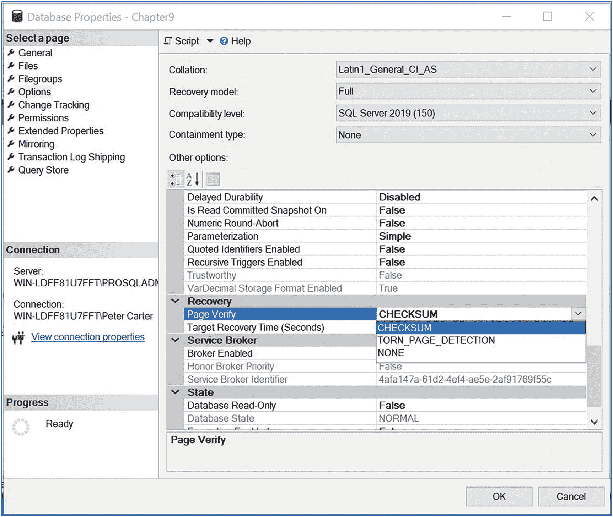

图 9-1

选项页

#### 注意

更改 `Page Verify` 选项不会立即导致针对数据页创建 `CHECKSUM`。`CHECKSUM` 仅在页面被修改后写回磁盘时生成。

或者，您可以使用 T-SQL 通过 `ALTER DATABASE <DatabaseName> SET PAGE_VERIFY CHECKSUM WITH NO_WAIT` 语句达到相同的结果。清单 9-2 中的脚本将当前设置为 `NONE` 或 `TORN_PAGE_DETECTION` 的所有数据库重新配置为使用 `CHECKSUM`。该脚本使用 XQuery `data()` 函数避免了游标的需要。它通过为表中的每一行构建所需的语句来工作。它将每一行的数据转换为 XML，然后使用 `Data()` 函数剥离标签，只留下语句。然后将其转换回关系字符串并传递给 Unicode 变量，该变量随后作为动态 SQL 执行。

```sql
DECLARE @SQL NVARCHAR(MAX)
SELECT @SQL =
(
SELECT
'ALTER DATABASE ' + QUOTENAME(Name) +
' SET PAGE_VERIFY CHECKSUM WITH NO_WAIT; ' AS [data()]
FROM sys.databases
WHERE page_verify_option_desc <> 'CHECKSUM'
FOR XML PATH('')
) ;
BEGIN TRY
EXEC(@SQL) ;
END TRY
BEGIN CATCH
SELECT 'Failure executing the following SQL statement ' + CHAR(13) +CHAR(10) + @SQL ;
END CATCH
Listing 9-2
Reconfiguring All Databases to Use CHECKSUM
```

#### 提示

任何时候您需要一个脚本来对多个数据库执行操作，都可以使用此技术。该代码比使用游标高效得多，并通过允许 DBA 以身作则来提倡良好的实践。您总是告诉您的开发人员不要使用游标，对吧？

#### 可疑页

如果 SQL Server 发现校验和错误或页撕裂的页面，它会在 `MSDB` 数据库中一个名为 `dbo.suspect_pages` 的表中记录这些页面。它还将遇到 823 或 824 错误的任何页面记录在此表中。该表由六列组成，如表 9-1 所述。

表 9-1

`suspect_pages` 列

| 列 | 描述 |
| --- | --- |
| `Database_id` | 包含可疑页面的数据库的 ID |
| `File_id` | 包含可疑页面的文件的 ID |
| `Page_id` | 可疑页面的 ID |
| `Event_Type` | 导致可疑页面被更新的事件性质 |
| `Error_count` | 记录事件发生次数的增量计数器 |
| `Last_updated_date` | 行最后一次更新的时间 |

`event_type` 列的可能值在表 9-2 中解释。

表 9-2

事件类型

| Event_type | 描述 |
| --- | --- |
| `1` | 823 或 824 错误 |
| `2` | 校验和错误 |
| `3` | 页撕裂 |
| `4` | 已还原 |
| `5` | 已修复 |
| `7` | 被 `DBCC CHECKDB` 释放 |

在 `suspect_pages` 表中记录可疑页面后，SQL Server 在您通过从备份还原页面或使用 `DBCC CHECKDB` 修复问题后更新该行。每次遇到具有相同 `event_type` 的错误时，它也会增加错误计数。您应监视此表中的新条目和更新条目，还应定期从此表中删除 `event_type` 为 `4` 或 `5` 的行，以防止该表被填满。


#### 注意

页面恢复将在第 12 章讨论。

清单 9-3 中的脚本创建了一个名为`Chapter9`的新数据库，其中包含一个名为`CorruptTable`的表，该表随后被填充数据。然后，它使表中的一个页面损坏。

```sql
USE Chapter9
GO
--Create the table that we will corrupt
CREATE TABLE dbo.CorruptTable
(
ID    INT    NOT NULL    PRIMARY KEY CLUSTERED    IDENTITY,
SampleText NVARCHAR(50)
) ;
--Populate the table
DECLARE @Numbers TABLE
(ID        INT)
;WITH CTE(Num)
AS
(
SELECT 1 Num
UNION ALL
SELECT Num + 1
FROM CTE
WHERE Num <= 100
)
INSERT INTO @Numbers
SELECT Num
FROM CTE ;
INSERT INTO dbo.CorruptTable
SELECT 'SampleText'
FROM @Numbers a
CROSS JOIN @Numbers b ;
--DBCC WRITEPAGE will be used to corrupt a page in the table. This requires the
--database to be placed in single user mode.
--THIS IS VERY DANGEROUS – DO NOT EVER USE THIS IN A PRODUCTION ENVIRONMENT
ALTER DATABASE Chapter9 SET  SINGLE_USER WITH NO_WAIT ;
GO
DECLARE @SQL NVARCHAR(MAX) ;
SELECT @SQL = 'DBCC WRITEPAGE(' +
(
SELECT CAST(DB_ID('Chapter9') AS NVARCHAR)
) +
', 1, ' +
(
SELECT TOP 1 CAST(page_id AS NVARCHAR)
FROM dbo.CorruptTable
CROSS APPLY sys.fn_PhysLocCracker(%%physloc%%)
) +
', 2000, 1, 0x61, 1)' ;
EXEC(@SQL) ;
ALTER DATABASE Chapter9 SET  MULTI_USER WITH NO_WAIT ;
GO
SELECT *
FROM dbo.CorruptTable ;
```

清单 9-3
损坏一个页面

图 9-2 中的结果显示，脚本中尝试从表中读取数据的最终查询失败，因为其中一个页面已损坏，因此存在错误的校验和。

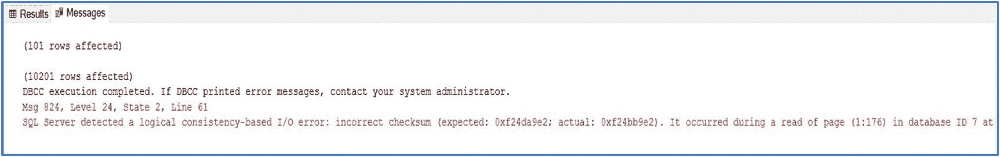

图 9-2
校验和错误

#### 小心

`DBCC WRITEPAGE`在这里仅用于教育目的。它未公开且极其危险。它`never`应在生产系统上使用，并且只应在任何数据库上极其谨慎地使用。

你可以使用清单 9-4 中的查询从`msdb.dbo.suspect_pages`表中生成友好的输出。此查询使用`DB_NAME()`函数查找数据库名称，连接到`sys.master_files`系统表以查找涉及的文件名称，并使用`CASE`语句将`event_type`转换为事件类型描述。

```sql
SELECT
DB_NAME(sp.database_id) [Database]
,mf.name
,sp.page_id
,CASE sp.event_type
WHEN 1 THEN '823 or 824 or Torn Page'
WHEN 2 THEN 'Bad Checksum'
WHEN 3 THEN 'Torn Page'
WHEN 4 THEN 'Restored'
WHEN 5 THEN 'Repaired (DBCC)'
WHEN 7 THEN 'Deallocated (DBCC)'
END AS [Event]
,sp.error_count
,sp.last_update_date
FROM msdb.dbo.suspect_pages sp
INNER JOIN sys.master_files mf
ON sp.database_id = mf.database_id
AND sp.file_id = mf.file_id ;
```

清单 9-4
查询 suspect_pages

在损坏了我们的`CorruptTable`表的一个页面后，运行此查询将产生图 9-3 中的结果。显然，如果你在自己的系统上运行脚本，`page_id`很可能会不同，因为数据库引擎可能为你创建的表分配了不同的页面。

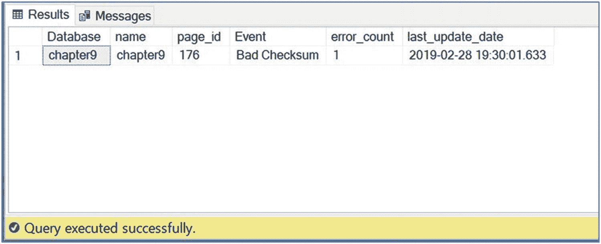

图 9-3
查询 suspect_pages 的结果

#### 注意

我们将在本章后面修复错误，但这会丢失存储在页面上的数据。如果有备份可用，那么在此场景下，页面恢复是比修复更好的选择。

##### 内存优化表的一致性问题

损坏通常发生在物理 IO 操作期间，因此你可以原谅自己认为内存优化表不受损坏影响，但这是一个谬误。正如你可能从第 7 章记得的，虽然内存优化表驻留在内存中，但表的副本——根据你的持久性设置，还包含你数据的副本——保存在物理文件中。这是为了确保在实例重启后表和数据仍然可用。这些文件可能会遭受损坏。由于诸如故障 RAM 芯片等问题，内存中的数据也可能变得损坏。

不幸的是，`DBCC CHECKDB`的修复选项不支持内存表。但是，当你备份包含内存优化文件组的数据库时，会对此文件组中的文件执行校验和验证。因此，至关重要的是，你不仅要定期备份，还要定期检查它们是否可以成功恢复。这是因为在内存优化表损坏的情况下，你唯一的选择是从最后一个已知完好的备份中恢复。

#### 系统数据库损坏

如果系统数据库损坏，你的实例可能会处于无法访问的状态。以下各节讨论如何响应主数据库和资源数据库中的损坏。

##### 主数据库损坏

如果主数据库损坏，你的实例可能无法启动。如果是这种情况，那么你需要重建系统数据库，然后从备份中恢复最新的副本。第 12 章更详细地讨论了数据库备份策略，但这凸显了备份系统数据库的重要性。如果你需要重建系统数据库，并且无法从备份中恢复，你将丢失所有实例级信息，例如登录名、SQL Server Agent 作业、链接服务器等。甚至实例内用户数据库的知识也会丢失，你将需要重新附加数据库。

为了重建系统数据库，你需要运行安装程序。当你使用安装程序重建系统数据库时，表 9-3 中描述的参数可用。

表 9-3
系统数据库重建参数

| 参数 | 说明 |
| --- | --- |
| `/ACTION` | 指定操作参数为`Rebuilddatabase`。 |
| `/INSTANCENAME` | 指定包含损坏系统数据库的实例的名称。 |
| `/Q` | 此参数代表安静。使用它可以在没有任何用户交互的情况下运行安装程序。 |
| `/SQLCOLLATION` | 这是一个可选参数，可用于指定实例的排序规则。如果省略，则使用 Windows 操作系统的排序规则。 |
| `/SAPWD` | 如果你的实例使用混合模式身份验证，则使用此参数指定 SA 帐户的密码。 |
| `/SQLSYSADMINACCOUNTS` | 使用此参数指定哪些帐户应成为实例的系统管理员。 |

清单 9-5 中的 PowerShell 命令重建了`PROSQLADMIN`实例的系统数据库。

```powershell
.\setup.exe /ACTION=rebuilddatabase /INSTANCENAME=PROSQLADMIN /SQLSYSADMINACCOUNTS=SQLAdministrator
```

清单 9-5
重建系统数据库

如前所述，当此操作完成后，理想情况下我们从备份中恢复主数据库的最新副本。由于我们没有备份，我们需要重新附加我们的`Chapter9`数据库以继续。此外，`suspect_pages`表中损坏页面的详细信息也将丢失。但是，尝试读取`Chapter9`数据库中的`CorruptTable`表会导致这些数据被重新填充。清单 9-6 中的脚本重新附加了`Chapter9`数据库。在运行脚本之前，你应该更改文件路径以匹配你自己的配置。

```sql
CREATE DATABASE Chapter9 ON
( FILENAME = N'F:\MSSQL\DATA\Chapter9.mdf' ),
( FILENAME = N'F:\MSSQL\DATA\Chapter9_log.ldf' )
FOR ATTACH ;
```

清单 9-6
重新附加数据库


##### 资源数据库或二进制文件损坏

实例本身可能变得损坏。这可能包括注册表项损坏或资源数据库损坏。如果发生这种情况，请查找随 SQL Server 安装介质一起提供的修复实用工具。要调用此工具，请从 `SQL Server 安装中心` 的 `维护` 选项卡中选择 `修复`。

向导运行适当的规则检查后，您将看到“选择实例”页面，如图 9-4 所示。

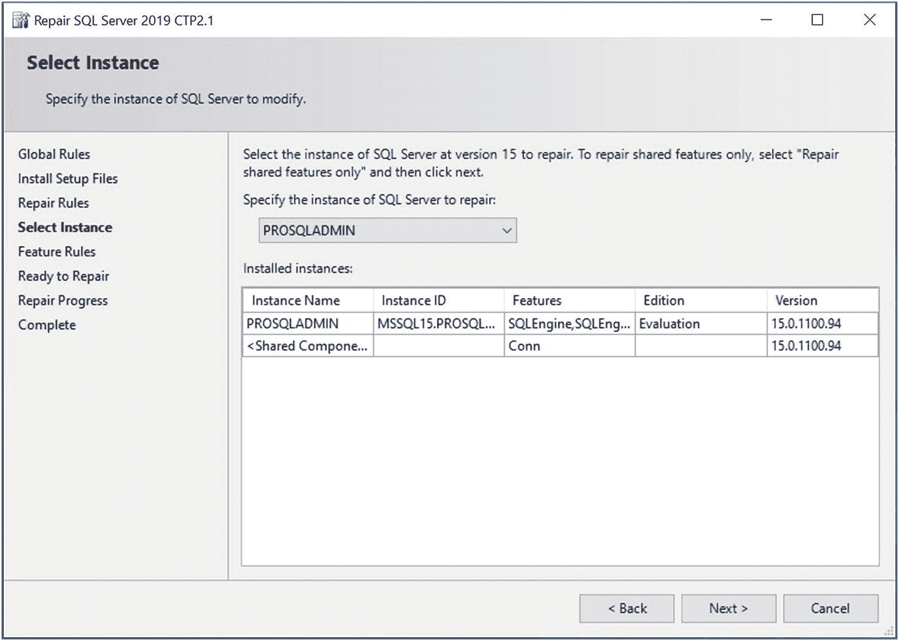
*图 9-4. “选择实例”页面*

选择需要修复的实例后，向导的下一页将运行额外的规则检查，以确保可以修复所需的功能。最后，在 `准备修复` 页面上，您会看到将要执行的操作摘要。选择修复后，您将看到修复进度报告。修复完成后，会显示一个 `摘要` 页面，其中提供了每个已执行操作的状态，以及一个日志文件的链接，如果您需要进行故障排除，可能希望查看该日志。

作为使用 `SQL Server 安装中心` 的替代方法，您可以通过命令行实现相同的重建。如果您的实例运行在 Windows Server Core 上，这非常有用。从命令行修复实例时，可用的参数是表 9-4 中列出的那些。因为在修复实例时不会重建 `Master` 数据库，所以您不需要指定排序规则或管理员详细信息。

*表 9-4. 实例修复参数*

| 参数 | 描述 |
| --- | --- |
| `/ACTION` | 指定操作参数为 `Repair`。 |
| `/INSTANCENAME` | 指定包含损坏系统数据库的实例的名称。 |
| `/Q` | 此参数是安静模式。使用它可以在没有任何用户交互的情况下运行。 |
| `/ENU` | 一个可选参数，您可以在本地化操作系统上使用它来指定应使用 SQL Server 的英文版本。 |
| `/FEATURES` | 一个可选参数，您可以用它来指定要修复的组件列表。 |
| `/HIDECONSOLE` | 一个可选参数，用于隐藏控制台。 |

清单 9-7 中的 PowerShell 命令也会重建 `PROSQLADMIN` 实例。此脚本也适用于托管在 Windows Server Core 上的实例。

```
.\setup.exe /ACTION=repair /INSTANCENAME=PROSQLADMIN /q
```
*清单 9-7. 修复实例*

#### DBCC CHECKDB

`DBCC CHECKDB` 是一个既可用于发现损坏也可用于修复错误的实用工具。当您运行 `DBCC CHECKDB` 时，默认情况下它会创建一个数据库快照并针对此快照运行一致性检查。这提供了一个可以执行检查的事务一致点，同时减少了数据库中的争用。它可以并行检查多个对象以提高性能，但这取决于可用的内核数量和实例的 `MAXDOP` 设置。

##### 检查错误

当您仅出于发现损坏的目的运行 `DBCC CHECKDB` 时，您可以指定表 9-5 中详述的参数。

*表 9-5. DBCC CHECKDB 参数*

| 参数 | 描述 |
| --- | --- |
| `NOINDEX` | 指定应对堆和聚集索引结构执行完整性检查，但不应对非聚集索引执行。 |
| `EXTENDED_LOGICAL_CHECKS` | 强制对 XML 索引、索引视图和空间索引执行逻辑一致性检查。 |
| `NO_INFOMSGS` | 防止在结果中返回信息性消息。当您正在搜索问题时，这可以减少噪音，因为只返回严重级别大于 10 的错误和警告。 |
| `TABLOCK` | `DBCC CHECKDB` 创建一个数据库快照并针对此结构运行其一致性检查，以避免在数据库中获取锁，从而导致争用。指定此选项会更改该行为，因此不再创建快照，而是 SQL Server 在数据库上获取临时排他锁，然后在正在检查的结构上获取排他锁。在写入负载高的情况下，这可以减少运行 `DBCC CHECKDB` 所需的时间，但代价是与其他可能正在运行的进程发生争用。它还会导致系统表元数据验证和 Service Broker 验证被跳过。 |
| `ESTIMATEONLY` | 指定此参数时，不执行任何检查。唯一发生的事情是根据指定的其他参数计算在 `TempDB` 中执行检查所需的空间。 |
| `PHYSICAL_ONLY` | 使用此参数时，`DBCC CHECKDB` 仅限于对数据库执行分配一致性检查、系统目录一致性检查以及对数据库中每个表的每个页面进行验证。此选项不能与 `DATA_PURITY` 结合使用。 |
| `DATA_PURITY` | 指定执行列完整性检查，例如确保值在其数据类型边界内。仅适用于从 SQL Server 2000 或更早版本升级的数据库。对于任何较新的数据库，或已使用 `DATA_PURITY` 扫描过的 SQL Server 2000 数据库，默认情况下会执行这些检查。 |
| `ALL_ERRORMSGS` | 仅用于向后兼容。对 SQL 2019 数据库没有影响。 |

`DBCC CHECKDB` 是一个非常密集的过程，会消耗大量 CPU 和 IO 资源。因此，建议在维护窗口期间运行它，以避免应用程序出现性能问题。数据库引擎会根据实例级别的 `MAXDOP` 设置以及进程开始时服务器的吞吐量，自动决定为 `DBCC CHECKDB` 分配多少个 CPU 内核。但是，如果您预计在 `DBCC CHECKDB` 运行期间负载会增加，那么您可以通过打开跟踪标志 2528 将进程限制为单个内核。但是，应谨慎使用此标志，因为它会导致 `DBCC CHECKDB` 完成所需的时间长得多。如果没有生成快照，无论是因为您指定了 `TABLOCK` 还是因为磁盘上没有足够的空间来生成快照，它也会导致每个表被锁定更长的时间。

清单 9-8 中的示例不执行任何检查，而是计算在 `TempDB` 中成功针对 `Chapter9` 数据库运行 `DBCC CHECKDB` 所需的空间量。

```
USE Chapter9
GO
DBCC CHECKDB WITH ESTIMATEONLY ;
```
*清单 9-8. 检查 DBCC CHECKDB 所需的 TempDB 空间*

因为我们的 `Chapter9` 数据库非常小，我们只需要 `TempDB` 中不到半兆字节的空间。这反映在图 9-5 所示的结果中。

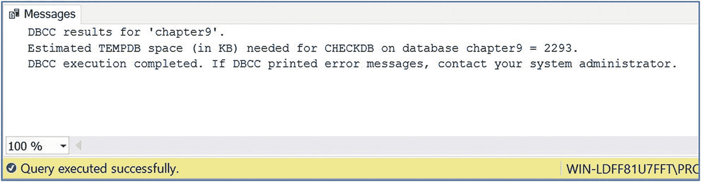
*图 9-5*


##### DBCC CHECKDB 结果所需的 TempDB 空间

清单 9-9 中的脚本使用 `DBCC CHECKDB` 对整个 `Chapter9` 数据库执行一致性检查。

```sql
USE Chapter9
GO
DBCC CHECKDB ;
```

**清单 9-9**
运行 `DBCC CHECKDB`

图 9-6 显示了运行此命令结果的一个片段。如你所见，`CorruptTable` 表中损坏页的问题已被识别出来。

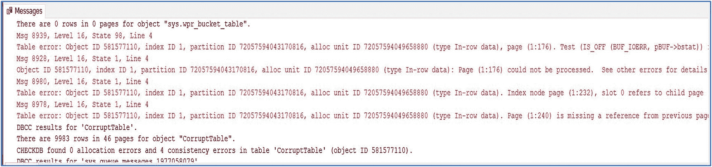

**图 9-6** DBCC CHECKDB 识别损坏页

在实际工作中，除非你正在排查特定错误，否则不太可能手动运行 `DBCC CHECKDB`。它通常计划随 SQL Server 代理或维护计划一起运行。那么，你如何知道它何时遇到错误呢？很简单，SQL Server 代理作业步骤会失败。图 9-7 显示了在失败作业的历史记录中显示的错误消息。`DBCC CHECKDB` 的输出也会写入 SQL Server 错误日志。无论它是手动调用还是通过 SQL Server 代理作业调用，都是如此。

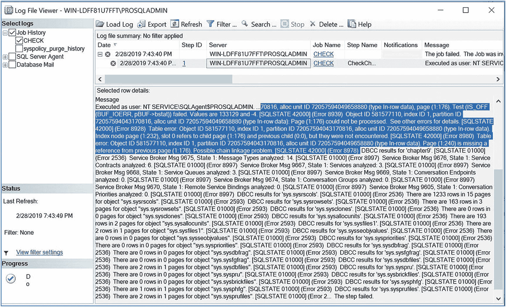

**图 9-7** 作业历史记录中的错误

因为 `DBCC CHECKDB` 发现错误会导致作业失败，所以你可以设置通知，以便数据库管理员接收警报。假设服务器上配置了数据库邮件，你可以通过在 SQL Server Management Studio 中 SQL Server 代理文件夹下的“操作员”文件夹的右键菜单中选择“新建操作员”来创建一个接收电子邮件的新操作员，如图 9-8 所示。

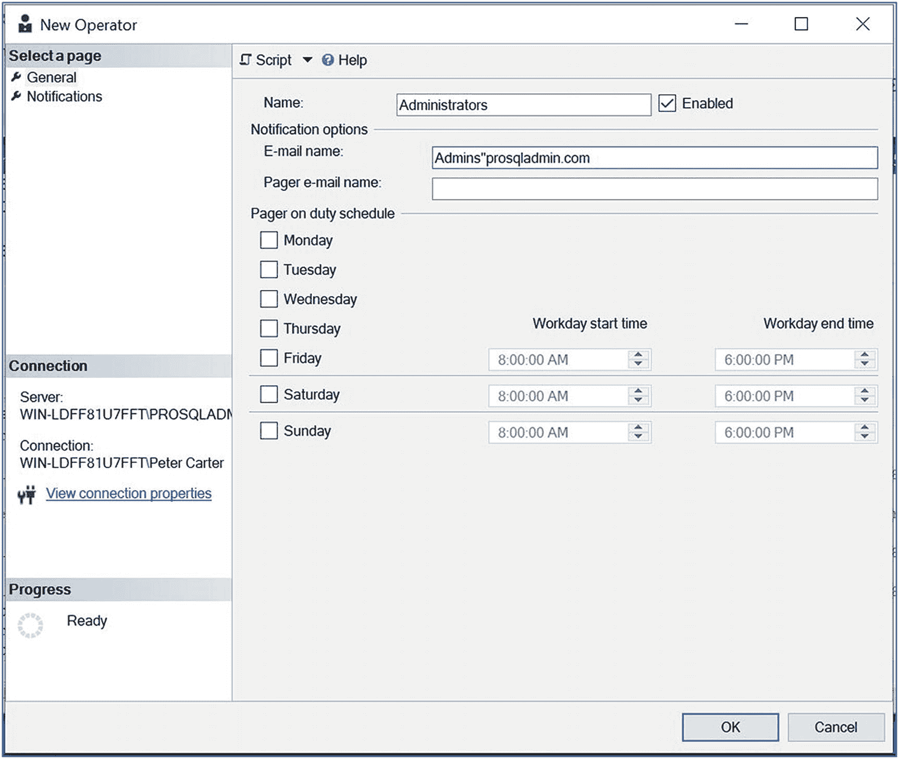

**图 9-8** 创建新操作员

创建操作员后，你可以在 SQL Server 代理作业的“作业属性”页面的“通知”选项卡中指定该操作员。如图 9-9 所示。

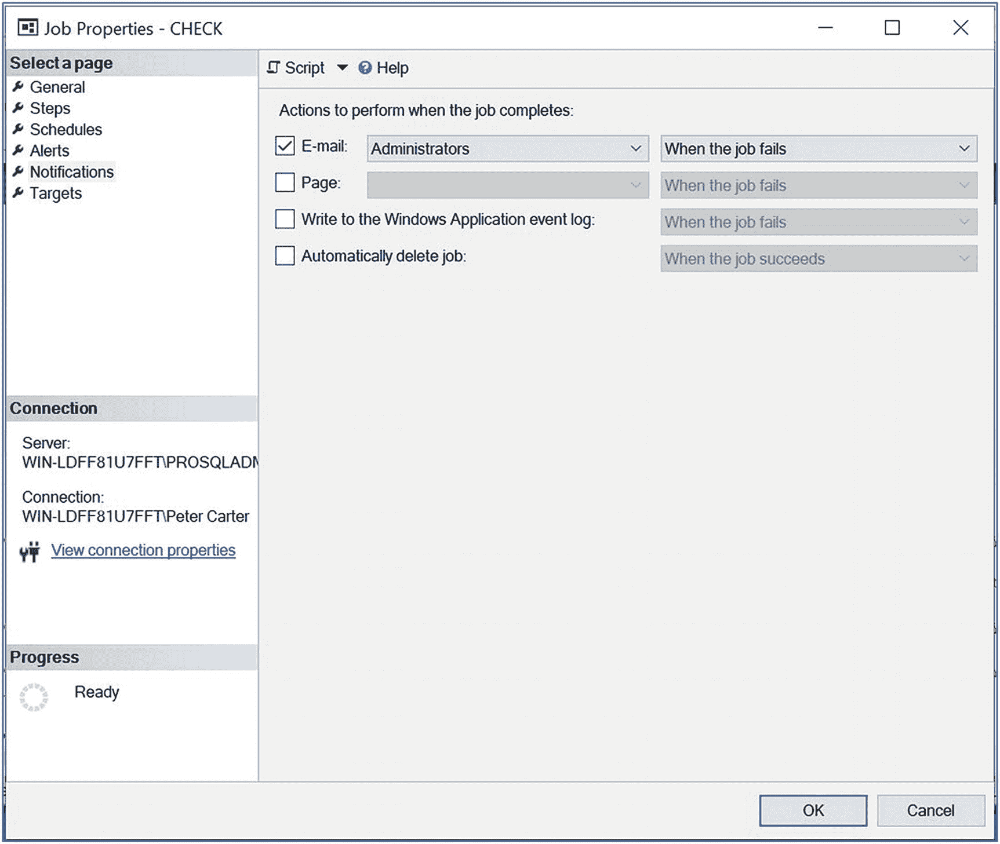

**图 9-9** 配置通知

SQL Server 代理作业将在第 22 章中详细讨论。

### 修复错误

当我们使用 `DBCC CHECKDB` 来修复数据库中的损坏时，我们需要指定一个额外的参数来决定要使用的修复级别。可用的选项是 `REPAIR_REBUILD` 和 `REPAIR_ALLOW_DATA_LOSS`。`REPAIR_REBUILD` 当然是首选选项，它可用于解决不会导致数据丢失的问题，例如错误的页指针或非聚集索引内部的损坏。`REPAIR_ALLOW_DATA_LOSS` 会尝试修复它遇到的所有错误，但如其名所示，这可能涉及数据丢失。你应仅在没有备份可用时，才使用此选项来恢复数据。

在为 `DBCC CHECKDB` 指定修复选项之前，务必先不带修复选项运行一次。这是因为当你这样做时，它会告诉你可用于解决错误的最低修复级别选项。如果我们再次查看针对 `Chapter9` 数据库运行的输出，我们可以看到输出的末尾建议了要使用的最合适的修复选项。如图 9-10 所示。

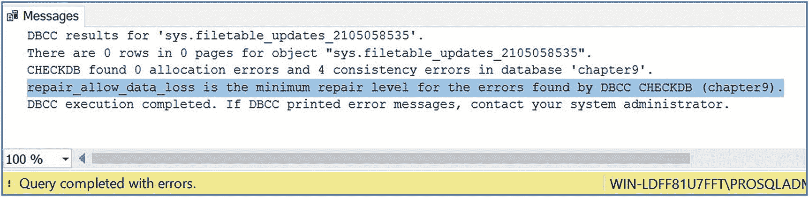

**图 9-10** 建议的修复选项

在我们的案例中，我们被告知需要使用 `REPAIR_ALLOW_DATA_LOSS` 选项。如果我们尝试使用 `REPAIR_REBUILD` 选项，我们会收到来自 `DBCC CHECKDB` 的以下消息：

```
CHECKDB found 0 allocation errors and 4 consistency errors in database 'chapter9'.
repair_allow_data_loss is the minimum repair level for the errors found by DBCC CHECKDB (chapter9, repair_rebuild)
```

由于我们没有 `Chapter9` 数据库的备份，这是我们修复损坏的唯一机会。为了使用修复选项，我们还必须将数据库置于 `SINGLE_USER` 模式。清单 9-10 中的脚本将 `Chapter9` 数据库置于 `SINGLE_USER` 模式，运行修复，然后再次更改数据库以允许多个连接。

```sql
ALTER DATABASE Chapter9 SET SINGLE_USER ;
GO
DBCC CHECKDB (Chapter9, REPAIR_ALLOW_DATA_LOSS) ;
GO
ALTER DATABASE Chapter9 SET MULTI_USER ;
GO
```

**清单 9-10** 使用 `DBCC CHECKDB` 修复损坏

图 9-11 中的部分结果显示 `CorruptTable` 中的错误已被修复。它还显示该页已被释放。这意味着我们丢失了该页上的所有数据。

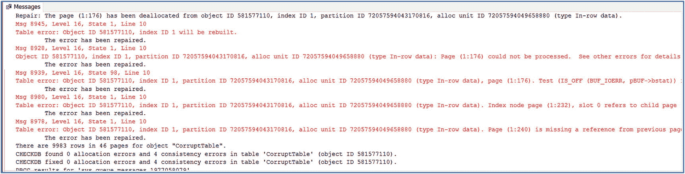

**图 9-11** 使用 `DBCC CHECKDB` 修复损坏的结果

如果我们再次使用与清单 9-4 中演示的相同的查询来查询 `msdb.dbo.suspect_pages` 表，我们会看到 `Event` 列已被更新，表明该页已被释放。我们还可以看到，每次我们访问该页（无论是通过 `SELECT` 语句还是 `DBCC CHECKDB`），`error_count` 列都会递增。这些结果如图 9-12 所示。

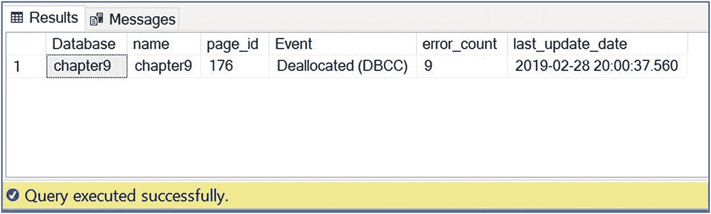

**图 9-12** 修复后的 `suspect_pages` 表


#### 紧急模式

如果您的数据库文件损坏到数据库无法访问且无法恢复的程度，即使使用了 `REPAIR_ALLOW_DATA_LOSS` 选项也不行，并且您没有可用的备份，那么您最后的手段就是使用 `REPAIR_ALLOW_DATA_LOSS` 选项在紧急模式下运行 `DBCC CHECKDB`。请记住，紧急模式是修复数据库的最后手段选项，如果您无法通过此模式访问数据库，那么您将无法通过任何其他方式访问它们。当您在数据库处于紧急模式下执行此操作时，`DBCC CHECKDB` 会将因损坏而无法访问的数据页视为没有错误，以尝试恢复数据。

此操作还可以备份因日志损坏而无法访问的数据库。这是因为它会尝试强制事务日志恢复，即使遇到错误也是如此。如果失败，它会重建事务日志。当然，这可能导致事务不一致，但如前所述，这是一个最后的选择。

举个例子，我们将在操作系统中删除 `Chapter9` 数据库的事务日志文件。您可以通过运行清单 9-11 中的查询来找到事务日志文件的操作系统位置。

```sql
SELECT physical_name
FROM sys.master_files
WHERE database_id = DB_ID('Chapter9')
AND type_desc = 'Log' ;
```
清单 9-11 查找事务日志路径

由于数据和日志文件被 SQL Server 进程锁定，我们首先需要停止实例。重新启动实例后，我们可以看到我们的 `Chapter9` 数据库已被标记为“恢复挂起”，如图 9-13 所示。

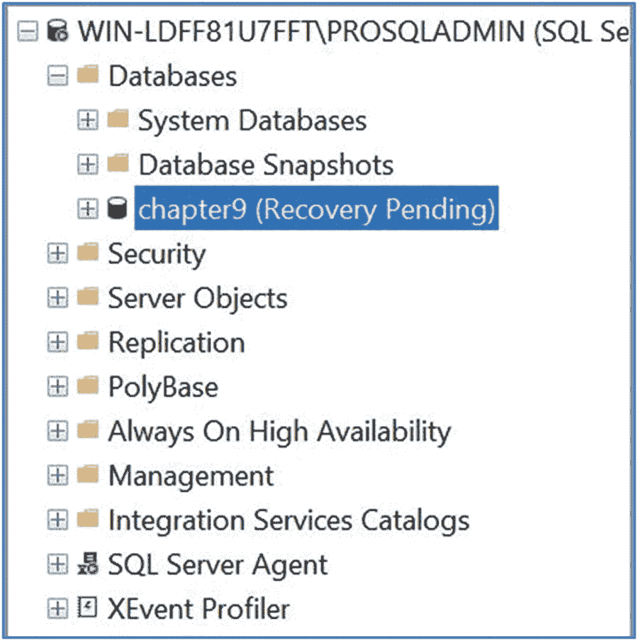
图 9-13 处于恢复挂起状态的数据库

由于我们没有 `Chapter9` 数据库的可用备份，我们唯一的选择就是使用紧急模式下的 `DBCC CHECKDB`。清单 9-12 中的脚本将 `Chapter9` 数据库置于紧急模式，然后使用带有 `REPAIR_ALLOW_DATA_LOSS` 选项的 `DBCC CHECKDB` 来修复错误。

```sql
ALTER DATABASE Chapter9 SET EMERGENCY ;
GO
ALTER DATABASE Chapter9 SET SINGLE_USER ;
GO
DBCC CHECKDB ('Chapter9', REPAIR_ALLOW_DATA_LOSS) ;
GO
ALTER DATABASE Chapter9 SET MULTI_USER ;
GO
```
清单 9-12 紧急模式下的 `DBCC CHECKDB`

如图 9-14 所示的部分结果表明，SQL Server 能够通过重建事务日志使数据库重新联机。然而，这也意味着事务一致性已经丢失，备份链已中断。由于我们失去了事务一致性，我们现在应该运行 `DBCC CHECKCONSTRAINTS` 来查找外键约束和 CHECK 约束中的错误。本章稍后将介绍 `DBCC CHECKCONSTRAINTS`。

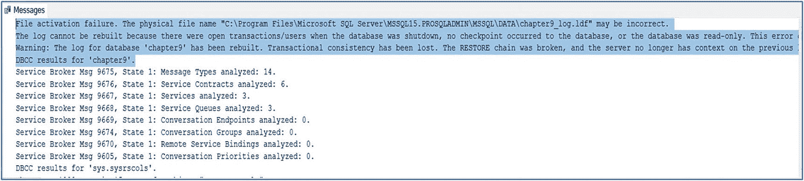
图 9-14 紧急模式下 `DBCC CHECKDB` 的结果

#### 注意

如果在紧急模式下运行 `DBCC CHECKDB` 失败，那么数据库将无法通过其他方式修复。

#### 其他用于处理损坏的 DBCC 命令

还有一些其他 DBCC 命令执行 `DBCC CHECKDB` 所做工作的一个子集。这些将在以下部分讨论。

##### DBCC CHECKCATALOG

在 SQL Server 中，系统目录是描述数据库及其内部数据的元数据的集合。运行 `DBCC CHECKCATALOG` 时，它会对此目录执行一致性检查。此命令作为 `DBCC CHECKDB` 的一部分运行，但也可以作为独立命令运行。作为独立命令运行时，它接受与 `DBCC CHECKDB` 相同的参数，但 `PHYSICAL_ONLY` 和 `DATA_PURITY` 除外，这些参数对此命令不可用。

##### DBCC CHECKALLOC

`DBCC CHECKALLOC` 对数据库内的磁盘分配结构执行一致性检查。它作为 `DBCC CHECKDB` 的一部分运行，但也可以作为独立命令运行。作为独立命令运行时，它接受许多与 `DBCC CHECKDB` 相同的参数，但 `PHYSICAL_ONLY`、`DATA_PURITY` 和 `REPAIR_REBUILD` 除外，这些参数对此命令不可用。输出按表、索引和分区列出。

##### DBCC CHECKTABLE

`DBCC CHECKTABLE` 作为 `DBCC CHECKDB` 的一部分针对数据库中的每个表和索引视图运行。但是，它也可以作为单独的命令针对特定表及其索引运行。它对该特定表执行一致性检查，如果有任何索引视图引用该表，它还会执行跨表一致性检查。它接受与 `DBCC CHECKDB` 相同的参数，但使用它时，还需要指定要检查的表的名称或 ID。

##### 谨慎

我曾见过人们将他们的表分成两组，然后用在隔夜对一半表运行 `DBCC CHECKTABLE` 来代替 `DBCC CHECKDB`。这不仅会在检查内容上留下空白，而且为每个被检查的表都会生成一个新的数据库快照，而不是为所有检查生成一个快照。这可能导致每个表的运行时间更长。

##### DBCC CHECKFILEGROUP

`DBCC CHECKFILEGROUP` 对指定文件组内的系统目录、分配结构、表和索引视图执行一致性检查。然而，当表的索引存储在不同的文件组上时，存在一些限制。在这种情况下，索引不会被检查一致性。即使索引存储在您正在检查的文件组上，但对应的基表在另一个文件组上时，此限制同样适用。

如果您有一个分区表，该表存储在多个文件组上，`DBCC CHECKFILEGROUP` 仅检查存储在被检查文件组上的分区的分区。`DBCC CHECKFILEGROUP` 的参数与 `DBCC CHECKDB` 相同，但 `DATA_PURITY` 除外，该参数无效，并且您不能指定任何修复选项。您还需要指定文件组名称或 ID。


##### DBCC CHECKIDENT

`DBCC CHECKIDENT` 扫描指定表中的所有行，以查找 `IDENTITY` 列中的最大值。然后，它会检查确保存储在表元数据中的下一个 `IDENTITY` 值高于表中 `IDENTITY` 列的最大值。`DBCC CHECKIDENT` 接受表 9-6 中详述的参数。

表 9-6

DBCC CHECKIDENT 参数

| 参数 | 描述 |
| --- | --- |
| 表名 | 要检查的表的名称。 |
| `NORESEED` | 返回 `IDENTITY` 列的最大值和当前的 `IDENTITY` 值，但即使需要，也不会重新设定该列的种子值。 |
| `RESEED` | 将当前的 `IDENTITY` 值重新设定为表中 `IDENTITY` 的最大值。 |
| 新重新设定值 | 与 `RESEED` 一起使用，为 `IDENTITY` 值指定一个种子值。应谨慎使用此参数，因为将 `IDENTITY` 值设置为低于表中的最大值，如果 `IDENTITY` 列上有主键或唯一约束，可能会导致生成错误。 |
| `WITH NO_INFOMSGS` | 抑制信息性消息的显示。 |

我们可以通过使用代码清单 9-13 中的命令，来检查我们的 `CorruptTable` 表中的 `IDENTITY` 值与最大 `IDENTITY` 值是否一致。

```
DBCC CHECKIDENT('CorruptTable',NORESEED) ;
代码清单 9-13
DBCC CHECKIDENT
```

结果显示在图 9-15 中，其中 `IDENTITY` 列的最大值和当前的 `IDENTITY` 值都是 `10201`，这意味着目前我们表中的 `IDENTITY` 值没有问题。

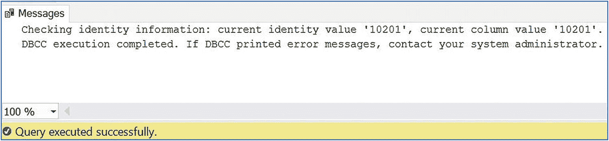

图 9-15

DBCC CHECKIDENT 结果

##### DBCC CHECKCONSTRAINTS

`DBCC CHECKCONSTRAINTS` 可以检查表中特定的外键或检查约束的完整性，检查单个表上的所有约束，或者检查数据库中所有表上的所有约束。`DBCC CHECKCONSTRAINTS` 接受表 9-7 中详述的参数。

表 9-7

DBCC CHECKCONSTRAINTS 参数

| 参数 | 描述 |
| --- | --- |
| 表或约束 | 指定您希望检查的约束的名称或 ID，或者指定表的名称或 ID 以检查该表上所有已启用的约束。省略此参数会导致检查数据库中所有表上所有已启用的约束。 |
| `ALL_CONSTRAINTS` | 如果 `DBCC CHECKCONSTRAINTS` 是针对整个表或整个数据库运行的，那么此选项将强制检查已禁用和已启用的约束。 |
| `ALL_ERRORMSGS` | 默认情况下，如果 `DBCC CHECKCONSTRAINTS` 发现违反约束的行，它将返回这些行中的前 200 行。指定 `ALL_ERRORMSGS` 会导致返回所有违反约束的行，即使其数量超过 200 行。 |
| `NO_INFOMSGS` | 抑制信息性消息的显示。 |

代码清单 9-14 中的脚本创建了一个名为 `BadConstraint` 的表并插入了一行数据。然后，它在表上创建了一个检查约束，并指定了 `NOCHECK` 选项，这使我们能够创建一个立即被我们已添加的现有行所违反的约束。最后，我们对该表运行 `DBCC CHECKCONSTRAINTS`。

```
USE Chapter9
GO
--创建 BadConstraint 表
CREATE TABLE dbo.BadConstraint
(
ID        INT PRIMARY KEY
) ;
--向 BadConstraint 表中插入一个负值
INSERT INTO dbo.BadConstraint
VALUES(-1) ;
--创建一个 CHECK 约束，强制 ID 列的值为正数
ALTER TABLE dbo.BadConstraint WITH NOCHECK ADD CONSTRAINT chkBadConstraint CHECK (ID > 0) ;
GO
--对表运行 DBCC CHECKCONSTRAINTS
DBCC CHECKCONSTRAINTS('dbo.BadConstraint') ;
代码清单 9-14
DBCC CHECKCONSTRAINTS
```

运行此脚本的结果如图 9-16 所示。您可以看到 `DBCC CHECKCONSTRAINTS` 已返回了违反约束的行的详细信息。

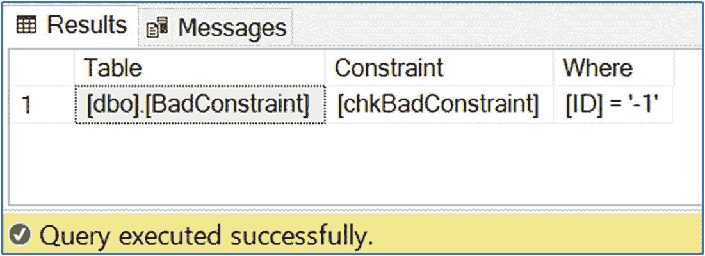

图 9-16

DBCC CHECKCONSTRAINTS 结果

#### 提示

在运行 `DBCC CHECKDB` 或其他 DBCC 命令来修复损坏后，运行 `DBCC CHECKCONSTRAINTS` 是一个好习惯。这是因为 DBCC 命令的修复选项不会考虑约束完整性。

即使 `DBCC CHECKCONSTRAINTS` 没有发现任何坏数据，它仍然不会将约束标记为可信。您必须手动完成此操作。代码清单 9-15 中的脚本首先运行一个查询来查看约束是否可信，然后手动将其标记为可信。

```
SELECT
is_not_trusted
FROM sys.check_constraints
WHERE name = 'chkBadConstraint' ;
ALTER TABLE dbo.BadConstraint WITH CHECK CHECK CONSTRAINT chkDadConstraint ;
代码清单 9-15
将约束标记为可信
```

#### 超大型数据库的一致性检查

如果您有超大型数据库，可能很难找到足够长的维护窗口来运行 `DBCC CHECKDB`，并且在用户或 ETL 进程连接时运行它可能会导致性能问题。如果您拥有大量使用公共基础架构（如 SAN 或私有云）的小型数据库，也可能会遇到类似问题。然而，确保数据库的一致性应该是您议程上的优先事项，因此您应该尝试找到一个既能满足维护需求又能满足性能目标的策略。以下部分讨论了您可以选择采用来实现这种平衡的策略。

##### 使用 PHYSICAL_ONLY 选项的 DBCC CHECKDB

您可以采取的一种策略是定期（最好每晚）使用 `PHYSICAL_ONLY` 选项运行 `DBCC CHECKDB`，然后在周期性但频率较低的基础上（最好每周一次）运行一次完整的检查。当您使用 `PHYSICAL_ONLY` 选项运行 `DBCC CHECKDB` 时，会执行系统目录和分配结构的一致性检查，并扫描和验证每个表的每个页面。其最终结果是捕获由 IO 错误引起的损坏，但会识别其他问题，例如逻辑一致性错误。这就是为什么每周运行一次完整扫描仍然很重要。

##### 使用 WITH CHECKSUM 备份和 DBCC CHECKALLOC

如果您所有的数据库每晚都有完整备份，并且所有数据库都配置了 `CHECKSUM` 作为 `PAGE_VERIFY` 选项，那么除了前面提到的策略外，另一种方法是在您的完整备份中添加 `WITH CHECKSUM` 选项，然后运行 `DBCC CHECKALLOC` 来代替每晚指定 `PHYSICAL_ONLY` 选项的 `DBCC CHECKDB`。`DBCC CHECKALLOC` 命令实际上是 `DBCC CHECKDB` 命令的一个子集，它验证数据库内的分配结构。当执行带 `WITH CHECKSUM` 的完整备份时，这就满足了扫描和验证每个表的每个页面以检查 IO 错误的要求。就像运行指定了 `PHYSICAL_ONLY` 选项的 `DBCC CHECKDB` 一样，这可以识别由 IO 操作引起的任何损坏以及任何坏的校验和。但是，在内存中发生的页面错误将不会被识别。这意味着与 `PHYSICAL_ONLY` 策略一样，您仍然需要每周完整运行一次 `DBCC CHECKDB` 来捕获逻辑一致性错误或在内存中发生的损坏。如果您的环境具有公共基础架构，并且正在对所有数据库执行每晚完整备份，那么此选项非常有用，因为您将减少每晚的总体 IO 量。然而，这是以备份窗口时长为代价的，并且在此期间会增加资源的使用。


##### 分工作业

针对超大型数据库（VLDB）的另一项策略，可能是将 `DBCC CHECKDB` 的负载分散到多个晚上进行。例如，如果你的 VLDB 有多个文件组，那么你可以在周一、周三和周五对一半的文件组运行 `DBCC CHECKFILEGROUP`，然后在周二、周四和周六对另一半的文件组运行。你可以将周日留出来，用于完整运行 `DBCC CHECKDB`。尽管如此，仍建议每周至少完整运行一次 `DBCC CHECKDB`，因为 `DBCC CHECKFILEGROUP` 不会执行某些检查，例如验证 Service Broker 对象。

如果你的问题是通用基础设施（而非 VLDB），那么你可以调整上述概念，在隔夜对数据库的子集轮流运行 `DBCC CHECKDB`。这可能有点复杂，因为此方法为了避开存储区域网络（SAN）的负载，需要基于大小（而非随机 50/50 分割）智能地隔离数据库。这通常涉及到将维护例程集中到一个中央服务器，即中央管理服务器（CMS）。CMS 是一个 SQL Server 实例，位于你的 SQL Server 环境中心，提供集中监控和维护功能。通常，对于像我这里描述的智能维护，CMS 会通过调度 PowerShell 脚本来控制维护例程，这些脚本会与存储在 CMS 上的元数据交互，以决定运行哪些维护作业。

##### 卸载到辅助服务器

减轻 `DBCC CHECKDB` 对生产系统负载的最终策略是将工作卸载到辅助服务器。如果你决定采用这种方法，需要先对 VLDB 进行完整备份，然后在辅助服务器上恢复该备份，之后才能在辅助服务器上运行 `DBCC CHECKDB`。然而，这种方法有几个缺点。首先，也是最明显的一点是，这意味着你需要承担购买和维护一台专用辅助服务器的费用，仅用于运行一致性检查。这使它成为所讨论选项中最昂贵的一种（当然，除非你重复使用现有服务器，如用户验收测试（UAT）服务器）。此外，如果你发现损坏，你将无法确定损坏是在生产系统上产生并随备份复制过来的，还是实际上在辅助服务器上产生的。这意味着如果发现错误，你仍然需要在生产服务器上运行 `DBCC CHECKDB`。

### 总结

SQL Server 中可能发生多种类型的损坏。这些包括在文件系统级别损坏的页面、逻辑一致性错误以及校验和错误的损坏页面。页面也可能在内存中损坏，这种情况无法通过校验和识别。

可以选择三种页面验证选项用于数据库。`NONE` 选项会让你完全暴露于各种问题之下，被认为是不良实践。`TORN_PAGE_DETECTION` 选项已弃用，不应使用，因为它仅检查每个 512 字节扇区的前 2 个字节。最后一个选项是 `CHECKSUM`。这是默认选项，应始终选择。

损坏的页面存储在 MSDB 数据库中一个名为 `dbo.suspect_pages` 的表中。在这里，每次遇到错误时，错误计数都会增加，并且页面的事件类型会更新，以指示它已根据情况被修复或还原。

如果系统数据库（尤其是 Master）损坏，你可能无法启动实例。如果是这种情况，你可以通过运行安装程序并将 `ACTION` 参数设置为 `Rebuilddatabases` 来纠正问题。或者，如果实例本身已损坏，则可以运行安装程序并将 `ACTION` 参数设置为 repair。这可以解决诸如注册表项损坏或资源数据库损坏等问题。

`DBCC CHECKDB` 是你应该定期运行以检查损坏的命令。如果发现损坏，你也可以使用此命令来修复问题。根据损坏的性质，有两种可用的修复模式：`REPAIR_REBUILD` 和 `REPAIR_ALLOW_DATA_LOSS`。仅当没有可用于还原数据库或损坏页面的备份时，才应将 `REPAIR_ALLOW_DATA_LOSS` 选项作为最后手段使用。这是因为 `REPAIR_ALLOW_DATA_LOSS` 选项可能会释放损坏页面的空间，导致这些页面上的所有数据丢失。

其他 DBCC 命令可用于执行 `DBCC CHECKDB` 功能的一个子集。这些包括 `DBCC CHECKTABLE`（可验证特定表的完整性）和 `DBCC CONSTRAINTS`（可用于验证外键和检查约束的完整性，尤其是在使用修复选项运行 `DBCC CHECKDB` 之后）。

对于 VLDB 或共享基础设施的环境，运行 `DBCC CHECKDB` 可能会因为性能影响和资源利用率而成为问题。你可以通过采用在维护和性能目标之间提供折衷方案的策略来缓解此问题。这些策略包括分工作业、将工作负载卸载到辅助服务器，或者每晚仅运行检查功能的子集，然后每周执行一次完整检查。

