# 第三部分 安全、弹性与工作负载扩展

## 10. SQL Server 安全模型

SQL Server 2019 提供了一个复杂的安全模型，具有重叠的安全层，帮助数据库管理员（DBA）以可管理的方式应对风险和威胁。DBA 理解 SQL Server 安全模型非常重要，这样他们才能以最符合其组织和应用程序需求的方式实施技术。本章讨论 SQL Server 安全层次结构，然后演示如何在实例、数据库和对象级别实施安全。我们还将讨论使用 SQL Audit 进行审核，以及通过安全报告（如数据发现与分类和漏洞评估）来协助法规遵从性。


### 安全层级

SQL Server 的安全层级始于 Windows 域级别，并逐级向下延伸，经过本地服务器、SQL Server 实例、数据库，直至对象级别。该模型基于 *主体*、*安全对象* 和 *权限* 的概念。*主体* 是被授予权限、拒绝权限或撤销权限的实体。撤销权限意味着删除现有的授予或拒绝分配。组和角色是包含零个或多个安全主体的主体，通过允许你将权限作为一个单一单元分配给相似的主体，简化了安全管理。

*安全对象* 是可以被授予权限的对象——例如，实例级别的端点，或数据库内的表。因此，你将安全对象上的权限授予某个主体。图 10-1 中的图表概述了安全层级的每一级以及主体是如何分层的。

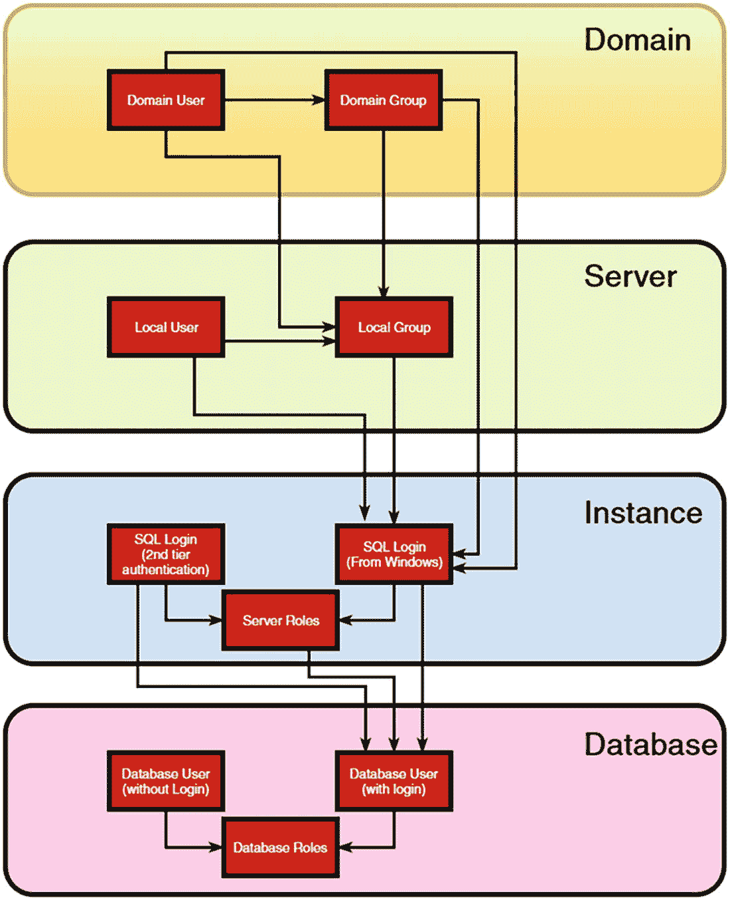

*图 10-1：安全主体层级*

该图显示，在 SQL Server 实例中创建的登录名可以映射到本地 Windows 用户或组，或域用户或组。通常，在企业环境中，这是一个域用户或组。（*组* 是被作为一个单元授予权限的用户集合。）这简化了安全管理。想象一下，一个新成员加入了销售团队。当他被添加到名为 `SalesTeam` 的域组时——该组已经拥有了访问文件系统位置、SQL Server 数据库等所需的所有权限——他立即继承了履行其角色所需的所有权限。

该图还说明了本地服务器帐户或域帐户及组如何映射到数据库级别的用户（一个没有登录名的数据库用户）。这是包含数据库功能的一部分。这项技术早在 SQL Server 2012 中就已引入，以支持使用 AlwaysOn 可用性组的高可用性。本章稍后将讨论包含数据库身份验证。

然后，你可以将 Windows 登录名（你在 SQL Server 实例级别创建的）或二级 SQL Server 登录名（如果你使用的是混合模式身份验证）添加到实例级别的固定服务器角色和用户定义服务器角色中。这样做允许你将通用权限集授予用户，用于实例级别的对象，如链接服务器和端点。你也可以将登录名映射到数据库用户。

数据库用户位于层级的数据库级别。你可以直接在数据库内的架构和对象上授予他们权限，或者可以将他们添加到数据库角色中。数据库角色类似于服务器角色，不同之处在于它们被授予了对数据库内部对象（如架构、表、视图、存储过程等）的通用权限集。

#### 创建 Chapter10 数据库

在继续之前，我们现在将创建 `Chapter10` 数据库，本章中的示例将使用该数据库。这可以通过运行清单 10-1 中的脚本来实现。

```sql
--Create Chapter10 database
CREATE DATABASE Chapter10 ;
GO
USE Chapter10
GO
--Create SensitiveData table
CREATE TABLE dbo.SensitiveData
(
ID    INT    PRIMARY KEY    IDENTITY,
SensitiveText        NVARCHAR(100)
) ;
--Populate SensitiveData table
DECLARE @Numbers TABLE
(
ID        INT
)
;WITH CTE(Num)
AS
(
SELECT 1 AS Num
UNION ALL
SELECT Num + 1
FROM CTE
WHERE Num < 100
)
INSERT INTO @Numbers
SELECT Num
FROM CTE ;
INSERT INTO dbo.SensitiveData
SELECT 'SampleData'
FROM @Numbers ;
```

### 实现实例级安全

除非你使用的是包含数据库（本章稍后讨论），否则所有用户都必须在实例级别进行身份验证。你可以使用两种身份验证模式：Windows 身份验证和混合模式身份验证。当你选择 Windows 身份验证时，会创建一个实例级别的登录名，并将其映射到 Windows 用户或组，该用户或组存在于域级别或本地服务器级别。

例如，假设有两个用户 Pete 和 Danielle。两人都有域帐户，`PROSQLADMIN\Pete` 和 `PROSQLADMIN\Danielle`。两人也是一个名为 `PROSQLADMIN\SQLUsers` 的 Windows 组的成员。创建两个登录名，一个映射到 Pete 的帐户，一个映射到 Danielle 的帐户，在功能上等同于创建一个登录名，映射到 `SQLUsers` 组，前提是你授予完全相同的权限集。然而，创建两个单独的登录名可以对权限进行更精细的控制。

当你创建一个映射到 Windows 用户或组的登录名时，SQL Server 会记录此主体的 SID（安全标识符）并将其存储在 Master 数据库中。然后，它使用此 SID 来识别尝试连接的用户，依据是他们用来登录服务器或域的上下文。

除了创建映射到 Windows 用户或组的登录名外，你还可以将登录名映射到证书或非对称密钥。这样做并不允许用户使用证书进行实例身份验证，但它确实允许代码签名，从而可以将权限抽象到存储过程，而不是直接授予登录名。这在你使用动态 SQL（这会打破所有权链）时很有帮助；在这种场景下，当你运行存储过程时，SQL Server 会结合调用该过程的用户和映射到证书的用户的权限。所有权链将在本章稍后讨论。

但是，如果你为实例选择混合模式身份验证，那么除了使用前面描述的 Windows 身份验证外，用户还可以使用二级身份验证进行连接。当你使用二级身份验证时，你会创建一个 SQL 登录名，该登录名具有用户名和密码。此用户名和密码及其自身的 SID 一起存储在 Master 数据库中。当用户尝试进行实例身份验证时，她提供用户名和密码，系统会将其与存储的凭据进行验证。

当使用混合模式身份验证时，会存在一个名为 `SA` 的特殊用户。这是系统管理员帐户，它对整个实例拥有管理权限。这可能是一个安全漏洞，因为任何试图入侵 SQL Server 实例的人都会首先尝试破解 `SA` 帐户的密码。因此，必须为该帐户使用非常强的密码。

另一个安全提示是重命名 `SA` 帐户。这意味着潜在的黑客将不知道管理帐户的名称，这使得入侵实例变得更加困难。你可以使用清单 10-2 中的命令重命名 `SA` 帐户。

```sql
ALTER LOGIN sa WITH NAME = PROSQLADMINSA ;
```

就其本质而言，Windows 身份验证比二级身份验证更安全。因此，除非你有特定需要使用二级身份验证，否则最佳实践是将你的实例配置为仅使用 Windows 身份验证。你可以在 SQL Server Management Studio 的“服务器属性”对话框的“安全性”选项卡中设置身份验证模式。你需要重启 SQL Server 服务才能使更改生效。


### 服务器角色

SQL Server 提供了一套开箱即用的服务器角色，允许你将实例级权限分配给满足常见需求的登录名。这些被称为 `固定服务器角色`，你无法更改分配给它们的权限；只能添加或删除登录名。表 10-1 描述了这些固定服务器角色。

**表 10-1** 固定服务器角色

| 角色 | 描述 |
| --- | --- |
| `sysadmin` | `sysadmin` 角色授予对整个实例的管理权限。`sysadmin` 角色的成员可以在 SQL Server 关系引擎实例内执行任何操作。 |
| `blkadmin` | 结合对数据库中目标表的 `INSERT` 权限，`bulkadmin` 角色允许用户使用 `BULK INSERT` 语句从文件导入数据。此角色通常授予运行 ETL 过程的服务账户。 |
| `dbcreator` | `dbcreator` 角色允许其成员在实例中创建新数据库。用户创建数据库后，他将自动成为该数据库的所有者，并能够在其中执行任何操作。 |
| `diskadmin` | `diskadmin` 角色授予其成员在 SQL Server 中管理备份设备的权限。 |
| `processadmin` | `processadmin` 角色的成员能够从 T-SQL 或 SSMS 停止实例。他们还能够终止正在运行的进程。 |
| `public` | 所有 SQL Server 登录名都会添加到 `public` 角色。虽然可以向 `public` 角色分配权限，但这不符合最小权限原则。此角色通常仅用于内部 SQL Server 操作，例如对 TempDB 进行身份验证。 |
| `securityadmin` | `securityadmin` 角色的成员能够在实例级别管理登录名。例如，成员可以将登录名添加到服务器角色（`sysadmin` 除外）或向实例级资源（如端点）分配权限。但是，他们无法在数据库内向数据库用户分配权限。 |
| `serveradmin` | `Serveradmin` 角色结合了 `diskadmin` 和 `processadmin` 角色的功能。此外，该角色的成员不仅能够启动或停止实例，还可以使用 `SHUTDOWN` T-SQL 命令关闭实例。此处的细微差别在于，如果使用 `NOWAIT` 选项，`SHUTDOWN` 命令允许你选择不在每个数据库中运行 `CHECKPOINT`。此外，该角色的成员可以修改端点并查看所有实例元数据。 |
| `setupadmin` | `setupadmin` 角色的成员能够创建和管理链接服务器。 |

你还可以创建自己的服务器角色，将需要一组针对你的环境定制的常用权限的用户分组。例如，如果你有一个依赖于可用性组的高可用性环境，那么你可能希望创建一个名为 `AOAG` 的服务器角色，并向该组授予以下权限：

*   `ALTER ANY AVAILABILITY GROUP`
*   `ALTER ANY ENDPOINT`
*   `CREATE AVAILABILITY GROUP`
*   `CREATE ENDPOINT`

然后，你可以将初级 DBA 添加到此角色，他们不被授权拥有完整的 `sysadmin` 权限，但你希望他们管理实例的高可用性。你可以在 SSMS 中，通过右键单击 **安全性** ➤ **服务器角色** 并选择 **新建服务器角色** 来创建此服务器角色。**新建服务器角色** 对话框的 **常规** 选项卡如图 10-2 所示。

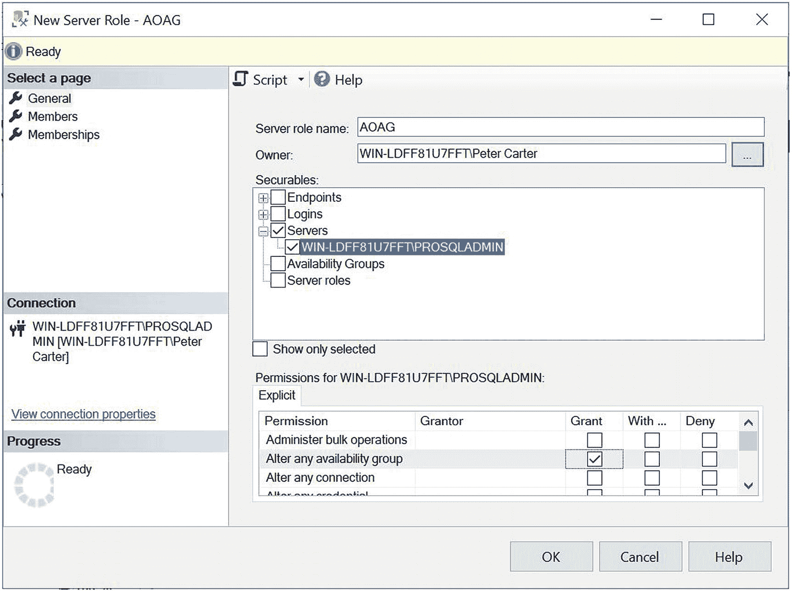

**图 10-2** 常规选项卡

你可以看到，我们已将角色名称指定为 `AOAG`，为角色指定了所有者，并选择了正在配置的实例下所需的权限。在对话框的 **成员** 选项卡中，我们可以搜索要添加到角色的现有登录名；在 **成员身份** 选项卡中，我们可以选择将角色嵌套在另一个服务器角色中。

或者，你也可以通过 T-SQL 创建该组。清单 10-3 中的脚本也创建了这个组。我们将在本章后面将登录名添加到该角色。

```sql
USE Master
GO
CREATE SERVER ROLE AOAG AUTHORIZATION [WIN-KIAGK4GN1MJ\Administrator] ;
GO
GRANT ALTER ANY AVAILABILITY GROUP TO AOAG ;
GRANT ALTER ANY ENDPOINT TO AOAG ;
GRANT CREATE AVAILABILITY GROUP TO AOAG ;
GRANT CREATE ENDPOINT TO AOAG ;
GO
```

**清单 10-3** 创建服务器角色并分配权限


### SQL Server 安全基础

#### 登录名

您可以通过 SSMS 或 T-SQL 创建登录名。要通过 SSMS 创建登录名，请在`Security` -> `Logins`的上下文菜单中选择`New Login`。图 10-3 显示了`Login - New`对话框的常规选项卡。

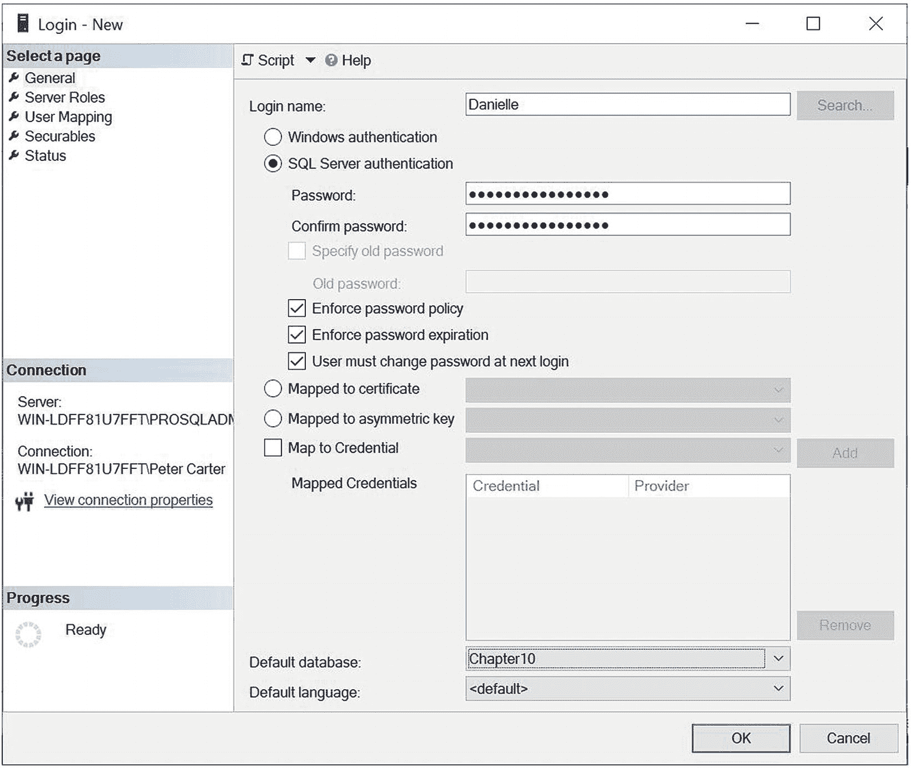

图 10-3 常规选项卡

您可以看到，我们将登录名命名为`Danielle`，并指定了 SQL Server 身份验证而非 Windows 身份验证。这意味着我们还必须指定一个密码并确认它。您可能还会注意到有三个框被选中：`Enforce Password Policy`、`Enforce Password Expiration`和`User Must Change Password At Next Login`。这三个选项是累加的，这意味着如果您没有同时选中`Enforce Password Policy`，则无法选中`Enforce Password Expiration`。同样，如果不选中`Enforce Password Expiration`选项，也无法选中`User Must Change Password At Next Login`。

当您选中`Enforce Password Policy`选项时，SQL Server 会在域级别检查 Windows 用户的密码策略，并将其应用于 SQL Server 登录名。因此，例如，如果您有一个域策略要求网络用户的密码长度为八个字符或更长，那么这对 SQL Server 登录名也同样适用。如果您未选中此选项，则不会对登录名的密码强制执行任何密码策略。类似地，如果您选中了强制密码过期的选项，则过期时间取自域策略。

我们还将登录名的默认数据库设置为`Chapter10`。这并没有为用户分配对`Chapter10`数据库的任何权限，但它指定了当用户对实例进行身份验证时，该数据库将是登录名的着陆区。这也意味着，如果用户没有对`Chapter10`数据库的权限，或者`Chapter10`数据库被删除或变得不可访问，用户将无法登录到该实例。

在`Server Roles`选项卡上，您可以将登录名添加到服务器角色中。在我们的例子中，我们选择不将登录名添加到任何其他服务器角色中。将登录名添加到服务器角色的内容将在本章的下一节讨论。

在`User Mapping`选项卡上，我们可以将登录名映射到数据库级别的用户。在此屏幕上，您应该在`Chapter10`数据库中创建一个数据库用户。每个数据库中的数据库用户名称默认与登录名相同。这不是强制性的，您可以更改数据库用户的名称；但是，保持名称一致是良好的实践。不这样做只会导致混淆，并增加您管理安全主体所需的时间。此时，我们还没有将用户添加到任何数据库角色中。数据库角色将在本章后面讨论。

在`Securables`选项卡上，我们可以搜索要在其上授予登录名权限的特定实例级对象。在`Status`选项卡上，我们可以授予或拒绝登录名登录到实例的权限，以及启用或禁用登录名。此外，如果因为输入错误密码次数过多而导致登录名被锁定，我们可以为用户解锁。失败的密码尝试次数基于服务器的组策略设置，但必须在登录名上使用`CHECK_POLICY`选项。

可以通过运行清单 10-4 中的脚本通过 T-SQL 创建相同的用户。您可以看到，为了达到相同的结果，需要多个命令。第一个创建登录名，其他的创建映射到该登录名的数据库用户。

```sql
USE Master
GO
CREATE LOGIN Danielle
WITH PASSWORD=N'Pa$$w0rd' MUST_CHANGE, DEFAULT_DATABASE=Chapter10,
CHECK_EXPIRATION=ON, CHECK_POLICY=ON ;
GO
USE Chapter10
GO
CREATE USER Danielle FOR LOGIN Danielle ;
GO
```

清单 10-4 创建 SQL Server 登录名

我们也可以使用`New Login`对话框或 T-SQL 来创建 Windows 登录名。如果使用 GUI，我们可以选择`Windows authentication`选项而不是`SQL Server authentication`，然后搜索我们要将登录名映射到的用户或组。清单 10-5 演示了如何使用 T-SQL 创建 Windows 登录名。它将登录名映射到一个名为`Pete`的域用户，配置与`Danielle`相同。

```sql
CREATE LOGIN [PROSQLADMIN\pete] FROM WINDOWS WITH DEFAULT_DATABASE=Chapter10 ;
GO
USE Chapter10
GO
CREATE USER [PROSQLADMIN\pete] FOR LOGIN [PROSQLADMIN\pete] ;
```

清单 10-5 创建 Windows 登录名

#### 授予权限

向登录名分配权限时，可以使用以下操作：

*   `GRANT`
*   `DENY`
*   `REVOKE`

`GRANT`授予主体对安全对象的权限。您可以将`WITH`选项与`GRANT`一起使用，以向主体提供将相同权限分配给其他主体的能力。`DENY`明确拒绝主体对安全对象的权限；`DENY`优先于`GRANT`。因此，如果一个登录名是某个或某些服务器角色的成员，这些角色赋予了该登录名更改端点的权限，但该主体被明确拒绝了更改同一端点的权限，则该主体将无法管理该端点。`REVOKE`会移除与安全对象的权限关联。这包括`DENY`关联和`GRANT`关联。但是，如果登录名已通过服务器角色分配了权限，那么撤销针对该登录名本身对该安全对象的权限是没有效果的。为了产生效果，您需要使用`DENY`、从角色中移除权限或更改分配给角色的权限。

清单 10-6 中的命令授予`Danielle`更改任何登录名的权限，但随后明确拒绝了她更改服务帐户的权限。

```sql
GRANT ALTER ANY LOGIN TO Danielle ;
GO
DENY ALTER ON LOGIN::[NT Service\MSSQL$PROSQLADMIN] TO Danielle ;
```

清单 10-6 授予和拒绝权限

请注意为对象类（在此例中是登录名）分配权限与为特定对象分配权限在语法上的区别。对于对象类型，使用`ANY [Object Type]`语法，但对于特定对象，我们使用`[Object Class]::[Securable]`。

我们可以使用`ALTER SERVER ROLE`语句向服务器角色添加或从中删除登录名。清单 10-7 演示了如何将`Danielle`添加到`sysadmin`角色，然后再将她移除。

```sql
--Add Danielle to the sysadmin Role
ALTER SERVER ROLE sysadmin ADD MEMBER Danielle ;
GO
--Remove Danielle from the sysadmin role
ALTER SERVER ROLE sysadmin DROP MEMBER Danielle ;
GO
```

清单 10-7 添加和移除服务器角色

### 实现数据库级安全性

我们已经了解了如何使用登录名和服务器角色管理实例级的安全性。在单个数据库级别的安全性具有类似的模型，由数据库用户和数据库角色组成。以下各节将描述此功能。


#### 数据库角色

正如实例级别存在帮助管理权限的服务器角色一样，数据库级别也存在数据库角色，可以将主体分组在一起以分配共同的权限。有内置的数据库角色，但也可以定义自己的角色，以满足特定数据层应用程序的需求。

SQL Server 2019 中可用的内置数据库角色如表 10-2 所示。

表 10-2
数据库角色

| 数据库角色 | 说明 |
| --- | --- |
| `db_accessadmin` | 此角色的成员可以向数据库添加用户或从中删除数据库用户。 |
| `db_backupoperator` | `db_backupoperator` 角色赋予用户原生备份数据库所需的权限。对于第三方备份工具（如 CommVault 或 Backup Exec），它可能不起作用，因为这些工具通常需要 `sysadmin` 权限。 |
| `db_datareader` | `db_datareader` 角色的成员可以对数据库中的任何表执行 `SELECT` 语句。可以通过明确拒绝用户对特定表的权限来覆盖此设置。`DENY` 会覆盖 `GRANT`。 |
| `db_datawriter` | `db_datawriter` 角色的成员可以对数据库中的任何表执行 `DML`（数据操作语言）语句。可以通过明确拒绝用户对特定表的权限来覆盖此设置。`DENY` 将覆盖 `GRANT`。 |
| `db_denydatareader` | `db_denydatareader` 角色拒绝其成员对数据库中每个表的 `SELECT` 权限。 |
| `db_denydatawriter` | `db_denydatawriter` 角色拒绝其成员对数据库中每个表执行 `DML` 语句的权限。 |
| `db_ddladmin` | 此角色的成员被授予对数据库中任何对象运行 `CREATE`、`ALTER` 和 `DROP` 语句的能力。此角色很少使用，但我曾见过一些示例或编写不佳的应用程序会动态创建数据库对象。如果你负责管理此类应用程序，那么 `ddl_admin` 角色可能很有用。 |
| `db_owner` | `db_owner` 角色的成员可以在数据库中执行任何未被明确拒绝的操作。 |
| `db_securityadmin` | 此角色的成员可以授予、拒绝和撤销用户对安全对象的权限。他们还可以添加或删除角色成员，但 `db_owner` 角色除外。 |

你可以在 SQL Server Management Studio 中创建自己的数据库角色，操作路径为：依次展开 `数据库` ➤ `你的数据库` ➤ `安全性`，然后在对象资源管理器中数据库角色的上下文菜单中选择 `新建数据库角色`。这将显示 `数据库角色 - 新建` 对话框的 `常规` 选项卡。在这里，你应将角色名称指定为 `db_ReadOnlyUsers`，并声明该角色将由 `dbo` 所有。`dbo` 是 `sysadmin` 服务器角色成员所映射的系统用户。然后，我们使用了 `添加` 按钮将 Danielle 添加到该角色。

在 `安全对象` 选项卡上，我们可以搜索要授予权限的对象，然后为这些对象选择适当的权限。图 10-4 展示了搜索属于 `dbo` 架构对象的结果。接着，我们选择了该角色应对 `SensitiveData` 表拥有 `SELECT` 权限，但应明确拒绝 `DELETE`、`INSERT` 和 `UPDATE` 权限。

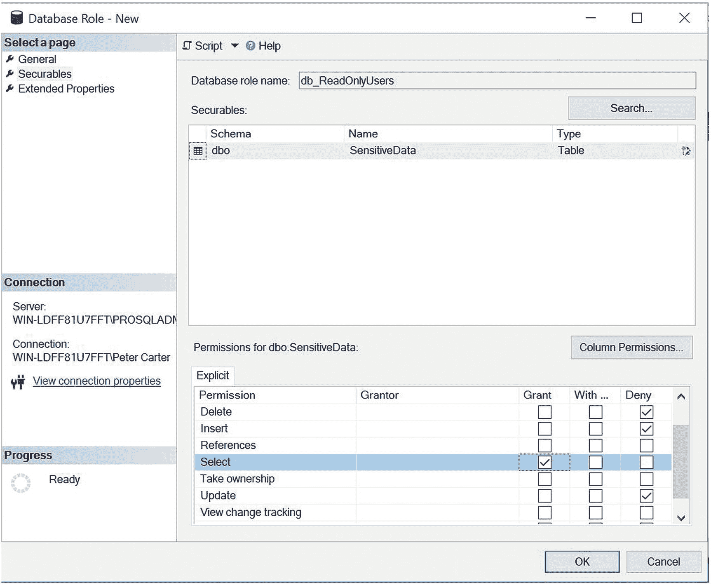

图 10-4
安全对象选项卡

因为当前我们的 `Chapter10` 数据库中只有一个表，所以此角色在功能上等同于将 Danielle 添加到内置的 `db_datareader` 和 `db_denydatawriter` 数据库角色。最大的区别在于，当我们在数据库中创建新表时，分配给我们的 `db_ReadOnlyUsers` 角色的权限将继续仅适用于 `SensitiveData` 表。这与 `db_datareader` 和 `db_denydatawriter` 角色形成对比，后者会为任何新建的表分配相同的权限集。

创建 `db_ReadOnlyUsers` 角色的另一种方法是使用清单 10-8 中的 T-SQL 脚本。你可以看到我们不得不使用多个命令来设置该角色。第一条命令创建角色并使用 `AUTHORIZATION` 子句指定所有者。第二条命令将 Danielle 添加为角色的成员，随后的命令使用 `GRANT` 和 `DENY` 关键字为该主体分配对安全对象的适当权限。

```
--Set Up the Role
CREATE ROLE db_ReadOnlyUsers AUTHORIZATION dbo ;
GO
ALTER ROLE db_ReadOnlyUsers ADD MEMBER Danielle ;
GRANT SELECT ON dbo.SensitiveData TO db_ReadOnlyUsers ;
DENY DELETE ON dbo.SensitiveData TO db_ReadOnlyUsers ;
DENY INSERT ON dbo.SensitiveData TO db_ReadOnlyUsers ;
DENY UPDATE ON dbo.SensitiveData TO db_ReadOnlyUsers ;
GO
```

清单 10-8
创建数据库角色

#### 提示

尽管 `DENY` 赋值在某些场景下可能很有帮助——例如，当你想为除一个表之外的所有表分配安全对象权限时——但在结构良好的安全层级中，请谨慎使用它们。`DENY` 赋值会增加安全管理的复杂性，并且在大多数情况下，你可以通过专门使用 `GRANT` 赋值来实施最小权限原则。


### 架构（Schemas）

架构（Schemas）为数据库对象提供了一个逻辑命名空间，同时将对象与其所有者抽象分离。数据库中的每个对象都必须归某个数据库用户所有。在非常早期的 SQL Server 版本中，这种所有权是直接的。换句话说，一个名为 Bob 的用户可能直接拥有十个独立的表。然而，从 SQL Server 2005 开始，这个模型发生了变化：现在 Bob 拥有一个架构，而这十个表则成为该架构的一部分。

这种抽象简化了更改数据库对象所有权的过程；在这个例子中，要将十个表的所有者从 Bob 更改为 Colin，你只需在一处（架构）更改所有权，而不必在全部十个表上逐一更改。

定义清晰的架构也有助于简化权限管理，因为你可以为主体分配对架构的权限，而不是对架构内各个对象的权限。例如，假设你有五个与销售相关的表——`OrderHeaders`、`OrderDetails`、`StockList`、`PriceList` 和 `Customers`——将它们全部放入一个名为 `Sales` 的架构中，就可以将 `SELECT`、`UPDATE` 和 `INSERT` 权限应用在 `Sales` 架构上，从而授予 `SalesUsers` 数据库角色。然而，将权限分配给整个架构并不仅影响表。例如，授予对架构的 `SELECT` 权限也会授予对该架构内所有视图的 `SELECT` 权限。授予对架构的 `EXECUTE` 权限则会授予对该架构内所有存储过程和函数的 `EXECUTE` 权限。

因此，设计良好的架构会按业务规则而非技术连接来分组表。请思考图 10-5 中的实体关系图。

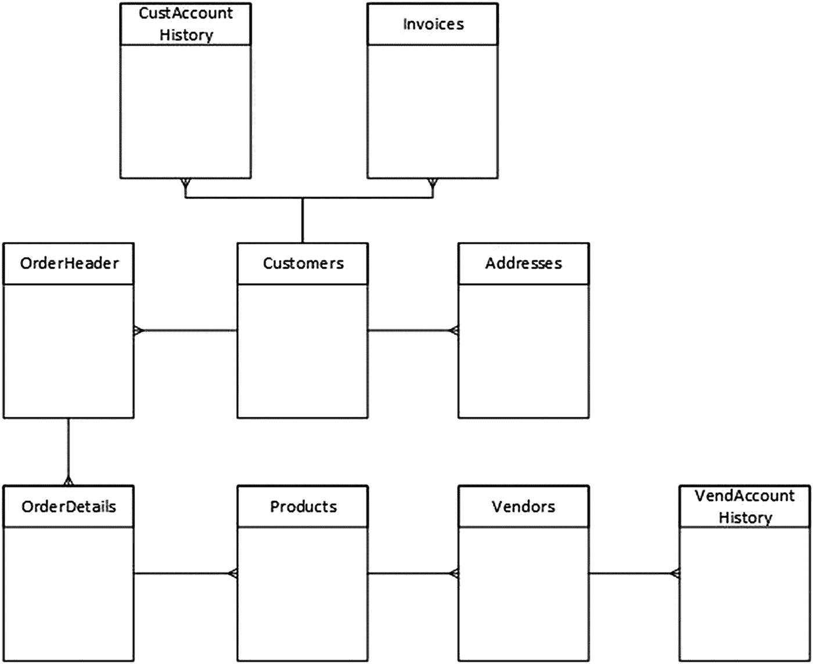

图 10-5

实体关系图

对于此示例，一个良好的架构设计会涉及三个按业务职责划分的架构：`Sales`（销售）、`Procurement`（采购）和 `Accounts`（财务）。表 10-3 演示了如何划分这些表，以及如何通过数据库角色为这些表分配权限。

表 10-3

架构权限

| 架构 | 表 | 数据库角色 | 权限 |
| --- | --- | --- | --- |
| `Sales` | `OrderHeader` `OrderDetails` `Customers` `Addresses` | `Sales` | `SELECT`, `INSERT`, `UPDATE` |
| | | `Accounts` | `SELECT` |
| `Procurement` | `Products` `Vendors` | `Purchasing` | `SELECT`, `INSERT`, `UPDATE` |
| | | `Sales` | `SELECT` |
| | | `Accounts` | `SELECT` |
| `Accounts` | `Invoices` `CustAccountHistory` `VendAccountHistory` | `Accounts` | `SELECT`, `INSERT`, `UPDATE` |

清单 10-9 中的命令创建了一个名为 `CH10` 的架构，然后授予用户 Danielle 对 `dbo` 架构的 `SELECT` 权限。这将隐式地授予她对所有在此架构内的表（包括尚未创建的新表）的 `SELECT` 权限。

```sql
CREATE SCHEMA CH10 ;
GO
GRANT SELECT ON SCHEMA::CH10 TO Danielle ;
```

清单 10-9

授予对架构的权限

若要在表创建后更改其所属架构，请使用 `ALTER SCHEMA TRANSFER` 命令，如清单 10-10 所示。此脚本在创建表时未指定架构，这意味着它会自动放入 `dbo` 架构，然后被移动到 `CH10` 架构。

```sql
CREATE TABLE TransferTest
(
ID int
) ;
GO
ALTER SCHEMA CH10 TRANSFER dbo.TransferTest ;
GO
```

清单 10-10

在架构之间传输对象

### 创建和管理包含式用户（Contained Users）

我们已经了解了如何创建一个数据库用户，该用户映射到实例级别的登录名。然而，也可以创建一个不映射到服务器主体的数据库用户。这是为了支持一种称为 `包含式数据库（contained databases）` 的技术。

`包含式数据库` 允许你通过隔离安全性等方面，减少数据库对实例的依赖。这使得数据库更容易在实例之间迁移，并有助于支持如第 14 章讨论的 AlwaysOn 可用性组等技术。

目前，SQL Server 支持 `NONE`（默认）和 `PARTIAL` 两种数据库包含级别。`PARTIAL` 表示数据库支持包含式数据库用户，并且元数据使用相同的排序规则存储在数据库内部。但是，该数据库仍可以与非包含式功能（例如，映射到实例级别登录名的用户）进行交互。目前没有 `FULL`（完全）包含的选项，因为无法阻止数据库与其边界外的对象进行交互。

要使用包含式数据库，你必须在实例和数据库两个级别启用它们。你可以通过 SQL Server Management Studio 中的“服务器属性”和“数据库属性”对话框在两个级别启用它们。或者，你可以使用 `sp_configure` 在实例级别启用，并使用 `ALTER DATABASE` 语句在数据库级别启用。清单 10-11 中的脚本演示了如何使用 T-SQL 为实例和 `Chapter10` 数据库启用包含式数据库。要使用 `ALTER DATABASE` 命令，你需要将用户从数据库中断开连接。

```sql
--在实例级别启用包含式数据库
EXEC sp_configure 'show advanced options', 1 ;
GO
RECONFIGURE ;
GO
EXEC sp_configure 'contained database authentication', '1' ;
GO
RECONFIGURE WITH OVERRIDE ;
GO
--将 Chapter10 数据库设置为使用部分包含
USE Master
GO
ALTER DATABASE [Chapter10] SET CONTAINMENT = PARTIAL WITH NO_WAIT ;
GO
```

清单 10-11

启用包含式数据库

一旦启用了包含式数据库，你就可以创建不与实例级别登录名关联的数据库用户。你可以使用清单 10-12 中演示的语法，从 Windows 用户或组创建用户。此脚本创建了一个映射到 `Chapter10Users` 域组的数据库用户，并指定 `dbo` 为默认架构。

```sql
USE Chapter10
GO
CREATE USER [PROSQLADMIN\Chapter10Users] WITH DEFAULT_SCHEMA=dbo ;
GO
```

清单 10-12

从 Windows 登录名创建数据库用户

或者，要创建一个不映射到实例级别登录名但仍然依赖第二层身份验证的数据库用户，可以使用清单 10-13 中的语法。此脚本在 `Chapter10` 数据库中创建了一个名为 `ContainedUser` 的用户。

```sql
USE Chapter10
GO
CREATE USER ContainedUser WITH PASSWORD=N'Pa$$w0rd', DEFAULT_SCHEMA=dbo ;
GO
```

清单 10-13

使用第二层身份验证创建数据库用户


### 包含式数据库用户

当使用包含式数据库用户时，你需要考虑许多额外的安全因素。首先，某些应用程序可能要求一个用户拥有多个数据库的权限。如果该用户映射到一个 Windows 用户或组，那么事情就很简单，因为被验证的 SID 就是该 Windows 对象的 SID。然而，如果数据库用户使用的是二级验证，那么就有可能复制第一个数据库中用户的 SID。例如，我们可以在 `Chapter10` 数据库中创建一个名为 `ContainedUser` 的用户，该用户将使用二级验证。然后，我们可以通过指定 SID，将此用户复制到 `Chapter10Twain` 数据库中，如代码清单 10-14 所示。在复制用户之前，该脚本首先创建了 `Chapter10Twain` 数据库并将其配置为包含式。

```sql
USE Master
GO
CREATE DATABASE Chapter10Twain ;
GO
ALTER DATABASE Chapter10Twain SET CONTAINMENT = PARTIAL WITH NO_WAIT ;
GO
USE Chapter10Twain
GO
CREATE USER ContainedUser WITH PASSWORD = 'Pa$$w0rd',
SID = 0x0105000000000009030000009134B23303A7184590E152AE6A1197DF ;
```
代码清单 10-14
创建重复用户

我们可以通过查询 `Chapter10` 数据库中的 `sys.database_principals` 目录视图来确定 SID，如代码清单 10-15 所示。

```sql
SELECT sid
FROM sys.database_principals
WHERE name = 'ContainedUser' ;
```
代码清单 10-15
查找用户的 SID

一旦我们在第二个数据库中复制了用户，我们还需要启用第一个数据库的 `TRUSTWORTHY` 属性，以便允许进行跨数据库查询。我们可以使用代码清单 10-16 中的命令在 `Chapter10` 数据库中启用 `TRUSTWORTHY`。

```sql
ALTER DATABASE Chapter10 SET TRUSTWORTHY ON ;
```
代码清单 10-16
启用 TRUSTWORTHY

即使我们没有创建重复用户，如果启用了另一个数据库的 Guest 账户，包含式用户仍然可以通过该 Guest 账户访问其他数据库。这是一个技术要求，目的是让包含式用户能够访问 TempDB。

DBA 在将包含式数据库附加到实例时也应谨慎，以确保不会无意中将权限授予本不应访问的用户。当你将数据库从预生产环境迁移到生产实例，而附加前未从数据库中移除 UAT（用户验收测试）或开发用户时，就可能发生这种情况。

### 实现对象级安全性

为数据库用户授予对象权限有两种语法变体。第一种使用 `OBJECT` 短语，而第二种不使用。例如，代码清单 10-17 中的两个命令在功能上是等效的。

```sql
USE Chapter10
GO
--使用 OBJECT 符号授权
GRANT SELECT ON OBJECT::dbo.SensitiveData TO [PROSQLADMIN\Chapter10Users] ;
GO
--不使用 OBJECT 符号授权
GRANT SELECT ON dbo.SensitiveData TO [PROSQLADMIN\Chapter10Users] ;
GO
```
代码清单 10-17
分配权限

许多权限可以被授予，但并非所有权限都与每个对象相关。例如，`SELECT` 权限可以授予表或视图，但不能授予存储过程。而 `EXECUTE` 权限可以授予存储过程，但不能授予表或视图。

在授予表权限时，可以授予特定列的权限，而不是整个表的权限。代码清单 10-18 中的脚本授予用户 `ContainedUser` 对 `Chapter10` 数据库中 `SensitiveData` 表的 `SELECT` 权限。但是，用户不能读取整个表，权限仅被授予 `SensitiveText` 列。

```sql
GRANT SELECT ON dbo.SensitiveData ([SensitiveText]) TO ContainedUser ;
```
代码清单 10-18
授予列级权限

### 服务器审计

SQL Server 审计使 DBA 能够捕获针对实例级和数据库级活动的细粒度审计信息，并将此活动保存到文件、Windows 安全日志或 Windows 应用程序日志中。保存审计数据的位置称为*目标*。SQL Server 审计对象位于实例级别，定义了审计和目标的属性。每个实例中可以有多个服务器审计。这在需要审计繁忙环境中的许多事件时很有用，因为你可以通过使用文件作为目标并将每个目标文件放在单独的卷上来分散 IO。

从安全角度来看，选择正确的目标很重要。如果你选择 Windows 应用程序日志作为目标，那么任何经过服务器认证的 Windows 用户都能访问它。安全日志比应用程序日志安全得多，但为 SQL Server 审计进行配置也可能更复杂。运行 SQL Server 服务的服务账户需要在服务器的本地安全策略中拥有“生成安全审计”用户权限分配。还需要在审计策略中为成功和失败启用应用程序生成的审计。目标的另一个考虑因素是大小。如果你决定使用应用程序日志或安全日志，那么在开始将其用于审计之前，考虑并可能增加这些日志的大小是很重要的。此外，与你的 Windows 管理团队合作，决定当日志满时如何循环覆盖，以及是否通过将其备份到磁带进行归档。

然后，SQL Server 审计可以与一个或多个服务器审计规范和数据库审计规范关联。这些规范分别定义了将在实例级和数据库级审计的活动。如果你正在审计许多操作，拥有多个服务器或数据库审计规范是有帮助的，因为你可以对它们进行分类以简化管理，同时仍将它们与同一个服务器审计关联。如果你计划在多个数据库中审计活动，实例内的每个数据库都需要自己的数据库审计规范。

### 创建服务器审计

创建服务器审计时，可以使用表 10-4 中详述的选项。

**表 10-4 服务器审计选项**

| 选项 | 描述 |
| --- | --- |
| `FILEPATH` | 仅在选择文件目标时适用。指定将生成审计日志的文件路径。 |
| `MAXSIZE` | 仅在选择文件目标时适用。指定审计文件可以增长到的最大大小。可以为此指定的最小大小为 2MB。 |
| `MAX_ROLLOVER_FILES` | 仅在选择文件目标时适用。当审计文件已满时，您可以循环该文件或生成一个新文件。`MAX_ROLLOVER_FILES` 设置控制在开始循环之前可以生成多少个新文件。默认值为 `UNLIMITED`，但指定一个数字会将文件数量限制在此上限内。如果将其设置为 0，则将始终只有一个文件，并且每次文件填满时都会循环。任何大于 0 的值表示允许的滚动文件数。例如，如果指定 5，那么总共最多将有六个文件。 |
| `MAX_FILES` | 仅在选择文件目标时适用。作为 `MAX_ROLLOVER_FILES` 的替代选项，`MAX_FILES` 设置指定了可以生成的审计文件数量的限制，但当达到此数目时，日志不会循环。相反，审计将失败，并且导致审计操作发生的事件将根据 `ON_FAILURE` 的设置进行处理。 |
| `RESERVE_DISK_SPACE` | 仅在选择文件目标时适用。预分配与 `MAXSIZE` 中设置的值相等的卷上空间，而不是允许审计日志按需增长。 |
| `QUEUE_DELAY` | 指定审计事件是同步写入还是异步写入。如果设置为 0，事件将同步写入日志。否则，指定在强制写入事件之前可以经过的持续时间（以毫秒为单位）。默认值为 1000（1 秒），这也是最小值。 |
| `ON_FAILURE` | 指定如果导致审计的事件无法审计到日志中时应该发生的情况。可接受的值为 `CONTINUE`、`SHUTDOWN` 或 `FAIL_OPERATION`。当指定 `CONTINUE` 时，允许操作继续。这可能导致发生未经审计的活动。`FAIL_OPERATION` 使可审计事件失败，但允许其他操作继续。`SHUTDOWN` 强制在实例无法将可审计事件写入日志时停止实例。 |
| `AUDIT_GUID` | 由于服务器和数据库审计规范通过 GUID 链接到服务器审计，因此有时审计规范可能会成为孤立状态。这包括将数据库附加到实例时或实施诸如数据库镜像等技术时。此选项允许您为服务器审计指定特定的 GUID，而不是让 SQL Server 生成一个新的 GUID。 |

也可以在服务器审计上创建筛选器。当您的审计规范捕获针对整个对象类的活动，但您只对审计其中的一个子集感兴趣时，这可能很有用。例如，您可能配置了一个服务器审计规范来记录对服务器角色的任何成员更改；但是，您实际上只对 `sysadmin` 服务器角色成员被修改感兴趣。在这种情况下，您可以筛选 `sysadmin` 角色。

您可以通过 SQL Server Management Studio (SSMS) 中的 GUI 创建服务器审计：在对象资源管理器中浏览到“安全性”，然后从“审计”节点中选择“新建审计”。图 10-6 展示了“创建审计”对话框。

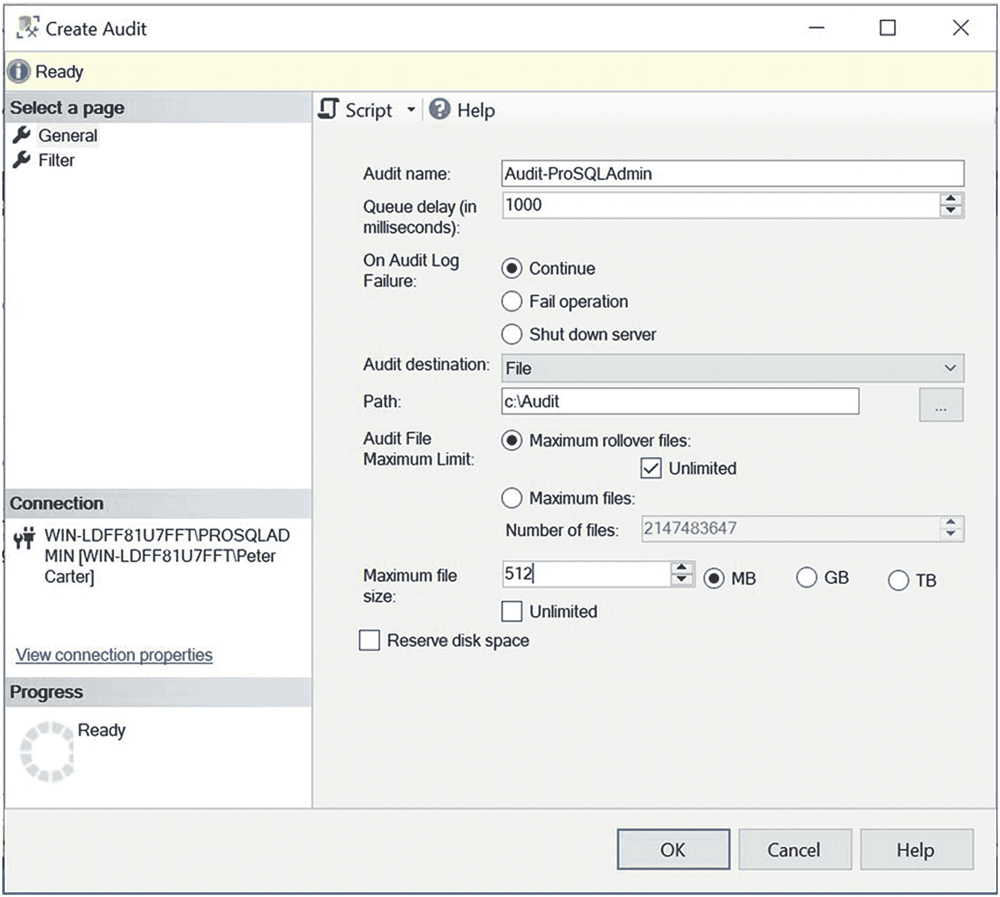

**图 10-6 “常规”选项卡**

您可以看到我们决定将审计保存到平面文件，而不是 Windows 日志。因此，我们需要指定与文件相关的参数。我们将文件设置为滚动，并将任何单个文件的最大大小强制为 512MB。我们保留审计条目在强制写入日志之前的持续时间的默认值 1 秒（1000 毫秒），并将审计命名为 `Audit-ProSQLAdmin`。

在“创建审计”对话框的“筛选器”选项卡上，您应指定希望基于 `object_name` 进行筛选，并且仅审计对 `sysadmin` 角色的更改。

或者，我们可以使用 T-SQL 执行相同的操作。代码清单 10-19 中的脚本创建了相同的服务器审计。

```sql
USE Master
GO
CREATE SERVER AUDIT [Audit-ProSQLAdmin]
TO FILE
(        FILEPATH = N'c:\audit'
,MAXSIZE = 512 MB
,MAX_ROLLOVER_FILES = 2147483647
,RESERVE_DISK_SPACE = OFF
)
WITH
(        QUEUE_DELAY = 1000
,ON_FAILURE = CONTINUE
)
WHERE object_name = 'sysadmin' ;
```
**代码清单 10-19 创建服务器审计**

### 创建服务器审计规范

要通过 SSMS 创建服务器审计规范，我们可以在对象资源管理器中浏览到“安全性”，然后从“服务器审计规范”上下文菜单中选择“新建服务器审计规范”。这将显示“创建服务器审计规范”对话框，如图 10-7 所示。

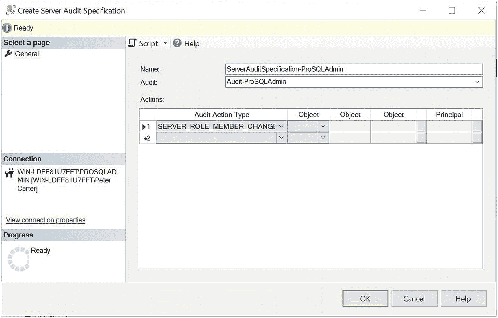

**图 10-7 服务器审计规范对话框**

您可以看到我们选择了 `SERVER_ROLE_MEMBER_CHANGE_GROUP` 作为审计操作类型。这将审计服务器角色成员资格的任何添加或删除。但是，结合我们在服务器审计对象上设置的筛选器，新结果是将只记录对 `sysadmin` 服务器角色的更改。我们还从“审计”下拉框中选择了 `Audit-ProSQLAdmin` 审计，以将对象关联起来。

或者，我们可以通过运行代码清单 10-20 中的命令使用 T-SQL 创建相同的服务器审计规范。在此命令中，我们使用 `FOR SERVER AUDIT` 子句将服务器审计规范链接到 `Audit-ProSQLAdmin` 服务器审计，并使用 `ADD` 子句指定要捕获的审计操作类型。

```sql
CREATE SERVER AUDIT SPECIFICATION [ServerAuditSpecification-ProSQLAdmin]
FOR SERVER AUDIT [Audit-ProSQLAdmin]
ADD (SERVER_ROLE_MEMBER_CHANGE_GROUP) ;
```
**代码清单 10-20 创建服务器审计规范**


#### 启用和调用审计

尽管我们已经创建了服务器审计和服务器审计规范，但在开始收集任何数据之前，我们需要先启用它们。我们可以通过在对象资源管理器中右键单击每个对象并从上下文菜单中选择 `启用`，或者通过修改对象并在 T-SQL 中将其 `STATE` 设置为 `ON` 来实现这一点。如代码清单 10-21 所示。

```
ALTER SERVER AUDIT [Audit-ProSQLAdmin] WITH (STATE = ON) ;
ALTER SERVER AUDIT SPECIFICATION [ServerAuditSpecification-ProSQLAdmin]
WITH (STATE = ON) ;
代码清单 10-21
启用审计
```

现在，我们使用代码清单 10-22 中的脚本将 Danielle 登录名添加到 `sysadmin` 服务器角色中，以便检查我们的审计是否正在工作。

```
ALTER SERVER ROLE sysadmin ADD MEMBER Danielle ;
代码清单 10-22
触发审计
```

我们期望服务器审计规范的定义能捕获这两个操作，但 `WHERE` 子句已将应用于服务器审计的第一个操作过滤掉了。如果我们在对象资源管理器中右键单击 `Audit-ProSQLAdmin` 服务器审计并选择 `查看审计日志`，如图 10-8 所示，我们可以看到它按预期工作，并可以查看已捕获的审计条目。

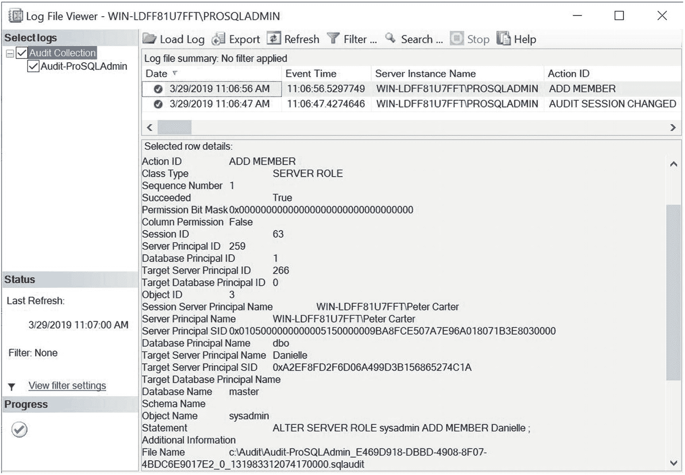

图 10-8
审计日志文件查看器

我们可以看到已捕获了细粒度的信息。最值得注意的是，这些信息包括触发审计的完整语句、涉及的数据库和对象、目标登录名以及运行该语句的登录名。

#### 数据库审计规范

数据库审计规范类似于服务器审计规范，但它指定的是数据库级别而非实例级别的审计要求。为了演示此功能，我们将 Danielle 登录映射到此数据库中的一个用户，并授予其对 `SensitiveData` 表的 `SELECT` 权限。我们还创建了一个名为 `Audit-Chapter10` 的新服务器审计，我们的数据库审计规范将附加到该审计。这些操作在代码清单 10-23 中执行。在执行脚本前，请根据你自己的配置修改文件路径。

```
USE Master
GO
--创建 Chapter10Audit 数据库
CREATE DATABASE Chapter10Audit
GO
USE Chapter10Audit
GO
CREATE TABLE dbo.SensitiveData (
ID    INT    PRIMARY KEY    NOT NULL,
Data    NVARCHAR(256) NOT NULL
) ;
--创建服务器审计
USE master
GO
CREATE SERVER AUDIT [Audit-Chapter10Audit]
TO FILE
(        FILEPATH = N'C:\Audit'
,MAXSIZE = 512 MB
,MAX_ROLLOVER_FILES = 2147483647
,RESERVE_DISK_SPACE = OFF
)
WITH
(        QUEUE_DELAY = 1000
,ON_FAILURE = CONTINUE
) ;
USE Chapter10Audit
GO
--根据 Danielle 登录创建数据库用户
CREATE USER Danielle FOR LOGIN Danielle WITH DEFAULT_SCHEMA=dbo ;
GO
GRANT SELECT ON dbo.SensitiveData TO Danielle ;
代码清单 10-23
创建 Chapter10Audit 数据库
```

我们现在希望创建一个数据库审计规范，用于捕获任何用户对 `SensitiveData` 表进行的任何 `INSERT` 语句，同时也专门捕获 Danielle 运行的 `SELECT` 语句。

我们可以通过在 SQL Server Management Studio 中导航到 `Chapter10Audit` 数据库 ➤ `安全性`，然后右键单击 `数据库审计规范` 并选择 `新建数据库审计规范` 来创建数据库审计规范。这将调用 `新建数据库审计规范` 对话框，如图 10-9 所示。

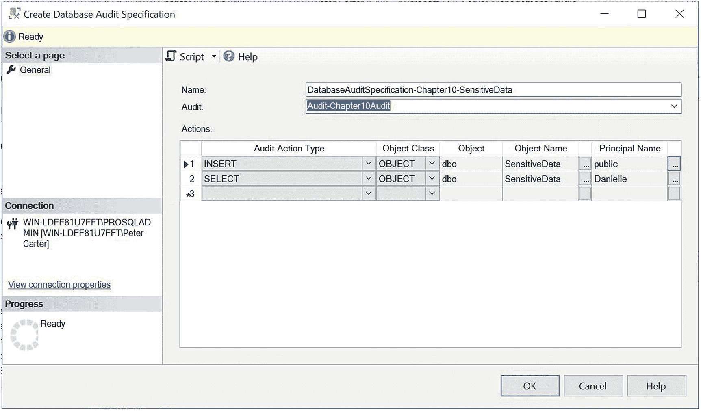

图 10-9
数据库审计规范对话框

你可以看到，我们将数据库审计规范命名为 `DatabaseAuditSpecification-Chapter10-SensitiveData`，并使用下拉列表将其链接到 `Audit-Chapter10` 服务器审计。在屏幕的下半部分，我们指定了两种审计操作类型：`INSERT` 和 `SELECT`。因为我们指定的对象类是 `OBJECT`，而不是其他可用选项 `DATABASE` 或 `SCHEMA`，所以我们还需要指定要审计的表的对象名称。因为我们只想审计 Danielle 的 `SELECT` 活动，所以我们为 `SELECT` 操作类型的主体字段添加此用户，但我们为 `INSERT` 操作类型的主体添加了 `Public` 角色。这是因为所有数据库用户都将是 `Public` 角色的成员，因此，无论用户是谁，所有 `INSERT` 活动都将被捕获。

#### 提示

你可以通过运行查询 `SELECT * FROM sys.dm_audit_class_type_map` 来显示完整的审计类类型列表。你可以通过运行查询 `SELECT * FROM sys.dm_audit_actions` 来找到可审计操作的完整列表。

我们可以使用 `CREATE DATABASE AUDIT SPECIFICATION` 语句在 T-SQL 中创建相同的数据库审计规范，如代码清单 10-24 所示。

```
USE Chapter10Audit
GO
CREATE DATABASE AUDIT SPECIFICATION [DatabaseAuditSpecification-Chapter10-SensitiveData]
FOR SERVER AUDIT [Audit-Chapter10]
ADD (INSERT ON OBJECT::dbo.SensitiveData BY public),
ADD (SELECT ON OBJECT::dbo.SensitiveData BY Danielle) ;
代码清单 10-24
创建数据库审计规范
```

就像处理服务器审计规范一样，我们需要在开始收集任何信息之前启用数据库审计规范。代码清单 10-25 中的脚本启用了 `Audit-Chapter10` 和 `DatabaseAuditSpecification-Chapter10-SensitiveData`。

```
USE Chapter10Audit
GO
ALTER DATABASE AUDIT SPECIFICATION [DatabaseAuditSpecification-Chapter10-SensitiveData]
WITH (STATE = ON) ;
GO
USE Master
GO
ALTER SERVER AUDIT [Audit-Chapter10] WITH (STATE = ON) ;
代码清单 10-25
启用数据库审计规范
```

为了测试安全性，SQL Server 允许你模拟用户。为此，你必须是系统管理员，或者已被授予对该用户的 `模拟` 权限。代码清单 10-26 中的脚本模拟用户 Danielle 以检查审计是否成功。它通过使用 `EXECUTE AS USER` 命令来实现这一点。`REVERT` 命令将安全上下文切换回运行脚本的用户。

```
USE Chapter10Audit
GO
GRANT INSERT, UPDATE ON dbo.sensitiveData TO Danielle ;
GO
INSERT INTO dbo.SensitiveData (SensitiveText)
VALUES ('testing') ;
GO
UPDATE dbo.SensitiveData
SET SensitiveText = 'Boo'
WHERE ID = 2 ;
GO
EXECUTE AS USER ='Danielle'
GO
INSERT dbo.SensitiveData (SensitiveText)
VALUES ('testing again') ;
GO
UPDATE dbo.SensitiveData
SET SensitiveText = 'Boo'
WHERE ID = 1 ;
GO
REVERT
代码清单 10-26
使用模拟测试安全性


#### 审核审计行为

截至目前我们所实施的审计机制存在一个安全漏洞。若拥有服务器审计管理权限的管理员怀有恶意，他们可在执行恶意操作前更改审计规范，并在事后将审计配置恢复原状以消除痕迹，从而逃避追责。

不过，服务器审计功能允许您对审计行为本身进行审核，以此抵御此类威胁。若在服务器审计规范或数据库审计规范中添加 `AUDIT_CHANGE_GROUP`，则任何对规范的修改都将被记录。

以 `Audit-Chapter10` 服务器审计和 `DatabaseAuditSpecification-Chapter10` 数据库审计规范为例，我们正在审核任何用户对 `SensitiveData` 表执行的所有 `INSERT` 语句。为防止特权用户恶意向该表插入数据且不留痕迹，可使用清单 10-27 中的脚本添加 `AUDIT_CHANGE_GROUP`。注意：在进行更改前必须先禁用数据库审计规范，修改完成后再重新启用。

```sql
USE Chapter10Audit
GO
ALTER DATABASE AUDIT SPECIFICATION [DatabaseAuditSpecification-Chapter10-SensitiveData]
WITH (STATE=OFF) ;
GO
ALTER DATABASE AUDIT SPECIFICATION [DatabaseAuditSpecification-Chapter10-SensitiveData]
ADD (AUDIT_CHANGE_GROUP) ;
GO
ALTER DATABASE AUDIT SPECIFICATION [DatabaseAuditSpecification-Chapter10-SensitiveData]
WITH(STATE = ON) ;
GO
清单 10-27
添加 AUDIT_CHANGE_GROUP
```

执行此命令后，我们对审计配置所做的任何修改都将被记录。若查看审计日志，可看到 `Administrator` 登录账户对 `SensitiveData` 表移除 `INSERT` 审核的操作已被捕获。

### 安全报告

在实施安全措施时，数据库管理员还应考虑法规遵从性，例如 GDPR 和 SOX。许多法规要求企业证明其清楚自身持有的敏感数据及访问权限情况。

SQL Server 通过两项名为“SQL 数据发现与分类”和“漏洞评估”的功能为此过程提供支持。后续章节将分别讨论这两项功能。

#### 提示

后续章节的演示将使用 `WideWorldImporters` 示例数据库。可从 [`https://github.com/Microsoft/sql-server-samples/releases/tag/wide-world-importers-v1.0`](https://github.com/Microsoft/sql-server-samples/releases/tag/wide-world-importers-v1.0) 获取该数据库。

#### SQL 数据发现与分类

SQL 数据发现与分类功能内置于 SQL Server Management Studio 中，它会首先分析数据库中的列，根据列名尝试识别可能包含敏感信息的列。在您审核并修正这些分类后，可为列添加标签，标明其包含的敏感信息类型。这些信息可通过报告查看，也可导出用于与审计人员沟通。

要使用此功能，请在目标数据库的右键菜单中选择 `任务` ➤ `数据发现和分类` ➤ `分类数据`。此时将显示 `数据分类` 对话框。您可点击 `添加分类` 展开侧边栏，或点击窗口底部的 `建议` 栏查看基于列名生成的分类建议，如图 10-10 所示。

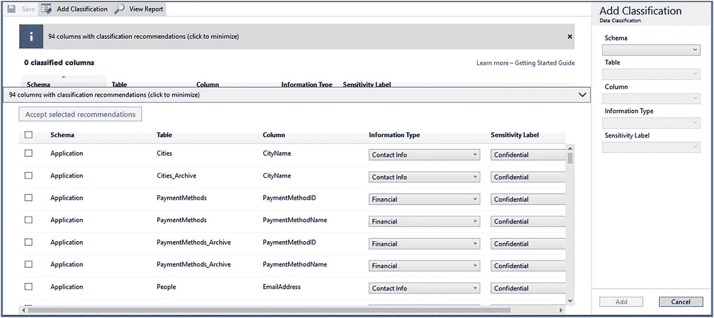
*图 10-10：查看分类建议*

在此界面中，您可通过复选框选择要接受的建议，或使用下拉菜单修改建议（更改信息类型和敏感度标签）。保持复选框空白可忽略某些建议，也可使用 `添加分类` 侧边栏手动添加分类可能遗漏的列。确认选择后，点击 `接受所选建议` 按钮，再点击 `保存` 按钮，即可为列添加扩展属性。

点击 `查看报告` 按钮将生成详细报告，可导出为 Word、Excel 或 PDF 格式，便于提交给审计人员。报告输出示例如图 10-11 所示。

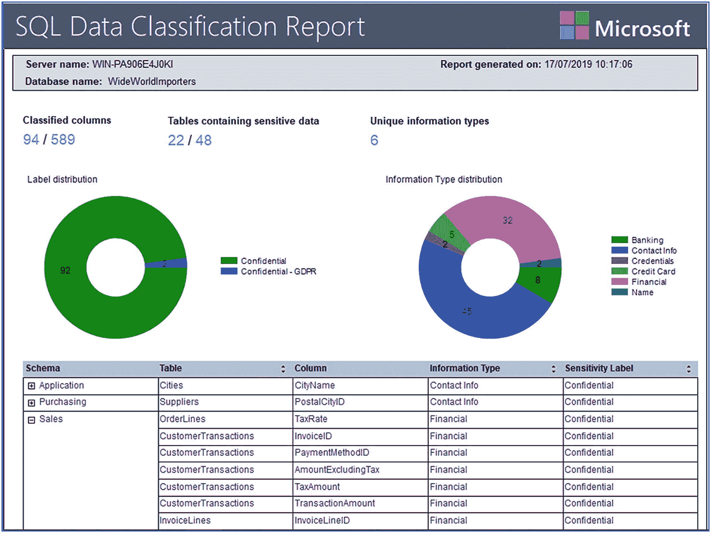
*图 10-11：SQL 数据分类报告*

#### 漏洞评估

漏洞评估是 SQL Server Management Studio 内置的实用工具，可扫描并报告数据库中的潜在安全问题。这免去了数据库管理员在部署后手动检查所有项目或编写定期运行脚本的麻烦。在目标数据库的右键菜单中选择 `任务` ➤ `漏洞评估` ➤ `扫描漏洞` 即可使用该功能。此时将显示 `扫描漏洞` 对话框，您可在此选择报告保存路径。

退出此对话框后将生成报告，如图 10-12 所示。报告包含两个选项卡：第一个选项卡详细列出未通过的检查项，第二个选项卡详细列出已执行并通过的检查项。问题将按风险等级（`低`、`中` 或 `高`）分类显示。

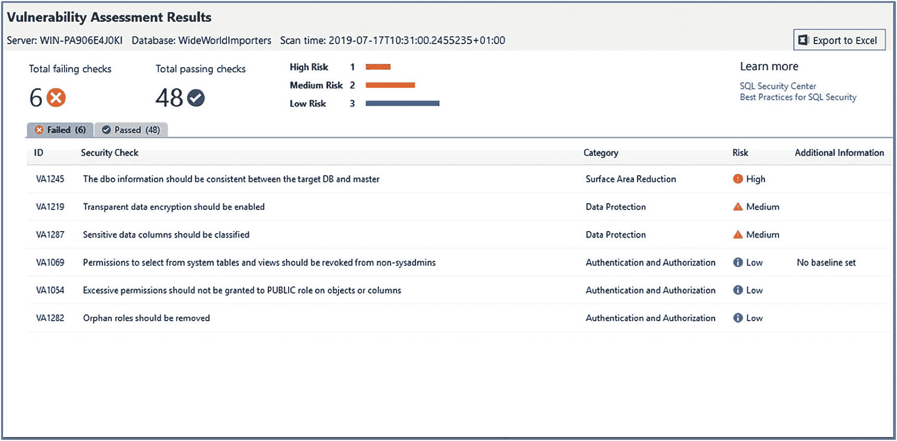
*图 10-12：漏洞评估结果*

选择某个结果后，报告中将显示附加面板，提供问题的详细视图，如图 10-13 所示。此处将提供问题描述、修复方法详情以及用于确定检查结果的查询脚本副本。

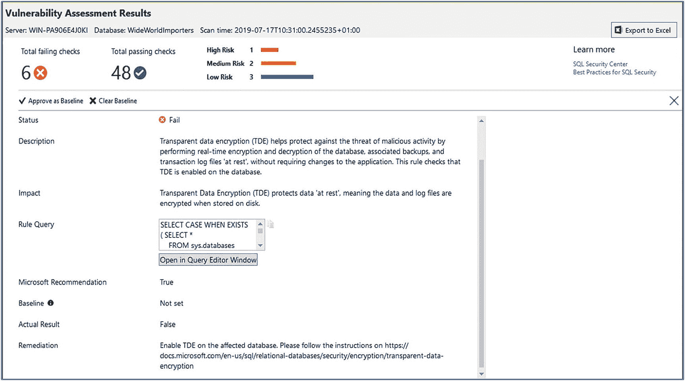
*图 10-13：详细视图*

若某项未通过检查的结果在特定数据库中属于预期情况（例如该数据库无需实施透明数据加密），则可对该问题点击 `批准为基线` 按钮。这意味着下次扫描时该结果将不再显示为失败。通过点击 `清除基线` 按钮，可将基线重置为默认设置。


# 11. 加密

### 概要

SQL Server 提供了一个复杂的安全框架来管理权限，该框架包含多个相互重叠的层级。在实例级别，您可以基于 Windows 用户或组创建登录名，也可以创建二级登录名，其密码存储在数据库引擎内部。二级身份验证要求在实例级别启用混合模式身份验证。

服务器角色允许将登录名分组，以便可以为它们分配共同的权限。这减轻了安全管理的管理开销。SQL Server 为常见场景提供了内置的服务器角色，您也可以创建满足数据层应用程序需求的自定义服务器角色。

在数据库级别，登录名可以映射到数据库用户。如果您使用的是包含数据库，那么还可以创建直接映射到 Windows 安全主体或具有自己二级身份验证凭据的数据库用户。这可以通过消除对实例级别登录名的依赖，帮助将数据库与实例隔离。这有助于提高数据库的可移植性，但需要额外考虑安全问题。

细粒度权限可能变得难以管理，尤其是在需要在列级别保护数据时。SQL Server 提供了所有权链，可以降低这种复杂性。通过所有权链，可以针对视图分配权限，而不是针对底层表。甚至可以跨多个数据库使用所有权链，当然，这本身也会带来复杂性。为了使所有权链成功，链中的所有对象必须共享同一个所有者。否则所有权链将被中断，并且需要对底层对象的权限进行评估。

服务器审核允许在实例和数据库级别对活动进行细粒度审计。它还包括审计审计本身的能力，从而消除了特权用户恶意绕过审计的威胁。您可以将审核保存到操作系统中的文件，并通过 NTFS 控制权限。或者，您可以将审核保存到 Windows 安全日志或 Windows 应用程序日志中。

加密是一种使用算法（该算法使用密钥和证书）来混淆数据的过程，因此如果安全性被绕过，数据被未授权用户访问或窃取，那么这些数据将变得无用，除非同时也获得了用于加密它的密钥。这在访问控制之上增加了一个额外的安全层，但它并不能取代访问控制实施的需要。加密数据也有可能显著降低性能，因此您应该基于需要来使用它，而不是作为常规操作在所有数据上实施。

在本章中，我们将讨论 SQL Server 加密层次结构，然后演示如何实现透明数据加密（TDE）以及单元级加密。我们还将讨论 Always Encrypted 和安全飞地。

### 加密层次结构

SQL Server 提供了通过密钥和证书的层次结构对数据进行加密的能力。层次结构中的每一层都对它下面的一层进行加密。

#### 加密概念

在我们详细讨论层次结构之前，了解与加密相关的概念很重要。以下各节概述了加密中涉及的主要组件。

##### 对称密钥

`对称密钥`是一种可用于加密数据的算法。它是最弱的一种加密形式，因为它使用相同的算法来加密和解密数据。它也是性能开销最小的加密方法。您可以使用密码或另一个密钥或证书来加密对称密钥。

##### 非对称密钥

与使用相同算法加密和解密数据的对称密钥相比，`非对称密钥`使用一对密钥或算法。您可以使用一个仅用于加密，另一个仅用于解密。用于加密数据的密钥称为`私钥`，用于解密数据的密钥称为`公钥`。

##### 证书

证书由称为`证书颁发机构 (CA)`的可信来源颁发。它使用非对称密钥，并提供数字签名声明，将公钥绑定到持有相应私钥的主体或设备。

##### Windows 数据保护 API

`Windows 数据保护 API (DPAPI)` 是随 Windows 操作系统一起提供的加密应用程序编程接口 (API)。它允许使用用户或域机密信息对密钥进行加密。`DPAPI` 用于加密 `服务主密钥`，该密钥是 SQL Server 加密层次结构的顶层。

#### SQL Server 加密概念

SQL Server 的加密功能依赖于密钥和证书的层次结构，根级别是 `服务主密钥`。以下各节描述了主密钥的用途以及 SQL Server 的加密层次结构。

##### 主密钥

SQL Server 加密层次结构的根级别是 `服务主密钥`。`服务主密钥`在实例构建时自动创建，并用于使用 `DPAPI` 加密数据库主密钥、凭据和链接服务器的密码。`服务主密钥`存储在 Master 数据库中，每个实例始终只有一个。在 SQL Server 2012 及更高版本中，`服务主密钥`是使用 `AES 256` 算法生成的对称密钥。这与使用 `Triple DES` 算法的旧版 SQL Server 形成对比。

由于 SQL Server 2012 及更高版本使用了新的加密算法，当您从 SQL Server 2008 R2 或更早版本升级实例时，建议重新生成密钥。

然而，重新生成 `服务主密钥`的问题在于，它涉及解密然后重新加密层次结构中位于其下方的每个密钥和证书。这是一个非常耗费资源的过程，应仅在维护窗口期间尝试。

您可以使用清单 11-1 中的命令重新生成 `服务主密钥`。但您应该注意，如果该过程未能解密和重新加密其层次结构下方的任何密钥，则整个重新生成过程将失败。您可以使用 `FORCE` 关键字更改此行为。`FORCE` 关键字强制该过程在错误后继续。请注意，这将导致任何无法解密和重新加密的数据变得不可用。您将无法重新获得对这些数据的访问权限。

```sql
ALTER SERVICE MASTER KEY REGENERATE
```

*清单 11-1*
*重新生成服务主密钥*

由于 `服务主密钥`至关重要，因此必须在创建或重新生成后备份它，并将其存储在安全、异地的位置，以便用于灾难恢复。如果您将实例迁移到其他服务器以避免加密层次结构出现问题，也可以还原此密钥的备份。清单 11-2 中的脚本演示了如何备份和还原 `服务主密钥`。如果您还原的主密钥相同，则 SQL Server 会通知您，并且无需重新加密数据。

```sql
BACKUP SERVICE MASTER KEY
TO FILE = 'c:\keys\service_master_key'
ENCRYPTION BY PASSWORD = 'Pa$$w0rd'

RESTORE SERVICE MASTER KEY
FROM FILE = 'c:\keys\service_master_key'
DECRYPTION BY PASSWORD = 'Pa$$w0rd'
```

*清单 11-2*
*备份和还原服务主密钥*


#### 提示

`service_master_key` 是密钥文件的名称，而非文件夹。按照惯例，它没有文件扩展名。

与重新生成服务主密钥时一样，在还原它时也可以使用 `FORCE` 关键字，但这会产生相同的后果。

数据库主密钥是一个对称密钥，使用 AES 256 算法加密，用于加密存储在数据库内的私钥和证书。它使用一个密码进行加密，但会创建一份副本，该副本使用服务主密钥进行加密。这使得数据库主密钥在需要时可以自动打开。如果此副本不存在，则需要手动打开它。这意味着必须显式地打开密钥，才能使用它加密的密钥。数据库主密钥的副本存储在数据库内，另一份副本存储在 `Master` 数据库内。可以使用清单 11-3 中的命令创建数据库主密钥。

```
CREATE DATABASE Chapter11MasterKeyExample ;
GO
USE Chapter11MasterKeyExample
GO
CREATE MASTER KEY ENCRYPTION BY PASSWORD = 'Pa$$w0rd'
清单 11-3
创建数据库主密钥
```

与服务主密钥一样，数据库主密钥应该备份并存储在安全的异地位置。可以使用清单 11-4 中的命令备份和还原数据库主密钥。

```
BACKUP MASTER KEY TO FILE = 'c:\keys\Chapter11_master_key'
ENCRYPTION BY PASSWORD = 'Pa$$w0rd';
RESTORE MASTER KEY
FROM FILE = 'c:\keys\Chapter11_master_key'
DECRYPTION BY PASSWORD = 'Pa$$w0rd' --备份文件中的密码
ENCRYPTION BY PASSWORD = 'Pa$$w0rd'; --数据库中将用于加密的密码
清单 11-4
备份和还原数据库主密钥
```

与服务主密钥一样，如果还原过程无法解密和重新加密层次结构中位于其下方的任何密钥，则还原会失败。可以使用 `FORCE` 关键字强制还原成功，但这样做会永久失去对使用那些无法解密和重新加密的密钥加密的数据的访问权限。

##### 层次结构

SQL Server 加密层次结构如图 11-1 所示。

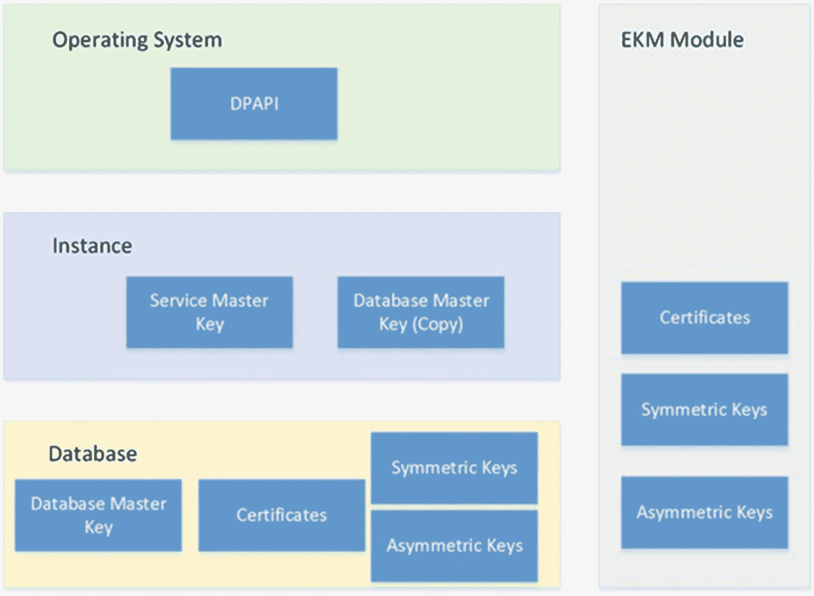

图 11-1
加密层次结构

该图显示服务主密钥和一份数据库主密钥副本存储在实例级别，而数据库主密钥也存储在数据库内。使用数据库主密钥加密的证书、对称密钥和非对称密钥也存储在数据库内。

在图的右侧，您可以看到一个名为 `EKM Module` 的部分。可扩展密钥管理（EKM）模块允许您在第三方硬件安全模块中生成和管理用于保护 SQL Server 数据的密钥和证书，这些模块使用 Microsoft 加密 API（MSCAPI）与 SQL Server 接口。这更安全，因为密钥不与数据一起存储，但这也意味着您可以受益于第三方供应商可能提供的高级功能，例如密钥轮换和安全密钥处置。

在使用第三方 EKM 模块之前，需要使用 `sp_configure` 在实例级别启用 EKM，并且必须通过将 `.dll` 文件导入 SQL Server 来注册 EKM。有许多 EKM 提供程序可用，但清单 11-5 中的示例脚本演示了在安装数据库安全包后如何导入 Thales EKM 模块。

```
--启用 EKM
sp_configure 'show advanced', 1
GO
RECONFIGURE
GO
sp_configure 'EKM provider enabled', 1
GO
RECONFIGURE
GO
--注册提供程序
CREATE CRYPTOGRAPHIC PROVIDER nCipher_Provider FROM FILE =
'C:\Program Files\nCipher\nfast\bin\ncsqlekm64.dll'
清单 11-5
启用 EKM 并导入 EKM 模块
```

#### 注意

关于 EKM 的全面讨论超出了本书的范围，但您可以从您的加密提供程序处获取更多信息。

### 透明数据加密

在为敏感数据实施安全策略时，需要考虑的一个重要方面是数据被盗的风险。想象这样一种情况：一个怀有恶意的特权用户使用分离/附加操作将数据库移动到新实例，以获取他们无权查看的数据。或者，如果恶意用户获得了数据库备份的访问权限，他们可以将备份还原到新服务器以获取数据。

透明数据加密（TDE）通过加密数据库的数据页和日志文件，并将密钥（称为数据库加密密钥）存储在数据库的引导记录中来防范这些场景。一旦在数据库上启用 TDE，页在写入磁盘之前会被加密，而在读入内存时会被解密。

TDE 相对于本章稍后将讨论的单元级加密还提供了几个优点。首先，它不会导致膨胀。使用 TDE 加密的数据库与其加密前的大小相同。此外，尽管存在性能开销，但这比单元级加密相关的性能开销显著降低。另一个显著优点是加密对应用程序是透明的，这意味着开发人员无需修改代码即可访问数据。

在规划 TDE 的实施时，请注意它与其他技术的交互方式。例如，您可以加密使用内存中 OLTP 的数据库，但内存中文件组内的数据不会被加密，因为数据驻留在内存中，而 TDE 仅加密静态数据，即当数据位于磁盘上时。尽管内存优化数据未加密，但与内存中事务相关的日志记录会被加密。

也可以加密使用 FILESTREAM 的数据库，但同样，`FILESTREAM` 文件组内的数据不会被加密。如果使用全文索引，则新的全文索引将被加密。现有的全文索引仅在升级期间导入后才会被加密。然而，将全文索引与 TDE 一起使用被认为是不良做法。这是因为在全文索引扫描操作期间，数据以明文形式写入磁盘，这为攻击者访问敏感数据留下了机会窗口。

高可用性和灾难恢复技术，如数据库镜像、AlwaysOn 可用性组和日志传送，都支持启用了 TDE 的数据库。副本数据库上的数据也被加密，日志中的数据也被加密，这意味着它在服务器之间发送时无法被拦截。复制也支持 TDE，但订阅服务器中的数据不会自动加密。您必须在订阅服务器和分发服务器上手动启用 TDE。


#### 注意

即使您在订阅者服务器上启用了`TDE`，数据在中间文件中仍以明文形式存储。这无疑比使用`FTE`（全文索引）带来更大的风险，因此您应仔细考虑风险/收益情况。

同样重要的是要注意，在实例中为任何数据库启用`TDE`都会导致在`TempDB`上启用`TDE`。这是因为`TempDB`用于在排序操作、假脱机操作等过程中存储中间结果集的用户数据。当您使用临时表或发生行版本控制操作时，`TempDB`也会存储用户数据。这可能会产生不良影响，即降低未启用`TDE`的其他用户数据库的性能。

从数据库维护性能的角度来看，同样重要的是要注意，`TDE`与即时文件初始化不兼容。即时文件初始化可加快创建或扩展文件的操作速度，因为文件无需被清零。如果您的实例配置为使用即时文件初始化，那么它将不再适用于与您加密的任何数据库关联的文件。当`TDE`启用时，文件必须被清零，这是一个严格的技术要求。

#### 实现透明数据加密

要实现透明数据加密，您必须首先创建一个数据库主密钥。此密钥就位后，您可以创建证书。您必须使用数据库主密钥来加密该证书。如果您尝试仅使用密码加密证书，那么在您尝试使用它来加密数据库加密密钥时，它将被拒绝。数据库加密密钥是您接下来需要创建的对象，并且如前所述，您使用证书对其进行加密。最后，您可以更改数据库以打开加密。

#### 注意

您可以使用非对称密钥（而不是服务器证书）来加密数据库加密密钥，但前提是该非对称密钥受到`EKM`模块的保护。

当您为数据库启用`TDE`时，一个后台进程会遍历每个数据文件中的每个页面并对其进行加密。这不会阻止数据库被访问，但会获取锁，从而阻止维护操作进行。在加密扫描进行期间，无法执行以下操作：

-   删除文件
-   删除文件组
-   删除数据库
-   分离数据库
-   使数据库脱机
-   将数据库设置为`read_only`

幸运的是，`SQL Server 2019`的一项新功能使数据库管理员能够通过`ALTER DATABASE`语句指定`SET ENCRYPTION SUSPEND`或`SET ENCRYPTION RESTART`选项，来暂停和重启加密扫描，从而更好地控制此过程。

同样重要的是要注意，如果数据库中的任何文件组被标记为`read_only`，则启用`TDE`的操作将失败。这是因为启用`TDE`时需要加密所有文件中的所有页面，这涉及到更改页面内的数据以混淆它们。

清单 11-6 中的脚本创建了一个名为`Chapter11Encrypted`的数据库，然后创建了一个填充了数据的表。最后，它创建了一个数据库主密钥和一个服务器证书。

```sql
--创建数据库
CREATE DATABASE Chapter11Encrypted ;
GO
USE Chapter11Encrypted
GO
--创建表
CREATE TABLE dbo.SensitiveData
(
ID                INT                PRIMARY KEY        IDENTITY,
FirstName        NVARCHAR(30),
LastName        NVARCHAR(30),
CreditCardNumber        VARBINARY(8000)
) ;
GO
--填充表数据
DECLARE @Numbers TABLE
(
Number        INT
)
;WITH CTE(Number)
AS
(
SELECT 1 Number
UNION ALL
SELECT Number + 1
FROM CTE
WHERE Number < 100
)
INSERT INTO @Numbers
SELECT Number FROM CTE ;
DECLARE @Names TABLE
(
FirstName        VARCHAR(30),
LastName        VARCHAR(30)
) ;
INSERT INTO @Names
VALUES('Peter', 'Carter'),
('Michael', 'Smith'),
('Danielle', 'Mead'),
('Reuben', 'Roberts'),
('Iris', 'Jones'),
('Sylvia', 'Davies'),
('Finola', 'Wright'),
('Edward', 'James'),
('Marie', 'Andrews'),
('Jennifer', 'Abraham'),
('Margaret', 'Jones') ;
INSERT INTO dbo.SensitiveData(Firstname, LastName, CreditCardNumber)
SELECT  FirstName, LastName, CreditCardNumber FROM
(SELECT
(SELECT TOP 1 FirstName FROM @Names ORDER BY NEWID()) FirstName
,(SELECT TOP 1 LastName FROM @Names ORDER BY NEWID()) LastName
,(SELECT CONVERT(VARBINARY(8000)
,(SELECT TOP 1 CAST(Number * 100 AS CHAR(4))
FROM @Numbers
WHERE Number BETWEEN 10 AND 99 ORDER BY NEWID()) + '-' +
(SELECT TOP 1 CAST(Number * 100 AS CHAR(4))
FROM @Numbers
WHERE Number BETWEEN 10 AND 99 ORDER BY NEWID()) + '-' +
(SELECT TOP 1 CAST(Number * 100 AS CHAR(4))
FROM @Numbers
WHERE Number BETWEEN 10 AND 99 ORDER BY NEWID()) + '-' +
(SELECT TOP 1 CAST(Number ∗ 100 AS CHAR(4))
FROM @Numbers
WHERE Number BETWEEN 10 AND 99 ORDER BY NEWID()))) CreditCardNumber
FROM @Numbers a
CROSS JOIN @Numbers b
CROSS JOIN @Numbers c
) d ;
USE Master
GO
--创建数据库主密钥
CREATE MASTER KEY ENCRYPTION BY PASSWORD = 'Pa$$w0rd';
GO
--创建服务器证书
CREATE CERTIFICATE TDECert WITH SUBJECT = 'Certificate For TDE';
GO
-- 清单 11-6
-- 创建 Chapter11Encrypted 数据库
```

现在我们已经创建了数据库以及数据库主密钥和证书，我们现在可以加密我们的数据库。要通过`SQL Server Management Studio`执行此操作，我们可以在数据库的上下文菜单中，从“任务”下选择“管理数据库加密”。这将调用“管理数据库加密”向导，如图 11-2 所示。

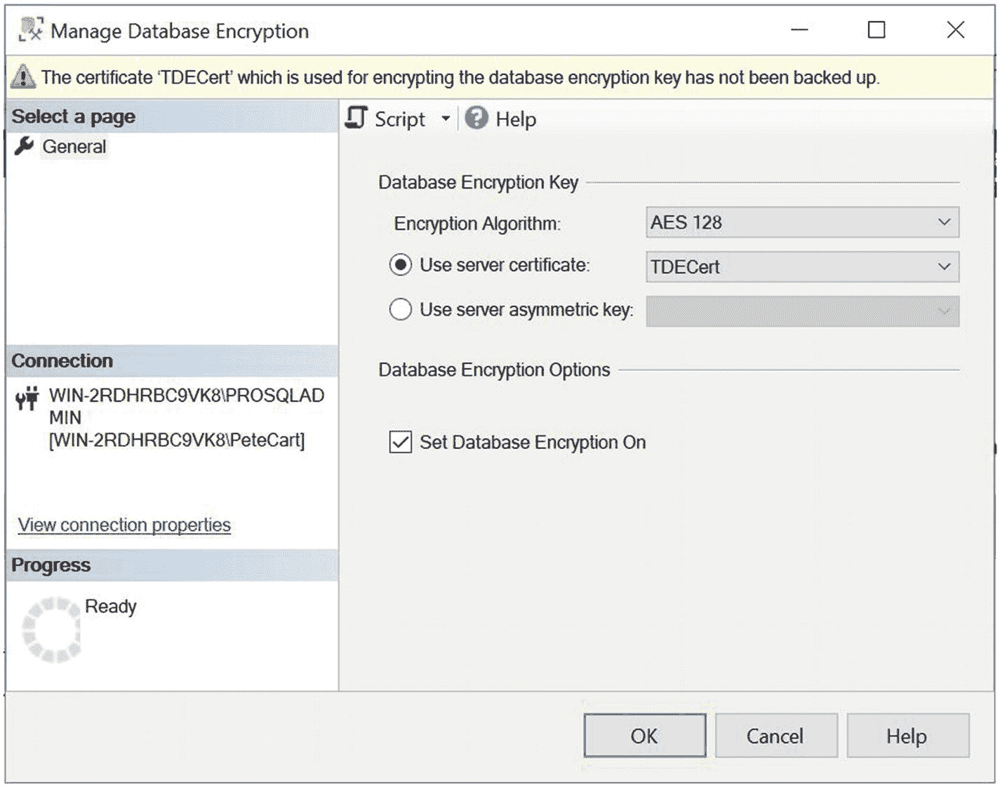

图 11-2 管理数据库加密向导

您可以看到我们已经从下拉框中选择了服务器证书，并选择了启用数据库加密。在“加密算法”下拉框中，我们选择了`AES 128`，这是默认选项。

#### 注意

选择算法本质上是安全性与性能之间的权衡。较长的密钥消耗更多的`CPU`资源，但更难以破解。

透明数据加密也可以通过`T-SQL`进行配置。我们可以通过执行清单 11-7 中的脚本来实现相同的结果。

```sql
USE CHAPTER11Encrypted
GO
--创建数据库加密密钥
CREATE DATABASE ENCRYPTION KEY
WITH ALGORITHM = AES_128
ENCRYPTION BY SERVER CERTIFICATE TDECert ;
GO
--在数据库上启用 TDE
ALTER DATABASE CHAPTER11Encrypted SET ENCRYPTION ON ;
GO
-- 清单 11-7
-- 启用透明数据加密
```

#### 管理透明数据加密

配置`TDE`时，我们会收到一个警告，提示用于加密数据库加密密钥的证书尚未备份。备份此证书至关重要，您应在配置`TDE`之前或之后立即执行此操作。如果证书变得不可用，您将无法恢复数据库中的数据。您可以使用清单 11-8 中的脚本来备份证书。

```sql
USE Master
GO
BACKUP CERTIFICATE TDECert
TO FILE = 'C:\certificates\TDECert'
WITH PRIVATE KEY (file='C:\certificates\TDECertKey',
ENCRYPTION BY PASSWORD='Pa$$w0rd')
-- 清单 11-8
-- 备份证书
```


### 迁移加密数据库

就 TDE 的本质而言，如果我们试图将`Chapter11Encrypted`数据库移动到新实例，除非我们考虑到加密要素，否则操作会失败。图 11-3 展示了如果我们对`Chapter11Encrypted`数据库进行备份，并尝试在新实例上还原时收到的消息。你可以在第 12 章找到关于备份和还原的完整讨论。

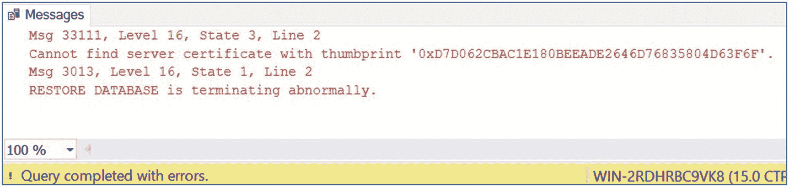

图 11-3：在新实例上还原加密数据库的尝试

如果我们分离数据库并尝试将其附加到新实例，也会收到相同的错误。相反，我们必须先创建一个具有相同密码的数据库主密钥，然后将服务器证书和私钥还原到新实例。我们可以使用清单 11-9 中的脚本来还原我们之前创建的服务器证书。

```sql
CREATE MASTER KEY ENCRYPTION BY PASSWORD = 'Pa$$w0rd' ;
GO
CREATE CERTIFICATE TDECert
FROM FILE = 'C:\Certificates\TDECert'
WITH PRIVATE KEY
(
FILE = 'C:\Certificates\TDECertKey',
DECRYPTION BY PASSWORD = 'Pa$$w0rd'
) ;
清单 11-9：还原服务器证书
```

#### 提示

确保 SQL Server 服务帐户在操作系统中对证书和密钥文件拥有权限。否则，你将收到错误，指出证书无效、不存在或你没有权限访问它。这意味着你应该立即检查还原结果并定期重复测试。

### 管理单元格级加密

单元格级加密允许你使用对称密钥、非对称密钥、证书或密码来加密单个列，甚至是列中的特定单元格。虽然这可以为你的数据提供额外的安全层，但它也可能导致显著的性能影响和大量的 `膨胀`。`膨胀` 意味着加密后的数据大小比加密前大得多。此外，实现单元格级加密是一个手动过程，需要你修改应用程序代码。因此，加密数据不应成为你的默认操作，只有在存在监管要求或明确的业务理由时才应执行。

尽管使用对称密钥加密数据是常见做法，但也可以使用非对称密钥、证书甚至密码短语来加密数据。如果使用密码短语加密数据，则会使用三重 DES 算法进行加密。表 11-1 列出了你可以用于通过这些方法加密或解密数据的加密函数。

表 11-1：加密函数

| 加密方法 | 加密函数 | 解密函数 |
| --- | --- | --- |
| 非对称密钥 | `ENCRYPTBYASYMKEY()` | `DECRYPTBYASYMKEY()` |
| 证书 | `ENCRYPTBYCERT()` | `DECRYPTBYCERT()` |
| 密码短语 | `ENCRYPTBYPASSPHRASE()` | `DECRYPTBYPASSPHRASE()` |

当我们在数据库中创建 `SensitiveData` 表时，你可能注意到，对于 `CreditCardNumber` 列，我们使用了 `VARBINARY(8000)` 数据类型，而明显的选择应该是 `CHAR(19)`。这是因为加密数据必须存储为二进制数据类型之一。我们将长度设置为 8000 字节，因为这是用于加密它的函数返回数据的最大长度。

清单 11-10 中的脚本将创建 `Chapter11Encrypted` 数据库的副本。然后，脚本为该数据库创建一个数据库主密钥和一个证书。之后，它会创建一个将使用该证书加密的对称密钥。最后，它打开对称密钥并用它来加密我们 `SensitiveData` 表中的 `CreditCardNumber` 列。

```sql
--创建副本数据库
CREATE DATABASE Chapter11CellEncrypted ;
GO
USE Chapter11CellEncrypted
GO
--创建表
CREATE TABLE dbo.SensitiveData
(
ID                INT                PRIMARY KEY        IDENTITY,
FirstName        NVARCHAR(30),
LastName        NVARCHAR(30),
CreditCardNumber        VARBINARY(8000)
)
GO
--填充表数据
SET identity_insert dbo.SensitiveData ON
INSERT INTO dbo.SensitiveData(id, firstname, lastname, CreditCardNumber)
SELECT id
,firstname
,lastname
,CreditCardNumber
FROM  Chapter11Encrypted.dbo.SensitiveData
SET identity_insert dbo.SensitiveData OFF
--创建数据库主密钥
CREATE MASTER KEY ENCRYPTION BY PASSWORD = 'Pa$$w0rd';
GO
--创建证书
CREATE CERTIFICATE CreditCardCert
WITH SUBJECT = 'Credit Card Numbers';
GO
--创建对称密钥
CREATE SYMMETRIC KEY CreditCardKey
WITH ALGORITHM = AES_128
ENCRYPTION BY CERTIFICATE CreditCardCert;
GO
--打开对称密钥
OPEN SYMMETRIC KEY CreditCardKey
DECRYPTION BY CERTIFICATE CreditCardCert;
--加密 CreditCardNumber 列
UPDATE dbo.SensitiveData
SET CreditCardNumber = ENCRYPTBYKEY(KEY_GUID('CreditCardKey'), CreditCardNumber);
GO
CLOSE SYMMETRIC KEY CreditCardKey --关闭密钥，除非重新打开，否则无法再次使用
清单 11-10：加密列数据
```

请注意，我们用于加密数据的 `UPDATE` 语句使用了一个名为 `ENCRYPTBYKEY()` 的函数。表 11-2 描述了 `ENCRYPTBYKEY()` 函数接受的参数。如果我们只想加密单元格的子集，可以在 `UPDATE` 语句中添加一个 `WHERE` 子句。

表 11-2：EncryptByKey() 参数

| 参数 | 描述 |
| --- | --- |
| `Key_GUID` | 用于加密数据的对称密钥的 GUID |
| `ClearText` | 你希望加密的数据的二进制表示 |
| `Add_authenticator` | 一个 `BIT` 参数，指示是否应添加验证器列 |
| `Authenticator` | 指定应用作验证器的列的参数 |

还要注意，在我们使用密钥加密数据之前，我们发出了一条语句来打开密钥。在用于加密或解密数据之前，密钥必须始终处于打开状态。为此，用户必须拥有打开密钥的权限。

当你使用清单 11-10 所示的方法加密列数据时，由于所用加密算法的确定性特性，你仍然面临安全风险，这意味着当你加密相同的值时，会得到相同的哈希值。想象一下这样的场景：一个用户可以访问 `SensitiveData` 表，但没有授权查看信用卡号。如果该用户同时也是该表中有记录的客户，他们可以用表中另一位客户的相同哈希值来更新自己的信用卡号。这样，他们就成功窃取了另一位客户的信用卡号，而无需解密 `CreditCardNumber` 列中的数据。这被称为 `全值替换攻击`。

为了防范这种情况，你可以添加一个验证器列，也称为 `盐值`。这可以是任何列，但通常是表的主键列。加密数据时，验证器列会与数据一起加密。在解密时，会检查验证器值，如果不匹配，则解密失败。


### SQL Server 加密技术

#### 警告

**重要提示**：验证器列中的值**绝不**应被更新。如果被更新，您可能会丢失对敏感数据的访问。

清单 11-11 中的脚本展示了如何使用验证器列，利用表的主键作为验证器列来加密 `CreditCardNumber` 列。这里，我们使用 `HASHBYTES()` 函数创建验证器列的哈希值，然后使用该哈希表示来加密数据。如果列已被加密，其值将被更新以包含盐值。

#### 提示

此脚本仅作为示例包含在内，但您应避免在此时运行它，以便能够遵循后续的代码示例。

```sql
OPEN SYMMETRIC KEY CreditCardKey
DECRYPTION BY CERTIFICATE CreditCardCert;
--Encrypt the CreditCardNumber column
UPDATE SensitiveData
SET CreditCardNumber = ENCRYPTBYKEY(Key_GUID('CreditCardKey')
,CreditCardNumber
,1
,HASHBYTES('SHA1', CONVERT(VARBINARY(8000), ID)));
GO
CLOSE SYMMETRIC KEY CreditCardKey ;
```
**清单 11-11** 使用验证器加密列

在脚本末尾，我们关闭了密钥。如果我们没有显式关闭它，它将在会话的剩余时间内保持打开状态。如果我们计划使用同一密钥执行多个活动，这可能很有用，但良好的做法是在会话中最终使用后立即将其显式关闭。

尽管出于性能原因，可以使用对称密钥、非对称密钥或证书来加密数据，但通常会选择使用对称密钥，然后使用非对称密钥或证书来加密该对称密钥。

### 访问加密数据

为了读取使用 `ENCRYPTBYKEY()` 加密的列中的数据，我们需要使用 `DECRYPTBYKEY()` 函数对其进行解密。表 11-3 描述了此函数的参数。

**表 11-3** `DecryptByKey` 参数

| 参数 | 描述 |
| --- | --- |
| `Cyphertext` | 要解密的加密数据 |
| `AddAuthenticator` | 一个 `BIT` 值，指定是否需要验证器 |
| `Authenticator` | 用作验证器的列 |

清单 11-12 中的脚本演示了在不使用验证器加密后，如何使用 `DECRYPTBYKEY()` 函数读取 `CreditCardNumber` 列中的加密数据。

```sql
--Open Key
OPEN SYMMETRIC KEY CreditCardKey
DECRYPTION BY CERTIFICATE CreditCardCert;
--Read the Data using DECRYPTBYKEY()
SELECT
FirstName
,LastName
,CreditCardNumber AS [Credit Card Number Encrypted]
,CONVERT(VARCHAR(30), DECRYPTBYKEY(CreditCardNumber)) AS [Credit Card Number Decrypted]
,CONVERT(VARCHAR(30), CreditCardNumber)
AS [Credit Card Number Converted Without Decryption]
FROM dbo.SensitiveData ;
--Close the Key
CLOSE SYMMETRIC KEY CreditCardKey ;
```
**清单 11-12** 读取加密列

此脚本最终查询结果示例如图 11-4 所示。您可以看到，直接查询加密列会返回加密的二进制值。对加密列直接转换为 `VARCHAR` 数据类型的查询虽然成功，但不返回数据。然而，使用 `DECRYPTBYKEY()` 函数查询加密列，并在值转换为 `VARCHAR` 数据类型时，会返回正确的结果。

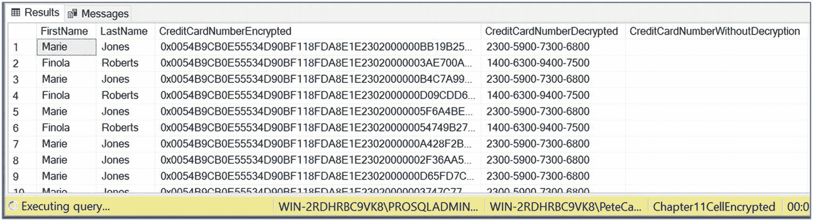
**图 11-4** `DECRYPTBYKEY()` 的结果

### Always Encrypted

Always Encrypted 是 SQL Server 2016 中引入的一项技术，也是首个能够保护数据免受特权用户（例如 `sysadmin` 角色成员）访问的 SQL Server 加密技术。由于数据库管理员无法查看加密数据，Always Encrypted 提供了真正的职责隔离。当您的平台支持外包给第三方供应商时，这有助于解决敏感数据的合规性问题。如果您有监管要求，规定数据不得提供给本国司法管辖区之外，而第三方供应商使用的是离岸团队，则这一点尤其重要。

Always Encrypted 使用两种独立类型的密钥：列加密密钥和列主密钥。列加密密钥用于加密列内的数据，列主密钥用于加密列加密密钥。

#### 提示

列主密钥是位于外部存储区中的密钥或证书。

拥有第二层密钥意味着 SQL Server 只需存储列加密密钥的加密值，而不是以明文形式存储。列主密钥根本不存储在数据库引擎中，而是存储在外部密钥存储区中。使用的密钥存储区可以是 HSM（硬件安全模块）、Windows 证书存储区或 EKM 提供程序，例如 Azure Key Vault 或 Thales。然后，SQL Server 在数据库元数据中存储列主密钥的位置。

数据的加密和解密责任不再由 SQL Server 承担，而是由客户端驱动程序处理。当然，这意味着应用程序必须使用受支持的驱动程序，以下链接包含有关使用受支持驱动程序的详细信息：[`https://msdn.microsoft.com/en-gb/library/mt147923.aspx`](https://msdn.microsoft.com/en-gb/library/mt147923.aspx)。

当应用程序发出需要加密或解密数据的请求时，客户端驱动程序会与数据库引擎协商以确定列主密钥的位置。数据库引擎还提供加密的列加密密钥及其用于加密的算法。

现在，客户端驱动程序可以联系外部密钥存储区并检索列主密钥，然后使用它来解密列加密密钥。列加密密钥的明文版本随后可用于根据需要加密或解密数据。

整个过程对应用程序是透明的，这意味着不需要更改应用程序的代码即可使用 Always Encrypted。唯一可能需要的更改是使用更新的受支持驱动程序。


#### 注意

客户端驱动程序将作为一项优化，缓存列加密密钥的明文版本，以避免反复从外部密钥存储中获取。

Always Encrypted 存在一些显著的限制，包括无法执行非相等比较（即使是相等比较也仅在确定性加密下可用）。SQL Server 2019 引入了 **Secure Enclaves** 来解决其中部分问题。使用安全飞地时，支持 `<`、`>` 甚至 `LIKE` 等运算符，前提是使用了随机化加密。Secure Enclaves 还支持就地加密。

Secure Enclaves 的工作原理是在 SQL Server 进程内部使用一块受保护的内存区域作为可信执行环境。在此内存区域中，数据会被解密并进行计算。SQL Server 进程的其他部分或服务器上的任何其他进程都无法访问该安全内存，这意味着即使使用调试工具，解密后的数据也不会泄露。

如果 SQL Server 确定查询需要使用安全飞地，客户端驱动程序会通过安全通道将加密密钥发送到安全飞地。然后，客户端驱动程序提交查询和加密的查询参数以供执行。由于数据（甚至加密的参数）只在飞地内部被解密，因此数据、参数和加密密钥永远不会以明文形式暴露。

由于解密后的数据和密钥在飞地内部可用，客户端驱动程序需要验证飞地的真实性。为此，它需要一个外部仲裁者，称为证明服务，例如 Windows Server Host Guardian Service。在向飞地发送任何数据之前，客户端驱动程序将联系证明服务以确定飞地的有效性。

使用 Always Encrypted 有许多限制。例如，不支持高级数据类型。完整的限制列表可以在 [`https://docs.microsoft.com/en-us/sql/relational-databases/security/encryption/always-encrypted-database-engine?view=sql-server-2019#feature-details`](https://docs.microsoft.com/en-us/sql/relational-databases/security/encryption/always-encrypted-database-engine%253Fview%253Dsql-server-2019%2523feature-details) 找到。

### 实现 Always Encrypted

在本节中，我们将使用带有 Secure Enclaves 的 Always Encrypted 对一个名为 `Chapter11AlwaysEncrypted` 的数据库中的数据进行加密。我们将使用基于虚拟化的安全（VBS）飞地。在生产环境中，您应确保您的飞地使用可信平台模块（TPM）证明以增强安全性。TPM 是基于硬件的证明，超出了本节的范围。更多细节可以在 [`https://docs.microsoft.com/en-us/windows-server/identity/ad-ds/manage/component-updates/tpm-key-attestation`](https://docs.microsoft.com/en-us/windows-server/identity/ad-ds/manage/component-updates/tpm-key-attestation) 找到。

在本节中，我们将配置第二台服务器作为证明服务，并将我们的 SQL Server 注册到它，以便在客户端希望使用飞地时进行仲裁。

第一步是使用清单 11-13 中的 PowerShell 脚本将第二台服务器配置为证明服务。此服务器必须运行 Windows Server 2019。此过程要求服务器执行多次重启。因此，脚本使用注释来标记各个部分。运行脚本的每个部分后，直到重启完成才应运行后续部分。请记住，不能使用托管 SQL Server 实例的同一台服务器。还值得注意的是，在配置时，充当证明服务的服务器可能未加入域。这是因为为主护盾创建了一个新域。

#### 提示

为使脚本成功执行，PowerShell 终端应以管理员身份运行。

```
#Part 1 - Install the Host Guardian Service role
Install-WindowsFeature -Name HostGuardianServiceRole -IncludeManagementTools -Restart
#Part 2 - Install the Host Guardian Service & configure its domain
$DSRepairModePassword = ConvertTo-SecureString -AsPlainText 'MyVerySecurePa$$w0rd' –Force
Install-HgsServer -HgsDomainName 'HostGuardian.local' -SafeModeAdministratorPassword $DSRepairModePassword -Restart
#After the reboot, log-in using the admin account, which will now be elevated to Domain Admin of the HostGuardian.local domain
#Part 3 - Configure Host Ket Attestation
Initialize-HgsAttestation -HgsServiceName 'hgs' -TrustHostKey
```
清单 11-13
配置证明服务器

现在，我们需要将托管 SQL Server 实例的服务器注册为受防护的主机。我们可以使用清单 11-14 中的脚本为此做准备。同样，该脚本使用注释将其分成几个部分。这是因为在此过程中需要重启。同样，PowerShell 终端应以管理员身份运行。

```
#Part 1 - Enable the HostGuardian feature
Enable-WindowsOptionalFeature -Online -FeatureName HostGuardian -All
#Part 2 - Remove VBS requirement. Only required if you are using a VM
Set-ItemProperty -Path HKLM:\SYSTEM\CurrentControlSet\Control\DeviceGuard -Name RequirePlatformSecurityFeatures -Value 0
shutdown /r
#Part 3 - Generate a host key pair and export public key to a file
#Generate the host key pair
Set-HgsClientHostKey
#Create a folder to store the keys
New-Item -Path c:\ -Name Keys -ItemType directory
#Export the public key to a file
Get-HgsClientHostKey -Path ("c:\Keys\{0}key.cer" -f $env:computername)
```
清单 11-14
准备将主机注册为受防护主机

此时，您应该手动将 `c:\keys` 文件夹中生成的证书文件复制到证明服务器。假设您将证书复制到名为 `c:\keys` 的文件夹，清单 11-15 中的脚本会将密钥导入证明服务。


#### 注意

确保将服务器和密钥名称更改为与您自己环境匹配的名称。

```
Add-HgsAttestationHostKey -Name WIN-2RDHRBC9VK8 -Path c:\keys\WIN-2RDHRBC9VK8key.cer
清单 11-15
将客户端密钥导入证明服务
```

注册流程的最后一步是配置客户端，这可以使用清单 11-16 中的脚本来完成。在运行脚本前，请务必确保证明服务的 IP 地址已更改为与您自己环境匹配的地址。

```
$params = @{
    AttestationServerUrl   = 'http://10.0.0.3/Attestation'
    KeyProtectionServerUrl = 'http://10.0.0.3/KeyProtection'
}
Set-HgsClientConfiguration @params
清单 11-16
配置客户端
```

现在，我们的服务器已注册为受防护主机，我们可以创建 Always Encrypted 将使用的证书和密钥。这可以使用清单 11-17 中的脚本完成。

```
##### 创建一个证书，用于加密列主密钥。它将被存储在 Windows 证书存储的“当前用户”部分。
$params = @{
    Subject           = "AlwaysEncryptedCert"
    CertStoreLocation = 'Cert:\CurrentUser\My'
    KeyExportPolicy   = 'Exportable'
    Type              = 'DocumentEncryptionCert'
    KeyUsage          = 'DataEncipherment'
    KeySpec           = 'KeyExchange'
}
$certificate = New-SelfSignedCertificate @params
##### 导入 SqlServer 模块。
Import-Module "SqlServer"
##### 连接到 Chapter11AlwaysEncrypted 数据库
$serverName = "{0}\prosqladmin" -f $env:COMPUTERNAME
$databaseName = "Chapter11AlwaysEncrypted"
$connectionString = "Data Source = {0}; Initial Catalog = {1}; Integrated Security = true" -f @(
    $serverName
    $databaseName
)
$database = Get-SqlDatabase -ConnectionString $connectionString
##### 创建一个设置对象，指定 -AllowEnclaveComputations 以使密钥支持安全飞地计算
$params = @{
    CertificateStoreLocation = 'CurrentUser'
    Thumbprint = $certificate.Thumbprint
    AllowEnclaveComputations = $true
}
$cmkSettings = New-SqlCertificateStoreColumnMasterKeySettings @params
##### 创建列主密钥。
$cmkName = 'ColumnMasterKey'
$params = @{
    Name = $cmkName
    InputObject = $database
    ColumnMasterKeySettings = $cmkSettings
}
New-SqlColumnMasterKey @params
##### 创建一个列加密密钥，使用列主密钥进行加密
$params = @{
    Name = 'ColumnEncryptionKey'
    InputObject = $database
    ColumnMasterKey = $cmkName
}
New-SqlColumnEncryptionKey @params
清单 11-17
创建 Always Encrypted 加密对象
```

在创建列主密钥时，我们指定了一个密钥存储参数。表 11-4 详细列出了 Always Encrypted 支持的密钥存储。然而，如果我们希望使用安全飞地，则不能选择 CNG 存储。

**表 11-4**

**密钥存储类型值**

| 密钥存储类型 | 描述 |
| --- | --- |
| Windows 证书存储—当前用户 | 密钥或证书存储在 Windows 证书存储中为创建证书的用户配置文件保留的区域。如果您使用数据库引擎的服务帐户交互式地创建证书，此选项可能是合适的。 |
| Windows 证书存储—本地计算机 | 密钥或证书存储在 Windows 证书存储中为本地机器保留的区域。 |
| Azure Key Vault | 密钥或证书存储在 Azure Key Vault EKM 服务中。 |
| 密钥存储提供程序 (CNG) | 密钥或证书存储在支持 Cryptography API: Next Generation 的 EKM 存储中。 |

下一步是在 SQL Server 实例中启用安全飞地。与大多数实例配置不同，此更改需要重启实例才能生效。清单 11-18 中的脚本将更改配置。

```
EXEC sys.sp_configure 'column encryption enclave type', 1;
RECONFIGURE ;
清单 11-18
启用安全飞地
```

#### 提示

在 SQL Server 2019 的预发布版本中，必须全局启用跟踪标志 127 才能启用丰富计算。

我们现在想要加密 `dbo.CreditCards` 表的 `CreditCardNumber`、`ExpMonth` 和 `ExpYear` 列，该表大致基于 `AdventureWorks` 数据库的 `Sales.CreditCard` 表。

在加密数据时，我们有两种方法可以选择：确定性加密或随机化加密。这是一个需要理解的重要决定，因为它可能对性能、安全性以及安全飞地可用的功能产生影响。

确定性加密对于相同的明文值总是产生相同的加密值。这意味着，如果使用确定性加密，并且列使用 BIN2 排序规则，则可以在加密列上执行包括等值连接、分组和索引在内的操作。然而，这留下了针对加密进行攻击的可能性。

如果使用随机化加密，则可以为相同的明文值生成不同的加密值。这意味着，虽然加密漏洞被堵上，但对于标准的 Always Encrypted 实现，等值连接、分组和索引不支持对加密数据进行操作。

然而，在使用安全飞地实施 Always Encrypted 时，随机化加密比确定性加密提供更多功能。表 11-5 详细说明了确定性加密和随机化加密在有无安全飞地情况下的功能兼容性。

**表 11-5**

**加密类型与功能兼容性**

| 加密类型 | 原地加密 | 等值比较 | 丰富计算 | Like 操作 |
| --- | --- | --- | --- | --- |
| 无飞地，确定性加密 | 否 | 是 | 否 | 否 |
| 有飞地，确定性加密 | 是 | 是 | 否 | 否 |
| 无飞地，随机化加密 | 否 | 否 | 否 | 否 |
| 有飞地，随机化加密 | 是 | 是（在飞地内） | 是 | 是 |

我们将使用随机化加密，以便能充分利用安全飞地功能。清单 11-19 中的脚本将创建 `Chapter11AlwaysEncrypted` 数据库，然后创建 `dbo.CreditCards` 表，该表大致基于 `AdventureWorks` 数据库的 `Sales.CreditCards` 表。

```
CREATE TABLE dbo.CreditCards
(
    CardID     INT      IDENTITY     NOT NULL,
    CardType   NVARCHAR(20)  NOT NULL,
    CardNumber NVARCHAR(20)  COLLATE Latin1_General_BIN2 ENCRYPTED WITH (
        COLUMN_ENCRYPTION_KEY = [ColumnEncryptionKey],
        ENCRYPTION_TYPE = Randomized,
        ALGORITHM = 'AEAD_AES_256_CBC_HMAC_SHA_256') NOT NULL,
    ExpMonth   INT ENCRYPTED WITH (
        COLUMN_ENCRYPTION_KEY = [ColumnEncryptionKey],
        ENCRYPTION_TYPE = Randomized,
        ALGORITHM = 'AEAD_AES_256_CBC_HMAC_SHA_256') NOT NULL,
    ExpYear    INT ENCRYPTED WITH (
        COLUMN_ENCRYPTION_KEY = [ColumnEncryptionKey],
        ENCRYPTION_TYPE = Randomized,
        ALGORITHM = 'AEAD_AES_256_CBC_HMAC_SHA_256') NOT NULL,
    CustomerID INT NOT NULL
) ;
清单 11-19
创建具有加密列的 CreditCards 表
```


#### 注意事项

如果加密现有数据，仅应在维护窗口期间执行该操作，因为在加密进行时针对表执行的 DML 语句有可能导致数据丢失。

我们现在将使用 PowerShell 来演示客户端如何向加密列中插入数据。请注意，连接字符串包含了 `Column Encryption Setting`。该技术在清单 11-20 中演示。

```powershell
#创建 SqlConnection 对象，并指定 Column Encryption Setting = enabled
$sqlConn = New-Object System.Data.SqlClient.SqlConnection
$sqlConn.ConnectionString = "Server=localhost\prosqladmin;Integrated Security=true; Initial Catalog=Chapter11AlwaysEncrypted; Column Encryption Setting=enabled;"
#打开连接
$sqlConn.Open()
#创建 SqlCommand 对象，并添加查询和参数
$sqlcmd = New-Object System.Data.SqlClient.SqlCommand
$sqlcmd.Connection = $sqlConn
$sqlcmd.CommandText = "INSERT INTO dbo.CreditCards (CardType, CardNumber, ExpMonth, ExpYear, CustomerID) VALUES (@CardType, @CardNumber, @ExpMonth, @ExpYear, @CustomerID)"
$sqlcmd.Parameters.Add((New-Object Data.SqlClient.SqlParameter("@CardType",[Data.SQLDBType]::nVarChar,20)))
$sqlcmd.Parameters["@CardType"].Value = "SuperiorCard"
$sqlcmd.Parameters.Add((New-Object Data.SqlClient.SqlParameter("@CardNumber",[Data.SQLDBType]::nVarChar,20)))
$sqlcmd.Parameters["@CardNumber"].Value = "33332664695310"
$sqlcmd.Parameters.Add((New-Object Data.SqlClient.SqlParameter("@ExpMonth",[Data.SQLDBType]::Int)))
$sqlcmd.Parameters["@ExpMonth"].Value = "12"
$sqlcmd.Parameters.Add((New-Object Data.SqlClient.SqlParameter("@ExpYear",[Data.SQLDBType]::Int)))
$sqlcmd.Parameters["@ExpYear"].Value = "22"
$sqlcmd.Parameters.Add((New-Object Data.SqlClient.SqlParameter("@CustomerID",[Data.SQLDBType]::Int)))
$sqlcmd.Parameters["@CustomerID"].Value = "1"
#插入数据
$sqlcmd.ExecuteNonQuery();
#关闭连接
$sqlConn.Close()
```
清单 11-20 向加密列插入数据

#### 管理密钥

正如您所料，有关密钥的元数据通过系统表和动态管理视图公开。有关列主密钥的详细信息可在 `sys.column_master_keys` 表中找到。该表返回的列详见表 11-6。

表 11-6 `sys.column_master_keys` 的列

| 列 | 描述 |
| --- | --- |
| Name | 列主密钥的名称。 |
| Column_master_key_id | 列主密钥的内部标识符。 |
| Create_date | 创建密钥的日期和时间。 |
| Modify_date | 最后修改密钥的日期和时间。 |
| Key_store_provider_name | 密钥存储提供程序的类型，指示密钥存储的位置。 |
| Key_path | 密钥在密钥存储中的路径。 |
| Allow_enclave_computations | 指定密钥是否启用安全区域计算。 |
| Signature | 数字签名，结合了 `key_path` 和 `allow_enclave_computations`。这可以防止恶意管理员更改密钥的安全区域启用设置。 |

列加密密钥的详细信息可在 `sys.column_encryption_keys` 系统表中找到。该表返回表 11-7 中详述的列。

表 11-7 `sys.column_encryption_keys` 返回的列

| 名称 | 描述 |
| --- | --- |
| Name | 列加密密钥的名称 |
| Column_encryption_key_id | 列加密密钥的内部 ID |
| Create_date | 创建密钥的日期和时间 |
| Modify_date | 最后修改密钥的日期和时间 |

一个名为 `sys.column_encryption_key_values` 的附加系统表提供了 `sys.column_master_keys` 和 `sys.column_encryption_keys` 系统表之间的联接，同时提供列加密密钥被列主密钥加密后的加密值。表 11-8 详述了该系统表返回的列。

表 11-8 `sys.column_encryption_key_values` 的列

| 名称 | 描述 |
| --- | --- |
| Column_encryption_key_id | 列加密密钥的内部 ID |
| Column_master_key_id | 列主密钥的内部 ID |
| Encrypted_value | 列加密密钥的加密值 |
| Encrypted_algorithm_name | 用于加密列加密密钥的算法 |

因此，我们可以使用清单 11-21 中的查询来查找数据库中所有使用支持安全区域的密钥加密的列。

#### 提示

移除 WHERE 子句可返回所有受 Always Encrypted 保护的列，并确定哪些列支持安全区域，哪些不支持。

```sql
SELECT
c.name AS ColumnName
, OBJECT_NAME(c.object_id) AS TableName
, cek.name AS ColumnEncryptionKey
, cmk.name AS ColumnMasterKey
, CASE
WHEN cmk.allow_enclave_computations = 1
THEN 'Yes'
ELSE 'No'
END AS SecureEnclaves
FROM sys.columns c
INNER JOIN sys.column_encryption_keys cek
ON c.column_encryption_key_id = cek.column_encryption_key_id
INNER JOIN sys.column_encryption_key_values cekv
ON cekv.column_encryption_key_id = cek.column_encryption_key_id
INNER JOIN sys.column_master_keys cmk
ON cmk.column_master_key_id = cekv.column_master_key_id
WHERE allow_enclave_computations = 1
```
清单 11-21 返回使用安全区域的列的详细信息

管理员无法在启用和不启用安全区域之间切换密钥。这是微软的一项刻意设计决策，旨在防范恶意管理员。但是，可以轮换密钥，并且在轮换密钥时，您可以轮换掉一个不支持安全区域的密钥，并替换为一个支持的密钥（反之亦然）。

#### 提示

以下演示假设在 `Chapter11AlwaysEncrypted` 数据库中存在一个额外的列主密钥。

轮换密钥的最简单方法是使用 SQL Server Management Studio。依次展开 `数据库` -> `Chapter11AlwaysEncrypted` -> `安全性` -> `Always Encrypted 密钥` -> `列主密钥`，然后从您希望轮换掉的密钥的右键菜单中选择 `轮换`。这将显示“列主密钥轮换”对话框，如图 11-5 所示。在这里，您可以选择应用于加密底层列加密密钥的新密钥。

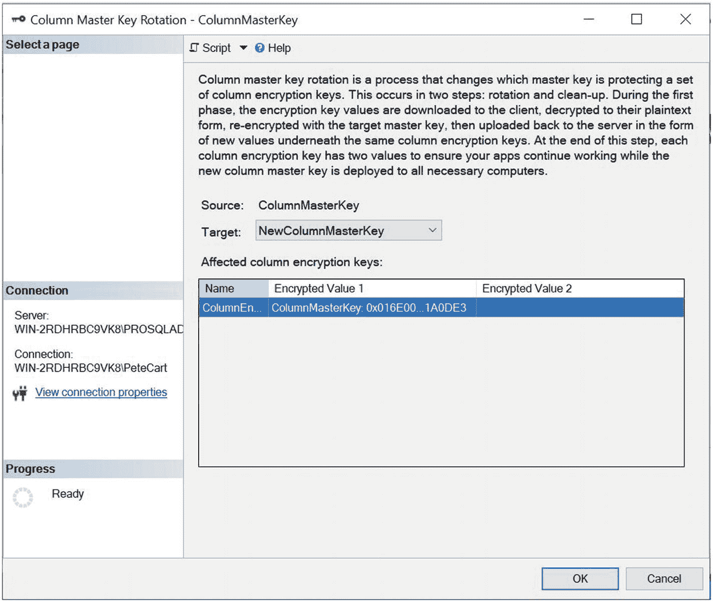
图 11-5 列主密钥轮换对话框

现在，加密密钥已使用新密钥重新加密，旧的密钥值需要被清理。这可以通过从旧列主密钥的右键菜单中选择 `清理` 来完成，从而调用“列主密钥清理”对话框。如图 11-6 所示。

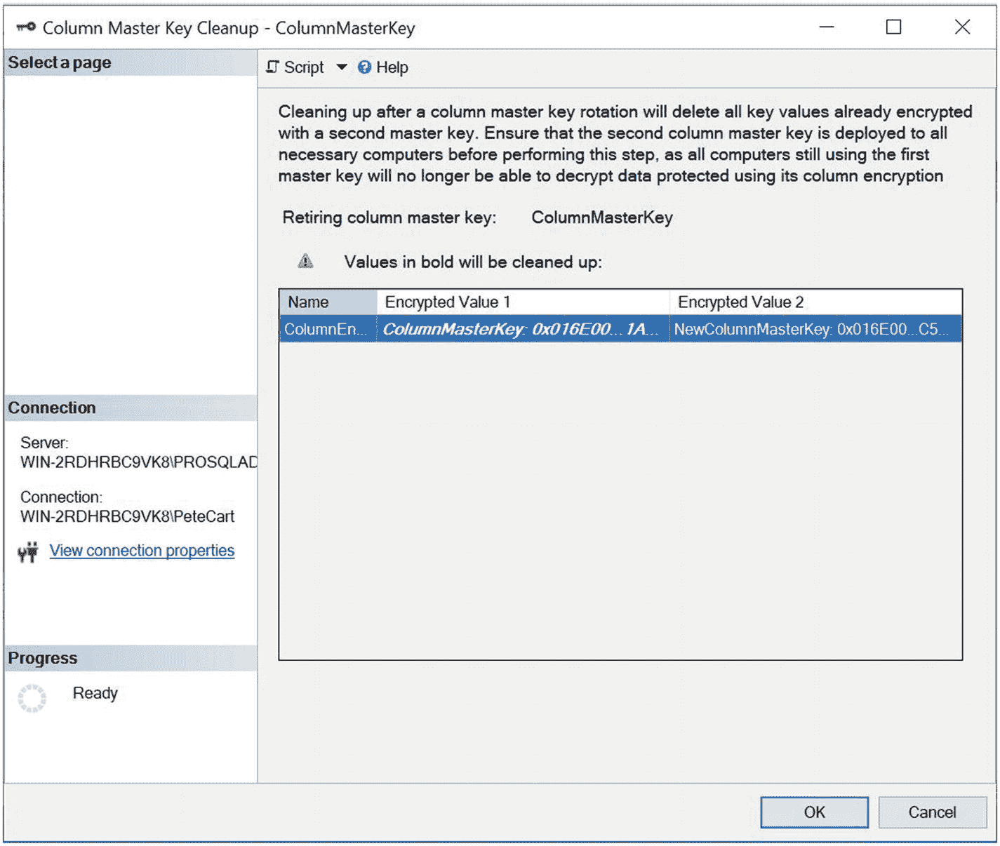
图 11-6 列主密钥清理对话框


### 概要

SQL Server 的加密层次结构始于服务主密钥，该密钥使用 Windows 操作系统中的数据保护 API (DPAPI) 进行加密。然后，您可以使用此密钥来加密数据库主密钥。进而，又可以使用该密钥来加密存储在数据库内的密钥和证书。SQL Server 还支持第三方可扩展密钥管理 (EKM) 提供程序，以实现对用于保护数据的密钥进行高级密钥管理。

透明数据加密 (TDE) 使管理员能够加密整个数据库，而不会产生数据膨胀，且性能开销在可接受范围内。这可以防止恶意用户通过将数据库附加到新实例或窃取备份介质来盗取数据。TDE 为开发者提供了优势，使其无需修改代码即可访问数据。

单元格级加密是一种在列级别、甚至特定行内使用对称密钥、非对称密钥或证书加密数据的技术。尽管此功能非常灵活，但它也需要大量手动操作，并会导致大量数据膨胀和显著的性能开销。因此，我建议您仅使用单元格级加密来保护满足监管要求所需的最少数据量，或者您有明确的业务理由需要使用它。

为了减轻使用单元格级加密时数据膨胀和性能下降的影响，建议您使用对称密钥加密数据。然后，您可以使用非对称密钥或证书来加密该对称密钥。

# 12. 备份与还原

备份数据库是数据库管理员 (DBA) 可执行的最重要的任务之一。因此，在讨论了备份原理之后，我们将探讨您可以为 SQL Server 数据库实施的一些备份策略。接着，我们将讨论如何执行数据库备份，最后深入探讨如何还原数据库，包括还原到特定时间点、还原单个文件和页面，以及执行部分还原。

### 备份基础

根据您使用的恢复模型，可以在 SQL Server 中执行三种类型的备份：完整备份、差异备份和日志备份。我们将在以下各节中讨论恢复模型以及每种备份类型。

#### 恢复模型

如第 6 章所述，您可以将数据库配置为以下三种恢复模型之一：`SIMPLE`、`FULL` 和 `BULK LOGGED`。这些模型将在以下章节中讨论。

##### SIMPLE 恢复模型

配置为 `SIMPLE` 恢复模型时，事务日志（更准确地说，是事务日志中包含不再需要的事务的 VLF [虚拟日志文件]）会在每次 `CHECKPOINT` 操作后被截断。这意味着通常您不必管理事务日志。然而，这也意味着您无法执行事务日志备份。

`SIMPLE` 恢复模型可以提高某些操作的性能，因为事务是 minimal logged（最小日志记录）的。可以从 minimal logging 中受益的操作如下：

*   批量导入

*   `SELECT INTO`

*   使用 `.WRITE` 子句针对大数据类型的 `UPDATE` 语句

*   `WRITETEXT`

*   `UPDATETEXT`

*   索引创建

*   索引重建

`SIMPLE` 恢复模型的主要缺点是无法恢复到特定时间点；您只能还原到完整备份的结尾。这一缺点被另一个事实放大了，即完整备份可能会影响性能，因此您不太可能在不造成用户影响的情况下，像执行事务日志备份那样频繁地执行完整备份。另一个缺点是，`SIMPLE` 恢复模型与某些 SQL Server 高可用性/灾难恢复 (HA/DR) 功能不兼容，具体包括：

*   AlwaysOn 可用性组

*   数据库镜像

*   事务日志传送

因此，在生产环境中，使用 `SIMPLE` 恢复模型最合适的场景是大型数据仓库类型的应用程序，这类应用程序通常有每晚的 ETL 加载作业，然后在当天其余时间进行只读报告。这是因为此模型提供了 minimal logged transactions（最小日志记录事务）的优势，同时由于您可以在每晚 ETL 运行后执行完整备份，因此对恢复操作没有影响。

##### FULL 恢复模型

当数据库配置为 `FULL` 恢复模型时，`CHECKPOINT` 操作后不会发生日志截断。相反，它会在执行事务日志备份后发生，前提是自上一次事务日志备份以来已经发生过 `CHECKPOINT` 操作。这意味着您必须安排频繁运行的事务日志备份。未能执行此操作不仅会使您的数据库在发生故障时面临无法恢复的风险，而且还会导致您的事务日志持续增长，直到空间耗尽并抛出 9002 错误。

当数据库处于 `FULL` 恢复模型时，许多因素可能导致事务日志中的 VLF 无法被截断。这被称为*延迟截断*。您可以在 `sys.databases` 的 `log_reuse_wait_desc` 列中找到最近一次发生延迟截断的原因；延迟截断的完整原因列表见第 6 章。

`FULL` 恢复模型的主要优点是可能进行时间点恢复，这意味着您可以将数据库还原到事务日志备份中间的某个时间点，而不仅仅是备份结束时的时间点。时间点恢复将在本章后面详细讨论。此外，`FULL` 恢复模型与所有 SQL Server 功能兼容。它通常是生产数据库恢复模型的最佳选择。

#### 提示

如果您从 `SIMPLE` 恢复模型切换到 `FULL` 恢复模型，实际上在您执行事务日志备份之前，您并未真正处于 `FULL` 恢复模型。因此，请确保立即备份您的事务日志。


##### BULK LOGGED 恢复模型

`BULK LOGGED`恢复模型旨在在执行大容量导入操作期间短期使用。其核心思想是：你的常规操作模式是使用`FULL`恢复模型，然后在大容量导入即将发生时，临时切换到`BULK LOGGED`恢复模型；待导入完成后，再切换回`FULL`恢复模型。这样做可能带来性能优势，并防止事务日志被填满，因为大容量导入操作是**最小化日志记录**的。

在切换到`BULK LOGGED`恢复模型**之前**，以及切换回`FULL`恢复模型**之后**，立即进行一次事务日志备份是良好实践。这是因为，任何包含最小化日志记录事务的事务日志备份都无法用于时间点恢复。出于同样原因，在切换到`BULK LOGGED`恢复模型之前，对你的应用程序进行“安全状态”处理也是良好实践。通常，这通过禁用除执行大容量导入的登录名和管理员登录名之外的所有登录名来实现，以确保没有其他数据修改发生。你还应确保你正在导入的数据可以通过还原以外的其他方式恢复。遵循这些规则可以降低在发生灾难时数据丢失的风险。

尽管在导入期间，最小化日志记录插入使事务日志保持较小并减少了日志的 IO 量，但在`FULL`恢复模型下，事务日志备份在 IO 方面的开销反而可能比在`BULK LOGGED`模型下更小。这是因为当你备份一个包含最小化日志记录事务的事务日志时，SQL Server 还会备份所有包含已通过最小化日志记录事务修改页面的**数据区**。SQL Server 通过使用称为 ML（最小化日志记录）页面的位图页面来跟踪这些页面。ML 页面每 64,000 个区出现一次，并使用标志来指示相应区块中的每个区是否包含最小化日志记录页面。

#### 注意

除非你拥有非常快速的 IO 子系统，否则对于大容量导入操作，`BULK LOGGED`恢复模型可能并不比`FULL`恢复模型更快。这是因为`BULK LOGGED`恢复模型强制使用最小化日志记录页面更新的数据页在操作完成后立即刷写到磁盘，而不是等待检查点操作。

#### 更改恢复模型

在向你展示如何更改数据库的恢复模型之前，让我们首先创建`Chapter12`数据库，我们将使用它在本章中进行演示。你可以使用清单 12-1 中的脚本创建此数据库。

```sql
CREATE DATABASE Chapter12
ON  PRIMARY
( NAME = 'Chapter12', FILENAME = 'C:\MSSQL\DATA\Chapter12.mdf'),
FILEGROUP FileGroupA
( NAME = 'Chapter12FileA', FILENAME = 'C:\MSSQL\DATA\Chapter12FileA.ndf' ),
FILEGROUP FileGroupB
( NAME = 'Chapter12FileB', FILENAME = 'C:\MSSQL\DATA\Chapter12FileB.ndf' )
LOG ON
( NAME = 'Chapter12_log', FILENAME = 'C:\MSSQL\DATA\Chapter12_log.ldf' ) ;
GO
ALTER DATABASE [Chapter12] SET RECOVERY FULL ;
GO
USE Chapter12
GO
CREATE TABLE dbo.Contacts
(
ContactID        INT        NOT NULL        IDENTITY        PRIMARY KEY,
FirstName        NVARCHAR(30),
LastName        NVARCHAR(30),
AddressID        INT
) ON FileGroupA ;
CREATE TABLE dbo.Addresses
(
AddressID        INT        NOT NULL        IDENTITY        PRIMARY KEY,
AddressLine1        NVARCHAR(50),
AddressLine2        NVARCHAR(50),
AddressLine3        NVARCHAR(50),
PostCode        NCHAR(8)
) ON FileGroupB ;
```
清单 12-1
创建 Chapter12 数据库

你可以通过在 SQL Server Management Studio (`SSMS`)中右键单击数据库并选择“属性”，然后导航到“选项”页面（如图 12-1 所示）来更改数据库的恢复模型。然后，你可以从“恢复模型”下拉列表中选择适当的恢复模型。

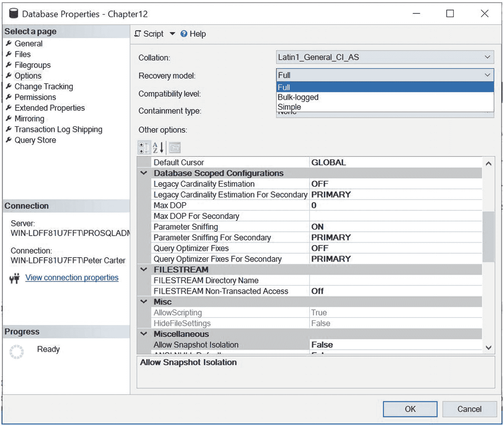
图 12-1
“选项”选项卡

我们也可以使用清单 12-2 中的脚本，将我们的`Chapter12`数据库从`FULL`恢复模型切换到`SIMPLE`恢复模型，然后再切换回来。

```sql
ALTER DATABASE Chapter12 SET RECOVERY SIMPLE ;
GO
ALTER DATABASE Chapter12 SET RECOVERY FULL ;
GO
```
清单 12-2
切换恢复模型

#### 提示

更改恢复模型后，请在“对象资源管理器”中刷新数据库，以确保显示的恢复模型是正确的。

#### 备份类型

在 SQL Server 中，你可以执行三种类型的备份：完整备份、差异备份和日志备份。我们将在以下各节讨论这些备份类型。

##### 完整备份

你可以在任何恢复模型下执行完整备份。当你发出`backup`命令时，SQL Server 首先会发出一个`CHECKPOINT`，这将导致所有脏页被写入磁盘。然后它备份数据库中的每个页面（这称为**数据读取阶段**），最后备份足够的事务日志（这称为**日志读取阶段**）以保证事务一致性。这确保了你能够将数据库还原到最近的时点，包括备份的数据读取阶段期间提交的任何事务。

##### 差异备份

差异备份会备份自上次完整备份以来数据库中所有已修改的页面。SQL Server 通过使用称为`DIFF`页面的位图页面来跟踪这些页面，这些页面每 64,000 个区出现一次。这些页面使用标志来指示其对应区块中的每个区是否包含自上次完整备份以来已更新的页面。

差异备份的累积性质意味着你的还原链只需要包含一个差异备份——即最新的那个。只需要还原一个差异备份在完整备份之间间隔时间很长但日志备份非常频繁的情况下非常有用，因为还原最后一个差异备份可以显著减少你需要还原的事务日志备份数量。

##### 日志备份

事务日志备份只能在`FULL`或`BULK LOGGED`恢复模型下执行。当在`FULL`恢复模型下发出事务日志备份时，它会备份自上次备份以来的所有事务日志记录。当在`BULK LOGGED`恢复模型下执行时，它还会备份任何包含最小化日志记录事务的页面。备份完成后，SQL Server 会截断事务日志中的`VLF`（虚拟日志文件），直到遇到第一个活动的`VLF`。

事务日志备份对于支持`OLTP`（联机事务处理）的数据库尤其重要，因为它们允许进行时间点恢复，恢复到灾难发生前的时刻。它们也是资源消耗最少的备份类型，这意味着你可以比执行完整或差异备份更频繁地执行它们，而不会对数据库性能产生显著影响。

#### 备份介质

数据库可以备份到`磁盘`、`磁带`或`URL`。但是，磁带备份已被弃用，因此你应避免使用它们；其支持将在未来版本的 SQL Server 中移除。围绕备份介质的术语包括备份设备、逻辑备份设备、介质集、介质族和备份集。介质集的结构如图 12-2 所示，相关概念将在以下各节中讨论。

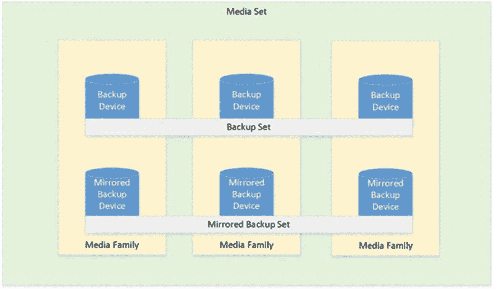
图 12-2
备份介质示意图


##### 备份设备

一个`备份设备`是磁盘上的物理文件、磁带或一个 Windows Azure Blob。当设备是磁盘时，该磁盘可以位于服务器本地，也可以位于通过 URL 指定的备份共享上。一个媒体集最多可以包含 64 个备份设备，数据可以**条带化**分布 across 这些备份设备，也可以被**镜像**。在图 12-2 中，有六个备份设备，被分成三个镜像对。这意味着备份集被条带化分布在其中三个设备上，然后镜像到另外三个设备上。

对大型数据库进行条带化备份可能很有用，因为这样可以将每个设备放置在不同的驱动器阵列上以提高吞吐量。然而，这也可能带来管理上的挑战；如果条带中某个设备里的一个磁盘变得不可用，您将无法还原备份。您可以通过使用**镜像**来缓解这个问题。当您使用镜像时，每个设备的内容会被复制到一个额外的设备以实现冗余。如果一个媒体集中的一个备份设备被镜像，那么该媒体集中的所有设备都必须被镜像。每个备份设备或镜像的备份设备集被称为一个`介质族`。每个设备最多可以有四个镜像。

一个媒体集中的所有备份设备必须都是磁盘或都是磁带。如果它们被镜像，那么镜像设备必须具有相似的属性；否则会引发错误。因此，Microsoft 建议为镜像使用相同品牌和型号的设备。

也可以创建逻辑备份设备，它对物理备份设备进行了抽象。使用逻辑设备可以简化管理，特别是当您计划在同一物理位置使用许多备份设备时。一个`逻辑备份设备`是实例级别的对象，可以通过在 SSMS 中，右键单击**服务器对象** ➤ **备份设备**，然后从上下文菜单中选择**新建备份设备**来创建；这会显示**备份设备**对话框，您可以在其中指定逻辑设备名称和物理路径。

或者，您也可以通过 T-SQL 使用 `sp_addumpdevice` 系统存储过程来创建相同的逻辑备份设备。清单 12-3 中的命令使用 `sp_addumpdevice` 过程创建了 `Chapter12Backup` 逻辑备份设备。在此示例中，我们使用 `@devtype` 参数传入设备的类型，在我们的例子中是 `disk`。然后，我们将设备的抽象名称传入 `@logicalname` 参数，将物理文件传入 `@physicalname` 参数。

```
EXEC sp_addumpdevice  @devtype = 'disk',
@logicalname = 'Chapter12Backup',
@physicalname = 'C:\MSSQL\Backup\Chapter12Backup.bak' ;
GO
清单 12-3
创建逻辑备份设备
```

##### 媒体集

一个媒体集包含备份所写入的备份设备。媒体集内的每个介质族根据其在媒体集中的位置被分配一个序列号。这被称为`族序列号`。此外，每个物理设备被分配一个`物理序列号`，以标识其在媒体集内的物理位置。

创建媒体集时，备份设备（文件或磁带）会被格式化，并且一个媒体标头会被写入每个设备。该媒体标头会一直保留到设备被再次格式化，其中包含详细信息，例如媒体集的名称、媒体集的 GUID、介质族的 GUID 和序列号、集中的镜像数量以及标头写入的日期/时间。

##### 备份集

每次进行备份到媒体集时，都被称为一个`备份集`。新的备份集可以追加到媒体上，或者您可以覆盖现有的备份集。如果媒体集只包含一个介质族，那么该介质族包含整个备份集。否则，备份集会分布 across 各个介质族。媒体集内的每个备份集都会被赋予一个序列号；这允许您选择要还原哪个备份集。

##### 备份策略

DBA 可以为数据库实施多种备份策略，但您的策略应始终基于数据层应用程序的 RTO（恢复时间目标）和 RPO（恢复点目标）要求。例如，如果一个应用程序的 RPO 为 60 分钟，而您每 24 小时才备份一次数据库，那么您将无法实现此目标。

###### 仅完整备份

仅进行完整备份的策略是最不灵活的。如果数据库更新不频繁，并且有足够长的定期备份窗口来进行完整备份，那么这可能是一种合适的策略。此外，仅完整备份策略通常用于 `Master` 和 `MSDB` 系统数据库。

对于仅用于报告且不被用户更新的用户数据库，这也可能适用。在这种情况下，数据库的唯一更新可能是通过 ETL 加载进行的。如果是这样，那么您的备份只需要与此加载一样频繁即可。但是，您应该考虑在 ETL 加载和完整备份之间添加依赖关系，例如将它们放在同一个 SQL Server Agent 作业中。这是因为如果您的备份在 ETL 加载过程中进行，那么在您需要还原时，可能会导致备份无法使用——至少，在最终重新运行 ETL 加载之前，您需要先撤销包含在备份中的、由 ETL 加载执行的事务，否则备份是无用的。

使用仅完整备份策略也限制了您还原的灵活性。如果您只进行完整备份，那么您唯一的还原选项是从最后一次完整备份的时间点还原数据库。这可能带来两个问题。第一个是，如果您在每晚午夜进行夜间备份，而您的数据库在晚上 23:00 损坏，那么您将丢失 23 小时的数据修改。

第二个问题发生在用户在晚上 23:00 误删了一个表时。数据库最早的还原点是前一天的午夜。在此场景下，再次说明，您此次事件的 RPO 是 23 小时，意味着 23 小时的数据修改丢失了。

###### 完整备份和事务日志备份

如果您的数据库处于 `FULL`（完整）恢复模式，那么您除了完整备份外，还可以进行事务日志备份。这意味着您可以进行更频繁的备份，因为事务日志备份比完整备份更快且使用更少的资源。这对于全天都在更新的数据库是合适的，并且它也提供了更灵活的还原选项，因为您可以还原到灾难发生前的某个时间点。

如果您正在执行事务日志备份，那么您应按照您的 RPO 来安排日志备份。例如，如果您的 RPO 是 1 小时，那么您可以安排每 60 分钟进行一次日志备份，因为这意味着您最多只会丢失一小时的数据。（只要您拥有完整的日志链，所有备份都未损坏，并且备份存储的共享或文件夹在您需要时是可访问的，这就是成立的。）

当您使用此策略时，您还应该考虑您的 RTO。想象一下，您的 RPO 是 30 分钟，因此您每半小时进行一次事务日志备份，但您每周只进行一次完整备份，时间是周六凌晨 01:00。如果您的数据库在周五晚上 23:00 损坏，您需要还原 330 个备份。从技术角度来看，这完全可行，但如果您有一个 1 小时的 RTO，那么您可能无法在规定时间内完成数据库的还原。


### 数据库备份

#### 完全、差异和事务日志备份

为了克服刚刚描述的问题，您可以在策略中添加差异备份。由于差异备份是累积性的，这与日志备份的增量方式相反，如果您在每天晚上 01:00 进行一次差异备份，那么您只需要恢复 43 个备份即可将数据库恢复到故障发生前的状态。此恢复序列包括完全备份、在星期五早上 01:00 进行的差异备份，然后是从 01:30 到 23:00 按顺序恢复的事务日志。

#### 文件组备份

对于非常庞大的数据库，可能找不到足够大的维护窗口来执行整个数据库的完全备份。在这种情况下，您可以将数据分散到多个文件组中，并在交替的晚上备份一半的文件组。当您需要进行恢复时，只要拥有从文件组备份时间点到日志末尾的完整日志链，您就可以仅恢复包含损坏数据的文件组。

#### 提示

虽然可以备份单个文件以及整个文件组，但我觉得这样帮助不大，因为表是分散在文件组内的所有文件中的。因此，如果一个表损坏了，您需要恢复文件组内的所有文件；或者，如果只有少数几个页面损坏，则可以只恢复这些页面。

#### 部分备份

部分备份涉及备份所有读/写文件组，但不备份任何只读文件组。如果数据库中有大量存档数据，这会非常有用。T-SQL 中的`BACKUP DATABASE`命令也支持`READ_WRITE_FILEGROUP`选项。这意味着您可以轻松地对数据库执行部分备份，而不必列出所有读/写文件组——如果文件组很多，手动列出当然容易出错。

数据库可以通过`SSMS`或 T-SQL 进行备份。我们将在以下章节中探讨这些技术。通常，定期备份是通过`SQL Server Agent`计划运行的，或者被纳入维护计划中。这些主题在第 22 章中讨论。

#### 在 SQL Server Management Studio 中备份

您可以通过在数据库的上下文菜单中选择`任务 ➤ 备份`来备份数据库；这将显示“备份数据库”对话框的`常规`页面，如图 12-3 所示。

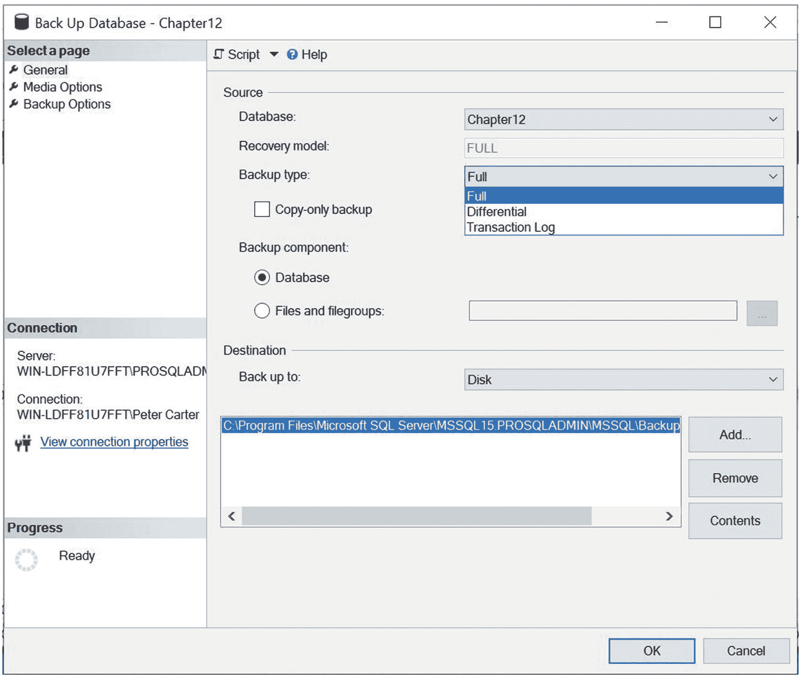

图 12-3：`常规`页面

在`数据库`下拉列表中，选择您希望备份的数据库，在`备份类型`下拉菜单中，选择执行完全备份、差异备份或事务日志备份。`仅复制备份`复选框允许您执行一个不影响恢复序列的备份。因此，如果您进行一次仅复制完全备份，它不会影响差异基准。这意味着`DIFF`页面不会被重置。进行一次仅复制日志备份不会影响日志归档点，因此日志不会被截断。进行仅复制日志备份在某些在线恢复场景中可能很有用。无法进行仅复制差异备份。

如果您在`备份组件`部分选择了完全或差异备份，请选择是备份整个数据库还是特定的文件和文件组。选择`文件和文件组`单选按钮将显示“选择文件和文件组”对话框，如图 12-4 所示。在这里，您可以选择单个文件或整个文件组进行备份。

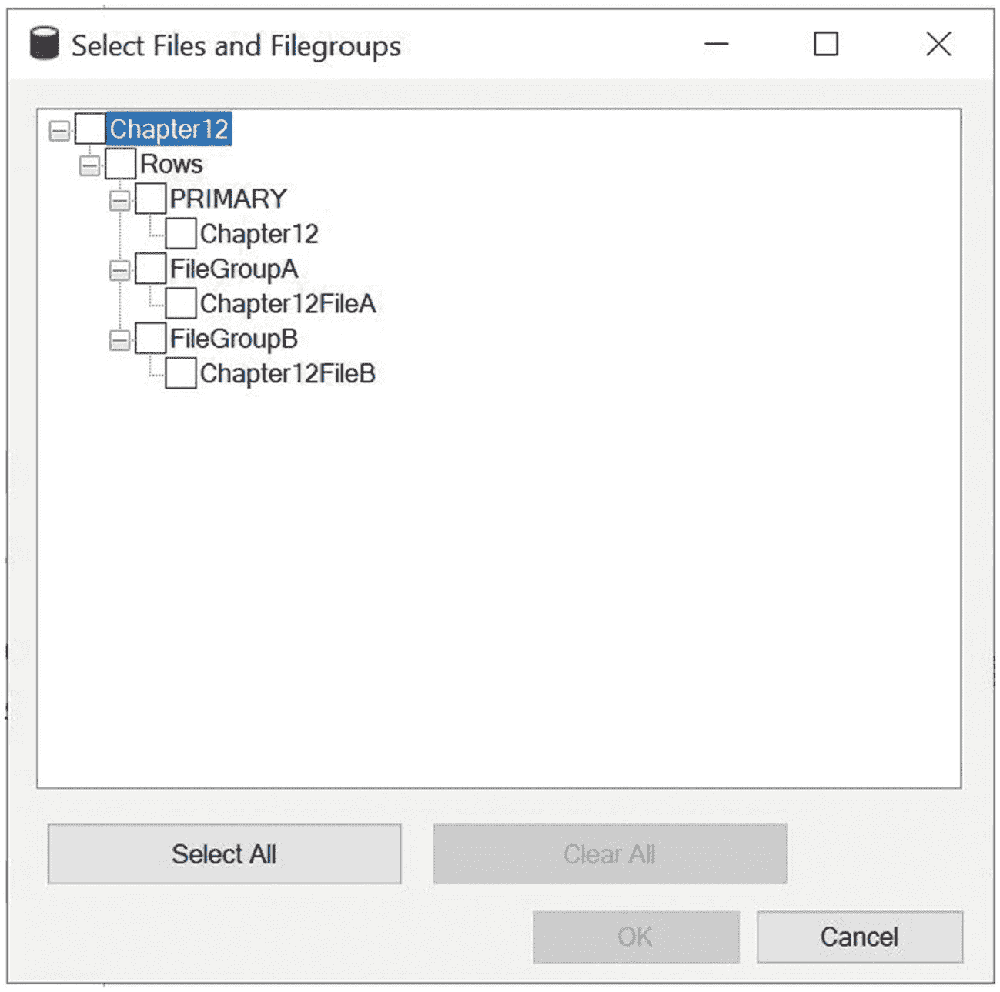

图 12-4：`选择文件和文件组`对话框

在屏幕的`备份到`部分，您可以从下拉列表中选择`磁带`、`磁盘`或`URL`，然后使用`添加`和`删除`按钮来指定构成媒体集定义的备份设备。最多可以指定 64 个备份设备。备份设备可以包含多个备份（备份集），当您单击`内容`按钮时，将显示备份设备中包含的每个备份集的详细信息。

在`媒体选项`页面上，您可以指定是要使用现有媒体集还是新建一个。如果选择使用现有媒体集，则指定是要覆盖媒体集的内容还是向媒体集追加新的备份集。如果选择新建媒体集，则可以指定媒体集的名称，以及可选的描述。如果使用现有媒体集，您可以验证媒体集和备份集的过期日期和时间。这些检查可能会导致备份集被追加到现有备份设备，而不是覆盖备份集。

在`可靠性`部分，指定备份完成后是否应进行验证。这通常是个好主意，特别是如果您备份到`URL`，因为通过网络的备份容易损坏。选择`写入媒体前执行校验和`选项会在每个数据库页面写入备份设备之前验证其页面校验和。这会导致备份操作使用额外的资源，但如果您没有像执行备份那样频繁地运行`DBCC CHECKDB`，那么此选项可以提前警告任何数据库损坏。（更多详情请参见第 9 章。）`遇到错误时继续`选项使得即使在页面验证过程中发现错误的校验和，备份也会继续进行。

在`备份选项`页面上，您可以设置备份集的过期日期，以及选择是否要压缩或加密备份集。对于压缩，您可以选择使用实例默认设置，或者通过专门选择压缩或不压缩来覆盖此设置。

如果选择加密备份，则需要选择一个预先存在的证书。（您可以在第 11 章中找到有关如何创建证书的详细信息。）然后，您需要选择用于加密备份的算法。`SQL Server 2019`中的可用算法是`AES 128`、`AES 192`、`AES 256`或`3DES (Triple_DES_3Key)`。您通常应选择`AES`算法，因为对`3DES`的支持将在未来版本的`SQL Server`中移除。


#### 通过 T-SQL 进行备份

当您通过 T-SQL 备份数据库或日志时，可以指定许多参数。这些参数可以分为以下几类：

##### 杂项选项

| 参数 | 描述 |
| --- | --- |
| `BUFFERCOUNT` | 备份操作使用的 IO 缓冲区总数。 |
| `MAXTRANSFERSIZE` | SQL Server 与备份媒体之间可能的最大传输单元，以字节为单位指定。 |
| `STATS` | 指定应多久显示一次进度消息。默认设置是每完成 10% 显示一条进度消息。 |

##### 日志特定选项

| 参数 | 描述 |
| --- | --- |
| `NORECOVERY/STANDBY` | `NORECOVERY` 使数据库在备份完成后保持还原状态，用户无法访问。`STANDBY` 使数据库在备份完成后保持只读状态。`STANDBY` 要求您指定事务撤消文件的路径和文件名，因此应使用格式 `STANDBY = transaction_undo_file`。如果未指定任一选项，则数据库在备份完成后将保持联机状态。 |
| `NO_TRUNCATE` | 指定即使数据库不处于健康状态，也应尝试进行日志备份。它也不会尝试截断日志的非活动部分。执行尾日志备份涉及使用指定的 `NORECOVERY` 和 `NO_TRUNCATE` 来备份日志。 |

##### 错误管理选项

| 参数 | 描述 |
| --- | --- |
| `CHECKSUM/NO_CHECKSUM` | 指定在将每个页面写入媒体集之前是否应验证其页面校验和。 |
| `CONTINUE_AFTER_ERROR/STOP_ON_ERROR` | `STOP_ON_ERROR` 是默认行为，如果在验证页面校验和时发现错误的校验和，则会导致备份失败。`CONTINUE_AFTER_ERROR` 允许在发现错误校验和时继续进行备份。 |

##### 媒体集选项

| 参数 | 描述 |
| --- | --- |
| `INIT/NOINIT` | `INIT` 尝试覆盖媒体集中现有的备份集，但保留媒体头完整。除非指定了 `SKIP`，否则它会首先检查备份集的名称和过期日期。`NOINIT` 将备份集追加到媒体集，这是默认行为。 |
| `SKIP/NOSKIP` | `SKIP` 导致跳过对备份集名称和过期日期的 `INIT` 检查。`NOSKIP` 强制执行这些检查，这是默认行为。 |
| `FORMAT/NOFORMAT` | `FORMAT` 导致媒体头被覆盖，使媒体集中的任何备份集都不可用。这实质上是创建一个新的媒体集。不检查备份集名称和过期日期。`NOFORMAT` 保留现有的媒体头，这是默认行为。 |
| `MEDIANAME` | 指定媒体集的名称。 |
| `MEDIADESCRIPTION` | 添加媒体集的描述。 |
| `BLOCKSIZE` | 指定用于备份的块大小（以字节为单位）。`BLOCKSIZE` 对于磁盘和 URL 默认为 512，对于磁带默认为 65,536。 |

##### 备份集选项

| 参数 | 描述 |
| --- | --- |
| `COPY_ONLY` | 指定应对数据库或日志进行 `copy_only` 备份。如果您执行差异备份，则忽略此选项。 |
| `COMPRESSION/NO COMPRESSION` | 默认情况下，SQL Server 根据实例级设置决定是否应压缩备份。（可以在 `sys.configurations` 中查看这些设置。）但是，您可以通过根据需要指定 `COMPRESSION` 或 `NO COMPRESSION` 来覆盖此设置。备份压缩仅在 SQL Server Enterprise、Business Intelligence 和 Standard Editions 中可用。 |
| `NAME` | 为备份集指定名称。 |
| `DESCRIPTION` | 向备份集添加描述。 |
| `EXPIRYDATE/RETAINEDDAYS` | 使用 `EXPIRYDATE = datetime` 指定备份集过期的确切日期和时间。在此日期之后，备份集可以被覆盖。指定 `RETAINDAYS = int` 以指定备份集过期前的天数。 |

##### WITH 选项

| 参数 | 描述 |
| --- | --- |
| `CREDENTIAL` | 备份到 Windows Azure Blob 时使用。 |
| `DIFFERENTIAL` | 指定应执行差异备份。如果省略此选项，则执行完整备份。 |
| `ENCRYPTION` | 指定用于备份加密的算法。如果不打算加密备份，则可以指定 `NO_ENCRYPTION`，这是默认选项。备份加密仅在 SQL Server Enterprise、Business Intelligence 和 Standard Editions 中可用。 |
| `encryptor_name` | 加密程序的名称，格式为 `SERVER CERTIFICATE = encryptor name` 或 `SERVER ASYMMETRIC KEY = encryptor name`。 |

##### 备份选项

| 参数 | 描述 |
| --- | --- |
| `DATABASE/LOG` | 指定 `DATABASE` 以执行完整或差异备份。指定 `LOG` 以执行事务日志备份。 |
| `database_name` | 要执行备份操作的数据库名称。也可以是包含数据库名称的变量。 |
| `file_or_filegroup` | 要备份的文件或文件组的逗号分隔列表，格式为 `FILE = logical file name` 或 `FILEGROUP = Logical filegroup name`。 |
| `READ_WRITE_FILEGROUPS` | 通过备份所有读/写文件组来执行部分备份。可选地，在此子句后使用逗号分隔的 `FILEGROUP = syntax` 添加只读文件组。 |
| `TO` | 要条带化备份集的备份设备的逗号分隔列表，语法为 `DISK = physical device`、`TAPE = physical device` 或 `URL = physical device`。 |
| `MIRROR TO` | 要镜像备份集的备份设备的逗号分隔列表。如果使用 `MIRROR TO` 子句，则指定的备份设备数量必须等于 `TO` 子句中指定的备份设备数量。 |

*   备份选项（在表 12-1 中描述）。
*   `WITH` 选项（在表 12-2 中描述）。
*   备份集选项（在表 12-3 中描述）。
*   媒体集选项（在表 12-4 中描述）。
*   错误管理选项（在表 12-5 中描述）。
*   磁带选项已弃用多个版本，不应使用。因此，本章省略了磁带选项的详细信息。
*   日志特定选项（在表 12-6 中描述）。
*   杂项选项（在表 12-7 中描述）。

为了执行我们之前通过 GUI 演示的 `Chapter12` 数据库的完整数据库备份，我们可以使用清单 12-4 中的命令。在运行此脚本之前，请修改备份设备的路径以满足您系统的配置。

```sql
BACKUP DATABASE Chapter12
TO  DISK = 'H:\MSSQL\Backup\Chapter12.bak'
WITH  RETAINDAYS = 90
, FORMAT
, INIT
, MEDIANAME = 'Chapter12'
, NAME = 'Chapter12-Full Database Backup'
, COMPRESSION ;
GO
```
清单 12-4：执行完整备份

如果我们想要对 `Chapter12` 数据库执行差异备份并将备份追加到同一媒体集，我们可以在语句中添加 `WITH DIFFERENTIAL` 选项，如清单 12-5 所示。在运行此脚本之前，请修改备份设备的路径以满足您系统的配置。

```sql
BACKUP DATABASE Chapter12
TO  DISK = 'H:\MSSQL\Backup\Chapter12.bak'
WITH  DIFFERENTIAL
, RETAINDAYS = 90
, NOINIT
, MEDIANAME = 'Chapter12'
, NAME = 'Chapter12-Diff Database Backup'
, COMPRESSION ;
GO
```
清单 12-5：执行差异备份


### 数据库恢复

您可以通过 SSMS 或 T-SQL 来恢复数据库。我们将在以下章节探讨这两种选项。

#### 在 SQL Server Management Studio 中恢复

要在 SSMS 中开始恢复，请在`对象资源管理器`中的`数据库`上右键点击上下文菜单，选择`还原数据库`。这将显示`还原数据库`对话框的`常规`页，如图 12-5 所示。从下拉列表中选择要还原的数据库，会自动填充选项卡的其余部分。

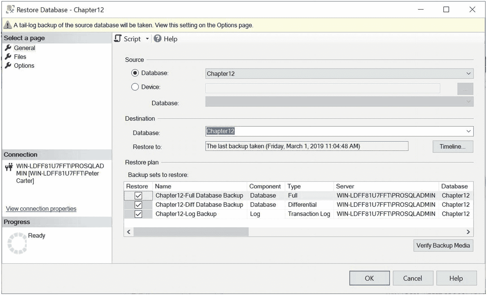
**图 12-5**
`常规`页

您可以看到，`Chapter12`媒体集的内容显示在该页面的`要还原的备份集`窗格中。在这种情况下，我们可以看到`Chapter12`媒体集的内容。`还原`复选框允许您选择希望还原的备份集。

`时间线`按钮以图形方式显示了每个备份集的创建时间，如图 12-6 所示。这使您可以轻松地根据所选还原的备份集查看可能面临的数据丢失风险。在`时间线`窗口中，您还可以指定是希望恢复到日志结尾，还是希望恢复到特定的日期/时间。

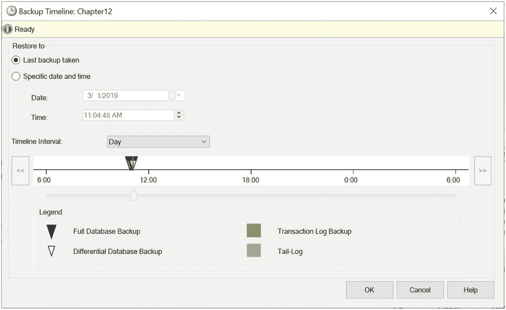
**图 12-6**
`备份时间线`页

点击`常规`页上的`验证备份媒体`按钮，将执行 `RESTORE WITH VERIFYONLY` 操作。此操作仅验证备份媒体而不尝试还原。为此，它执行以下检查：

*   备份集是完整的。
*   所有备份设备都可读。
*   `CHECKSUM` 有效（仅在备份操作期间指定了 `WITH CHECKSUM` 时适用）。
*   页头已验证。
*   目标还原卷上有足够的空间用于还原备份。

在`文件`页上，如图 12-7 所示，您可以选择还原每个文件的不同位置。默认行为是将文件还原到当前位置。您可以使用每个文件旁边的省略号 (...) 为每个单独的文件指定不同的位置，或者您可以使用`将所有文件重新定位到文件夹`选项为所有数据文件指定一个文件夹，并为所有日志文件指定一个文件夹。

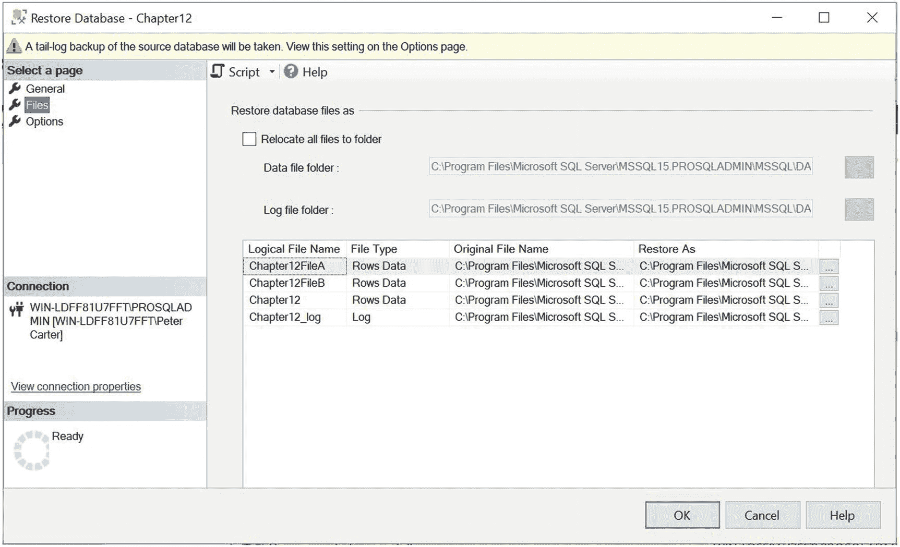
**图 12-7**
`文件`页

在`选项`页上，如图 12-8 所示，您可以指定计划使用的还原选项。在该页面的`还原选项`部分，您可以指定是要覆盖现有数据库、保留数据库内的复制设置（如果您正在配置日志传送以与复制一起使用，则应使用此选项），以及以受限访问权限还原数据库。最后一个选项使得数据库在还原完成后仅对管理员和 `db_owner` 及 `db_creator` 角色的成员可访问。如果您想在让数据库对用户可用之前验证数据或执行任何数据修复，这会很有帮助。

在`还原选项`部分，您还可以指定数据库的恢复状态。使用 `RECOVERY` 选项恢复数据库会在恢复完成时将数据库置于在线状态。`NORECOVERY` 会使数据库保持正在还原状态，这意味着可以应用更多备份。`STANDBY` 会使数据库在线但使其处于只读状态。如果您正在故障转移到辅助服务器，此选项可能很有用。如果您选择此选项，还可以指定`事务撤消`文件的位置。

#### 提示

如果您在还原第一个备份文件时指定了 `WITH PARTIAL`，即使您使用 `WITH RECOVERY` 进行还原，也能够应用其他备份。但是，GUI 不支持分段还原。本章后面将讨论通过 T-SQL 执行分段还原。

在屏幕的`尾日志备份`部分，您可以选择尝试在还原操作开始前进行尾日志备份，如果您选择这样做，可以选择让数据库保持正在还原状态。即使数据库已损坏，尾日志备份也可能是可行的。将源数据库保持在正在还原状态本质上是一种安全状态，以降低数据丢失的风险。如果您选择进行尾日志备份，还可以指定要使用的备份设备的文件路径。您还可以指定是否要在还原开始前关闭到目标数据库的现有连接，以及是否希望在还原每个单独备份集之前收到提示。

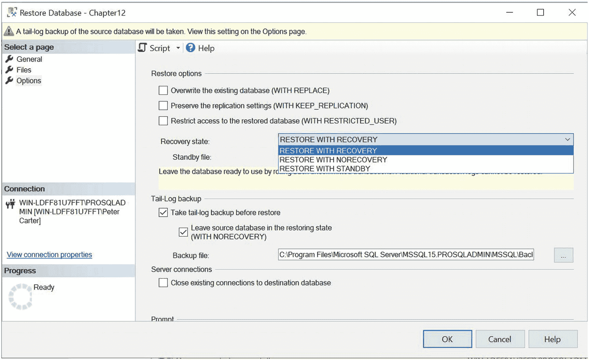
**图 12-8**
`选项`页

如果我们想要备份 `Chapter12` 数据库的事务日志，并再次将备份集追加到同一媒体集，可以使用清单 12-6 中的命令。在运行此脚本前，请修改备份设备的路径以符合您系统的配置。

```sql
BACKUP LOG Chapter12
TO  DISK = 'H:\MSSQL\Backup\Chapter12.bak'
WITH  RETAINDAYS = 90
, NOINIT
, MEDIANAME = 'Chapter12'
, NAME = 'Chapter12-Log Backup'
, COMPRESSION ;
GO
```
**清单 12-6**
执行事务日志备份

#### 提示

在企业场景中，您可能希望将完整备份、差异备份和日志备份存储在不同的文件夹中，以便在管理员查找要恢复的文件时提供帮助。

如果我们正在实施文件组备份策略，并且只想备份 `FileGroupA`，可以使用清单 12-7 中的命令。我们为此备份集创建一个新的媒体集。在运行此脚本前，请修改备份设备的路径以符合您系统的配置。

```sql
BACKUP DATABASE Chapter12 FILEGROUP = 'FileGroupA'
TO  DISK = 'H:\MSSQL\Backup\Chapter12FGA.bak'
WITH  RETAINDAYS = 90
, FORMAT
, INIT
, MEDIANAME = 'Chapter12FG'
, NAME = 'Chapter12-Full Database Backup-FilegroupA'
, COMPRESSION ;
GO
```
**清单 12-7**
执行文件组备份

要重复 `Chapter12` 的完整备份，但将备份集条带化跨两个备份设备，可以使用清单 12-8 中的命令。这有助于提高备份的吞吐量。在运行此脚本前，您应修改备份设备的路径以符合您系统的配置。

```sql
BACKUP DATABASE Chapter12
TO  DISK = 'H:\MSSQL\Backup\Chapter12Stripe1.bak',
DISK = 'G:\MSSQL\Backup\Chapter12Stripe2.bak'
WITH  RETAINDAYS = 90
, FORMAT
, INIT
, MEDIANAME = 'Chapter12Stripe'
, NAME = 'Chapter12-Full Database Backup-Stripe'
, COMPRESSION ;
GO
```
**清单 12-8**
使用多个备份设备

为了增加冗余，我们可以使用清单 12-9 中的命令创建镜像媒体集。在运行此脚本前，请修改备份设备的路径以符合您系统的配置。

```sql
BACKUP DATABASE Chapter12
TO  DISK = 'H:\MSSQL\Backup\Chapter12Stripe1.bak',
DISK = 'G:\MSSQL\Backup\Chapter12Stripe2.bak'
MIRROR TO DISK = 'J:\MSSQL\Backup\Chapter12Mirror1.bak',
DISK = 'K:\MSSQL\Backup\Chapter12Mirror2.bak'
WITH  RETAINDAYS = 90
, FORMAT
, INIT
, MEDIANAME = 'Chapter12Mirror'
, NAME = 'Chapter12-Full Database Backup-Mirror'
, COMPRESSION ;
GO
```
**清单 12-9**
使用镜像媒体集


#### 通过 T-SQL 还原

在 T-SQL 中使用 `RESTORE` 命令时，除了还原数据库外，还可使用表 12-8 中详述的选项。

##### 表 12-8：还原选项

| 还原选项 | 描述 |
| --- | --- |
| `RESTORE FILELISTONLY` | 返回备份设备中所有文件的列表。 |
| `RESTORE HEADERONLY` | 返回备份设备中所有备份集的备份头信息。 |
| `RESTORE LABELONLY` | 返回有关备份设备所属的介质集和介质家族的信息。 |
| `RESTORE REWINDONLY` | 关闭并倒回磁带。仅当备份设备是磁带时有效。 |
| `RESTORE VERIFYONLY` | 检查所有备份设备是否存在且可读。同时执行其他高级验证检查，例如确保目标驱动器上有足够空间、检查 `CHECKSUM`（如果备份时使用了 `CHECKSUM`）以及检查关键的页头字段。 |

使用 `RESTORE` 命令执行还原时，可以使用许多参数来实现多种还原场景。这些参数可分为以下几类：

##### 表 12-14：杂项选项

| 参数 | 描述 |
| --- | --- |
| `BUFFERCOUNT` | 用于还原操作的 IO 缓冲区总数。 |
| `MAXTRANSFERSIZE` | SQL Server 与备份介质之间可能的最大传输单元，以字节为单位。 |
| `STATS` | 指定应显示进度消息的频率。默认情况下，每完成 5% 显示一条进度消息。 |
| `FILESTREAM (DIRECTORY_NAME)` | 指定应将 `FILESTREAM` 数据还原到的文件夹名称。 |
| `KEEP_REPLICATION` | 保留复制设置。在配置日志传送与复制一起使用时，请使用此选项。 |
| `KEEP_CDC` | 在还原数据库时，保留其变更数据捕获 (CDC) 设置。仅当备份操作时启用了 CDC 才相关。 |
| `ENABLE_BROKER`/`ERROR_BROKER_CONVERSATIONS`/`NEW BROKER` | `ENABLE_BROKER` 指定还原操作完成后将启用 Service Broker 消息传递，以便可以立即发送消息。`ERROR_BROKER_CONVERSATIONS` 指定在启用消息传递之前，所有会话都将因错误消息而终止。`NEW_BROKER` 指定将移除会话而不引发错误，并为数据库分配一个新的 Service Broker 标识符。仅当创建备份时启用了 Service Broker 才相关。 |
| `STOPAT`/`STOPATMARK`/`STOPBEFOREMARK` | 用于时间点恢复，仅在 `FULL` 恢复模式下支持。`STOPAT` 指定一个日期时间值，该值将确定要还原的最后一个事务的时间。`STOPATMARK` 指定要还原到的 LSN（日志序列号）或标记事务的名称，这将是最终要还原的事务。`STOPBEFOREMARK` 还原到指定的 LSN 或标记事务之前的事务。 |

##### 表 12-13：错误管理选项

| 参数 | 描述 |
| --- | --- |
| `CHECKSUM`/`NOCHECKSUM` | 如果在备份操作期间指定了 `CHECKSUM`，那么在还原操作期间指定 `CHECKSUM` 将验证还原操作期间的页面完整性。指定 `NOCHECKSUM` 则会禁用此验证。 |
| `CONTINUE_AFTER_ERROR`/`STOP_ON_ERROR` | `STOP_ON_ERROR` 导致如果发现任何损坏的页面，则终止还原操作。`CONTINUE_AFTER_ERROR` 导致即使发现损坏页面，还原操作也会继续。 |

##### 表 12-12：介质集选项

| 参数 | 描述 |
| --- | --- |
| `MEDIANAME` | 如果使用此参数，则 `MEDIANAME` 必须与创建介质集时分配的介质集名称匹配。 |
| `MEDIAPASSWORD` | 如果要从使用 SQL Server 2008 或更早版本创建的介质集还原，并且在创建时为介质集指定了密码，则必须在还原操作期间使用此参数。 |
| `BLOCKSIZE` | 指定用于还原操作的块大小（以字节为单位），以覆盖磁带的默认值 65,536 或磁盘/URL 的默认值 512。 |

##### 表 12-11：备份集选项

| 参数 | 描述 |
| --- | --- |
| `FILE` | 指示要在介质集中使用的备份集的序号。 |
| `PASSWORD` | 如果要还原的备份是在 SQL Server 2008 或更早版本中创建的，并且在备份操作期间指定了密码，则需要使用此参数才能还原备份。 |

##### 表 12-10：WITH 选项

| 参数 | 描述 |
| --- | --- |
| `PARTIAL` | 表示这是逐步还原中的首次还原，本章稍后将讨论逐步还原。 |
| `RECOVERY`/`NORECOVERY`/`STANDBY` | 指定还原操作完成后数据库应处的状态。`RECOVERY` 表示数据库将处于联机状态。`NORECOVERY` 表示数据库将保持正在还原状态，以便可以应用后续还原。`STANDBY` 表示数据库将以只读模式联机。 |
| `MOVE` | 用于指定如果文件应还原到的文件系统位置与原始位置不同。 |
| `CREDENTIAL` | 在从 Windows Azure Blob 还原时使用。 |
| `REPLACE` | 如果实例上已存在与还原语句中指定的目标数据库同名的数据库，或者操作系统中已存在相同名称或位置的文件，则 `REPLACE` 表示应覆盖数据库或文件。 |
| `RESTART` | 表示如果还原操作中断，则应从该点重新启动。 |
| `RESTRICTED_USER` | 表示还原操作完成后，只有管理员以及 `db_owner` 和 `db_creator` 角色的成员才能访问数据库。 |

##### 表 12-9：还原参数

| 参数 | 描述 |
| --- | --- |
| `DATABASE`/`LOG` | 指定 `DATABASE` 以还原构成数据库的部分或全部文件。指定 `LOG` 以还原事务日志备份。 |
| `database_name` | 指定要还原的目标数据库的名称。 |
| `file_or_filegroup_or_pages` | 指定要还原的文件、文件组或页面的逗号分隔列表。如果还原页面，请使用格式 `PAGE = FileID:PageID`。在 `SIMPLE` 恢复模式下，只有文件或文件组是只读的，或者您正在使用 `WITH PARTIAL` 执行部分还原时，才能指定它们。 |
| `READ_WRITE_FILEGROUPS` | 还原所有读/写文件组，但不还原只读文件组。 |
| `FROM` | 包含要还原的备份集的备份设备的逗号分隔列表，或者您希望从中还原的数据库快照的名称。数据库快照将在第 16 章讨论。 |

- 还原参数（在表 12-9 中描述）
- `WITH` 选项（在表 12-10 中描述）
- 备份集选项（在表 12-11 中描述）
- 介质集选项（在表 12-12 中描述）
- 错误管理选项（在表 12-13 中描述）
- 杂项选项（在表 12-14 中描述）


要执行与通过 SSMS 执行的相同还原操作，我们使用清单 12-10 中的命令。在运行脚本前，请将备份设备的路径更改为符合你自身配置的路径。

```
USE master
GO
--备份日志尾部
BACKUP LOG Chapter12
TO  DISK = N'H:\MSSQL\Backup\Chapter12_LogBackup_2012-02-16_12-17-49.bak'
WITH NOFORMAT,
NAME = N'Chapter12_LogBackup_2012-02-16_12-17-49',
NORECOVERY,
STATS = 5 ;
--还原完整备份
RESTORE DATABASE Chapter12
FROM  DISK = N'H:\MSSQL\Backup\Chapter12.bak'
WITH  FILE = 1,
NORECOVERY,
STATS = 5 ;
--还原差异备份
RESTORE DATABASE Chapter12
FROM  DISK = N'H:\MSSQL\Backup\Chapter12.bak'
WITH  FILE = 2,
NORECOVERY,
STATS = 5 ;
--还原事务日志
RESTORE LOG Chapter12
FROM  DISK = N'H:\MSSQL\Backup\Chapter12.bak'
WITH  FILE = 3,
STATS = 5 ;
GO
清单 12-10
还原数据库
```

### 还原到时间点

为了演示将数据库还原到某个时间点，我们首先进行一系列备份，并在每次备份之间操作数据。清单 12-11 中的脚本首先创建 `Chapter12` 数据库的基础完整备份。然后在进行事务日志备份之前，向 `Addresses` 表插入一些行。接着，在截断该表之前，再向 `Addresses` 表插入一些行；最后，再进行一次事务日志备份。

```
USE Chapter12
GO
BACKUP DATABASE Chapter12
TO  DISK = 'H:\MSSQL\Backup\Chapter12PointinTime.bak'
WITH  RETAINDAYS = 90
, FORMAT
, INIT, SKIP
, MEDIANAME = 'Chapter12Point-in-time'
, NAME = 'Chapter12-Full Database Backup'
, COMPRESSION ;
INSERT INTO dbo.Addresses
VALUES('1 Carter Drive', 'Hedge End', 'Southampton', 'SO32 6GH')
,('10 Apress Way', NULL, 'London', 'WC10 2FG') ;
BACKUP LOG Chapter12
TO  DISK = 'H:\MSSQL\Backup\Chapter12PointinTime.bak'
WITH  RETAINDAYS = 90
, NOINIT
, MEDIANAME = 'Chapter12Point-in-time'
, NAME = 'Chapter12-Log Backup'
, COMPRESSION ;
INSERT INTO dbo.Addresses
VALUES('12 SQL Street', 'Botley', 'Southampton', 'SO32 8RT')
,('19 Springer Way', NULL, 'London', 'EC1 5GG') ;
TRUNCATE TABLE dbo.Addresses ;
BACKUP LOG Chapter12
TO  DISK = 'H:\MSSQL\Backup\Chapter12PointinTime.bak'
WITH  RETAINDAYS = 90
, NOINIT
, MEDIANAME = 'Chapter12Point-in-time'
, NAME = 'Chapter12-Log Backup'
, COMPRESSION ;
GO
清单 12-11
准备 Chapter12 数据库
```

设想在这个脚本中发生的一系列事件之后，我们发现 `Addresses` 表被错误地截断了，需要将其还原到紧接这次截断操作发生之前的点。为此，我们需要知道截断的确切时间，并还原到该日期/时间之前，或者更精确地说，我们需要找到发生截断操作的事务的 LSN，并还原到该事务之前。在这个演示中，我们选择后一种方法。

我们可以使用一个名为 `sys.fn_dump_dblog()` 的系统函数来显示包含第二个 INSERT 语句和表截断操作的最后一个日志备份的内容。该过程接受多达 68 个参数，并且**没有一个参数可以省略！**

第一和第二个参数允许你指定一个开始和结束的 LSN，用于筛选结果。这两个参数都可以设置为 `NULL` 以返回备份中的所有条目。第三个参数指定备份集是磁盘还是磁带，而第四个参数指定设备内备份集的序列 ID。接下来的 64 个参数接受介质集内的备份设备名称。如果介质集包含的设备少于 64 个，那么对于任何不需要的参数，你应使用 `DEFAULT` 值。

清单 12-12 中的脚本使用了未公开的 `fn_dump_dblog()` 系统函数来识别发生截断操作的自动提交事务的起始 LSN。这个函数的问题在于，它返回的 LSN 格式与 `RESTORE` 命令所需的格式不同。因此，计算列 `ConvertedLSN` 将 LSN 的三个部分从二进制转换为十进制，根据需要填充零，最后将它们连接回一起，生成一个可以传递给 `RESTORE` 操作的 LSN。

```
SELECT
CAST(
CAST(
CONVERT(VARBINARY, '0x'
+ RIGHT(REPLICATE('0', 8)
+ SUBSTRING([Current LSN], 1, 8), 8), 1
) AS INT
) AS VARCHAR(11)
) +
RIGHT(REPLICATE('0', 10) +
CAST(
CAST(
CONVERT(VARBINARY, '0x'
+ RIGHT(REPLICATE('0', 8)
+ SUBSTRING([Current LSN], 10, 8), 8), 1
) AS INT
) AS VARCHAR(10)), 10) +
RIGHT(REPLICATE('0',5) +
CAST(
CAST(CONVERT(VARBINARY, '0x'
+ RIGHT(REPLICATE('0', 8)
+ SUBSTRING([Current LSN], 19, 4), 8), 1
) AS INT
) AS VARCHAR
), 5) AS ConvertedLSN
,*
FROM
sys.fn_dump_dblog (
NULL, NULL, N'DISK', 3, N'H:\MSSQL\Backup\Chapter12PointinTime.bak'
DEFAULT, DEFAULT, DEFAULT, DEFAULT, DEFAULT, DEFAULT, DEFAULT,
DEFAULT, DEFAULT, DEFAULT, DEFAULT, DEFAULT, DEFAULT, DEFAULT,
DEFAULT, DEFAULT, DEFAULT, DEFAULT, DEFAULT, DEFAULT, DEFAULT,
DEFAULT, DEFAULT, DEFAULT, DEFAULT, DEFAULT, DEFAULT, DEFAULT,
DEFAULT, DEFAULT, DEFAULT, DEFAULT, DEFAULT, DEFAULT, DEFAULT,
DEFAULT, DEFAULT, DEFAULT, DEFAULT, DEFAULT, DEFAULT, DEFAULT,
DEFAULT, DEFAULT, DEFAULT, DEFAULT, DEFAULT, DEFAULT, DEFAULT,
DEFAULT, DEFAULT, DEFAULT, DEFAULT, DEFAULT, DEFAULT, DEFAULT,
DEFAULT, DEFAULT, DEFAULT, DEFAULT, DEFAULT, DEFAULT, DEFAULT)
WHERE [Transaction Name] = 'TRUNCATE TABLE' ;
清单 12-12
查找截断操作的 LSN
```

既然我们已经找到了截断 `Addresses` 表的事务的 LSN，我们就可以将 `Chapter12` 数据库还原到这个时间点。清单 12-13 中的脚本完整地还原了完整备份和第一个事务日志备份。然后还原最后一个事务日志，但使用 `STOPBEFOREMARK` 参数来指定不应还原的第一个 LSN。在运行脚本前，请根据你自己的配置更改备份设备的位置。你还应该将 LSN 替换为你使用 `sys.fn_dump_dblog()` 生成的 LSN。

```
USE master
GO
RESTORE DATABASE Chapter12
FROM  DISK = N'H:\MSSQL\Backup\Chapter12PointinTime.bak'
WITH  FILE = 1
,  NORECOVERY
,  STATS = 5
, REPLACE ;
RESTORE LOG Chapter12
FROM  DISK = N'H:\MSSQL\Backup\Chapter12PointinTime.bak'
WITH  FILE = 2
,  NORECOVERY
,  STATS = 5
, REPLACE ;
RESTORE LOG Chapter12
FROM  DISK = N'H:\MSSQL\Backup\Chapter12PointinTime.bak'
WITH  FILE = 3
,  STATS = 5
, STOPBEFOREMARK = 'lsn:35000000036000001'
, RECOVERY
, REPLACE ;
清单 12-13
还原到时间点
```

### 还原文件和页面

能够还原文件组、文件甚至页面，使你在灾难恢复场景中拥有极大的控制力和灵活性。以下部分演示如何执行文件还原和页面还原。


#### 恢复文件

您可能会遇到数据库中只有某些文件或文件组损坏的情况。如果出现这种情况，并且您拥有从进行文件或文件组备份时到日志结尾之间完整的日志链，则可以仅恢复损坏的文件。为了演示此功能，我们首先在备份主文件组和 `FileGroupA` 之前，向 `Chapter12` 数据库的 `Contacts` 表中插入一些行。然后，在进行事务日志备份之前，我们向位于 `FileGroupB` 上的 `Addresses` 表中插入一些行。这些任务由清单 12-14 中的脚本执行。

```sql
INSERT INTO dbo.Contacts
VALUES('Peter', 'Carter', 1),
('Danielle', 'Carter', 1) ;
BACKUP DATABASE Chapter12 FILEGROUP = N'PRIMARY',  FILEGROUP = N'FileGroupA'
TO  DISK = N'H:\MSSQL\Backup\Chapter12FileRestore.bak'
WITH FORMAT
, NAME = N'Chapter12-Filegroup Backup'
, STATS = 10 ;
INSERT INTO dbo.Addresses
VALUES('SQL House', 'Server Buildings', NULL, 'SQ42 4BY'),
('Carter Mansions', 'Admin Road', 'London', 'E3 3GJ') ;
BACKUP LOG Chapter12
TO  DISK = N'H:\MSSQL\Backup\Chapter12FileRestore.bak'
WITH NOFORMAT
, NOINIT
,  NAME = N'Chapter12-Log Backup'
, NOSKIP
, STATS = 10 ;
```
清单 12-14 准备数据库

如果我们假设 `Chapter12FileA` 已损坏，即使我们没有 `Chapter12FileB` 的相应备份，也能够恢复此文件，并通过使用清单 12-15 中的脚本恢复到最新时间点。此脚本先对文件 `Chapter12FileA` 执行文件恢复，然后进行事务日志的尾日志备份，最后按顺序应用所有事务日志。在运行此脚本前，请更改备份设备的位置以反映您自己的配置。

#### 注意

如果我们没有进行尾日志备份，那么我们将无法再访问 `Contacts` 表（位于 `FileGroupB` 中），除非我们也能恢复 `Chapter12FileB` 文件。

```sql
USE master
GO
RESTORE DATABASE Chapter12 FILE = N'Chapter12FileA'
FROM  DISK = N'H:\MSSQL\Backup\Chapter12FileRestore.bak'
WITH  FILE = 1
, NORECOVERY
, STATS = 10
, REPLACE ;
GO
BACKUP LOG Chapter12
TO  DISK = N'H:\MSSQL\Backup\Chapter12_LogBackup_2012-02-17_12-26-09.bak'
WITH NOFORMAT
, NOINIT
,  NAME = N'Chapter12_LogBackup_2012-02-17_12-26-09'
, NOSKIP
, NORECOVERY
,  STATS = 5 ;
RESTORE LOG Chapter12
FROM  DISK = N'H:\MSSQL\Backup\Chapter12FileRestore.bak'
WITH  FILE = 2
, STATS = 10
, NORECOVERY ;
RESTORE LOG Chapter12
FROM  DISK = N'H:\MSSQL\Backup\Chapter12_LogBackup_2012-02-17_12-26-09.bak'
WITH FILE = 1
, STATS = 10
, RECOVERY ;
GO
```
清单 12-15 恢复文件

#### 恢复页面

如果页面损坏，则可以恢复此页面，而不是恢复整个文件甚至整个数据库。在轻微的灾难恢复场景中，这可以显著减少停机时间。为了演示此功能，我们首先对 `Chapter12` 数据库进行完整备份，然后使用未公开的 `DBCC WRITEPAGE` 命令在 `Contacts` 表的某个页面上制造损坏。这些步骤在清单 12-16 中执行。

#### 注意

`DBCC WRITEPAGE` 在此仅供教学使用。它未公开，且极其危险。绝不应在生产系统上使用，并且只应在任何数据库上极其谨慎地使用。

```sql
--Back up the database
BACKUP DATABASE Chapter12
TO  DISK = N'H:\MSSQL\Backup\Chapter12PageRestore.bak'
WITH FORMAT
, NAME = N'Chapter12-Full Backup'
, STATS = 10 ;
--Corrupt a page in the Contacts table
ALTER DATABASE Chapter12 SET SINGLE_USER WITH NO_WAIT ;
GO
DECLARE @SQL NVARCHAR(MAX)
SELECT @SQL = 'DBCC WRITEPAGE(' +
(
SELECT CAST(DB_ID('Chapter12') AS NVARCHAR)
) +
', ' +
(
SELECT TOP 1 CAST(file_id AS NVARCHAR)
FROM dbo.Contacts
CROSS APPLY sys.fn_PhysLocCracker(%%physloc%%)
) +
', ' +
(
SELECT TOP 1 CAST(page_id AS NVARCHAR)
FROM dbo.Contacts
CROSS APPLY sys.fn_PhysLocCracker(%%physloc%%)
) +
', 2000, 1, 0x61, 1)' ;
EXEC(@SQL) ;
ALTER DATABASE Chapter12 SET MULTI_USER ;
GO
```
清单 12-16 准备数据库

在运行脚本后，如果我们尝试访问 `Contacts` 表，会收到一条警告我们存在基于逻辑一致性的 I/O 错误的错误消息，并且语句会失败。错误消息还提供了损坏页面的详细信息，我们可以在 `RESTORE` 语句中使用这些信息。为了解决这个问题，我们可以运行清单 12-17 中的脚本。该脚本先恢复损坏的页面，然后进行尾日志备份，最后应用尾日志。在运行脚本前，请修改备份设备的位置以反映您的配置。您还应该更新 `PageID` 以反映您版本的 `Chapter12` 数据库中损坏的页面。以 `FileID:PageID` 格式指定要恢复的页面。

#### 提示

损坏页面的详细信息也可以在 `MSDB.dbo.suspect_pages` 中找到。

```sql
USE Master
GO
RESTORE DATABASE Chapter12 PAGE='3:8'
FROM  DISK = N'H:\MSSQL\Backup\Chapter12PageRestore.bak'
WITH  FILE = 1
, NORECOVERY
,  STATS = 5 ;
BACKUP LOG Chapter12
TO  DISK = N'H:\MSSQL\Backup\Chapter12_LogBackup_2012-02-17_16-47-46.bak'
WITH NOFORMAT, NOINIT
, NAME = N'Chapter12_LogBackup_2012-02-17_16-32-46'
, NOSKIP
, STATS = 5 ;
RESTORE LOG Chapter12
FROM  DISK = N'H:\MSSQL\Backup\Chapter12_LogBackup_2012-02-17_16-47-46.bak'
WITH  STATS = 5
, RECOVERY ;
GO
```
清单 12-17 恢复页面


### 分段还原

分段还原是指逐个将数据库的文件组联机。这对于大型数据库来说好处显著，因为你可以让部分数据先可用，而其他数据仍在还原过程中。为了演示此技术，我们首先对 `Chapter12` 数据库中的所有文件组进行文件组备份，然后进行一次事务日志备份。清单 12-18 中的脚本执行此任务。运行脚本前，请修改备份设备的位置以符合你自己的配置。

```
BACKUP DATABASE Chapter12
FILEGROUP = N'PRIMARY',  FILEGROUP = N'FileGroupA',  FILEGROUP = N'FileGroupB'
TO  DISK = N'H:\MSSQL\Backup\Chapter12Piecemeal.bak'
WITH FORMAT
, NAME = N'Chapter12-Fiegroup Backup'
, STATS = 10 ;
BACKUP LOG Chapter12
TO  DISK = N'H:\MSSQL\Backup\Chapter12Piecemeal.bak'
WITH NOFORMAT, NOINIT
,  NAME = N'Chapter12-Full Database Backup'
,  STATS = 10 ;
```
清单 12-18 文件组备份

清单 12-19 中的脚本现在将文件组逐个联机，从主文件组开始，然后是 `FileGroupA`，最后是 `FileGroupB`。在开始还原之前，我们先备份日志尾部。每个文件组还原后，此备份将使用 `WITH RECOVERY` 进行还原。这会使还原的数据库重新联机。由于我们在第一个还原操作中指定了 `PARTIAL` 选项，因此可以进一步还原其他备份。

```
USE master
GO
BACKUP LOG Chapter12
TO  DISK = N'H:\MSSQL\Backup\Chapter12_LogBackup_2012-02-17_27-29-46.bak'
WITH NOFORMAT, NOINIT
, NAME = N'Chapter12_LogBackup_2012-02-17_17-29-46'
, NOSKIP
, NORECOVERY
, NO_TRUNCATE
, STATS = 5 ;
RESTORE DATABASE Chapter12
FILEGROUP = N'PRIMARY'
FROM  DISK = N'H:\MSSQL\Backup\Chapter12Piecemeal.bak'
WITH  FILE = 1
, NORECOVERY
, PARTIAL
, STATS = 10 ;
RESTORE LOG Chapter12
FROM  DISK = N'H:\MSSQL\Backup\Chapter12Piecemeal.bak'
WITH  FILE = 2
, NORECOVERY
, STATS = 10 ;
RESTORE LOG Chapter12
FROM  DISK = N'H:\MSSQL\Backup\Chapter12_LogBackup_2012-02-17_27-29-46.bak'
WITH  FILE = 1
, STATS = 10
, RECOVERY ;
-----------------主文件组现已联机--------------------
RESTORE DATABASE Chapter12
FILEGROUP = N'FileGroupA'
FROM  DISK = N'H:\MSSQL\Backup\Chapter12Piecemeal.bak'
WITH  FILE = 1
, NORECOVERY
, STATS = 10 ;
RESTORE LOG Chapter12
FROM  DISK = N'H:\MSSQL\Backup\Chapter12Piecemeal.bak'
WITH  FILE = 2
, NORECOVERY
, STATS = 10 ;
RESTORE LOG Chapter12
FROM  DISK = N'H:\MSSQL\Backup\Chapter12_LogBackup_2012-02-17_27-29-46.bak'
WITH  FILE = 1
, STATS = 10
, RECOVERY ;
-----------------FileGroupA 文件组现已联机--------------------
RESTORE DATABASE Chapter12
FILEGROUP = N'FileGroupB'
FROM  DISK = N'H:\MSSQL\Backup\Chapter12Piecemeal.bak'
WITH  FILE = 1
, NORECOVERY
, STATS = 10 ;
RESTORE LOG Chapter12
FROM  DISK = N'H:\MSSQL\Backup\Chapter12Piecemeal.bak'
WITH  FILE = 2
, NORECOVERY
, STATS = 10 ;
RESTORE LOG Chapter12
FROM  DISK = N'H:\MSSQL\Backup\Chapter12_LogBackup_2012-02-17_27-29-46.bak'
WITH  FILE = 1
, STATS = 10
, RECOVERY ;
-----------------数据库现已完全联机--------------------
```
清单 12-19 分段还原

### 总结

SQL Server 数据库可以在三种恢复模式下运行。`SIMPLE` 恢复模式会在 `CHECKPOINT` 操作发生后自动截断事务日志。这意味着无法进行日志备份，因此也不支持时间点还原。在 `FULL` 恢复模式下，事务日志仅在执行日志备份操作后才会被截断。这意味着你必须同时进行事务日志备份以用于灾难恢复和日志空间管理。`BULK LOGGED` 恢复模式仅在进行批量插入操作时使用。也就是说，如果你通常使用 `FULL` 恢复模式，则仅在执行此类操作时切换到此模式。

SQL Server 支持三种备份类型。完整备份将所有数据库页复制到备份设备。差异备份将自上次完整备份以来所有已修改的数据库页复制到备份设备。事务日志备份则将事务日志的内容复制到备份设备。

数据库管理员可以采用多种备份策略，以便在发生需要还原数据库的灾难时提供尽可能最佳的恢复时间目标（RTO）和恢复点目标（RPO）。这些策略包括：仅执行完整备份（适用于 `SIMPLE` 恢复模式）；安排完整备份与事务日志备份一起进行；或者安排完整备份、差异备份和事务日志备份。如果频繁进行日志备份，安排差异备份有助于改善数据库的 RTO。数据库管理员也可以选择实施文件组备份策略；这允许他们将备份分散到更易管理的时间窗口中，或执行部分备份（即仅备份读/写文件组）。

可以通过 T-SQL 或 SQL Server Management Studio (SSMS) 进行临时备份。在生产环境中，你通常需要安排定期运行的备份，我们将在第 22 章讨论如何自动化此操作。

你也可以通过 SSMS 或 T-SQL 执行还原。但是，只有通过 T-SQL 才能执行复杂的还原场景，例如分段还原。SQL Server 还为你提供了还原单个页面或文件的能力。你可以将还原损坏页面作为联机操作进行，通常，对于小规模的损坏，这比还原整个数据库或使用带有 `ALLOW_DATA_LOSS` 选项的 `DBCC CHECKDB` 提供了更好的替代方案。有关 `DBCC CHECKDB` 的更多详细信息，请参见第 9 章。

#### 提示

许多其他还原场景超出了本书的范围，因为全面描述每种可能场景本身就值得单独成书。我鼓励你在沙盒环境中探索各种还原场景，以备将来实际使用之需！

# 13. 高可用性与灾难恢复概念

在当今运行关键业务应用程序的 7×24 小时环境中，企业严重依赖于其数据的可用性。尽管服务器及其软件通常是可靠的，但始终存在硬件故障或软件缺陷的风险，这两者都可能导致服务器宕机。为了减轻这些风险，关键业务应用程序通常依赖冗余硬件来提供容错能力。如果主系统发生故障，应用程序可以自动故障转移到冗余系统。这是高可用性（HA）的基本原理。

即使实施了 HA 技术，仍然存在导致应用程序不可用的小概率事件风险。这可能是由于重大事件，例如自然灾害或恐怖行为导致数据中心的损毁。也可能是由于数据损坏或人为错误，导致应用程序数据丢失或损坏到无法修复的程度。

在这些情况下，一些应用程序可能依赖于还原最新的备份以尽可能多地恢复数据。然而，更关键的应用程序可能需要一台冗余服务器在辅助位置保存数据的同步副本。这是灾难恢复（DR）的核心概念。本章首先讨论 HA 和 DR 背后的概念，然后概述可用于实现这些概念的技术。

### 可用性概念

为了分析应用程序的 HA 和 DR 需求并实施最合适的解决方案，你需要理解各种概念。我们将在以下章节中讨论这些概念。


### 可用性级别

解决方案对最终用户的可用时间量被称为`可用性级别`或`运行时间`。为了真实反映运行时间，公司应从用户桌面的角度来衡量解决方案的可用性。换句话说，即使您的 SQL Server 已连续运行超过一个月，用户仍可能因其他因素而经历解决方案中断。这些因素可能包括网络中断或应用程序服务器故障。

然而，在某些情况下，您别无选择，只能在 SQL Server 级别衡量可用性级别。这可能是因为企业内部缺乏整体监控工具。但更常见的是，在实例级别衡量可用性级别的要求是出于政治原因，而非技术原因。在 IT 行业，将数据中心管理外包给第三方提供商已成为趋势。在这种情况下，负责管理 SQL Server 的提供商不一定同时负责网络或应用程序服务器。在这种情形下，您需要在 SQL Server 级别监控运行时间，以准确评判服务提供商的性能。

可用性级别是以应用或服务器可用时间占总时间的百分比来衡量的。公司通常力求达到 99%、99.9%、99.99% 或 99.999% 的可用性。因此，可用性级别通常以 9 的个数来称呼。例如，五个 9 的可用性意味着 99.999% 的运行时间，三个 9 意味着 99.9% 的运行时间。

表 13-1 详细列出了每个可用性级别每周、每月和每年可接受的停机时间量。

表 13-1：可用性级别

| 可用性级别 | 每周停机时间 | 每月停机时间 | 每年停机时间 |
| --- | --- | --- | --- |
| 99% | 1 小时 40 分钟 48 秒 | 7 小时 18 分钟 17 秒 | 3 天 15 小时 39 分钟 28 秒 |
| 99.9% | 10 分钟 4 秒 | 43 分钟 49 秒 | 8 小时 45 分钟 56 秒 |
| 99.99% | 1 分钟 | 4 分钟 23 秒 | 52 分钟 35 秒 |
| 99.999% | 6 秒 | 26 秒 | 5 分钟 15 秒 |

*所有值均向下取整到最接近的秒。*

要计算其他可用性级别，您可以使用清单 13-1 中的脚本。在运行此脚本前，请将 `@Uptime` 的值替换为您希望计算的运行时间级别。您还应替换 `@UptimeInterval` 的值以反映每周、每月或每年的运行时间。

```
DECLARE @Uptime        DECIMAL(5,3) ;
--指定要计算的运行时间级别
SET @Uptime = 99.9 ;
DECLARE @UptimeInterval VARCHAR(5) ;
--指定 WEEK, MONTH, 或 YEAR
SET @UptimeInterval = 'YEAR' ;
DECLARE @SecondsPerInterval FLOAT ;
--计算每个时间间隔的秒数
SET @SecondsPerInterval =
(
SELECT CASE
WHEN @UptimeInterval = 'YEAR'
THEN 60*60*24*365.243
WHEN @UptimeInterval = 'MONTH'
THEN 60*60*24*30.437
WHEN @UptimeInterval = 'WEEK'
THEN 60*60*24*7
END
) ;
DECLARE @UptimeSeconds DECIMAL(12,4) ;
--计算停机秒数
SET @UptimeSeconds = @SecondsPerInterval * (100-@Uptime) / 100 ;
--格式化结果
SELECT
CONVERT(VARCHAR(12),  FLOOR(@UptimeSeconds /60/60/24))   + ' 天, '
+ CONVERT(VARCHAR(12),  FLOOR(@UptimeSeconds /60/60 % 24)) + ' 小时, '
+ CONVERT(VARCHAR(12),  FLOOR(@UptimeSeconds /60 % 60))    + ' 分钟, '
+ CONVERT(VARCHAR(12),  FLOOR(@UptimeSeconds % 60))        + ' 秒。' ;
```

清单 13-1：计算可用性级别

### 服务级别协议与服务级别目标

当第三方提供商负责管理服务器时，合同通常包含服务级别协议。这些 SLA 定义了许多参数，包括多少停机时间是可接受的、服务器发生故障时允许的最大中断时长，以及故障发生时可接受的数据丢失量。通常，如果未能满足这些 SLA，提供商将面临经济处罚。

如果服务器由内部管理，数据库管理员仍然有“客户”的概念。这些客户通常是应用程序的最终用户，主要联系人是业务负责人。应用程序的业务负责人是业务中委托该应用程序并负责签署资金增强等事项的干系人。

在内部管理场景中，仍然可以定义 SLA。在这种情况下，如果未能满足这些 SLA，IT 基础架构或平台部门可能需要向业务团队承担费用。然而，在内部场景中，IT 部门与业务团队协商服务级别目标而非 SLA 要常见得多。SLO 在性质上与 SLA 非常相似，但使用 SLO 意味着如果未能达成目标，业务部门不会对 IT 部门实施经济处罚。

### 主动维护

重要的是要记住，停机不仅由故障引起，也由主动维护引起。例如，如果您需要为操作系统或 SQL Server 本身安装最新的服务包，那么在安装期间就必须有一段停机时间。

根据您所应用的更新，这种情况下的停机时间可能相当长——对于独立服务器可能需要几个小时。对于许多关键业务应用程序而言，在这种情况下，高可用性至关重要——不是为了防范计划外停机，而是为了避免在计划维护期间发生长时间中断。


#### 恢复点目标与恢复时间目标

应用程序的恢复点目标（RPO）指明了在发生故障时可接受的数据丢失量。例如，对于一个支持报表应用程序的数据仓库，鉴于它可能仅由 ETL 过程每天更新一次，且其他所有活动都是只读报表，这个 RPO 可能是一个较长的时段，比如 24 小时。然而，对于高度事务性的系统，例如支持交易平台或 Web 应用程序的 OLTP 数据库，RPO 将为零。RPO 为零意味着不可接受任何数据丢失。

应用程序针对高可用性和灾难恢复可能具有不同的 RPO。例如，出于成本或应用程序性能的考虑，站点内故障转移可能需要 RPO 为零。但是，如果同一应用程序故障转移到灾难恢复数据中心，那么 5 或 10 分钟的数据丢失可能是可以接受的。这是因为实现站点内可用性和站点间恢复所使用的技术存在差异。

应用程序的恢复时间目标（RTO）指定了应用程序在恢复完成且用户可以重新连接之前可以停机的最长时间。在计算应用程序可实现的 RTO 时，您需要考虑许多方面。例如，集群从一个节点故障转移到另一个节点以及 SQL Server 服务重新启动可能需要不到一分钟；然而，数据库恢复可能需要更长得多的时间。数据库恢复所需的时间取决于许多因素，包括数据库的大小、实例内的数据库数量，以及故障转移发生时有多少事务处于活动状态。这是因为所有未提交的事务都需要回滚。

就像 RPO 一样，站点内或站点间故障转移具有不同的 RTO 是很常见的。同样，这主要是由于技术差异造成的，但也考虑到如果主数据中心丢失，在灾难恢复数据中心启动整个环境所需的时间。

在发生数据损坏时，应用程序的 RPO 和 RTO 也可能有所不同。根据损坏的性质以及已实施的 HA/DR 技术，数据损坏可能导致您需要从备份中还原数据库。

如果您必须还原数据库，最坏的情况是可实现的恢复点可能是上次备份的时间。这意味着您必须将特定 RPO 的硬性业务要求纳入您的备份策略。（备份将在第 12 章中详细讨论。）然而，如果只有部分数据库损坏，您或许可以从实时数据库中抢救一些数据，并且仅从还原的数据库中还原损坏的数据。

数据损坏也可能对 RTO 产生影响。最大的影响因素之一是备份是本地存储在服务器上，还是需要从磁带中检索。从磁带甚至异地位置检索备份文件可能会显著增加恢复过程的时间。

另一个影响因素是导致损坏的原因。如果是由有故障的 I/O 子系统引起的，那么您可能需要考虑让 Windows 管理员对卷运行磁盘检查命令（`CHKDSK`）所需的时间，以及可能更换磁盘所需的更多时间。然而，如果损坏是由用户意外截断表或删除数据文件引起的，则无需担心。

#### 停机成本

如果您询问任何业务负责人，他们的应用程序可接受多少停机时间以及可接受多少数据丢失，答案无一例外分别是零和零。当然，永远无法保证零停机时间，而且一旦您开始解释不同可用性级别相关的成本，就更容易协商出双方可接受的服务水平。

决定您应尝试达到多少个“9”的关键因素是停机成本。停机成本分为两类：有形成本和无形成本。有形成本通常相当容易计算。让我们以销售应用程序为例。在这种情况下，最明显的有形成本是由于销售人员无法接收订单而导致的收入损失。无形成本更难量化，但可能昂贵得多。例如，如果客户无法向您的公司下单，他们可能会向竞争对手公司下单，并且永不回头。其他无形成本可能包括员工士气低落，导致员工流失率更高，甚至公司声誉受损。由于无形成本的本质决定了它们只能被估算，行业经验法则是将有形成本乘以三，用这个数字来代表您的无形成本。

一旦您有了应用程序每小时总停机成本的数字，您就可以在整个应用程序的预测生命周期内扩展这个数字，并比较实施不同可用性级别的成本。例如，假设您计算出您的总停机成本为每小时 2,000 美元，您应用程序的预期生命周期为 3 年。表 13-2 展示了您的应用程序的停机成本，比较了您为实施每个可用性级别计算出的成本（在考虑了硬件、许可证、电力、布线、额外存储以及额外支持设备，如新机架、管理成本等之后）。这被称为解决方案的总拥有成本（TCO）。

表 13-2

停机成本

| 可用性级别 | 停机成本（3 年） | 可用性解决方案成本 |
| --- | --- | --- |
| 99% | $525,600 | $108,000 |
| 99.9% | $52,560 | $224,000 |
| 99.99% | $5,256 | $462,000 |
| 99.999% | $526 | $910,000 |

在此表中，您可以看到实施五个 9 的可用性比两个 9 的解决方案节省了 $525,474，但实施解决方案的成本额外增加了 $802,000，这意味着它并不经济。四个 9 的可用性比两个 9 的解决方案节省了 $520,334，并且实施成本仅额外增加了 $354,000。因此，对于此特定应用程序，设计为四个 9 的解决方案是最合适的服务水平。

### 备用服务器的分类

备用解决方案分为三类。您可以使用不同的技术来实现每一类，尽管某些技术可用于实现多个类别的备用服务器。表 13-3 概述了您可以实现的不同备用类别。

表 13-3

备用分类

| 类别 | 描述 | 技术示例 |
| --- | --- | --- |
| 热备 | 一种同步解决方案，故障转移可以自动或手动发生。通常用于高可用性。 | 集群、AlwaysOn 可用性组（同步） |
| 温备 | 一种同步解决方案，故障转移只能手动发生。通常用于灾难恢复。 | 日志传送、AlwaysOn 可用性组（异步） |
| 冷备 | 一种非同步解决方案，故障转移只能手动发生。这只适用于从不修改的只读数据。 | – |

#### 注

冷备没有列出示例技术，因为不需要同步，因此也不需要技术实现。例如，在云场景中，您可能在 AWS 可用区中有一个 VMWare SDDC。如果一个可用区丢失，自动化会在不同的可用区中启动一个 SDDC，并从 S3 存储桶还原 VM 快照。


### 高可用性与灾难恢复技术

SQL Server 提供了一整套用于实现高可用性和灾难恢复的技术。以下各节将概述这些技术，并讨论其最适用的场景。

#### AlwaysOn 故障转移集群

Windows 集群是一种提供高可用性的技术，其中一组最多 64 台服务器协同工作以提供冗余。一个 `AlwaysOn 故障转移集群实例 (FCI)` 是一个跨该组内服务器的 `SQL Server` 实例。如果组内某台服务器发生故障，另一台服务器将接管该实例的所有权。其最适用的场景是数据库规模庞大或写入负载较高的高可用性方案。这是因为集群依赖于共享存储，意味着数据仅需写入磁盘一次。而使用 `SQL Server` 级别的高可用性技术时，写入操作会在主数据库上执行，然后在所有辅助数据库上再次执行，之后主数据库上的提交才会完成。这可能导致性能问题。尽管可以将集群扩展到多个站点，但这涉及 `SAN` 复制，这意味着集群通常配置在单个站点内。

集群中的每台服务器称为一个`节点`。因此，如果一个集群由三台服务器组成，则称为三节点集群。集群中的每个节点都安装了 `SQL Server` 二进制文件，但 `SQL Server` 服务仅在其中一个节点上启动，该节点称为`活动节点`。集群中的每个节点还共享相同的 `SQL Server` 数据和日志文件存储。然而，该存储仅附加到活动节点。

#### 提示

在地理分散的集群（`地理集群`）中，每台服务器连接到不同的存储。卷通过 `SAN` 复制或 `Windows 存储副本`（一项在 `Windows Server 2016` 中引入的 `Windows Server` 技术，用于执行存储复制）进行更新。集群将这两个卷视为一个单一的共享卷，该卷一次只能附加到一个节点。

如果活动节点发生故障，则 `SQL Server` 服务将停止，存储将被分离。然后，存储将重新附加到集群中的另一个节点，并且 `SQL Server` 服务将在该节点上启动，该节点现在成为活动节点。该实例还被分配了其自己的网络名称和 `IP` 地址，这些也绑定到活动节点。这意味着应用程序可以无缝连接到该实例，无论哪个节点拥有所有权。

图 13-1 中的图表展示了一个双节点集群。它显示尽管数据库存储在共享存储阵列上，但每个节点仍然拥有一个专用的系统卷。该卷包含 `SQL Server` 二进制文件。图表还说明了在发生故障转移时，共享存储、`IP` 地址和网络名称如何重新绑定到被动节点。

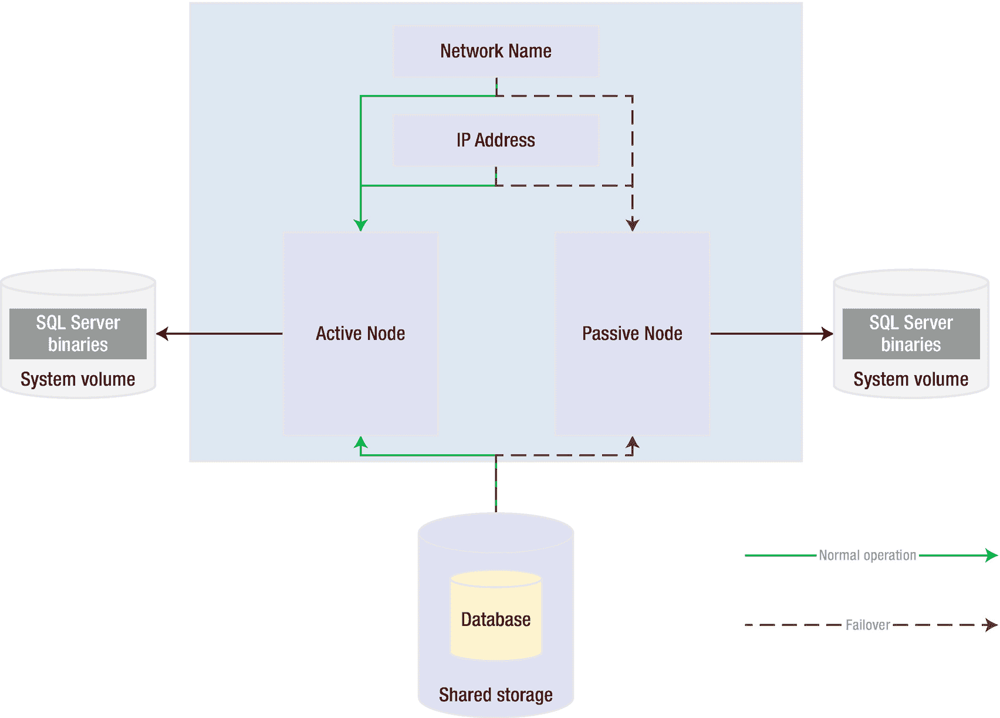

图 13-1：双节点集群

##### 主动/主动配置

虽然图 13-1 中的图表展示了主动/被动配置，但也可以采用主动/主动配置。一次只能有一个节点拥有单个实例，因此无法实现负载均衡。但是，可以在集群上安装多个实例，并且不同的节点可以拥有每个实例。在此场景中，每个节点都有其唯一的网络名称和 `IP` 地址。每个实例的共享存储也由一组唯一的卷组成。

因此，在主动/主动配置中，在正常运行期间，`节点 1` 可能托管 `实例 1`，`节点 2` 可能托管 `实例 2`。如果 `节点 1` 发生故障，则两个实例都将由 `节点 2` 托管，反之亦然。图 13-2 中的图表展示了一个双节点主动/主动集群。

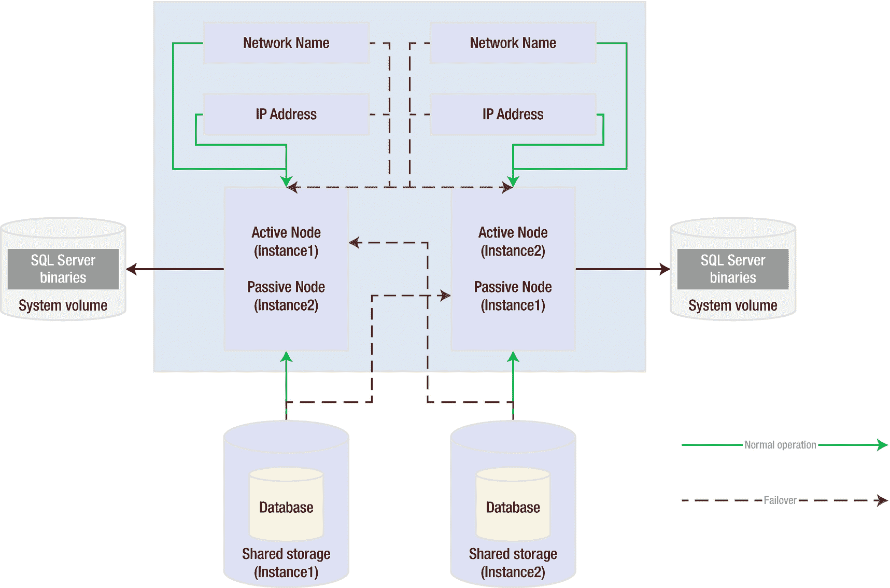

图 13-2：主动/主动集群

#### 注意

在主动/主动集群中，必须考虑故障转移时的资源情况。例如，如果每个节点有 128GB 的 `RAM`，并且托管在每个节点上的实例使用了 96GB 的 `RAM` 并在内存中锁定页面，那么当一个节点故障转移到另一个节点时，该节点也会失败，因为它没有足够的内存分配给两个实例。请确保规划内存和处理器需求时，将两个节点视为单台服务器。因此，通常不建议为 `SQL Server` 采用主动/主动集群。

##### 三节点及以上配置

如前所述，集群中最多可以有 64 个节点。当您有三个或更多节点时，由于相关成本，您可能不希望只有一个活动节点和两个冗余节点。相反，您可以选择实施 `N+1` 或 `N+M` 配置。

在 `N+1` 配置中，您有多个活动节点和一个被动节点。如果任何一个活动节点发生故障，它们将故障转移到被动节点。图 13-3 中的图表描绘了一个三节点的 `N+1` 集群。

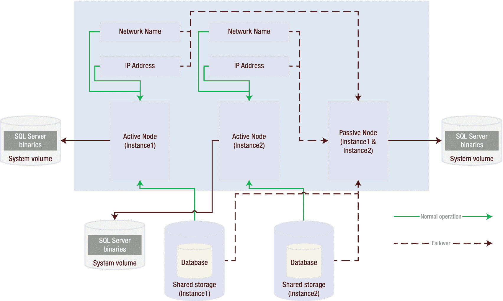

图 13-3：三节点 N+1 配置

在 `N+1` 配置中，在多重故障场景下，多个节点可能会故障转移到被动节点。因此，在规划资源时必须非常小心，以确保被动节点能够支持多个实例。但是，您可以通过使用 `N+M` 配置来缓解此问题。

`N+1` 配置拥有多个活动节点和一个被动节点，而 `N+M` 集群拥有多个活动节点和多个被动节点，尽管被动节点的数量通常少于活动节点。图 13-4 中的图表展示了一个五节点的 `N+M` 配置。图表显示 `实例 3` 被配置为总是故障转移到其中一个被动节点，而 `实例 1` 和 `实例 2` 被配置为总是故障转移到另一个被动节点。这为您提供了控制被动节点上资源的灵活性，但您也可以配置集群以允许任何活动节点故障转移到任意一个被动节点，如果这对于您的环境是更合适的设计。

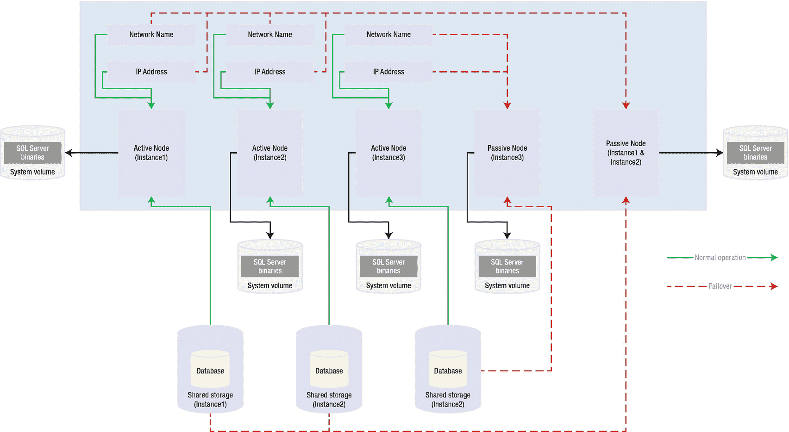

图 13-4：五节点 N+M 配置


##### 仲裁

为了实现自动故障转移，集群服务需要知道节点是否宕机。为此，必须形成一个**仲裁**。仲裁的定义是“为开展业务所需的最少成员数量”。在高可用性语境下，这意味着集群中的每个节点，以及可选的一个见证设备（可以是一个集群磁盘或集群外部的文件共享），都获得一票投票权。如果超过半数的投票成员无法与某个节点通信，则集群服务便知该节点已宕机，其上任何具备集群感知能力的应用程序将故障转移至另一节点。要求超过半数的投票成员无法与该节点通信，是为了避免一种称为 `脑裂` 的情形。

要解释脑裂场景，可以想象数据中心 1 有三个节点，数据中心 2 也有三个节点。现在假设两个数据中心之间的网络连接中断，但所有六个节点仍保持在线。数据中心 1 的三个节点认为数据中心 2 的所有节点均不可用。反之，数据中心 2 的节点也认为数据中心 1 的节点不可用。这导致集群的两侧（称为分区）都认为自己应该取得控制权。这对于成功连接到任一分区的应用程序可能产生不可预测且不良的后果。公式 `仲裁 = (投票成员数 / 2) + 1` 可防止此场景发生。

#### 提示

如果您的集群丢失了仲裁，可以通过使用 `/fq` 开关启动集群服务来强制一个分区联机。如果您使用的是 Windows Server 2012 R2 或更高版本，则强制联机的分区被视为 `权威分区`。这意味着当连接恢复时，其他分区可以自动重新加入集群。

有多种仲裁模型可用，最合适的选择取决于您的环境。表 13-4 列出了您可以使用的模型，并详细说明了最适用的方式。

表 13-4

仲裁模型

| 仲裁模型 | 适用情况 |
| --- | --- |
| 节点多数 | 当集群中有奇数个节点时 |
| 节点+磁盘见证多数 | 当集群中有偶数个节点时 |
| 节点+文件共享见证多数 | 当节点分布在多个站点，或当您有偶数个节点且需要避免共享磁盘时∗ |

**由于虚拟化而需要避免共享磁盘的原因将在本章后面讨论。*

虽然默认选项是一节点一票，但可以通过将 `NodeWeight` 属性更改为零来手动移除一个节点的投票权。这在您拥有 `多子网集群`（节点分布在多个站点的集群）时很有用。在此场景中，建议您在第三个站点使用文件共享见证。这有助于避免因数据中心之间网络故障而导致的集群中断。然而，如果您的仲裁节点数为奇数，添加文件共享见证将导致投票数为偶数，这是危险的。从辅助数据中心的一个节点移除投票可以消除此问题。

#### 注意

文件共享见证不存储仲裁数据库的完整副本。这意味着带有文件共享见证的两节点集群容易受到一种称为 `时间点分区` 的场景影响。在此场景中，如果您正在为第二个节点修补或更改集群服务时有一个节点发生故障，则没有最新的仲裁数据库副本。这将使您处于需要销毁并重建集群的境地。

现代版本的 Windows Server 还支持动态仲裁和针对 50%节点分裂的平局决胜器概念。启用动态仲裁时，集群服务会根据集群中的节点数量自动决定是否给予仲裁见证投票权。如果您有偶数个节点，则分配投票权；如果是奇数个节点，则不分配。针对 50%节点分裂的平局决胜器扩展了这一概念。如果您有偶数个节点和一个见证，而见证发生故障，则集群服务会自动从集群中一个随机节点移除一票。这保持了仲裁中投票数为奇数，并降低了因见证故障导致集群脱机的风险。

#### 提示

如果您的集群运行在 Windows Server 2016 或更高版本的数据中心版上，则支持存储空间直通。这允许使用本地附加的物理存储，通过软件定义的存储层来实现高可用性。关于存储空间直通的完整讨论超出了本书范围，但更多细节可以在 [`https://docs.microsoft.com/en-us/windows-server/storage/storage-spaces/storage-spaces-direct-overview`](https://docs.microsoft.com/en-us/windows-server/storage/storage-spaces/storage-spaces-direct-overview) 找到。

#### AlwaysOn 可用性组

AlwaysOn 可用性组 (`AOAG`) 取代了数据库镜像，本质上是数据库镜像和集群技术的融合。SQL Server 在集群的每个节点上作为独立实例安装（与 AlwaysOn 故障转移集群实例相对）。然后，一个名为可用性组侦听器的集群感知应用程序安装在集群上；它用于将流量定向到正确的节点。然而，`AOAG` 不依赖共享磁盘，而是压缩日志流并将其发送到其他节点，方式与数据库镜像类似。

在您拥有小型数据库且写入配置文件较低的情况下，`AOAG` 是最合适的高可用技术。这是因为，当同步使用时，它要求在所有同步副本上提交数据后，才会在主数据库上提交。您最多可以拥有八个副本，包括三个同步副本。在虚拟化环境中实现高可用性时，`AOAG` 也可能是最合适的技术。这是因为集群所需的共享磁盘可能与虚拟资产的某些功能不兼容。例如，当虚拟机使用通过光纤通道呈现的共享磁盘时，VMware 不支持使用 vMotion（用于在物理服务器之间手动移动虚拟机）和分布式资源调度程序（DRS，用于根据资源利用率在物理服务器之间自动移动虚拟机）。


#### 提示

通过将存储以 iSCSI 连接方式直接呈现给客户机操作系统，可以规避 VMware 功能中围绕共享磁盘的限制，但这会以**性能下降**为代价。

当你有主动故障转移需求但又不需要实现负载延迟时，`AOAG` 是适用于 `DR` 的最合适技术。如果你希望利用 `DR` 服务器来卸载报表负载，`AOAG` 也可能适用于灾难恢复场景。这样可以使冗余服务器得到利用。用于灾难恢复时，`AOAG` 以异步模式工作。这意味着在发生故障转移时可能会丢失数据。其 `RPO` 是不确定的，取决于最后一次未提交事务的时间。

在过去数据库镜像的时代，辅助数据库始终处于离线状态。这意味着你无法使用辅助数据库来卸载任何报表或其他只读活动。可以通过对辅助数据库创建数据库快照并将只读活动指向该快照来绕过此限制。然而，这仍然很复杂，因为你必须配置应用程序以针对不同的网络名称和 IP 地址发出只读语句。另一方面，`可用性组` 允许你将一个或多个副本配置为可读。唯一的限制是，可读副本和自动故障转移不能配置在同一个辅助副本上。不过，通常的做法是将可读的辅助副本配置为异步提交模式，以免影响性能。

为了进一步简化这一点，`可用性组` 副本会检查应用程序连接字符串中的 `只读` 或 `读意向` 属性，并将应用程序指向适当的节点。这意味着你可以轻松地以水平扩展方式扩展报表和数据库维护例程，只需很少的开发工作量，并且应用程序能够使用单一的连接字符串。

因为 `AOAG` 允许你结合同步副本（带或不带自动故障转移）、异步副本和用于只读访问的副本，所以它允许你使用单一技术来满足高可用性、灾难恢复和报表横向扩展的需求。如果你唯一的需求是读取扩展，而不是 `HA` 或 `DR`，那么从 `SQL Server 2017` 开始，实际上可以配置不依赖于故障转移群集的 `可用性组`。在这种情况下，没有群集服务，因此也没有自动重定向。`可用性组` 内的副本在相互通信时使用证书。如果你在没有 `AD` 的工作组或跨域环境中配置 `可用性组`，情况也是如此。

当你使用 `AOAG` 时，故障转移既不发生在数据库级别，也不发生在实例级别。相反，故障转移发生在可用性组级别。可用性组是一个概念，允许你将相关的数据库分组在一起，以便它们作为一个原子单元进行故障转移。这在整合环境中特别有用，因为它允许你将映射到单个应用程序的数据库分组。然后，你可以出于 `DR` 测试或其他原因，将此应用程序故障转移到另一个副本，而不会影响托管在同一实例上的其他数据层应用程序。

对于一个实例上可以配置的可用性组数量，以及可以参与 `AOAG` 的实例上的数据库数量，微软并未施加硬性限制。然而，微软经过测试并正式建议，每个实例最多 100 个数据库和 10 个可用性组。扩展数据库数量的主要限制因素是 `AOAG` 使用数据库镜像端点，并且每个实例只能有一个。这意味着所有数据修改的日志流都通过同一个端点发送。

图 13-5 描绘了如何将数据层应用程序映射到可用性组以实现独立故障转移。在此示例中，单个实例托管了两个数据层应用程序。每个应用程序都已添加到单独的可用性组中。第一个可用性组已故障转移到 `Node2`。因此，可用性组侦听器将 Application1 的流量指向 `Node2`，将 Application2 的流量指向 `Node1`。因为每个可用性组都有自己的网络名称和 IP 地址，并且这些资源随 `AOAG` 一起故障转移，所以应用程序能够在故障转移后无缝地重新连接到数据库。

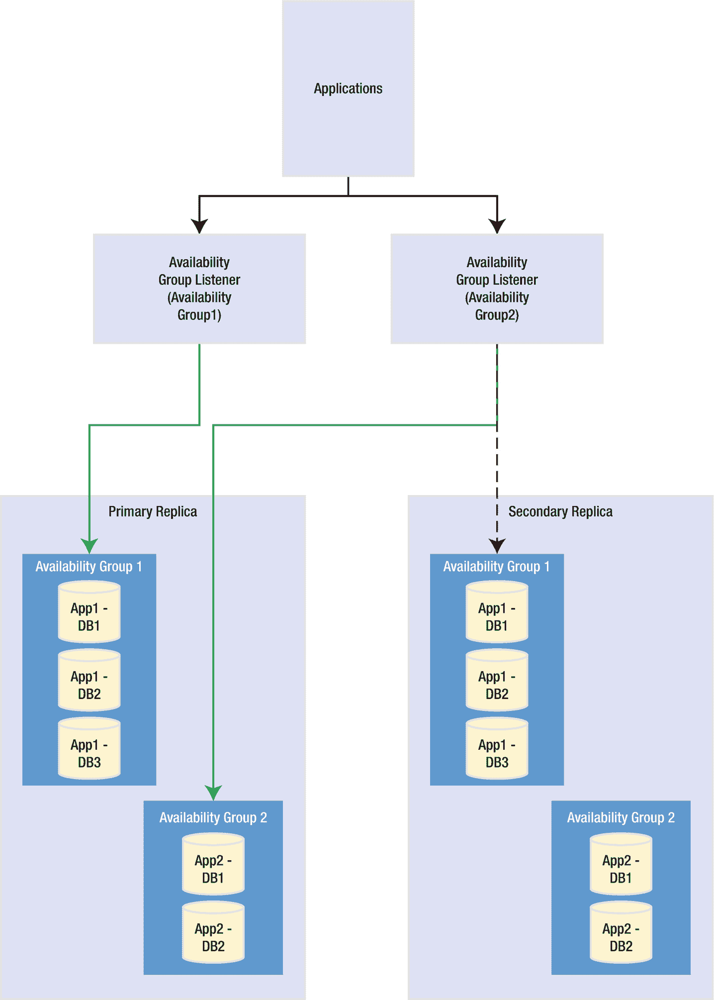

图 13-5

可用性组故障转移

图 13-6 中的图表描述了一个 AlwaysOn 可用性组拓扑。在此示例中，群集中有四个节点和一个磁盘见证。`Node1` 托管数据库的主副本，`Node2` 用于自动故障转移，`Node3` 用于卸载报表负载，`Node4` 用于 `DR`。由于群集跨越两个数据中心，因此已实现多子网群集。然而，由于没有共享存储，站点之间不需要进行 `SAN` 复制。

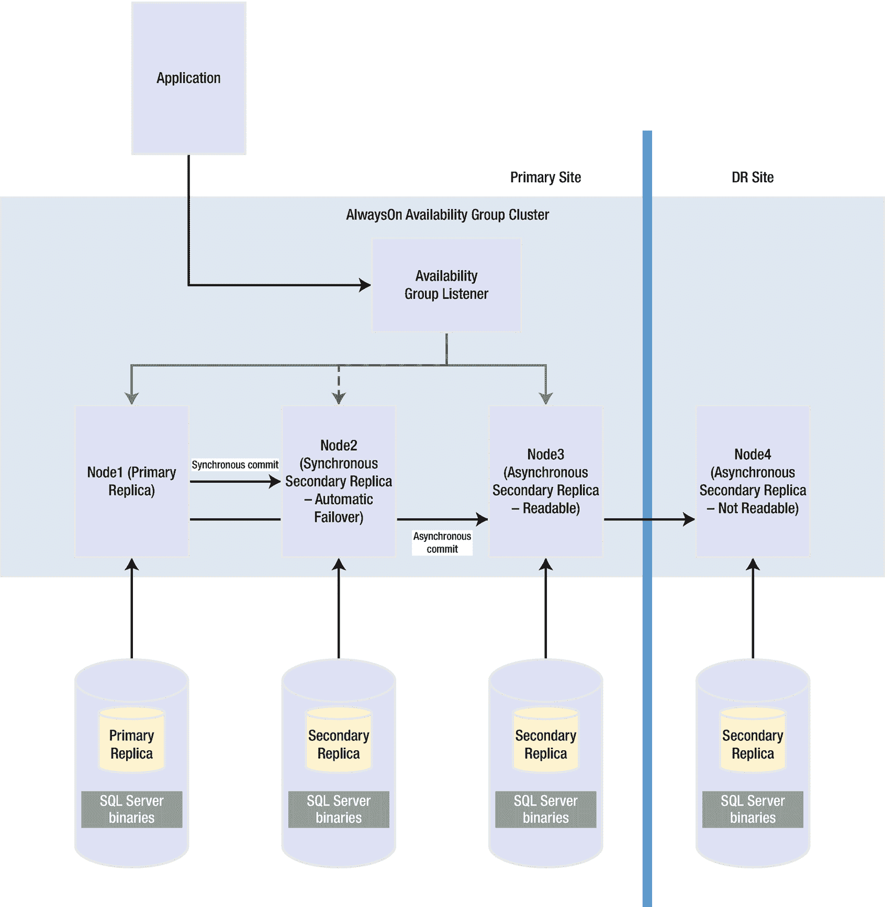

图 13-6

AlwaysOn 可用性组拓扑

#### 注

AlwaysOn 可用性组在第 14 章和第 16 章中有更详细的讨论。


##### 自动页面修复

如果数据库中某个页面损坏，且该数据库配置为 AlwaysOn 可用性组拓扑中的副本，则 SQL Server 会尝试从某个辅助副本获取该页面的副本来修复损坏。这意味着无需你执行还原或运行带修复选项的 `DBCC CHECKDB`，即可解决逻辑损坏问题。但是，自动页面修复不适用于以下页面类型：

*   文件头页面
*   数据库引导页面
*   分配页面
    *   GAM（全局分配映射）
    *   SGAM（共享全局分配映射）
    *   PFS（页面可用空间）

如果主副本因页面损坏而无法读取该页面，它会首先将该页面记录到 `MSDB.dbo.suspect_pages` 表中。然后，它会检查是否至少有一个副本处于 `SYNCHRONIZED`（已同步）状态，并且事务仍在发送到该副本。如果满足这些条件，主副本将向所有副本发送一个广播，指定 `PageID` 和刷新日志结束时的 LSN（日志序列号）。随后，该页面会被标记为还原挂起，这意味着任何访问它的尝试都将失败，并返回错误代码 829。

收到广播后，辅助副本将等待，直到它们重做的事务达到广播消息中指定的 LSN。此时，它们会尝试访问该页面。如果无法访问，则返回错误。如果它们**可以**访问该页面，则会将该页面发送回主副本。主副本接受第一个响应的辅助副本发送来的页面。

然后，主副本将用从辅助副本接收到的版本替换损坏的页面副本。此过程完成后，它会更新 `MSDB.dbo.suspect_pages` 表中的页面记录，通过将 `event_type` 列设置为 `5 (已修复)` 值来反映页面已被修复。

如果辅助副本在重做日志时因页面损坏而无法读取该页面，它会将该辅助副本置于 `SUSPENDED`（已挂起）状态。然后，它将该页面记录到 `MSDB.dbo.suspect_pages` 表中，并向主副本请求该页面的副本。主副本尝试访问该页面。如果无法访问，则返回错误，辅助副本将保持在 `SUSPENDED` 状态。

如果主副本可以访问该页面，则会将其发送给发出请求的辅助副本。辅助副本用从主副本获取的版本替换损坏的页面。然后，它使用 `event_id` 为 `5` 更新 `MSDB.dbo.suspect_pages` 表。最后，它尝试恢复 AOAG（AlwaysOn 可用性组）会话。

#### 注意

可以手动恢复会话，但如果你这样做，在同步期间再次遇到损坏页面时会出错。请务必首先在主副本上修复或还原该页面。

#### 日志传送

日志传送是一种可用于实现灾难恢复的技术。它的工作原理是在主服务器上备份事务日志，将其复制到辅助服务器，然后进行还原。当你需要加载延迟的灾难恢复场景中，最适合使用日志传送，因为这在 AOAG 中无法实现。例如，在用户意外删除表中所有数据的场景中，如果灾难恢复服务器上的数据库在更新前存在延迟，则有可能从该服务器恢复此表的数据，然后重新填充生产服务器。这意味着你无需还原备份来恢复数据。日志传送不适用于高可用性，因为它没有自动故障转移功能。图 13-7 中的示意图展示了一个日志传送拓扑。

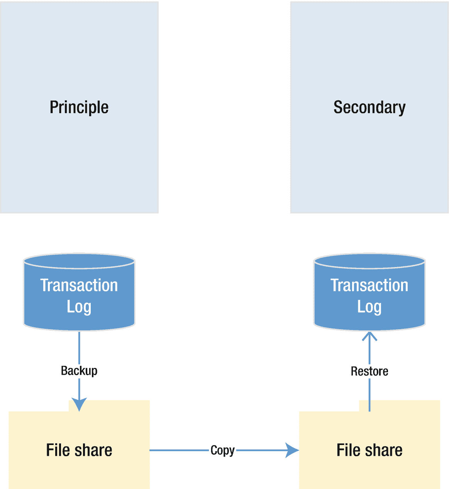

图 13-7：日志传送拓扑

#### 恢复模式

在日志传送拓扑中，始终恰好有一个主服务器，即生产服务器。然而，可以有多个辅助服务器，这些服务器可以是灾难恢复服务器和用于分担报表负载的服务器的混合体。

当你还原事务日志时，可以指定三种恢复模式：Recovery（恢复）、NoRecovery（不恢复）和 Standby（待机）。Recovery 模式使数据库联机，但日志传送不支持此模式。NoRecovery 模式使数据库保持脱机，以便可以还原更多备份。这是日志传送的常规配置，也是灾难恢复场景的合适选择。

Standby 选项使数据库联机，但处于只读状态，因此你可以还原更多备份。此功能通过维护一个 `TUF`（事务撤消文件）来实现。`TUF` 文件记录事务日志中任何未提交的事务。这意味着你可以回滚事务日志中的这些未提交事务，从而使数据库更易于访问（尽管它是只读的）。下次需要应用还原时，你可以在下一个日志还原的重做阶段开始之前，将 `TUF` 文件中的未提交事务重新应用到日志中。

图 13-8 展示了一个同时使用灾难恢复服务器和报表服务器的日志传送拓扑。

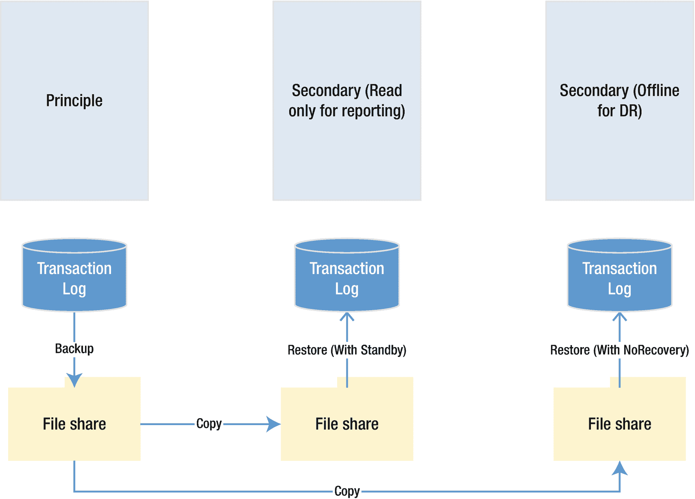

图 13-8：带有灾难恢复和报表服务器的日志传送

#### 远程监视服务器

可选地，你可以在日志传送拓扑中配置一个监视服务器。这有助于你集中监视和警报。当你实现监视服务器时，所有备份、复制和还原操作的历史记录和状态都存储在该监视服务器上。监视服务器还允许你拥有一个单一的警报作业，该作业配置为监视所有服务器上的备份、复制和还原操作，而不需要在拓扑中的每台服务器上设置单独的警报。

#### 注意

如果要使用监视服务器，在设置日志传送时配置它至关重要。日志传送配置完成后，添加监视服务器的唯一方法是拆解并重新配置日志传送。

#### 故障转移

与其他高可用性和灾难恢复技术不同，日志传送故障转移需要付出一定的管理努力。要进行日志传送故障转移，你必须备份事务日志的尾部，并将其连同任何其他未复制的备份文件一起复制到辅助服务器。

现在你需要按顺序将剩余的事务日志备份应用到辅助服务器，最后应用尾日志备份。你使用 `WITH RECOVERY` 选项应用最终还原，以使数据库以一致状态重新联机。如果你不打算故障恢复回去，可以将日志传送重新配置为以辅助服务器作为新的主服务器。

#### 注意

第 15 章将更详细地讨论日志传送。第 12 章将更详细地讨论备份和还原。


### 技术结合

要满足您的业务目标和非功能性需求（NFRs），您需要将多种高可用性和灾难恢复技术结合起来，以创建一个可靠且可扩展的平台。一个经典的例子就是将 `AlwaysOn 故障转移集群` 与 `AlwaysOn 可用性组` 结合的需求。

您可能需要结合这些技术的原因是，当您在同步模式下使用 `AlwaysOn 可用性组` 时（这是实现自动故障转移所必须的），它可能会导致性能障碍。如本章前面所讨论的，性能问题源于事务在提交到主服务器之前，先在辅助服务器上提交。然而，集群技术不会遇到此问题，因为它依赖于共享磁盘资源，因此事务只提交一次。

因此，常见的做法是首先使用集群来实现高可用性，然后使用 `AlwaysOn 可用性组` 来执行灾难恢复（DR）和/或卸载报告工作负载。图 13-9 中的图表说明了一种结合集群和 `AOAG` 的高可用性/灾难恢复拓扑，分别用于实现高可用性和灾难恢复。

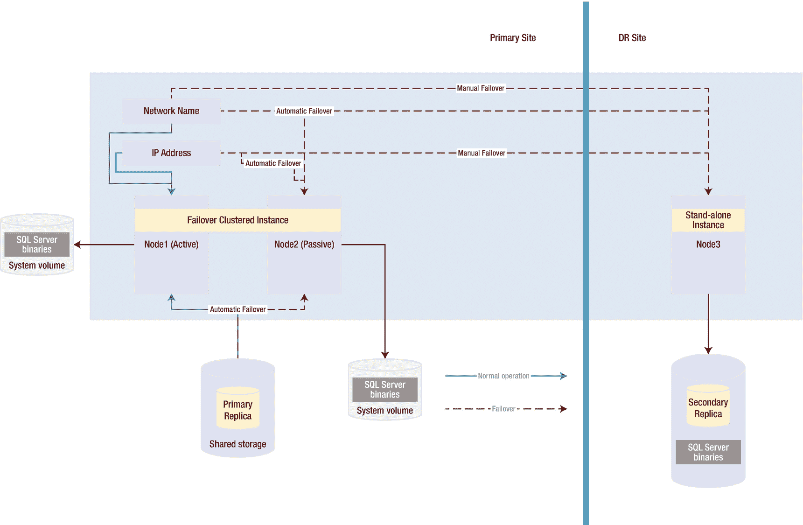
图 13-9

集群与 AlwaysOn 可用性组的结合

图 13-9 显示，数据库的主副本托管在一个双节点主动/被动集群上。如果活动节点发生故障，则应用集群规则，共享存储、网络名称和 IP 地址会重新附加到被动节点，该节点随后成为活动节点。但是，如果两个节点都不可访问，则可用性组侦听器会将流量指向集群的第三个节点，该节点位于灾难恢复站点，并使用日志流复制进行同步。当然，当使用异步模式时，数据库必须由 `DBA` 手动进行故障转移。

另一个常见场景是集群和日志传送的结合，分别用于实现高可用性和灾难恢复。这种组合的工作方式与集群结合 `AlwaysOn 可用性组` 非常相似，如图 13-10 所示。

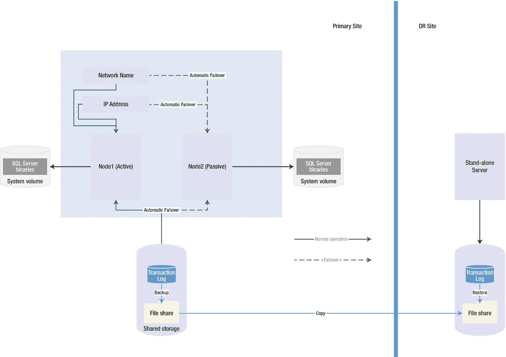
图 13-10

集群结合日志传送

该图显示，在主数据中心配置了一个双节点主动/被动集群。托管在此实例上的数据库的事务日志然后被传送到灾难恢复数据中心的一台独立服务器。由于集群使用共享存储，您还应该为备份卷使用共享存储，并将备份卷作为资源添加到角色中。这意味着当实例故障转移到另一个节点时，备份共享也会随之故障转移，日志传送将继续同步，不会中断。

#### 注意

如果在日志传送备份或复制作业进行期间发生故障转移，日志传送可能会失去同步并需要手动干预。这意味着在故障转移后，您应该检查日志传送作业的健康状态。

### 总结

理解可用性的概念是为您需要高可用性和灾难恢复的应用程序做出正确实施选择的关键。您应该计算停机成本，并将其与实施高可用性/灾难恢复解决方案选择的成本进行比较，以帮助企业了解每个选项的成本/收益概况。在选择技术实现时，您也应该注意服务级别协议（SLA），因为如果未能满足 SLA，可能会产生财务处罚。

`SQL Server` 提供了一套完整的高可用性和灾难恢复技术，使您能够灵活地实施最适合数据层应用程序需求的解决方案。对于高可用性，您可以实施故障转移集群或 `AlwaysOn 可用性组 (AOAG)`。故障转移集群使用共享磁盘资源，故障转移发生在实例级别。而 `AOAG` 则通过维护数据库的冗余副本来在数据库级别同步数据，使用同步日志流。

要实现灾难恢复，您可以选择实施 `AOAG` 或日志传送。日志传送通过备份、复制和还原数据库的事务日志来工作，而 `AOAG` 则使用异步日志流来同步数据。

您还可以将多种高可用性和灾难恢复技术结合在一起，以实施最合适的可用性策略。常见的例子是将用于高可用性的故障转移集群与用于提供灾难恢复的 `AOAG` 或日志传送相结合。

## 14. 实施 AlwaysOn 可用性组

`AlwaysOn 可用性组` 为实现高可用性、从灾难中恢复以及扩展只读工作负载提供了一个灵活的选择。该技术在数据库级别同步数据，但健康监控和仲裁由 `Windows` 集群提供。

`AlwaysOn 可用性组` 有不同的变体。传统的类型建立在 `Windows 故障转移集群` 上，但如果 `SQL Server` 安装在 `Linux` 上，则可以使用 `Pacemaker`。自 `SQL Server 2017` 起，`AlwaysOn 可用性组` 也可以在完全没有集群的情况下配置。这对于卸载报告工作负载是可接受的，但不是有效的高可用性或灾难恢复配置。当使用 `SQL Server 2019` 和 `Windows Server 2019` 时，可用性组甚至可以为容器化的 `SQL` 配置，例如与 `Kubernetes` 结合。

本章重点介绍在 `Windows 故障转移集群` 上配置可用性组，旨在同时提供高可用性（HA）和灾难恢复（DR）。我们还将讨论 `Linux` 上的可用性组和分布式可用性组。使用可用性组来扩展只读工作负载将在第 16 章中讨论。

#### 注意

在本章的演示中，我们使用一个包含域控制器和一个三节点集群的域。集群没有用于数据的共享存储，也没有 `AlwaysOn 故障转移集群实例`。每个节点上都安装了一个独立的 `SQL Server` 实例，分别命名为 `ClusterNode1\PrimaryReplica`、`ClusterNode2\SyncHA` 和 `ClusterNode3\AsyncDR`。`CLUSTERNODE1` 和 `CLUSTERNODE2` 位于 `Site1`，`CLUSTERNODE3` 位于 `Site2`，这意味着集群跨越了子网。关于如何构建故障转移集群或故障转移集群实例的完整细节超出了本书的范围，但完整细节可以在 `Apress` 出版的《`SQL Server AlwaysOn Revealed`》一书中找到，网址为 [`www.apress.com/gb/book/9781484223963`](http://www.apress.com/gb/book/9781484223963)。

### 实施 AlwaysOn 可用性组

在实施 `AlwaysOn 可用性组` 之前，我们首先创建三个数据库，它们将在本章的演示中使用。其中两个数据库与虚构的应用程序 `App1` 相关，第三个数据库与虚构的应用程序 `App2` 相关。每个数据库包含一个表，我们向其中填充了数据。每个数据库的恢复模式都设置为 `FULL`。这是数据库使用 `AlwaysOn 可用性组` 的硬性要求，因为数据是通过日志流同步的。清单 14-1 中的脚本创建了这些数据库。

### 创建数据库

```sql
CREATE DATABASE Chapter14App1Customers ;
GO
ALTER DATABASE Chapter14App1Customers SET RECOVERY FULL ;
GO
USE Chapter14App1Customers
GO
CREATE TABLE App1Customers
(
ID                INT                PRIMARY KEY        IDENTITY,
FirstName         NVARCHAR(30),
LastName          NVARCHAR(30),
CreditCardNumber  VARBINARY(8000)
) ;
GO
--Populate the table
DECLARE @Numbers TABLE
(
Number        INT
)
;WITH CTE(Number)
AS
(
SELECT 1 Number
UNION ALL
SELECT Number + 1
FROM CTE
WHERE Number < 100
)
INSERT INTO @Numbers
SELECT Number FROM CTE
DECLARE @Names TABLE
(
FirstName        VARCHAR(30),
LastName         VARCHAR(30)
) ;
INSERT INTO @Names
VALUES('Peter', 'Carter'),
('Michael', 'Smith'),
('Danielle', 'Mead'),
('Reuben', 'Roberts'),
('Iris', 'Jones'),
('Sylvia', 'Davies'),
('Finola', 'Wright'),
('Edward', 'James'),
('Marie', 'Andrews'),
('Jennifer', 'Abraham'),
('Margaret', 'Jones')
INSERT INTO App1Customers(Firstname, LastName, CreditCardNumber)
SELECT  FirstName, LastName, CreditCardNumber FROM
(SELECT
(SELECT TOP 1 FirstName FROM @Names ORDER BY NEWID()) FirstName
,(SELECT TOP 1 LastName FROM @Names ORDER BY NEWID()) LastName
,(SELECT CONVERT(VARBINARY(8000)
,(SELECT TOP 1 CAST(Number * 100 AS CHAR(4))
FROM @Numbers
WHERE Number BETWEEN 10 AND 99 ORDER BY NEWID()) + '-' +
(SELECT TOP 1 CAST(Number * 100 AS CHAR(4))
FROM @Numbers
WHERE Number BETWEEN 10 AND 99 ORDER BY NEWID()) + '-' +
(SELECT TOP 1 CAST(Number * 100 AS CHAR(4))
FROM @Numbers
WHERE Number BETWEEN 10 AND 99 ORDER BY NEWID()) + '-' +
(SELECT TOP 1 CAST(Number * 100 AS CHAR(4))
FROM @Numbers
WHERE Number BETWEEN 10 AND 99 ORDER BY NEWID()))) CreditCardNumber
FROM @Numbers a
CROSS JOIN @Numbers b
CROSS JOIN @Numbers c
) d ;
CREATE DATABASE Chapter14App1Sales ;
GO
ALTER DATABASE Chapter14App1Sales SET RECOVERY FULL ;
GO
USE Chapter14App1Sales
GO
CREATE TABLE [dbo].Orders NOT NULL PRIMARY KEY CLUSTERED,
[OrderDate] [date]  NOT NULL,
[CustomerID] [int]  NOT NULL,
[ProductID] [int]   NOT NULL,
[Quantity] [int]    NOT NULL,
[NetAmount] [money] NOT NULL,
[TaxAmount] [money] NOT NULL,
[InvoiceAddressID] [int] NOT NULL,
[DeliveryAddressID] [int] NOT NULL,
[DeliveryDate] [date] NULL,
) ;
DECLARE @Numbers TABLE
(
Number        INT
)
;WITH CTE(Number)
AS
(
SELECT 1 Number
UNION ALL
SELECT Number + 1
FROM CTE
WHERE Number < 100
)
INSERT INTO @Numbers
SELECT Number FROM CTE
--Populate ExistingOrders with data
INSERT INTO Orders
SELECT
(SELECT CAST(DATEADD(dd,(SELECT TOP 1 Number
FROM @Numbers
ORDER BY NEWID()),getdate())as DATE)),
(SELECT TOP 1 Number -10 FROM @Numbers ORDER BY NEWID()),
(SELECT TOP 1 Number FROM @Numbers ORDER BY NEWID()),
(SELECT TOP 1 Number FROM @Numbers ORDER BY NEWID()),
500,
100,
(SELECT TOP 1 Number FROM @Numbers ORDER BY NEWID()),
(SELECT TOP 1 Number FROM @Numbers ORDER BY NEWID()),
(SELECT CAST(DATEADD(dd,(SELECT TOP 1 Number - 10
FROM @Numbers
ORDER BY NEWID()),getdate()) as DATE))
FROM @Numbers a
CROSS JOIN @Numbers b
CROSS JOIN @Numbers c ;
CREATE DATABASE Chapter14App2Customers ;
GO
ALTER DATABASE Chapter14App2Customers SET RECOVERY FULL ;
GO
USE Chapter14App2Customers
GO
CREATE TABLE App2Customers
(
ID                INT                PRIMARY KEY        IDENTITY,
FirstName         NVARCHAR(30),
LastName          NVARCHAR(30),
CreditCardNumber  VARBINARY(8000)
) ;
GO
--Populate the table
DECLARE @Numbers TABLE
(
Number        INT
) ;
;WITH CTE(Number)
AS
(
SELECT 1 Number
UNION ALL
SELECT Number + 1
FROM CTE
WHERE Number < 100
)
INSERT INTO @Numbers
SELECT Number FROM CTE ;
DECLARE @Names TABLE
(
FirstName        VARCHAR(30),
LastName        VARCHAR(30)
) ;
INSERT INTO @Names
VALUES('Peter', 'Carter'),
('Michael', 'Smith'),
('Danielle', 'Mead'),
('Reuben', 'Roberts'),
('Iris', 'Jones'),
('Sylvia', 'Davies'),
('Finola', 'Wright'),
('Edward', 'James'),
('Marie', 'Andrews'),
('Jennifer', 'Abraham'),
('Margaret', 'Jones')
INSERT INTO App2Customers(Firstname, LastName, CreditCardNumber)
SELECT  FirstName, LastName, CreditCardNumber FROM
(SELECT
(SELECT TOP 1 FirstName FROM @Names ORDER BY NEWID()) FirstName
,(SELECT TOP 1 LastName FROM @Names ORDER BY NEWID()) LastName
,(SELECT CONVERT(VARBINARY(8000)
,(SELECT TOP 1 CAST(Number * 100 AS CHAR(4))
FROM @Numbers
WHERE Number BETWEEN 10 AND 99 ORDER BY NEWID()) + '-' +
(SELECT TOP 1 CAST(Number * 100 AS CHAR(4))
FROM @Numbers
WHERE Number BETWEEN 10 AND 99 ORDER BY NEWID()) + '-' +
(SELECT TOP 1 CAST(Number * 100 AS CHAR(4))
FROM @Numbers
WHERE Number BETWEEN 10 AND 99 ORDER BY NEWID()) + '-' +
(SELECT TOP 1 CAST(Number * 100 AS CHAR(4))
FROM @Numbers
WHERE Number BETWEEN 10 AND 99 ORDER BY NEWID()))) CreditCardNumber
FROM @Numbers a
CROSS JOIN @Numbers b
CROSS JOIN @Numbers c
) d ;
```

代码清单 14-1

### 配置 SQL Server

配置 AlwaysOn 可用性组的第一步是在 SQL Server 服务上启用此功能。要通过 GUI 启用该功能，我们打开 **SQL Server 配置管理器**，导航到 **SQL Server 服务**，然后从 SQL Server 服务的上下文菜单中选择**属性**。此时会显示服务属性，我们导航到 **AlwaysOn 高可用性**选项卡，如图 14-1 所示。

在此选项卡上，我们勾选 **启用 AlwaysOn 可用性组**复选框，并确保 **Windows 故障转移群集名称**框中显示的群集名称正确无误。然后我们需要重新启动 SQL Server 服务。由于 AlwaysOn 可用性组使用的是**独立实例**（它们安装在群集的每个节点上），而不是跨多个节点的**故障转移群集实例**，因此我们需要在群集上托管的每个独立实例上重复这些步骤。

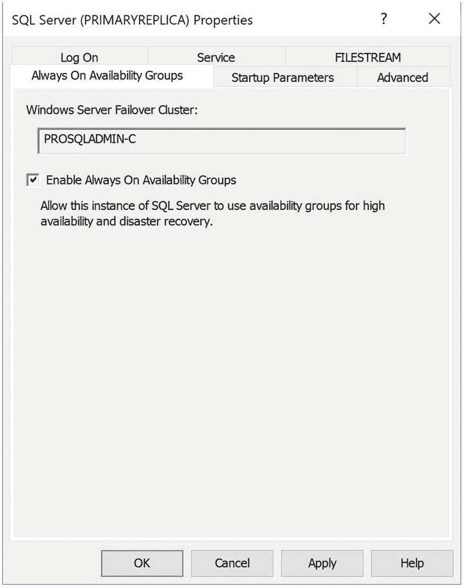

图 14-1：AlwaysOn 高可用性选项卡

我们也可以使用 PowerShell 来启用 AlwaysOn 可用性组。为此，我们使用代码清单 14-2 中的 PowerShell 命令。该脚本假定 `CLUSTERNODE1` 是服务器名称，`PRIMARYREPLICA` 是 SQL Server 实例的名称。

```powershell
Enable-SqlAlwaysOn -Path SQLSERVER:\SQL\CLUSTERNODE1\PRIMARYREPLICA
```

代码清单 14-2：启用 AlwaysOn 可用性组

下一步是对将成为可用性组一部分的所有数据库进行完整备份。完成此操作之前，我们将无法将它们添加到可用性组。我们分别为 `App1` 和 `App2` 创建单独的可用性组，因此要为 `App1` 创建可用性组，我们需要备份 `Chapter14App1Customers` 和 `Chapter14App1Sales` 数据库。我们通过运行代码清单 14-3 中的脚本来完成此操作。

```sql
BACKUP DATABASE Chapter14App1Customers
TO  DISK = N'C:\Backups\Chapter14App1Customers.bak'
WITH NAME = N'Chapter14App1Customers-Full Database Backup' ;
GO
BACKUP DATABASE Chapter14App1Sales
TO  DISK = N'C:\Backups\Chapter14App1Sales.bak'
WITH NAME = N'Chapter14App1Sales-Full Database Backup' ;
GO
```

代码清单 14-3：备份数据库

#### 注意

备份将在第 12 章中讨论。

### 创建可用性组

您可以通过多种方式在 SQL Server 中创建可用性组拓扑。可以主要通过对话框手动创建，通过 T-SQL 创建，或者通过向导创建。在本章中，我们将探讨向导和对话框。

### 使用新建可用性组向导

当备份成功完成后，我们通过在对象资源管理器中展开 AlwaysOn 高可用性，然后从“可用性组”文件夹的上下文菜单中选择“新建可用性组向导”来启动该向导。向导的“简介”页面将显示出来，为我们概述需要执行的步骤。

在“指定名称”页面（参见图 14-2），系统会提示我们为可用性组输入一个名称。我们还需要选择“Windows Server 故障转移群集”作为群集类型。其他群集类型选项包括“外部”（支持 Linux 上的 Pacemaker）和“无”（用于无群集的可用性组）。“数据库级别运行状况检测”选项将使得组中任何数据库脱机时，可用性组都会发生故障转移。“每数据库 DTC 支持”选项将指定是否支持使用 MSDTC（Microsoft 分布式事务处理协调器）的跨数据库事务。关于配置 DTC 的完整讨论超出了本书范围，但可以在 [`https://docs.microsoft.com/en-us/previous-versions/windows/desktop/ms681291(v=vs.85)`](https://docs.microsoft.com/en-us/previous-versions/windows/desktop/ms681291%2528v%25253Dvs.85%2529) 找到更多详细信息。

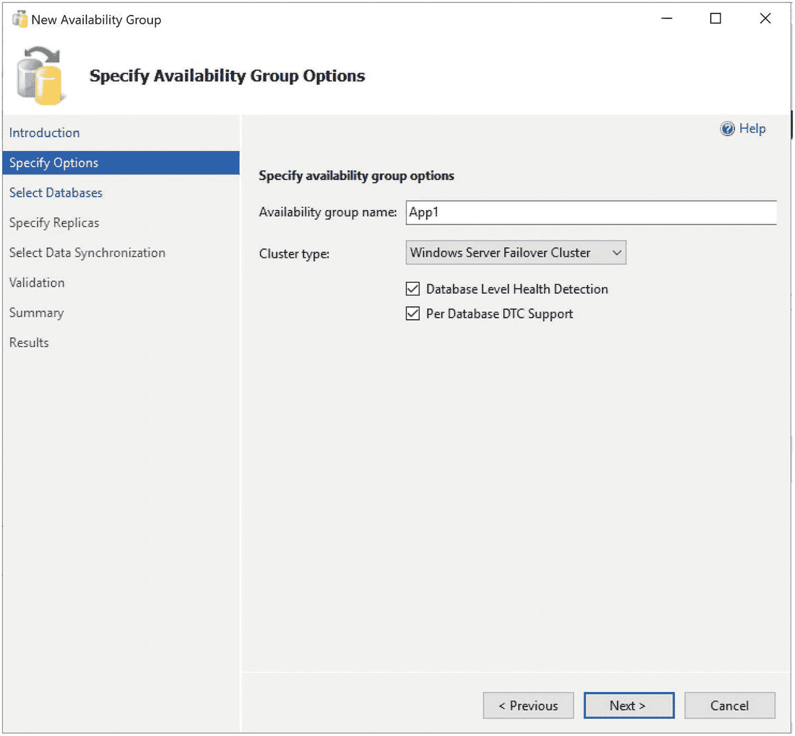

图 14-2：指定名称页面

在“选择数据库”页面，系统会提示我们选择希望参与可用性组的数据库，如图 14-3 所示。在此屏幕上，请注意我们无法选择 `Chapter14App2Customers` 数据库，因为我们尚未对该数据库进行完整备份。

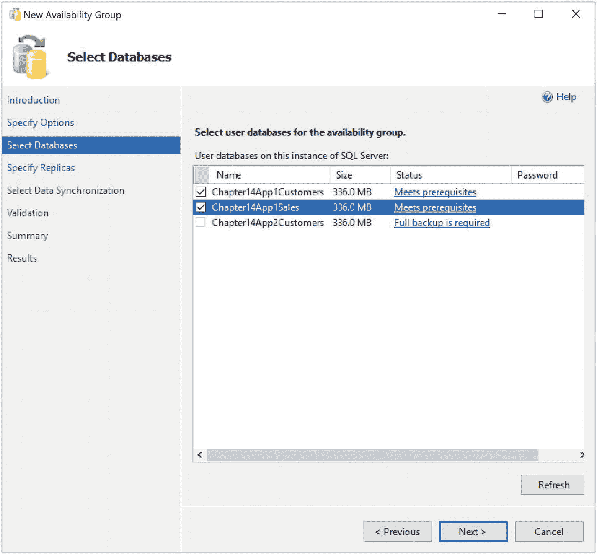

图 14-3：选择数据库页面

“指定副本”页面包含四个选项卡。我们使用第一个选项卡“副本”将辅助副本添加到拓扑中。选中“同步提交”选项会导致数据在提交到主副本之前，先在辅助副本上提交。（这也被称为在主副本之前，先在辅助副本上固化日志。）这意味着在发生故障转移时，不可能丢失数据，即我们可以满足 RPO（恢复点目标）为 0（零）的 SLA（服务级别协议）。然而，这也意味着性能会有所下降。如果我们选择“异步提交”，那么副本将以异步提交模式运行。这意味着数据在提交到辅助副本之前，先在主副本上提交。这避免了性能下降，但也意味着在发生故障转移时，RPO 是不确定的。同步副本的性能考虑因素将在本章后面讨论。

当我们选中“自动故障转移”选项时，如果我们尚未选择“同步提交”，该选项也会被自动选中。这是因为自动故障转移仅在同步提交模式下才可能。我们可以将“可读辅助副本”下拉列表设置为“否”、“是”或“仅读意向”。当设置为“否”时，处于辅助角色的副本上的数据库不可访问。当设置为“仅读意向”时，可用性组侦听器可以将只读工作负载重定向到此辅助副本，但前提是应用程序在连接字符串中指定了 `Application Intent=Read-only`。将其设置为“是”则启用侦听器重定向只读流量，无论应用程序的连接字符串中是否存在 `Application Intent` 参数。尽管我们可以通过 GUI 更改“可读辅助副本”的值，同时为副本配置自动故障转移而不报错，但这只是向导的一个特性。实际上，该副本是不可访问的，因为配置为自动故障转移时不支持活动辅助副本。“副本”选项卡如图 14-4 所示。为满足我们实现高可用性和灾难恢复的要求，我们将同一站点内的辅助服务器配置为同步副本，将不同站点中的服务器配置为异步副本。这意味着数据中心之间的延迟不会加剧与同步提交相关的性能下降。

#### 注意

将辅助副本用于只读工作负载在第 16 章中有更深入的讨论。

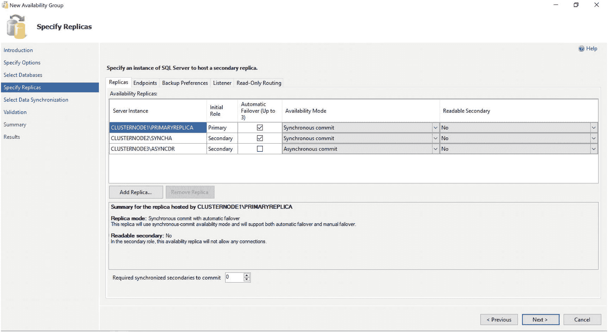

图 14-4：副本选项卡

在“指定副本”页面的“端点”选项卡上（如图 14-5 所示），我们为每个端点指定端口号。默认端口为 5022，但如果需要，我们可以指定不同的端口。在此选项卡上，我们还指定在端点之间发送数据时是否应进行加密。选中此选项通常是个好主意，如果选中，则使用 AES（高级加密标准）作为加密算法。

可选地，您还可以更改创建的端点的名称。但是，由于每个实例只允许一个数据库镜像端点，而且默认名称已经相当具有描述性，因此并不总是需要更改它。一些 DBA 选择将其重命名以包含实例名称，因为这可以简化多服务器的管理。如果您的企业有许多可用性组群集，这是一个好主意。

显示每个实例使用的服务帐户仅供参考。如果您确保两个实例使用相同的服务帐户，可以简化安全管理。如果未能做到这一点，您将需要为每个服务帐户授予每个实例的权限。这意味着，您没有通过仅将一个服务帐户用于一个实例来减小每个服务帐户的安全范围，而是将安全范围从操作系统级别提升到了 SQL Server 级别。

端点 URL 指定了可用性组用于通信的端点的 URL。URL 的格式是 `[传输协议]://[路径]:[端口]`。数据库镜像端点的传输协议始终是 TCP（传输控制协议）。路径可以是服务器的完全限定域名 (FQDN)、单独的服务器名称或网络中唯一的 IP 地址。我建议使用服务器的 FQDN，因为这总是保证有效。这也是填充的默认值。端口号应与您为端点指定的端口号匹配。


#### 注意

可用性组通过数据库镜像端点进行通信。虽然数据库镜像已弃用，但这些端点仍然有效。

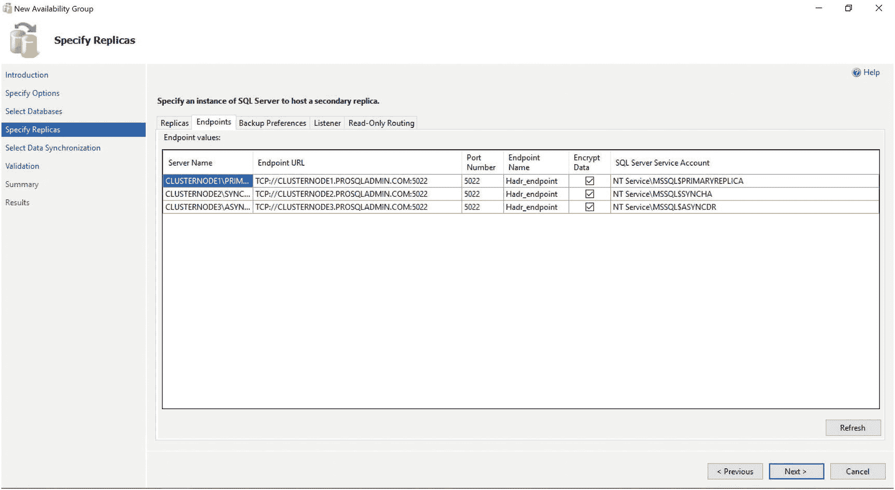

图 14-5 端点选项卡

##### 备份首选项选项卡

在“备份首选项”选项卡（见图 14-6）上，我们可以指定执行自动备份的副本。AlwaysOn 可用性组的一个主要优点是，使用它们时，可以将备份等维护任务扩展到辅助服务器。因此，自动备份可以无缝地定向到活动辅助副本。可能的选项包括“首选辅助”、“仅限辅助”、“主副本”或“任意副本”。还可以为每个副本设置优先级。在确定针对哪个副本运行备份作业时，SQL Server 会评估每个节点的备份优先级，并更有可能选择优先级最高的副本。

尽管减少主副本 I/O 的优势显而易见，但在许多情况下，我有些争议地建议不要将自动备份扩展到辅助副本。当应用程序的恢复时间目标（`RTO`）是优先考虑事项时，尤其如此，因为存在操作可支持性问题。设想这样一种情况：备份正在辅助副本上进行，而用户打电话说他们意外删除了关键表中的所有数据。现在你需要恢复数据库副本并重新填充该表。然而，备份文件位于辅助副本上。因此，在开始恢复数据库（或通过网络执行恢复）之前，你需要将备份文件复制到主副本。这会立即增加你的 `RTO`。

此外，当配置为允许在多台服务器上备份时，`SQL Server` 仍然只在进行备份的实例上维护备份历史记录。这意味着你可能需要在服务器之间慌乱地查找，试图检索所有备份文件，却不知道每个文件存放在哪里。如果其中一台服务器发生完全系统中断，情况会变得更糟。你可能会发现自己处于日志链断裂的困境中。

对于我刚才提到的大多数问题，解决方法是使用文件服务器上的共享，并将每个实例配置为备份到同一个共享。然而，这样设置的问题是，你现在正通过网络传输所有备份，而不是在本地进行备份。这会增加备份的持续时间以及网络流量。

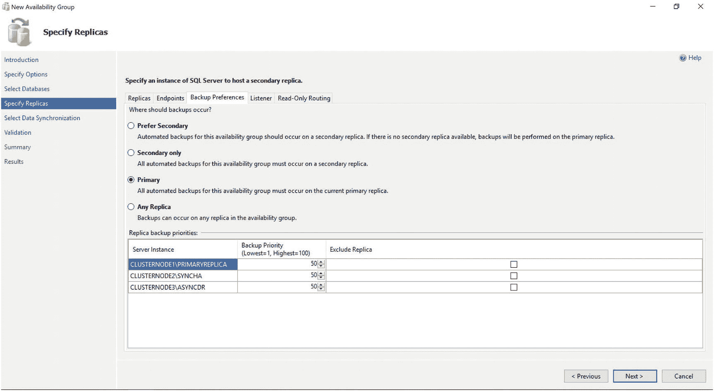

图 14-6 备份首选项选项卡

##### 侦听器选项卡

在如图 14-7 所示的“侦听器”选项卡上，我们选择是创建可用性组侦听器，还是希望将此任务推迟到以后。如果选择创建侦听器，则需要指定侦听器的名称、它应侦听的端口以及它应使用的 IP 地址。在多子网群集中，我们为每个子网指定一个地址。此处提供的详细信息用于在可用性组的群集角色中创建客户端访问点资源。你可能会注意到我们为侦听器指定了端口 `1433`，而我们的实例也运行在端口 `1433` 上。这是一个有效的配置，因为侦听器配置的 IP 地址与 `SQL Server` 实例不同。使用相同的端口号并非强制要求，但如果你在现有实例上实现 AlwaysOn 可用性组，这可能有益，因为指定端口号连接的应用程序可能需要更少的更改。请记住，服务器名称仍将不同，因为应用程序将连接到侦听器的虚拟名称，而不是物理服务器\实例的名称。在我们的示例中，应用程序连接到 `APP1LISTEN\PRIMARYREPLICA` 而不是 `CLUSTERNODE1\PRIMARYREPLICA`。虽然通过 `CLUSTERNODE1` 的连接仍然允许，但它们无法从高可用性或扩展我们的报告中受益。

由于我们的 App1 可用性组跨越两个子网，因此我们的侦听器必须有两个 IP 地址，每个子网一个。这使得侦听器在我们的任一站点中都可用。

#### 提示

如果你在组织单位（`OU`）中没有“创建计算机对象”权限，那么侦听器的 `VCO`（虚拟计算机对象）必须存在于活动目录（`AD`）中，并且你必须被分配对该对象的“完全控制”权限。

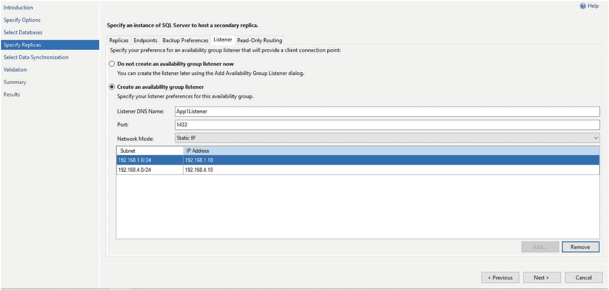

图 14-7 侦听器选项卡

##### 选择初始数据同步

在如图 14-8 所示的“选择初始数据同步”屏幕上，我们选择如何执行副本的初始数据同步。如果选择“完整”，则参与可用性组的每个数据库都将执行完整备份，然后是日志备份。备份文件备份到你指定的共享，然后还原到辅助服务器。共享路径可以使用 `Windows` 或 `Linux` 格式指定，具体取决于你的要求。还原完成后，通过日志流的数据同步开始。

如果你已经备份了数据库并将它们还原到辅助副本上，则可以选择“仅连接”选项。这将启动可用性组内数据库通过日志流的数据同步。选择“跳过初始数据同步”允许你在完成设置后自行备份和还原数据库。

如果选择“自动种子设定”选项，则最初会在每个副本上创建一个空数据库。然后使用 `VDI` 通过日志流传输进行数据种子设定。此选项比使用备份初始化慢，但避免了在共享之间传输大型备份文件。

#### 提示

如果你的可用性组将包含许多数据库，那么最好自行执行备份/还原。这是因为内置工具将按顺序执行操作，因此可能需要很长时间才能完成。

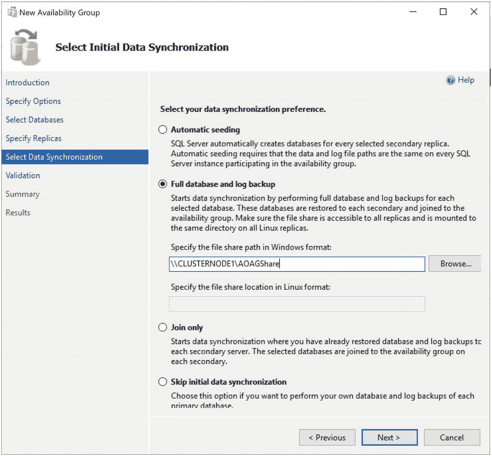

图 14-8 选择数据同步页面

##### 验证和完成

在“验证”页面上，会检查可能导致设置失败的规则。如果任何结果返回为“失败”，则需要在尝试继续之前解决它们。

验证测试完成后，我们转到“摘要”页面，其中显示了在设置过程中要执行的任务列表。

随着设置的进行，每个配置任务的结果显示在“结果”页面上。如果此页面上出现任何错误，请务必调查它们，但这并不一定意味着整个可用性组需要重新配置。例如，如果由于 `VCO` 尚未在 `AD` 中呈现而导致创建可用性组侦听器失败，那么你可以重新创建侦听器，而无需重新创建整个可用性组。

作为使用“新建可用性组向导”的替代方法，你可以使用“新建可用性组”对话框，然后使用“添加侦听器”对话框来执行可用性组的配置。本章稍后将探讨这种创建可用性组的方法。


### 使用“新建可用性组”对话框

既然我们已经成功创建了第一个可用性组，现在让我们为 `App2` 创建第二个可用性组。这次，我们使用“新建可用性组”和“添加侦听器”对话框。我们首先通过备份 `Chapter14App2Customers` 数据库来开始此过程。就像创建 `App1` 可用性组时一样，在我们执行备份之前，数据库是不可选择的。然而，与使用向导时不同，我们无法通过备份/还原选项让 SQL Server 执行初始数据库同步。因此，我们必须将数据库备份到我们在上一个演示中创建的共享中，然后将备份连同事务日志备份还原到辅助实例，或者使用**自动种子设定**。在此示例中，我们将使用自动种子设定，因此无需提前将数据库还原到辅助副本。清单 14-4 中的脚本将对 `Chapter14App2Customers` 数据库执行完整备份。

#### 提示

要使自动种子设定生效，必须在辅助服务器上为可用性组授予 `CREATE ANY DATABASE` 权限。有关授予权限的更多信息，请参见第 10 章。

```
--Back Up Database
BACKUP DATABASE [Chapter14App2Customers] TO  DISK = N'\\CLUSTERNODE1\AOAGShare\Chapter14App2Customers.bak' WITH  COPY_ONLY, FORMAT, INIT, REWIND, COMPRESSION,  STATS = 5 ;
GO
清单 14-4
备份和还原数据库
```

如果我们尚未创建可用性组，那么我们的下一步将是创建一个 TCP 终结点，以便实例可以通信。然后，我们需要在每个实例上为服务账户创建登录名，并授予其在终结点上的连接权限。然而，由于每个实例只能有一个数据库镜像终结点，因此我们不需要创建新的终结点，而且显然我们也没有理由为服务账户授予额外的权限。因此，我们继续创建可用性组。为此，我们在对象资源管理器中展开“AlwaysOn 高可用性”，然后从可用性组的上下文菜单中选择“新建可用性组”。

这将显示“新建可用性组”对话框的“常规”选项卡，如图 14-9 所示。在此界面上，我们在第一个字段中输入可用性组的名称。然后，我们在“可用性数据库”窗口下单击“添加”按钮，再输入我们希望添加到组中的数据库名称。接着，我们需要在“可用性副本”窗口下单击“添加”按钮，然后在新增的行中输入辅助副本的“服务器\实例”名称。对于我们的用例，无需指定“每数据库 DTC 支持”或“数据库级别运行状况检测”设置，因为可用性组内只有一个数据库。但是，我们将“要提交的同步辅助副本数”设置为 1。此设置是 SQL Server 2017 中的新增功能，它保证在提交每个事务之前，指定数量的辅助副本已将事务数据写入日志。在我们的场景中，我们只有一个同步辅助副本，如果主副本发生故障，故障转移将自动发生，但在原始主副本重新联机之前，辅助副本将不允许用户事务写入数据库。这绝对保证了在任何情况下都不会丢失数据。如果我们将此设置保留为 0（如本章第一个示例中那样），那么在主副本发生故障、用户在辅助副本也发生故障之前向其写入事务的情况下，就可能发生数据丢失，因为另一个唯一副本使用的是异步提交模式。

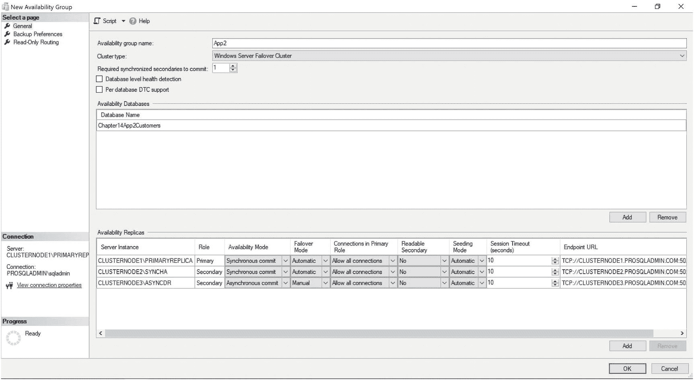
*图 14-9：新建可用性组对话框*

现在我们可以开始设置副本属性。在创建 `App1` 可用性组时，我们讨论了“角色”、“可用性模式”、“故障转移模式”、“可读辅助副本”和“终结点 URL”属性。“连接中的主角色”属性定义了当副本处于主角色时可以建立哪些连接。您可以将其配置为“允许所有连接”或“允许读/写连接”。当指定“读/写”时，其连接字符串中使用 `Application Intent = Read only` 参数的应用程序将无法连接到该副本。

“会话超时”属性设置了副本在多长时间内未收到彼此的 ping 后，会进入 `DISCONNECTED` 状态并结束会话。虽然可以将此值设置为低至 5 秒，但通常最好将设置保持为 60 秒；否则，您可能会面临误报响应的风险，导致不必要的故障转移。如果副本超时，则需要重新同步，因为即使辅助副本以同步提交模式运行，主副本上的事务也不再会等待它。

在对话框的“备份首选项”选项卡上，我们定义用于自动备份作业的首选副本，如图 14-10 所示。就像使用向导时一样，我们可以指定“主副本”，也可以选择强制或偏好在辅助副本上进行备份。我们还可以为每个副本配置一个介于 0 到 100 之间的权重，并使用“排除副本”复选框来避免在特定节点上进行备份。

#### 提示

如果您使用的是软件保障，尽管您的许可允许您将辅助副本同步用于高可用性或灾难恢复目的，但不允许您在此辅助服务器上执行其他任务（例如备份），此时排除副本进行备份会很有帮助。

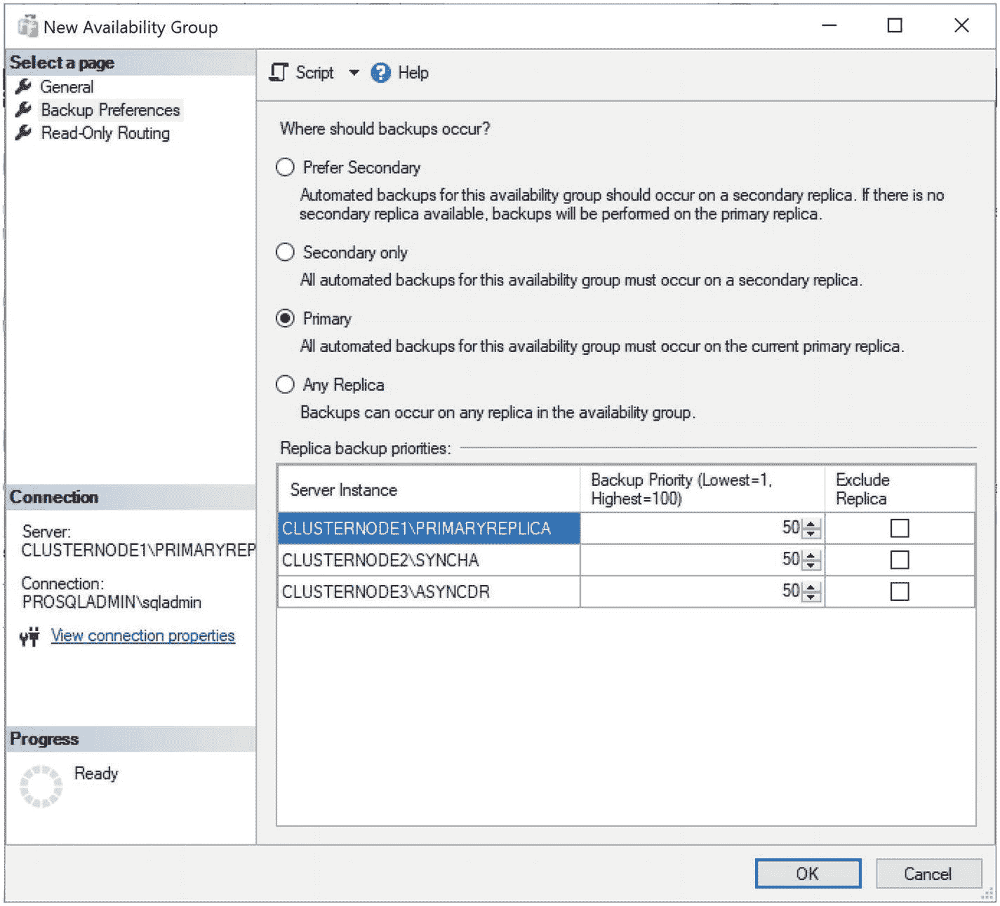
*图 14-10：“备份首选项”选项卡*

创建可用性组后，我们需要创建可用性组侦听器。为此，我们从现在应在对象资源管理器中可见的 `App2` 可用性组的上下文菜单中选择“新建侦听器”。这将调用“新建可用性组侦听器”对话框，如图 14-11 所示。

在此对话框中，我们首先输入侦听器的虚拟名称。然后，我们定义它将侦听的端口以及将分配给它的 IP 地址。

#### 提示

我们能够为两个侦听器以及 SQL Server 实例使用相同的端口，因为所有三者使用的是不同的 IP 地址。

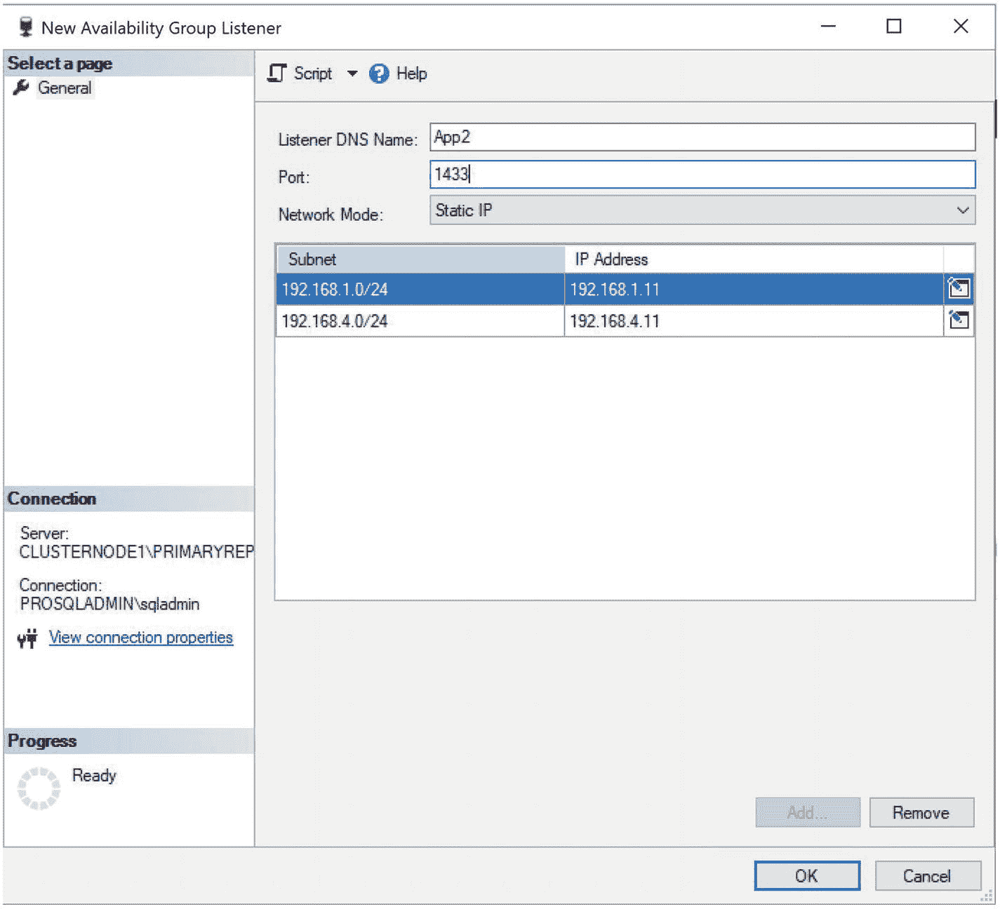
*图 14-11：新建可用性组侦听器对话框*

### Linux 上的可用性组

除了在 Windows 故障转移群集上工作外，还可以在 Linux 上运行的 SQL Server 实例上配置可用性组。在本节中，我们将讨论如何在 Linux 上为高可用性配置可用性组。在我们的具体场景中，我们有两个服务器，即 `ubuntu-primary` 和 `ubuntu-secondary`，它们将构成我们的服务器拓扑。


#### 提示

有关在 Linux 上安装 SQL Server 的更多信息，请参见第 4 章。

正如在 Windows 环境中一样，在 Linux 上配置可用性组的第一步是在服务级别启用该功能。清单 14-5 中的脚本演示了如何启用可用性组然后重启服务。此脚本需要在将成为副本的每个服务器上执行。

#### 提示

如第 4 章所讨论的，`sudo`相当于 Windows 中的“以管理员身份运行”。使用`sudo`时，系统会提示您输入`root`密码。

```
sudo /opt/mssql/bin/mssql-conf set hadr.hadrenabled  1
sudo systemctl restart mssql-server
清单 14-5
启用 AlwaysOn 可用性组
```

由于 Linux 服务器无法使用 AD 身份验证相互进行身份验证，因此下一步是创建可用于身份验证的证书。您可以通过连接到主服务器并运行清单 14-6 中的脚本来创建证书。该脚本在 SQL Server 实例中创建证书，然后将其备份到操作系统，以便我们可以将其复制到辅助服务器。请记住，您可以通过使用`sqlcmd`或从安装在 Windows 机器上的 SSMS 进行连接，来连接到在 Linux 上运行的 SQL Server 实例。

#### 提示

有关创建证书的更多详细信息，请参见第 11 章。

```
CREATE MASTER KEY ENCRYPTION BY PASSWORD = 'Pa$$w0rd';
GO
CREATE CERTIFICATE aoag_certificate WITH SUBJECT = 'AvailabilityGroups';
GO
BACKUP CERTIFICATE aoag_certificate
TO FILE = '/var/opt/mssql/data/aoag_certificate.cer'
WITH PRIVATE KEY (
FILE = '/var/opt/mssql/data/aoag_certificate.pvk',
ENCRYPTION BY PASSWORD = 'Pa$$w0rd'
);
GO
清单 14-6
创建证书
```

我们现在需要将密钥复制到辅助服务器。为此，我们首先需要授予用户对`/var/opt/mssql/`数据文件夹的权限。我们可以使用清单 14-7 中的命令来完成此操作，该命令需要在两台服务器上运行。

```
sudo chmod -R 777 /var/opt/mssql/data
清单 14-7
授予权限
```

在清单 14-8 中的命令，如果在主服务器上运行，将把证书的公钥和私钥复制到辅助服务器。为了使此命令正常工作，每台服务器上应安装并配置 SSH。关于 SSH 的完整讨论超出了本书的范围，但可以在 [`http://ubuntuhandbook.org/index.php/2014/09/enable-ssh-in-ubuntu-14-10-server-desktop/`](http://ubuntuhandbook.org/index.php/2014/09/enable-ssh-in-ubuntu-14-10-server-desktop/) 找到指南。

#### 提示

您应更改用户和服务器名称以匹配您自己的配置。

```
scp aoag_certificate.* pete@ubuntu-secondary:/var/opt/mssql/data
清单 14-8
复制密钥
```

我们现在需要通过从文件系统导入证书和密钥，在辅助服务器上创建证书。这可以使用清单 14-9 中的脚本实现。

```
CREATE MASTER KEY ENCRYPTION BY PASSWORD = 'Pa$$w0rd' ;
GO
CREATE CERTIFICATE aoag_certificate
FROM FILE = '/var/opt/mssql/data/aoag_certificate.cer'
WITH PRIVATE KEY (
FILE = '/var/opt/mssql/data/aoag_certificate.pvk',
DECRYPTION BY PASSWORD = 'Pa$$w0rd'
) ;
GO
清单 14-9
在辅助服务器上创建证书
```

现在我们的证书已就位，我们需要创建用于连接的端点。清单 14-10 中的脚本将创建一个名为`AOAG_Endpoint`的端点，该端点侦听端口`5022`并使用我们的证书进行身份验证。此脚本应在两个实例上运行。

```
CREATE ENDPOINT AOAG_Endpoint
STATE = STARTED
AS TCP (LISTENER_PORT = 5022)
FOR DATABASE_MIRRORING (
ROLE = ALL,
AUTHENTICATION = CERTIFICATE aoag_certificate,
ENCRYPTION = REQUIRED ALGORITHM AES
);
清单 14-10
创建端点
```

接下来，我们可以在主副本上创建可用性组。这可以使用清单 14-11 中的命令来实现。我们这里不讨论 `CREATE AVAILABILITY GROUP` 命令的完整语法（可在 [`https://docs.microsoft.com/en-us/sql/t-sql/statements/create-availability-group-transact-sql?view=sql-server-2019`](https://docs.microsoft.com/en-us/sql/t-sql/statements/create-availability-group-transact-sql%253Fview%253Dsql-server-2019) 找到），但有几个具体的要点我想指出。首先，您会注意到 `CLUSTER_TYPE` 被设置为 `EXTERNAL`。当底层群集是 Linux 上的 Pacemaker 时，这是唯一有效的选项。您还会注意到 `FAILOVER_MODE` 被设置为 `manual`。当 `CLUSTER_TYPE` 设置为 `EXTERNAL` 时，这是唯一有效的选项。这意味着永远不应通过 T-SQL 执行故障转移。故障转移应仅由外部群集管理器管理。

```
CREATE AVAILABILITY GROUP Linux_AOAG
WITH (CLUSTER_TYPE = EXTERNAL)
FOR REPLICA ON 'ubuntu-primary' WITH (
ENDPOINT_URL = N'tcp://ubuntu-primary:5022',
AVAILABILITY_MODE = SYNCHRONOUS_COMMIT,
FAILOVER_MODE = EXTERNAL,
SEEDING_MODE = AUTOMATIC
),
'ubuntu-secondary' WITH (
ENDPOINT_URL = N'tcp://ubuntu-secondary:5022',
AVAILABILITY_MODE = SYNCHRONOUS_COMMIT,
FAILOVER_MODE = EXTERNAL,
SEEDING_MODE = AUTOMATIC
) ;
GO
清单 14-11
创建可用性组
```

我们现在将使用清单 14-12 中的命令来授予可用性组创建数据库的权限。

```
ALTER AVAILABILITY GROUP Linux_AOAG GRANT CREATE ANY DATABASE ;
GO
清单 14-12
授予权限
```

我们现在可以将辅助副本加入可用性组，并通过在连接到辅助实例时运行清单 14-13 中的脚本来确保其具有适当的权限。


#### 提示

为了确保后续脚本能够成功执行，运行 Pacemaker 服务的 Linux 用户应被授予副本上的 `VIEW SERVER STATE` 权限，以及在可用性组上的 `ALTER`、`CONTROL` 和 `VIEW DEFINITION` 权限。

```sql
ALTER AVAILABILITY GROUP Linux_AOAG JOIN WITH (CLUSTER_TYPE = EXTERNAL) ;
GO
ALTER AVAILABILITY GROUP Linux_AOAG GRANT CREATE ANY DATABASE ;
GO
```

*清单 14-13 加入辅助副本*

现在可以向可用性组添加数据库。清单 14-14 中的脚本将创建一个名为 `LinuxDB` 的数据库并填充数据。然后，它将执行所需的备份，再将其添加到 `Linux_AOAG` 可用性组。

```sql
CREATE DATABASE LinuxDB ;
GO
ALTER DATABASE LinuxDB SET RECOVERY FULL ;
GO
USE LinuxDB
GO
CREATE TABLE [dbo].Orders NOT NULL PRIMARY KEY CLUSTERED,
[OrderDate] [date]  NOT NULL,
[CustomerID] [int]  NOT NULL,
[ProductID] [int]   NOT NULL,
[Quantity] [int]    NOT NULL,
[NetAmount] [money] NOT NULL,
[TaxAmount] [money] NOT NULL,
[InvoiceAddressID] [int] NOT NULL,
[DeliveryAddressID] [int] NOT NULL,
[DeliveryDate] [date] NULL,
) ;
DECLARE @Numbers TABLE
(
Number        INT
)
;WITH CTE(Number)
AS
(
SELECT 1 Number
UNION ALL
SELECT Number + 1
FROM CTE
WHERE Number < 100
)
INSERT INTO @Numbers
SELECT Number FROM CTE
--Populate ExistingOrders with data
INSERT INTO Orders
SELECT
(SELECT CAST(DATEADD(dd,(SELECT TOP 1 Number
FROM @Numbers
ORDER BY NEWID()),getdate())as DATE)),
(SELECT TOP 1 Number -10 FROM @Numbers ORDER BY NEWID()),
(SELECT TOP 1 Number FROM @Numbers ORDER BY NEWID()),
(SELECT TOP 1 Number FROM @Numbers ORDER BY NEWID()),
500,
100,
(SELECT TOP 1 Number FROM @Numbers ORDER BY NEWID()),
(SELECT TOP 1 Number FROM @Numbers ORDER BY NEWID()),
(SELECT CAST(DATEADD(dd,(SELECT TOP 1 Number - 10
FROM @Numbers
ORDER BY NEWID()),getdate()) as DATE))
FROM @Numbers a
CROSS JOIN @Numbers b
CROSS JOIN @Numbers c ;
--Backup Database
BACKUP DATABASE LinuxDB
TO DISK = N'/var/opt/mssql/data/LinuxDB.bak';
GO
--Add database to Availability Group
USE master
GO
ALTER AVAILABILITY GROUP Linux_AOAG ADD DATABASE LinuxDB
GO
```

*清单 14-14 添加数据库*

现在，使用 SSMS 连接到主实例，应该会显示可用性组已配置并包含您的数据库，如图 14-12 所示。

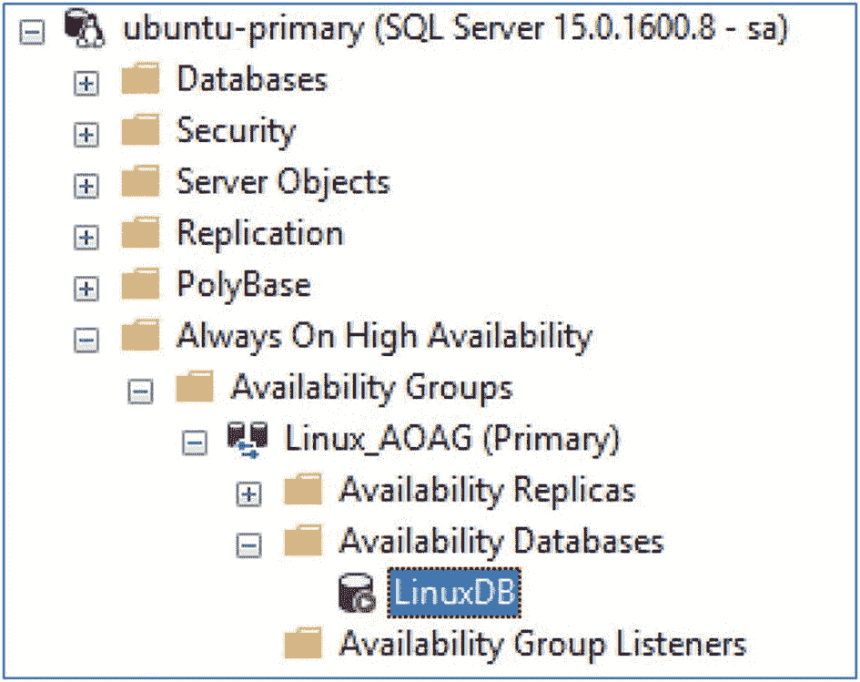

*图 14-12 Linux 服务器上已配置的可用性组*

最后，我们将使用清单 14-15 中的命令为可用性组创建一个侦听器。

```sql
ALTER AVAILABILITY GROUP Linux_AOAG
ADD LISTENER N'LinuxListener' (
WITH IP
(
('192.168.1.62', N'255.255.255.0')
)
, PORT=5022) ;
GO
```

*清单 14-15 创建可用性组侦听器*

### 分布式可用性组

分布式可用性组（DAG）是可用性组的扩展，允许在两个独立的可用性组之间同步数据。这是一项令人兴奋的技术，具有许多不同的用例。例如，它允许在 Windows 和 Linux 基础的可用性组之间进行数据同步，允许将可读辅助副本的数量扩展到超过 8 个（这是标准可用性组的限制），并且允许跨站点复制，而无需伸缩集群的复杂性。DAG 还可以通过在无法进行就地升级而需要进行并行迁移时提供数据同步来帮助服务器迁移。

虽然 DAG 的每一侧都可以是 Windows 故障转移群集，但这并不是必需的，因为其重点主要在于维护数据库，而不涉及集群配置。

在本节中，我们将通过为我们的 App1 可用性组在 PROSQLADMIN-C 集群和托管在两个参与 Pacemaker 集群的 Linux 服务器上的 `Linux_AOAG` 可用性组之间配置 DAG 来说明该技术。

第一步是在 Linux 集群上创建分布式可用性组。这可以通过使用清单 14-16 中的脚本来实现。注意 `WITH (DISTRIBUTED)` 语法，其后是每个可用性组的规范。

#### 注意

开始之前，您应该从 App1 可用性组中删除现有数据库；否则它将无法加入分布式可用性组，因为辅助可用性组必须为空。

```sql
CREATE AVAILABILITY GROUP DistributedAG
WITH (DISTRIBUTED)
AVAILABILITY GROUP ON
'App1' WITH
(
LISTENER_URL = 'tcp://App1Listener.prosqladmin.com:1433',
AVAILABILITY_MODE = ASYNCHRONOUS_COMMIT,
FAILOVER_MODE = MANUAL,
SEEDING_MODE = AUTOMATIC
),
'Linux_AOAG' WITH
(
LISTENER_URL = 'tcp://LinuxListener:5022',
AVAILABILITY_MODE = ASYNCHRONOUS_COMMIT,
FAILOVER_MODE = MANUAL,
SEEDING_MODE = AUTOMATIC
);
GO
```

*清单 14-16 创建分布式可用性组*

现在，我们可以针对 PROSQLADMIN-C 集群运行清单 14-17 中的命令，以将其加入分布式可用性组。

```sql
ALTER AVAILABILITY GROUP DistributedAG
JOIN
AVAILABILITY GROUP ON
'App1' WITH
(
LISTENER_URL = 'tcp://App1Listener.prosqladmin.com:1433',
AVAILABILITY_MODE = ASYNCHRONOUS_COMMIT,
FAILOVER_MODE = MANUAL,
SEEDING_MODE = AUTOMATIC
),
'Linux_AOAG' WITH
(
LISTENER_URL = 'tcp://LinuxListener:5022',
AVAILABILITY_MODE = ASYNCHRONOUS_COMMIT,
FAILOVER_MODE = MANUAL,
SEEDING_MODE = AUTOMATIC
) ;
GO
```

*清单 14-17 加入第二个可用性组*

#### 提示

数据库需要手动加入到辅助可用性组内的辅助副本。

### 管理 AlwaysOn 可用性组

初始设置完成后，您仍然需要执行管理任务。这些任务包括故障转移可用性组、监控，以及在极少数情况下添加额外的侦听器。以下各节将讨论这些主题。

#### 故障转移

如果某个副本处于同步提交模式并配置为自动故障转移，则在主副本上满足错误条件时，可用性组会自动移动到冗余副本。然而，有时您会希望手动故障转移可用性组。这可能是由于灾难恢复测试、主动维护，或者在主副本或主数据中心发生故障后需要启动异步副本所致。

### 同步故障转移

如果您希望故障转移一个处于**同步提交**模式的副本，请通过在对象资源管理器中右键单击您的可用性组，然后从上下文菜单中选择“故障转移”来启动“故障转移可用性组向导”。在跳过“简介”页面后，您将看到“选择新的主副本”页面（参见图 14-13）。在此页面上，勾选您想要故障转移到的副本对应的复选框。但在执行此操作之前，请检查“故障转移准备情况”列，以确保副本已同步且不会发生数据丢失。

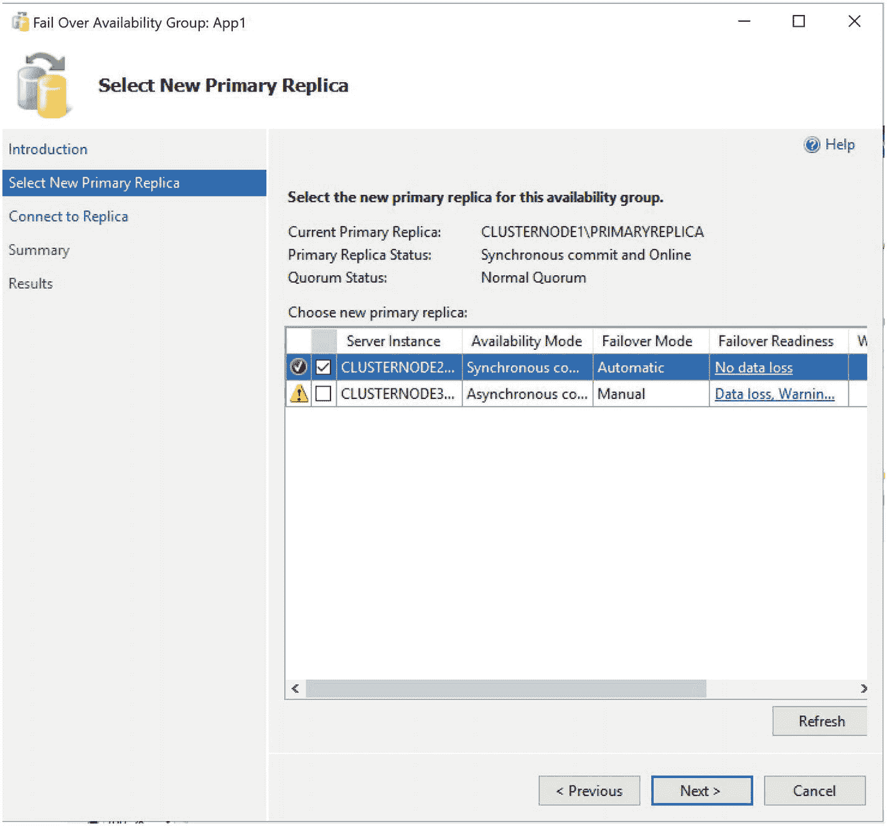

*图 14-13：“选择新的主副本”页面*

在“连接到副本”页面（如图 14-14 所示），使用“连接”按钮建立到新主副本的连接。

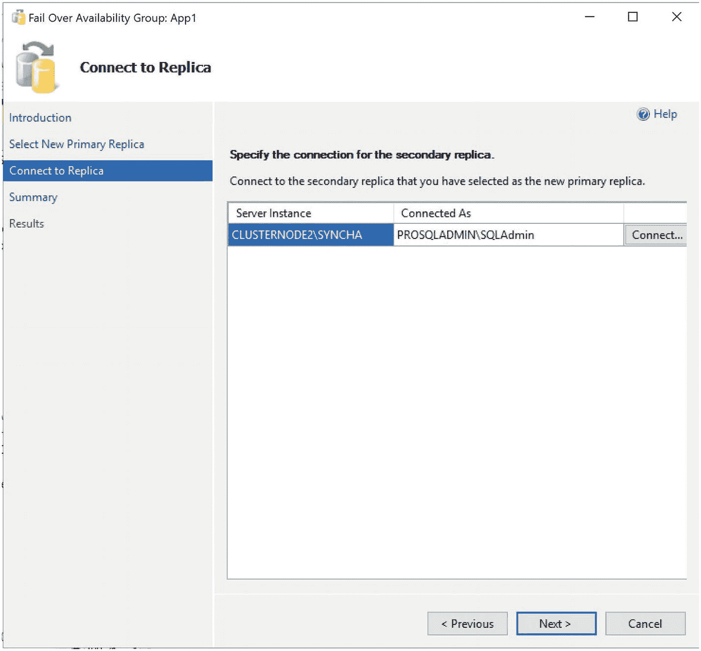

*图 14-14：“连接到副本”页面*

在“摘要”页面上，将显示要执行的任务详情，随后在“结果”页面上显示进度指示器。故障转移完成后，请检查所有任务是否成功，并调查收到的任何错误或警告。

我们也可以使用 T-SQL 来故障转移可用性组。清单 14-18 中的命令实现了相同的结果。请确保从将要成为新主副本的副本上运行此脚本。如果您从当前主副本运行它，请使用 SQLCMD 模式并在脚本中连接到新主副本。

```sql
ALTER AVAILABILITY GROUP App2 FAILOVER ;
GO
```

*清单 14-18: 故障转移可用性组*

### 异步故障转移

如果您的可用性组处于**异步提交**模式，那么从技术角度来看，您可以以类似于同步提交模式副本的方式进行故障转移，不同之处在于您需要强制故障转移，从而接受数据丢失的风险。您可以使用清单 14-19 中的命令强制故障转移。您应在将成为新主副本的实例上运行此脚本。为使其工作，集群必须具有仲裁。如果没有，则需要在强制可用性组联机之前强制集群联机。

```sql
ALTER AVAILABILITY GROUP App2 FORCE_FAILOVER_ALLOW_DATA_LOSS ;
```

*清单 14-19: 强制故障转移*

从流程角度来看，只有在您的主站点完全不可用时才应执行此操作。如果情况并非如此，首先应将应用程序置于安全状态。这可以避免任何数据丢失的可能性。我在生产环境中通常通过执行以下步骤来实现这一点：

1.  禁用登录名。
2.  将副本的模式更改为同步提交模式。
3.  进行故障转移。
4.  将副本更改回异步提交模式。
5.  启用登录名。

您可以使用清单 14-20 中的脚本来执行这些步骤。当从灾难恢复实例运行时，此脚本会在故障转移前将 `App2` 中的数据库置于安全状态，然后重新配置应用程序以在正常操作下工作。

```sql
--DISABLE LOGINS
DECLARE @AOAGDBs TABLE
(
DBName NVARCHAR(128)
) ;
INSERT INTO @AOAGDBs
SELECT database_name
FROM sys.availability_groups AG
INNER JOIN sys.availability_databases_cluster ADC
ON AG.group_id = ADC.group_id
WHERE AG.name = 'App2' ;

DECLARE @Mappings TABLE
(
LoginName NVARCHAR(128),
DBname NVARCHAR(128),
Username NVARCHAR(128),
AliasName NVARCHAR(128)
) ;
INSERT INTO @Mappings
EXEC sp_msloginmappings ;

DECLARE @SQL NVARCHAR(MAX)
SELECT DISTINCT @SQL =
(
SELECT 'ALTER LOGIN [' + LoginName + '] DISABLE; ' AS [data()]
FROM @Mappings M
INNER JOIN @AOAGDBs A
ON M.DBname = A.DBName
WHERE LoginName  SUSER_NAME()
FOR XML PATH ('')
)
EXEC(@SQL)
GO

--SWITCH TO SYNCHRONOUS COMMIT MODE
ALTER AVAILABILITY GROUP App2
MODIFY REPLICA ON N'CLUSTERNODE3\ASYNCDR' WITH (AVAILABILITY_MODE = SYNCHRONOUS_COMMIT) ;
GO

--FAIL OVER
ALTER AVAILABILITY GROUP App2 FAILOVER
GO

--SWITCH BACK TO ASYNCHRONOUS COMMIT MODE
ALTER AVAILABILITY GROUP App2
MODIFY REPLICA ON N'CLUSTERNODE3\ASYNCDR' WITH (AVAILABILITY_MODE = ASYNCHRONOUS_COMMIT) ;
GO

--ENABLE LOGINS
DECLARE @AOAGDBs TABLE
(
DBName NVARCHAR(128)
) ;
INSERT INTO @AOAGDBs
SELECT database_name
FROM sys.availability_groups AG
INNER JOIN sys.availability_databases_cluster ADC
ON AG.group_id = ADC.group_id
WHERE AG.name = 'App2' ;

DECLARE @Mappings TABLE
(
LoginName NVARCHAR(128),
DBname NVARCHAR(128),
Username NVARCHAR(128),
AliasName NVARCHAR(128)
) ;
INSERT INTO @Mappings
EXEC sp_msloginmappings

DECLARE @SQL NVARCHAR(MAX)
SELECT DISTINCT @SQL =
(
SELECT 'ALTER LOGIN [' + LoginName + '] ENABLE; ' AS [data()]
FROM @Mappings M
INNER JOIN @AOAGDBs A
ON M.DBname = A.DBName
WHERE LoginName  SUSER_NAME()
FOR XML PATH ('')
) ;
EXEC(@SQL)
```

*清单 14-20: 将应用程序置于安全状态并进行故障转移*

### 同步未包含对象

无论您使用哪种方法进行故障转移，假设可用性组中的所有数据库都是非包含的，那么您需要确保实例级对象已同步。保持实例级对象同步的最直接方法是实现一个 SSIS 包，并将其计划为定期运行。

无论您选择计划执行 SSIS 包，还是选择不同的方法，例如使用 SQL Server Agent 作业在辅助服务器上编写脚本并重新创建对象，以下是您应考虑同步的对象：

*   登录名
*   凭据
*   SQL Server Agent 作业
*   自定义错误消息
*   链接服务器
*   服务器级事件通知
*   Master 数据库中的存储过程
*   服务器级触发器
*   加密密钥和证书

#### 监控

实现可用性组后，您需要监控它们，并响应可能影响数据可用性的任何错误或警告。如果您在整个企业中实现了许多可用性组，那么有效且全面监控它们的唯一方法是使用企业监控工具，例如 SOC（系统操作中心）。但是，如果您只有少量可用性组，或者您正在对特定问题进行故障排除，那么 SQL Server 提供了 AlwaysOn 仪表板和 AlwaysOn 健康跟踪。以下部分将探讨这两个功能。

#### AlwaysOn 仪表板

AlwaysOn 仪表板是一个交互式报告，允许您查看 AlwaysOn 环境的运行状况，并钻取或汇总拓扑中的元素。您可以从对象资源管理器中“可用性组”文件夹的上下文菜单，或从可用性组本身的上下文菜单调用此报告。图 14-15 显示了从 `App2` 可用性组的上下文菜单生成的报告。您可以看到当前两个副本的同步状态都是健康的。

数据库可能处于的三种同步状态是 `SYNCHRONIZED`（已同步）、`SYNCRONIZING`（正在同步）和 `NOT SYNCHRONIZING`（未同步）。同步副本应处于 `SYNCHRONIZED` 状态，任何其他状态都是不健康的。然而，异步副本永远不会处于 `SYNCHRONIZED` 状态，而 `SYNCHRONIZING` 状态被认为是健康的。无论哪种模式，`NOT SYNCHRONIZING` 都表示副本未连接。

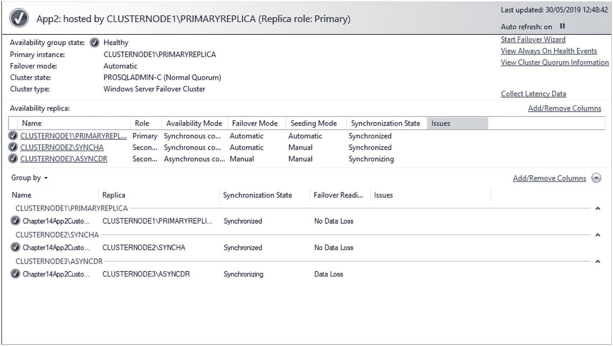

*图 14-15: 可用性组仪表板*


### AlwaysOn 可用性组管理注意事项

#### 注意

除了同步状态，副本还具有以下操作状态之一：`PENDING_FAILOVER`、`PENDING`、`ONLINE`、`OFFLINE`、`FAILED`、`FAILED_NO_QUORUM` 和 `NULL`（当副本断开连接时）。可以通过 `sys.dm_hadr_availability_replica_states` DMV 查看副本的操作状态。

在报告的右上角，有指向故障转移向导（本章前面讨论过）、AlwaysOn 健康事件（下一节讨论）以及查看集群仲裁信息的链接。此链接调用的“集群仲裁信息”屏幕如图 14-16 所示。您还可以在“可用性副本”窗口中深入查看每个副本，以获取特定于副本的详细信息。

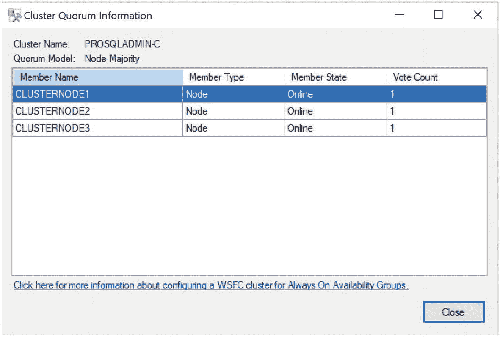

图 14-16
集群仲裁信息屏幕

##### AlwaysOn 健康跟踪

AlwaysOn 健康跟踪是一个扩展事件会话，在您创建第一个可用性组时创建。它可以在 SQL Server Management Studio 中找到，位于“扩展事件”➤“会话”下。通过其上下文菜单，您可以查看正在捕获的实时数据，或者进入会话属性以更改捕获事件的配置。

深入查看会话会显示其程序包，从程序包的上下文菜单中，您可以查看先前捕获的事件。图 14-17 显示了最近捕获的事件，即数据库 5（在我们的例子中是 `Chapter14App2Customers`）正在等待日志在同步副本上被固化。第 19 章详细讨论了扩展事件。

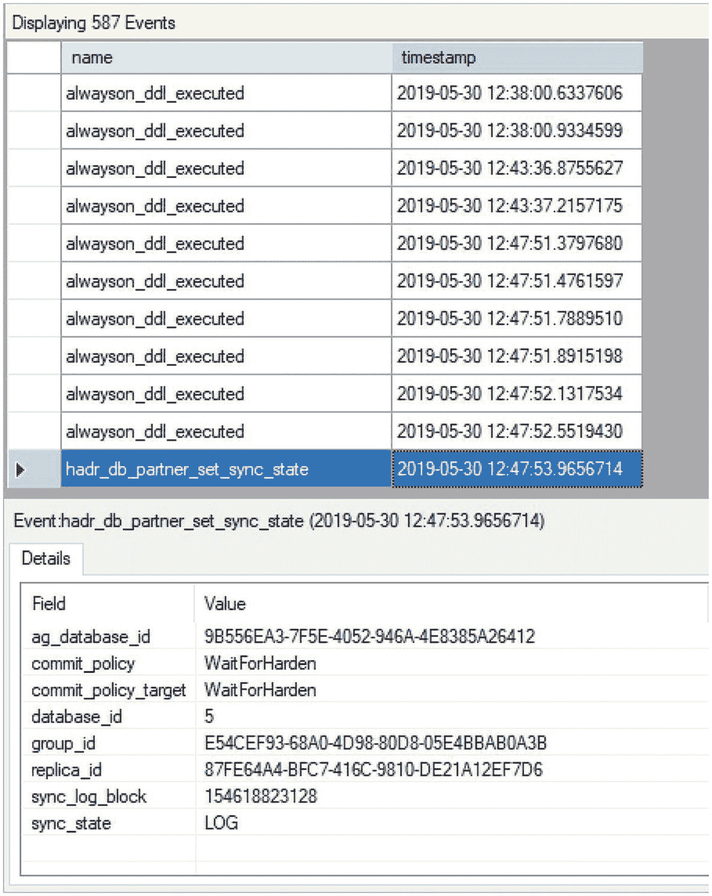

图 14-17
目标数据

#### 其他管理注意事项

当使用 AlwaysOn 可用性组使数据库保持高可用性时，会施加一些限制。其中最具限制性的是，数据库不能被置于 `single_user` 模式或设置为 `read only`。这在您需要为维护而将应用程序置于安全状态时会产生影响。这就是为什么在本章的“故障转移”一节中，我们禁用了映射到这些数据库用户的登录账户。如果您必须将数据库置于单用户模式，则必须首先将其从可用性组中移除。

可以通过执行清单 14-21 中的命令从可用性组中移除数据库。此命令将 `Chapter14App2Customers` 数据库从可用性组中移除。

```
ALTER DATABASE Chapter14App2Customers SET HADR OFF ;
```
清单 14-21
从可用性组中移除数据库

也可能有些情况下，您希望数据库保留在可用性组中，但希望暂停向其他副本的数据移动。这通常是因为可用性组处于同步提交模式，并且您在高使用期间需要提升性能。您可以使用清单 14-22 中的命令暂停数据库的数据移动，该命令暂停 `Chapter14App1Sales` 数据库的数据移动，然后恢复它。

#### 注意

如果暂停数据移动，主副本上的事务日志会继续增长，并且在数据移动恢复且数据库同步之前，您无法截断它。

```
ALTER DATABASE Chapter14App2Customers SET HADR SUSPEND ;
GO
ALTER DATABASE Chapter14App2Customers SET HADR RESUME ;
GO
```
清单 14-22
暂停数据移动

另一个重要的注意事项是数据库和日志文件的位置。这些文件在每个副本上必须位于相同的位置。这意味着，如果您使用命名实例，则必须为数据和日志更改默认文件位置，因为默认位置包含实例名称。当然，这是假设您不在每个节点上使用相同的实例名称，否则将违背使用命名实例的许多好处。

### 总结

AlwaysOn 可用性组最多可实现八个辅助副本，结合了同步和异步提交模式。在使用可用性组实现高可用性时，始终使用同步提交模式，因为异步提交模式不支持自动故障转移。然而，在实现同步提交模式时，您必须意识到在事务在主副本上提交之前先在辅助副本上提交所带来的相关性能损失。对于灾难恢复，您通常会选择实现异步提交模式。

可以通过“新建可用性组”向导、对话框、T-SQL 甚至 PowerShell 来创建可用性组。如果使用对话框创建可用性组，则某些方面（例如端点和相关权限）必须使用 T-SQL 或 PowerShell 进行脚本编写。

如果您使用可用性组实现灾难恢复，则需要配置多子网集群。然而，这并不意味着您必须在站点之间使用 SAN 复制，因为可用性组不依赖于共享存储。您需要做的是为管理集群访问点以及可用性组侦听器添加额外的 IP 地址。您还需要注意支持客户端重新连接的集群属性，以确保客户端不会遇到大量的超时。

在主副本发生故障时，故障转移到同步副本是自动的。然而，有些情况下您也需要手动进行故障转移。这可能是因为需要故障转移到灾难恢复站点的灾难，或者是为了主动维护。虽然可以故障转移到异步副本并存在数据丢失的可能性，但良好的做法是首先将数据库置于安全状态。因为如果数据库参与了可用性组，您就不能将其置于 `read only` 或 `single_user` 模式，所以安全状态通常包括禁用登录账户，然后在故障转移前切换到同步提交模式。

要在整个企业中监控可用性组，您需要使用监控工具，例如 Systems Operation Center。但是，如果您需要监控少量的可用性组或对特定问题进行故障排除，请使用 SQL Server 附带的工具之一，例如用于监控拓扑运行状况的仪表板，以及称为 AlwaysOn 健康跟踪的扩展事件会话。

您还应考虑其他维护任务。这些任务包括将数据库和日志文件放置在何处（因为它们必须在每个副本上具有相同的位置），以及从可用性组中移除数据库以便将其置于 `single_user` 模式（例如）。更改为 `single_user` 模式可能是由于需要以修复模式运行 `DBCC CHECKDB` 并暂停数据移动。暂停数据移动允许您在高使用期间消除性能开销，但要注意，它也会导致主副本上的事务日志增长，并且在数据移动恢复且数据库再次同步之前，没有选项可以截断它。


# 第 15 章 实施日志传送

正如第 13 章所讨论的，日志传送是一项可用于实现灾难恢复和横向扩展只读报告的技术。其工作原理是获取数据库的事务日志备份，将它们复制到一个或多个辅助服务器，然后进行还原，以保持辅助服务器同步。本章将演示如何为灾难恢复（DR）实施日志传送。你还将了解如何监视和故障转移日志传送。

> **注意：** 为便于本章的演示，我们将使用一个域，该域包含一个域控制器和四台独立服务器，每台服务器都安装了 SQL Server 实例。服务器\实例名称分别为 `PRIMARYSERVER\PROSQLADMIN`、`DRSERVER\PROSQLDR`、`REPORTSERVER\PROSQLREPORTS` 和 `MONITORSERVER\PROSQLMONITOR`。

### 为灾难恢复实施日志传送

在我们开始为灾难恢复实施日志传送之前，我们首先创建一个用于本章演示的数据库。代码清单 15-1 中的脚本创建了一个名为 `Chapter15` 的数据库，其恢复模式设置为 `FULL`。我们在数据库内创建一个表并向其填充数据。

```sql
--Create the database
CREATE DATABASE Chapter15;
GO
ALTER DATABASE Chapter15 SET RECOVERY FULL;
GO
USE Chapter15
GO
--Create and populate numbers table
DECLARE @Numbers TABLE
(
Number        INT
)
;WITH CTE(Number)
AS
(
SELECT 1 Number
UNION ALL
SELECT Number + 1
FROM CTE
WHERE Number < 100
)
INSERT INTO @Numbers
SELECT Number FROM CTE;
--Create and populate name pieces
DECLARE @Names TABLE
(
FirstName        VARCHAR(30),
LastName        VARCHAR(30)
);
INSERT INTO @Names
VALUES('Peter', 'Carter'),
('Michael', 'Smith'),
('Danielle', 'Mead'),
('Reuben', 'Roberts'),
('Iris', 'Jones'),
('Sylvia', 'Davies'),
('Finola', 'Wright'),
('Edward', 'James'),
('Marie', 'Andrews'),
('Jennifer', 'Abraham') ;
--Create and populate Customers table
CREATE TABLE dbo.Customers
(
CustomerID          INT            NOT NULL    IDENTITY    PRIMARY KEY,
FirstName           VARCHAR(30)    NOT NULL,
LastName            VARCHAR(30)    NOT NULL,
BillingAddressID    INT            NOT NULL,
DeliveryAddressID   INT            NOT NULL,
CreditLimit         MONEY          NOT NULL,
Balance             MONEY          NOT NULL
);
SELECT * INTO #Customers
FROM
(SELECT
(SELECT TOP 1 FirstName FROM @Names ORDER BY NEWID()) FirstName,
(SELECT TOP 1 LastName FROM @Names ORDER BY NEWID()) LastName,
(SELECT TOP 1 Number FROM @Numbers ORDER BY NEWID()) BillingAddressID,
(SELECT TOP 1 Number FROM @Numbers ORDER BY NEWID()) DeliveryAddressID,
(SELECT TOP 1 CAST(RAND() * Number AS INT) * 10000
FROM @Numbers
ORDER BY NEWID()) CreditLimit,
(SELECT TOP 1 CAST(RAND() * Number AS INT) * 9000
FROM @Numbers
ORDER BY NEWID()) Balance
FROM @Numbers a
CROSS JOIN @Numbers b
) a;
INSERT INTO dbo.Customers
SELECT * FROM #Customers;
GO
```

**代码清单 15-1** 创建用于日志传送的数据库

出于本次演示的目的，我们希望为 `Chapter15` 数据库配置灾难恢复，使其恢复点目标（RPO）为 10 分钟。同时，我们将在 DR 服务器上实现 10 分钟的加载延迟。这意味着，如果应用团队在发生导致数据丢失的事件（例如，用户意外删除了表中的行）后立即通知我们，那么我们能够在包含错误事务的日志被还原之前，利用 DR 服务器上的数据来纠正问题。

#### GUI 配置

我们可以通过 SQL Server Management Studio（SSMS）为 `Chapter15` 数据库配置日志传送。为此，我们从数据库的右键上下文菜单中选择**属性**，并导航到**事务日志传送**页面，如图 15-1 所示。此页面上的首要任务是选中**启用此为日志传送配置中的主数据库**复选框。

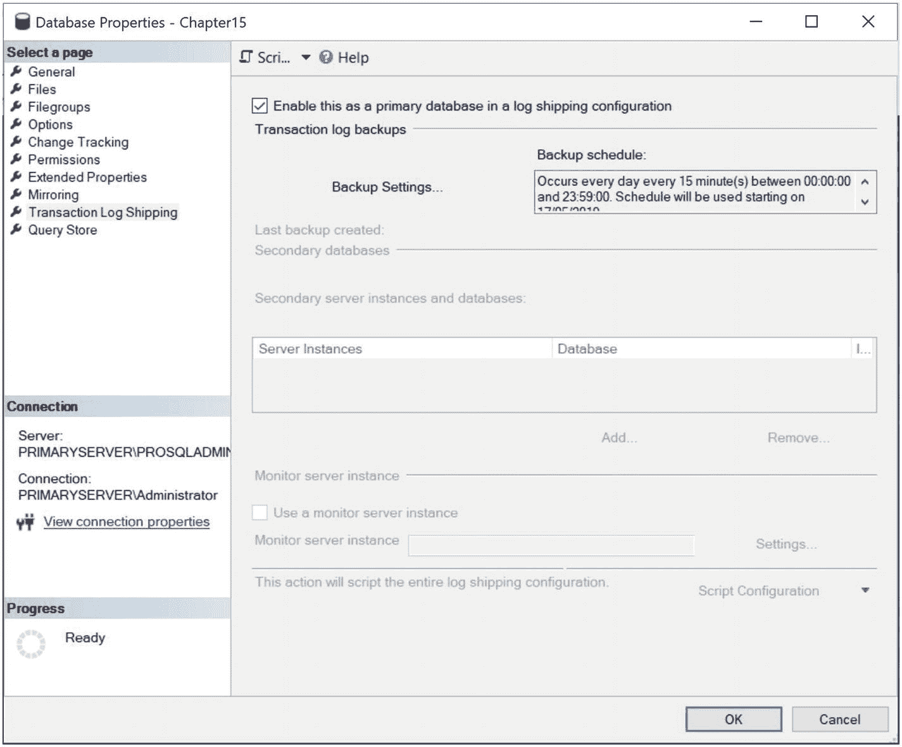

**图 15-1** 事务日志传送页面

现在，我们可以使用**备份设置**按钮来显示**事务日志备份设置**屏幕。在此屏幕上，我们输入用于存储日志传送所生成日志备份的共享文件夹的 UNC（通用命名约定）路径。由于此共享文件夹实际上配置在我们的主服务器上，因此我们还需要在下方的字段中输入本地路径。用于运行备份作业的帐户需要被授予对此共享文件夹的读取和更改权限。默认情况下，这将是 SQL Server 服务帐户，但为了更精细的安全性，可以将日志传送作业配置为在代理帐户下运行。代理帐户将在第 22 章讨论。

然后，我们配置备份文件在删除前需要保留多长时间。你选择的值取决于你企业的需求，但如果你的备份文件被卸载到磁带，那么你应该让文件保留足够长的时间以允许企业备份作业运行，并且可能还需要为其失败后在下一个周期成功预留足够的时间。你还应考虑对临时还原的需求。例如，如果一个项目发现数据问题并请求还原，你希望能够从本地磁盘检索相关的备份（如果可能的话）。因此，请考虑在 SQL Server 删除备份的本地副本之前，应给予项目多长时间来发现问题并请求还原。备份策略将在第 12 章进一步讨论。

你还应指定如果未发生日志备份，希望在多久后生成警报。为了能收到任何备份失败的通知，你可以将该值配置为比你的备份计划时间长一分钟。然而，在某些环境中，错过几次备份可能是可以接受的。在这种情况下，你可以将值设置为更大的间隔，以便在维护窗口和其他类似情况下不会被备份失败的警报淹没。

**设置备份压缩**下拉列表决定是否应使用备份压缩来减少网络流量。默认是从实例继承配置，但你可以通过明确选择使用或不使用它来覆盖日志传送作业所进行的备份的设置。**事务日志备份设置**屏幕如图 15-2 所示。

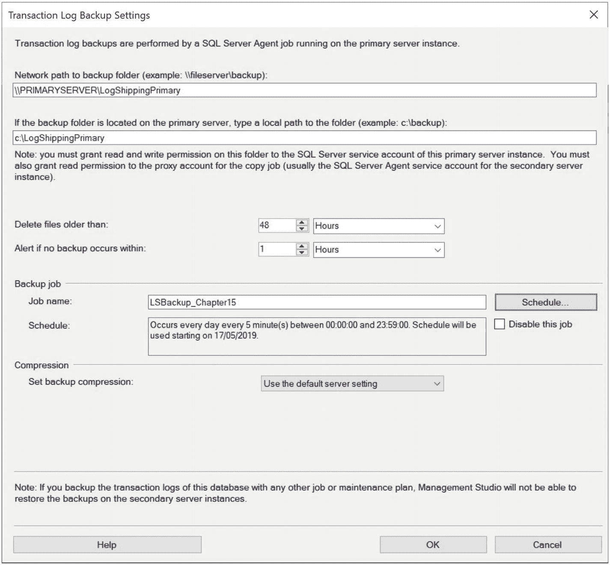

**图 15-2** 事务日志备份设置屏幕

点击**计划**按钮将调用**新建作业计划**屏幕。如图 15-3 所示，这个屏幕是用于创建作业计划的标准 SQL Server Agent 界面，只不过它已预先填入了日志传送备份作业的默认名称。由于我们试图实现 10 分钟的 RPO，我们将备份作业配置为每 5 分钟运行一次。这是因为我们还需要留出时间让复制作业运行。在灾难恢复规划中，我们不能假定主服务器始终可用以供我们检索日志备份。

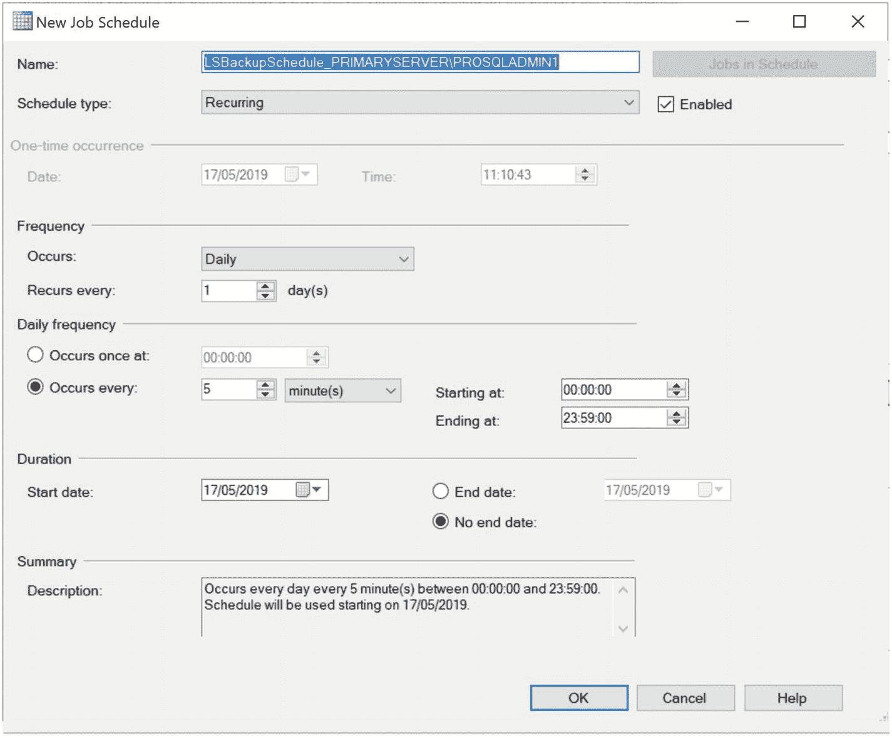

**图 15-3**


### 新建作业计划屏幕与日志传送配置

返回到“事务日志传送”页面后，我们可以使用“添加”按钮来为我们的日志传送拓扑配置辅助服务器。点击此按钮将显示“辅助数据库设置”页面。该页面包含三个选项卡。第一个是“初始化辅助数据库”选项卡，如图 15-4 所示。

### 初始化辅助数据库选项卡

在此选项卡上，我们配置如何初始化辅助数据库。我们可以通过执行数据库完整备份，然后使用 `NORECOVERY` 选项手动将其还原到辅助服务器来预初始化数据库。在这种情况下，我们将选择“否，辅助数据库已初始化”选项。

如果我们已有可用的完整备份，则可以将其放置在 SQL Server 服务帐户具有读取和修改权限的文件共享中，然后选择“是，将主数据库的现有备份还原到辅助数据库”选项并指定备份文件的位置。

然而，在我们这种情况下，我们没有 `Chapter15` 数据库的现有完整备份，因此我们选择“是，生成主数据库的完整备份并将其还原到辅助数据库”选项。这将显示“还原选项”窗口；正是在这里，我们输入希望在辅助服务器上创建数据库和事务日志文件的位置，如图 15-4 所示。

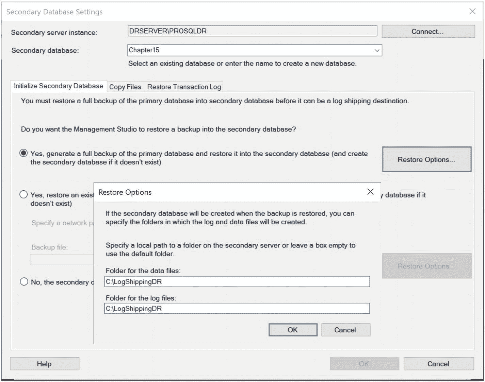

**图 15-4** 初始化辅助数据库选项卡

### 复制文件选项卡

在“复制文件”选项卡上（如图 15-5 所示），我们配置负责将事务日志文件从主服务器复制到辅助服务器的作业。首先，我们指定辅助服务器上用于复制事务日志的共享文件夹。运行复制作业的帐户必须配置对该共享文件夹的读取和修改权限。与备份作业一样，此作业默认在 SQL Server 服务帐户的上下文中运行，但您也可以将其配置为在代理帐户下运行。

我们还使用此选项卡配置备份文件在删除前应在辅助服务器上保留多长时间。我通常建议将此值与您在主服务器上指定的备份保留值保持一致，以确保一致性。

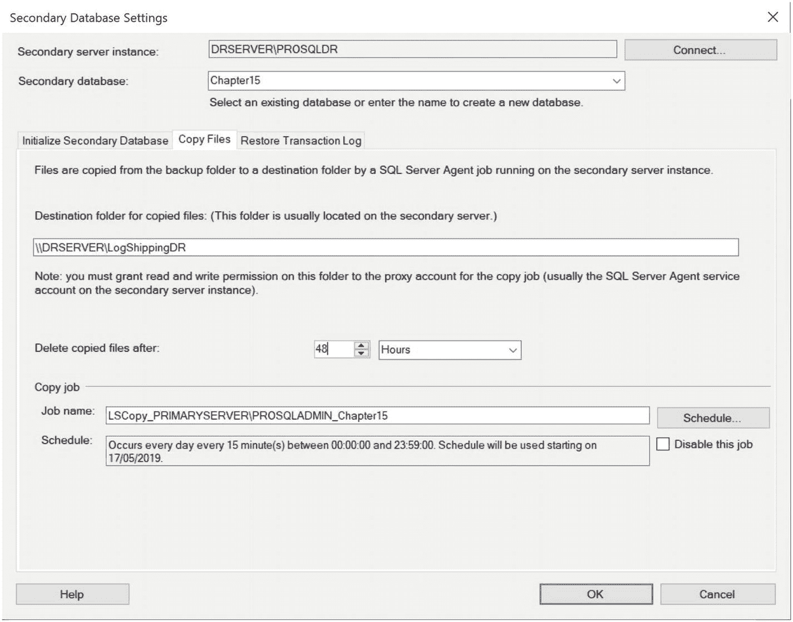

**图 15-5** 复制文件选项卡

`作业名称`字段会自动填充日志传送复制作业的默认名称，使用“计划”按钮可以调用“新建作业计划”屏幕，在其中配置复制作业的计划。如图 15-6 所示，我们已将此作业配置为每 5 分钟运行一次，这与我们 10 分钟的恢复点目标要求一致。日志备份需要 5 分钟，然后再过 5 分钟它会被移动到辅助服务器。一旦文件被移动到辅助服务器，我们可以确信，除了最极端的情况外，我们都能够从主服务器或辅助服务器检索到备份，从而实现 10 分钟的恢复点目标。

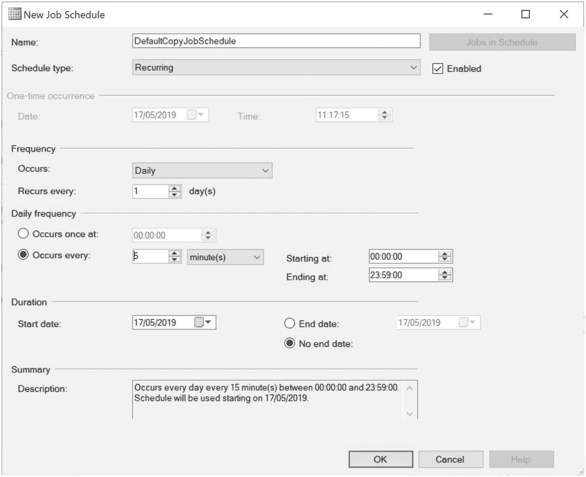

**图 15-6** 新建作业计划屏幕

### 还原事务日志选项卡

在“还原事务日志”选项卡上，我们配置负责在辅助服务器上还原备份的作业。此屏幕上最重要的选项是还原时选择的数据库状态。选择“无恢复模式”选项是适用于灾难恢复服务器的选择。这是因为如果您选择“备用模式”，未提交的事务将保存到一个事务撤消文件中，这意味着数据库可以以只读模式联机（如第 13 章所述）。然而，此操作会增加恢复时间，因为在下一次还原的重做阶段之前需要重新应用这些事务。

在此选项卡上，我们还使用 `延迟还原备份至少` 选项来应用加载延迟，这为用户提供了报告数据问题的机会。我们还可以指定在发出没有发生还原操作的警报之前应延迟多长时间。“还原事务日志”选项卡如图 15-7 所示。

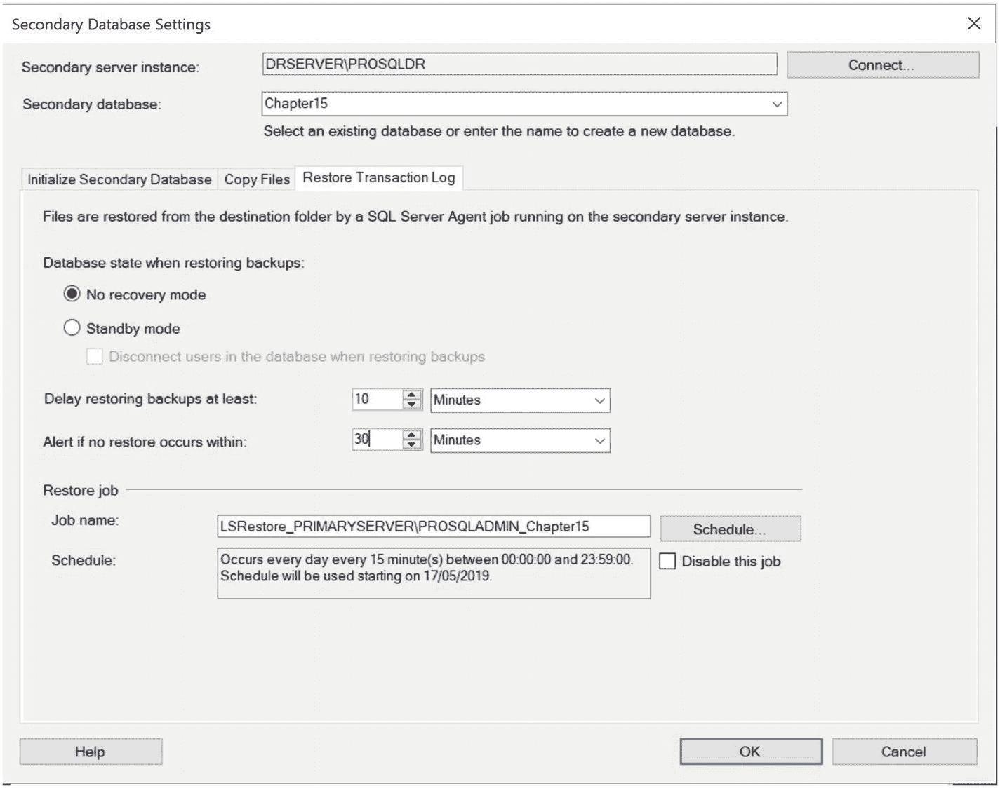

**图 15-7** 还原事务日志选项卡

“计划”按钮调用“新建作业计划”屏幕，如图 15-8 所示。在此屏幕上，我们可以为事务日志的还原配置作业计划。虽然这样做不是强制性的，但为了保持一致性，我通常建议配置此值，使其与备份和复制作业相同。

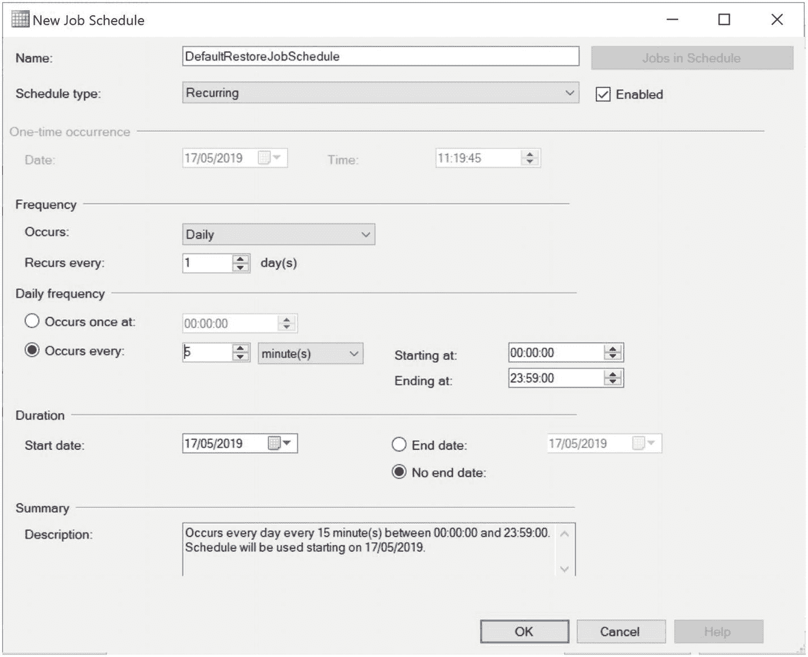

**图 15-8** 新建作业计划屏幕

### 监视服务器配置

返回到“事务日志传送”页面后，我们需要决定是否实现监视服务器。此选项允许我们配置一个实例，作为监视我们的日志传送拓扑的集中点。此时做出这个决定很重要，因为在配置完成后，没有官方方法可以在不拆除并重新配置日志传送的情况下向拓扑中添加监视服务器。

#### 提示

从技术上讲，可以在以后强制添加监视服务器，但此过程涉及手动更新 `MSDB` 中的日志传送元数据表。因此，不建议或不支持此操作。

要添加监视服务器，我们勾选“使用监视服务器实例”选项并输入服务器\实例名称。单击“设置”按钮将显示“日志传送监视器设置”屏幕。我们使用此屏幕（如图 15-9 所示）来配置如何连接到监视服务器以及历史记录保留设置。

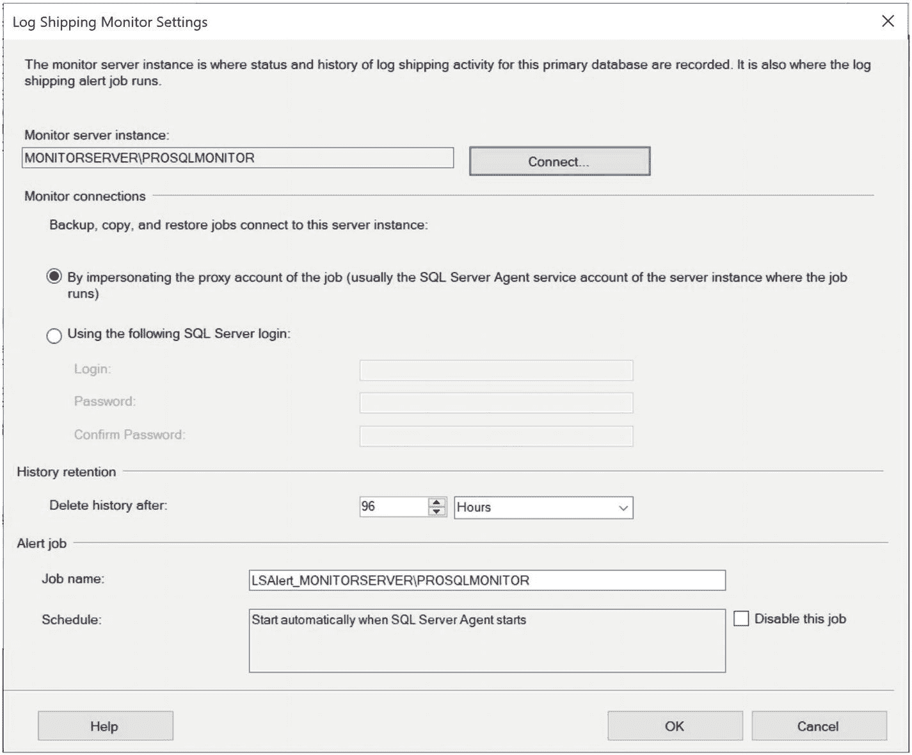

**图 15-9** 日志传送监视器设置屏幕

### 完成配置

现在我们的日志传送拓扑已完全配置，我们可以选择对配置进行脚本编写，这对于文档编制和变更控制的目的很有帮助。然后我们可以完成配置。配置进度显示在“保存日志传送配置”窗口中（参见图 15-10）。配置完成后，我们应该检查此窗口以查看在配置过程中是否发生了任何错误，并根据需要解决它们。日志传送配置问题最常见的原因是权限相关的，因此在我们继续之前，需要确保 SQL Server 服务帐户（或代理帐户）在文件共享和实例上具有正确的权限。

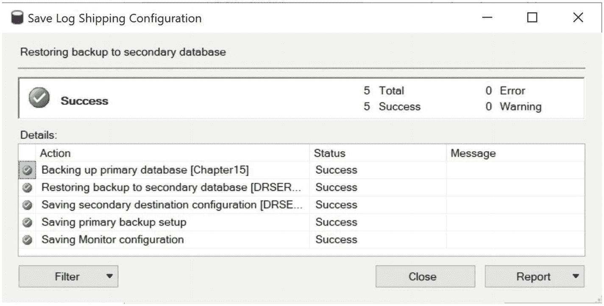

**图 15-10** 保存日志传送配置页面


#### T-SQL 配置

要通过 T-SQL 配置日志传送，我们需要运行一系列系统存储过程。第一个过程是`sp_add_log_shipping_primary_database`，用于配置备份作业并监控主数据库。该过程使用的参数描述见表 15-1。

表 15-1

`sp_add_log_shipping_primary_database`参数

| 参数 | 描述 |
| --- | --- |
| `@database` | 要为其配置日志传送的数据库名称。 |
| `@backup_directory` | 备份文件夹的本地路径。 |
| `@backup_share` | 备份文件夹的网络路径。 |
| `@backup_job_name` | 用于日志备份作业的名称。 |
| `@backup_retention_period` | 日志备份应保留的时长，以分钟为单位。 |
| `@monitor_server` | 监控服务器的服务器\实例名。 |
| `@monitor_server_Security_mode` | 连接到监控服务器时使用的身份验证模式。`0` 表示 SQL 身份验证，`1` 表示 Windows 身份验证。 |
| `@monitor_server_login` | 用于连接到监控服务器的账户（仅在使用 SQL 身份验证时指定）。 |
| `@monitor_server_password` | 用于连接到监控服务器的账户密码（仅在使用 SQL 身份验证时指定）。 |
| `@backup_threshold` | 在触发警报之前，可以经过多长时间而没有进行日志备份。 |
| `@threshold_alert` | 如果超过备份阈值将引发的警报。 |
| `@threshold_alert_enabled` | 指定是否应触发警报。`0` 禁用警报，`1` 启用警报。 |
| `@history_retention_period` | 日志备份作业历史记录将保留的时长，以分钟为单位。 |
| `@backup_job_id` | 一个`OUTPUT`参数，指定过程创建的备份作业的 GUID。 |
| `@primary_id` | 一个`OUTPUT`参数，指定主数据库的 ID。 |
| `@backup_compression` | 指定是否应使用备份压缩。`0` 表示禁用，`1` 表示启用，`2` 表示使用实例的默认配置。 |

列表 15-2 演示了如何使用`sp_add_log_shipping_primary_database`过程为`Chapter15`配置日志传送。此脚本使用`@backup_job_id output`参数将作业的 GUID 传递给`sp_update_job`存储过程。它还使用`sp_add_schedule`和`sp_attach_schedule`系统存储过程来创建作业计划并将其附加到作业。由于配置日志传送涉及连接到多个实例，我们添加了到主实例的连接。这意味着我们应该在 SQLCMD 模式下运行脚本。

#### 注意

`sp_update_job`、`sp_add_schedule`和`sp_attach_schedule`是用于操作 SQL Server 代理对象的系统存储过程。关于 SQL Server 代理的完整讨论可以在第 22 章找到。

```
--注意：此脚本应在 sqlcmd 模式下运行
:connect primaryserver\prosqladmin
DECLARE @LS_BackupJobId         UNIQUEIDENTIFIER
DECLARE @LS_BackUpScheduleID        INT
--将 Chapter15 数据库配置为日志传送的主数据库
EXEC master.dbo.sp_add_log_shipping_primary_database
@database = N'Chapter15'
,@backup_directory = N'c:\logshippingprimary'
,@backup_share = N'\\primaryserver\logshippingprimary'
,@backup_job_name = N'LSBackup_Chapter15'
,@backup_retention_period = 2880
,@backup_compression = 2
,@monitor_server = N'monitorserver.prosqladmin.com\prosqlmonitor'
,@monitor_server_security_mode = 1
,@backup_threshold = 60
,@threshold_alert_enabled = 1
,@history_retention_period = 5760
,@backup_job_id = @LS_BackupJobId OUTPUT ;
--为备份作业创建作业计划
EXEC msdb.dbo.sp_add_schedule
@schedule_name =N'LSBackupSchedule_primaryserver\prosqladmin1'
,@enabled = 1
,@freq_type = 4
,@freq_interval = 1
,@freq_subday_type = 4
,@freq_subday_interval = 5
,@freq_recurrence_factor = 0
,@active_start_date = 20190517
,@active_end_date = 99991231
,@active_start_time = 0
,@active_end_time = 235900
,@schedule_id = @LS_BackUpScheduleID OUTPUT ;
--将作业计划附加到作业
EXEC msdb.dbo.sp_attach_schedule
@job_id = @LS_BackupJobId
,@schedule_id = @LS_BackUpScheduleID  ;
--启用备份作业
EXEC msdb.dbo.sp_update_job
@job_id = @LS_BackupJobId
,@enabled = 1 ;
Listing 15-2
sp_add_log_shipping_primary_database
```

我们使用`sp_add_log_shipping_primary_secondary`系统存储过程更新主服务器上的元数据，以便在日志传送拓扑中为每个辅助服务器添加一条记录。它接受的参数描述见表 15-2。

表 15-2

`sp_add_log_shipping_primary_secondary`参数

| 参数 | 描述 |
| --- | --- |
| `@primary_database` | 主数据库的名称 |
| `@secondary_server` | 辅助服务器的服务器\实例 |
| `@secondary_database` | 辅助服务器上数据库的名称 |

列表 15-3 演示了如何使用`sp_add_log_shipping_primary_secondary`过程将我们的`DRSERVER\PROSQLDR`实例记录添加到主服务器。同样，我们专门连接到主服务器，这意味着脚本应在 SQLCMD 模式下运行。

```
:connect primaryserver\prosqladmin
EXEC master.dbo.sp_add_log_shipping_primary_secondary
@primary_database = N'Chapter15'
,@secondary_server = N'drserver\prosqldr'
,@secondary_database = N'Chapter15'
Listing 15-3
sp_add_log_shipping_primary_secondary
```

我们现在需要配置我们的 DR 服务器。此过程中的第一个任务是运行`sp_add_log_shipping_secondary_primary`系统存储过程。此过程创建将事务日志复制到辅助服务器并还原它们的 SQL Server 代理作业。它还配置监控。此存储过程接受的参数详见表 15-3。

表 15-3

`sp_add_log_shipping_secondary_primary`参数


| 参数 | 描述 |
| --- | --- |
| `@primary_server` | 主服务器的服务器\实例名称。 |
| `@primary_database` | 主数据库的名称。 |
| `@backup_source_directory` | 日志备份被复制出来的源文件夹。 |
| `@backup_destination_directory` | 日志备份被复制到的目标文件夹。 |
| `@copy_job_name` | 分配给用于复制事务日志的 SQL Server Agent 作业的名称。 |
| `@restore_job_name` | 分配给用于还原事务日志的 SQL Server Agent 作业的名称。 |
| `@file_retention_period` | 日志备份历史记录应保留的时长，以分钟为单位指定。 |
| `@monitor_server` | 监视服务器的服务器\实例名称。 |
| `@monitor_server_security_mode` | 用于连接到监视服务器的身份验证模式。`0` 表示 SQL 身份验证，`1` 表示 Windows 身份验证。 |
| `@monitor_server_login` | 用于连接到监视服务器的帐户（仅在指定了 SQL 身份验证时使用）。 |
| `@monitor_server_password` | 用于连接到监视服务器的帐户密码（仅在指定了 SQL 身份验证时使用）。 |
| `@copy_job_id` | `OUTPUT` 参数，指定为复制事务日志而创建的作业的 GUID。 |
| `@restore_job_id` | `OUTPUT` 参数，指定为还原事务日志而创建的作业的 GUID。 |
| `@secondary_id` | 一个 `OUTPUT` 参数，指定辅助数据库的 ID。 |

清单 15-4 演示了如何使用 `sp_add_log_shipping_secondary_primary` 存储过程将我们的 `DRSERVER\PROSQLDR` 实例配置为日志传送拓扑中的辅助服务器。该脚本显式连接到 DR 实例，因此我们应在 SQL 命令模式下运行它。就像设置主服务器时一样，我们使用输出参数传递给 SQL Server Agent 存储过程，以创建作业计划并启用作业。

```sql
--Note This script should be run in sqlcmd mode
:connect drserver\prosqldr
DECLARE @LS_Secondary__CopyJobId        AS uniqueidentifier
DECLARE @LS_Secondary__RestoreJobId        AS uniqueidentifier
DECLARE @LS_SecondaryCopyJobScheduleID        AS int
DECLARE @LS_SecondaryRestoreJobScheduleID        AS int
--Configure the secondary server
EXEC master.dbo.sp_add_log_shipping_secondary_primary
@primary_server = N'primaryserver\prosqladmin'
@primary_database = N'Chapter15'
,@backup_source_directory = N'\\primaryserver\logshippingprimary'
,@backup_destination_directory = N'\\drserver\logshippingdr'
,@copy_job_name = N'LSCopy_primaryserver\prosqladmin_Chapter15'
,@restore_job_name = N'LSRestore_primaryserver\prosqladmin_Chapter15'
,@file_retention_period = 2880
,@monitor_server = N'monitorserver.prosqladmin.com\prosqlmonitor'
,@monitor_server_security_mode = 1
,@copy_job_id = @LS_Secondary__CopyJobId OUTPUT
,@restore_job_id = @LS_Secondary__RestoreJobId OUTPUT ;
--Create the schedule for the copy job
EXEC msdb.dbo.sp_add_schedule
@schedule_name =N'DefaultCopyJobSchedule'
,@enabled = 1
,@freq_type = 4
,@freq_interval = 1
,@freq_subday_type = 4
,@freq_subday_interval = 15
,@freq_recurrence_factor = 0
,@active_start_date = 20190517
,@active_end_date = 99991231
,@active_start_time = 0
,@active_end_time = 235900
,@schedule_id = @LS_SecondaryCopyJobScheduleID OUTPUT ;
--Attach the schedule to the copy job
EXEC msdb.dbo.sp_attach_schedule
@job_id = @LS_Secondary__CopyJobId
,@schedule_id = @LS_SecondaryCopyJobScheduleID  ;
--Create the job schedule for the restore job
EXEC msdb.dbo.sp_add_schedule
@schedule_name =N'DefaultRestoreJobSchedule'
,@enabled = 1
,@freq_type = 4
,@freq_interval = 1
,@freq_subday_type = 4
,@freq_subday_interval = 15
,@freq_recurrence_factor = 0
,@active_start_date = 20190517
,@active_end_date = 99991231
,@active_start_time = 0
,@active_end_time = 235900
,@schedule_id = @LS_SecondaryRestoreJobScheduleID OUTPUT ;
--Attch the schedule to the restore job
EXEC msdb.dbo.sp_attach_schedule
@job_id = @LS_Secondary__RestoreJobId
,@schedule_id = @LS_SecondaryRestoreJobScheduleID  ;
--Enable the jobs
EXEC msdb.dbo.sp_update_job
@job_id = @LS_Secondary__CopyJobId
,@enabled = 1 ;
EXEC msdb.dbo.sp_update_job
@job_id = @LS_Secondary__RestoreJobId
,@enabled = 1 ;
Listing 15-4
sp_add_log_shipping_secondary_primary
```

我们的下一步是配置辅助数据库。我们可以通过使用 `sp_add_log_shipping_secondary_database` 存储过程来执行此任务。此过程接受的参数详见表 15-4。

表 15-4

sp_add_log_shipping_secondary_database 参数

| 参数 | 描述 |
| --- | --- |
| `@secondary_database` | 辅助数据库的名称。 |
| `@primary_server` | 主服务器的服务器\实例。 |
| `@primary_database` | 主数据库的名称。 |
| `@restore_delay` | 指定负载延迟（以分钟为单位）。 |
| `@restore_all` | 设置为 `1` 时，还原作业会还原所有可用的日志备份。设置为 `0` 时，还原作业仅应用单个日志备份。 |
| `@restore_mode` | 指定还原作业要使用的备份模式。`1` 表示 `STANDBY`，`0` 表示 `NORECOVERY`。 |
| `@disconnect_users` | 确定在应用事务日志备份时是否应断开用户与数据库的连接。`1` 表示断开连接，`0` 表示不断开连接。仅在 `STANDBY` 模式下还原日志时适用。 |
| `@block_size` | 指定备份设备的块大小（以字节为单位）。 |
| `@buffer_count` | 指定还原操作可使用的内存缓冲区总数。 |
| `@max_transfer_size` | 指定可以发送到备份设备的请求的最大大小（以字节为单位）。 |
| `@restore_threshold` | 在生成警报之前，可以经过的、未应用还原操作的时间量；以分钟为单位指定。 |
| `@threshold_alert` | 如果超过还原阈值将引发的警报。 |
| `@threshold_alert_enabled` | 指定是否启用警报。`1` 表示启用，`0` 表示禁用。 |
| `@history_retention_period` | 还原历史记录的保留期，以分钟为单位指定。 |
| `@Ignoreremotemonitor` | 一个未公开记录的参数，部分控制内部日志传送数据库日志的更新方式。 |

清单 15-5 演示了如何使用 `sp_add_log_shipping_secondary_database` 为日志传送配置我们的辅助数据库。由于我们显式连接到 `DRSERVER\PROSQLDR` 实例，因此该脚本应在 SQLCMD 模式下运行。

```sql
:connect drserver\prosqldr
EXEC master.dbo.sp_add_log_shipping_secondary_database
@secondary_database = N'Chapter15'
,@primary_server = N'primaryserver\prosqladmin'
,@primary_database = N'Chapter15'
,@restore_delay = 10
,@restore_mode = 0
,@disconnect_users         = 0
,@restore_threshold        = 30
,@threshold_alert_enabled  = 1
,@history_retention_period = 5760
,@ignoreremotemonitor = 1
Listing 15-5
sp_add_log_shipping_secondary_database
```

最后的任务是同步监视服务器和 DR 服务器。我们通过使用（令人惊讶地）未公开记录的存储过程 `sp_processlogshippingmonitorsecondary` 来完成此操作。此过程接受的参数详见表 15-5。

表 15-5

sp_processlogshippingmonitorsecondary


| **参数** | **描述** |
| --- | --- |
| `@mode` | 数据库使用的恢复模式。`0` 表示 `NORECOVERY`，`1` 表示 `STANDBY`。 |
| `@secondary_server` | 辅助服务器的 `server\instance`。 |
| `@secondary_database` | 辅助数据库的名称。 |
| `@secondary_id` | 辅助服务器的 ID。 |
| `@primary_server` | 主服务器的 `server\instance`。 |
| `@monitor_server` | 监视服务器的 `server\instance`。 |
| `@monitor_server_security_mode` | 连接到监视服务器时使用的身份验证模式。 |
| `@primary_database` | 主数据库的名称。 |
| `@restore_threshold` | 在触发警报之前，可以经过而不应用还原的时间量；以分钟为单位指定。 |
| `@threshold_alert` | 如果超过警报还原阈值则触发的警报。 |
| `@threshold_alert_enabled` | 指定警报是启用还是禁用。 |
| `@last_copied_file` | 最后一次复制到辅助服务器的日志备份的文件名。 |
| `@last_copied_date` | 上次将日志复制到辅助服务器的日期和时间。 |
| `@last_copied_date_utc` | 上次将日志复制到辅助服务器的日期和时间，已转换为 UTC（协调世界时）。 |
| `@last_restored_file` | 最后在辅助服务器上还原的事务日志备份的文件名。 |
| `@last_restored_date` | 上次在辅助服务器上还原日志的日期和时间。 |
| `@last_restored_date_utc` | 上次在辅助服务器上还原日志的日期和时间，已转换为 UTC。 |
| `@last_restored_latency` | 主服务器上最后一次日志备份与其在辅助服务器上对应的还原操作完成之间经过的时间。 |
| `@history_retention_period` | 历史记录保留的持续时间，以分钟为单位。 |

列表 15-6 中的脚本演示了如何使用 `sp_processlogshippingmonitorsecondary` 存储过程来同步我们的 DR 服务器和监视服务器之间的信息。我们应该在监视服务器上运行该脚本，并且由于我们显式连接到 `MONITORSERVER\PROSQLMONITOR` 实例，我们应该在 SQLCMD 模式下运行脚本。

```
:connect monitorserver\prosqlmonitor
EXEC msdb.dbo.sp_processlogshippingmonitorsecondary
@mode = 1
,@secondary_server = N'drserver\prosqldr'
,@secondary_database = N'Chapter15'
,@secondary_id = N''
,@primary_server = N'primaryserver\prosqladmin'
,@primary_database = N'Chapter15'
,@restore_threshold = 30
,@threshold_alert = 14420
,@threshold_alert_enabled = 1
,@history_retention_period        = 5760
,@monitor_server = N'monitorserver.prosqladmin.com\prosqlmonitor'
,@monitor_server_security_mode = 1
Listing 15-6
sp_processlogshippingmonitorsecondary
```

### 日志传送维护

配置日志传送后，你仍然有持续的维护任务需要执行，例如在需要时故障转移到辅助服务器，以及切换主服务器和辅助服务器角色。以下部分将讨论这些主题。我们还将讨论如何使用监视服务器来监视日志传送环境。

#### 故障转移日志传送

如果你的主服务器出现问题，或者你的主站点发生故障，你需要故障转移到辅助服务器。为此，首先要备份日志的末尾部分。我们将在第 15 章中完整讨论此过程，但该过程本质上涉及备份事务日志而不截断它，并使用 `NORECOVERY`。这会阻止用户连接到数据库，从而避免任何进一步的数据丢失。显然，这仅在主数据库可访问时才可能。你可以使用列表 15-7 中的脚本对 `Chapter15` 数据库执行此操作。

```
BACKUP LOG Chapter15
TO  DISK = N'c:\logshippingprimary\Chapter15_tail.trn'
WITH  NO_TRUNCATE, NAME = N'Chapter15-Full Database Backup', NORECOVERY
GO
Listing 15-7
备份日志的末尾部分
```

下一步是手动复制日志的末尾部分以及任何其他尚未复制到辅助服务器的日志。完成后，你需要按顺序手动将未完成的事务日志备份还原到辅助服务器。你需要应用备份时使用 `NORECOVERY`，直到达到最后一个备份。这个最后的备份使用 `RECOVERY` 应用。这会导致任何未提交的事务被回滚，并且数据库上线。列表 15-8 演示了将最后两个事务日志应用到辅助数据库。

```
--Restore the first transaction log
RESTORE LOG Chapter15
FROM  DISK = N'C:\LogShippingDR\Chapter15.trn'
WITH  FILE = 1,  NORECOVERY,  STATS = 10 ;
GO
--Restore the tail end of the log
RESTORE LOG Chapter15
FROM  DISK = N'C:\LogShippingDR\Chapter15_tail.trn'
WITH  FILE = 1,  RECOVERY, STATS = 10 ;
GO
Listing 15-8
应用事务日志
```

#### 切换角色

将日志传送故障转移到辅助服务器后，你可能希望交换服务器角色，以便你故障转移到的辅助服务器成为新的主服务器，而原始主服务器变为辅助服务器。为了实现这一点，首先你需要禁用主服务器上的备份作业以及辅助服务器上的复制和还原作业。我们可以使用列表 15-9 中的脚本为我们的日志传送拓扑执行此任务。因为我们连接到多个服务器，我们需要在 SQLCMD 模式下运行此脚本。

```
:connect primaryserver\prosqladmin
USE [msdb]
GO
--Disable backup job
EXEC msdb.dbo.sp_update_job @job_name = 'LSBackup_Chapter15',
@enabled=0 ;
GO
:connect drserver\prosqldr
USE [msdb]
GO
--Diable copy job
EXEC msdb.dbo.sp_update_job @job_name='LSCopy_primaryserver\prosqladmin_Chapter15',
@enabled=0 ;
GO
--Disable restore job
EXEC msdb.dbo.sp_update_job @job_name='LSRestore_primaryserver\prosqladmin_Chapter15',
@enabled=0 ;
GO
Listing 15-9
禁用日志传送作业
```

下一步是在新的主服务器上重新配置日志传送。执行此操作时，请配置以下内容：

*   确保你使用与原始主服务器相同的备份共享。
*   确保添加辅助数据库时，指定最初是主数据库的数据库。
*   指定同步选项为“否，辅助数据库已初始化”。

列表 15-10 中的脚本为我们的新辅助服务器执行此操作。由于我们连接到多个服务器，我们应该在 SQLCMD 模式下运行脚本。


```
:connect drserver\prosqldr
DECLARE @LS_BackupJobId        AS uniqueidentifier
DECLARE @SP_Add_RetCode        As int
DECLARE @LS_BackUpScheduleID   AS int
EXEC @SP_Add_RetCode = master.dbo.sp_add_log_shipping_primary_database
@database = N'Chapter15'
,@backup_directory = N'\\primaryserver\logshippingprimary'
,@backup_share = N'\\primaryserver\logshippingprimary'
,@backup_job_name = N'LSBackup_Chapter15'
,@backup_retention_period = 2880
,@backup_compression = 2
,@backup_threshold = 60
,@threshold_alert_enabled = 1
,@history_retention_period = 5760
,@backup_job_id = @LS_BackupJobId OUTPUT
,@overwrite = 1
EXEC msdb.dbo.sp_add_schedule
@schedule_name =N'LSBackupSchedule_DRSERVER\PROSQLDR1'
,@enabled = 1
,@freq_type = 4
,@freq_interval = 1
,@freq_subday_type = 4
,@freq_subday_interval = 5
,@freq_recurrence_factor = 0
,@active_start_date = 20190517
,@active_end_date = 99991231
,@active_start_time = 0
,@active_end_time = 235900
,@schedule_id = @LS_BackUpScheduleID OUTPUT
EXEC msdb.dbo.sp_attach_schedule
@job_id = @LS_BackupJobId
,@schedule_id = @LS_BackUpScheduleID
EXEC msdb.dbo.sp_update_job
@job_id = @LS_BackupJobId
,@enabled = 1
EXEC master.dbo.sp_add_log_shipping_primary_secondary
@primary_database = N'Chapter15'
,@secondary_server = N'primaryserver\prosqladmin'
,@secondary_database = N'Chapter15'
,@overwrite = 1
:connect primaryserver\prosqladmin
DECLARE @LS_Secondary__CopyJobId        AS uniqueidentifier
DECLARE @LS_Secondary__RestoreJobId        AS uniqueidentifier
DECLARE @LS_Add_RetCode        As int
DECLARE @LS_SecondaryCopyJobScheduleID        AS int
DECLARE @LS_SecondaryRestoreJobScheduleID        AS int
EXEC @LS_Add_RetCode = master.dbo.sp_add_log_shipping_secondary_primary
@primary_server = N'DRSERVER\PROSQLDR'
,@primary_database = N'Chapter15'
,@backup_source_directory = N'\\primaryserver\logshippingprimary'
,@backup_destination_directory = N'\\primaryserver\logshippingprimary'
,@copy_job_name = N'LSCopy_DRSERVER\PROSQLDR_Chapter15'
,@restore_job_name = N'LSRestore_DRSERVER\PROSQLDR_Chapter15'
,@file_retention_period = 2880
,@overwrite = 1
,@copy_job_id = @LS_Secondary__CopyJobId OUTPUT
,@restore_job_id = @LS_Secondary__RestoreJobId OUTPUT
EXEC msdb.dbo.sp_add_schedule
@schedule_name =N'DefaultCopyJobSchedule'
,@enabled = 1
,@freq_type = 4
,@freq_interval = 1
,@freq_subday_type = 4
,@freq_subday_interval = 5
,@freq_recurrence_factor = 0
,@active_start_date = 20190517
,@active_end_date = 99991231
,@active_start_time = 0
,@active_end_time = 235900
,@schedule_id = @LS_SecondaryCopyJobScheduleID OUTPUT
EXEC msdb.dbo.sp_attach_schedule
@job_id = @LS_Secondary__CopyJobId
,@schedule_id = @LS_SecondaryCopyJobScheduleID
EXEC msdb.dbo.sp_add_schedule
@schedule_name =N'DefaultRestoreJobSchedule'
,@enabled = 1
,@freq_type = 4
,@freq_interval = 1
,@freq_subday_type = 4
,@freq_subday_interval = 5
,@freq_recurrence_factor = 0
,@active_start_date = 20190517
,@active_end_date = 99991231
,@active_start_time = 0
,@active_end_time = 235900
,@schedule_id = @LS_SecondaryRestoreJobScheduleID OUTPUT
EXEC msdb.dbo.sp_attach_schedule
@job_id = @LS_Secondary__RestoreJobId
,@schedule_id = @LS_SecondaryRestoreJobScheduleID
EXEC master.dbo.sp_add_log_shipping_secondary_database
@secondary_database = N'Chapter15'
,@primary_server = N'DRSERVER\PROSQLDR'
,@primary_database = N'Chapter15'
,@restore_delay = 10
,@restore_mode = 0
,@disconnect_users         = 0
,@restore_threshold        = 30
,@threshold_alert_enabled  = 1
,@history_retention_period = 5760
,@overwrite = 1
EXEC msdb.dbo.sp_update_job
@job_id = @LS_Secondary__CopyJobId
,@enabled = 1
EXEC msdb.dbo.sp_update_job
@job_id = @LS_Secondary__RestoreJobId
,@enabled = 1
```
`清单 15-10` 重新配置日志传送

最后一步是重新配置监控，使其能正确监控我们的新配置。我们可以通过使用`清单 15-11`中的脚本，为我们的日志传送环境实现这一点。该脚本会连接到主服务器和辅助服务器，因此我们应该在 `SQLCMD` 模式下运行它。

```
:connect drserver\prosqldr
USE msdb
GO
EXEC master.dbo.sp_change_log_shipping_secondary_database
@secondary_database = N'database_name',
@threshold_alert_enabled = 0 ;
GO
:connect primaryserver\prosqladmin
USE msdb
GO
EXEC master.dbo.sp_change_log_shipping_primary_database
@database=N'database_name',
@threshold_alert_enabled = 0 ;
GO
```
`清单 15-11` 重新配置监控

因为我们现在已经在两台服务器上创建了备份、复制和还原作业，所以在后续故障转移后切换角色会变得非常直接。从现在开始，故障转移后，我们只需禁用原主服务器上的备份作业以及辅助服务器上的复制和还原作业，然后启用新主服务器上的备份作业以及新辅助服务器上的复制和还原作业，即可切换角色。


#### 监控

监控日志传送拓扑最重要的方面是确保备份在主服务器上执行，并在辅助服务器上被还原。因此，在本章中配置日志传送时，我们调整了备份和还原的可接受阈值，并在监控服务器上创建了服务器代理警报。然而，要使这些警报有用，我们需要为它们配置一个操作员来接收通知。

在监控服务器上，我们配置了两个警报。第一个名为 **日志传送主服务器警报**，查看其属性的 **常规** 选项卡时，可以看到它被配置为响应 `错误 14420`，如图 15-11 所示。`错误 14420` 表示在定义的时限内未对主数据库进行备份。

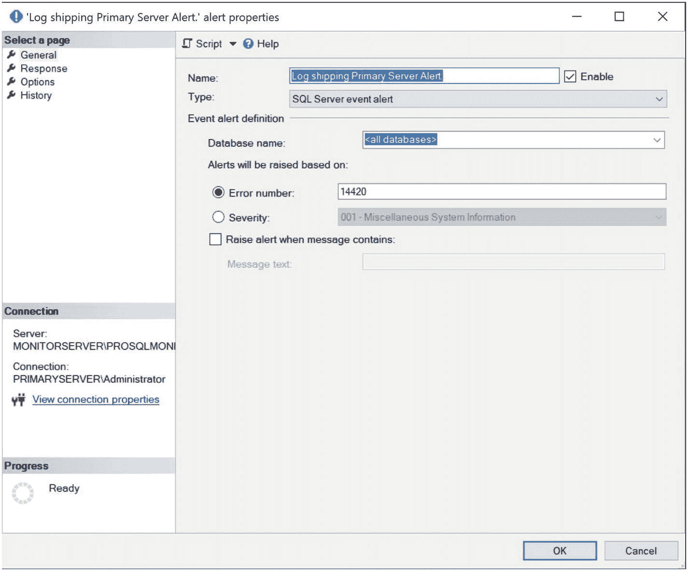
图 15-11: **常规** 选项卡

在 **响应** 选项卡（如图 15-12 所示）中，我们需要配置一个操作员来接收警报。你可以使用 **新建操作员** 按钮配置一个新操作员，或者像我们这样，只需在列表中为相应的操作员选择适当的通知通道。你还可以选择运行一个 SQL Server 代理作业来尝试修复该状况。

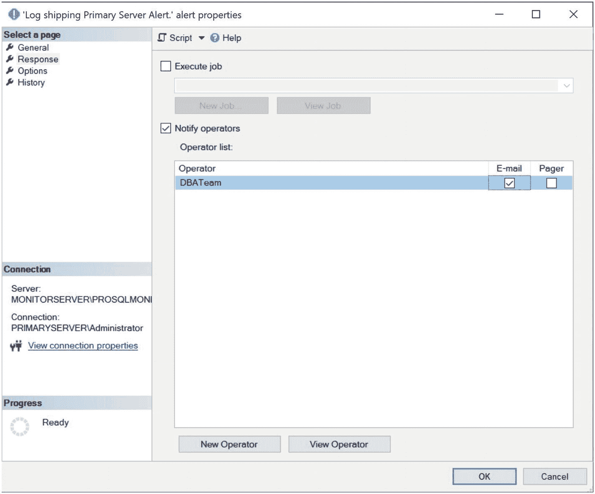
图 15-12: **响应** 选项卡

你应该以配置 **日志传送主服务器警报** 的相同方式来配置 **日志传送辅助服务器警报**。辅助服务器警报的工作方式相同，只是它监控的是 `错误 14421` 而不是 `14420`。`错误 14421` 表示在时限内未将事务日志还原到辅助服务器。

可以从 **SQL Server Management Studio** 运行日志传送报告。在监控服务器上运行时，它会显示主服务器和每个辅助服务器的状态。在主服务器上运行时，它会基于备份作业显示每个数据库的状态，并包含每个辅助服务器的一行信息。在灾难恢复服务器上运行时，它会基于还原作业显示每个数据库的状态。你可以通过调用实例的上下文菜单，依次选择 **报告** -> **标准报告**，然后选择 **事务日志传送状态** 报告来访问该报告。

图 15-13 展示了在主服务器上运行的报告。你可以看到备份作业的状态已设置为 **警报**，并且文本以红色高亮显示。这表明主数据库上成功备份的阈值已被突破。在我们的案例中，我们通过禁用备份作业模拟了这种情况。我们本可以通过使用 `sp_help_log_shipping_monitor` 存储过程获得相同的信息。

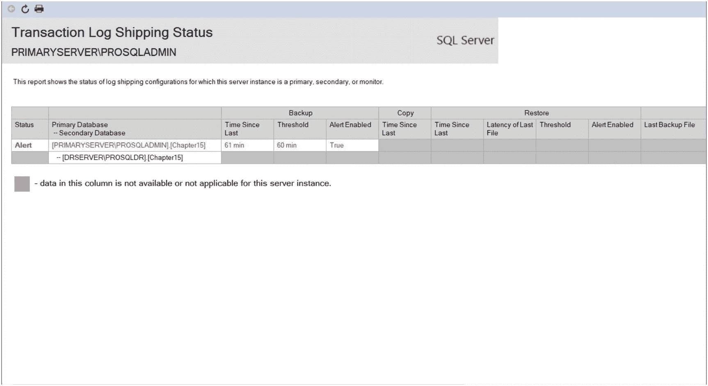
图 15-13: **日志传送** 报告

### 摘要

日志传送是一种可用于为数据库实现灾难恢复的技术。它通过备份主数据库的事务日志、将其复制到辅助服务器，然后将其还原来同步数据。如果使用 `STANDBY` 选项还原日志，那么未提交的事务将存储在一个事务撤消文件中，你可以在后续备份之前重新应用它们。这意味着你可以将数据库联机为只读模式以进行报告。然而，如果使用 `NORECOVERY` 选项还原日志，那么服务器就为灾难恢复调用做好了准备，但数据库处于脱机状态。

将数据库故障转移到辅助服务器涉及备份事务日志的尾端，然后将所有未完成的日志备份应用到辅助数据库，最后通过使用 `RECOVERY` 选项执行最终还原来使数据库联机。如果你希望切换服务器角色，则需要禁用当前的日志传送作业，重新配置日志传送使辅助服务器现在成为主服务器，然后重新配置监控。然而，在后续故障转移之后，切换角色会变得更容易，因为你可以简单地禁用和启用日志传送所使用的相应 **SQL Server 代理** 作业。

要监控日志传送拓扑的运行状况，你应该配置日志传送警报，并添加一个在警报触发时将收到通知的操作员。主服务器的警报监控 `错误 14420`，这表示已超出备份阈值。辅助服务器的警报监控 `错误 14421`，这表示已超出还原阈值。

提供了一个日志传送报告；它返回有关主数据库、辅助数据库或拓扑中所有服务器的数据，具体取决于它是从主服务器、辅助服务器还是监控服务器调用的。相同的信息可以从 `sp_help_log_shipping_monitor` 存储过程获得。

# 16. 扩展工作负载

SQL Server 提供了多种技术，允许数据库管理员在多个数据库之间水平扩展其工作负载以避免锁争用，或在服务器之间水平扩展以分散资源利用率。这些技术包括数据库快照、复制和 **AlwaysOn** 可用性组。本章讨论这些技术的注意事项并演示如何实施它们。


### 数据库快照

一个`数据库快照`是数据库在某个时间点的视图，一旦生成便永不改变。它使用写入时复制技术工作；这意味着如果源数据库中的某个页面被修改，该页面的原始版本会被复制到一个 NTFS 稀疏文件中，该文件由数据库快照使用。`稀疏文件`是一种起始为空、不分配磁盘空间的文件。随着源数据库中的页面被更新，且这些页面被复制到稀疏文件中，文件会相应增长以容纳它们。此过程如图 16-1 所示。

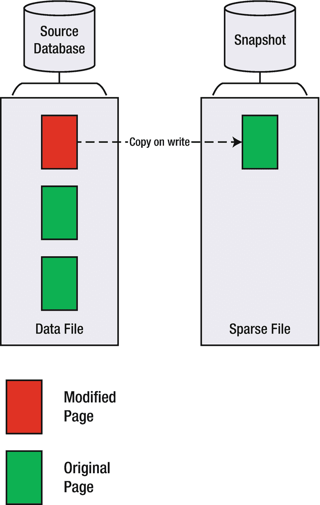

图 16-1 数据库快照

如果用户对数据库快照运行查询，SQL Server 会检查所需的页面是否存在于数据库快照中。任何存在的页面都从数据库快照返回，而其他任何页面则从源数据库中检索，如图 16-2 所示。在此示例中，为了满足查询，SQL Server 需要返回`页面 1:100`和`页面 1:101`。自快照创建以来，`页面 1:100`在源数据库中已被修改。因此，该页面的原始版本已被复制到稀疏文件中，SQL Server 从那里检索它。另一方面，自快照创建以来，`页面 1:101`在源数据库中未被修改。因此，它不存在于稀疏文件中，SQL Server 从源数据库检索它。

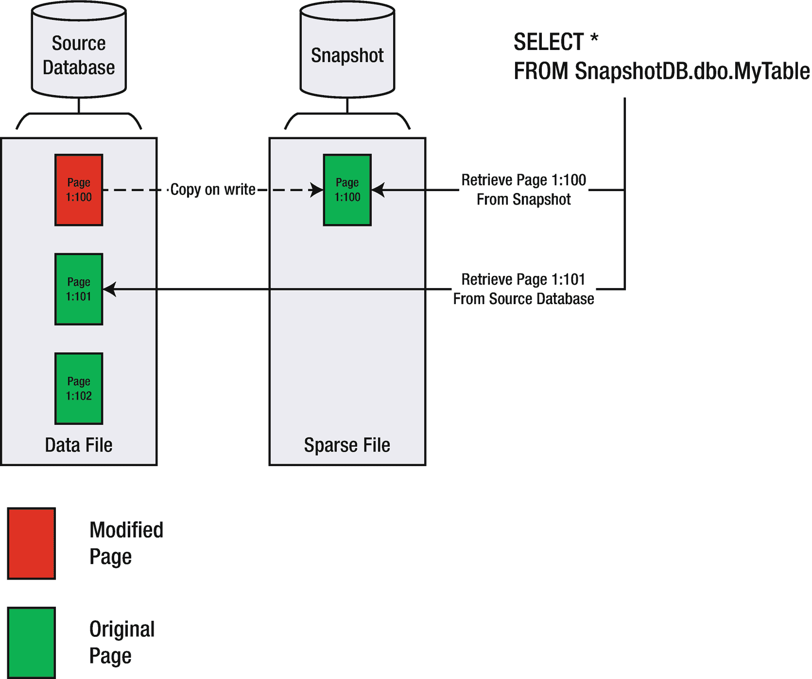

图 16-2 查询数据库快照

如果您的数据层应用程序正遭受由锁引起的争用，那么您可以将报表查询外扩到数据库快照。然而，需要注意的重要一点是，因为数据库快照必须与源数据库驻留在同一实例上，它无助于克服资源利用率问题。事实上，情况恰恰相反。因为任何修改过的页面都必须复制到稀疏文件中，所以`IO`开销会增加。内存占用也会增加，因为每个数据库的缓冲区高速缓存中页面都被复制了。

#### 提示

在执行`IO`密集型任务时，可能存在数据库快照可能是不合适的。我见过几个场景——一个涉及在`VLDB`上重建索引，另一个涉及在复制拓扑中订阅者数据库上的快照——其中写入时复制线程和鬼影清理线程相互阻塞得如此严重，以至于进程永远无法完成。如果您遇到此场景，并且必须在`IO`密集型任务期间保留快照，那么唯一的解决方法是使用`跟踪标志 661`禁用鬼影清理任务。然而，需要警告的是，如果您采用此方法，已删除的行将永远不会自动移除，您必须通过其他方式清理它们，例如重建所有索引。

除了数据库快照的资源开销外，当您使用它们来减少报表查询的争用时，遇到的另一个问题是，随着源数据库中的页面被修改，数据会变得陈旧。为了克服这一点，您可以创建一个元数据驱动的脚本来定期刷新快照。这将在第 17 章演示。

然而，数据变旧的问题也可能是一个优势，因为它带来两个好处：首先，这意味着您可以将快照用于历史报表目的；其次，这意味着您可以在发生用户错误后使用数据库快照恢复数据。需要警告的是，这些快照不能提供针对`IO`错误或数据库故障的弹性，您不能用它们来替代数据库备份。

### 实现数据库快照

在演示如何创建数据库快照之前，我们首先创建`Chapter16`数据库，本章的演示都将使用此数据库。代码清单 16-1 中的脚本创建此数据库并用数据填充它。

```sql
CREATE DATABASE Chapter16 ;
GO
USE Chapter16
GO
CREATE TABLE Customers
(
ID                  INT            PRIMARY KEY        IDENTITY,
FirstName           NVARCHAR(30),
LastName            NVARCHAR(30),
CreditCardNumber    VARBINARY(8000)
) ;
GO
--Populate the table
DECLARE @Numbers TABLE
(
Number        INT
)
;WITH CTE(Number)
AS
(
SELECT 1 Number
UNION ALL
SELECT Number + 1
FROM CTE
WHERE Number < 100
)
INSERT INTO @Numbers
SELECT Number FROM CTE ;
DECLARE @Names TABLE
(
FirstName       VARCHAR(30),
LastName        VARCHAR(30)
) ;
INSERT INTO @Names
VALUES('Peter', 'Carter'),
('Michael', 'Smith'),
('Danielle', 'Mead'),
('Reuben', 'Roberts'),
('Iris', 'Jones'),
('Sylvia', 'Davies'),
('Finola', 'Wright'),
('Edward', 'James'),
('Marie', 'Andrews'),
('Jennifer', 'Abraham'),
('Margaret', 'Jones') ;
INSERT INTO Customers(Firstname, LastName, CreditCardNumber)
SELECT  FirstName, LastName, CreditCardNumber FROM
(SELECT
(SELECT TOP 1 FirstName FROM @Names ORDER BY NEWID()) FirstName
,(SELECT TOP 1 LastName FROM @Names ORDER BY NEWID()) LastName
,(SELECT CONVERT(VARBINARY(8000)
,(SELECT TOP 1 CAST(Number * 100 AS CHAR(4))
FROM @Numbers
WHERE Number BETWEEN 10 AND 99
ORDER BY NEWID()) + '-' +
(SELECT TOP 1 CAST(Number * 100 AS CHAR(4))
FROM @Numbers
WHERE Number BETWEEN 10 AND 99
ORDER BY NEWID()) + '-' +
(SELECT TOP 1 CAST(Number * 100 AS CHAR(4))
FROM @Numbers
WHERE Number BETWEEN 10 AND 99
ORDER BY NEWID()) + '-' +
(SELECT TOP 1 CAST(Number * 100 AS CHAR(4))
FROM @Numbers
WHERE Number BETWEEN 10 AND 99
ORDER BY NEWID()))) CreditCardNumber
FROM @Numbers a
CROSS JOIN @Numbers b
) d ;
```
代码清单 16-1 创建 `Chapter16` 数据库

要在`Chapter16`数据库上创建数据库快照，我们使用`CREATE DATABASE`语法，并添加`AS SNAPSHOT OF`子句，如代码清单 16-2 所示。文件数量必须与源数据库的文件数量匹配，并且快照必须使用唯一的名称创建。`.ss`文件扩展名是标准的，但不是强制性的。我知道一些`DBA`会使用`.ndf`扩展名，如果他们无法获得额外文件扩展名的防病毒例外。然而，如果可能，我建议使用`.ss`扩展名，因为它清楚地标识文件与快照相关联。

```sql
CREATE DATABASE Chapter16_ss_0630
ON PRIMARY
( NAME = N'Chapter16', FILENAME = N'F:\MSSQL\DATA\Chapter16_ss_0630.ss' )
AS SNAPSHOT OF Chapter16 ;
```
代码清单 16-2 创建数据库快照

每个数据库快照必须具有唯一名称的事实，如果您计划使用多个快照，可能会给连接的应用程序带来问题；这是因为应用程序不知道它们应该连接到哪个数据库的名称。您可以通过以编程方式将应用程序指向最新的数据库快照来解决此问题。您可以在代码清单 16-3 中找到如何执行此操作的示例。此脚本创建并运行一个返回`Customers`表中所有数据的存储过程。它首先动态检查基于`Chapter16`数据库的最近快照的名称，这意味着数据将始终从最近的快照返回。

```sql
USE Chapter16
GO
CREATE PROCEDURE dbo.usp_Dynamic_Snapshot_Query
AS
BEGIN
DECLARE @LatestSnashot NVARCHAR(128)
DECLARE @SQL NVARCHAR(MAX)
SET @LatestSnashot = (
SELECT TOP 1 name from sys.databases
WHERE source_database_id = DB_ID('Chapter16')
ORDER BY create_date DESC ) ;
SET @SQL = 'SELECT * FROM ' + @LatestSnashot + '.dbo.Customers' ;
EXEC(@SQL) ;
END
EXEC dbo.usp_Dynamic_Snapshot_Query ;
```
代码清单 16-3 将客户端定向到最新快照


#### 从快照中恢复数据

如果用户错误导致数据丢失，那么数据库快照可以让数据库管理员无需从备份中恢复数据库就能找回数据，这可以减少解决问题的恢复时间目标。假设一个用户意外截断了 `Chapter16` 数据库中的 `Contacts` 表；我们可以通过从快照中重新插入来恢复这些数据，如代码清单 16-4 所示。

```
--Truncate the table
TRUNCATE TABLE Chapter16.dbo.Customers ;
--Allow Identity values to be re-inserted
SET IDENTITY_INSERT Chapter16.dbo.Customers ON ;
--Insert the data
INSERT INTO Chapter16.dbo.Customers(ID, FirstName, LastName, CreditCardNumber)
SELECT *
FROM Chapter16_ss_0630.dbo.Customers ;
--Turn off IDENTITY_INSERT
SET IDENTITY_INSERT Chapter16.dbo.Customers OFF ;
代码清单 16-4
恢复丢失的数据
```

如果源数据库的大部分内容因用户错误而损坏，那么与逐个修复数据问题相比，从快照中恢复整个数据库可能更快。你可以使用带有 `FROM DATABASE_SNAPSHOT` 语法的 `RESTORE` 命令来完成此操作，如代码清单 16-5 所示。

**注意**

如果你希望恢复的数据库存在多个快照，那么在运行此脚本之前，你必须删除除你计划用于恢复的那个快照之外的所有其他快照。

```
USE Master
GO
RESTORE DATABASE Chapter16
FROM DATABASE_SNAPSHOT = 'Chapter16_ss_0630' ;
代码清单 16-5
从数据库快照中恢复
```

### 复制

SQL Server 提供了一套复制技术，可用于在实例之间分散数据。你可以将复制用于多种目的，包括卸载报表处理、整合来自多个站点的数据、支持数据仓库以及与移动用户交换数据。

#### 复制概念

复制的术语借鉴自出版业。复制拓扑的组成部分在表 16-1 中描述。

**表 16-1**

**复制组件**

| 组件 | 描述 |
| --- | --- |
| 发布服务器 | 发布服务器是向其他位置提供数据的实例。这本质上是主服务器。 |
| 订阅服务器 | 订阅服务器是从发布服务器接收数据的实例。这本质上是从属服务器。一个复制拓扑可以有多个订阅服务器。 |
| 分发服务器 | 分发服务器是存储复制技术元数据的实例，也可能承担处理工作负载。该实例可能与发布服务器是同一个实例。 |
| 项目 | 项目是一个被复制的数据库对象，例如表或视图。可以对项目进行筛选，以减少需要复制的数据量。 |
| 发布 | 发布是来自数据库的一组项目，作为一个单元进行复制。 |
| 订阅 | 订阅是订阅服务器接收发布的请求。它定义了订阅服务器接收哪些发布。订阅有两种类型：推送订阅和请求订阅。在请求订阅模型中，负责移动数据的分发代理或合并代理运行在每个订阅服务器上。在推送模型中，分发代理或合并代理运行在分发服务器上。 |
| 复制代理 | 复制代理是位于 SQL Server 之外的应用程序，用于执行各种任务。使用的代理取决于你实现的复制类型。 |

图 16-3 说明了复制组件如何在复制拓扑中组合在一起。在此示例中，两个订阅服务器各自接收相同的发布，并且分发服务器已与发布服务器分离。这被称为*远程分发器*。如果发布服务器和分发服务器共享同一个实例，则称为*本地分发器*。

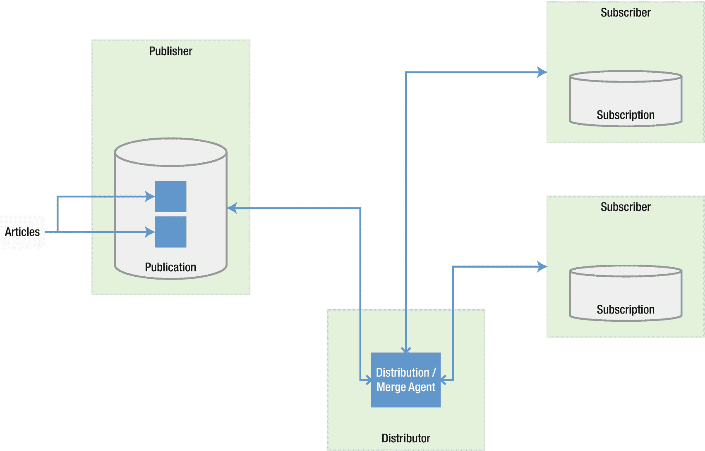

**图 16-3**

**复制组件概览**

#### 复制类型

SQL Server 提供了三种主要的复制类型：快照复制、事务性复制和合并复制。这些复制技术将在以下部分介绍。

##### 快照

快照复制的工作原理是在同步发生时获取所有项目的完整副本；因此，它不需要跟踪同步之间的数据更改。如果你在项目上定义了筛选器，则只会复制筛选后的数据。这意味着快照复制除了在同步发生时之外，没有额外开销。然而，当同步确实发生时，如果要复制的数据量很大，资源开销可能会非常高。

快照代理为发布中的每个项目创建一个系统视图和一个系统存储过程。它使用这些对象来生成项目的内容。它还创建架构文件，在使用 `BCP`（大容量复制程序）批量复制数据之前，先将这些架构文件应用到订阅数据库。

由于其资源利用特性，快照复制最适合以下情况：被复制的数据集较小且不常更改，或者在短时间内发生大量更改。（例如，这可能包括每月更新的价目表。）此外，快照复制是你用于对事务性复制和合并复制执行初始同步的默认机制。

使用快照复制时，快照代理在发布服务器上运行以生成发布。然后，分发代理（运行在分发服务器或每个订阅服务器上）将发布应用到订阅服务器。快照复制始终单向工作，这意味着订阅服务器永远无法更新发布服务器。


##### 事务复制

事务复制的工作原理是读取发布服务器上事务日志中的事务，然后将这些事务重新应用到订阅服务器上。运行在发布服务器上的`日志读取器代理`负责读取事务，在标记为复制的所有日志记录被处理完毕之前，`VLF`不会被截断。这意味着，如果同步间隔时间很长且发生了大量数据修改，则您的事务日志存在增长甚至空间耗尽的风险。从日志中读取事务后，`分发代理`会将这些事务应用到订阅服务器。该代理在推送订阅模型中运行于分发服务器上，或在拉取订阅模型中运行于每个订阅服务器上。同步由`SQL Server 代理`作业调度，这些作业配置为运行复制代理。您可以根据需求配置同步，使其连续或定期发生。默认情况下，初始数据同步使用`快照代理`执行。

事务复制通常用于服务器到服务器的场景，其中发布服务器上存在大量的数据修改，并且发布服务器与订阅服务器之间有可靠的网络连接。全局数据仓库就是这样一个例子，它将数据子集复制到区域数据仓库。

标准的事务复制始终单向工作，这意味着订阅服务器无法更新发布服务器。不过，SQL Server 还提供了对等事务复制。在对等拓扑中，每个服务器既充当发布服务器，又充当拓扑中其他服务器的订阅服务器。这意味着您在任何一台服务器上所做的更改都会被复制到拓扑中的所有其他服务器。

由于所有服务器都可以接受更新，因此有可能发生冲突。因此，当每个对等节点在数据的不同分区上接受更新时，对等复制最为合适。如果确实发生冲突，您可以配置 SQL Server 应用具有最高`OriginatorID`（分配给拓扑中每个节点的唯一整数）的事务，或者选择手动解决冲突，这是推荐的方法。

#### 提示

如果您无法在节点之间对可更新数据进行分区，并且冲突很可能发生，那么您可能会发现合并复制是更好的技术选择。

##### 合并复制

合并复制允许您同时更新发布服务器和订阅服务器。这对于客户端-服务器场景是一个很好的选择，例如移动销售人员可以在他们的笔记本电脑上输入订单，然后与主销售数据库同步。它在一些服务器到服务器的场景中也很有用——例如，通过`ETL`过程更新的区域数据仓库，然后汇总到全局数据仓库中。

合并复制通过在每个作为发布中文章的表上维护一个`rowguid`来工作。如果该表没有设置了`ROWGUID`属性的`uniqueidentifier`列，合并复制会添加一个。当对表进行数据修改时，会触发一个触发器，该触发器维护一系列更改跟踪表。当`合并代理`运行时，它只应用行的最新版本。这意味着跟踪发生的更改会消耗大量资源，但作为权衡，合并复制在实际同步更改时的开销是最低的。

由于订阅服务器和发布服务器都可以被更新，因此存在行之间发生冲突的风险。您可以使用冲突解决程序来管理这些冲突。合并复制提供了 12 个开箱即用的冲突解决程序，包括“最早者胜出”、“最新者胜出”和“订阅者总是胜出”。您也可以编程自定义基于`COM`的冲突解决程序，或选择手动解决冲突。

由于您可以在客户端-服务器场景中使用合并复制，它提供了一种称为“Web 同步”的技术来更新订阅服务器。使用 Web 同步时，在提取更改后，`合并代理`会向`IIS`发出`HTTPS`请求，并以`XML`消息的形式将数据更改发送给订阅服务器。运行在订阅服务器上的`复制侦听器`和`合并复制协调器`进程会处理这些数据更改，然后将订阅服务器上进行的任何数据修改发送回发布服务器。

### 实现事务复制

最适合用于扩展工作负载的复制类型是标准事务复制。我们将在以下部分讨论如何实现该技术。

#### 注意

对于本节的演示，我们使用两个实例：`WIN-KIAGK4GN1MJ\PROSQLADMIN` 和 `WIN-KIAGK4GN1MJ\PROSQLADMIN2`。

##### 实现分发服务器

在为第 16 章的数据库配置事务复制之前，我们将先把我们的实例配置为分发服务器。这可以通过`配置分发向导`实现，可以通过右键单击`复制`并选择`配置分发`来调用该向导。向导的第一页是`分发服务器`页面，如图 16-4 所示。在此页面上，我们可以选择使用当前实例作为分发服务器，或指定一个不同的实例。

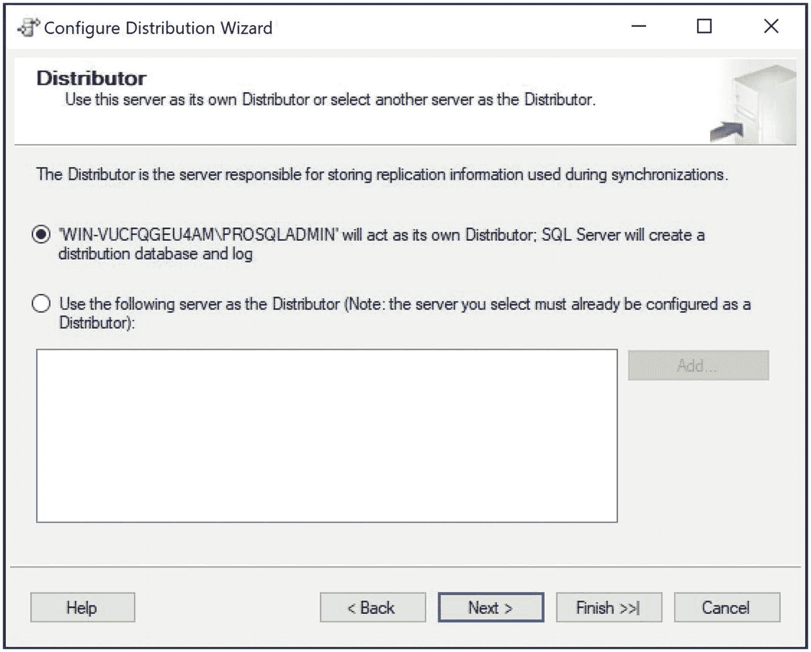

*图 16-4 分发服务器页面*

由于我们的实例当前未配置为自动启动`SQL Server 代理`服务，我们现在看到`SQL Server 代理启动`页面，它警告我们此情况。这是因为复制代理依赖`SQL Server 代理`进行调度和运行。我们选择将`SQL Server 代理`配置为自动启动的选项，如图 16-5 所示。

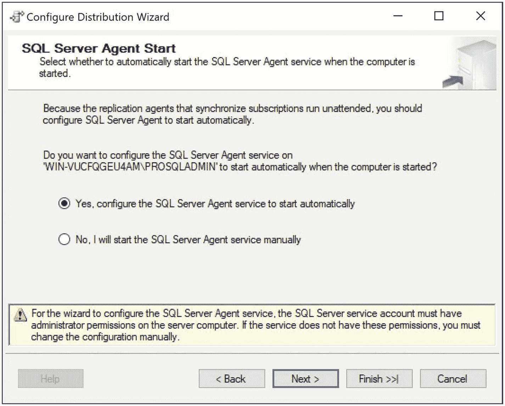

*图 16-5 SQL Server 代理启动页面*

在向导的`快照文件夹`页面上，我们选择`快照代理`用于存储初始同步数据的位置。这可以是本地文件夹或网络共享，但如果指定本地文件夹，则不支持拉取订阅，因为订阅服务器无法访问它。在我们的案例中，我们使用网络共享。`快照文件夹`页面如图 16-6 所示。

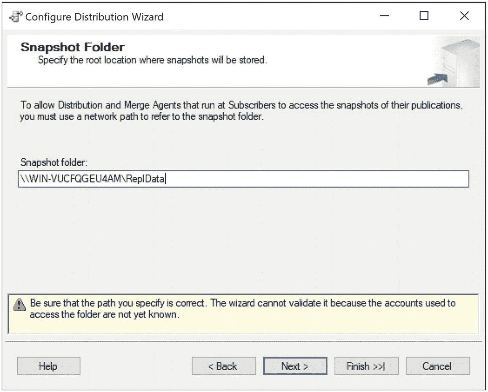

*图 16-6 快照文件夹页面*

接下来，在向导的`分发数据库`页面上，我们必须为分发数据库指定一个名称，并提供两个文件夹位置，用于存储数据和日志文件。如图 16-7 所示。

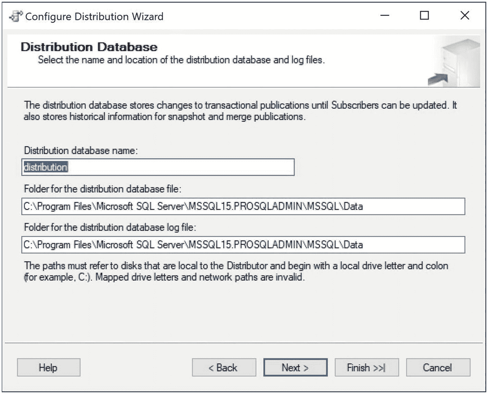

*图 16-7 分发数据库页面*

在向导的`发布服务器`页面上，如图 16-8 所示，我们指定将用作该分发服务器的发布服务器的实例。当前实例将被自动添加，但可以取消选中。页面右下角的`添加`按钮可用于添加其他 SQL Server 实例或 Oracle 数据库。

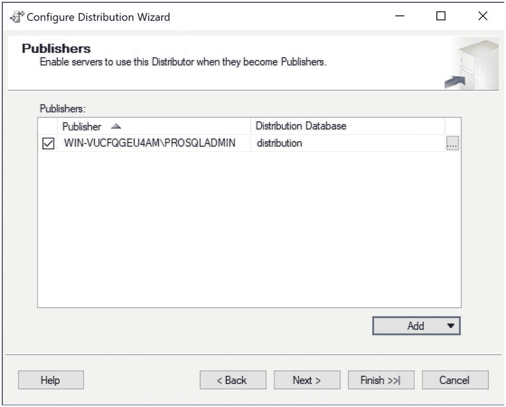

*图 16-8 发布服务器页面*

最后，我们可以选择配置分发服务器、编写配置脚本，或两者都做。在本例中，我们将立即配置分发服务器。


### 实施发布

现在分发服务器已经配置完毕，我们将为 Chapter16 数据库设置一个**发布**。要开始配置事务复制，我们首先在对象资源管理器中的**复制 ➤ 本地发布**上点击右键，选择**新建发布**。这将调用**新建发布向导**。通过欢迎屏幕后，我们会看到**发布数据库**页面，如图 16-9 所示。在这里，我们选择包含希望作为发布中文章使用的对象的数据库。一个发布中的所有文章必须位于同一个数据库中，因此在此屏幕我们只能选择一个数据库。若要复制来自多个数据库的文章，我们必须创建多个发布。

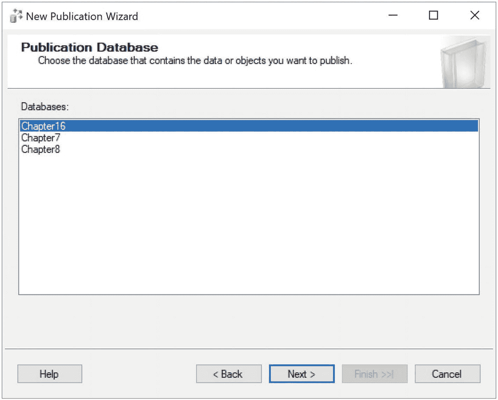

图 16-9 发布数据库页面

在**发布类型**页面，如图 16-10 所示，我们选择希望该发布使用的复制类型——在本例中，我们选择事务复制。

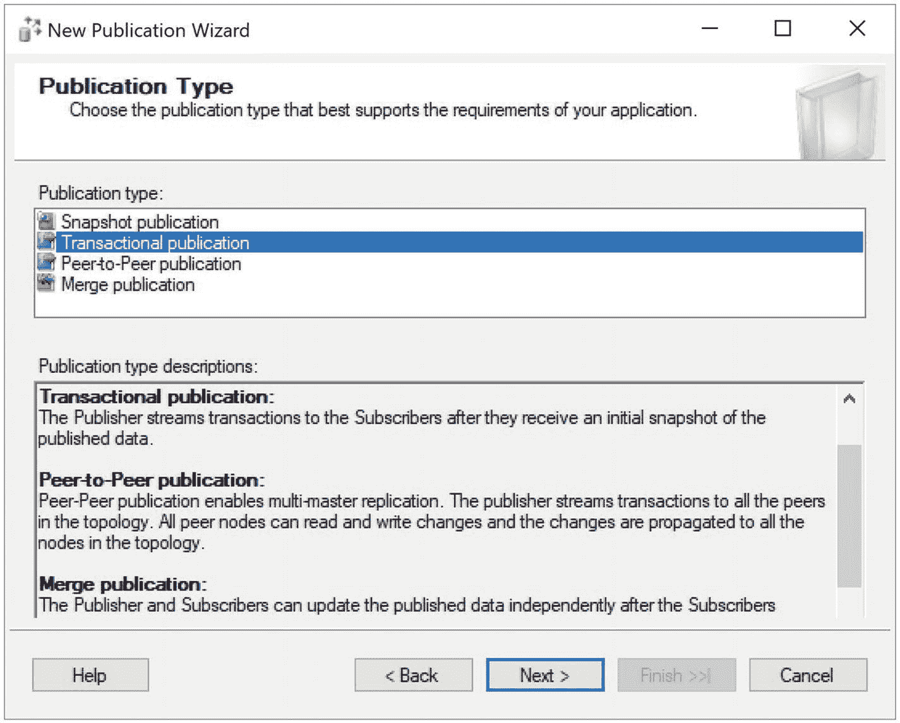

图 16-10 发布类型页面

在向导的**文章**页面，如图 16-11 所示，我们选择希望包含在发布中的对象。所有你希望发布的表都必须具有主键，否则你将无法选择它们。在表内部，如果需要，你还可以选择复制单个列。

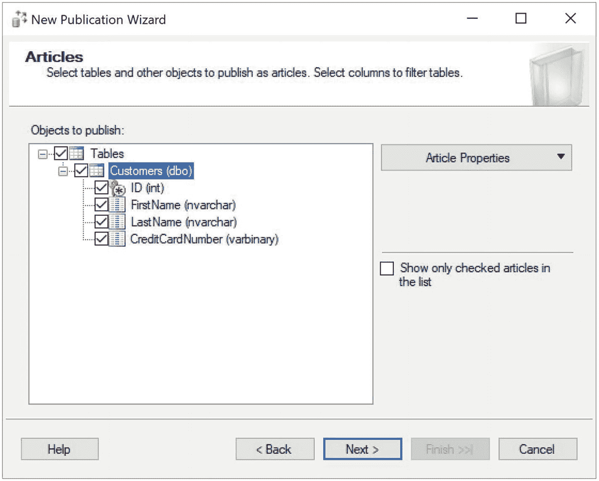

图 16-11 文章页面

**文章属性**按钮允许我们通过**文章属性**对话框（如图 16-12 所示）来更改选定文章或所有文章的属性。除非有特殊理由，否则你通常应将大多数属性保留为默认值。然而，你应该特别注意一些属性。

你使用**名称如果已使用则执行操作**属性来确定如果订阅者数据库中已存在同名表时的行为。可能的选项如下：

*   保持现有对象不变。
*   删除现有对象并创建新对象。
*   删除数据。如果文章有行筛选器，则仅删除匹配筛选器的数据。
*   截断现有对象中的所有数据。

**复制权限**属性决定是否将对象级权限复制到订阅者。这很重要，因为根据你使用环境的方式，你可能希望或不希望权限配置得与发布者相同。

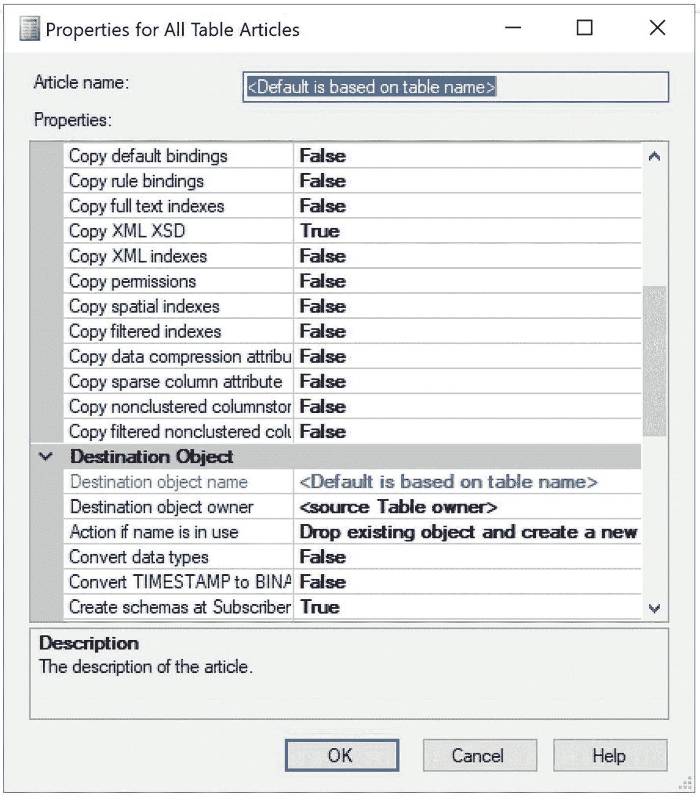

图 16-12 文章属性对话框

在向导的**筛选表行**页面，如图 16-13 所示，我们可以使用**添加**、**编辑**和**删除**按钮来管理筛选器。筛选器本质上是为文章添加一个`WHERE`子句，从而限制复制的行数。你会发现这对于在多个订阅者之间划分数据特别有用。

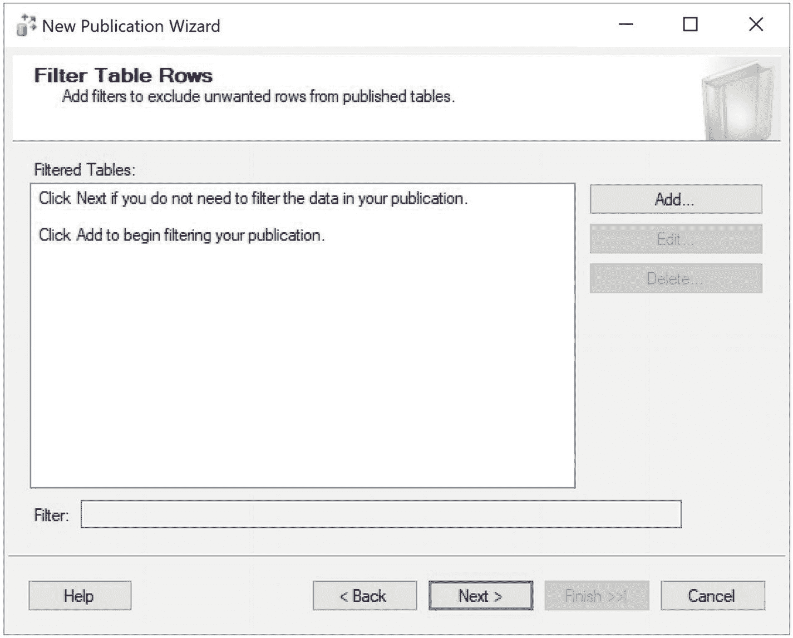

图 16-13 筛选表行页面

图 16-14 展示了**添加筛选器**对话框。在我们的例子中，我们创建了一个筛选器，以便只复制`ID > 500`的客户。在生产场景中，你可以通过基于区域、账户状态等方式进行筛选来运用此功能。

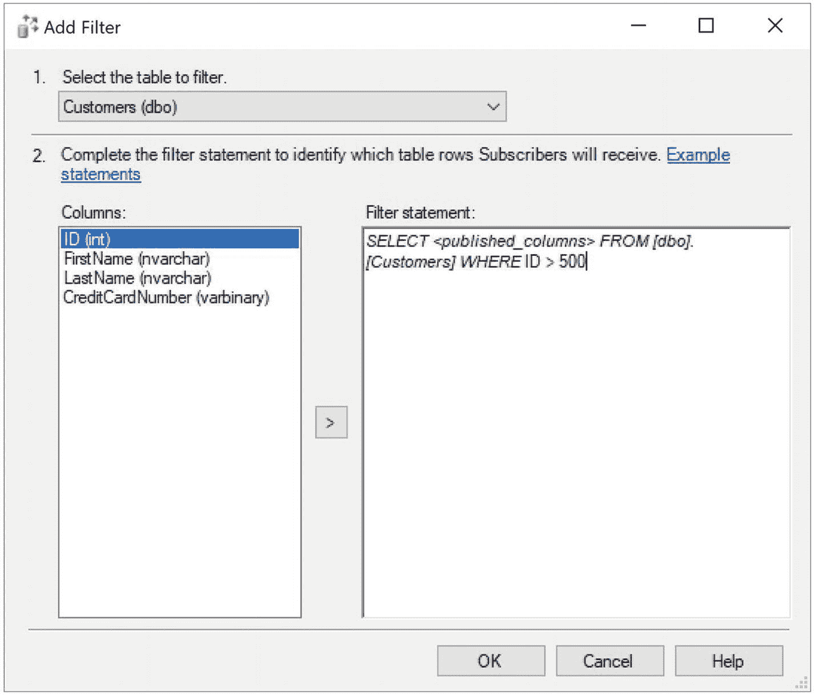

图 16-14 添加筛选器对话框

在**快照代理**页面，如图 16-15 所示，你可以配置初始快照立即创建（如此处所示），或者你可以安排快照代理在特定时间运行。

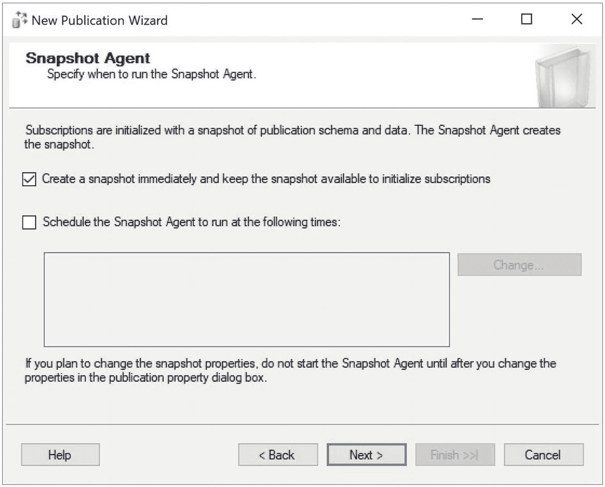

图 16-15 快照代理页面

在**代理安全性**页面，如图 16-16 所示，系统会邀请你配置用于运行每个复制代理的账户。至少，运行快照代理的账户应具有以下权限：

*   是分发数据库中`db_owner`数据库角色的成员
*   对包含快照的共享文件夹具有读取、写入和修改权限

运行日志读取器代理的账户至少必须具有以下权限：

*   是分发数据库中`db_owner`数据库角色的成员

当你创建订阅时，需要选择`sync_type`。此配置选择会通过以下方式影响日志读取器账户所需的权限：

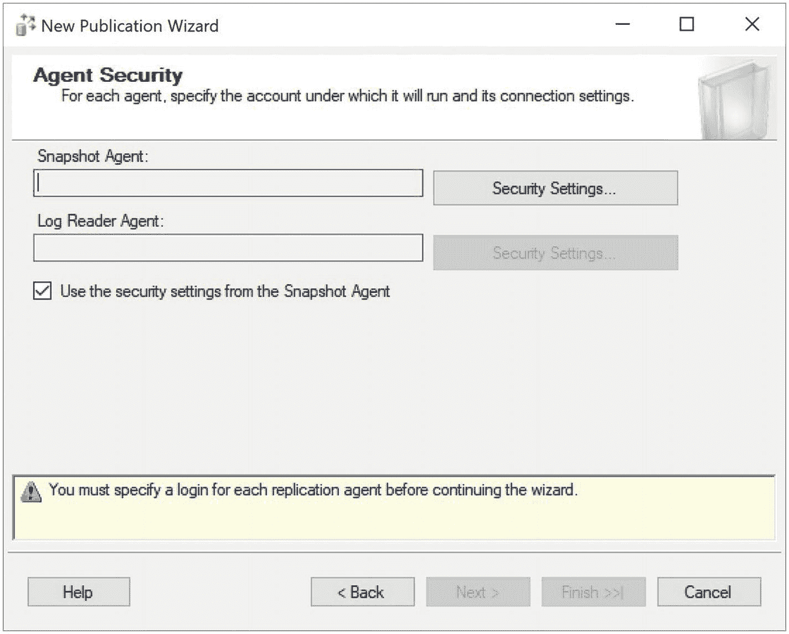

图 16-16 代理安全性页面

*   **Automatic**：无需额外权限
*   **其他任何选项**：在分发服务器上具有`sysadmin`权限

点击快照代理的**安全设置**按钮会显示**快照代理安全性**对话框，如图 16-17 所示。在此对话框中，你可以选择在服务器代理服务账户的上下文中运行快照代理，也可以指定要使用的其他 Windows 账户。为了遵循最小权限原则，你应使用一个单独的账户。你还可以指定用于连接到发布者实例的不同账户。但在我们的例子中，我们指定使用同一账户进行所有连接。

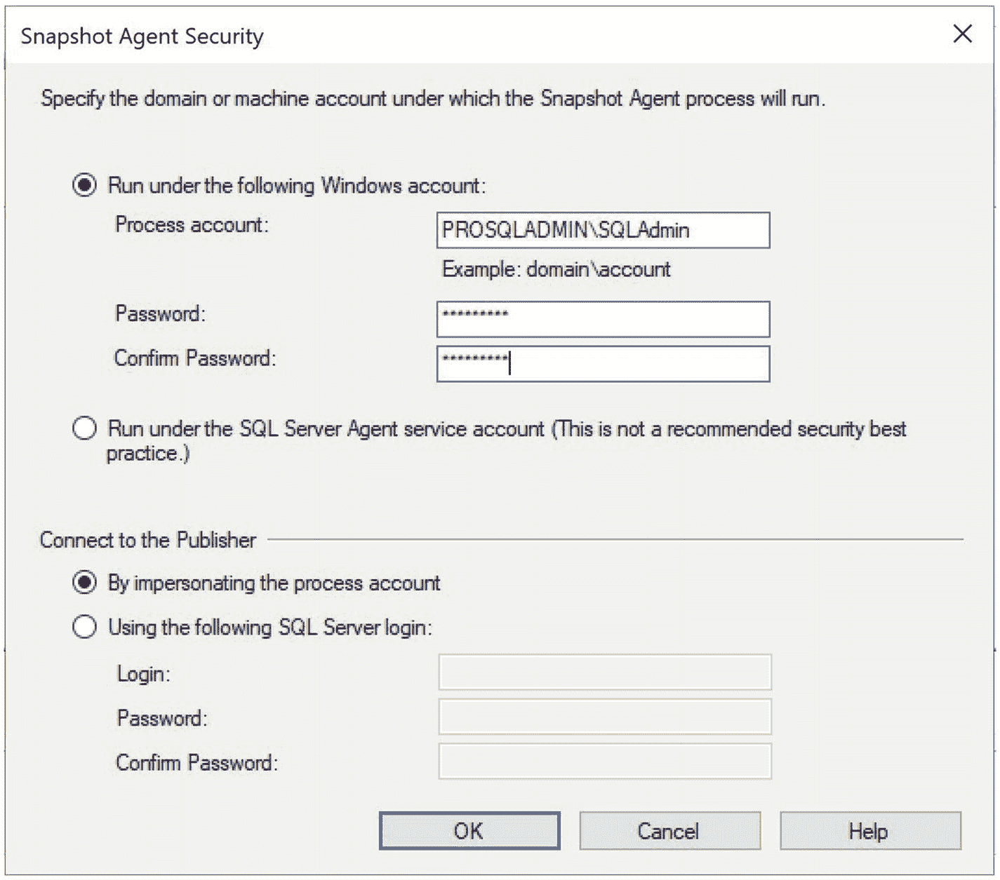

图 16-17 快照代理安全性对话框

回到**代理安全性**页面，你可以选择指定运行日志读取器代理账户的详细信息，或者克隆你已为运行快照代理账户输入的信息。

在**向导操作**页面，你可以选择生成发布（如此处所示）、生成发布的脚本，或者两者都做。我们将立即创建发布。最后，在**完成**页面，为发布指定一个名称。我们将我们的发布命名为**Chapter16**。


##### 实现订阅者

现在 `PROSQLADMIN` 实例已配置为分发者和发布者，并且我们的发布已经创建，我们需要将 `PROSQLADMIN2` 实例配置为订阅者。我们可以从发布者或订阅者端执行此任务。从订阅者端，我们通过连接到 `PROSQLADMIN2` 实例，然后在**本地订阅**的上下文菜单中导航至复制并选择**新建订阅**来执行此任务。这将调用**新建订阅向导**。通过此向导的**欢迎**页后，您将看到**发布**页面，如图 16-18 所示。在此页面上，您使用**发布者**下拉框连接到配置为发布者的实例，然后从屏幕的**数据库和发布**区域中选择相应的发布。

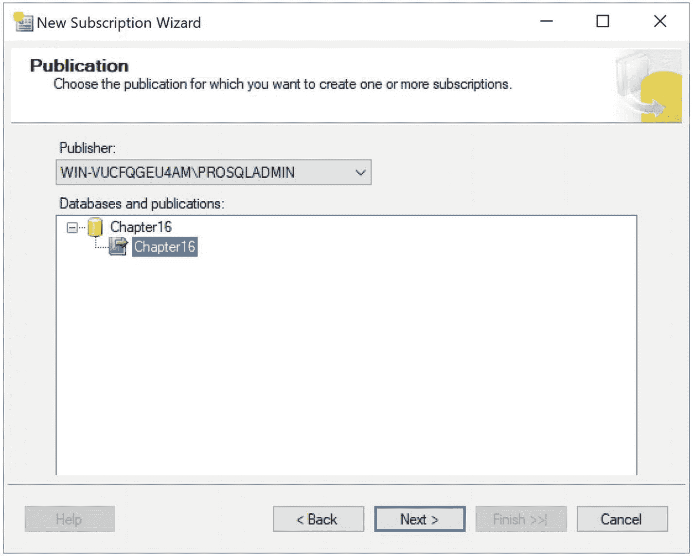
*图 16-18: 发布页面*

在**分发代理位置**页面上，您可以选择是使用推送订阅还是拉取订阅。此处的选择取决于您的拓扑结构。如果您有许多订阅者，那么您可能会选择实现远程分发者。如果是这种情况，那么您很可能会使用推送订阅，以便让配置为分发者的服务器承担代理运行的影响。然而，如果您有许多订阅者并且使用的是本地分发者，那么您很可能会使用拉取订阅，以便在订阅者之间分摊代理的成本。在我们的情况中，我们有一个本地分发者，但我们也只有一个订阅者，因此从性能角度来看，选择处理工作负载能力最强的服务器是显而易见的。然而，在部署分发代理时，我们也必须考虑安全性；我们将在本节后面讨论这一点。在此演示中，我们使用推送订阅。**分发代理位置**页面如图 16-19 所示。

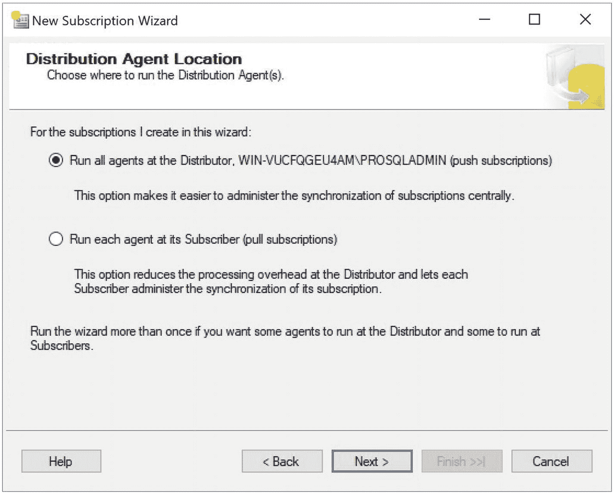
*图 16-19: 分发代理位置页面*

在**订阅者**页面上，我们可以从下拉列表中选择订阅数据库的名称。但是，由于我们的订阅数据库尚不存在，因此我们选择**新建数据库**，如图 16-20 所示，这将调用**新建数据库**对话框。

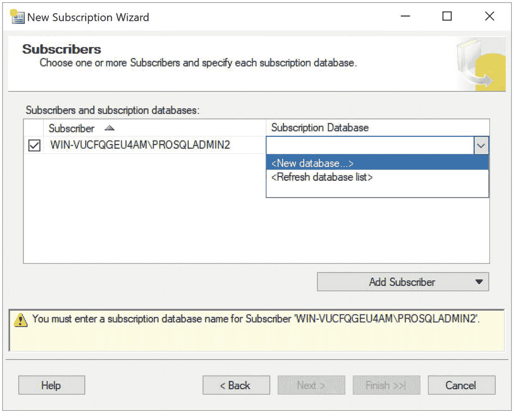
*图 16-20: 订阅者页面*

在**新建数据库**对话框的**常规**页面上，如图 16-21 所示，您需要根据其计划用途为订阅数据库输入适当的设置。如果需要，您可以在**选项**页面上配置许多数据库属性。

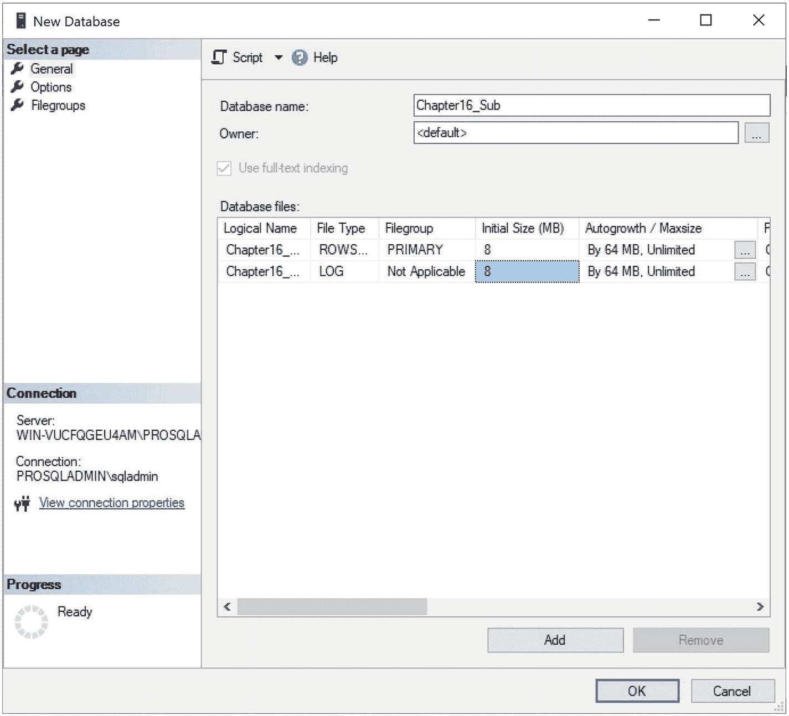
*图 16-21: 常规页面*

在**分发代理安全性**页面上，如图 16-22 所示，点击省略号以调用**分发代理安全性**对话框。

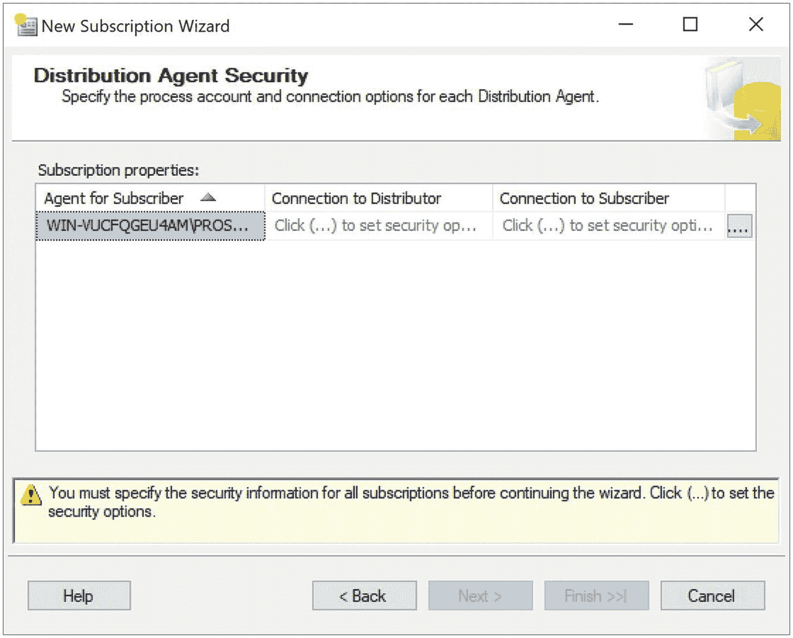
*图 16-22: 分发代理安全性页面*

在**分发代理安全性**对话框中，如图 16-23 所示，指定运行**分发代理**的帐户的详细信息。当您使用推送订阅时，运行**分发代理**的帐户至少应具有以下权限：

*   是分发数据库上 `db_owner` 角色的成员
*   是发布访问列表的成员（我们将在本章后面讨论配置发布访问。）
*   对快照所在的共享具有读取权限

用于连接到订阅者的帐户必须具有以下权限：

*   是订阅数据库中 `db_owner` 角色的成员
*   在订阅者上具有查看服务器状态的权限（仅当您计划使用多个订阅流时才适用。）

当您使用拉取订阅时，运行分发代理的帐户至少需要以下权限：

*   是订阅数据库上 `db_owner` 角色的成员
*   是发布访问列表的成员（我们将在本章后面讨论配置发布访问。）
*   对快照所在的共享具有读取权限
*   在订阅者上具有查看服务器状态的权限（仅当您计划使用多个订阅流时才适用。）

在对话框的第一部分，您可以选择是模拟 `SQL Server` 服务帐户还是指定一个不同的帐户来运行代理。为了遵循最小权限原则，您应该使用一个不同的帐户。在对话框的第二部分，您指定**分发代理**如何连接到分发者。如果您使用推送订阅，则代理必须使用运行**分发代理**的帐户。在对话框的第三部分，您指定**分发代理**如何连接到订阅者。如果您使用拉取订阅，则必须使用运行**分发代理**的相同帐户。

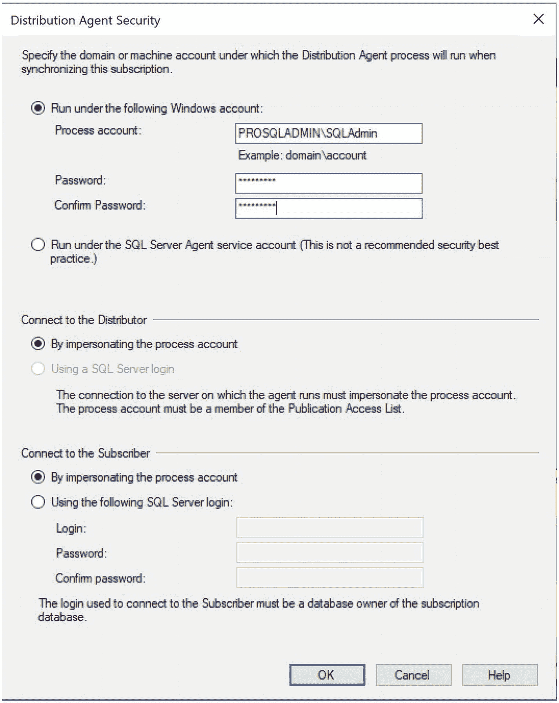
*图 16-23: 分发代理安全性对话框*

在**同步计划**页面上，您可以定义**分发代理**运行的计划。您可以选择连续运行代理、仅按需运行代理，或者定义一个新的服务器代理计划来运行**分发代理**，如图 16-24 所示。我们选择连续运行代理。

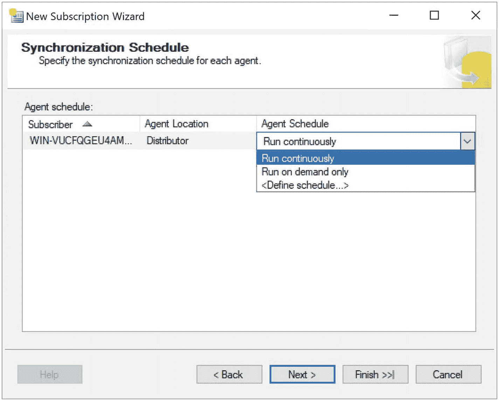
*图 16-24: 同步计划页面*

在**初始化订阅**页面上，如图 16-25 所示，您可以选择是立即初始化订阅，还是等待第一次同步，然后从那时的快照进行初始化。在此演示中，我们立即初始化订阅。如果您选中**内存优化**复选框，则表将被复制到订阅者上的内存优化表中。要选择此选项，您必须已创建内存优化文件组。还必须将文章的**启用内存优化**属性配置为 True。

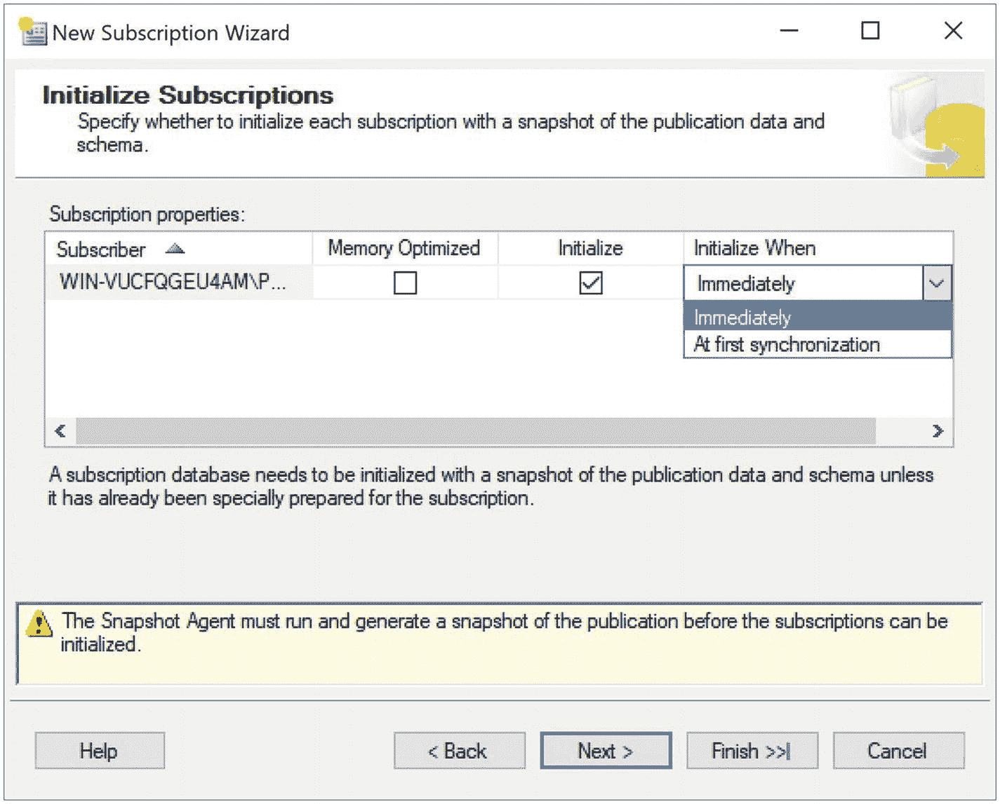
*图 16-25: 初始化订阅页面*

在**向导操作**页面上，您需要选择是立即创建订阅还是对过程进行脚本编写。我们选择立即创建订阅。最后，在**完成向导**页面上，您将看到向导执行的操作的摘要。


##### 修改 PAL

`PAL`（发布访问列表）用于控制对发布访问的安全性。当代理连接到发布时，系统会将其凭据与 `PAL` 进行比较，以确保它们拥有正确的权限。`PAL` 的优点在于，它将安全性从发布数据库中抽象出来，并防止客户端应用程序需要直接修改它。

要在 `SSMS` 中查看 `Chapter16` 发布的 `PAL` 并添加一个名为 `ReplicationAdmin` 的登录名，您需要依次展开 复制 ➤ 本地发布者，并在 `Chapter16` 发布的右键上下文菜单中选择 属性。这将调用 属性 对话框，您应导航到 发布访问列表 页面，如图 16-26 所示。

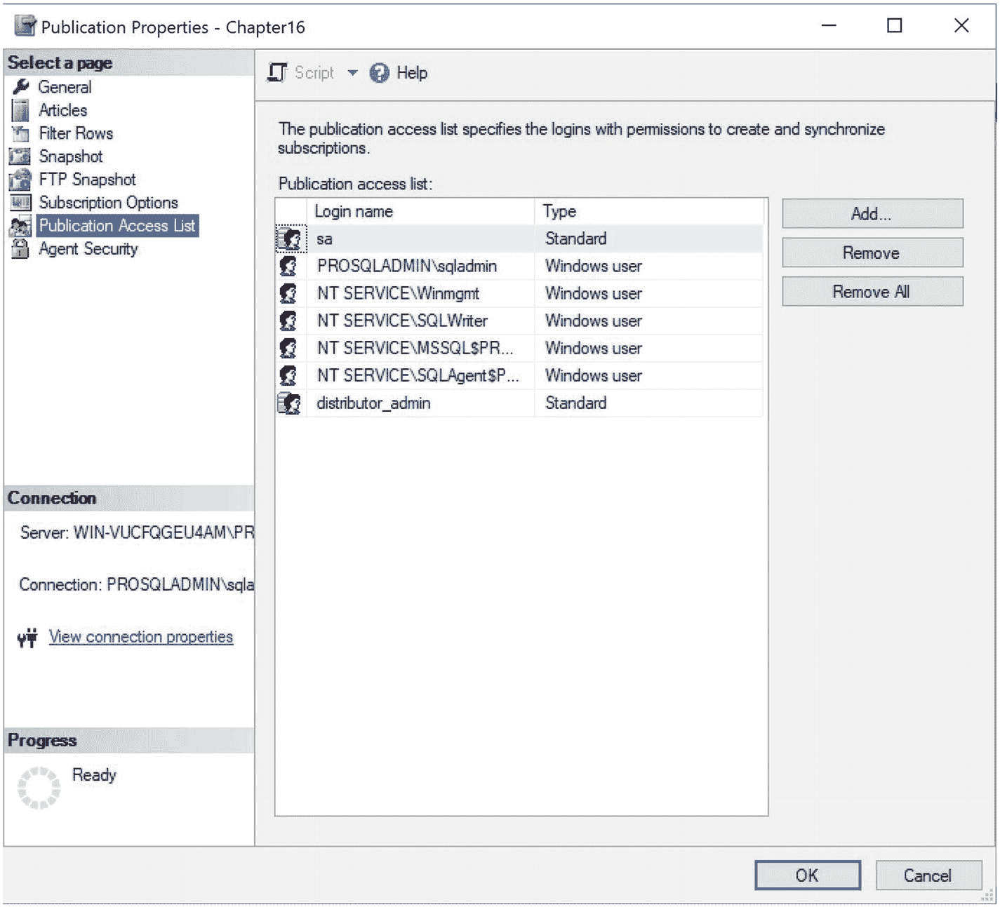
*图 16-26：发布访问列表页面*

现在，您可以使用 添加 按钮来显示当前没有访问该发布权限的登录名列表。您应从列表中选择适当的登录名将其添加到 `PAL` 中，如图 16-27 所示。

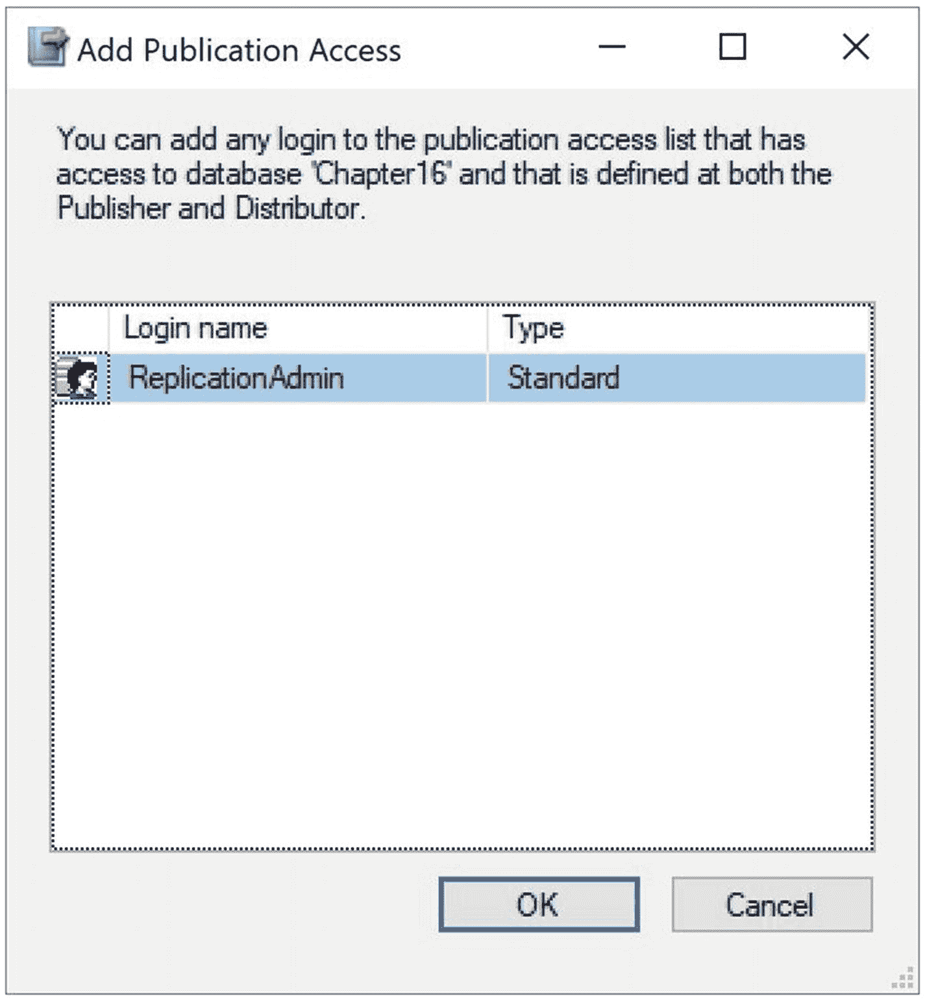
*图 16-27：添加发布访问*

### 添加 AlwaysOn 可读辅助副本

为了实现横向扩展的报表功能，在 `AlwaysOn 可用性组` 拓扑中添加可读辅助副本会非常有用。当您使用此策略时，数据库通过日志流保持同步，其延迟是可变的，但通常较低。可读辅助副本的额外优势在于，即使主副本脱机，它们也能保持在线。可读辅助副本可以添加到为 `HA` 和/或 `DR` 配置的现有 `可用性组` 中。或者，如果数据库没有 `HA` 或 `DR` 要求，但读取扩展是有利的，则可以专门创建一个 `可用性组` 用于读取扩展。

#### 优势与注意事项

除了纯粹的横向扩展之外，可读辅助副本还提供其他优势，例如临时统计信息，您也可以使用它来优化只读工作负载。此外，即使明确请求了其他隔离级别或锁定提示，在可读辅助副本上也**专门**使用快照隔离。这有助于避免争用，但也意味着 `TempDB` 应进行适当扩展并放置在快速磁盘阵列上。

使用可读辅助副本的主要风险是，在辅助副本上实现快照隔离实际上可能导致主副本上的已删除记录无法被清理。这是因为幽灵记录清理任务仅在不再需要辅助副本上的行后，才会从主副本中移除它们。在这种情况下，主副本上的日志截断也会被延迟。这意味着您可能不得不终止正在针对可读辅助副本执行的长时间运行的查询。如果辅助副本与主副本断开连接，此问题也可能发生。因此，存在您可能需要将辅助副本从 `可用性组` 中移除并随后重新添加的风险。

#### 实现可读辅助副本

在本节中，我们将使用在章节 14 中也使用过的 `PROSQLADMIN-C` 集群。然而，这次在站点 1 中为集群添加了一个额外的节点。该服务器名为 `CLUSTERNODE4`，并承载了一个名为 `READABLE` 的实例。此实例已在服务上启用了 `AlwaysOn 可用性组`。

#### 提示

在本节中，我们将涉及 `可用性组` 的通用配置，但更多详细信息可在章节 14 中找到，因为此处的主要重点将是配置一个可读辅助副本。

在我们创建 `可用性组` 之前，我们将首先使用清单 16-6 中的脚本创建一个名为 `Chapter16ReadScale` 的数据库。

```sql
CREATE DATABASE Chapter16ReadScale ;
GO
USE Chapter16ReadScale
GO
CREATE TABLE Customers
(
ID                  INT            PRIMARY KEY        IDENTITY,
FirstName           NVARCHAR(30),
LastName            NVARCHAR(30),
CreditCardNumber    VARBINARY(8000)
) ;
GO
--Populate the table
DECLARE @Numbers TABLE
(
Number        INT
)
;WITH CTE(Number)
AS
(
SELECT 1 Number
UNION ALL
SELECT Number + 1
FROM CTE
WHERE Number < 100
)
INSERT INTO @Numbers
SELECT Number FROM CTE ;
DECLARE @Names TABLE
(
FirstName       VARCHAR(30),
LastName        VARCHAR(30)
) ;
INSERT INTO @Names
VALUES('Peter', 'Carter'),
('Michael', 'Smith'),
('Danielle', 'Mead'),
('Reuben', 'Roberts'),
('Iris', 'Jones'),
('Sylvia', 'Davies'),
('Finola', 'Wright'),
('Edward', 'James'),
('Marie', 'Andrews'),
('Jennifer', 'Abraham'),
('Margaret', 'Jones') ;
INSERT INTO Customers(Firstname, LastName, CreditCardNumber)
SELECT  FirstName, LastName, CreditCardNumber FROM
(SELECT
(SELECT TOP 1 FirstName FROM @Names ORDER BY NEWID()) FirstName
,(SELECT TOP 1 LastName FROM @Names ORDER BY NEWID()) LastName
,(SELECT CONVERT(VARBINARY(8000)
,(SELECT TOP 1 CAST(Number * 100 AS CHAR(4))
FROM @Numbers
WHERE Number BETWEEN 10 AND 99
ORDER BY NEWID()) + '-' +
(SELECT TOP 1 CAST(Number * 100 AS CHAR(4))
FROM @Numbers
WHERE Number BETWEEN 10 AND 99
ORDER BY NEWID()) + '-' +
(SELECT TOP 1 CAST(Number * 100 AS CHAR(4))
FROM @Numbers
WHERE Number BETWEEN 10 AND 99
ORDER BY NEWID()) + '-' +
(SELECT TOP 1 CAST(Number * 100 AS CHAR(4))
FROM @Numbers
WHERE Number BETWEEN 10 AND 99
ORDER BY NEWID()))) CreditCardNumber
FROM @Numbers a
CROSS JOIN @Numbers b
) d
```
*清单 16-6：创建 `Chapter16ReadScale` 数据库*

接下来，我们将使用 `可用性组` 向导创建一个 `可用性组`。在向导的第一页（图 16-28）中，我们将为新的 `可用性组` 提供一个名称。在我们的例子中，我们将其命名为 `Chapter16`。我们还将集群类型指定为 `Windows 故障转移集群`。

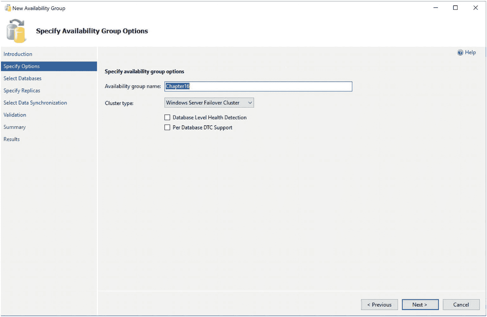
*图 16-28：指定可用性组选项页面*

在向导的 选择数据库 页面，如图 16-29 所示，我们将选择要添加到 `可用性组` 的数据库。

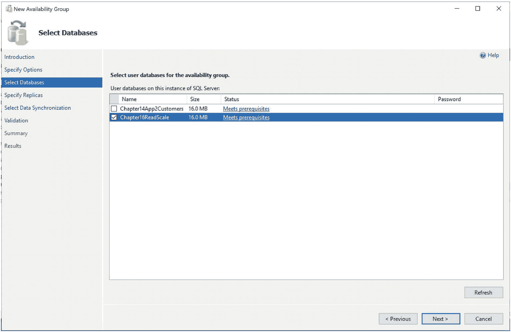
*图 16-29：选择数据库页面*

指定副本 页面的 副本 选项卡如图 16-30 所示。在这里，我们已将 `CLUSTERNODE1`、`CLUSTERNODE2` 和 `CLUSTERNODE3` 分别添加为初始主副本、`HA` 副本和 `DR` 副本。但是，您会注意到我们还添加了 `CLUSTERNODE4` 作为异步副本，并将其标记为可读辅助副本。

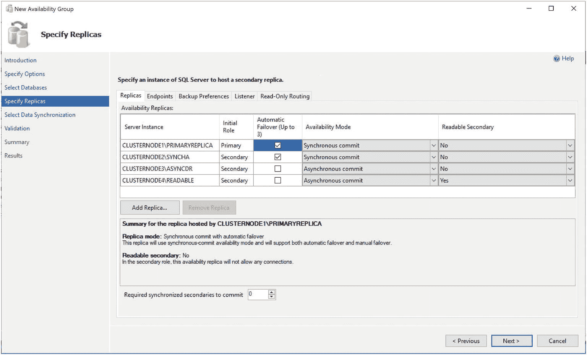
*图 16-30：指定副本页面—副本选项卡*

在 图 16-31 所示的 端点 选项卡上，您会看到 `CLUSTERNODE1`、`CLUSTERNODE2` 和 `CLUSTERNODE3` 的端点显示为灰色。这是因为每个实例只能有一个数据库镜像端点，并且由于我们在章节 14 中的工作，这些实例上的端点已经存在。


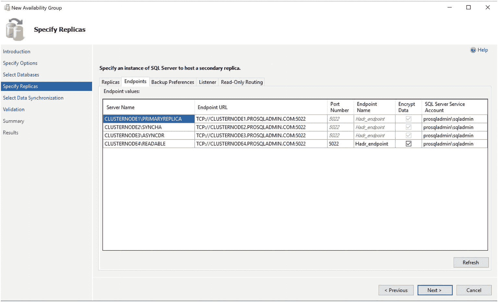
图 16-31 指定副本页面 — 端点选项卡

在“备份首选项”选项卡（如图 16-32 所示）上，我们配置了副本，以便在辅助副本不可用时，备份仅在主副本上进行。我们排除了位于 `CLUSTERNODE2` 上的同步副本，并为我们的可读辅助副本设置了更高的优先级。这意味着，如果可读辅助副本可用，备份将在此进行。如果不可用，备份将在灾难恢复副本上进行。只有当前两者均不可用时，才会在主副本上执行备份。备份永远不会在高可用性同步副本上进行。

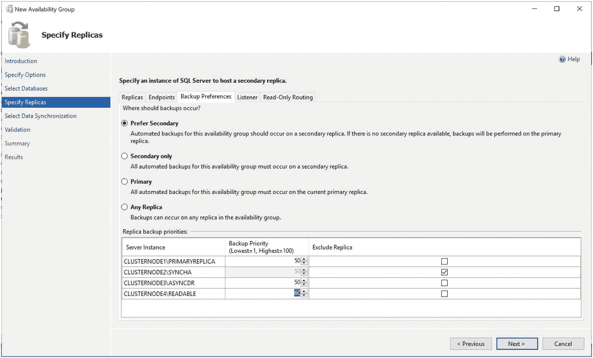
图 16-32 指定副本页面 — 备份首选项选项卡

在“侦听器”选项卡（如图 16-33 所示）上，我们为侦听器指定了名称和端口。我们还添加了两个 IP 地址，每个侦听器跨越的子网一个。

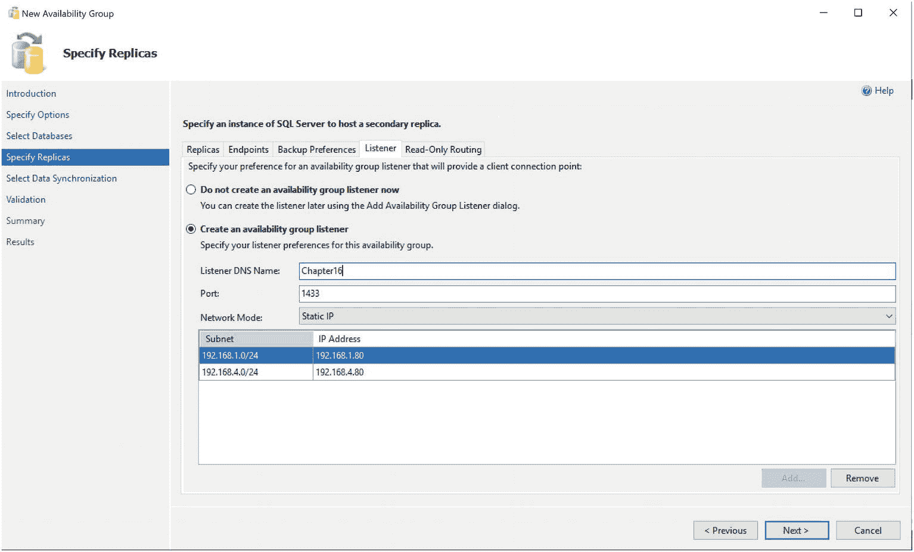
图 16-33 指定副本页面 — 侦听器选项卡

“只读路由”选项卡是从可读辅助副本的角度看变得有趣的地方。每个可读辅助副本都必须分配一个只读路由 URL。这是只读请求将被发送到的路径，由协议（TCP）后跟托管可读辅助副本的服务器的完全限定地址（包括端口号）组成。

指定此只读 URL 后，我们就可以添加只读路由列表。这指定了只读请求将被路由到的副本。路由列表仅适用于在可用性组内具有主角色的节点。因此，可以为每个节点提供不同的路由列表。当您在不同站点有多个可读辅助副本时，这非常有用。例如，如果我们在站点 2 有第二个可读辅助副本，那么我们可以配置位于 `CLUSTERNODE3` 上的副本，以便在其持有主角色时将只读请求路由到该可读辅助副本。

如果存在多个可读辅助副本，您还可以在每个路由列表中指定多个可读辅助副本。只读请求将被路由到列表中的第一台服务器。但是，如果该服务器不可用，则请求将被路由到列表中的第二台服务器，依此类推。如果您希望使用此功能，则服务器之间应用逗号分隔。

从 SQL Server 2016 开始，还可以对只读请求进行负载平衡。在这种情况下，请求将在每个负载平衡服务器之间交替路由。如果您希望使用此功能，则应将构成负载平衡组一部分的服务器用括号括起来。例如，假设我们的配置中有六个群集节点。`CLUSTERNODE1` 具有主角色。`CLUSTERNODE2` 是同步高可用性服务器，`CLUSTERNODE3` 是灾难恢复服务器，而 `CLUSTERNODE4`、`CLUSTERNODE5` 和 `CLUSTERNODE6` 都是可读辅助副本。清单 16-7 中的只读路由列表将在 `CLUSTERNODE4` 和 `CLUSTERNODE5` 之间交替只读请求。如果这两台服务器都不可用，则只读请求将被路由到 `CLUSTERNODE6`。

```
(CLUSTERNODE4\READABLE, CLUSTERNODE5\READABLE2), CLUSTERNODE6\READABLE3
清单 16-7
复杂的只读路由列表
```

然而，在我们的场景中，我们只有一个可读辅助副本，因此我们可以使用“添加”按钮（如图 16-34 所示）将该副本添加到每个节点。

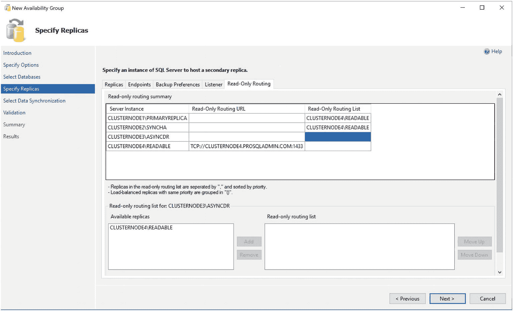
图 16-34 指定副本页面 — 只读路由选项卡

我们现在可以使用向导的“选择初始数据同步”页面（如图 16-35 所示）来指定我们希望如何同步可用性组。

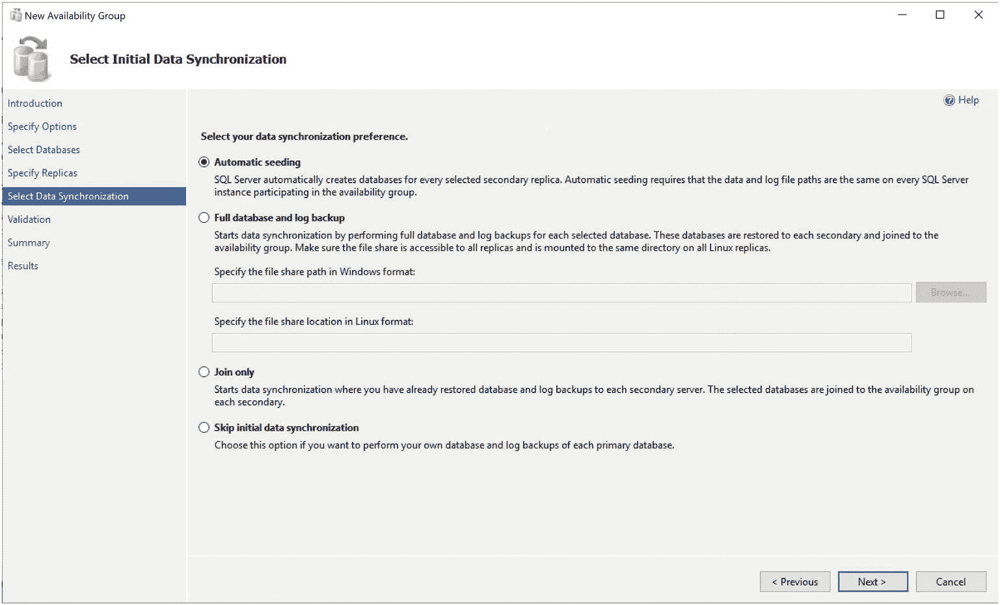
图 16-35 选择初始数据同步页面

在向导运行验证测试后，您现在可以创建并同步可用性组。

### 总结

数据库快照使用写时复制技术创建数据库的时间点副本。快照必须与源数据库存在于同一实例上，因此虽然不能使用它们在服务器之间分配负载，但可以使用它们来减少读写操作之间的争用。

快照可用于恢复因人为错误而丢失的数据，也可用于报告目的。您可以将数据复制回源数据库，或者从快照还原源数据库，只要它是与源数据库链接的唯一快照。但是，快照不能提供针对故障或损坏的保护，也不是备份的合适替代方案。

复制是 SQL Server 提供的一套技术，允许您在系统之间分发数据。为了扩展工作负载，事务复制是最合适的选择。事务复制可以通过配置分发服务器（它将保存复制元数据，并可能减轻同步负担）、发布服务器（托管要同步的数据）和订阅服务器（同步的目标）来实现。复制是一项复杂的技术，作为 DBA，您应该了解如何使用 `T-SQL` 以及 GUI 来实现它，因为您会遇到需要拆除和重建复制的情况。复制还公开了 `RMO`（复制管理对象）API，这是一个用于 .NET 的复制编程接口。

您可以在 AlwaysOn 可用性组拓扑中配置可读辅助副本；这些副本允许横向扩展只读工作负载。即使主副本脱机，可读辅助副本也保持联机。这里需要注意的是，连接必须直接建立到实例。

为了实现可读辅助副本，您必须配置只读路由。这包括为辅助副本提供一个用于只读报告的 URL，然后更新主副本上的只读路由列表。使用此策略进行横向扩展报告的风险在于，辅助副本上的长时间运行事务或辅助副本断开连接可能导致日志截断延迟以及延迟清理 ghost 记录。

# 第四部分 性能与维护

## 17. SQL Server 元数据

元数据是描述其他数据的数据。SQL Server 公开大量的元数据，包括描述每个对象的结构元数据和描述数据本身的描述性元数据。元数据通过一系列

*   目录视图
*   信息架构视图
*   动态管理视图和函数
*   系统函数
*   系统存储过程

公开。在本章中，我们将讨论如何使用元数据在实例级别执行操作，例如公开注册表值，研究元数据如何协助容量规划，并讨论如何将元数据用于故障排除和性能调优。最后，我们将了解如何使用元数据驱动自动化维护。

#### 提示
元数据是一个高级主题，值得单独写一本书。因此，我鼓励您探索本章可能未涉及的其他元数据对象。


### 介绍元数据对象

目录视图位于 `sys` 架构中。目录视图有很多，其中一些最有用的视图，例如 `sys.master_files`，将在本章探讨。清单 17-1 展示了如何使用目录视图生成处于 `FULL` 恢复模式的数据库列表的示例。

```sql
SELECT name
FROM sys.databases
WHERE recovery_model_desc = 'FULL' ;
```
*清单 17-1 使用目录视图*

信息模式视图位于 `INFORMATION_SCHEMA` 架构中。它们返回的细节不如目录视图多，但基于 ISO 标准。这意味着你可以在不同的关系数据库管理系统之间移植你的查询。清单 17-2 展示了使用信息模式视图生成已被授予对 `Chapter10.dbo.SensitiveData` 表 `SELECT` 访问权限的主体列表的示例。

```sql
USE Chapter10
GO
SELECT GRANTEE, PRIVILEGE_TYPE
FROM INFORMATION_SCHEMA.TABLE_PRIVILEGES
WHERE TABLE_SCHEMA = 'dbo'
AND TABLE_NAME = 'SensitiveData'
AND PRIVILEGE_TYPE = 'SELECT' ;
```
*清单 17-2 使用信息模式视图*

SQL Server 中提供了许多动态管理视图和函数。它们统称为 DMV，提供了有关实例当前状态的信息，可用于故障排除和性能调优。SQL Server 2019 中公开了以下类别的 DMV：

*   AlwaysOn 可用性组
*   变更数据捕获
*   变更跟踪
*   公共语言运行时 (CLR)
*   数据库镜像
*   数据库
*   执行
*   扩展事件
*   FILESTREAM 和 FileTable
*   全文搜索和语义搜索
*   地理复制
*   索引
*   I/O
*   内存优化表
*   对象
*   查询通知
*   复制
*   资源调控器
*   安全性
*   服务器
*   服务代理
*   空间
*   SQL 数据仓库和 PDW
*   SQL Server 操作系统
*   延伸数据库
*   事务

我们将在本章多处演示和讨论如何使用 DMV。DMV 总是以 `dm_` 前缀开头，后接两到四个描述对象类别的字符——例如，`os_` 代表操作系统，`db_` 代表数据库，`exec_` 代表执行。其后是对象的名称。在清单 17-3 中，你可以看到两点：一个是如何使用动态管理视图查找当前连接到 `Chapter16` 数据库的登录名列表的示例；另一个是你可以使用一个动态管理函数来生成与 `Chapter16.dbo.Customers` 表相关的数据所存储页面的详细信息。

```sql
USE Chapter16 –如果你遵循了本书第 16 章的示例，此数据库将存在
GO
--查找连接到 Chapter16 数据库的登录名
SELECT login_name
FROM sys.dm_exec_sessions
WHERE database_id = DB_ID('Chapter16') ;
--返回存储 Chapter16.dbo.Customers 表的数据页的详细信息
SELECT *
FROM sys.dm_db_database_page_allocations(DB_ID('Chapter16'),
OBJECT_ID('dbo.Customers'),
NULL,
NULL,
'DETAILED') ;
```
*清单 17-3 使用动态管理视图和函数*

SQL Server 还提供了许多与元数据相关的系统函数，例如我们在清单 17-3 中使用的 `DB_ID()` 和 `OBJECT_ID()`。另一个与元数据相关的系统函数例子是 `DATALENGTH`，我们在清单 17-4 中使用它来返回 `Chapter16.dbo.Customers` 表 `LastName` 列中每个值的长度。

```sql
USE Chapter16
GO
SELECT DATALENGTH(LastName)
FROM dbo.Customers ;
```
*清单 17-4 使用系统函数*

### 服务器级和实例级元数据

服务器和实例有多种形式的元数据可用。服务器级元数据对于需要查找配置信息或在无法访问底层操作系统时进行故障排除的数据库管理员非常有用。例如，`dm_server` 类别的 DMV 提供了允许你检查服务器审核状态、查看 SQL Server 的注册表项、查找内存转储文件的位置以及查找实例服务详细信息的视图。在以下部分中，我们将讨论如何查看与实例关联的注册表项、公开 SQL Server 服务的详细信息以及查看缓冲区缓存的内容。

#### 公开注册表值

`sys.dm_server_registry` DMV 公开了与实例相关的关键注册表项。该视图返回三列，如表 17-1 所述。

*表 17-1 sys.dm_server_registry 列*

| 列 | 描述 |
| --- | --- |
| `Registry_key` | 注册表项的名称 |
| `Value_name` | 项的值的名称 |
| `Value_data` | 值中包含的数据 |

你可以在 `sys.dm_server_registry` DMV 中找到的一个非常有用的信息是 SQL Server 当前正在侦听的端口号。清单 17-5 中的查询使用 `sys.dm_server_registry` DMV 返回实例正在侦听的端口，前提是实例配置为侦听所有 IP 地址。

```sql
SELECT *
FROM (
SELECT
CASE
WHEN value_name = 'tcpport' AND value_data != ''
THEN value_data
WHEN value_name = 'tcpport' AND value_data = ''
THEN (
SELECT value_data
FROM sys.dm_server_registry
WHERE registry_key LIKE '%ipall'
AND value_name = 'tcpdynamicports' )
END PortNumber
FROM sys.dm_server_registry
WHERE registry_key LIKE '%IPAll' ) a
WHERE a.PortNumber IS NOT NULL ;
```
*清单 17-5 查找端口号*

此 DMV 的另一个有用功能是能够返回 SQL Server 服务的启动参数。如果你想了解是否为实例配置了 `-E` 这样的开关，这将特别有用。`-E` 开关增加了在轮询算法中分配给每个文件的区数量。清单 17-6 中的查询显示为实例配置的启动参数。

```sql
SELECT *
FROM sys.dm_server_registry
WHERE value_name LIKE 'SQLArg%' ;
```
*清单 17-6 查找启动参数*

#### 公开服务详细信息

`dm_server` 类别中另一个有用的 DMV 是 `sys.dm_server_services`，它公开了实例正在使用的服务的详细信息。表 17-2 描述了返回的列。

*表 17-2 sys.dm_server_services 列*

| 列 | 描述 |
| --- | --- |
| `Servicename` | 服务的名称。 |
| `Startup_type` | 表示服务启动类型的整数。 |
| `Startup_desc` | 服务启动类型的文本描述。 |
| `Status` | 表示服务当前状态的整数。 |
| `Status_desc` | 当前服务状态的文本描述。 |
| `Process_id` | 服务的进程 ID。 |
| `Last_startup_time` | 服务上次启动的日期和时间。 |
| `Service_account` | 用于运行服务的帐户。 |
| `Filename` | 服务的文件名，包括完整文件路径。 |
| `Is_clustered` | `1` 表示服务是集群的；`0` 表示它是独立的。 |
| `Clusternodename` | 如果服务是集群的，此列指示服务正在其上运行的节点的名称。 |

清单 17-7 中的查询返回每个服务的名称、其启动类型、当前状态以及运行该服务的服务帐户名称。

```sql
SELECT servicename
,startup_type_desc
,status_desc
,service_account
FROM sys.dm_server_services ;
```
*清单 17-7 公开服务详细信息*

### 分析缓冲区缓存使用情况

`dm_os`类别的 DMV 暴露了 41 个包含 SQLOS 当前状态信息的对象，尽管其中只有 31 个有文档记录。`dm_os`类别中一个特别有用的、暴露缓冲区缓存内容的 DMV 是`sys.dm_os_buffer_descriptors`。查询此对象时，将返回表 17-3 中详述的列。

**表 17-3** `sys.dm_os_buffer_descriptors` 列

| 列 | 说明 |
| --- | --- |
| `Database_id` | 页面所属数据库的 ID |
| `File_id` | 页面所属文件的 ID |
| `Page_id` | 页面的 ID |
| `Page_level` | 页面的索引级别 |
| `Allocation_unit_id` | 页面所属分配单元的 ID |
| `Page_type` | 页面类型，例如 `DATA_PAGE`, `INDEX_PAGE`, `IAM_PAGE` 或 `PFS_PAGE` |
| `Row_count` | 存储在页面上的行数 |
| `Free_space_in_bytes` | 页面上的可用空间量 |
| `Is_modified` | 指示页面是否为脏页的标志 |
| `Numa_node` | 缓冲区的 NUMA 节点 |
| `Read_microset` | 将页面读入缓存所花费的时间，以微秒为单位 |

清单 17-8 中的脚本演示了如何使用`sys.dm_os_buffer_descriptors` DMV 来确定实例上每个数据库使用缓冲区缓存的百分比。这可以在性能调优期间帮助你，也可为你提供在容量规划或整合规划时使用的宝贵见解。

```sql
DECLARE @DB_PageTotals TABLE
(
CachedPages INT,
Database_name NVARCHAR(128),
database_id INT
) ;
INSERT INTO @DB_PageTotals
SELECT COUNT(*) CachedPages
,CASE
WHEN database_id = 32767
THEN 'ResourceDb'
ELSE DB_NAME(database_id)
END Database_name
,database_id
FROM sys.dm_os_buffer_descriptors a
GROUP BY DB_NAME(database_id)
,database_id ;
DECLARE @Total FLOAT = (SELECT SUM(CachedPages) FROM @DB_PageTotals) ;
SELECT      Database_name,
CachedPages,
SUM(cachedpages) over(partition by database_name)
/ @total * 100 AS RunningPercentage
FROM        @DB_PageTotals a
ORDER BY    CachedPages DESC ;
```
**清单 17-8** 确定每个数据库的缓冲区缓存使用情况

#### 注意
本章的“用于故障排除和性能调整的元数据”部分将讨论`dm_os`类别中的更多 DMV。

### 用于容量规划的元数据

使用元数据最有用的方式之一是在你进行主动容量管理时。SQL Server 暴露的元数据为你提供了关于数据库文件当前大小和使用情况的信息，你可以利用这些信息提前规划并安排额外的容量，而无需等到企业监控软件开始发出严重警报。

#### 暴露文件统计信息

`sys.dm_db_file_space_usage` DMV 返回在其上运行的数据库中每个数据文件的使用空间详细信息。此对象返回的列详见表 17-4。

**表 17-4** `sys.dm_db_file_space_usage` 列

| 列 | 说明 |
| --- | --- |
| `database_id` | 文件所属数据库的 ID。 |
| `file_id` | 数据库内文件的 ID。这些 ID 在数据库间重复。例如，主文件的 ID 始终为`1`，第一个日志文件的 ID 始终为`2`。 |
| `filegroup_id` | 文件所在文件组的 ID。 |
| `total_page_count` | 文件中的总页数。 |
| `allocated_extent_page_count` | 文件中位于已分配区中的页数。 |
| `unallocated_extent_page_count` | 文件中位于未分配区中的页数。 |
| `version_store_reserved_page_count` | 为支持使用快照隔离的事务而保留的页数。仅适用于 TempDB。 |
| `user_object_reserved_page_count` | 为用户对象保留的页数。仅适用于 TempDB。 |
| `internal_object_reserved_page_count` | 为内部对象保留的页数。仅适用于 TempDB。 |
| `mixed_extent_page_count` | 其中页分配给不同对象的区的数量。 |

`sys.dm_io_virtual_file_stats` DMV 返回数据库和日志文件的 IO 统计信息。这可以帮助你确定写入每个文件的数据量，并警告你高 IO 延迟。此对象接受`database_id`和`file_id`作为参数，并返回表 17-5 中详述的列。

#### 提示
*IO 延迟* 是 IO 子系统响应 SQL Server 所花费的时间。

**表 17-5** `sys.dm_io_virtual_file_stats` 列

| 列 | 说明 |
| --- | --- |
| `database_id` | 文件所属数据库的 ID。 |
| `file_id` | 数据库内文件的 ID。这些 ID 在数据库间重复。例如，主文件的 ID 始终为`1`，第一个日志文件的 ID 始终为`2`。 |
| `sample_ms` | 自计算机启动以来的毫秒数。 |
| `num_of_reads` | 对文件执行的读取总次数。 |
| `num_of_bytes_read` | 从文件读取的总字节数。 |
| `io_stall_read_ms` | 等待对文件发出读取的总时间，以毫秒为单位。 |
| `num_of_writes` | 对文件执行的写操作总次数。 |
| `num_of_bytes_written` | 写入文件的总字节数。 |
| `io_stall_write_ms` | 等待写入完成的总时间，以毫秒为单位。 |
| `io_stall` | 等待文件的所有 IO 请求完成的总时间，以毫秒为单位。 |
| `size_on_disk_bytes` | 文件在磁盘上使用的总空间，以字节为单位。 |
| `file_handle` | Windows 文件句柄。 |
| `io_stall_queued_read_ms` | 由资源调控器引起的对文件读取操作的总 IO 延迟。资源调控器将在第 24 章讨论。 |
| `io_stall_queued_write_ms` | 由资源调控器引起的对文件写入操作的总 IO 延迟。资源调控器将在第 24 章讨论。 |

与本节讨论的前两个 DMV 不同，`sys.master_files`目录视图是一个系统范围的视图，这意味着它返回实例上每个数据库中每个文件的一条记录。此视图返回的列描述见表 17-6。

**表 17-6** `sys.master_files` 列


| 列 | 描述 |
| --- | --- |
| `database_id` | 文件所属数据库的 ID。 |
| `file_id` | 文件在数据库内的 ID。这些 ID 在不同数据库间可能重复。例如，主数据文件的 ID 始终为`1`，第一个日志文件的 ID 始终为`2`。 |
| `file_guid` | 文件的 GUID。 |
| `type` | 表示文件类型的整数。 |
| `type_desc` | 文件类型的文本描述。 |
| `data_space_id` | 文件所在文件组的 ID。 |
| `name` | 文件的逻辑名称。 |
| `physical_name` | 文件的物理路径和名称。 |
| `state` | 指示文件当前状态的整数。 |
| `state_desc` | 文件当前状态的文本描述。 |
| `size` | 文件的当前大小，以页数计。 |
| `max_size` | 文件的最大大小，以页数计。 |
| `growth` | 文件的增长设置。`0` 表示禁用自动增长。如果 `is_percent_growth` 为 `0`，则该值表示以页数为单位的增长增量。如果 `is_percent_growth` 为 `1`，则该值表示整数百分比增量。 |
| `is_media_read_only` | 指定文件所在的介质是否为只读。 |
| `is_read_only` | 指定文件是否位于只读文件组中。 |
| `is_sparse` | 指定文件属于数据库快照。 |
| `is_percent_growth` | 指示增长量是百分比还是固定速率。 |
| `is_name_reserved` | 指定文件名是否可重用。 |
| `create_lsn` | 创建文件时的 LSN（日志序列号）。 |
| `drop_lsn` | 删除文件时的 LSN（如果适用）。 |
| `read_only_lsn` | 文件组最近被标记为只读时的 LSN。 |
| `read_write_lsn` | 文件组最近被标记为读/写时的 LSN。 |
| `differential_base_lsn` | 文件中的更改开始在差异页中被标记的 LSN。 |
| `differential_base_guid` | 文件所基于的完整备份的 GUID，该备份用于进行文件的差异备份。 |
| `differential_base_time` | 文件所基于的完整备份的时间，该备份用于进行文件的差异备份。 |
| `redo_start_lsn` | 下一次前滚操作将开始的 LSN。 |
| `redo_start_fork_guid` | 恢复分支的 GUID。 |
| `redo_target_lsn` | 文件可以停止在线前滚操作的 LSN。 |
| `redo_target_fork_guid` | 恢复分支的 GUID。 |
| `backup_lsn` | 最近一次执行完整或差异备份时的 LSN。 |

#### 使用文件统计信息进行容量分析

将上一节描述的三个元数据对象结合起来，你可以生成强大的报表，以帮助进行容量规划和诊断性能问题。例如，清单 17-9 中的查询提供了数据库中每个文件的文件大小、剩余可用空间以及 IO 停顿时间。因为 `sys.dm_io_virtual_file_stats` 是一个函数而非视图，我们使用 `CROSS APPLY` 将函数应用于结果集，将每行的 `database_id` 和 `file_id` 作为参数传入。

```sql
SELECT m.name
,m.physical_name
,CAST(fsu.total_page_count / 128\. AS NUMERIC(12,4)) [文件大小 (MB)]
,CAST(fsu.unallocated_extent_page_count / 128\. AS NUMERIC(12,4)) [可用空间 (MB)]
,vfs.io_stall_read_ms
,vfs.io_stall_write_ms
FROM sys.dm_db_file_space_usage fsu
CROSS APPLY sys.dm_io_virtual_file_stats(fsu.database_id, fsu.file_id) vfs
INNER JOIN sys.master_files m
ON fsu.database_id = m.database_id
AND fsu.file_id = m.file_id ;
```
清单 17-9: 文件容量详细信息

清单 17-10 中的脚本演示了如何使用 `sys.master_files` 来分析每个卷的磁盘容量，方法是详细列出每个文件的当前大小、文件下次增长时的增长量以及驱动器的当前可用容量。你可以使用 `xp_fixeddrives` 存储过程来获取驱动器上的可用空间。

```sql
DECLARE @fixeddrives TABLE
(
Drive        CHAR(1),
MBFree        BIGINT
) ;
INSERT INTO @fixeddrives
EXEC xp_fixeddrives ;
SELECT
Drive
,SUM([已使用文件空间 (MB)]) 总已使用空间
, SUM([下次增长量 (MB)]) 总下次增长量
, 卷上剩余空间
FROM (
SELECT Drive
,size * 1.0 / 128 [已使用文件空间 (MB)]
,CASE
WHEN is_percent_growth = 0
THEN growth * 1.0 / 128
WHEN is_percent_growth = 1
THEN (size * 1.0 / 128 * growth / 100)
END [下次增长量 (MB)]
,f.MBFree 卷上剩余空间
FROM sys.master_files m
INNER JOIN @fixeddrives f
ON LEFT(m.physical_name, 1) = f.Drive ) a
GROUP BY Drive, 卷上剩余空间
ORDER BY drive ;
```
清单 17-10: 使用 `xp_fixeddrives` 分析磁盘空间

`xp_fixeddrives` 的问题在于它无法查看映射的网络驱动器。因此，作为替代方案，你可以使用清单 17-11 中的脚本，该脚本使用 PowerShell 返回信息。

#### 注意

这种方法的缺点是它需要启用 `xp_cmdshell`，这违背了安全最佳实践。

```sql
USE [master];
DECLARE @t TABLE
(
name varchar(150),
minimum tinyint,
maximum tinyint ,
config_value tinyint ,
run_value tinyint
)
DECLARE @psinfo TABLE(data  NVARCHAR(100)) ;
INSERT INTO @psinfo
EXEC xp_cmdshell 'Powershell.exe "Get-WMIObject Win32_LogicalDisk -filter "DriveType=3"| Format-Table DeviceID, FreeSpace, Size"'  ;
DELETE FROM @psinfo WHERE data IS NULL  OR data LIKE '%DeviceID%' OR data LIKE '%----%';
UPDATE @psinfo SET data = REPLACE(data,' ',',');
;WITH DriveSpace AS
(
SELECT LEFT(data,2)  as [驱动器],
REPLACE((LEFT((SUBSTRING(data,(PATINDEX('%[0-9]%',data))
, LEN(data))),CHARINDEX(',',
(SUBSTRING(data,(PATINDEX('%[0-9]%',data))
, LEN(data))))-1)),',','') AS 可用空间,
REPLACE(RIGHT((SUBSTRING(data,(PATINDEX('%[0-9]%',data))
, LEN(data))),PATINDEX('%,%',
(SUBSTRING(data,(PATINDEX('%[0-9]%',data)) , LEN(data))))) ,',','')
AS [总大小]
FROM @psinfo
)
SELECT
mf.Drive
,CAST(sizeMB as numeric(18,2)) as [已使用文件空间 (MB)]
,CAST(growth as numeric(18,2)) as [下次增长量 (MB)]
,CAST((CAST(可用空间 as numeric(18,2))
/(POWER(1024., 3))) as numeric(6,2)) AS 可用空间 GB
,CAST((CAST(总大小 as numeric(18,2))/(POWER(1024., 3))) as numeric(6,2)) AS 总大小 GB
,CAST(CAST((CAST(可用空间 as numeric(18,2))/(POWER(1024., 3))) as numeric(6,2))
/ CAST((CAST(总大小 as numeric(18,2))/(POWER(1024., 3))) as numeric(6,2))
* 100 AS numeric(5,2)) [剩余百分比]
FROM DriveSpace
JOIN
(        SELECT DISTINCT  LEFT(physical_name, 2) Drive, SUM(size / 128.0) sizeMB
,SUM(CASE
WHEN is_percent_growth = 0
THEN growth / 128.
WHEN is_percent_growth = 1
THEN (size / 128\. * growth / 100)
END) growth
FROM master.sys.master_files
WHERE db_name(database_id) NOT IN('master','model','msdb')
GROUP BY LEFT(physical_name, 2)
)                mf ON DriveSpace.Drive = mf.drive ;
```
清单 17-11: 使用 PowerShell 分析磁盘空间

### 用于故障排除和性能调优的元数据

你可以使用许多元数据对象来调优 SQL Server 的性能和排除故障。在接下来的章节中，我们将探讨如何从 SQL Server 内部捕获性能计数器，如何分析等待，以及如何使用 DMV 来排除昂贵查询的问题。


#### 检索性能监视器计数器

Perfmon 是一个 Windows 工具，用于捕获操作系统以及许多 SQL Server 特定的性能计数器。试图诊断性能问题的 DBA 会发现它非常有用。问题在于，许多 DBA 没有对底层操作系统的管理访问权限，这使得他们在故障排除过程中必须依赖 Windows 管理员。解决此问题的一个变通方法是使用 `sys.dm_os_performance_counters` 这个 DMV，它可以在 SQL Server 内部公开 SQL Server 的性能监视器计数器。`sys.dm_os_performance_counters` 返回的列在表 17-7 中描述。

表 17-7
`sys.dm_os_performance_counters` 的列

| 列名 | 描述 |
| --- | --- |
| `object_name` | 计数器的类别。 |
| `counter_name` | 计数器的名称。 |
| `instance_name` | 计数器的实例。例如，与数据库相关的计数器为每个数据库有一个实例。 |
| `cntr_value` | 计数器的值。 |
| `cntr_type` | 计数器的类型。计数器类型在表 17-8 中描述。 |

`sys.dm_os_performance_counters` DMV 公开了不同类型的计数器，可以通过 `cntr_type` 列来识别，该列与底层 WMI 性能计数器类型相关。您需要以不同的方式处理不同的计数器类型。公开的计数器类型在表 17-8 中描述。

表 17-8
计数器类型

| 计数器类型 | 描述 |
| --- | --- |
| `1073939712` | 您将 `PERF_LARGE_RAW_BASE` 作为基础值，与 `PERF_LARGE_RAW_FRACTION` 类型结合使用来计算计数器百分比，或与 `PERF_AVERAGE_BULK` 结合使用来计算平均值。 |
| `537003264` | 使用 `PERF_LARGE_RAW_FRACTION` 作为分数值，与 `PERF_LARGE_RAW_BASE` 结合使用来计算计数器百分比。 |
| `1073874176` | `PERF_AVERAGE_BULK` 是一个累积平均值，您将其与 `PERF_LARGE_RAW_BASE` 结合使用来计算计数器平均值。该计数器及其基础值需在时间段内采样两次以计算度量值。 |
| `272696320` | `PERF_COUNTER_COUNTER` 是一个 32 位累积速率计数器。该值应采样两次以计算时间段内的度量值。 |
| `272696576` | `PERF_COUNTER_BULK_COUNT` 是一个 64 位累积速率计数器。该值应采样两次以计算时间段内的度量值。 |
| `65792` | `PERF_COUNTER_LARGE_RAWCOUNT` 返回计数器的最后一个采样结果。 |

清单 17-12 中的查询演示了如何使用 `sys.dm_os_performance_counters` 来捕获 `PERF_COUNTER_LARGE_RAWCOUNT` 类型的度量值，这是最简单的计数器捕获形式。该查询返回当前正在等待的内存授予数量。

```
SELECT *
FROM sys.dm_os_performance_counters
WHERE counter_name = 'Memory Grants Pending' ;
清单 17-12
使用计数器类型 65792
```

清单 17-13 中的脚本演示了如何在一分钟内捕获每秒发生的锁请求次数。锁请求/秒计数器使用 `PERF_COUNTER_BULK_COUNT` 计数器类型，但相同的方法也适用于捕获与内存中 OLTP 相关的计数器，后者使用 `PERF_COUNTER_COUNTER` 计数器类型。

```
DECLARE @cntr_value1 BIGINT = (
SELECT cntr_value
FROM sys.dm_os_performance_counters
WHERE counter_name = 'Lock Requests/sec'
AND instance_name = '_Total') ;
WAITFOR DELAY '00:01:00'
DECLARE @cntr_value2 BIGINT = (
SELECT cntr_value
FROM sys.dm_os_performance_counters
WHERE counter_name = 'Lock Requests/sec'
AND instance_name = '_Total') ;
SELECT (@cntr_value2 - @cntr_value1) / 60 'Lock Requests/sec' ;
清单 17-13
使用计数器类型 272696576 和 272696320
```

清单 17-14 中的脚本演示了如何捕获实例的计划缓存命中率。计划缓存命中率计数器是计数器类型 537003264。因此，我们需要将该值乘以 100，然后除以基础计数器来计算百分比。在运行脚本之前，您应该将实例名称更改为您自己的实例名称。

```
SELECT
100 *
(
SELECT cntr_value
FROM sys.dm_os_performance_counters
WHERE object_name = 'MSSQL$PROSQLADMIN:Plan Cache'
AND counter_name = 'Cache hit ratio'
AND instance_name = '_Total')
/
(
SELECT cntr_value
FROM sys.dm_os_performance_counters
WHERE object_name = 'MSSQL$PROSQLADMIN:Plan Cache'
AND counter_name = 'Cache hit ratio base'
AND instance_name = '_Total') [Plan cache hit ratio %] ;
清单 17-14
使用计数器类型 537003264
```

清单 17-15 中的脚本演示了如何捕获平均闩锁等待时间（毫秒）计数器。由于此计数器是 `PERF_AVERAGE_BULK` 类型，我们需要捕获其值及其对应的基础计数器两次。然后，我们需要用该计数器的第二次捕获值减去第一次捕获值，用基础计数器的第二次捕获值减去第一次捕获值，然后将分数计数器值除以其基础值以计算时间段内的平均值。由于在时间段内可能没有请求任何闩锁，我们将 `SELECT` 语句包装在 `IF/ELSE` 块中，以避免可能出现除以零错误的情况。

```
DECLARE @cntr TABLE
(
ID        INT        IDENTITY,
counter_name NVARCHAR(256),
counter_value BIGINT,
[Time] DATETIME
) ;
INSERT INTO @cntr
SELECT
counter_name
,cntr_value
,GETDATE()
FROM sys.dm_os_performance_counters
WHERE counter_name IN('Average Latch Wait Time (ms)',
'Average Latch Wait Time base') ;
--添加一个人为延迟
WAITFOR DELAY '00:01:00' ;
INSERT INTO @cntr
SELECT
counter_name
,cntr_value
,GETDATE()
FROM sys.dm_os_performance_counters
WHERE counter_name IN('Average Latch Wait Time (ms)',
'Average Latch Wait Time base') ;
IF (SELECT COUNT(DISTINCT counter_value)
FROM @cntr
WHERE counter_name = 'Average Latch Wait Time (ms)') > 2
BEGIN
SELECT
(
(
SELECT TOP 1 counter_value
FROM @cntr
WHERE counter_name = 'Average Latch Wait Time (ms)'
ORDER BY [Time] DESC
)
-
(
SELECT TOP 1 counter_value
FROM @cntr
WHERE counter_name = 'Average Latch Wait Time (ms)'
ORDER BY [Time] ASC
)
)
/
(
(
SELECT TOP 1 counter_value
FROM @cntr
WHERE counter_name = 'Average Latch Wait Time base'
ORDER BY [Time] DESC
)
-
(
SELECT TOP 1 counter_value
FROM @cntr
WHERE counter_name = 'Average Latch Wait Time base'
ORDER BY [Time] ASC
)
) [Average Latch Wait Time (ms)] ;
END
ELSE
BEGIN
SELECT 0 [Average Latch Wait Time (ms)] ;
END
清单 17-15
使用计数器类型 1073874176
```

#### 分析等待

等待是任何 RDBMS 的一个自然方面，但它们也可能表明存在性能瓶颈。所有等待类型的完整解释可以在 `https://msdn.microsoft.com` 找到，但所有等待类型可分为三类：资源等待、队列等待和外部等待。

#### 注意

SQL Server 中的查询要么正在运行，要么在处理器上等待轮次（可运行），要么在等待其他资源（已暂停）。如果它在等待其他资源，SQL Server 会记录其等待的原因以及此等待的持续时间。

`资源`等待发生在线程需要访问某个对象，但该对象已被使用，因此线程必须等待时。这可能包括线程等待对对象加锁，或等待磁盘资源响应。`队列`等待发生在线程空闲并等待分配任务时。这不一定表示性能瓶颈，因为它通常是后台任务，如死锁监视器或惰性写入器，等待直到被需要。`外部`等待发生在线程等待外部资源时，例如链接服务器。这里隐藏的陷阱是，外部等待并不总是意味着线程真正在等待。它可能正在执行 SQL Server 外部的操作，例如运行外部代码的扩展存储过程。

任何已发出的任务都处于三种状态之一：正在运行、可运行或已暂停。如果任务处于正在运行状态，则它正在处理器上执行。当任务处于可运行状态时，它位于处理器队列中，等待轮到其运行。这被称为 `信号等待`。当任务暂停时，意味着该任务因信号等待以外的任何原因而等待。换句话说，它正在经历资源等待、队列等待或外部等待。每个查询在执行过程中都可能在这三种状态之间交替。

`sys.dm_os_wait_stats` 返回自实例启动或动态管理视图 (DMV) 所暴露的统计信息被重置以来，每种等待类型的累计等待详细信息。你可以通过运行清单 17-16 中的命令来重置统计信息。这一点很重要，因为它提供了关于瓶颈来源的整体视图。

```
DBCC SQLPERF ('sys.dm_os_wait_stats', CLEAR) ;
```
清单 17-16
重置等待统计信息

`sys.dm_os_wait_stats` 返回的列详见表 17-9。

表 17-9
`sys.dm_os_wait_stats` 的列

| 列 | 描述 |
| --- | --- |
| `wait_type` | 已发生的等待类型的名称。 |
| `waiting_tasks_count` | 此等待类型上已发生的任务数。 |
| `wait_time_ms` | 针对此等待类型的所有等待的累计时间，以毫秒显示。这包括信号等待时间。 |
| `max_wait_time_ms` | 针对此等待类型的单次等待的最长时间。 |
| `signal_wait_time_ms` | 针对此等待类型的所有信号等待的累计时间。 |

要查找导致最高累计等待时间的等待类型，请运行清单 17-17 中的查询。此查询在结果集中添加了一个计算列，该列从总等待时间中扣除信号等待时间，以避免 CPU 压力扭曲结果。

```
SELECT *
, wait_time_ms - signal_wait_time_ms ResourceWaits
FROM sys.dm_os_wait_stats
ORDER BY wait_time_ms - signal_wait_time_ms DESC ;
```
清单 17-17
查找最高等待

当然，信号等待时间本身也可能是一个值得关注的问题，可能将处理器识别为瓶颈，你应该对其进行分析。因此，请使用清单 17-18 中的查询来计算因任务等待处理器轮次而导致的等待占总等待的百分比。该值按等待类型显示，后面有一行显示所有等待类型的总体百分比。

```
SELECT ISNULL(wait_type, 'Overall Percentage:') wait_type
,PercentageSignalWait
FROM (
SELECT wait_type
,CAST(100\. * SUM(signal_wait_time_ms)
/ SUM(wait_time_ms) AS NUMERIC(20,2)) PercentageSignalWait
FROM sys.dm_os_wait_stats
WHERE wait_time_ms > 0
GROUP BY wait_type WITH ROLLUP
) a
ORDER BY PercentageSignalWait DESC ;
```
清单 17-18
计算信号等待

要查找特定时间段内的最高等待，你需要对数据进行两次采样，然后用第一次采样减去第二次采样。清单 17-19 中的脚本以 10 分钟的间隔对数据进行两次采样，然后显示该时间段内前五个最高等待的详细信息。

```
DECLARE @Waits1 TABLE
(
wait_type NVARCHAR(128),
wait_time_ms BIGINT
) ;
DECLARE @Waits2 TABLE
(
wait_type NVARCHAR(128),
wait_time_ms BIGINT
) ;
INSERT INTO @waits1
SELECT wait_type
,wait_time_ms
FROM sys.dm_os_wait_stats ;
WAITFOR DELAY '00:10:00' ;
INSERT INTO @Waits2
SELECT wait_type
,wait_time_ms
FROM sys.dm_os_wait_stats ;
SELECT TOP 5
w2.wait_type
,w2.wait_time_ms - w1.wait_time_ms
FROM @Waits1 w1
INNER JOIN @Waits2 w2
ON w1.wait_type = w2.wait_type
ORDER BY w2.wait_time_ms - w1.wait_time_ms DESC ;
```
清单 17-19
计算特定时间段内的最高等待

### 数据库元数据

在 SQL Server 的早期版本中，如果 DBA 需要发现数据库中有关特定页面的信息，他除了使用众所周知但未公开的 `DBCC PAGE` 命令外别无选择。SQL Server 通过添加一个名为 `sys.dm_db_page_info` 的新动态管理视图来解决这个问题。该视图有完整的文档记录并受 Microsoft 支持，它能够以表值格式返回页面头信息。该函数接受的参数详见表 17-10。

表 17-10
`sys.dm_db_page_info` 接受的参数

| 参数 | 描述 |
| --- | --- |
| Database_id | 你希望返回详细信息的数据库的 `database_id`。 |
| File_id | 你希望返回详细信息的文件的 `file_id`。 |
| Page_id | 你感兴趣的页面的 page_id。 |
| Mode | 模式可设置为 `LIMITED` 或 `DETAILED`。模式之间的唯一区别是，使用 LIMITED 时，描述列不会被填充。这可以提高针对大表的性能。 |

为了填充这些参数，添加了一个额外的系统函数，名为 `sys.fn_PageResCracker`。该函数可以 cross apply 到表，将 `%%physloc%%` 作为参数传递。或者，如果 cross apply 到 `sys.dm_exec_requests` DMV 或 `sys.sysprocesses`（一个已弃用的系统视图），则添加了一个名为 `page_resource` 的额外列，该列可以作为参数传递给该函数。如果你正在诊断页面等待问题，这很有帮助。当传入一个页面资源/物理位置对象时，该函数将在结果集中为每一行返回 `database_id`、`file_id` 和 `page_id`。

#### 注意

当与 `%%physloc%%` 而不是 `page_resource` 对象一起使用时，`sys.fn_PageResCracker` 函数返回的是 `slot_id`，而不是 `database_id`。因此，当与 `%%physloc%%` 一起使用时，应使用 `DB_ID()` 函数来获取 database_id，并且应丢弃该函数返回的 `database_id` 列。

表 17-11 详细说明了 `sys.dm_db_page_info` DMF 返回的列。

表 17-11
`sys.dm_db_page_info` 返回的列


### 页面元数据字段参考

| 列名 | 描述 |
| --- | --- |
| `` `Database_id` `` | 数据库的 ID |
| `` `File_id` `` | 文件的 ID |
| `` `Page_id` `` | 页面的 ID |
| `` `page_type` `` | 与页面类型描述关联的内部 ID |
| `` `page_type_desc` `` | 页面类型。例如，数据页、索引页、IAM 页、PFS 页等。 |
| `` `page_type_flag_bits` `` | 表示页面标志的十六进制值 |
| `` `page_type_flag_bits_desc` `` | 页面标志的描述 |
| `` `object_id` `` | 页面所属对象的 ID |
| `` `index_id` `` | 页面所属索引的 ID |
| `` `partition_id` `` | 页面所属分区的分区 ID |
| `` `alloc_unit_id` `` | 存储该页面的分配单元的 ID |
| `` `page_level` `` | 页面在 B 树结构中的层级 |
| `` `slot_count` `` | 页面内的槽位数 |
| `` `ghost_rec_count` `` | 页面中已被标记为删除但尚未物理移除的记录数 |
| `` `torn_bits` `` | 用于检测数据损坏，通过存储检测到的每次 torn write 对应的 1 个比特位 |
| `` `is_iam_pg` `` | 指示页面是否为 IAM 页面 |
| `` `is_mixed_ext` `` | 指示页面是否属于混合区（分配给多个对象的区） |
| `` `pfs_file_id` `` | 存储该页面关联的 PFS（页面可用空间）页面的文件 ID |
| `` `pfs_page_id` `` | 与该页面关联的 PFS 页面的页面 ID |
| `` `pfs_alloc_percent` `` | 页面上的可用空间量 |
| `` `pfs_status` `` | 页面 PFS 字节的值 |
| `` `pfs_status_desc` `` | 页面 PFS 字节的描述 |
| `` `gam_file_id` `` | 存储该页面关联的 GAM（全局分配图）页面的文件 ID |
| `` `gam_page_id` `` | 与该页面关联的 GAM 页面的页面 ID |
| `` `gam_status` `` | 指示页面是否在 GAM 中已分配 |
| `` `gam_status_desc` `` | 描述 GAM 状态标记 |
| `` `sgam_file_id` `` | 存储该页面关联的 SGAM（共享全局分配图）页面的文件 ID |
| `` `sgam_page_id` `` | 与该页面关联的 SGAM 页面的页面 ID |
| `` `sgam_status` `` | 指示页面是否在 SGAM 中已分配 |
| `` `sgam_status_desc` `` | 描述 SGAM 状态标记 |
| `` `diff_map_file_id` `` | 包含该页面关联的差异位图页面的文件 ID |
| `` `diff_map_page_id` `` | 与该页面关联的差异位图页面的页面 ID |
| `` `diff_status` `` | 指示页面自上次差异备份以来是否已更改 |
| `` `diff_status_desc` `` | 描述差异状态标记 |
| `` `ml_file_id` `` | 存储该页面关联的最小日志记录位图页面的文件 ID |
| `` `ml_page_id` `` | 与该页面关联的最小日志记录位图页面的页面 ID |
| `` `ml_status` `` | 指示页面是否为最小日志记录 |
| `` `ml_status_desc` `` | 描述最小日志记录状态标记 |
| `` `free_bytes` `` | 页面上的可用空间量（以字节为单位） |
| `` `free_data_offset` `` | 页面偏移量，指向页面上可用空间的起始位置 |
| `` `reserved_bytes` `` | 如果页面是叶级索引页，表示等待幽灵清理的行数。如果页面位于堆上，则表示所有事务保留的空闲字节数。 |
| `` `reserved_xdes_id` `` | 用于微软支持进行调试 |
| `` `xdes_id` `` | 用于微软支持进行调试 |
| `` `prev_page_file_id` `` | IAM 链中前一个页面的文件 ID |
| `` `prev_page_page_id` `` | IAM 链中前一个页面的页面 ID |
| `` `next_page_file_id` `` | IAM 链中下一个页面的文件 ID |
| `` `next_page_page_id` `` | IAM 链中下一个页面的页面 ID |
| `` `min_len` `` | 固定宽度行的长度 |
| `` `page_lsn` `` | 最后一次修改该页面的 LSN（日志序列号） |
| `` `header_version` `` | 页面头的版本 |

这些数据可能被证明具有价值的场合几乎是无限的。代码清单 17-20 中的脚本展示了如何使用这些数据来确定关键表中的最大日志序列号，为恢复活动做准备。DBA 随后可以使用这个最大 LSN，来确保时间点恢复捕获了关键数据的最新修改。

```sql
CREATE DATABASE Chapter17
GO
ALTER DATABASE Chapter17
SET RECOVERY FULL
GO
USE Chapter17
GO
CREATE TABLE dbo.CriticalData (
ID    INT    IDENTITY    PRIMARY KEY    NOT NULL,
ImportantData    NVARCHAR(128) NOT NULL
)
INSERT INTO dbo.CriticalData(ImportantData)
VALUES('My Very Important Value')
GO
SELECT MAX(page_info.page_lsn)
FROM dbo.CriticalData c
CROSS APPLY sys.fn_PageResCracker(%%physloc%%) AS r
CROSS APPLY sys.dm_db_page_info(DB_ID(), r.file_id, r.page_id, 'DETAILED') AS page_info
```
代码清单 17-20 查找修改表的最新 LSN

### 元数据驱动自动化

你可以使用元数据来驱动智能脚本，以自动化日常的 DBA 维护任务，同时结合业务逻辑。在接下来的章节中，你将看到如何使用元数据来生成滚动的数据库快照，以及仅重建那些已碎片化的索引。


#### 动态循环数据库快照

正如第 16 章所讨论的，我们可以使用数据库快照来创建数据库的只读副本，以减少只读报告的争用。问题在于，随着源数据库中数据的修改，快照中的数据会变得陈旧。因此，管理快照的一个实用工具是存储过程，它可以动态创建新快照并删除最旧的现有快照。然后，你可以使用 SQL Server Agent（SQL Server Agent 在第 22 章讨论）定期调度此过程运行。清单 17-21 中的脚本创建了一个存储过程，该过程在传入源数据库名称时，会删除最旧的快照并创建一个新快照。

该过程接受两个参数。第一个参数指定用于生成快照的数据库名称。第二个参数指定在任何时间点应保留的快照数量。例如，如果你向 `@DBName` 参数传入值 `Chapter17`，并向 `@RequiredSnapshots` 参数传入值 `2`，该过程将针对 `Chapter17` 数据库创建一个快照，但仅当已存在至少两个针对 `Chapter17` 数据库的快照时，才会删除最旧的那个。

该过程分三部分构建 `CREATE DATABASE` 脚本（参见清单 17-21）。第一部分包含初始的 `CREATE DATABASE` 语句。第二部分基于在 `sys.master_files` 中记录为数据库组成部分的文件创建文件列表。第三部分包含 `AS SNAPSHOT OF` 语句。然后，这三个字符串在执行前被连接在一起。脚本在快照名称及其内部每个文件的名称后附加一个序列号，以确保唯一性。

```sql
CREATE PROCEDURE dbo.DynamicSnapshot @DBName NVARCHAR(128), @RequiredSnapshots INT
AS
BEGIN
DECLARE @SQL NVARCHAR(MAX)
DECLARE @SQLStart NVARCHAR(MAX)
DECLARE @SQLEnd NVARCHAR(MAX)
DECLARE @SQLFileList NVARCHAR(MAX)
DECLARE @DBID INT
DECLARE @SS_Seq_No INT
DECLARE @SQLDrop NVARCHAR(MAX)
SET @DBID = (SELECT DB_ID(@DBName)) ;
--Generate sequence number
IF (SELECT COUNT(*) FROM sys.databases WHERE source_database_id = @DBID) > 0
SET @SS_Seq_No = (SELECT TOP 1 CAST(SUBSTRING(name, LEN(Name), 1) AS INT)
FROM sys.databases
WHERE source_database_id = @DBID
ORDER BY create_date DESC) + 1
ELSE
SET @SS_Seq_No = 1
--Generate the first part of the CREATE DATABASE statement
SET @SQLStart = 'CREATE DATABASE '
+ QUOTENAME(@DBName + CAST(CAST(GETDATE() AS DATE) AS NCHAR(10))
+ '_ss' + CAST(@SS_Seq_No AS NVARCHAR(4))) + ' ON ' ;
--Generate the file list for the CREATE DATABASE statement
SELECT @SQLFileList =
(
SELECT
'(NAME = N''' + mf.name + ''', FILENAME = N'''
+ SUBSTRING(mf.physical_name, 1, LEN(mf.physical_name) - 4)
+ CAST(@SS_Seq_No AS NVARCHAR(4)) + '.ss' + '''),' AS [data()]
FROM  sys.master_files mf
WHERE mf.database_id = @DBID
AND mf.type = 0
FOR XML PATH ('')
) ;
--Remove the extra comma from the end of the file list
SET @SQLFileList = SUBSTRING(@SQLFileList, 1, LEN(@SQLFileList) - 2) ;
--Generate the final part of the CREATE DATABASE statement
SET @SQLEnd = ') AS SNAPSHOT OF ' + @DBName ;
--Concatenate the strings and run the completed statement
SET @SQL = @SQLStart + @SQLFileList + @SQLEnd ;
EXEC(@SQL) ;
--Check to see if the required number of snapshots exists for the database,
--and if so, delete the oldest
IF (SELECT COUNT(*)
FROM sys.databases
WHERE source_database_id = @DBID) > @RequiredSnapshots
BEGIN
SET @SQLDrop = 'DROP DATABASE ' + (
SELECT TOP 1
QUOTENAME(name)
FROM sys.databases
WHERE source_database_id = @DBID
ORDER BY create_date ASC )
EXEC(@SQLDrop)
END ;
END
```
清单 17-21 动态循环数据库快照

清单 17-22 中的命令针对 `Chapter17` 数据库运行 `DynamicSnapshot` 过程，指定在任何时间点应存在两个快照。

```sql
EXEC dbo.DynamicSnapshot 'Chapter17', 2 ;
```
清单 17-22 运行 DynamicSnapshot 过程

#### 仅重建碎片化的索引

当你使用维护计划重建所有索引时（我们将在第 22 章讨论），SQL Server 并未提供开箱即用的智能逻辑。因此，无论索引碎片级别如何，所有索引都会被重建，这需要不必要的时间和资源消耗。解决此问题的一个变通方法是编写一个自定义脚本，仅在索引碎片化时才重建它们。

清单 17-23 中的脚本演示了如何使用 `SQLCMD` 来识别碎片超过 25% 的索引，然后动态重建它们。将代码放在 `SQLCMD` 脚本中而不是存储过程中的原因是，`sys.dm_db_index_physical_stats` 必须在你希望针对其运行的数据库内部调用。因此，当你通过 `SQLCMD` 运行它时，可以使用脚本变量来指定所需的数据库；这样做使脚本可重用于所有数据库。从命令行运行脚本时，可以简单地将数据库名称作为变量传入。

```sql
USE $(DBName)
GO
DECLARE @SQL NVARCHAR(MAX)
SET @SQL =
(
SELECT 'ALTER INDEX '
+ i.name
+ ' ON ' + s.name
+ '.'
+ OBJECT_NAME(i.object_id)
+ ' REBUILD ; '
FROM sys.dm_db_index_physical_stats(DB_ID('$(DBName)'),NULL,NULL,NULL,'DETAILED') ps
INNER JOIN sys.indexes i
ON ps.object_id = i.object_id
AND ps.index_id = i.index_id
INNER JOIN sys.objects o
ON ps.object_id = o.object_id
INNER JOIN sys.schemas s
ON o.schema_id = s.schema_id
WHERE index_level = 0
AND avg_fragmentation_in_percent > 25
FOR XML PATH('')
) ;
EXEC(@SQL) ;
```
清单 17-23 仅重建所需的索引

当此脚本以 `RebuildIndexes.sql` 为名保存在 `C:\` 根目录时，可以从命令行运行它。清单 17-24 中的命令演示了针对 `Chapter17` 数据库运行它。

```cmd
Sqlcmd -v DBName="Chapter17" -I c:\RebuildIndexes.sql -S ./PROSQLADMIN
```
清单 17-24 运行 RebuildIndexes.sql


### 概要

SQL Server 暴露了大量元数据，这些元数据描述了 SQL Server 内部的数据结构以及数据本身。元数据通过一系列目录视图、动态管理视图与函数、系统函数以及 `INFORMATION_SCHEMA` 来提供访问。通常，只有当你的脚本需要迁移到其他关系型数据库管理系统产品时，才会使用 `INFORMATION_SCHEMA`。这是因为相较于 SQL Server 特有的元数据，它提供的信息较少，但遵循 ISO 标准，因此能在所有主流关系型数据库管理系统上工作。

本章还涵盖了关于底层操作系统以及 SQLOS 的许多有用信息。例如，你可以使用 `dm_server` 类别的动态管理视图来查找实例注册表键的详细信息，并获取实例服务的详细信息。你可以使用 `dm_os` 类别的动态管理视图来获取许多关于 SQLOS 的内部细节，包括缓冲区缓存的当前内容。

SQL Server 还暴露了可用于容量规划的元数据，例如数据库内所有文件的使用统计信息（例如，IO 停顿）以及剩余的自由空间量。你可以在警报开始触发、应用程序面临风险之前，主动利用这些信息来规划额外的容量需求。

元数据也有助于故障排除和性能调优。`sys.dm_os_performance_counters` 动态管理视图允许数据库管理员检索性能监视器计数器，即使他们没有操作系统的访问权限。这可以消除团队间的依赖关系。你可以使用 `sys.dm_os_wait_stats` 来识别实例中最常见的等待原因，这反过来有助于诊断硬件瓶颈，例如内存或 CPU 压力。`dm_exec` 类别的动态管理视图可以帮助识别开销大的查询，这些查询可以通过调优来改善性能。

数据库管理员还可以利用元数据创建智能脚本，通过向常规维护任务中添加业务规则来减少工作量。例如，数据库管理员可以使用元数据来执行诸如动态重建仅已发生碎片的索引，或动态管理数据库快照的循环等任务。我鼓励你进一步探索元数据驱动的自动化可能性；其潜力是无穷的。

# 18. 锁与阻塞

锁机制是任何关系型数据库管理系统的一个基本方面，因为它允许多个并发用户访问相同数据，而不会出现其更新操作冲突并导致数据完整性问题的风险。本章讨论 SQL Server 中锁、死锁和事务的工作原理；接着讨论事务如何影响内存中事务功能，以及数据库管理员如何观察与事务和争用相关的锁元数据。

### 理解锁机制

以下部分讨论了进程如何在不同粒度级别上获取锁、哪些类型的锁彼此兼容，以及在线维护操作期间控制锁行为和锁分区的特性，后者可以提升大型系统的性能。

#### 锁粒度

根据请求锁的操作性质，进程可以在许多不同的粒度级别上获取锁。为了降低操作相互阻塞的影响，明智的做法是在尽可能低的粒度级别上获取锁。然而，权衡之处在于，获取锁会使用系统资源，因此如果一个操作需要在最低粒度级别上获取数百万个锁，那么效率会非常低，而在更高级别上加锁则是更合适的选择。表 18-1 描述了可以获取锁的粒度级别。

表 18-1
锁粒度

| 级别 | 描述 |
| --- | --- |
| `RID/KEY` | 堆上的行标识符或索引键。在可序列化事务中使用索引键锁来锁定行范围。可序列化事务将在本章后面讨论。 |
| `PAGE` | 数据页或索引页。 |
| `EXTENT` | 八个连续的页。 |
| `HoBT (堆或 B 树)` | 单个索引 (`B 树`) 的堆。 |
| `TABLE` | 整个表，包括所有索引。 |
| `FILE` | 数据库中的一个文件。 |
| `METADATA` | 元数据资源。 |
| `ALLOCATION_UNIT` | 表被拆分为三个分配单元：行数据、行溢出数据和 LOB（大型对象块）数据。对分配单元的锁会锁定表的三个分配单元之一。 |
| `DATABASE` | 整个数据库。 |

当 SQL Server 锁定表内的资源时，它会在层次结构中直接位于其上方的资源上获取所谓的 `意向锁`。例如，如果 SQL Server 需要锁定一个 `RID` 或 `KEY`，它也会在包含该行的页上获取一个意向锁。如果锁管理器认为在层次结构的更高级别上加锁效率更高，则会将锁升级到更高级别。然而，值得注意的是，行锁不会升级为页锁；它们会直接升级为表锁。如果表是分区的，那么 SQL Server 可以锁定分区而不是整个表。SQL Server 用于锁升级的阈值如下：

*   操作在表或分区（如果表已分区）上请求超过 5000 个锁。
*   实例内获取的锁数量超过了内存阈值。

不过，你可以通过使用表的 `LOCK_ESCALATION` 选项来更改特定表的此行为。此选项有三个可能的值，如表 18-2 所述。

表 18-2
LOCK_ESCALATION 值

| 值 | 描述 |
| --- | --- |
| `TABLE` | 锁升级到表级别，即使你使用的是分区表。 |
| `AUTO` | 此值允许在分区表上将锁升级到分区，而不是整个表。 |
| `DISABLE` | 此值禁用将锁升级到表级别，除非需要表锁来保护数据完整性。 |

#### 在线维护的锁定行为

在 SQL Server 中，你还可以为在线索引重建和分区 `SWITCH` 操作控制锁的行为。可用选项如表 18-3 所述。

表 18-3
阻塞行为

| 选项 | 描述 |
| --- | --- |
| `MAX_DURATION` | 以分钟为单位指定的持续时间，在线索引重建或 `SWITCH` 操作在此时间内等待，然后触发 `ABORT_AFTER_WAIT` 操作。 |
| `ABORT_AFTER_WAIT` | 这些是可用的操作：• `NONE` 指定操作将继续以正常优先级等待。• `SELF` 意味着操作将被终止。• `BLOCKERS` 意味着所有当前阻塞该操作的用户事务将被终止。 |
| `WAIT_AT_LOW_PRIORITY` | 功能上等同于 `MAX_DURATION = 0, ABORT_AFTER_WAIT = NONE`。 |

清单 18-1 中的脚本创建了 `Chapter18` 数据库，其中包含一个名为 `Customers` 的表，并填充了数据。然后，该脚本演示了在重建 `dbo.customers` 上的非聚集索引之前配置 `LOCK_ESCALATION`，指定如果任何操作阻塞重建超过 1 分钟，则应终止这些操作。

#### 提示

在运行脚本前，请务必根据您自己的配置修改文件路径。

```sql
--创建数据库
CREATE DATABASE Chapter18
ON  PRIMARY
( NAME = N'Chapter18', FILENAME = 'F:\MSSQL\DATA\Chapter18.mdf' ),
FILEGROUP MemOpt CONTAINS MEMORY_OPTIMIZED_DATA  DEFAULT
( NAME = N'MemOpt', FILENAME = 'F:\MSSQL\DATA\MemOpt' )
LOG ON
( NAME = N'Chapter18_log', FILENAME = 'E:\MSSQL\DATA\Chapter18_log.ldf' ) ;
GO
USE Chapter18
GO
--创建并填充数字表
DECLARE @Numbers TABLE
(
Number        INT
)
;WITH CTE(Number)
AS
(
SELECT 1 Number
UNION ALL
SELECT Number + 1
FROM CTE
WHERE Number < 100
)
INSERT INTO @Numbers
SELECT Number FROM CTE;
--创建并填充名字片段
DECLARE @Names TABLE
(
FirstName        VARCHAR(30),
LastName        VARCHAR(30)
);
INSERT INTO @Names
VALUES('Peter', 'Carter'),
('Michael', 'Smith'),
('Danielle', 'Mead'),
('Reuben', 'Roberts'),
('Iris', 'Jones'),
('Sylvia', 'Davies'),
('Finola', 'Wright'),
('Edward', 'James'),
('Marie', 'Andrews'),
('Jennifer', 'Abraham');
--创建并填充地址表
CREATE TABLE dbo.Addresses
(
AddressID        INT           NOT NULL        IDENTITY        PRIMARY KEY,
AddressLine1     NVARCHAR(50),
AddressLine2     NVARCHAR(50),
AddressLine3     NVARCHAR(50),
PostCode         NCHAR(8)
) ;
INSERT INTO dbo.Addresses
VALUES('1 Carter Drive', 'Hedge End', 'Southampton', 'SO32 6GH')
,('10 Apress Way', NULL, 'London', 'WC10 2FG')
,('12 SQL Street', 'Botley', 'Southampton', 'SO32 8RT')
,('19 Springer Way', NULL, 'London', 'EC1 5GG') ;
--创建并填充客户表
CREATE TABLE dbo.Customers
(
CustomerID          INT          NOT NULL   IDENTITY   PRIMARY KEY,
FirstName           VARCHAR(30)  NOT NULL,
LastName            VARCHAR(30)  NOT NULL,
BillingAddressID    INT          NOT NULL,
DeliveryAddressID   INT          NOT NULL,
CreditLimit         MONEY        NOT NULL,
Balance             MONEY        NOT NULL
);
SELECT * INTO #Customers
FROM
(SELECT
(SELECT TOP 1 FirstName FROM @Names ORDER BY NEWID()) FirstName,
(SELECT TOP 1 LastName FROM @Names ORDER BY NEWID()) LastName,
(SELECT TOP 1 Number FROM @Numbers ORDER BY NEWID()) BillingAddressID,
(SELECT TOP 1 Number FROM @Numbers ORDER BY NEWID()) DeliveryAddressID,
(SELECT TOP 1 CAST(RAND() * Number AS INT) * 10000
FROM @Numbers
ORDER BY NEWID()) CreditLimit,
(SELECT TOP 1 CAST(RAND() * Number AS INT) * 9000
FROM @Numbers
ORDER BY NEWID()) Balance
FROM @Numbers a
CROSS JOIN @Numbers b
) a;
INSERT INTO dbo.Customers
SELECT * FROM #Customers;
GO
--此表将在本章后面使用
CREATE TABLE dbo.CustomersMem
(
CustomerID         INT            NOT NULL    IDENTITY
PRIMARY KEY NONCLUSTERED HASH WITH(BUCKET_COUNT = 20000),
FirstName          VARCHAR(30)    NOT NULL,
LastName           VARCHAR(30)    NOT NULL,
BillingAddressID   INT            NOT NULL,
DeliveryAddressID  INT            NOT NULL,
CreditLimit        MONEY          NOT NULL,
Balance            MONEY          NOT NULL
) WITH(MEMORY_OPTIMIZED = ON) ;
INSERT INTO dbo.CustomersMem
SELECT
FirstName
, LastName
, BillingAddressID
, DeliveryAddressID
, CreditLimit
, Balance
FROM dbo.Customers ;
GO
CREATE INDEX idx_LastName ON dbo.Customers(LastName)
--将 LOCK_ESCALATION 设置为 AUTO
ALTER TABLE dbo.Customers SET (LOCK_ESCALATION = AUTO) ;
--设置 WAIT_AT_LOW_PRIORITY
ALTER INDEX idx_LastName ON dbo.Customers REBUILD
WITH
(ONLINE = ON (WAIT_AT_LOW_PRIORITY (MAX_DURATION = 1 MINUTES, ABORT_AFTER_WAIT = BLOCKERS))) ;
代码清单 18-1
配置表锁选项
```

### 锁兼容性

一个进程可以获取不同类型的锁。这些锁类型在 **表 18-4** 中描述。

**表 18-4**

**锁类型**

| 类型 | 描述 |
| --- | --- |
| `共享 (S)` | 用于读操作。 |
| `更新 (U)` | 在可能被更新的资源上获取。 |
| `排他 (X)` | 在修改数据时使用。 |
| `架构修改 (Sch-M) / 架构稳定性 (Sch-S)` | 当对表运行 DDL 语句时，会获取架构修改锁。在查询编译和执行期间，会获取架构稳定性锁。稳定性锁只阻止需要架构修改锁的操作，而架构修改锁会阻止对表的所有访问。 |
| `批量更新 (BU)` | 批量更新锁在批量加载操作期间使用，允许多个线程并行向表加载数据，同时阻止其他进程。 |
| `键范围` | 使用悲观隔离级别时，会在行范围上获取键范围锁。隔离级别将在本章后面讨论。 |
| `意向` | 意向锁用于通过发出获取共享或排他锁的意向来保护锁层次结构中较低级别的资源。 |

意向锁提高了性能，因为它们只在表级被检查，这避免了在其他操作获取锁之前检查每一行或每一页的需要。可以获取的意向锁类型在 **表 18-5** 中描述。

**表 18-5**

**意向锁类型**

| 类型 | 描述 |
| --- | --- |
| 意向共享 (`IS`) | 保护层次结构较低级别的某些资源上的共享锁 |
| 意向排他 (`IX`) | 保护层次结构较低级别的某些资源上的共享锁和排他锁 |
| 共享意向排他 (`SIX`) | 保护层次结构较低级别所有资源上的共享锁和某些资源上的排他锁 |
| 意向更新 (`IU`) | 保护层次结构较低级别所有资源上的更新锁 |
| 共享意向更新 (`SIU`) | `S` 和 `IU` 锁的结果集 |
| 更新意向排他 (`UIX`) | `X` 和 `IU` 锁的结果集 |

**图 18-1** 中的矩阵显示了基本的锁兼容性。您可以在 `[`msdn.microsoft.com`](http://msdn.microsoft.com)` 找到完整的锁兼容性矩阵。


**图 18-1**

**锁兼容性矩阵**

### 锁分区

对于频繁访问的资源，其锁可能成为瓶颈。因此，对于任何关联超过 16 个内核的实例，SQL Server 会自动应用一项称为**锁分区**的功能。锁分区通过将单个锁资源划分为多个资源来减少争用。这意味着在诸如锁资源结构所使用的内存等共享资源上的争用得以减少。

### 理解死锁

由于锁的本质，操作需要等待锁被释放后才能获取它们自己在资源上的锁。然而，如果两个独立的进程已经在不同资源上获取了锁，但两者都被阻塞，正在等待对方完成，这时就可能出现问题。这被称为**死锁**。


#### 死锁如何发生

要了解此问题如何产生，请查阅表 18-6。

表 18-6
死锁时间线

| 进程 A | 进程 B |
| --- | --- |
| 获取 `Table1` 中 `Row1` 的排他锁 |   |
|   | 获取 `Table2` 中 `Row2` 的排他锁 |
| 尝试获取 `Table2` 中 `Row2` 的锁，但被进程 B 阻塞 |   |
|   | 尝试获取 `Table1` 中 `Row1` 的锁，但被进程 A 阻塞 |

在此描述的序列中，进程 A 和进程 B 均无法继续，这意味着死锁已经发生。SQL Server 通过一个名为 `deadlock monitor` 的内部进程来检测死锁。当 `deadlock monitor` 遇到死锁时，它会检查进程是否已被分配了事务优先级。如果进程的事务优先级不同，它会终止优先级最低的进程。如果它们的优先级相同，则会终止资源消耗最少的进程。如果两个进程的消耗成本相同，它会随机选择一个进程并将其终止。

清单 18-2 中的脚本会产生一个死锁。您必须在不同于第二个和第四个部分的查询窗口中运行该脚本的第一个和第三个部分。您必须按顺序运行脚本的每个部分。

```
--Part 1 - Run in 1st query window
BEGIN TRANSACTION
UPDATE dbo.Customers
SET LastName = 'Andrews'
WHERE CustomerID = 1
--Part 2 - Run in 2nd query window
BEGIN TRANSACTION
UPDATE dbo.Addresses
SET PostCode = 'SA12 9BD'
WHERE AddressID = 2
--Part 3 - Run in 1st query window
UPDATE dbo.Addresses
SET PostCode = 'SA12 9BD'
WHERE AddressID = 2
--Part 4 - Run in 2nd query window
UPDATE dbo.Customers
SET LastName = 'Colins'
WHERE CustomerID = 1
Listing 18-2
生成死锁
```

SQL Server 会选择一个进程作为死锁牺牲品并终止它。这会导致牺牲品的查询窗口中抛出错误消息，如图 18-2 所示。

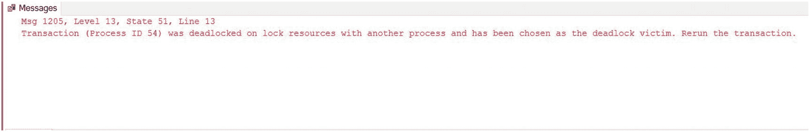

图 18-2
死锁牺牲品错误

#### 最小化死锁

您的开发人员可以采取各种措施来最小化死锁风险。因为是您（DBA）负责在生产环境中支持该实例，所以在将代码发布到生产环境之前，审慎的做法是检查开发团队的代码是否符合最小化死锁的标准。

在代码发布前进行审查时，您应确保遵循以下准则：

*   在适当的地方使用乐观隔离级别（您还应该考虑有关 TempDB 使用、磁盘开销等方面的权衡）。
*   事务内不应有用户交互（这可以避免锁被长时间持有）。
*   事务应尽可能短，并且在同一批处理中（这可以避免长时间运行的事务，这些事务会超出必要地长时间持有锁）。
*   所有可编程对象都以相同的顺序访问对象（这可以降低死锁发生的可能性，代价是第一个表上的争用）。

### 理解事务

每个导致数据或对象被修改的操作都发生在事务的上下文中。SQL Server 支持三种类型的事务：自动提交、显式和隐式。自动提交事务是默认行为，意味着每条语句都在其自身的事务上下文中执行。显式事务是手动开始和结束的。它们以 `BEGIN TRANSACTION` 语句开始，并以 `COMMIT TRANSACTION` 语句（导致相关日志记录被固化到磁盘）或 `ROLLBACK` 语句（导致事务内的所有操作被撤销）结束。如果为连接启用了隐式事务，则该连接的默认自动提交行为将不再有效。相反，事务会自动启动，然后使用 `COMMIT TRANSACTION` 语句手动提交。

#### 事务属性

事务表现出称为 ACID（原子性、一致性、隔离性和持久性）的属性。以下各节将分别讨论这些属性。

##### 原子性

对于一个具有原子性的事务，事务内的所有操作必须同时提交或同时回滚。只提交部分事务是不可能的。然而，SQL Server 对此属性的实现稍微灵活一些，它通过实现保存点来做到这一点。

`保存点`是事务中的一个标记，在发生回滚时，`保存点`之前的所有内容都会被提交，而`保存点`之后的所有内容可以被提交或回滚。这有助于捕获偶尔可能发生的错误。例如，清单 18-3 中的脚本在向 `Addresses` 表执行一个小插入之前，先向 `Customers` 表执行了一个大插入。如果向 `Addresses` 表的插入失败，向 `Customers` 表的大插入仍然会被提交。

```
SELECT COUNT(*) InitialCustomerCount FROM dbo.Customers ;
SELECT COUNT(*) InitialAddressesCount FROM dbo.Addresses ;
BEGIN TRANSACTION
DECLARE @Numbers TABLE
(
Number        INT
)
;WITH CTE(Number)
AS
(
SELECT 1 Number
UNION ALL
SELECT Number + 1
FROM CTE
WHERE Number < 100
)
INSERT INTO @Numbers
SELECT Number FROM CTE;
--Create and populate name pieces
DECLARE @Names TABLE
(
FirstName        VARCHAR(30),
LastName        VARCHAR(30)
);
INSERT INTO @Names
VALUES('Peter', 'Carter'),
('Michael', 'Smith'),
('Danielle', 'Mead'),
('Reuben', 'Roberts'),
('Iris', 'Jones'),
('Sylvia', 'Davies'),
('Finola', 'Wright'),
('Edward', 'James'),
('Marie', 'Andrews'),
('Jennifer', 'Abraham');
--Populate Customers table
SELECT * INTO #Customers
FROM
(SELECT
(SELECT TOP 1 FirstName FROM @Names ORDER BY NEWID()) FirstName,
(SELECT TOP 1 LastName FROM @Names ORDER BY NEWID()) LastName,
(SELECT TOP 1 Number FROM @Numbers ORDER BY NEWID()) BillingAddressID,
(SELECT TOP 1 Number FROM @Numbers ORDER BY NEWID()) DeliveryAddressID,
(SELECT TOP 1 CAST(RAND() * Number AS INT) * 10000
FROM @Numbers
ORDER BY NEWID()) CreditLimit,
(SELECT TOP 1 CAST(RAND() * Number AS INT) * 9000
FROM @Numbers
ORDER BY NEWID()) Balance
FROM @Numbers a
CROSS JOIN @Numbers b
) a;
INSERT INTO dbo.Customers
SELECT * FROM #Customers;
SAVE TRANSACTION CustomerInsert
BEGIN TRY
--Populate Addresses table - Will fail, due to length of Post Code
INSERT INTO dbo.Addresses
VALUES('1 Apress Towers', 'Hedge End', 'Southampton', 'SA206 2BQ') ;
END TRY
BEGIN CATCH
ROLLBACK TRANSACTION CustomerInsert
END CATCH
COMMIT TRANSACTION
SELECT COUNT(*) FinalCustomerCount FROM dbo.Customers ;
SELECT COUNT(*) FinalAddressesCount FROM dbo.Addresses ;
Listing 18-3
保存点
```

行数的结果如图 18-3 所示，显示向 `Customers` 表的插入已提交，而向 `Addresses` 表的插入已回滚。还可以在单个事务中创建多个保存点，然后回滚到最合适的点。

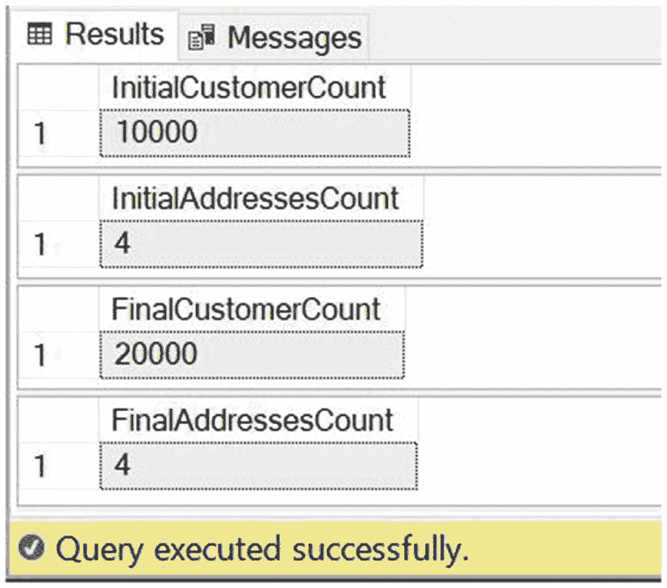

图 18-3
行数统计


##### 一致性

一致性属性意味着事务将数据库从一个一致状态转移到另一个一致状态；在事务结束时，所有数据必须符合所有的数据规则，这些规则通过约束、数据类型等方式来强制实施。

SQL Server 完全支持这一属性，但存在一些变通方法。例如，如果你在表上有一个检查约束或外键，并且你希望执行大规模的批量插入，你可以先禁用约束，插入数据，然后使用 `NOCHECK` 重新启用约束。当你使用 `NOCHECK` 时，约束会强制执行新数据修改的规则，但不会对表中已存在的数据强制执行该规则。然而，当你这样做时，SQL Server 会将该约束标记为不可信，查询优化器会忽略该约束，直到你使用以下命令验证了表中的现有数据：

```sql
ALTER TABLE MyTable WITH CHECK CHECK CONSTRAINT ALL
```

##### 隔离性

隔离性指的是并发事务在其他事务提交之前，查看其数据修改的能力。隔离事务可以避免事务异常，并通过获取锁或维护行的多个版本来强制实施。每个事务都在定义的隔离级别下运行。在我们讨论可用的隔离级别之前，我们首先需要了解可能发生的事务异常。

###### 事务异常

事务异常可能导致查询返回不可预测的结果。在 SQL Server 中，可能发生三种类型的事务异常：脏读、不可重复读和幻读。这些将在以下部分进行讨论。

####### 脏读

`脏读` 发生在一个事务读取了从未在数据库中存在过的数据时。表 18-7 概述了这种异常如何发生的一个例子。

表 18-7

一次脏读

| 事务 1 | 事务 2 |
| --- | --- |
| 将 `row1` 插入 `Table1` |   |
|   | 从 `Table1` 读取 `row1` |
| 回滚 |   |

在此示例中，由于 `事务 1` 回滚了，`事务 2` 读取了一行从未在数据库中存在的数据。如果在读取时未获取共享锁，则可能发生此异常，因为没有锁与 `事务 1` 获取的排他锁冲突。

####### 不可重复读

当一个事务两次读取同一行但每次得到不同结果时，就发生了不可重复读。表 18-8 概述了这种异常如何发生的一个例子。

表 18-8

一次不可重复读

| 事务 1 | 事务 2 |
| --- | --- |
| 从 `Table1` 读取 `row1` |   |
|   | 更新 `Table1` 中的 `row1` |
|   | 提交 |
| 从 `Table1` 读取 `row1` |   |

在此示例中，你可以看到 `事务 1` 两次从 `Table1` 读取了 `row1`。然而，第二次读取时，它得到了不同的结果，因为 `事务 2` 已经更新了该行。如果 `事务 1` 获取了共享锁但没有在事务持续期间一直持有它们，就可能发生此异常。

####### 幻读

当一个事务两次读取一个行范围，但第二次读取该范围时得到的行数不同，就发生了幻读。表 18-9 概述了这种异常如何发生的一个例子。

表 18-9

幻读

| 事务 1 | 事务 2 |
| --- | --- |
| 读取 `Table1` 中的所有行 |   |
|   | 向 `Table1` 插入十行 |
|   | 提交 |
| 读取 `Table1` 中的所有行 |   |

在此示例中，你可以看到 `事务 1` 两次读取了 `Table1` 中的所有行。然而，第二次读取时，它多读了十行，因为 `事务 2` 向表中插入了十行。当 `事务 1` 没有获取键范围锁并在事务持续期间持有它时，就可能发生此异常。

#### 隔离级别

SQL Server 为涉及基于磁盘表的事务提供了四种悲观和两种乐观事务隔离级别。悲观隔离级别使用锁来防止事务异常，乐观隔离级别使用行版本控制。

####### 悲观隔离级别

`未提交读` 是限制性最低的隔离级别。它通过为写操作获取锁，而不为读操作获取任何锁来工作。这意味着在此隔离级别下，读操作不会阻塞其他读取器或写入器。其结果是，前文描述的所有事务异常都可能发生。

`已提交读` 是默认的隔离级别。它通过为读操作获取共享锁，也为写操作获取锁来工作。共享锁仅在读取特定行的读取阶段持有，一旦记录被读取，锁就会释放。这样可以防止脏读，但不可重复读和幻读仍然可能发生。

**提示**

在某些情况下，共享锁可能会一直持有到语句结束。当物理运算符需要将数据假脱机到磁盘时，就会发生这种情况。

除了为写操作获取锁外，`可重复读` 还会获取它所触及的所有行上的共享锁，然后持有这些锁直到事务结束。其结果是，脏读和不可重复读不再可能，尽管幻读仍然可能发生。由于读取在整个事务期间都保持持有状态，因此发生死锁的可能性比使用 `已提交读` 或 `未提交读` 隔离级别时更高。

`可序列化` 是限制性最强的隔离级别，也是最有可能发生死锁的级别。它的工作方式不仅是为写操作获取锁，还为读操作获取键范围锁，然后在整个事务期间持有它们。因为键范围锁是以这种方式持有的，所以任何事务异常都不可能发生，包括幻读。


####### 乐观隔离级别

乐观隔离级别在工作时无需对读取或写入操作获取任何锁。相反，它们使用一种称为 `行版本控制` 的技术。`行版本控制` 的工作原理是：每当行被更新时，它都会在 `TempDB` 中为未提交的事务维护该行的一个新副本。这意味着始终存在一个事务可以引用的数据一致副本。这可以显著减少高并发系统上的争用。代价是需要根据大小和吞吐量容量来适当扩展 `TempDB`，因为额外的 I/O 可能对性能产生负面影响。

`快照隔离` 对读取和写入操作都使用乐观并发控制。它的工作原理是在事务开始时为每个事务分配一个事务序列号。然后，它能够通过查找最接近且小于该事务自身序列号的序列号，从 `TempDB` 中读取该事务开始时行的版本。这意味着，尽管可能存在包含修改的其他行版本，但由于序列号较高，该事务无法看到它们。如果两个事务同时尝试更新同一行，则不会发生死锁，而是第二个事务会抛出错误 `3960` 并且回滚该事务。这种行为的结果是，脏读、不可重复读和幻读都不可能发生。

`已提交读快照` 对写入操作使用悲观并发控制，对读取操作使用乐观并发控制。对于读取操作，它使用事务内每个语句开始时行的当前版本，而不是事务开始时行的版本。这意味着你获得的隔离级别与使用悲观的 `已提交读` 隔离级别相同。

与悲观隔离级别不同，你需要在数据库级别开启乐观隔离级别。当你开启 `已提交读快照` 时，它将替代 `已提交读` 的功能。这一点很重要，因为 `已提交读快照` 成为你的默认隔离级别，并用于所有未显式设置隔离级别的事务。清单 18-4 中的脚本演示了如何为 `Chapter18` 数据库开启 `快照隔离` 和 `已提交读快照隔离`。该脚本首先检查以确保 `已提交读` 和 `已提交读快照` 尚未启用。如果未启用，它会先终止当前连接到 `Chapter18` 数据库的所有会话，最后才运行 `ALTER DATABASE` 语句。

```sql
--Check if already enabled
IF EXISTS (
SELECT name
,snapshot_isolation_state_desc
,is_read_committed_snapshot_on
FROM sys.databases
WHERE name = 'Chapter18'
AND snapshot_isolation_state_desc = 'OFF'
AND is_read_committed_snapshot_on = 0 )
BEGIN
--Kill any existing sessions
IF EXISTS(
SELECT * FROM sys.dm_exec_sessions where database_id = DB_id('Chapter18')
)
BEGIN
PRINT 'Killing Sessions to Chapter18 database'
DECLARE @SQL NVARCHAR(MAX)
SET @SQL = (SELECT 'KILL ' + CAST(Session_id AS NVARCHAR(3)) + '; ' [data()]
FROM sys.dm_exec_sessions
WHERE database_id = DB_id('Chapter18')
FOR XML PATH('')
)
EXEC(@SQL)
END
PRINT 'Enabling Snapshot and Read Committed Sanpshot Isolation'
ALTER DATABASE Chapter18
SET ALLOW_SNAPSHOT_ISOLATION ON ;
ALTER DATABASE Chapter18
SET READ_COMMITTED_SNAPSHOT ON ;
END
ELSE
PRINT 'Snapshot Isolation already enabled'
Listing 18-4
启用乐观隔离级别
```

##### 持久性

要使事务具有持久性，它在提交后必须保持已提交状态，即使在发生灾难性事件时也是如此。这意味着更改必须写入磁盘，因为内存中的更改无法承受断电、实例重启等情况。SQL Server 通过使用一种称为预写日志（WAL）的过程来实现这一点。该过程在事务提交时将日志缓存刷新到磁盘，并且只有在此刷新完成后提交才算完成。

然而，SQL Server 通过引入一项称为延迟持久性的功能放宽了这些规则。此功能的工作原理是延迟将日志缓存刷新到磁盘，直到发生以下事件之一：

*   日志缓存变满并自动刷新到磁盘。
*   同一数据库中的一个完全持久性事务提交。
*   针对数据库运行了 `sp_flush_log` 系统存储过程。

使用延迟持久性时，数据在事务提交后立即对其他事务可见；但是，在日志记录被刷新之前，如果实例宕机或重启，该事务内提交的数据可能会丢失。延迟持久性的支持在数据库级别配置，使用表 18-10 中详述的三个选项之一。

表 18-10
延迟持久性的支持级别

| 支持级别 | 描述 |
| --- | --- |
| `ALLOWED` | 数据库支持延迟持久性，并在事务级别指定。 |
| `FORCED` | 数据库中的所有事务都将使用延迟持久性。 |
| `DISABLED` | 默认设置。不允许数据库中的任何事务使用延迟持久性。 |

清单 18-5 中的命令显示了如何在 `Chapter18` 数据库中允许延迟持久性。

```sql
ALTER DATABASE Chapter18
SET DELAYED_DURABILITY  = ALLOWED ;
Listing 18-5
允许延迟持久性
```

如果数据库配置为允许延迟持久性，则在 `COMMIT` 语句中配置事务级别的 `FULL` 或 `DELAYED` 持久性。清单 18-6 中的脚本演示了如何以延迟持久性提交事务。

```sql
USE Chapter18
GO
BEGIN TRANSACTION
UPDATE dbo.Customers
SET DeliveryAddressID = 1
WHERE CustomerID = 10 ;
COMMIT WITH (DELAYED_DURABILITY = ON)
Listing 18-6
以延迟持久性提交
```

#### 注意事项

使用延迟持久性时，最重要的是要记住存在数据丢失的可能性。如果任何事务已提交，但相关的日志记录在实例宕机时尚未刷新到磁盘，这些数据将会丢失。

在发生问题（例如 I/O 错误）时，未提交的事务可能进入既无法提交也无法回滚的状态。当您将数据库联机并在重做阶段和回滚阶段都失败时，就会发生这种情况。这称为 `延迟事务`。延迟事务会阻止它们所在的 VLF 被截断，这意味着事务日志会持续增长。

解决问题取决于问题的原因。如果问题是由损坏的页引起的，那么您可以尝试从备份中还原此页。如果问题是由于文件组脱机引起的，那么您必须还原该文件组或将该文件组标记为可疑。如果您将文件组标记为可疑，则无法恢复它。

### 使用内存中 OLTP 的事务

内存优化表不支持锁来提高并发性；这改变了隔离级别工作的方式，因为悲观并发控制不再是可选项。我们将在以下各节中讨论内存中 OLTP 支持的隔离级别，以及跨容器查询的注意事项。

#### 隔离级别

因为与内存中 OLTP 一起使用的所有隔离级别都必须是乐观的，所以每个隔离级别都实现行版本控制。然而，与基于磁盘的表的行版本控制不同，内存优化表的行版本不在 `TempDB` 中维护。相反，它们在它们相关的内存优化表中维护。

##### 已提交读

`已提交读`隔离级别在针对内存优化表时受到支持，但前提是您使用的是自动提交事务。在显式或隐式事务中无法使用`已提交读`。在本地编译存储过程的`ATOMIC`块中也无法使用`已提交读`。由于`已提交读`是 SQL Server 的默认隔离级别，您必须确保所有涉及内存优化表的事务都明确指定了隔离级别，或者必须设置`MEMORY_OPTIMIZED_ELEVATE_TO_SNAPSHOT`数据库属性。此选项会将所有涉及内存优化表但未指定隔离级别的事务提升到快照隔离级别，这是限制最少的隔离级别，并且完全适用于内存 OLTP。

清单 18-7 中的命令展示了如何为 `Chapter18` 数据库设置 `MEMORY_OPTIMIZED_ELEVATE_TO_SNAPSHOT` 属性。

```sql
ALTER DATABASE Chapter18
SET MEMORY_OPTIMIZED_ELEVATE_TO_SNAPSHOT = ON ;
```
清单 18-7
提升到快照

##### 已提交读快照

`已提交读快照`隔离级别在针对内存优化表时受到支持，但仅限于您使用自动提交事务时。当事务访问基于磁盘的表时，此隔离级别不受支持。

##### 快照

`快照`隔离级别使用行版本控制来确保事务始终看到事务开始时的数据。仅当您使用解释型 SQL 且指定的是查询提示而非事务级别时，快照隔离级别才在针对内存优化表时受到支持。它在本地编译存储过程的`ATOMIC`块中完全受支持。

如果一个事务尝试修改已被另一个事务更新的行，则冲突检测机制会回滚该事务，并抛出错误 41302。如果一个事务尝试插入与另一个事务已插入的行具有相同主键值的行，则冲突检测会回滚该事务并抛出错误 41352。如果一个事务尝试修改已被另一个事务删除的表中的数据，则会抛出错误 41305，并且该事务将被回滚。

##### 可重复读

`可重复读`隔离级别提供与`快照`相同的保护，但此外，它还保证自事务开始以来，事务读取的行未被其他行修改。如果事务尝试读取已被另一个事务修改的行，则会抛出错误 41305 并且回滚该事务。然而，在使用解释型 SQL 时，`可重复读`隔离不支持针对内存优化表。它仅在本地编译存储过程的`ATOMIC`块中受支持。

##### 可序列化

`可序列化`隔离级别提供了`可重复读`所提供的相同保护，但此外，它还保证在事务所访问的查询范围内没有插入新行。如果使用`可序列化`隔离级别的事务无法满足其保证，则冲突检测机制将回滚该事务并抛出错误 41325。然而，在使用解释型 SQL 时，`可序列化`隔离不支持针对内存优化表。它仅在本地编译存储过程的`ATOMIC`块中受支持。

#### 跨容器事务

由于隔离级别的使用受到限制，当一个事务同时访问内存优化表和基于磁盘的表时，您可能需要指定隔离级别和查询提示的组合。清单 18-8 中的查询将 `Customers` 和 `CustomersMem` 表连接在一起。它之所以成功，仅仅是因为我们启用了 `MEMORY_OPTIMIZED_ELEVATE_TO_SNAPSHOT`。这意味着该查询使用默认的 `已提交读快照` 隔离级别访问基于磁盘的表，并自动将 `CustomersMem` 表的读取提升到使用 `快照` 隔离。

```sql
BEGIN TRANSACTION
SELECT *
FROM dbo.Customers C
INNER JOIN dbo.CustomersMem CM
ON C.CustomerID = CM.CustomerID ;
COMMIT TRANSACTION
```
清单 18-8
通过自动提升连接磁盘和内存表

但是，如果我们现在关闭 `MEMORY_OPTIMIZED_ELEVATE_TO_SNAPSHOT`（您可以使用清单 18-9 中的脚本完成此操作），相同的事务现在将失败，并显示图 18-4 中的错误消息。

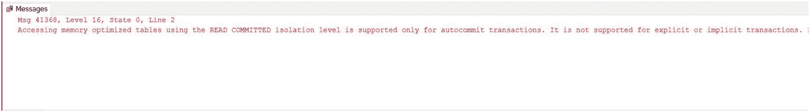

图 18-4

在没有自动提升的情况下连接磁盘和内存表

```sql
ALTER DATABASE Chapter18
SET MEMORY_OPTIMIZED_ELEVATE_TO_SNAPSHOT=OFF
GO
```
清单 18-9
关闭 `MEMORY_OPTIMIZED_ELEVATE_TO_SNAPSHOT`

清单 18-10 中的查询演示了如何将 `Customers` 表与 `CustomersMem` 表连接，其中对内存优化表使用 `快照` 隔离级别，对基于磁盘的表使用 `可序列化` 隔离级别。因为我们使用的是解释型 SQL，`快照` 隔离级别是我们可以用来访问内存优化表的唯一级别，并且我们必须将其指定为查询提示。如果我们在事务级别指定它而不是指定 serializable，事务将失败。

```sql
BEGIN TRANSACTION
SET TRANSACTION ISOLATION LEVEL SERIALIZABLE
SELECT *
FROM dbo.Customers C
INNER JOIN dbo.CustomersMem CM (SNAPSHOT)
ON C.CustomerID = CM.CustomerID ;
COMMIT TRANSACTION
```
清单 18-10
使用查询提示连接磁盘和内存优化表

如果我们使用本机编译存储过程而不是解释型 SQL，我们会将所需的事务隔离级别添加到过程定义的 `ATOMIC` 块中。清单 18-11 中的脚本演示了创建一个本机编译存储过程，该过程使用 `可序列化` 隔离级别更新 `CustomersMem` 表。由于本机编译存储过程无法访问基于磁盘的表，因此您无需担心用于支持跨容器事务的锁提示。

```sql
CREATE PROCEDURE dbo.UpdateCreditLimit
WITH native_compilation, schemabinding, execute as owner
AS
BEGIN ATOMIC
WITH(TRANSACTION ISOLATION LEVEL = SERIALIZABLE, LANGUAGE = 'English')
UPDATE dbo.CustomersMem
SET CreditLimit = CreditLimit * 1.1
WHERE Balance < CreditLimit / 4 ;
UPDATE dbo.CustomersMem
SET CreditLimit = CreditLimit * 1.05
WHERE Balance < CreditLimit / 2 ;
END
```
清单 18-11
在本机编译存储过程中使用 `可序列化` 隔离级别


##### 重试逻辑

无论您使用的是解释型 SQL 还是原生编译的存储过程，在针对内存优化表运行事务时，都必须确保使用重试逻辑。这是因为乐观并发模型意味着冲突检测机制会回滚事务，而不是通过锁来管理并发。同样重要的是要记住，如果无法保证所需的隔离级别，SQL Server 甚至会回滚只读事务。例如，如果您在只读事务中使用可序列化隔离级别，而另一个事务插入了与您的查询筛选条件匹配的行，则该事务将被回滚。

清单 18-12 中的脚本为 `UpdateCreditLimit` 过程创建了一个包装器存储过程，如果过程失败，该过程最多重试十次，每次迭代之间间隔 1 秒。您应更改此延迟以匹配冲突事务的平均持续时间。

```sql
CREATE PROCEDURE UpdateCreditLimitWrapper
AS
BEGIN
DECLARE @Retries INT = 1 ;
WHILE @Retries <= 10
BEGIN
BEGIN TRY
EXEC dbo.UpdateCreditLimit ;
END TRY
BEGIN CATCH
WAITFOR DELAY '00:00:01' ;
SET @Retries = @Retries + 1 ;
END CATCH
END
END
```
清单 18-12 内存优化表的重试逻辑

### 观察事务、锁和死锁

SQL Server 提供了一组 DMV（动态管理视图），用于公开有关当前事务和锁的信息。以下各节探讨可用的元数据。

#### 观察事务

`sys.dm_tran_active_transactions` DMV 详细列出了实例中的当前事务。此 DMV 返回表 18-11 中描述的列。

表 18-11 `sys.dm_tran_active_transactions` 返回的列

| 列 | 描述 |
| --- | --- |
| `transaction_id` | 事务的唯一 ID。 |
| `name` | 事务的名称。如果事务未标记名称，则显示默认名称——例如 `"user_transaction"`。 |
| `transaction_begin_time` | 事务开始的日期和时间。 |
| `transaction_type` | 描述事务类型的整数值。<br>• `1` 表示读写事务。<br>• `2` 表示只读事务。<br>• `3` 表示系统事务。<br>• `4` 表示分布式事务。 |
| `transaction_uow` | MSDTC（Microsoft 分布式事务协调器）用于处理分布式事务的工作单元 ID。 |
| `transaction_state` | 事务的当前状态。<br>• `0` 表示事务仍在初始化。<br>• `1` 表示事务已初始化但尚未开始。<br>• `2` 表示事务处于活动状态。<br>• `3` 表示事务已结束。此状态仅适用于只读事务。<br>• `4` 表示已启动提交。此状态仅适用于分布式事务。<br>• `5` 表示事务已准备好并等待解决。<br>• `6` 表示事务已提交。<br>• `7` 表示事务正在回滚。<br>• `8` 表示事务回滚已完成。 |
| `dtc_state` | 指示 Azure 数据库上事务的状态。<br>• `1` 表示事务处于活动状态。<br>• `2` 表示事务已准备好。<br>• `3` 表示事务已提交。<br>• `4` 表示事务已中止。<br>• `5` 表示事务已恢复。 |

#### 注意

本章中的 DMV 已省略未文档化的列。

清单 18-13 中的脚本展示了如何使用 `sys.dm_tran_active_transactions` 查找长时间运行事务的详细信息。该查询查找运行时间超过 10 分钟的事务，并返回信息，包括它们的当前状态、消耗的资源量以及执行它们的登录名。

#### 提示

在测试环境中，在运行此查询前 10 分钟开始一个事务但不提交它。

```sql
SELECT
name
,transaction_begin_time
,CASE transaction_type
WHEN 1 THEN '读写'
WHEN 2 THEN '只读'
WHEN 3 THEN '系统'
WHEN 4 THEN '分布式'
END TransactionType,
CASE transaction_state
WHEN 0 THEN '正在初始化'
WHEN 1 THEN '已初始化但未启动'
WHEN 2 THEN '活动'
WHEN 3 THEN '已结束'
WHEN 4 THEN '正在提交'
WHEN 5 THEN '已准备好'
WHEN 6 THEN '已提交'
WHEN 7 THEN '正在回滚'
WHEN 8 THEN '已回滚'
END State
, SUBSTRING(TXT.text, ( er.statement_start_offset / 2 ) + 1,
( ( CASE WHEN er.statement_end_offset = -1
THEN LEN(CONVERT(NVARCHAR(MAX), TXT.text)) * 2
ELSE er.statement_end_offset
END - er.statement_start_offset ) / 2 ) + 1) AS CurrentQuery
, TXT.text AS ParentQuery
, es.host_name
, CASE tat.transaction_type
WHEN 1 THEN '读写事务'
WHEN 2 THEN '只读事务'
WHEN 3 THEN '系统事务'
WHEN 4 THEN '分布式事务'
ELSE '未知'
END AS TransactionType
,SUSER_SNAME(es.security_id) LoginRunningTransaction
,es.memory_usage * 8 MemUsageKB
,es.reads
,es.writes
,es.cpu_time
FROM sys.dm_tran_active_transactions tat
INNER JOIN sys.dm_tran_session_transactions st
ON tat.transaction_id = st.transaction_id
INNER JOIN sys.dm_exec_sessions es
ON st.session_id = es.session_id
INNER JOIN sys.dm_exec_requests er
ON er.session_id = es.session_id
CROSS APPLY sys.dm_exec_sql_text(er.sql_handle) TXT
WHERE st.is_user_transaction = 1
AND tat.transaction_begin_time < DATEADD(MINUTE,-10,GETDATE()) ;
```
清单 18-13 长时间运行的事务

该查询通过 `sys.dm_tran_session_transactions` 连接到 `sys.dm_exec_sessions` 来工作。此 DMV 可用于将事务与会话关联起来，它返回表 18-12 中描述的列。

表 18-12 `sys.dm_tran_session_transactions` 列

| 列 | 描述 |
| --- | --- |
| `session_id` | 运行事务的会话 ID。 |
| `transaction_id` | 事务的唯一 ID。 |
| `transaction_descriptor` | 用于与客户端驱动程序通信的 ID。 |
| `enlist_count` | 会话中活动请求的数量。 |
| `is_user_transaction` | 指示事务是用户事务还是系统事务。`0` 表示系统事务，`1` 表示用户事务。 |
| `is_local` | 指示事务是否为分布式事务。`0` 表示分布式事务，`1` 表示本地事务。 |
| `is_enlisted` | 指示已征用分布式事务。 |
| `is_bound` | 指示事务是否在绑定会话中运行。 |
| `open_transaction_count` | 会话中打开事务的计数。 |


#### 观察锁与争用

当前实例上锁的详细信息通过一个名为 `sys.dm_tran_locks` 的 DMV 暴露。此 DMV 返回表 18-13 中详述的列。

表 18-13
`sys.dm_tran_locks`

| 列名 | 描述 |
| --- | --- |
| `resource_type` | 锁已放置在其上的资源类型。 |
| `resource_subtype` | 已被放置锁的资源类型的子类型。例如，如果你正在更新数据库的属性，那么 `resource_type` 是 `METADATA`，而 `resource_subtype` 是 `DATABASE`。 |
| `resource_database_id` | 包含已加锁资源的数据库的 ID。 |
| `resource_description` | 关于该资源的其他信息，这些信息未包含在其他列中。 |
| `resource_associated_entity_id` | 与该资源关联的数据库实体的 ID。 |
| `resource_lock_partition` | 锁的分区号（如果正在使用锁分区）。 |
| `request_mode` | 已请求或已获取的锁定模式。例如，共享锁为 `S`，排他锁为 `X`。 |
| `request_type` | `request_type` 始终为 `LOCK`。 |
| `request_status` | 锁请求的当前状态。可能的值为 `ABORT_BLOCKERS`、`CONVERT`、`GRANTED`、`LOW_PRIORITY_CONVERT`、`LOW_PRIORITY_WAIT` 和 `WAIT`。 |
| `request_reference_count` | 请求者对同一资源请求锁的次数。 |
| `request_session_id` | 当前拥有该请求的会话 ID。如果事务是分布式的，则会话 ID 可能会改变。 |
| `request_exec_context_id` | 请求锁的进程的执行 ID。 |
| `request_request_id` | 当前拥有该请求的批处理的批处理 ID。如果应用程序正在使用 Multiple Active Result Sets (MARS)，此 ID 可能会改变。 |
| `request_owner_type` | 锁请求所有者的类型。对于用户操作，可能的值为 `TRANSACTION`、`SESSION` 和 `CURSOR`。值也可以是 `SHARED_TRANSACTION_WORKSPACE` 和 `EXCLUSIVE_TRANSACTION_WORKSPACE`，它们在内部用于保存已登记事务的锁，或者是 `NOTIFICATION_OBJECT`，由内部 SQL Server 操作使用。 |
| `request_owner_id` | 拥有锁请求的事务的 ID，除非请求是由 FileTable 发出的，此时 `-3` 表示表锁，`-4` 表示数据库锁，其他值表示文件的文件句柄。 |
| `request_owner_guid` | 标识请求所有者的 GUID。仅适用于分布式事务。 |
| `lock_owner_address` | 请求的内部数据结构的内存地址。 |

`sys.dm_os_waiting_tasks` DMV 返回有关等待资源（包括锁）的任务的信息。此 DMV 返回的列详见表 18-14。此 DMV 可与 `sys.dm_tran_locks` 结合使用，以查找由于锁而被阻塞和正在阻塞的进程的详细信息。

表 18-14
`sys.dm_os_waiting_tasks` 列

| 列名 | 描述 |
| --- | --- |
| `waiting_task_address` | 正在等待的任务的地址。 |
| `session_id` | 运行等待任务的会话的 ID。 |
| `exec_context_id` | 运行该任务的线程和子线程的 ID。 |
| `wait_duration_ms` | 等待的持续时间，以毫秒为单位。 |
| `wait_type` | 正在经历的等待类型。等待在第 17 章中讨论。 |
| `resource_address` | 任务正在等待的资源的地址。 |
| `blocking_task_address` | 指示当前正在使用该资源的任务的地址。 |
| `blocking_session_id` | 当前正在使用该资源的任务的会话 ID。 |
| `blocking_exec_context_id` | 当前正在使用该资源的任务的线程和子线程的 ID。 |
| `resource_description` | 关于资源的其他信息，这些信息未包含在其他列中，包括锁资源所有者。 |

清单 18-14 中的脚本演示了如何使用 `sys.dm_tran_locks` 和 `sys.dm_os_waiting_tasks` 来识别实例上的阻塞。该脚本包含三个部分，每个部分都应在单独的查询窗口中运行。脚本的前两部分导致争用。第三部分识别争用的来源。

```
--Part 1 - 在第 1 个查询窗口中运行
BEGIN TRANSACTION
UPDATE Customers
SET CreditLimit = CreditLimit ;
--Part 2 - 在第 2 个查询窗口中运行
SELECT creditlimit
FROM dbo.Customers (SERIALIZABLE) ;
--Part 3 - 在第 3 个查询窗口中运行
SELECT
DB_NAME(tl.resource_database_id) DatabaseName
,tl.resource_type
,tl.resource_subtype
,tl.resource_description
,tl.request_mode
,tl.request_status
,os.session_id BlockedSession
,os.blocking_session_id BlockingSession
,os.resource_description
,OBJECT_NAME(
CAST(
SUBSTRING(os.resource_description,
CHARINDEX('objid=',os.resource_description,0)+6,9)
AS INT)
) LockedTable
FROM sys.dm_os_waiting_tasks os
INNER JOIN sys.dm_tran_locks tl
ON os.session_id = tl.request_session_id
WHERE tl.request_owner_type IN ('TRANSACTION', 'SESSION', 'CURSOR') ;
```
清单 18-14
使用 `sys.dm_tran_locks`

#### 提示

要停止阻塞，请在第一个查询窗口中运行 `ROLLBACK`。

图 18-5 中的结果显示，脚本的第二部分正被脚本的第一部分阻塞。最后一列从 `resource_description` 列中提取对象 ID，并识别发生争用的表。

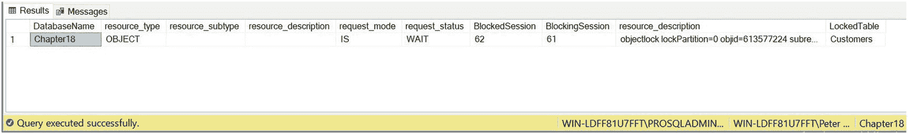

图 18-5
`sys.dm_tran_locks` 结果

#### 观察死锁

通过打开跟踪标志 1204 和 1222，可以捕获死锁的详细信息并将其写入错误日志。跟踪标志 1204 捕获死锁中涉及的资源和锁类型的详细信息。它包含死锁中涉及的每个节点的一个部分，后面是一个详细说明死锁受害者的内容。跟踪标志 1222 返回三个部分。第一部分给出死锁受害者的详细信息；第二部分给出死锁中涉及的进程的详细信息；最后一部分描述死锁中涉及的资源。

在现代 SQL Server 世界中，通常不需要打开这些跟踪标志，因为你可以通过查看系统运行状况会话（`system_health`）来回溯死锁的详细信息，这是每个 SQL Server 实例上默认启用的 Extended Events 会话。除其他重要详细信息外，系统运行状况会话捕获发生的任何死锁的详细信息。你可以通过在 SQL Server Management Studio 中深入到 Management ➤ Extended Events ➤ Sessions ➤ `system_health`，然后从 `Package0.eventfile` 的上下文菜单中选择 View Target Data 来访问系统运行状况会话。如果在 name 列中搜索 `xml_deadlock_report`，你将看到已发生的死锁事件的详细信息。Details 选项卡提供完整的死锁报告，包括关于死锁受害者以及死锁中涉及的进程、资源和所有者的信息。Deadlock 选项卡显示死锁图，如图 18-6 所示，对应于我们在清单 18-2 中生成的死锁。

#### 注意

如果系统运行状况会话有回滚大小限制，则死锁的详细信息可能会丢失。

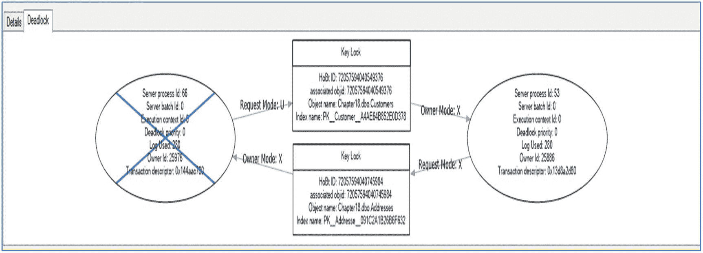

图 18-6
死锁图

### 概述

锁可以在不同的**粒度**级别上被获取。在较低级别进行锁定可以减少争用，但会为内部锁内存结构使用额外资源。在较高级别进行锁定可能会增加其他进程的等待时间，并增加死锁的可能性。SQL Server 2014 引入了新功能，使数据库管理员能够控制联机维护操作（如索引重建和分区切换操作）的锁定行为。在拥有 16 个或更多内核实例的大型系统上，SQL Server 会自动实现锁分区，通过将单个锁资源拆分为多个资源来减少争用。

事务具有 **ACID** 属性，使其具备原子性、一致性、隔离性和持久性。然而，SQL Server 提供了放宽其中一些规则的功能，以提高性能并简化编码。针对磁盘表有六种隔离级别可用，其中两种是乐观的，其余是悲观的。悲观隔离级别通过获取锁来避免事务异常，而乐观并发则依赖于行版本控制。

由于内存优化表不支持锁，因此针对内存优化表的所有事务都使用乐观并发。SQL Server 实现了乐观隔离级别，这些级别只能用于内存优化表。由于事务的乐观特性，您应该为只读和读写事务都实现重试逻辑。

SQL Server 提供了丰富的元数据，可以帮助数据库管理员观察事务、锁、争用和死锁。`Sys.dm_tran_active_transactions` 显示当前在实例上处于活动状态的事务的详细信息。`Sys.dm_tran_locks` 提供有关当前在实例中被请求或已授予的锁的信息。您可以通过启用跟踪标志 1204 和 1222 在 SQL Server 错误日志中捕获死锁信息，但系统运行状况跟踪默认也会捕获死锁信息。这意味着您可以事后检索死锁信息，而无需执行预先配置或跟踪。

# 19. 扩展事件

扩展事件是 SQL Server 提供的一种轻量级监视系统。由于其架构使用的系统资源非常少，因此扩展性很好，并且允许您以对用户活动影响最小的方式监视实例。它们还具有高度可配置性，这使您在数据库管理员角色中拥有广泛的选项来捕获从非常细粒度（如页面拆分）到更高级别详细信息（如 **CPU** 利用率）的详细信息。您还可以将扩展事件与操作系统数据关联起来，以便在排查问题时提供整体视图。扩展事件的前身是 **SQL Trace** 及其 **GUI** 工具 **Profiler**。该工具现已不推荐用于数据库引擎，建议仅将其用于跟踪 **Analysis Service** 活动。

在本章中，我们将讨论与扩展事件相关的概念，然后讨论如何实现该技术。最后，我们将讨论如何将其与操作系统计数器集成。

### 扩展事件概念

扩展事件具有丰富的架构，由事件、目标、操作、类型、谓词和映射组成。这些对象存储在包内，而包又存储在模块内，模块可以是 `.dll` 文件或可执行文件。我们将在以下部分讨论这些概念。

#### 包

*包* 是扩展事件中使用的对象的容器。以下是 SQL Server 的四种包类型：

*   `Package0`：默认包，用于扩展事件系统对象。
*   `Sqlserver`：用于 SQL Server 相关对象。
*   `Sqlos`：用于 SQLOS 相关对象。
*   `SecAudit`：由 SQL 审计使用；但其对象不对外暴露。

#### 事件

*事件* 是您可以跟踪的感兴趣的发生事项。它可以是一个 SQL 批处理完成、一次缓存未命中、一次页面拆分，或者根据您配置的跟踪性质，几乎任何可能发生在数据库引擎内部的事情。每个事件都通过通道和关键字（也称为类别）进行分类。*通道* 是高级分类，SQL Server 2019 中的所有事件都属于表 19-1 中描述的通道之一。

表 19-1 通道

| 通道 | 描述 |
| --- | --- |
| Admin | 具有明确解决方案的已知事件。例如，死锁、服务器启动、CPU 阈值被超过以及使用已弃用的功能。 |
| Operational | 用于排查问题。例如，检测到坏内存、AlwaysOn 可用性组副本更改其状态以及检测到长时间 I/O，这些都是属于 Operational 通道的事件。 |
| Analytic | 可用于排查性能等问题的高容量事件。例如，事务开始、获取锁以及文件读取完成，这些都是属于 Analytic 通道的事件。 |
| Debug | 开发人员用于通过返回内部数据来诊断问题。Debug 通道中的事件在 SQL Server 的未来版本中可能会更改，因此应尽可能避免使用它们。 |

关键字，也称为类别，粒度要细得多。SQL Server 2019 中有 88 个类别。可以通过运行清单 19-1 中的查询来列出这些类别。

```
SELECT DISTINCT map_value AS Category
FROM sys.dm_xe_map_values map
WHERE map.name = 'keyword_map'
ORDER BY map.map_value
```

清单 19-1 返回类别列表

#### 目标

*目标* 是事件的消费者；本质上，它是跟踪数据将被写入的设备。SQL Server 2019 中可用的目标详见表 19-2。

表 19-2 目标

| 目标 | 同步/异步 | 描述 |
| --- | --- | --- |
| Event counter | 同步 | 统计会话期间发生的事件数量 |
| Event file | 异步 | 将事件输出写入内存缓冲区，然后将其刷新到磁盘 |
| Event pairing | 异步 | 确定是否发生了配对事件而没有其匹配事件，例如，一个语句开始但从未完成 |
| ETW* | 同步 | 用于将扩展事件与操作系统数据关联 |
| Histogram | 异步 | 根据操作或事件列统计会话期间发生的事件数量 |
| Ring buffer | 异步 | 使用先进先出方法将数据存储在内存缓冲区中 |

***Event Tracking for Windows**

#### 操作

*操作* 是允许在事件触发时捕获附加信息的命令。当事件发生时，操作会同步触发，事件本身并不知道该操作。SQL Server 2019 中有 64 个可用操作，允许您捕获丰富的信息数组，包括导致事件触发的语句、运行该语句的登录名、事务 **ID**、**CPU ID** 以及调用堆栈。


#### 谓词

`Predicates`是系统在向目标发送事件之前可以应用的筛选条件。您可以创建简单的谓词，例如基于数据库 ID 筛选完成的语句；也可以创建更复杂的谓词，例如仅捕获持续时间超过 5 秒的长 IO，或者仅当 AlwaysOn 可用性组副本的角色更改发生超过两次时才捕获该事件。

谓词也完全支持短路求值。这意味着如果您在谓词中使用多个条件，那么谓词的顺序就很重要，因为如果第一个谓词的评估失败，第二个谓词将不会被评估。由于谓词是同步评估的，这可能会对性能产生影响。因此，明智的做法是设计您的谓词，使最不可能评估为`true`的谓词排在非常可能评估为`true`的谓词之前。例如，假设您计划筛选一个特定数据库（数据库 ID 为`6`），该数据库是实例上高比例活动的目标，但您也计划筛选一个特定用户 ID（`MyUser`），该用户负责较低比例的活动。在此场景中，您将使用`WHERE (([sqlserver].[username]=N'MyUser') AND ([sqlserver].[database_id]=(6)))`谓词，首先筛选掉与`MyUser`无关的活动，然后筛选掉与数据库 ID`6`无关的活动。

#### 类型和映射

包中的所有对象都被分配了一个类型。此类型用于解释存储在对象字节集合中的数据。对象被分配为以下类型之一：

*   `Action`
*   `Event`
*   `Pred_compare`（从事件中检索数据）
*   `Pred_source`（比较数据类型）
*   `Target`
*   `Type`

您可以通过执行清单[19-2]中的查询来找到谓词比较器和谓词源的列表。

```
--Retrieve list of predicate comparators
SELECT name
,description,
(SELECT name
FROM sys.dm_xe_packages
WHERE guid = xo.package_guid) Package
FROM sys.dm_xe_objects xo
WHERE object_type = 'pred_compare'
ORDER BY name ;
--Retrieve list of predicate sources
SELECT name
,description,
(SELECT name
FROM sys.dm_xe_packages
WHERE guid = xo.package_guid) Package
FROM sys.dm_xe_objects xo
WHERE object_type = 'pred_source'
ORDER BY name ;
Listing 19-2
Retrieving Predicate Comparators and Sources
```

*映射*是一个字典，将内部 ID 值映射为 DBA 可以理解的字符串。映射键仅在其上下文中是唯一的，并在不同上下文之间重复。例如，在`statement_recompile_cause`上下文中，`map_key`为`1`对应于`map_value`为`Schema Changed`。然而，在`database_sql_statement`类型的上下文中，`map_key`为`1`对应于`map_value`为`CREATE DATABASE`。您可以使用`sys.dm_xe_map_values` DMV 查找完整的映射列表，如清单[19-3]所示。要检查特定上下文的映射，请对 name 列进行筛选。

```
SELECT
map_key
, map_value
, name
FROM sys.dm_xe_map_values ;
Listing 19-3
Sys.dm_xe_map_values
```

#### 会话

*会话*本质上是一个跟踪。它可以包含来自多个包、操作、目标和谓词的事件。当您启动或停止会话时，就是在打开或关闭跟踪。会话启动时，事件被写入内存缓冲区，并在发送到目标之前应用谓词。因此，在创建会话时，您需要配置属性，例如会话可用于缓冲的内存量、如果会话遇到内存压力可以丢弃哪些事件，以及事件发送到目标前的最大延迟。

### 创建事件会话

您可以使用新建会话向导、新建会话对话框或通过 T-SQL 创建事件会话。我们将在以下部分探讨这些选项。然而，在创建任何事件会话之前，我们首先创建`Chapter19`数据库，用数据填充它，并创建存储过程，这些将在后面的示例中使用。清单[19-4]包含执行此操作的脚本。

```
--Create the database
CREATE DATABASE Chapter19 ;
GO
USE Chapter19
GO
--Create and populate numbers table
DECLARE @Numbers TABLE
(
Number        INT
)
;WITH CTE(Number)
AS
(
SELECT 1 Number
UNION ALL
SELECT Number + 1
FROM CTE
WHERE Number < 100
)
INSERT INTO @Numbers
SELECT Number FROM CTE;
--Create and populate name pieces
DECLARE @Names TABLE
(
FirstName        VARCHAR(30),
LastName        VARCHAR(30)
);
INSERT INTO @Names
VALUES('Peter', 'Carter'),
('Michael', 'Smith'),
('Danielle', 'Mead'),
('Reuben', 'Roberts'),
('Iris', 'Jones'),
('Sylvia', 'Davies'),
('Finola', 'Wright'),
('Edward', 'James'),
('Marie', 'Andrews'),
('Jennifer', 'Abraham');
--Create and populate Customers table
CREATE TABLE dbo.Customers
(
CustomerID           INT                NOT NULL        IDENTITY                    PRIMARY KEY,
FirstName            VARCHAR(30)        NOT NULL,
LastName             VARCHAR(30)        NOT NULL,
BillingAddressID     INT                NOT NULL,
DeliveryAddressID    INT                NOT NULL,
CreditLimit          MONEY              NOT NULL,
Balance              MONEY              NOT NULL
);
SELECT * INTO #Customers
FROM
(SELECT
(SELECT TOP 1 FirstName FROM @Names ORDER BY NEWID()) FirstName,
(SELECT TOP 1 LastName FROM @Names ORDER BY NEWID()) LastName,
(SELECT TOP 1 Number FROM @Numbers ORDER BY NEWID()) BillingAddressID,
(SELECT TOP 1 Number FROM @Numbers ORDER BY NEWID()) DeliveryAddressID,
(SELECT TOP 1 CAST(RAND() * Number AS INT) * 10000
FROM @Numbers
ORDER BY NEWID()) CreditLimit,
(SELECT TOP 1 CAST(RAND() * Number AS INT) * 9000
FROM @Numbers
ORDER BY NEWID()) Balance
FROM @Numbers a
CROSS JOIN @Numbers b
) a;
INSERT INTO dbo.Customers
SELECT * FROM #Customers;
GO
CREATE INDEX idx_LastName ON dbo.Customers(LastName)
GO
CREATE PROCEDURE UpdateCustomerWithPageSplits
AS
BEGIN
UPDATE dbo.Customers
SET FirstName = cast(FirstName + replicate(FirstName,10) as varchar(30))
,LastName = cast(LastName + replicate(LastName,10) as varchar(30)) ;
END ;
GO
CREATE PROCEDURE UpdateCustomersWithoutPageSplits
AS
BEGIN
UPDATE dbo.Customers
SET CreditLimit = CreditLimit * 1.5
WHERE Balance < CreditLimit - 10000 ;
END ;
GO
Listing 19-4
Creating the Chapter19 Database
```


### 使用新建会话对话框

在 SQL Server Management Studio 中，首先在对象资源管理器中依次展开“管理” ➤ “扩展事件”，然后从“会话”上下文菜单中选择“新建会话”，即可访问新建会话对话框。我们使用此对话框来创建一个会话，用于监视页拆分并将其与引发拆分的存储过程关联起来。为实现这一点，我们需要启用**因果跟踪**，这会为每个事件赋予一个额外的 GUID 值（称为 `ActivityID`）和一个序列号；这两者共同作用，使得事件可以相互关联。

当你调用此对话框时，首先显示的是“常规”页面，如图 19-1 所示。在此页面上，你可以指定会话的名称，选择是否在创建完成后自动启动会话、是否在实例启动时自动启动，是否在会话完成后启动实时数据视图，以及是否应启用因果跟踪。

由于我们将监视页拆分，因此将此会话命名为 `PageSplits`，并指定会话应在创建后和实例启动时均自动启动。同时，我们也开启了因果跟踪。

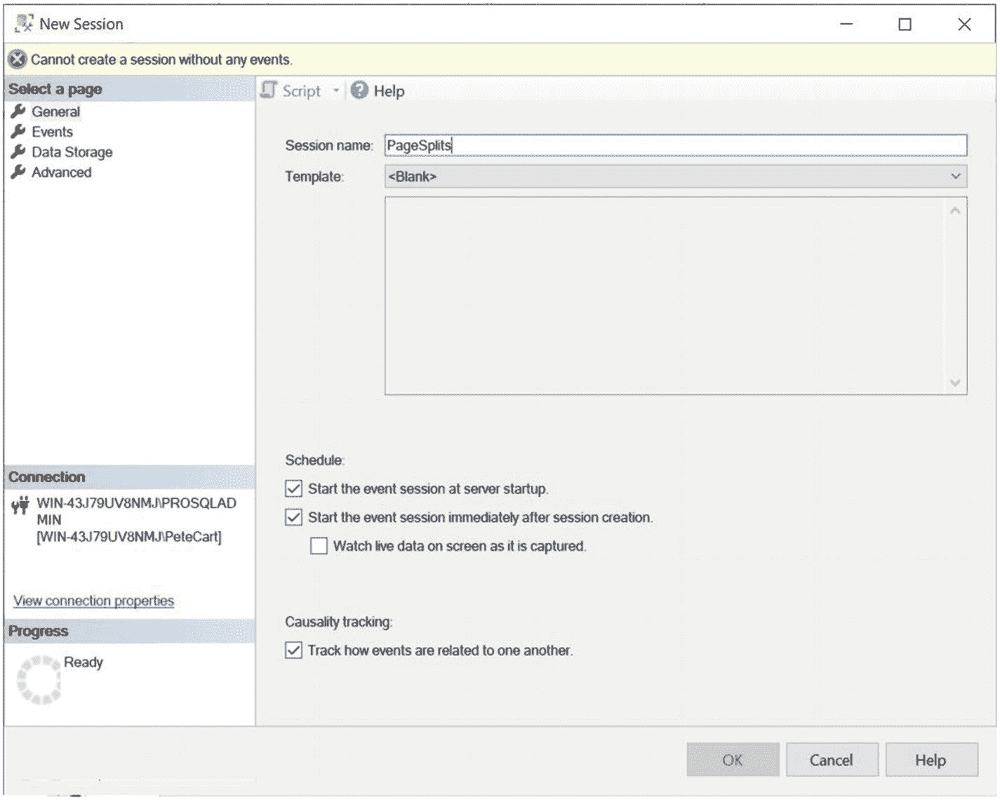
图 19-1: “常规”页面

在“事件”页面上，我们首先搜索并选择 `page_split` 和 `module_start` 事件，如图 19-2 所示。每当可编程对象触发时，都会触发 `module_start` 事件。

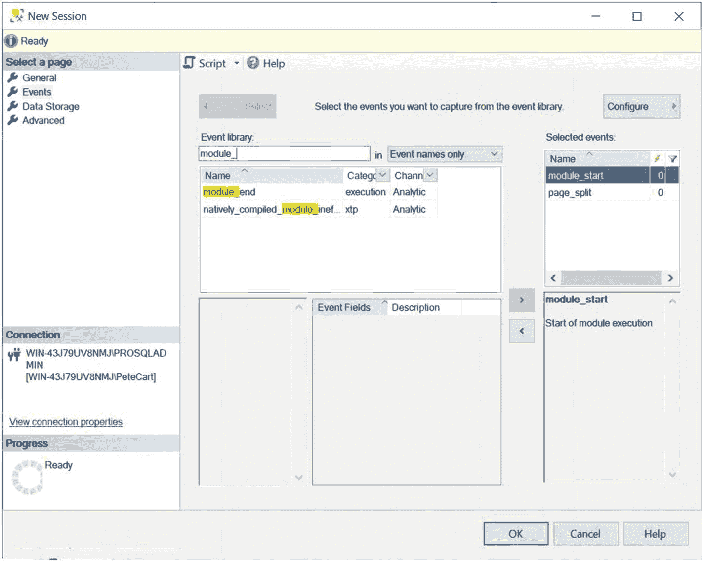
图 19-2: “事件”页面

现在，我们需要使用“配置”按钮来配置每个事件。在配置屏幕的“全局字段（操作）”选项卡中，我们为 `module_start` 事件选择 `nt_username` 和 `database_name` 操作，如图 19-3 所示。

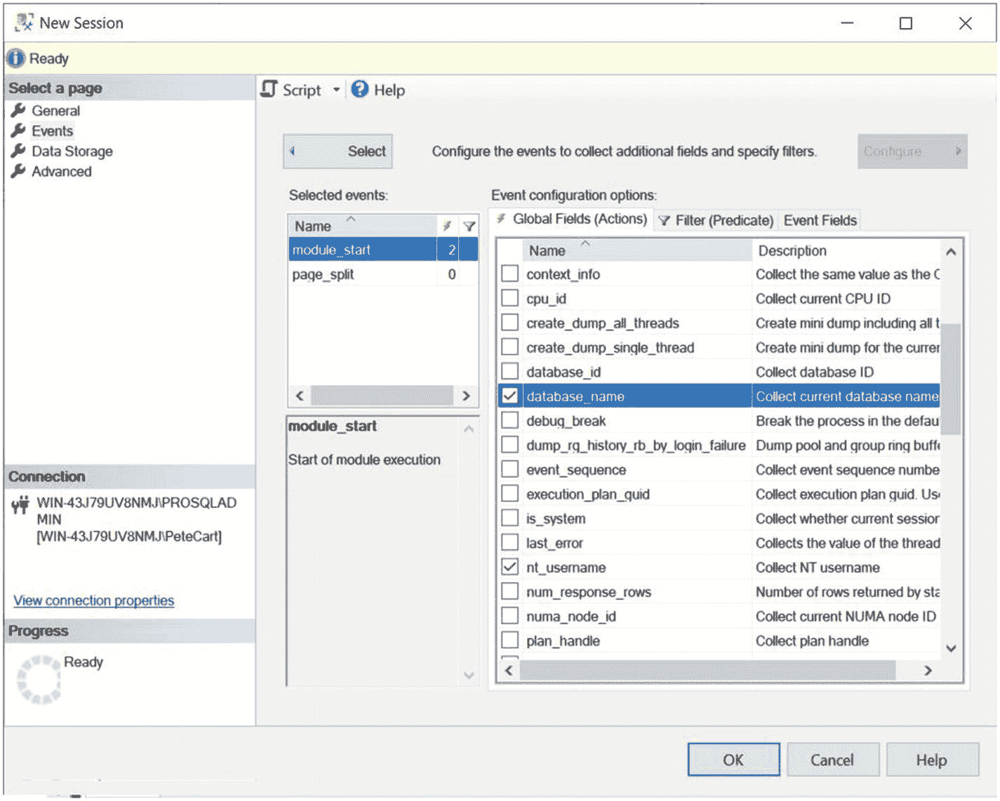
图 19-3: “全局字段（操作）”选项卡

#### 提示

如果需要为多个事件配置相同的操作，可以多选这些事件。

在“筛选器（谓词）”选项卡中，我们将 `page_split` 事件配置为基于 `database_name` 进行筛选，本例中该名称为 `Chapter19`，如图 19-4 所示。这意味着仅捕获与该数据库相关的页拆分。我们不对 `module_start` 事件按 `database_name` 进行筛选，因为理论上，导致页拆分的存储过程可能来自任何数据库。

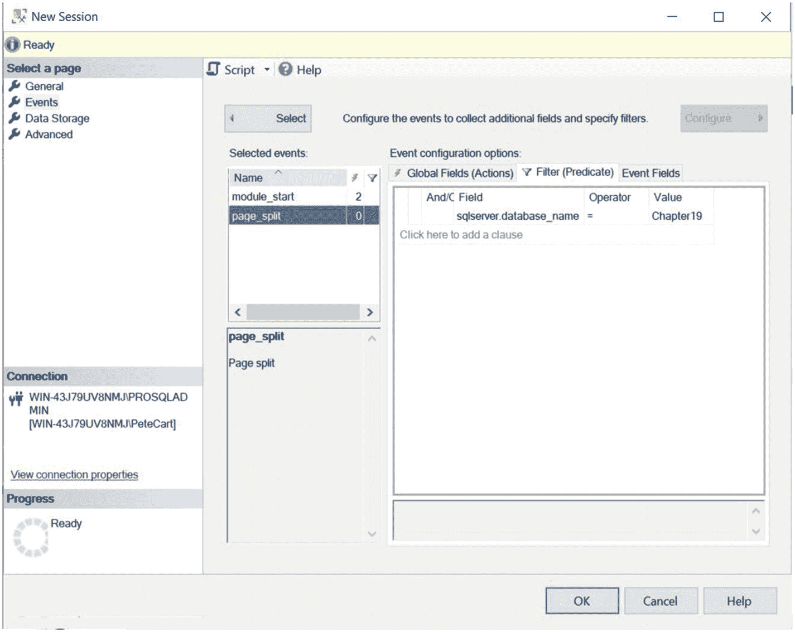
图 19-4: “筛选器（谓词）”选项卡

在配置屏幕的“事件字段”选项卡中，显示了与该事件相关的字段。如果有任何可选字段，我们可以选择它们。图 19-5 显示我们已为 `module_start` 事件选择了 `statement` 字段。

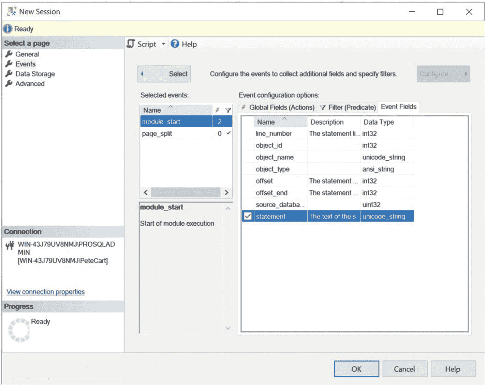
图 19-5: “事件字段”选项卡

在新建会话对话框的“数据存储”页面上，我们配置目标。针对我们的场景，我们配置了一个事件文件目标，如图 19-6 所示。参数是上下文相关的，具体取决于你选择的目标类型。由于我们选择了文件目标，因此需要配置文件的位置和最大大小。我们还需要指定当初始文件变满时是否要创建新文件，以及如果创建，应发生多少次。

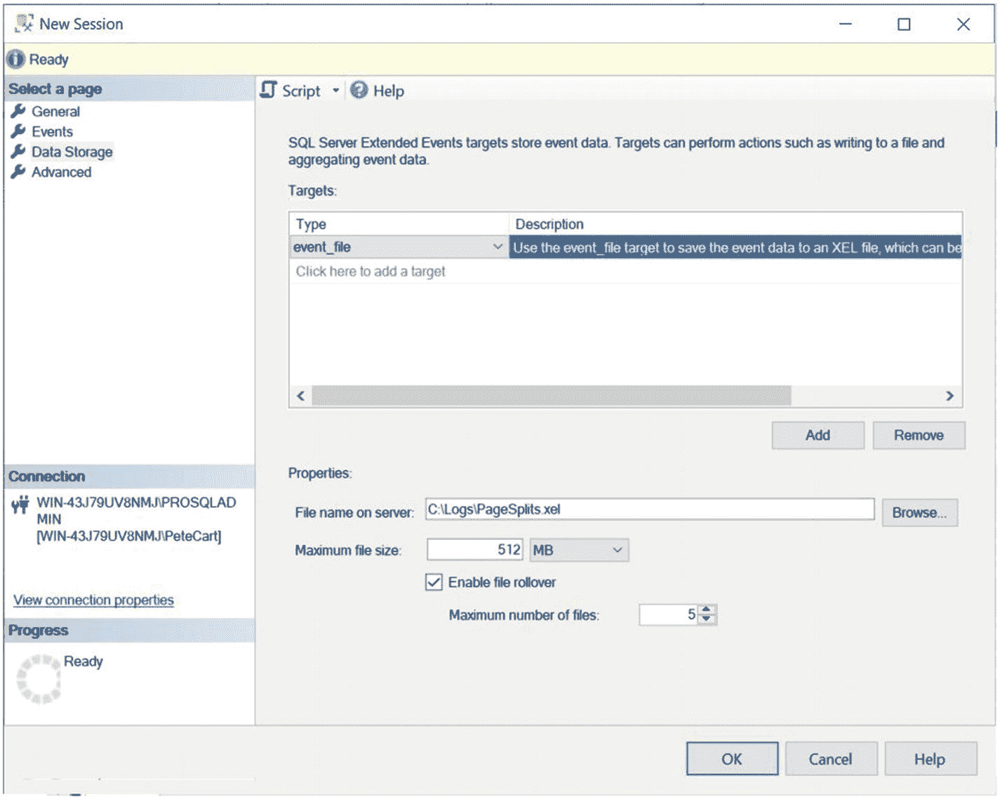
图 19-6: “数据存储”页面

在“高级”页面上，我们可以指定内存压力下的期望行为：是否可接受单个事件丢失，是否可接受多个事件丢失，或者是否应完全无事件丢失。我们还可以设置事件的最小和最大大小，以及应如何应用内存分区。这一点将在下一节中更详细地讨论。此外，我们还可以配置分发延迟。这表示事件在刷新到磁盘前保留在缓冲区中的最长时间。

### 使用 T-SQL

你也可以使用 `CREATE EVENT SESSION` DDL 语句通过 T-SQL 创建事件会话。该命令接受表 19-3 中详述的参数。

表 19-3: 创建事件会话的参数

| 参数 | 说明 |
| --- | --- |
| `event_session_name` | 你正在创建的事件会话的名称。 |
| `ADD EVENT` / `SET` | 为添加到会话的每个事件指定，后跟事件名称，格式为 `package.event`。你可以使用 `SET` 语句来设置事件特定的自定义项，例如包含非必需的事件字段。 |
| `ACTION` | 如果应为该事件捕获全局字段，则在每个 `ADD EVENT` 参数之后指定。 |
| `WHERE` | 如果应对事件进行筛选，则在每个 `ADD EVENT` 参数之后指定。 |
| `ADD TARGET` / `SET` | 为将添加到会话的每个目标指定。你可以使用 `SET` 语句来填充目标特定的参数，例如 `event_file` 目标的文件名参数。 |

该语句还接受 `WITH` 选项，详见表 19-4。`WITH` 语句在 `CREATE EVENT SESSION` 语句的末尾指定一次。

表 19-4: 创建事件会话的 WITH 选项

| 选项 | 说明 |
| --- | --- |
| `MAX_MEMORY` | 事件会话在将事件分发到目标之前可用于缓冲事件的最大内存量。 |
| `EVENT_RETENTION_MODE` | 指定缓冲区变满时的行为。可接受的值为 `ALLOW_SINGLE_EVENT_LOSS`（表示如果所有缓冲区已满，可以丢弃单个事件）；`ALLOW_MULTIPLE_EVENT_LOSS`（表示如果所有缓冲区已满，可以丢弃整个缓冲区）；以及 `NO_EVENT_LOSS`（表示触发事件的任务将等待，直到缓冲区中有空间）。 |
| `MAX_DISPATCH_LATENCY` | 事件在刷新到目标之前可在会话缓冲区中驻留的最长时间，以秒为单位。 |
| `MAX_EVENT_SIZE` | 任何单个事件的事件数据的最大可能大小。可以千字节或兆字节为单位指定，仅应配置为允许大于 `MAX_MEMORY` 设置的事件。 |
| `MEMORY_PARTITION_MODE` | 指定在何处创建事件缓冲区。可接受的值为 `NONE`（表示缓冲区将在实例内创建）；`PER_NODE`（表示缓冲区将为每个 NUMA 节点创建）；以及 `PER_CPU`（表示缓冲区将为每个 CPU 创建）。 |
| `TRACK_CAUSALITY` | 指定将为每个事件存储一个额外的 GUID 和序列号，以便可以关联事件。 |
| `STARTUP_STATE` | 指定会话是否在实例启动时自动启动。`ON` 表示是，`OFF` 表示否。 |

```sql
CREATE EVENT SESSION [event_session_name] ON SERVER
ADD EVENT ...
ADD TARGET ...
WITH ( ... );
```


#### 注意

使用 `EVENT_RETENTION_MODE` 的 `NO_EVENT_LOSS` 选项可能会导致实例出现性能问题，因为任务可能必须等待，直到事件会话的缓冲区中有空间容纳事件数据才能完成。

清单 19-5 中的脚本演示了如何使用 T-SQL 创建一个名为 `LogFileIO` 的会话。此会话类似于通过 GUI 提供的“数据库日志文件 IO 跟踪”模板。不同之处在于，我们额外捕获了 `sqlos.wait_completed` 事件和 `sqlserver.DatabaseName` 全局字段，并且我们还对此进行了筛选，以便仅跟踪 `Chapter19` 事务日志的详细信息。

跟踪结果将写入 `C:\Logs` 文件夹中名为 `LogFileIO.xel` 的文件（该文件夹需要预先创建）。`STARTUP_STATE` 选项用于启动会话。

```sql
CREATE EVENT SESSION [LogFileIO] ON SERVER
ADD EVENT sqlos.async_io_completed(
ACTION(sqlserver.database_name)
WHERE ([sqlserver].[database_name]=N'Chapter19')),
ADD EVENT sqlos.async_io_requested(
ACTION(sqlserver.database_name)
WHERE ([sqlserver].[database_name]=N'Chapter19')),
ADD EVENT sqlos.spinlock_backoff(
ACTION(sqlserver.database_name,sqlserver.sql_text)
WHERE (([package0].equal_uint64)) AND ([sqlserver].[database_name]=N'Chapter19'))),
ADD EVENT sqlos.wait_completed(
ACTION(sqlserver.database_name)
WHERE ([sqlserver].[database_name]=N'Chapter19')),
ADD EVENT sqlos.wait_info(
ACTION(sqlserver.client_app_name,sqlserver.database_name,sqlserver.is_system,sqlserver.session_id)
WHERE ((([package0].equal_uint64)) AND ([package0].equal_uint64))) AND ([sqlserver].[database_name]=N'Chapter19'))),
ADD EVENT sqlserver.databases_log_flush(
ACTION(sqlserver.database_name)
WHERE ([sqlserver].[database_name]=N'Chapter19')),
ADD EVENT sqlserver.databases_log_flush_wait(
ACTION(sqlserver.database_name)
WHERE ([sqlserver].[database_name]=N'Chapter19')),
ADD EVENT sqlserver.file_write_completed(SET collect_path=(1)
ACTION(sqlserver.database_name)
WHERE (([package0].equal_uint64)) AND ([sqlserver].[database_name]=N'Chapter19'))),
ADD EVENT sqlserver.file_written(SET collect_path=(1)
ACTION(sqlserver.database_name)
WHERE (([package0].equal_uint64)) AND ([sqlserver].[database_name]=N'Chapter19')))
ADD TARGET package0.event_file(SET filename=N'C:\Logs\LogFileIO.xel',max_file_size=(512)),
ADD TARGET package0.histogram(SET filtering_event_name=N'sqlos.spinlock_backoff',source=N'sqlserver.sql_text'),
ADD TARGET package0.ring_buffer
WITH (MAX_MEMORY=4096 KB, EVENT_RETENTION_MODE=ALLOW_SINGLE_EVENT_LOSS,MAX_DISPATCH_LATENCY=30 SECONDS,MAX_EVENT_SIZE=0 KB, MEMORY_PARTITION_MODE=NONE,TRACK_CAUSALITY=OFF,STARTUP_STATE=ON)
GO
```
清单 19-5 创建事件会话

#### 注意

由于 `STARTUP_STATE` 配置为 `ON`，此会话将自动启动。

### 查看收集的数据

SQL Server 提供了一个数据查看器，您可以使用它对来自文件或缓冲区的实时事件数据进行基本分析。然而，对于更复杂的分析，您可以通过 T-SQL 访问和操作事件数据。以下各节讨论了这些分析方法。

#### 使用数据分析器分析数据

您可以通过在对象资源管理器中依次展开“管理”➜“扩展事件”➜“会话”，然后从会话上下文菜单中选择“查看实时数据”，来使用数据分析器观察数据到达缓冲区时的实时情况。或者，您可以通过展开会话并从目标上下文菜单中选择“查看目标数据”来查看目标中的数据。

#### 提示

数据分析器不支持环形缓冲区或 ETW 目标类型。

清单 19-6 中的脚本向 `Chapter19` 数据库中的 `Customers` 表插入数据，这会导致事务日志产生 IO 活动，该活动会被我们的 `LogFileIO` 会话捕获。

```sql
USE Chapter19
GO
--Create and populate numbers table
DECLARE @Numbers TABLE
(
Number        INT
)
;WITH CTE(Number)
AS
(
SELECT 1 Number
UNION ALL
SELECT Number + 1
FROM CTE
WHERE Number < 100
)
INSERT INTO @Numbers
SELECT Number FROM CTE;
--Create and populate name pieces
DECLARE @Names TABLE
(
FirstName        VARCHAR(30),
LastName        VARCHAR(30)
);
INSERT INTO @Names
VALUES('Peter', 'Carter'),
('Michael', 'Smith'),
('Danielle', 'Mead'),
('Reuben', 'Roberts'),
('Iris', 'Jones'),
('Sylvia', 'Davies'),
('Finola', 'Wright'),
('Edward', 'James'),
('Marie', 'Andrews'),
('Jennifer', 'Abraham');
--Insert to Customers
SELECT * INTO #Customers
FROM
(SELECT
(SELECT TOP 1 FirstName FROM @Names ORDER BY NEWID()) FirstName,
(SELECT TOP 1 LastName FROM @Names ORDER BY NEWID()) LastName,
(SELECT TOP 1 Number FROM @Numbers ORDER BY NEWID()) BillingAddressID,
(SELECT TOP 1 Number FROM @Numbers ORDER BY NEWID()) DeliveryAddressID,
(SELECT TOP 1 CAST(RAND() * Number AS INT) * 10000
FROM @Numbers
ORDER BY NEWID()) CreditLimit,
(SELECT TOP 1 CAST(RAND() * Number AS INT) * 9000
FROM @Numbers
ORDER BY NEWID()) Balance
FROM @Numbers a
CROSS JOIN @Numbers b
CROSS JOIN @Numbers c
) a;
INSERT INTO dbo.Customers
SELECT * FROM #Customers ;
GO
```
清单 19-6 插入数据到 Customers 表

如果现在在对象资源管理器中为 `LogFileIO` 会话下的 `event_file` 目标打开数据分析器，我们会看到图 19-7 所示的结果。查看器在网格中显示每个事件和时间戳；选择一个事件会显示该事件的“详细信息”窗格。

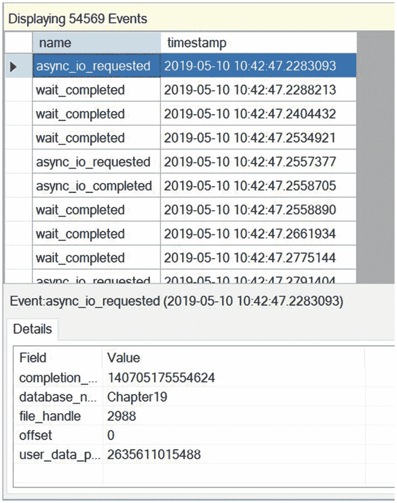
图 19-7 event_file 目标的数据视图

请注意，SQL Server Management Studio 中会显示一个数据分析器工具栏，如图 19-8 所示。您可以使用此工具栏向网格添加或删除列，以及执行分组和聚合操作。

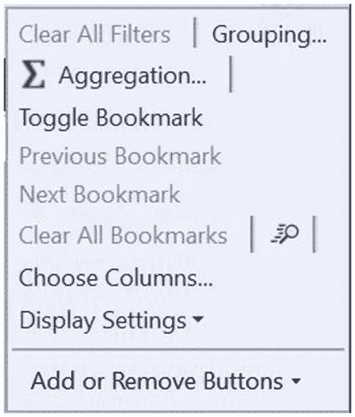
图 19-8 数据分析器工具栏

单击“选择列”按钮会调用“选择列”对话框。我们使用此对话框将 `duration` 和 `wait_type` 列添加到网格，如图 19-9 所示。

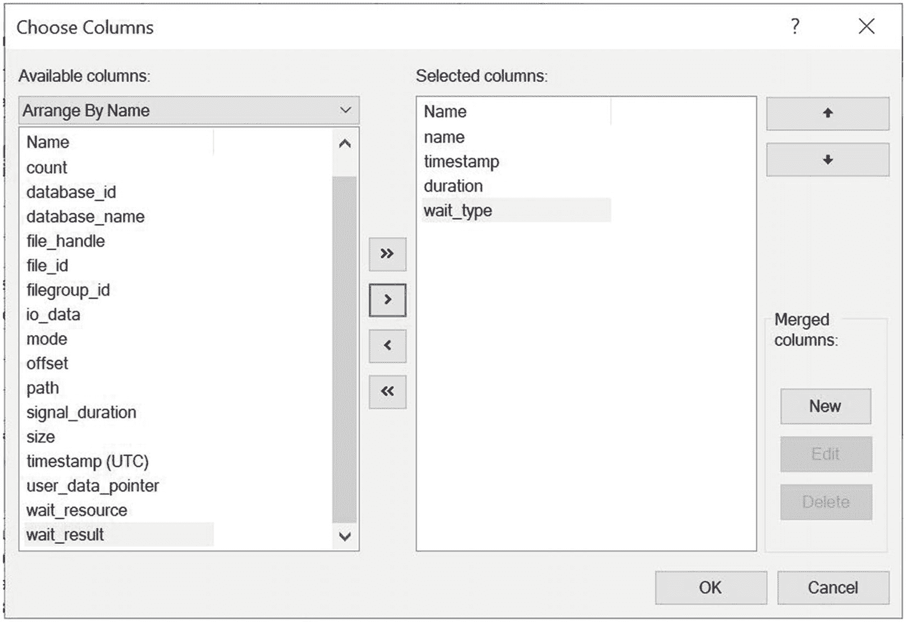
图 19-9 “选择列”对话框

我们现在可以右键单击 `Wait_Type` 列并选择 `Group By This Column` 选项。这将导致所有事件按“等待类型”级别进行汇总。

我们现在可以使用“聚合”按钮调用“聚合”对话框。我们可以使用此对话框将聚合函数（如 `SUM`、`AVG` 或 `COUNT`）应用于数据。也可以按聚合值对数据进行排序。图 19-10 显示我们正在使用此对话框添加等待持续时间的 `SUM`。

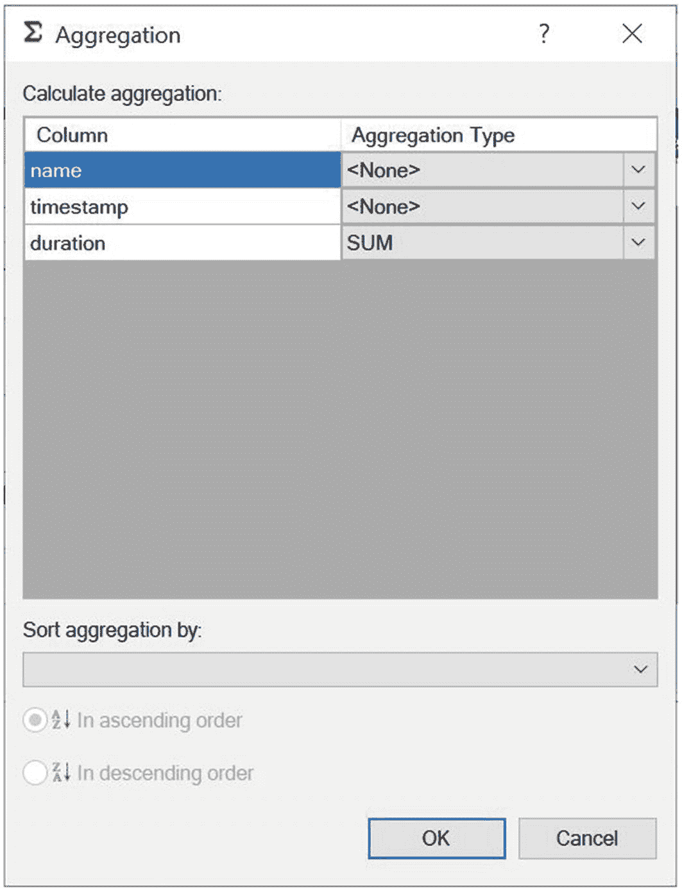
图 19-10 “聚合”对话框

在数据分析器网格中，我们现在可以看到 `wait_type` 对应的 `duration` 列的 `SUM`，如果展开此分组，则会显示详细粒度信息，如图 19-11 所示。

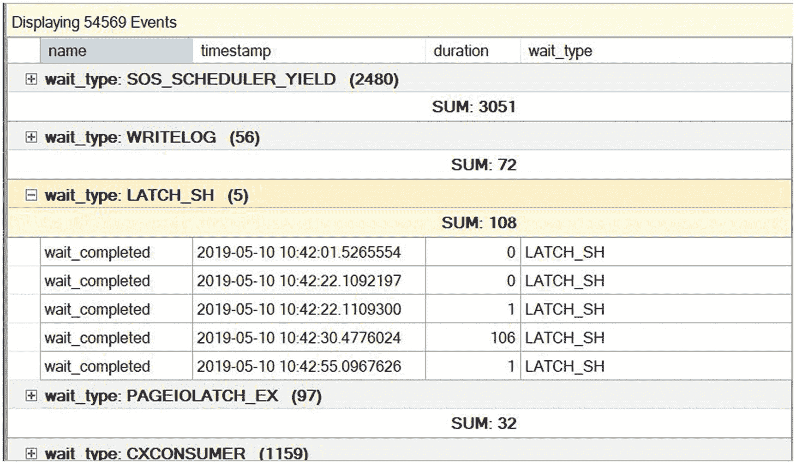
图 19-11 数据分析器网格


### 使用 T-SQL 分析数据

如果你需要对数据进行更复杂的分析，则可以通过 T-SQL 实现。`sys.fn_xe_file_target_read_file` 函数通过读取目标文件并以 XML 格式返回每个事件的一行使这成为可能。`sys.fn_xe_file_target_read_file` 接受表 19-5 中详述的参数。

**表 19-5: `sys.fn_xe_file_target_read_file` 参数**

| 参数 | 描述 |
| --- | --- |
| `path` | `.XEL` 文件的文件路径和文件名。可以包含 `*` 通配符以包含回滚文件。 |
| `mdpath` | 元数据文件的文件路径和名称。对于 SQL Server 2012 及以上版本不是必需的，仅为向后兼容而保留，因此你应始终传递 `NULL`。 |
| `initial_file_name` | 路径中要读取的第一个文件。如果此参数不为 `NULL`，则还必须指定 `initial_offset`。 |
| `initial_offset` | 指定最后读取的偏移量，以便跳过之前的所有事件。如果指定此参数，则还必须指定 `initial_file_name`。 |

`sys.fn_xe_file_target_read_file` 过程返回表 19-6 中详述的列。

**表 19-6: `sys.fn_xe_file_target_read_file` 结果**

| 列 | 描述 |
| --- | --- |
| `module_guid` | 包含包的模块的 GUID |
| `package_guid` | 包含事件的包的 GUID |
| `object_name` | 事件的名称 |
| `event_data` | 事件数据，XML 格式 |
| `file_name` | 包含事件的 XEL 文件名 |
| `file_offset` | 文件中包含事件的块的偏移量 |

由于事件数据以 `XML` 格式返回，我们需要使用 `XQuery` 将节点分解为关系数据。对 `XQuery` 的完整描述超出了本书的范围，但 Microsoft 在 [`https://msdn.microsoft.com`](https://msdn.microsoft.com) 上提供了 `XQuery` 语言参考。

清单 19-7 中的脚本在 `Chapter19` 数据库中运行 `UpdateCustomersWithPageSplits` 和 `UpdateCustomersWithoutPageSplits` 过程，然后使用 `sys.fn_xe_file_target_read_file` 提取事件数据。接着，我们使用 `XQuery` 的 `Value` 方法从 `XML` 结果中提取关系值。最后，因为我们启用了因果跟踪，我们按关联 `GUID` 对数据进行分组，以查看每个存储过程导致了多少次页面拆分。`UpdateWithoutPageSplits` 提供了一个对比。

#### 提示
运行查询前，请记得更新文件路径以匹配你自己的配置。

```
--运行更新过程
EXEC UpdateCustomersWithoutPageSplits ;
GO
EXEC UpdateCustomerWithPageSplits ;
GO
--等待 30 秒，以便 XE 缓冲区刷新到目标
WAITFOR DELAY '00:00:30' ;
--查询 XE 目标
SELECT c.procedurename, d.pagesplits
FROM
(
SELECT
correlationid,
COUNT(*) -1 PageSplits -- -1 以移除 module_start 事件的计数
FROM
(
SELECT CapturedEvent,
xml_data.value('(/event/data[@name="object_name"]/value)[1]', 'nvarchar(max)') procedurename,  --提取过程名称
xml_data.value('(/event/action[@name="attach_activity_id"]/value)[1]', 'uniqueidentifier') correlationid --提取关联 ID
FROM
(
--查询 fn_xe_file_target_read_file 函数以提取原始 XML
SELECT
OBJECT_NAME CapturedEvent,
CAST(event_data AS XML) xml_data
FROM
sys.fn_xe_file_target_read_file('C:\mssql\pagesplits*.xel', NULL , NULL, NULL) as XE ) a
) b
GROUP BY correlationid
) d
INNER JOIN --自连接，以便计算页面拆分次数
(
SELECT CapturedEvent,
xml_data.value('(/event/data[@name="object_name"]/value)[1]', 'nvarchar(max)') procedurename,
xml_data.value('(/event/action[@name="attach_activity_id"]/value)[1]', 'uniqueidentifier') correlationid
FROM
(
SELECT object_name CapturedEvent,
CAST(event_data AS XML) xml_data
FROM
sys.fn_xe_file_target_read_file('C:\mssql\pagesplits*.xel', NULL , NULL, NULL) as XE ) a
) c
ON c.correlationid = d.correlationid
AND c.procedurename IS NOT NULL ;
```

#### 提示
使用 `XQuery` 允许你查询跟踪中捕获的每个事件字段和操作，因此你可以创建非常复杂的查询，为你实例中的活动提供丰富而强大的分析。

### 将扩展事件与操作系统数据关联起来

扩展事件提供了与操作系统级数据集成的功能。这提供了有用的见解，例如 CPU 飙升时正在运行的查询等等。以下部分讨论如何将 SQL Server 事件与 `Perfmon` 数据和其他操作系统级事件关联起来。

#### 将事件与 Perfmon 数据关联

在引入扩展事件之前，DBA 使用一个名为 SQL Trace 及其 GUI 工具 Profiler 来捕获来自 SQL Server 的跟踪；可以将此数据与来自 `Perfmon` 的数据关联起来。使用扩展事件时，你通常不需要进行这种关联，因为扩展事件包含了处理器、逻辑磁盘和系统性能对象（例如上下文切换和文件写入）的 `Perfmon` 计数器。因此，通过将这些对象添加到会话中并遵循上一节讨论的 T-SQL 分析技术，你可以将 SQL Server 事件与操作系统计数器关联起来。


#### 提示

> `Perfmon 计数器`位于`分析通道`中，但没有类别。

清单 19-8 中的脚本演示了创建一个事件会话，该会话捕获实例内执行的语句以及处理器计数器。系统每 15 秒捕获一次每个处理器的处理器计数器。结果保存到`事件文件目标`和`ETW 目标`。

```sql
CREATE EVENT SESSION Statements_with_Perf_Counters
ON SERVER
--Add the Events and Actions relating to each Event
ADD EVENT sqlserver.error_reported(
ACTION(sqlserver.client_app_name,sqlserver.database_id,sqlserver.query_hash,sqlserver.session_id)
WHERE ([package0].greater_than_uint64) AND
[package0].equal_boolean))),
ADD EVENT sqlserver.module_end(SET collect_statement=(1)
ACTION(sqlserver.client_app_name,sqlserver.database_id,sqlserver.query_hash,sqlserver.session_id)
WHERE ([package0].greater_than_uint64) AND
[package0].equal_boolean))),
ADD EVENT sqlserver.perfobject_processor,
ADD EVENT sqlserver.rpc_completed(
ACTION(sqlserver.client_app_name,sqlserver.database_id,sqlserver.query_hash,sqlserver.session_id)
WHERE ([package0].greater_than_uint64) AND
[package0].equal_boolean))),
ADD EVENT sqlserver.sp_statement_completed(SET collect_object_name=(1)
ACTION(sqlserver.client_app_name,sqlserver.database_id,sqlserver.query_hash,sqlserver.query_plan_hash,sqlserver.session_id)
WHERE ([package0].greater_than_uint64) AND [package0].equal_boolean))),
ADD EVENT sqlserver.sql_batch_completed(
ACTION(sqlserver.client_app_name,sqlserver.database_id,sqlserver.query_hash,sqlserver.session_id)
WHERE ([package0].greater_than_uint64) AND
[package0].equal_boolean))),
ADD EVENT sqlserver.sql_statement_completed(
ACTION(sqlserver.client_app_name,sqlserver.database_id,sqlserver.query_hash,sqlserver.query_plan_hash,sqlserver.session_id)
WHERE ([package0].greater_than_uint64) AND
[package0].equal_boolean)))
--Add the Targets
ADD TARGET package0.event_file(SET filename=N'C:\MSSQL\StatementsAndProcessorUtilization.xel'),
ADD TARGET package0.etw_classic_sync_target(SET default_etw_session_logfile_path=N'C:\MSSQL\StatementsWithPerfCounters.etl')
WITH (MAX_MEMORY=4096 KB,EVENT_RETENTION_MODE=ALLOW_SINGLE_EVENT_LOSS,MAX_DISPATCH_LATENCY=30 SECONDS,MAX_EVENT_SIZE=0 KB,MEMORY_PARTITION_MODE=NONE,TRACK_CAUSALITY=ON,STARTUP_STATE=OFF) ;
GO
--Start the instance
ALTER EVENT SESSION Statements_with_Perf_Counters
ON SERVER
STATE = start;
```
*清单 19-8* *创建包含 Perfmon 计数器的事件会话*

#### 提示

> `SQL Server`服务账户必须属于`性能日志用户`组，否则将引发错误。

### 将事件会话与操作系统级事件集成

#### 注意

> 要遵循本节中的演示，你需要安装`Windows 性能工具包`，你可以从 [`https://msdn.microsoft.com`](https://msdn.microsoft.com) 下载它，作为`Windows 部署和评估工具包`的一部分。

在某些情况下，你可能需要将事件会话数据与`SQL Server`提供的`Perfmon 计数器`以外的操作系统数据集成。例如，想象这样一个场景：你有一个应用程序，它将`SQL Server`数据导出到操作系统中的平面文件，以便中间件产品（如`BizTalk`）可以拾取它们。你遇到了生成某些文件的问题，需要查看进程流——从运行的 SQL 语句到操作系统中触发的`WMI`事件。为此，你需要将事件会话数据与`WMI`事件的跟踪合并。你可以通过`ETW`（`Windows 事件跟踪`）架构实现这一点。

为了演示这一点，我们首先使用`WMI`提供程序在`性能监视器`中创建一个事件跟踪会话，然后将其与我们在前一节中创建的事件会话集成。（你可以在 Windows 的管理工具中找到`性能监视器`。）打开`性能监视器`后，我们从**事件跟踪会话**的上下文菜单中选择**新建** ➤ **数据收集器集**，这将调用**创建新数据收集器集**向导。在向导的第一页，指定收集器集的名称，如图 19-12 所示，并指定数据收集器集是手动配置还是基于模板配置。在我们的场景中，我们选择手动配置。

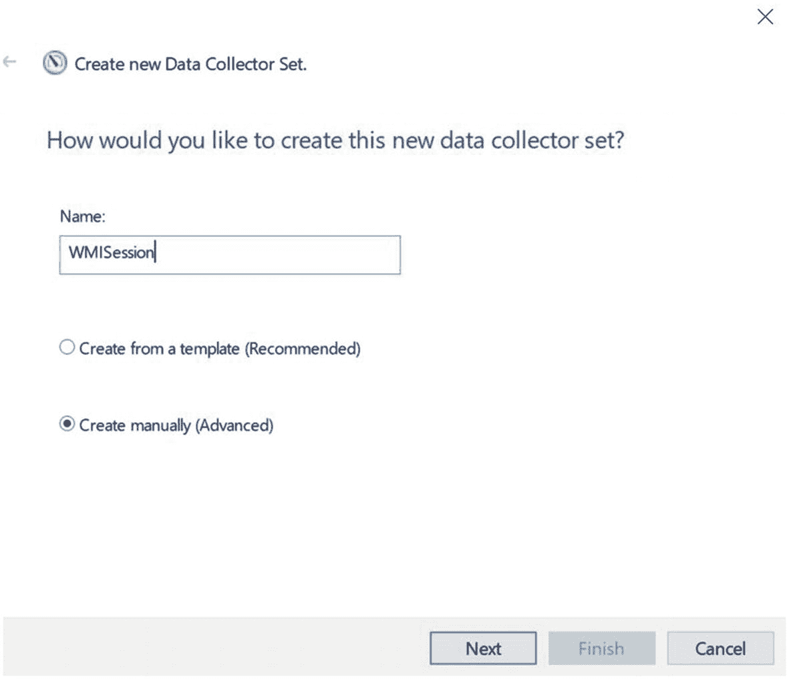
*图 19-12* *创建新数据收集器集向导*

在启用事件跟踪提供程序的页面上，我们可以使用**添加**按钮来添加`WMI-Activity`提供程序，如图 19-13 所示。

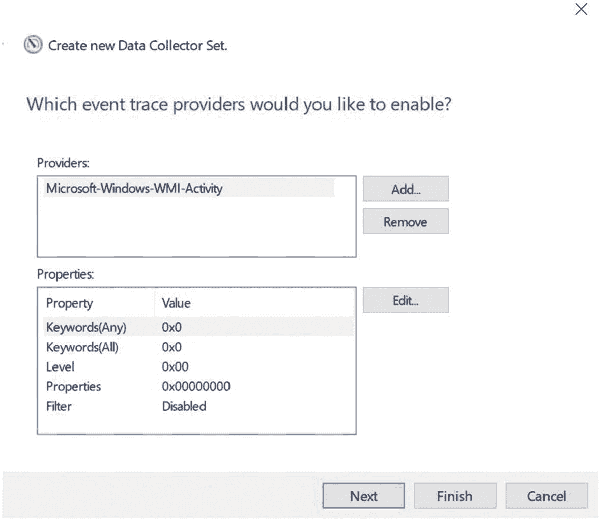
*图 19-13* *添加 WMI 提供程序*

现在，我们使用**编辑**按钮调用**属性**对话框。在这里，我们通过复选框添加**跟踪**和**操作**类别，如图 19-14 所示。

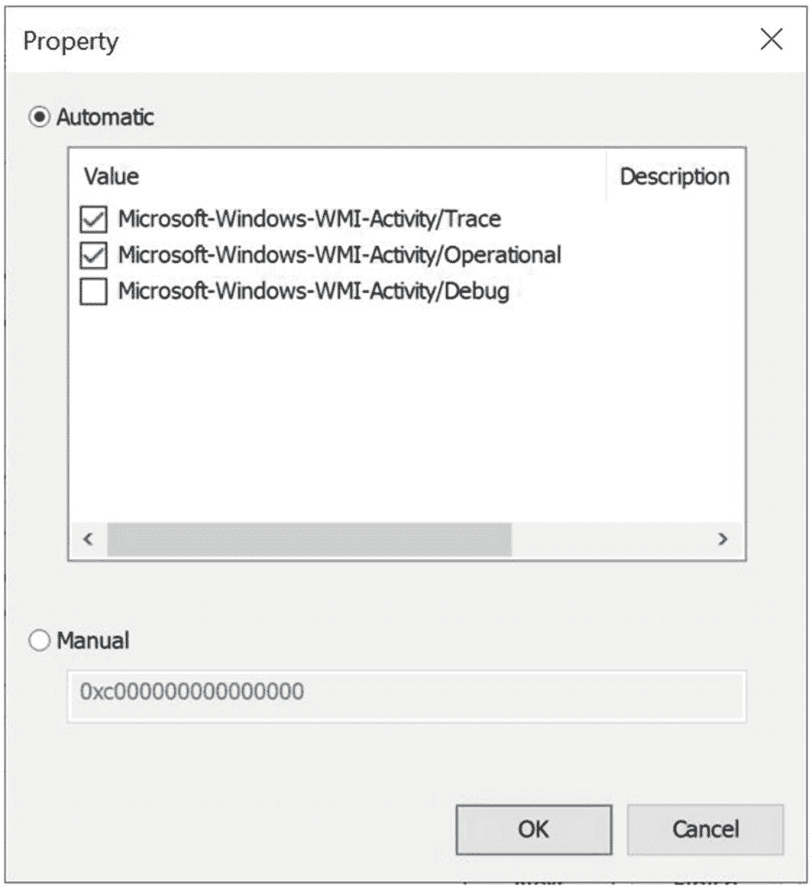
*图 19-14* *属性对话框*

退出**属性**对话框后，我们转到向导的下一页，在那里可以配置跟踪文件的存储位置。我们将跟踪文件配置为保存到与我们的事件会话跟踪相同的位置，如图 19-15 所示。

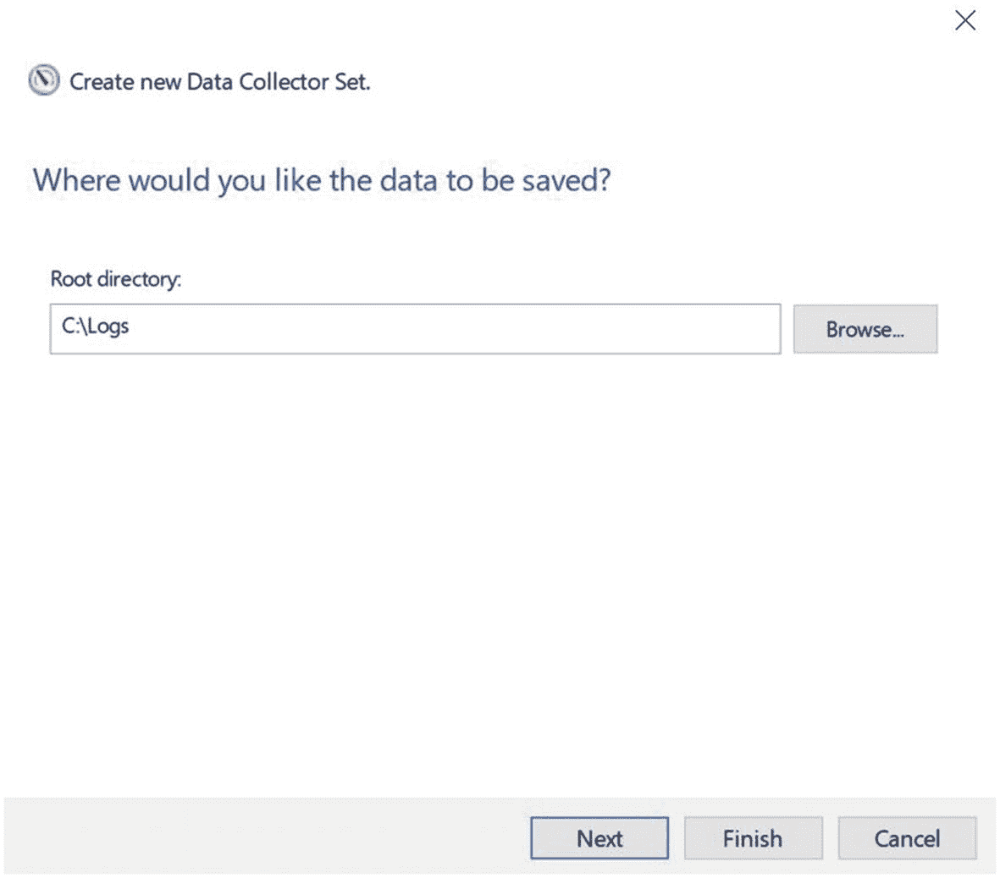
*图 19-15* *配置跟踪文件位置*

在向导的最后一页，我们保留使用默认账户运行跟踪的默认选项，然后保存并关闭跟踪。

在`性能监视器`中，我们的跟踪现在在**事件跟踪会话**文件夹中可见，但显示为已停止。我们可以使用跟踪的上下文菜单来启动数据收集器集，如图 19-16 所示。另请注意，有一个名为`XE_DEFAULT_ETW_SESSION`的数据收集器集。我们的扩展事件会话创建了这个，因为我们创建了一个`ETW 目标`。集成数据需要此会话。

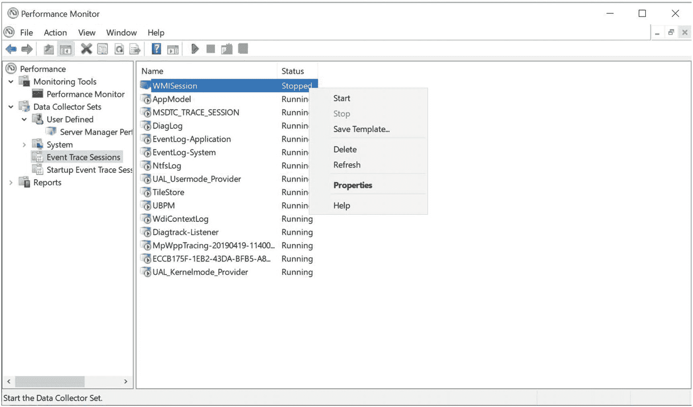
*图 19-16* *启动数据收集器集*


现在，`WMISession` 和 `Statements_with_Perf_Counters` 会话都已启动，我们使用清单 19-9 中的 `bcp` 命令来生成活动，这会导致两个会话中的事件触发。

```cmd
bcp chapter19.dbo.customers out c:\mssql\dump.dat -S .\PROSQLADMIN -T -c
清单 19-9
生成活动
```

现在我们需要确保两个会话的缓冲区都刷新到磁盘。我们通过停止这两个会话来实现这一点。停止 `Statements_with_Perf_Counters` 会话后，我们还需要在性能监视器中停止 `XE_DEFAULT_ETW_SESSION` ETW 会话。你可以使用清单 19-10 中的 T-SQL 命令来停止 `Statements_with_Perf_Counters` 会话。

```sql
ALTER EVENT SESSION Statements_with_Perf_Counters
ON SERVER
STATE = stop;
清单 19-10
停止事件会话
```

你可以在性能监视器中，通过选择各自上下文菜单中的“停止”来停止 `WMISession` 和 `XE_DEFAULT_ETW_SESSION`。

下一步是将两个跟踪文件合并在一起。你可以通过命令行使用 `XPERF` 实用程序配合 `-Merge` 开关来实现（如清单 19-11 所示）。该命令将文件合并在一起，其中 `StatementsWithPerfCounters.etl` 是目标文件。在运行脚本之前，你应该导航到 `C:\Program Files (x86)\Windows Kits\8.1\Windows Performance Toolkit` 文件夹。

```cmd
xperf -merge c:\mssql\wmisession.etl C:\MSSQL\StatementsWithPerfCounters.etl
清单 19-11
合并跟踪文件
```

现在所有事件都在同一个文件中，你可以使用 Windows Performance Analyzer 打开并分析这个 `.etl` 文件，如图 19-17 所示。Windows Performance Analyzer 是 Windows Performance Toolkit 的一部分。安装后，你可以通过 Windows 开始菜单访问 Windows Performance Analyzer。对 Windows Performance Analyzer 的完整讨论超出了本书的范围，但安装后你可以在 Windows 的管理工具中找到它。你可以在 [`https://msdn.microsoft.com`](https://msdn.microsoft.com) 找到完整的文档。


**图 19-17**
**Windows 性能分析器**

### 总结

扩展事件引入了一些新概念，你必须理解这些概念才能充分发挥其威力。事件是在跟踪中捕获的关注点，而操作则在事件列之外提供额外的信息。谓词允许你筛选事件以提供更有针对性的跟踪，而目标定义了数据的存储方式。会话本身是跟踪对象，可以配置为包含多个事件、操作、谓词和目标。

你可以通过新建会话向导创建事件会话，这是一种简便快捷的方法，并公开了模板；也可以通过新建会话对话框；当然，还可以通过 T-SQL。通过 T-SQL 创建会话时，你使用 `CREATE EVENT SESSION` DDL 语句来配置跟踪的所有方面。

每个扩展事件构件都包含在四个包之一中：`Package0`、`Sqlserver`、`Sqlos` 和 `SecAudit`。然而，`SecAudit` 的内容不会被公开，因为这些内容在内部用于支持 SQL 审核功能，这在章节 9 中讨论过。

你可以使用数据查看器查看数据。数据查看器允许你监视会话缓冲区中的实时数据，并且还支持查看来自事件文件、事件计数和直方图目标类型的目标数据。数据查看器提供基本的数据分析功能，包括对数据进行分组和聚合。

对于更复杂的数据分析，你可以在 T-SQL 中打开目标。要打开事件文件目标，请使用 `sys.fn_xe_file_target_read_file` 结果系统存储过程。然后，你就可以利用 T-SQL 的强大功能来处理复杂的分析需求。

你可以通过将会话内的因果关系跟踪开启来关联事件。这会为每个事件添加一个 `GUID` 和一个序列号，以便你识别关系。你还可以轻松地将 SQL 事件与性能监视器数据关联起来，因为扩展事件公开了处理器、逻辑磁盘和系统性能计数器。要将事件与其他操作系统级别的事件关联，事件会话可以使用 ETW 目标，然后你可以将其与其他数据收集器集合并，以将扩展事件映射到 ETW 架构中其他提供程序的事件。

# 20. 查询存储

查询存储是 SQL Server 2016 中引入的一项功能，它捕获查询、其计划和统计信息的历史记录。它使 DBA 能够轻松查看查询使用的计划并排除性能问题。在本章中，我们将讨论如何启用和配置查询存储。我们还将探讨如何使用查询存储来诊断和解决性能问题。

### 启用和配置查询存储

查询存储在数据库级别启用和配置，因此我们要做的第一件事是创建一个名为 `Chapter20` 的数据库。这可以使用清单 20-1 中的脚本来实现。

```sql
--创建数据库
CREATE DATABASE Chapter20 ;
GO
USE Chapter20
GO
--创建并填充数字表
DECLARE @Numbers TABLE
(
Number        INT
)
;WITH CTE(Number)
AS
(
SELECT 1 Number
UNION ALL
SELECT Number + 1
FROM CTE
WHERE Number < 100
)
INSERT INTO @Numbers
SELECT Number FROM CTE;
--创建并填充名字片段
DECLARE @Names TABLE
(
FirstName        VARCHAR(30),
LastName        VARCHAR(30)
);
INSERT INTO @Names
VALUES('Peter', 'Carter'),
('Michael', 'Smith'),
('Danielle', 'Mead'),
('Reuben', 'Roberts'),
('Iris', 'Jones'),
('Sylvia', 'Davies'),
('Finola', 'Wright'),
('Edward', 'James'),
('Marie', 'Andrews'),
('Jennifer', 'Abraham');
--创建并填充 Customers 表
CREATE TABLE dbo.Customers
(
CustomerID           INT                NOT NULL                       IDENTITY             PRIMARY KEY,
FirstName            VARCHAR(30)        NOT NULL,
LastName             VARCHAR(30)        NOT NULL,
BillingAddressID     INT                NOT NULL,
DeliveryAddressID    INT                NOT NULL,
CreditLimit          MONEY              NOT NULL,
Balance              MONEY              NOT NULL
);
SELECT * INTO #Customers
FROM
(SELECT
(SELECT TOP 1 FirstName FROM @Names ORDER BY NEWID()) FirstName,
(SELECT TOP 1 LastName FROM @Names ORDER BY NEWID()) LastName,
(SELECT TOP 1 Number FROM @Numbers ORDER BY NEWID()) BillingAddressID,
(SELECT TOP 1 Number FROM @Numbers ORDER BY NEWID()) DeliveryAddressID,
(SELECT TOP 1 CAST(RAND() * Number AS INT) * 10000
FROM @Numbers
ORDER BY NEWID()) CreditLimit,
(SELECT TOP 1 CAST(RAND() * Number AS INT) * 9000
FROM @Numbers
ORDER BY NEWID()) Balance
FROM @Numbers a
CROSS JOIN @Numbers b
) a;
INSERT INTO dbo.Customers
SELECT * FROM #Customers;
GO
CREATE INDEX idx_LastName ON dbo.Customers(LastName)
GO
清单 20-1
创建 Chapter20 数据库
```

现在我们有了一个数据库，可以使用清单 20-2 中的命令为该数据库启用查询存储。

```sql
ALTER DATABASE Chapter20 SET QUERY_STORE = ON
清单 20-2
启用查询存储
```

除了使用 `ALTER DATABASE` 命令启用查询存储外，此方法还用于配置查询存储属性。表 20-1 详细列出了可用的与查询存储相关的 `SET` 选项。

**表 20-1**
**查询存储 SET 选项**


### 使用查询存储数据

在我们了解如何使用查询存储数据之前，首先需要运行一些查询，以便查询存储有数据可收集。`清单 [20-4]` 中的脚本将对 `Chapter20` 数据库运行一系列查询。

```
SELECT
CustomerID
, FirstName
, LastName
, CreditLimit
, Balance
FROM dbo.Customers
WHERE LastName = 'Carter'
GO
SELECT TOP (1000) [CustomerID]
,[FirstName]
,[LastName]
,[BillingAddressID]
,[DeliveryAddressID]
,[CreditLimit]
,[Balance]
FROM [Chapter20].[dbo].[Customers]
GO
SELECT *
FROM dbo.Customers A
INNER JOIN dbo.Customers B
ON a.CustomerID = b.CustomerID
UNION
SELECT *
FROM dbo.Customers A
INNER JOIN dbo.Customers B
ON a.CustomerID = b.CustomerID
GO
清单 20-4
查询 Chapter20 数据库
```

### SSMS 报告

既然我们已经运行了一些查询，查询存储就会捕获关于这些查询的数据。我们可以通过一系列 SSMS 报告来查看这些数据。标准报告包括：

*   查看性能下降的查询
*   查看总体资源消耗
*   查看具有强制计划的查询
*   查看高差异的查询
*   查询等待统计信息
*   查看已跟踪的查询

这些报告可以通过浏览 `数据库` ➤ `[数据库名称]`，然后从 `查询存储` 节点的上下文菜单中选择相应的报告来访问。在本章中，我们将研究一些我认为最有用的报告，但我鼓励你尝试所有这些报告。

#### 提示

由于报告的性质，当你首次设置查询存储时，数据会非常少。随着查询存储启用后时间的推移，数据点将会增长。

总体资源消耗报告如 `图 [20-2]` 所示。该报告包含四个图表，分别代表按时间间隔聚合的执行持续时间、执行次数、CPU 时间和逻辑读取。

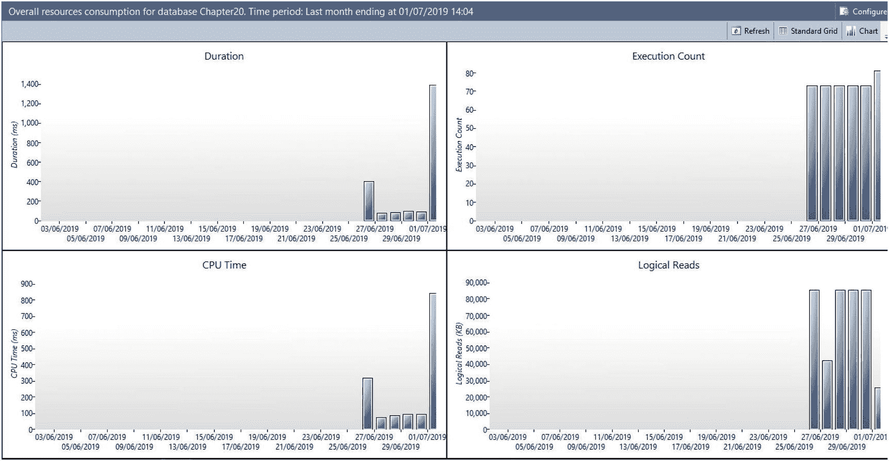

图 20-2
总体资源消耗

将鼠标悬停在一个柱形上会显示一个包含更多详细信息的框，如 `图 [20-3]` 所示。

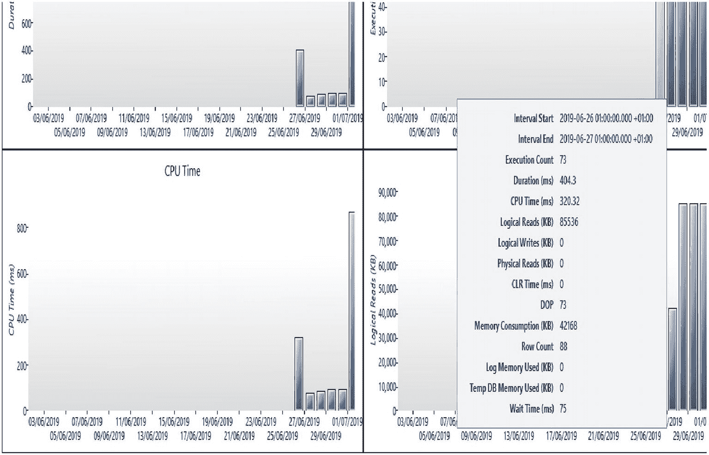

图 20-3
查看其他详细信息

点击“标准网格”按钮将用一个网格替换柱形图，网格中每个时间间隔一行，显示聚合的运行时统计数据。此网格可以复制到 Excel 中进行进一步分析。网格视图如 `图 [20-4]` 所示。

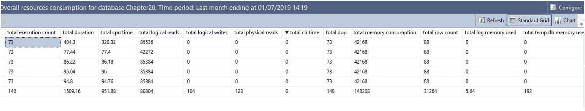

图 20-4
标准网格视图


#### 提示

您会注意到，执行计数远高于我们已运行的查询数量。这是因为 SQL Server 会在后台运行查询，作为许多不同进程的一部分，包括在导航 `SSMS` 时运行的查询。

图 20-5 展示了**资源消耗最高查询报告**。该报告的左上角显示了一个条形图，代表了资源消耗最密集的查询。`指标`下拉菜单默认为`持续时间`，但可以选择许多不同的指标，包括并行度 (`DOP`)、`CPU 时间`、`行数`、`等待时间`，甚至 `CLR 时间`或`日志内存使用量`等等。

报告的右上角显示了一个散点图，详细说明了每个计划的资源利用率和执行时间。当一个查询已使用多个计划执行时，这很有帮助，因为您可以轻松评估某个查询最高效的计划。

报告的下半部分显示了实际使用的执行计划。与 `SSMS` 中任何其他图形化查询计划表示一样，将鼠标悬停在物理运算符上将显示该运算符的成本信息。

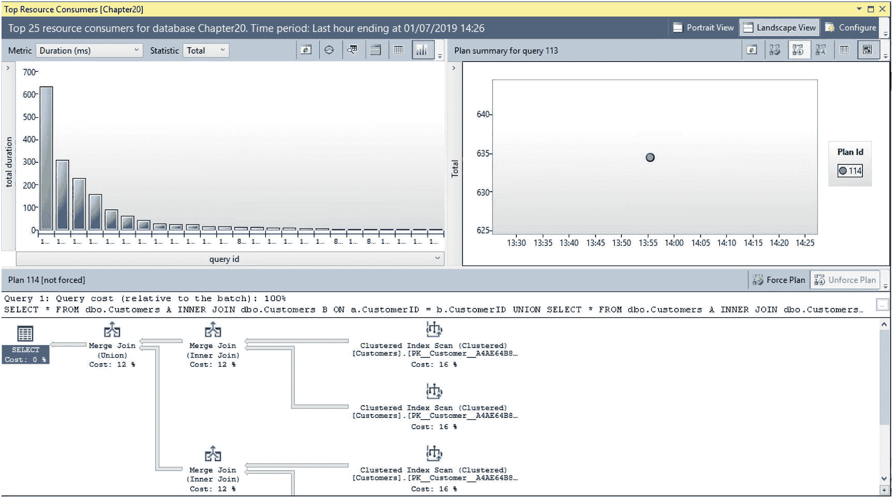
图 20-5: 资源消耗最高查询报告

图 20-6 显示了**查询等待统计报告**的首页。屏幕顶部的条形图显示了累计等待时间最高的资源汇总。

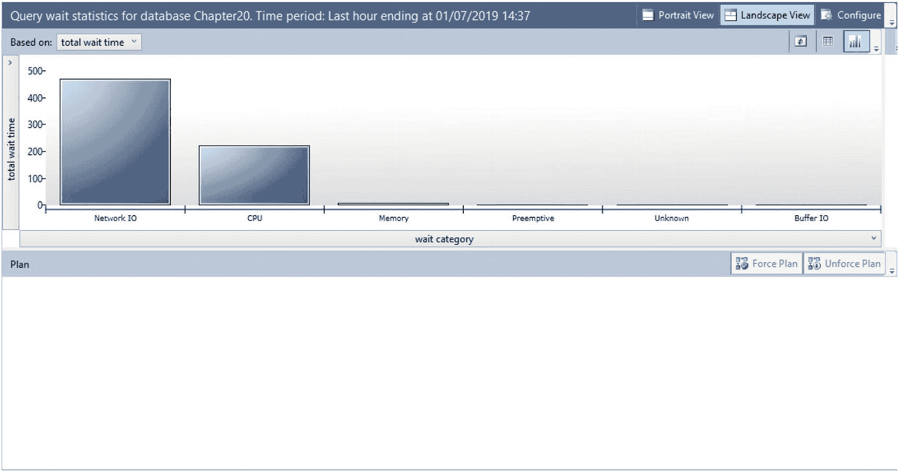
图 20-6: 查询等待统计报告

条形图中的每个柱子都是可点击的。例如，如果我点击 `CPU` 柱，那么将显示图 20-7 中的详细报告。

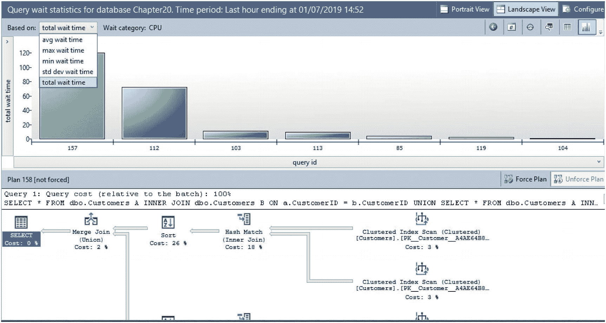
图 20-7: `CPU` 详细报告

默认情况下，网格的上半部分将显示开销最大的查询（由`计划 ID`标记），基于`总等待时间`，但如您所见，`基于`下拉列表可以更改为基于平均、最小、最大等待时间或标准差来显示结果。

报告的下半部分显示了在上半部分选定的查询计划的图形化表示。

### 查询存储 T-SQL 对象

除了图形化报告，SQL Server 还公开了许多可用于检索查询存储数据的目录视图。表 20-3 详细列出了公开的目录视图。
表 20-3: 查询存储目录视图

| `目录视图` | `描述` |
| --- | --- |
| `Query_store_plan` | 存储与查询关联的每个查询计划的信息。 |
| `Query_store_query` | 存储查询信息和聚合的运行时统计信息。 |
| `Query_store_wait_stats` | 存储等待统计信息的详细信息。有关每种等待类型的映射，请参见表 20-4。 |
| `Query_store_query_text` | 存储每个查询的 `SQL 句柄`和 `SQL 文本`。 |
| `Query_store_runtime_stats` | 存储每个查询的运行时统计信息。 |

表 20-4 详细说明了每个等待类型类别如何映射到基础等待类型。
表 20-4: 等待统计信息映射

| `等待类别` | `等待类型` |
| --- | --- |
| `CPU` | `SOS_SCHEDULER_YIELD` |
| `工作线程` | `THREADPOOL` |
| `锁` | `LCK_M_*` |
| `门` | `LATCH_*` |
| `缓冲区门` | `PAGELATCH_*` |
| `缓冲区 IO` | `PAGEIOLATCH_*` |
| `SQL CLR` | `CLR*SQLCLR*` |
| `镜像` | `DBMIRROR*` |
| `事务` | `ACT*DTC*TRAN_MARKLATCH_*MSQL_XACT_*TRANSACTION_MUTEX` |
| `空闲` | `SLEEP_*LAZYWRITER_SLEEPSQLTRACE_BUFFER_FLUSHSQLTRACE_INCREMENTAL_FLUSH_SLEEPSQLTRACE_WAIT_ENTRIESFT_IFTS_SCHEDULER_IDLE_WAITXE_DISPATCHER_WAITREQUEST_FOR_DEADLOCK_SEARCHLOGMGR_QUEUEONDEMAND_TASK_QUEUECHECKPOINT_QUEUEXE_TIMER_EVENT` |
| `抢占式 (抢占式 IO)` | `PREEMPTIVE_*` |
| `Service Broker` | `BROKER_*` |
| `事务日志 IO` | `LOGMGRLOGBUFFERLOGMGR_RESERVE_APPENDLOGMGR_FLUSHLOGMGR_PMM_LOGCHKPTWRITELOG` |
| `网络 IO` | `ASYNC_NETWORK_IONET_WAITFOR_PACKETPROXY_NETWORK_IOEXTERNAL_SCRIPT_NETWORK_IOF` |
| `并行性` | `CXPACKETEXCHANGE` |
| `内存` | `RESOURCE_SEMAPHORE, CMEMTHREADCMEMPARTITIONED, EE_PMOLOCKMEMORY_ALLOCATION_EXTRESERVED_MEMORY_ALLOCATION_EXTMEMORY_GRANT_UPDATE` |
| `用户等待` | `WAITFORWAIT_FOR_RESULTSBROKER_RECEIVE_WAITFOR` |
| `跟踪` | `TRACEWRITESQLTRACE_LOCKSQLTRACE_FILE_BUFFERSQLTRACE_FILE_WRITE_IO_COMPLETIONSQLTRACE_FILE_READ_IO_COMPLETIONSQLTRACE_PENDING_BUFFER_WRITERS, SQLTRACE_SHUTDOWN, QUERY_TRACEOUTTRACE_EVTNOTIFF` |
| `全文搜索` | `FT_RESTART_CRAWLFULLTEXT GATHERERMSSEARCHFT_METADATA_MUTEXFT_IFTSHC_MUTEXFT_IFTSISM_MUTEXFT_IFTS_RWLOCKFT_COMPROWSET_RWLOCKFT_MASTER_MERGEFT_PROPERTYLIST_CACHEFT_MASTER_MERGE_COORDINATORPWAIT_RESOURCE_SEMAPHORE_FT_PARALLEL_QUERY_SYNC` |
| `其他 IO` | `ASYNC_IO_COMPLETION, IO_COMPLETIONBACKUPIO, WRITE_COMPLETIONIO_QUEUE_LIMITIO_RETRY` |
| `复制` | `SE_REPL_*REPL_*, HADR_*PWAIT_HADR_*, REPLICA_WRITESFCB_REPLICA_WRITE, FCB_REPLICA_READPWAIT_HADRSIM` |
| `日志速率调节器` | `LOG_RATE_GOVERNORPOOL_LOG_RATE_GOVERNORHADR_THROTTLE_LOG_RATE_GOVERNORINSTANCE_LOG_RATE_GOVERNOR` |

`*` 表示通配符，其中包含匹配 `*` 左侧部分的所有等待。

#### 提示

`空闲`和`用户等待`与其他等待类型类别不同，因为它们不是在等待资源，而是在等待工作要做。

例如，清单 20-5 中的查询将返回总等待时间最高的前三个等待类别，不包括空闲和用户等待，这些是“健康”的等待。

```sql
SELECT TOP 3
wait_category_desc
, SUM(total_query_wait_time_ms) TotalWaitTime
FROM sys.query_store_wait_stats
WHERE wait_category_desc NOT IN ('Idle', 'User Wait')
GROUP BY wait_category_desc
ORDER BY SUM(total_query_wait_time_ms) DESC
```
清单 20-5: 返回前 3 个等待类型

### 解决查询存储问题

图 20-8 展示了**性能退化查询报告**。此报告显示了在持续时间或执行次数方面影响随时间增加的查询。这些查询在报告左上角用条形图显示。报告的右上角显示了用于执行查询的计划及其关联的持续时间。在报告底部，我们可以看到在屏幕上半部分当前选择的查询和计划的实执行计划。

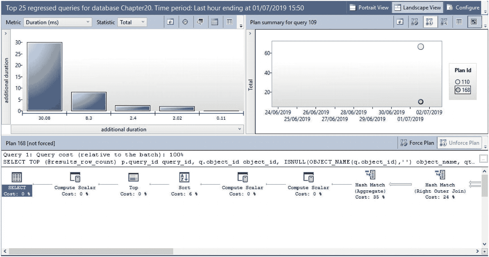
图 20-8: 性能退化查询报告

在这个特定的例子中，我们可以看到该查询使用了两个不同的计划运行，并且 ID 为 `168` 的计划执行所需时间明显少于 ID 为 `110` 的计划。因此，在选择了更高效的计划后，我们可以使用报告中间的`强制计划`按钮，来确保始终使用更高效的计划来执行此查询。一旦我们使用了此功能，`取消强制计划`按钮将变为可用状态，允许我们在需要时撤销我们的操作。


#### 提示

只要查询存储报告中可以选择特定的计划，`强制`和`取消强制`按钮在所有报告中都是可用的。

除了使用图形用户界面来提升查询性能外，系统还提供了许多可用的存储过程。这些过程在表 20-5 中详细列出，可用于管理查询计划和查询存储本身。

表 20-5

查询存储存储过程

| 过程 | 描述 |
| --- | --- |
| `Sp_query_store_flush_db` | 将查询存储数据刷新到磁盘 |
| `Sp_query_store_force_plan` | 强制查询使用特定计划 |
| `Sp_query_store_unforce_plan` | 从查询中移除强制计划 |
| `Sp_query_store_reset_exec_stats` | 清除查询存储中特定查询的运行时统计信息 |
| `Sp_query_store_remove_plan` | 从查询存储中移除特定计划 |
| `Sp_query_store_remove_query` | 从查询存储中移除查询及其所有关联信息 |

例如，要取消我们在前一个例子中强制应用于查询的计划，我们可以使用清单 20-6 中的查询。

```
EXEC sp_query_store_unforce_plan @query_id=109, @plan_id=168
清单 20-6
取消强制查询计划
```

### 总结

查询存储是 SQL Server 的一项非常强大的功能，它允许数据库管理员监控特定查询及其计划的性能。由于数据会被刷新到磁盘，这意味着即使实例重启后，数据也会持久保存。

提供了六种标准报告，允许数据库管理员查看诸如退化查询、资源消耗最多的查询，甚至按查询查看等待统计等信息。

除了查看有问题的查询，数据库管理员还可以强制使用性能最优的计划。这可以通过交互式报告实现，也可以通过使用 T-SQL 的自动化方式实现。自动化方法将通过目录视图检查查询存储数据，然后将相关数据传递给系统存储过程的参数。

SQL Server 2019 为数据库管理员提供了对查询存储捕获哪些查询的更细粒度控制。这是通过自定义捕获策略实现的，其中可以使用执行计数和执行时间等详细信息来捕获性能影响最高的查询。这不仅节省了磁盘空间，还避免了处理捕获数据时的“噪音”。

# 21. 分布式重放

分布式重放是 SQL Server 附带的一个实用工具，它使您能够在一台或多台客户端上重放跟踪，并将事件分发到目标服务器。这对于测试软件更新（例如操作系统级别和 SQL Server 级别的 Service Pack）、测试性能调整、负载测试和整合规划等场景非常有用。

在旧版本的 SQL Server 中，通常使用 SQL Trace 及其图形界面 Profiler 来生成和重放跟踪。然而，这存在一些限制，例如捕获跟踪的开销以及无法在多台服务器上重放跟踪。因此，SQL Trace 和 Profiler 对于数据库引擎已被弃用，建议您仅对分析服务活动使用 Profiler 进行跟踪。相反，建议使用扩展事件（在第 19 章中讨论）以更低的开销捕获跟踪，然后使用分布式重放来重放它们。

#### 注意

在本章的演示中，我们将使用四台服务器，分别命名为 Controller、Client1、Client2 和 Target。每台服务器都安装了 SQL Server 的默认实例，并且所有服务器都是 `PROSQLADMIN` 域的一部分。分布式重放控制器功能安装在控制器服务器上，分布式重放客户端安装在 Client1 和 Client2 服务器上。分布式重放控制器和分布式重放客户端都是共享功能，因此即使安装了多个实例，每台服务器也只需安装一次。尽管分布式重放客户端应安装在目标实例上以进行应用程序兼容性测试，但在我们的场景中，我们研究的是在模拟并发活动时进行性能测试，因此分布式重放客户端不安装在目标服务器上，因为对于这些目的不推荐这样做。分布式重放管理工具已安装在控制器上。

### 分布式重放概念

要利用分布式重放的强大功能，理解其概念非常重要，例如控制器、客户端和目标服务器。理解分布式重放的架构也很重要。这些主题将在以下部分讨论。

#### 分布式重放组件

分布式重放控制器位于分布式重放基础设施的核心，用于协调每个分布式重放客户端的活动。当分布式重放控制器服务启动时，它会从 `DReplayController.config` 文件中提取其设置，因此您可能需要编辑此文件来配置日志记录选项。我们将在本章后面讨论这一点。一个分布式重放拓扑中只有一个控制器。

分布式重放客户端是您用来重放工作负载的服务器。当分布式重放客户端服务启动时，它会从 `DReplayClient.config` 文件中提取其配置，因此您可能需要编辑此文件来配置日志记录选项以及存储跟踪结果和中间文件的文件夹。我们将在本章后面讨论这一点。您可以在分布式重放拓扑中配置多个客户端，最多支持 16 个客户端。

目标是重放跟踪的实例。一个分布式重放拓扑中总有一个目标。因为您可以有多个客户端对应一个目标的比例，所以您可以使用分布式重放作为负载测试工具，使用通用硬件或模拟并发工作负载。

分布式重放管理工具是一个命令行工具，允许您准备和重放跟踪。可执行文件名为 `DReplay.exe`；它依赖于 `DReplay.exe.preprocess.config` 文件来获取处理中间跟踪文件所需的配置，以及 `DReplay.exe.replay.config` 文件来获取重放跟踪所需的配置。这意味着您可能需要编辑每个配置文件以指定设置，例如是否应包含系统活动，以及指定查询超时值，我们将在本章后面讨论这些。

#### 分布式重放架构

图 21-1 中的图表概述了分布式重放组件以及重放过程如何在预处理和重放阶段工作。在预处理阶段，会在控制器的工作目录中创建一个中间文件。在重放阶段，事件被分发到目标之前，会在客户端创建分发文件。

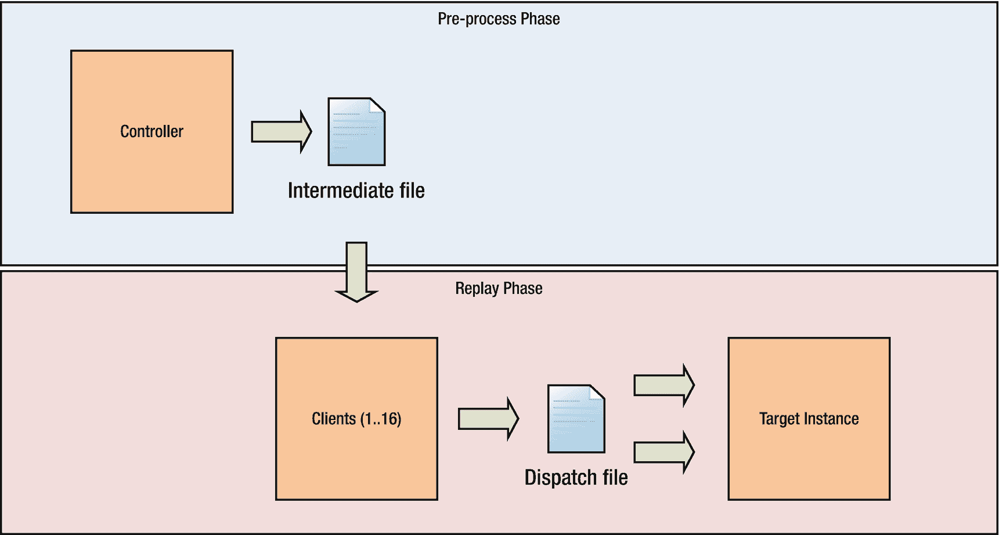

图 21-1

分布式重放架构

### 配置环境

在开始重放跟踪之前，我们需要配置分布式重放控制器、分布式重放客户端和分布式重放管理工具。这些活动将在以下部分讨论。


#### 配置控制器

您可以在 SQL Server 的 32 位共享目录中的 `Tools\DReplayController` 文件夹内找到 `DReplayController.config` 文件。因此，如果 SQL Server 安装在默认路径下，则完整路径为 `C:\Program Files (x86)\Microsoft SQL Server\150\Tools\DReplayController\DReplayController.config`。您可以使用此配置文件来控制日志记录级别。可能的选项如下：

*   `INFORMATIONAL`: 将所有消息记录到控制器日志。
*   `WARNINGS`: 过滤掉信息性消息，但记录所有错误和警告。
*   `CRITICAL`: 仅记录严重错误。这是默认值。

`DReplayController.config` 文件的默认内容如代码清单 21-1 所示。

```
CRITICAL
```

代码清单 21-1
`DReplayController.config`

由于服务在启动时从配置文件中读取此日志记录级别，因此如果您在启动服务后更改了日志级别，则需要重新启动该服务。日志本身在服务启动时创建，其中包含启动信息，例如正在使用的服务账户。您可以在 `\DReplayController\Log` 文件夹中找到名为 `DReplay Controller Log_<唯一标识符>` 的日志文件。每次服务启动时都会生成一个新日志。

如果您在不同于分布式重播控制器服务的服务账户下运行分布式重播客户端服务，那么您还需要在分布式重播控制器服务上配置 DCOM 权限。您可以通过 Windows 管理工具中的“组件服务”来完成此操作。

调用“组件服务”后，您需要逐级展开 控制台根节点 ➤ 组件服务 ➤ 计算机 ➤ 我的电脑 ➤ DCOM 配置，然后从 `DReplayController` 的上下文菜单中选择“属性”。这将调用“属性”对话框。从这里，您应导航到“安全”选项卡。

现在，使用“启动和激活权限”部分中的“编辑”按钮来启动“权限”对话框。在此处，使用“添加”按钮添加分布式重播客户端服务的服务账户，然后授予其“本地激活”和“远程激活”权限。

您现在需要在“访问权限”部分重复此过程，以授予该服务账户“本地访问”和“远程访问”权限。

您还需要确保将分布式重播客户端服务账户添加到运行分布式重播控制器的服务器上的“分布式 COM 用户”Windows 组中。应用这些更改后，您需要重新启动分布式重播控制器服务和分布式重播客户端服务，更改才能生效。

#### 提示

关于防火墙配置，控制器和客户端使用端口 135 和动态端口进行通信；因此，您必须确保服务器之间的这些端口是开放的。然而，开放动态端口范围可能会违反某些组织的安全最佳实践。解决方法是配置 Windows 防火墙，允许分布式重播可执行文件通过任何端口进行通信。然而，这本身也会带来问题，因为某些企业防火墙未配置为提供此功能，这意味着即使 Windows 防火墙允许流量通过，数据包也可能在企业防火墙层面被丢弃。

#### 配置客户端

您可以在 SQL Server 的 32 位共享目录中的 `Tools\DReplayClient` 文件夹内找到 `DReplayClient.config` 文件。因此，如果 SQL Server 安装在默认路径下，则完整路径为 `C:\Program Files (x86)\Microsoft SQL Server\150\Tools\DReplayController\DReplayClient.config`。您可以使用此配置文件来配置表 21-1 中详述的设置。

表 21-1
`DReplayClient.config` 选项

| 选项 | 描述 |
| --- | --- |
| `Controller` | 托管分布式重播控制器的服务器名称。请注意，这是服务器名称，而不是服务器\实例名称。 |
| `WorkingDirectory` | 客户端上存储调度文件的位置。如果配置文件中未包含此选项，则使用存储配置文件的文件夹。 |
| `ResultsDirectory` | 存储重播结果文件的位置。如果配置文件中未指定此选项，则使用存储配置文件的文件夹。 |
| `Logging` | 使用此选项控制日志记录级别。可能的选项有：• `INFORMATIONAL`，将所有消息记录到控制器日志。• `WARNINGS`，过滤掉信息性消息，但记录所有错误和警告。• `CRITICAL`，仅记录严重错误。这是默认值。 |

代码清单 21-2 展示了经过编辑的 `DReplayClient.config` 文件版本，该文件已配置为指向我们的控制器服务器以及工作目录和结果目录。

```
controller
C:\DistributedReplay\WorkingDir\
C:\DistributedReplay\ResultDir\
CRITICAL
```

代码清单 21-2
`DReplayClient.config`

#### 提示

您必须在每个客户端上启动分布式重播客户端服务之前，先启动分布式重播控制器服务。

由于我们使用了两个客户端，因此需要在每个客户端上重复这些操作。在我们的环境中，这些客户端是服务器 Client1 和 Client2。

#### 提示

关于防火墙配置，客户端和目标使用 SQL Server 端口进行通信。在标准配置中，这意味着使用 TCP 端口 1433，如果使用命名实例，则还需使用 UDP 端口 1434 用于浏览器服务。如果使用非标准端口，请相应地配置防火墙。

#### 配置重播

重播是通过管理工具启动的，该工具依赖于两个配置文件：`DReplay.exe.preprocess.config` 和 `DReplay.exe.replay.config`。第一个配置文件控制中间文件的构建，第二个控制重播选项和输出选项。两个文件都位于 32 位共享目录中，因此在默认安装下，完整限定路径分别是 `C:\Program Files (x86)\Microsoft SQL Server\150\Tools\Binn\DReplay.exe.preprocess.config` 和 `C:\Program Files (x86)\Microsoft SQL Server\150\Tools\Binn\DReplay.exe.replay.config`。表 21-2 详细说明了可以在 `DReplay.exe.preprocess.config` 中配置的选项。

**表 21-2 DReplay.exe.preprocess.config 选项**

| 选项 | 描述 |
| --- | --- |
| `IncSystemSession` | 指定是否应将从系统会话捕获的活动包含在重播中。 |
| `MaxIdleTime` | 指定空闲时间的上限（以秒为单位）。 • `-1` 指定活动之间的空闲时间应与原始跟踪相同。 • `0` 指定活动之间不应有空闲时间。 |

`DReplay.exe.preprocess.config` 文件的默认内容如清单 21-3 所示。

```
No

清单 21-3
DReplay.exe.preprocess.config
```

表 21-3 详细说明了可以在 `DReplay.exe.replay.config` 中配置的选项。

**表 21-3 DReplay.exe.replay.config 选项**

| 选项 | 类别 | 描述 |
| --- | --- | --- |
| `Server` | 重播选项 | 目标服务器的服务器\实例名称。 |
| `SequencingMode` | 重播选项 | 指定用于调度事件的模式。可能的选项包括： • `Synchronization`，表示事务顺序受基于时间的跨客户端同步约束，这对于性能测试很有用。 • `Stress`（默认选项）表示事务尽快触发，无需基于时间的同步。这对于负载测试很有用。 |
| `StressScaleGranularity` | 重播选项 | 当 `SequenceMode` 设置为 `Stress` 时，`StressScaleGranularity` 确定如何在 SPID 上扩展活动。 • `SPID` 表示单个 SPID 上的连接应作为单个 SPID 进行扩展。 • `Connection` 表示单个 SPID 上的连接应作为单独的连接进行扩展。 |
| `ConnectTimeScale` | 重播选项 | 一个百分比值，指示当 `SequenceMode` 为 `Stress` 时，重播期间是否应减少连接时间。`100` 表示包含 100% 的连接时间。较低的值会相应减少模拟的连接时间。 |
| `ThinkTimeScale` | 重播选项 | 一个百分比值，指示当 `SequenceMode` 为 `Stress` 时，重播期间是否应减少用户思考时间。`100` 表示包含 100% 的思考时间，因此事务以捕获时的速度重播。指定较低的值会减少间隔。 |
| `UseConnectionPooling` | 重播选项 | 指定客户端上是否应使用连接池。*连接池* 是后续连接可以重用的连接缓存。 |
| `HealthmonInterval` | 重播选项 | 当 `SequenceMode` 设置为 `Synchronization` 时，`HealthmonInterval` 确定运行运行状况监视器的频率，以秒为单位。`-1` 表示禁用运行状况监视器。 |
| `QueryTimeout` | 重播选项 | 以秒为单位指定查询超时值。`-1` 表示禁用。 |
| `ThreadsPerClient` | 重播选项 | 指定每个客户端用于重播的线程数。 |
| `RecordRowCount` | 输出选项 | 指定是否应包含每个结果集的行数。 |
| `RecordResultSet` | 输出选项 | 指定是否应保存每个记录集的内容。 |

清单 21-4 展示了 `DReplay.exe.replay.config` 文件的示例，该示例已根据我们的环境进行了修改，以允许我们通过模拟多个连接来执行性能测试。

```
Target
synchronization

No

Yes
No

清单 21-4
DReplay.exe.replay.config
```

### 使用分布式重播

现在分布式重播实用程序已经配置好了，我们使用扩展事件创建一个跟踪，然后再同步目标。然后，我们使用分布式重播来重放该跟踪，以测试性能调整，模拟两个客户端上的并发活动。然而，在执行此操作之前，我们首先使用清单 21-5 中的脚本在控制器上创建 `Chapter21` 数据库。

```
--创建数据库
CREATE DATABASE Chapter21 ;
GO
USE Chapter21
GO
--创建并填充数字表
DECLARE @Numbers TABLE
(
Number        INT
)
;WITH CTE(Number)
AS
(
SELECT 1 Number
UNION ALL
SELECT Number + 1
FROM CTE
WHERE Number < 100
)
INSERT INTO @Numbers
SELECT Number FROM CTE;
--创建并填充姓名片段表
DECLARE @Names TABLE
(
FirstName        VARCHAR(30),
LastName        VARCHAR(30)
);
INSERT INTO @Names
VALUES('Peter', 'Carter'),
('Michael', 'Smith'),
('Danielle', 'Mead'),
('Reuben', 'Roberts'),
('Iris', 'Jones'),
('Sylvia', 'Davies'),
('Finola', 'Wright'),
('Edward', 'James'),
('Marie', 'Andrews'),
('Jennifer', 'Abraham');
--创建并填充地址表
CREATE TABLE dbo.Addresses
(
AddressID        INT        NOT NULL        IDENTITY        PRIMARY KEY,
AddressLine1        NVARCHAR(50),
AddressLine2        NVARCHAR(50),
AddressLine3        NVARCHAR(50),
PostCode        NCHAR(8)
) ;
INSERT INTO dbo.Addresses
VALUES('1 Carter Drive', 'Hedge End', 'Southampton', 'SO32 6GH')
,('10 Apress Way', NULL, 'London', 'WC10 2FG')
,('12 SQL Street', 'Botley', 'Southampton', 'SO32 8RT')
,('19 Springer Way', NULL, 'London', 'EC1 5GG') ;
--创建并填充客户表
CREATE TABLE dbo.Customers
(
CustomerID            INT          NOT NULL   IDENTITY   PRIMARY KEY,
FirstName             VARCHAR(30)  NOT NULL,
LastName              VARCHAR(30)  NOT NULL,
BillingAddressID      INT          NOT NULL,
DeliveryAddressID     INT          NOT NULL,
CreditLimit           MONEY        NOT NULL,
Balance               MONEY        NOT NULL
);
SELECT * INTO #Customers
FROM
(SELECT
(SELECT TOP 1 FirstName FROM @Names ORDER BY NEWID()) FirstName,
(SELECT TOP 1 LastName FROM @Names ORDER BY NEWID()) LastName,
(SELECT TOP 1 Number FROM @Numbers ORDER BY NEWID()) BillingAddressID,
(SELECT TOP 1 Number FROM @Numbers ORDER BY NEWID()) DeliveryAddressID,
(SELECT TOP 1 CAST(RAND() * Number AS INT) * 10000
FROM @Numbers ORDER BY NEWID()) CreditLimit,
(SELECT TOP 1 CAST(RAND() * Number AS INT) * 9000
FROM @Numbers ORDER BY NEWID()) Balance
FROM @Numbers a
CROSS JOIN @Numbers b
CROSS JOIN @Numbers c
) a;
INSERT INTO dbo.Customers
SELECT * FROM #Customers;
GO
清单 21-5
创建 Chapter21 数据库
```

#### 同步目标

由于我们重放的跟踪包含 DML 语句，因此我们需要在开始捕获跟踪之前立即同步目标数据库，以确保 ID 对齐。我们通过备份控制器上的 `Chapter21` 数据库并在目标上还原来执行此任务。我们可以使用清单 21-6 中的脚本来实现这一点。


#### 提示

在运行脚本前，请记得根据您自身的配置修改文件路径。

```
--第 1 部分 - 在控制器上运行
BACKUP DATABASE Chapter21
TO  DISK = N'F:\MSSQL\Backup\Chapter21.bak'
WITH NOFORMAT, NOINIT,  NAME = N'Chapter21-Full Database Backup', SKIP,  STATS = 10
GO
--第 2 部分 - 在客户端运行，需在备份文件转移后执行
RESTORE DATABASE Chapter21
FROM  DISK = N'F:\MSSQL\Backup\Chapter21.bak'
WITH  FILE = 1, STATS = 5
GO
清单 21-6
同步 Chapter21 数据库
```

理想情况下，数据库在每个服务器上应具有相同的 `DatabaseID`。但如果这不可行，则应确保事件会话中捕获了 `Database_name` 操作，以便进行映射。您还应确保跟踪中包含的所有登录账户都已在目标服务器上创建，且拥有相同的权限和相同的默认数据库。如果未能做到这一点，将会导致重放错误。

由于我们的演示是为了测试性能增强，您可能希望借此机会，在已同步的数据库中为 `Customers` 和 `Addresses` 表创建适当的索引。您可以在清单 21-7 中找到一个包含适用于我们跟踪工作负载的索引建议的脚本。

```
USE Chapter21
GO
CREATE INDEX IDX_Customers_LastName ON dbo.Customers(LastName) INCLUDE(FirstName) ;
GO
CREATE INDEX IDX_Customers_AddressID ON dbo.Customers(DeliveryAddressID) ;
GO
CREATE INDEX IDX_Addresses_AddressID ON dbo.Addresses(AddressID) ;
GO
CREATE INDEX IDX_Customers_LastName_CustomerID ON dbo.Customers(LastName, CustomerID) ;
GO
清单 21-7
索引建议
```

#### 创建跟踪

现在，让我们创建扩展事件会话并启动跟踪。您应配置事件会话，以捕获表 21-4 中详述的事件、事件字段和操作。

表 21-4

事件和事件字段


| 事件 | 事件字段 | 动作 |
| --- | --- | --- |
| `assembly_load` | – | `collect_current_thread_id`, `event_sequence`, `cpu_id`, `scheduler_id`, `system_thread_id`, `task_address`, `worker_address`, `database_id`, `database_name`, `is_system`, `plan_handle`, `request_id`, `session_id`, `transaction_id` |
| `attention` | – | `event_sequence`, `database_id`, `database_name`, `is_system`, `request_id`, `session_id` |
| `begin_tran_completed` | `statement` | `collect_current_thread_id`, `event_sequence`, `cpu_id`, `scheduler_id`, `system_thread_id`, `task_address`, `worker_address`, `database_id`, `database_name`, `is_system`, `plan_handle`, `request_id`, `session_id`, `transaction_id` |
| `begin_tran_starting` | `statement` | `collect_current_thread_id`, `event_sequence`, `cpu_id`, `scheduler_id`, `system_thread_id`, `task_address`, `worker_address`, `database_id`, `database_name`, `is_system`, `plan_handle`, `request_id`, `session_id`, `transaction_id` |
| `commit_tran_completed` | `statement` | `collect_current_thread_id`, `event_sequence`, `cpu_id`, `scheduler_id`, `system_thread_id`, `task_address`, `worker_address`, `database_id`, `database_name`, `is_system`, `plan_handle`, `request_id`, `session_id`, `transaction_id` |
| `commit_tran_starting` | `statement` | `collect_current_thread_id`, `event_sequence`, `cpu_id`, `scheduler_id`, `system_thread_id`, `task_address`, `worker_address`, `database_id`, `database_name`, `is_system`, `plan_handle`, `request_id`, `session_id`, `transaction_id` |
| `cursor_close` | – | `collect_current_thread_id`, `event_sequence`, `cpu_id`, `scheduler_id`, `system_thread_id`, `task_address`, `worker_address`, `database_id`, `database_name`, `is_system`, `plan_handle`, `request_id`, `session_id`, `sql_text`, `transaction_id` |
| `cursor_execute` | – | `collect_current_thread_id`, `event_sequence`, `cpu_id`, `scheduler_id`, `system_thread_id`, `task_address`, `worker_address`, `database_id`, `database_name`, `is_system`, `plan_handle`, `request_id`, `session_id`, `sql_text`, `transaction_id` |
| `cursor_implicit_conversion` | – | `collect_current_thread_id`, `event_sequence`, `cpu_id`, `scheduler_id`, `system_thread_id`, `task_address`, `worker_address`, `database_id`, `database_name`, `is_system`, `plan_handle`, `request_id`, `session_id`, `sql_text`, `transaction_id` |
| `cursor_open` | – | `collect_current_thread_id`, `event_sequence`, `cpu_id`, `scheduler_id`, `system_thread_id`, `task_address`, `worker_address`, `database_id`, `database_name`, `is_system`, `plan_handle`, `request_id`, `session_id`, `sql_text`, `transaction_id` |
| `cursor_prepare` | – | `collect_current_thread_id`, `event_sequence`, `cpu_id`, `scheduler_id`, `system_thread_id`, `task_address`, `worker_address`, `database_id`, `database_name`, `is_system`, `plan_handle`, `request_id`, `session_id`, `sql_text`, `transaction_id` |
| `cursor_recompile` | – | `collect_current_thread_id`, `event_sequence`, `cpu_id`, `scheduler_id`, `system_thread_id`, `task_address`, `worker_address`, `database_id`, `database_name`, `is_system`, `plan_handle`, `request_id`, `session_id`, `sql_text`, `transaction_id` |
| `cursor_unprepare` | – | `collect_current_thread_id`, `event_sequence`, `cpu_id`, `scheduler_id`, `system_thread_id`, `task_address`, `worker_address`, `database_id`, `database_name`, `is_system`, `plan_handle`, `request_id`, `session_id`, `sql_text`, `transaction_id` |
| `database_file_size_change` | `database_name` | `collect_current_thread_id`, `event_sequence`, `cpu_id`, `scheduler_id`, `system_thread_id`, `task_address`, `worker_address`, `database_id`, `database_name`, `is_system`, `plan_handle`, `request_id`, `session_id`, `transaction_id` |
| `dtc_transaction` | – | `collect_current_thread_id`, `event_sequence`, `cpu_id`, `scheduler_id`, `system_thread_id`, `task_address`, `worker_address`, `database_id`, `database_name`, `is_system`, `plan_handle`, `request_id`, `session_id`, `transaction_id` |
| `exec_prepared_sql` | – | `collect_current_thread_id`, `event_sequence`, `cpu_id`, `scheduler_id`, `system_thread_id`, `task_address`, `worker_address`, `database_id`, `database_name`, `is_system`, `plan_handle`, `request_id`, `session_id`, `transaction_id` |
| `existing_connection` | `database_name`, `option_text` | `event_sequence`, `client_app_name`, `client_hostname`, `client_pid`, `database_id`, `database_name`, `is_system`, `nt_username`, `request_id`, `server_instance_name`, `server_principal_name`, `session_id`, `session_nt_username`, `session_resource_group_id`, `session_resource_pool_id`, `session_server_principal_name`, `username` |
| `login` | `database_name`, `option_text` | `collect_current_thread_id`, `event_sequence`, `cpu_id`, `scheduler_id`, `system_thread_id`, `task_address`, `worker_address`, `client_app_name`, `client_hostname`, `client_pid`, `database_id`, `database_name`, `is_system`, `nt_username`, `plan_handle`, `request_id`, `server_instance_name`, `server_principal_name`, `session_id`, `session_nt_username`, `session_resource_group_id`, `session_resource_pool_id`, `session_server_principal_name`, `transaction_id`, `username` |
| `logout` | – | `collect_current_thread_id`, `event_sequence`, `cpu_id`, `scheduler_id`, `system_thread_id`, `task_address`, `worker_address`, `client_app_name`, `client_hostname`, `client_pid`, `database_id`, `database_name`, `is_system`, `nt_username`, `plan_handle`, `request_id`, `server_instance_name`, `server_principal_name`, `session_id`, `session_nt_username`, `session_resource_group_id`, `session_resource_pool_id`, `session_server_principal_name`, `transaction_id`, `username` |
| `prepare_sql` | – | `collect_current_thread_id`, `event_sequence`, `cpu_id`, `scheduler_id`, `system_thread_id`, `task_address`, `worker_address`, `database_id`, `database_name`, `is_system`, `plan_handle`, `request_id`, `session_id`, `transaction_id` |
| `promote_tran_completed` | – | `collect_current_thread_id`, `event_sequence`, `cpu_id`, `scheduler_id`, `system_thread_id`, `task_address`, `worker_address`, `database_id`, `database_name`, `is_system`, `plan_handle`, `request_id`, `session_id`, `transaction_id` |
| `promote_tran_started` | – | `collect_current_thread_id`, `event_sequence`, `cpu_id`, `scheduler_id`, `system_thread_id`, `task_address`, `worker_address`, `database_id`, `database_name`, `is_system`, `plan_handle`, `request_id`, `session_id`, `transaction_id` |
| `rollback_tran_completed` | `statement` | `collect_current_thread_id`, `event_sequence`, `cpu_id`, `scheduler_id`, `system_thread_id`, `task_address`, `worker_address`, `database_id`, `database_name`, `is_system`, `plan_handle`, `request_id`, `session_id`, `transaction_id` |
| `rollback_tran_started` | `statement` | `collect_current_thread_id`, `event_sequence`, `cpu_id`, `scheduler_id`, `system_thread_id`, `task_address`, `worker_address`, `database_id`, `database_name`, `is_system`, `plan_handle`, `request_id`, `session_id`, `transaction_id` |
| `rpc_completed` | `data_stream`, `output_parameters` | `collect_current_thread_id`, `event_sequence`, `cpu_id`, `scheduler_id`, `system_thread_id`, `task_address`, `worker_address`, `database_id`, `database_name`, `is_system`, `plan_handle`, `request_id`, `session_id`, `transaction_id` |
| `rpc_starting` | `data_stream` | `collect_current_thread_id`, `event_sequence`, `cpu_id`, `scheduler_id`, `system_thread_id`, `task_address`, `worker_address`, `database_id`, `database_name`, `is_system`, `plan_handle`, `request_id`, `session_id`, `transaction_id` |
| `save_tran_completed` | `statement` | `collect_current_thread_id`, `event_sequence`, `cpu_id`, `scheduler_id`, `system_thread_id`, `task_address`, `worker_address`, `database_id`, `database_name`, `is_system`, `plan_handle`, `request_id`, `session_id`, `transaction_id` |
| `save_tran_started` | `statement` | `collect_current_thread_id`, `event_sequence`, `cpu_id`, `scheduler_id`, `system_thread_id`, `task_address`, `worker_address`, `database_id`, `database_name`, `is_system`, `plan_handle`, `request_id`, `session_id`, `transaction_id` |
| `server_memory_change` | – | `collect_current_thread_id`, `event_sequence`, `cpu_id`, `scheduler_id`, `system_thread_id`, `task_address`, `worker_address`, `database_id`, `database_name`, `is_system`, `plan_handle`, `request_id`, `session_id`, `transaction_id` |
| `sql_batch_completed` | `batch_text` | `collect_current_thread_id`, `event_sequence`, `cpu_id`, `scheduler_id`, `system_thread_id`, `task_address`, `worker_address`, `database_id`, `database_name`, `is_system`, `plan_handle`, `request_id`, `session_id`, `transaction_id` |
| `sql_batch_starting` | `batch_text` | `collect_current_thread_id`, `event_sequence`, `cpu_id`, `scheduler_id`, `system_thread_id`, `task_address`, `worker_address`, `database_id`, `database_name`, `is_system`, `plan_handle`, `request_id`, `session_id`, `transaction_id` |
| `sql_transaction` | – | `collect_current_thread_id`, `event_sequence`, `cpu_id`, `scheduler_id`, `system_thread_id`, `task_address`, `worker_address`, `database_id`, `database_name`, `is_system`, `plan_handle`, `request_id`, `session_id`, `transaction_id` |
| `trace_flag_changed` | – | `collect_current_thread_id`, `event_sequence`, `cpu_id`, `scheduler_id`, `system_thread_id`, `task_address`, `worker_address`, `database_id`, `database_name`, `is_system`, `plan_handle`, `request_id`, `session_id`, `transaction_id` |
| `unprepare_sql` | – | `collect_current_thread_id`, `event_sequence`, `cpu_id`, `scheduler_id`, `system_thread_id`, `task_address`, `worker_address`, `database_id`, `database_name`, `is_system`, `plan_handle`, `request_id`, `session_id`, `transaction_id` |


因此，以上即为我们包含在会话定义中的事件、事件字段与操作（参见清单 21-8）。

#### 提示

若未包含所有推荐的事件、事件字段和操作，则在将`.xel`文件转换为`.trc`文件时可能会引发错误。此处的解决方法是运行`ReadTrace`时使用跟踪标志`-T28`来忽略 RML 要求。但这可能导致不可预知的结果，故不建议采用。


### 创建扩展事件会话并启动跟踪

```sql
CREATE EVENT SESSION DReplay
ON SERVER
ADD EVENT sqlserver.assembly_load(
ACTION(package0.collect_current_thread_id,package0.event_sequence,sqlos.cpu_id,sqlos.scheduler_id,sqlos.system_thread_id,sqlos.task_address,sqlos.worker_address,sqlserver.database_id,sqlserver.database_name,sqlserver.is_system,sqlserver.plan_handle,sqlserver.request_id,sqlserver.session_id,sqlserver.transaction_id)),
ADD EVENT sqlserver.attention(
ACTION(package0.event_sequence,sqlserver.database_id,sqlserver.database_name,sqlserver.is_system,sqlserver.request_id,sqlserver.session_id)),
ADD EVENT sqlserver.begin_tran_completed(SET collect_statement=(1)
ACTION(package0.collect_current_thread_id,package0.event_sequence,sqlos.cpu_id,sqlos.scheduler_id,sqlos.system_thread_id,sqlos.task_address,sqlos.worker_address,sqlserver.database_id,sqlserver.database_name,sqlserver.is_system,sqlserver.plan_handle,sqlserver.request_id,sqlserver.session_id,sqlserver.transaction_id)),
ADD EVENT sqlserver.begin_tran_starting(SET collect_statement=(1)
ACTION(package0.collect_current_thread_id,package0.event_sequence,sqlos.cpu_id,sqlos.scheduler_id,sqlos.system_thread_id,sqlos.task_address,sqlos.worker_address,sqlserver.database_id,sqlserver.database_name,sqlserver.is_system,sqlserver.plan_handle,sqlserver.request_id,sqlserver.session_id,sqlserver.transaction_id)),
ADD EVENT sqlserver.commit_tran_completed(SET collect_statement=(1)
ACTION(package0.collect_current_thread_id,package0.event_sequence,sqlos.cpu_id,sqlos.scheduler_id,sqlos.system_thread_id,sqlos.task_address,sqlos.worker_address,sqlserver.database_id,sqlserver.database_name,sqlserver.is_system,sqlserver.plan_handle,sqlserver.request_id,sqlserver.session_id,sqlserver.transaction_id)),
ADD EVENT sqlserver.commit_tran_starting(SET collect_statement=(1)
ACTION(package0.collect_current_thread_id,package0.event_sequence,sqlos.cpu_id,sqlos.scheduler_id,sqlos.system_thread_id,sqlos.task_address,sqlos.worker_address,sqlserver.database_id,sqlserver.database_name,sqlserver.is_system,sqlserver.plan_handle,sqlserver.request_id,sqlserver.session_id,sqlserver.transaction_id)),
ADD EVENT sqlserver.cursor_close(
ACTION(package0.collect_current_thread_id,package0.event_sequence,sqlos.cpu_id,sqlos.scheduler_id,sqlos.system_thread_id,sqlos.task_address,sqlos.worker_address,sqlserver.database_id,sqlserver.database_name,sqlserver.is_system,sqlserver.plan_handle,sqlserver.request_id,sqlserver.session_id,sqlserver.sql_text,sqlserver.transaction_id)),
ADD EVENT sqlserver.cursor_execute(
ACTION(package0.collect_current_thread_id,package0.event_sequence,sqlos.cpu_id,sqlos.scheduler_id,sqlos.system_thread_id,sqlos.task_address,sqlos.worker_address,sqlserver.database_id,sqlserver.database_name,sqlserver.is_system,sqlserver.plan_handle,sqlserver.request_id,sqlserver.session_id,sqlserver.sql_text,sqlserver.transaction_id)),
ADD EVENT sqlserver.cursor_implicit_conversion(
ACTION(package0.collect_current_thread_id,package0.event_sequence,sqlos.cpu_id,sqlos.scheduler_id,sqlos.system_thread_id,sqlos.task_address,sqlos.worker_address,sqlserver.database_id,sqlserver.database_name,sqlserver.is_system,sqlserver.plan_handle,sqlserver.request_id,sqlserver.session_id,sqlserver.sql_text,sqlserver.transaction_id)),
ADD EVENT sqlserver.cursor_open(
ACTION(package0.collect_current_thread_id,package0.event_sequence,sqlos.cpu_id,sqlos.scheduler_id,sqlos.system_thread_id,sqlos.task_address,sqlos.worker_address,sqlserver.database_id,sqlserver.database_name,sqlserver.is_system,sqlserver.plan_handle,sqlserver.request_id,sqlserver.session_id,sqlserver.sql_text,sqlserver.transaction_id)),
ADD EVENT sqlserver.cursor_prepare(
ACTION(package0.collect_current_thread_id,package0.event_sequence,sqlos.cpu_id,sqlos.scheduler_id,sqlos.system_thread_id,sqlos.task_address,sqlos.worker_address,sqlserver.database_id,sqlserver.database_name,sqlserver.is_system,sqlserver.plan_handle,sqlserver.request_id,sqlserver.session_id,sqlserver.sql_text,sqlserver.transaction_id)),
ADD EVENT sqlserver.cursor_recompile(
ACTION(package0.collect_current_thread_id,package0.event_sequence,sqlos.cpu_id,sqlos.scheduler_id,sqlos.system_thread_id,sqlos.task_address,sqlos.worker_address,sqlserver.database_id,sqlserver.database_name,sqlserver.is_system,sqlserver.plan_handle,sqlserver.request_id,sqlserver.session_id,sqlserver.sql_text,sqlserver.transaction_id)),
ADD EVENT sqlserver.cursor_unprepare(
ACTION(package0.collect_current_thread_id,package0.event_sequence,sqlos.cpu_id,sqlos.scheduler_id,sqlos.system_thread_id,sqlos.task_address,sqlos.worker_address,sqlserver.database_id,sqlserver.database_name,sqlserver.is_system,sqlserver.plan_handle,sqlserver.request_id,sqlserver.session_id,sqlserver.sql_text,sqlserver.transaction_id)),
ADD EVENT sqlserver.database_file_size_change(SET collect_database_name=(1)
ACTION(package0.collect_current_thread_id,package0.event_sequence,sqlos.cpu_id,sqlos.scheduler_id,sqlos.system_thread_id,sqlos.task_address,sqlos.worker_address,sqlserver.database_id,sqlserver.database_name,sqlserver.is_system,sqlserver.plan_handle,sqlserver.request_id,sqlserver.session_id,sqlserver.transaction_id)),
ADD EVENT sqlserver.dtc_transaction(
ACTION(package0.collect_current_thread_id,package0.event_sequence,sqlos.cpu_id,sqlos.scheduler_id,sqlos.system_thread_id,sqlos.task_address,sqlos.worker_address,sqlserver.database_id,sqlserver.database_name,sqlserver.is_system,sqlserver.plan_handle,sqlserver.request_id,sqlserver.session_id,sqlserver.transaction_id)),
ADD EVENT sqlserver.exec_prepared_sql(
ACTION(package0.collect_current_thread_id,package0.event_sequence,sqlos.cpu_id,sqlos.scheduler_id,sqlos.system_thread_id,sqlos.task_address,sqlos.worker_address,sqlserver.database_id,sqlserver.database_name,sqlserver.is_system,sqlserver.plan_handle,sqlserver.request_id,sqlserver.session_id,sqlserver.transaction_id)),
ADD EVENT sqlserver.existing_connection(SET collect_database_name=(1),collect_options_text=(1)
ACTION(package0.event_sequence,sqlserver.client_app_name,sqlserver.client_hostname,sqlserver.client_pid,sqlserver.database_id,sqlserver.database_name,sqlserver.is_system,sqlserver.nt_username,sqlserver.request_id,sqlserver.server_instance_name,sqlserver.server_principal_name,sqlserver.session_id,sqlserver.session_nt_username,sqlserver.session_resource_group_id,sqlserver.session_resource_pool_id,sqlserver.session_server_principal_name,sqlserver.username)),
ADD EVENT sqlserver.login(SET collect_database_name=(1),collect_options_text=(1)
ACTION(package0.collect_current_thread_id,package0.event_sequence,sqlos.cpu_id,sqlos.scheduler_id,sqlos.system_thread_id,sqlos.task_address,sqlos.worker_address,sqlserver.client_app_name,sqlserver.client_hostname,sqlserver.client_pid,sqlserver.database_id,sqlserver.database_name,sqlserver.is_system,sqlserver.nt_username,sqlserver.plan_handle,sqlserver.request_id,sqlserver.server_instance_name,sqlserver.server_principal_name,sqlserver.session_id,sqlserver.session_nt_username,sqlserver.session_resource_group_id,sqlserver.session_resource_pool_id,sqlserver.session_server_principal_name,sqlserver.transaction_id,sqlserver.username)),
ADD EVENT sqlserver.logout(
ACTION(package0.collect_current_thread_id,package0.event_sequence,sqlos.cpu_id,sqlos.scheduler_id,sqlos.system_thread_id,sqlos.task_address,sqlos.worker_address,sqlserver.client_app_name,sqlserver.client_hostname,sqlserver.client_pid,sqlserver.database_id,sqlserver.database_name,sqlserver.is_system,sqlserver.nt_username,sqlserver.plan_handle,sqlserver.request_id,sqlserver.server_instance_name,sqlserver.server_principal_name,sqlserver.session_id,sqlserver.session_nt_username,sqlserver.session_resource_group_id,sqlserver.session_resource_pool_id,sqlserver.session_server_principal_name,sqlserver.transaction_id,sqlserver.username)),
ADD EVENT sqlserver.prepare_sql(
ACTION(package0.collect_current_thread_id,package0.event_sequence,sqlos.cpu_id,sqlos.scheduler_id,sqlos.system_thread_id,sqlos.task_address,sqlos.worker_address,sqlserver.database_id,sqlserver.database_name,sqlserver.is_system,sqlserver.plan_handle,sqlserver.request_id,sqlserver.session_id,sqlserver.transaction_id)),
ADD EVENT sqlserver.promote_tran_completed(
ACTION(package0.collect_current_thread_id,package0.event_sequence,sqlos.cpu_id,sqlos.scheduler_id,sqlos.system_thread_id,sqlos.task_address,sqlos.worker_address,sqlserver.database_id,sqlserver.database_name,sqlserver.is_system,sqlserver.plan_handle,sqlserver.request_id,sqlserver.session_id,sqlserver.transaction_id)),
ADD EVENT sqlserver.promote_tran_starting(
ACTION(package0.collect_current_thread_id,package0.event_sequence,sqlos.cpu_id,sqlos.scheduler_id,sqlos.system_thread_id,sqlos.task_address,sqlos.worker_address,sqlserver.database_id,sqlserver.database_name,sqlserver.is_system,sqlserver.plan_handle,sqlserver.request_id,sqlserver.session_id,sqlserver.transaction_id)),
ADD EVENT sqlserver.rollback_tran_completed(SET collect_statement=(1)
ACTION(package0.collect_current_thread_id,package0.event_sequence,sqlos.cpu_id,sqlos.scheduler_id,sqlos.system_thread_id,sqlos.task_address,sqlos.worker_address,sqlserver.database_id,sqlserver.database_name,sqlserver.is_system,sqlserver.plan_handle,sqlserver.request_id,sqlserver.session_id,sqlserver.transaction_id)),
ADD EVENT sqlserver.rollback_tran_starting(SET collect_statement=(1)
ACTION(package0.collect_current_thread_id,package0.event_sequence,sqlos.cpu_id,sqlos.scheduler_id,sqlos.system_thread_id,sqlos.task_address,sqlos.worker_address,sqlserver.database_id,sqlserver.database_name,sqlserver.is_system,sqlserver.plan_handle,sqlserver.request_id,sqlserver.session_id,sqlserver.transaction_id)),
ADD EVENT sqlserver.rpc_completed(SET collect_data_stream=(1),collect_output_parameters=(1),collect_statement=(0)
ACTION(package0.collect_current_thread_id,package0.event_sequence,sqlos.cpu_id,sqlos.scheduler_id,sqlos.system_thread_id,sqlos.task_address,sqlos.worker_address,sqlserver.database_id,sqlserver.database_name,sqlserver.is_system,sqlserver.plan_handle,sqlserver.request_id,sqlserver.session_id,sqlserver.transaction_id)),
ADD EVENT sqlserver.rpc_starting(SET collect_data_stream=(1),collect_statement=(0)
ACTION(package0.collect_current_thread_id,package0.event_sequence,sqlos.cpu_id,sqlos.scheduler_id,sqlos.system_thread_id,sqlos.task_address,sqlos.worker_address,sqlserver.database_id,sqlserver.database_name,sqlserver.is_system,sqlserver.plan_handle,sqlserver.request_id,sqlserver.session_id,sqlserver.transaction_id)),
ADD EVENT sqlserver.save_tran_completed(SET collect_statement=(1)
ACTION(package0.collect_current_thread_id,package0.event_sequence,sqlos.cpu_id,sqlos.scheduler_id,sqlos.system_thread_id,sqlos.task_address,sqlos.worker_address,sqlserver.database_id,sqlserver.database_name,sqlserver.is_system,sqlserver.plan_handle,sqlserver.request_id,sqlserver.session_id,sqlserver.transaction_id)),
ADD EVENT sqlserver.save_tran_starting(SET collect_statement=(1)
ACTION(package0.collect_current_thread_id,package0.event_sequence,sqlos.cpu_id,sqlos.scheduler_id,sqlos.system_thread_id,sqlos.task_address,sqlos.worker_address,sqlserver.database_id,sqlserver.database_name,sqlserver.is_system,sqlserver.plan_handle,sqlserver.request_id,sqlserver.session_id,sqlserver.transaction_id)),
ADD EVENT sqlserver.server_memory_change(
ACTION(package0.collect_current_thread_id,package0.event_sequence,sqlos.cpu_id,sqlos.scheduler_id,sqlos.system_thread_id,sqlos.task_address,sqlos.worker_address,sqlserver.database_id,sqlserver.database_name,sqlserver.is_system,sqlserver.plan_handle,sqlserver.request_id,sqlserver.session_id,sqlserver.transaction_id)),
ADD EVENT sqlserver.sql_batch_completed(SET collect_batch_text=(1)
ACTION(package0.collect_current_thread_id,package0.event_sequence,sqlos.cpu_id,sqlos.scheduler_id,sqlos.system_thread_id,sqlos.task_address,sqlos.worker_address,sqlserver.database_id,sqlserver.database_name,sqlserver.is_system,sqlserver.plan_handle,sqlserver.request_id,sqlserver.session_id,sqlserver.transaction_id)),
ADD EVENT sqlserver.sql_batch_starting(SET collect_batch_text=(1)
ACTION(package0.collect_current_thread_id,package0.event_sequence,sqlos.cpu_id,sqlos.scheduler_id,sqlos.system_thread_id,sqlos.task_address,sqlos.worker_address,sqlserver.database_id,sqlserver.database_name,sqlserver.is_system,sqlserver.plan_handle,sqlserver.request_id,sqlserver.session_id,sqlserver.transaction_id)),
ADD EVENT sqlserver.sql_transaction(
ACTION(package0.collect_current_thread_id,package0.event_sequence,sqlos.cpu_id,sqlos.scheduler_id,sqlos.system_thread_id,sqlos.task_address,sqlos.worker_address,sqlserver.database_id,sqlserver.database_name,sqlserver.is_system,sqlserver.plan_handle,sqlserver.request_id,sqlserver.session_id,sqlserver.transaction_id)),
ADD EVENT sqlserver.trace_flag_changed(
ACTION(package0.collect_current_thread_id,package0.event_sequence,sqlos.cpu_id,sqlos.scheduler_id,sqlos.system_thread_id,sqlos.task_address,sqlos.worker_address,sqlserver.database_id,sqlserver.database_name,sqlserver.is_system,sqlserver.plan_handle,sqlserver.request_id,sqlserver.session_id,sqlserver.transaction_id)),
ADD EVENT sqlserver.unprepare_sql(
ACTION(package0.collect_current_thread_id,package0.event_sequence,sqlos.cpu_id,sqlos.scheduler_id,sqlos.system_thread_id,sqlos.task_address,sqlos.worker_address,sqlserver.database_id,sqlserver.database_name,sqlserver.is_system,sqlserver.plan_handle,sqlserver.request_id,sqlserver.session_id,sqlserver.transaction_id))
ADD TARGET package0.event_file(SET filename=N'C:\MSSQL\DReplay.xel')
WITH (MAX_MEMORY=4096 KB,EVENT_RETENTION_MODE=ALLOW_SINGLE_EVENT_LOSS,MAX_DISPATCH_LATENCY=30 SECONDS,MAX_EVENT_SIZE=0 KB,MEMORY_PARTITION_MODE=NONE,TRACK_CAUSALITY=ON,STARTUP_STATE=ON) ;
GO
ALTER EVENT SESSION DReplay
ON SERVER
STATE = start;
GO
```


### 生成要跟踪的活动

根据您的具体场景，您可能希望捕获真实的用户活动；为此，您需要使用如 `SQLStress` 这样的工具，或者编写脚本活动。在我们的情况下，我们编写脚本活动以供跟踪（参见 清单 21-9）。

```sql
USE Chapter21
GO
DECLARE @Numbers TABLE
(
Number        INT
)
;WITH CTE(Number)
AS
(
SELECT 1 Number
UNION ALL
SELECT Number + 1
FROM CTE
WHERE Number  1000000
GO 50
SELECT TOP 10 PERCENT *
FROM dbo.Customers
GO 100
```
清单 21-9: 生成活动

现在，我们可以使用 清单 21-10 中的命令停止跟踪。

```sql
ALTER EVENT SESSION DReplay
ON SERVER
STATE = stop;
GO
```
清单 21-10: 停止跟踪

### 重放跟踪

现在我们已经捕获了一个跟踪，我们将其转换为 `.trc` 文件，然后使用分布式重放管理工具从命令行进行预处理，然后再进行重放。

#### 转换跟踪文件

为了将我们的 `.xel` 文件用于分布式重放，我们首先需要将其转换为 `.trc` 文件。我们借助 `readtrace.exe` 命令行工具来完成此操作，该工具使用 RML（重放标记语言）来转换数据。`ReadTrace` 是 Microsoft 的 SQL Server RML 实用工具包的一部分，您可以从 [`www.microsoft.com/en-gb/download/details.aspx?id=4511`](http://www.microsoft.com/en-gb/download/details.aspx%253Fid%253D4511) 下载。以下示例假设您已安装此工具包。

> **提示**
> 前面的链接包含了所有 RML 实用工具，本章使用的是此版本的工具。不过，可以下载更新版本的 `ReadTrace`，作为 DEA（数据库实验助手）的一部分，该工具可在 [`www.microsoft.com/en-us/download/details.aspx?id=54090`](http://www.microsoft.com/en-us/download/details.aspx%253Fid%253D54090) 找到。

在这里，我们通过导航到 `C:\Program Files\Microsoft Corporation\RMLUtils` 文件夹并运行带有 表 21-5 中详细参数的 `ReadTrace.exe` 来转换我们的跟踪文件。

表 21-5: ReadTrace 参数

| 参数 | 描述 |
| --- | --- |
| `-I` | 要转换的 `.xel` 文件的完全限定文件名。 |
| `-O` | 用于输出结果的文件夹。这包括日志文件以及 `.trc` 文件。 |
| `-a` | 阻止分析处理。 |
| `-MS` | 镜像到单个 `.trc` 文件，而不是为每个 SPID 创建单独的文件。 |

> **提示**
> 您可以在 SQL Server 的 RML 实用工具帮助文件中找到所有 `ReadTrace` 参数的完整描述。

我们使用 清单 21-11 中的命令运行 `ReadTrace`。

> **提示**
> 在运行此脚本前，请记得更改输入和输出文件的文件名及路径。即使您使用了相同的位置，您的 `.xel` 文件名也会包含一个不同的唯一标识符。

```cmd
readtrace.exe -I"C:\MSSQL\DReplay_0_130737313343740000.xel" -O"C:\MSSQL\DReplayTraceFile" -a -MS
```
清单 21-11: 使用 ReadTrace 转换为 .trc

#### 预处理跟踪数据

管理工具是一个命令行实用程序，可以使用 表 21-6 中的选项运行。

表 21-6: 管理工具选项

| 选项 | 描述 |
| --- | --- |
| `Preprocess` | 通过创建中间文件来准备跟踪数据 |
| `Replay` | 将跟踪分派到客户端并开始重放 |
| `Status` | 显示控制器的当前状态 |
| `Cancel` | 取消当前操作 |

当使用 `preprocess` 选项运行时，管理工具接受 表 21-7 中详细说明的参数。

表 21-7: 预处理参数

| 参数 | 全名 | 描述 |
| --- | --- | --- |
| `-m` | `Controller` | 托管分布式重放控制器的服务器名称。 |
| `-i` | `input_trace_file` | 跟踪文件的完全限定文件名。如果存在滚动更新文件，请指定一个逗号分隔的列表。 |
| `-d` | `controller_working_dir` | 存储中间文件的文件夹。 |
| `-c` | `config_file` | `DReplay.exe.preprocess.config` 配置文件的完全限定文件名。 |
| `-f` | `status_interval` | 显示状态消息的频率，以毫秒为单位指定。 |

要预处理我们的跟踪文件，可以使用 清单 21-12 中的命令。此过程会创建一个中间文件，然后可以将该文件分派到客户端，准备进行重放。

> **提示**
> 在运行此脚本前，请更改文件路径以匹配您的配置。

```cmd
dreplay preprocess -m controller  -i "C:\MSSQL\DReplayTraceFile\SPID00000.trc" -d "c:\Distributed Replay\WorkingDir" -c "C:\Program Files (x86)\Microsoft SQL Server\150\Tools\Binn\DReplay.exe.preprocess.config"
```
清单 21-12: 预处理跟踪

#### 开始重放

您可以使用分布式重放管理工具开始重放。当工具与 `replay` 选项一起使用时，接受的参数在 表 21-8 中详细说明。

表 21-8: 重放参数

| 参数 | 全名 | 描述 |
| --- | --- | --- |
| `-m` | `Controller` | 托管分布式重放控制器的服务器名称 |
| `-d` | `controller_working_dir` | 存储中间文件的文件夹 |
| `-o` | `output` | 指定应捕获客户端的重放活动并保存到结果目录 |
| `-s` | `target_server` | 目标服务器的服务器\实例名称 |
| `-w` | `clients` | 一个逗号分隔的客户端列表 |
| `-c` | `config_file` | `DReplay.exe.replay.config` 配置文件的完全限定名称 |
| `-f` | `status_interval` | 显示状态的频率，以秒为单位指定 |

因此，要针对我们的目标服务器重放跟踪，使用 `Client1` 和 `Client2`，我们使用 清单 21-13 中的命令。

```cmd
dreplay replay -m controller -d "c:\Distributed Replay\WorkingDir" -s Target -o -w Client1,Client2 -c "C:\Program Files (x86)\Microsoft SQL Server\150\Tools\Binn\DReplay.Exe.Replay.config"
```
清单 21-13: 重放跟踪

> **提示**
> 输出的第一行可能指示没有事件被分派。这不是问题——这只是意味着事件分派尚未开始。


### 摘要

分布式重放提供了一种机制，用于重放使用 `Profiler` 或 `扩展事件` 捕获的跟踪。与它的前身——已弃用于 `数据库引擎` 的 `Profiler` 不同，分布式重放可以重放来自多个服务器的工作负载，这使您能够执行负载测试并模拟多个并发连接。

`控制器` 是运行分布式重放控制器服务的服务器，它同步重放过程，并可配置为两种不同的工作模式：`压力` 模式和 `同步` 模式。在 `压力` 模式下，控制器会尽快触发事件；而在 `同步` 模式下，它会按照事件被捕获的顺序触发它们。

`客户端` 是运行分布式重放客户端服务的服务器，用于重放跟踪。分布式重放最多支持 16 个客户端。`目标` 是客户端向其分发事件的实例。

尽管可以重放在 `Profiler` 中捕获的跟踪，但 `扩展事件` 使用的资源更少并提供更大的灵活性。因此，请考虑使用此方法来捕获跟踪。然而，为了用分布式重放重放 `扩展事件` 会话，您首先需要将 `.xel` 文件转换为 `.trc` 文件。您可以使用 `RML Utilities` 来完成此操作，该工具可从 [`www.microsoft.com`](http://www.microsoft.com) 下载。

分布式重放管理工具是一个命令行工具，用于预处理和运行跟踪。在预处理模式下运行时，它会创建一个中间文件。在重放模式下运行时，它会在客户端上生成分发文件，并使用这些文件将事件分发到目标。

# 22. 自动化维护例程

自动化是数据库管理的关键部分，因为它通过允许以很少或无需人工干预的方式执行可重复的任务，降低了企业的总拥有成本 (`TCO`)。SQL Server 提供了一套丰富的功能来自动化常规的 DBA 活动，包括调度引擎、决策树逻辑和一个全面的安全模型。在本章中，我们将讨论如何利用 `SQL Server 代理` 来减少您在维护工作上的时间负担。我们还将探讨如何通过使用多服务器作业来减少工作量，这允许您在整个企业中执行一组一致的例程。

### SQL Server 代理

`SQL Server 代理` 是一项服务，它提供了创建具有基于决策的逻辑的自动化例程并将其调度为仅运行一次、定期运行、在 `SQL Server 代理` 服务启动时运行或在 `CPU` 空闲条件下运行的能力。

`SQL Server 代理` 还控制 `警报`，这允许您响应各种条件，包括错误、性能条件或 `WMI`（Windows 管理规范）事件。响应可以包括发送电子邮件或运行任务。

在向您介绍了围绕 `SQL Server 代理` 的概念之后，以下部分将讨论 `SQL Server 代理` 安全模型、如何创建和管理作业以及如何创建警报。

#### SQL Server 代理概念

`SQL Server 代理` 通过 `作业`（协调运行的任务）、`计划`（定义任务运行的时间）、`警报`（可响应 SQL Server 中发生的事件）和 `操作员`（通常是 DBA，负责接收诸如作业状态或已触发的警报等事件通知的用户）来实现。以下部分将向您介绍这些概念中的每一个。

##### 计划

`计划` 定义了触发作业开始运行的时间或条件。计划可以定义为：

-   `一次性`：允许您指定特定的日期和时间。
-   `在 SQL Server 代理启动时自动启动`：如果希望一组任务在实例启动时运行（假设 `SQL Server 代理` 服务配置为自动启动），则很有用。
-   `在 CPU 变得空闲时启动`：如果您有资源密集型作业，不希望影响用户活动，则很有用。
-   `重复`：允许您定义一个复杂的计划，包含开始和结束日期，可以按天、周或月重复。如果您将作业调度为每周运行，那么您还可以定义它应在哪些天运行。如果将计划定义为按天，您可以选择触发器每天发生一次、每小时一次、每分钟一次，甚至频繁到每 10 秒一次。如果计划基于秒、分或小时重复，则可以在一天内定义开始和停止时间。这意味着您可以调度一个作业在例如 18:00 到 20:00 之间每分钟运行一次。

#### 提示

一个每日重复计划实际上用于定义按天、小时、分钟或秒运行的计划。

您可以为每个作业创建单独的计划，也可以选择定义一个计划并用它来触发您需要同时运行的多个作业——例如，当您有多个希望在 `CPU` 空闲时运行的维护作业时。在这种情况下，您对所有这些作业使用相同的计划。另一个例子是当您有多个 `ETL` 在不同数据库上运行时。如果 `ETL` 窗口很小，您可能希望所有这些作业同时运行。同样，您可以定义一个单一计划并将其用于所有 `ETL` 作业。这种方法可以减少管理工作；例如，如果 `ETL` 窗口发生变化，您只需更改一个计划，而不是多个计划。

##### 操作员

`操作员` 是配置为接收作业状态通知或警报触发时通知的个人或团队。您可以配置通过电子邮件、`NET SEND` 或 `寻呼机` 来通知操作员。然而，值得注意的是，`寻呼机` 和 `NET SEND` 选项已弃用，您应避免使用它们。

如果您选择配置操作员通过电子邮件接收通知，那么您还必须配置本章后面讨论的 `数据库邮件`，指定传递消息的 `SMTP 中继服务器` 的地址和端口。如果您配置操作员通过 `NET SEND` 接收通知，那么 `SQL Server Agent` Windows 服务依赖于 `NET SEND` 服务以及 `SQL Server` 服务才能启动。如果您配置操作员通过 `寻呼机` 接收通知，那么您必须使用 `数据库邮件` 将消息中继到电子邮件转寻呼机服务。

#### 注意

通过引入对 `NET SEND` 服务的依赖，您会增加操作风险。

使用 `寻呼机` 警报时，您可以为每个操作员配置其当班的日期和时间。您可以在提供支持轮班或为运营支持采用“追随太阳”支持模式的 `24/7` 组织中配置此功能，这种模式将轮班交接给不同全球区域的支持团队。此功能还允许您为每个操作员配置工作日、星期六和星期日的不同轮班模式。


##### 作业

一个作业由一系列你应该执行的操作组成。每个操作被称为一个 `job step`（作业步骤）。你可以将每个作业步骤配置为执行以下类别之一的操作：

*   SSIS 包
*   T-SQL 命令
*   PowerShell 脚本
*   操作系统命令
*   复制分发器任务
*   复制合并代理任务
*   复制队列读取器代理任务
*   复制快照代理任务
*   复制事务日志读取器任务
*   分析服务命令
*   分析服务查询

除了 T-SQL 命令外，你可以配置每个作业步骤，使其在运行 SQL Server Agent 服务的服务账户上下文下运行，或者在代理账户下运行（代理账户链接到凭据）。你还可以配置每个步骤重试特定的次数，以及每次重试之间的间隔。

此外，你可以为每个作业步骤单独配置“成功时”和“失败时”的操作。这使得数据库管理员能够实现基于决策的逻辑和错误处理，如图 22-1 所示。

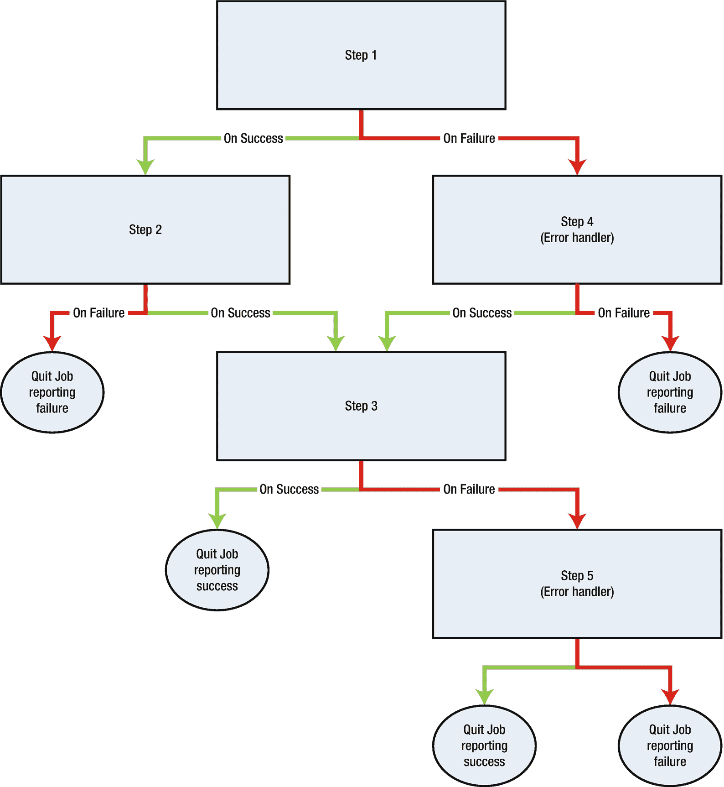

你可以在专为正在配置的作业创建的计划上运行每个作业，也可以在多个作业之间共享计划（这些作业都应在同一计划上运行）。

你还可以为每个作业配置通知。通知会向操作员提醒作业的成功或失败，但你也可以配置它将条目写入 Windows 应用程序事件日志，甚至删除该作业。

##### 警报

`Alerts`（警报）响应写入 Windows 应用程序事件日志的 SQL Server 中发生的事件。警报可以响应以下类别的活动：

*   SQL Server 事件
*   SQL Server 性能条件
*   WMI 事件

当你针对 SQL Server 事件类别创建警报时，可以配置它响应特定的错误消息或发生的特定错误严重级别。你还可以过滤警报，使其仅在错误或警告包含特定文本时触发。它们也可以按发生错误的具体数据库进行过滤。

当你针对 SQL Server 性能条件类别创建警报时，它们的配置使得当计数器低于、等于或高于指定值时触发。配置此类警报时，你需要选择本质上是性能条件类别的性能对象、该性能对象内的计数器，以及你希望针对其发出警报的计数器实例。例如，要触发一个警报，在`Chapter22`数据库的“日志使用百分比”计数器超过 70% 时，你需要选择 Databases（数据库）对象、Percent Log Used（日志使用百分比）计数器和`Chapter22`实例，并配置警报在该计数器超过 70 时触发。运行清单 22-1 中的查询可以显示性能对象及其关联性能计数器的完整列表。

```sql
SELECT
    object_name
    , counter_name
FROM msdb.dbo.sysalerts_performance_counters_view
ORDER BY object_name
-- 清单 22-1
-- 列出性能对象和计数器
```

#### SQL Server Agent 安全性

你通过数据库角色控制对 SQL Server Agent 的访问，并且可以让作业步骤在 SQL Server Agent 服务账户的上下文下运行，或者使用映射到凭据的单独代理账户运行。这两个概念将在以下部分探讨。

##### SQL Server Agent 数据库角色

除了 `sysadmin` 服务器角色的成员（他们拥有对 SQL Server Agent 的完全访问权限）外，可以使用 MSDB 数据库中的固定数据库角色授予对 SQL Server Agent 的访问权限。提供了以下角色：

*   `SQLAgentUserRole`
*   `SQLAgentReaderRole`
*   `SQLAgentOperatorRole`

这些角色提供的权限详见表 22-1。`sysadmin` 角色的成员被授予对 SQL Server Agent 的所有权限。这包括任何 SQL Server Agent 角色都未提供的权限，例如编辑多服务器作业属性。无法通过 SQL Server Agent 角色成员资格执行的操作只能由 `sysadmin` 角色的成员执行。

**表 22-1 SQL Server Agent 权限矩阵**

| 权限 | SQLAgentUserRole | SQLAgentReaderRole | SQLAgentOperatorRole |
| --- | --- | --- | --- |
| `创建`/`更改`/`删除` 操作员 | 否 | 否 | 否 |
| `创建`/`更改`/`删除` 本地作业 | 是（仅限所有者） | 是（仅限所有者） | 是（仅限所有者） |
| `创建`/`更改`/`删除` 多服务器作业 | 否 | 否 | 否 |
| `创建`/`更改`/`删除` 计划 | 是（仅限所有者） | 是（仅限所有者） | 是（仅限所有者） |
| `创建`/`更改`/`删除` 代理 | 否 | 否 | 否 |
| `创建`/`更改`/`删除` 警报 | 否 | 否 | 否 |
| 查看操作员列表 | 是 | 是 | 是 |
| 查看本地作业列表 | 是（仅限所有者） | 是 | 是 |
| 查看多服务器作业列表 | 否 | 是 | 是 |
| 查看计划列表 | 是（仅限所有者） | 是 | 是 |
| 查看代理列表 | 是 | 是 | 是 |
| 查看警报列表 | 否 | 否 | 否 |
| 启用/禁用操作员 | 否 | 否 | 否 |
| 启用/禁用本地作业 | 是（仅限所有者） | 是（仅限所有者） | 是 |
| 启用/禁用多服务器作业 | 否 | 否 | 否 |
| 启用/禁用计划 | 是（仅限所有者） | 是（仅限所有者） | 是 |
| 启用/禁用警报 | 否 | 否 | 否 |
| 查看操作员属性 | 否 | 否 | 是 |
| 查看本地作业属性 | 是（仅限所有者） | 是 | 是 |
| 查看多服务器作业属性 | 否 | 是 | 是 |
| 查看计划属性 | 是（仅限所有者） | 是 | 是 |
| 查看代理属性 | 否 | 否 | 是 |
| 查看警报属性 | 否 | 否 | 是 |
| 编辑操作员属性 | 否 | 否 | 否 |
| 编辑本地作业属性 | 否 | 是（仅限所有者） | 是（仅限所有者） |
| 编辑多服务器作业属性 | 否 | 否 | 否 |
| 编辑计划属性 | 否 | 是（仅限所有者） | 是（仅限所有者） |
| 编辑代理属性 | 否 | 否 | 否 |
| 编辑警报属性 | 否 | 否 | 否 |
| 启动/停止本地作业 | 是（仅限所有者） | 是（仅限所有者） | 是 |
| 启动/停止多服务器作业 | 否 | 否 | 否 |
| 查看本地作业历史记录 | 是（仅限所有者） | 是 | 是 |
| 查看多服务器作业历史记录 | 否 | 是 | 是 |
| 删除本地作业历史记录 | 否 | 否 | 是 |
| 删除多服务器作业历史记录 | 否 | 否 | 否 |
| 附加/分离计划 | 是（仅限所有者） | 是（仅限所有者） | 是（仅限所有者） |

##### SQL Server Agent 代理账户

默认情况下，所有作业步骤都在 SQL Server Agent 服务账户的上下文下运行。然而，采用这种方法可能存在安全风险，因为你可能需要授予该服务账户对实例和操作系统内对象的大量权限。对于需要跨服务器访问的作业，需要授予服务账户的权限量尤为重要。

为了减轻这种风险并遵循最小权限原则，你应该考虑使用代理账户。代理在实例级别映射到凭据，并且你可以配置它们仅运行步骤类型的一个子集。例如，你可以配置一个代理能够运行操作系统命令，同时配置另一个代理只能运行 PowerShell 脚本。这意味着你可以减少每个代理所需的权限。

对于脚本步骤类型为 Transact-SQL (T-SQL) 的作业步骤，无法选择代理账户。相反，“以以下用户运行”选项允许你选择一个数据库用户作为运行脚本的安全上下文。此选项使用 T-SQL 中的 `EXECUTE AS` 功能来更改安全上下文。


### 创建 SQL Server 代理作业

在接下来的章节中，我们将创建一个简单的 SQL Server 代理作业，该作业运行一个操作系统命令来删除旧的备份文件。然后，我们将创建一个更复杂的 SQL Server 代理作业，该作业备份数据库并运行一个 PowerShell 脚本来确保 SQL Server 浏览器服务正在运行。然而，在创建 SQL Server 代理作业之前，我们首先需要创建 `Chapter22` 数据库以及在后续章节中使用的安全主体。

你可以在清单 22-2 中找到执行这些任务的脚本。该脚本使用 PowerShell 创建两个域用户：`SQLUser` 和 `WinUser`。然后它使用 `SQLCMD` 来创建 `Chapter22` 数据库，之后为 `SQLUser` 创建一个登录名，并将其映射到具有备份权限的 `Chapter22` 数据库。你可以从 PowerShell ISE（集成脚本环境）或 PowerShell 命令提示符运行该脚本。你应该在 Windows Server 操作系统上运行该脚本；如果你在其他操作系统上运行，则需要手动准备环境。

```powershell
Set-ExecutionPolicy Unrestricted
import-module SQLPS
import-module servermanager
Add-WindowsFeature -Name "RSAT-AD-PowerShell" -IncludeAllSubFeature
New-ADUser SQLUser -AccountPassword (ConvertTo-SecureString -AsPlainText "Pa$$w0rd" -Force) -Server "PROSQLADMIN.COM"
Enable-ADAccount -Identity SQLUser
New-ADUser WinUser -AccountPassword (ConvertTo-SecureString -AsPlainText "Pa$$w0rd" -Force) -Server "PROSQLADMIN.COM"
Enable-ADAccount -Identity WinUser
$perm = [ADSI]"WinNT://SQLServer/Administrators,group"
$perm.psbase.Invoke("Add",([ADSI]"WinNT://PROSQLADMIN/WinUser").path)
invoke-sqlcmd -ServerInstance .\MasterServer -Query "--创建数据库
CREATE DATABASE Chapter22 ;
GO
USE Chapter22
GO
--创建并填充数字表
DECLARE @Numbers TABLE
(
Number        INT
)
;WITH CTE(Number)
AS
(
SELECT 1 Number
UNION ALL
SELECT Number + 1
FROM CTE
WHERE Number < 100
)
INSERT INTO @Numbers
SELECT Number FROM CTE;
--创建并填充名字片段表
DECLARE @Names TABLE
(
FirstName       VARCHAR(30),
LastName        VARCHAR(30)
);
INSERT INTO @Names
VALUES('Peter', 'Carter'),
('Michael', 'Smith'),
('Danielle', 'Mead'),
('Reuben', 'Roberts'),
('Iris', 'Jones'),
('Sylvia', 'Davies'),
('Finola', 'Wright'),
('Edward', 'James'),
('Marie', 'Andrews'),
('Jennifer', 'Abraham');
--创建并填充 Customers 表
CREATE TABLE dbo.Customers
(
CustomerID       INT           NOT NULL    IDENTITY    PRIMARY KEY,
FirstName          VARCHAR(30)   NOT NULL,
LastName           VARCHAR(30)   NOT NULL,
BillingAddressID   INT           NOT NULL,
DeliveryAddressID  INT           NOT NULL,
CreditLimit        MONEY         NOT NULL,
Balance            MONEY         NOT NULL
);
SELECT * INTO #Customers
FROM
(SELECT
(SELECT TOP 1 FirstName FROM @Names ORDER BY NEWID()) FirstName,
(SELECT TOP 1 LastName FROM @Names ORDER BY NEWID()) LastName,
(SELECT TOP 1 Number FROM @Numbers ORDER BY NEWID()) BillingAddressID,
(SELECT TOP 1 Number FROM @Numbers ORDER BY NEWID()) DeliveryAddressID,
(SELECT TOP 1 CAST(RAND() * Number AS INT) * 10000
FROM @Numbers
ORDER BY NEWID()) CreditLimit,
(SELECT TOP 1 CAST(RAND() * Number AS INT) * 9000
FROM @Numbers
ORDER BY NEWID()) Balance
FROM @Numbers a
) a;
--创建 SQLUser 登录和数据库用户
USE Master
GO
CREATE LOGIN [PROSQLADMIN\sqluser] FROM WINDOWS WITH DEFAULT_DATABASE=Chapter22 ;
GO
USE Chapter22
GO
CREATE USER [PROSQLADMIN\sqluser] FOR LOGIN [PROSQLADMIN\sqluser] ;
GO
--将 SQLUser 添加到 db_backupoperator 角色
ALTER ROLE db_backupoperator ADD MEMBER [PROSQLADMIN\sqluser] ;
GO"
清单 22-2
准备环境
```

### 创建简单的 SQL Server 代理作业

我们首先创建一个简单的代理作业，该作业使用操作系统命令删除超过 30 天的备份文件，并将此作业安排为每月运行一次。我们使用“新建作业”对话框创建 SQL Server 代理对象。要调用此对话框，请在对象资源管理器中浏览到 `SQL Server 代理`，并从“作业”上下文菜单中选择“新建作业”。图 22-2 说明了“新建作业”对话框的“常规”页面。

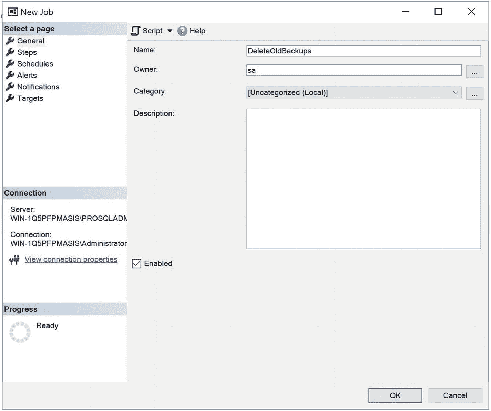
图 22-2 常规页面

在此页面上，我们将作业命名为 `DeleteOldBackups`，并将作业所有者更改为 `sa` 帐户。我们还可以选择添加作业的描述并选择一个类别。

在“步骤”页面上，我们使用“新建”按钮调用“新建作业步骤”对话框。此对话框的“常规”选项卡如图 22-3 所示。

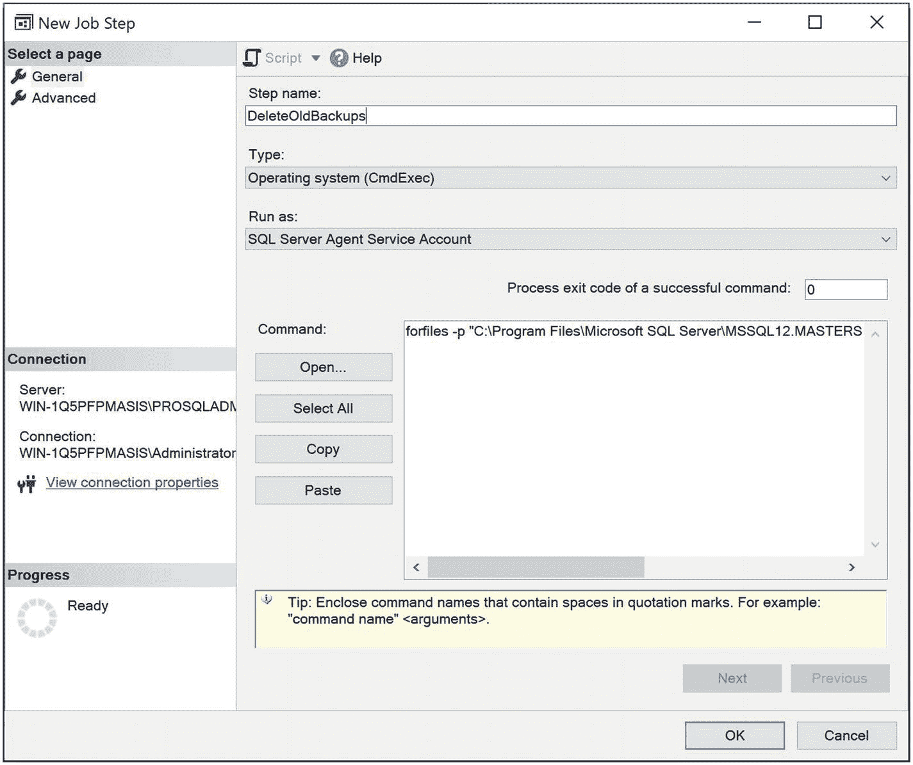
图 22-3 常规页面

在此页面上，我们为作业步骤指定一个名称，在“类型”下拉列表中指定该步骤是操作系统命令，并在“运行身份”下拉列表中确认该步骤在 SQL Server 代理服务帐户的安全上下文下运行。在“命令”部分，我们输入一个批处理命令，该命令从我们的默认备份位置删除所有超过 30 天且文件扩展名为 `.bak` 的文件。你可以在清单 22-3 中找到此批处理命令。

```cmd
forfiles -p "C:\Program Files\Microsoft SQL Server\MSSQL12.MASTERSERVER\MSSQL\Backup" -s -m *.bak /D -30 /C "cmd /c del @path"
清单 22-3
删除旧备份
```

在“新建作业步骤”对话框的“高级”页面（如图 22-4 所示）中，我们保留默认设置。然而，在更复杂的场景中，我们可以使用此页面来配置日志记录和控制决策树逻辑。我们将在下一节中讨论这一点。

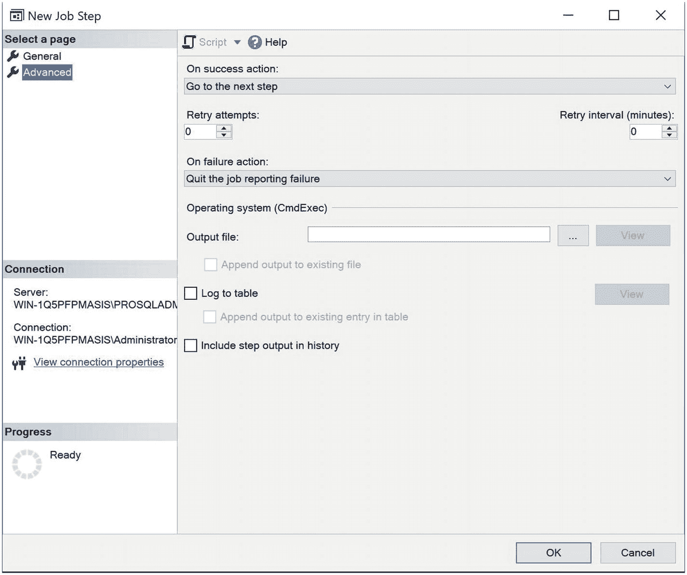
图 22-4 高级页面

一旦配置了作业步骤，我们就可以退出“新建作业步骤”对话框并返回到“新建作业”对话框。现在，我们转到“计划”页面。在此页面上，我们使用“新建”按钮调用“新建作业计划”对话框，如图 22-5 所示。

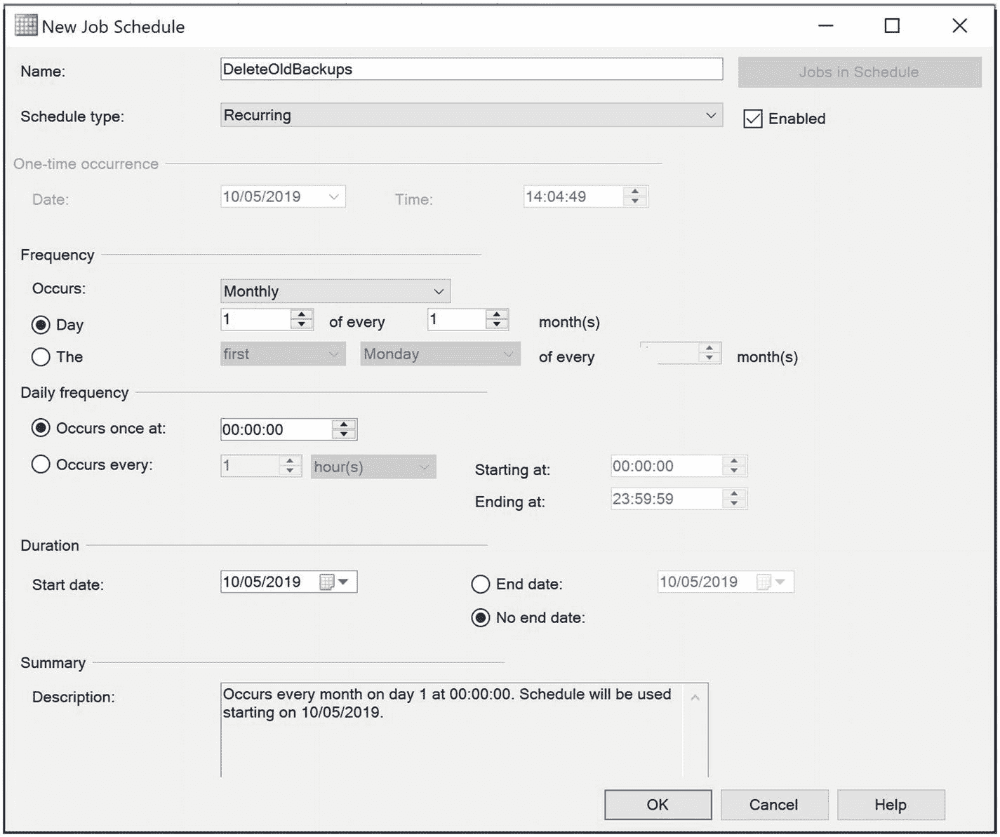
图 22-5 “新建作业计划”对话框

在“新建作业计划”对话框中，我们首先输入计划的名称。默认计划类型是“重复出现”，但如果我们选择其他选项，屏幕会动态变化。在屏幕的“频率”部分，我们选择“每月”。同样，如果我们在该下拉列表中选择“每周”或“每天”，屏幕也会动态变化。

我们现在可以配置希望计划调用作业执行的日期和时间。在我们的场景中，我们保留午夜、每月第一天的默认选项。

在“新建作业”对话框的“通知”页面上，我们配置希望在作业完成时发生的任何操作。如图 22-6 所示，我们配置了一个条目，如果作业失败，则写入 Windows 应用程序日志。如果你的企业由 SCOM 等监控工具管理，这是一个特别有用的选项，因为你可以配置 SCOM 监控 Windows 应用程序日志中的失败条目并向 DBA 团队发送警报。在下一节中，我们将讨论如何直接从 SQL Server 代理配置电子邮件通知。

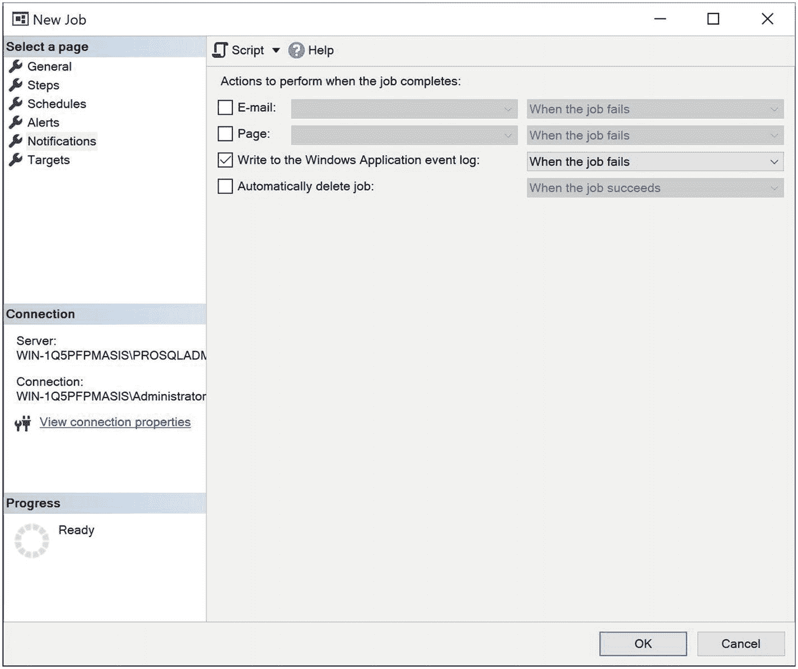
图 22-6 通知页面


#### 创建复杂的 SQL Server Agent 作业

在以下章节中，我们将创建一个更复杂的 SQL Server Agent 作业，该作业用于备份 `Chapter22` 数据库。然后，该作业将检查 `SQL Server Browser` 服务是否正在运行。我们使用 `Run As` 来设置 T-SQL 作业步骤运行的上下文，并使用代理来运行 `PowerShell` 作业步骤。我们还将配置 `Database Mail`，以便可以在作业成功或失败时通知操作员，并将作业设置为定期运行。您还可以了解如何使用 T-SQL 创建 `SQL Server Agent` 对象，这在您于 `Server Core` 环境中工作时可能很有用。

##### 创建凭据

现在我们的环境已准备就绪，我们创建一个 `SQL Server Agent` 作业，该作业首先备份 `Chapter22` 数据库。然后，该作业将检查以确保 `SQL Server Browser` 服务正在运行。检查浏览器服务是否正在运行是一种有用的做法，因为如果它停止，那么应用程序只有在其连接字符串中指定实例的端口号才能连接到该实例。我们在 `SQL User` 的上下文下将备份作为 T-SQL 命令运行，并使用 `WinUser` 帐户通过 `PowerShell` 检查浏览器服务是否正在运行。因此，我们的第一步是创建一个使用 `WinUser` 帐户的凭据。我们可以在 `SQL Server Management Studio` 中通过浏览到 `Security` 并从 `Credentials` 上下文菜单中选择 `New Credential` 来实现这一点。这将调用 `New Credential` 对话框，如图 22-7 所示。

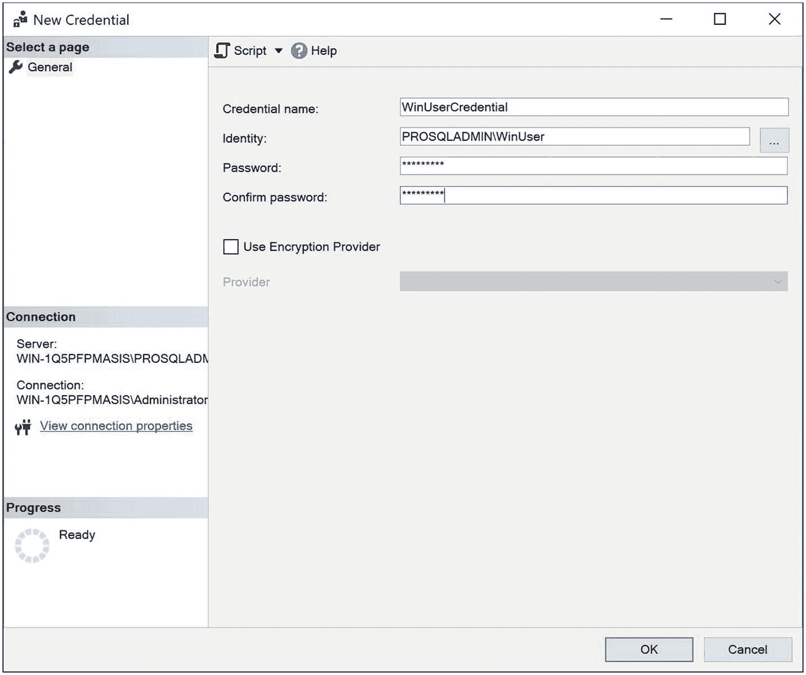
图 22-7：新建凭据对话框

在此对话框中，使用 `Credential Name` 字段指定新凭据的名称。在 `Identity` 字段中，指定您希望使用的 Windows 安全主体的名称，然后在 `Password` 和 `Confirm Password` 字段中输入 Windows 密码。您还可以将凭据链接到 `EKM` 提供程序。如果您希望这样做，请勾选 `Use Encryption Provider` 并从下拉列表中选择您的提供程序。`EKM` 将在第 11 章中进一步讨论。

##### 创建代理

接下来，让我们创建一个使用此凭据的 `SQL Server Agent` 代理帐户。我们配置此代理帐户能够运行 `PowerShell` 作业步骤。我们可以通过 `SSMS` 浏览到 `Object Explorer` 中的 `SQL Server Agent`，然后从 `Proxies` 上下文菜单中选择 `New Proxy` 来实现这一点。这将显示 `New Proxy Account` 对话框的 `General` 页面，如图 22-8 所示。

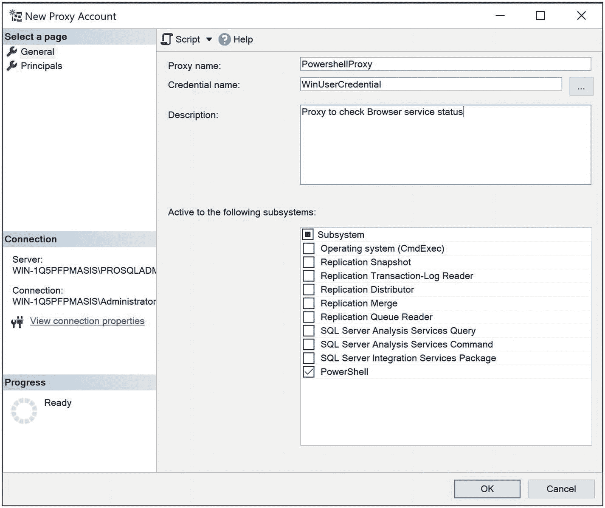
图 22-8：新建代理帐户对话框

在此页面上，我们为代理帐户指定一个名称并提供描述。我们使用 `Credential Name` 字段选择我们的 `WinUserCredential` 凭据，然后使用 `Active To The Following Subsystems` 部分授权该代理运行 `PowerShell` 作业步骤。

#### 提示

如果您从 `Object Explorer` 的 `Proxies` 节点下相关子系统的节点进入新的代理帐户，则对话框内会自动选择相关的子系统。

在 `Principals` 页面上，我们可以添加有权使用该代理的登录名或服务器角色。在我们的案例中，这不是必需的，因为我们使用管理员帐户运行 `SQL Server`，而管理员自动拥有代理帐户的权限。

##### 创建计划

现在我们的代理帐户已配置完毕，我们创建作业要使用的计划。我们需要维护作业在每晚运行，因此我们将计划配置为每天凌晨 1 点运行。要从 `SSMS` 调用 `New Job Schedule` 对话框，我们在 `Object Explorer` 中从 `SQL Server Agent` 上下文菜单中选择 `New` > `Schedule`。此对话框如图 22-9 所示。

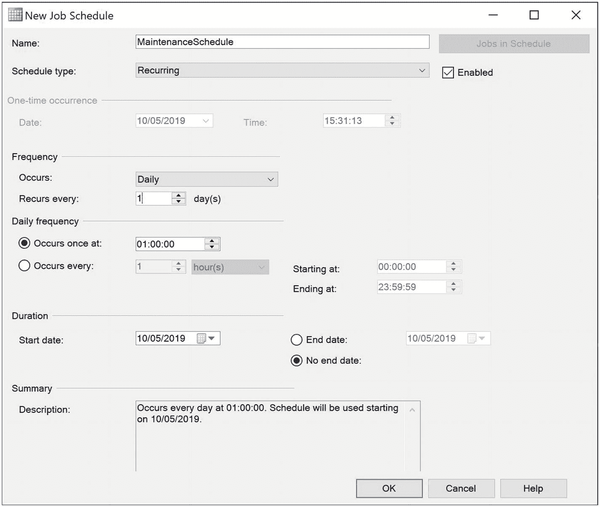
图 22-9：新建作业计划对话框

在此对话框中，我们在 `Name` 字段中指定计划的名称，并在 `Schedule Type` 字段中选择计划的条件。选择 `Recurring` 以外的任何条件将导致 `Frequency` 和 `Duration` 部分变为不可用。选择 `One Time` 以外的任何条件将导致 `One-Time Occurrence` 部分变为不可用。我们还确保勾选 `Enabled` 框，以便可以使用该计划。

在 `Frequency` 部分，我们在 `Occurs` 下拉列表中选择 `Daily`。我们在此字段中的选择会导致 `Frequency` 和 `Daily Frequency` 部分中的选项根据我们的选择动态更改。由于我们希望计划每天凌晨 1 点运行，因此我们确保在 `Recurs Every` 字段中指定 `1`，并将 `Occurs Once At` 字段更改为 `1 AM`。因为我们希望作业立即开始运行且永不过期，所以我们不需要编辑 `Duration` 部分中的字段。

##### 配置数据库邮件

我们希望如果作业失败，能通知到我们的 DBA 邮件列表。因此，我们需要创建一个操作员。然而，在此之前，我们需要在实例上配置 `Database Mail`，以便可以发送通知。我们的第一步是启用 `Database Mail` 扩展存储过程，这些过程默认是禁用的，以减少攻击面。我们可以使用 `sp_configure` 来激活它们，如清单 22-4 所示。


#### 注意

如果您没有访问 SMTP 中继服务器的权限，那么本节中的示例仍然有效，但您将不会收到电子邮件。

```sql
EXEC sp_configure 'show advanced options', 1 ;
GO
RECONFIGURE
GO
EXEC sp_configure 'Database Mail XPs', 1 ;
GO
RECONFIGURE
GO
清单 22-4
启用 Database Mail XPs
```

现在，我们可以通过在对象资源管理器中浏览到“管理”，然后选择“Database Mail”来启动“数据库邮件配置向导”。在通过欢迎页面后，我们将看到如图 22-10 所示的“选择配置任务”页面。

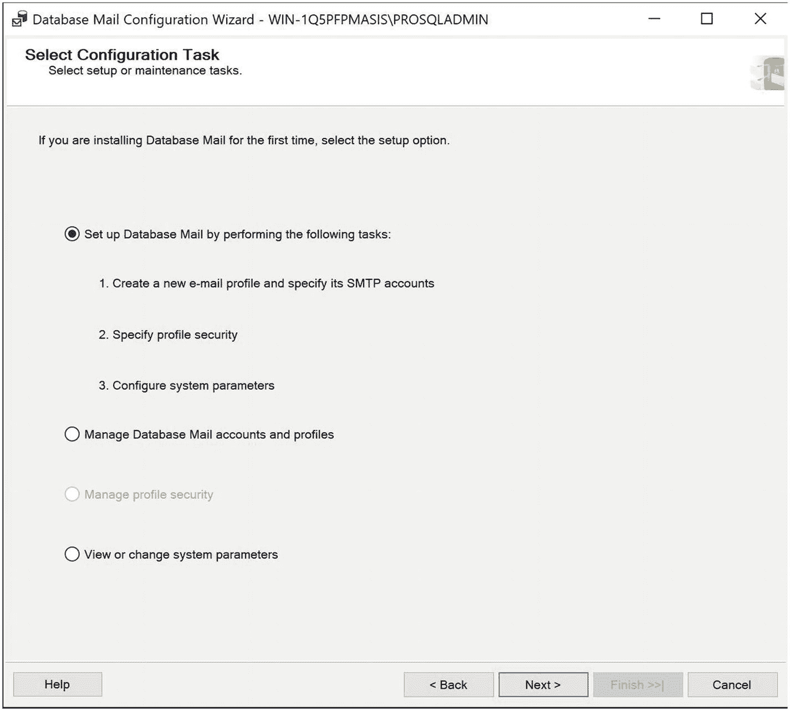

图 22-10 “选择配置任务”页面

在此页面上，我们应确保选中了 `通过执行以下任务设置数据库邮件` 选项。在“新建配置文件”页面上，我们指定配置文件的名称。配置文件是一个或多个邮件帐户的别名，用于向操作员发送通知。最佳实践是向一个配置文件添加多个帐户；这样，如果一个帐户失败，您可以使用另一个。此页面如图 22-11 所示。

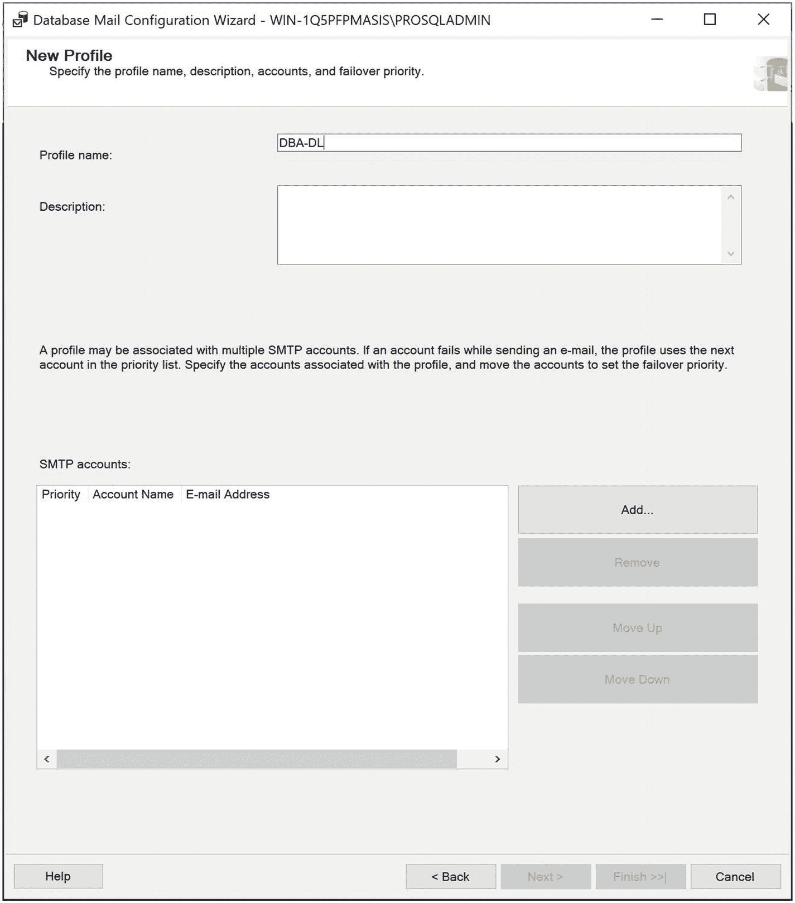

图 22-11 “新建配置文件”页面

现在，让我们使用“添加”按钮，通过如图 22-12 所示的“新建数据库邮件帐户”对话框，向配置文件中添加一个或多个 SMTP（简单邮件传输协议）电子邮件帐户。

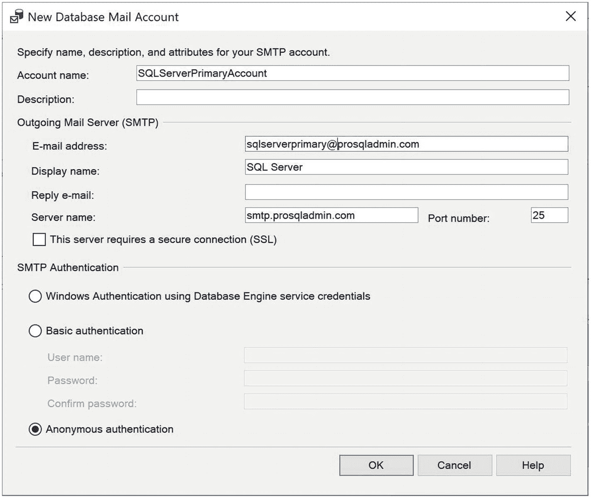

图 22-12 “新建数据库邮件帐户”对话框

在此对话框中，我们指定帐户的名称和可选的描述。然后，我们需要指定用于发送邮件的电子邮件地址，以及将传递邮件的 SMTP 服务器的名称和端口。您还可以指定接收电子邮件时显示的显示名称。对于接收通知的 DBA 来说，如果显示名称包含生成通知的 `服务器\实例`，将会很有帮助。我们选择了匿名身份验证。这意味着对 SMTP 服务器的访问是通过防火墙规则控制的，而不是通过身份验证。这在企业环境中是相对常见的方法。

添加帐户后，我们可以转到向导的“管理配置文件安全性”页面。此页面有两个选项卡：“公共配置文件”和“专用配置文件”。我们将配置文件配置为公共的，并将其标记为默认配置文件。将配置文件公开意味着任何有权访问 MSDB 数据库的用户都可以使用该配置文件发送电子邮件。如果我们将配置文件设为专用，则需要指定可以使用该配置文件发送电子邮件的用户或角色列表。将配置文件标记为默认配置文件会将该配置文件设为该用户或角色的默认配置文件。每个用户或角色可以有一个默认配置文件。“公共配置文件”选项卡如图 22-13 所示。

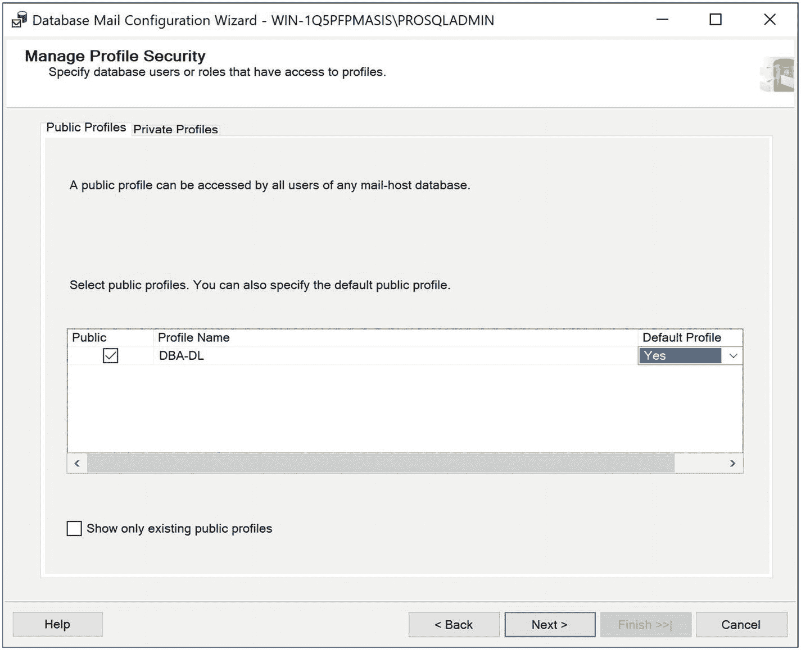

图 22-13 “公共配置文件”选项卡

在向导的“配置系统参数”页面上，如图 22-14 所示，您可以更改默认系统属性，这些属性控制邮件的处理方式。这包括指定帐户应重试的次数以及重试之间的时间间隔。它还涉及设置电子邮件的最大允许大小以及配置文件扩展名黑名单。`数据库邮件可执行文件最短生存期（秒）` 设置配置当队列中没有等待发送的电子邮件时，数据库邮件进程应保持活动状态的时间。可以使用以下设置配置日志记录级别：

*   `常规`：记录错误
*   `扩展`：记录错误、警告和信息性消息
*   `详细`：记录错误、警告、信息性消息、成功消息和内部消息

#### 注意

遗憾的是，附件排除是作为黑名单实现的，而不是白名单。这意味着，为了实现安全性和操作支持的最佳平衡，您应该花时间并认真考虑应排除的文件类型。

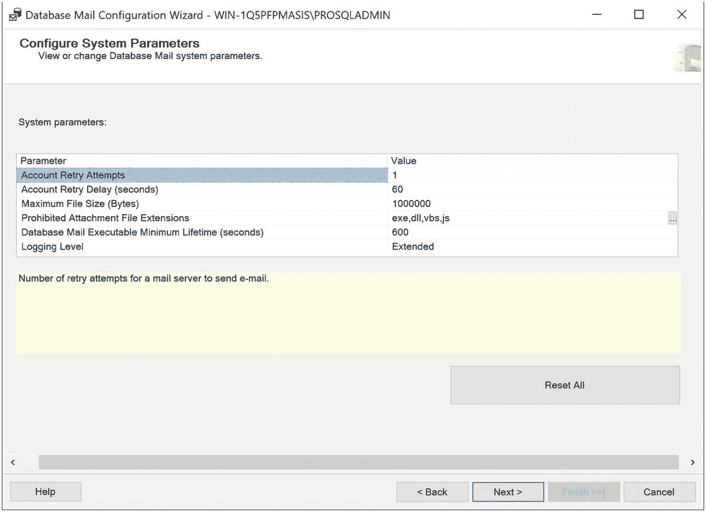

图 22-14 “配置系统参数”页面

在“完成向导”页面上，系统会提供将要执行的任务摘要。在我们的场景中，这包括创建新帐户、创建新配置文件、将帐户添加到配置文件以及配置配置文件的安全性。

我们现在需要配置 SQL Server 代理以使用我们的邮件配置文件。为此，我们在对象资源管理器中右键单击 SQL Server 代理的上下文菜单，选择“属性”以调用“SQL Server 代理属性”对话框，并导航到“警报系统”页面，如图 22-15 所示。

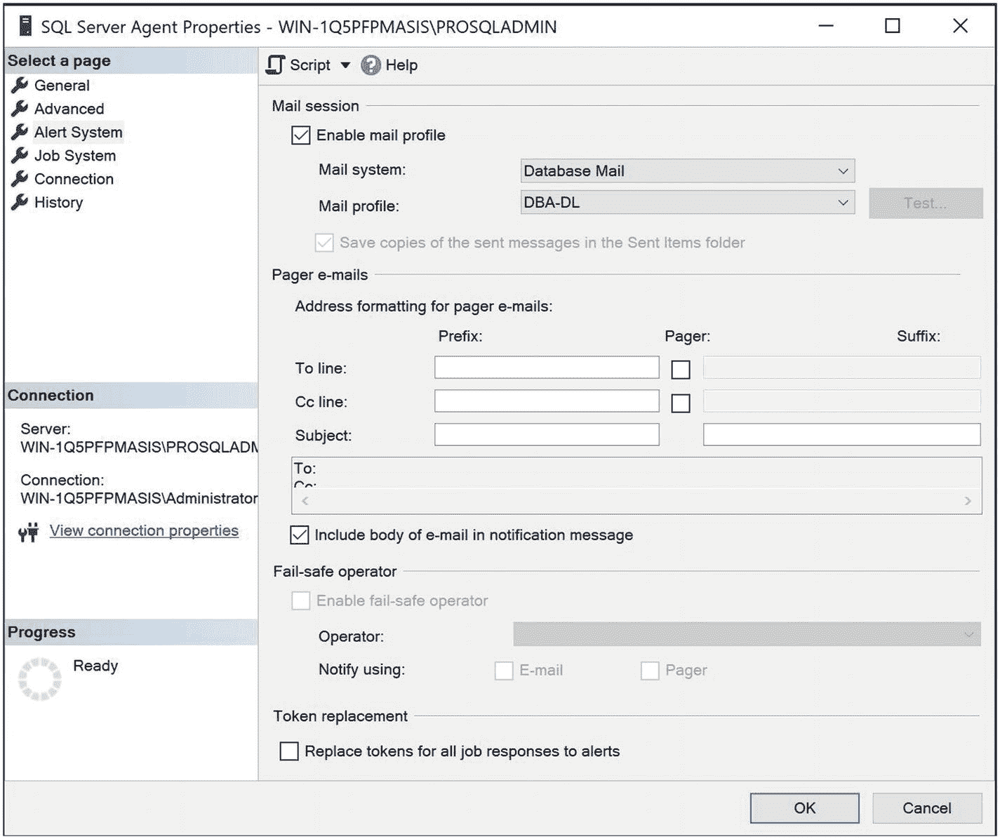

图 22-15 “警报系统”页面

在此页面上，我们选中“启用邮件配置文件”复选框，然后从下拉列表中选择 `DBA-DL` 配置文件。退出对话框后，操作员就可以使用数据库邮件了。

##### 创建操作员

既然数据库邮件已配置好，我们需要创建一个操作员，以便在作业失败时接收电子邮件。我们可以通过在对象资源管理器中浏览到 SQL Server 代理，然后从“操作员”上下文菜单中选择“新建操作员”来访问“新建操作员”对话框。“新建操作员”对话框的“常规”页面如图 22-16 所示。

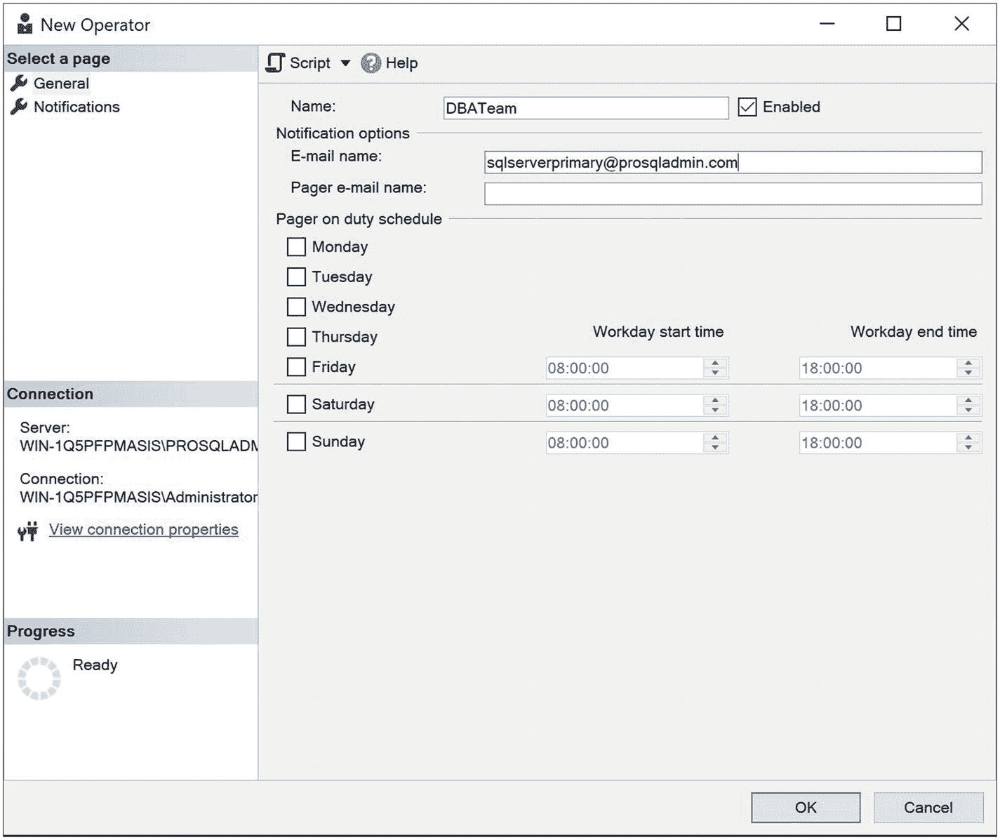

图 22-16 “常规”页面

在此页面上，我们指定操作员的名称，并添加操作员将使用的电子邮件地址。这必须与在数据库邮件中配置的电子邮件地址匹配。“通知”页面显示已为操作员配置的警报和通知的详细信息，因此目前与我们无关。

##### 创建作业

现在所有先决条件都已就绪，我们可以开始创建 SQL Server Agent 作业了。在 SQL Server Management Studio 中，我们可以通过依次展开对象资源管理器中的 `SQL Server Agent`，然后从“作业”上下文菜单中选择“新建作业”来完成此操作。这将打开“新建作业”对话框的“常规”页面，如图 22-17 所示。

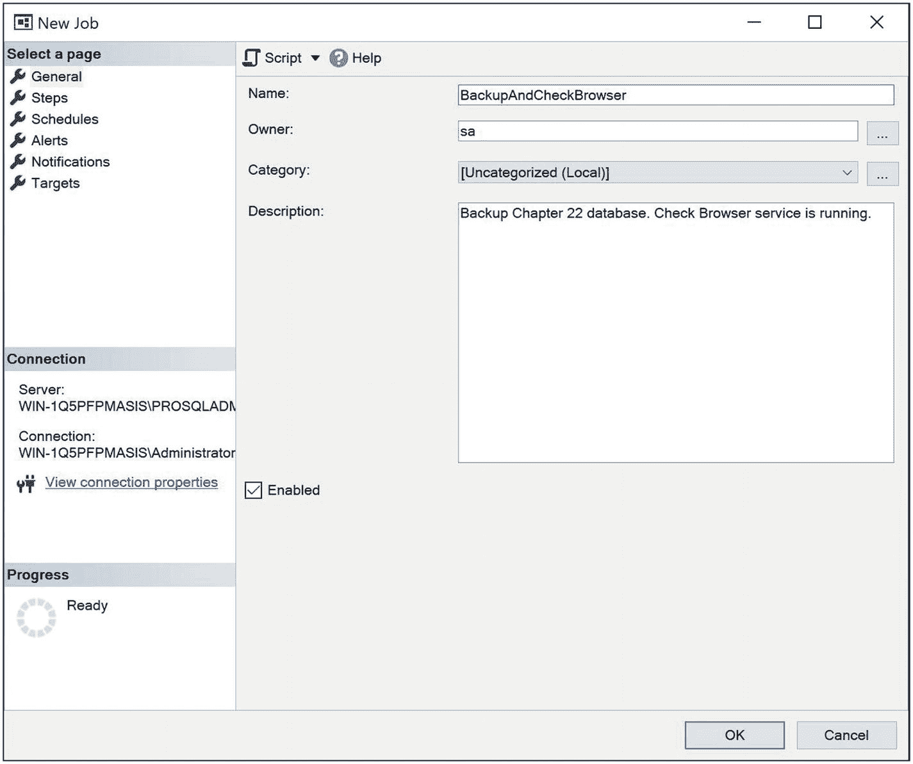
*图 22-17: 常规页面*

在此页面上，我们使用“名称”字段为作业指定一个名称，并可以选择在“描述”字段中添加说明。将作业归入某个类别也是可选的；在我们的示例中，我们通过从下拉列表中选择，将作业添加到了“数据库维护”类别。我们还选中了“已启用”复选框，以便作业在创建后立即处于活动状态。

我们还指定作业所有者为 `sa`。这是一个有争议的话题，但我通常推荐这种方法，原因如下：作业所有权并不那么重要。无论谁拥有该作业，其功能都是相同的。但是，如果所有者的账户被删除，那么作业将不再运行。如果将 `sa` 设置为所有者，则这种情况就不会发生。但是，如果您使用的是 Windows 身份验证模型（而非混合模式身份验证），那么使用 SQL Server Agent 服务账户作为替代是合理的。这是因为，尽管您更改服务账户并删除关联登录名的可能性存在，但这比删除其他用户登录名的可能性（例如 DBA 离职时删除其登录名）要小。

在对话框的“步骤”页面上，我们使用“新建”按钮来添加第一个步骤——备份 `Chapter22` 数据库。“新建作业步骤”对话框的“常规”页面如图 22-18 所示。

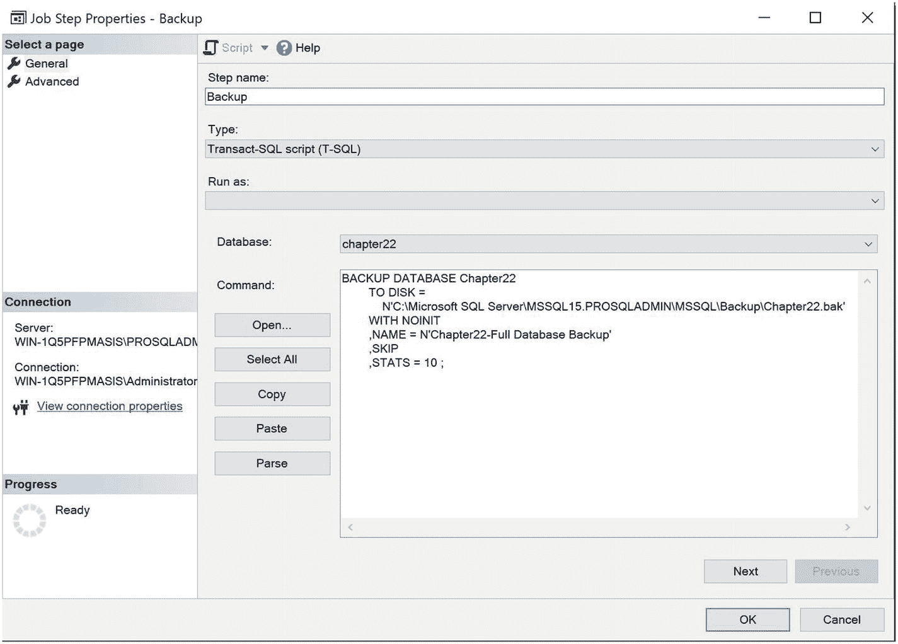
*图 22-18: “新建作业步骤”对话框的常规页面*

在此页面上，我们输入 `Backup` 作为作业步骤的名称，并在“命令”字段中键入 `BACKUP DATABASE` 命令。“类型”字段允许我们选择要使用的子系统，但它默认为 `T-SQL`，因此我们不需要更改此项。清单 22-5 包含了备份脚本。

#### 提示
务必要在将脚本添加到作业之前对其进行测试。

```
BACKUP DATABASE Chapter22
TO DISK =
N'C:\Microsoft SQL Server\MSSQL15.PROSQLADMIN\MSSQL\Backup\Chapter22.bak'
WITH NOINIT
,NAME = N'Chapter22-Full Database Backup'
,SKIP
,STATS = 10 ;
```
*清单 22-5: 备份脚本*

在如图 22-19 所示的“高级”页面上，我们使用“成功时的操作”和“失败时的操作”下拉框来配置该步骤，使其无论成功或失败都转到下一步。我们这样做是因为我们的两个步骤是相互独立的。我们还配置该步骤在失败前重试三次，间隔为 1 分钟。

我们选中“在历史记录中包含步骤输出”复选框，以便将步骤输出包含在作业历史记录中（这有助于 DBA 排查任何问题），并配置该步骤以 `SQLUser` 用户身份运行。我们配置“以以下用户身份运行”选项是因为，如前所述，`T-SQL` 类型的作业步骤使用 `EXECUTE AS` 技术（而不是代理账户）来实现安全性。

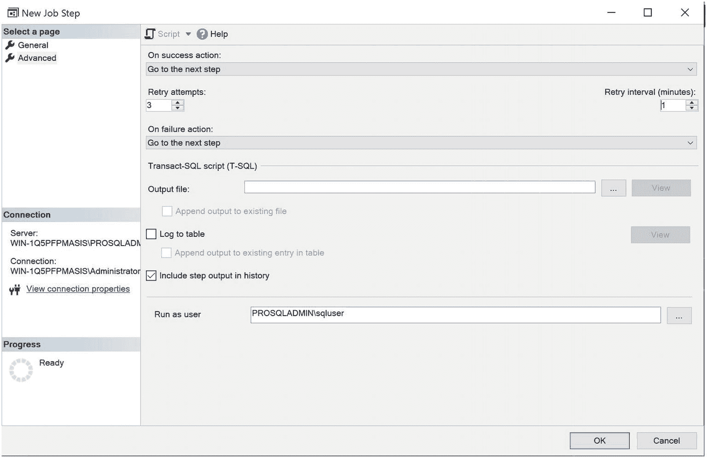
*图 22-19: 高级页面*

关闭对话框后，我们需要再次使用“新建作业”对话框“步骤”页面上的“新建”按钮来添加第二个作业步骤。这一次，在“常规”页面上，我们指定 `PowerShell` 类型并输入用于检查 SQL Server Browser 服务状态的 PowerShell 脚本。我们还使用“运行身份”框指定该步骤在 `PowerShellProxy` 代理的上下文中运行，如图 22-20 所示。清单 22-6 显示了我们使用的命令。

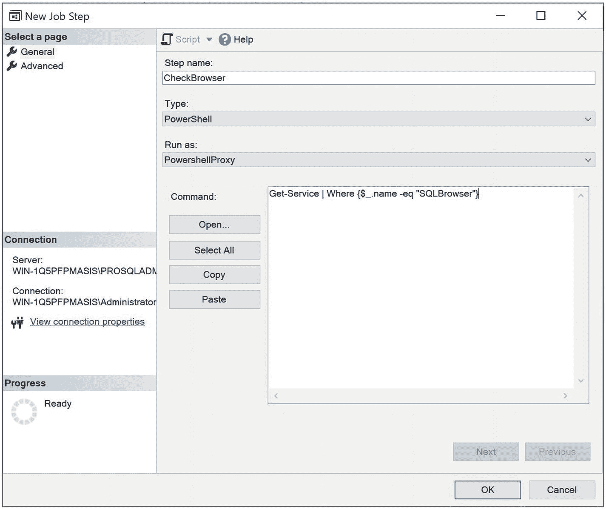
*图 22-20: 常规页面*

```
Get-Service | Where {$_.name -eq "SQLBrowser"}
```
*清单 22-6: 检查 Browser 服务*

在“高级”页面上，我们选择将步骤输出包含在作业历史记录中。我们可以将所有其他选项保留为其默认值。

当我们返回到“新建作业”对话框的“步骤”页面时，会看到两个步骤按正确的顺序列出，如图 22-21 所示。但是，如果我们希望更改步骤的顺序，可以使用“移动步骤”部分中的上箭头和下箭头。我们还可以通过使用“起始步骤”下拉列表选择从后面的步骤开始作业来跳过前面的步骤。

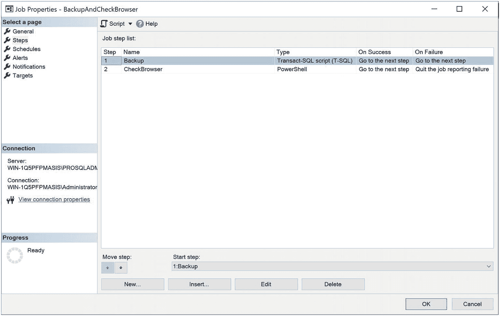
*图 22-21: 步骤页面*

在向导的“计划”页面上，我们单击“选取”按钮；这将显示“为作业选取计划”对话框中现有的计划列表（参见图 22-22）。我们使用此对话框来选择我们的维护计划。

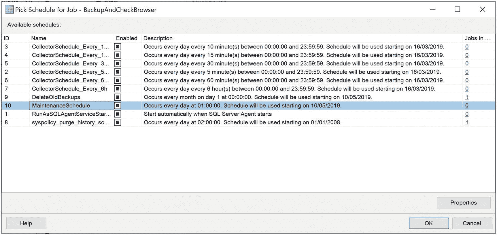
*图 22-22: “为作业选取计划”对话框*

关闭对话框后，计划将显示在“作业属性”对话框的“计划”页面上。

您可以使用“警报”页面来为作业配置警报。这与我们当前的场景无关，但本章后面会讨论警报。

在“通知”页面上，我们配置希望当作业失败时通过电子邮件收到通知的 `DBATeam` 操作员。我们通过选中“电子邮件”复选框并从下拉列表中选择我们的 `DBATeam` 操作员来实现，如图 22-23 所示。

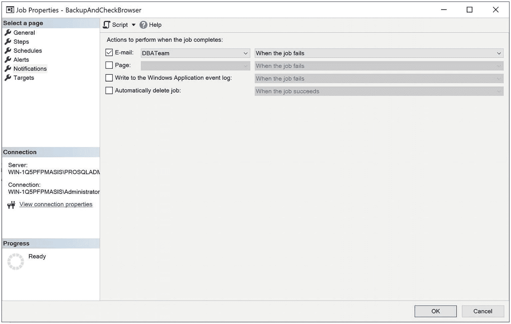
*图 22-23: 通知页面*

您可以使用“目标”页面来配置多服务器作业，这与我们当前的场景无关，但我们将在本章后面讨论它们。

##### 监控与管理作业

尽管作业通常被安排为自动运行，但您仍然会遇到监控和维护需求，例如手动执行作业和查看作业历史记录。以下部分将讨论这些任务。


### 执行作业

即使作业被设置为自动运行，有时您也可能希望按需执行它。例如，如果您有一个被安排每晚运行以对实例中的数据库进行完整备份的作业，您可能希望在代码发布或软件升级之前手动执行一次。

在 SQL Server Management Studio 中，可以通过在对象资源管理器中浏览到 **SQL Server 代理** ➤ **作业**，然后从作业的上下文菜单中选择“**启动作业**”来手动执行作业；这样做会调用“启动作业”对话框。图 22-24 显示了 BackupAndCheckBrowser 作业的“启动作业”对话框。在此对话框中，您可以在使用“启动”按钮执行作业之前，选择要运行的作业的第一步。

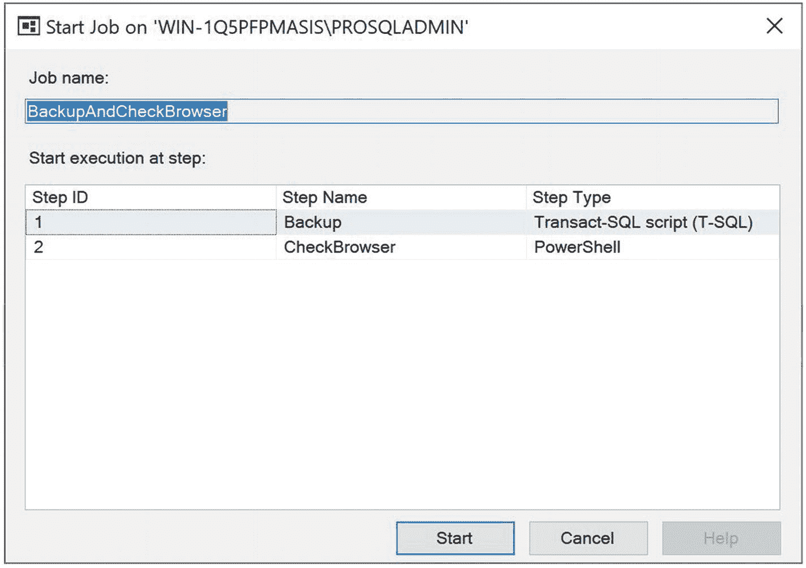

图 22-24
启动作业对话框

要使用 T-SQL 执行作业，您可以使用 `sp_start_job` 系统存储过程。此过程接受表 22-2 中详述的参数。

表 22-2
sp_start_job 参数

| 参数 | 描述 |
| --- | --- |
| `@job_name` | 要执行的作业的名称。如果为 `NULL`，则必须指定 `@job_id` 参数。 |
| `@job_id` | 要执行的作业的 ID。如果为 `NULL`，则必须指定 `@job_name` 参数。 |
| `@server_name` | 用于多服务器作业。指定在其上运行作业的目标服务器。 |
| `@step_name` | 开始执行的作业步骤的名称。 |

要运行我们的 BackupAndCheckBrowser 作业，我们执行清单 22-7 中的命令。一旦作业被执行，在它完成之前无法再次启动。

```
EXEC sp_start_job @job_name=N'BackupAndCheckBrowser' ;
```

清单 22-7
执行作业

如果我们希望作业从后面的步骤开始执行，可以使用 `@step_name` 参数。例如，在我们的场景中，假设我们希望执行作业以检查 SQL Server Browser 服务是否正在运行，但不希望数据库备份在之前发生。为此，我们执行清单 22-8 中的命令。

```
EXEC sp_start_job @job_name=N'BackupAndCheckBrowser', @step_name = 'CheckBrowser' ;
```

清单 22-8
从特定步骤启动作业

### 查看作业历史记录

您可以通过在对象资源管理器中的 **SQL Server 代理** ➤ **作业**下，从作业上下文菜单中选择“**查看历史记录**”来查看特定作业的作业历史记录，或者通过打开“**作业活动监视器**”（您可以在对象资源管理器的 **SQL Server 代理**节点下找到它）来查看所有作业的历史记录。图 22-25 显示了在我们的 BackupAndCheckBrowser 作业执行一次后，其作业历史记录的样子。

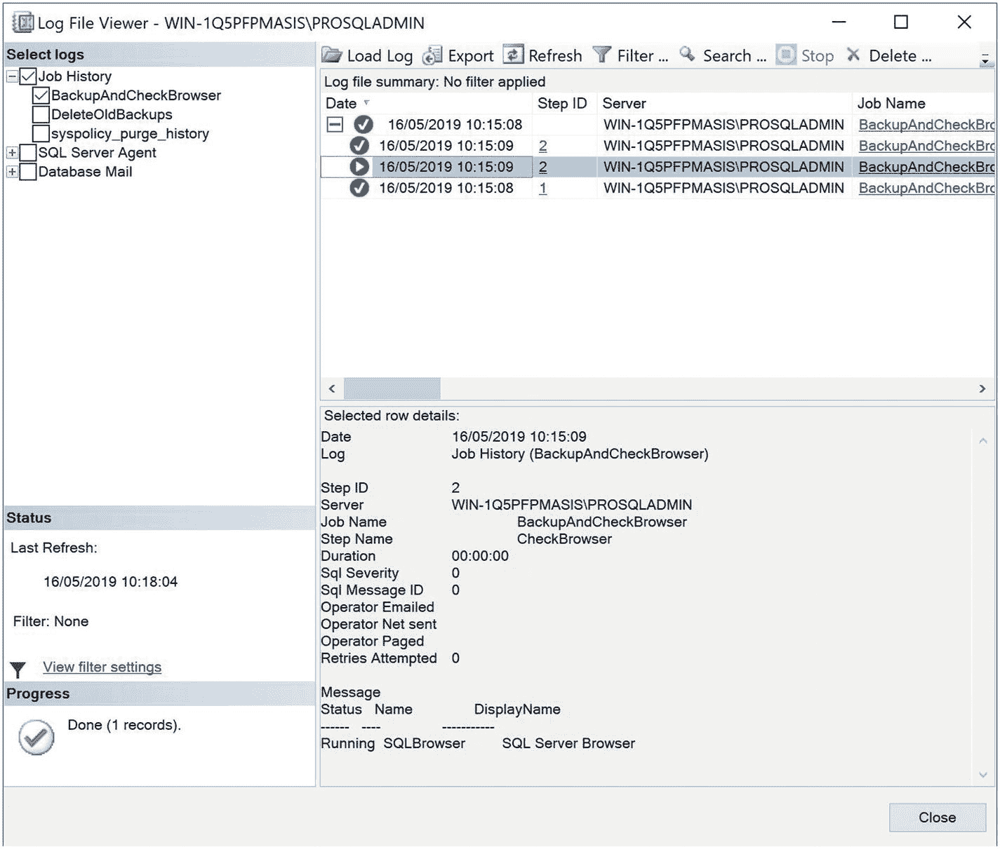

图 22-25
作业历史记录

在这里，您可以看到我们浏览了“作业历史记录”以查看每个单独步骤的历史记录。突出显示第 2 步的进度条目后，我们可以看到 PowerShell 脚本的结果已写入步骤历史记录，并且它们显示 SQL Server Browser 服务正如预期那样正在运行。

### 创建警报

创建警报允许您通过通知操作员、运行作业或两者兼而有之，来主动响应实例中发生的状况。在我们的实例上，我们希望在 `Chapter22` 日志文件使用率超过 75% 时通知 DBATeam 操作员。

要在 SQL Server Management Studio 中创建此警报，我们浏览对象资源管理器中的 **SQL Server 代理**，从“**警报**”上下文菜单中选择“**新建警报**”。这将显示“新建警报”对话框的“常规”页面。此页面如图 22-26 所示。

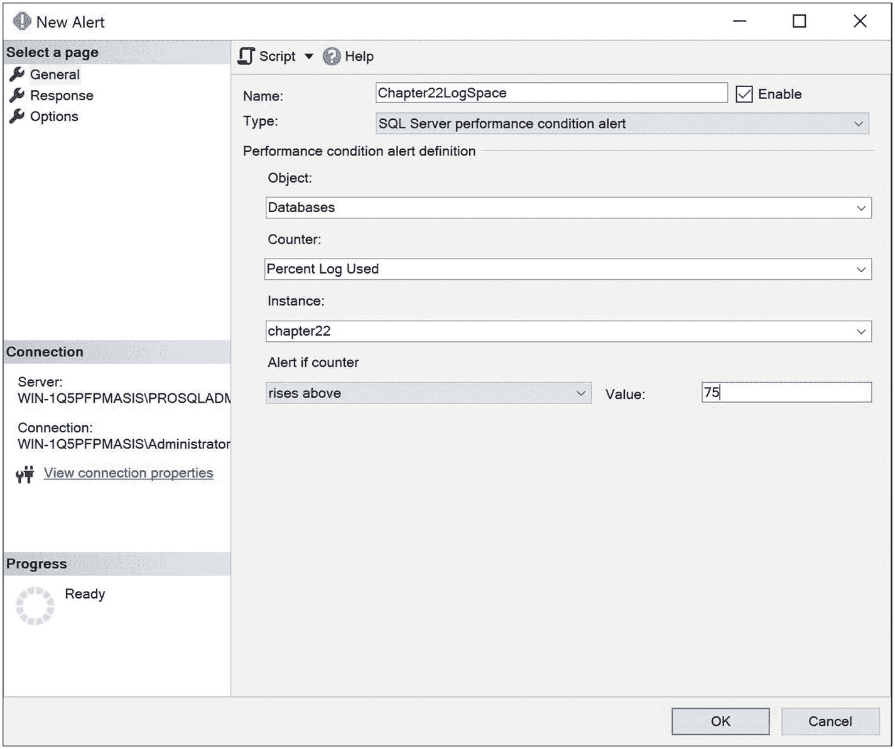

图 22-26
常规页面

在此对话框页面上，我们使用“**名称**”字段为警报指定名称，并从“**类型**”下拉列表中选择“**SQL Server 性能条件警报**”。这会导致页面内的选项动态更新。然后，我们从“**数据库**”对象中选择“**日志已用百分比**”计数器，并指定我们对该对象的 `Chapter22` 实例感兴趣。（此计数器针对实例上的每个数据库都有一个实例。）最后，我们指定当此计数器的值在页面的“**警报条件**”部分上升到 75 以上时应触发警报。

在对话框的“**响应**”页面上（如图 22-27 所示），如果条件满足，我们选中“**通知操作员**”框，然后为我们的 DBATeam 操作员选择电子邮件通知。

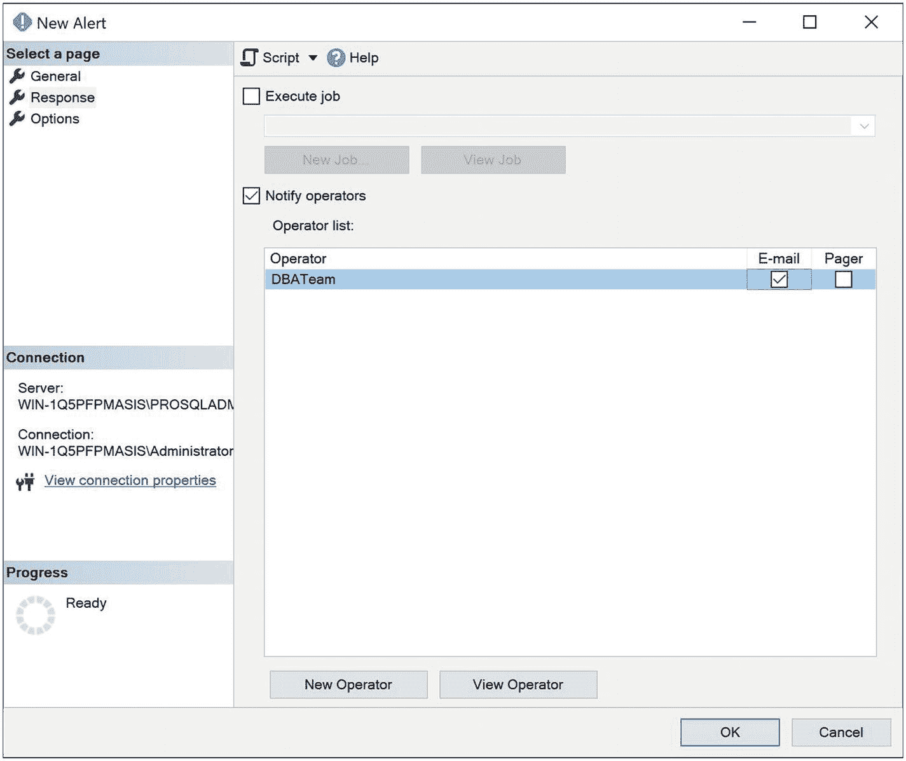

图 22-27
响应页面

在对话框的“**选项**”页面上，您可以指定是否应在通知中包含警报错误文本，以及要包含的附加信息。您还可以配置在响应被触发后发生延迟。这可以帮助您避免重复通知或不必要地运行作业来修复已经正在解决的问题。图 22-28 显示我们在通知中包含了服务器\实例名称以帮助 DBA 识别警报来源。

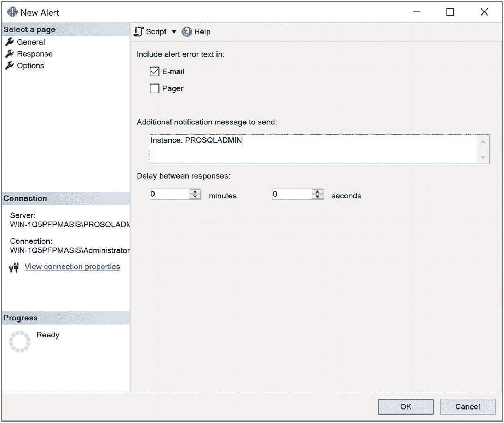

图 22-28
选项页面

### 多服务器作业

使用多服务器管理可以极大地简化管理。在多服务器环境中，您可以将一个实例配置为主服务器 (MSX)，然后将其他服务器配置为目标服务器 (TSX)。然后，您可以在 MSX 上创建一组维护作业，并配置它们在 TSX 上或 TSX 的子集上运行。

#### 配置 MSX 和 TSX 服务器

在创建多服务器作业之前，您必须首先准备环境。第一步是编辑 MSX 上的注册表，并将 `AllowDownloadedJobsToMatchProxyName REG_DWORD` 的值设置为 `1`，这允许作业匹配代理名称。您可以在注册表中 `Software\Microsoft\Microsoft SQL Server\[YOUR INSTANCE NAME]` 键下的 SQL Server 代理键中找到此值。您还需要确保 TSX 配置了代理账户，其名称与将在其上运行作业的 MSX 上的代理账户名称相同。

我们还需要配置 TSX 在与 MSX 通信时如何加密数据。我们使用 TSX 的 `MsxEncryptChannelOptions` 注册表键来实现这一点。您可以在注册表中 `Software\Microsoft\Microsoft SQL Server\[YOUR INSTANCE NAME]` 键下的 SQL Server 代理键中找到此键。值为 `0` 表示不使用加密。`1` 表示使用加密，但不验证证书，`2` 表示使用完整的 SSL 加密和证书验证。在我们的环境中，由于所有实例都在同一台物理机上，我们禁用加密。

因此，为了准备我们的 `SQLSERVER\MASTERSERVER` 实例作为 MSX，并准备我们的 `SQLSERVER\TARGETSERVER1` 和 `SQLSERVER\TARGETSERVER2` 实例作为 TSX，我们运行清单 22-9 中的脚本来更新注册表。


#### 注意

本节中的演示使用了三个实例：`SQLSERVER\MASTERSERVER`（我们将其配置为 MSX），以及 `SQLSERVER\TARGETSERVER1` 和 `SQLSERVER\TARGETSERVER2`（我们将它们配置为 TSX）。

```
USE Master
GO
EXEC xp_regwrite
@rootkey = N'HKEY_LOCAL_MACHINE'
,@key = N'Software\Microsoft\Microsoft SQL Server\MasterServer\SQL Server Agent'
,@value_name = N'AllowDownloadedJobsToMatchProxyName'
,@type = N'REG_DWORD'
,@value = 1 ;
EXEC xp_regwrite
@rootkey='HKEY_LOCAL_MACHINE',
@key='SOFTWARE\Microsoft\Microsoft SQL Server\MSSQL15.TARGETSERVER1\SQLServerAgent',
@value_name='MsxEncryptChannelOptions',
@type='REG_DWORD',
@value=0 ;
EXEC xp_regwrite
@rootkey='HKEY_LOCAL_MACHINE',
@key='SOFTWARE\Microsoft\Microsoft SQL Server\MSSQL15.TARGETSERVER2\SQLServerAgent',
@value_name='MsxEncryptChannelOptions',
@type='REG_DWORD',
@value=0 ;
GO
清单 22-9
更新注册表
```

#### 提示

由于我们所有的实例都位于同一台服务器上，因此可以从这三个实例中的任何一个运行此脚本。如果你的实例位于不同的服务器上，那么第一条命令将在 MSX 上运行，而其他两条命令应针对其对应的 TSX 运行。你还需要注意，运行数据库引擎的服务帐户需要拥有注册表项的权限，脚本才能成功执行。

我们现在使用清单 22-10 中的 `SQLCMD` 脚本在 `TARGETSERVER1` 和 `TARGETSERVER2` 上创建 PowerShell 代理帐户。该脚本必须在 SQLCMD 模式下运行才能生效，因为它需要连接到多个实例。

```
:connect sqlserver\targetserver1
CREATE CREDENTIAL WinUserCredential
WITH IDENTITY = N'PROSQLADMIN\WinUser', SECRET = N'Pa$$w0rd' ;
GO
EXEC msdb.dbo.sp_add_proxy
@proxy_name=N'PowerShellProxy',
@credential_name=N'WinUserCredential',
@enabled=1,
@description=N'用于检查浏览器服务状态的代理' ;
GO
EXEC msdb.dbo.sp_grant_proxy_to_subsystem
@proxy_name=N'PowerShellProxy',
@subsystem_id=12 ;
GO
:connect sqlserver\targetserver2
CREATE CREDENTIAL WinUserCredential
WITH IDENTITY = N'PROSQLADMIN\WinUser', SECRET = N'Pa$$w0rd' ;
GO
EXEC msdb.dbo.sp_add_proxy
@proxy_name=N'PowerShellProxy',
@credential_name=N'WinUserCredential',
@enabled=1,
@description=N'用于检查浏览器服务状态的代理' ;
GO
EXEC msdb.dbo.sp_grant_proxy_to_subsystem
@proxy_name=N'PowerShellProxy',
@subsystem_id=12 ;
GO
清单 22-10
创建代理
```

我们现在可以开始将 `SQLSERVER\MASTERSERVER` 实例配置为 MSX。要通过 SQL Server Management Studio 完成此操作，我们右键单击对象资源管理器中的 SQL Server Agent 上下文菜单，选择“多服务器管理” ➤ “将其设为 MSX”，从而启动“主服务器向导”。

通过向导的欢迎页面后，我们会看到“主服务器操作员”页面（见图 22-29）。在此页面上，我们输入一个操作员的详细信息，该操作员将接收多服务器作业状态的通知。

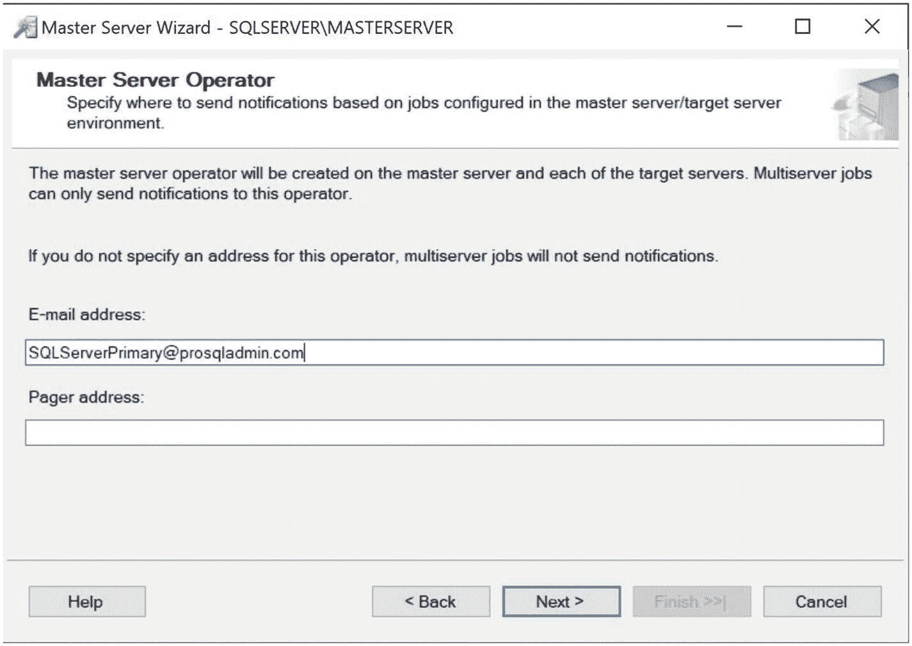

图 22-29：主服务器操作员页面

在向导的“目标服务器”页面（如图 22-30 所示）中，我们从“已注册的服务器”窗格中的已注册服务器列表中选择目标服务器，并使用箭头按钮将它们移动到“目标服务器”窗格中。在“目标服务器”窗格中高亮显示一个服务器后，我们可以使用“连接”按钮来确保连通性。

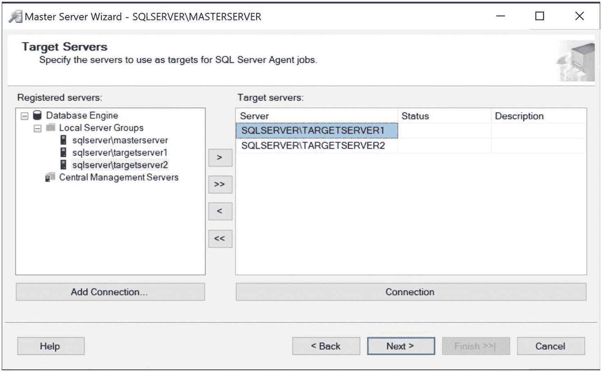

图 22-30：目标服务器页面

#### 提示

我们所有的实例都出现在“已注册的服务器”窗格的“本地服务器组”节点中，因为它们都在同一台服务器上。如果你希望作为目标服务器的实例不是本地的，可以通过“已注册的服务器”窗口注册服务器，该窗口可以通过 SQL Server Management Studio 的“视图”菜单访问。

在向导的“主服务器登录凭据”页面上，系统会询问我们是否需要时创建新的登录名。这是 TSX 用来连接到 MSX 并下载它们应运行的作业的登录名。如果 SQL Server Agent 的实例与 MSX 共享相同的服务帐户，则不需要此操作。

现在，在向导的“完成”页面上，我们会看到将执行操作的摘要，然后会显示一个进度窗口，告知我们每项任务是成功还是失败。

### 创建主作业

您可以按照与创建本地作业相同的方式创建主作业，唯一的区别是指定其应在哪些目标服务器上运行。然而，使用多服务器作业的一个限制是，T-SQL 作业步骤无法在另一个用户的上下文下运行；它们必须在服务帐户的上下文下运行。因此，在我们将 `BackupAndCheckBrowser` 作业转换为多服务器作业之前，必须编辑它以移除 `运行身份帐户`。我们可以通过使用 `sp_update_jobstep` 存储过程来实现这一点，如清单 22-11 所示。

```
USE MSDB
GO
EXEC msdb.dbo.sp_update_jobstep
@job_name=N'BackupAndCheckBrowser',
@step_id=1 ,
@database_user_name=N" ;
GO
清单 22-11
更新作业步骤
```

多服务器作业的另一个限制是，唯一允许的操作员是 `MSXOperator`，他接收所有多服务器作业的通知。因此，在继续之前，我们还需要将 `DBATeam` 操作员更改为 `MSXOperator` 操作员。我们可以使用 `sp_update_job` 存储过程，通过清单 22-12 中的脚本来实现这一点。

```
USE msdb
GO
EXEC msdb.dbo.sp_update_job
@job_name=N'BackupAndCheckBrowser',
@notify_email_operator_name=N'MSXOperator' ;
GO
清单 22-12
更新作业
```

我们现在可以继续通过 Management Studio 将我们的 `BackupAndCheckBrowser` 作业转换为多服务器作业，方法是打开“作业属性”对话框并导航到“目标”页面。如图 22-31 所示，我们可以使用此页面将作业更改为多服务器作业，并从已使用 `sp_msx_enlist` 存储过程登记的目标服务器列表中指定它应针对运行的目标服务器。关闭属性对话框后，该作业将针对 `TargetServer1` 和 `TargetServer2` 实例运行，而不是 `MASTERSERVER` 实例。

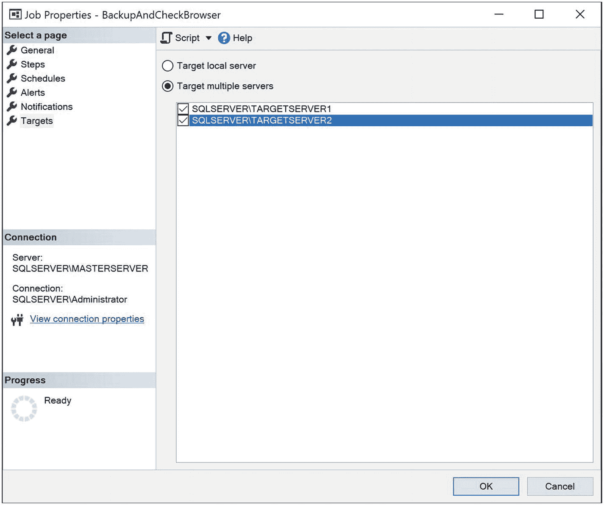

图 22-31：转换为多服务器作业

要通过 T-SQL 实现相同的结果，我们使用 `sp_delete_jobserver` 系统存储过程来停止作业针对 MSX 运行，并使用 `sp_add_jobserver` 系统存储过程来配置作业针对 TSX 运行。这两个过程都接受表 22-3 中详述的参数。

表 22-3：`sp_delete_jobserver` 和 `sp_add_jobserver` 参数

| 参数 | 描述 |
| --- | --- |
| `@job_id` | 您要转换为多服务器作业的作业的 GUID。如果为 `NULL`，则必须指定 `@job_name` 参数。 |
| `@job_name` | 您要转换为多服务器作业的作业的名称。如果为 `NULL`，则必须指定 `@job_id` 参数。 |
| `@server_name` | 您希望作业针对运行的服务器\实例名称。 |

在我们的场景中，我们可以使用清单 22-13 中的脚本来转换作业。

```
EXEC msdb.dbo.sp_delete_jobserver
@job_name=N'BackupAndCheckBrowser',
@server_name = N'SQLSERVER\MASTERSERVER' ;
GO
EXEC msdb.dbo.sp_add_jobserver
@job_name=N'BackupAndCheckBrowser',
@server_name = N'SQLSERVER\TARGETSERVER1' ;
GO
EXEC msdb.dbo.sp_add_jobserver
@job_name=N'BackupAndCheckBrowser',
@server_name = N'SQLSERVER\TARGETSERVER2' ;
GO
清单 22-13
转换为多服务器作业
```

### 管理目标服务器

在配置 MSX 时，请确保考虑针对 TSX 的各种维护活动。这些活动包括轮询 TSX、跨服务器同步时间、运行临时作业以及使 TSX 脱离（取消登记）。

我们可以在“目标服务器状态”对话框中完成这些任务。可以通过在 MSX 上右键单击 SQL Server Agent，选择“多服务器管理”->“管理目标服务器”来调用此对话框。此对话框的“目标服务器状态”选项卡如图 22-32 所示。

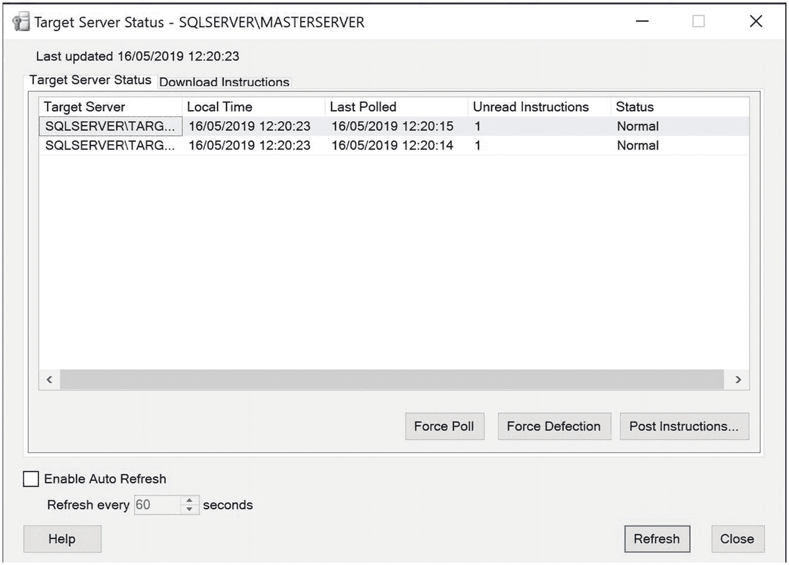

图 22-32：“目标服务器状态”选项卡

在此选项卡上，我们可以使用“强制轮询”按钮使目标服务器轮询 MSX。当 TSX 轮询 MSX 时，我们强制它下载其配置为运行的作业的最新副本。如果您更新了主作业，这非常有用。

“强制脱离”按钮会导致高亮显示的 TSX 从 MSX 取消登记。取消登记后，选定的 TSX 将不再轮询或运行多服务器作业。

“发布指令”按钮调用“发布下载指令”对话框，您可以在其中向 TSX 发送以下指令之一：

*   脱离
*   设置轮询间隔
*   同步时钟
*   启动作业

要同步所有服务器上的时间，您需要选择“同步时钟”指令类型，并确保在“收件人”部分选择了“所有目标服务器”，如图 22-33 所示。然后，当时钟在目标服务器下次轮询主服务器时进行同步。

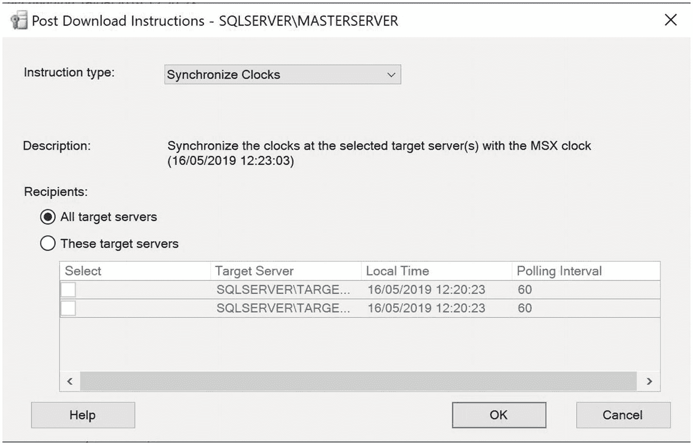

图 22-33：同步时钟

在另一种场景中，可能有时我们希望临时运行 `BackupAndCheckBrowser` 作业到 `TARGETSERVER1`。我们可以通过选择“启动作业”作为指令类型，然后从“作业名称”下拉列表中选择我们的作业来实现这一点。然后，我们使用屏幕的“收件人”部分来选择 `TARGETSERVER1`。如图 22-34 所示。

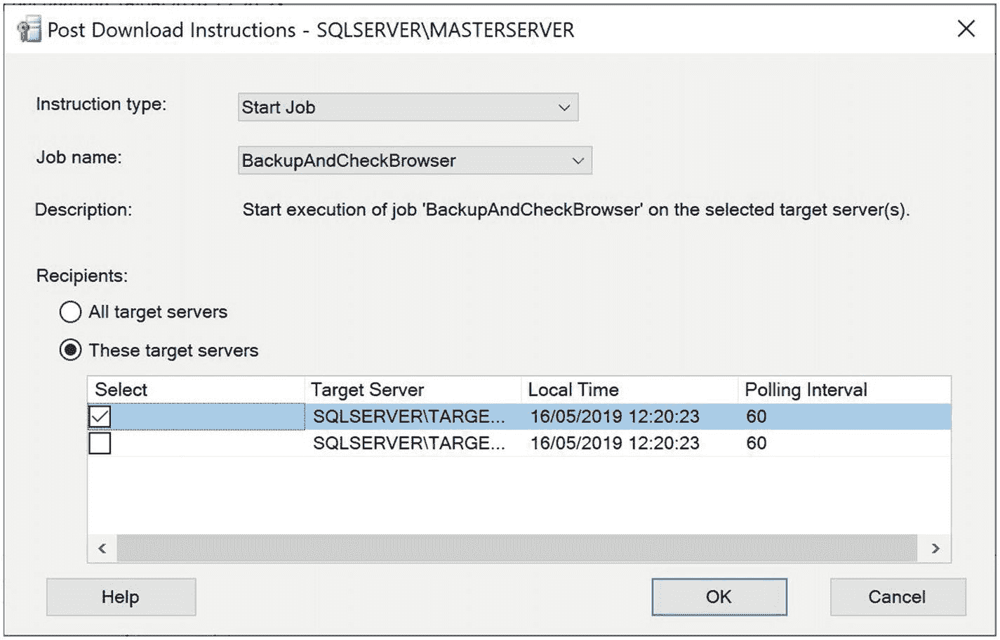

图 22-34：在 TARGETSERVER1 上启动作业

在“目标服务器状态”对话框的“下载指令”选项卡上，如图 22-35 所示，我们看到了已发送到目标的指令列表。我们可以使用屏幕顶部的下拉列表按作业或目标服务器筛选指令。

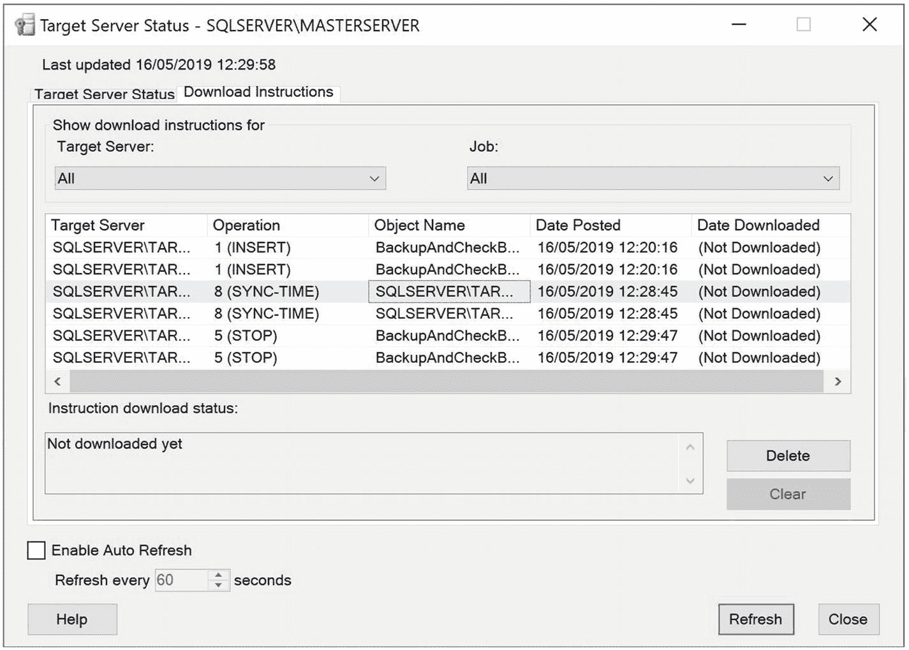

图 22-35：“下载指令”选项卡


### 概要

SQL Server 代理是 SQL Server 的一个调度引擎，允许你基于决策逻辑在各种计划上创建强大的维护作业。作业是要执行的任务的容器，其中每个任务被称为一个步骤。每个作业步骤可以在不同的账户上下文下运行，并且可以在不同的子系统或类型（如 T-SQL、PowerShell、操作系统命令或 SSIS 包）下运行任务。

计划附加到作业上，可以在特定的日期和时间、当 CPU 空闲时，或在重复性计划（如每日、每周或每月）上触发。计划也可以在日内重复，例如每小时、每分钟，甚至频繁到每 10 秒一次。

操作员是接收作业成功或失败通知以及警报触发通知的个人或团队。操作员可以通过电子邮件、寻呼机或 `NET SEND` 接收作业状态通知；但是，`NET SEND` 和寻呼机支持已弃用。要让操作员通过电子邮件接收通知，必须配置数据库邮件，以便可以通过你的 SMTP 中继服务器发送电子邮件。

默认情况下，作业在 SQL Server 代理服务账户的上下文中运行。但是，出于良好的安全实践，你应考虑使用代理账户来运行作业步骤。代理账户映射到实例级别的凭据，而凭据又映射到 Windows 级别的安全主体。代理可用于除 T-SQL 之外的所有子系统。T-SQL 作业步骤使用 `EXECUTE AS` 在数据库用户的上下文中执行命令。这是使用“以以下身份运行”属性配置的。

当数据库引擎中引发错误或警告、发生 WMI 事件或满足性能条件时，会触发警报。当警报触发时，响应包括通知操作员或运行作业以解决问题。

多服务器作业允许 DBA 在整个企业中一致地运行作业。在多服务器场景中，有一个主服务器（MSX），用于创建和修改作业，以及多个目标服务器（TSX）。TSX 定期轮询 MSX 并检索应运行的作业列表。

# 23. 基于策略的管理

基于策略的管理（PBM）是一个系统，DBA 可以将其与中央管理服务器结合使用，以报告或强制执行整个企业的标准。本章首先介绍 PBM 使用的概念，然后演示如何通过 GUI 和 PowerShell 使用 PBM 来有效管理环境。

### PBM 概念

基于策略的管理使用 `目标`、`方面`、`条件` 和 `策略` 的概念。`目标` 是 PBM 管理的实体，例如数据库或表。`方面` 是与目标相关的属性集合。例如，数据库方面包括与数据库名称相关的属性。`条件` 是可以针对属性进行评估的布尔表达式。`策略` 将条件绑定到目标。以下各节将讨论这些概念。

#### 方面

方面是与一种目标类型相关的属性集合，例如 `视图`，其属性包括 `IsSchemaBound`、`HasIndex` 和 `HasAfterTrigger`；`数据库角色`，其属性包括 `Name Owner` 和 `IsFixedRole`；以及 `索引`，其属性包括 `IsClustered`、`IsPartitioned` 和 `IsUnique`。`索引` 方面还公开了与地理空间索引、内存优化索引、XML 索引和全文索引相关的属性。其他值得注意的方面包括 `数据库`、`存储过程`、`表面区域配置`、`链接服务器` 和 `审核`。SQL Server 2019 总共提供了 96 个方面，你可以在本章的“评估模式”部分找到完整列表。你也可以通过运行清单 23-1 中的命令来访问方面列表。

```sql
SELECT name
FROM msdb.dbo.syspolicy_management_facets ;
```
清单 23-1: 查找方面列表

#### 条件

条件是一个布尔表达式，针对对象属性进行评估，以确定其是否符合你的要求。每个方面都包含多个属性，你可以针对这些属性创建条件，但每个条件只能访问来自单个方面的属性。条件可以使用以下运算符进行评估：

*   `=`
*   `!=`
*   `LIKE`
*   `NOT LIKE`
*   `IN`
*   `NOT IN`

例如，你可以使用 `LIKE` 运算符和表达式 `Database.Name LIKE 'Chapter%'` 来确保所有数据库名称以 `Chapter` 开头。

#### 目标

目标是可以应用策略的实体。这可以是表、数据库、整个实例或 SQL Server 中的大多数其他对象。将目标添加到策略时，可以使用条件来限制目标数量。这意味着，例如，如果你创建一个策略来强制执行实例上的数据库命名约定，你可以使用一个条件来避免针对包含“SharePoint”、“bdc”或“wss”字样的数据库名称检查策略，因为这些是你的 SharePoint 数据库，它们可能包含在你的标准命名约定中可能被禁止的 GUID。

#### 策略

策略包含一个条件，并将其绑定到一个或多个目标（目标也可以通过单独的条件进行筛选）和一个评估模式。根据你选择的评估模式，策略还可能包含你希望检查策略的计划。策略支持四种评估模式，将在下一节中讨论。

#### 评估模式

策略支持一到四种评估模式，具体取决于你在条件中使用的方面。评估模式如下：

*   `按需`
*   `按计划`
*   `更改时：仅记录`
*   `更改时：阻止`

如果评估模式配置为 `按需`，则策略仅在 DBA 手动评估时进行评估。如果评估模式配置为 `按计划`，则在创建策略时创建计划；这将导致策略定期进行评估。

#### 提示

即使策略配置了不同的评估模式，也可以 `按需` 进行评估。

如果选择 `更改时：仅记录` 评估模式，则每当目标的相关属性更改时，策略验证的结果都会记录到 SQL Server 日志中。如果策略被触发但未通过验证，则会在日志中生成一条消息。当目标的配置方式违反了你的某个策略时，就会发生这种情况。如果违反策略，则会引发错误 34053，严重级别为 16（表示问题可由用户修复）。

#### 提示

创建对象时，评估属性的方式与更改现有对象属性时的评估方式相同。

如果选择 `更改时：阻止` 作为评估模式，则当属性更改时，SQL Server 会评估该属性，如果存在违规，则会引发错误消息，并且导致策略违规的语句将被回滚。

因为策略是基于触发的 DDL 事件工作的，所以根据方面内的属性，并非所有评估模式都适用于所有方面。确定特定方面支持的评估模式的规则相当不透明，因此你可以通过运行清单 23-2 中的查询来发现它们。

```sql
SELECT
name ,
'Yes' AS on_demand,
CASE
WHEN (CONVERT(BIT, execution_mode & 4)) = 1
THEN 'Yes'
ELSE 'No'
END  AS on_schedule,
CASE
WHEN (CONVERT(BIT, execution_mode & 2)) = 1
THEN 'Yes'
ELSE 'No'
END  AS on_change_log,
CASE
WHEN (CONVERT(BIT, execution_mode & 1)) = 1
THEN 'Yes'
ELSE 'No'
END  AS on_change_prevent
FROM msdb.dbo.syspolicy_management_facets ;
```
清单 23-2: 列出每个方面支持的执行类型


### 中央管理服务器

SQL Server Management Studio 提供了一项名为中央管理服务器的功能。此功能允许你将一个实例注册为中央管理服务器，然后将其他实例注册为该中央管理服务器的已注册服务器。一旦在中央管理服务器下注册了服务器，你就可以针对组中的所有服务器运行查询，或者对组内的所有服务器运行策略。

CMS 是一个非常出色的功能，在与基于策略的管理结合使用时如此，其本身亦然。在管理中型或大型 SQL Server 环境时，我总是会实施 CMS，用于针对多个服务器运行即席查询等目的。这使我能够快速回答管理和容量问题，例如“我们的环境中有多少个数据库？”

要注册中央管理服务器，请在 SQL Server Management Studio 的“视图”菜单中选择“已注册服务器”。这将导致“已注册服务器”窗口出现，如图 23-1 所示。

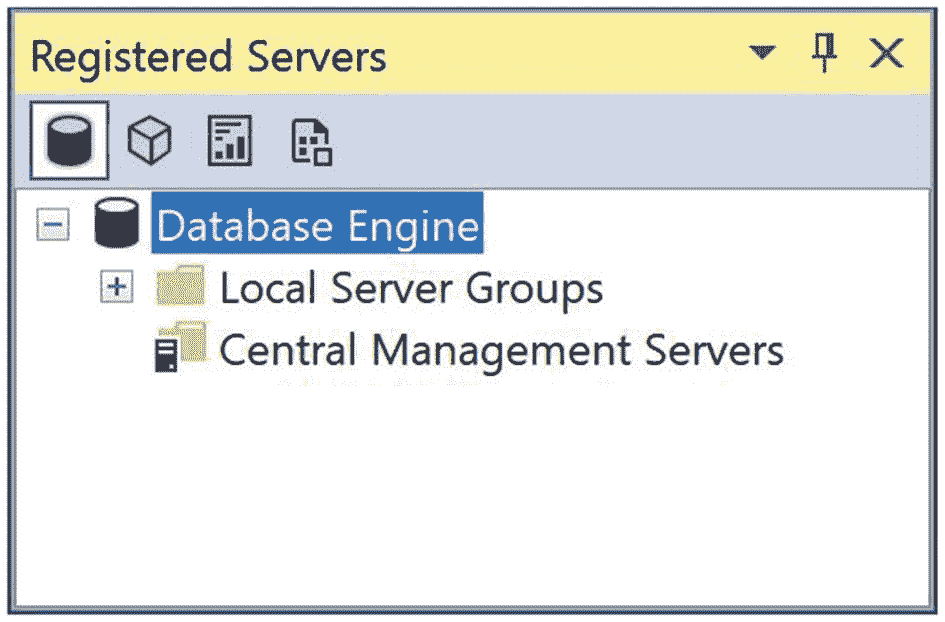 *图 23-1：已注册服务器窗口*

让我们通过在中央管理服务器的上下文菜单中选择“注册中央管理服务器”，将我们的`SQLSERVER\MASTERSERVER`实例（这是我们本节演示中使用的服务器\实例名称）注册为中央管理服务器。这将显示“新建服务器注册”对话框的“常规”选项卡，如图 23-2 所示。

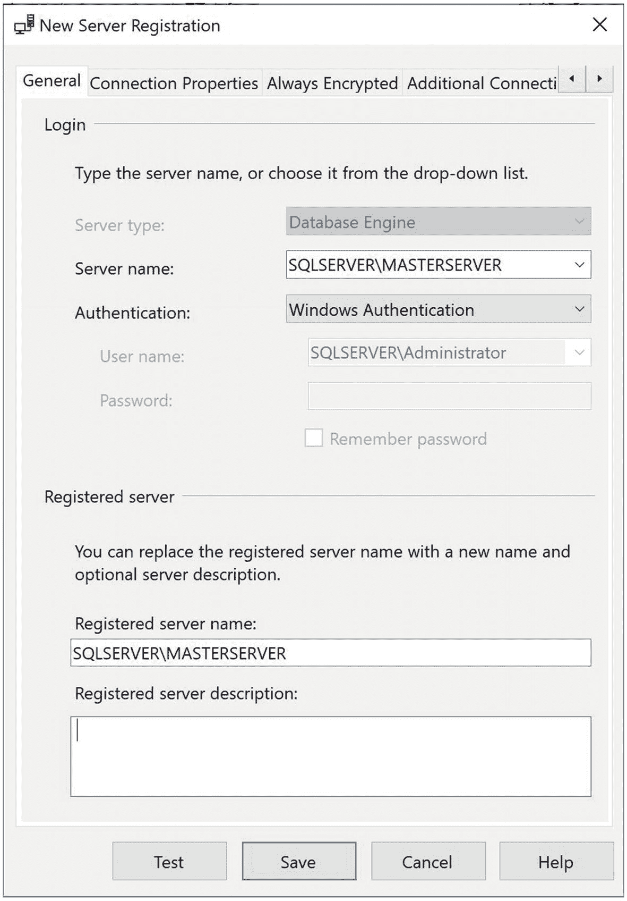 *图 23-2：“常规”选项卡*

在此选项卡上，我们在“服务器名称”框中输入中央管理服务器的服务器\实例名称。这将导致“已注册服务器名称”字段自动更新，但你可以手动编辑它以赋予其新名称。你还可以选择为该实例添加描述。

在如图 23-3 所示的“连接属性”选项卡上，我们指定连接到该实例的首选项。

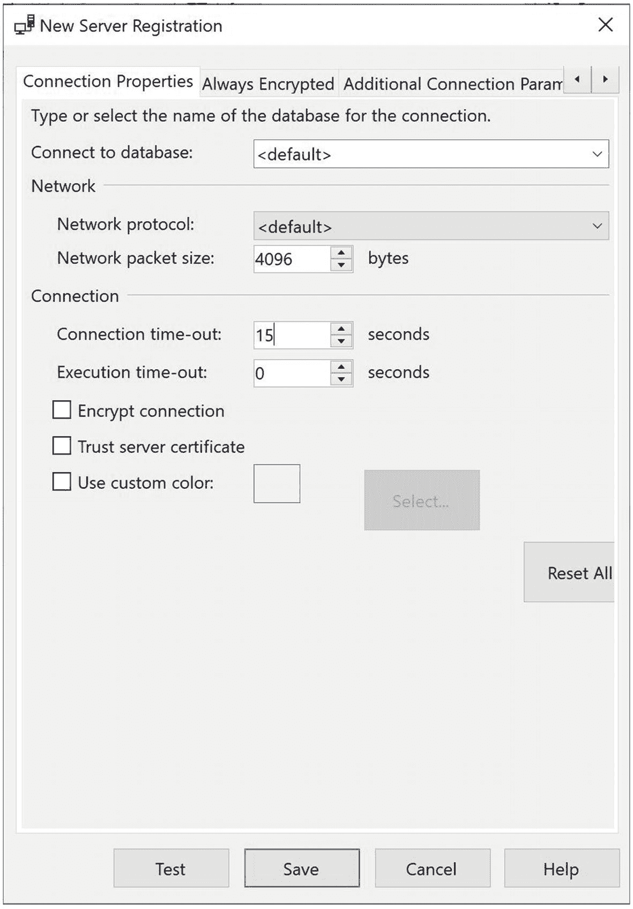 *图 23-3：“连接属性”选项卡*

在此选项卡上，我们输入一个数据库作为登陆区域。如果我们将选项保留为“默认”，则会连接到默认数据库。在选项卡的“网络”部分，你可以指定要使用的特定网络协议，或保留设置为“默认”（我们在此处就是如此）。将其保留为“默认”会使连接使用实例网络配置中指定的最高优先级协议。虽然通常不建议更改网络数据包大小，因为在大多数场景中，这会产生负面影响，但在非典型场景中，这样做可以通过让连接受益于巨型帧（可以支持更大有效载荷并因此减少流量碎片的以太网帧）来提高性能。

在屏幕的“连接”部分，我们指定连接超时和执行超时的持续时间。你还可以指定是否加密到中央管理服务器的连接。如果你在单个 SQL Server Management Studio 实例中管理多个实例，“使用自定义颜色”选项对于颜色编码实例非常有用。选中此选项并指定一种颜色有助于避免查询意外针对不正确的服务器运行。当我调试失败的代码发布时，我发现对实例进行颜色编码特别有用，因为我不想意外地将开发/测试代码运行到生产环境！

“始终加密”选项卡允许你为连接启用始终加密并指定适当的验证服务器。此选项卡如图 23-4 所示。有关始终加密的更多信息，请参见第 11 章。

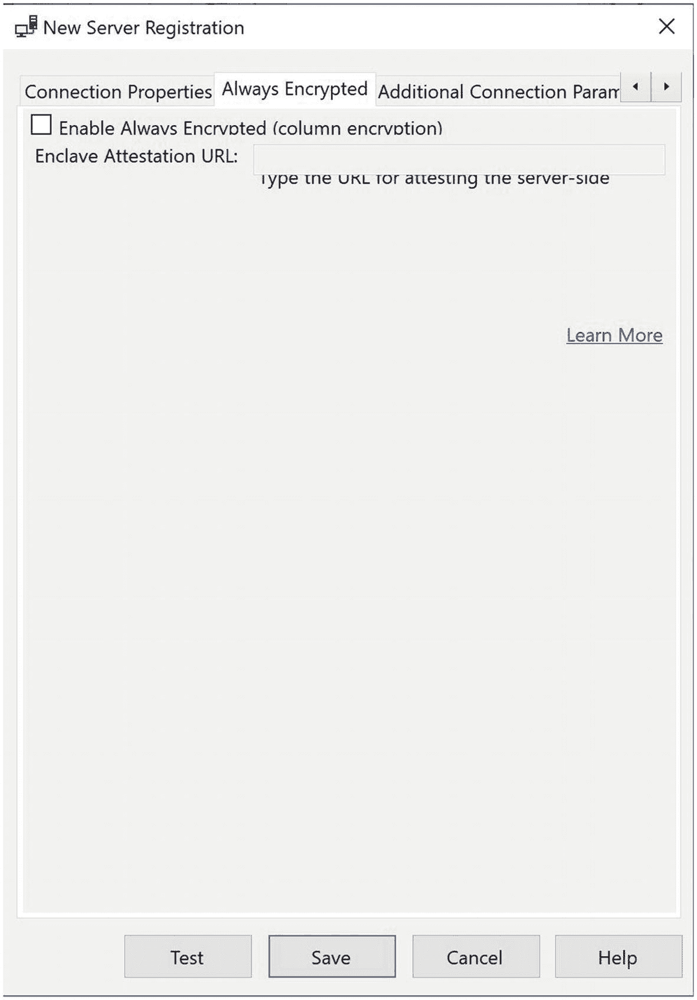 *图 23-4：“始终加密”选项卡*

如图 23-5 所示的“其他连接参数”选项卡允许你手动指定连接字符串属性。然而，你应该注意，如果你输入了已在其他选项卡上指定的连接属性，手动指定的属性将覆盖你在其他选项卡中的选择。

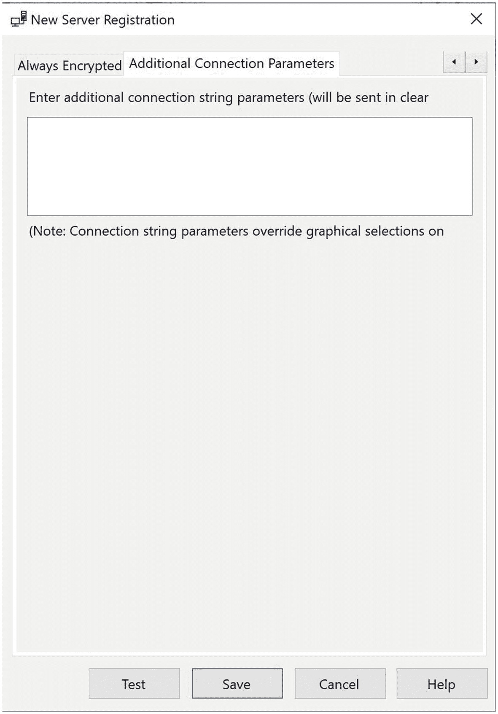 *图 23-5：“其他连接参数”选项卡*

单击“新建服务器注册”窗口底部的“测试”按钮，允许你在保存之前测试到实例的连接。这总是一个好主意，因为它有助于避免日后不必要的故障排除。

一旦我们注册了中央管理服务器，我们可以选择直接在中央管理服务器下注册服务器，或者在中央管理服务器下创建服务器组。你在此处选择的策略应基于环境的要求。例如，如果中央管理服务器管理的所有服务器都应应用相同的策略，那么直接在中央管理服务器下注册服务器可能就足够了。但是，如果你的中央管理服务器将管理来自不同环境（例如生产和开发/测试）的服务器，那么你可能希望针对不同环境实施不同的策略集；在这种情况下，创建不同的服务器组是有意义的。在新创建的中央管理服务器的上下文菜单中选择“新建服务器组”将调用“新建服务器组属性”对话框，如图 23-6 所示。

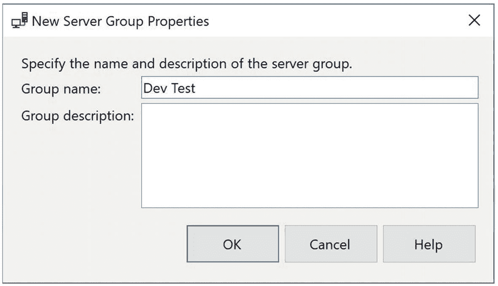 *图 23-6：“新建服务器组属性”对话框*

你可以看到我们正在使用此对话框输入服务器组的名称和描述，该组将我们的开发/测试服务器分组在一起。退出对话框后，我们重复该过程为我们的生产服务器创建一个服务器组，并将其命名为 Prod。


#### 提示

你还可以嵌套服务器组。因此，在更复杂的拓扑结构中，你可以为每个地理区域设置一个服务器组，其中包含每个环境的服务器组。

现在，让我们从每个服务器组的上下文菜单中选择“新建服务器注册”选项，将我们的实例添加到相应的组中。我们将`SQLSERVER\TARGETSERVER1`和`SQLSERVER\TARGETSERVER2`添加到 Prod 组，并将`SQLSERVER`的默认实例添加到 DevTest 组。你可以使用与注册中央管理服务器时相同的“新建服务器注册”对话框来添加服务器。图 23-7 显示了添加服务器后的“已注册服务器”屏幕。

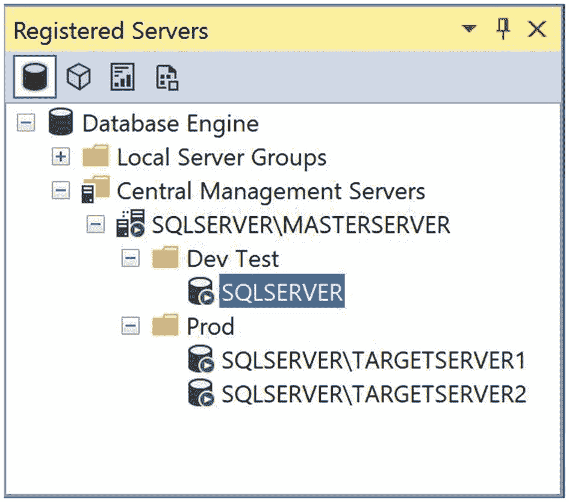

图 23-7

“已注册服务器”窗口

中央管理服务器的一个非常有用的功能是能够针对服务器组内的所有服务器或它们管理的所有服务器运行查询。例如，我们可以从 Prod 服务器组的上下文菜单中选择“新建查询”，然后运行清单 23-3 中的查询。

```
SELECT name
FROM sys.Databases ;
-- 清单 23-3
-- 列出服务器组中的所有数据库
```

此查询返回的结果如图 23-8 所示。

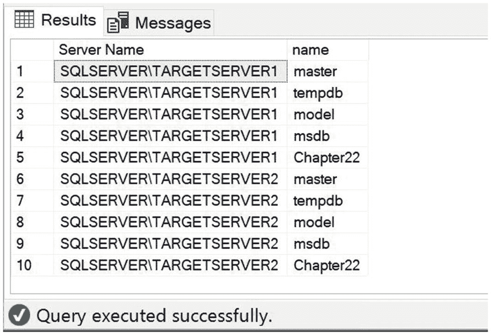

图 23-8

列出服务器组中所有服务器的结果

你首先会注意到，查询结果下方的状态栏是粉红色而不是黄色。这表示查询已在多个服务器上运行。其次，状态栏没有显示实例名称，而是显示了查询针对的服务器组；在我们的例子中，是 Prod。最后，请注意结果集中添加了一个额外的列。此列名为“服务器名称”，它指示该行是从组内的哪个实例返回的。由于`SQLSERVER\TARGETSERVER1`和`SQLSERVER\TARGETSERVER2`上不存在用户数据库，因此从每个实例返回了四个系统数据库。

### 创建策略

你可以使用 SQL Server Management Studio 或 T-SQL 创建策略。以下部分讨论如何创建简单的静态策略，然后再讨论如何创建高级的动态策略。

#### 创建简单策略

PBM 在其预定义的方面、属性和条件中提供了极大的灵活性。你可以利用这种灵活性为企业创建一套全面的策略。以下部分讨论如何使用 PBM 的内置功能创建简单策略。

##### 创建可手动评估的策略

你可能已经注意到，本书中的示例数据库使用`Chapter<ChapterNumber>`的命名格式。因此，我们在这里创建一个策略来强制执行此命名约定，方法是使任何违反此策略的策略回滚并生成错误。为此，我们通过在主服务器的对象资源管理器中依次展开“管理”->“策略管理”，然后从“策略”上下文菜单中选择“新建策略”，来调用“创建新策略”对话框。图 23-9 显示了该对话框的“常规”页面。

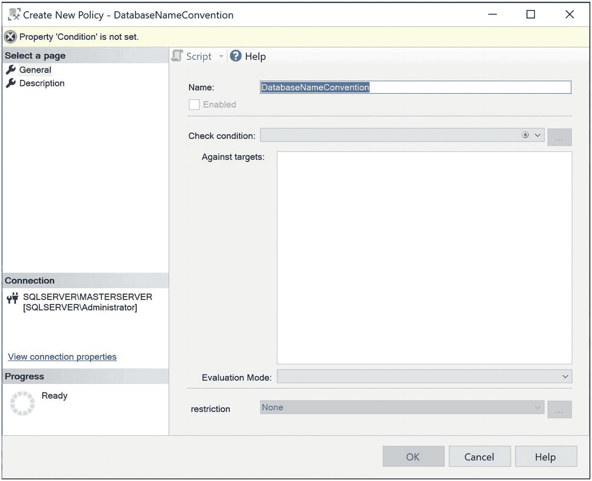

图 23-9

“创建新策略”对话框，“常规”页面

在此页面上，我们为策略命名，但发现“针对目标”和“评估模式”选项不可用。这是因为我们尚未创建条件。因此，我们的下一步是使用“检查条件”下拉框选择“新建条件”。这将显示“创建新条件”对话框的“常规”页面，如图 23-10 所示。

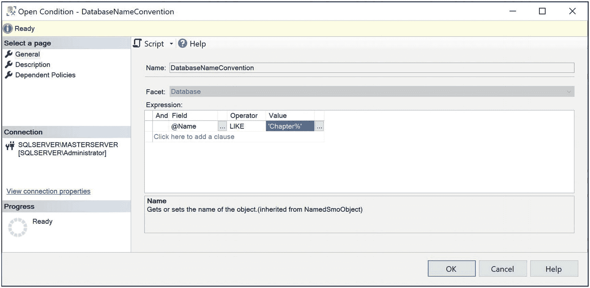

图 23-10

“创建新条件”对话框，“常规”页面

在此页面上，我们为条件命名并选择“数据库”方面。在屏幕的“表达式”区域，我们选择`@Name`字段应该`LIKE 'Chapter%'`，其中`%`是零个或多个字符的通配符。在“描述”页面上，我们可以选择为条件指定文本描述。

回到“创建新策略”对话框的“常规”页面，我们确保“评估模式”下拉列表设置为“按需”，这意味着除非我们显式评估该策略，否则不会对其进行评估。唯一可用的其他选项是安排评估。这是因为“数据库”方面不支持“更改时：仅记录”或“更改时：阻止”评估模式。

我们的策略显然不适用于系统数据库。这很重要，因为我们可以使用该策略检查现有数据库以及我们创建的新数据库。因此，在页面的“针对目标”部分，我们使用下拉框进入“创建新条件”对话框，并创建一个排除数据库 ID 小于或等于 4 的数据库的条件，如图 23-11 所示。

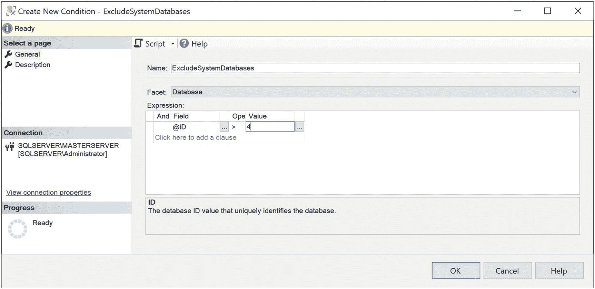

图 23-11

创建 ExcludeSystemDatabases 条件

回到“创建新策略”对话框，我们可以创建一个条件来强制执行服务器限制，该限制筛选要评估策略的实例。但是，因为我们仅针对`SQLSERVER\MASTERSERVER`实例评估策略，所以不需要这样做。相反，我们导航到“描述”页面，如图 23-12 所示。

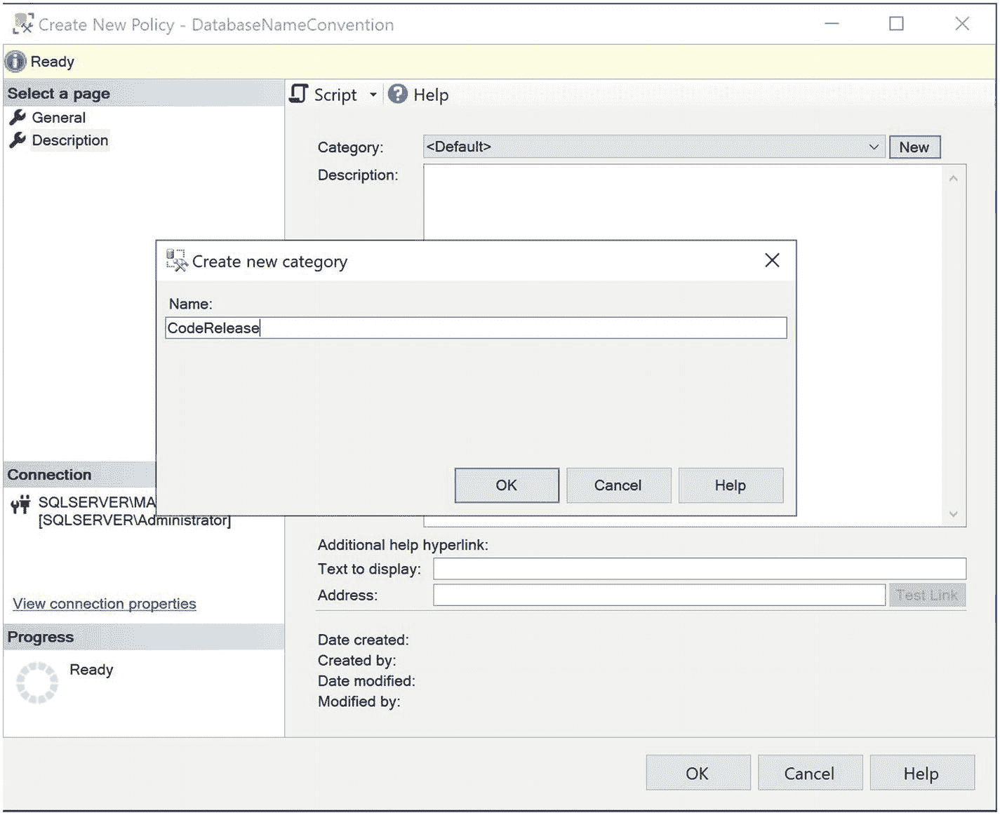

图 23-12

“描述”页面

在此页面上，我们使用“新建”按钮创建一个新类别`CodeRelease`，它帮助我们在 UAT（用户验收测试）或 OAT（操作验收测试）环境中检查代码质量，然后再将代码推广到生产环境。我们还可以选择添加策略的自由文本描述和帮助超链接，以及网站地址或电子邮件链接。

##### 手动评估策略

在评估我们的策略之前，我们首先通过执行清单 23-4 中的命令创建一个不符合我们命名约定的数据库。

```
CREATE DATABASE BrokenPolicy ;
-- 清单 23-4
-- 创建一个 BrokenPolicy 数据库
```

我们可以通过使用“评估策略”对话框来评估我们的新策略，该对话框可以通过在对象资源管理器中依次展开“管理”->“策略管理”->“策略”，并从我们的策略的上下文菜单中选择“评估”来调用。

#### 提示

即使策略被禁用，你也可以手动评估它。

在“评估策略”对话框中，如图 23-13 所示，你会在窗口上半部分看到已评估策略的列表；状态指示器会告知是否有任何策略被破坏。在窗口的下半部分，你会看到高亮显示的策略所评估的目标列表；这里的状态指示器会逐个目标地告知你策略的状态。

#### 提示

若要评估多个策略，请在**对象资源管理器**中的**策略**文件夹的右键菜单中选择**评估**，然后选择您希望评估的策略。所有选定的策略将被评估，并显示在**评估结果**页面中。

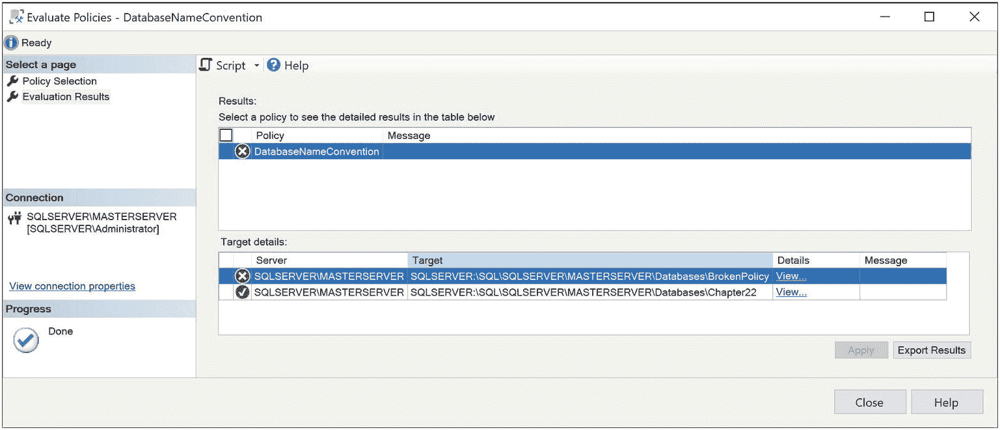

图 23-13

**评估策略**对话框

#### 提示

我们在本书的第 22 章创建了 `Chapter22` 数据库。如果您没有 `Chapter22` 数据库，可以使用语句 `CREATE DATABASE Chapter22 ;` 来创建它。

点击**详细信息**列中的**查看**链接，以调用**结果详细视图**对话框，如图 23-14 所示。此信息对于失败的策略评估很有用，因为它提供了未满足策略条件的实际值的详细信息。

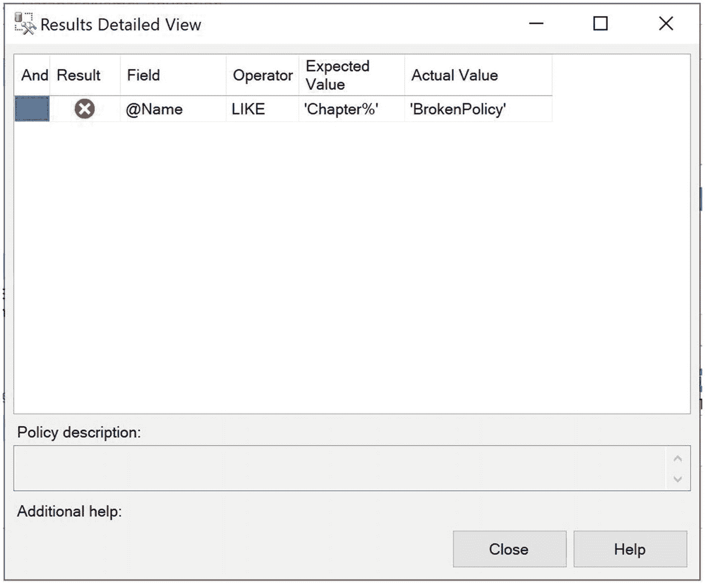

图 23-14

**结果详细视图**对话框

##### 创建一个防止不良活动的策略

另一个非常有用的简单策略是帮助您防止开发人员混淆其存储过程的策略。可以说，过程混淆在第三方软件中有其位置，以防止知识产权被盗。然而，对于内部应用程序，则无需使用混淆，这样做可能导致诊断性能问题时出现困难。此外，如果开发团队没有使用源代码控制，在发生灾难时可能导致代码丢失。在这种情况下，我们不仅仅是临时评估策略，而是要阻止创建被混淆的存储过程。这意味着在代码发布期间，您不需要审查每个存储过程是否包含 `WITH ENCRYPTION` 语法。相反，您可以期望策略被评估，并且 `CREATE PROCEDURE` 语句被回滚，从而防止这种情况发生。

在创建此策略之前，我们需要确保实例上启用了嵌套触发器。这是因为策略将使用 DDL 触发器来强制执行，而嵌套触发器是 **变更时：防止** 模式的硬性技术要求。您可以使用 `sp_configure` 来启用嵌套触发器，脚本如清单 23-5 所示；不过，它们默认是开启的。

```
EXEC sp_configure 'nested triggers', 1 ;
RECONFIGURE
清单 23-5
启用嵌套触发器
```

创建策略后，您需要创建一个条件。创建条件时，如图 23-15 所示，我们使用了 **存储过程** 属性方面的 `@IsEncrypted` 属性。

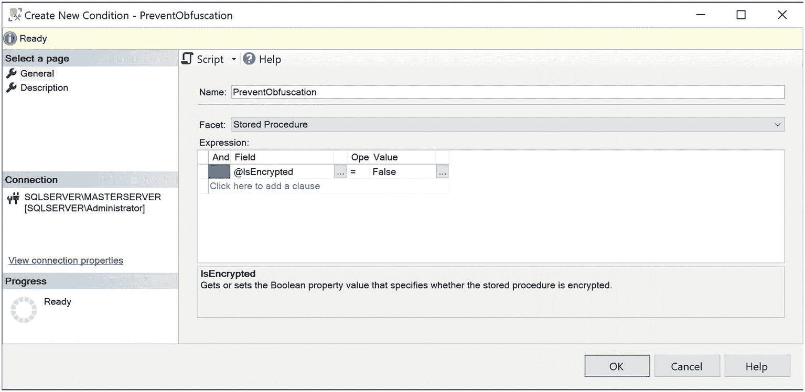

图 23-15

**创建新条件**对话框

在**创建新策略**对话框中，如图 23-16 所示，我们可以使用**针对目标**区域来配置哪些目标应由该策略评估；但是，该设置默认为**每个数据库中的每个存储过程**。这符合我们的需求，因此我们不需要创建条件。在**评估模式**下拉列表中，我们选择**变更时：防止**；这使得如果存储过程被混淆，则无法在我们的 `SQLSERVER\MASTERSERVER` 实例上创建存储过程。我们还确保选中**已启用**框，以便策略在创建时即被启用。

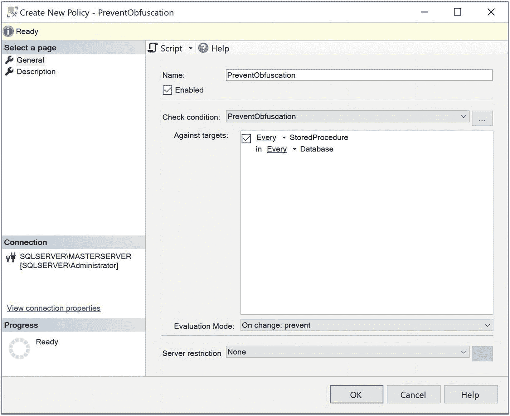

图 23-16

**创建新策略**对话框

为了演示实际的防止效果，我们尝试使用清单 23-6 中的脚本创建一个存储过程。

```
CREATE PROCEDURE ObfuscatedProc
WITH ENCRYPTION
AS
BEGIN
SELECT *
FROM sys.tables
END
清单 23-6
使用 WITH ENCRYPTION 创建存储过程
```

图 23-17 显示了我们尝试运行此 `CREATE PROCEDURE` 语句时抛出的错误。

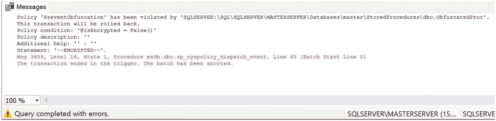

图 23-17

策略触发器抛出的错误

#### 创建高级策略

基于策略的管理是可扩展的，如果您无法使用内置的属性方面创建所需的条件，**表达式高级编辑器**允许您使用广泛的函数。这些函数包括 `ExecuteSql()` 和 `ExecuteWql()`，它们允许您分别构建自己的 SQL 和 WQL（Windows 查询语言）。`ExecuteSql()` 和 `ExecuteWql()` 函数不是 T-SQL 函数，它们是 PBM 框架的一部分。

您可以使用这些函数针对数据库引擎或 Windows 编写查询并评估结果。函数对每个目标调用一次。因此，例如，如果它们与**服务器**属性方面一起使用，则只运行一次，但如果它们针对**表**属性方面使用，则会对每个目标表进行评估。当您使用 `ExecuteSql()` 时如果返回了多列，则评估第一行的第一列。当您使用 `ExecuteWql()` 时如果返回了多列，则会抛出错误。例如，假设您想要确保 SQL Server Agent 服务已启动。您可以通过运行清单 23-7 中的查询在 T-SQL 中实现这一点。此查询使用 `LIKE` 运算符，因为 `servicename` 列也包含服务名称，而 `LIKE` 运算符使查询通用化，因此可以在任何实例上运行而无需修改。

```
SELECT status_desc
FROM sys.dm_server_services
WHERE servicename LIKE 'SQL Server Agent%' ;
清单 23-7
使用 T-SQL 检查确保 SQL Server Agent 正在运行
```

或者，您也可以使用清单 23-8 中的 WQL 查询实现相同的结果。

#### 注意

您可以在 [`https://msdn.microsoft.com/en-us/library/aa394606`](https://msdn.microsoft.com/en-us/library/aa394606) `(v=vs.85).aspx` 找到 WQL 参考。

```
SELECT State FROM Win32_Service  WHERE Name ="SQLSERVERAGENT$MASTERSERVER"
清单 23-8
使用 WQL 检查 SQL Server Agent 是否正在运行
```

要使用 T-SQL 版本的查询，您需要使用 `ExecuteSql()` 函数，该函数接受表 23-1 中的参数。

表 23-1

`ExecuteSQL()` 参数

| 参数 | 描述 |
| --- | --- |
| `returnType` | 指定查询的预期返回类型。可接受的值为 `Numeric`、`String`、`Bool`、`DateTime`、`Array` 和 `GUID`。 |
| `sqlQuery` | 指定应运行的查询。 |

要使用 WQL 版本的查询，您需要使用 `ExecuteWql()`，它接受表 23-2 中描述的参数。

表 23-2

`ExecuteWQL()` 参数

| 参数 | 描述 |
| --- | --- |
| `returnType` | 指定查询的预期返回类型。可接受的值为 `Numeric`、`String`、`Bool`、`DateTime`、`Array` 和 `GUID`。 |
| `namespace` | 指定应针对哪个 WQL 命名空间执行查询。 |
| `wqlQuery` | 指定应运行的查询。 |

因此，如果您使用 T-SQL 方法，您的条件将在 PBM 的条件编辑器中使用清单 23-9 中的脚本（它不会直接在 SSMS 中工作）。

```
ExecuteSql('string', 'SELECT status_desc FROM sys.dm_server_services WHERE servicename LIKE "SQL Server Agent%"')
清单 23-9
ExecuteSQL()
```


### 策略管理

此处需要注意，我们必须在查询中转义单引号，以确保它们在执行时能被正确识别。

如果你使用 WQL 方法，你的条件需要使用清单 23-10 中的脚本。

```sql
ExecuteWql('String', 'root\CIMV2', 'SELECT State FROM Win32_Service  WHERE Name ="SQLSERVERAGENT$MASTERSERVER"')
```
清单 23-10 `ExecuteWQL()`

图 23-18 展示了如何使用 WQL 方法创建条件。

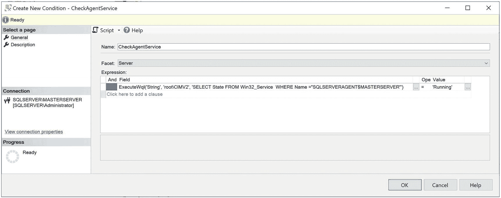
图 23-18 使用 `ExecuteWql()` 创建条件

#### 提示

此处需要注意，我们必须在查询中转义单引号，以确保它们在执行时能被正确识别。

如果你使用 WQL 方法，你的条件需要使用清单 23-10 中的脚本。

```sql
ExecuteWql('String', 'root\CIMV2', 'SELECT State FROM Win32_Service  WHERE Name ="SQLSERVERAGENT$MASTERSERVER"')
```
清单 23-10 `ExecuteWQL()`

#### 注意

由于 `ExecuteWql()` 和 `ExecuteSql()` 函数的强大功能和灵活性，它们可能被滥用以制造安全漏洞。因此，请确保你严格控制谁有创建策略的权限。

### 策略管理

策略安装在 SQL Server 实例上，但你可以将它们导出为 XML 文件，这反过来又允许它们被移植到其他服务器或中央管理服务器，以便能够同时针对多个实例进行评估。以下部分将讨论如何导入和导出策略，以及如何将策略与中央管理服务器结合使用。我们还将讨论如何使用 PowerShell 管理策略。

### 导入和导出策略

策略可以导出到文件系统，也可以从文件系统导入为 XML 文件。要将我们的 `DatabaseNameConvention` 策略导出到 `默认文件位置`，我们在对象资源管理器中右键单击 `DatabaseNameConvention` 策略，从上下文菜单中选择“导出策略”，这将调出“导出策略”对话框。在这里，我们只需为文件选择一个名称并单击“保存”，如图 23-19 所示。

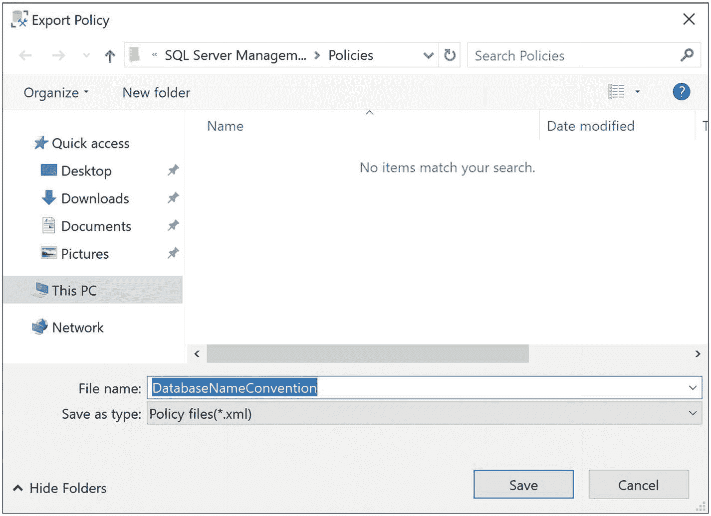
图 23-19 “导出策略”对话框

现在我们将该策略导入到我们的 `SQLSERVER\TARGETSERVER1` 实例中。为此，我们在对象资源管理器中连接到 `TARGETSERVER1` 实例，然后依次展开“管理” ➤ “基于策略的管理”，接着从“策略”的上下文菜单中选择“导入策略”。这将调出“导入”对话框，如图 23-20 所示。

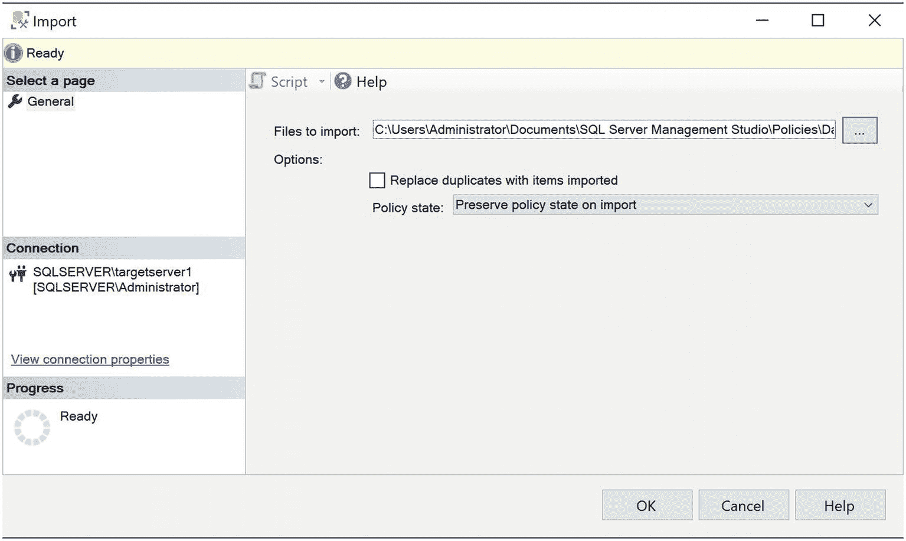
图 23-20 “导入”对话框

在此对话框中，我们使用“要导入的文件”省略号按钮来选择我们的 `DatabaseNameConvention` 策略。我们还可以从“策略状态”下拉列表中选择策略导入后的状态，并指定是否应覆盖实例上已存在的同名策略。

### 使用策略进行企业管理

虽然能够针对单个 SQL Server 实例评估策略很有用，但为了最大限度地发挥 PBM 的威力，你可以将策略与中央管理服务器结合使用，以便在单次执行中针对整个 SQL Server 企业环境评估策略。

例如，假设我们希望针对在将 `SQLSERVER\MASTERSERVER` 实例注册为中央管理服务器时创建的 Prod 组中的所有服务器，来评估 `DatabaseNameConvention` 策略。为此，我们在“已注册的服务器”窗口中依次展开“中央管理服务器” ➤ `SQLSERVER\MASTERSERVER`，然后从 Prod 的上下文菜单中选择“评估策略”。

这将调出“评估策略”对话框。在这里，你可以使用“源”省略号按钮调出“选择源”对话框，并选择你想要针对该组评估的一个或多个策略，如图 23-21 所示。

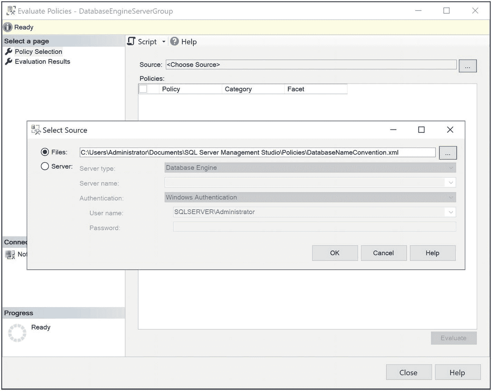
图 23-21 “评估策略”对话框

在“选择源”对话框中，要么从文件系统中选择存储为 XML 文件的策略，要么指定安装了该策略的实例的连接详细信息。在我们的例子中，我们通过单击“文件”省略号按钮来选择 `DatabaseNameConvention`。

选中的策略随后会显示在屏幕的“策略”部分，如图 23-22 所示。如果你选择了一个包含多个策略的源，可以使用复选框来定义要评估哪些策略。单击“评估”按钮会导致所选策略针对组中的所有服务器进行评估。

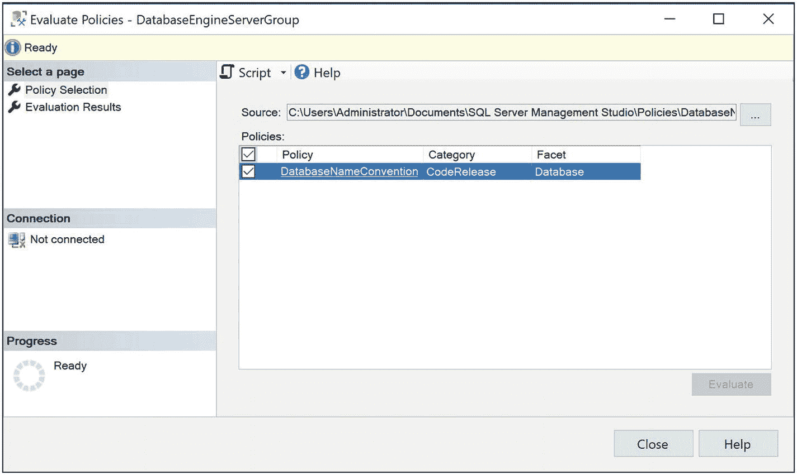
图 23-22 “评估策略”对话框

### 使用 PowerShell 评估策略

当策略安装在实例上时，可以使用本章已描述的方法进行评估。但是，如果你的策略存储为 XML 文件，你仍然可以使用 PowerShell 来评估它们。如果你的 SQL Server 企业环境包含 SQL Server 2000 或 2005 实例（许多环境仍然如此），这会很有帮助。因为 PBM 仅在 SQL Server 2008 中引入，策略无法导入到旧版实例中，但 PowerShell 为此问题提供了一个有用的变通方法。

要使用 PowerShell 从 XML 文件评估我们的 `DatabaseNameConvention` 策略是否符合我们的 `SQLSERVER\MASTERSERVER` 实例，我们需要运行清单 23-11 中的脚本。该脚本的第一行将路径更改为存储策略的文件夹。第二行实际评估策略。

如果我们配置的属性是可设置且确定性的（而我们的这个不是），那么我们可以添加 `-AdHocPolicyExecutionMode` 参数并将其设置为 `"Configure"`。这将使设置更改为符合我们的策略。

```powershell
sl "C:\Users\Administrator\Documents\SQL Server Management Studio\Policies"
Invoke-PolicyEvaluation -Policy "C:\Users\Administrator\Documents\SQL Server Management Studio\Policies\DatabaseNameConvention.xml" -TargetServerName ".\MASTERSERVER"
```
清单 23-11 使用 PowerShell 评估策略

此策略评估的输出如图 23-23 所示。

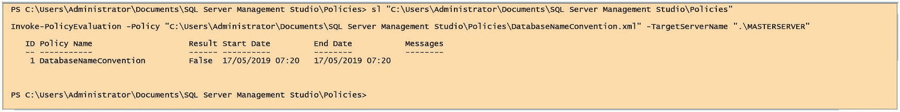
图 23-23 策略评估结果

#### 提示

要评估多个属性，请为 `-Policy` 参数提供一个逗号分隔的列表。


### 摘要

基于策略的管理 (PBM) 提供了一种强大而灵活的方法，用于确保在整个企业中满足编码标准和托管标准。**目标**是 PBM 管理的实体。**条件**是策略针对目标进行评估的布尔表达式，而 **Facet** 是与特定类型目标相关联的属性集合。

根据您使用的 Facet，一个策略最多可提供四种策略评估模式：`按需`、`按计划`、`仅更改：记录`和`更改：阻止`。`按需`、`按计划`和`仅更改：记录`可视为反应性的，而`更改：阻止`可视为主动性的，因为它会主动阻止违反策略的配置更改。由于`更改`模式依赖于 DDL 触发器，您必须在实例级别启用嵌套触发器，并且并非所有 Facet 都支持这些模式。

策略是可扩展的，通过使用 `ExecuteSql()` 和 `ExecuteWql()` 函数，您可以评估 T-SQL 或 WQL 查询的结果。这些函数提供了极大的灵活性，但其强大的功能也可能导致安全漏洞，因此在授予创建策略的权限时需谨慎。

一个实例可以注册为中央管理服务器，其他服务器可以直接或分组注册在其下方。这使数据库管理员 (DBA) 能够同时跨多个实例运行查询，并且还为他们提供了同时针对多个服务器评估策略的能力。这意味着您可以在企业级别使用基于策略的管理来强制实施标准。

您可以从 SQL Server 内部或使用带有 `-InvokePolicyEvaluation` cmdlet 的 PowerShell 来评估策略。这为您管理包含较旧 SQL Server 实例（如 2000 或 2005）的环境提供了更大的灵活性。这是因为 PowerShell 允许 DBA 从 XML 文件评估策略，而不仅仅是导入到 `MSDB` 后才能评估。

# 24. 资源调控器

资源调控器提供了一种在 SQL Server 层对应用程序进行节流的方法，通过对不同分类的连接施加 CPU、内存和物理 IO 的限制。本章首先讨论资源调控器使用的概念，然后演示如何实现它。接着，我们将探讨如何监控资源调控器对资源利用率的影响。

### 资源调控器概念

资源调控器使用**资源池**来定义服务器资源的子集，使用**工作负荷组**作为类似会话请求的逻辑容器，并使用**分类器函数**来确定应将特定请求分配给哪个工作负荷组。以下各节将讨论这些概念。

#### 资源池

一个*资源池*定义了会话可以利用的服务器资源子集。启用资源调控器时，会自动创建三个池：内部池、默认池和默认外部池。*内部池*代表实例使用的服务器资源。此池无法修改。*默认池*设计为一个全池，用于将资源分配给任何未分配到用户定义资源池的会话。您不能删除此池；但是，可以修改其设置。默认外部池用于管理由机器学习服务使用的 `rterm.exe`、`BxlServer.exe` 和 `python.exe` 进程所使用的资源。默认外部资源池可以修改但不能删除，并且可以添加新的外部资源池。

资源池允许您配置将分配给分配到该池的会话的可用资源（CPU、内存和物理 IO）的最小和最大数量。当您添加其他池时，现有池的最大值会进行透明调整，以便它们不会与分配给所有池的最小资源百分比冲突。例如，假设您配置了资源池（如表 24-1 所示）来限制 CPU 使用率。

表 24-1
资源池的简单有效最大百分比

| 资源池* | 最小 CPU % | 最大 CPU % | 有效最大 CPU % | 计算 |
| --- | --- | --- | --- | --- |
| `默认` | 0 | 100 | 75 | `最小值(75,(100–0-25)) = 75` |
| `销售应用程序` | 25 | 75 | 75 | `最小值(75,(100–0-0)) = 75` |
| `默认外部` | 0 | 100 | 75 | `最小值(75,(100–0-25)) = 75` |

*∗此处未提及内部资源池，因为它既不能直接配置，也不能隐式配置。相反，它可以消耗其所需的任何资源，并且最小 CPU 为 0；因此，它不会影响其他池的有效最大 CPU 计算。*

在此示例中，实际的“最大 CPU %”设置将如您所配置。但是，假设您现在添加了一个名为 `会计应用程序` 的额外资源池，其配置的最小 CPU % 为 50，最大 CPU % 为 80。最小 CPU 百分比之和现在大于最大 CPU 百分比之和。这意味着每个资源池的有效最大 CPU 百分比将相应降低。此计算的公式是 `最小值(默认最大值, 默认最大值 – SUM(其他最小 CPU))`，如表 24-2 所示。

表 24-2
隐式降低后的资源池有效最大百分比

| 资源池* | 最小 CPU % | 最大 CPU % | 有效最大 CPU % | 计算 |
| --- | --- | --- | --- | --- |
| `默认` | 0 | 100 | 25 | `最小值(100,(100-sum(25,50,0))) = 25` |
| `销售应用程序` | 25 | 75 | 50 | `最小值(75,(100-50-0)) = 50` |
| `会计应用程序` | 50 | 80 | 75 | `最小值(80,(100-25-0)) = 75` |
| `默认外部` | 0 | 100 | 25 | `最小值(100,(100-sum(25,50,0))) = 25` |

*∗此处未提及内部资源池，因为它既不能直接配置，也不能隐式配置。相反，它可以消耗其所需的任何资源，并且最小 CPU 为 0；因此，它不会影响其他池的有效最大 CPU 计算。*

#### 工作负荷组

一个资源池可以包含一个或多个工作负荷组。一个*工作负荷组*代表一个逻辑容器，用于存放通过执行分类器函数（下一节介绍）被归类为相似的会话。例如，在前面提到的 `销售应用程序` 资源池中，我们可以创建两个工作负荷组。我们可以将其中一个工作负荷组用作普通用户会话的容器，而将第二个用作报表会话的容器。

这种方法使我们能够分别监控会话组。它还允许我们为每组会话定义不同的策略。例如，我们可以选择指定用于报表的会话具有比标准用户会话更低的 `MAXDOP`（最大并行度）设置，或者用于报表的会话只能指定有限数量的并发请求。这些设置是除了我们可以在资源池级别配置的设置之外的额外设置。

#### 分类器函数

一个*分类器函数*是在 Master 数据库中创建的标量函数。它用于确定每个会话应分配到哪个工作负荷组。除 DAC（专用管理员连接）外，每个新会话都使用单个分类器函数进行分类，DAC 不受资源调控器约束。分类器函数可以基于几乎任何可以在解释型 SQL 中编码的属性对会话进行分组。例如，您可以选择基于用户名、角色成员身份、应用程序名称、主机名、登录属性、连接属性甚至时间来对请求进行分类。


### 实现资源管理器

要在实例上配置资源管理器，您必须创建并配置一个或多个资源池，每个池包含一个或多个工作负载组。此外，您还需要创建一个分类器函数。最后，您需要启用资源管理器，这将使所有后续会话都被分类。这些主题将在以下章节中讨论。

#### 创建资源池

每个实例最多可以创建 64 个资源池。让我们通过 SQL Server Management Studio 创建一个资源池：在对象资源管理器中依次展开 **Management** ➤ **Resource Governor**，然后从资源池的上下文菜单中选择 **New Resource Pool**。这将调出资源管理器属性对话框。

在此对话框的**资源池**部分，在网格中新建一行，并填入创建新资源池所需的信息。在我们的例子中，您应该添加一个名为 `SalesApplication` 的资源池的详细信息，其**最小 CPU %** 为 25，**最大 CPU %** 为 75，**最小内存 %** 为 25，**最大内存 %** 为 40。

#### 提示

高亮显示一个资源池会导致与该资源池关联的工作负载组显示在屏幕的**资源池的工作负载组**部分。在这里，您可以同时添加、修改或删除资源池。但是，您也可以通过依次展开 **Management** ➤ **Resource Governor** ➤ [*资源池名称*]，然后从工作负载组的上下文菜单中选择 **New Workload Group** 来访问此对话框。

在此场景中，最大内存限制是硬限制。这意味着分配给此资源池的内存永远不会超过此实例可用内存的 40%。此外，即使没有会话使用此资源池，实例可用内存的 25% 仍会分配给该池，且对其他资源池不可用。

相比之下，最大 CPU 限制是软性的，或称机会性的。这意味着如果有更多 CPU 可用，资源池会加以利用。只有当处理器存在争用时，该上限才会生效。

#### 提示

可以配置 CPU 使用率的硬上限。这在 PaaS（平台即服务）或 DaaS（数据库即服务）环境中很有帮助，这些环境根据 CPU 使用量向客户收费，并且您需要确保其应用程序的计费一致。如果客户已同意支付 40% 的一个核心费用，但软性上限允许他们达到 50%，导致自动收取更高的费用，客户很容易对此提出争议。本节稍后将讨论如何实现这一点。

您也可以通过 T-SQL 创建资源池。这样做时，您可以使用比 GUI 更多的功能，这些功能允许您配置最小和最大 IOPS（每秒输入/输出操作数），设置 CPU 使用率的硬上限，以及将资源池与特定的 CPU 或 NUMA 节点关联。在资源池和 CPU 子集之间建立关联意味着该资源池将只使用与其对齐的 CPU。您可以使用 `CREATE RESOURCE POOL DDL` 语句在 T-SQL 中创建资源池。可在资源池上配置的设置详见表 24-3。

表 24-3：`CREATE RESOURCE POOL` 参数

| 参数 | 描述 |
| --- | --- |
| `pool_name` | 分配给资源池的名称。 |
| `MIN_CPU_PERCENT` | 指定资源池可用的有保证的平均最小 CPU 资源，作为实例可用 CPU 带宽的百分比。 |
| `MAX_CPU_PERCENT` | 指定资源池可用的平均最大 CPU 资源，作为实例可用 CPU 带宽的百分比。这是一个软限制，在 CPU 资源存在争用时适用。 |
| `CAP_CPU_PERCENT` | 指定资源池可用 CPU 资源数量的硬限制，作为实例可用 CPU 带宽的百分比。 |
| `MIN_MEMORY_PERCENT` | 指定为资源池保留的最小内存量，作为实例可用内存的百分比。 |
| `MAX_MEMORY_PERCENT` | 指定资源池可以使用的最大内存量，作为实例可用内存的百分比。 |
| `MIN_IOPS_PER_VOLUME` | 指定为资源池保留的每卷 IOPS 数量。与 CPU 和内存阈值不同，IOPS 以绝对值（而非百分比）表示。 |
| `MAX_IOPS_PER_VOLUME` | 指定资源池可以使用的每卷最大 IOPS 数量。与最小 IOPS 阈值一样，它以绝对数字（而非百分比）表示。 |
| `AFFINITY SCHEDULER`* | 指定资源池应绑定到特定的 SQLOS（SQL 操作系统）调度程序，这些调度程序进而映射到服务器内的特定虚拟核心。不能与 `AFFINITY NUMANODE` 一起使用。指定 `AUTO` 以允许 SQL Server 管理资源池使用的调度程序。指定调度程序 ID 的范围，例如 (`0, 1, 32 TO 64`)。 |
| `AFFINITY NUMANODE`* | 指定资源池应绑定到特定的 NUMA 节点范围，例如 (`1 TO 4`)。不能与 `AFFINITY SCHEDULER` 一起使用。 |

*有关 CPU 和 NUMA 关联的更多详细信息，请参阅第 5 章。*

在使用每卷最小和最大 IOPS 阈值时，我们需要考虑几点。首先，如果我们没有设置最大 IOPS 限制，SQL Server 根本不会管理资源池的 IOPS。这意味着如果您为其他资源池配置了最小 IOPS 限制，这些限制不会被遵守。因此，如果您希望资源管理器管理 IO，请务必为每个资源池设置最大 IOPS 阈值。


同样值得注意的是，您可以通过资源管理器控制的大部分 IO 是读取操作。这是因为写入操作（例如 Lazy Writer 和 Log Flush 操作）是作为系统操作发生的，并且属于内部资源池的范围。由于您无法更改内部资源池，因此无法管理大多数写入操作。这意味着，当您拥有一个报表应用程序或其他具有高读写比例的应用程序时，使用资源管理器来限制 IO 操作是最合适的。

最后，您应该意识到，资源管理器只能控制 IOPS 的数量；它无法控制 IOPS 的大小。这意味着您不能使用资源管理器来控制应用程序使用的 SAN 带宽量。

要创建外部资源池，应使用 `CREATE EXTERNAL RESOURCE POOL` DDL 语句。可以在外部资源池上配置的设置详见表 24-4。

**表 24-4**
`CREATE EXTERNAL RESOURCE POOL` 参数

| 参数 | 说明 |
| --- | --- |
| `pool_name` | 您分配给资源池的名称。 |
| `MAX_CPU_PERCENT` | 指定资源池可用的最大平均 CPU 资源占实例可用 CPU 带宽的百分比。这是一个软限制，在 CPU 资源存在争用时适用。 |
| `AFFINITY SCHEDULER` | 指定资源池应绑定到特定的 SQLOS（SQL 操作系统）调度器，这些调度器进而映射到服务器内的特定虚拟核心。不能与 `AFFINITY NUMANODE` 一起使用。指定 `AUTO` 以允许 SQL Server 管理资源池使用的调度器。指定调度器 ID 范围。例如 (`0, 1, 32 TO 64`)。 |
| `MAX_MEMORY_PERCENT` | 指定资源池可以使用的最大内存量占实例可用内存的百分比。 |
| `MAX_PROCESSES` | 指定在任何给定时间池内允许的最大进程数。默认值为 0，仅通过服务器资源限制进程数。 |

如果您想创建一个名为 `ReportingApp` 的资源池，该池设置最小 CPU 百分比为 50，最大 CPU 百分比为 80，最小 IOPS 预留为 20，最大 IOPS 预留为 100，则可以使用代码清单 24-1 中的脚本。脚本的最后一条语句使用 `ALTER RESOURCE GOVERNOR` 来应用新配置。在创建工作负载组或应用分类器函数后，也应运行此语句。

```sql
CREATE RESOURCE POOL ReportingApp
WITH(
MIN_CPU_PERCENT=50,
MAX_CPU_PERCENT=80,
MIN_IOPS_PER_VOLUME = 20,
MAX_IOPS_PER_VOLUME = 100
) ;
GO
ALTER RESOURCE GOVERNOR RECONFIGURE ;
GO
```
代码清单 24-1：创建资源池

#### 创建工作负载组

每个资源池可以包含多个工作负载组。要开始为我们的 `SalesApplication` 资源池创建工作负载组，我们依次展开 管理 ➤ 资源管理器 ➤ 资源池。然后展开我们的 `SalesApplication` 资源池，并从工作负载组上下文菜单中选择 新建工作负载组。这将调用资源管理器属性对话框，如图 24-1 所示。

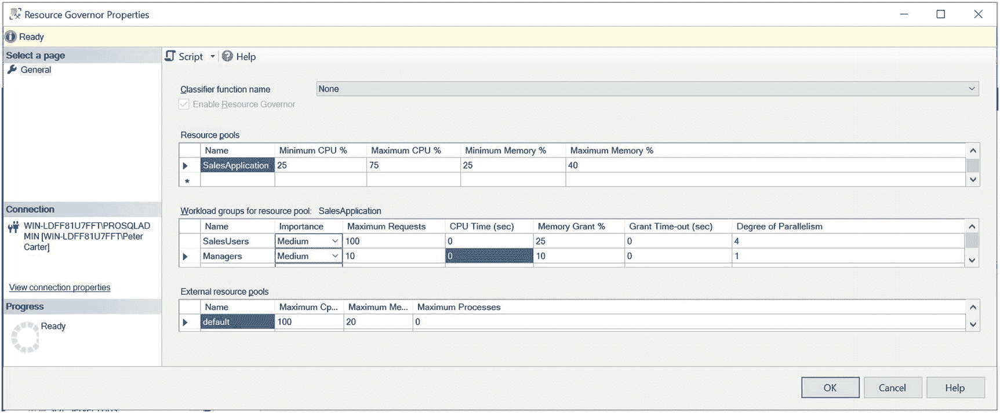
图 24-1：资源管理器属性对话框

您可以看到，在对话框的“资源池”部分选中 `SalesApplication` 资源池的情况下，我们在屏幕的“工作负载组”部分创建了两行。每一行都表示一个与 `SalesApplication` 资源池关联的工作负载组。

我们将 `SalesUsers` 工作负载组配置为最多允许 100 个并发请求，`MAXDOP` 为 4，这意味着归类到此工作负载组下的请求最多可以使用四个调度器。

我们将 `Managers` 工作负载组配置为最多允许 10 个并发请求并使用最多一个调度器。我们还将此工作负载组配置为最多可使用资源池可预留内存的 10%，而不是默认的 25%。

如果 `Memory Grant %` 设置为 0，则归类到该工作负载组下的任何请求都将被阻止运行任何需要 `SORT` 或 `HASH JOIN` 物理运算符的操作。如果查询需要的 RAM 超过指定量，则 SQL Server 会降低该查询的 `DOP`，以尝试减少内存需求。如果 `DOP` 达到 1 且内存仍然不足，则会抛出 `Error 8657`。

要通过 T-SQL 创建工作负载组，请使用 `CREATE WORKLOAD GROUP` DDL 语句。此语句接受表 24-5 中详述的参数。

**表 24-5**
`CREATE WORKLOAD GROUP` 参数

| 参数 | 说明 |
| --- | --- |
| `group_name` | 指定工作负载组的名称。 |
| `IMPORTANCE` | 可配置为 `HIGH`、`MEDIUM` 或 `LOW`，允许您将一个工作负载组中的请求优先级设置为高于另一个。 |
| `REQUEST_MAX_MEMORY_GRANT_PERCENT` | 指定任何单个查询可以从资源池使用的最大内存量，表示为资源池可用内存的百分比。 |
| `REQUEST_MAX_CPU_TIME_SEC` | 指定任何单个查询可以使用的 CPU 时间（以秒为单位）。需要注意的是，如果超过阈值，则会生成一个事件，该事件可以通过扩展事件捕获。但是，查询不会被取消。 |
| `REQUEST_MEMORY_GRANT_TIMEOUT_SEC` | 指定查询在超时之前可以等待工作缓冲区内存变为可用的最大时间量。然而，查询仅在内存争用时才会超时。否则，查询将获得最小内存授予。这会导致查询性能下降。最长时间以秒表示。 |
| `MAX_DOP` | 单个并行查询可以使用的最大处理器数。查询的 `MAXDOP` 可以通过使用查询提示、更改实例的 `MAXDOP` 设置或在关系引擎选择串行计划时进一步限制。 |
| `GROUP_MAX_REQUESTS` | 指定可以在工作负载组内执行的最大并发请求数。如果并发请求数达到此值，则进一步的查询将置于等待状态，直到并发查询数降至阈值以下。 |
| `USING` | 指定工作负载组与之关联的资源池。如果未指定，则该组与默认池关联。 |

#### 注意

工作负载组名称必须是唯一的，即使它们与不同的池关联也是如此。这样它们才能由分类器函数返回。

如果我们创建两个工作负载组，并希望它们与我们的 `ReportingApp` 资源池关联——一个名为 `InternalReports`，`MAXDOP` 为 4，最大内存授予百分比为 25%；另一个名为 `ExternalReports`，`MAXDOP` 为 8，最大内存授予百分比为 75%——我们可以使用代码清单 24-2 中的脚本。

```sql
CREATE WORKLOAD GROUP InternalReports
WITH(
GROUP_MAX_REQUESTS=100,
IMPORTANCE=Medium,
REQUEST_MAX_CPU_TIME_SEC=0,
REQUEST_MAX_MEMORY_GRANT_PERCENT=25,
REQUEST_MEMORY_GRANT_TIMEOUT_SEC=0,
MAX_DOP=4
) USING ReportingApp ;
GO
CREATE WORKLOAD GROUP ExternalReports
WITH(
GROUP_MAX_REQUESTS=100,
IMPORTANCE=Medium,
REQUEST_MAX_CPU_TIME_SEC=0,
REQUEST_MAX_MEMORY_GRANT_PERCENT=75,
REQUEST_MEMORY_GRANT_TIMEOUT_SEC=0,
MAX_DOP=8
) USING ReportingApp ;
GO
ALTER RESOURCE GOVERNOR RECONFIGURE;
GO
```
代码清单 24-2：创建工作负载组


#### 创建分类器函数

分类器函数是驻留在 Master 数据库中的标量 UDF（用户定义函数）。它返回类型为 `SYSNAME` 的值，这是系统定义的类型，等同于 `NVARCHAR(128)`。函数返回的值对应于每个请求应归入的工作负载组名称。函数内的逻辑决定返回哪个工作负载组名称。每个实例通常只有一个分类器函数，因此如果添加了额外的工作负载组，则需要修改该函数。

现在，让我们使用本章构建的资源调控器环境创建一个分类器函数。该函数将根据以下规则对每个针对我们实例的请求进行分类：

1.  如果请求是在 `SalesUser` 登录的上下文中发出的，则该请求应归入 `SalesUsers` 工作负载组。
2.  如果请求由 `SalesManager` 登录发出，则请求应放置在 `Managers` 工作负载组中。
3.  如果请求由 `ReportsUser` 登录发出，并且请求来自名为 `ReportsApp` 的服务器，则该请求应归入 `InternalReports` 工作负载组。
4.  如果请求由 `ReportsUser` 登录发出但并非源自 `ReportsApp` 服务器，则它应归入 `ExternalReports` 工作负载组。
5.  所有其他请求都应放置到默认工作负载组。

在创建分类器函数之前，我们需要准备实例。为此，我们首先创建 `Chapter24` 数据库。然后创建 `SalesUser`、`ReportsUser` 和 `SalesManager` 登录，并将 `Users` 映射到 `Chapter24` 数据库。（关于安全原则的更多详细信息，请参见第 10 章。）清单 24-3 包含了准备实例所需的代码。

> **注意**
>
> 出于本示例的目的，用户被映射到 `Chapter24` 数据库，但你可以针对实例中的任何数据库进行查询。

```sql
--Create the database
USE [master]
GO
CREATE DATABASE Chapter24 ;
--Create the Logins and Users
CREATE LOGIN SalesUser
WITH PASSWORD=N'Pa$$w0rd', DEFAULT_DATABASE=Chapter24,
CHECK_EXPIRATION=OFF, CHECK_POLICY=OFF ;
GO
CREATE LOGIN ReportsUser
WITH PASSWORD=N'Pa$$w0rd', DEFAULT_DATABASE=Chapter24,
CHECK_EXPIRATION=OFF, CHECK_POLICY=OFF ;
GO
CREATE LOGIN SalesManager
WITH PASSWORD=N'Pa$$w0rd', DEFAULT_DATABASE=Chapter24,
CHECK_EXPIRATION=OFF, CHECK_POLICY=OFF ;
GO
USE Chapter24
GO
CREATE USER SalesUser FOR LOGIN SalesUser ;
GO
CREATE USER ReportsUser FOR LOGIN ReportsUser ;
GO
CREATE USER SalesManager FOR LOGIN SalesManager ;
GO
```
清单 24-3
准备实例

为了实现关于每个请求应放置到哪个工作负载组的业务规则，我们使用表 24-6 中详述的系统函数。

表 24-6

用于实现业务规则的系统函数

| 函数 | 描述 | 业务规则 |
| --- | --- | --- |
| `SUSER_SNAME()` | 返回登录名 | 1, 2, 3, 4 |
| `HOST_NAME()` | 发出请求的主机名 | 3, 4 |

创建分类器函数时，它必须遵循特定规则。首先，函数必须是**架构绑定**的。这意味着任何被该函数引用的基础对象，如果不先删除该函数，就无法被更改。该函数还必须返回 `SYSNAME` 数据类型且没有参数。

值得注意的是，要求函数是架构绑定的这一点很重要，它对资源调控器的灵活性带来了限制。例如，如果能够基于数据库角色成员身份来委派工作负载将非常有用；然而，这是不可能的，因为架构绑定函数无法直接或间接访问其他数据库中的对象。由于分类器函数必须驻留在 Master 数据库中，你无法访问有关其他数据库中数据库角色的信息。

和所有情况一样，这个问题也有变通方法。例如，你可以在 Master 数据库中创建一个表来维护来自用户数据库的角色成员身份。你甚至可以通过结合使用用户数据库中的视图和触发器来自动保持此表的更新。该视图将基于 `sys.sysusers` 目录视图，而触发器将基于你创建的视图。然而，这将是一个复杂的设计，会带来维护上的操作挑战。

清单 24-4 中的脚本创建了分类器函数，该函数在将函数与资源调控器关联之前实现了我们的业务规则。和往常一样，然后重新配置资源调控器以使我们的更改生效。

```sql
USE Master
GO
CREATE FUNCTION dbo.Classifier()
RETURNS SYSNAME
WITH SCHEMABINDING
AS
BEGIN
--Declare variables
DECLARE @WorkloadGroup        SYSNAME ;
SET @WorkloadGroup = 'Not Assigned' ;
--Implement business rule 1
IF (SUSER_NAME() = 'SalesUser')
BEGIN
SET @WorkloadGroup = 'SalesUsers' ;
END
--Implement business rule 2
ELSE IF (SUSER_NAME() = 'SalesManager')
BEGIN
SET @WorkloadGroup = 'Managers' ;
END
--Implement business rules 3 & 4
ELSE IF (SUSER_SNAME() = 'ReportsUser')
BEGIN
IF (HOST_NAME() = 'ReportsApp')
BEGIN
SET @WorkloadGroup = 'InternalReports'
END
ELSE
BEGIN
SET @WorkloadGroup = 'ExternalReports'
END
END
--Implement business rule 5 (Put all other requests into the default workload group)
ELSE IF @WorkloadGroup = 'Not Assigned'
BEGIN
SET @WorkloadGroup = 'default'
END
--Return the apropriate Workload Group name
RETURN @WorkloadGroup
END
GO
--Associate the Classifier Function with Resource Governor
ALTER RESOURCE GOVERNOR WITH (CLASSIFIER_FUNCTION = dbo.Classifier) ;
ALTER RESOURCE GOVERNOR RECONFIGURE ;
```
清单 24-4
创建分类器函数

#### 测试分类器函数

创建分类器函数后，我们需要测试它是否有效。我们可以使用 `EXECUTE AS` 语句更改系统上下文，然后调用分类器函数来测试业务规则 1 和 2。清单 24-5 展示了这一点。该脚本临时允许所有登录直接访问分类器函数，这使得查询能够工作。它通过在脚本结束前授予 Public 角色 `EXECUTE` 权限，然后再撤销此权限来实现这一点。

```sql
USE MASTER
GO
GRANT EXECUTE ON dbo.Classifier TO public ;
GO
EXECUTE AS LOGIN = 'SalesUser' ;
SELECT dbo.Classifier() AS 'Workload Group' ;
REVERT
EXECUTE AS LOGIN = 'SalesManager' ;
SELECT dbo.Classifier() as 'Workload Group' ;
REVERT
REVOKE EXECUTE ON dbo.Classifier TO public ;
GO
```
清单 24-5
测试业务规则 1 和 2

运行这两个查询的结果表明，业务规则 1 和 2 正常工作。

要测试业务规则 4，我们可以使用与验证业务规则 1 和 2 相同的过程。唯一的区别是将执行上下文更改为 `ReportsUser`。为了验证规则 3，我们使用相同的过程，但这次从名为 `ReportsApp` 的服务器调用查询。

> **提示**
>
> 如果你没有名为 `ReportsApp` 的服务器的访问权限，那么请更新函数定义以使用你有权访问的服务器名称。

### 监控资源调控器

SQL Server 提供了动态管理视图 (DMV)，可用于返回与资源池和工作负载组相关的统计信息。不过，你也可以使用 Windows 的性能监视器工具来监控资源调控器的使用情况，这为你提供了图形化表示的优势。接下来的章节将讨论这两种监控资源调控器的方法。


#### 使用性能监视器进行监控

数据库管理员可以使用内置于 Windows 的性能监视器来监控资源池及其关联的工作负载组的使用情况。您可以从“控制面板” ➤ “管理工具” 访问性能监视器，或者通过在开始菜单中搜索 `Perfmon` 来打开它。

#### 注意

要跟随本节的演示操作，您应该运行 Windows Server 操作系统。

性能监视器中有两个与资源调控器相关的类别。第一个是 `MSSQL$[实例名称]:Resource Pool Stats`。它包含与已分配给资源组的资源消耗相关的计数器。对于实例上配置的每个资源组，每个计数器都有一个对应的实例。

第二个类别是 `MSSQL$[实例名称]:Workload Group Stats`，它包含与实例上配置的每个工作负载组的利用率相关的计数器。图 24-4 展示了我们如何从“工作负载组统计信息”类别中添加“CPU 使用率 %”计数器的 `InternalReports`、`ExternalReports`、`SalesUsers` 和 `Managers` 实例。选中这些实例后，我们将使用“添加”按钮将它们移动到“已添加的计数器”部分。我们可以通过在左侧窗格中选择“监控工具” ➤ “性能监视器”，然后在右侧窗格的工具栏上使用加号 (`+`) 符号来调用“添加计数器”对话框。

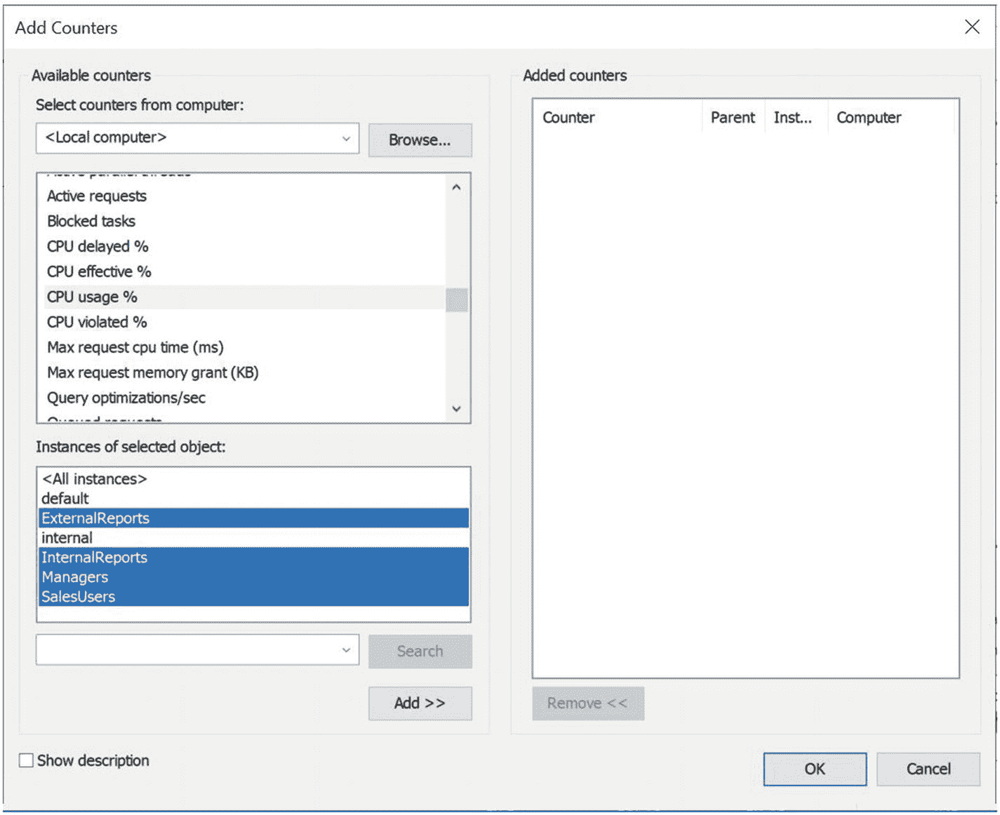

图 24-2: 添加工作负载组统计信息

现在我们已经添加了这个计数器，我们还需要从“资源池统计信息”类别中添加“活动内存授予量 (KB)”计数器的 `ReportingApp` 和 `SalesApplication` 应用程序实例，如图 24-3 所示。

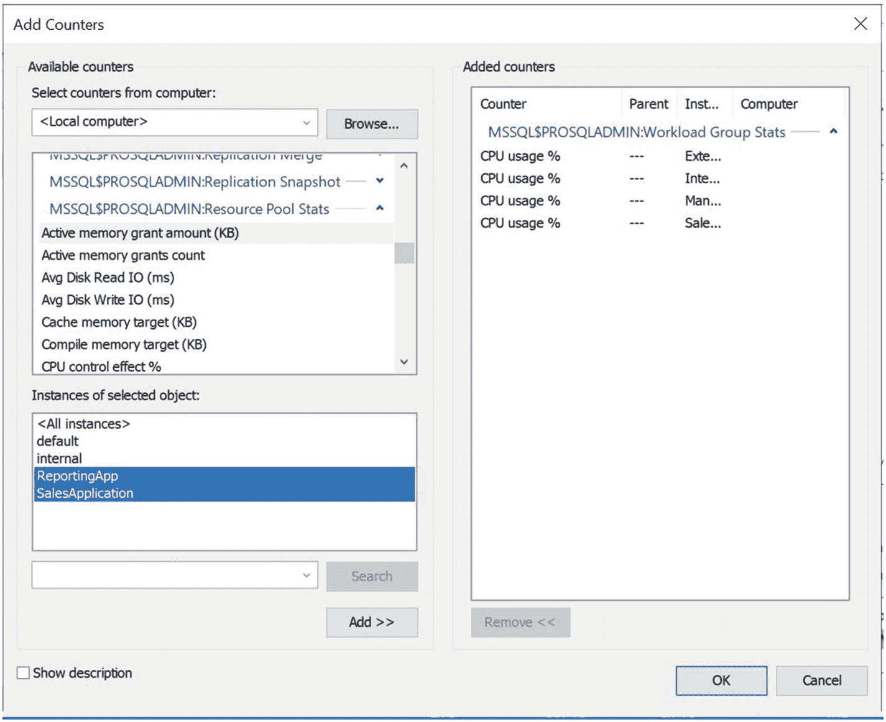

图 24-3: 资源池统计信息

要测试我们的资源调控器配置，我们可以使用清单 24-6 中的脚本。该脚本设计为在两个独立的查询窗口中运行。脚本的第一部分应在使用 `SalesUser` 登录名连接到实例的查询窗口中运行，第二部分应在使用 `SalesManager` 登录名连接到实例的查询窗口中运行。这两个脚本应同时运行，并使性能监视器生成类似于图 24-4 中的图表。尽管这些脚本不会导致调用分类器函数，但它们作为一种交互式方式来测试我们的逻辑。

#### 注意

以下脚本可能会返回大量数据。

```sql
--脚本第 1 部分 - 在使用 SalesManager 登录名连接的查询窗口中运行
EXECUTE AS LOGIN = 'SalesManager'
DECLARE @i INT = 0 ;
WHILE (@i < 10000)
BEGIN
SELECT DBName = (
SELECT Name AS [data()]
FROM sys.databases
FOR XML PATH('')
) ;
SET @i = @i + 1 ;
END
--脚本第 2 部分 - 在使用 SalesUser 登录名连接的查询窗口中运行
EXECUTE AS LOGIN = 'SalesUser'
DECLARE @i INT = 0 ;
WHILE (@i < 10000)
BEGIN
SELECT DBName = (
SELECT Name AS [data()]
FROM sys.databases
FOR XML PATH('')
) ;
SET @i = @i + 1 ;
END
```

清单 24-6: 针对 SalesUsers 和 Managers 工作负载组生成负载

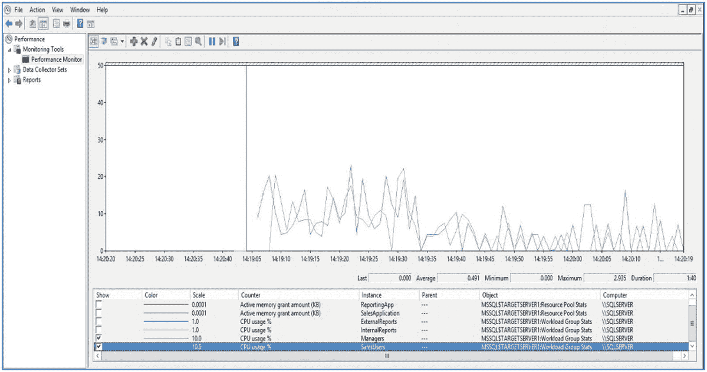

图 24-4: 查看 CPU 利用率

您可以看到 `SalesUsers` 和 `Managers` 工作负载组的 CPU 使用率几乎相同，这意味着资源调控器的实现正在按预期工作。

#### 使用动态管理视图进行监控

SQL Server 提供了 `sys.dm_resource_governor_resource_pools` 和 `sys.dm_resource_governor_workload_groups` 动态管理视图，数据库管理员可以使用它们来检查资源调控器统计信息。`sys.dm_resource_governor_resource_pools` 动态管理视图返回表 24-7 中详述的列。

表 24-7: `sys.dm_resource_governor_resource_pools` 返回的列

| 列名 | 描述 |
| --- | --- |
| `pool_id` | 资源池的唯一 ID |
| `name` | 资源池的名称 |
| `statistics_start_time` | 上次重置资源池统计信息的日期/时间 |
| `total_cpu_usage_ms` | 自上次重置统计信息以来资源池使用的总 CPU 时间 |
| `cache_memory_kb` | 资源池当前正在使用的总缓存内存 |
| `compile_memory_kb` | 资源池当前用于编译和优化的总内存 |
| `used_memgrant_kb` | 资源池用于内存授予的总内存 |
| `total_memgrant_count` | 自上次重置统计信息以来资源池中的内存授予总数 |
| `total_memgrant_timeout_count` | 自上次重置统计信息以来资源池中的内存授予超时总数 |
| `active_memgrant_count` | 资源池内当前内存授予的数量 |
| `active_memgrant_kb` | 资源池内当前用于内存授予的总内存量 |
| `memgrant_waiter_count` | 资源池内当前正在等待内存授予的查询数量 |
| `max_memory_kb` | 资源池可以保留的最大内存量 |
| `used_memory_kb` | 资源池当前已保留的内存量 |
| `target_memory_kb` | 资源池当前试图维持的内存量 |
| `out_of_memory_count` | 资源池内存分配失败的次数 |
| `min_cpu_percent` | 保证分配给资源池的平均最小 CPU 百分比 |
| `max_cpu_percent` | 资源池的平均最大 CPU 百分比 |
| `min_memory_percent` | 在内存争用期间保证可用于资源池的最小内存量 |
| `max_memory_percent` | 可分配给资源池的最大服务器内存百分比 |
| `cap_cpu_percent` | 资源池可用的最大 CPU 百分比的硬性限制 |

`sys.dm_resource_governor_workload_groups` 动态管理视图返回表 24-8 中详述的列。

表 24-8: `sys.dm_resource_governor_workload_groups` 返回的列


##### 工作负载组的统计列说明

以下是 `sys.dm_resource_governor_workload_groups` 视图中返回的列：

| 列名 | 说明 |
| --- | --- |
| `group_id` | 工作负载组的唯一 ID。 |
| `name` | 工作负载组的名称。 |
| `pool_id` | 工作负载组所关联的资源池的唯一 ID。 |
| `statistics_start_time` | 上次重置工作负载组统计信息的时间。 |
| `total_request_count` | 自上次重置统计信息以来，工作负载组中的请求数量计数。 |
| `total_queued_request_count` | 由于达到 `GROUP_MAX_REQUESTS` 阈值而被排队的工作负载组内的请求数量。 |
| `active_request_count` | 工作负载组中当前活动的请求数量计数。 |
| `queued_request_count` | 由于达到 `GROUP_MAX_REQUESTS` 阈值而当前在工作负载组中排队的请求数量。 |
| `total_cpu_limit_violation_count` | 自上次重置统计信息以来，工作负载组中超出 CPU 限制的请求数量计数。 |
| `total_cpu_usage_ms` | 自上次重置统计信息以来，工作负载组内请求使用的总 CPU 时间。 |
| `max_request_cpu_time_ms` | 自上次重置统计信息以来，工作负载组内任何单个请求使用的最大 CPU 时间。 |
| `blocked_task_count` | 工作负载组中当前被阻塞的任务数量计数。 |
| `total_lock_wait_count` | 自上次重置统计信息以来，工作负载组内请求发生的所有锁等待的数量计数。 |
| `total_lock_wait_time_ms` | 自上次重置统计信息以来，工作负载组内请求持有锁的时间总和。 |
| `total_query_optimization_count` | 自上次重置统计信息以来，工作负载组内发生的所有查询优化的数量计数。 |
| `total_suboptimal_plan_generation_count` | 自上次重置统计信息以来，工作负载组内生成的所有次优计划的数量计数。这些次优计划表明工作负载组正经历内存压力。 |
| `total_reduced_memgrant_count` | 自上次重置统计信息以来，工作负载组内达到最大大小限制的所有内存授予的数量计数。 |
| `max_request_grant_memory_kb` | 自上次重置统计信息以来，工作负载组内发生的最大单个内存授予的大小。 |
| `active_parallel_thread_count` | 工作负载组中当前使用的并行线程数量计数。 |
| `importance` | 为工作负载组重要性设置指定的当前值。 |
| `request_max_memory_grant_percent` | 为工作负载组的最大内存授予百分比指定的当前值。 |
| `request_max_cpu_time_sec` | 为工作负载组的 CPU 限制指定的当前值。 |
| `request_memory_grant_timeout_sec` | 为工作负载组的内存授予超时指定的当前值。 |
| `group_max_requests` | 为工作负载组的最大并发请求数指定的当前值。 |
| `max_dop` | 为工作负载组的 MAXDOP 指定的当前值。 |

### 连接 DMV 并生成报告

您可以使用 `pool_id` 列连接 `sys.dm_resource_governor_resource_pools` 和 `sys.dm_resource_governor_workload_groups` DMV。清单 24-7 中的脚本演示了如何实现这一点，以便返回一份报告，展示各工作负载组的 CPU 使用情况与资源池总体 CPU 使用情况的对比。

```sql
SELECT
    rp.name ResourcePoolName
    , wg.name WorkgroupName
    , rp.total_cpu_usage_ms ResourcePoolCPUUsage
    , wg.total_cpu_usage_ms WorkloadGroupCPUUsage
    , CAST(ROUND(CASE
                    WHEN rp.total_cpu_usage_ms = 0
                    THEN 100
                    ELSE (wg.total_cpu_usage_ms * 1.)
                         / (rp.total_cpu_usage_ms * 1.) * 100
                  END, 3) AS FLOAT) WorkloadGroupPercentageOfResourcePool
FROM sys.dm_resource_governor_resource_pools rp
INNER JOIN sys.dm_resource_governor_workload_groups wg
    ON rp.pool_id = wg.pool_id
ORDER BY rp.pool_id ;
```
**清单 24-7** CPU 使用情况报告

### 重置统计信息

您可以使用清单 24-8 中的命令重置由 `sys.resource_governor_resource_pools` 和 `sys.dm_resource_governor_workload_groups` DMV 暴露的累积统计信息。

```sql
ALTER RESOURCE GOVERNOR RESET STATISTICS ;
```
**清单 24-8** 重置资源治理器统计信息

### 资源池处理器关联性 DMV

SQL Server 暴露了第三个名为 `sys.dm_resource_governor_resource_pool_affinity` 的 DMV，它返回表 24-9 中详述的列。

**表 24-9** `dm_resource_governor_resource_pool_affinity` 返回的列

| 列名 | 说明 |
| --- | --- |
| `pool_id` | 资源池的唯一 ID。 |
| `processor_group` | 逻辑处理器组的 ID。 |
| `scheduler_mask` | 表示与资源池关联的调度程序的二进制掩码。有关解释此二进制掩码的更多详细信息，请参阅第 5 章。 |

您可以使用 `pool_id` 列将 `sys.dm_resource_governor_resource_pool_affinity` DMV 连接到 `sys.resource_governor_resource_pools` DMV。清单 24-9 演示了这一点；它首先更改默认资源池，使其仅使用处理器 0，然后显示已配置处理器关联性的每个资源池的调度程序二进制掩码。

```sql
ALTER RESOURCE POOL [Default] WITH(AFFINITY SCHEDULER = (0)) ;
ALTER RESOURCE GOVERNOR RECONFIGURE ;
SELECT
    rp.name ResourcePoolName
    , pa.scheduler_mask
FROM sys.dm_resource_governor_resource_pool_affinity pa
INNER JOIN sys.dm_resource_governor_resource_pools rp
    ON pa.pool_id = rp.pool_id ;
```
**清单 24-9** 为每个资源池调度二进制掩码

### 资源池卷 DMV

有一个名为 `sys.dm_resource_governor_resource_pool_volumes` 的 DMV，它返回每个资源池的 IO 统计信息的详细信息。该 DMV 的列在表 24-10 中描述。

**表 24-10** `dm_resource_governor_resource_pool_volumes` 返回的列


| 列名 | 描述 |
| --- | --- |
| `pool_id` | 资源池的唯一标识符 |
| `volume_name` | 磁盘卷的名称 |
| `min_iops_per_volume` | 当前为资源池配置的每个磁盘卷的最小 IOPS 数 |
| `max_iops_per_volume` | 当前为资源池配置的每个磁盘卷的最大 IOPS 数 |
| `read_ios_queued_total` | 自上次重置统计信息以来，针对此磁盘卷为资源池排队的读取 IO 操作总数 |
| `read_ios_issued_total` | 自上次重置统计信息以来，针对此磁盘卷为资源池发出的读取 IO 操作总数 |
| `read_ios_completed_total` | 自上次重置统计信息以来，针对此磁盘卷为资源池完成的读取 IO 操作总数 |
| `read_bytes_total` | 自上次重置统计信息以来，针对此磁盘卷为资源池读取的总字节数 |
| `read_io_stall_total_ms` | 自上次重置统计信息以来，针对此磁盘卷为资源池发出的读取 IO 操作到其完成之间的累计时间 |
| `read_io_stall_queued_ms` | 自上次重置统计信息以来，针对此磁盘卷为资源池的读取 IO 操作从到达至完成的累计时间 |
| `write_ios_queued_total` | 自上次重置统计信息以来，针对此磁盘卷为资源池排队的写入 IO 操作总数 |
| `write_ios_issued_total` | 自上次重置统计信息以来，针对此磁盘卷为资源池发出的写入 IO 操作总数 |
| `write_ios_completed_total` | 自上次重置统计信息以来，针对此磁盘卷为资源池完成的写入 IO 操作总数 |
| `write_bytes_total` | 自上次重置统计信息以来，针对此磁盘卷为资源池写入的总字节数 |
| `write_io_stall_total_ms` | 自上次重置统计信息以来，针对此磁盘卷为资源池发出的写入 IO 操作到其完成之间的累计时间 |
| `write_io_stall_queued_ms` | 自上次重置统计信息以来，针对此磁盘卷为资源池的写入 IO 操作从到达至完成的累计时间 |
| `io_issue_violations_total` | 自上次重置统计信息以来，针对资源池和磁盘卷执行的 IO 操作超出配置允许的总次数 |
| `io_issue_delay_total_ms` | IO 操作计划发出与实际发出之间的总时间 |

您可以使用 `sys.dm_resource_governor_resource_pool_volumes` DMV 来判断您的资源池配置是否导致了延迟。方法是将 `read_io_stall_queued_ms` 和 `write_io_stall_queued_ms` 相加，然后从 `read_io_stall_total_ms` 与 `write_io_stall_total_ms` 的总和中减去这个值，如清单 24-10 所示。此脚本首先修改默认资源池，以便对 IOPS 进行限制，随后报告 IO 停顿情况。

#### 提示

请记住，在用户定义的资源池中，您可能会看到远少于读取操作的写入操作。这是因为绝大多数写入操作是系统操作，因此它们发生在内部资源池中。

```
ALTER RESOURCE POOL [default] WITH(
min_iops_per_volume=50,
max_iops_per_volume=100) ;
ALTER RESOURCE GOVERNOR RECONFIGURE ;
SELECT
rp.name ResourcePoolName
,pv.volume_name
,pv.read_io_stall_total_ms
,pv.write_io_stall_total_ms
,pv.read_io_stall_queued_ms
,pv.write_io_stall_queued_ms
,(pv.read_io_stall_total_ms + pv.write_io_stall_total_ms)
- (pv.read_io_stall_queued_ms + pv.write_io_stall_queued_ms) GovernorLatency
FROM sys.dm_resource_governor_resource_pool_volumes pv
RIGHT JOIN sys.dm_resource_governor_resource_pools rp
ON pv.pool_id = rp.pool_id ;
```
清单 24-10: 发现资源池配置是否导致磁盘延迟

#### 提示

如果您没有看到任何 IO 停顿，请在性能较低的驱动器上创建一个数据库，并对其运行一些密集型查询，然后再重新运行清单 24-10 中的查询。

### 总结

资源调控器允许您在 SQL Server 实例级别对应用程序进行节流。您可以使用它来限制请求的内存、CPU 和磁盘使用量。您还可以使用它将一类请求与特定的调度程序或 NUMA 范围关联，或者降低一类请求的 `MAXDOP`。

资源池代表一组服务器资源，而工作负载组则是对以相同方式分类的相似请求的逻辑容器。资源调控器为系统请求提供了内部资源池和工作负载组，并为任何未分类的请求提供了一个默认资源池和工作负载组作为兜底方案。虽然内部资源池无法修改，但用户定义的资源池与工作负载组之间存在一对多的关系。

对 SQL Server 的请求使用用户定义的函数进行分类，该函数必须由 DBA 创建。此函数必须是返回 `sysname` 数据类型的标量函数，并且必须是绑定到架构的，并驻留在 Master 数据库中。DBA 可以使用系统函数（如 `USER_SNAME()`、`IS_MEMBER()` 和 `HOST_NAME()`）来辅助分类。

SQL Server 提供了四个动态管理视图 (DMV)，DBA 可以使用它们来帮助监控资源调控器的配置和使用情况。DBA 也可以使用性能监视器来监控资源调控器的使用情况，这为其提供了数据的可视化表示。采用这种方法时，您会发现性能监视器为服务器上存在的每个实例公开了资源池和工作负载组的计数器类别。这些类别中的计数器分别针对实例上当前配置的每个资源池或工作负载组都有一个实例。

### 索引

#### A

亲合性掩码 (Affinity mask)
Always Encrypted
管理密钥 (administering keys)
列主密钥清理对话框 (Column Master Key Cleanup dialog box)
列主密钥轮换对话框 (Column Master Key Rotation dialog box)
安全飞地 (Secure Enclaves)
`sys.column_encryption_keys`
`sys.column_encryption_key_values`
`sys.column_master_keys`
证明服务 (attestation service)
列加密密钥 (column encryption key)
列主密钥 (column master key)
数据库引擎定义的实现 (database engine defined implementation)
证明服务器 (attestation server)
加密对象 (cryptographic objects)
加密类型和功能兼容性 (encryption types and feature compatibility)
受防护主机 (guarded host)
插入数据 (insert data)
密钥存储 (key store)
安全飞地 (secure enclaves)
VBS 安全飞地 (VBS secure enclaves)
AlwaysOn 可用性 (AlwaysOn Availability)
优势与注意事项 (benefits and considerations)
`PROSQLADMIN-C` 集群 (`PROSQLADMIN-C` cluster)
ReadScale 数据库 (ReadScale database)
选择数据库页面 (select databases page)
指定可用性组选项 (Specify Availability Group options)
指定副本页面 (Specify Replicas page)
备份首选项选项卡 (Backup Preferences tab)
端点选项卡 (Endpoints tab)
监听器选项卡 (Listener tab)
只读路由选项卡 (Read-Only Routing tab)
副本选项卡 (Replicas tab)
选择初始数据同步页面 (Select Initial Data Synchronization page)
AlwaysOn 可用性组 (`AOAG`) (AlwaysOn Availability Groups (`AOAG`))
管理注意事项 (administrative considerations)
自动页修复 (automatic page repair)
数据层应用程序 (data-tier applications)
故障转移 (failover)
异步 (asynchronous)
同步 (synchronous)
`HA` 参见 `高可用性 (HA)` (`HA` See `High availability (HA)`)
监控 (monitoring)
AlwaysOn 仪表板 (AlwaysOn dashboard)
AlwaysOn 运行状况跟踪 (AlwaysOn health trace)
同步非包含对象 (synchronizing uncontained objects)
拓扑 (topology)
`虚拟机` (`VMs`)
AlwaysOn 仪表板 (AlwaysOn dashboard)
AlwaysOn 运行状况跟踪 (AlwaysOn health trace)
原子性、一致性、隔离性和持久性 (`ACID`) (Atomic, Consistent, Isolated and Durable (`ACID`))
自动提交事务 (Autocommit transactions)
自动化 (Automation)

#### B

备份 (Backup)
数据库 (database)
`大容量日志` 恢复模型 (`BULK LOGGED` recovery model)
创建 (creation)
设备 (devices)
媒体集 (media set)
差异备份 (differential)
文件组备份 (filegroup)
仅完整备份 (full backup–only)
完整/差异/事务日志备份 (full/differential/transaction logs)
`完整` 恢复模型 (`FULL` recovery model)
完整/事务日志备份 (full/transaction log)
日志备份 (log backup)
媒体 (media)
镜像媒体集 (mirrored media set)
部分备份 (partial)
`简单` 恢复模型 (`SIMPLE` recovery model)
SQL Server Management Studio
`AES` 算法 (`AES` algorithm)
备份选项页面 (Backup Options page)
文件组 (filegroups)
常规页面 (General page)
媒体选项页面 (Media Option page)
可靠性部分 (reliability section)
事务日志 (transaction log)
`T-SQL`
备份选项 (backup options)
备份集选项 (backup set options)
错误管理选项 (error management options)
日志特定选项 (log-specific options)
媒体集选项 (media set options)
杂项选项 (miscellaneous options)
`WITH` 选项 (`WITH` options)
`Bash`
B 树 (B-tree)
聚集索引扫描 (clustered index scan)
叶级别 (leaf level)
根节点 (root node)
唯一值生成器 (uniquifier)
`Bw 树` (`bw-tree`)


#### C

单元级加密验证器列加密函数 `DECRYPTBYKEY()` 函数 `DecryptByKey` 参数 重复数据库选择 `EncryptByKey()` 参数 `HASHBYTES()` 函数 盐值 `SensitiveData` 表 中央管理服务器 (CMS) 永恒加密 连接属性 新服务器组 注册服务器 Chapter6LogFragmentation 创建数据库 日志重用等待 日志大小与 VLFs 数量 `sys.databases` 事务日志 Chocolatey 分类器函数 客户端连接工具 客户端工具向后兼容性 客户端工具 SDK 聚集列存储索引 聚集索引 `CREATE CLUSTERED INDEX` `DROP INDEX` 主键 聚簇表 有表 无表 `WITH` 选项 排序规则 重音敏感 二进制排序规则 排序顺序 大小写敏感 配置页面 排序顺序 列存储索引 一致性错误 `CREATE TABLE` T-SQL 加密函数

#### D

数据库管理员 (DBA) 数据库一致性 `DBCC CHECKDB` 参见`DBCC CHECKDB` 检测错误 坏校验和错误 `CHECKSUM` `Corrupt Table` 事件类型 内存优化表 选项 页面 页面验证选项 查询 `suspect_pages` `suspect_pages` `TORN_PAGE_DETECTION` 错误 605 错误 823 错误 824 错误 5180 错误 7105 错误 系统数据库损坏 重新附加数据库 重建参数 修复实例参数 选择实例页面 VLDBs 数据库引擎服务 数据库级安全 内置数据库角色 包含数据库 架构 安全对象选项卡 T-SQL 数据库快照 优点 数据层应用程序 定义 实现 元数据驱动脚本 查询 恢复数据 稀疏文件 数据保护接口 (DPAPI) 数据质量服务器 数据结构 B 树 聚集索引 扫描 叶级 根节点 唯一标识符 堆 `DBCC CHECKALLOC` `DBCC CHECKCATALOG` `DBCC CHECKCONSTRAINTS` 参数 `DBCC CHECKDB` 参数 `CHECKALLOC` `CHECKCATALOG` `CHECKCONSTRAINTS` `CHECKFILEGROUP` `CHECKIDENT` `CHECKTABLE` 配置通知 损坏页面 `Corrupt Table` 错误 紧急模式 作业历史记录中的错误 新建操作员 选项 `REPAIR_ALLOW_DATA_LOSS` `REPAIR_REBUILD` 修复损坏 运行命令 建议的修复选项 `suspect_pages` 表 TempDB 空间 `DBCC CHECKFILEGROUP` `DBCC CHECKIDENT` 参数 `DBCC CHECKTABLE` `DB_ID()` 函数 `@DBName` 参数 `dbo.suspect_pages` 死锁 时间线 死锁监视器 最小化 观察脚本 受害者查询窗口 `DecryptByKey` 参数 延迟事务 并行度 (DOP) 灾难恢复 (DR) AOAG 参见 AlwaysOn 可用性组 (AOAG) 数据库创建 GUI 配置 临时还原 复制文件选项卡 初始化辅助数据库选项卡 日志传送监视器设置 监视器服务器 新建作业计划 无恢复模式 代理帐户 还原事务日志选项卡 保存日志传送配置 事务日志备份设置 事务日志传送页面 `vs.` HA 日志传送 恢复点目标 T-SQL 配置 `@backup_job_id` 输出 `sp_add_log_shipping_primary_database` 参数 `sp_add_log_shipping_primary_secondary` 系统 `sp_add_log_shipping_secondary_database` 参数 `sp_add_log_shipping_secondary_primary` 系统 `sp_processlogshippingmonitorsecondary` 参数 分布式重放 架构 客户端 配置选项 组件 控制器 配置 访问权限 启动和激活权限 日志记录级别 安全选项卡 数据库创建 `DReplay.exe.preprocess.config` `DReplay.exe.replay.config` 目标 同步 跟踪参数 转换事件、事件字段和操作 扩展事件会话 生成活动 预处理 分布式重放客户端 分布式重放控制器 Docker `-d` 开关 动态链接库 (DLL) 动态管理视图 (DMV) 二进制掩码 CPU 利用率 磁盘延迟 性能监视器 重置统计信息 资源池统计信息 销售用户和管理员登录 `sys.dm_resource_governor_resource_pool_affinity` `sys.dm_resource_governor_resource_pools` `sys.dm_resource_governor_resource_pool_volumes` `sys.dm_resource_governor_workload_groups` 工作负载组统计信息

#### E

版本与许可模型 CAL 开发者版 企业版 Express 版 运营团队 Server Core 标准版 总体拥有成本 (TCO) Web 版 `EncryptByKey()` 参数 加密 加密层次结构 非对称密钥 证书颁发机构 DPAPI SQL Server 备份和还原 数据库主密钥 数据库主密钥选择 EKM 模块 层次结构 还原服务主密钥 服务主密钥 对称密钥 生命周期终止 (EOL) 事件会话 数据库创建 对话框创建 高级选项卡 数据存储选项卡 常规选项卡 `module_start` 事件 `page_splits` 事件 T-SQL 参数 `WITH` 选项 `EXEC` 关键字 显式事务 扩展事件 操作 通道 数据收集 聚合对话框 使用 T-SQL 分析数据 列对话框 `Customers` 表 数据查看器 网格 数据查看器工具栏 `event_file` 目标 操作系统 数据收集器集 数据收集器集 生成活动 合并跟踪文件 Perfmon 数据 属性对话框 跟踪文件位置 T-SQL 命令 Windows 性能分析器 WMI-Activity 提供程序包 谓词 会话 参见事件会话 目标 类型和映射 可扩展密钥管理 (EKM) 模块 外部碎片

#### F

故障转移群集实例 (FCI) 主动/主动配置 节点 仲裁 三节点以上配置 文件组 添加文件 备份和还原策略 扩展文件 `FILESTREAM` 二进制缓存 缓冲区缓存 容器 数据库属性对话框 下拉框 `FileTable` 文件夹层次结构 T-SQL 命令 Windows 缓存 日志维护 Chapter6LogFragmentation 日志文件计数 日志重用等待 日志大小与 VLFs 数量 恢复模型 收缩 结构 `sys.databases` 事务日志 每 GB VLFs 内存优化策略 内存优化表 性能策略 主文件 循环方法 辅助文件 收缩文件 存储分层策略 `FILESTREAM` 二进制缓存 缓冲区缓存 容器 数据库属性对话框 下拉框 `FileTable` 文件夹层次结构 T-SQL 命令 Windows 缓存 筛选索引 `FORCE` 关键字 索引碎片 外部碎片检测 内部碎片 页拆分 移除 完全限定域名 (FQDN)

#### G

`GETDATE()` 函数 图形用户界面 (GUI) GUI 安装 安装中心 高级选项卡 安装选项卡 维护选项卡 选项选项卡 规划选项卡 资源选项卡 工具选项卡 独立数据库引擎实例 排序规则 参见排序规则 完成页面 数据目录选项卡 分布式重放客户端页面 分布式重放控制器页面 功能选择页面 `FILESTREAM` 选项卡 全局规则页面 安装规则页面 安装设置文件页面 实例配置页面 许可条款页面 MaxDOP 选项卡 内存选项卡 Microsoft 更新页面 产品密钥页面 产品更新页面 准备安装页面 选择服务帐户 服务器配置选项卡 安装角色页面 TempDB 选项卡

#### H

硬件要求 存储 磁盘块大小 文件放置 SAN 策略 最低要求 哈希冲突 哈希索引 堆 Hekaton 异构操作系统 在 Docker 容器中安装 SQL Server Chocolatey 包 创建数据库 创建映像文件 Docker 文件 Docker 映像 `-d` 开关 文件指令 Kubernetes MCR 运行 Docker 映像 `Start.ps1` 在 Linux 上安装 SQL Server 添加 sa 密码 Bash 脚本 参数 `systemctl` 工具 `ufw` 版本 高可用性 (HA) AlwaysOn 故障转移群集 主动/主动配置 节点 仲裁 三节点以上配置 停机成本 创建数据库页面 选择 数据同步页面 对话框 介绍页面 结果页面 指定名称页面 同步提交模式 选项卡 验证页面 数据库创建 `vs.` DR 可用性级别 计算 百分比 主动维护 SLA & SLO SQL Server Linux 组 添加数据库 创建证书 创建端点 创建组 创建侦听器 DAG 授予权限 辅助副本 RPO & RTO SQL Server 配置 备用 分类 混合缓冲池


#### I

隐式事务
索引
-   聚集列存储索引
-   聚集索引
    -   `CREATE CLUSTERED INDEX`
    -   `DROP INDEX`
    -   主键
    -   聚集表与非聚集表
    -   `WITH` 选项
-   列存储索引
-   碎片
    -   外部碎片检测
    -   内部碎片
    -   页拆分
    -   内存中碎片移除
-   索引
    -   非聚集哈希索引
    -   非聚集索引
        -   缺失索引
-   非聚集列存储索引
-   非聚集索引
    -   覆盖索引
    -   `CREATE NONCLUSTERED INDEX`
    -   `DROP INDEX`
    -   筛选索引
    -   分区索引
-   统计信息
    -   创建
    -   筛选统计信息
    -   更新
-   索引扫描算子
-   初始数据同步
-   内存中索引
    -   非聚集哈希索引
    -   非聚集索引
-   内存中 OLTP
-   实例配置
    -   `MAXDOP`
    -   最大服务器内存 (MB)
    -   最小服务器内存 (MB)
    -   通信端口
    -   进程
    -   数据库引擎
        -   动态端口
        -   IP 地址
    -   选项卡
        -   端口 445
        -   端口 1433
        -   协议选项卡
        -   静态端口
    -   处理器关联性
        -   I/O 关联掩码
        -   关联掩码
        -   位图
        -   NUMA 节点
    -   `sp_configure`
-   系统数据库
    -   Master
    -   Model
    -   MSDB
    -   mssqlsystemresource
    -   TempDB
-   跟踪标志
    -   `DBCC TRACEOFF`
    -   `DBCC TRACEON`
    -   启动参数
    -   跟踪标志 3042
    -   跟踪标志 3226
    -   跟踪标志 3625
-   Windows Server Core
-   实例安装
    -   `/ACTION` 参数
    -   命令行参数
    -   `/FEATURES` 参数
    -   `/IACCEPTSQLSERVERLICENSETERMS`
    -   安装进度
    -   可选参数
    -   产品更新
    -   冒烟测试
    -   故障排除
        -   `detail.txt` 日志文件
        -   `summary.txt`
        -   `SystemConfigurationCheck_Report.htm` 文件
-   实例级安全性
    -   AOAG
    -   固定服务器角色
    -   授予权限
    -   登录名创建
        -   `CHECK_POLICY`
        -   `强制实施密码策略`
    -   安全对象选项卡
    -   服务器角色选项卡
    -   SSMS 状态选项卡
    -   T-SQL
    -   用户映射选项卡
-   混合模式身份验证
    -   `SA` 账户
    -   安全漏洞
-   新建服务器角色
-   安全性选项卡
-   Windows 身份验证
    -   所有权链
    -   安全标识符
    -   `SQLUsers` 组
    -   Windows 用户/组
-   集成服务
-   内部碎片
-   `is_Advanced`
-   `is_dynamic`

#### J

作业
-   数据库邮件配置
    -   高级页面
    -   警报系统页面
-   `BACKUP DATABASE` 命令
-   浏览器服务
-   作业创建
    -   日志记录级别
    -   通知页面
    -   操作员创建
    -   PowerShell 脚本
    -   配置文件页面
    -   公共配置文件选项卡
    -   计划页面
    -   选择配置任务页面
    -   步骤页面
    -   系统参数配置
-   监控与维护
    -   警报
    -   执行
    -   作业历史记录

#### K

Kubernetes

#### L

本地分发服务器
本地附加存储
-   `RAID 0` 卷
-   `RAID 1` 卷
-   `RAID 5` 卷
-   `RAID 10` 卷
锁定
-   兼容性
-   粒度
-   `LOCK_ESCALATION`
-   观察
    -   在线维护
    -   分区
-   锁类型
    -   意向锁
日志传送
-   `DR` 参见灾难恢复 (DR)
-   故障转移
-   监视
-   日志传送主服务器警报
-   日志传送辅助服务器警报
    -   响应选项卡
    -   服务器代理警报
-   `sp_help_log_shipping_monitor`
-   切换角色
    -   禁用日志传送作业
    -   重新配置日志传送
    -   重新配置监视

#### M

机器学习服务器
受托管服务账户
Master 数据库
主数据服务
主服务器 (MSX)
内存优化表
-   创建
    -   基于磁盘的表
    -   `DLL`
    -   持久性
    -   内存中 OLTP
    -   迁移
合并复制
元数据
-   缓冲区缓存使用情况
-   容量管理
-   文件详细信息
-   `powerShell`
-   `sys.dm_db_file_space_usage`
-   `sys.dm_io_virtual_file_stats`
-   `sys.master_files`
-   `xp_fixeddrives`
-   目录视图
-   `DATALENGTH` 定义
-   数据驱动的自动化，重建索引
-   动态管理视图
-   信息架构视图
-   性能监视器计数器
    -   平均闩锁等待时间 (毫秒)
    -   `sys.dm_os_performance_counters`
    -   类型 65792
    -   类型 272696320
    -   类型 272696576
    -   类型 537003264
    -   类型 1073874176
    -   类型
    -   注册表值
-   服务器和实例级别
-   服务详细信息
-   等待
    -   重置状态
    -   `sys.dm_os_wait_stats`
    -   任务类型
-   元数据数据库
    -   `sys.dm_db_page_info`
        -   列
        -   参数
-   Microsoft 评估和规划 (MAP) 工具包
-   Microsoft 容器注册表 (MCR)
-   Microsoft 加密 API (MSCAPI)
-   缺失索引
-   混合模式身份验证
-   Model 数据库
-   MSDB 数据库
-   mssqlsystemresource 数据库
-   多服务器作业
    -   主作业
-   多服务器作业转换
    -   `sp_add_jobserver` 参数
    -   `sp_delete_jobserver` 参数
    -   `sp_msx_enlist` 存储过程
    -   `sp_update_job` 过程
    -   `sp_update_jobstep` 过程
-   MSX 和 TSX 服务器
    -   登录凭据页面
    -   主服务器操作员页面
    -   `MsxEncryptChannelOptions`
    -   代理创建
    -   注册表更新
    -   目标服务器页面
    -   目标服务器
        -   下载指令选项卡
        -   强制脱离按钮
        -   发布指令按钮
        -   启动作业，TARGETSERVER1
        -   同步时钟
    -   目标服务器状态选项卡

#### N

新技术文件系统 (NTFS)
非聚集列存储索引
非聚集哈希索引
非聚集索引
-   覆盖索引
-   `CREATE NONCLUSTERED INDEX`
-   `DROP INDEX`
-   筛选索引
非统一内存访问 (NUMA) 节点

#### O

`OBJECT_ID()` 函数
对象级安全性
-   列级权限
-   `OBJECT` 短语
操作系统配置
-   分配用户权限 参见用户权限分配
-   后台服务
    -   黄金版本
    -   电源计划
-   `EOL`
过量订阅的处理器

#### P

页拆分
分区索引
-   `$PARTITION` 函数
分区
-   概念
    -   函数层次结构
    -   索引对齐
    -   分区
    -   键方案
    -   定义
    -   消除
    -   实现
        -   现有表
        -   新建表创建
-   对象创建
    -   `$PARTITION` 函数
    -   结构
逐段还原
基于策略的管理 (PBM)
-   中央管理服务器
-   企业管理
    -   导入和导出
-   使用 PowerShell 进行策略评估
-   条件描述
-   评估模式
    -   `更改时:仅记录`
    -   `更改时:阻止`
    -   `按需`
    -   `按计划`
-   支持的执行类型
    -   `ExecuteSQL()` 参数
    -   `ExecuteWQL()` 参数
-   方面
-   策略简单静态策略
    -   `BrokenPolicy`
    -   数据库创建
    -   描述页面
    -   `ExcludeSystemDatabases`
        -   条件创建
        -   新建条件对话框创建
    -   新建策略对话框创建
    -   阻止不需要的活动
    -   目标
-   主角色属性
最小权限原则
发布访问列表 (PAL)

#### Q

`QUERY_CAPTURE_POLICY` 选项
查询存储配置
-   数据库问题
-   计划
-   退化查询报告
-   存储过程属性选项卡
-   查询
    -   `SET` 选项
-   SSMS 参见 SSMS 报告
-   T-SQL 对象
    -   目录视图
    -   等待统计信息映射

#### R

`RECONFIGURE` 命令
`RECONFIGURE WITH OVERRIDE` 命令
恢复模型
恢复点目标 (RPO)
恢复时间目标 (RTO)
独立磁盘冗余阵列 (RAID)
远程分发服务器
修复选项
复制
-   组件
-   合并
-   快照
-   事务性 参见事务复制
    -   `@RequiredSnapshots` 参数
资源调控器 参见资源池
资源池
-   参数
-   业务规则
    -   分类器函数创建
    -   实例准备
    -   测试
-   配置创建
    -   定义
    -   `DMV`
    -   二进制掩码
    -   CPU 使用率
    -   CPU 利用率
    -   磁盘延迟
    -   性能监视器
    -   重置统计信息
-   资源池统计信息
-   销售用户和经理登录
-   `sys.dm_resource_governor_resource_pools`
-   `sys.dm_resource_governor_resource_pool_volumes`
-   `sys.dm_resource_governor_workload_groups`
    -   工作负荷组统计信息
        -   IOPS 限制
        -   内存限制
        -   属性对话框
        -   `sys.dm_resource_governor_resource_pool_affinity`
-   工作负荷组
还原数据库
-   文件组页面
-   逐段
-   时间点
-   SQL Server Management Studio 备份时间线页面
-   文件页面
    -   常规页面
    -   选项页面
-   尾日志
-   T-SQL 错误管理选项
    -   介质集选项
    -   杂项选项
    -   还原参数
    -   还原选项
    -   `WITH` 选项
行版本控制


#### S

`串行高级技术附件(SATA)`、`服务器审核`、`AUDIT_CHANGE_GROUP`、`Audit-ProSQLAdmin`创建、数据库审核规范、启用和调用`FOR SERVER AUDIT`子句、`SensitiveData`表、`SERVER_ROLE_MEMBER_CHANGE_GROUP`、目标、`T-SQL`、`Windows 应用程序日志`、服务级别协议(SLA)、`会话超时`属性、`快照`复制、固态硬盘(SSD)、`sp_configure`、`ALTER SERVER CONFIGURATION MAXDOP`、`最大服务器内存`、`最小服务器内存`、`处理器关联性`、`sp_estimate_data_compression_savings`、`脑裂`、`SQL Server Agent`警报、`SQL Server`事件、`SQL Server`性能条件和响应、`WMI`事件、作业、高级页面、凭据创建、数据库邮件配置、环境准备、`频率`和`持续时间`部分、常规页面、`新建作业`计划框、通知页面、代理创建、删除旧备份、计划创建、`SCOM`、`SQLUser`和`WinUser`、步骤页面、操作员计划、安全性、数据库角色、代理账户、`SQL Server Analysis Services(SSAS)`、`SQL Server 安装中心`、`SQL Server Integration Services(SSIS)`、`SQL Server Management Studio(SSMS)`、`分发服务器/发布服务器`、`添加筛选器`、`代理安全性`页面、`文章属性`、`文章`页面、`分发数据库`页面、`分发服务器`页面、`筛选表行`页面、`发布数据库`页面、`发布类型`页面、`发布服务器`页面、`快照代理`页面、`快照代理安全性`、`快照文件夹`页面、`SQL Server Agent`开始页面、`向导操作`页面、`PAL`、`订阅者`、`分发代理`、`分发代理位置`页面、`常规`页面、`初始化订阅`页面、`发布`页面、`订阅者`页面、`同步计划`页面、`向导操作`页面、`SQL Server 内存池`、`SQL Server`安全模型、数据库级安全性、内置数据库角色、包含数据库、`架构`、`安全对象`选项卡、`T-SQL`、`DBA`、层次结构、`数据库用户`、`域用户/组`、`主体`、`安全对象`、实例级、参见`实例级安全性`、对象级安全性、列级权限、`OBJECT`短语、安全报告、`SQL 数据发现和分类`、`漏洞评估`、`服务器审核`、`AUDIT_CHANGE_GROUP`、`Audit-ProSQLAdmin`创建、数据库审核规范、启用和调用`FOR SERVER AUDIT`子句、`SERVER_ROLE_MEMBER_CHANGE_GROUP`、`SensitiveData`表、目标、`T-SQL`、`Windows 应用程序日志`、`SSMS`报告、`CPU`钻取详细信息、`总体资源消耗`、`查询等待统计`、标准网格视图、`顶级资源消耗者`、`待机`分类、索引创建的`统计信息`、`筛选统计信息`更新、`SWITCH`函数、`同步提交模式`、`sys.fn_dump_dblog()`、`sys.fn_PageResCracker()`、`systemctl`工具。

#### T

`表`压缩、`列存储`数据压缩向导、字典压缩、`维护页面`结构、前缀压缩、`行`压缩、`sp_estimate_data_compression_savings`、结构、表和分区、变长元数据、`内存优化表`，参见`内存优化表`、`分区`定义、消除、现有表、函数层次结构、实现`滑动窗口`、索引对齐、新建表创建、对象创建、`$PARTITION`函数、`分区键`、方案、结构、`目标服务器(TSX)`、`TDE`，参见`透明数据加密(TDE)`、`TempDB`数据库、`临界点`、`事务`复制、定义、`对等`、用途、工作原理、`事务`、原子性、`事务一致性`属性、`内存中 OLTP`跨容器、`读已提交`隔离、`读已提交快照`隔离、`可重复读`、重试逻辑、`可序列化`快照隔离、隔离持久化、`脏读`、`不可重复读`、乐观级别、悲观级别、`幻读`观察、`保存点`、`传输控制协议(TCP)`、`透明数据加密(TDE)`、`备份`证书、`FILESTREAM`文件组实现、`数据库加密`密钥、`数据库主密钥`选择、数据库进度、`内存中`文件组、还原和加密数据库、`服务器证书`还原、数据库`TempDB`、`可信平台模块(TPM)`。

#### U

`简单防火墙(ufw)`、用户权限分配、`即时文件锁定`、页面、`SQL`审核。

#### V

`超大型数据库(VLDB)`、`DBCC CHECKALLOC`、带`physical only`选项的`DBCC CHECKDB`、辅助服务器、拆分工作负载、`虚拟账户`、`虚拟机(VM)`、漏洞评估。

#### W, X, Y, Z

`wget`命令、全值替换攻击、`Windows 身份验证`模型、`Windows Server 核心安装`、配置文件、`自动安装`脚本、`PowerShell`、`PROSQLADMINCONF2`、`SQLAutoInstall.ps1`、`SQLPROSQLADMINCONF1`、实例，参见`实例安装`、`.NET Framework 3.5`。
