# 1. 等待统计详解

SQL Server 等待统计是一个重要工具，可用于分析与性能相关的问题或优化 SQL Server 的性能。然而，许多数据库管理员或开发人员对其并不十分了解。我认为这与其相对复杂的性质、不同类型的等待统计数量庞大以及许多类型缺乏文档说明有关。等待统计还与你分析它们所用的 SQL Server 直接相关，这意味着即使服务器 A 和服务器 B 拥有完全相同的硬件和数据库配置，也无法比较它们的等待统计。每一个配置选项，从硬件固件级别到客户端计算机上 SQL Server 本机客户端的配置，都会对等待统计产生影响！

基于上述原因，我坚信我们应该从 SQL Server 等待统计的基础和内部原理开始，以便你能熟悉它们是如何生成的、如何访问它们以及如何利用它们进行性能故障排查。这种方法将为你学习本书第二部分（我们将深入研究特定的等待统计）做好准备。

在本章中，我们将简要回顾等待统计在 SQL Server 各个版本中的历史。随后，我们将仔细研究 SQL 操作系统，即 `SQLOS`。`SQLOS` 的架构与等待统计以及一般的性能故障排查密切相关。本章的剩余部分将致力于讨论等待统计最重要的一个方面：线程调度。

在开始介绍 SQL Server 等待统计的基础和内部原理之前，我想先说明几个与讨论等待统计时使用的术语相关的问题。在本书的引言和前文中，我只提到了等待统计这个术语。句子“比较服务器 A 与服务器 B 的等待统计”实际上是不正确的，因为我们只能比较特定等待类型（与我们正在等待的资源相关的具体等待类型）的等待时间（我们在某个资源上等待的总时间）。从此时起，当我使用术语“等待统计”时，我指的是等待统计这一概念，并在适当时使用正确的术语“等待时间”和“等待类型”。

## 等待统计简史

SQL Server 已经存在相当长的时间了；其第一个版本发布于 1989 年，面向 OS/2 平台。直到 1995 年发布的 SQL Server 6.0，微软一直与 Sybase 合作开发 SQL Server。然而在 1995 年，微软和 Sybase 分道扬镳。微软和 Sybase 在数据库领域都保持活跃（SAP 实际上于 2010 年收购了 Sybase），到 2019 年，微软发布了 SQL Server 2019，而 SAP 则在 2014 年发布了 SAP Sybase ASE 16（至今仍在维护），两者都是关系型企业级数据库系统。

从 SQL Server 6.0 到 SQL Server 2019，发生了如此多的变化，以至于你根本无法比较这两个版本。然而，多年来有一件事未曾改变，那就是等待统计。SQL Server 会以某种方式存储其内部进程的信息，尽管我们访问这些信息的方式多年来已经改变，但等待统计仍然是内部日志记录过程的重要组成部分。

在 SQL Server 的早期版本中，我们需要使用未公开文档的命令来访问等待统计。图 1-1 展示了在 SQL Server 6.5 中使用 `DBCC` 命令查询等待统计信息的方法。

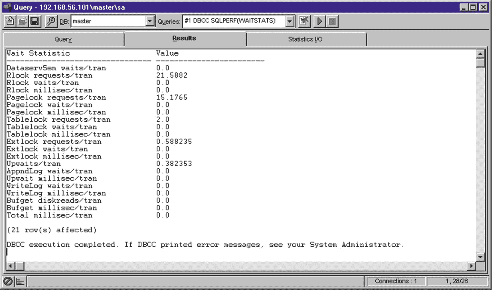

图 1-1

SQL Server 6.5 中的等待统计

SQL Server 2005 引入的重大变更之一是将许多内部函数和命令转换为 `动态管理视图（DMV）`，其中包括等待统计信息。这使得查询和分析函数或命令返回的信息变得容易得多。随着 Tom Davidson 的微软白皮书《SQL Server 2005 Waits and Queues》的发布，一种新的性能分析方法诞生了。

在 SQL Server 的各个版本中，每当引入新功能或配置选项时，不同等待类型的数量都会呈指数级增长。如果你仔细观察图 1-1，你会注意到它返回了 21 种不同的等待类型。图 1-2 显示了 SQL Server 2017 中可用的等待类型数量，即返回的行数。

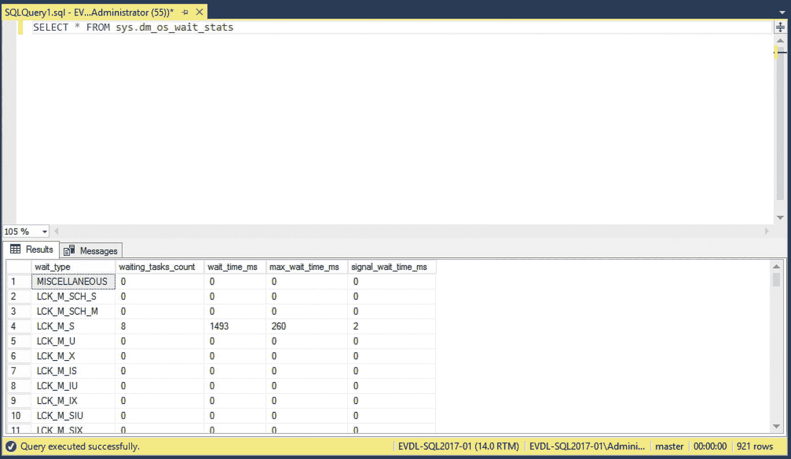

图 1-2

SQL Server 2017 中的等待统计

这 921 行都是不同的等待类型，保存了 SQL Server 引擎不同部分的等待信息。随着 SQL Server 2019 社区技术预览版（`CTP`）2.4 的发布，等待类型的数量进一步增加，超过了 1000 种。随着新功能的引入或现有功能的改变，等待类型的数量在未来 SQL Server 版本中将继续增长。值得庆幸的是，现在关于等待统计的信息比 SQL Server 6.5 时代要丰富得多！


## SQLOS

计算机硬件世界在不断变化。每年，甚至在某些情况下是每个月，我们都设法在处理器中加入更多核心，提高主板的内存容量，或者引入全新的硬件概念，比如基于 PCI 的持久化闪存存储。数据库管理系统（DBMS）总是最先想要利用新硬件趋势的应用程序类型之一。由于硬件的快速变化特性以及需要一有新的硬件选项就加以利用，SQL Server 团队在 SQL Server 2005 中决定改变 SQL Server 的平台层。

在 SQL Server 2005 之前，SQL Server 的平台层限制很多，许多操作都是由操作系统执行的。这意味着 SQL Server 很难跟上快速变化的服务器硬件世界，因为为了利用更快的硬件或新的硬件特性而更改整个操作系统是一项耗时且复杂的操作。

图 1-3 展示了在 SQL Server 2005 引入 SQLOS 之前，SQL Server 的（简化）架构。

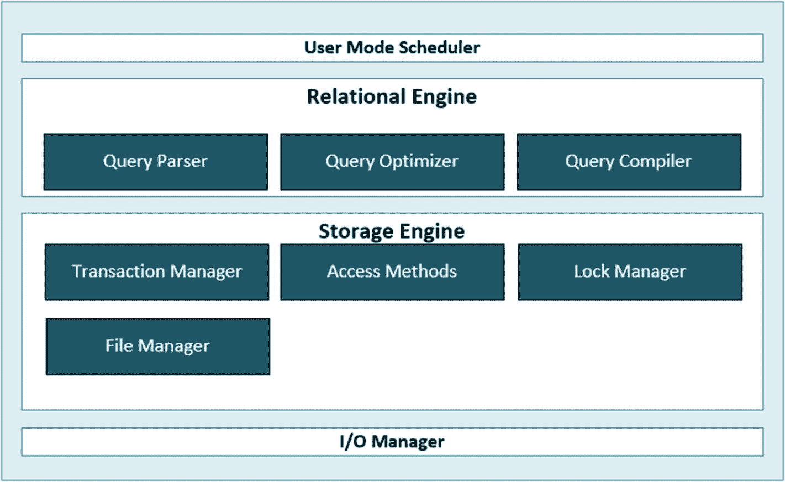

图 1-3
引入 SQLOS 之前的 SQL Server 架构

SQL Server 2005 引入了迄今为止 SQL Server 引擎最大的变化之一：SQLOS。这是一个全新的平台层，充当用户级别的操作系统。这个新的操作系统使得充分利用当前和未来的硬件成为可能，并实现了诸如高级并行性等功能。SQLOS 高度可配置，会根据其运行的硬件进行调整，因此对于高端或低端系统都具有完美的可扩展性。

图 1-4 展示了 SQL Server 2005 的（简化）架构，包括 SQLOS 层。

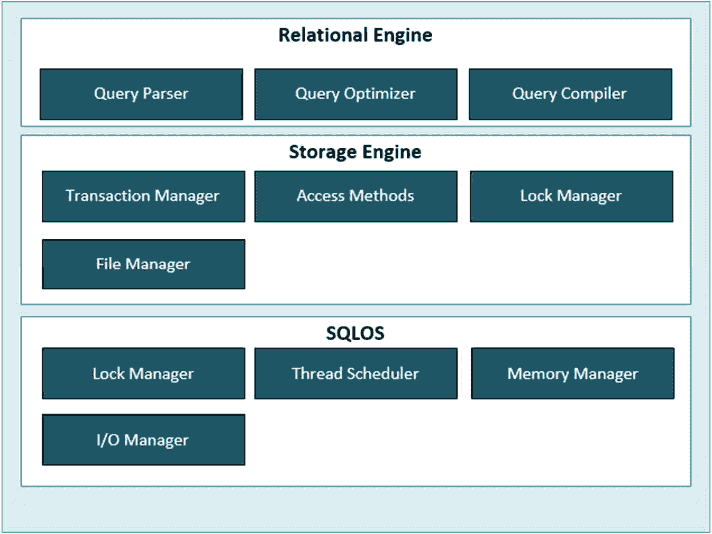

图 1-4
SQL Server 2005 架构

SQLOS 通过引入调度器（schedulers）、任务（tasks）和工作线程（worker threads），改变了 SQL Server 访问处理器资源的方式。这使得 SQLOS 能够更好地控制如何由处理器来完成工作。Windows 操作系统采用*抢占式调度*方法。这意味着 Windows 会给每个需要处理器时间的进程分配一个优先级和固定的时间片，或称为*量程*。这个进程优先级是根据许多变量计算得出的，如资源使用情况、预期运行时间、当前活动等。通过使用抢占式调度，Windows 操作系统可以选择在某个进程需要处理器时间但优先级更高的进程到来时中断当前进程。这种调度方式可能对 SQL Server 生成的进程产生负面影响，因为这些进程很容易被更高优先级的进程（包括其他应用程序的进程）中断。因此，SQLOS 使用自己的（协作式）非抢占式调度机制，确保 Windows 进程无法中断 SQLOS 进程。

SQL Server 7 和 SQL Server 2000 也使用用户模式调度（UMS）进行非抢占式调度。SQLOS 将更多的系统组件紧密地结合在一起，从而实现了更好的性能和可扩展性。

在 SQLOS 无法使用非抢占式调度的情况下也有一些例外，例如当 SQLOS 需要通过 Windows 操作系统访问资源时。我们将在本书后面的第 11 章“抢占式等待类型”中讨论这些例外情况。

## 调度器、任务和工作线程

由于 SQLOS 使用与 Windows 操作系统不同的方法来执行请求，SQL Server 引入了一种不同的方式来调度处理器时间，使用调度器、任务和工作线程。图 1-5 展示了 SQL Server 调度的不同部分以及它们之间的关系。

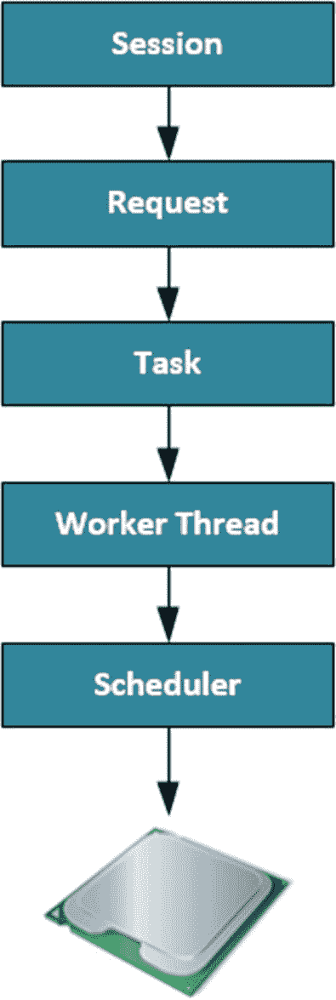

图 1-5
SQL Server 调度

### 会话

一个*会话*是客户端与其连接的 SQL Server 之间建立的连接（在成功通过身份验证之后）。我们可以通过使用以下查询查询 `sys.dm_exec_sessions` DMV 来轻松访问会话信息：

```sql
SELECT * FROM sys.dm_exec_sessions;
```

一般来说，用户会话的 `session_id` 大于 50；小于 50 的都保留给内部 SQL Server 进程。然而，在非常繁忙的服务器上，SQL Server 有可能需要使用大于 50 的 `session_id`。如果你只对用户发起的会话信息感兴趣，最好使用 `is_user_process` 列来过滤 `sys.dm_exec_sessions` DMV 的结果，而不是过滤 `session_id` 大于 50。以下查询将只返回用户会话并过滤掉内部系统会话：

```sql
SELECT * FROM sys.dm_exec_sessions
WHERE is_user_process = 1;
```

图 1-6 显示了此查询结果的一小部分。

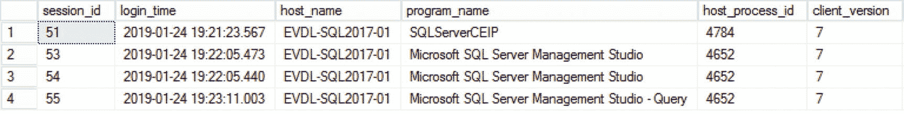

图 1-6
`sys.dm_exec_sessions` 结果

`sys.dm_exec_sessions` DMV 返回的列要多得多，这些列提供了关于特定会话的信息。一些更有趣、值得额外解释的列包括 `host_process_id`，这是连接到 SQL Server 的客户端程序的进程 ID（PID）。`cpu_time` 列将告诉你该会话自建立以来已使用的处理器时间（以毫秒为单位）。`memory_usage` 列显示会话使用的内存量。这不是以 MB 或 KB 为单位，而是使用的 8 KB 页面数。另一个我想重点说明的列是 `status` 列。这将显示会话是否有活动请求。`status` 列最常见的值是“Running”，表示当前正在从此会话处理一个或多个请求；以及“Sleeping”，表示当前没有从此会话处理任何请求。

### 请求

一个*请求*是 SQL Server 执行引擎对由会话提交的查询的表示。同样，我们可以使用一个 DMV 来查询关于请求的信息；在本例中，我们可以针对 `sys.dm_exec_requests` DMV 运行一个查询，如下所示：

```sql
SELECT * FROM sys.dm_exec_requests;
```

图 1-7 显示了此查询结果的一部分。

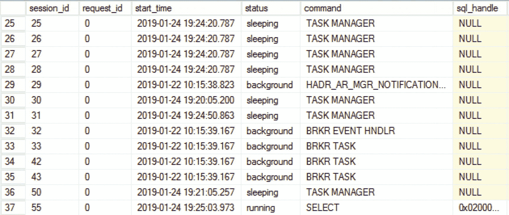

图 1-7
`sys.dm_exec_requests` 结果

`sys.dm_exec_requests` DMV 是在对任何与性能相关的问题进行故障排除时使用的极其强大的工具。原因是它包含大量关于正在执行的实际查询的信息，并且可以帮助你相对快速地检测到性能瓶颈。因为 `sys.dm_exec_requests` DMV 也显示与等待统计相关的信息，我们将在第 2 章“查询 SQL Server 等待统计信息”中对其进行详细研究。

### 任务

`任务`代表 SQLOS 需要执行的实际工作，但任务本身并不执行任何工作。当 SQL Server 接收到请求时，会创建一个或多个任务来完成该请求。为一个请求生成的任务数量取决于查询请求是使用并行方式执行还是串行方式执行。

我们可以使用 `sys.dm_os_tasks` 动态管理视图 (DMV) 来查询任务信息，就像我在以下示例查询中所做的那样：

```sql
SELECT * sys.dm_os_tasks;
```

图 1-8 显示了该查询的部分结果。

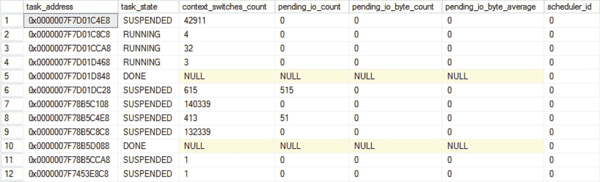

图 1-8

sys.dm_os_tasks 查询结果

当你查询 `sys.dm_os_tasks` DMV 时，你会发现即使在没有用户活动的服务器上，它也会返回大量结果。这是因为 SQL Server 也会为自己的进程使用任务；你可以通过查看 `session_id` 列来识别这些任务。

在这个 DMV 中有一些有趣的列，值得探索以了解不同 DMV 之间的关系。`task_address` 列将显示任务的内存地址。`session_id` 将返回请求该任务的会话 ID，而 `worker_address` 将保存与该任务关联的工作线程的内存地址。

### 工作线程

`工作线程`是请求的实际工作得以执行的地方。每个创建的任务都会被分配一个工作线程，然后由该工作线程执行任务请求的操作。

实际上，工作线程本身并不执行工作；它会向 Windows 操作系统请求一个线程来替它执行工作。为了简单起见，并且考虑到实际的 Windows 线程运行在 SQLOS 之外，我已将此步骤从图 1-5 中省略了。如果你感兴趣，可以通过查询 `sys.dm_os_threads` 来访问有关 Windows 操作系统线程的信息。

当任务请求工作线程时，SQL Server 会查找一个空闲的工作线程并将其分配给该任务。如果找不到空闲的工作线程，并且工作线程的最大数量已经达到，则该请求将被排队，直到某个工作线程完成其当前工作并变得可用。

SQL Server 用于处理请求的工作线程数量是有限的。这个数字将在启动时由 SQL Server 自动计算和配置。我们也可以使用以下公式自己计算最大工作线程数：

*   32 位系统，逻辑处理器数量小于或等于 4：
    256 个工作线程
*   32 位系统，逻辑处理器数量大于 4：
    256 + ((逻辑处理器数量 – 4) * 8)
*   64 位系统，逻辑处理器数量小于或等于 4：
    512 个工作线程
*   64 位系统，逻辑处理器数量大于 4：
    512 + ((逻辑处理器数量 – 4) * 16)

示例：如果我们有一个 64 位系统，配备 16 个处理器（或核心），我们可以使用公式 512 + ((16 – 4) * 16) 计算最大工作线程数，得出最大工作线程数为 704。

工作线程的数量可以从默认值 `0`（这意味着 SQL Server 在启动时使用上述公式设置最大工作线程数）进行更改，方法是更改 SQL Server 属性中的 `最大工作线程数` 选项，如图 1-9 所示。

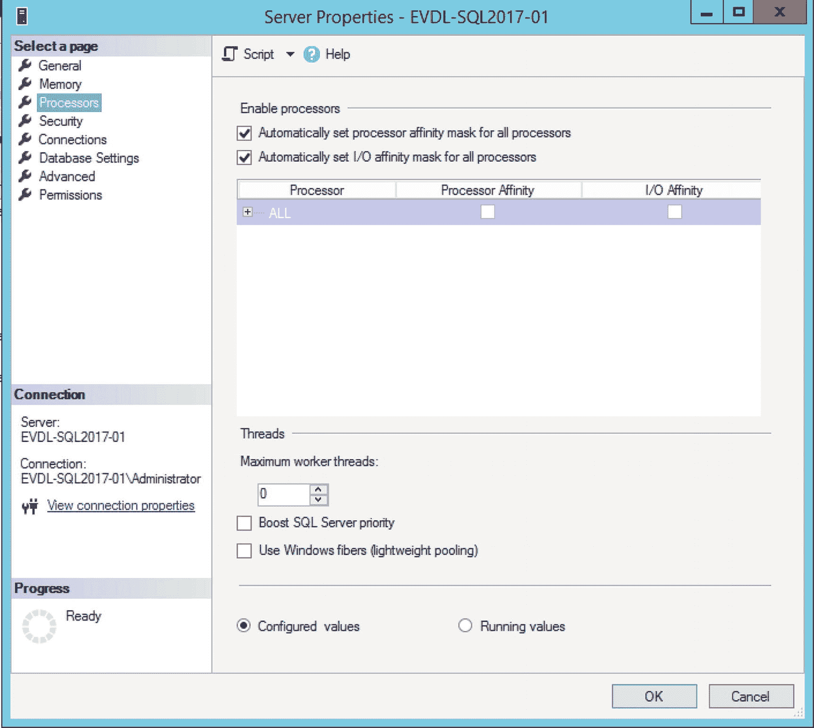

图 1-9

服务器属性中的处理器页面

一般来说，不需要更改 `最大工作线程数` 选项，我的建议是保持默认设置不变，因为它只应在非常特定的情况下进行更改（我将在第 5 章“与 CPU 相关的等待类型”中讨论其中一种可能的情况，届时我们将讨论 THREADPOOL 等待）。

需要记住的一点是，工作线程需要内存才能工作。对于 32 位系统，每个工作线程需要 512 KB；64 位系统则需要 2048 KB。因此，更改工作线程数量可能会影响 SQL Server 的内存需求。这并不意味着你需要为工作线程配备大量内存——如果工作线程空闲超过 15 分钟或 SQL Server 面临严重的内存压力，SQL Server 会自动销毁工作线程。

SQL Server 提供了一个 DMV 来查询工作线程的信息：`sys.dm_os_workers`。图 1-10 显示了此查询的部分结果：

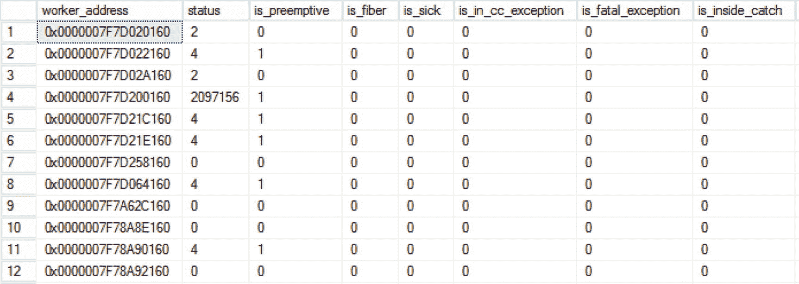

图 1-10

查询 sys.dm_os_workers 的结果

```sql
SELECT * FROM sys.dm_os_workers;
```

`sys.dm_os_workers` DMV 是一个非常庞大且复杂的 DMV，其中许多列被 Microsoft 标记为“仅供内部使用”。在这个 DMV 中，`task_address` 和 `scheduler_address` 列可用于链接我们讨论过的不同 DMV。

工作线程在被暴露给处理器时会经历不同的阶段，我们可以通过查看 `sys.dm_os_workers` DMV 中的 `state` 列来观察：

*   `INIT`：工作线程正由 SQLOS 初始化。
*   `RUNNING`：工作线程当前正在处理器上执行工作。
*   `RUNNABLE`：工作线程已准备好在处理器上运行。
*   `SUSPENDED`：工作线程正在等待某个资源。

工作线程在执行工作时经历的状态是本书的主要主题之一。每当工作线程不处于 `RUNNING` 状态时，它就必须等待，SQLOS 会将此信息记录到等待统计信息中，这使我们能够深入了解工作线程一直在等待什么以及等待了多长时间。


### 调度器

`调度器`组件的主要任务是——正如其名——将工作（以任务的形式）调度到物理处理器上。当一个任务请求处理器时间时，正是调度器为该任务分配工作线程，以便请求得到处理。它还负责确保工作线程相互协作，并在它们分配到的时间片（或称为量程）到期时让出处理器。我们称此为**协同调度**。工作线程在其处理器时间到期时必须让出的原因在于，调度器一次只允许一个工作线程在处理器上运行。如果工作线程无需让出，一个工作线程可能无限期地占用处理器，从而阻塞对该处理器的所有使用。

处理器与调度器之间是一一对应的关系。如果你的系统有两个处理器，每个处理器有四个核心，那么 SQLOS 将可以使用八个调度器来处理用户请求，每个调度器映射到一个逻辑处理器。

我们可以通过查询 `sys.dm_os_schedulers` DMV（动态管理视图）来获取关于调度器的信息：

```sql
SELECT * FROM sys.dm_os_schedulers;
```

查询结果如图 1-11 所示。

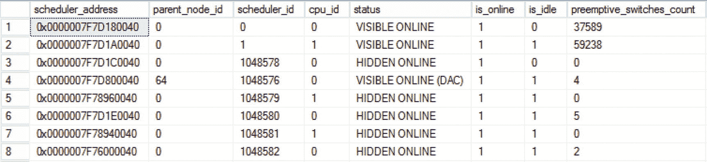

图 1-11

`sys.dm_os_schedulers` 查询结果

我运行此查询的 SQL Server 实例有一个双核处理器，这意味着应该有两个调度器可以处理我的用户请求。然而，如果我们查看图 1-11，会注意到查询返回的调度器不止两个。SQL Server 使用其自己的调度器来执行内部任务，这些调度器也会被 DMV 返回，并在其 `status` 列中标记为“HIDDEN ONLINE”。可供用户请求使用的调度器在 DMV 中被标记为“VISIBLE ONLINE”。还有一种特殊类型的调度器，其 `status` 为“VISIBLE ONLINE (DAC)”。这是一个专用于**专用管理员连接**的调度器。当 SQL Server 无响应时（例如，处理用户请求的调度器上没有空闲的工作线程），此调度器可以让你连接到 SQL Server。

通过查看 `current_workers_count` 列，我们可以看到一个调度器关联了多少个工作线程。这个数字也包括了未执行任何工作的工作线程。`active_workers_count` 向我们显示了在特定调度器上处于活动状态的工作线程。这并不意味着它们实际在处理器上运行，因为状态为“RUNNING”、“RUNNABLE”和“SUSPENDED”的工作线程也会计入此数字。`work_queue_count` 也是一个有趣的列，因为它能让你了解有多少任务正在等待空闲的工作线程。如果你在此列中看到较大的数字，可能意味着你正经历 CPU 压力。

### 综合概述

到目前为止，我们讨论的 SQL Server 调度的所有部分都是相互关联的，每个请求都经过这些相同的组件。以下文本是一个查询请求如何被处理的示例。

用户通过应用程序连接到 SQL Server。登录过程成功完成后，SQL Server 将为该用户创建一个会话。当用户向 SQL Server 发送查询时，将创建一个任务和一个请求来表示需要完成的工作单元。调度器将为该任务分配工作线程以便完成。

为了在 SQL Server 中查看所有这些信息，我们可以连接一些使用过的 DMV。代码清单 1-1 中的查询将向你展示一个示例，说明如何组合不同的 DMV 来获取特定会话（本例中为 ID 是 55 的会话）的调度信息。

```sql
SELECT
r.session_id AS '会话 ID',
r.command AS '请求类型',
qt.[text] AS '查询文本',
t.task_address AS '任务地址',
t.task_state AS '任务状态',
w.worker_address AS '工作线程地址',
w.[state] AS '工作线程状态',
s.scheduler_address AS '调度器地址',
s.[status] AS '调度器状态'
FROM sys.dm_exec_requests r
CROSS APPLY sys.dm_exec_sql_text(r.sql_handle) qt
INNER JOIN sys.dm_os_tasks t
ON r.task_address = t.task_address
INNER JOIN sys.dm_os_workers w
ON t.worker_address = w.worker_address
INNER JOIN sys.dm_os_schedulers s
ON w.scheduler_address = s.scheduler_address
WHERE r.session_id = 55
```

代码清单 1-1

连接不同的 DMV 以查询调度信息

图 1-12 显示了在我的测试 SQL Server 上该查询返回的信息。为了保持结果可读性，我只选择了 DMV 中的一些列来展示它们之间的关系。


图 1-12

代码清单 1-1 中查询的结果

在结果中，我们可以看到会话 ID 53 发起了一个 `SELECT` 查询请求。我使用了 `sys.dm_exec_sql_text` 动态管理对象进行交叉应用，以显示该请求的查询文本。该请求映射到了一个任务，并且该任务已开始运行。然后，该任务映射到一个工作线程，该工作线程当时也处于运行状态。这意味着此查询开始在处理器上被处理。`调度器地址` 列显示了我们的工作线程在哪个特定的调度器上运行。


## 等待统计

到目前为止，我们已经深入了解了为 SQL Server 执行调度的不同组件以及它们是如何相互连接的，但我们并未过多关注本书的主题：等待统计。

在本章前面关于工作线程的部分，我描述了工作线程在调度器上执行工作时可能处于的状态。当一个工作线程执行其工作时，它会在调度器进程中经历三个不同的阶段（或队列）。根据工作线程所处的阶段（或队列），它将分别获得“运行中”、“可运行”或“已暂停”状态。图 1-13 展示了一个具有这三个不同阶段的调度器的抽象视图。

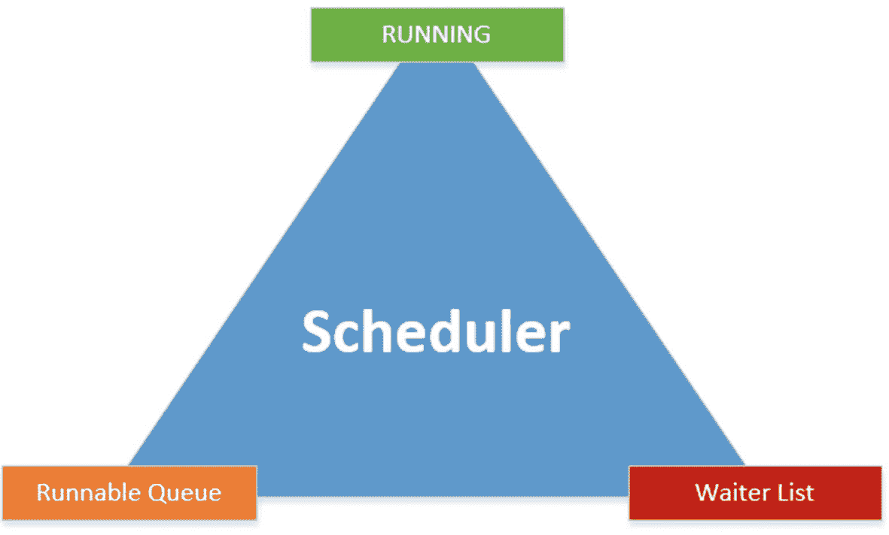

图 1-13：调度器及其阶段和队列

当一个工作线程获得访问调度器的权限时，它通常会在等待列表中启动，并获得“已暂停”状态。`等待列表`是一个无序列表，包含所有处于“已暂停”状态并等待资源变得可用的工作线程。这些资源可以是系统中几乎任何东西，从数据页到锁请求。当一个工作线程位于`等待列表`中时，SQLOS 会记录它继续工作所需的资源类型（等待类型）以及该特定资源变得可用之前所花费的等待时间，即`资源等待时间`。

每当一个工作线程获得其所需资源的访问权限时，它将移动到`可运行队列`，这是一个先进先出的列表，包含所有已获得资源访问权限并准备好在处理器上运行的工作线程。工作线程在`可运行队列`中花费的时间被记录为`信号等待时间`。

`可运行队列`中的第一个工作线程将移动到“运行中”阶段，在那里它将获得处理器时间来执行其工作。它在处理器上花费的时间被记录为 `CPU 时间`。与此同时，`可运行队列`中的其他工作线程将在列表中向上移动一个位置，而已获得其请求资源的工作线程将从`等待列表`移动到`可运行队列`中。

当一个工作线程处于“运行中”阶段时，可能发生以下三种情况：

*   工作线程需要额外的资源；在这种情况下，它将从“运行中”阶段移动到`等待列表`。
*   工作线程用完了其时间量（固定值为 4 毫秒）并且必须让出处理器；该工作线程被移动到`可运行队列`的底部。
*   工作线程完成其工作并将离开调度器。

工作线程不断地在这三个不同阶段中移动，并且一个工作线程在其工作完成之前多次经历这些阶段是非常常见的。

图 1-14 将向你展示图 1-13 中的调度器视图，结合了不同类型的等待时间以及工作线程的流动。

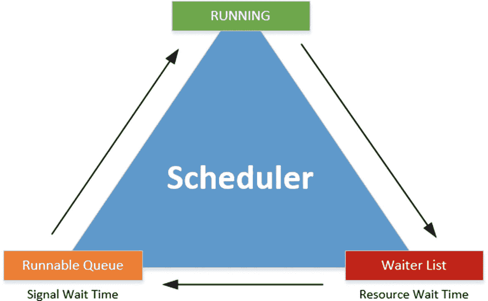

图 1-14：包含等待时间和工作线程流动的完整调度器视图

了解请求在三个不同阶段中各自花费的所有不同时长，就可以计算出总的请求执行时间，以及请求为等待处理器时间或资源时间所花费的总时间。图 1-15 展示了总执行时间及其不同部分的计算方式。

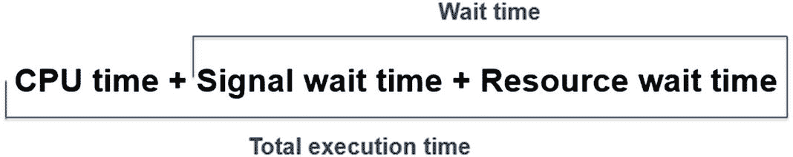

图 1-15：请求执行时间计算

由于 SQL Server 中工作线程调度涉及大量术语，我想给你举一个例子来说明工作线程是如何在调度器中移动的。

图 1-16 将向你展示一个类似于我们之前看过的调度器的抽象图像，但这次我添加了正在由该调度器处理的请求。

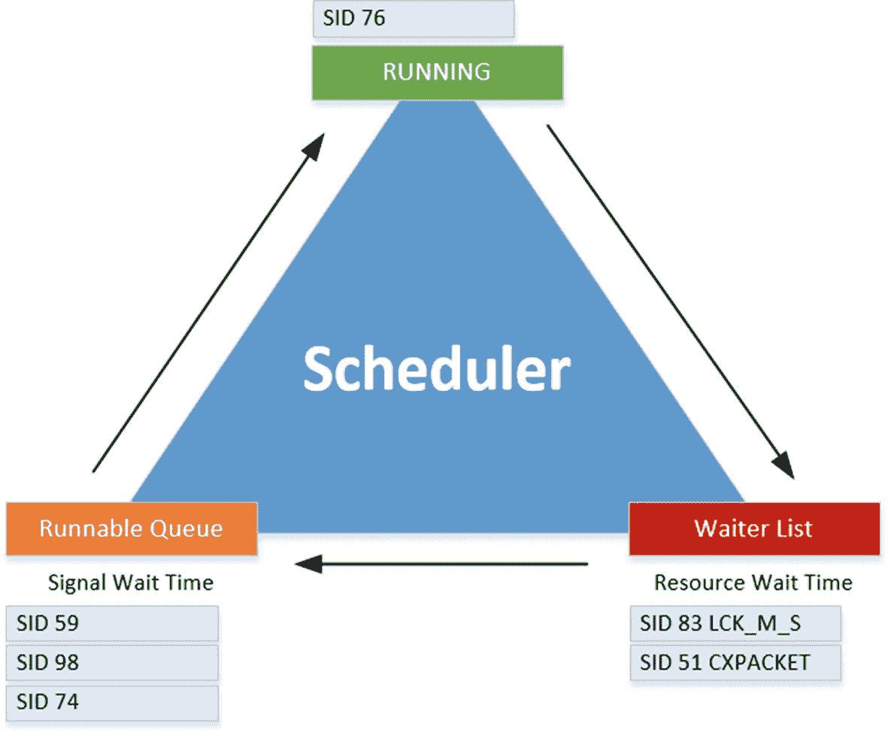

图 1-16：带有运行请求的调度器

在这个例子中，我们看到 `SID`（会话 ID）为 76 的请求当前正在处理器上执行；该请求的状态将是“运行中”。还有另外两个请求，`SID 83` 和 `SID 51`，位于`等待列表`中，等待它们请求的资源。它们正在等待的等待类型是 `LCK_M_S` 和 `CXPACKET`。这里我不详细介绍这些等待类型，因为我们将在本书的第二部分讨论它们。当这两个会话位于`等待列表`中时，SQL Server 会将它们在那里花费的时间记录为等待时间，并将等待类型记录为它们正在等待的资源的代表。如果我们查询关于这两个线程的信息，它们都将具有“已暂停”状态。`SID 59`、`SID 98` 和 `SID 74` 已准备好它们的资源，正在`可运行队列`中等待 `SID 76` 完成其在处理器上的工作。当它们在`可运行队列`中等待时，SQL Server 将它们在那里花费的时间记录为信号等待时间，并将该时间添加到总等待时间中。这三个工作线程的状态将是“可运行”。

在图 1-17 中，我们向前移动了几毫秒的时间；请注意调度器和工作线程是如何在不同阶段和队列中移动的。

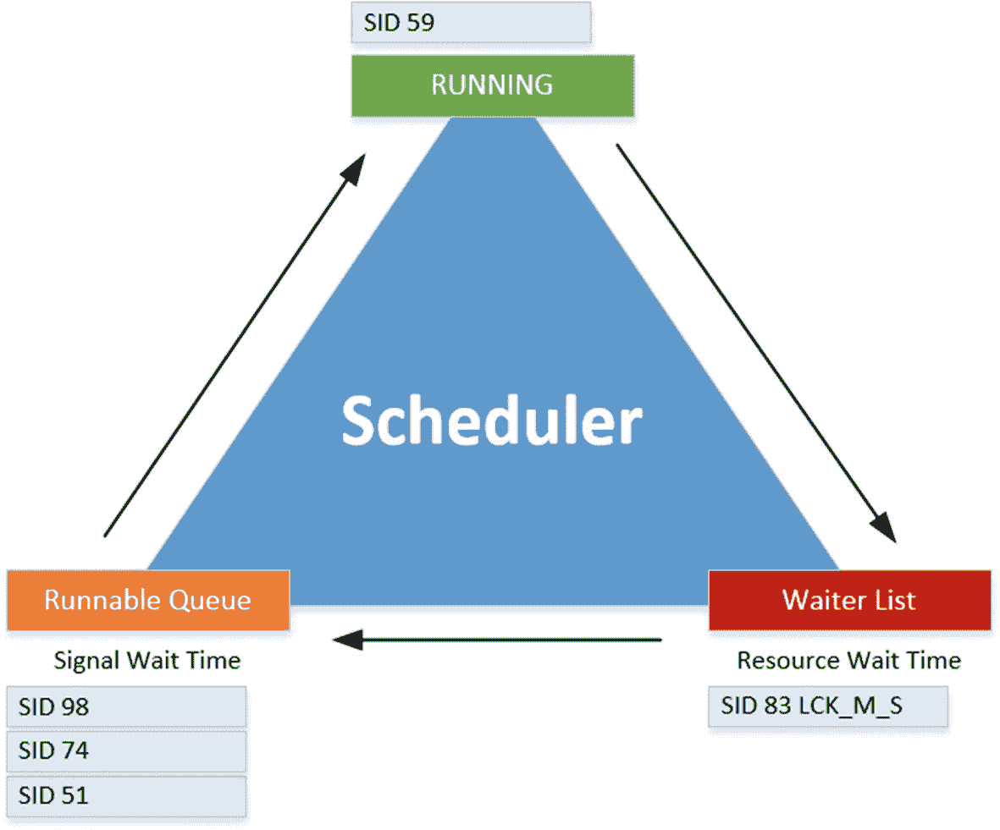

图 1-17：几毫秒后的调度器

`SID 76` 完成了它在处理器上的时间；它不需要任何额外的资源来完成其请求，因此离开了调度器。`SID 59` 是`可运行队列`中的第一个工作线程，现在处理器空闲了，它将从`可运行队列`移动到处理器，其状态将从“可运行”变为“运行中”。`SID 51` 已完成对 `CXPACKET` 等待类型的等待，并从`等待列表`移动到`可运行队列`的底部，其状态从“已暂停”变为“可运行”。

## 总结

在本章中，我们回顾了 SQL Server 各个版本中等待统计的历史。尽管使用等待统计分析 SQL Server 性能的方法相对较新，但等待统计作为 SQL Server 引擎的一部分已经存在很长时间了。

随着 SQL Server 2005 中 SQLOS 的引入，SQL Server 处理请求的方式发生了很大变化，引入了调度器、工作线程和任务。所有这些不同部分的信息都存储在动态管理视图（`DMVs`）或动态管理函数（`DMFs`）中，这些视图和函数易于查询，并能返回大量关于 SQL Server 内部的信息。

使用这些 `DMVs`，我们可以查看请求在 SQL Server 调度器处理时的进度，并了解它们是否正在等待任何特定资源。请求所等待的资源以及它们为等待这些资源所花费的时间被记录为等待统计，这是本书的主要主题。


