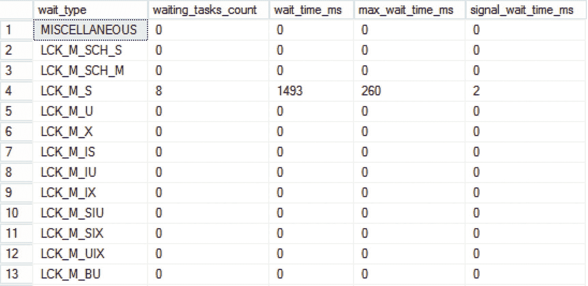
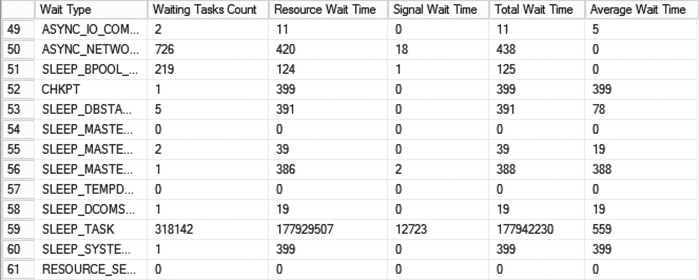
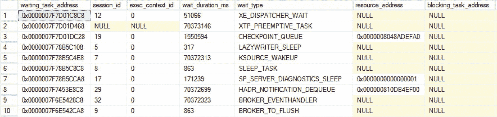
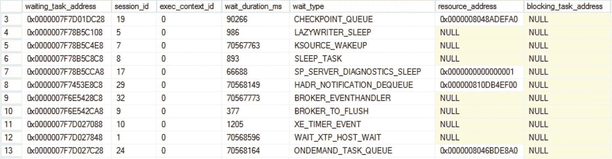
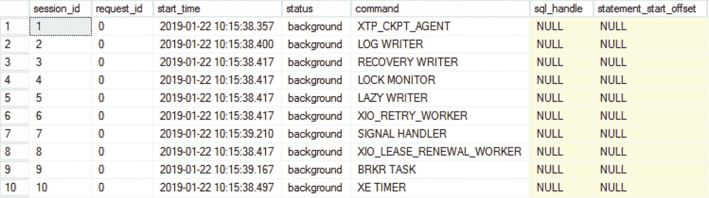
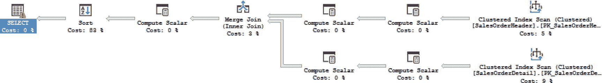
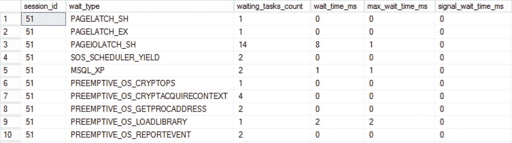
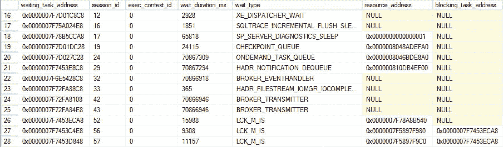
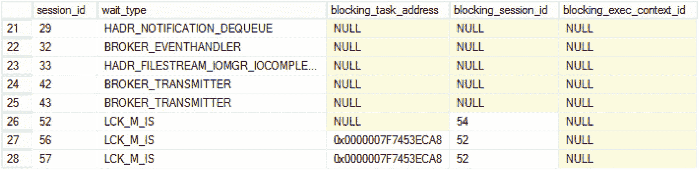

# 2. 查询 SQL Server 等待统计信息

随着 SQL Server 2005 中动态管理视图（DMV）的引入，查看和分析等待统计信息变得容易了许多，不再那么繁琐。在 SQL Server 2005 之前的版本中，我们只能通过 `DBCC SQLPERF('WAITSSTATS')` 命令来查看等待统计信息。目前，有多种 DMV 可以返回与等待统计相关的信息，在本章中，我们将详细查看其中四个最有用的 DMV：`sys.dm_os_wait_stats`、`sys.dm_os_waiting_tasks`、`sys.dm_exec_requests` 和 `sys.dm_exec_session_wait_stats`。

查看等待统计信息并不仅限于 DMV。我们还可以使用 Windows 性能监视器（Perfmon）来查看等待统计信息。SQL Server 2008 引入了另一种查看等待统计信息的选项：扩展事件（Extended Events）。虽然在 SQL Server 2008 中使用扩展事件相当复杂，意味着您必须用 T-SQL 编写一个完整的扩展事件会话，但微软在 SQL Server 2012 中极大地改进了扩展事件，使其更加用户友好且易于使用。

SQL Server 2016 SP1 引入了两种访问等待统计信息的新方法：通过一个名为 `sys.dm_exec_session_wait_stats` 的新 DMV，以及在执行计划中按查询添加等待统计信息。

在 SQL Server 2017 中，微软通过将等待统计信息包含在查询存储中，进一步推进了等待统计信息的记录。查询存储是 SQL Server 2016 中引入的一项功能，它就像您查询工作负载的“飞行记录器”，记录查询语句、性能和资源利用情况。

在本章中，我们将查看前面段落中提到的所有捕获等待统计信息的来源，从各种 DMV 开始。由于查询存储功能对于在 SQL Server 2017 及更高版本中对查询性能（包括等待统计信息）进行故障排除和分析具有重大影响，我们将在第 3 章“查询存储”中对其进行深入探讨。

## Sys.dm_os_wait_stats

`sys.dm_os_wait_stats` DMV 可能是有关等待统计信息最重要的 DMV 之一。该 DMV 是 SQL Server 2005 之前您必须使用的 `DBCC SQLPERF('WAITSTATS')` 命令的替代品。`DBCC SQLPERF('WAITSTATS')` 命令返回的所有信息都包含在 `sys.dm_os_wait_stats` DMV 中，甚至更多一些。

`sys.dm_os_wait_stats` DMV 显示自 SQL Server 启动（或重新启动）以来，每个等待类型的总等待时间。它也是累积性的，将等待时间添加到不同的等待类型中，导致总数不断增加。查询 `sys.dm_os_wait_stats` DMV 将使您深入了解您的 SQL Server 自启动或重新启动以来最常等待的是什么。如果您想查找每种等待类型的总等待时间，这可能会很有帮助，但很多时候您会对特定时间段内的等待时间感兴趣。在这种情况下，可以通过使用 `DBCC SQLPERF('sys.dm_os_wait_stats', CLEAR)` SQL 命令来重置 `sys.dm_os_wait_stats` DMV，而无需重新启动 SQL Server。这将把所有等待统计信息重置回 0，意味着您将丢失重置之前的所有信息。在第 4 章“建立稳固的基线”中，我们将探讨一种不会完全重置 `sys.dm_os_wait_stats` DMV 的方法。

与 SQL Server 中的每个 DMV 一样，我们可以像查询表一样对 `sys.dm_os_wait_stats` DMV 运行查询，在本例中为 `SELECT * FROM sys.dm_os_wait_stats`。此查询的结果如图 2-1 所示。



图 2-1: Sys.dm_os_wait_stats

以下是 `sys.dm_os_wait_stats` DMV 中可用的列，以及每个列所能提供信息的描述：

*   `wait_type`：返回等待类型。`sys.dm_os_wait_stats` 将始终为该特定 SQL Server 版本中可能的每种等待类型返回一行。
*   `waiting_tasks_count`：显示工作线程必须等待该特定等待类型的总次数。
*   `wait_time_ms`：返回自 SQL Server 实例启动或手动重置 DMV 以来，该特定等待类型的总等待时间（以毫秒为单位，1/1000 秒）。这是工作线程在“SUSPENDED”状态下在等待者列表（Waiter List）中花费的时间。它还包括工作线程在“RUNNABLE”状态下在可运行队列（Runnable Queue）中等待调度器授予其处理器时间所花费的时间。
*   `max_wait_time_ms`：显示工作线程等待该特定等待类型的最大等待时间（毫秒）。
*   `signal_wait_time_ms`：告诉我们工作线程在可运行队列中等待处理器时间所花费的时间量（毫秒）。在联机事务处理（OLTP）系统中，信号等待时间是不可避免且正常的，因为有大量查询正在处理，所有这些查询都请求处理器时间。信号等待时间也是检测 CPU 压力的重要指标。一般来说，由于这取决于您系统的硬件，如果看到信号等待时间指标超过总等待时间的 25%，可能表明存在 CPU 压力，因为工作线程正在等待处理器变得可用，而不是在使用资源。

您可能已经注意到，`sys.dm_os_wait_stats` DMV 没有返回资源等待时间的列。如果我们想将资源等待时间显示为附加列，就需要自己计算该值。

清单 2-1 展示了一个您可以用来分析 `sys.dm_os_wait_stats` DMV 的查询。除了常规列之外，它还将为返回的每种等待类型添加两列：资源等待时间和平均等待时间。

```sql
SELECT
    wait_type AS 'Wait Type',
    waiting_tasks_count AS 'Waiting Tasks Count',
    (wait_time_ms - signal_wait_time_ms) AS 'Resource Wait Time',
    signal_wait_time_ms AS 'Signal Wait Time',
    wait_time_ms AS 'Total Wait Time',
    COALESCE(wait_time_ms / NULLIF(waiting_tasks_count,0), 0) AS 'Average Wait Time'
FROM sys.dm_os_wait_stats;
```

清单 2-1: 包含附加信息的 sys.dm_os_wait_stats

此查询将返回如图 2-2 所示的结果。



图 2-2: 扩展了更多等待信息的 sys.dm_os_wait_stats

通过拥有特定等待类型的出现次数和总等待时间，可以通过将 `wait_time_ms` 值除以 `waiting_tasks_count` 值来计算该特定等待类型的平均等待时间（由图 2-2 中的 `Average Wait Time` 列表示）。

`sys.dm_os_wait_stats` 是一个功能强大的 DMV，通过它可以检索有关不同等待类型的大量信息。它也是第 4 章“建立稳固的基线”中概述的等待统计基线方法的基础。

## Sys.dm_os_waiting_tasks

虽然 `sys.dm_os_wait_stats` DMV 提供自服务器重启以来的累积等待统计信息，但 `sys.dm_os_waiting_tasks` DMV 可以提供 SQL Server 当前正在等待什么的信息。查询此 DMV 将为您提供所有当前任务的概览，这些任务的工作线程正在等待者列表或可运行队列中等待资源或处理器时间。


### 理解 sys.dm_os_waiting_tasks

由于 `sys.dm_os_waiting_tasks` 这一 DMV 能够洞察当前正在等待的任务，因此它通常是使用等待统计信息来审查 SQL Server 实例性能时查询的第一个 DMV。它还为某些等待类型提供了一些额外的信息，这在排查问题时非常有用。

图 2-3 展示了 `SELECT * FROM sys.dm_os_waiting_tasks;` 查询的结果。



图 2-3

sys.dm_os_waiting_tasks

以下是 `sys.dm_os_waiting_tasks` DMV 返回的列列表及其所返回信息的描述：

*   `waiting_task_address` 显示当前正在等待的任务的地址。
*   `session_id` 提供与特定任务关联的会话 ID。
*   `exec_context_id` 将返回执行上下文的 ID。只有当任务使用并行性执行时，此值才会从默认值 0 更改。这意味着任务正在使用多个线程而不是单个（串行）线程执行。
*   `wait_duration_ms` 显示任务已经等待的时间（以毫秒为单位）。与 `sys.dm_os_wait_stats` DMV 中一样，此时间包括资源等待时间和信号等待时间。
*   `wait_type` 返回任务当前正在等待的等待类型。
*   `resource_address` 返回关于当前正在等待的资源的内存地址信息。并非所有等待类型都会记录此内存地址，因此它经常返回为 `NULL`。
*   `blocking_task_address` 将返回当前正在阻塞等待任务的任务地址。当任务未被另一个任务阻塞时，此列将返回 `NULL`。
*   `blocking_session_id` 返回当前正在阻塞任务的会话的会话 ID。与 `blocking_task_address` 一样，仅当此任务当前被另一个任务阻塞时才包含此信息。当没有阻塞或无法检索或识别有关阻塞任务的会话信息时，它将返回 `NULL`。我们将在第 8 章“与锁相关的等待类型”中解释阻塞和锁定，届时我们将讨论锁等待类型。
*   `blocking_exec_context_id` 是另一个专门用于阻塞信息的列。在这种情况下，它将返回执行上下文的 ID。只有当任务使用并行性执行并且其中一个线程负责阻塞时，此列才会返回非 `NULL` 的结果。然后，`blocking_exec_context_id` 可用于识别哪个线程是阻塞的根源。
*   DMV 的最后一列 `resource_description` 将提供有关任务正在等待的资源的附加信息。没有多少等待类型会填充此列——最常见的是与并行性、锁或门闩相关的等待类型。它可能是一个非常有用的列，尤其是在分析锁或门闩相关的等待类型时；在这些情况下，我们可以精确定位我们正在等待其可用性的数据库对象（数据页、行、表等）。本书后面的一些示例（最著名的是第 8 章“与锁相关的等待类型”和第 9 章“与门闩相关的等待类型”）将使用此列来收集有关我们正在等待的资源的额外信息。

### 查询 sys.dm_os_waiting_tasks

由于 `sys.dm_os_waiting_tasks` DMV 返回了丰富的信息，因此根据你想要分析或排查的问题，有各种查询它的方式。

我在互联网上的各种论坛上经常看到以下查询：

```sql
SELECT * FROM sys.dm_os_waiting_tasks
WHERE session_id > 50;
```

此查询将过滤掉所有 SQL Server 内部会话 ID，并且只返回源自用户会话的等待任务。在我测试的 SQL Server 上，查询结果如图 2-4 所示。


图 2-4

sys.dm_os_waiting_tasks where session_id is greater than 50

虽然过滤掉内部 SQL Server 进程的方法适用于许多等待类型并提高了可读性，但在运行此查询时，某些特定的等待类型将不会被返回。

一个很好的例子是 `THREADPOOL` 等待类型，我们将在第 5 章“与 CPU 相关的等待类型”中讨论。这种等待类型可能对你的 SQL Server 性能产生巨大的负面影响，但如果只查询用户会话，则不会返回。这可能会影响你的分析，因为你遗漏了重要的事实。

另一个建议在不过滤会话 ID 的情况下查询 DMV 的原因是，关于会话 ID 以及会话 ID 是用户会话还是内部会话的关系存在一个很大的误解。虽然通常认为大于 50 的会话 ID 是用户会话，但不能保证大于 50 的会话 ID 实际上*就是*用户会话。SQL Server 可能需要超过 50 个内部会话，在这种情况下，你可能会看到会话 ID 高于 50 的内部会话，并可能误认为是用户会话。

我相信查询 `sys.dm_os_waiting_tasks` DMV 的最佳方式是选择所有内容，并且只在寻找特定的等待类型或会话时才应用过滤器。与过滤会话 ID 大于 50 相比，这将返回更多的行，如图 2-5 所示，但它会向你展示完整的画面，并最大程度地减少你可能错过重要等待类型的机会。一个好主意可能是按 `session_id` 列排序，这样可以在不忽视内部会话的情况下，使结果更易于阅读。



图 2-5

sys.dm_os_waiting_tasks

## Sys.dm_exec_requests

`sys.dm_exec_requests` DMV 返回有关当前正在由 SQL Server 处理的所有请求的信息。

### 理解 sys.dm_exec_requests

与之前的动态管理视图（DMV）类似，我们可以通过一个简单的 `SELECT * FROM sys.dm_exec_requests;` 查询 `sys.dm_exec_requests` DMV，以返回当前所有正在执行的操作。图 2-6 展示了我的测试 SQL Server 上返回的部分结果。



图 2-6

`sys.dm_exec_requests` DMV 返回的列比我们之前讨论的 `sys.dm_os_wait_stats` 或 `sys.dm_os_waiting_tasks` DMV 要多得多。为了保持可读性，我将只描述我们经常用于等待统计信息分析的列。列表如下：

*   `session_id` 返回此请求关联的会话 ID。
*   `start_time` 显示请求创建的日期和时间。这与你查询 DMV 的时间和日期可能不同，尤其是当有长时间运行的查询正在执行时。
*   `command` 返回有关请求正在执行何种操作的信息。最常见的命令与查询相关，如 `SELECT`、`INSERT`、`UPDATE` 和 `DELETE`，但根据请求执行的操作，还有更多命令。
*   `sql_handle` 为我们提供请求中正在执行的 SQL 文本的哈希值。并非所有请求都有 SQL 句柄，通常只有当请求由用户会话发起且涉及 SQL 查询时，你才会看到 SQL 句柄。SQL 句柄哈希可以用作动态管理函数（DMF）`sys.dm_exec_sql_text` 的输入，以检回该请求正在执行的查询。
*   `plan_handle` 返回执行计划的哈希值。执行计划将向你展示 SQL Server 执行查询时执行的操作，是查询执行信息的绝佳来源。我们可以像使用 `sql_handle` 一样使用 `plan_handle`，但不同的是，它返回的不是查询本身，而是查询的执行计划。我们可以将该哈希值用作 DMF `sys.dm_exec_query_plan` 的输入，以返回该请求正在执行的查询的执行计划。
*   `wait_type` 如果请求处于“SUSPENDED”（已挂起）或“RUNNABLE”（可运行）状态，则返回当前的等待类型。如果请求当前正在处理中，则该值将为 `NULL`。
*   `last_wait_type` 列返回请求在其执行过程中如果必须等待时，上一次遇到的等待类型。
*   `total_elapsed_time` 列返回从请求创建开始处理它所花费的总时间（以毫秒为单位）。

此 DMV 中还有更多列可用，它们各有不同的用途。完整的描述可在 Microsoft MSDN 页面 [`https://msdn.microsoft.com/en-us/library/ms177648.aspx`](https://msdn.microsoft.com/en-us/library/ms177648.aspx) 上找到，我鼓励你阅读该文章。`sys.dm_exec_requests` DMV 是你 DBA 工具包中的一个强大工具，也是除了分析等待统计信息之外，你还会经常用于各种目的的 DMV 之一。

### 查询 sys.dm_exec_requests

`sys.dm_exec_requests` DMV 是那些可以通过返回查询和计划句柄来让我们访问查询语句及其相应执行计划的 DMV 之一。如果你对此信息感兴趣（大多数时候你可能确实如此），你需要将 `sql_handle` 和 `plan_handle` 传递给它们对应的 DMF，以便将哈希值转换为我们人类可以阅读和理解的内容。

清单 2-2 展示了一个针对 `sys.dm_exec_requests` DMV 的查询，同时也检回了查询语句和执行计划。为了保持结果集较小，并且因为我确实只对本示例中的用户查询感兴趣，我排除了执行查询的会话 ID 并忽略了小于 50 的会话 ID。

```sql
SELECT
    r.session_id AS 'Session ID',
    r.start_time AS 'Request Start',
    r.[status] AS 'Current State',
    r.[command] AS 'Request Command',
    t.[text] AS 'Query',
    p.query_plan AS 'Execution Plan'
FROM sys.dm_exec_requests r
OUTER APPLY sys.dm_exec_sql_text(r.sql_handle) AS t
OUTER APPLY sys.dm_exec_query_plan(r.plan_handle) p
WHERE r.session_id > 50 AND r.session_id  @@SPID;
```

清单 2-2

在我的测试系统上，得到了如图 2-7 所示的结果。


图 2-7

使用清单 2-2 中的查询，我们可以立即看到会话 ID 55 正在执行一个 `SELECT` 查询，因为 `Query` 列显示了正在执行的完整语句。`Execution Plan` 列以 XML 格式返回执行计划。SQL Server Management Studio 的一个很棒的功能是，我们可以点击返回的 XML 链接来查看图形化的执行计划，如图 2-8 所示。



图 2-8

使用执行计划，我们可以深入了解查询是如何被 SQL Server 引擎执行的。本书不会深入探讨执行计划的细节，但在优化查询性能时你会经常用到它们，因此知道如何从 `sys.dm_exec_requests` DMV 访问它们是很有益的。如果你想了解更多关于执行计划的知识，Grant Fritchey 的 *Execution Plan Basics* 是一个很好的起点：[`www.simple-talk.com/sql/performance/execution-plan-basics/`](http://www.simple-talk.com/sql/performance/execution-plan-basics/)。

## `sys.dm_exec_session_wait_stats`

在与等待统计相关的 DMV 中，较新的一个是 `sys.dm_exec_session_wait_stats` DMV。它在 SQL Server 2016 SP1 中引入，按会话级别返回等待统计信息。如果你还记得阅读本书第 1 章“等待统计内部原理”，会话是用户或进程与 SQL Server 建立的活动连接。一个会话可以有多个请求，而每个请求又可以有多个任务来执行查询所需的操作。

图 2-9 展示了该 DMV 的列以及来自我测试系统的一些等待统计信息。



图 2-9 `sys.dm_exec_session_wait_stats`

上图看起来是否熟悉？很可能熟悉，因为它实际上与 `sys.dm_os_wait_stats` DMV 几乎完全相同，只是多了一个 `session_id` 列。

需要重点指出的是，通过此 DMV 记录的等待统计信息是特定会话在活动期间执行的所有操作的累计值。例如，如果你在一个会话内执行十个不同的查询，DMV 返回的所有等待时间都是这十个查询的总等待时间。这意味着理解会话生命周期内发生的事情非常重要。该会话是否已经在忙于执行大批量的查询？还是只执行了单个查询语句？在依赖此 DMV 分析会话等待统计之前，了解这些问题的答案至关重要。

此外，会话 ID 在会话关闭后会被重用，这意味着如果不小心，你可能会看到一个重用该会话 ID 的新会话的等待统计信息。当会话 ID 被重用（或在连接池中重置）时，该 DMV 中针对该特定会话的所有等待统计信息也会被重置。

考虑到以上信息，我们可以得出结论：当报告性能缓慢时，此 DMV 并不直接适合作为“首选查看对象”。然而，它仍然有其用武之地，特别是当你能够针对涉及多个查询的特定操作重现特定性能问题时。在这种情况下，你可以聚焦于一个特定的会话 ID 并重现问题，捕获查询执行过程中发生的所有事件的等待统计信息。

## 结合 DMV 检测当前等待

既然我们已经查看了一些用于等待统计分析的最重要 DMV，现在让我们看一个如何使用这些 DMV 来找出是什么拖慢了你的 SQL Server 的示例。收集这些信息不会立即解决你的问题，但它会给你提供一个从何处开始寻找解决方案的线索。

考虑以下场景：你是一家大公司的数据库管理员（DBA），该公司使用单一数据库存储所有销售信息。数据库运行在 SQL Server 2014 实例上，每天有几百名用户查询该数据库。

通常一切运行良好——用户可以快速访问所需信息，每个需要使用数据库的人都感到满意。然而，今天对你这个 DBA 来说不是个好日子。电话从上午 10 点开始就没停过，一些用户聚集在你办公室门口，眼神愤怒——查询和插入销售信息的速度慢得令人难以置信。

由于本书是关于等待统计的，让我们看看如何分析该场景中性能问题的等待统计信息。

我们知道 `sys.dm_os_wait_stats` DMV 显示累计的等待统计信息，因此对于此场景，它不会有太大帮助。一个更好的起点是 `sys.dm_os_waiting_tasks` DMV，因为它会显示当前所有正在等待的任务。

我们对 `sys.dm_os_waiting_tasks` DMV 运行以下查询：

```
SELECT * FROM sys.dm_os_waiting_tasks
ORDER BY session_id ASC;
```

向下滚动查看结果时，我们看到许多用户会话都有等待任务，如图 2-10 所示。



图 2-10 对 `sys.dm_os_waiting_tasks` DMV 查询的结果

我们注意到会话 52、56、57 的等待时间相当高，并且它们都在以等待类型 `LCK_M_S` 等待。在不深入探讨此特定等待类型细节的情况下（将在第 8 章“锁相关的等待类型”中详细讨论），只需知道此等待类型与锁定相关即可。显然，这些会话正在等待获取锁，这意味着它们很可能被另一个持有同一对象锁的进程阻塞。我们可以通过查看 `blocking_` 列，从 `sys.dm_os_waiting_tasks` DMV 中提取锁定和阻塞信息。出于可读性原因，我修改了前面的查询，使其仅返回来自 `sys.dm_os_waiting_tasks` DMV 的阻塞信息。图 2-11 显示了这些列。



图 2-11 来自 `sys.dm_os_waiting_tasks` DMV 的阻塞信息

从这里我们可以看到，会话 56 和 57 被会话 52 阻塞。然而，会话 52 被会话 ID 54 阻塞。我们没有在 `sys.dm_os_waiting_tasks` DMV 中看到此会话 ID 被返回，这意味着该会话当前正在执行，并且没有在任何资源上等待。

让我们检查另一个 DMV `sys.dm_exec_requests`，以获取有关会话 54 的一些信息：

```
SELECT * FROM sys.dm_exec_requests
WHERE session_id = 54;
```

图 2-12 显示了此查询的结果。


图 2-12 对 `sys.dm_exec_requests` 查询的结果

还记得我曾写道 `sys.dm_exec_requests` DMV 返回当前正在处理的请求信息吗？显然，会话 ID 54 没有未完成的请求，因为没有返回任何信息。


