# 使用 DMV 和 Perfmon 分析等待统计信息

## 查询会话信息并解决阻塞程序

如果我们想获取有关此会话的更多信息，可以使用第 1 章“等待统计信息内部原理”中讨论过的 `sys.dm_exec_sessions` DMV，执行以下查询：

```sql
SELECT
    session_id,
    [status],
    [host_name],
    [program_name],
    login_name,
    is_user_process,
    open_transaction_count
FROM sys.dm_exec_sessions
WHERE session_id = 54;
```

此查询返回的结果如图 2-13 所示。

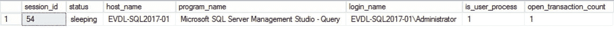

*图 2-13. sys.dm_exec_sessions 的结果*

我们可以假定该会话 ID 目前没有任何正在运行的请求，因为它的状态是“sleeping”，这就是为什么对 `sys.dm_exec_requests` 的查询没有返回任何信息。如果我们查看 `program_name` 列，可以看到此会话是由 EVDL-SQL2017-01\Administrator 用户通过 Microsoft SQL Server Management Studio 程序发起的。

我包含 `is_user_process` 列是为了确认它是一个用户会话，而 `open_transaction_count` 列显示此用户会话有一个未关闭的事务。

我们现在掌握了足够的信息来采取纠正措施。我们知道是谁阻塞了其他任务，我们可以决定打电话询问他正在执行的操作，或者选择结束他的会话。使用 `KILL [session_id]` 命令结束用户会话应该是最后的手段，因为我们可能正在中断重要的操作。使用 `KILL` 命令结束会话将导致正在运行的事务回滚，撤销其执行的所有更改，这可能需要很长时间才能完成。在这种情况下，我接受回滚的风险，并将自己结束该会话：

```sql
KILL 54;
```

在我们杀死会话 ID 54 之后，用户立即报告他们的查询再次开始运行。如果我们查询 `sys.dm_os_waiting_tasks` DMV 以获取有关这些会话 ID 的信息，则不会返回任何内容，这意味着它们不再被阻塞。

希望这个示例让您了解了如何使用 SQL Server 中提供的各种 DMV 来收集当前正在等待的任务的信息。在这个例子中，示例包含一个阻塞其他查询的事务，我们决定杀死导致阻塞锁的用户会话。在许多情况下，解决方案并不这么简单，但收集等待统计信息以深入调查问题根源的方法几乎适用于每个与性能相关的事件。

正如我在本节开头指出的，仅查看等待统计信息在大多数情况下并不能解决性能问题，但它是开始调查的良好起点。为了全面了解系统的性能，我们通常会将等待统计信息与其他指标结合起来，例如来自 Windows 性能监视器、其他 DMV 或特定于供应商的信息（如存储指标）。

图 2-14 展示了一个流程图，说明如何使用等待统计信息来分析性能问题。

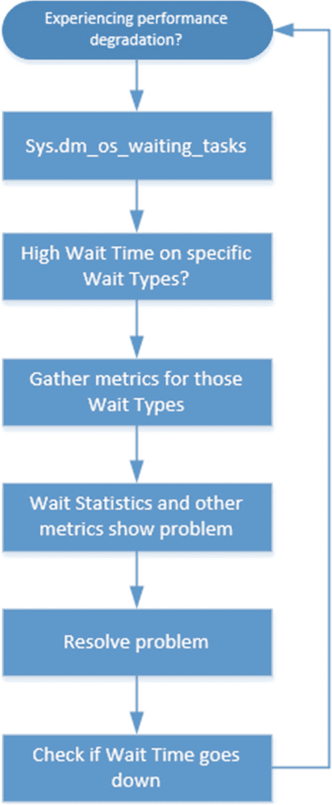

*图 2-14. 等待统计信息流程图*

我们将在第 4 章“建立可靠的基线”中扩展这个流程图，在那里我们将为等待统计信息分析方法引入基线。

## 使用 Perfmon 查看等待统计信息

分析等待统计信息时，访问我们所需额外指标的最重要工具之一是 Windows 性能监视器，即 Perfmon。Perfmon 在每个 Windows 操作系统上都可用，并且包含系统几乎所有部分的计数器，包括与 SQL Server 相关的性能计数器。您可以通过在 Windows 运行对话框或命令行中执行 `perfmon` 命令来启动 Perfmon。

除了提供有关系统性能的信息外，Perfmon 还可用于查看等待统计信息。在 Perfmon 应用程序中添加计数器时，可以在 `SQLServer:Wait Statistics` 类别下查看这些计数器，如图 2-15 所示。

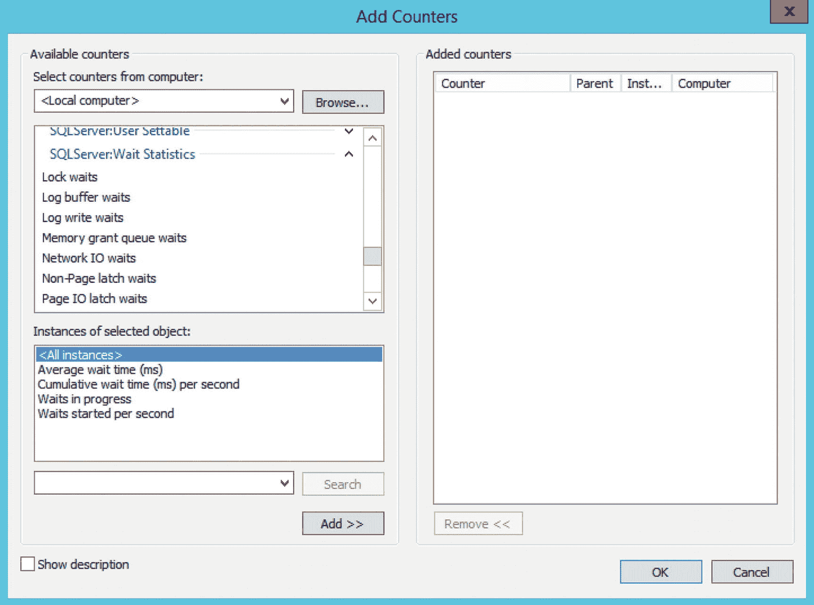

*图 2-15. Perfmon 中的等待统计信息计数器*

在图 2-15 中你会注意到一件事，即 Perfmon 中的等待统计信息是按类别分组的。我们在这里找不到关于特定等待类型的信息，因此如果我们想使用 Perfmon 分析等待统计信息，应该大致了解特定等待类型在 Perfmon 中属于哪个类别。它能够显示每个等待统计信息类别的平均等待时间、累计等待时间、当前总等待次数以及新开始的等待次数。如果我们需要一个更高层次的视图——例如，我们想知道有多少任务正在等待与锁相关的等待类型——我们可以使用 Perfmon 来获取该信息。如果我们想要获得关于特定等待类型的更多详细信息，则应该使用我们之前讨论过的 `sys.dm_os_wait_stats` 或 `sys.dm_os_waiting_tasks` DMV。

Perfmon 的一个很好的特性是它可以直接将测量值转换为图表，为我们提供一种更直观的方式来查看信息，而无需自己创建图表。图 2-16 是一个图表示例，其中显示了 Lock waits 类别的“平均等待时间”和“每秒开始的等待次数”。

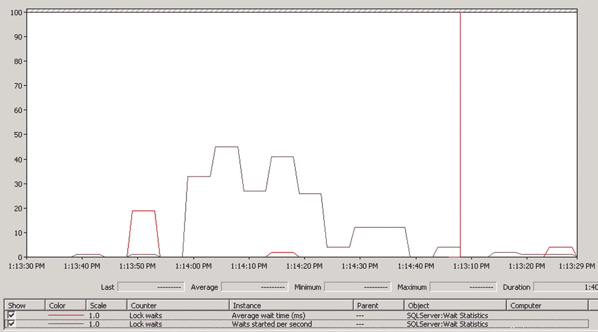

*图 2-16. 显示等待统计信息的 Perfmon 图表*

在本书中，我们将大量使用 Perfmon 来分析与特定等待类型相关的指标，如 CPU 时间、磁盘延迟和内存使用情况。我们不会过多使用 Perfmon 中的等待统计信息计数器，因为我相信 SQL Server DMV 更适合此任务，因为它们提供了完整分析所需的详细程度。


## 使用扩展事件捕获等待统计信息

SQL Server 中的大多数等待统计信息是累积记录的，并且由于许多内部进程也会生成等待统计信息，因此很难检测单个查询对它们的影响程度。这正是扩展事件的用武之地；通过扩展事件，可以捕获查询遇到的确切等待时间以及它必须等待的等待类型。这些信息可以帮助我们分析那些对系统影响较大的查询，并可能对其进行优化，以减小其影响。或者，我们可以捕获执行时遇到特定等待类型的查询。

扩展事件在 SQL Server 2008 中引入，或多或少地取代了 SQL Server Profiler。Microsoft 已宣布弃用 SQL Server Profiler，并建议我们转向扩展事件。扩展事件比 SQL Server Profiler 强大得多，而且随着 SQL Server 的每个版本发布，我们可以用扩展事件捕获的事件数量不断增加，而 SQL Server Profiler 中的事件数量则保持不变。此外，性能也是使用扩展事件的一个充分理由。捕获扩展事件比使用 SQL Server Profiler 更轻量。

扩展事件一直被认为难以使用，虽然这在 SQL Server 2008 中首次引入时尤其如此，但到了 SQL Server 2012，使用 GUI 创建扩展事件会话变得容易得多，情况大为改观。

使用扩展事件时，可以使用许多不同的与等待相关的事件。我们可以通过查询 `sys.dm_xe_map_values` DMV 来查看这些事件，该视图保存了所有不同的扩展事件事件类型：

```sql
SELECT *
FROM sys.dm_xe_map_values
WHERE name = 'wait_types';
```

图 2-17 显示了此查询结果的一小部分。

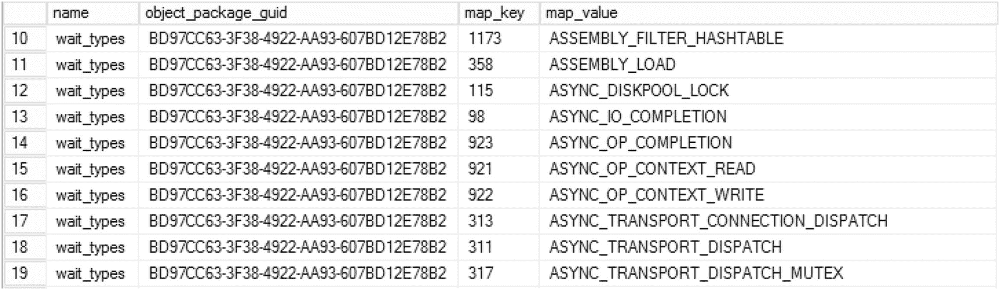
**图 2-17** `sys.dm_xe_map_values` 的结果

在 SQL Server 2019 CTP2.4 中，总共有大约 1260 个不同的等待统计信息相关事件可用。这些事件与不同的等待类型并非一一对应，事实上，在某些情况下，等待类型的名称与事件的名称并不匹配，尽管它们含义相同。`ASYNC_NETWORK_IO` 等待类型就是一个例子，扩展事件将其命名为 `NETWORK_IO`。Jonathan Kehayias 在 [`SQLskills.com`](http://sqlskills.com) 上写了一篇博客文章，将一些等待类型映射到扩展事件；你可以在这里查看：[`www.sqlskills.com/blogs/jonathan/mapping-wait-types-in-dm_os_wait_stats-to-extended-events/`](http://www.sqlskills.com/blogs/jonathan/mapping-wait-types-in-dm_os_wait_stats-to-extended-events/)。

虽然本书不会深入探讨扩展事件的细节，但我想向你展示如何使用扩展事件 GUI 和 T-SQL 来捕获等待统计信息相关信息。

### 捕获特定查询的等待统计信息

让我们看看如何配置一个扩展事件会话来捕获特定查询的等待统计信息。我们将对执行查询的会话 ID 设置筛选器，然后执行我们要分析的查询。

我们要做的第一件事是打开 SQL Server Management Studio 并连接到 SQL Server 实例。请注意，扩展事件的 GUI 是在 SQL Server 2012 中添加的，因此如果你打算按照此处的步骤操作，需要 SQL Server 2012 或更高版本的实例。

连接后，我们打开“管理”文件夹，然后选择“扩展事件”选项。右键单击“会话”文件夹并选择“新建会话”选项，如图 2-18 所示。

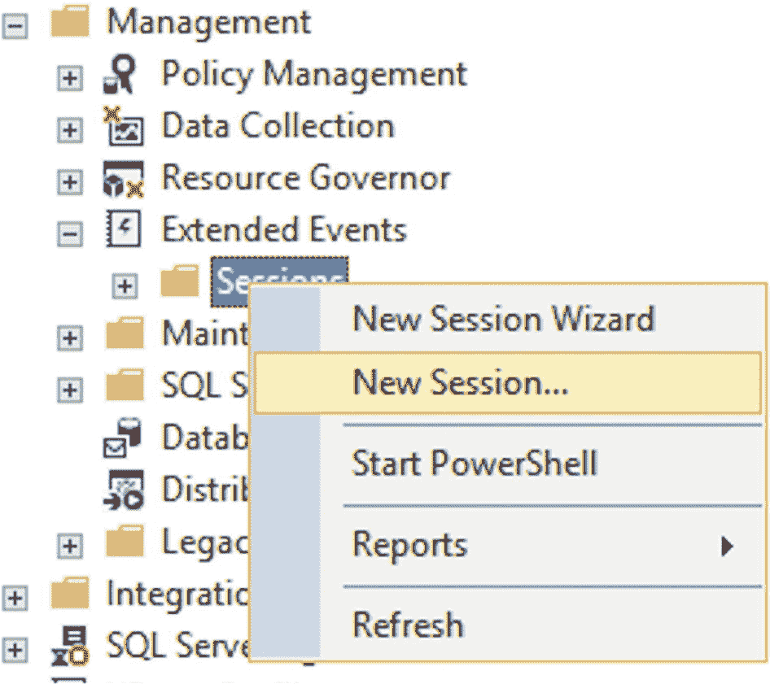
**图 2-18** 添加新的扩展事件会话

“新建会话”对话框将出现，我们可以在此输入此扩展事件会话的名称并设置一些附加选项。我们现在将忽略这些选项，只填写扩展事件会话的名称，如图 2-19 所示。

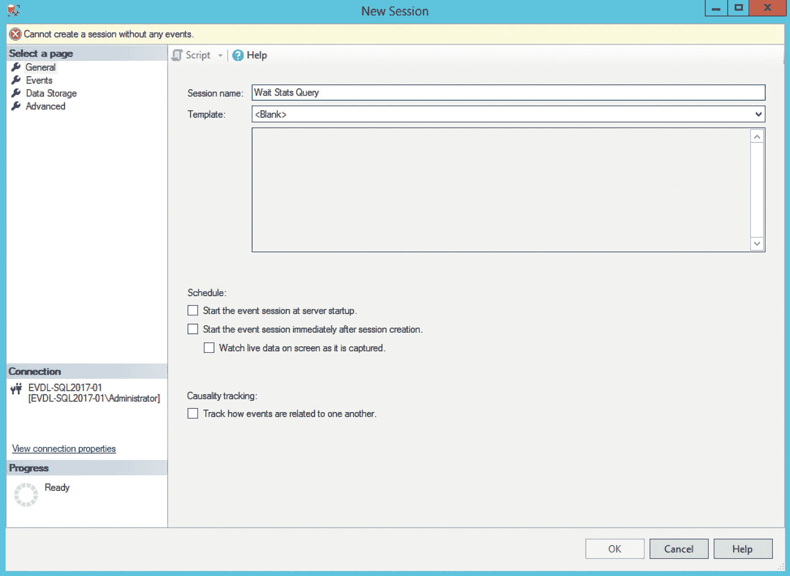
**图 2-19** 配置等待统计信息扩展事件会话

下一步是配置此扩展事件会话需要监视哪些事件，这可以通过在“新建会话”对话框中选择“事件”页面来完成。

由于我们对等待统计信息感兴趣，我在“事件库”中搜索了 `wait_info` 事件并将其添加到“选定的事件”框中，如图 2-20 所示。

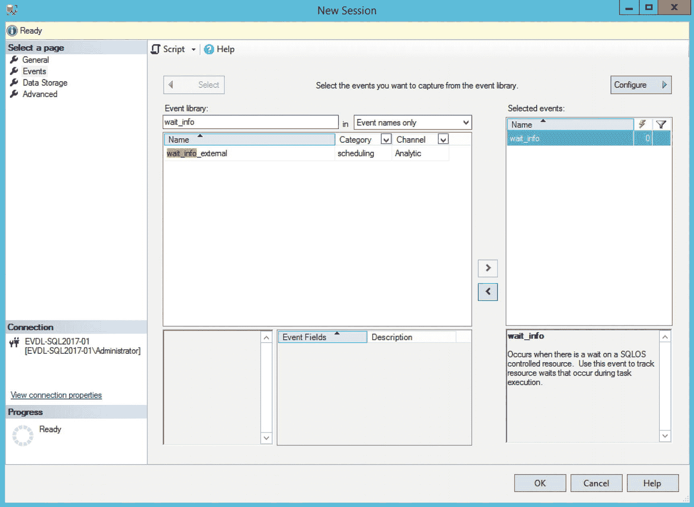
**图 2-20** 选择要监视的事件

如果现在保存此扩展事件会话，我们将捕获每个必须等待资源的进程的信息。由于我们只对特定查询相关的等待统计信息感兴趣，我们将配置一个筛选器，仅返回特定会话的等待统计信息。为此，我们可以单击“新建会话”对话框中的“配置”按钮，这将打开一个新部分，我们可以在其中选择“全局字段”，这些字段将在触发 `wait_info` 事件时记录额外信息。在此情况下，我勾选了 `sql_text` 全局字段，如图 2-21 所示，以便在捕获事件时可以查看实际的查询。

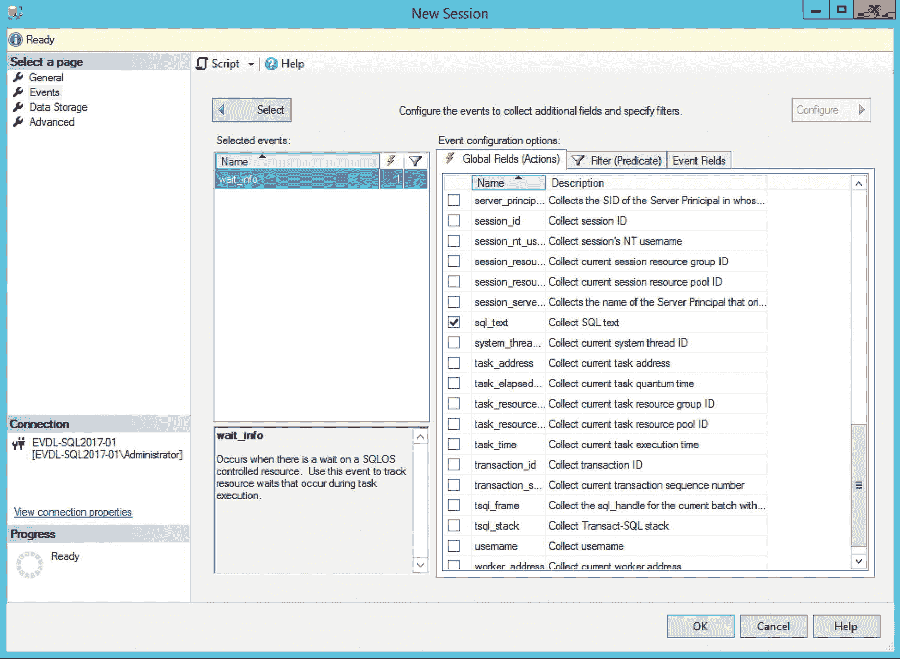
**图 2-21** 设置 `sql_text` 全局字段

接下来是“筛选器（谓词）”选项卡。在这里我们将设置一个筛选器，仅捕获来自特定会话 ID 的事件。我们可以通过单击“字段”框内并选择 `sqlserver.session_id` 字段，然后将“值”设置为我们想要监视的会话 ID 来完成此操作。在此情况下，我将筛选器配置为仅捕获会话 ID 为 52 的事件，如图 2-22 所示。

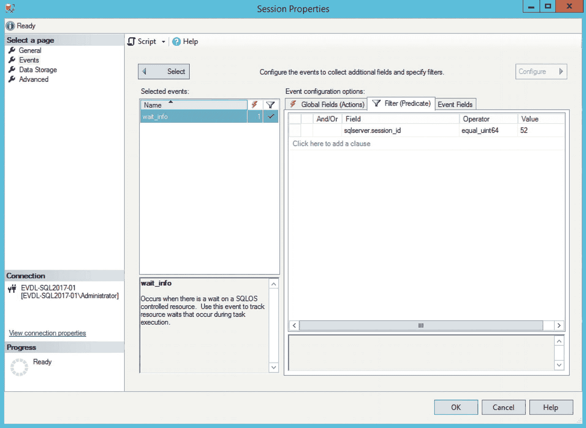
**图 2-22** 设置事件筛选器

这就是我们现在需要配置的全部内容，因此我们可以单击“确定”关闭此对话框并保存扩展事件会话。

默认情况下，扩展事件会话在创建后不会自动启动。为此，我们必须再次打开“会话”文件夹，导航到 SQL Server Management Studio 中的“管理”➤“扩展事件”文件夹。右键单击我们刚创建的扩展事件会话并选择“启动会话”选项，如图 2-23 所示。


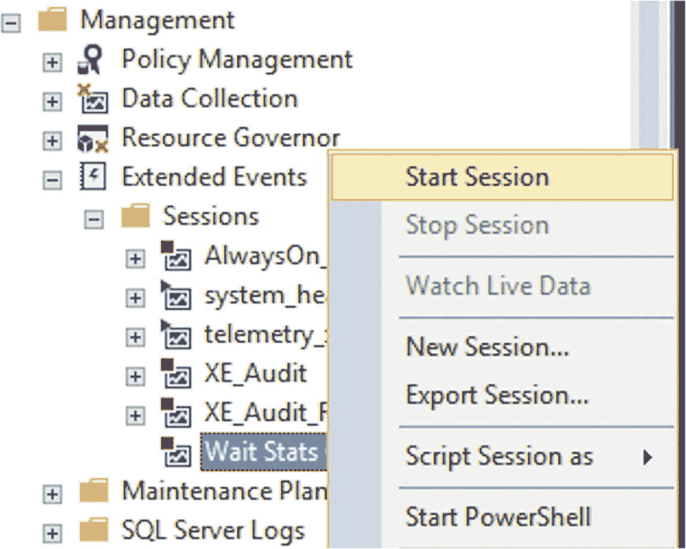

图 2-23

### 启动扩展事件会话

启动扩展事件会话后，它将开始收集信息。我们可以通过选择“实时查看数据”选项来查看实时收集到的信息。这将在 SQL Server Management Studio 中打开一个新选项卡，我们可以在其中监视扩展事件会话。查看实时扩展事件数据会带来一点开销，但这远低于使用 SQL Profiler 的开销。如果您担心查看实时数据的开销，可以选择将扩展事件会话写入事件文件，方法是在扩展事件会话的“数据存储”页面中添加一个文件位置。

在此示例中，我对 AdventureWorks 数据库执行了一个简单查询，以返回 `Person.Person` 表中的所有内容，如下所示：

```sql
SELECT *
FROM Person.Person;
```

在设置扩展事件会话的筛选器时，我会特别注意使其与我在 SQL Server Management Studio 中执行查询的选项卡的会话 ID 相匹配。可以通过查看选项卡上括号内的数字找到会话 ID。扩展事件实时数据选项卡返回的信息如图 2-24 所示。

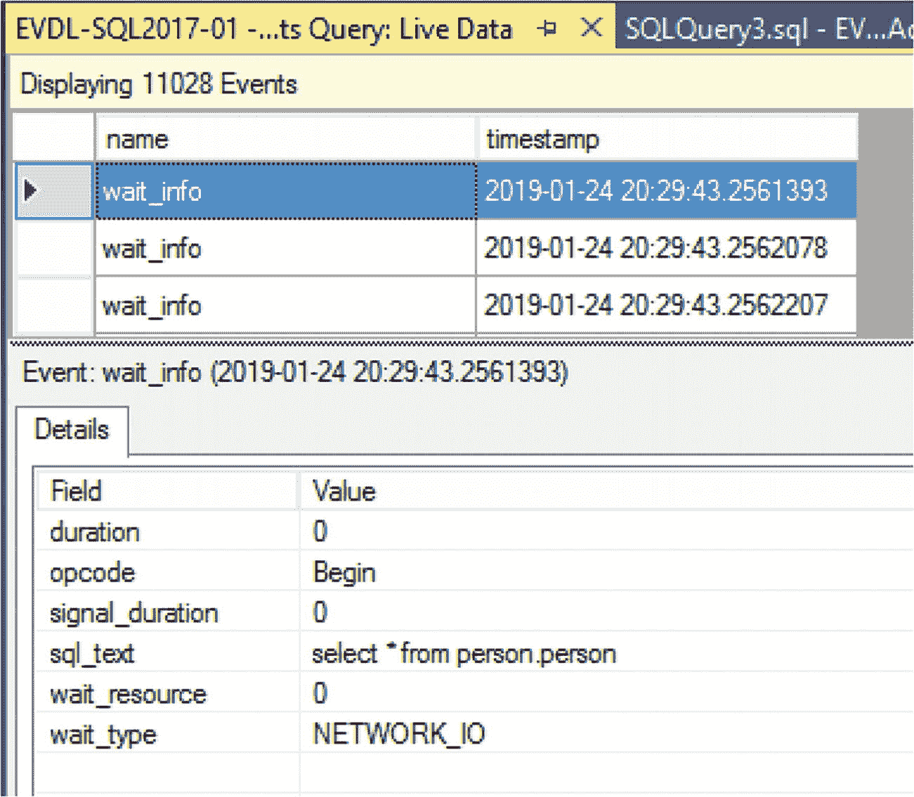

图 2-24

来自扩展事件会话的实时等待统计信息

如图 2-24 所示，我们的请求遇到了 `NETWORK_IO` 等待类型。这是扩展事件中的等待名称与等待统计信息 DMV 中的名称不匹配的示例之一。`NETWORK_IO` 等待名称与 SQLOS 使用的 `ASYNC_NETWORK_IO` 等待类型是相同的等待。我们可以在 `sql_text` 字段中查看我们执行的查询。

扩展事件会话中还可以包含许多其他可能值得捕获的全局字段，例如执行计划句柄或任务执行时间。所有这些全局字段都将为您提供额外的信息，这些信息会在返回扩展事件会话信息时显示，为您提供极其丰富的详细信息。

如果出于某些原因，您不想使用 GUI 来创建和运行扩展事件会话，或者您运行的是 SQL Server 2008，您可以使用 T-SQL 来创建和配置一个。要创建与我们使用 GUI 创建的相同的扩展事件会话，您可以执行清单 2-3 中的查询。

```sql
CREATE EVENT SESSION [WaitStats Query] ON SERVER
ADD EVENT sqlos.wait_info
(
ACTION(sqlserver.sql_text)
WHERE ([sqlserver].[session_id]=(52))
)
ADD TARGET package0.event_file
(
SET filename = N'E:\Data\WaitStats_XE.xel', metadatafile = N'E:\Data\WaitStats_XE.xem'
);
```
清单 2-3
创建等待统计信息扩展事件会话

我们通过在上面的脚本中设置 `metadatafile` 参数包含了元数据文件。如果您运行的是 SQL Server 2012 或更高版本，则不再需要此参数。

记录扩展事件会话的最简单方法是将其保存到文件；在本例中，我的文件名是 `E:\Data\WaitStats_XE.xel`（SQL Server 会向文件名添加一个唯一的数字标识符，实际文件名是 `WaitStats_XE_0_130702270937280000.xel`）。我还包含了对会话 ID 52 的筛选，以捕获该会话生成的等待统计信息。

接下来我们要做的是启动扩展事件会话，这可以通过执行 `ALTER EVENT SESSION` 命令来完成：

```sql
ALTER EVENT SESSION "WaitStats Query" ON SERVER STATE = start;
```

然后，我们在筛选的会话 ID 下，执行与扩展事件 GUI 示例中相同的查询。让扩展事件会话运行一小段时间后，我们可以使用 `ALTER EVENT SESSION` 命令将其停止：

```sql
ALTER EVENT SESSION "WaitStats Query" ON SERVER STATE = stop;
```

现在我们已经停止了扩展事件会话，我们需要将文件中的信息（作为 XML）导入到表中，以便实际查看会话捕获的内容；我们使用 `sys.fn_xe_file_target_read_file` 函数来完成此操作。然后，我们可以解析 XML 信息，以更易读的格式返回结果。清单 2-4 中的查询可用于读取扩展事件文件，将其导入临时表，并将结果作为行返回。

```sql
-- Check if temp table is present
-- Drop if exist
IF OBJECT_ID('tempdb..#XE_Data') IS NOT NULL
DROP TABLE #XE_Data
-- Create temp table to hold raw XE data
CREATE TABLE #XE_Data
(
XE_Data XML
);
GO
-- Write contents of the XE file
-- into our table
INSERT INTO #XE_Data
(
XE_Data
)
SELECT
CAST (event_data AS XML)
FROM sys.fn_xe_file_target_read_file
(
'E:\Data\WaitStats_XE_0_130702270937280000.xel',
'E:\Data\WaitStats_XE_0_130702270940210000.xem',
null,
null
);
GO
-- Query information from our temp table
SELECT
XE_Data.value ('(/event/@timestamp)[1]', 'DATETIME') AS 'Date/Time',
XE_Data.value ('(/event/data[@name="opcode"]/text)[1]', 'VARCHAR(100)') AS 'Operation',
XE_Data.value ('(/event/data[@name="wait_type"]/text)[1]', 'VARCHAR(100)') AS 'Wait Type',
XE_Data.value ('(/event/data[@name="duration"]/value)[1]', 'BIGINT') AS 'Wait Time',
XE_Data.value ('(/event/data[@name="signal_duration"]/value)[1]', 'BIGINT') AS 'Signal Wait Time',
XE_Data.value ('(/event/action[@name="sql_text"]/value)[1]', 'VARCHAR(100)') AS 'Query'
FROM #XE_Data
ORDER BY 'Date/Time' ASC
;
```
清单 2-4
将扩展事件文件作为行返回

清单 2-4 中查询的结果如图 2-25 所示。

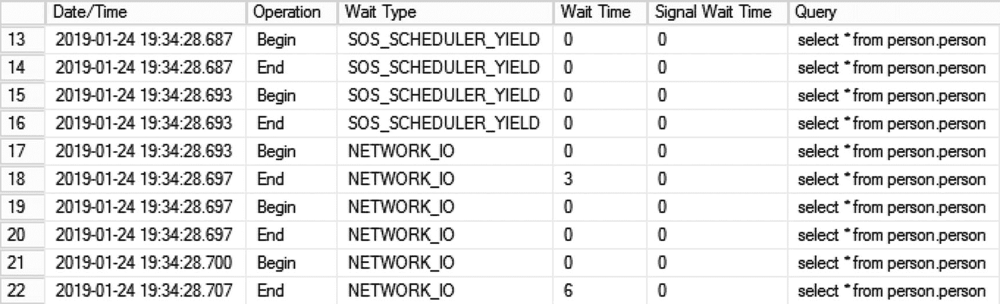

图 2-25

清单 2-4 中查询的结果

就其返回的行数据而言，大多数列不言自明。有两个列值得稍作解释，即 `Operation`（操作）和 `Wait Time`（等待时间）列。`Operation` 列将显示等待事件的开始或结束。`Wait Time` 列将以毫秒为单位返回等待时间，但它只会在操作结束时被记录。


### 基于执行计划按查询分析等待统计信息

到目前为止，我们主要查看了由各种后台进程或我们执行的查询所产生的聚合等待时间。由于我是唯一一个向我的测试机执行查询的人，因此很容易将等待时间与我的特定查询关联起来。不幸的是，在繁忙的系统上，大量会话不断执行许多查询，各种等待统计信息 DMV 对于分析特定查询的等待类型和等待时间几乎毫无用处。

值得庆幸的是，SQL Server 2016 SP1 的发布改变了这一情况，并引入了在查询执行计划内部捕获等待统计信息的功能！这意味着您可以轻松地查看您的查询在运行时遇到了哪些等待类型和等待时间。尽管这似乎显而易见，但请注意，每查询等待统计信息仅在查看**实际执行计划**时可用，**估算执行计划**则不行。

实际执行计划是在查询执行期间实际使用的执行计划。SQL Server Management Studio 中有一个选项可以查看估算执行计划。使用该选项时，SQL Server 引擎会编译出最有可能在查询执行期间使用的执行计划；然而，它实际上并不执行查询本身。由于没有实际执行查询，因此在编译估算执行计划时也没有等待统计信息可以记录。

公开每查询等待统计信息的最简单方法是启用 `Include Actual Execution Plan` 选项（如图 2-26 所示），可以通过单击菜单项“查询 – 包含实际执行计划”或使用组合键 `CTRL_M` 来实现，然后执行您的查询。

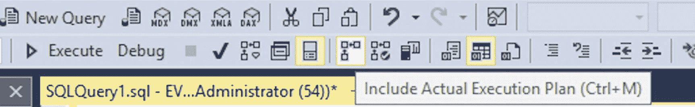

图 2-26
`Include Actual Execution Plan` 选项

当您启用 `Include Actual Execution Plan` 选项执行查询时，查询结果将返回一个名为 `Execution plan` 的额外选项卡。单击该选项卡将显示执行查询时所使用的执行计划的可视化表示。图 2-27 显示了一个实际执行计划的示例。

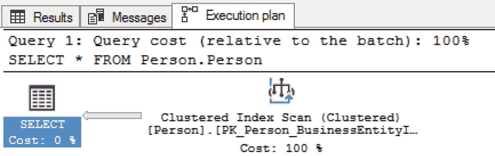

图 2-27
`Execution plan`

打开实际执行计划后，我们可以通过右键单击第一个运算符（在图 2-28 的例子中是 `SELECT` 运算符）并选择 `Properties` 来访问每查询等待统计信息。这将打开 SQL Server Management Studio 内部的执行计划属性窗口，并揭示有关查询执行以及所选运算符各种属性的丰富信息，例如使用的并行度或处理的行数。

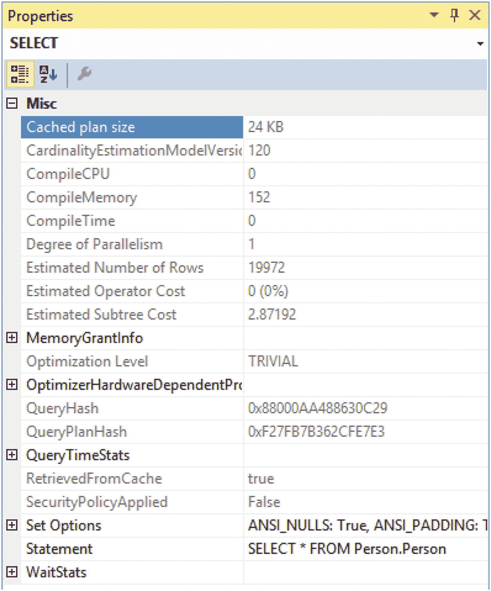

图 2-28
`Execution plan properties`

由于我们对等待统计信息感兴趣，执行计划属性中最有趣的部分记录在属性窗口的最底部。展开 `WaitStats` 属性后，您就能够看到此特定查询在执行时遇到的所有等待类型和等待时间。图 2-29 显示了此特定示例查询的每查询等待统计信息。

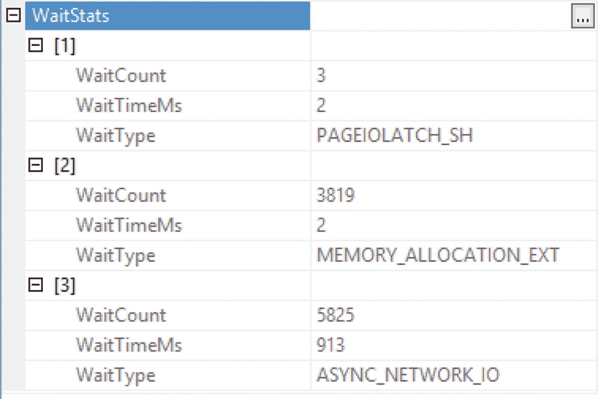

图 2-29
`Execution plan properties` 中的每查询等待统计信息

在本例中，我们的查询在执行时遇到了三种不同的等待类型：`PAGEIOLATCH_SH`、`MEMORY_ALLOCATION_EXT` 和 `ASYNC_NETWORK_IO`。对于每种等待类型，您都可以看到等待花费了多少时间，以及我们在该等待类型上等待了多少次。当查看单个查询在其执行期间遇到的等待统计信息时，此信息非常有用，并且也许能为您提供一些关于如何调整查询性能的见解。例如，如果您发现一个查询经常遇到与存储相关的等待统计信息，那么研究如何最小化对该特定查询的存储访问可能是值得的，以便其执行得更快。

我想再次指出的一点是，每查询等待统计信息仅记录在**实际执行计划**中！我再次提及的原因是，实际执行计划只能通过在查询执行前启用它来获得。没有其他方法可以访问实际执行计划，甚至通过查询存储也不行，我们将在下一章中看到。事实上，存储在 SQL Server 计划缓存中的执行计划是估算执行计划，而不是实际计划。这意味着如果您期望通过计划缓存检索每查询等待统计信息，您将会失望。

值得庆幸的是，尽管查询存储功能最初不记录实际执行计划，但它确实（随着 SQL Server 2017 的发布）将等待统计信息和其他查询运行时信息与估算执行计划一起记录了下来。将这些信息混合在一起意味着，通过查询存储，我们可以回溯历史，查看查询遇到了哪些等待统计信息！

## 本章小结

在本章中，我们回顾了访问等待统计信息的各种方法。我们深入探讨了一些关于等待统计信息最重要的 DMV：`sys.dm_os_wait_stats`、`sys.dm_os_waiting_tasks`、`sys.dm_exec_requests` 和 `sys.dm_exec_session_wait_stats`。我描述了它们的功能和返回的数据，并为您提供了一些可用于这些 DMV 的示例查询。我们还通过一个示例场景，其中我们组合了一些 DMV 来分析示例中是什么减慢了 SQL Server 的速度。示例中展示的步骤是在性能问题发生时分析系统性能问题的好方法。简要地，我们查看了 Windows 性能监视器（或 `Perfmon`），以及如何从其中访问等待统计信息。之后，我们仔细研究了扩展事件（Extended Events），以及如何使用扩展事件 GUI 或 `T-SQL` 来捕获特定查询或会话的等待相关信息。我们以查看执行计划记录的等待统计信息结束了本章。

