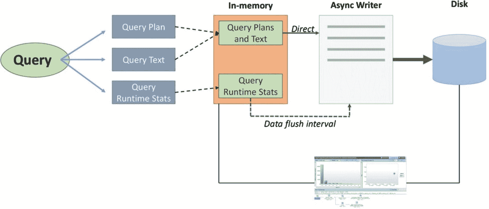
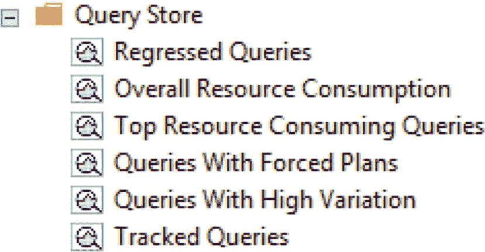
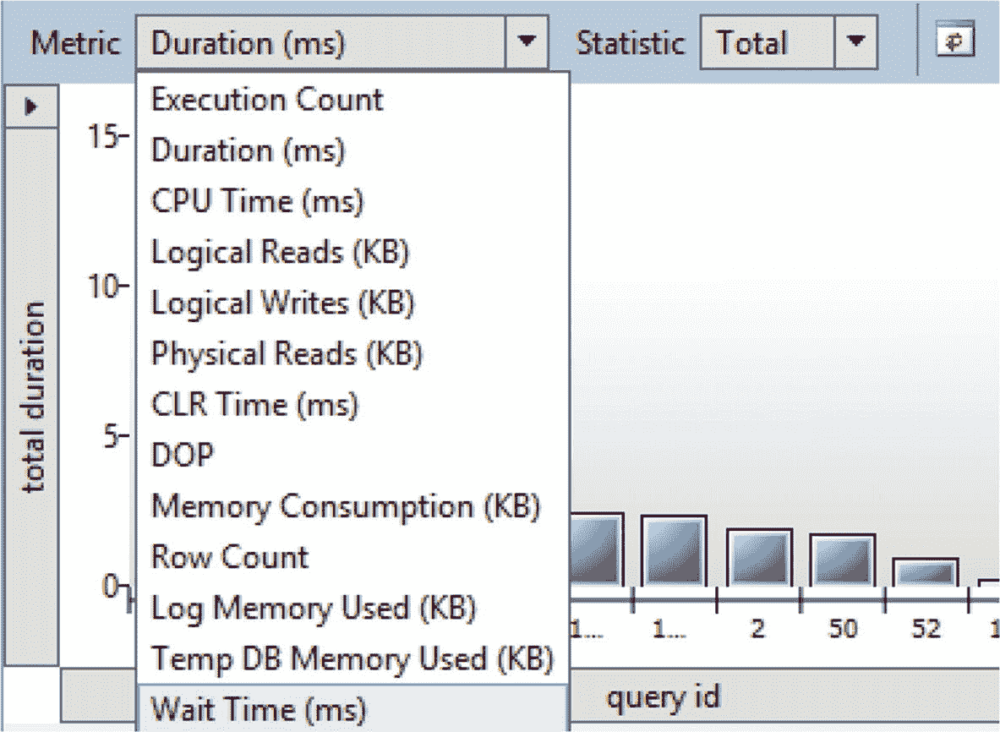
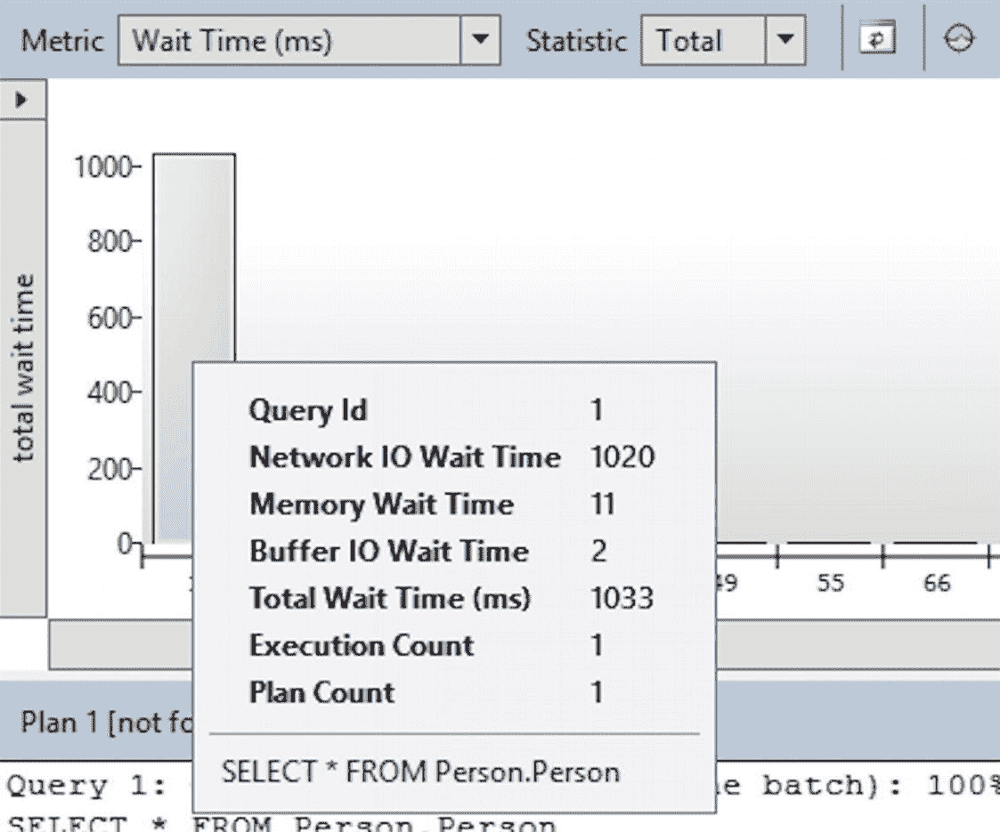
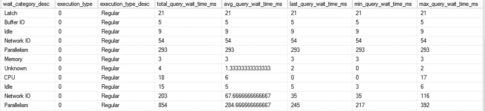
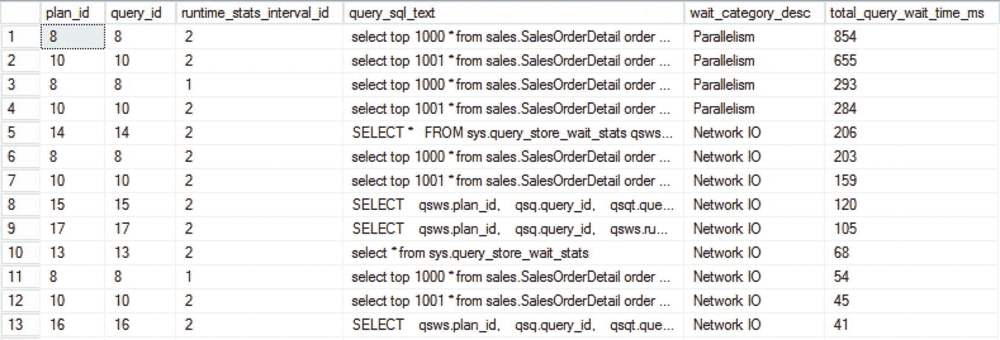
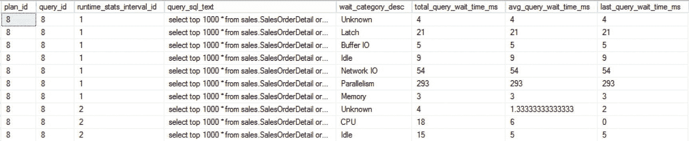

# 3. 查询存储

随着 SQL Server 2016 的发布，微软引入了一种全新的分析和排除查询性能问题的方法：查询存储（Query Store）。查询存储常被宣传为 SQL Server 的“飞行记录仪”，因为它提供了对查询何时执行、执行性能如何以及在查询执行期间使用了哪个执行计划的深入了解。虽然查询存储最初并未公开查询执行期间遇到的等待统计信息，但 SQL Server 2017 的发布包含了这一备受期待的补充。

由于查询存储在查询性能分析和调优方面是一个颠覆性的功能，我认为它值得一些额外的关注，以便您能从这一特性中获得最大收益。

## 什么是查询存储？

查询存储功能首次发布于 SQL Server 2016，其目标是以更简单、更易访问的方式揭示查询性能。在查询存储出现之前，查询性能分析是一个充满挑战且耗时的过程，需要对 SQL Server 如何处理查询以及如何通过各种 `DMVs` 分析信息有非常透彻的了解。虽然查询执行方面的经验和知识仍然非常有帮助，但查询存储能以更易访问和可视化的方式帮助你获取所需的性能信息。

`查询存储`直接集成在 SQL Server 引擎内部。这意味着它可以在查询执行发生的地方捕获并分析查询执行情况。与通过其他方法（如执行计划缓存）进行查询分析相比，这是一个主要区别，后者的查询运行时信息仅在后期阶段才可用。`查询存储`的另一个优势是它会将查询运行时信息持久化到磁盘。这意味着你可以为查询建立运行时指标的历史记录，并且可以更轻松地比较历史运行时统计信息与当前统计信息。这与 `DMVs` 不同，后者仅记录 SQL Server 运行期间的信息，并在 SQL Server 重启时清空所有记录的信息，这意味着所有计数器又从 0 开始。继续比较 `查询存储` 与 `DMVs`，虽然所有 `DMVs` 都在 SQL Server 实例级别记录信息，但 `查询存储` 允许你基于每个数据库捕获查询运行时指标。这使得在一个包含多个数据库的实例中，针对特定数据库分析性能变得相当容易和快捷。

使用 `查询存储` 还有更多优势，例如轻松强制使用执行计划，但由于这是一本关于等待统计信息的书，我不会涵盖 `查询存储` 所有的功能。如果你对更深入了解 `查询存储` 感兴趣，我写了一系列文章，描述了 `查询存储` 几乎所有的功能，文章在这里： [`www.red-gate.com/simple-talk/sql/database-administration/the-sql-server-2016-query-store-overview-and-architecture/`](http://www.red-gate.com/simple-talk/sql/database-administration/the-sql-server-2016-query-store-overview-and-architecture/)。

## 查询存储架构

为了让你很好地了解 `查询存储` 如何工作，我创建了图 3-1 中的图像，展示了查询运行时信息如何在 `查询存储` 内部被记录和存储。如果你想将 `查询存储` 作为分析查询性能和等待统计信息的工具，这些知识很重要。



图 3-1

查询存储架构

一旦查询开始执行，并且你已经在查询所针对的数据库上启用了 `查询存储`，`查询存储` 将查询运行时信息分为三个部分：查询执行计划、查询文本和查询执行的运行时统计信息。执行计划和查询文本都在执行计划编译期间立即记录在 `查询存储` 中。运行时统计信息（包括等待统计信息）仅在查询执行后才可用，这意味着它们将在查询执行后添加到 `查询存储`。

所有 `查询存储` 指标首先存储在 SQL Server 的保留内存区域中。这意味着它们可以通过查询或内置报告直接访问，但尚未固化到磁盘（新执行计划除外，它们会直接固化）。基于 `查询存储` 中一个名为 `数据刷新间隔` 的可配置设置，你可以配置 `查询存储` 应以多快的速度将信息固化到磁盘。

我们可以通过两种方法访问 `查询存储` 记录的所有信息：`查询存储 DMVs` 和内置报告。为了在 `查询存储` 中揭示等待统计信息，我们将使用这两种选项，但我认为在查看等待统计信息数据时，`DMV` 方法更有用。

## 等待统计信息在查询存储中如何处理

在我们开始查看如何访问 `查询存储` 中记录的等待统计信息之前，我们需要了解 `查询存储` 如何处理等待统计信息，因为它与我在本书第 1 章“等待统计信息内幕”中描述的过程不同。在那一章中，我描述了 SQL Server 引擎如何跟踪查询在特定资源或等待类型上花费的等待时间。这些信息以非常细的粒度记录；例如，`PAGEIOLATCH_SH` 等待类型表示查询正在等待数据页从磁盘读取到缓冲区高速缓存，而 `PAGEIOLATCH_EX` 表示查询正在等待数据页移动到缓冲区高速缓存以进行修改。`查询存储` 开发团队认为，为了避免性能和资源利用开销，需要更高级别的等待类型概览，而不是在如此详细的级别记录等待时间。最终，他们选择将各种等待类型分组到类别中，并在类别级别记录等待时间，而不是单个等待类型。这意味着在 `查询存储` 记录的等待统计信息中搜索特定的等待类型是不可能的，并且属于同一类别的等待类型无法相互区分。举个例子，`CMEMTHREAD` 和 `RESOURCE_SEMAPHORE` 等待类型（你将在第 6 章“I/O 相关等待类型”中了解更多）都被记录在 `查询存储` 的 `Memory` 类别中，尽管这两种等待类型指示不同的事情。

表 3-1 显示了 `查询存储` 中使用的等待类型与等待类别之间的映射关系。该表绝不是映射的完整概述，但应能让你很好地了解在哪里可以找到某个特定的等待类型。

表 3-1

等待类型与类别之间的映射

## 等待类别与等待类型对照表

| 等待类别 | 关联的等待类型 |
| --- | --- |
| **未知** | 未知 |
| **CPU** | SOS_SCHEDULER_YIELD |
| **工作线程** | THREADPOOL |
| **锁** | LCK_M_% |
| **闩锁** | LATCH_% |
| **缓冲区闩锁** | PAGELATCH_% |
| **缓冲区 IO** | PAGEIOLATCH_% |
| **编译*** | RESOURCE_SEMAPHORE_QUERY_COMPILE |
| **SQL CLR** | CLR%，SQLCLR% |
| **镜像** | DBMIRROR% |
| **事务** | XACT%，DTC%，TRAN_MARKLATCH_%，MSQL_XACT_%，TRANSACTION_MUTEX |
| **空闲** | SLEEP_%，LAZYWRITER_SLEEP，SQLTRACE_BUFFER_FLUSH，SQLTRACE_INCREMENTAL_FLUSH_SLEEP，SQLTRACE_WAIT_ENTRIES，FT_IFTS_SCHEDULER_IDLE_WAIT，XE_DISPATCHER_WAIT，REQUEST_FOR_DEADLOCK_SEARCH，LOGMGR_QUEUE，ONDEMAND_TASK_QUEUE，CHECKPOINT_QUEUE，XE_TIMER_EVENT |
| **抢占式** | PREEMPTIVE_% |
| **Service Broker** | BROKER_%（但不包括 BROKER_RECEIVE_WAITFOR） |
| **事务日志 IO** | LOGMGR，LOGBUFFER，LOGMGR_RESERVE_APPEND，LOGMGR_FLUSH，LOGMGR_PMM_LOG，CHKPT，WRITELOGF |
| **网络 IO** | ASYNC_NETWORK_IO，NET_WAITFOR_PACKET，PROXY_NETWORK_IO，EXTERNAL_SCRIPT_NETWORK_IOF |
| **并行性** | CXPACKET，EXCHANGE |
| **内存** | RESOURCE_SEMAPHORE，CMEMTHREAD，CMEMPARTITIONED，EE_PMOLOCK，MEMORY_ALLOCATION_EXT，RESERVED_MEMORY_ALLOCATION_EXT，MEMORY_GRANT_UPDATE |
| **用户等待** | WAITFOR，WAIT_FOR_RESULTS，BROKER_RECEIVE_WAITFOR |
| **跟踪** | TRACEWRITE，SQLTRACE_LOCK，SQLTRACE_FILE_BUFFER，SQLTRACE_FILE_WRITE_IO_COMPLETION，SQLTRACE_FILE_READ_IO_COMPLETION，SQLTRACE_PENDING_BUFFER_WRITERS，SQLTRACE_SHUTDOWN，QUERY_TRACEOUT，TRACE_EVTNOTIFF |
| **全文搜索** | FT_RESTART_CRAWL，FULLTEXT GATHERER，MSSEARCH，FT_METADATA_MUTEX，FT_IFTSHC_MUTEX，FT_IFTSISM_MUTEX，FT_IFTS_RWLOCK，FT_COMPROWSET_RWLOCK，FT_MASTER_MERGE，FT_PROPERTYLIST_CACHE，FT_MASTER_MERGE_COORDINATOR，PWAIT_RESOURCE_SEMAPHORE_FT_PARALLEL_QUERY_SYNC |
| **其他磁盘 IO** | ASYNC_IO_COMPLETION，IO_COMPLETION，BACKUPIO，WRITE_COMPLETION，IO_QUEUE_LIMIT，IO_RETRY |
| **复制** | SE_REPL_%，REPL_%，HADR_%（但不包括 HADR_THROTTLE_LOG_RATE_GOVERNOR），PWAIT_HADR_%，REPLICA_WRITES，FCB_REPLICA_WRITE，FCB_REPLICA_READ，PWAIT_HADRSIM |
| **日志速率调控器** | LOG_RATE_GOVERNOR，POOL_LOG_RATE_GOVERNOR，HADR_THROTTLE_LOG_RATE_GOVERNOR，INSTANCE_LOG_RATE_GOVERNOR |

## 通过查询存储报告访问等待统计

查看查询存储中可用的等待统计信息最用户友好的方式是通过内置报告。这些报告在数据库上启用查询存储功能后，可在 SQL Server Management Studio (SSMS) 中获得。图 3-2 显示了在撰写本书时可用的默认内置查询存储报告。



图 3-2 查询存储报告

如图 3-2 所示，目前（尚）没有专用的等待统计报告。我们可以通过专门选择以下三个报告中的`等待时间 (毫秒)`指标来查看查询遇到的等待类别：

*   性能下降的查询
*   资源消耗最大的查询
*   高差异查询

要在前面的任何报告中查看等待类别，首先需要将指标配置为等待时间（毫秒），如图 3-3 所示。



图 3-3 将指标配置为等待时间（毫秒）

这会将图表更改为（默认）返回按总等待时间排序的前 25 个查询。

更改指标后，您可以将鼠标悬停在图表中显示的任何查询上以检索等待类别信息，如图 3-4 所示。



图 3-4 查询存储中显示的等待类别

如图 3-4 所示，这个特定查询遇到了多种等待类别：网络 IO、内存和缓冲区 IO。我们可以看到每个类别的等待时间以及所有类别的总等待时间，但如前所述，我们无法知道查询具体遇到了哪些等待类型。

## 通过查询存储 DMV 访问等待统计

虽然内置的查询存储报告对于直观识别具有高等待时间的查询非常有用，但我们可以通过使用 SQL Server 2017 中可用的一个新查询存储 DMV 轻松生成更多信息：`sys.query_store_wait_stats`。查询此 DMV 返回的列主要显示与特定执行计划 ID 的各种等待类别的等待类型相关的各种统计信息。

查询存储使用其自己的唯一标识符来标识查询、执行计划和运行时区间。考虑到这一点，您可以通过在查询存储中查找查询 ID 来标识查询，或者通过搜索计划 ID 来标识执行计划。

图 3-5 显示了为每个执行计划 ID 记录的不同统计信息，这些信息按不同的等待类别进行拆分。



图 3-5 `sys.query_store_wait_stats` 中的等待类别统计信息

虽然我们可以直接查询 `sys.query_store_wait_stats` DMV 并查看每个或特定执行计划 ID 的各种统计信息，但通过将各种查询存储 DMV 连接在一起可以获得更多信息。

例如，以下查询连接了各种查询存储 DMV，以返回遇到高总等待时间的查询概览。

```
SELECT
    qsws.plan_id,
    qsq.query_id,
    qsws.runtime_stats_interval_id,
    qsqt.query_sql_text,
    qsws.wait_category_desc,
    qsws.total_query_wait_time_ms
FROM sys.query_store_wait_stats qsws
INNER JOIN sys.query_store_plan qsp
    ON qsws.plan_id = qsp.plan_id
INNER JOIN sys.query_store_query qsq
    ON qsp.query_id = qsq.query_id
INNER JOIN sys.query_store_query_text qsqt
    ON qsq.query_text_id = qsqt.query_text_id
ORDER BY qsws.total_query_wait_time_ms DESC
```

此查询的结果如图 3-6 所示。



图 3-6 来自查询存储的等待统计信息

使用前面的查询，我们可以立即看到，针对 `Sales.SalesOrderDetail` 表的 `SELECT` 查询大部分等待时间花费在与并行性相关的等待类型上。

通过按查询 ID 过滤来稍微修改查询，我们可以深入了解特定查询并分析其等待行为。以下是修改后的查询，您还会看到我添加了一些返回各种有用统计信息的附加列。

```
SELECT
    qsws.plan_id,
    qsq.query_id,
    qsws.runtime_stats_interval_id,
    qsqt.query_sql_text,
    qsws.wait_category_desc,
    qsws.total_query_wait_time_ms,
    qsws.avg_query_wait_time_ms,
    qsws.last_query_wait_time_ms
FROM sys.query_store_wait_stats qsws
INNER JOIN sys.query_store_plan qsp
    ON qsws.plan_id = qsp.plan_id
INNER JOIN sys.query_store_query qsq
    ON qsp.query_id = qsq.query_id
INNER JOIN sys.query_store_query_text qsqt
    ON qsq.query_text_id = qsqt.query_text_id
WHERE qsq.query_id = 8
ORDER BY runtime_stats_interval_id ASC
```

图 3-7 显示了运行此版本查询的输出。



图 3-7 特定查询的等待统计信息


在图 3-7 所示的查询及查询结果中，可以看到我添加了一个名为`runtime_stats_interval_id`的额外列。查询存储对运行时等待时间进行分组和聚合，其指标也是基于区间进行汇总的。默认情况下，这些区间为一小时的时间块，这意味着前面示例中针对特定查询返回的等待统计信息，是该区间内一次或多次查询执行的聚合结果。虽然你可以通过设置查询存储属性中的`统计信息收集间隔`将区间调整为更小的时间段，但这可能对 SQL Server 实例的性能产生负面影响，因此修改此设置时需谨慎。

我仅向你展示了从查询存储中检索等待统计相关指标的几个示例。查询存储收集的所有信息，犹如一片汪洋，其中蕴含着大量可与等待统计指标相结合的其他信息。例如，你可以筛选特定的等待类别，或检测查询是否生成不同的执行计划，以及这些执行计划对该特定查询的等待有何影响。我强烈建议所有使用 SQL Server 2016 或更高版本的用户启用查询存储，并探索它所收集的所有强大指标。

虽然查询存储仅在 SQL Server 2016 及更高版本中可用，但 William Durkin（Twitter 账号@sql_williamd）和我本人发布了一个名为 Open Query Store 的项目，它为低于 2016 版本的 SQL Server 模拟了查询存储的数据收集功能。该项目是完全开源且免费的，可通过其 GitHub 页面 `https://github.com/OpenQueryStore/OpenQueryStore` 获取。

## 本章小结

本章我们探讨了 SQL Server 2016 引入的一项新的查询性能与分析功能：查询存储。我们深入探究了查询存储的底层工作原理，以及如何在 SQL Server 2017 版本查询存储的内置报表中访问查询等待统计信息。

最后，我们介绍了如何使用新的查询存储动态管理视图（DMV）来访问查询存储等待统计信息，并展示了一些示例查询，帮助你开始着手查询查询存储。

