# 4. 构建稳固的基线

在第 2 章“查询 SQL Server 等待统计信息”中，我们花费了大量时间描述和使用各种访问等待统计信息的方法。这些方法大多侧重于利用这些信息来检测当前发生的性能问题。虽然通过这些实时方法可以找到性能问题的确切原因，但这需要深入了解各种等待类型，以及——最重要的——对你所管理的 SQL Server 性能有丰富的经验。如果你只管理一个 SQL Server 实例，相对可以较快熟悉它在不同情况下的反应。但如果你管理着数百个 SQL Server 实例，要熟悉它们各自的性能表现几乎是不可能的。由于 SQL Server 等待统计信息很大程度上取决于 SQL Server 实例的工作负载，没有任何两个 SQL Server 实例会对相同的等待类型有完全相同的等待时间。这使得检测潜在问题变得困难，因为我们不能仅仅因为 CXPACKET 等待类型的等待时间为 20,000 毫秒就断定出现了问题。这完全取决于你系统的配置和工作负载。一个 SQL Server 实例可能每分钟在 CXPACKET 等待类型上花费 20,000 毫秒（20 秒）的等待时间而没有遇到任何性能问题，而另一个实例即使只有 1,000 毫秒的等待时间，用户也可能不断抱怨性能不佳。

如果我们想对等待统计信息或任何与性能相关的数据进行深入分析，就需要一种收集相关性能指标并赋予其意义的方法。仅仅检测到你花费了 10,000 毫秒等待资源并没有任何意义，因为我们不知道这是否导致了性能问题。是的，也许你的用户正在抱怨性能极差，而你也注意到了这 10,000 毫秒的等待时间，但无法确定该等待是否确实是导致用户所经历的性能问题的根源。在这种情况下，我们常常只能猜测，并假定该特定的资源等待就是性能问题的源头。在与世界各地的许多 DBA 交流后，我了解到 DBA 们不喜欢猜测是什么拖慢了他们的 SQL Server 实例。我们想要确定性能问题的根源确实是那个资源等待。这就是基线可以提供帮助的地方。

基线通过为你提供系统正常状态的定义，帮助你为性能指标赋予意义。没有系统的基线，我们无从知晓它是运行良好还是异常缓慢。基线至关重要；事实上，它们如此重要，以至于我决定在本书中用一整章来讲述。没有稳固的基线，你的测量结果毫无意义！尽管本书侧重于等待统计信息，但基线可以应用于你能在系统上捕获的任何与性能相关的指标，为你提供一种宝贵的性能分析方法。

如果你通读了前一章关于查询存储的内容，可能会倾向于认为查询存储可以满足你所有的基线需求（如果你运行的是 SQL Server 2016 或更高版本）。虽然查询存储绝对为捕获和监控查询性能提供了一个非常有用的工具，但它并不一定提供对整个 SQL Server 实例的性能概览。我个人认为，查询存储是常规的基线捕获和监控流程的补充，而非替代。


## 何为基线？

如果我们查阅牛津词典中的“baseline”（基线）一词，会得到如下定义：“用于比较的最低或起始点。” 这句话通过使用“起始点”和“比较”这两个关键词，完美地捕捉到了基线的本质。基线通常是我们将后续测量与之进行比较的起始点，或者在我们的语境中，即测量标准。理想情况下，我们会在正常或标准情况下记录我们的基线测量值。如果我们在以后的某个时间点再次执行相同的测量，就可以将该测量值与基线进行比较。如果在比较过程中我们的测量值不一致，则说明可能发生了某些变化。

即使你在分析性能时尚未使用基线比较，无论你是否意识到，你其实一直在与基线打交道。例如，如果你每月第一天收到薪水，那就是你的情况，或者在本章的语境中，即你的基线。如果由于某种原因你没有在每月第一天收到薪水，你就会注意到与基线相比出现了偏差。这可能成为你调查为何没有按时收到薪水的原因。也许发薪日从每月一号改到了五号，或者最坏的情况是，你工作的公司无法再支付你的薪水了。在任何一种情况下，我们都可以采取行动：要么接受变化，从而创建一个新的基线；要么将情况恢复到基线状态。图 4-1 展示了这一过程。

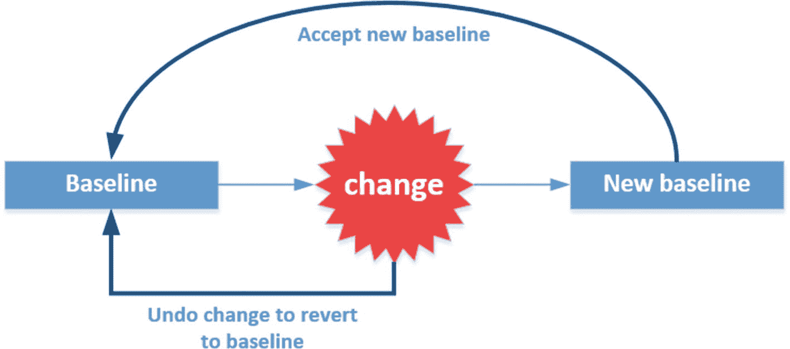

**图 4-1：变更影响基线**

定义和维护基线是一个迭代的过程。系统上发生的每一次变更都可能影响你的基线。你正在使用的应用程序发布新版本可能会改变一些查询，或者你的公司可能授予新部门访问数据库的权限，从而增加了连接数。在这两个例子中，我们都需要对基线进行调整，因为正常情况已经发生了变化。

所有这些随着系统每次变更而调整和测量基线的工作听起来很繁重，有时也确实如此。但请相信我——拥有基线的益处远远大于成本。基线将帮助你比仅仅查看单次测量更快地发现问题，而且在等待统计信息的情况下，它是找到问题可靠、确定答案的唯一方法。让我们用 DBA 吉姆的一个更技术性的例子来说明这一点。

吉姆维护着一个托管单一用户数据库的 `SQL Server` 实例。该数据库供公司每位销售人员使用，记录公司与客户之间的每一笔财务交易。用户可以通过 `应用程序 X` 访问数据库。`应用程序 X` 目前运行的是 `版本 2.4`，非常稳定。性能良好，用户满意，财源滚滚。听起来很棒，对吧？一天，一位顾问走进来，想要将 `应用程序 X` 升级到全新的 `版本 3.0`。升级到 `版本 3.0` 的过程轻而易举，没有出现任何问题，所有用户都喜欢新功能。

两天后，电话响了，克里斯的经理刚收到销售团队的反馈，称 `版本 3.0` 的性能糟糕透顶，并要求立即解决。

幸运的是，吉姆知道基线的重要性，他在升级到 `版本 3.0` 之前创建了一个基线。利用 `版本 2.4` 的基线，吉姆将基线中的测量值与 `版本 3.0` 中进行的测量值进行比较，立即发现了 `锁等待时间` 测量值上的巨大差异。由于其他测量值与 `2.4` 基线相比基本保持不变，吉姆将注意力集中在长时间运行的锁上，并识别出一个正在锁表的更新查询。他回滚了该查询，情况恢复正常。随后，他联系了应用程序供应商，了解到这种行为是软件中的一个错误导致的。

这个例子可能听起来有点牵强，但它实际上是我每天在测量变更影响或分析性能问题时所使用方法的简化版本。如果吉姆没有 `锁等待时间` 的基线，只是在变更到 `版本 3.0` 后查询 `锁等待时间`，他将无法知道等待时间增加了，因为他没有可以比较的对象。他可能选择查看其他指标而不是 `锁等待时间`，从而浪费了宝贵的时间和金钱。

这里的道理很简单：基线将帮助你更快地检测异常情况并解决性能问题！

### 可视化你的基线

基线通常通过图表进行可视化。将基线测量值转化为图表的一大优势是，图表可以让你更容易地检测出那些与基线相比增幅或降幅最大的测量值。此外，如果你需要证明特定配置正在影响性能，可视化你的数据可能有助于你更轻松地阐明观点。例如，你需要说服你的存储管理员，存储配置的变更已经影响了性能。如果你能交给他一张图表，展示正常行为与变更后行为的对比，他可能会更愿意提供帮助。图 4-2 中的图表展示了基线测量值与后期测量值的对比。

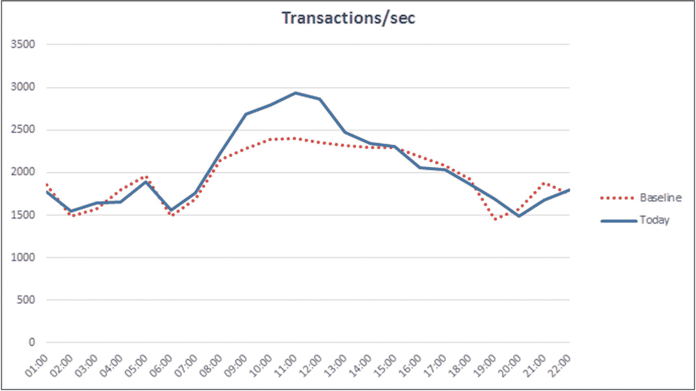

**图 4-2：基线图表示例**

如图 4-2 所示，你将能够非常快速地识别潜在问题。显然，在 08:00 到 12:00 之间，`每秒事务数` 高于正常情况，这可能值得花时间进行调查。


### 基线类型与统计

根据我们所关注的信息，我们会频繁使用不同类型的基线。通常，没有一个单一的基线能够满足我们所有的需求，特别是当你使用基线进行性能故障排查时。例如，我们可以为每一种等待类型都创建一个基线，或者我们也可以选择只为对系统影响最大的等待类型创建基线。我们还可以选择为特定的日期或时间段创建基线，比如营业时间，并为非营业时间创建另一个基线。

除了选择或限制我们要为其建立基线的测量指标外，我们还必须就如何计算基线做出选择。这些选择涉及一些数学计算，通常需要计算平均值。在许多情况下，我们的基线由许多数据点的平均值组成，这取决于你执行了多少次测量。如果你在很长一段时间内收集测量数据，并从这些数据中计算平均值，那么你就能建立一个比只有一天测量数据更可靠的基线。基于平均值创建基线也有其缺点。最重要的是，平均值受偏斜数据的影响很大。在不过多深入统计细节的情况下，偏斜数据是指存在非常高或非常低的值，从而影响了你的平均值。比如说，一组学生参加了一次考试，我们想通过计算考试的平均结果来了解该组的表现（学生评分在 1 到 10 之间，1 表示非常差，10 表示优秀；需要 6 分或以上才能通过考试）。图 4-3 以图表形式显示了考试结果。

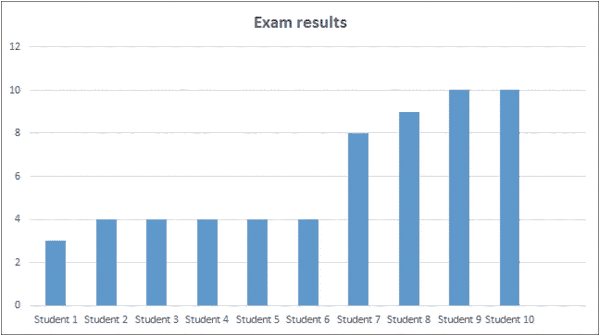

图 4-3

考试结果

如图 4-3 所示，只有四名学生的成绩高于通过考试所需的 6 分。其余学生的成绩远低于要求。然而，如果我们看这组学生的平均表现，他们实际上考得不算太差，平均分是 6 分。我们可能会因为平均分达到 6 分而得出该组表现良好的结论，但这样我们就会忽略大多数人表现不佳，实际上只有四名学生通过了考试这一事实。当你处理基于平均值的基线时，牢记这一信息非常重要。如果你看到平均基线出现尖峰，这总是值得你调查的，因为它会影响你的基线。

有一些统计方法可用于处理偏斜数据和平均值，其中一种是`trimmed (or truncated) mean`（截尾均值）。这种方法会去除数据序列中最高和最低的`x`%的测量值，从而创建一个更稳定的平均值。对于基线使用，我们不会更深入地探讨截尾均值，但如果你想了解更多，我建议你阅读 Bob Newstadt 在[`www.sqlteam.com/article/computing-the-trimmed-mean-in-sql`](http://www.sqlteam.com/article/computing-the-trimmed-mean-in-sql)上发表的博客文章。尽管这篇文章已经有些年头了，但它展示了使用`T-SQL`计算截尾均值的一种方法。

## 基线陷阱

希望上一节已经让你相信了基线的重要性，但在你着手捕获每一个性能指标并将其转换为基线测量值之前，有一些陷阱你需要避免。

### 信息过载

尽管你可以自由地为系统中的所有内容建立基线，但这通常被认为是坏主意。收集过多信息可能会在你寻找答案时蒙蔽你的双眼。如果每次发生性能问题时，你都必须将 100,000 个不同的指标与基线进行比较，那是在浪费时间。这里的建议是保持你的基线精简，只包含对系统最重要的性能指标。例如，你可以包含与`可用性组`相关的性能指标，但如果你的系统不使用此功能，那么包含它们就毫无用处。

### 了解你的指标

选择性能指标时，另一个重要方面是理解。如果你不理解一个性能指标代表什么，就很难得出正确的结论，甚至可能将你引向错误的方向。

### 关注大幅测量变化

将测量值与基线进行比较时，始终关注大幅增加或减少。特别是对于等待统计，等待时间的微小增长（1-2%）不值得担心。如果你的某个等待时间测量值上升了 20%，那就是开始调查的一个好信号。

### 使用固定间隔

捕获等待统计信息时，应始终使用固定间隔。如果我们随机捕获等待时间，就几乎不可能建立一个可靠的基线。这就像拿苹果和橘子作比较一样。自动化捕获等待统计信息的最佳方式是使用`SQL Server Agent`（SQL Server 代理），并将其设置为固定间隔，例如每 15 分钟一次。


## 为等待统计分析建立基线

既然我们已经熟悉了基线的概念，现在让我们开始工作，创建一个可用于等待统计分析的基线。正如我在本章开头所提到的，如果你想使用等待统计信息来分析性能问题，基线是极其重要的。没有人的系统与你的系统拥有完全相同的等待类型和等待时间，因此你需要创建一个可以用于比较的基线。

在本节中，我将向你展示一种我用来创建、维护和比较基线与测量结果的方法。这并不一定意味着这是正确的做法，你可能会发现其他方法更适合你的需求。

由于我们将捕获 SQL Server 等待统计测量数据，我更喜欢将我的测量数据存储在一个名为“Baseline”的独立数据库中。这样，我的测量信息就不会存储在用户表之间。由于等待统计信息是在 SQL Server 实例级别记录的，因此在每个 SQL Server 实例中创建一个独立的测量数据库是合理的。图 4-4 展示了我在 SQL Server Management Studio 中的基线数据库。

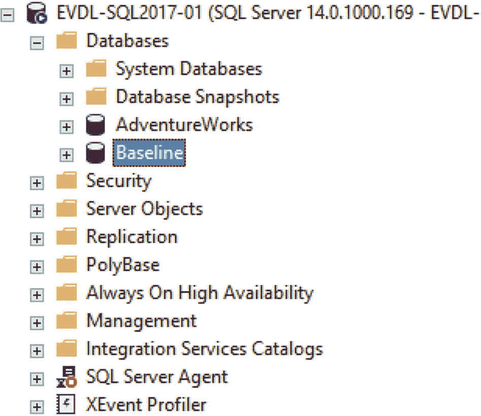

图 4-4: 基线数据库

你可以使用清单 4-1 中的脚本自行创建该数据库，记得更改文件位置。数据库数据文件在创建时将是 1.5 GB，这为捕获数周的等待统计信息提供了足够的空间。

```sql
-- 创建 Baseline 数据库
CREATE DATABASE [Baseline]
ON PRIMARY
(
NAME = N'Baseline', FILENAME = N'E:\Data\baseline_data.mdf' , SIZE = 1536000KB , FILEGROWTH = 10%
)
LOG ON
(
NAME = N'Baseline_log', FILENAME = N'E:\Log\baseline_log.ldf' , SIZE = 102400KB , FILEGROWTH = 10%
)
GO
ALTER DATABASE [Baseline] SET RECOVERY SIMPLE
GO
```
清单 4-1: 创建 Baseline 数据库

我们将使用 `sys.dm_os_wait_stats` DMV 作为测量数据的来源，这意味着容纳我们测量数据的表必须能够处理从 DMV 返回的信息。我们不仅会存储等待类型和等待时间，还会添加额外的信息来丰富数据，以便我们可以轻松地创建多个基线。

清单 4-2 显示了可用于创建名为 `WaitStats` 的表的查询，该表将用于存储我们用于创建基线的等待统计信息。

```sql
USE [BaseLine]
GO
CREATE TABLE WaitStats
(
ws_ID INT IDENTITY(1,1) PRIMARY KEY,
ws_DateTime DATETIME,
ws_Day INT,
ws_Month INT,
ws_Year INT,
ws_Hour INT,
ws_Minute INT,
ws_DayOfWeek VARCHAR(15),
ws_WaitType VARCHAR(50),
ws_WaitTime INT,
ws_WaitingTasks INT,
ws_SignalWaitTime INT
)
```
清单 4-2: 创建等待统计表

正如你在清单中所看到的，我们捕获了等待类型、等待时间、信号等待时间和等待任务数量。我们还捕获了记录等待统计信息的日期和时间。我们还将日期和时间拆分到额外的列中，以便对数据进行分段，从而更容易基于特定的日期、小时、月份等构建特定的基线，而无需每次都转换 `datetime` 数据类型。

现在我们的表已经准备好了，是时候捕获一些等待统计信息并将其插入到我们的 `WaitStats` 表中了。因为 `sys.dm_os_wait_stats` DMV 返回的是累计等待时间，所以我们需要使用一种方法来仅捕获两个捕获时刻之间等待时间的差异。如果我们直接从 `sys.dm_os_wait_stats` DMV 捕获信息，我们将总是收到不断增长的等待时间，这将使比较变得毫无用处。有两种方法可以捕获两次测量之间等待时间的变化，每种方法都有其优缺点。

第一种方法，我称之为重置法，它将从 `sys.dm_os_wait_stats` DMV 捕获等待统计信息，然后使用 `DBCC SQLPERF('sys.dm_os_wait_stats', CLEAR)` 命令重置 DMV。这种方法的主要优点是使用非常简单，因为我们只需要捕获信息，然后再次重置，并在下一次测量时开始相同的过程。不需要计算增量，因为在我们的第一次测量之后，计数器就被重置为 0。缺点是 `DBCC SQLPERF('sys.dm_os_wait_stats', CLEAR)` 命令会重置 `sys.dm_os_wait_stats` DMV 内部的信息。这意味着你将丢失 DMV 内部的累计信息，这些信息可能是你不想丢失的。图 4-5 说明了这种捕获等待统计的方法。

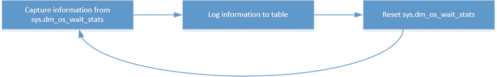

图 4-5: 使用重置法捕获等待统计

第二种选择，我命名为增量法，它不使用 `DBCC SQLPERF('sys.dm_os_wait_stats', CLEAR)` 命令，而是计算两次测量之间等待时间的差异或增量。不使用 `DBCC` 命令的优点是你不会丢失 `sys.dm_os_wait_stats` DMV 内部的累计等待时间。它的主要缺点是与第一种方法相比，计算增量要复杂得多。它通常还需要在 T-SQL 脚本中包含一个 `WAITFOR DELAY` 命令来设置间隔。这可能意味着，如果你计划使用 SQL Server Agent 捕获等待统计信息，你最终可能会得到一个几乎持续运行的 SQL Server Agent 作业。图 4-6 说明了捕获等待统计的增量选项。

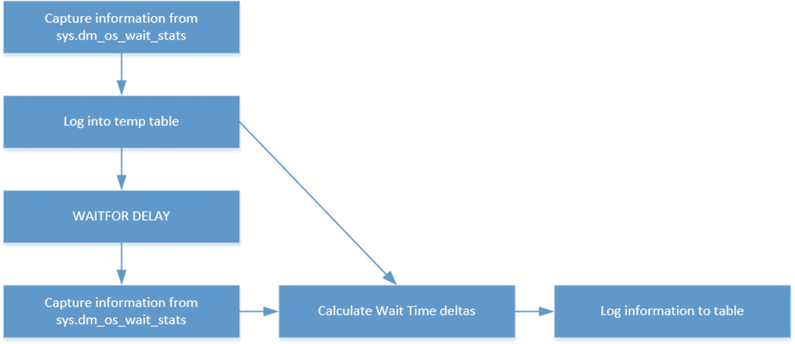

图 4-6: 使用增量法捕获等待统计

还有更多可用的方法来捕获等待统计信息，但我最常见到的是这两种，或者是它们的变体。你想使用哪种方法取决于你自己，因为最终两种方法都会返回相同的结果。

### 重置捕获法

重置等待统计捕获法包含一个单一的 T-SQL 脚本，该脚本将从 `sys.dm_os_wait_stats` DMV 捕获信息，然后重置 DMV 内部的计数器。清单 4-3 显示了可用于填充我们之前创建的 `WaitStats` 表的 T-SQL 脚本。

```sql
USE [Baseline]
GO
-- 将 Wait Stats 插入到 Baseline 表
INSERT INTO WaitStats
SELECT
GETDATE() AS 'DateTime',
DATEPART(DAY,GETDATE()) AS 'Day',
DATEPART(MONTH,GETDATE()) AS 'Month',
DATEPART(YEAR,GETDATE()) AS 'Year',
DATEPART(HOUR, GETDATE()) AS 'Hour',
DATEPART(MINUTE, GETDATE()) AS 'Minute',
DATENAME(DW, GETDATE()) AS 'DayOfWeek',
wait_type AS 'WaitType',
wait_time_ms AS 'WaitTime',
waiting_tasks_count AS 'WaitingTasks',
signal_wait_time_ms AS 'SignalWaitTime'
FROM sys.dm_os_wait_stats;
-- 清除 sys.dm_os_wait_stats
DBCC SQLPERF ('sys.dm_os_wait_stats',CLEAR)
GO
```
清单 4-3: 重置捕获法


### 增量捕获方法

增量捕获方法也仅包含一个 T-SQL 脚本，但它比重置捕获方法稍复杂一些。它使用一个临时表来存储第一次测量，然后等待 15 分钟，执行第二次测量，并计算增量差值。结果会被插入到 `WaitStats` 表中。清单 4-4 展示了如果你计划使用此方法收集等待统计指标，可以使用的 T-SQL 脚本。

```
USE [Baseline]
GO
-- 检查临时表是否已存在
-- 如果存在，则删除它。
IF EXISTS
(
SELECT *
FROM tempdb.dbo.sysobjects
WHERE ID = OBJECT_ID(N'tempdb..#ws_Capture')
)
DROP TABLE #ws_Capture;
-- 创建临时表以保存我们的第一次测量
CREATE TABLE #ws_Capture
(
wst_WaitType VARCHAR(50),
wst_WaitTime INT,
wst_WaitingTasks INT,
wst_SignalWaitTime INT
);
-- 将我们的第一次测量插入到临时表
INSERT INTO #ws_Capture
SELECT
wait_type,
wait_time_ms,
waiting_tasks_count,
signal_wait_time_ms
FROM sys.dm_os_wait_stats;
-- 等待下一次测量
-- 在此例中，我们将等待 15 分钟
WAITFOR DELAY '00:15:00'
-- 将第一次测量与新的测量合并
-- 并计算增量差值
-- 将结果写入 WaitStats 表
INSERT INTO WaitStats
SELECT
GETDATE() AS 'DateTime',
DATEPART(DAY,GETDATE()) AS 'Day',
DATEPART(MONTH,GETDATE()) AS 'Month',
DATEPART(YEAR,GETDATE()) AS 'Year',
DATEPART(HOUR, GETDATE()) AS 'Hour',
DATEPART(MINUTE, GETDATE()) AS 'Minute',
DATENAME(DW, GETDATE()) AS 'DayOfWeek',
dm.wait_type AS 'WaitType',
dm.wait_time_ms - ws.wst_WaitTime AS 'WaitTime',
dm.waiting_tasks_count - ws.wst_WaitingTasks AS 'WaitingTasks',
dm.signal_wait_time_ms - ws.wst_SignalWaitTime AS 'SignalWaitTime'
FROM sys.dm_os_wait_stats dm
INNER JOIN #ws_Capture ws
ON dm.wait_type = ws.wst_WaitType;
-- 清理临时表
DROP TABLE #ws_Capture;
```
清单 4-4
增量捕获方法

### 使用 SQL Server Agent 安排测量

选择捕获方法后，我们需要运行捕获 T-SQL 脚本，以用等待统计信息填充我们的 `WaitStats` 表。如前面基线陷阱部分所述，始终以固定间隔执行测量非常重要。这使得比较测量结果容易得多，因为你总是在比较相同的时间段。实现此目的的最佳方法是使用设置为固定间隔的 `SQL Server Agent` 作业。间隔可以根据你的选择设置——设置的间隔越大，你可以比较的时间段数量就越少。将间隔设置得更短会给你更多的时间段，但同时也意味着需要存储的数据量增加。我个人倾向于将间隔设置为 15 分钟。在大多数情况下，这给了我足够的时间段进行比较。

这里我不会详细介绍如何创建 `SQL Server Agent` 作业来捕获等待统计信息，但我想指出我的作业作为示例供你参考。我通常最终会创建一个 `SQL Server Agent` 作业，其中只包含一个 T-SQL 脚本步骤。在此步骤中，我根据想要使用的方法复制捕获脚本。图 4-7 显示了我的 `SQL Server Agent` 作业的截图。

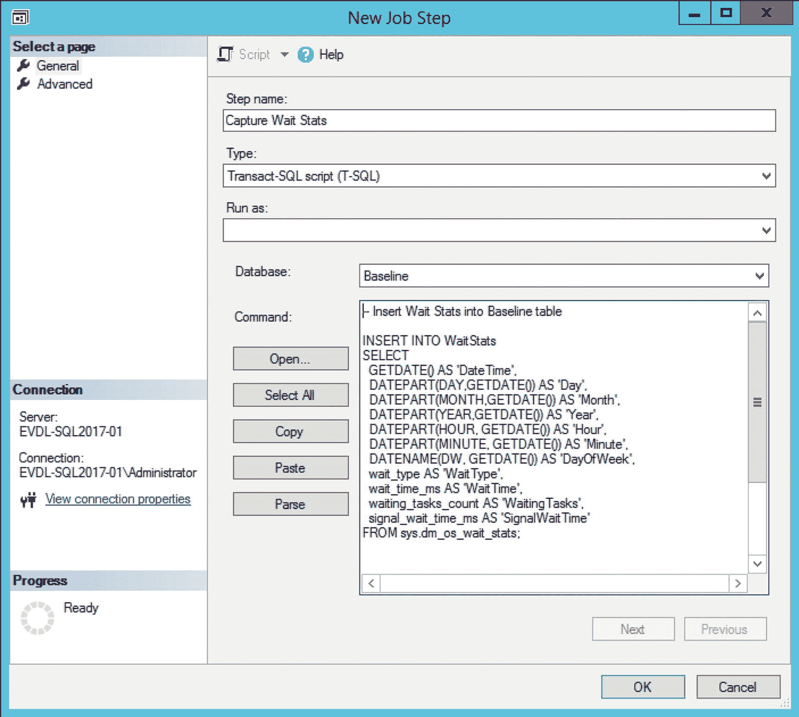

图 4-7
捕获 WaitStats 的 `SQL Server Agent` 作业步骤

在此例中，我使用了重置捕获方法来将等待统计信息捕获到我的 `WaitStats` 表中。

图 4-8 显示了我用来在固定间隔捕获等待统计信息的计划。如你所见，我将其设置为每 15 分钟一次，每天执行。

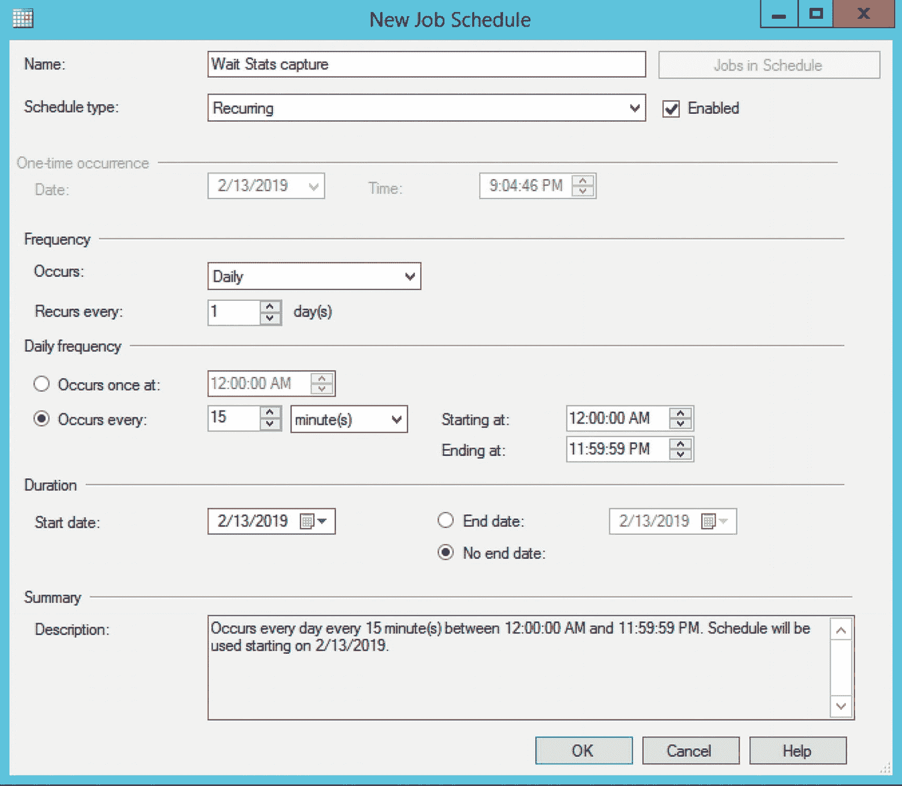

图 4-8
`SQL Server Agent` 作业计划

再次说明，你可以自由选择自己的捕获间隔，但请确保始终以相同的间隔时长进行捕获。

在我们创建了 `SQL Server Agent` 作业来收集等待统计信息后，我们需要让它运行一段时间。作业运行的时间越长，我们收集的信息就越多，从而提高了我们基线的质量。


## 等待统计基线分析

在让 SQL Server 代理作业收集了一段时间的等待统计指标后，我们现在已准备好实际创建一些基线。我们的方法是查询之前创建的 `WaitStats` 表。我将给你一些创建基线的查询示例，以便你进行对比；不过，这些并非唯一可运行的查询，我鼓励你尝试不同的查询来返回你最感兴趣的信息。

在开始构建基线之前，我想回到第 2 章“查询 SQL Server 等待统计”中的图 2-14。在那个流程图中，我向你展示了分析当前正在发生的资源等待可以采取的步骤。既然我们现在能够访问基线，就可以在流程图中添加一个额外的步骤。图 4-9 展示了如何完善该流程图，包括基线比较步骤。

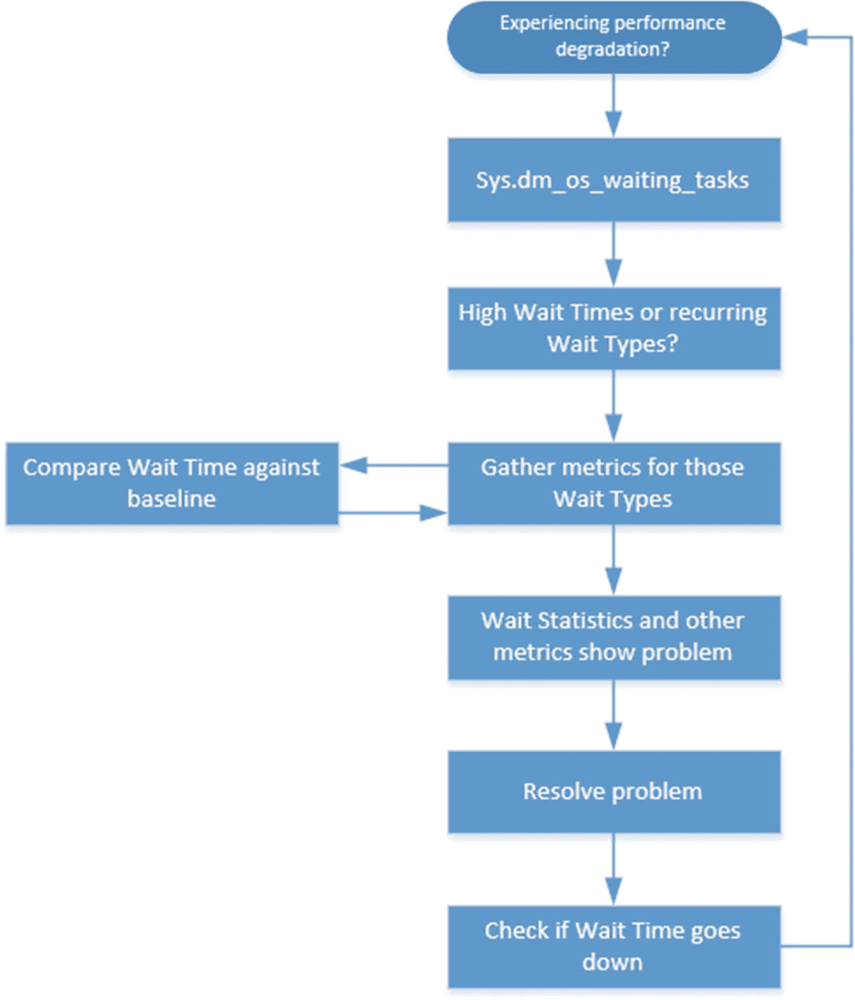

### 图 4-9
完整的等待统计性能分析流程图

你创建的基线是调查性能问题时，对你所收集指标的一个额外输入。它们是一个非常有价值的输入，因为它们将向你展示问题未发生时的信息。

让我们通过一个例子来走一遍流程，再次以 DBA Jim 为例，回顾图 4-9 所示流程图的所有步骤。在这个例子中，我将向你展示针对 `WaitStats` 表的查询，以构建对性能分析过程有用的基线。

周二上午 9 点左右，DBA Jim 接到电话，称针对销售数据库的日常报表比平时慢了很多。问题大约在上午 8 点开始，用户仍在经历性能问题。这些报表是计划作业的一部分，每个工作日从上午 8 点开始运行。

Jim 首先使用以下查询动态管理视图 `sys.dm_os_waiting_tasks`：

```sql
SELECT * FROM sys.dm_os_waiting_tasks
ORDER BY session_id ASC;
```

Jim 关注的是用户会话（通常 ID 高于 50），但他没有看到任何用户会话有很长的等待时间，如图 4-10 所示。

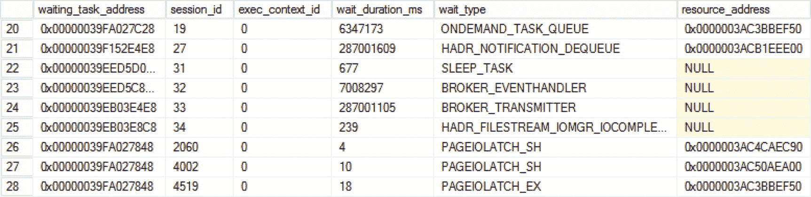

### 图 4-10
sys.dm_os_waiting_tasks

在多次执行对 `sys.dm_os_waiting_tasks` DMV 的查询后，Jim 注意到每次查询该 DMV 时都会返回等待类型 `PAGEIOLATCH_SH`。每次返回的会话 ID 不同，但等待时间相对较短。

Jim 使用相同的 T-SQL 脚本将等待统计指标捕获到 `WaitStats` 表中，正如本章前面所讨论的那样。由于 Jim 可以访问历史等待统计信息，他决定为 `PAGEIOLATCH_SH` 等待时间创建一个基线。他首先做的是查看今天 `PAGEIOLATCH_SH` 的等待时间，筛选显示上午 8 点到 9 点之间捕获的测量值，使用如代码清单 4-5 所示的查询。

```sql
-- 今天上午 8 点到 9 点之间的 PAGEIOLATCH_SH 等待
SELECT
CONVERT(VARCHAR(5), ws_DateTime, 108) AS '时间',
ws_WaitTime AS '等待时间'
FROM WaitStats
WHERE ws_WaitType = 'PAGEIOLATCH_SH'
AND (ws_Hour >= 8 AND ws_Hour < 9)
AND CONVERT(VARCHAR(5), ws_DateTime, 105) = CONVERT(VARCHAR(5), GETDATE(), 105)
```

**代码清单 4-5**
显示今天上午 8 点到 9 点之间 `PAGEIOLATCH_SH` 的等待时间

查询返回的结果如图 4-11 所示。

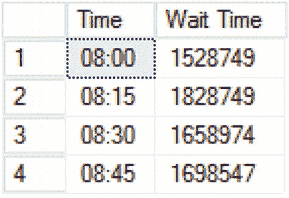

### 图 4-11
今天 `PAGEIOLATCH_SH` 的等待时间

现在 Jim 已经获得了 `PAGEIOLATCH_SH` 等待类型今天的等待时间，下一步是从 `PAGEIOLATCH_SH` 等待类型的历史测量值创建基线，以便将今天的测量值与基线进行比较。Jim 使用如代码清单 4-6 所示的查询来构建他的基线。

```sql
-- 工作日上午 8 点到 9 点之间的基线
-- 不包括今天进行的测量
SELECT
CONVERT(VARCHAR(5), ws_DateTime, 108) AS '时间',
AVG(ws_WaitTime) AS '基线'
FROM WaitStats
WHERE ws_WaitType = 'PAGEIOLATCH_SH'
AND ws_DayOfWeek IN ('Monday', 'Tuesday', 'Wednesday', 'Thursday','Friday')
AND (ws_Hour >= 8 AND ws_Hour < 9)
AND CONVERT(VARCHAR(5), ws_DateTime, 105) < CONVERT(VARCHAR(5), GETDATE(), 105)
GROUP BY CONVERT(VARCHAR(5), ws_DateTime, 108);
```

**代码清单 4-6**
`PAGEIOLATCH_SH` 基线

此查询构建的基线具有以下特征：返回在工作日上午 8 点到 9 点之间捕获的 `PAGEIOLATCH_SH` 等待类型的平均等待时间，不包括今天。排除今天的原因是今天在性能问题发生期间进行的测量可能会影响平均值。另一个建议可能是仅筛选最近 *x* 周内捕获的数据，以限制需要计算平均值的数据量。

代码清单 4-6 所示查询的结果如图 4-12 所示。

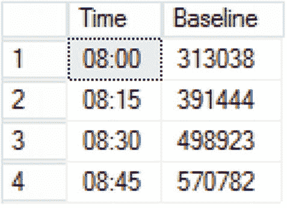

### 图 4-12
`PAGEIOLATCH_SH` 基线

正如你对比图 4-11 和 4-12 中的等待时间时立即能看到的那样，今天进行的测量值远高于历史基线中的值。为了更容易看出差异，我创建了两个测量值的图表，如图 4-13 所示。

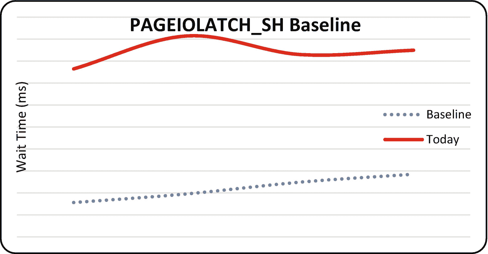

### 图 4-13
`PAGEIOLATCH_SH` 等待类型的基线比较图

由于 `PAGEIOLATCH_SH` 等待类型的基线与今天之间的等待时间差异如此之大，Jim 认为 `PAGEIOLATCH_SH` 等待类型需要进一步调查。

我们将在第 9 章“与 Latch 相关的等待类型”中详细探讨 `PAGEIOLATCH_SH` 等待类型，但为了给你一个（非常）简短的解释，较长的 `PAGEIOLATCH_SH` 等待可能表明存储问题。

为了进一步调查，Jim 启动了 Windows 性能监视器，以查看与存储子系统相关的指标，特别是磁盘延迟计数器。如图 4-14 所示，数据库数据文件所在磁盘的延迟峰值达到了非常高的数值，超过 4000 毫秒！为了使 SQL Server 达到最佳性能，磁盘延迟应尽可能低，至少低于 20 毫秒。

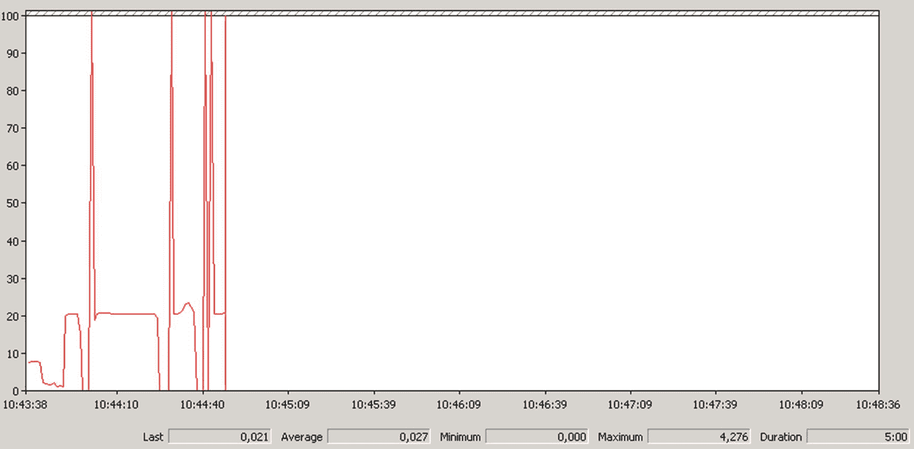

### 图 4-14
磁盘读取延迟


有了等待统计的基准信息和`Perfmon`指标，Jim 认为问题与存储有关，并联系了存储管理员。Jim 收集的指标也对存储管理员有帮助，因为他可以将自己测量的存储相关指标与 Jim 提供的进行对比。存储管理员确认问题与销售数据库所在的磁盘有关，并通过更换磁盘阵列中的一个故障磁盘解决了问题。磁盘更换后，磁盘延迟恢复到平均 6 毫秒，高延迟峰值消失。磁盘更换后，Jim 再次从`WaitStats`表中查询等待时间，注意到`PAGEIOLATCH_SH`等待类型的等待时间再次接近基准值。用户也告知 Jim，报表运行再次恢复正常。

在这个示例中，Jim 遵循了图 4-9 所示的等待统计性能分析流程图的所有步骤：

1.  用户在运行报表时遇到性能下降。
2.  Jim 查询`sys.dm_os_waiting_tasks` DMV，以查明是否存在高等待时间或频繁出现的等待类型。`PAGEIOLATCH_SH`等待类型似乎频繁出现。
3.  Jim 通过捕获当天的`PAGEIOLATCH_SH`等待时间，并与基准进行比较，来收集指标。他还从`Perfmon`收集了额外的指标。
4.  所有指标都向 Jim 表明，问题很可能与存储有关，Jim 于是联系了存储管理员。
5.  存储管理员更换了阵列中的一个损坏磁盘。存储延迟值降至 6 毫秒。
6.  Jim 再次检查`PAGEIOLATCH_SH`等待类型的等待时间，确认其已接近基准值。

尽管这个示例看起来可能很简单，但它实际上基于我在现实世界中遇到的一个性能问题。通过结合使用来自等待统计性能分析流程图的步骤和基准指标，我能够非常快速地识别并解决问题。

在我展示的示例中，你看到了清单 4-6 中的查询，它为`PAGEIOLATCH_SH`等待类型创建了一个基准线。这个查询只是你可以针对`WaitStats`表使用的示例。你可以修改它以满足自己的需求；例如，你可以选择不限制工作日的结果，只显示特定日期捕获的平均等待时间。或者你可以请求特定日期的实际等待时间。

如果你要长时间捕获等待统计测量值，将结果拆分到多个表中可能是一个好主意，这样查询起来会更简单、更快速。例如，你可以使用以下查询将三月份完成的所有等待统计测量值插入到它们自己的表中：

```sql
SELECT *
INTO WaitStats_March
FROM WaitStats
WHERE ws_Month = 3;
```

这也为我们提供了选项，可以通过将不同的表连接在一起来比较不同时间段内的特定等待时间。图 4-15 展示了我通常最终得到的基准数据库表，数据按月份排序。

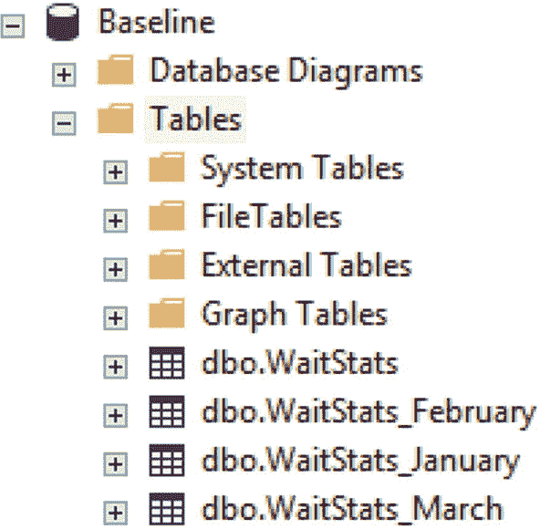

图 4-15: 按月份拆分的等待统计测量值。

你可以自行决定如何拆分测量值；也许你想为使用的每个应用程序版本将等待统计测量值存储在一个单独的表中，或者将特定等待类型的所有测量值存储在一个单独的表中。选择权在你手中。

希望本章能让你对如何存储等待统计测量值并从这些测量值创建基准线有所启发。我尽量避免确切地告诉你要做什么以及如何做，因为我相信单一的方法并不适用于所有人。你需要编写和调整自己的查询来创建你感兴趣的基准线，但我希望本章为你展示了可以进一步构建的基础。

## 总结

在本章中，我们从理论和实践两个角度仔细研究了基准线。基准线对于你执行的任何类型的性能分析都极其重要。对于等待统计，如果你想对与 SQL Server 相关的性能问题进行故障排除，基准线是经常需要的。由于等待统计对于你的系统是唯一的，比较等待时间的方法只有一种——基准线。

我给你提供了一些示例和 T-SQL 脚本，来创建你自己的等待统计基准表，这样你现在就可以开始捕获等待统计信息。我们还通过一个示例，了解了如何查询该基准信息并将其与实际测量值进行比较，以对与性能相关的事件进行故障排除。

