# 5. 与 CPU 相关的等待类型

在过去的几十年里，处理器取得了巨大的发展，像英特尔或 AMD 这样的处理器制造商每年都能制造出更快的处理器。虽然处理器的速度已接近极限，但制造商能够在处理器中集成的核心数量却一直在增长。在撰写本书时，你可以购买一个内置 24 核的单处理器来为你的系统提供动力。处理器也是系统中比较难以更换的部分之一。虽然你可以相对简单地扩展系统内存，但更换一个速度更快或核心更多的处理器，通常也需要更换系统主板，因为 CPU 插槽不兼容。这意味着我们通常会一直使用现有的处理器，直到更换整个系统为止。

处理器对于 SQL Server 也非常重要。更高的处理器速度将加速与处理器相关的指令，而更多的核心意味着 SQL Server 可以用来执行请求的更多调度器。但即使有了速度和核心数的所有这些升级，也无法避免我们有时仍需等待处理器资源。在本章中，我们将了解一些与系统处理器相关的等待类型。

## CXPACKET

第一个与 CPU 相关的等待类型，也是 SQL Server 实例在默认、开箱即用的配置下运行时最常见的等待类型。它也是最被误解的等待类型之一，有时甚至不需要降低其等待时间来让你的查询运行得更快；事实上，降低`CXPACKET`等待时间有时反而会降低查询性能！如果你运行的是 SQL Server 2016 SP2 或 SQL Server 2017，处理`CXPACKET`等待的方式有一些变化。我们将在本节末尾讨论这些变化的影响，包括新的与并行相关的等待类型`CXCONSUMER`。


## 什么是 `CXPACKET` 等待类型？

`CXPACKET` 等待类型在查询以并行而非串行方式执行时出现。如果工作可以分配给多个工作线程，并行查询相比串行查询可以具有性能优势。对于返回大型结果集的查询，这种优势更大；仅返回少量行的查询从并行中获益甚少，并且在很多情况下，并行会减慢这些查询的执行速度。这并不意味着我们应该立即关闭并行性，因为我还没见过一个真正的 OLTP 数据库中每个查询都只返回寥寥数行。许多系统必须处理混合负载，通常既要处理大量短查询，也要处理大型、运行时间较长的报表查询。

并行查询将使用多个工作线程来执行一个请求。除了为执行请求工作而创建的工作线程外，并行查询还会使用一个 0 号线程，称为控制线程。这个 0 号线程的任务是协调其他工作线程的工作。当 0 号线程等待其他工作线程完成分配给他们的工作时，它将记录 `CXPACKET` 等待类型的等待时间。为了更好地理解这种关系，请看图 5-1。

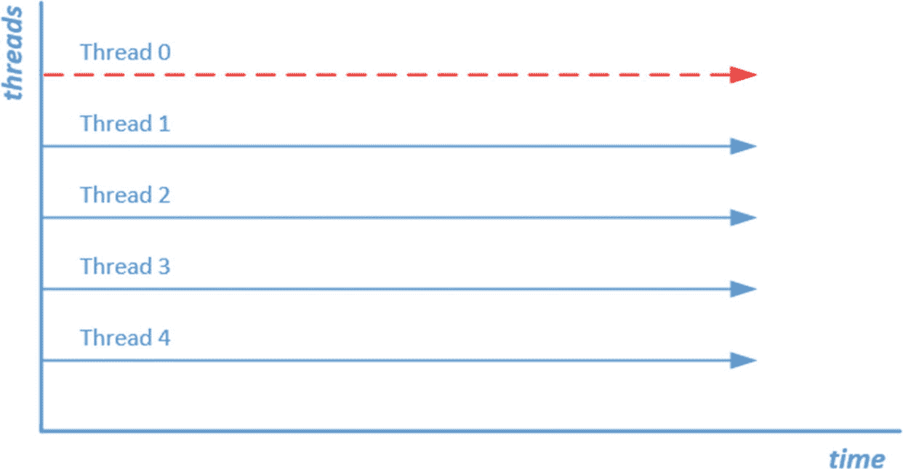

**图 5-1：并行查询线程化**

一旦 SQL Server 查询优化器决定使用并行执行计划，你就会看到 `CXPACKET` 等待出现。如果你预期查询将并行运行且性能符合预期，这完全是正常现象，无需担心。在这种情况下，你可以忽略 `CXPACKET` 等待类型的长等待时间。然而，也存在你不希望使用并行性的情况，或者因为工作负载不均衡，并行性正在对查询性能产生负面影响。

### 配置并行度设置

由于 `CXPACKET` 等待类型与 SQL Server 实例的并行度设置直接相关，我们可以通过调整这些设置来相对容易地影响它。我们可以在 SQL Server 实例的 **服务器属性** ➤ **高级** ➤ **并行度** 部分找到并行度设置，如图 5-2 所示。

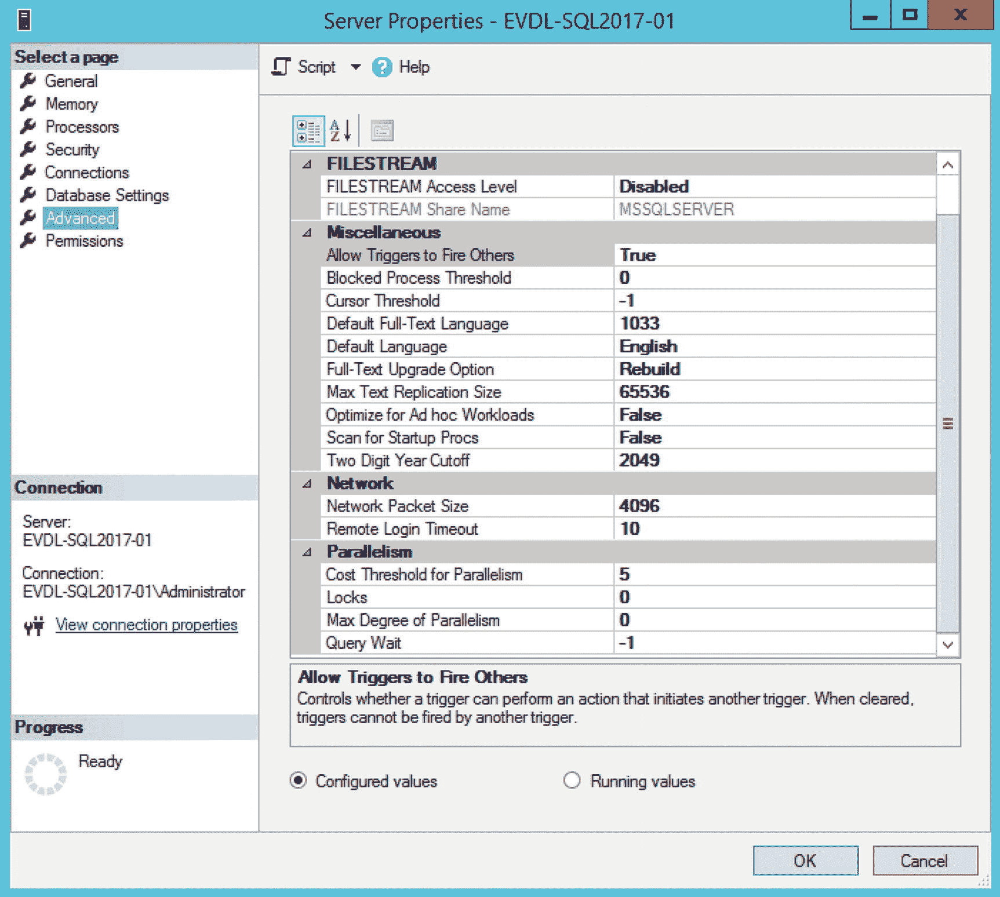

**图 5-2：并行度配置**

在这些设置中，`并行度的成本阈值` 和 `最大并行度` 设置对并行查询的影响最大。

`并行度的成本阈值` 设置配置了查询优化器考虑将查询并行运行的成本阈值。如果一个串行查询的成本高于 `并行度的成本阈值` 中配置的值，查询优化器可能会决定生成并行计划而非串行计划。默认情况下，此设置的值为 5，可配置为 0 到 32,767 之间的值。

`最大并行度` 设置配置了执行并行计划时使用的调度器数量。默认情况下，此设置配置为 0，这意味着执行并行计划时可以使用所有可用的调度器。

### 数据库作用域配置

如果你运行的是 SQL Server 2016 或更高版本，你还可以通过数据库作用域配置项在数据库级别配置并行度设置，如图 5-3 所示。

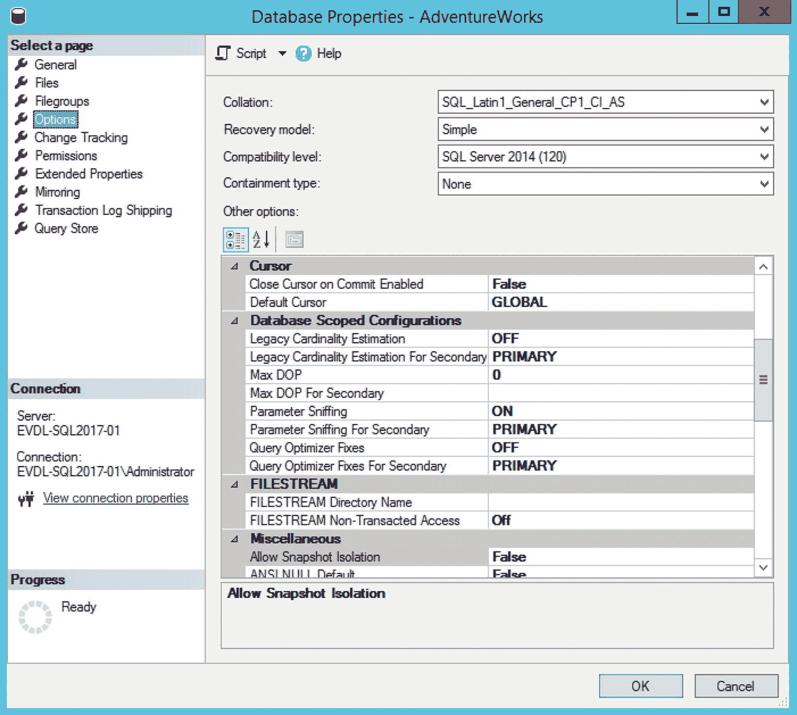

**图 5-3：数据库作用域并行度配置**

引入在每个数据库级别（而非整个 SQL Server 实例）配置并行度等设置的功能，是一个非常受欢迎的改变。例如，假设你有多个数据库位于同一个 SQL Server 实例中。理想情况下，这些数据库中的每一个都将使用针对其查询负载优化的配置设置。在 SQL Server 2016 之前，我们无法在每个数据库级别进行配置，因此通常你会坚持使用某种最佳实践或通用配置值。既然数据库作用域配置成为可能，为每个单独的数据库配置最优设置就变得非常可行。

随着能够为并行度设置添加数据库作用域配置值，SQL Server 引擎处理这些配置的方式有所不同：

*   数据库作用域配置设置仅当其被设置为非默认值时才会覆盖当前的实例设置。
*   如果数据库作用域配置设置为其默认值，则将使用实例范围的配置设置。

例如，如果 `最大并行度` 设置在实例级别配置为 4，在数据库级别配置为 0（默认值），那么可以并行执行的查询最多可以使用四个调度器。如果将数据库作用域设置更改为值 2，则针对该数据库执行的查询最多可以使用两个调度器，覆盖了实例级别的设置值 4。


### 通过调整并行度配置降低 CXPACKET 等待时间

有多种方法可用于降低 `CXPACKET` 等待时间，但在使用之前，你必须确认 `CXPACKET` 等待确实引起了问题。正如我之前所说，只要为你的 SQL Server 实例启用了并行度，`CXPACKET` 等待就完全是正常的。我在网络论坛上经常看到的一个解决方案是，通过将 `最大并行度` 选项设置为 1 来禁用并行度。在大多数情况下，这不是一个好主意。禁用并行度会完全消除 `CXPACKET` 等待，但由于某些查询无法再并行运行，它们的性能可能会差很多。

降低 `CXPACKET` 等待的一个更好方法是，调整 `并行度代价阈值` 和 `最大并行度` 选项，使其与你的工作负载相匹配。这样，你可以确保只有从并行中获益最多的查询才会并行运行。找到这个并行度甜点区的一种方法是比较查询在串行运行与并行运行时的执行时间。通常，你应该重点关注那些访问大量信息且本身运行时间较长的查询，因为这些查询将从并行中获益最多。

考虑以下示例，我们有一个针对 `AdventureWorks` 数据库的查询，从 `Sales.SalesOrderDetail` 表请求信息：
```sql
SELECT *
FROM Sales.SalesOrderDetail
ORDER BY CarrierTrackingNumber DESC;
```
我们可以通过检查查询的估计代价来判断此查询是否适合并行运行。要查看此信息，我们需要查看查询在串行运行时的估计执行计划。为确保查询串行运行，我们必须添加查询选项 `MAXDOP 1`。我们还对查询的运行时间感兴趣，因此我们在查询中添加了 `SET STATISTICS TIME ON` 选项：
```sql
SET STATISTICS TIME ON
SELECT *
FROM Sales.SalesOrderDetail
ORDER BY CarrierTrackingNumber DESC
OPTION (MAXDOP 1);
SET STATISTICS TIME OFF
```
图 5-4 显示了查询在串行运行时的估计代价。

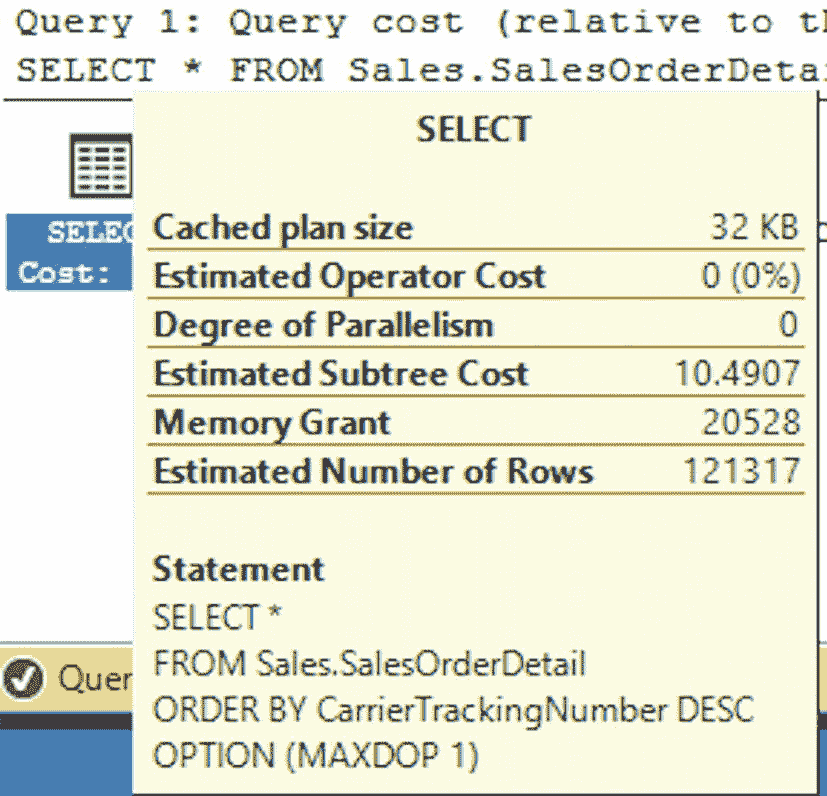

*图 5-4 使用 MAXDOP 1 时的查询估计代价*

在此示例中，在我的测试 SQL Server 上估计代价为 10.4907。当我执行查询时，我的系统上的执行时间为 2256 毫秒。

由于我的测试服务器上 `并行度代价阈值` 仍配置为默认值 5，我相当确定如果我移除 `MAXDOP` 查询提示，查询将会并行运行。

图 5-5 显示了在运行不带 `MAXDOP 1` 选项的查询后的实际执行计划。

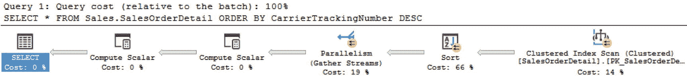

*图 5-5 不带 MAXDOP 1 选项的实际执行计划*

如你所见，正如我们预期的那样，查询使用了并行度运行，因为其估计代价高于 `并行度代价阈值` 选项中配置的值。使用并行度的查询执行时间为 1959 毫秒。如果我们查看实际执行计划中 `SELECT` 操作的属性，可以查看一些附加信息，如图 5-6 所示。

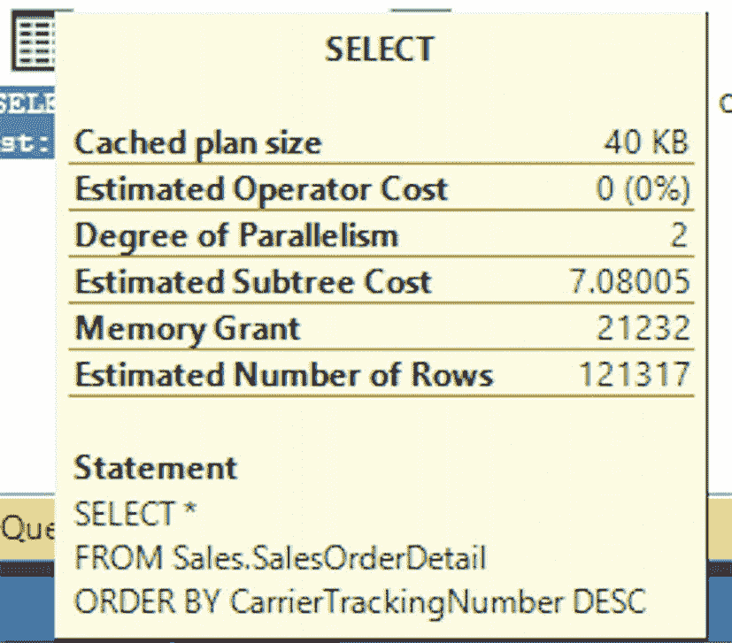

*图 5-6 SELECT 操作属性*

`SELECT` 操作的属性显示查询是使用两个线程执行的。估计代价下降到了 7.08005。

尽管估计代价下降了，但对于此查询，执行时间的改进非常小。我们可以将 `并行度代价阈值` 值更改为高于默认值 5 的数字。这样，我们可以确保像本示例中的这种相对较小的查询不使用并行度，而繁重的报表查询则使用。

另一个需要记住的设置是 `最大并行度` 选项。当它设置为默认值 0 时，查询并行运行时可以使用所有可用的调度程序。但是，使用更多的调度程序并不一定意味着查询执行得更快。在使用超过 8 个调度程序后，使用更多调度程序带来的好处会逐渐变小。微软在 KB2806535 中推荐以下配置：
*   对于核心数超过八个的服务器，将 `最大并行度` 选项设置为 8。
*   对于核心数少于八个的服务器，将 `最大并行度` 选项设置为 0 或服务器的核心数。

这是一个通用建议，具体情况可能有所不同。`并行度代价阈值` 和 `最大并行度` 两个选项的设置高度依赖于你系统的工作负载，需要仔细测试才能找出哪些设置有效，哪些无效。不过，它们会影响你的 `CXPACKET` 等待时间，因此，在更改 `并行度代价阈值` 或 `最大并行度` 选项后，请将你的 `CXPACKET` 等待时间与基线进行比较，以衡量更改的影响。

### 通过解决倾斜的工作负载来降低 CXPACKET 等待时间

倾斜的工作负载意味着并非所有工作线程都接收到相同数量的工作来执行。这不是一个最优的情况，因为如果一个工作线程必须完成大部分工作，而另一个只完成很少一部分，那么线程 0 仍然必须等待运行时间最长的工作线程完成，在等待期间记录 `CXPACKET` 等待时间。图 5-7 显示了一个倾斜工作负载的抽象示例。

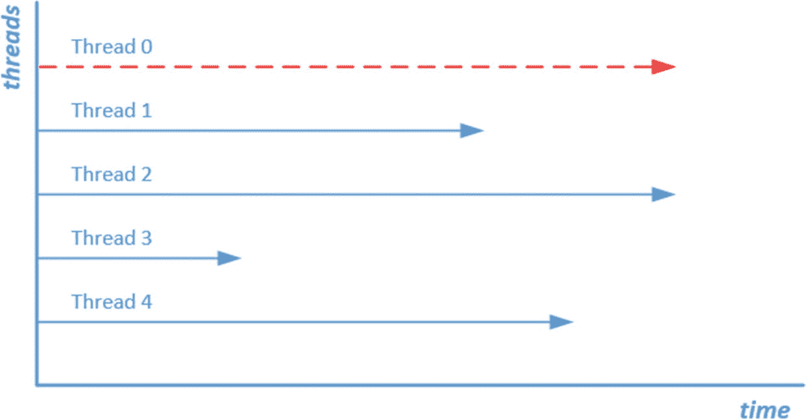

*图 5-7 倾斜的并行查询线程分配*

如果我们可以将线程 2 的部分工作交给线程 3，查询可能会执行得更快，从而降低 `CXPACKET` 等待时间。

我们可以在实际执行计划中并行操作的 `实际行数` 属性中查看线程分布情况。图 5-8 显示了使用并行度执行的聚集索引扫描操作的属性。此操作发生在我们上一节中针对 `Sales.SalesOrderDetail` 表使用的示例查询中。

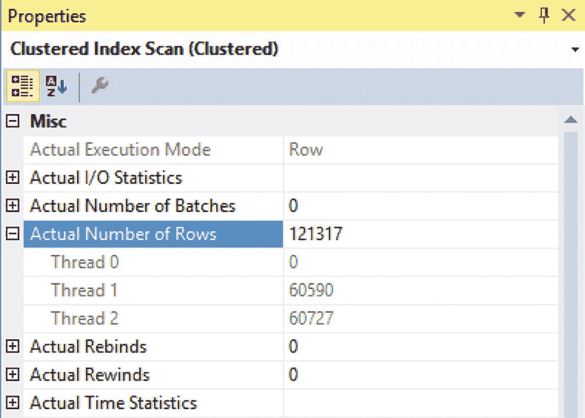

*图 5-8 并行线程分布*

在此示例中，我们看到聚集索引扫描返回了 121,317 行，分布在两条线程上（请注意，线程 0，即协调线程，不处理任何行）。在这种情况下，行数的分布相对均匀，因此我们可能没有遇到倾斜的工作负载问题。

倾斜的工作负载通常由过时的统计信息引起。如果查询优化器认为表中的行数少于（或多于）实际数量，它可能会将工作不均匀地分配给各个线程。请确保定期对统计信息进行维护，以防止出现倾斜的工作负载。


### SQL Server 2016 SP2 和 2017 CU3 中 CXCONSUMER 等待类型简介

在 SQL Server 2017 CU3（以及后续的 SQL Server 2016 SP2）发布中，微软推送了一项关于并行等待记录方式的更改。开发团队的主要目标是使并行等待更具可操作性。正如你在前面章节中所读到的，这一点非常受欢迎，因为要确定并行等待何时会导致查询性能问题往往很困难。

正如我们前面所述，并行由两部分组成：`生产者` 和 `消费者`。最简单的方式是将我们之前引入的 0 线程视为生产者（`producers`）。0 线程的工作是将工作分配给可用的并行工作线程。这些工作线程被称为消费者（`consumers`），它们执行生产者发送给它们的实际工作。

在 SQL Server 2017 CU3 和 SQL Server 2016 SP2 之前，没有办法区分例如消费者是否在花费时间等待生产者向它们发送工作。所有内容在内部都被记录为 `CXPACKET` 等待时间。随着 SQL Server 2017 CU3 和 SQL Server 2016 SP2 中的更改，开发团队将并行等待时间分成了两个不同的类别：`CXPACKET` 和 `CXCONSUMER`。随着这一更改，这两种等待类型的意义也与早期的 SQL Server 版本相比发生了一些变化。

当消费者线程等待生产者发送行时，就可能发生 `CXCONSUMER` 等待。这或多或少是正常行为，在查看等待统计信息时，在大多数情况下可以安全地忽略。

`CXPACKET` 等待现在记录时不再包含 `CXCONSUMER` 等待时间，这意味着看到 `CXPACKET` 等待时间不仅表示发生了并行操作，而且较高的等待时间更清楚地表明了并行操作方面的问题（例如，线程在所需的缓冲区或线程同步方面遇到问题）。这实际上意味着，如果你运行的是 SQL Server 2017 CU3 或 SQL Server 2016 SP2 或更高版本，看到 `CXPACKET` 等待比在较低的 SQL Server 版本中更清楚地表明并行问题，从而使等待类型更具可操作性，这正是开发团队所期望的。本章前面描述的关于处理高并行等待时间的建议仍然有效，尽管现在它对 `CXPACKET` 等待时间有更直接的影响。

### CXPACKET 概述

`CXPACKET` 等待类型直接与查询执行期间并行的使用相关。如果你允许查询使用并行运行，你将总是看到 `CXPACKET` 等待。通常这没什么可担心的，所以要避免膝跳反射式地完全关闭并行。相反，专注于调整最大并行度（`Max Degree of Parallelism`）和并行开销阈值（`Cost Threshold for Parallelism`）选项，使阈值足够高，以便你的大型查询可以从使用并行中受益，而小型查询不会受到负面影响。同时，通过确保统计信息是最新的来避免偏斜的工作负载。

如果你运行的是 SQL Server 2017 CU3 或 SQL Server 2016 SP2（或更高版本），`CXPACKET` 等待时间的含义有了一些变化，导致 `CXPACKET` 等待比在低于这些提到的 SQL Server 版本中更有可能表明发生了并行问题。

## SOS_SCHEDULER_YIELD

与 `CXPACKET` 类似，`SOS_SCHEDULER_YIELD` 是一种等待类型，它会经常出现在你系统上总等待时间的前十名中。同样与 `CXPACKET` 等待类型一样，`SOS_SCHEDULER_YIELD` 等待时间并不一定表明你的 SQL Server 实例存在问题。一旦你在 SQL Server 实例上开始运行查询，就会出现 `SOS_SCHEDULER_YIELD` 等待，它们与 SQL Server 调度密切相关。

### SOS_SCHEDULER_YIELD 等待类型是什么？

在我们回答 `SOS_SCHEDULER_YIELD` 等待类型的含义之前，我们必须回到本书的第 1 章“等待统计内部原理”（“Wait Statistics Internals”），我们在其中讨论了 SQL Server 调度。还记得 SQLOS 使用自己的协作式非抢占式调度模型来确保 Microsoft Windows 进程不会中断 SQL Server 自己的进程吗？`SOS_SCHEDULER_YIELD` 等待类型与 SQLOS 的协作式非抢占式调度模型有直接关系。为了使它更容易理解，我包含了图 5-9，你应该很熟悉它，因为它代表了我们在第 1 章中讨论的调度器。

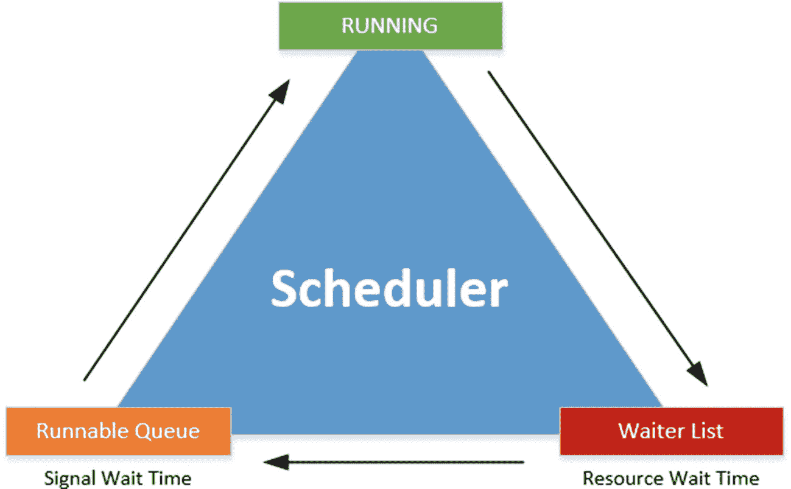

图 5-9
调度器及其阶段和队列

如果你还记得第 1 章“等待统计内部原理”，工作线程以固定的顺序通过不同的阶段和队列。通常，工作线程在等待资源时从等待者列表（`Waiter List`）开始，然后移动到可运行队列（`Runnable Queue`）等待在处理器上运行的机会，最后获得处理器时间来执行其请求，进入“运行中”（`RUNNING`）状态。如果工作线程在“运行中”状态时需要额外的资源，它会移回等待者列表，并开始一次穿过不同队列和阶段的新旅程。

这种行为有一个例外，它发生在一个工作线程处于“运行中”状态且不需要额外资源来完成其工作时。如果 SQLOS 让一个工作线程在处理器上运行，只要它不需要任何额外的资源，处理器就可能被一个工作线程无限期地“劫持”。为了确保这种情况不会发生，调度器给每个工作线程一个特定的时间片，它们需要在这个时间片内完成其工作。我们称这个时间片为量子（`quantum`），它是一个固定的、不可更改的 4 毫秒。如果一个工作线程用完了它的量子，它必须让出（`yield`）处理器，然后它移回到可运行队列的末尾。它会跳过等待者列表，因为该工作线程不需要额外的资源。当工作线程等待再次移回处理器时，会记录 `SOS_SCHEDULER_YIELD` 等待类型。图 5-10 显示了这种行为。

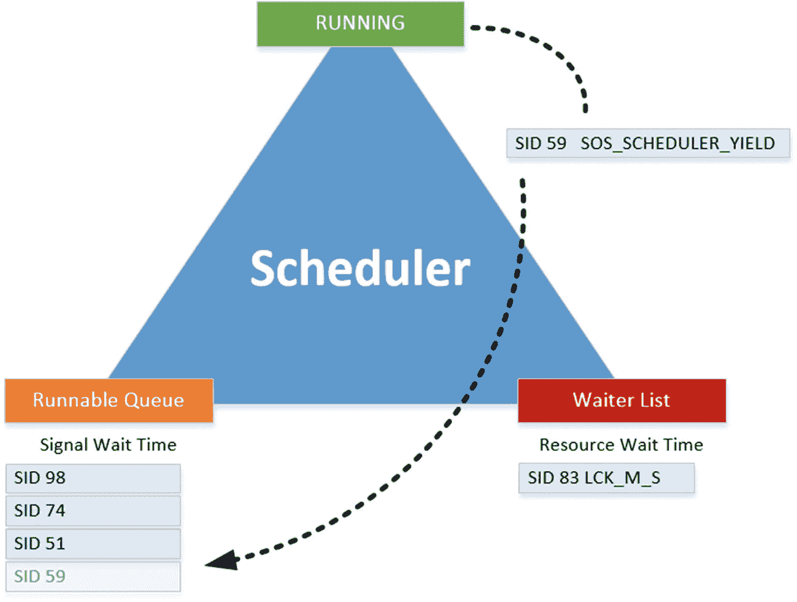

图 5-10
工作线程自愿让出处理器

正如你可能想到的，工作线程一直在自愿让出，尤其是在长时间运行的查询上，因为那里不需要额外的资源。但请记住，`SOS_SCHEDULER_YIELD` 等待类型的等待时间只有在工作线程实际上不得不在可运行队列中等待时才会被记录。如果让出的工作线程前面没有其他工作线程，它将直接移回处理器而不等待（尽管它仍然会经过可运行队列）。为了向你展示一个例子，我在测试的 SQL Server 上对 `AdventureWorks` 数据库执行了以下查询，那里完全没有并发：

```sql
-- Clear Wait Stats
DBCC SQLPERF('sys.dm_os_wait_stats', CLEAR);
-- Simple select
SELECT *
FROM Sales.SalesOrderDetail
ORDER BY CarrierTrackingNumber DESC;
-- Check for SOS_SCHEDULER_YIELD waits
SELECT *
FROM sys.dm_os_wait_stats
WHERE wait_type = 'SOS_SCHEDULER_YIELD';
```

图 5-11 显示了针对 `sys.dm_os_wait_stats` DMV 执行此查询的结果。

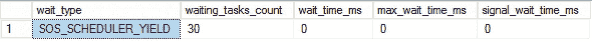

图 5-11


