# SOS_SCHEDULER_YIELD 等待

如图 5-11 所示，针对`AdventureWorks`数据库的查询在执行过程中遇到了 30 次`SOS_SCHEDULER_YIELD`等待类型。由于当时这是唯一运行的查询，因此它不需要在可运行队列中等待其他工作线程。如果它曾经花费时间等待其他工作线程，`wait_time_ms`列的值将大于 0。

正如本节开头所述，`SOS_SCHEDULER_YIELD`等待类型通常无需引起担忧。然而，如果等待时间显著高于你的基线值，这可能是一个需要进行额外研究的原因。在处理`SOS_SCHEDULER_YIELD`等待时，基本上会遇到三种情况，如图 5-12 所示。

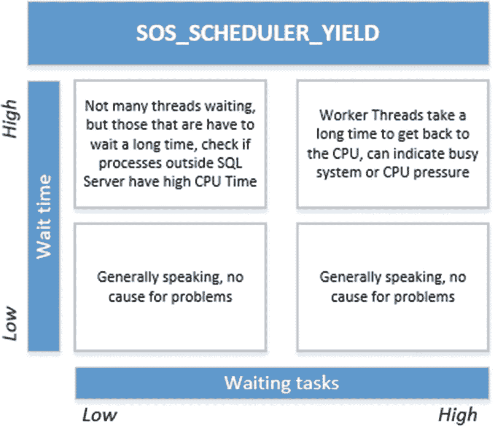
**图 5-12** SOS_SCHEDULER_YIELD 情况

让我们来看看如何分析和解决 SQL Server CPU 压力问题。

### 降低 SOS_SCHEDULER_YIELD 等待

如果你遇到高于正常水平的 `SOS_SCHEDULER_YIELD` 等待时间和大量的等待次数，你的系统上可能确实存在与 CPU 相关的问题。为了降低 `SOS_SCHEDULER_YIELD` 等待，我们将重点关注图 5-12 的右上角部分，该部分显示了大量的等待任务和高等待时间。

如果你遇到 `SOS_SCHEDULER_YIELD` 等待类型的高等待时间，同时伴随大量等待任务，你可以认为你有一个非常繁忙的 SQL Server 实例。工作线程会主动让出处理器，但由于可运行队列中有许多其他线程在等待，它们需要很长时间才能再次回到处理器上。正如我们在前面第 1 章“等待统计内部原理”中所讨论的，可运行队列是一个先进先出的列表，这意味着可运行队列中等待的工作线程越多，工作线程通过队列所需的时间就越长。你通常会看到系统上 SQL Server 进程的 CPU 使用率很高。

为了向你展示此问题的示例，我们将使用 Ostress 实用程序从多个线程同时执行一个特定查询。Ostress 实用程序是 SQL Server RML 实用程序的一部分，你可以在此处下载：[`support.microsoft.com/en-us/kb/944837`](https://support.microsoft.com/en-us/kb/944837)。

我们要做的第一件事是将以下查询保存到测试服务器上的 `C:\sos_scheduler_yield.sql`：

```sql
WHILE (1=1)
BEGIN
SELECT COUNT(*)
FROM Sales.SalesOrderDetail
WHERE SalesOrderID BETWEEN 45125 AND 54185
END;
```

此查询将对 `AdventureWorks` 数据库的 `Sales.SalesOrderDetail` 表中两个 `SalesOrderID` 之间的行数进行计数。它会以无限循环的方式执行此操作。

保存查询后，我们使用以下命令启动 Ostress 实用程序：

```powershell
"C:\Program Files\Microsoft Corporation\RMLUtils\ostress.exe" -E -dAdventureWorks -i"C:\sos_scheduler_yield.sql" -n20 -r1 -q
```

这将启动 Ostress 实用程序，它连接到 `AdventureWorks` 数据库并使用 20 个线程执行 `sos_scheduler_yield.sql` 脚本。

一旦我们启动 Ostress，测试 SQL Server 的 CPU 就会立即达到 100%，如图 5-13 所示。

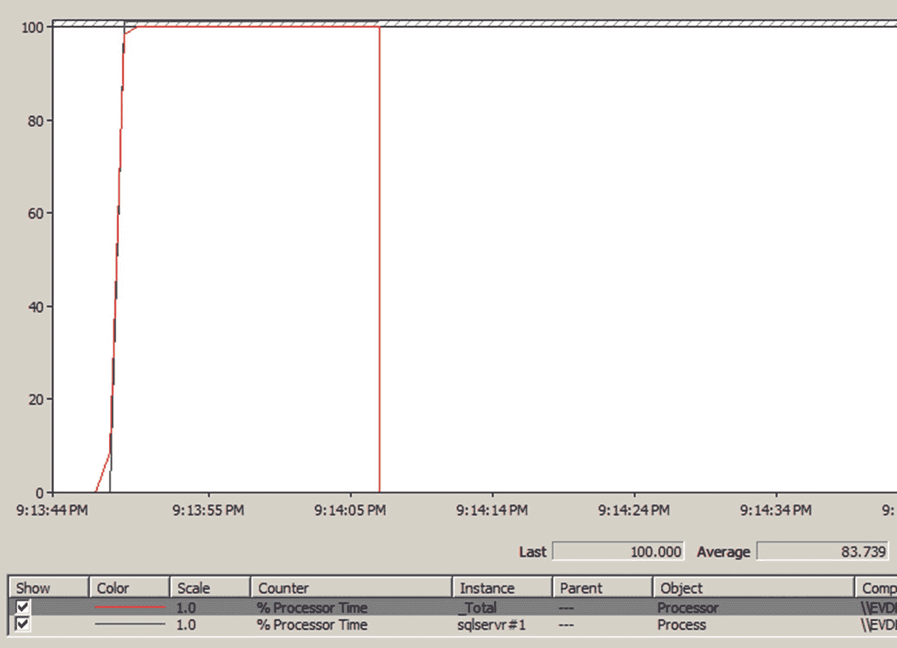
**图 5-13** Ostress 对 CPU 的影响

如图 5-13 所示，CPU 负载来自 `sqlserv#1` 进程，这恰好是我们正在运行 Ostress 查询的 SQL Server 实例。

如果我们查询 `sys.dm_os_waiting_tasks` DMV 来检查 `SOS_SCHEDULER_YIELD` 等待类型是否是导致高 CPU 使用率的原因，我们会感到惊讶，如图 5-14 所示。

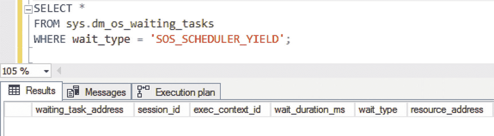
**图 5-14** 未发生 SOS_SCHEDULER_YIELD 等待

这就是 `SOS_SCHEDULER_YIELD` 等待类型的棘手之处，因为它通常不会被 `sys.dm_os_waiting_tasks` DMV 返回——这是捕获和使用等待统计基线的另一个原因！

为了证明高 CPU 使用率与 `SOS_SCHEDULER_YIELD` 等待类型有关，我们必须查看累积等待统计 DMV `sys.dm_os_wait_stats`。我们可以使用以下查询，在运行 Ostress 实用程序时（我们可以在启动 Ostress 实用程序之前重置 DMV 以保持数值较小）显示按等待时间排序的前五种等待类型：

```sql
SELECT TOP 5 *
FROM sys.dm_os_wait_stats
ORDER by wait_time_ms DESC;
```

此查询的结果如图 5-15 所示。


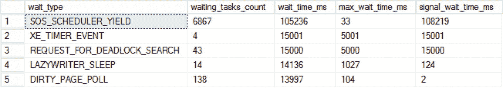

**图 5-15** Ostress 执行期间前五名的等待类型

如你所见，迄今为止排名第一的等待类型是 `SOS_SCHEDULER_YIELD`，其 `waiting_tasks` 数量和总 `wait_time` 都相当高。

如果你在生产环境的 SQL Server 实例中遇到此问题，首先应关注那些非常小、非常快的查询，就像本示例中执行的那些。这类查询的数量是否增加了？执行这些查询的 SQL Server 的用户连接数是否增加了？这是你应该立即询问和检查的两个问题。事务量或用户连接数的突然增长都可能导致 `SOS_SCHEDULER_YIELD` 等待时间变长。

导致 `SOS_SCHEDULER_YIELD` 高等待的另一个原因，连同非常高的 CPU 使用率，可能是一种称为 `spinlock contention`（自旋锁争用）的现象。微软将自旋锁定义为“用于保护数据结构访问的轻量级同步原语”，这是一个非常高级的话题。本章末尾的附录 II 为有兴趣进一步了解自旋锁的读者提供了更多细节。

非常大、非常复杂的查询也可能导致更高的 `SOS_SCHEDULER_YIELD` 等待时间。试着寻找那些消耗大量 CPU 时间且内部包含复杂计算或数据类型转换的活动查询。我常用的一个识别 CPU 密集型查询的查询，如**代码清单 5-1**所示。

```sql
SELECT TOP 10
    QText.TEXT AS 'Query',
    QStats.execution_count AS 'Nr of Executions',
    QStats.total_worker_time/1000 AS 'Total CPU Time (ms)',
    QStats.last_worker_time/1000 AS 'Last CPU Time (ms)',
    QStats.last_execution_time AS 'Last Execution',
    QPlan.query_plan AS 'Query Plan'
FROM sys.dm_exec_query_stats QStats
CROSS APPLY sys.dm_exec_sql_text(QStats.sql_handle) QText
CROSS APPLY sys.dm_exec_query_plan(QStats.plan_handle) QPlan
ORDER BY QStats.total_worker_time DESC;
```
*代码清单 5-1: 检测昂贵的 CPU 查询*

在测试 SQL Server 上执行**代码清单 5-1**中的查询，结果如**图 5-16**所示。

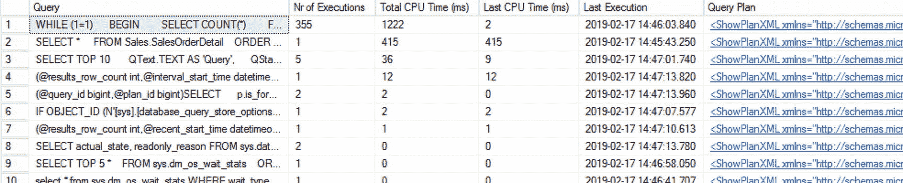

**图 5-16** 昂贵的 CPU 查询

如你所见，我们使用 Ostress 工具执行的查询是执行次数最多、总 CPU 时间最高的查询。这个查询可以作为一个很好的调查起点。也许可以对该查询进行优化或重写，以减少其 CPU 时间消耗。

另一种可用于识别 CPU 密集型查询的方法是使用查询存储。查询存储提供了一个名为“资源消耗最高的查询”的内置报告，该报告可让你立即按 CPU 时间进行筛选，如**图 5-17**所示。

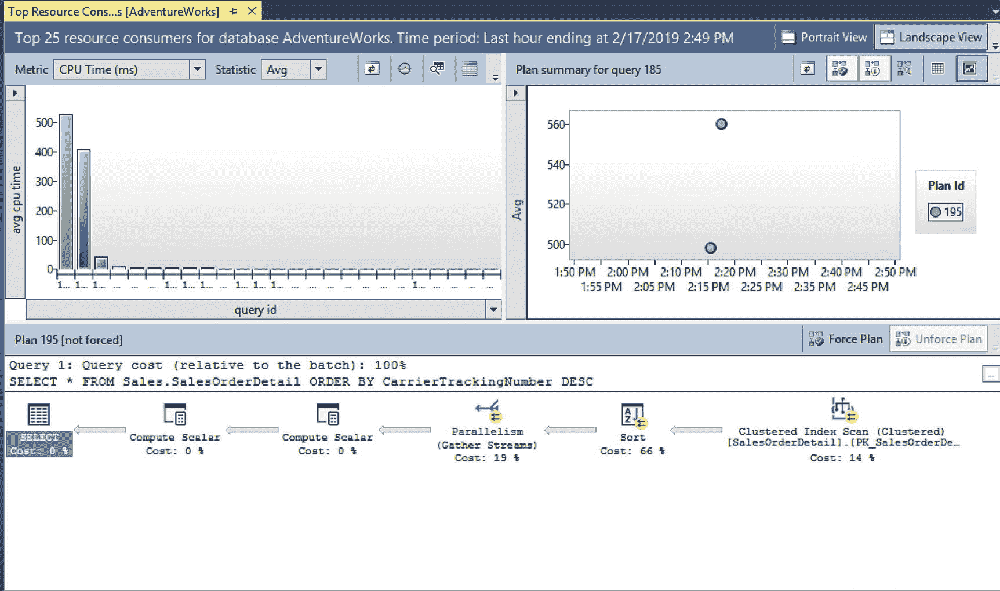

**图 5-17** 通过查询存储可视化昂贵的 CPU 查询

### SOS_SCHEDULER_YIELD 总结

`SOS_SCHEDULER_YIELD` 等待类型在每个 SQL Server 实例上都会始终出现，因为它与 SQL Server 用于授予工作线程处理器访问权限的调度模型直接相关。如果总等待时间或总等待任务数量与你的基线测量相比突然增加，则可能表明存在问题。大多数情况下，`SOS_SCHEDULER_YIELD` 等待的大幅增加也意味着 CPU 负载的增加。这种增加可能是由 SQL Server 进程本身引起的，也可能是由 SQL Server 之外需要大量处理器时间的其他进程引起的，从而限制了 SQL Server 访问处理器的时间。如果 CPU 负载的增加是由 SQL Server 进程负责，你应该尝试将 `SOS_SCHEDULER_YIELD` 等待的增加与用户活动的增加关联起来。另一个选择是查询 `sys.dm_exec_query_stats` DMV，如**代码清单 5-1**所示，或使用查询存储来查找那些需要最多处理器时间的查询，并集中优化这些查询。

## THREADPOOL

最 notorious（声名狼藉）的等待类型之一是 `THREADPOOL` 等待类型。与 `CXPACKET` 和 `SOS_SCHEDULER_YIELD` 等待类型（即使你的 SQL Server 实例没有遇到任何问题也会出现）不同，高的 `THREADPOOL` 等待时间通常确实表明存在性能问题。正如我们在本书中讨论的其他两种与 CPU 相关的等待类型一样，`THREADPOOL` 等待类型与 SQL Server 调度工作的方式密切相关。


### 什么是 `THREADPOOL` 等待类型？

如果你在系统上看到 `THREADPOOL` 等待的发生时间远超正常值，并且你的 SQL Server 几乎没有响应，那么你很可能遇到了一个称为线程池匮乏的问题。线程池匮乏发生在没有空闲的工作线程来处理请求时。当这种情况发生时，当前等待分配到工作线程的任务将记录 `THREADPOOL` 等待类型。

SQL Server 为调度器提供一定数量的工作线程来处理请求。系统可用的工作线程数量取决于处理器数量和处理器架构。表 5-1 显示了最多具有 64 个逻辑 CPU 的系统可用的最大工作线程数。

表 5-1. 最大工作线程数

| CPU 数量 | 32 位架构 | 64 位架构 |
| :--- | :--- | :--- |
| ≤4 | 256 | 512 |
| 8 | 288 | 576 |
| 16 | 352 | 704 |
| 32 | 480 | 960 |
| 64 | 736 | 1472 |

你也可以使用以下公式计算可用的最大工作线程数：
*   逻辑处理器小于或等于 4 个的 32 位系统：256 个工作线程
*   逻辑处理器多于 4 个的 32 位系统：`256 + ((逻辑处理器数量 − 4) × 8)`
*   逻辑处理器小于或等于 4 个的 64 位系统：512 个工作线程
*   逻辑处理器多于 4 个的 64 位系统：`512 + ((逻辑处理器数量 − 4) × 16)`

尽管 SQL Server 会自动计算可用的最大工作线程数（仅在启动时计算一次），但你可以通过更改 SQL Server 实例的处理器属性中的 **最大工作线程数** 选项来覆盖默认值，如图 5-18 所示。默认情况下，**最大工作线程数** 选项的值为 0，这意味着 SQL Server 将使用前述公式计算并分配可用的最大工作线程数。

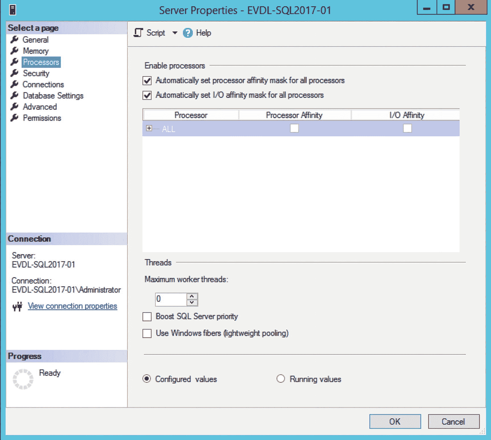
图 5-18. SQL Server 实例的处理器配置

你也可以通过运行以下查询来查看分配给 SQL Server 实例的工作线程数：
```sql
SELECT
    max_workers_count
FROM sys.dm_os_sys_info;
```
对于我的拥有两个逻辑处理器的 64 位测试 SQL Server，我有 512 个工作线程可用，如图 5-19 所示。


图 5-19. 我测试机上的工作线程数

我经常在网上读到一条关于 `THREADPOOL` 等待的建议，即将 **最大工作线程数** 选项更改为比 SQL Server 实例默认值更高的值。我强烈建议不要更改此选项的默认值。将设置更改为比默认获得的工作线程数更高的值，实际上可能会降低 SQL Server 的性能，因为上下文切换会更频繁地发生。另一个不更改设置的原因是，每个工作线程都需要一点内存来运行；对于 32 位系统，每个工作线程需要 512 KB，而对于 64 位系统，则是 2048 KB。

### THREADPOOL 示例

让我们从一个在我的测试 SQL Server 实例上发生 `THREADPOOL` 等待的例子开始。尽管我已经多次警告你确保不要在本书中将任何演示脚本运行于生产环境，但这个例子值得特别提醒。运行本节中的演示脚本可能导致你的 SQL Server 完全无响应，不接受任何新连接，并最终可能需要重启 SQL Server 服务！请不要在不允许变得无响应的 SQL Server 上运行此脚本！

在这个例子中，我们将再次使用 Ostress 工具来模拟针对测试 SQL Server 实例的并发和负载。首先，我们创建另一个 `.sql` 文件 (`select_rnd.sql`)，其中包含我们将使用 Ostress 执行的以下查询：
```sql
SELECT TOP 1 *
FROM Sales.SalesOrderDetail
ORDER BY NEWID()
OPTION (MAXDOP 1)
```
此查询将从 `AdventureWorks` 数据库的 `Sales.SalesOrderDetail` 表中随机选择一行。我包含此查询选项以串行运行此查询是有原因的，稍后我会解释。

现在，在我们启动 Ostress 执行上述查询之前，我们特意将测试 SQL Server 上可用的最大工作线程数降低。为此，我们执行以下查询：
```sql
EXEC sp_configure 'show advanced options', 1;
GO
RECONFIGURE
GO
EXEC sp_configure 'max worker threads', 128;
GO
RECONFIGURE
GO
```
这将把可用的最大工作线程数设置为 128，这是 64 位 SQL Server 实例的最小值。

让我们启动 Ostress 并执行我们之前创建的 `.sql` 脚本：
```
"C:\Program Files\Microsoft Corporation\RMLUtils\ostress.exe" -E -dAdventureWorks -i"C:\select_rnd.sql" -n150 -r10 -q
```
在这种情况下，我们将启动 150 个不同的线程，每个线程将执行 `select_rnd.sql` 文件中的查询 10 次。生成 150 个线程的原因是这个值大于测试 SQL Server 实例上可用的最大工作线程数，但又不至于高到我们无法再执行查询。

当脚本运行时，让我们使用 `sys.dm_os_schedulers` DMV 查看正在运行和等待的工作线程数：
```sql
SELECT
    scheduler_id,
    current_tasks_count,
    runnable_tasks_count,
    current_workers_count,
    active_workers_count,
    work_queue_count
FROM sys.dm_os_schedulers
WHERE status = 'VISIBLE ONLINE';
```
此查询的结果如图 5-20 所示。

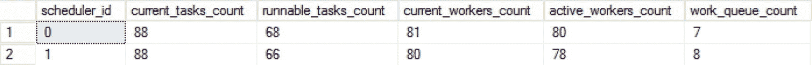
图 5-20. 每个调度器的任务和工作线程

这里最重要的列是 `current_workers_count`、`active_workers_count` 和 `work_queue_count` 列。`current_workers_count` 列显示与此调度器关联的工作线程数；此数字还包括尚未分配给任务的工作线程。`active_workers_count` 列返回处于“*正在运行*”、“*可运行*”或“*已暂停*”状态的工作线程数。`current_workers_count` 和 `active_workers_count` 列之间的主要区别在于，`active_workers_count` 是已分配给任务的工作线程数，而 `current_workers_count` 返回所有工作线程。`work_queue_count` 列显示当前等待分配工作线程的任务数。如果你在所有调度器上较长时间看到此列的值大于 0，那么你正在经历线程池匮乏。

让我们检查 `sys.dm_os_waiting_tasks` DMV 以查找源自用户会话的等待任务。注意，我们过滤掉了所有会话 ID 小于 50 的会话，尽管我在第 2 章“查询 SQL Server 等待统计信息”中告诉过你不要这样做：


### 线程池等待：诊断与解决

SELECT *
FROM sys.dm_os_waiting_tasks
WHERE session_id > 50;

如果我们在测试 SQL Server 实例上检查结果，可能会得出没有任务在等待的结论，如图 5-21 所示。然而，该测试 SQL Server 实例响应速度极其缓慢，查询任何内容都需要数秒。


图 5-21

没有任务在等待

让我们检查一下不过滤会话 ID 的 `sys.dm_os_waiting_tasks` DMV：

```sql
SELECT *
FROM sys.dm_os_waiting_tasks;
```

如图 5-22 所示，`THREADPOOL` 等待并未作为用户会话记录，实际上其会话 ID 为空。这就是我总是建议不要对 `sys.dm_os_waiting_tasks` DMV 按会话 ID 进行过滤的原因。

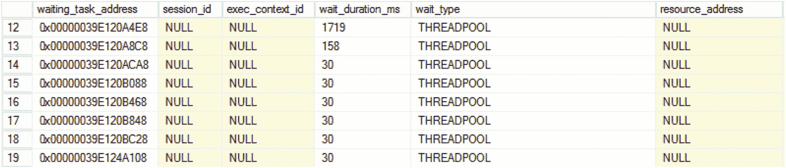

图 5-22

线程池等待

存在相当多的 `THREADPOOL` 等待，等待时间各不有些甚至长达数秒。情况可能比这更糟。图 5-23 显示了我运行 `Ostress` 工具时尝试连接到测试 SQL Server 实例所遇到的错误。

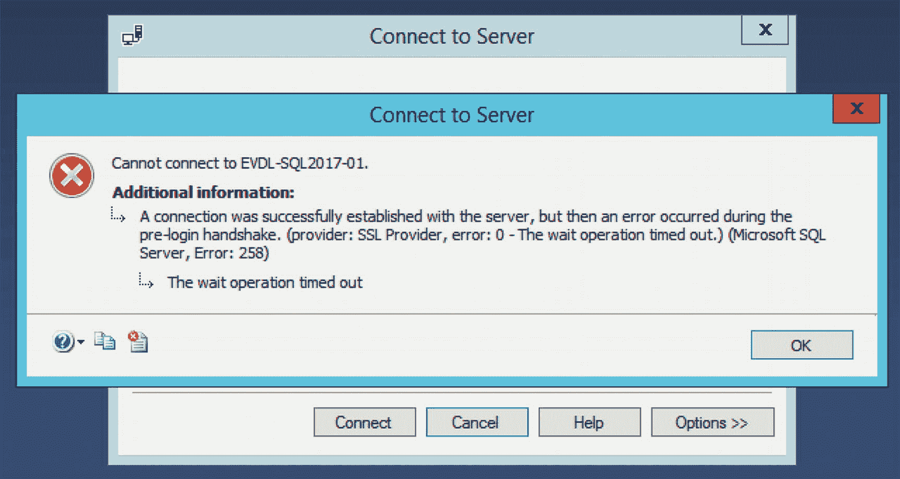

图 5-23

发生超时，SQL Server 无响应

现在我们已经看到了线程池资源枯竭可能引发的问题类型，接下来让我们看看如何降低甚至解决 `THREADPOOL` 等待。

### 在发生线程池等待时访问我们的 SQL Server

`THREADPOOL` 等待可能非常难以排查，这主要是因为导致 SQL Server 没有可用的工作线程的原因有很多。此外，`THREADPOOL` 等待可能完全锁死您的 SQL Server 实例，使其（以及对其进行排查）几乎不可能连接，正如您在前面的例子中所看到的。

为了确保您不会陷入无法连接到 SQL Server 实例进行排查的境地，您应该采取的第一步是启用专用管理员连接（`DAC`）。如果您还记得第 1 章“等待统计信息内部原理”中关于调度器的部分，您可能会想起一个为 `DAC` 保留的特殊类型的调度器。这个专用调度器，如图 5-24 所示，是专门为 `DAC` 保留的，并且可以访问其自己的工作线程。

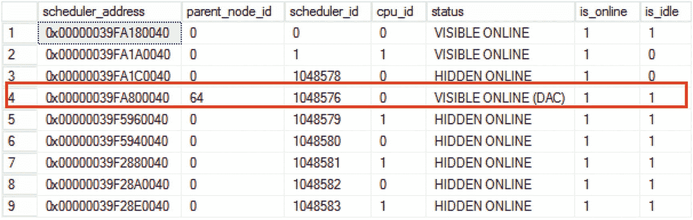

图 5-24

专用管理员连接调度器

如果您通过 `DAC` 连接到 SQL Server 实例，您的会话将映射到 `DAC` 调度器。这使得即使所有其他调度器都有大量任务队列，也可能连接并执行查询。

您可以通过执行以下查询来启用 `DAC`：

```sql
sp_configure 'remote admin connections', 1
GO
RECONFIGURE
GO
```

如果您想使用 `DAC` 连接到 SQL Server 实例，需要在连接的服务器名称前添加 `ADMIN:` 前缀，如图 5-25 所示。您只能在未连接到服务器的情况下，从 SQL Server Management Studio 内部执行新查询时使用 `DAC` 进行连接。

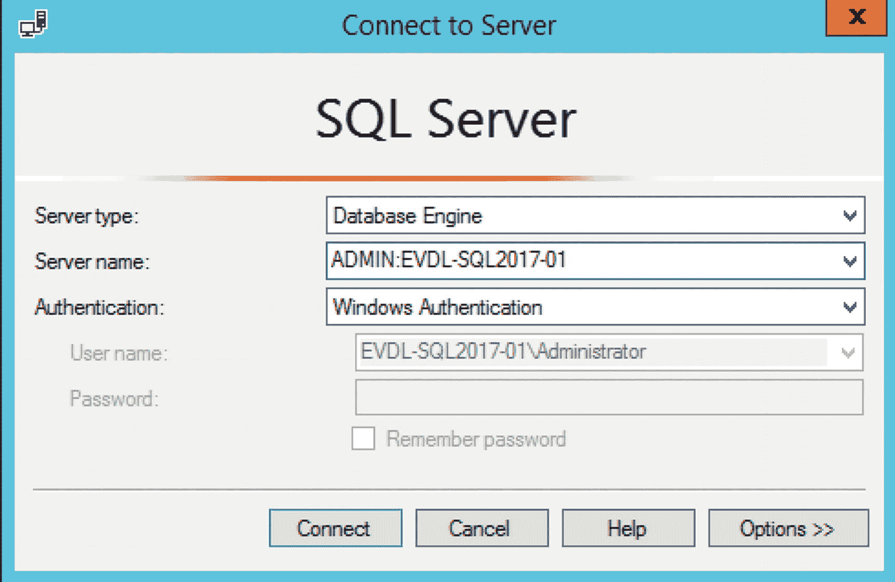

图 5-25

使用专用管理员连接进行连接

现在您能够使用 `DAC` 连接到 SQL Server 实例，即使 SQL Server 实例不接受任何新连接，您也始终有办法进入。

在启用 `DAC` 后，让我们讨论一下 `THREADPOOL` 等待的一些常见原因。

### 降低由并行度引起的线程池等待

我遇到的最常见的 `THREADPOOL` 等待原因之一与查询执行期间大量使用并行度有关。在并行查询执行期间，会使用多个工作线程来执行所需的工作。如果您将与并行度相关的配置选项——`最大并行度` 和 `并行度的成本阈值`——保留为默认值，可能会导致比预期更多的查询并行运行。根据您的 SQL Server 可访问的处理器数量，以及并行查询期间使用的工作线程数量，单个并行查询可能需要许多工作线程。

如果您遇到这种特定情况的高频高 `THREADPOOL` 等待，通常也会看到许多 `CXPACKET` 等待（有时等待时间很长）。为了展示这种行为，我修改了我们用于生成 `THREADPOOL` 等待的查询，使其以并行方式执行。在这个例子中，我注释掉了 `MAXDOP` 查询选项：

```sql
SELECT TOP 1 *
FROM Sales.SalesOrderDetail
ORDER BY NEWID()
-- OPTION (MAXDOP 1)
```

对于此示例，我还将 `最大并行度` 配置为其默认值 0，并将 `并行度的成本阈值` 选项设置为 1。这样我就能 100%确定查询将以并行方式运行。我将 `最大工作线程数` 选项保留为之前配置的 128。

如果我们现在重复本章前面执行的相同 `Ostress` 测试，执行以下命令，我们应该会在 `sys.dm_os_waiting_tasks` DMV 中再次看到 `THREADPOOL` 等待发生，如图 5-26 所示。

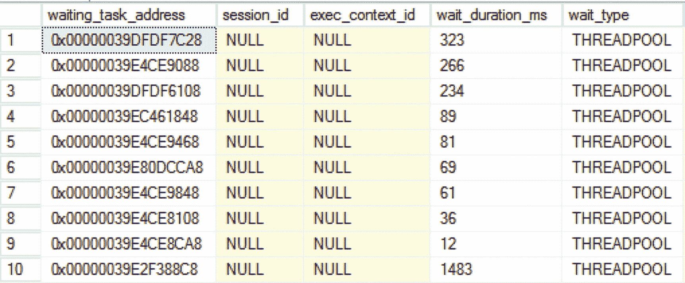

图 5-26

线程池等待

```shell
"C:\Program Files\Microsoft Corporation\RMLUtils\ostress.exe" -E -dAdventureWorks -i"C:\select_rnd.sql" -n150 -r10 -q
```

但这一次，因为我们的测试查询是以并行方式执行的，我们还会在 `sys.dm_os_waiting_tasks` DMV 返回的结果中发现许多 `CXPACKET` 等待，如图 5-27 所示。

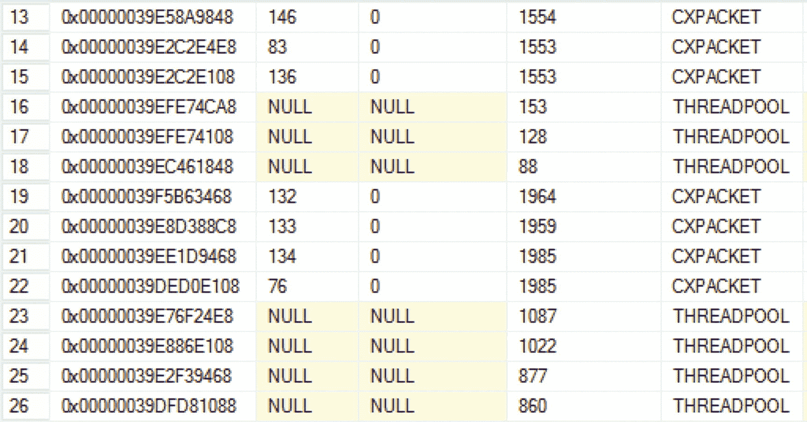

图 5-27

CXPACKET 和线程池等待

如果您在 SQL Server 实例上观察到这种行为，检查您的并行度配置可能是值得的。本章第一节讨论了 `CXPACKET` 等待以及如何降低它们。另一个可能引导您朝此方向检查的提示是，这种特定情况下的 `CPU` 负载通常高于正常水平。在我的测试 SQL Server 实例情况下，所有 `CPU` 都达到了 100%。


### 降低由用户连接引起的 THREADPOOL 等待

另一个导致 `THREADPOOL` 等待的常见原因是，连接并针对你的 SQL Server 实例执行查询的用户数量突然增加。例如，如果连接到 SQL Server 实例的应用程序使用多个连接，就可能出现此问题。这里的主要问题是，这些连接保持活动状态并持续获取工作线程。

为了举例说明这个问题，我们将再次使用 `Ostress` 连接并针对我的测试 SQL Server 实例执行查询。这次，我们将使用一个不同的 `.sql` 文件，保存为 `wait.sql`，作为 `Ostress` 的输入，其内容如下查询：

```
WAITFOR DELAY '00:05:00'
```

这个查询唯一的作用就是等待 5 分钟。5 分钟后，查询结束，连接断开。

让我们使用 `wait.sql` 文件运行 `Ostress`：

```
"C:\Program Files\Microsoft Corporation\RMLUtils\ostress.exe" -E -dAdventureWorks -i"C:\wait.sql" -n120 -r1 -q
```

我们将 `Ostress` 生成的线程数更改为 120，并再次将 `Max Worker Threads` 选项保留设置为 128 个工作线程。

当我们使用以下查询查询 `sys.dm_exec_sessions` DMV 时，可以看到由 `Ostress` 工具生成的许多新用户会话处于活动状态，如图 5-28 所示。

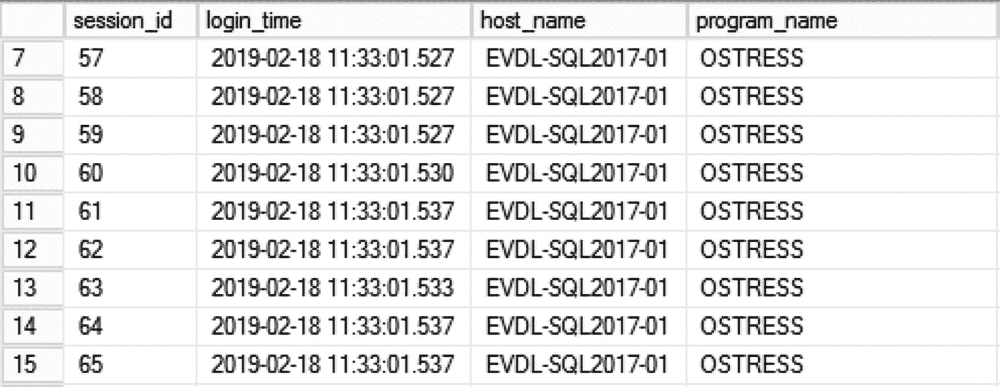

图 5-28

`Ostress` 用户会话

```
SELECT *
FROM sys.dm_exec_sessions
WHERE is_user_process = 1;
```

如果我们查询 `sys.dm_os_waiting_tasks` DMV，可以看到正在发生 `THREADPOOL` 等待，如图 5-29 所示。

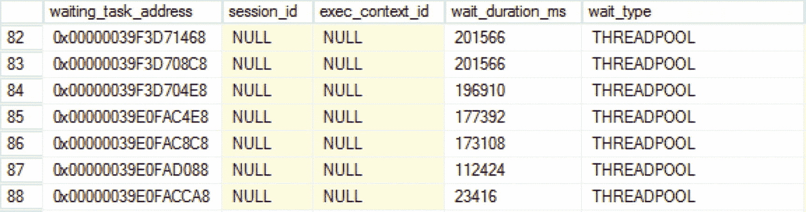

图 5-29

`sys.dm_os_waiting_tasks` DMV 内的 `THREADPOOL` 等待

由过度并行度引起的 `THREADPOOL` 等待与用户连接增加引起的 `THREADPOOL` 等待之间的最大区别在于，在后一种情况下，我的测试 SQL Server 实例的 CPU 保持较低水平，如图 5-30 所示。

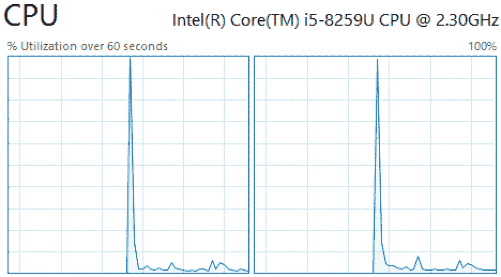

图 5-30

CPU 使用率

CPU 使用率历史图表中的小尖峰是由启动 `Ostress` 工具引起的。之后，CPU 保持在持续较低的使用百分比。

解决由用户连接增加引起的 `THREADPOOL` 等待应从源头着手。用户连接来自哪里？这些连接在做什么？我遇到过一些情况，应用程序在一次更新后突然使用了数百个活动用户连接，而 SQL Server 实例并未设计用于处理如此大量并发的活动连接，从而导致了 `THREADPOOL` 等待。

请记住，用户连接只有在实际运行查询时才应引起 `THREADPOOL` 等待。连接到 SQL Server 实例但未执行任何操作的用户连接不应成为 `THREADPOOL` 等待的原因。

此外，针对数据库的许多不同活动用户连接可能会在行或表上创建许多锁。如果你注意到与锁相关的高等待时间与 `THREADPOOL` 等待同时出现，问题可能是正在发生大量的锁和阻塞。在这种情况下，你应该尝试找出导致锁等待的查询，并查看是否可以优化它们。我们将在第 7 章“与锁相关的等待类型”中讨论与锁相关的等待类型以及你可以采取的措施。

### THREADPOOL 总结

`THREADPOOL` 等待是你 SQL Server 实例上最令人担忧的等待类型之一。它们的发生是因为没有足够的空闲工作线程可用于处理请求，因此请求工作线程的任务将不得不等待，直到有新的工作线程可用。值得庆幸的是，`THREADPOOL` 等待并不常见，因为它们有可能将你完全锁定在 SQL Server 实例之外。在这些情况下，连接的唯一方法是使用 `Dedicated Administrator Connection`（或 `DAC`），我强烈建议你在所有 SQL Server 实例上启用此功能。

过度使用并行度和活动用户连接的大幅增加是 `THREADPOOL` 等待两个最常见的原因。前者与我们之前讨论的 `CXPACKET` 等待类型有直接关系，因此解决 `CXPACKET` 等待类型的方法也有助于解决 `THREADPOOL` 等待。后者则需要深入调查为什么活动用户连接数量突然增加。也许它们是应用程序连接到 SQL Server 实例时出现错误的结果。我们还简要提及了锁和阻塞行为作为 `THREADPOOL` 等待的可能原因。我们将在第 7 章“与锁相关的等待类型”中更深入地探讨如何解决与锁相关的等待。

