# 6. 与 IO 相关的等待类型

在本章中，我们将从最广泛的意义上探讨与 IO 相关的等待类型。我选择了与系统存储、内存或网络组件相关的等待类型。有人可能会争辩说，大多数等待类型都符合这一类别，这很可能是对的，但为了防止本章涵盖本书中 90% 的等待类型，我必须谨慎选择。我认为本章中的等待类型与存储、内存或网络有直接关系，但不直接与 SQL Server 中的功能或概念相关。例如，`PAGEIOLATCH_xx` 等待类型经常与存储相关，但它们未包含在本章中。原因在于它们也是一种自旋锁等待类型，并且我认为由于其在 SQL Server 中的功能，自旋锁等待类型值得单独一章讨论。

IO 相关组件的性能对 SQL Server 极其重要。SQL Server 几乎每个部分都以某种方式与这些组件交互，无论是需要从磁盘读取到内存中的数据页，还是需要通过网络传输给最终用户的查询结果。如果这些组件中的任何一个无法处理你在 SQL Server 实例上生成的工作负载，或者配置不当，你的性能就会下降。

本章中的等待类型可以帮助你追踪是哪个 IO 组件拖慢了速度，以便你采取适当措施预防或解决与性能相关的事件。

## ASYNC_IO_COMPLETION

`ASYNC_IO_COMPLETION` 等待类型是一种相当常见的等待类型，每当 SQL Server 在存储子系统上执行文件相关操作并必须等待其完成时发生。当你执行与存储子系统交互的操作（如备份）时，会经常看到这种等待类型。与大多数等待类型一样，如果你看到这种等待类型出现，并不一定意味着你的存储子系统有问题。只有当等待时间相比你的基线值（我们在第 4 章“构建可靠的基线”中讨论过）超出预期时，它才会成为问题。


### 什么是 ASYNC_IO_COMPLETION 等待类型？

如果我们在 Books Online (BOL) 中查询 `ASYNC_IO_COMPLETION` 等待类型，会看到如下定义：“当任务等待 I/O 完成时发生。”这是一个相当简短且模糊的定义。让我们增加一些细节。当任务等待与存储相关的操作完成时，就会发生 `ASYNC_IO_COMPLETION` 等待。该任务由 SQL Server 发起和监控。图 6-1 以视觉方式展示了这种等待类型。

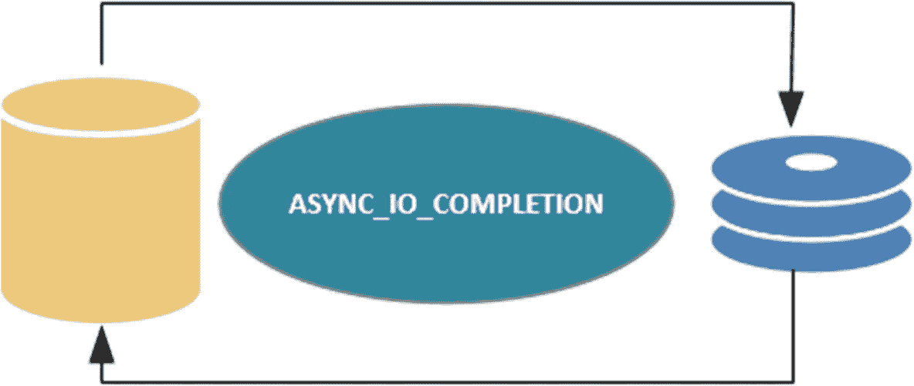

图 6-1

发生的 ASYNC_IO_COMPLETION 等待

只要与存储相关的操作正在运行，`ASYNC_IO_COMPLETION` 等待时间就会被记录。正如你所想的那样，你的存储子系统越快，`ASYNC_IO_COMPLETION` 等待时间就越低。

正如我之前所说，通常 `ASYNC_IO_COMPLETION` 等待无需担心。它们会在许多需要访问存储子系统的 SQL Server 操作（如备份或创建新数据库）期间正常发生。但是，如果与你的基线测量值相比，等待时间超出预期，它可能就成为一个值得关注的原因。

### ASYNC_IO_COMPLETION 示例

让我们通过一个示例来生成 `ASYNC_IO_COMPLETION` 等待。我们不需要任何额外的工具；仅仅运行一个数据库备份就会触发 `ASYNC_IO_COMPLETION` 等待。

在这个例子中，我将在我的测试服务器上执行 `AdventureWorks` 数据库的备份。

为了执行此操作，我将使用清单 6-1 中的查询。此查询将重置 `sys.dm_os_wait_stats` DMV，执行数据库备份，然后查询 `sys.dm_os_wait_stats` DMV 中的 `ASYNC_IO_COMPLETION` 等待。

```
USE [master]
GO
DBCC SQLPERF('sys.dm_os_wait_stats', CLEAR);
BACKUP DATABASE [AdventureWorks]
TO  DISK = N'F:\Backup\aw_backup.bak'
WITH
NAME = N'AdventureWorks-Full Database Backup',
STATS = 2;
GO
SELECT *
FROM sys.dm_os_wait_stats
WHERE wait_type = 'ASYNC_IO_COMPLETION';
清单 6-1
生成 ASYN_IO_COMPLETION 等待
```

在我的测试 SQL Server 实例上，备份操作耗时 1 秒。图 6-2 显示了清单 6-1 中查询的结果。


图 6-2

ASYNC_IO_COMPLETION 等待时间

如你所见，在数据库备份的几乎整个持续时间内，都记录了 `ASYNC_IO_COMPLETION` 等待。

### 降低 ASYNC_IO_COMPLETION 等待

高 `ASYNC_IO_COMPLETION` 等待时间的一个常见原因是数据库备份，正如你刚才在示例中看到的。如果你想查明你的 `ASYNC_IO_COMPLETION` 等待是否因正在执行备份而发生，请尝试查找同时发生的与备份相关的等待。

如果我们稍微修改清单 6-1 中最后一个 `sys.dm_os_waiting_tasks` 查询，我们将看到 DMV 返回与备份相关的等待类型：

```
SELECT *
FROM sys.dm_os_wait_stats
WHERE wait_type IN
(
'ASYNC_IO_COMPLETION',
'BACKUPIO',
'BACKUPBUFFER'
);
```

图 6-3 显示了经过此修改后的清单 6-1 查询结果。

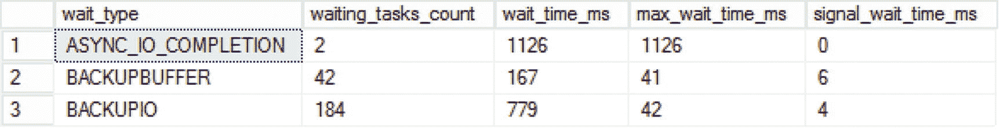

图 6-3

ASYNC_IO_COMPLETION 等待与备份相关等待一起出现

如果你看到两者同时发生，很可能是数据库备份导致了你的 `ASYNC_IO_COMPLETION` 等待。

另一种可能降低 `ASYNC_IO_COMPLETION` 等待的方法是配置 `即时文件初始化`。`即时文件初始化` 在 Windows 2003 中引入，通过消除将文件清零（在文件可以使用前向文件内写入零）的需要，极大地加速了在磁盘上分配空间的过程。这不会影响你的备份速度，但在创建数据库、向数据库添加文件或恢复数据库时，会提高性能。`即时文件初始化` 默认情况下不启用，除非你是在具有本地管理员权限的账户下运行 SQL Server 服务。在 SQL Server 2016 的安装过程中，微软增加了一个额外的复选框，用于在 SQL Server 安装期间启用 `即时文件初始化`，如图 6-4 所示。

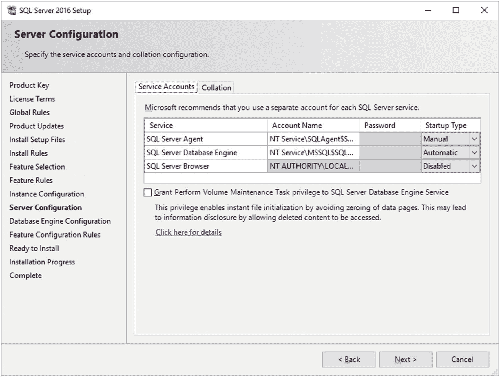

图 6-4

SQL Server 2016 安装程序中的“授予 SQL Server 数据库引擎服务执行卷维护任务权限”复选框

如果你在安装 SQL Server 2016 或更高版本时没有启用“授予 SQL Server 数据库引擎服务执行卷维护任务权限”复选框，或者安装的是较低版本的 SQL Server，则需要在安装后手动配置 `即时文件初始化`。配置 `即时文件初始化` 的方法是通过在 SQL Server 运行的计算机上设置本地安全策略，将你的 SQL Server 服务运行所用的账户添加进去。

你可以通过在“控制面板”的“管理工具”下打开“本地安全策略”MMC 来找到此策略。展开“本地策略”➤“用户权限分配”文件夹，向下滚动到“执行卷维护任务”策略，如图 6-5 所示。

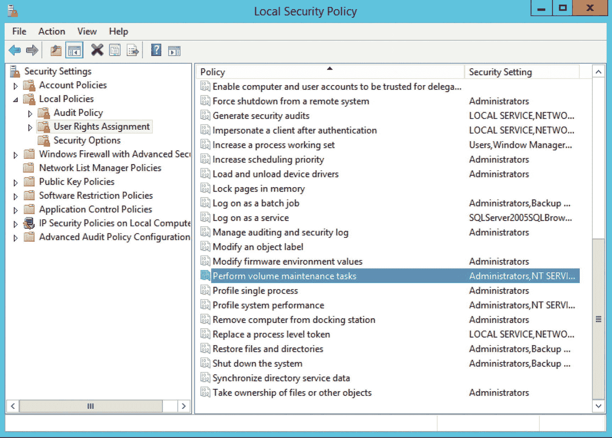

图 6-5

“执行卷维护任务”本地策略

双击该策略将其打开，然后添加你的 SQL Server 服务运行所用的账户。最后一步是重启你的 SQL Server 服务。重启后，SQL Server 就可以使用 `即时文件初始化` 了。

为了向你展示 `即时文件初始化` 的影响，我使用了清单 6-2 中的查询。此查询先清空 `sys.dm_os_wait_stats` DMV，然后创建一个包含 500 MB 数据文件和 100 MB 日志文件的新数据库。接着查询 `sys.dm_os_wait_stats` DMV 中的 `ASYNC_IO_COMPLETION` 等待类型。


## ASYNC_IO_COMPLETION

```
DBCC SQLPERF('sys.dm_os_wait_stats', CLEAR);
CREATE DATABASE [IO_test]
ON  PRIMARY
(
NAME = N'IO_test', FILENAME = N'E:\Data\IO_test.mdf' , SIZE = 512000KB , FILEGROWTH = 10%
)
LOG ON
(
NAME = N'IO_test_log', FILENAME = N'E:\Log\IO_test_log.ldf' , SIZE = 102400KB , FILEGROWTH = 10%
);
GO
SELECT *
FROM sys.dm_os_wait_stats
WHERE wait_type = 'ASYNC_IO_COMPLETION';
清单 6-2
测量即时文件初始化对 ASYNC_IO_COMPLETION 等待的影响
```

图 6-6 显示了配置即时文件初始化前后的等待统计信息。

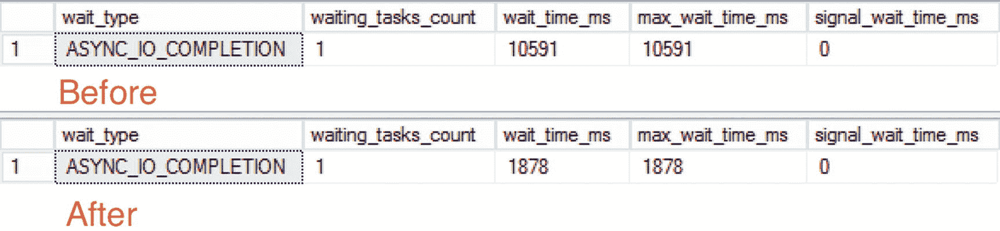

图 6-6：即时文件初始化对 `ASYNC_IO_COMPLETION` 等待的影响。

即使对于这个相对较小的数据库，使用即时文件初始化带来的收益也相当可观，正如你在等待时间的差异中所看到的那样。在启用即时文件初始化之前，清单 6-2 中的查询耗时 11 秒完成；更改后，它降至 2 秒。

如果你已配置即时文件初始化，并且检查确认在看到高 `ASYNC_IO_COMPLETION` 等待时没有备份正在执行，那么问题可能出在你的存储子系统上。分析潜在存储问题的一个好方法是使用 Perfmon 来监控数据库所在磁盘的 `Avg. Disk/sec Read` 和 `Avg. Disk/sec Write` 计数器，如图 6-7 所示。这些计数器显示了对磁盘的读写延迟（以秒为单位）（这意味着 0.005 的值代表 5 毫秒）。SQL Server 在最大延迟为 5 毫秒时性能最佳。超过 20 毫秒，延迟将导致明显的性能下降。延迟值越高，存储相关等待类型的等待时间就越长。

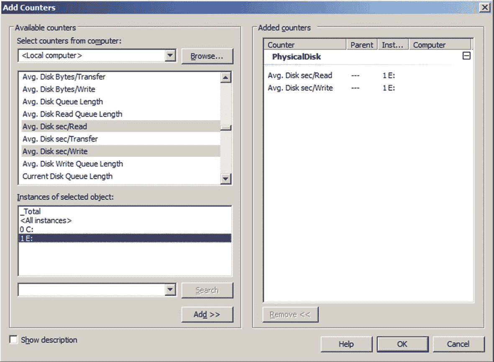

图 6-7：`Avg. Disk sec/Read` 和 `Avg. Disk sec/Write` Perfmon 计数器。

关于存储性能，请谨慎下结论。在你断定存储子系统是瓶颈之前，务必与你的存储管理员（如果有）沟通，并向其展示你的测量结果。存储是存储管理员的领域，他/她可以帮助你分析和解决性能问题。

### ASYNC_IO_COMPLETION 总结

当你在 SQL Server 实例内部执行与存储子系统相关的操作时（最显著的是数据库备份和创建新数据库），会发生 `ASYNC_IO_COMPLETION` 等待类型。虽然 `ASYNC_IO_COMPLETION` 等待完全正常，但如果等待时间高于正常值，则可能表明存在存储相关问题。在你跑去寻找存储管理员之前，请确保确实存在性能问题。一种可能的检查方法是查看你的存储延迟，因为高延迟值也会影响 `ASYNC_IO_COMPLETION` 等待时间。同时，请检查较高的 `ASYNC_IO_COMPLETION` 等待时间是否与正在执行的数据库备份直接相关。降低 `ASYNC_IO_COMPLETION` 等待时间的一个绝佳方法是启用即时文件初始化，方法是将你的 SQL Server 服务账户添加到 Perfmon 卷维护任务本地策略中。

## ASYNC_NETWORK_IO

与 `ASYNC_IO_COMPLETION` 等待类型类似，`ASYNC_NETWORK_IO` 等待类型也与吞吐量有关。但区别在于，`ASYNC_NETWORK_IO` 等待类型与你的 SQL Server 实例和客户端之间网络连接的吞吐量相关。同样，看到这种特定等待类型的等待时间并不一定意味着存在网络相关问题，因为 `ASYNC_NETWORK_IO` 等待总是会发生，即使你在 SQL Server 本身查询其实例时也是如此。

### 什么是 ASYNC_NETWORK_IO 等待类型？

`ASYNC_NETWORK_IO` 等待通常在客户端应用程序处理查询结果速度不够快时，或者当你存在网络相关性能问题时发生。前者在大多数情况下是最可能的原因，因为许多应用程序逐行处理 SQL Server 结果，或者根本无法处理大量数据。这迫使 SQL Server 等待通过网络发送查询结果。在 SQL Server 等待发送请求的数据期间，会记录 `ASYNC_NETWORK_IO` 等待类型。另一种可能发生 `ASYNC_NETWORK_IO` 等待的情况是，当你使用链接服务器查询远程数据库时。图 6-8 展示了这一过程的图形化表示。

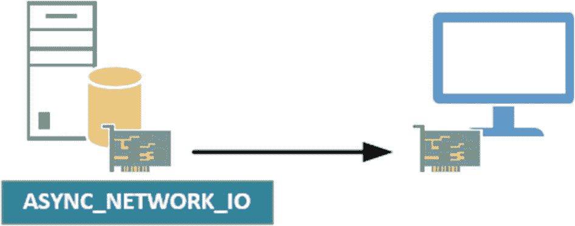

图 6-8：`ASYNC_NETWORK_IO`。

### ASYNC_NETWORK_IO 示例

展示 `ASYNC_NETWORK_IO` 等待类型的示例不需要复杂的测试环境。清单 6-3 显示了一个查询，当从另一台计算机使用 SQL Server Management Studio 针对我的测试 SQL Server 实例运行时，它将生成 `ASYNC_NETWORK_IO` 等待，这应该就足够了。该查询将先清除 `sys.dm_os_wait_stats` DMV，然后对 `AdventureWorks` 数据库执行实际查询。最后一句将向我们展示 `ASYNC_NETWORK_IO` 等待类型的等待时间。

```
DBCC SQLPERF ('sys.dm_os_wait_stats', CLEAR);
SELECT *
FROM Person.Person;
SELECT *
FROM sys.dm_os_wait_stats
WHERE wait_type = 'ASYNC_NETWORK_IO';
清单 6-3
生成 ASYNC_NETWORK_IO 等待
```

图 6-9 显示了 `ASYNC_NETWORK_IO` 等待类型的等待时间。


图 6-9：`ASYNC_NETWORK_IO` 等待时间。

在此示例中，针对 `AdventureWorks` 数据库的查询结果无法被 SQL Server Management Studio 应用程序以 SQL Server 实例提供结果的同样速度进行处理，因此发生了 `ASYNC_NETWORK_IO` 等待。


### 降低 ASYNC_NETWORK_IO 等待

降低 `ASYNC_NETWORK_IO` 等待最“简单”的方法之一，是识别那些会向应用程序返回大型结果集的查询。例如，如果我们修改查询使其只返回前 100 行，SQL Server Management Studio 可能就能跟上返回给它的信息：

```
DBCC SQLPERF ('sys.dm_os_wait_stats', CLEAR);
SELECT TOP 100 *
FROM Person.Person;
SELECT *
FROM sys.dm_os_wait_stats
WHERE wait_type = 'ASYNC_NETWORK_IO';
```

此修改后的等待时间可参见图 6-10。


图 6-10
修改查询后的 ASYNC_NETWORK_IO 等待时间

如你所见，这次我们没有遇到任何 `ASYNC_NETWORK_IO` 等待。SQL Server Management Studio 能够跟上返回的结果，因此我们查询的 SQL Server 实例不必延迟向客户端发送结果。

限制返回结果的另一种方法，是通过使用 `WHERE` 子句过滤掉应用程序根本不使用的信息。更小的结果集将导致更低的 `ASYNC_NETWORK_IO` 等待时间。

如果你认为 `ASYNC_NETWORK_IO` 等待并非由返回应用程序的大型结果集或应用程序处理结果的速度引起，那么也有可能是你的网络配置拖慢了你。在这种情况下，你应该首先检查你的网络利用率。遗憾的是，Performance Monitor 中没有一个计数器能直接显示网络利用率而无需你进行一些计算。相反，你可以使用任务管理器的“联网”选项卡来查看你的网卡利用率，如图 6-11 所示。

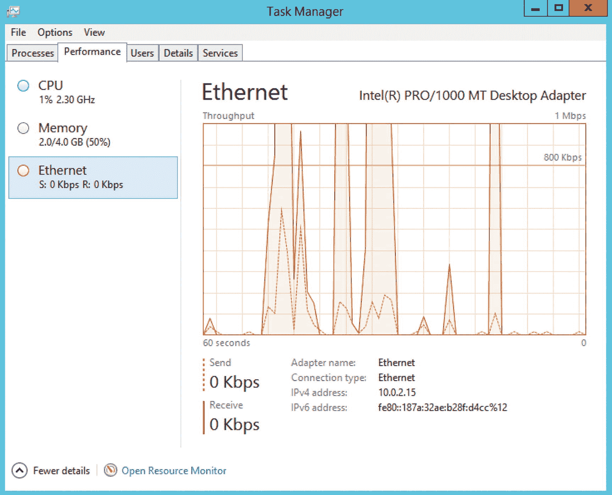

图 6-11
任务管理器网络利用率

如果你在遇到高于正常的 `ASYNC_NETWORK_IO` 等待时间的同时，注意到网络利用率很高，那么可能是网络拖慢了你。在这种情况下，与你的网络管理员沟通可能是个好主意。通常，网络配置包含许多部分，如交换机、路由器、防火墙、网线、驱动程序、固件、操作系统的潜在虚拟化等等。所有这些部分都可能降低你的网络吞吐量，并可能是导致 `ASYNC_NETWORK_IO` 等待的潜在原因。

### ASYNC_NETWORK_IO 总结

`ASYNC_NETWORK_IO` 等待类型发生在应用程序通过网络从 SQL Server 实例请求查询结果，且无法足够快地处理返回的结果时。看到 `ASYNC_NETWORK_IO` 等待发生是完全正常的，但高于正常的等待时间可能是由返回的查询结果发生变化或网络相关问题引起的。降低与应用程序相关的 `ASYNC_NETWORK_IO` 等待时间，可以通过减少返回给应用程序的行数和/或列数来实现。

## CMEMTHREAD

`CMEMTHREAD` 等待类型与内存相关，表明某些 SQL Server 相关的内存对象存在压力。这些内存对象为 SQL Server 的各个部分（如缓冲区缓存和计划缓存）分配内存。每当发生 `CMEMTHREAD` 等待时，意味着多个线程试图同时访问同一个内存对象。

### 什么是 CMEMTHREAD 等待类型？

要解释 `CMEMTHREAD` 等待类型的产生机制，我们需要更深入地了解一些编程术语，特别是术语 *互斥*、*临界区* 和 *线程安全*。这三个概念在 `CMEMTHREAD` 等待类型的产生中扮演着直接角色。

临界区由一段访问共享资源的代码组成，该资源一次只能由一个线程访问。在我们的例子中，共享资源将是一个 SQL Server 内存对象。SQL Server 内存对象一次只能由一个线程访问，以确保不会发生内存对象损坏。因为有许多线程想要访问内存对象，所以我们必须使用一种方法来确保一次只有一个线程获得访问权。这种方法称为互斥。SQL Server 使用一个互斥体（Mutex）对象，以确保并发线程在访问内存对象时不会同时处于其临界区内。互斥体通过将线程对内存对象的访问串行化来实现这一点。只有一个线程可以成为互斥体对象的所有者，当一个线程拥有所有权时，它就可以访问共享资源。当该线程完成操作后，互斥体对象将移交给队列中的下一个线程。通过使用这些对象，我们创建了线程安全的代码，其中多个线程不会并发访问内存对象。图 6-12 展示了这种情况。

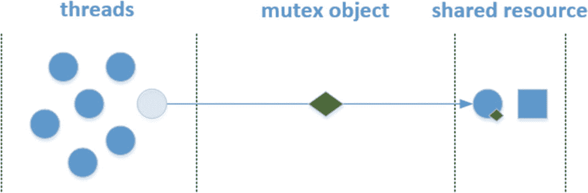

图 6-12
线程等待互斥体对象以访问共享资源

一个简化的行为例子是，当你和其他一大群人正在等待一个唯一的取票机购买摇滚乐队演唱会的门票。在这个例子中，取票机是共享资源，一次只能由一个人访问。当我们到达取票机时，我们可以拿到一张票，而我们后面的人必须等到轮到他们的时间。在我们买完票后，队列中的下一个人获得取票机的访问权。

我们也可以在 SQL Server 中观察这种行为，但要做到这一点，我们需要使用调试器（如 WinDbg）。图 6-13 显示了 SQL Server 中的一个线程如何等待互斥体，因为对内存对象的访问权被授予了另一个线程。为了捕获此图像，我使用了一个扩展事件会话，该会话在发生 `CMEMTHREAD` 等待时创建了一个 SQL Server 小型转储。然后我使用 WinDbg 打开小型转储并返回了堆栈。

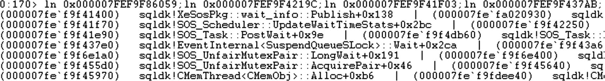

图 6-13
小型转储中发生 CMEMTHREAD 等待的示例

这里重要的行是 `SOS_UnfairMutexPair::LongWait`，它产生了 `CMEMTHREAD` 等待，因为我们在此监控的线程必须等待另一个当前拥有内存对象访问权的线程。其后的 `SOS_UnfairMutexPair::AcquirePair` 表示该线程获得了互斥体，紧接着是访问由 `CMemThread<CmemObj>::Alloc` 表示的内存对象。


### 降低 CMEMTHREAD 等待

由于 SQL Server 中存在许多可能产生 `CMEMTHREAD` 等待的不同内存对象，因此降低 `CMEMTHREAD` 等待时间的解决方案也有很多，具体取决于被访问的内存对象。

发生 `CMEMTHREAD` 等待的一个更常见情况是，系统正在执行大量短小的、并发的、即席查询。每次执行一个无法参数化的即席查询时，查询优化器都会为该查询生成一个新的执行计划。所有这些新的执行计划都需要被输入到过程缓存中，并且会访问一个用于分配缓存描述符的内存对象。由于该内存对象是线程安全的，如果插入速率足够高，就可能出现 `CMEMTHREAD` 等待。如果你怀疑 `CMEMTHREAD` 等待是由于即席查询导致的，一个很好的切入点就是检查过程缓存。清单 6-4 中的查询将为你提供有关过程缓存中执行计划数量的信息。

```
SELECT
objtype,
COUNT_BIG (*) AS 'Total Plans',
SUM(CAST(size_in_bytes AS DECIMAL(12,2)))/1024/1024 AS 'Size (MB)'
FROM sys.dm_exec_cached_plans
GROUP BY objtype;
清单 6-4
查询过程缓存
```

该查询的结果应如图 6-14 所示，尽管在你的系统上数字会有所不同。

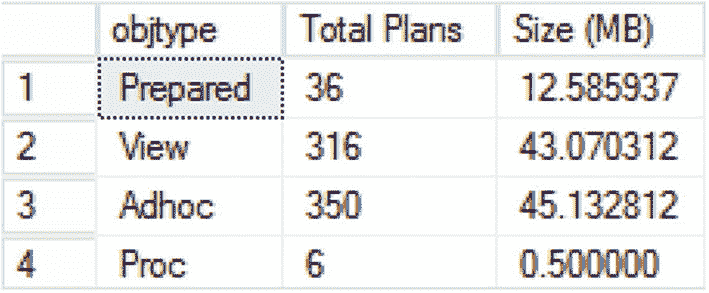

图 6-14
查询过程缓存的结果

我们应该关注即席执行计划的数量。如果你看到这个数字在快速增长，并且遇到 `CMEMTHREAD` 等待，那么分析其中一些即席查询可能是值得的。如果可能，尝试优化查询以生成可重用的计划。如果你的应用程序使用了许多动态查询，那么请尝试使用 `sp_executesql` 系统存储过程，而不是 `EXECUTE` (`EXEC`) 命令。使用 `EXEC` 命令很可能只会生成使用一次的计划。

Microsoft 已经在 SQL Server 2005 SP2 中针对此问题发布了各种修复（最显著的是跨 CPU 分区某些内存对象），使得如今这种情况变得不那么常见。即使你使用的是比 SQL Server 2005 更新的版本，升级到最新的可用 Service Pack 可能也是一个好主意，因为每个 SQL Server 版本中都有各种与内存相关的错误修复。

### CMEMTHREAD 总结

`CMEMTHREAD` 等待类型是一种与内存相关的等待类型。当多个线程尝试访问一次只能由一个线程访问的内存对象时，就会发生 `CMEMTHREAD` 等待。其他线程等待轮到自己访问内存对象的时间被记录为 `CMEMTHREAD` 等待时间。发生 `CMEMTHREAD` 等待的一个更常见情况是系统使用大量即席查询。每次生成新的执行计划时，SQL Server 都会访问一个内存对象；如果生成了许多执行计划，这可能会导致想要访问该内存对象的线程排队，从而导致 `CMEMTHREAD` 等待。

## IO_COMPLETION

与 `ASYNC_IO_COMPLETION` 等待类型类似，当 SQL Server 正在等待存储相关操作完成时，会发生 `IO_COMPLETION` 等待。同样，与 `ASYNC_IO_COMPLETION` 等待类型类似，看到 `IO_COMPLETION` 等待类型的等待时间很长，并不一定意味着你的存储系统有问题。`IO_COMPLETION` 等待在 SQL Server 实例运行期间会正常发生，只有当等待时间比正常情况高出很多时，才应该引起关注。

### IO_COMPLETION 等待类型是什么？

`ASYNC_IO_COMPLETION` 等待类型在执行数据库相关操作（如数据库备份）时被记录，而 `IO_COMPLETION` 等待则在涉及非数据页时发生，例如还原事务日志备份或访问位图分配页（如 GAM 页）。当执行需要对存储子系统进行读写操作（例如 `Merge Join` 运算符）的查询时，也可能发生 `IO_COMPLETION` 等待。

### IO_COMPLETION 示例

让我们通过还原一个事务日志备份来生成一些 `IO_COMPLETION` 等待。在这个例子中，我们将再次使用 `AdventureWorks` 数据库。清单 6-5 中的查询将执行 `AdventureWorks` 数据库的完整备份，进行一些更改，然后执行事务日志备份。完成后，我们将再次还原完整备份，清除 `sys.dm_os_wait_stats` DMV，还原事务日志备份，并检查 `IO_COMPLETION` 等待。

```
-- 确保 AdventureWorks 处于完整恢复模式
ALTER DATABASE AdventureWorks SET RECOVERY FULL
GO
-- 首先执行完整备份
-- 否则完整恢复模式将不会生效
BACKUP DATABASE [AdventureWorks]
TO  DISK = N'F:\Backup\AW_Full.bak'
GO
-- 对 AW 数据库进行一些更改
USE AdventureWorks
GO
UPDATE Person.Address
SET City = 'Portland'
WHERE City = 'Bothell'
-- 备份事务日志
BACKUP LOG [AdventureWorks]
TO  DISK = N'F:\Backup\AW_Log.trn'
GO
-- 使用 NORECOVERY 还原之前的完整备份
USE [master]
GO
RESTORE DATABASE [AdventureWorks]
FROM  DISK = N'F:\Backup\AW_Full.bak'
WITH  NORECOVERY, REPLACE
GO
-- 清除 sys.dm_os_wait_stats
dbcc sqlperf ('sys.dm_os_wait_stats', CLEAR)
-- 还原上次的事务日志备份
RESTORE LOG [AdventureWorks] FROM  DISK = N'F:\Backup\AW_Log.trn'
GO
-- 检查 IO_COMPLETION 等待
SELECT *
FROM sys.dm_os_wait_stats
WHERE wait_type = 'IO_COMPLETION'
清单 6-5
生成 IO_Completion 等待
```

在我的测试系统上，针对 `sys.dm_os_wait_stats` DMV 的此查询结果如图 6-15 所示。


图 6-15
IO_COMPLETION 等待

我们使用清单 6-5 中的查询只修改了几个记录，因此由于事务日志备份还原得很快，总等待时间相当低。

`IO_COMPLETION` 等待时间也可能在启动数据库后发生，例如在重新启动 SQL Server 服务之后。这意味着在重新启动或故障转移后，你应该预期会出现 `IO_COMPLETION` 等待；这些都是完全正常的。同样，如果数据库启用了 AUTO_CLOSE（Express 版本中的默认设置）并且数据库正在启动，你也应该会经历 `IO_COMPLETION` 等待。

### 降低 IO_COMPLETION 等待

大多数情况下，`IO_COMPLETION` 等待不应该引起关注。当它们远高于基线中的等待时间时，你应该像在“降低 `ASYNC_IO_COMPLETION`”一节中描述的那样，分析存储子系统的性能。虽然某些查询操作也可能导致 `IO_COMPLETION` 等待，但它们通常不是导致等待时间高于正常水平的原因。

### IO_COMPLETION 总结

与 `ASYNC_IO_COMPLETION` 等待类型类似，当访问存储子系统时，会发生 `IO_COMPLETION` 等待。当 SQL Server 正在等待非数据页操作（如事务日志还原操作或读取位图页，例如 GAM 页）完成时，会发生 `IO_COMPLETION` 等待。看到 `IO_COMPLETION` 类型的等待是完全正常的，除非等待时间远高于基线值，否则这些通常不需要深入分析。在那些情况下，首先关注存储子系统的性能（尤其是延迟）。

## LOGBUFFER 和 WRITELOG

我在本节中合并了 `LOGBUFFER` 和 `WRITELOG`。这是因为这两种等待类型彼此密切相关。两者都与事务日志和存储子系统有关。


### 什么是 LOGBUFFER 和 WRITELOG 等待类型？

要理解 `LOGBUFFER` 和 `WRITELOG` 这些等待类型代表什么，我们需要对 SQL Server 如何写入事务日志有所了解。简而言之，每当我们在数据库内部更改或添加数据时，会发生以下事件：

1.  数据所在的数据页在缓冲区缓存中被修改；如果该页尚未在缓冲区缓存中，则会首先将其读入缓冲区缓存。
2.  该数据页将在缓冲区缓存中被标记为“脏页”。
3.  表示此次修改的日志记录被保存在日志缓冲区中。
4.  发生日志刷新（这可能出于多种原因，我们稍后讨论），将日志记录从日志缓冲区写入事务日志。
5.  脏数据页被写入数据文件。

为了展示这一行为，我提供了图 6-16。

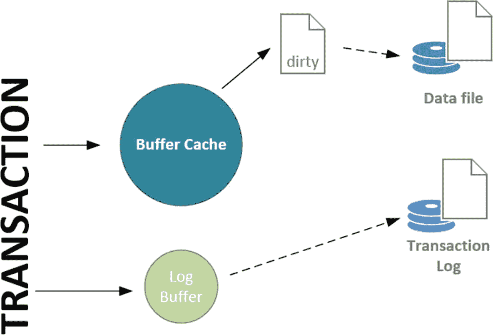
**图 6-16**
**事务移动过程**

代表脏数据页移动的操作以及将日志记录写入事务日志的操作以虚线显示。我特意这样做是为了说明这两个操作并不一定会直接发生。

如你所知，脏数据页首先在缓冲区缓存中更新，只有在发生检查点操作时才会写入数据文件。这意味着即使在你的事务提交后，脏页仍可能驻留在内存中。

对于日志缓冲区中的日志记录，情况则不同。一旦你的事务提交，并且该事务在日志缓冲区中有活动的日志记录，该日志缓冲区内的所有日志记录都会被写入（或刷新）到磁盘上的事务日志中。但这不仅仅发生在事务提交时。日志缓冲区的固定大小为 60 KB，一旦日志缓冲区已满，它将刷新其中的所有记录到事务日志。

现在让我们把本节讨论的两种等待类型加入这个故事中。每当 SQL Server 正在将日志缓冲区的内容刷新到磁盘上的事务日志时，就会发生 `WRITELOG` 等待类型。当在日志缓冲区中插入日志记录时，如果插入时 SQL Server 必须等待日志缓冲区中的可用空间，则会发生 `LOGBUFFER` 等待类型。我在图 6-17 中它们可能产生的位置添加了这两种等待类型。

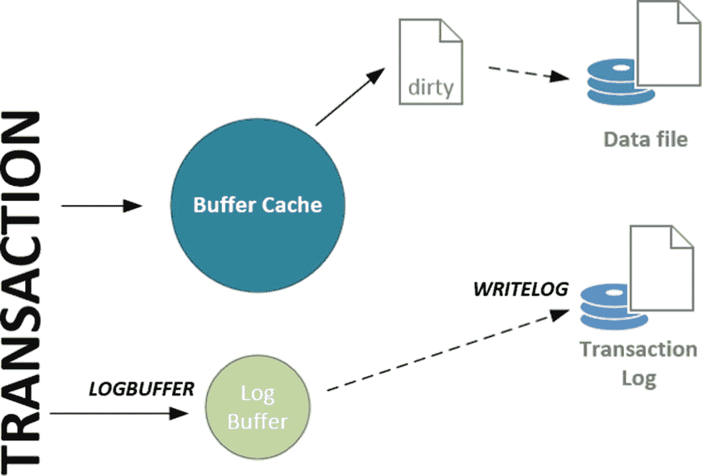
**图 6-17**
**事务移动以及 LOGBUFFER 和 WRITELOG 等待类型**

你现在可能能看出这两种等待类型是如何关联的了。每当发生长时间的 `WRITELOG` 等待时，如果正在将日志记录写入磁盘上事务日志的进程处理速度跟不上日志记录进入日志缓冲区的速度，你很可能也会看到 `LOGBUFFER` 等待。

这种情况经常发生在具有大量并发数据修改的系统上。这导致需要写入磁盘的事务量很高。另一个常见原因是事务日志文件所在的存储子系统的性能。如果存储子系统性能不佳，你的 `WRITELOG` 等待时间将会增加，并且如果事务量足够高，还有可能发生 `LOGBUFFER` 等待。

事务日志的性能对整个数据库的性能至关重要。缓慢的事务日志性能将对你在数据库内部执行的每一个更改产生影响，因为每一次修改都必须在提交前写入事务日志。

### LOGBUFFER 和 WRITELOG 示例

为了给你一个 `LOGBUFFER` 和 `WRITELOG` 等待发生的示例，我使用清单 6-6 中的脚本创建一个新数据库。

```
USE master
GO
-- Create demo database
CREATE DATABASE [trans_demo]
ON PRIMARY
(
NAME = N'trans_demo', FILENAME = N'D:\Data\trans_demo.mdf' , SIZE = 153600KB , FILEGROWTH = 10%
)
LOG ON
(
NAME = N'trans_demo_log', FILENAME = N'D:\Log\trans_demo.ldf' , SIZE = 51200KB , FILEGROWTH = 10%
)
GO
-- Make sure recovery model is set to full
ALTER DATABASE [trans_demo] SET RECOVERY FULL
GO
-- Perform full backup first
-- Otherwise FULL recovery model will not be affected
BACKUP DATABASE [trans_demo]
TO  DISK = N'F:\Backup\trans_demo_Full.bak'
GO
-- Create a simple test table
USE trans_demo
GO
CREATE TABLE transactions
(
t_guid VARCHAR(50)
)
GO
```
**清单 6-6**
**创建 trans_demo 数据库**

既然我们已经创建了一个全新的数据库，我将使用 Ostress 工具对 `trans_demo` 数据库生成负载。我将执行清单 6-7 中的查询（我将其保存到 `logbuffer_impl.sql` 文件），使用以下命令通过 200 个并发连接运行：`"C:\Program Files\Microsoft Corporation\RMLUtils\ostress.exe" -E -dtrans_demo -i"C:\logbuffer_impl.sql" -n200 -r1 -q`。

```
DECLARE @i INT
SET @i = 1
WHILE @i < 10000
BEGIN
INSERT INTO transactions
(t_guid)
VALUES
(newid())
SET @i = @i + 1
END
```
**清单 6-7**
**在 trans_demo 数据库中插入行**

在启动 Ostress 工具之前，我清除了 `sys.dm_os_wait_stats` DMV。

在我的测试 SQL Server 上大约 1 分钟后，Ostress 工具执行完了工作负载。如果我查询 `sys.dm_os_wait_stats` DMV 并查找 `LOGBUFFER` 和 `WRITELOG` 等待类型，我会得到如图 6-18 所示的结果。

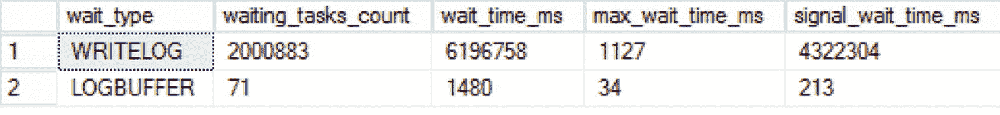
**图 6-18**
**WRITELOG 和 LOGBUFFER 等待**


### 降低 LOGBUFFER 和 WRITELOG 等待

通常有两种方法可以降低 `LOGBUFFER` 和 `WRITELOG` 等待，但需谨记，`WRITELOG` 等待也会正常发生，只有当其等待时间异常偏高时才需要引起关注。

第一种方法是仔细审视事务的执行方式。在前面的例子中，我们为每个 `INSERT` 语句都进行了隐式提交。这意味着一旦 `INSERT` 语句的日志记录进入日志缓冲区，它就需要再次被刷写。如果我们显式地提交整个 `WHILE` 循环，我们将有更大的写入量需要刷写到事务日志，从而获得更好的性能。这是因为频繁写入小数据块通常比间隔较大地写入大数据块要慢。游标也可能产生与我们所用示例相同的效果，因此应尽量少用它们。

另一种方法基于存储子系统。如果 SQL Server 无法足够快地写入日志记录，您可能会遇到 `LOGBUFFER` 和 `WRITELOG` 等待。作为最佳实践，请确保将事务日志与数据库数据文件分开存放在不同的磁盘上，这样在高负载情况下它们就不会相互影响。同时，使用 Perfmon 中的磁盘性能计数器（如显示写入延迟的 `Avg. Disk sec/write` 和显示写入 IOPS 的 `Disk Writes/sec`）来监控事务日志所在的磁盘，并检查这些值是否在可接受的范围内。

如果您的 SQL Server 实例运行的是 SQL Server 2014，您可以选择使用 `延迟持久性` 选项，该选项在 SQL Server 2014 中引入。简而言之，启用此选项后，事务提交时将不再立即将日志缓冲区内容刷写到磁盘，而是等到日志缓冲区满（60 KB）后再将内容刷写到事务日志。通过启用此选项，您将面临这样的风险：那些已提交但尚未写入事务日志的事务，在发生故障时可能会丢失，因为它们只会在日志缓冲区满时才被写入事务日志。

### LOGBUFFER 和 WRITELOG 总结

`LOGBUFFER` 和 `WRITELOG` 这两种等待类型都与 SQL Server 处理事务的方式有关。`WRITELOG` 等待类型在每次将日志记录写入事务日志时都会发生，通常无需担心。但当它与较高的 `LOGBUFFER` 等待时间同时出现时，较高的 `WRITELOG` 等待时间可能表明事务日志存在压力。要降低这些等待时间，请尽量避免使用 `cursor` 和 `WHILE` 语句，因为 `cursor` 或 `WHILE` 子句中的语句通常会被隐式提交，从而产生大量小型写入操作。同时检查您的存储配置，确保事务日志没有与数据库数据文件放在同一个驱动器上。如果仍然出现较高的等待时间，请分析事务日志所在磁盘的性能。

## RESOURCE_SEMAPHORE

`RESOURCE_SEMAPHORE` 等待类型是一种与内存相关的等待类型，当查询内存请求无法立即获得批准时可能出现。这种等待可能发生在正经历内存压力的服务器上，或者当大量并发查询为排序或连接等昂贵操作请求内存时。

### RESOURCE_SEMAPHORE 等待类型是什么？

在 SQL Server 中执行查询时，在实际执行之前会发生一系列步骤。第一步是生成已编译的计划。该计划包含满足查询请求所需的逻辑指令或操作。在生成已编译计划期间，会执行一个计算以确定执行查询所需的内存量，这取决于已编译计划中涉及的操作。一些需要内存的操作包括排序和连接，它们会临时将行数据存储在 SQL Server 的内存中。执行这些排序或连接所需的最小内存量被称为 `required memory`，没有它查询根本无法执行。例如，如果排序过程中需要更多内存来在内存中存储行数据，它将被计算为 `additional memory`。没有这些额外内存，查询仍然可以执行，但临时行数据将写入磁盘而不是内存。

当查询执行时，将根据已编译计划中计算出的所需内存和额外内存值来确定内存授予。此内存授予需要在名为 `resource semaphore` 的内部对象上执行内存保留。资源信号量负责保留查询执行所需的内存，但它也在太多查询同时请求内存保留或当时没有足够可用内存时管理内存节流。它通过维护一个请求内存的查询队列来实现这一点。如果队列中没有查询且有新查询请求内存，资源信号量会将内存授予该查询（如果有足够的可用内存）。但是，如果存在队列，新查询将被放在队列末尾，它必须等待轮到自己才能获得内存授予。

在资源信号量将请求的内存授予查询之前，它会检查是否有足够的可用内存来执行该查询。如果由于某种原因，可用内存量少于查询请求的内存量，该查询将再次被放入队列，直到有足够的内存可用。当一个查询在资源信号量队列中等待其请求的内存时，它在队列中花费的时间将被记录为 `RESOURCE_SEMAPHORE` 等待类型。

资源信号量可用的最大内存量是从缓冲区缓存中分配的。资源信号量最多可以从缓冲区缓存分配 75% 的内存用于内存授予，但单个查询获得的内存量永远不能超过此数量的 25%。例如，如果我们有一个缓冲区缓存最大可达 500 MB 的 SQL Server，那么内存授予的最大值将是 375 MB。在此示例中，单个查询永远无法获得超过 93 MB 的内存。向查询授予如此多的内存可能会出现问题，因为这些内存没有用于缓冲区缓存，这意味着需要更多的 IO 操作到存储子系统来检索和写入数据页。


### 资源信号量示例

在本例中，我们将针对 `AdventureWorks` 数据库执行一个涉及排序操作的查询。正如我在上一节中提到的，涉及排序的查询会向资源信号量请求内存以执行排序操作。我们还将使用 `Ostress` 工具来创建多个查询同时请求内存的情况，从而在资源信号量处形成队列。

让我们看一下我们将要执行的查询及其内存授予信息，如代码清单 6-8 所示。

```
SELECT
SalesOrderID,
SalesOrderDetailID,
ProductID,
CarrierTrackingNumber
FROM
Sales.SalesOrderDetail
ORDER BY CarrierTrackingNumber ASC
Listing 6-8
针对 AdventureWorks 数据库的排序查询
```

如你所见，这是一个相对简单的查询，它从 `Sales.SalesOrderDetail` 表中返回一些信息，并按 `CarrierTrackingNumber` 排序。

如果我们启用“包含实际执行计划”选项并执行该查询，就可以查看执行它所需的内存量。在我的测试 SQL Server 上的结果如图 6-19 所示。你可以通过显示属性窗口（查看 ➤ 属性窗口）或按 F4 并选择 `SELECT` 运算符来访问这些属性。

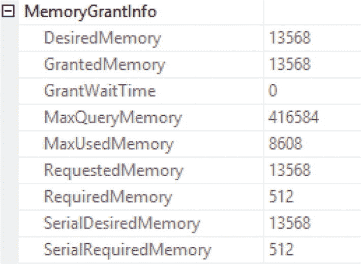

图 6-19：执行计划属性中的 `MemoryGrantInfo`

因为我们请求了实际执行计划，所以也可以看到授予查询执行的内存量。在本例中，查询获得了资源信号量授予的 13,568 KB（13.5 MB）内存，如 `GrantedMemory` 属性所示。执行查询所需的最小内存量，即必需内存，为 512 KB，由 `RequiredMemory` 属性显示。查询请求了 13,568 KB，如 `DesiredMemory` 属性所示，这是必需内存和额外内存的总和。我们可以看到查询获得了它所请求的全部内存，因为 `GrantedMemory` 和 `DesiredMemory` 具有相同的值。

我想指出图 6-19 中的另外两个属性：`SerialDesiredMemory` 和 `SerialRequiredMemory` 属性。对于此查询，这两个属性的值分别与 `DesiredMemory` 和 `RequiredMemory` 属性的值相同。这是因为查询是在未使用并行化的情况下执行的。当在查询中使用并行化时，由于工作被分配到多个线程，执行排序操作需要更多内存。图 6-20 显示了当我强制代码清单 6-8 中的查询使用并行化，将工作分配到四个线程时的 `MemoryGrantInfo` 属性。

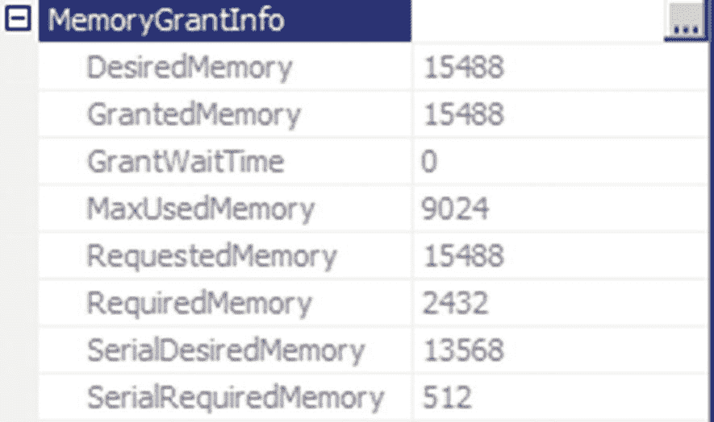

图 6-20：执行并行查询时的 `MemoryGrantInfo` 属性

如你所见，`SerialRequiredMemory` 的值与我们串行执行查询时相同。`RequiredMemory` 和 `RequestedMemory` 的大小有所增加，以便能够使用并行化完成排序操作。当你遇到与内存相关的问题，并且你的许多查询都涉及使用并行化执行的排序和联接操作时，应该记住这一点，因为并行化确实需要更多内存。

现在我们知道了执行代码清单 6-8 中的查询需要多少内存，让我们使用 `Ostress` 通过多个连接来执行该查询。在我启动 `Ostress` 之前，我必须使用以下查询将最大服务器内存值更改为 250 MB：

```
EXEC sys.sp_configure N'max server memory (MB)', N'250'
GO
RECONFIGURE WITH OVERRIDE
GO
```

我将代码清单 6-8 中的查询保存到名为 `resource_semaphore.sql` 的 `.sql` 文件中，并使用以下命令行执行 `Ostress`：`"C:\Program Files\Microsoft Corporation\RMLUtils\ostress.exe" -E -dAdventureWorks -i"C:\resource_semaphore.sql" -n20 -r1 -q`

这将使用 20 个并发连接针对 `AdventureWorks` 数据库执行 `resource_semaphore.sql` 脚本，每个连接执行一次查询。

当 `Ostress` 运行时，我查询 `sys.dm_os_waiting_tasks` DMV，寻找 `RESOURCE_SEMAPHORE` 等待；部分结果如图 6-21 所示。

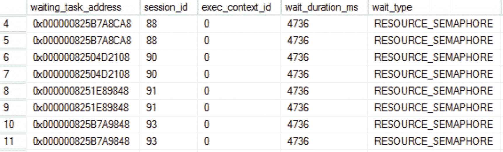

图 6-21：`sys.dm_os_waiting_tasks` DMV 中的 `RESOURCE_SEMAPHORE` 等待

由于我们将最大服务器内存设置为 250 MB，且每个查询请求 13.25 MB 内存，我们没有足够的空闲内存来授予所有请求的内存。这将导致你在图 6-21 中看到的 `RESOURCE_SEMAPHORE` 等待类型。

我们可以使用各种其他资源来分析 `RESOURCE_SEMAPHORE` 等待。资源信号量本身有其自己的 DMV，即 `sys.dm_exec_query_resource_semaphores`，它将返回有关其内存消耗、未完成和等待的授予的信息。图 6-22 显示了在运行 `Ostress` 工作负载时，针对 `sys.dm_exec_query_resource_semaphores` DMV 执行以下查询的结果：

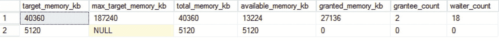

图 6-22：`sys.dm_exec_query_resource_semaphores`

```
SELECT
target_memory_kb,
max_target_memory_kb,
total_memory_kb,
available_memory_kb,
granted_memory_kb,
grantee_count,
waiter_count
FROM sys.dm_exec_query_resource_semaphores
WHERE pool_id = 2
```

我过滤掉了 `pool_id` 为 1 的资源池，因为这个池不处理用户查询。

你可能已经注意到，返回了两行数据。这是因为实际上有两个不同的资源信号量。顶部一行是“常规”资源信号量。它将处理请求超过 5 MB 内存的查询。第二行（由 `max_target_memory_kb` 列的 `NULL` 值标识）返回“小型”资源信号量的信息，它处理小于 5 MB 的查询。因为我们的查询请求了超过 5 MB 的内存，所以我们将从常规资源信号量获得内存授予。

让我们浏览一下针对 `sys.dm_exec_query_resource_semaphores` DMV 查询返回的各个列：

*   `target_memory_kb` 列返回此资源信号量计划用作其可授予查询的最大内存量的千字节数。
*   `max_target_memory_kb` 列返回此资源信号量可授予的最大内存量。
*   `total_memory_kb` 列返回资源信号量持有的总内存，是 `available_memory_kb` 和 `granted_memory_kb` 的总和。
*   `granted_memory_kb` 返回当前已授予查询的内存量。
*   `grantee_count` 和 `waiter_count` 列返回当前已满足或正在资源信号量队列中等待的授予数量。

从这些信息中我们可以看到，`granted_memory_kb` 列返回的信息是正确的，并且我们的测试查询正在请求内存授予。我们从执行计划中知道，我们的测试查询将请求 13,568 KB。由于 `grantee_count` 列显示有两个内存请求已授予，我们可以将内存请求数量乘以每个查询的内存量（2 × 13,568 KB），结果为 27,136 KB，这正是图 6-22 中显示的已授予内存量。


我们可以使用`Perfmon`通过查看`SQLServer:Memory Manager\Granted Workspace Memory (KB)`计数器来监控已授予内存的总量，如图 6-23 所示。

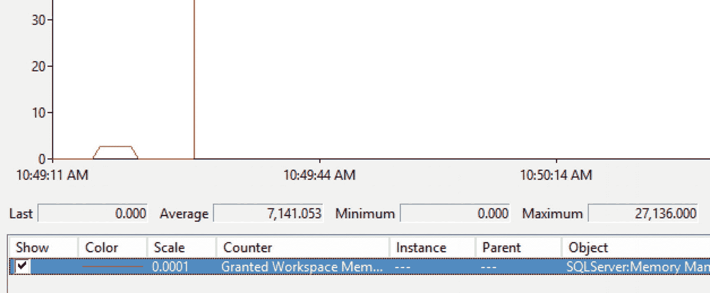

图 6-23

已授予工作区内存 (KB) Perfmon 计数器

请注意图 6-23 中的峰值，这是在我执行`Ostress`工作负载时发生的，并且与图 6-22 中的结果一样，授予的内存量为 27,136 KB。

### 降低 RESOURCE_SEMAPHORE 等待

您可以使用多种可能的方法来降低甚至解决 `RESOURCE_SEMAPHORE` 等待类型的等待时间。最显而易见的方法是增加更多内存，但这最终可能是一个昂贵的解决方案，同时存在其他不那么昂贵的选项。

第一个可能的解决方案是查看那些在执行时请求大量内存的查询。您应重点关注执行大型排序或连接（尤其是哈希连接）的查询，并检查是否可以减少需要排序或连接的行数，或者完全避免排序或连接。避免排序操作的一种方法是向执行排序的表添加索引。如果索引内的值顺序与排序操作相同，则不再需要排序操作，因为索引已经对结果进行了排序。

另一种解决方案涉及并行度。如果查询在排序或连接操作中使用了并行度，则会比串行执行查询时请求更多的内存。通过使用查询提示或更改整个 SQL Server 实例的并行度配置来修改查询使其不使用并行度，将导致执行查询所需的内存量减少。

最后，如果您运行的是 SQL Server 企业版，则可以使用资源调控器功能来配置每个资源池的内存使用量。通过配置某个资源池可以使用的内存量，您还可以设置资源信号量可以授予的内存量。本书不会详细介绍资源调控器功能，但可以在资源调控器的 MSDN 页面上找到更多信息，链接如下：[`https://msdn.microsoft.com/en-us/library/bb933866.aspx`](https://msdn.microsoft.com/en-us/library/bb933866.aspx)。

### RESOURCE_SEMAPHORE 总结

`RESOURCE_SEMAPHORE` 等待类型与查询执行某些操作（如排序和连接）所需的内存量有关。一个名为资源信号量的对象负责管理和限制查询的内存请求。如果查询请求的内存超过资源信号量可以授予的量，该内存请求将被移入资源信号量队列。当内存请求位于资源信号量队列中时，会记录 `RESOURCE_SEMAPHORE` 等待时间。有多种方法可以降低或解决 `RESOURCE_SEMAPHORE` 等待。您可以选择向 SQL Server 实例添加更多内存，或者优化查询以使排序和连接不需要那么多内存。另一个选项是使用资源调控器，您可以在其中定义资源池，以最小化大型内存请求的影响。

## RESOURCE_SEMAPHORE_QUERY_COMPILE

在上一节中，我们讨论了 `RESOURCE_SEMAPHORE` 等待类型，它表示对于某些查询操作（如排序和连接）没有足够的可用内存。与 `RESOURCE_SEMAPHORE` 等待类型类似，`RESOURCE_SEMAPHORE_QUERY_COMPILE` 等待类型也与 SQL Server 实例的内存相关。但 `RESOURCE_SEMAPHORE_QUERY_COMPILE` 等待类型表示的不是查询内存的短缺，而是查询编译过程中的内存短缺。

### 什么是 RESOURCE_SEMAPHORE_QUERY_COMPILE 等待类型？

在解释 `RESOURCE_SEMAPHORE` 等待类型时，我们讨论了什么是资源信号量及其作用。为了说明 `RESOURCE_SEMAPHORE_QUERY_COMPILE` 等待类型，我们将更深入地探讨资源信号量的内部工作原理。

您应将资源信号量视为“网关”，它们限制对内存资源的直接访问。资源信号量可以执行不同的任务。在上一节中，我们讨论了负责为某些操作（如排序和连接）授予内存的资源信号量。我们还注意到，有两种资源信号量负责授予此内存——常规资源信号量处理请求 5 MB 或更多内存的查询，小型资源信号量处理请求少于 5 MB 内存的查询。

与 `RESOURCE_SEMAPHORE_QUERY_COMPILE` 等待类型相关的资源信号量负责查询编译过程中所需的内存授予，不包括查询执行所需的内存。与上一节中的资源信号量类似，负责编译期间内存授予的资源信号量也有不同的网关。图 6-24 显示了编译内存资源信号量的不同网关。

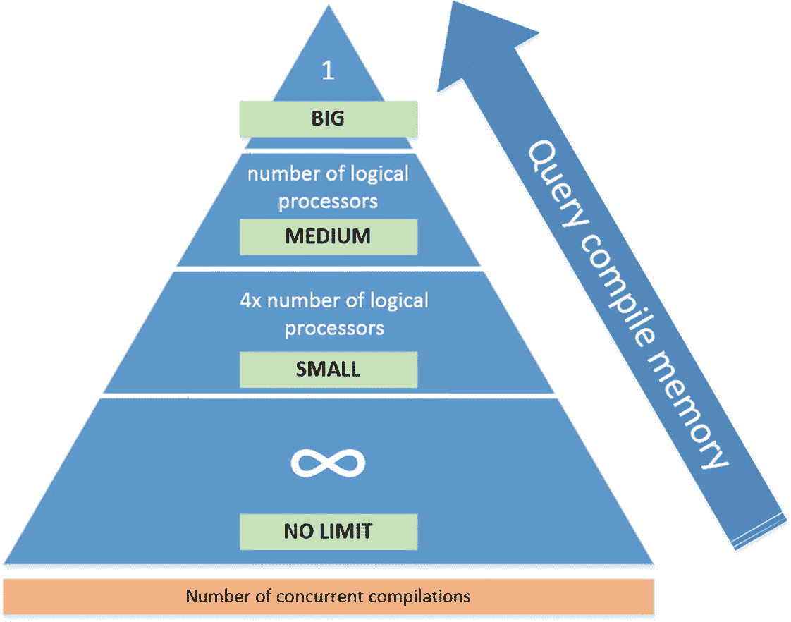

图 6-24

编译内存资源信号量

默认有三个网关：小型、中型和大型。根据查询编译所需的内存量，它将被分配到这三个网关之一。如果编译所需的内存量小于小型网关的内存阈值，则查询无需通过网关。可以同时通过网关进行并发编译或查询的数量由 SQL Server 实例可用的逻辑处理器数量计算得出。例如，如果您的 SQL Server 实例有四个逻辑处理器，则小型网关将允许 16 个并发编译，中型网关允许 4 个。大型网关始终只允许一次一个查询进行编译。

小型网关的内存阈值是静态的，但中型和大型网关的阈值是动态的。这意味着达到中型或大型网关所需的编译内存在 SQL Server 实例的运行期间可以更改。

这些网关的整个目的是确保编译内存的需求保持在可控范围内。这可以避免在许多大型编译内存请求被自动授予并耗尽 SQL Server 实例内存的情况下发生内存不足的情况。

在我们继续并查看如何从 SQL Server 内部访问网关信息之前，让我们看一个查询编译的示例。

假设我们有一个需要 1560 KB 编译内存的查询。查询将首先请求一个网关。由于我们的小型网关阈值为 370 KB，中型网关阈值为 5346 KB，该查询最终将进入小型网关。如果小型网关当前有任何查询在队列中，该查询将进入队列并等待轮到它，同时一直记录 `RESOURCE_SEMAPHORE_QUERY_COMPILE` 等待时间。在查询编译期间，会跟踪编译期间使用的内存量；如果查询最终使用更多内存并达到中型网关的阈值，它将被移动到中型网关。当查询编译完成时，它将从网关中移除。


我们可以通过在 SQL Server 内部执行 `DBCC MEMORYSTATUS` 命令来访问有关资源信号量网关的信息。在返回的大量结果中，您会找到如图 6-25 所示的网关信息。

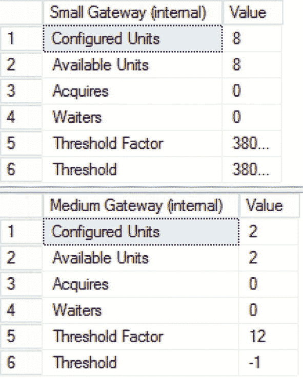

图 6-25：`DBCC MEMORYSTATUS` 命令返回的网关信息

让我们逐一查看为网关返回的结果。

`Configured Units` 行返回此网关允许的**最大并发编译数**。这取决于您的 SQL Server 实例可用的逻辑处理器数量。由于我的测试 SQL Server 有两个逻辑处理器，因此小型网关有八个插槽（4 × 逻辑处理器数），中型网关有两个。`Available Units` 行显示此网关当前可用的空闲插槽数，而 `Acquires` 行显示当前被编译任务占用的插槽数。必须等待空闲插槽数量的查询数显示在 `Waiters` 行。`Threshold` 值是查询编译为了进入网关所需的内存量（以字节为单位）。对于我的测试 SQL Server 系统，小型网关的阈值为 380,000 字节，即 371 KB。您可能会注意到，在图 6-25 中，中型网关的阈值为 -1。这是因为中型和大型网关的阈值具有动态性。由于在中型网关以下的网关没有活动，因此尚未设置阈值。

### RESOURCE_SEMAPHORE_QUERY_COMPILE 示例

为了向您展示 `RESOURCE_SEMAPHORE_QUERY_COMPILE` 等待的实例，我将使用许多并发连接来多次执行清单 6-9 中的查询。该查询是一个动态查询，从 `AdventureWorks` 数据库中连接的两个表中随机选择一行。在这种情况下，是否返回任何结果并不重要——我们这里试图实现的是制造编译内存争用。

```sql
DECLARE @ID VARCHAR(250)
DECLARE @SQL VarChar(MAX)
SET @ID = FLOOR(RAND()*(20000-1)+1);
SET @SQL =
'
SELECT
' + @ID + ',
SUM(soh.SubTotal),
COUNT(soh.SubTotal)
FROM sales.SalesOrderHeader soh
INNER JOIN person.Person p
ON soh.SalesPersonID = p.BusinessEntityID
WHERE p.BusinessEntityID = ' + @ID + '
'
EXEC (@SQL)
```
清单 6-9：`RESOURCE_SEMAPHORE_QUERY_COMPILE` 等待查询

在我们使用许多并发连接执行查询之前，让我们检查一下需要多少编译内存。我们可以通过在 SQL Server Management Studio 中执行清单 6-9 中的查询并启用实际执行计划来做到这一点。

执行查询并打开实际执行计划后，我们需要查看 `CompileMemory` 属性。您可以通过显示“属性”窗口（视图 ➤ 属性窗口）或按 F4 并选择 SELECT 运算符来访问这些属性。图 6-26 显示了我的测试 SQL Server 上的实际执行计划属性。

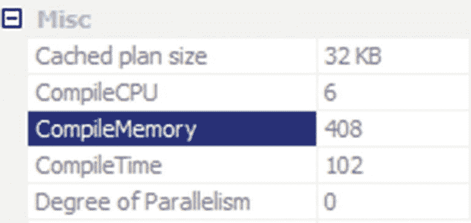

图 6-26：杂项执行计划属性

`CompileMemory` 属性返回的值是以 KB 表示的所需编译内存量。此查询需要 408 KB 进行编译。我的测试 SQL Server 上小型网关的阈值是 371 KB，因此我相当确定该查询将访问小型网关。

我们将再次使用 Ostress 实用程序生成所需的并发连接来执行该查询。我将查询保存到 `resource_semaphore_compile.sql` 文件，然后使用该文件作为以下 Ostress 命令的输入。因为查询执行非常快，我让每个连接执行它 100 次，这样我们就有些时间来查看等待统计信息。

```bash
"C:\Program Files\Microsoft Corporation\RMLUtils\ostress.exe" -E -dAdventureWorks -i"C:\resource_semaphore_compile.sql" -n200 -r100 -q
```

几秒钟后，在 `sys.dm_os_waiting_tasks` DMV 中可以看到许多 `RESOURCE_SEMAPHORE_QUERY_COMPILE` 等待，如图 6-27 所示。

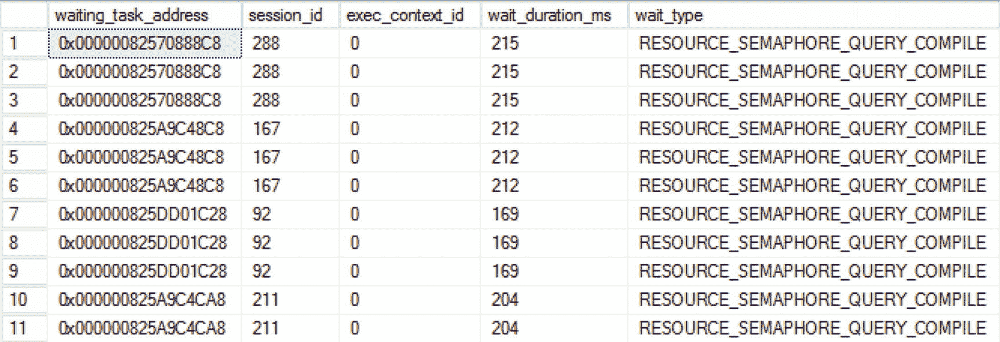

图 6-27：`RESOURCE_SEMAPHORE_QUERY_COMPILE` 等待

如果我们现在执行 `DBCC MEMORYSTATUS` 命令，我们应该能够找出编译争用发生在哪个网关。图 6-28 显示了我的测试 SQL Server 上 `DBCC MEMORYSTATUS` 命令的网关输出。

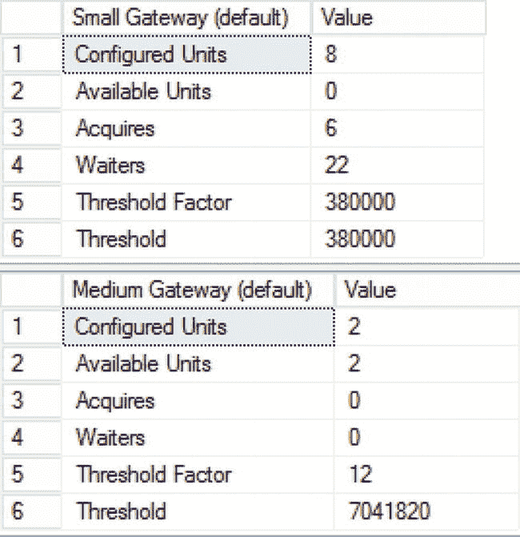

图 6-28：编译争用期间的 `DBCC MEMORYSTATUS`

如图 6-28 所示，如果我们查看 `Available Units` 的数量，会发现没有可用的插槽留给新的编译内存请求。实际上，我们有 22 个编译内存请求在资源信号量队列中等待。另请注意，中型网关的 `threshold` 现在已从 -1 更改为 7,041,820 字节（6876 KB）。由于争用现在发生在较低级别的网关上，即使没有编译内存请求由该网关处理，中型网关的阈值也被动态确定了。


### 降低 RESOURCE_SEMAPHORE_QUERY_COMPILE 等待时间

在很多情况下，你可以用来降低 `RESOURCE_SEMAPHORE_QUERY_COMPILE` 等待类型等待时间的方法，与降低或解决 `RESOURCE_SEMAPHORE` 等待的方法是相同的。与 `RESOURCE_SEMAPHORE` 等待类型类似，`RESOURCE_SEMAPHORE_QUERY_COMPILE` 等待类型也与内存相关，因此，如果你能增加用于查询编译的总可用内存，就很有可能降低或解决 `RESOURCE_SEMAPHORE_QUERY_COMPILE` 的等待时间。然而，增加内存在很多情况下是最后手段。

由于我们可以使用 `DBCC MEMORYSTATUS` 命令访问有关处理编译内存的资源信号量门控的非常具体的信息，一个良好的第一步是分析这些门控的使用模式。如果你注意到某个特定门控持续存在等待的内存请求，那么该门控的内存阈值，或者说所允许的最大并发编译内存请求数量，应该能为你提供一些关于根本原因的线索。例如，如果你在大型门控（该门控一次只允许一个查询）处注意到许多排队的编译内存请求，那么导致你出现 `RESOURCE_SEMAPHORE_QUERY_COMPILE` 等待时间的源头，可能是那些请求大量编译内存的查询。另一个原因可能是大量并发查询都需要访问小型门控——这正是我们示例中的情况，从而导致在门控处形成队列。

在这些情况下，你应该找出导致门控处队列的具体查询，并尝试优化它们，方法是减少其编译内存需求量，或者确保减少编译发生的次数。后者可以通过确保你的查询被正确参数化来实现。每次执行时都生成即席计划的查询，可能是导致 `RESOURCE_SEMAPHORE_QUERY_COMPILE` 等待的原因，特别是当它们被执行得非常频繁且并发时。SQLskills 的 Jonathan Kehayias 撰写了一篇优秀的博客文章，讲解如何查询计划缓存以检测高编译时间的语句；文章位于 [`www.sqlskills.com/blogs/jonathan/identifying-high-compile-time-statements-from-the-plan-cache/`](http://www.sqlskills.com/blogs/jonathan/identifying-high-compile-time-statements-from-the-plan-cache/) 。使用 Jonathan 博客文章中的脚本应能帮助你检测那些需要大量编译内存的查询。

如果你的 SQL Server 正处于内存压力之下，也可能看到 `RESOURCE_SEMAPHORE_QUERY_COMPILE` 等待的发生。这种情况的发生是由于中型和大型门控的动态编译内存阈值所致。如果 SQL Server 处于内存压力之下，这两个门控的阈值都会降低，从而给予更多查询使用中型或大型门控的机会。但由于中型和大型门控允许的并发编译数量较少，在小型门控中，可用的并发槽位会更快地被填满。

与 `RESOURCE_SEMAPHORE` 等待类型一样，你可以使用资源调控器将工作负载拆分到特定的资源池中。每个资源池将拥有自己的资源信号量，负责授予编译内存，从而可以将繁重的编译内存使用情况分散到多个资源池中。

### RESOURCE_SEMAPHORE_QUERY_COMPILE 总结

就像为特定查询操作授予内存请求所需的资源信号量一样，也存在用于访问编译内存的资源信号量。这些资源信号量通过使用门控来调节对编译内存的访问。当一个查询被编译时，它会根据其所需的编译内存数量来接近一个门控。然后，该门控可以授予所请求的编译内存，或者如果有更多请求并发地想要访问该门控，则将该请求放入队列。当一个查询在其中一个队列中等待时，就会记录下 `RESOURCE_SEMAPHORE_QUERY_COMPILE` 等待类型。

解决或降低 `RESOURCE_SEMAPHORE_QUERY_COMPILE` 等待时间通常通过释放更多内存或降低查询的编译内存需求来实现。

## SLEEP_BPOOL_FLUSH

`SLEEP_BPOOL_FLUSH` 等待类型与 SQL Server 内部的检查点过程直接相关。检查点进程负责将缓冲池中已修改的（或“脏的”）数据页写入磁盘上的数据库数据文件。因此，除了与检查点过程有密切关系外，`SLEEP_BPOOL_FLUSH` 等待也与你的存储子系统的性能有关。如果我们在 SQL Server 联机丛书中搜索 `SLEEP_BPOOL_FLUSH` 等待类型的定义，微软将其描述为“当检查点正在限制新 I/O 的发出以避免淹没磁盘子系统时”发生。

看到 `SLEEP_BPOOL_FLUSH` 等待发生是相当普遍的，并且通常它们并不表示存在问题。然而，在某些情况下，`SLEEP_BPOOL_FLUSH` 等待可能指示与检查点过程或存储子系统相关的性能问题。


### 什么是 `SLEEP_BPOOL_FLUSH` 等待类型？

为了更好地理解 `SLEEP_BPOOL_FLUSH` 等待类型是如何被记录的，我们需要了解 SQL Server 内部检查点进程的工作原理。

检查点进程是 SQL Server 的一个内部进程，负责将缓冲区缓存中已修改（脏）的页面写入数据库数据文件。这样做的主要原因之一是为了在发生意外故障时加快数据库的恢复速度。当发生意外故障时，SQL Server 需要将数据库恢复到故障发生前的状态。它将通过使用事务日志的内容来重做或撤销对数据页面所做的更改来实现这一点。如果数据页面已被修改，但更改尚未写入数据库数据文件，SQL Server 将需要重做对该数据页面的更改。如果检查点已将更改的数据页面写入数据库数据文件，则此步骤就不再需要，这会加快数据库的恢复过程，因为 SQL Server 知道数据已被写入数据库数据文件。图 6-29 展示了数据页面被修改时发生的（简化）过程。

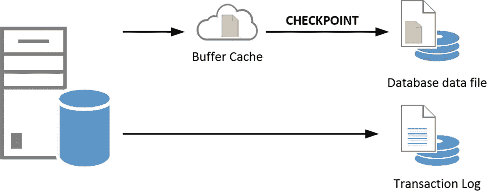

图 6-29：数据修改过程

当一个已提交的事务修改数据页面时，首先发生的事情是更改将被记录在事务日志中（首先在日志缓冲区中，然后如 `WRITELOG` 和 `LOGBUFFER` 等待类型部分所述写入磁盘）。对数据页面的修改将在缓冲区缓存中进行，并且该数据页面将被标记为脏（红色页面图标）。当发生检查点时（可能有多种原因，我们稍后会讨论），自上一个检查点以来所有被标记为脏的数据页面都将被写入存储子系统上的物理数据库数据文件，无论创建这些脏页面的事务状态如何（绿色页面图标）。

检查点进程由 SQL Server 自动执行，大约每分钟一次，这是 SQL Server 2016 之前低版本的默认 `recovery interval`（恢复间隔）。这并不意味着检查点会精确地每分钟发生一次。你可以为 `recovery interval` 指定的值是检查点应发生的时间上限，检查点进程会分析未完成的 I/O 请求和延迟；并限制检查点操作以避免使存储子系统过载。

以下列表将描述 SQL Server 中可用的各种检查点类型：

-   内部检查点类型不可配置，在执行某些操作时会自动发生；例如，数据库备份。
-   自动：这些是默认的检查点，在 SQL Server 2016 之前的版本中，当保持其默认值 0 时，大约每分钟发生一次。我们可以通过在 SQL Server Management Studio 的“服务器属性 ➤ 数据库设置”页面下更改 `recovery interval` 配置选项来更改检查点进程的间隔。我们只能将其更改为分钟值，并且它将用于 SQL Server 实例中的所有数据库。
-   手动：你可以通过发出 `CHECKPOINT` T-SQL 命令手动触发检查点。你还可以选择指定检查点必须完成的时间（以秒为单位）。如果你确实发出了手动检查点，它将在当前数据库的上下文中运行。例如，在查询窗口中执行 `CHECKPOINT 10` 将在执行查询后的 10 秒内执行一次检查点。
-   间接：SQL Server 2012 增加了一个额外的选项，用于在每个数据库级别配置检查点间隔。将此选项配置为大于默认值 0 的值将覆盖特定数据库的自动检查点进程。你可以使用以下命令为特定数据库启用间接检查点：`ALTER DATABASE [数据库名称] SET TARGET_RECOVERY_TIME = [以秒或分钟为单位的时间]`。

随着 SQL Server 2016 的发布，间接检查点成为检查点进程的新默认设置（值为 60）。

如前所述，如果 SQL Server 认为有必要，它将尝试限制检查点进程以避免使存储子系统过载。它会监控存储子系统的未完成请求数量，并尝试检测是否存在任何延迟。利用这些信息，它将限制检查点进程产生的 IO 量，以避免对存储子系统造成过重的负载。当检查点进程受到限制时，就会记录 `SLEEP_BPOOL_FLUSH` 等待类型。


### SLEEP_BPOOL_FLUSH 示例

以下示例展示了 `SLEEP_BPOOL_FLUSH` 等待类型对早于 SQL Server 2016 版本的影响。如前所述，在 SQL Server 2016 中，SQL Server 处理 `检查点` 过程的方式发生了变化，这意味着在如下示例中该等待类型出现的可能性要小得多。

生成 `SLEEP_BPOOL_FLUSH` 等待相对简单，清单 6-10 中的脚本（与我们用于 `LOGBUFFER` 和 `WRITELOG` 等待类型的脚本几乎相同）将对检查点过程施加压力，从而导致 `SLEEP_BPOOL_FLUSH` 等待发生。

```sql
USE trans_demo
GO
DECLARE @i INT
SET @i = 1
WHILE @i < 100
BEGIN
INSERT INTO transactions
(t_guid)
VALUES
(newid())
SET @i = @i + 1
-- 在 1 秒内强制执行一个检查点
CHECKPOINT 1
END
```
清单 6-10
生成 `SLEEP_BPOOL_FLUSH` 等待

由于我们也使用了与 `LOGBUFFER` 和 `WRITELOG` 等待类型示例中相同的数据库，清单 6-11 展示了如果该数据库尚不存在则创建它的脚本。

```sql
USE master
GO
-- 创建演示数据库
CREATE DATABASE [trans_demo]
ON PRIMARY
(
NAME = N'trans_demo', FILENAME = N'D:\Data\trans_demo.mdf' , SIZE = 153600KB , FILEGROWTH = 10%
)
LOG ON
(
NAME = N'trans_demo_log', FILENAME = N'D:\Log\trans_demo.ldf' , SIZE = 51200KB , FILEGROWTH = 10%
)
GO
-- 确保恢复模式设置为完整
ALTER DATABASE [trans_demo] SET RECOVERY FULL
GO
-- 首先执行完整备份
-- 否则完整恢复模式将不会生效
BACKUP DATABASE [trans_demo]
TO  DISK = N'F:\Backup\trans_demo_Full.bak'
GO
-- 创建一个简单的测试表
USE trans_demo
GO
CREATE TABLE transactions
(
t_guid VARCHAR(50)
)
GO
```
清单 6-11
创建 `trans_demo` 数据库

清单 6-10 中的脚本将执行的操作是：在一个执行 100 次的循环中，向 `transactions` 表插入一个随机的 GUID。每次插入一个新的 GUID 后，它都会发出一个时间限制为 1 秒的 `CHECKPOINT` 命令。这会强制检查点过程在 1 秒的时间限制内执行一次检查点。

在运行清单 6-10 中的脚本之前，我使用 `DBCC SQLPERF('sys.dm_os_wait_stats', CLEAR)` 命令清空了 `sys.dm_os_wait_stats` DMV。

在我的测试 SQL Server 上，该脚本在近 70 秒后完成。然后我执行了以下查询来查看 `SLEEP_BPOOL_FLUSH` 等待时间：

```sql
SELECT *
FROM sys.dm_os_wait_stats
WHERE wait_type = 'SLEEP_BPOOL_FLUSH';
```

查询结果如图 6-30 所示。

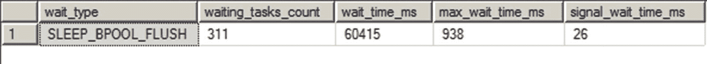

图 6-30
`SLEEP_BPOOL_FLUSH` 等待

如你所见，运行清单 6-10 中的脚本后，`SLEEP_BPOOL_FLUSH` 等待时间非常高。通常，你会期望这些等待时间要么很低，要么接近于零。如果我们完全从脚本中移除 `CHECKPOINT` 命令，让 SQL Server 自行决定何时运行检查点过程，我们不仅会得到如图 6-31 所示的完全不同的结果，而且脚本的运行时间也会减少到仅仅几毫秒。


图 6-31
移除 `CHECKPOINT` 后的 `SLEEP_BPOOL_FLUSH` 等待时间

### 降低 SLEEP_BPOOL_FLUSH 等待

尽管由 `SLEEP_BPOOL_FLUSH` 等待类型引起的性能问题并不常见，但有多种方法可以降低等待时间。

最明显的方法是检查可用的各种配置选项，以手动配置我们之前讨论过的 `恢复间隔`。`恢复间隔` 的值越低，检查点过程发生的频率就越高，遇到 `SLEEP_BPOOL_FLUSH` 等待的可能性也就越大。此外，正如你在示例中注意到的那样，在事务中执行频繁的 `CHECKPOINT` 命令也可能导致 `SLEEP_BPOOL_FLUSH` 等待。

另一个可能的原因是数据库数据文件所在的存储子系统。如前所述，检查点过程会分析存储子系统的负载，然后决定是否需要限制其吞吐量。如果因为存储子系统繁忙而频繁需要限制，你更有可能看到 `SLEEP_BPOOL_FLUSH` 等待发生。

如果你运行的是 SQL Server 2016，很可能永远不会遇到非常高的 `SLEEP_BPOOL_FLUSH` 等待时间，因为 SQL Server 处理此过程的默认方式已经改变。

### SLEEP_BPOOL_FLUSH 总结

`SLEEP_BPOOL_FLUSH` 等待类型与 SQL Server 中的检查点过程密切相关。检查点过程负责将缓冲区缓存中已修改的（或脏的）数据页写入数据库数据文件。检查点过程在将脏页写入磁盘之前会分析存储子系统的性能，如果存储子系统繁忙，检查点过程将限制其吞吐量，从而导致 `SLEEP_BPOOL_FLUSH` 等待。看到非常高的 `SLEEP_BPOOL_FLUSH` 等待时间并不常见，但它们仍然可能影响性能。频繁执行 `CHECKPOINT` T-SQL 命令的查询，或配置得非常低的 `恢复间隔`，都可能是看到 `SLEEP_BPOOL_FLUSH` 等待发生的原因。存储子系统的性能也可能影响检查点过程，如果它被迫限制其吞吐量的话。

## WRITE_COMPLETION

与 `ASYNC_IO_COMPLETION` 和 `IO_COMPLETION` 等待类型类似，`WRITE_COMPLETION` 等待类型与 SQL Server 在存储子系统上执行的特定操作相关。同样，在你的 SQL Server 实例上看到 `WRITE_COMPLETION` 等待发生是非常正常的，只有当等待时间远高于正常水平时才应引起关注。

### 什么是 WRITE_COMPLETION 等待类型？

`WRITE_COMPLETION` 等待类型是 `IO_COMPLETION` 等待类型的近亲。但是，`IO_COMPLETION` 等待类型是为特定的读写操作记录的，而 `WRITE_COMPLETION` 等待类型仅针对一些非常特定的写操作记录。其中一些写操作包括扩展数据或日志文件，或者执行 `DBCC CHECKDB` 命令。

由于 `WRITE_COMPLETION` 等待类型与将 SQL Server 数据写入存储子系统有关，因此存储子系统的性能会对其等待时间产生影响。


### WRITE_COMPLETION 等待示例

为了向你展示一个 `WRITE_COMPLETION` 等待发生的例子，我将使用 `DBCC SQLPERF('sys.dm_os_wait_stats', CLEAR)` 命令清除 `sys.dm_os_wait_stats` DMV 后，对 `AdventureWorks` 数据库执行一次 `CHECKDB`。

请记住，此示例是 `WRITE_COMPLETION` 等待可能发生的完全正常情况，它不应阻止你执行常规的数据库一致性检查！

清单 6-12 展示了我为生成一些 `WRITE_COMPLETION` 等待而执行的查询。

```sql
DBCC SQLPERF('sys.dm_os_wait_stats', CLEAR);
DBCC CHECKDB ('AdventureWorks');
SELECT * FROM sys.dm_os_wait_stats
WHERE wait_type = 'WRITE_COMPLETION';
```
**清单 6-12** 生成 WRITE_COMPLETION 等待

批处理中最后一个查询的结果如图 6-32 所示。


**图 6-32** WRITE_COMPLETION 等待

如你所见，等待时间量非常低，不会引起任何担忧。这部分也是由于 `AdventureWorks` 数据库非常小，并且我的测试机存储性能非常快。对更大的数据库运行 `CHECKDB` 可能会导致更高的等待时间。

### 降低 WRITE_COMPLETION 等待

如果你看到 `WRITE_COMPLETION` 等待时间很高，尝试找出是哪个进程导致了这些等待。在许多情况下，这可能是由 `CHECKDB` 或数据库数据/日志文件增长引起的。

一个值得检查的事情是本章前面在 `ASYNC_IO_COMPLETION` 部分讨论的即时文件初始化选项。不使用此选项可能会影响 `WRITE_COMPLETION` 等待时间的持续时间。

另一个导致 `WRITE_COMPLETION` 等待时间较高的、远不常见的原因是当你在页面空闲空间页（或 PFS）上遇到页面闩锁争用时。PFS 页跟踪数据页中的空闲空间量。如果一个进程需要非常频繁地修改 PFS 页，就有可能看到 `WRITE_COMPLETION` 等待与许多 `PAGELATCH_UP` 等待一起发生，我们将在第 9 章“与闩锁相关的等待类型”中讨论。为了给你这样一个场景的例子，考虑大量并发查询，它们都创建一个临时表，插入几行，然后再次删除临时表。在这种情况下，`tempdb` 数据库的 PFS 页需要非常频繁地更新以反映临时表的创建和删除。

### WRITE_COMPLETION 总结

`WRITE_COMPLETION` 等待类型，就像 `ASYNC_IO_COMPLETION` 和 `IO_COMPLETION` 等待类型一样，与 SQL Server 执行的特定存储相关操作有关。看到 `WRITE_COMPLETION` 等待是非常正常的，在许多情况下不会引起担忧。诸如 `CHECKDB` 和数据库数据/日志文件增长等操作可能导致 `WRITE_COMPLETION` 等待。

