# 7. 与备份相关的等待类型

备份是数据库管理中非常重要的一部分，在许多情况下，它们对你所在公司的生存至关重要。数据对业务变得如此重要，如果某些灾难导致数据丢失，公司可能会损失大量资金，甚至倒闭。

我们可以在 IT 基础架构的各个层面实施许多方法，以确保在灾难期间数据不会丢失（或尽可能少丢失）。我们可以实施 SAN 以确保我们的数据不存储在服务器的本地磁盘驱动器上。或者我们可以设计 SQL Server AlwaysOn 可用性组以跨数据中心复制我们的数据。但我们应该采取，并且希望已经采取的第一步，是在我们的 SQL Server 数据库内执行定期备份。

实施和安排 SQL Server 备份不是一项非常困难的任务，没有理由不执行备份。备份的类型和备份操作的间隔由你所工作的组织的需求决定，并通常以“RTO”（恢复时间目标）和“RPO”（恢复点目标）时间表示。这些时间代表从灾难中恢复所需的时间量以及灾难发生时可接受的数据丢失量。这两个时间应该是你 SQL Server 备份策略的主要输入。

值得庆幸的是，SQL Server 开箱即用提供了不同的选项来满足 RTO 和 RPO 要求。这意味着我们可以使用 SQL Server 自己的备份机制来满足我们公司的 RTO 和 RPO 时间；我们不一定依赖第三方备份软件。由于 SQL Server 备份操作是一个内部过程，因此与之关联了不同的等待类型，在本章中，我们将查看与执行备份和还原直接相关的三种最常见的等待类型。

注意到这些备份/还原相关等待类型上的高等待时间，不太可能导致 SQL Server 实例的性能下降。但是，我们确实可以选择优化 SQL Server 备份过程，从而缩短备份和还原时间。由于数据库的备份/还原对你公司的生存至关重要，优化备份和还原吞吐量非常值得付出努力。

## BACKUPBUFFER

我们将讨论的第一个与备份相关的等待类型是 `BACKUPBUFFER`。如果我们在在线手册上查找此等待类型的定义，会得到以下文本：“当备份任务正在等待数据，或正在等待存储数据的缓冲区时发生。此类型不常见，除非任务正在等待磁带装载。” 显然，我们只会在将备份写入磁带设备时看到这种等待类型，但这是错误的。无论备份文件的目标是什么，在备份操作期间实际上总是会记录 `BACKUPBUFFER` 等待。原因在于 SQL Server 备份操作使用缓冲区从数据库读取数据并将其写入备份文件的方式。


### 什么是 `BACKUPBUFFER` 等待类型？

要理解 `BACKUPBUFFER` 等待是如何产生的，我们需要深入了解 SQL Server 备份过程的内部机制。无论您使用何种备份方法（即事务日志备份、差异备份或完整备份），这些内部机制基本相同，因此它们会遇到相同的等待类型。

SQL Server 为备份进程分配缓冲区。这些缓冲区将被来自数据库的数据填充，并在备份/还原过程中移动，以便写入备份文件（对于还原操作则相反）。缓冲区在系统内存中分配，但位于缓冲区缓存内存之外，以避免从缓冲区缓存中窃取内存。备份缓冲区的大小和数量由 SQL Server 自动计算，但我们也可以将这些值作为备份/还原命令的参数自行配置。图 7-1 展示了这些备份缓冲区如何通过一个“读取器”（从数据库或备份文件读取数据到缓冲区）和一个“写入器”（将数据从缓冲区写入备份文件或数据库）进行排序和移动。

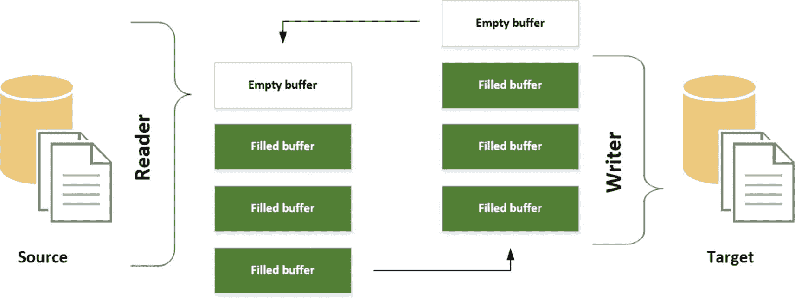

我们可以通过启用两个跟踪标志 `3213` 和 `3605` 来查看备份或还原操作期间有关缓冲区数量和大小的信息，这两个标志会将备份/还原信息输出到 SQL Server 错误日志中。清单 7-1 中的查询启用了这两个跟踪标志，并对我的测试 SQL Server 上的 `AdventureWorks` 数据库执行了一次完整备份。

```
-- 启用跟踪标志
DBCC TRACEON (3213);
DBCC TRACEON (3605);
-- 备份数据库
BACKUP DATABASE [AdventureWorks]
TO  DISK = N'F:\Backup\aw_21042015.bak'
WITH NAME = N'AdventureWorks-Full Database Backup';
GO
-- 禁用跟踪标志
DBCC TRACEOFF (3213);
DBCC TRACEOFF (3605);
清单 7-1
使用备份信息跟踪标志执行完整数据库备份
```

请记住，SQL Server 内部的跟踪标志只应在 Microsoft 支持人员的指导下使用。我现在启用它们是为了在我的测试 SQL Server 上显示备份信息，但我建议不要在生产系统上使用它们。

在 SQL Server 错误日志中，记录了有关我们刚刚执行的备份的附加信息，如图 7-2 所示。

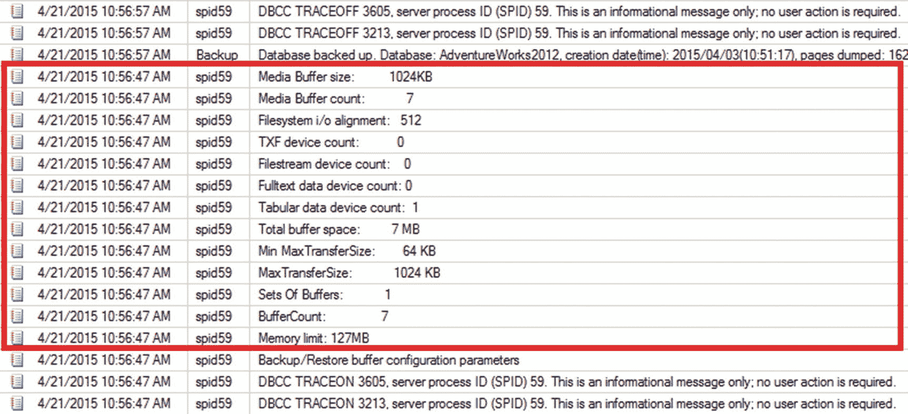

在这种情况下，备份操作创建了七个缓冲区（由 `BufferCount` 参数显示），每个缓冲区大小为 1024 KB（由 `MaxTransferSize` 参数显示）。创建缓冲区所需的总内存由 `Total buffer space` 参数显示，为 7 MB (`BufferCount` * `MaxTransferSize`)。返回的另一个有趣信息是 `memory limit`。这将显示备份操作可以访问的、位于缓冲区缓存之外的最大内存量。

现在我们对 SQL Server 内部的备份过程有了概念，让我们来看看 `BACKUPBUFFER` 等待类型是在哪里出现的。

正如我们之前描述的那样，SQL Server 备份过程使用缓冲区来存储需要写入备份文件的数据。每当没有可用的缓冲区时，就会发生 `BACKUPBUFFER` 等待，使进程等待，直到一个已满的缓冲区被写入备份文件并再次可用。

### `BACKUPBUFFER` 示例

产生 `BACKUPBUFFER` 等待非常简单——只需执行一次备份操作即可。对于此示例，我运行了清单 7-2 中显示的查询。该查询将首先重置 `sys.dm_os_wait_stats` DMV，然后对 `AdventureWorks` 数据库执行完整备份，最后返回 `BACKUPBUFFER` 等待类型的等待统计信息。

```
-- 清除 sys.dm_os_wait_stats
DBCC SQLPERF('sys.dm_os_wait_stats', CLEAR);
-- 备份数据库
BACKUP DATABASE [AdventureWorks]
TO DISK = N'F:\Backup\aw_21042015.bak'
WITH
NAME = N'AdventureWorks-Full Database Backup';
GO
-- 查询 BACKUPBUFFER 等待
SELECT *
FROM sys.dm_os_wait_stats
WHERE wait_type = 'BACKUPBUFFER';
清单 7-2
生成 BACKUPBUFFER 等待
```

对 `sys.dm_os_wait_stats` DMV 查询的结果如图 7-3 所示。


在我的测试 SQL Server 上，备份操作的总持续时间约为 1 秒。在这 1 秒中，只有 88 毫秒是花在等待空闲备份缓冲区上。

### 降低 `BACKUPBUFFER` 等待

正如本章引言所述，与备份相关的等待通常无需担心，因为它们通常不会影响 SQL Server 实例的性能。然而，我们可以利用各种备份相关等待类型的等待统计信息来提高备份性能。

降低 `BACKUPBUFFER` 等待时间的最常用方法之一是为备份操作添加更多缓冲区，覆盖自动分配。我们可以通过在 `BACKUP` T-SQL 命令中指定 `BUFFERCOUNT` 选项来实现这一点。然而，更改备份操作可使用的缓冲区数量有一个问题。创建的每个缓冲区都将分配 `MAXTRANSFERSIZE` 选项的值；此值可由 SQL Server 自动计算，或由您自己在 `BACKUP` 命令中设置（最大为 4,194,304 字节）。由于备份操作在缓冲区缓存之外分配内存，使用过多或过大的缓冲区可能会导致内存不足问题。因此，在测试您的 SQL Server 实例的最佳值时要小心。

清单 7-3 展示了对清单 7-2 中查询的修改，我们用它来演示发生的 `BACKUPBUFFER` 等待。在这个案例中，我们添加了 `BUFFERCOUNT` 选项并将其配置为 200。

```
-- 清除 sys.dm_os_wait_stats
DBCC SQLPERF('sys.dm_os_wait_stats', CLEAR);
-- 备份数据库
BACKUP DATABASE [AdventureWorks]
TO DISK = N'F:\Backup\aw_21042015.bak'
WITH
NAME = N'AdventureWorks-Full Database Backup',
BUFFERCOUNT = 200;
GO
-- 查询 BACKUPBUFFER 等待
SELECT *
FROM sys.dm_os_wait_stats
WHERE wait_type = 'BACKUPBUFFER';
清单 7-3
配置了 BUFFERCOUNT 的数据库备份
```

对 `sys.dm_os_wait_stats` DMV 查询的结果如图 7-4 所示。


如您所见，花在 `BACKUPBUFFER` 等待上的时间减少到了 0 毫秒，而我们未提供 `BUFFERCOUNT` 参数时是 88 毫秒。之所以发生这种情况，是因为我们指定的缓冲区数量足以处理备份操作，无需分配额外的缓冲区。由于不需要额外的缓冲区，我们就不需要花时间等待它们的分配。

另一个选项是在 `BACKUP` T-SQL 命令中配置 `MAXTRANSFERSIZE` 选项。这将允许缓冲区以更大的工作单位进行填充，最高可达 4,194,304 字节，即 4 MB。同样，为缓冲区分配更多空间将导致保留更大的内存。


### BACKUPBUFFER 等待类型概述

`BACKUPBUFFER` 等待通常在备份或恢复操作期间发生，当备份/恢复操作需要等待可用的空闲缓冲区时就会出现。由于这是正常现象，因此无需担忧。我们确实有一些选项可以减少 `BACKUPIO` 等待时间，但这也会对备份/恢复操作的持续时间产生影响。不过，这些参数需要经过仔细配置和测试，因为设置得过高可能会导致内存不足错误。

## BACKUPIO

与 `BACKUPBUFFER` 等待类型类似，`BACKUPIO` 等待类型在备份或恢复操作的某个部分遇到争用问题时发生。另一个相似之处是 Books Online 上对该等待类型的描述：“当备份任务正在等待数据，或正在等待用于存储数据的缓冲区时发生。此类型并不典型，除非任务正在等待磁带挂载。” 同样，在执行备份或恢复操作时，即使备份目标或恢复源不是磁带设备，这种等待类型也很常见。

### 什么是 BACKUPIO 等待类型？

为了更好地理解 `BACKUPIO` 等待是如何产生的，我们需要查看图 7-5，该图先前作为图 7-1 展示过。


图 7-5：备份操作的内部机制

在之前讨论 `BACKUPBUFFER` 等待类型的部分，我们解释了 `BACKUPBUFFER` 等待类型发生在我们等待一个空闲（空）缓冲区可用时。在很大程度上，`BACKUPBUFFER` 等待类型位于图 7-5 的左侧，即读取器部分。而 `BACKUPIO` 等待类型主要发生在图 7-5 的右侧，即写入器部分。当 `BACKUPIO` 等待发生时，意味着写入器在写入数据时出现了延迟。这种延迟可能由多种原因引起；例如，将备份写入速度较慢的磁盘、将备份写入网络位置，或者在还原数据库时。

在执行数据库备份或还原时，`BACKUPIO` 等待类型经常会伴随着 `ASYNC_IO_COMPLETION` 等待。

### BACKUPIO 示例

我们可以使用与演示 `BACKUPBUFFER` 等待类型相同的示例。我对查询做了一点修改，以返回 `BACKUPIO` 等待而不是 `BACKUPBUFFER` 等待，并且在对 `sys.dm_os_wait_stats` DMV 的查询结果中包含了 `ASYNC_IO_COMPLETION`。清单 7-4 显示了修改后的备份查询。

```sql
-- 清除 sys.dm_os_wait_stats
DBCC SQLPERF('sys.dm_os_wait_stats', CLEAR);
BACKUP DATABASE [AdventureWorks]
TO DISK = N'F:\Backup\aw_21042015.bak'
WITH
NAME = N'AdventureWorks-Full Database Backup';
GO
-- 查询 BACKUPIO 等待
SELECT *
FROM sys.dm_os_wait_stats
WHERE wait_type = 'BACKUPIO'
OR wait_type = 'ASYNC_IO_COMPLETION';
清单 7-4: 生成 BACKUPIO 等待
```

对 `sys.dm_os_wait_stats` DMV 的查询结果如图 7-6 所示。

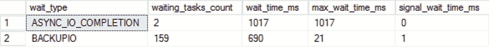

图 7-6：ASYNC_IO_COMPLETION 和 BACKUPIO 等待

如图 7-6 所示，数据库备份导致了这两种等待类型的产生，大部分时间都花费在了 `ASYNC_IO_COMPLETION` 等待上，该等待负责读取需要写入备份文件的数据页。由于我的备份目标在 SSD 磁盘上，因此我们没有遇到非常高的 `BACKUPIO` 等待时间。

### 减少 BACKUPIO 等待

调整 `BUFFERCOUNT` 和 `MAXTRANSFERSIZE` 选项对 `BACKUPIO` 等待类型的影响不如它们对 `BACKUPBUFFER` 等待类型的影响那么大。当你看到 `BACKUPIO` 等待类型的等待时间高于正常水平时，问题很可能与存储子系统的吞吐量或你正在写入/读取备份的网络位置有关。务必检查这两个位置是否存在潜在的性能问题，例如高延迟或网络利用率过高。

### BACKUPIO 概述

与 `BACKUPBUFFER` 等待类型类似，`BACKUPIO` 等待类型在执行备份或恢复操作时发生。`BACKUPBUFFER` 等待类型主要与备份操作访问备份缓冲区的速度有关，而 `BACKUPIO` 等待类型则与这些备份缓冲区写入磁盘的速度有关。在执行完整数据库备份或还原时，`BACKUPIO` 等待经常与 `ASYNC_IO_COMPLETION` 等待同时出现。当看到 `BACKUPIO` 等待类型的等待时间高于正常水平时，请检查你写入或读取备份文件位置的性能指标。减少 `BACKUPIO` 等待时间不会影响系统的查询性能，但将有助于加快备份和还原操作的速度。

## BACKUPTHREAD

`BACKUPTHREAD` 等待类型在对数据库执行还原操作时经常出现，但在备份操作期间也可能发生。当另一个线程正在等待备份/还原操作完成以便继续处理时，就会发生这种等待。

### 什么是 BACKUPTHREAD 等待类型？

当你看到 `BACKUPTHREAD` 等待发生时，意味着另一个线程想要访问当前正被备份或还原操作占用的资源。在线程必须等待备份/还原完成的期间，将记录 `BACKUPTHREAD` 等待时间。此类等待的一个例子是，当数据库数据文件正在被还原时，一个线程想要访问它；例如，`ASYNC_IO_COMPLETION` 等待类型正在将数据文件写入磁盘。

`BACKUPTHREAD` 等待通常不是引起关注的原因。它们只是表明其他线程正在等待备份/还原操作完成，并且它们的持续时间通常与你的备份或还原完成所需的时间相同。然而，如果等待时间超出预期，它们确实会给你一个提示，表明可能存在其他值得调查的等待。

因为一图胜千言，图 7-7 展示了 `BACKUPTHREAD` 等待类型与还原操作以及其他正在发生的等待之间的关系。

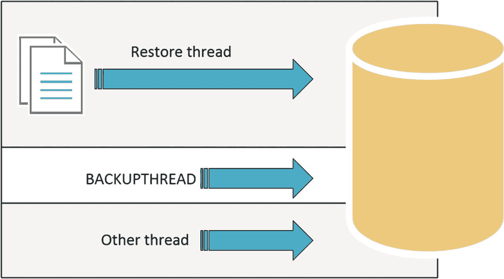

图 7-7：BACKUPTHREAD 与其他线程的关系

在图 7-7 中，你可以看到 `BACKUPTHREAD` 等待正在发生，因为另一个线程也想要访问一个当前正由还原操作拥有的资源。


### BACKUPTHREAD 示例

演示 `BACKUPTHREAD` 等待发生的一个简单方法是执行还原操作。当您执行还原时，其他进程将需要访问数据库数据文件，以将备份文件中的信息写入数据库数据文件。

清单 7-5 展示了一个脚本，用于还原我之前在测试 SQL Server 上为 `AdventureWorks` 数据库制作的备份文件。

```sql
-- Restore database
USE [master]
RESTORE DATABASE [AdventureWorks]
FROM DISK = N'F:\Backup\AWBackup.bak'
WITH  FILE = 1, REPLACE;
GO
```

清单 7-5
还原 AdventureWorks 数据库

如果在备份运行期间查看 `sys.dm_os_waiting_tasks` DMV，我们会看到发生的等待，如图 7-8 所示，该图显示了我测试 SQL Server 上的一部分等待。

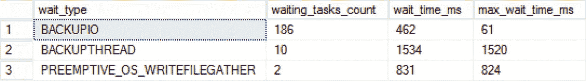

图 7-8
BACKUPTHREAD 及其他等待

如图 7-8 所示，`BACKUPTHREAD` 等待类型的等待时间与 `PREEMPTIVE_OS_WRITEFILEGATHER` 等待类型非常接近。此等待类型负责将数据写入文件系统，但我们将在第 11 章 “抢占式等待类型” 中更深入地探讨此特定等待类型。

### 降低 BACKUPTHREAD 等待

虽然 `BACKUPTHREAD` 等待类型本身并不表示任何问题，但它与其他等待类型的结合可能是一些额外研究的原因。基本上，任何可以用来加速备份或恢复过程的方法都会对 `BACKUPTHREAD` 等待时间产生影响。

一些好的起点是可以在 `BACKUP` 和 `RESTORE` T-SQL 命令上指定的 `BufferCount` 和 `MaxTransferSize` 选项。我们在讨论 `BACKUPBUFFER` 和 `BACKUPIO` 等待类型时曾涉及这些设置。调整这些设置可以使您的备份和还原花费更少的时间，从而导致更低的 `BACKUPTHREAD` 等待时间。

另一个可以显著改善备份和还原时间的设置是即时文件初始化选项，我们在第 6 章 “与 I/O 相关的等待类型” 的 `ASYNC_IO_COMPLETION` 部分讨论过。

### BACKUPTHREAD 总结

`BACKUPTHREAD` 等待时间并不表示对特定资源的访问，而是表示另一个进程正在等待备份或还原操作完成。看到这种等待类型非常常见，尤其是在还原操作期间。减少备份和还原操作的持续时间也会反映在 `BACKUPTHREAD` 等待类型的等待时间中。您可以用来降低 `BACKUPTHREAD` 等待时间的方法之一是检查是否启用了即时文件初始化。此设置不会直接影响 `BACKUPTHREAD` 等待类型，但它会影响其他等待类型，进而影响 `BACKUPTHREAD` 等待时间。

## 8. 与锁相关的等待类型

锁定是每个关系数据库或关系数据库管理系统（RDBMS）的基本组成部分。SQL Server 基于关系数据库模型，因此在访问数据时使用锁定。尽管我们经常将锁定与性能问题联系起来，但它在确保数据在并发工作负载期间的可靠性方面起着至关重要的作用。SQL Server 或任何其他 RDBMS 处理这种数据可靠性的方式是通过遵循 “ACID” 属性，这些属性最初由 Jim Gray 在 1970 年代定义，但在 1983 年由 Andreas Reuter 和 Theo Härder 命名。这些 ACID 属性被强制执行于单一操作上，即我们所知的事务。首字母缩写词 ACID 包含了保证事务内部数据可靠性的四个特征。以下列表描述了这些特征中的每一个：

*   原子性：原子性特征要求事务是全有或全无的。这意味着如果事务的一部分失败，则整个事务失败，并且在事务内完成的所有更改都需要回滚到事务开始之前的状态。
*   一致性：一致性特征要求事务写入数据库的数据是合法的。这意味着数据必须剔除非法或不良的输入。
*   隔离性：隔离性特征要求每个事务对其他并发事务是不可见的。从事务的角度来看，这意味着每个事务都是串行执行的。
*   持久性：持久性特征要求每个已提交的事务保持已提交状态，即使在发生电源故障或灾难时也是如此。

正如您可能从阅读不同的 ACID 属性中猜到的那样，SQL Server 中的锁定与隔离性特征密切相关。

由于本章专门讨论与锁相关的等待类型，除了隔离性之外，我们不会详细介绍 ACID 属性。如果您有兴趣了解更多关于 ACID 属性和数据库理论的知识，一个很好的起点是 Andreas Reuter 和 Theo Harder 的研究论文 “Principles of Transaction-Oriented Database Recovery”，其中详细描述了 ACID 属性。

为了更好地理解隔离性特征的工作原理，我们需要理解事务。一个事务代表与数据库的一次交互，可以包含多个操作，并且与其他事务分离。

为了确保我们的事务不会与其他并发事务冲突，SQL Server 使用锁。这些锁确保没有其他事务可以修改您的事务正在同时处理的数据。例如，如果您从银行账户中提取 100 美元，您不希望另一个并发的提取操作修改该金额。其他事务必须等待其提取操作，直到您的事务完成。在 SQL Server 内部，这个过程的工作方式相同。当您从数据库请求数据时，您希望获得您所请求的数据返回，而没有数据在您请求时被修改的风险。

当您运行事务时，它将受到 SQL Server 在您正在访问的对象上放置的锁的保护。如果另一个事务想要与同一对象交互，则会发生阻塞。当发生阻塞时，后一个事务将必须等待，直到对象上的锁被移除。然后，该事务可以在对象上放置自己的锁并开始其交互。

在 SQL Server 中，我们有许多可用选项来控制锁定和阻塞的行为，其中大多数与更改针对数据库的某些或所有事务的隔离级别有关。在 SQL Server 内部，我们也可以访问大量关于锁定和阻塞的信息，其中非常重要的一部分就在等待统计中。事务等待访问锁定对象的时间被记录为特定的、与锁相关的等待类型的等待时间（取决于事务打算放置的锁的类型）。

在本章中，我们将讨论与锁定和阻塞相关的各种等待类型，以及如何降低或甚至解决它们。这需要一些关于 SQL Server 如何使用锁的知识，因此我专门包含了一节内容，让我们在深入研究锁等待类型之前熟悉锁定和阻塞。

## 锁与阻塞简介

正如我们刚才讨论的，SQL Server 使用锁来隔离不同的并发事务，使得数据在任一时刻仅被一个事务访问或修改。SQL Server 可以使用多种锁类型，或称为锁模式，并且可以对不同级别的对象放置锁。更为复杂的是，不同的锁模式之间不一定兼容，当两个不兼容的锁相遇时，就会发生阻塞。

### 锁模式与兼容性

首先，让我们熟悉一下 SQL Server 内部的不同锁类型，或称锁模式。下面的列表描述了最常见的锁模式。SQL Server 内部还有更多的锁模式，但它们仅在执行非常特定的操作时才会出现。所有不同锁模式的完整列表可以在 MSDN 上讨论锁模式的页面找到：[`https://technet.microsoft.com/en-us/library/ms175519.aspx`](https://technet.microsoft.com/en-us/library/ms175519.aspx)。SQL Server 使用缩写来指示正在使用的锁模式。这些缩写显示在括号中：

*   共享 (`S`)：当查询从某个资源中选择数据时，将在该资源上放置共享锁。例如，执行 `SELECT * FROM [table]`。

*   更新 (`U`)：更新锁模式用于查询想要修改资源时。引入它是为了防止“死锁”，即在并发事务中，多个锁相互等待释放以修改同一资源的情况。

*   排他 (`X`)：当事务想要修改资源时，会放置排他锁。当排他锁就位时，其他事务无法修改该资源。例如，`INSERT`、`UPDATE` 或 `DELETE` T-SQL 语句将导致排他锁。

*   架构 (`Sch`)：架构锁在表被修改时使用。例如向表中添加一列。

*   意向 (`I`)：意向锁用于表示在锁层次结构的较低级别已经放置了锁。我们稍后会详细讨论锁层次结构。

当不同的锁需要相互交互时，SQL Server 会对涉及的锁模式执行锁兼容性检查。并非所有的锁模式都彼此兼容，这意味着当两个不同的事务因为锁不兼容而无法同时访问资源时，就会发生阻塞。例如，当放置共享锁来读取一行时，另一个事务想要通过放置排他锁来修改该行，则排他锁将必须等待，直到共享锁被移除。表 8-1 显示了共享、更新和排他锁模式的锁模式兼容性。

表 8-1 锁兼容性

| 锁模式 | 共享 | 更新 | 排他 |
| --- | --- | --- | --- |
| **共享** | 是 | 是 | 否 |
| **更新** | 是 | 否 | 否 |
| **排他** | 否 | 否 | 否 |

让我们通过一个例子来说明锁兼容性。假设你想通过针对某个表执行 `SELECT` 语句来读取其中一行。当你执行查询时，SQL Server 会检查你想要访问的行上是否已存在任何锁，以及该锁是否与你想要放置在该行上的锁兼容。假设在你运行查询时没有锁存在。这种情况下，将在该行上放置一个共享锁，表明你的查询正在从该行读取数据。在你执行查询之后，另一个用户发起了另一个事务，想要修改你正在访问的行中的数据。SQL Server 将检测到该行上已存在一个共享锁，这使得第二个事务在放置其排他锁之前需要等待，因为共享锁和排他锁不兼容。运行第二个事务的用户可能会遇到延迟，因为该事务正在等待共享锁被移除，然后才能放置其排他锁。如果启动了第三个事务，想要读取与你事务相同的行，则不会发生锁冲突。共享锁与其他共享锁是兼容的，这意味着第三个事务无需等待即可放置其锁，并且直接获得它请求的结果。

图 8-1 展示了这个例子，其中虚线表示必须等待的不兼容锁。

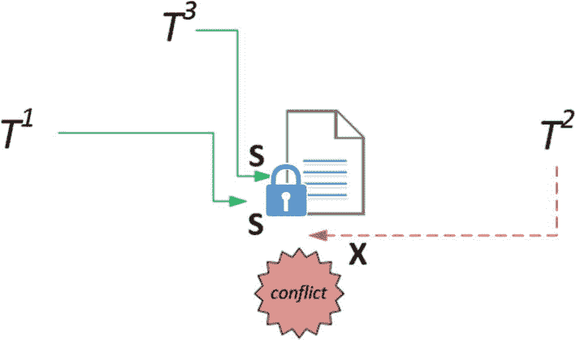
图 8-1 并发锁情况

### 锁层次结构

SQL Server 使用多粒度锁机制，允许为不同级别的对象放置不同的锁。这样做是为了最小化锁的开销成本。可以放置锁的最低级别的对象是行，最大的是数据库。在这两个粒度级别之间有许多级别，SQL Server 自动决定应在哪个级别放置锁以最小化锁开销。以下列表显示了最常见的锁级别，从最高粒度到最小粒度排序：

*   数据库

*   数据库文件

*   表/对象

*   区

*   页

*   `RID`（堆中的行）/`KEY`（聚集索引中的行）

我们之前讨论的意向锁在在不同的粒度级别上放置锁也起着重要作用。SQL Server 会在较高粒度级别的对象上放置意向锁，以指示已在较低级别放置了锁。这保护了较低级别的锁免受较高级别对象上更改的影响。从最高粒度级别到对象上的实际锁，所有放置的意向锁一起查看时，被称为锁层次结构。

图 8-2 展示了修改行内数据的锁层次结构的图形表示，这将需要在行上放置排他锁，并在层次结构的更高层级放置意向排他锁。

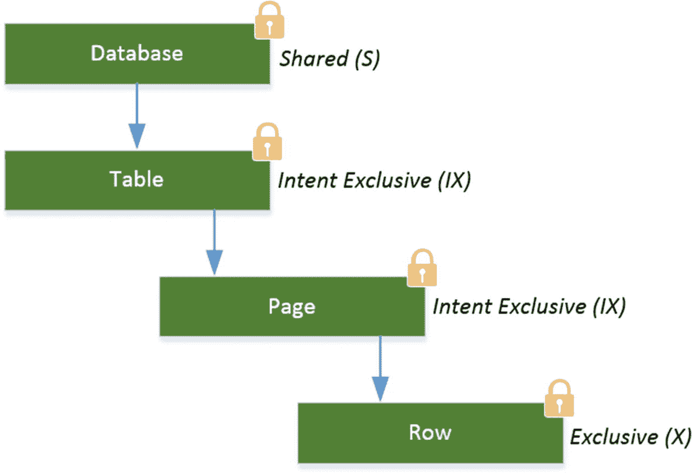
图 8-2 锁层次结构示例

请注意数据库级别的共享锁。每个请求总是会放置一个共享锁，以在事务活动时保护数据库免受更改。这确保了，例如，你无法在事务仍处于活动状态时删除数据库。另请注意，意向锁将在最低级别的对象上使用相同的锁模式，在本例中是意向排他锁 (`IX`)。如果放置了共享锁，意向锁的锁模式也会相应改变，在本例中变为意向共享锁 (`IS`)。我们将在本章后面更深入地探讨意向锁。


### 隔离级别

我们可以通过更改隔离级别来控制事务放置的锁的类型。隔离级别定义了在并发操作期间事务彼此隔离的程度。我们可以在连接或事务基础上更改隔离级别。更改隔离级别只会更改共享锁的行为；数据修改所需的排他锁不受影响。更改隔离级别还会引入某些现象。这些现象会影响读取事务的结果，并且是因为事务期间放置和持有共享锁的方式发生变化而产生的。以下列表按从最低到最高的顺序显示了 SQL Server 中可用的各种隔离级别以及与之相关的现象：

#### Read Uncommitted（未提交读）
此隔离级别允许在另一个事务正在修改同一对象时进行读取。它不会等待对象上的排他锁被释放。这使得可以读取未提交的值，称为“脏读”。脏读可能很糟糕（如果您不期望它们的话），因为它们可能返回数据库中不再最新的值。例如，如果有人正在将值从“A”更新为“B”，而其他用户在同一时间查询相同数据，可能会得到旧值“A”而不是更新后的“B”值。

#### Read Committed（已提交读）
这是 SQL Server 中的默认隔离级别。使用此隔离级别将使读取事务等待，直到并发的写入事务完成。将在行上放置一个共享锁，并在读取该行后立即释放。与此隔离级别相关的现象称为“不一致分析”。这意味着如果数据在两次读取事务之间的时间被另一个事务修改，那么相同的读取查询可能会得到不同的结果。

#### Repeatable Read（可重复读）
将隔离级别设置为可重复读会锁定事务正在读取的行。但是，可重复读不会在读取行后释放共享锁，而是会一直持有该锁，直到整个事务完成。可重复读可能允许“幻读”发生。幻读发生在另一个事务添加或更改了尚未被读取事务锁定的数据时。

#### Serializable（可序列化）
可序列化隔离级别是您可以使用的最高可能隔离级别，这意味着它会放置最多的锁，以确保您读取的数据在事务运行期间不会被修改。它通过锁定您正在选择的数据的整个范围（例如，整个表）来实现这一点，使得无法更改该数据。由于您正在选择的整个数据范围在事务开始时就被锁定，因此不可能出现任何现象。

SQL Server 2005 添加了另一种用于隔离事务的方法，称为行版本控制。行版本控制使用数据修改的版本，并将它们返回给读取查询而不会导致阻塞。当事务修改数据时，该更改将被记录为一个版本。当读取事务访问相同数据时，它将收到在修改事务提交之前的更改版本。有关行版本控制的更多信息可以在在线手册中找到：[`https://technet.microsoft.com/en-us/library/ms189050.aspx`](https://technet.microsoft.com/en-us/library/ms189050.aspx)。

由于隔离级别及其锁定行为可能很复杂，我添加了图 8-3，它显示了各种隔离级别在读取操作期间实现锁定的方式。方框代表表中的行，带有锁的行表示该行上有一个活动的共享锁。

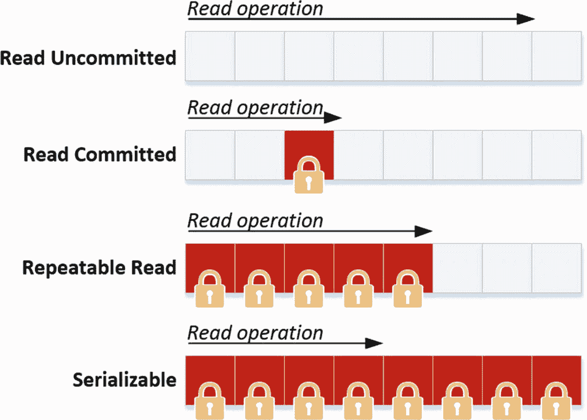

图 8-3：隔离级别和锁定行为

您希望使用与默认的 Read Committed 不同的隔离级别有各种原因。在许多情况下，这些原因与您预期工作负载产生的锁/阻塞量，或者您的事务返回的数据应该有多“正确”有关。例如，在默认的 Read Committed 隔离级别下，其他事务有可能在您的事务运行时修改数据，这意味着事务结束时的结果与事务开始时不同。为了确保在您的事务运行时没有数据可以更改，您可以使用 Serializable 隔离级别，但这意味着需要放置和维护更多的锁，从而在并发 SQL Server 环境中导致更多的阻塞。

我们只能通过专门为连接配置不同的隔离级别或提供表提示（一个例外是快照隔离，它是在数据库级别配置的）来更改默认的 Read Committed 隔离级别。例如，下面的两个查询展示了两种不同的方法来执行使用 Read Uncommitted 隔离级别的查询。第一个查询为整个会话设置事务隔离级别：

```
SET TRANSACTION ISOLATION LEVEL READ UNCOMMITTED
GO
BEGIN TRANSACTION
SELECT *
FROM Person.Person
COMMIT TRANSACTION;
GO
```

另一种方法是使用表提示将隔离级别设置为 Read Uncommitted：

```
SELECT *
FROM Person.Person
WITH (READUNCOMMITTED);
```

这两种方法都将达到相同的效果，但请记住，为会话设置隔离级别将导致在此之后在该特定会话中执行的所有查询都使用选定的隔离级别。


### 查询锁信息

若要查看当前已放置的锁，我们可以使用 `sys.dm_tran_locks` 这个动态管理视图。此 DMV 会为 SQL Server 实例中的每一个活动锁返回一行记录，其中包含锁的类型、资源类型、放置该锁的会话 ID，以及该锁是已授予还是正在等待被放置等信息。图 8-4 展示了我的测试 SQL Server 机器上该 DMV 输出的一小部分内容。
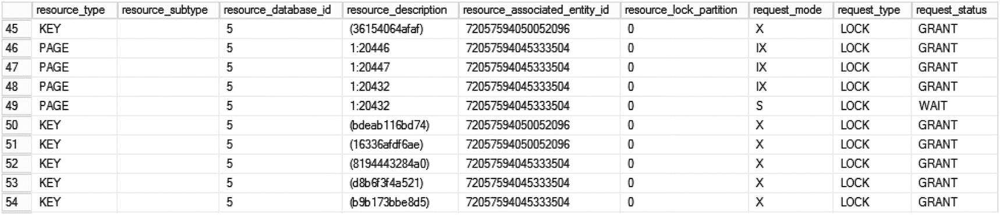
图 8-4. `sys.dm_tran_locks` 输出

如果我们看一下图 8-4，可以看到多个排他锁已被授予并放置在键锁级别。这意味着一个事务当前正在修改聚集索引内的数据。在键锁级别之上的页面级别还有一个意向排他锁，这表明在层次结构的下方存在一个排他锁。另外请注意，一个共享锁当前正等待在同一数据页 (`1:20432`) 上被放置。该锁还不能被授予，因为存在一个不兼容的意向排他锁。

由于共享锁必须等待才能放置到数据页上，我们可以通过查看等待统计信息来观察它已经等待了多久。图 8-5 显示了针对 `sys.dm_os_waiting_tasks` DMV 进行查询的部分结果。
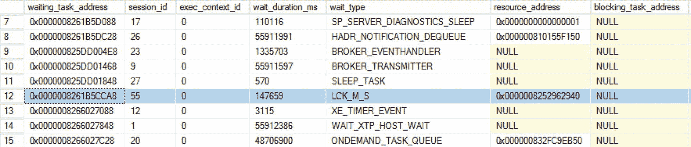
图 8-5 `sys.dm_os_waiting_tasks` 中的锁信息

通过使用 `sys.dm_os_waiting_tasks` DMV，我们可以看到会话 ID 55 当前正在等待一个名为 `LCK_M_S` 的资源。这代表一个共享锁资源类型。会话 ID 55 当前被会话 ID 53 阻塞，而会话 ID 53 恰好就是那个在会话 ID 55 试图查询的对象上放置了排他锁和意向排他锁的会话。`sys.dm_os_waiting_tasks` DMV 还会返回一些信息，这些信息可以用作 `sys.dm_tran_locks` DMV 的输入。此信息将位于 `sys.dm_os_waiting_tasks` DMV 的 `resource_description` 列中，如图 8-6 所示。
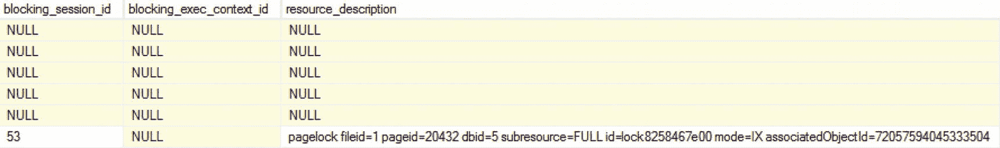
图 8-6 阻塞期间 `sys.dm_os_waiting_tasks` DMV 的 `resource_description` 列

如果我们复制 `associatedObjectID` 并将其用作针对 `sys.dm_tran_locks` DMV 的 `WHERE` 子句的输入，我们将获得更多关于此任务为什么等待以及在等待什么的信息。以下查询将检索 `sys.dm_tran_locks` DMV 中所有 `resource_associated_entity_id` 为 `72057594045333504` 的行：
```sql
SELECT *
FROM sys.dm_tran_locks
WHERE resource_associated_entity_id = ' 72057594045333504';
```
在我的测试 SQL Server 上，该查询返回了 32 个锁，其中 26 个是聚集索引中行上的排他锁；还有多个数据页上的意向排他锁，以及一个等待被放置到页面上的共享锁。这个等待中的共享锁就是 `sys.dm_os_waiting_tasks` DMV 所返回的那个锁。部分结果显示在图 8-7 中。
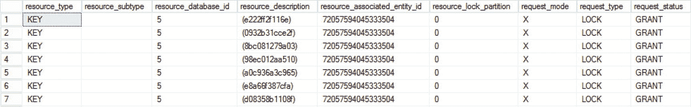
图 8-7 来自 `sys.dm_tran_locks` 的锁信息

在锁和阻塞发生很多的系统上，通过查询 `sys.dm_tran_locks` DMV 来查找锁信息并弄清楚谁在阻塞谁可能是一个挑战，因为该 DMV 会为每一个放置的锁返回一行。另一种更简单的方法来分析锁和阻塞是使用 Adam Machanic 创建的 `sp_WhoIsActive` 存储过程。此存储过程将返回当时正在运行的所有内容的信息，是分析性能问题的绝佳工具。通过一些额外的参数，它还会返回丰富的锁信息，而无需你自己连接各种 DMV。你可以从其网站 [`http://whoisactive.com/downloads/`](http://whoisactive.com/downloads/) 下载 `sp_WhoIsActive`。

为了向你展示 `sp_WhoIsActive` 存储过程的例子，我在我的测试 SQL Server 遭遇阻塞问题时运行了它。最基本的方法是直接执行它：
```sql
EXEC sp_WhoIsActive;
```
图 8-8 显示了结果的一小部分。还有许多其他可用的列，可以向你显示额外信息，例如阻塞会话的会话 ID。
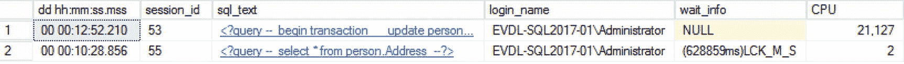
图 8-8 `sp_WhoIsActive` 默认结果

我们可以直接识别等待统计信息以及此时正在执行的查询。因为 `blocking_session_id` 列对于 `SELECT` 查询返回了会话 ID 55，我们应该查看由会话 ID 55 执行的查询正在做什么。通过单击 `sql_text` 列内的查询链接，我们可以查看整个查询文本，如图 8-9 所示。
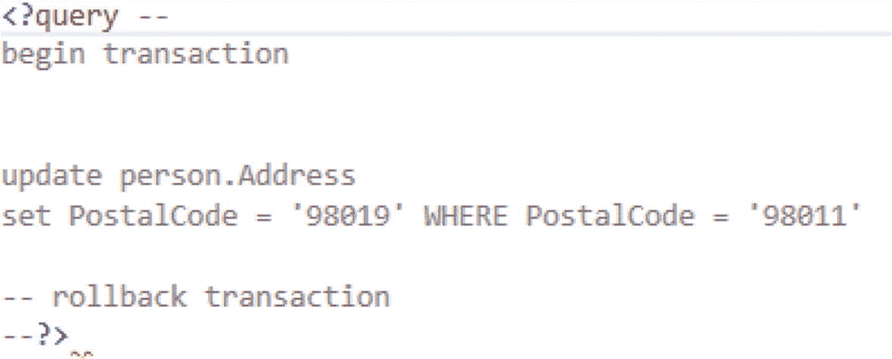
图 8-9 来自 `sp_WhoIsActive` 的 `sql_text` 输出

在这个特定案例中，我们可能可以相当快地解决阻塞问题。造成阻塞的查询让其事务保持打开状态，而没有执行 `COMMIT` 或 `ROLLBACK`。只要一个事务保持打开，锁就会被保持而不释放。

`sp_WhoIsActive` 存储过程还有一个参数可以返回额外的锁信息，包括有关锁层次结构的信息。下面的查询将执行 `sp_WhoIsActive` 存储过程并为当前正在执行的查询检索额外的锁信息：
```sql
EXEC sp_WhoIsActive @get_locks=1;
```
图 8-10 显示了添加到 `sp_WhoIsActive` 输出中的新列。
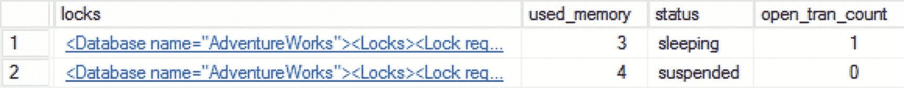
图 8-10 `sp_WhoIsActive` 返回的锁信息

通过单击 `locks` 列下方的链接，我们可以查看正在使用哪些锁以及它们放置在哪些对象上。这还将让我们很好地了解此特定查询所使用的锁层次结构。图 8-11 显示了图 8-10 中第一个返回查询的额外锁信息。
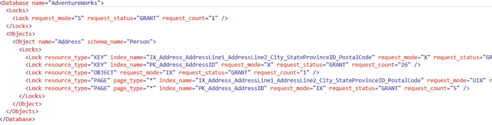
图 8-11 `sp_WhoIsActive` 返回的额外锁信息

在这里，我们看到在 `OBJECT` 级别放置了一个意向排他锁，这意味着在 XML 模式的 `Object name` 字段中显示的对象上放置了一个锁——本例中是 `Address`，这是一个表。再下一级，在页面级别，我们还看到在 `Address` 表的两个不同索引内有两个意向排他锁。在底层，我们看到排他锁，它们放置在 `KEY` 对象上，这表示索引中的行。

`sp_WhoIsActive` 存储过程还有许多其他可用的参数，每一个都会返回关于 SQL Server 各个部分的更多信息。这使得 `sp_WhoIsActive` 存储过程成为了解 SQL Server 实例内部情况的一个极好工具，我鼓励你尝试一下。

既然我们已经讨论了锁和阻塞的许多方面，从锁模式和层次结构到分析锁和阻塞，我们应该准备好去了解一下 SQL Server 中与锁相关的等待类型了。请记住，这个关于锁和阻塞的介绍远非该主题的完整指南，因为深入探讨 SQL Server 内部锁和并发的工作原理本身就足以写成一本书。

## LCK_M_S

第一个与锁相关的等待类型是 `LCK_M_S` 等待类型。此等待类型表示一个任务正在等待在某个资源上放置共享锁。

### 什么是 LCK_M_S 等待类型？

`LCK_M_S` 等待类型表明一个任务正在或已经等待在某个资源上放置共享锁。需要理解的是，只有当发生某种形式的阻塞时，你才会看到这种等待类型，因为任务正在等待放置共享锁。这并不意味着资源上有一个活动的共享锁。这对于每一个与锁相关的等待类型都是成立的，因为它们只在发生阻塞情况时才会被记录。

由于 `LCK_M_S` 等待类型与共享锁相关，它会在执行读取操作但因我们想要读取的资源上已存在不兼容的锁而必须等待时发生。我们能够放置共享锁之前所等待的时间，会被记录为 `LCK_M_S` 等待类型的等待时间。

图 8-12 展示了一个通常会导致 `LCK_M_S` 等待发生的常见情况。在这种情况下，T1 已在一个页面上放置了独占锁，表示正在进行数据修改。当 T2 想要从该页面读取数据时，它需要放置一个共享锁，但由于独占锁和共享锁不兼容，因此发生了 `LCK_M_S` 等待。

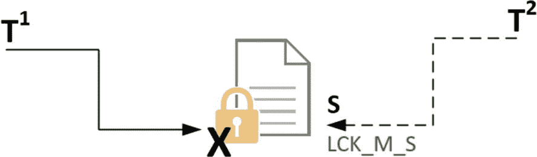

图 8-12
LCK_M_S 等待正在发生

### LCK_M_S 示例

创建一个 `LCK_M_S` 等待发生的例子并不困难，因为我们只需要在数据修改查询和数据读取查询之间制造一个阻塞情况。

在这个例子中，我们将针对 `AdventureWorks` 数据库运行清单 8-1 中所示的查询。此查询将启动一个事务并修改几行数据，但不会提交或回滚该事务。由于我们通过提供 `BEGIN TRAN` 显式地指定了此事务，SQL Server 将保持锁不变，直到我们显式执行 `COMMIT` 或 `ROLLBACK` 命令。

```
BEGIN TRAN
UPDATE Sales.SalesOrderDetail
SET CarrierTrackingNumber = '4E0A-4F89-AD'
WHERE SalesOrderID = '43661';
清单 8-1
启动一个修改事务
```

当我们执行查询时，会很快收到结果；在我的例子中，有 15 行被更新。但正如我之前所说，事务尚未完成，因此它将保持运行状态，在其修改的对象上保留锁。

到目前为止，我们并未引起任何阻塞，因为这是一个测试 SQL Server，没有其他查询在运行。让我们改变这一点，制造一个阻塞情况。

为此，我们将在 SQL Server Management Studio 中打开第二个窗口，并执行清单 8-2 中所示的查询。这将仅对 `Sales.SalesOrderDetail` 表执行一个 `SELECT` 操作，也就是我们当前正在修改数据的同一张表。

```
SELECT *
FROM AdventureWorks.Sales.SalesOrderDetail;
清单 8-2
从正在执行修改操作的表中选择数据
```

一旦我们运行这个 `SELECT` 查询，就会注意到没有结果返回，并且查询会一直运行。这是一个典型的阻塞操作示例，其中一个事务正在修改另一个事务中我们想要读取的数据。

如果我们查询 `sys.dm_os_waiting_tasks` DMV，就能够看到 `LCK_M_S` 等待类型，如图 8-13 所示。


图 8-13
LCK_M_S 等待正在发生

`LCK_M_S` 等待得以解决的唯一方式是移除不兼容的锁。在这个案例中，我们回滚了在第一个 SQL Server Management Studio 窗口中启动的修改事务。我们通过在同一个会话窗口中运行 `ROLLBACK` 命令来完成此操作。在执行事务回滚后，我们立即收到了 `SELECT` 查询请求的结果。查询 `sys.dm_os_waiting_tasks` 也显示 `LCK_M_S` 等待已解决。

### 减少 LCK_M_S 等待

看到 `LCK_M_S` 等待发生并不一定意味着出了问题。然而，它确实表明有阻塞正在发生。如果你注意到 `LCK_M_S` 等待类型的等待时间很长，这意味着某人的读取事务当前需要很长时间才能完成，因为它必须等待放置共享锁。因此，第一步将是识别导致阻塞的查询。我们可以通过使用 `sys.dm_os_waiting_tasks` DMV 并查看 `blocking_session_id` 列来实现。当只有一个活动的阻塞时，这样做相对快速，但当许多并发查询被其他事务阻塞时，情况可能会变得复杂。在这种情况下，我们必须沿着阻塞链追踪，直到找到头阻塞者（即对象上的第一个锁）。另一个选择是使用我们在本章开头“锁和阻塞介绍”中讨论过的 `sp_WhoIsActive` 存储过程。此存储过程将为你遍历阻塞链，直接显示头阻塞者。

找到导致阻塞发生的查询后，我们需要对其进行分析，看看是否可以优化该查询。也许它请求的锁比实际需要的多，因此需要很长时间才能完成。优化该查询的一种方法是查看是否应添加任何索引，以便需要锁定的行更少。或者，你可以将单个事务拆分为多个事务，每个事务访问更少的对象。另一个可能导致比必要更多锁的潜在问题是过时的统计信息。统计信息用作查询计划的输入，如果它们不能准确反映表或索引的内容，可能会导致不良的查询计划，进而可能导致比必要的更多的锁。

另一个选择是更改读取事务的隔离级别，这样就不需要共享锁来读取数据。例如，将隔离级别设置为未提交读（Read Uncommitted）将不放置共享锁，读取事务也就不会被阻塞。这确实引入了另一个与隔离级别相关的问题，即脏读，我们在本章的“锁和阻塞介绍”部分讨论过。除了使用未提交读，你还可以使用快照隔离（Snapshot Isolation），这将导致更少的共享锁，但不会引起脏读。快照隔离确实会给 TempDB 数据库带来更大的负载，因为如果许多并发事务正在修改数据，它必须维护数据的版本。

### LCK_M_S 总结

当某个资源上正在放置一个不兼容的锁，而另一个事务想要在同一资源上放置共享锁时，就会发生 `LCK_M_S` 等待类型。看到 `LCK_M_S` 等待类型意味着事务正在被阻塞。你应该尝试识别哪些查询导致了阻塞的发生，并查看是否可以优化这些查询以产生更少的锁或持续时间更短的锁。作为最后的手段，你可以选择更改读取事务的隔离级别，尽管这确实会带来其他副作用，例如脏读或 TempDB 内部负载的增加。

## LCK_M_U

`LCK_M_U` 等待类型与使用更新（U）模式的锁相关。当一个任务想要在某个资源上放置更新锁，但该资源上已存在一个不兼容的锁时，就会发生 `LCK_M_U` 等待。


## LCK_M_U

### 什么是 LCK_M_U 等待类型？

更新锁是一种特殊的锁模式，表示即将发生数据修改。尽管其名称可能让人以为它仅与 `UPDATE` 查询相关，但更新锁也可能在执行 `INSERT` 或 `DELETE` 语句时出现。

更新锁的存在主要是为了防止发生死锁。死锁指的是两个事务都试图修改同一个对象，并无限期地等待对方释放资源上的独占锁。要理解死锁是如何发生的，以及更新锁如何防止这种情况，请看以下未使用更新锁时可能发生的情形。

当两个并发事务想要修改同一个对象时，两个事务首先会在其打算修改的数据所在位置放置一个共享锁。由于共享锁与其他共享锁是兼容的，两个事务不会相互阻塞。当其中一个事务找到需要修改的数据时，它会将其共享锁转换为独占锁，此时问题就会出现。由于共享锁与独占锁不兼容，并且另一个事务也在该资源上持有共享锁，因此共享锁无法转换为独占锁。该事务需要等待另一个事务的共享锁被移除后，才能将其自己的共享锁转换为独占锁，但另一个事务也想将其共享锁转换为独占锁，最终两个事务都会无限期地相互等待，从而形成死锁。SQL Server 会自动检测死锁情况，并选择其中一个事务作为牺牲品进行回滚，从而结束死锁状态。图 8-14 以图形化方式展示了这种情况。

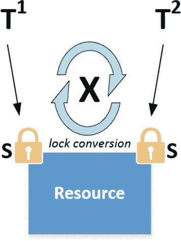

图 8-14：锁转换期间的死锁

当在 SQL Server 中使用更新锁时，不会发生死锁。更新锁与共享锁兼容，但与独占锁或其他更新锁不兼容。在前面的场景中，第一个找到需要修改数据的事务不会直接转换为独占锁，而是先转换为更新锁。由于更新锁和共享锁是兼容的，即使另一个事务已持有共享锁，转换为更新锁也不会有问题。然后，更新锁会转换为独占锁，以便进行数据修改。图 8-15 展示了这种锁行为。

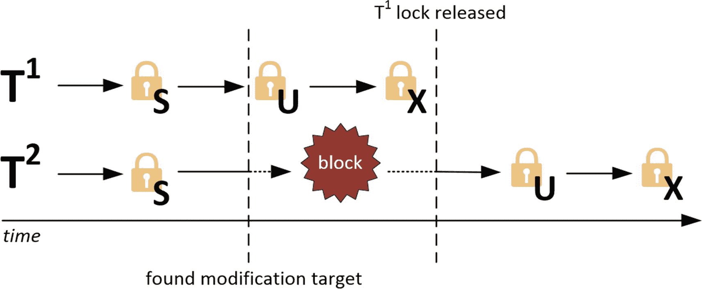

图 8-15：并发数据修改期间的更新锁

当一个事务想要放置更新锁，但该对象上已存在不兼容的锁（例如独占锁）时，系统将记录 `LCK_M_U` 等待类型。

### LCK_M_U 示例

为了向您展示一个发生 `LCK_M_U` 等待的示例，我们需要创建一个并发事务想要修改同一资源的场景。为此，我们将使用 Ostress 工具通过多个连接执行相同的查询。我将要执行的查询如清单 8-3 所示。该查询将对 `AdventureWorks` 数据库中的 `Person.Address` 表执行 `UPDATE` 操作。我将该查询保存在一个名为 `LCK_M_U.sql` 的 .sql 文件中。

```
UPDATE Person.Address
SET City = 'Los Angeles'
WHERE StateProvinceID = 9;
清单 8-3：修改 Person.Address 表
```

保存文件后，我使用以下命令运行 Ostress 工具：

```
"C:\Program Files\Microsoft Corporation\RMLUtils\ostress.exe" -E -dAdventureWorks2012 -i"C:\lck_m_u.sql" -n150 -r5 -q
```

这将创建 150 个并发连接，每个连接执行清单 8-3 中的查询五次。这应该足以产生一些阻塞。

在 Ostress 工具运行时，我查询 `sys.dm_os_waiting_tasks` DMV 以了解有哪些任务正在等待。结果的一小部分如图 8-16 所示。

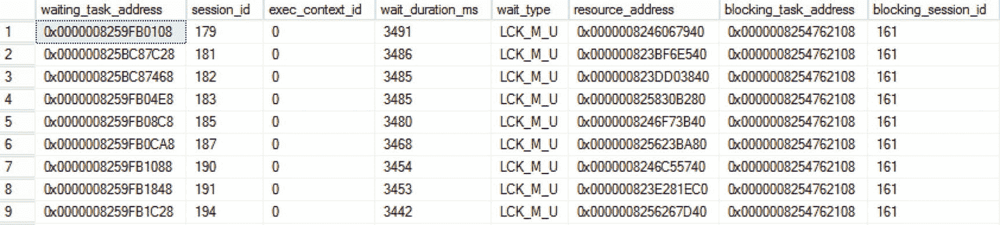

图 8-16：发生的 LCK_M_U 等待

如图 8-16 所示，许多不同的会话都在等待获取更新锁，但都被会话 ID 161 阻塞。如果我们查询 `sys.dm_tran_locks` DMV 来获取有关此会话的锁信息，可以看到它已被授予一个不兼容的独占锁，如图 8-17 所示。

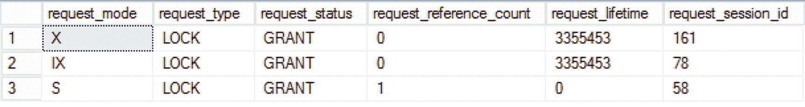

图 8-17：会话 ID 161 持有独占锁

所有其他会话将不得不等待，直到会话 ID 161 的独占锁被移除。然后，其中一个会话将获取其请求的更新锁，将其转换为独占锁，并执行其修改操作。这个循环会重复进行，直到所有会话完成其修改。

### 降低 LCK_M_U 等待

降低 `LCK_M_U` 等待的方法与降低 `LCK_M_S` 等待类型的方法相同：尝试识别导致阻塞发生的事务，并尝试优化其锁行为。

更改隔离级别对 `LCK_M_U` 等待时间影响不大，因为其他隔离级别主要影响执行读取的事务。因此，如果你需要降低 `LCK_M_U` 等待类型异常高的等待时间，优化查询和/或索引是可行之道。

### LCK_M_U 总结

`LCK_M_U` 等待类型与使用更新锁模式的锁相关。更新锁用于防止当并发事务尝试将其共享锁转换为独占锁时发生死锁。降低 `LCK_M_U` 等待时间主要通过优化可能引起阻塞的查询或索引来实现。

## LCK_M_X

另一种最常见的与锁相关的等待类型是 `LCK_M_X` 等待类型。就像我们讨论过的前两种与锁相关的等待类型一样，`LCK_M_X` 等待类型与一种特定的锁类型（这里是独占锁）相关。同样，看到这种等待类型就意味着正在发生某种形式的阻塞。

### 什么是 LCK_M_X 等待类型？

当任务等待在对象上放置独占锁时，就会发生 `LCK_M_X` 等待。由于独占锁与几乎所有其他锁模式（包括其他独占锁）都不兼容，因此在存在大量并发修改时看到阻塞发生是相当常见的。这意味着看到 `LCK_M_U` 等待发生也很常见，尤其是在具有高并发事务量的系统中。


### LCK_M_X 示例

为了演示 `LCK_M_X` 等待的发生，我们将执行一个 `SELECT` 语句但不提交它。在运行 `SELECT` 之前，我们将把隔离级别设置为可重复读（Repeatable Read）。这样做可以确保在事务仍在运行时共享锁不会被移除。由于我们不会结束事务，锁将保留在对象上，直到我们终止事务或执行 `COMMIT` 或 `ROLLBACK`。下面的查询显示了我们将在 `AdventureWorks` 数据库上执行的 `SELECT` 语句：

```sql
SET TRANSACTION ISOLATION LEVEL REPEATABLE READ
BEGIN TRANSACTION
SELECT *
FROM HumanResources.Employee;
-- COMMIT
```

请注意，我们注释掉了 `COMMIT` 部分以确保锁保持不变。执行查询后会很快返回结果，仅仅 1 秒后我就得到了 `HumanResources.Employee` 表的所有行。如果我们查询 `sys.dm_tran_locks` 动态管理视图（DMV），应该能看到所有的共享锁仍然存在，如图 8-18 所示。

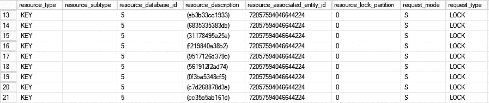

**图 8-18**
共享锁仍然存在

在这些锁仍然生效时，我们将在 SQL Server Management Studio 的一个新窗口中运行另一个查询。下面的查询将对同一个 `HumanResources.Employee` 表中的单行执行 `UPDATE` 操作：

```sql
UPDATE HumanResources.Employee
SET JobTitle = 'Tester'
WHERE BusinessEntityID = 5;
```

一旦我们执行前面的查询，就会注意到发生了阻塞，因为查询持续运行而不返回任何结果。这是预期的行为，因为该行（具体来说是索引键）上存在一个共享锁，阻止我们对其进行更新。

当我们查看 `sys.dm_os_waiting_tasks` DMV 时（如图 8-19 所示），会注意到第二个窗口中的查询正在等待放置一个排他锁，由 `LCK_M_X` 等待类型指示。


**图 8-19**
发生 LCK_M_X 等待

如果我们结束 `SELECT` 查询，无论是通过执行 `COMMIT` 语句还是关闭 SQL Server Management Studio 中的窗口，共享锁都会被移除，然后第二个查询就能够执行其 `UPDATE` 命令，从而结束 `LCK_M_X` 等待。

### 降低 LCK_M_X 等待

要降低 `LCK_M_X` 等待时间，您应该采用与降低其他与锁相关的等待类型相同的方法。尝试识别哪些查询导致了阻塞，并查看是否可以优化它们以减少阻塞。

### LCK_M_X 总结

`LCK_M_X` 等待类型与排他锁被同一资源上已存在的其他锁阻塞有关。由于排他锁几乎与所有其他锁类型不兼容，因此在经历并发查询执行的 SQL Server 实例上看到 `LCK_M_X` 等待发生并不罕见。

## LCK_M_I[xx]

看到 `LCK_M_I[xx]` 等待类型意味着一个任务在放置意向锁时被阻塞。由于我们已经在前面讨论过对象上的各种锁模式，在讨论这种等待类型时，我将意向锁使用的锁模式用 `[xx]` 代替。`[xx]` 可以替换为多种不同的锁模式；例如，意向共享锁上的阻塞将由 `LCK_M_IS` 等待类型表示，而意向排他锁上的阻塞则显示为 `LCK_M_IX`。

### LCK_M_I[xx] 等待类型是什么？

`LCK_M_I[xx]` 等待类型表示一个任务正在等待在对象上放置意向锁。正如我们从本章开头的“锁和阻塞简介”部分所学，意向锁指示在锁层次结构的较低级别对象上放置了相同类型的锁。这并不意味着意向锁的存在仅仅是为了警告 SQL Server 在层次结构的下方还有锁。意向锁的行为就像任何其他锁一样，一个意向锁完全有可能阻塞另一个不兼容的意向锁。意向锁在与其他不兼容的意向锁方面确实具有更多的灵活性。例如，在同一个页面对象上存在两个意向排他锁是可能的，这指示某一行将被修改。甚至可以在页面对象上同时存在一个意向共享锁和一个意向排他锁，因为这两个锁可以读取和/或修改不同的行。

除了指示锁层次结构下方存在的锁类型外，意向锁还具有一些其他锁模式所没有的“特殊”模式。意向锁可以代表锁层次结构较低级别的多种锁模式。下面的列表描述了这三种意向锁模式：

*   **共享意向排他锁（SIX）**：此锁模式表示在较低级别的所有对象上存在共享锁，并且在其中一些对象上存在意向排他锁。这些锁由一个事务获取，该事务希望读取数据并同时计划修改其他数据。当任务在尝试放置 SIX 锁时被阻塞，将由 `LCK_M_SIX` 等待类型记录。

*   **共享意向更新锁（SIU）**：此锁模式是共享锁和意向更新锁的组合。同样，单个事务可以同时在较低级别获取并持有这两种锁模式。如果在尝试放置此锁时发生阻塞，`LCK_M_SIU` 等待类型将用于记录等待时间。

*   **更新意向排他锁（UIX）**：此锁模式是另外两种锁模式——更新锁和意向排他锁——的组合。此锁模式上的阻塞将由 `LCK_M_UIX` 等待类型表示。

在意向锁上看到高等待时间并不常见，因为意向锁在相互不兼容性方面要灵活得多。这意味着在意向级别的阻塞通常比锁层次结构更低的级别要少。


### LCK_M_I[xx] 示例

在本例中，我们将生成一个 `LCK_M_IX` 等待类型。这意味着一个事务正在等待获取锁层次结构中更高级别的意向排他锁。

我们将使用与 `LCK_M_X` 等待类型几乎相同的示例，通过运行一个使用 `REPEATABLE READ` 隔离级别的 `SELECT` 语句且不完成事务来实现。下面的查询是我将针对 `AdventureWorks` 数据库的 `Person.Address` 表运行的查询：

```sql
SET TRANSACTION ISOLATION LEVEL REPEATABLE READ
BEGIN TRAN
SELECT * FROM Person.Address;
--COMMIT
```

`COMMIT` 命令已被注释掉，以使事务保持打开状态。

如果我们查看图 8-20 所示的 `sys.dm_tran_locks` DMV，我们会看到在查询运行时，当前只有一个活动的锁，即在 `OBJECT` 资源类型上的共享锁。这表明整个表已被锁定。由于此锁存在于如此高的级别，因此无需在层次结构的更低级别设置其他共享锁。

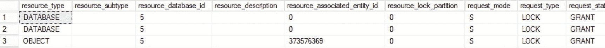

图 8-20：表上的共享锁

如果另一个事务想要更新同一表中的一行，它将首先尝试获取表和页级别的意向排他锁，然后才能获取行级别的排他锁。下面的查询就是这样一个事务，在本例中，我们将尝试更新单行：

```sql
UPDATE Person.Address
SET AddressLine1 = '1227 Shoe St.'
WHERE AddressID = 5;
```

您会注意到，只要 `SELECT` 查询仍然持有其表上的共享锁，前面的查询就会“挂起”。尽管意向锁在大多数情况下与同一对象上的其他意向锁兼容，但在本例中，在表级别持有共享锁的同时尝试在更低的层次执行数据修改，将导致阻塞发生。共享锁和意向排他锁是不兼容的。

如果我们查看 `sys.dm_os_waiting_tasks` DMV，我们应该能够看到设置意向排他锁的任务正在等待，如图 8-21 所示。


图 8-21：正在发生的 LCK_M_IX 等待

### 降低 LCK_M_I[xx] 等待

与我们之前讨论的其他与锁相关的等待类型一样，在尝试降低 `LCK_M_I[xx]` 等待时间时，应专注于导致阻塞的查询。因为 `LCK_M_I[xx]` 等待仅当锁层次结构中更高级别的对象上持有不兼容的锁时才会发生，所以花时间调查为什么这些锁被放置在层次结构的如此高位置是值得的。锁升级可能导致这种情况发生。当 SQL Server 在锁层次结构的更高级别放置单个锁比在更低级别锁定多个对象更高效时，就会发生锁升级。例如，SQL Server 可以决定在表级别放置一个共享锁，而不是在行上放置数千个共享锁。这比维护数千个单个锁所需资源少得多。事实上，这正是我在向您展示的 `LCK_M_IX` 等待类型示例中发生的情况。我们使用 `SELECT` 查询的 `Person.Address` 表包含超过 19,000 行。当我们对表运行 `SELECT *` 查询时，这意味着至少需要 19,000 个行锁。由于放置和维护如此多的锁将消耗大量资源，SQL Server 决定在表上放置一个共享锁，而不是在行上放置 19,000 个锁。

如果我们能重写查询以减少所需的锁，例如，只选择前 *x* 行而不是所有内容，SQL Server 可能会选择再次锁定行，而不是整个表。

### LCK_M_I[xx] 总结

`LCK_M_I[xx]` 等待类型与意向锁相关，或者更确切地说，与另一个不兼容的锁阻止设置意向锁的情况相关。意向锁被放置在更高级别的对象上，以表示在锁层次结构的更低级别上已放置了锁。与我们之前讨论的仅表示一种锁类型的锁模式不同，意向锁可以表示锁层次结构中更低级别的不同锁模式。`LCK_M_I[xx]` 等待类型高等待时间的一个常见原因是 SQL Server 将较低级别的锁升级为更高级别的锁。在这种情况下，意向锁将被阻止且无法获取。

## LCK_M_SCH_S 和 LCK_M_SCH_M

本章我想讨论的最后两个与锁相关的等待类型是 `LCK_M_SCH_S` 和 `LCK_M_SCH_M` 等待类型。这两种等待类型都与表上的锁相关，即所谓的架构锁。我们在本章前面没有过多关注架构锁，但由于它们在发生时可能对等待时间产生相当大的影响，因此我想在此介绍它们。

### 什么是 LCK_M_SCH_S 和 LCK_M_SCH_M 等待类型？

`LCK_M_SCH_S` 和 `LCK_M_SCH_M` 等待类型都与架构锁相关。架构锁被放置在表级别，以在查询访问表时保护表不被修改，或者在表被修改时阻止查询访问表。架构锁有两种不同的类型：架构稳定性锁 (Sch-S) 和架构修改锁 (Sch-M)。当任务被阻止获取架构稳定性锁或架构修改锁时，它们各自关联有不同的等待类型。当架构稳定性锁在获取前必须等待时，会记录 `LCK_M_SCH_S` 等待类型（表示对表的读取访问）；当架构修改锁在等待获取时，会记录 `LCK_M_SCH_M` 等待类型（表示表架构将被更改）。

两种架构锁与其他锁类型的兼容性都相当极端。架构稳定性锁与除架构修改锁以外的所有其他类型的锁都兼容。另一方面，架构修改锁与所有其他锁类型（包括意向锁）都不兼容。

使用架构稳定性锁时，在查询当前正在读取或写入表的过程中，无法以任何方式修改或更改表。由于架构稳定性锁与所有锁模式（架构修改锁除外）兼容，因此在表级别看到架构稳定性锁与例如指示表内较低级别正在发生数据修改的意向排他锁共存是完全正常的。

架构修改锁与架构稳定性锁相反，它们在执行对表的修改时阻止任何查询访问该表。

### LCK_M_SCH_S 与 LCK_M_SCH_M 示例

对于第一个示例，我将向一个现有表中添加一个新列，并且像本章前面示例中所做的那样，通过不提供 `COMMIT` 或 `ROLLBACK` 命令来保持事务处于打开状态。接下来的查询在 `AdventureWorks` 数据库的 `Person.Address` 表中添加了一个额外的列，但我将 `ROLLBACK` 命令保持为注释状态，以便锁保持不变：

```sql
BEGIN TRAN
ALTER TABLE Person.Address
ADD
Test VARCHAR(10);
--ROLLBACK
```

在 SQL Server Management Studio 的一个新窗口中，我将对 `Person.Address` 表执行一个简单的 `SELECT` 查询，如下所示：

```sql
SELECT *
FROM Person.Address;
```

如果我们在两个查询都在运行时查看 `sys.dm_tran_locks` DMV，我们应该能够看到是否有任何阻塞发生。图 8-22 显示了针对 `sys.dm_tran_locks` DMV 执行 `SELECT *` 查询的部分输出。

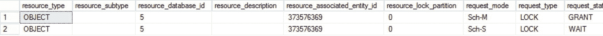

图 8-22 Sch-M 和 Sch-S 锁

从图 8-22 中可以看出，我们启动的第一个查询，其目标是向 `Person.Address` 表添加一列，导致该表上出现了一个 Sch-M 锁。第二个 `SELECT` 查询正在等待获取同一表上的 Sch-S 锁。

如果我们查询 `sys.dm_os_waiting_tasks` DMV，应该能看到一个正在等待 `LCK_M_SCH_S` 等待类型的任务。图 8-23 显示了在两个查询都在运行时 `sys.dm_os_waiting_tasks` 的输出。


图 8-23 LCK_M_SCH_S 等待发生

正如我们所料，`SELECT` 查询正在等待获取其架构稳定性锁。

如果我们反转这个示例，通过启动一个读取事务并保持其打开状态，然后尝试修改同一个表，我们应该会遇到 `LCK_M_SCH_M` 等待，因为只有在我们要修改的表中没有活动事务时，我们才能获取架构修改锁。

为了展示这种情况，我执行了以下查询。这将以可重复读隔离级别启动一个 `SELECT` 查询，但我保持事务打开以便锁保持不变：

```sql
SET TRANSACTION ISOLATION LEVEL REPEATABLE READ
BEGIN TRANSACTION
SELECT * FROM
Person.Address;
-- COMMIT
```

在 SQL Server Management Studio 的一个新窗口中，我将执行之前用于演示 `LCK_M_SCH_S` 等待类型的表修改查询，但这次不保持事务打开：

```sql
ALTER TABLE Person.Address
ADD
Test VARCHAR(10);
```

在执行第二个查询时，你可能会注意到没有任何结果返回，并且查询持续运行，这清楚地表明发生了阻塞。

让我们再次查看 `sys.dm_tran_locks` DMV，看看能发现什么。图 8-24 显示了我的测试 SQL Server 上的输出。

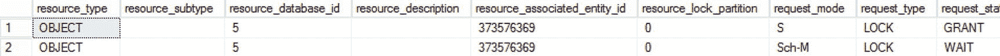

图 8-24 等待被获取的 Sch-M 锁

在这种情况下，该表因 `SELECT` 查询而持有一个共享锁。因为我们从一个相当大的表中选择信息，SQL Server 决定放置一个表级锁，而不是在较低级别放置锁。由于架构修改锁与所有其他锁类型都不兼容，因此发生了阻塞，我们将不得不等待，直到共享锁消失，才能执行表修改操作。

查看 `sys.dm_os_waiting_tasks` DMV 向我们展示了预期的结果，一个 `LCK_M_SCH_M` 等待，如图 8-25 所示。


图 8-25 LCK_M_SCH_M 等待发生

### 降低 LCK_M_SCH_S 和 LCK_M_SCH_M 等待

当你看到 `LCK_M_SCH_S` 或 `LCK_M_SCH_M` 等待类型发生时，可能有一个活动的事务想要修改该表。在 `LCK_M_SCH_S` 等待类型等待时间长的情况下，表修改事务已经在运行；而看到 `LCK_M_SCH_M` 等待时，修改操作正在等待所有活动事务移除它们在该表上的锁。

修改表并非在生产 SQL Server 实例上每天都会发生的事情（希望如此）。更改大型表尤其可能成为问题，并导致较高的 `LCK_M_SCH_S` 等待时间，试图查询正在被修改的表的用户会注意到延迟。然而，如果你确实需要修改一个表，但同时有一些长时间运行的查询正在从该表检索信息，那么你可能会遇到 `LCK_M_SCH_M` 等待。

降低这两种等待类型的等待时间与执行表修改操作直接相关。一个建议是在非工作时间执行表修改，或者在访问该表的并发事务尽可能少的时候进行，而不是在有很多针对该表的活动事务时进行修改。

### LCK_M_SCH_S 与 LCK_M_SCH_M 总结

`LCK_M_SCH_S` 和 `LCK_M_SCH_M` 等待类型是架构稳定性或架构修改锁被其他锁阻塞的结果。看到这两种等待类型的高等待时间表明，要么是表修改操作正在等待移除该表上所有活动锁，要么是表修改操作当前正在运行，并因此阻塞了其他事务。

