# 9. 闩锁相关等待类型

在第 8 章 “锁相关等待类型” 中，我们相当深入地探讨了 SQL Server 内部的锁和阻塞，以及表明阻塞正在发生的不同等待类型。闩锁看起来非常像我们之前讨论的锁；在某些情况下，它们甚至似乎使用了与我们在第 8 章讨论的锁相同的模式。但请注意，闩锁与锁完全不同，尽管它们似乎共享一些特性。锁用于保证事务的隔离性和一致性，而闩锁用于保证内存中对象的一致性。

闩锁，就像锁和阻塞一样，是 SQL Server 中一个相当复杂的主题。闩锁甚至有自己的闩锁统计信息 DMV，记录了在特定闩锁类型上等待所花费的时间。

由于闩锁及其在 SQL Server 内部功能的复杂性，我认为需要先介绍它们，以便更好地理解如何在本章后面排除闩锁相关的等待类型。为此，我们将以对闩锁的介绍开始本章，就像我们在第 8 章 “锁相关等待类型” 中以锁的介绍开始一样。

## 锁存器（Latch）简介

微软在《联机丛书中》将锁存器描述为“各种 SQL Server 组件使用的轻量级同步对象”。这个描述相当模糊，锁存器的深度远不止乍看之下的样子。

关于锁存器，首先需要理解的重要一点是，它们与锁完全不同。我听过也读过各种讨论，将锁存器当作锁来看待。这种混淆很容易解释，因为从行为和 SQL Server 中的命名约定来看，锁存器乍一看确实与锁很相似。就像锁一样，锁存器有各种“模式”，并且表示模式类型的一些缩写与某些锁模式的缩写相同。锁和锁存器的另一个共同点是，两者都在保持 SQL Server 对象一致性方面发挥作用，而且它们管理一致性的方法似乎相同。锁用于确保事务的一致性，在事务运行的整个期间保护事务；而锁存器只在必要的持续时间内使用，不与事务的持续时间绑定。在一个事务的持续时间内，许多不同的锁存器会被获取然后再次释放。图 9-1 可视化了这种行为。

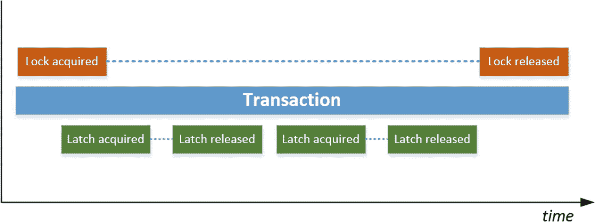
*图 9-1: 事务期间的锁与锁存器行为*

在 SQL Server 对象上放置和（尤其是）维护锁是一项昂贵的操作，主要是因为它们需要在整个事务期间保持原位。因为锁存器只在特定操作期间需要，之后就会被释放，所以它们的使用成本远低于锁。这就解释了微软使用的锁存器定义中“轻量级”的部分。

锁存器定义的第二部分“同步对象”，我们在本书前面讨论过，只是名称不完全相同。如果你通读了本书到目前为止的内容，尤其是在第 6 章“与 IO 相关的等待类型”中，你应该已经注意到 SQL Server 使用各种方法来处理并发线程访问对象。在第 6 章中，我们讨论了互斥，它确保一次只有一个线程可以访问内存对象。在同一章中，我们还讨论了实现门以限制对内存的并发访问的信号量。锁存器是另一种用于确保并发线程不会威胁内存中对象一致性的方法，其方式与锁非常相似。

### 锁存器模式

锁存器在访问对象时有五种不同的可用模式。下面的列表描述了这五种模式，其中一些可能看起来很熟悉：

*   SH：SH 模式表示共享锁存器。此模式在锁存器读取页面数据时使用。
*   UP：UP 锁存模式由更新锁存器使用，每当页面需要修改时就会使用。通过使用更新锁存器，其他锁存器仍然可以读取该页面。
*   EX：EX 锁存模式，即排他锁存器，也在页面修改时使用。与更新锁存器不同，排他锁存器不允许其他锁存模式进行读或写访问。
*   KP：KP 锁存模式由保持锁存器使用。保持锁存器用于保护页面，使其不会被销毁锁存器销毁。它们与除销毁模式以外的所有其他锁存模式兼容。
*   DT：DT 锁存模式表示销毁锁存器。销毁锁存器在从内存中移除内容时使用；例如，当 SQL Server 想要释放内存中的数据页时。

正如你在此列表中所见，前三种锁存模式看起来与锁使用的模式非常相似，功能也或多或少相同。就像锁模式一样，锁存模式彼此之间兼容或不兼容。表 9-1 显示了锁存兼容性矩阵以及不同模式是否彼此兼容。
*表 9-1: 锁存兼容性矩阵*

|   | SH | UP | EX | KP | DT |
| --- | --- | --- | --- | --- | --- |
| `SH` | Yes | Yes | No | Yes | No |
| `UP` | Yes | No | No | Yes | No |
| `EX` | No | No | No | Yes | No |
| `KP` | Yes | Yes | Yes | Yes | No |
| `DT` | No | No | No | No | No |

与锁不同（锁可以部分通过隔离级别和查询提示控制），锁存器完全由 SQL Server 引擎控制。这意味着我们不能像修改锁那样修改锁存器行为。

### 锁存器等待

每当锁存器因为其请求无法立即被授予而必须等待时，就会发生锁存器等待。这些等待由 SQL Server 在 `sys.dm_os_wait_stats` DMV 内部跟踪和记录，也在一个专门的、记录特定锁存器等待时间的 DMV `sys.dm_os_latch_waits` 内部记录，我们将在本章后面更详细地讨论后者。

图 9-2 显示了一个发生锁存器等待的情况。在此示例中，我们正在等待将一个数据页从存储子系统读取到缓冲区缓存中。这种情况下，锁存器用于确保存储子系统上的同一数据页不会被多个线程读入缓冲区缓存。当锁存器等待页面读入内存时，将记录 `PAGEIOLATCH_SH` 等待类型。

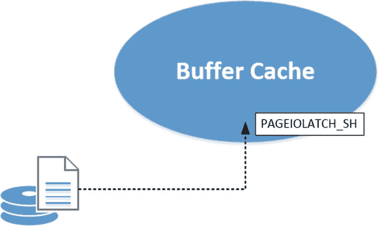
*图 9-2: PAGEIOLATCH_SH 发生时*

SQL Server 中定义了三种不同的锁存器等待类型，可以通过查询 `sys.dm_os_wait_stats` DMV 访问，描述如下：

*   **缓冲区锁存器**：用于保护缓冲区缓存内的数据页。它们不仅用于用户相关的数据页，还用于系统页，例如跟踪数据页内可用空间的页面空闲空间页。在 `sys.dm_os_wait_stats` DMV 中，它们由 `PAGELATCH_[xx]` 等待类型指示，其中 `[xx]` 表示使用的锁存模式。
*   **非缓冲区锁存器**：这些锁存器用于保护缓冲区缓存之外的数据结构。在 `sys.dm_os_wait_stats` DMV 中，它们由 `LATCH_[xx]` 等待类型指示。
*   **IO 锁存器**：当数据页从存储子系统读入缓冲区缓存时，会使用 IO 锁存器。此类型由 `PAGEIOLATCH_[xx]` 等待类型指示。

图 9-3 显示了由 `sys.dm_os_wait_stats` DMV 记录的不同锁存器等待类型的数量。

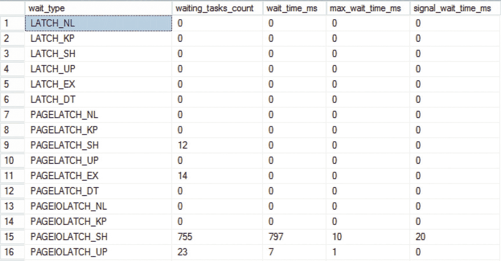
*图 9-3: sys.dm_os_wait_stats 内的锁存器等待类型*

当你查看 `sys.dm_os_wait_stats` DMV 中的 `LATCH_[xx]` 等待类型时，你实际上是在查看这些非缓冲区锁存器等待时间的摘要。SQL Server 内部有各种非缓冲区锁存器类，为了更方便地详细分析这些非缓冲区锁存器类，SQL Server 添加了 `sys.dm_os_latch_stats` DMV。

## sys.dm_os_latch_stats

`sys.dm_os_latch_stats` 这一动态管理视图与 `sys.dm_os_wait_stats` DMV 非常相似。`sys.dm_os_latch_stats` DMV 同样显示等待发生的次数、总等待时间和最大等待时间。与 `sys.dm_os_wait_stats` DMV 相比，唯一缺失的列是 `signal_wait_time_ms`；之所以缺失，是因为锁存器不遵循与请求相同的执行流程。

图 9-4 展示了 `sys.dm_os_latch_stats` DMV 的部分内容。在 SQL Server 2017 中，存在更多非缓冲区锁存器类，总计 168 个。

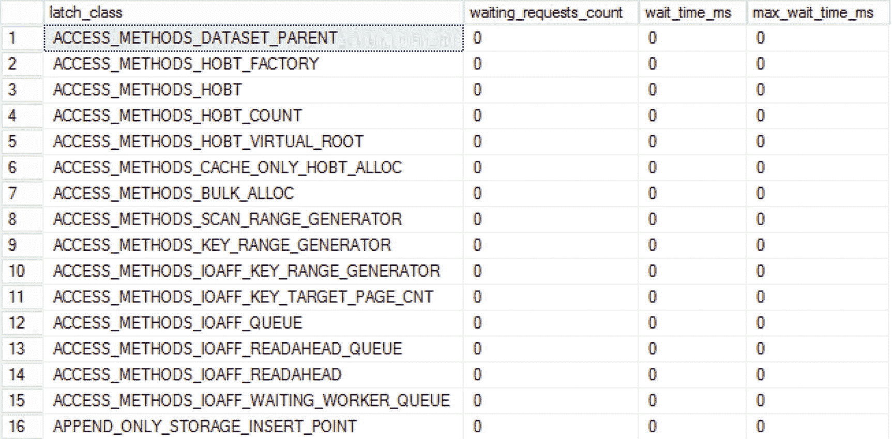

图 9-4 sys.dm_os_latch_waits

与 `sys.dm_os_wait_stats` DMV 一样，`sys.dm_os_latch_stats` DMV 的统计信息自 SQL Server 服务启动以来是累积的。这意味着每当 SQL Server 服务重启时，这些统计信息将被重置为 0。我们也可以使用 `DBCC SQLPERF` 命令来手动重置 `sys.dm_os_latch_stats` DMV 的等待时间，执行如下命令：

```sql
DBCC SQLPERF('sys.dm_os_latch_stats', CLEAR)
```

## Page-Latch Contention

关于锁存器，最常见的问题之一是页锁存器争用。当许多并发请求试图获取锁存器，但已经存在一个处于不兼容模式的锁存器时，就会发生页锁存器争用，从而导致锁存器等待。因为这个问题可能发生在任何承受并发工作负载的 SQL Server 实例上，所以在讨论各种与锁存器相关的等待类型之前，我希望为您提供识别页锁存器争用所需的知识。

有多种因素可能导致页锁存器争用的发生。尽管我们对锁存器的放置影响甚微，但我们数据库的设计却会影响锁存器的行为。锁存器争用的一个常见原因是并发查询访问数据库中的所谓“热点”。例如，一个保存少量行的小表，如果需要被应用程序用于获取配置信息，就可能成为潜在的热点。如果许多并发请求需要从这个表中获取数据，许多锁存器可能会遇到其他不兼容的锁存器，导致锁存器等待发生并减慢应用程序的性能。我见过这个问题在不同客户那里多次发生，这是一个真实世界的场景，我将向您展示一个基于其中某个案例的页锁存器争用示例。

在这个案例中，客户运行的应用程序会在特定时间选择大量数据并将结果放入临时表。该应用程序使用大量并发连接来加速这些临时表的创建。为了展示此示例的效果，我将使用 Ostress 工具来重现该场景，从一个表中选择行，然后将它们插入到一个临时表中。

作为 Ostress 实用程序的输入，我保存了一个名为 `latch_contention.sql` 的 .sql 文件，其中包含清单 9-1 所示的查询。

```sql
SELECT TOP (20000) *
INTO #tmptable
FROM Sales.SalesOrderDetail;
```
清单 9-1 从 `Sales.SalesOrderDetail` 中选择行并插入临时表

此查询从 `AdventureWorks` 数据库中的 `Sales.SalesOrderDetail` 表中选择前 20,000 行，并将它们插入到临时表 `#tmptable` 中。

下一步是启动 Ostress 并使用 300 个并发连接执行 `latch_contention.sql` 脚本。我使用的 Ostress 命令行如下所示：

```shell
"C:\Program Files\Microsoft Corporation\RMLUtils\ostress.exe" -E -dAdventureWorks -i"C:\latch_contention.sql" -n300 -r1 -q
```

在 Ostress 实用程序运行时，让我们查看一下 `sys.dm_os_waiting_tasks` DMV，看看是否有任何任务正在等待。图 9-5 显示了执行以下查询时返回的部分结果：

```sql
SELECT
    session_id,
    wait_duration_ms,
    wait_type,
    resource_description
FROM sys.dm_os_waiting_tasks
WHERE session_id > 50;
```

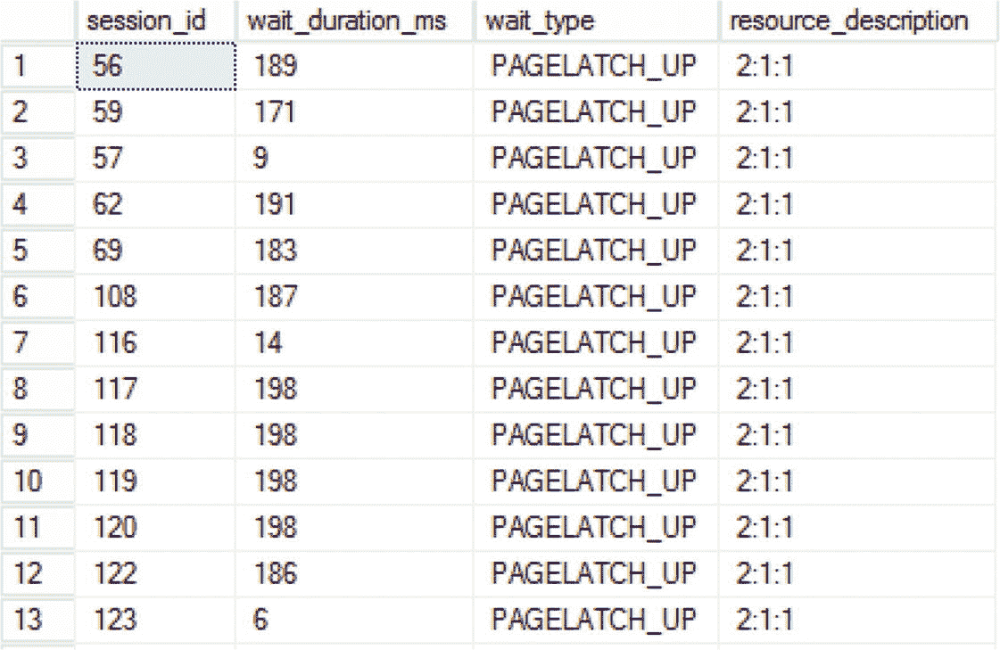

图 9-5 发生了 PAGELATCH_UP 等待


我们在这里遇到了大量 `PAGELATCH_UP` 等待，这表明有一个锁存器正在等待更新内存中的页面。`resource_description` 列在这里非常有用，因为它指出了锁存器想要访问的页面 ID。在这个例子中，我们试图访问的页面 ID 是 `2:3:1`。第一个数字 `2` 代表数据库 ID，这里是 `TempDB` 数据库。第二个数字 `2` 表示文件 ID（我测试系统上的 TempDB 数据库由多个数据文件组成）。最后一个数字表示页面 ID `1`。为什么所有会话都在同一个等待类型上等待，针对同一个数据页面？这个页面恰好是一个非常特殊的页面，即页自由空间（PFS）页面。PFS 页面跟踪数据库中每个页面的剩余自由空间。它始终是每个数据库的第一页（页面 ID 为 1），间隔为 8088 页。因此在此示例中，所有请求都在等待更新 `TempDB` 数据库中的第一个 PFS 页面。

由于我们正在使用许多并发连接向临时表执行插入操作，我们需要在 `TempDB` 中找到或分配具有自由空间的数据页面来容纳我们的行。所有这些空间使用情况都需要在 PFS 页面中更新，并且使用锁存器来确保一次只有一个线程能访问 PFS 页面。图 9-6 显示了两个 Perfmon 计数器 Transaction 和 Latch Waits/sec 的 Perfmon 图表。这将展示高压工作负载与发生的锁存器等待数量之间的关系。

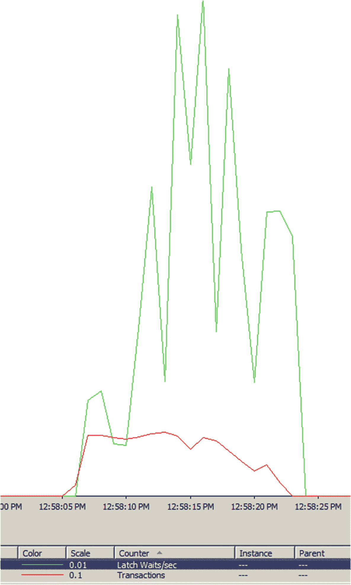

**图 9-6**

锁存器等待/秒和事务 Perfmon 图表

这实际上是 `TempDB` 数据库内页面锁存器争用的典型例子，当许多并发查询在 `TempDB` 内创建对象时可能会发生。解决这种特定锁存器争用情况的一种方法是增加更多（大小相同的）`TempDB` 数据文件。每个新数据文件将维护自己的 PFS 页面，添加更多数据文件有助于分散更新 PFS 页面的负载。使用下面的查询，我向 `TempDB` 数据库添加了三个额外的数据文件：

```sql
USE [master]
GO
ALTER DATABASE [tempdb] ADD FILE ( NAME = N'tempdev2', FILENAME = N'D:\Data\tempdb2.mdf' , SIZE = 204800KB , FILEGROWTH = 10%)
GO
ALTER DATABASE [tempdb] ADD FILE ( NAME = N'tempdev3', FILENAME = N'D:\Data\tempdb3.mdf' , SIZE = 204800KB , FILEGROWTH = 10%)
GO
ALTER DATABASE [tempdb] ADD FILE ( NAME = N'tempdev4', FILENAME = N'D:\Data\tempdb4.mdf' , SIZE = 204800KB , FILEGROWTH = 10%)
GO
```

当使用与之前相同的向临时表插入数据的查询再次运行 Ostress 实用程序时，我仍然注意到 PFS 页面上发生了锁存器等待，但它们更好地分散在各个 `TempDB` 数据文件上。查看 Transaction 和 Latch Waits/sec Perfmon 计数器时，我也看到发生的锁存器等待减少了，如图 9-7 所示。

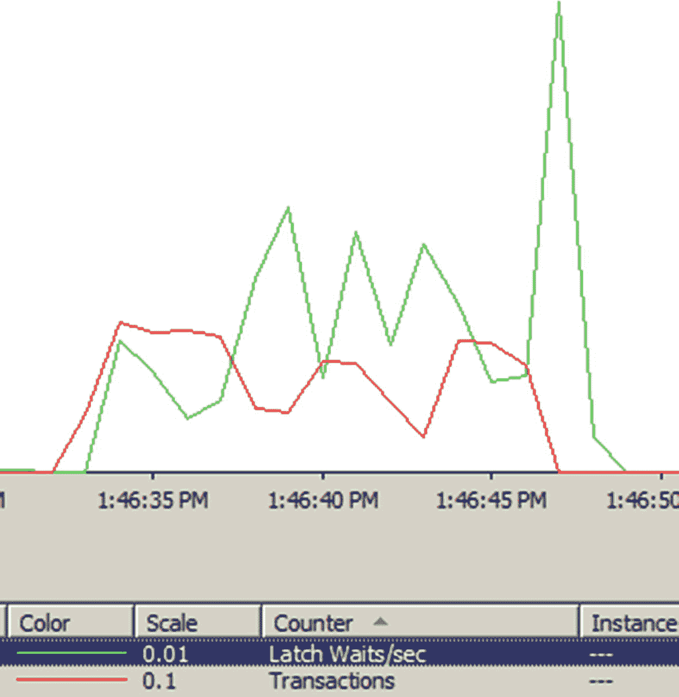

**图 9-7**

添加更多 TempDB 文件后的锁存器等待/秒和事务 Perfmon 图表

通过添加更多 `TempDB` 数据文件，我本可以进一步减少锁存器等待的数量。然而，添加过多 `TempDB` 数据文件可能是个坏主意，因为确保数据文件获得均等分配的轮询算法在管理许多 `TempDB` 数据文件时会产生显著的开销。Paul Randal 在他的 SQLskills 博客上有一篇讨论 `TempDB` 数据文件和锁存器争用的精彩文章，你可以在这里找到： [`www.sqlskills.com/blogs/paul/a-sql-server-dba-myth-a-day-1230-tempdb-should-always-have-one-data-file-per-processor-core/`](http://www.sqlskills.com/blogs/paul/a-sql-server-dba-myth-a-day-1230-tempdb-should-always-have-one-data-file-per-processor-core/)。

现在我们已经讨论了锁存器是什么以及它们如何工作，并查看了一个锁存器争用的例子，让我们继续探讨与锁存器相关的等待类型。

## PAGELATCH_[xx]

本章我们将讨论的第一个与锁存器相关的等待类型是 `PAGELATCH_[xx]` 等待类型，其中 `[xx]` 表示使用的锁存器模式（例如，SH 表示共享）。由于我们已在本章引言中讨论了各种锁存器模式，因此本章不再重复描述它们。

### 什么是 PAGELATCH_[xx] 等待类型？

每当锁存器必须在访问内存中的页面之前等待时，就会发生 `PAGELATCH_[xx]` 等待。这些等待的主要原因是页面上已存在其他锁存器，并且这些锁存器与我们的请求想要使用的锁存器模式不兼容。就像锁一样，我们想要放置在页面上的锁存器必须等待，直到页面上不兼容的锁存器被移除。只要不兼容的锁存器存在，我们的请求就会记录 `PAGELATCH_[xx]` 等待时间。图 9-8 展示了发生 `PAGELATCH_UP` 等待的图示。我使用齿轮图标表示页面上已存在锁存器，以避免与 SQL Server 锁混淆。

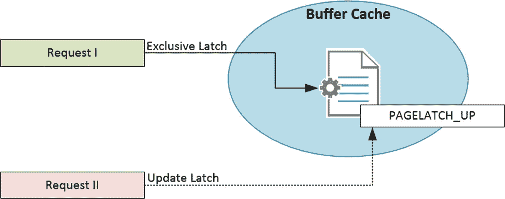

**图 9-8**

正在发生的 PAGELATCH_UP 等待

很容易将 `PAGELATCH_[xx]` 等待与 `PAGEIOLATCH_[xx]` 等待混淆。尽管它们名称相似，但两者是完全不同的锁存器等待类型。前者表示访问已在内存中的页面，而后者表示页面正从磁盘读入内存。我们将在本章后面详细讨论 `PAGEIOLATCH_[xx]` 等待类型。


### PAGELATCH_[xx] 示例

在本章引言中，我们探讨了当许多并发查询正在临时查询中加载数据时，可能在 `TempDB` 数据库内部发生的页闩锁争用。这并不是 SQL Server 中可能发生的唯一一种闩锁争用形式。另一种形式被称为“最后一页插入争用”。就像我们之前讨论的页闩锁争用场景一样，最后一页插入争用也可以通过注意到大量的 `PAGELATCH` 等待来识别。让我们通过一个最后一页插入争用的例子来详细说明。

#### 理解最后一页插入争用

还记得你在数据库设计课上学到的每个表都应该有一个聚集索引吗？并且聚集索引键列的最佳候选者是一个狭窄的、唯一的、不断增长的值，比如一个整数？所有这些仍然正确，并且绝对有助于优化对这些表的查询性能。然而，在某些非常特定的情况下，使用这种做法可能会导致一个称为“最后一页插入争用”的性能问题。

最后一页插入争用可能发生在那些对具有相对较小行的表执行非常繁重的插入工作负载的数据库上；例如，一个包含 `ID` 列（`Integer` 数据类型，自动增长）和 `Name` 列（`Varchar` 数据类型）的表。从最佳实践的角度来看，我们会在 `ID` 列上创建聚集索引，因为它完美符合良好索引键的描述。它是狭窄的，每一行都是唯一的，并且总是在增长。但由于自动增长的递增特性，每个新添加的行都将添加到聚集索引的末尾，从而为聚集索引的最后一个数据页创建一个热点。图 9-9 以所谓的 B 树结构形式展示了行插入聚集索引内部数据页的行为，B 树结构是 SQL Server 用于排序索引的数据结构。

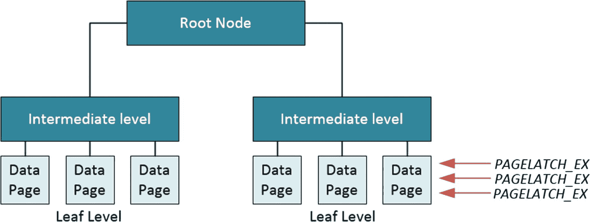

图 9-9：聚集索引最后一页上的最后一页插入争用

即使当前数据页已满并添加了新数据页，插入的目标也会更改为新页面，从而将热点切换到新的数据页。

关于这种行为，我经常听到一个问题：“为什么锁不能阻止这个？”答案其实很简单：因为默认情况下，我们将使用排他的行级锁来插入新行，而不是锁定整个页，并且一个页上可以同时存在多个并发的排他行锁。然而，对内存中页的访问仍然需要串行进行，因此使用闩锁来确保在任何时候只有一个线程访问该页。图 9-10 展示了带有锁的聚集索引叶级数据页的放大视图。

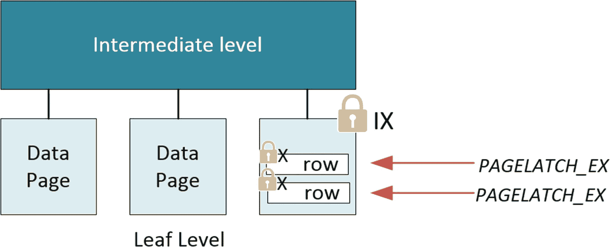

图 9-10：带有锁的聚集索引叶页

#### 演示争用

为了向您展示一个最后一页插入争用的例子，我将使用以下查询在我的测试 SQL Server 实例的 `AdventureWorks` 数据库中创建一个新表：

```sql
CREATE TABLE Insert_Test
(
ID INT IDENTITY (1,1) PRIMARY KEY,
RandomData VARCHAR(50)
);
```

如您所见，这是一个非常小的表，包含一个 `ID` 列，该列会为插入的每一新行自动增长，以及一个 `RandomData` 列，用于存储一些数据。我将 `ID` 列指定为该表的主键，这将自动使用 `ID` 列作为索引键创建一个聚集索引。

下一步是使用高度并发的工作负载运行 `Ostress`，向 `Insert_Test` 表插入新行。这次我没有为 `Ostress` 创建 `.sql` 输入文件，而是在 `Ostress` 命令行中输入以下查询：

```sql
INSERT INTO Insert_Test
(RandomData)
VALUES
(
CONVERT(varchar(50), NEWID())
)
```

这将生成以下 `Ostress` 命令行，该命令行将连接到 `AdventureWorks` 数据库，并使用 500 个并发连接执行我们提供的查询，每个连接执行该查询 100 次。这应该能产生足够的并发插入来演示最后一页插入争用：

```bash
"C:\Program Files\Microsoft Corporation\RMLUtils\ostress.exe" -E -dAdventureWorks -Q"INSERT INTO Insert_Test (RandomData) VALUES (CONVERT(varchar(50), NEWID()))" -n500 -r100 -q
```

当 `Ostress` 运行时，我查询 `sys.dm_os_waiting_tasks` DMV：

```sql
SELECT
session_id,
wait_duration_ms,
wait_type,
resource_description
FROM sys.dm_os_waiting_tasks;
```

此查询过滤掉了一些列，以便结果的截图可以放在一页上。图 9-11 显示了部分结果。

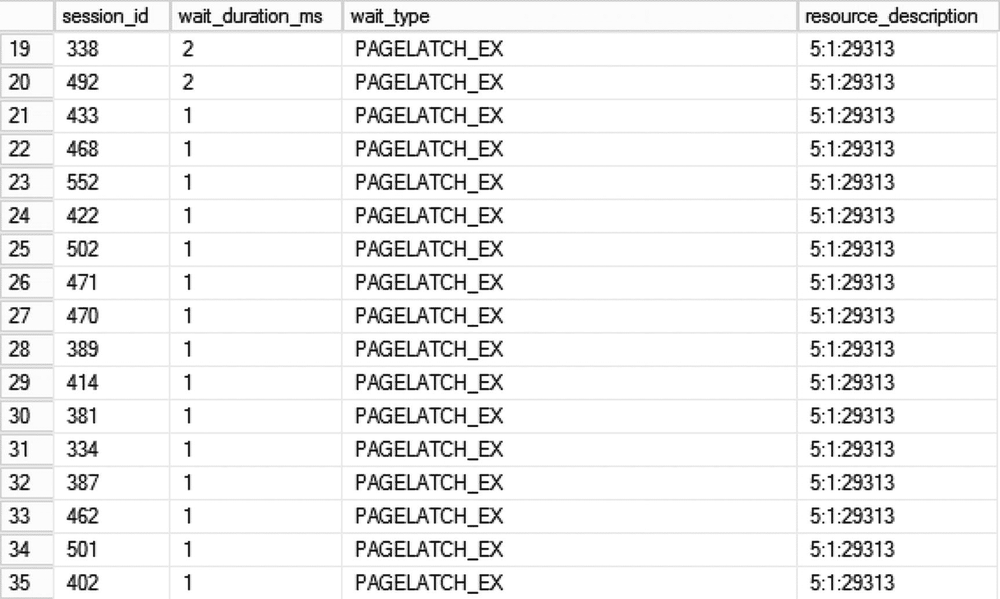

图 9-11：在同一页上出现的 `PAGELATCH_EX` 等待

正如预期的那样，插入工作负载导致聚集索引内的一个页面（本例中是页 ID 为 `29313` 的页面）出现热点。图 9-11 中显示的所有任务（大约还有 300 个未显示）都在等待在该页面上放置一个排他页闩锁（由 `PAGELATCH_EX` 等待类型指示），以便执行它们的插入操作。

#### 验证热点页

为了证明页 `29313` 是一个数据页，我将使用未公开的 `DBCC IND` 命令来显示与 `Insert_Test` 表关联的页面。`DBCC IND` 将为作为参数提供给它的表所关联的每个页面返回一行，并且除其他信息外，还会显示每个返回页面的页面类型。

运行以下命令将对 `AdventureWorks` 数据库的 `Insert_Test` 表执行 `DBCC IND` 命令。在实际运行 `DBCC IND` 命令之前，我们必须启用 Traceflag 3604，以便 `DBCC IND` 命令的结果能返回到 SQL Server Management Studio 的结果选项卡中：

```sql
DBCC TRACEON (3604);
GO
DBCC IND (AdventureWorks, Insert_Test, 1);
GO
```

图 9-12 显示了 `DBCC IND` 命令的结果。高亮显示的是页 `29313`，即在 `Ostress` 工作负载期间成为插入热点的页面。

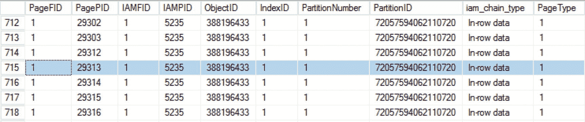

图 9-12：`DBCC IND` 结果

我们感兴趣的信息位于 `IndexID` 和 `PageType` 列中。`IndexID` 列返回此页面所关联的索引 ID。我们在 `Insert_Test` 表上只有一个索引，其 `ID` 为 1。`PageType` 列返回特定页面的页面类型。在本例中，页 `29313` 的 `PageType` 是 1，这表明该页是数据页。

请记住，`DBCC IND` 是一个未公开的 SQL Server 命令，我在此包含它是为了向您展示有关发生最后一页插入争用的页面的信息。我强烈建议不要在生产服务器上使用它。

## 降低 `PAGELATCH_[xx]` 等待

到目前为止，我已经向你展示了两个可能发生 `PAGELATCH_[xx]` 等待的示例：`TempDB` 数据库 PFS 页上的页闩锁争用，以及最后一页插入争用。还有另一种闩锁争用问题可能在向带有索引的小型表插入行时发生。这种闩锁争用情况也可以通过出现的 `PAGELATCH_[xx]` 等待来识别，但它也与 `LATCH_[xx]` 等待类型有关联。因此，我将针对这种特定情况的解释和示例留到本章下一节，届时我们将讨论 `LATCH_[xx]` 等待类型。

降低 `PAGELATCH_[xx]` 等待可能具有挑战性。通常，它们与数据库设计或工作负载相关，而这些在生产环境中可能难以更改。然而，有许多可能导致闩锁争用的因素值得花时间去检查。

在具有大量逻辑处理器（16 个以上）和高并发 OLTP 工作负载的系统上，更常见到闩锁争用。但是，拥有较少的逻辑处理器并不意味着不会发生闩锁争用。到目前为止，我在本章中向你展示的所有闩锁争用示例，都是在仅有两个逻辑处理器的虚拟机上生成的。我必须创建足够高的并发工作负载才能达到闩锁争用的状态。拥有更多逻辑处理器意味着有更多线程可用于执行工作，这也导致放置更多并发闩锁，从而增加了闩锁争用的机会。在这种特定情况下，遇到闩锁争用时增加逻辑处理器，反而可能导致更多的闩锁争用，而不是解决问题。减少逻辑处理器数量也不是一个选项，因为这会减慢所有其他工作负载。

解决闩锁争用的最佳方法是确定争用发生的位置以及你正在处理的是哪种争用。

如果你正在处理 PFS 页争用，一个好的第一步是检查你使用的是一个还是多个数据库数据文件。如果使用一个数据库数据文件，第一步是添加额外的、大小相同的数据文件，并测量这是否会减少发生的 `PAGELATCH_[xx]` 等待数量。如果你已经有多个数据库数据文件，可以尝试添加更多，但要小心不要添加太多，因为这可能会引入其他性能问题。你的目标应该是找到数据库数据文件的“甜蜜点”，即拥有足够的数据文件以最小化闩锁争用的影响，但又不至于多到导致开销过高。这完全取决于你的工作负载，因此我无法给你一个通用的建议。

在处理最后一页插入争用时，你可以考虑将索引键更改为其他内容，而不是像 GUID 这样的顺序递增值。使用 GUID 作为索引键会因为 GUID 所需的字节数而导致索引更大。此外，由于 GUID 完全随机，保持索引有序需要比处理不断递增的顺序值更多的工作。它还可能对你的应用程序或查询产生影响，可能需要重写以适应数据类型的变更。

其他需要考虑的可能影响闩锁争用的因素包括索引策略、页满度以及到数据库的并发连接数。此外，识别和优化对数据库内部数据的访问模式也会大有帮助。例如，如果你知道你的工作负载由对单个表的许多非常小的插入组成，那么值得花时间看看是否可以将一些小插入合并成一个更大的批处理，从而有效减少所需的闩锁数量。

解决闩锁争用的最后一个选项是使用一种称为**哈希分区**的方法。哈希分区根据使用计算列生成的值，将你的表或索引拆分成多个分区。分区功能仅在企业版中可用（除非你运行的是 SQL Server 2016 SP1 或更高版本，那样的话表和索引分区在标准版中也可用），但它是一种可以最小化甚至完全防止闩锁争用的方法。

哈希分区的工作原理是将表或索引切分成多个分区，每个分区持有一部分数据。分区通常用于将数据从表内归档到位于其他（更便宜的）存储上的另一个文件组，而当前数据则驻留在快速存储上。在哈希分区的情况下，我们将使用计算列计算表中每一行的值。基于该值，我们将把行移动到某个分区。

使用这种索引分区方法的最大优势在于，每个分区都有自己的索引树。因此，即使插入语句仍将发生在索引的最后一页（最右边的页），它也会分布在各个分区上。如果我们看图 9-13，我们看到一个最后一页插入争用的情况，其中并发查询正试图像我们在前面的示例中讨论的那样，将行插入到索引中。


图 9-13：索引最右侧数据页上的最后一页插入争用

如果我们使用分区将索引切分成多个部分（本例中是三部分），我们将得到图 9-14 所示的情况：多个 B 树，每个树跨越一部分数据。

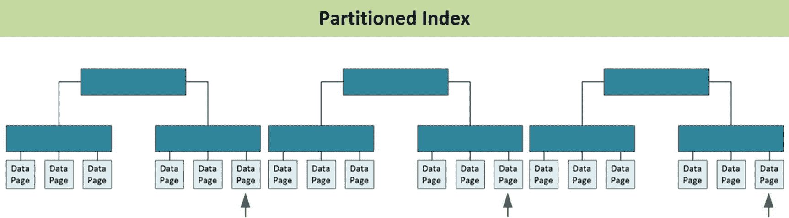

图 9-14：分散在各分区中的最后一页插入

让我们看一下哈希分区在运行工作负载以产生最后一页插入争用时的效果，就像我们在本章前面的示例中所做的那样。

我们需要做的第一件事是创建一个分区函数。这将根据列的值将表或索引中的行映射到分区。下面的脚本将创建一个名为 `LatchPartFunc` 的分区函数，它将根据列的值（我们将稍后创建）将行划分为九个分区。如下所示：

```sql
CREATE PARTITION FUNCTION [LatchPartFunc] (INT)
AS RANGE LEFT FOR VALUES
(0,1,2,3,4,5,6,7,8);
```

下一步是创建一个分区方案，将分区映射到文件组：

```sql
CREATE PARTITION SCHEME [LatchPartSchema]
AS PARTITION [LatchPartFunc] ALL TO ([PRIMARY]);
```

在这个例子中，我使用了 `PRIMARY` 文件组，但你可以自由创建额外的文件组来容纳这些分区。

接下来是使用下面的查询创建一个名为 `Insert_Test3` 的新表。注意 `ID_Hash` 列。这是一个计算列，它将根据 `ID` 列的值计算一个介于 0 到 8 之间的值：

```sql
CREATE TABLE Insert_Test3
(
ID INT IDENTITY(1,1),
RandomData VARCHAR(50),
ID_Hash AS (CONVERT(INT, abs(binary_checksum(ID) % (9)), (0))) PERSISTED
);
```

最后一步是创建一个聚集索引并将其映射到分区方案：

```sql
CREATE UNIQUE CLUSTERED INDEX idx_ID
ON Insert_Test3
(
ID ASC, ID_Hash
)
ON LatchPartSchema(ID_Hash);
```

现在我们已经设置了分区表，让我们重复一下导致我们前面示例中最后一页插入争用的 `ostress` 工作负载。我将插入操作的目标表更改为新的、已分区的 `Insert_Test3` 表。

```cmd
"C:\Program Files\Microsoft Corporation\RMLUtils\ostress.exe" -E -dAdventureWorks -Q"INSERT INTO Insert_Test3 (RandomData) VALUES (CONVERT(varchar(50), NEWID()))" -n500 -r100 -q
```


在两次 Ostress 工作负载运行期间，我使用 Perfmon 监控了每秒发生的锁存等待次数。图 9-15 展示了针对非分区索引的第一次 Ostress 工作负载和针对我们刚刚创建的分区索引的第二次工作负载的 Perfmon 图表。

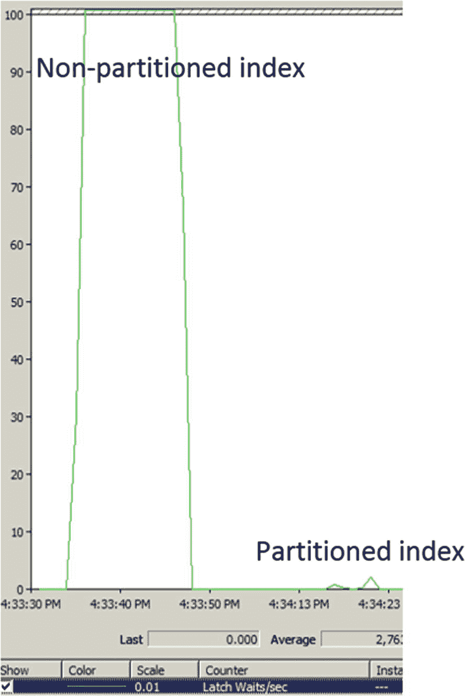

图 9-15

针对非分区索引和分区索引的每秒锁存等待次数

如你所见，配置哈希分区后，发生的锁存等待次数急剧下降！我们可以通过运行以下查询来查看行在不同分区间的分布情况：

```sql
SELECT *
FROM sys.partitions
WHERE object_id = OBJECT_ID('Insert_Test3');
```

图 9-16 展示了在我的测试 SQL Server 实例上执行此查询的结果。

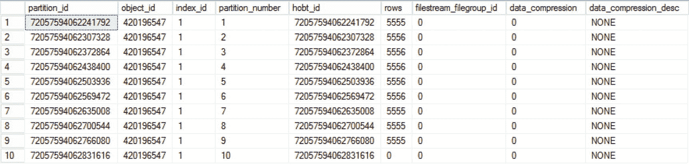

图 9-16

行在各分区间的分布

在图 9-16 中，我们看到在 `Insert_Test3` 表上创建的九个分区，通过 `partition_number` 列编号为 1 到 9。`rows` 列显示了每个分区内的行数，正如你所看到的，它们非常均匀地分布在九个分区中！`hobt_id` 返回存储此分区两行数据的 B 树 ID；所有分区都有不同的 ID，这意味着它们各自拥有独立的 B 树结构。

尽管分区是解决锁存争用问题的绝佳方法，但它确实伴随着其独特的挑战和缺点。其中两点是：它是一个仅限企业版的功能（除非你使用的是 SQL Server 2016 SP1 或更高版本），因此成本高昂；并且它可能影响查询执行计划的生成，导致产生次优计划。

### PAGELATCH_[xx] 总结

`PAGELATCH_[xx]` 等待类型表明用于保护内存中页面的缓冲区锁存遇到了其他不兼容的缓冲区锁存。与锁类似，锁存在不同的模式来保护页面，并非所有模式都是相互兼容的。观察到大量 `PAGELATCH_[xx]` 等待发生可能表明存在锁存争用情况。解决锁存争用可能具有挑战性，通常需要更改数据库设计或查询。

## LATCH_[xx]

另一种与锁存相关的等待类型是 `LATCH_[xx]` 等待类型。正如我们在上一节讨论的 `PAGELATCH_[xx]` 等待类型一样，`LATCH_[xx]` 等待与特定的锁存类相关。虽然 `PAGELATCH_[xx]` 等待类型与保护缓冲区缓存内部数据结构的锁存相关，但 `LATCH_[xx]` 等待类型与用于保护缓冲区缓存外部（但仍在 SQL Server 内存中）数据结构的锁存相关。

### 什么是 LATCH_[xx] 等待类型？

当你看到 `LATCH_[xx]` 等待类型发生时，表明某一特定类的非缓冲区锁存遇到了等待。`LATCH_[xx]` 实际上是这些不同非缓冲区锁存类等待时间的汇总，它本身并非一个独立的锁存类型。所有导致 `LATCH_[xx]` 等待类型显示等待时间的不同非缓冲区锁存类，都记录在各自的动态管理视图 (DMV) `sys.dm_os_latch_stats` 中。`LATCH_[xx]` 等待类型代表许多不同的锁存类，在 SQL Server 2017 中总计有 168 种。图 9-17 展示了可能发生 `LATCH_[xx]` 等待的内存区域。

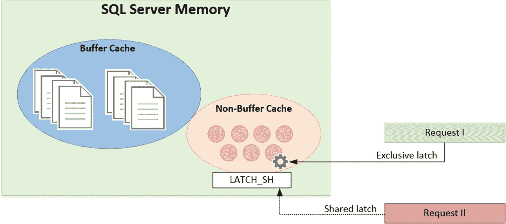

图 9-17

发生的 LATCH_SH 等待

由于 `LATCH_[xx]` 等待类型是特定锁存类上发生等待的累积视图，你需要查看 `sys.dm_os_latch_stats` DMV 内部才能找到 `LATCH_[xx]` 等待的确切原因。我们在本章开头的“锁存介绍”部分已经描述了 `sys.dm_os_latch_stats` DMV 的内部工作机制和列，因此这里不再对该 DMV 进行更多详细说明。

### LATCH_[xx] 示例

有一种锁存争用情况可能导致 `LATCH_[xx]` 等待。这个问题可能发生在具有浅层 B 树 结构的小表上（我们将在本节稍后详细解释 B 树 结构），尤其是在大量并发插入操作期间。此类表的典型用例可能是充当队列的消息表，并在消息发送后被截断。清单 9-2 中的脚本将创建一个名为 `Insert_Test2` 的测试表，并在该表上创建一个非聚集索引。

```sql
-- 创建表
CREATE TABLE Insert_Test2
(
ID UNIQUEIDENTIFIER,
RandomData VARCHAR(50)
);
-- 在 ID 列上创建非聚集索引
CREATE NONCLUSTERED INDEX idx_ID
ON Insert_Test2 (ID);
GO
```
清单 9-2
包含非聚集索引的争用测试表

ID 列的数据类型为 `UNIQUEIDENTIFIER`，以确保生成随机的、非顺序的值。通过在此列上创建非聚集索引，我们可以确保插入操作会随机分布在与非聚集索引关联的 B 树 上。

表创建完成后，我们可以启动 Ostress，其工作负载包含一个将在表中插入单行的插入查询。我们将使用 500 个并发连接运行此工作负载，每个连接执行查询 100 次。下面的命令展示了 Ostress 命令：

```shell
"C:\Program Files\Microsoft Corporation\RMLUtils\ostress.exe" -E -dAdventureWorks -Q"INSERT INTO Insert_Test2 (ID, RandomData) VALUES (NEWID(), CONVERT(varchar(50), NEWID()))" -n500 -r100 -q
```

在工作负载运行期间，我可以使用以下查询查看 `sys.dm_os_waiting_tasks` DMV，以便 `resource_description` 列能适应截图大小：

```sql
SELECT
session_id,
wait_duration_ms,
wait_type,
resource_description
FROM sys.dm_os_waiting_tasks;
```

图 9-18 展示了在我的测试 SQL Server 实例上执行此查询的部分结果。

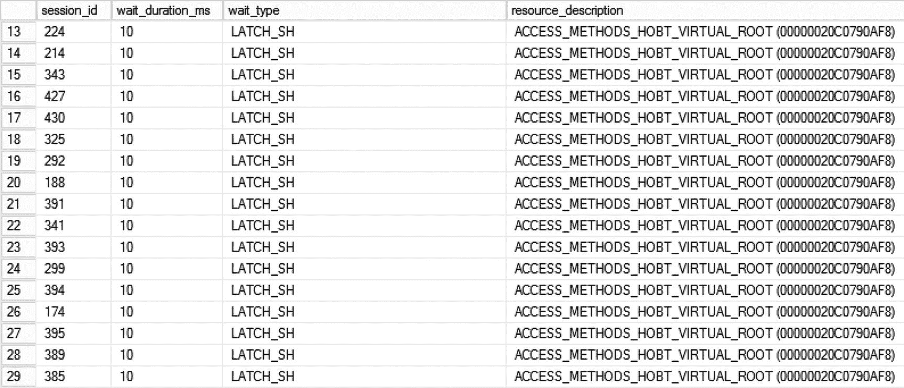

图 9-18

发生的 LATCH_SH 等待

`sys.dm_os_waiting_tasks` DMV 的 `resource_description` 列将帮助我们识别与 `LATCH_[xx]` 等待关联的锁存类。在此例中，我们遇到了 `ACCESS_METHODS_HOBT_VIRTUAL_ROOT` 锁存类。

现在我们知道了哪个锁存类遇到了等待，我们可以查询 `sys.dm_os_latch_stats` DMV 来找出此特定锁存类的等待次数和总等待时间，查询如下：

```sql
SELECT *
FROM sys.dm_os_latch_stats
WHERE latch_class = 'ACCESS_METHODS_HOBT_VIRTUAL_ROOT';
```

图 9-19 展示了在我的测试 SQL Server 实例上执行此查询的结果。

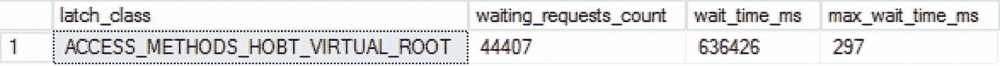

图 9-19

ACCESS_METHOD_HOBT_VIRTUAL_ROOT 锁存等待

现在我们已经确定了导致 LATCH_SH 等待发生的锁存类，我们可以开始对其进行故障排查。根据在线丛书（Books Online），`ACCESS_METHODS_HOBT_VIRTUAL_ROOT` 锁存类用于“同步访问内部 B 树 的根页抽象”。尽管描述相当有限，但它应该能给我们一个在排查此特定问题时从何处着手的思路。我在本书的附录 III 中包含了在线丛书上描述的不同锁存类列表，并在可能的情况下补充了一些额外信息。


### B 树结构与闩锁等待

显然，与索引关联的 B 树结构发生了某些变化。由于我们在创建的表上只有一个非聚集索引（`idx_ID`），我们可以假设是该索引的 B 树发生了某些变化。让我们通过查看图 9-20 来稍微刷新一下对 B 树索引结构的记忆。

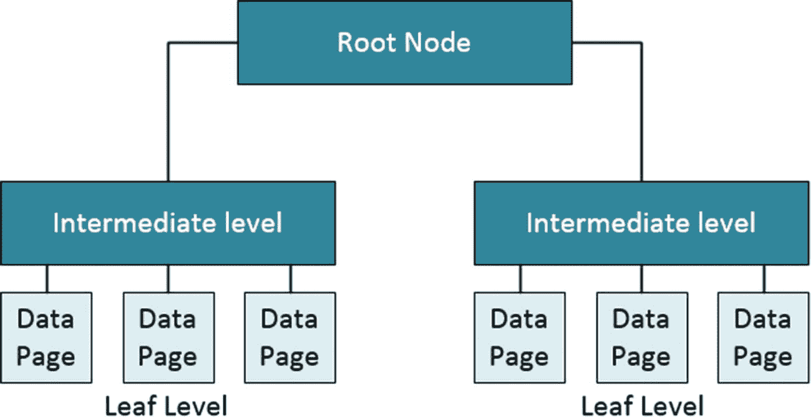

图 9-20 B 树索引结构

我们在图 9-20 中看到的 B 树结构非常浅，因为它只有三层。第一层是根节点（第 0 级），第二层是中间层（第 1 级），最后在 B 树底部是保存实际索引键的数据页（对于聚集索引，则是整行数据）。在图 9-20 中，我们只有一级中间节点，但根据索引内数据页的数量，可能存在更多中间层。当表非常小时，数据页可能直接位于中间层，而不是 B 树的更下层。

每当 SQL Server 需要遍历 B 树时，它都会从根节点的根页开始。根页将帮助它向下导航到中间层中保存所需信息的索引页。反过来，如果所需的信息不在中间层而在叶级，中间页可以将请求进一步向下发送到 B 树。叶级是索引中的最后一级；它无法再向下导航。图 9-21 展示了 SQL Server 如何遍历 B 树。在此例中，我使用了数字作为索引键以便更容易理解。

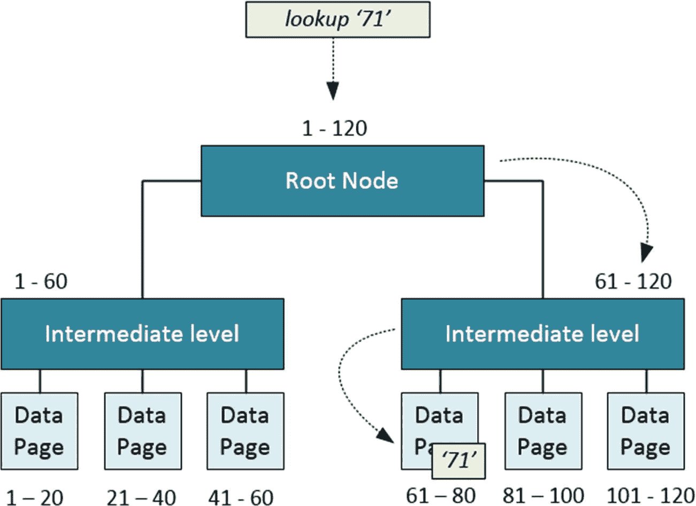

图 9-21 B 树导航

当向索引添加数据时，索引会在叶级分配新的数据页来保存索引键（记住，聚集索引在叶级保存行）。当插入足够多的数据以至于需要创建一个新的索引级别时，会发生根页拆分，以便可以访问索引中的新级别。这种根页拆分并不是将你的根页一分为二；始终只有一个根页，但它需要被更新，以便我们可以用它遍历 B 树找到新数据。

`ACCESS_METHODS_HOBT_VIRTUAL_ROOT`闩锁类是与在 B 树中创建另一个级别时发生的根页拆分相关联的闩锁等待类。每当发生根页拆分，B 树将获取一个排他（Exclusive）闩锁。所有希望向下遍历 B 树的线程都必须等待根页拆分完成，因为它们使用的是与排他闩锁不兼容的共享（Shared）闩锁。但是，为什么在我们的 Ostress 工作负载运行时看到的是`LATCH_SH`等待，而不是排他闩锁，因为我们执行的是插入操作呢？原因很简单：在 SQL Server 知道将新的索引键放置在索引中的哪个位置之前，它必须首先遍历 B 树以定位新索引键需要放置的位置，并且它在导航期间使用的是共享闩锁。

为了向你展示在我们的 Ostress 工作负载期间非聚集索引中添加了另一个级别，我将使用`INDEXPROPERTY`函数来检索我们创建的非聚集索引的深度。

首先要做的是使用`TRUNCATE`命令清空我们的`Insert_Test2`表：

```sql
TRUNCATE TABLE Insert_Test2;
```

如果我们对表上的非聚集索引使用`INDEXPROPERTY`函数，我们可以查看 B 树的当前深度。接下来的查询展示了如何使用`INDEXPROPERTY`函数来检索此信息：

```sql
SELECT INDEXPROPERTY(OBJECT_ID('Insert_Test2'), 'idx_ID', 'indexDepth')
```

由于我们刚刚截断了表，索引深度应为 0，因为表内还没有行。

然后我再次运行 Ostress 工作负载，完成后我再次查看索引信息。这次没有使用`INDEXPROPERTY`函数，而是使用`sys.dm_db_index_physical_stats` DMF 来返回有关索引中索引页和数据页数量的一些额外信息。此查询返回此类信息：

```sql
SELECT
    index_id,
    index_type_desc,
    index_depth,
    index_level,
    page_count,
    record_count
FROM sys.dm_db_index_physical_stats
    (DB_ID(N'AdventureWorks'), OBJECT_ID(N'Insert_Test2'), NULL, NULL , 'DETAILED');
```

图 9-22 显示了在我的测试 SQL Server 实例上执行此查询的结果。

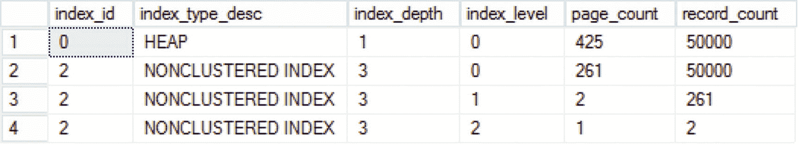

图 9-22 sys.dm_db_index_physical_stats 结果

如图中所示，非聚集索引现在有三个级别，由`index_depth`列指示。`index_level`和`page_count`列显示了 B 树每一级存在多少页。最高的`index_level`编号是根级，最低的是叶级。

虽然新的级别是在 B 树中创建的，但并发的插入查询在遍历 B 树之前必须等待，从而导致了`LATCH_SH`等待。

### 降低 LATCH_[xx]等待

在前面的例子中，我介绍了一种特定的闩锁争用情况，它发生在索引根页拆分以扩展 B 树结构时。正如我之前提到的，`LATCH_[xx]`等待类型报告了许多许多其他的闩锁类。这使得描述“一刀切”的建议变得不可能。不过，我可以描述一种通用的方法，使用这里的列表：

*   如果发生`LATCH_[xx]`等待，请查询`sys.dm_os_waiting_tasks`。`resource_description`列可以向你显示有关特定闩锁类的附加信息。如果你遇到`LATCH_[xx]`等待未显示在`sys.dm_os_waiting_tasks`中，但在`sys.dm_os_wait_stats` DMV 中可见高等待时间的情况，那么`sys.dm_os_latch_waits` DMV 应该是你的起点。

    另一个有用的 DMV 可能是`sys.dm_exec_requests` DMV。与`sys.dm_exec_sql_text` DMF 结合使用，它可能帮助你找到导致`LATCH_[xx]`等待的查询。

*   查询`sys.dm_os_latch_waits`，查看是否与`sys.dm_os_waiting_tasks` DMV 的`resource_description`列中显示的闩锁类相关。

*   查阅联机丛书或本书的附录 III，以获取有关特定闩锁类的更多信息。

关于常见闩锁类的另一个有用资源是 Paul Randal 的博客文章“最常见的闩锁类及其含义”，网址是[`www.sqlskills.com/blogs/paul/most-common-latch-classes-and-what-they-mean/`](http://www.sqlskills.com/blogs/paul/most-common-latch-classes-and-what-they-mean/)。尽管 Paul 只描述了十种最常见的闩锁类，但它可以作为你调查的良好起点。

值得庆幸的是，`LATCH_[xx]`等待类型出现持续高等待时间的情况并不常见，因为导致`LATCH_[xx]`等待发生的情况通常与非常特定的工作负载和数据库设计相关。


### LATCH_[xx] 概述

`LATCH_[xx]` 等待类型代表 SQL Server 内部大量不同的、与缓冲区无关的闩锁类所遇到的等待。这些与缓冲区无关的闩锁类拥有自己专属的闩锁等待 DMV，即 `sys.dm_os_latch_waits`，它会返回这些闩锁类的等待时间。对 `LATCH_[xx]` 等待进行故障排除可能很困难，因为与此等待类型关联的闩锁类文档非常少。值得庆幸的是，`LATCH_[xx]` 等待类型出现高等待时间的情况并不常见，因为它们只在非常特定的情况和工作负载下才会发生。

## PAGEIOLATCH_[xx]

本章我们将讨论的最后一种与闩锁相关的等待类型是 `PAGEIOLATCH_[xx]` 等待类型。`PAGEIOLATCH_[xx]` 等待类型是目前最常见的一种与闩锁相关的等待类型，它与 `CXPACKET` 等待类型并列为任何 SQL Server 实例上最常见的等待类型。

就像我们之前讨论的两种闩锁等待类型一样，`PAGEIOLATCH_[xx]` 也有不同的访问模式，我在本章中用 `[xx]` 代替了它们。由于我们已经在引言部分描述了不同的闩锁模式，因此本章将不再进一步讨论它们。

到目前为止，我们已经讨论了三种与闩锁相关的等待类型中的两种及其相关领域。`PAGELATCH_[xx]` 等待类型与在缓冲区缓存内的内存页上放置的闩锁有关，而 `LATCH_[xx]` 等待类型则与非缓冲区对象上的闩锁有关。`PAGEIOLATCH_[xx]` 等待类型也指示了 SQL Server 中特定区域的闩锁使用情况，在此例中是指 I/O 闩锁。

### PAGEIOLATCH_[xx] 等待类型是什么？

SQL Server 内部的磁盘操作开销非常大。访问系统的磁盘子系统需要额外的资源，并且总是比访问系统内存中的信息要慢。由于 SQL Server 是一个数据库，并且访问和存储数据库内的数据是其主要功能，因此 SQL Server 访问数据的方式极其重要。如果数据访问速度慢，SQL Server 的运行速度也会变慢，这可能会导致查询或应用程序出现明显的性能下降。为了使 I/O 交互尽可能高效，SQL Server 使用一个缓冲区缓存，将先前访问过的数据页缓存到系统的内存中。通过缓存数据页，SQL Server 只需在首次查询请求这些特定数据页时访问一次磁盘子系统。当后续查询需要与首次查询相同的数据页时，SQL Server 将通过缓冲区管理器检测到这些页已在缓冲区缓存中，并从缓冲区缓存内部访问数据页，而不是与磁盘子系统进行额外的交互。图 9-23 展示了当查询需要来自存储子系统的数据页时的缓冲区缓存行为。

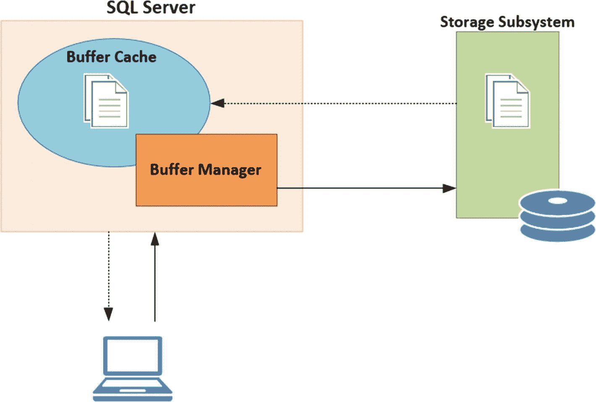

图 9-23 将页从存储子系统移动到缓冲区缓存

在将数据页从存储子系统移动到缓冲区缓存的过程中，会使用闩锁为存储子系统上的数据页在缓冲区缓存中“预留”一个缓冲页。这确保了没有其他并发事务分配同一个缓冲页，或者同时尝试将同一个数据页从存储子系统传输到缓冲区缓存。

当 SQL Server 正在将数据页从存储子系统传输到缓冲区缓存时，会对该缓冲页放置一个独占 (Exclusive) 闩锁。由于独占闩锁几乎与所有其他闩锁模式都不兼容（保留 (Keep) 模式除外），这保证了在数据页传输期间，没有其他闩锁可以访问该缓冲页。从用户的角度来看，在整个数据页传输期间都会记录一个 `PAGEIOLATCH_[xx]` 等待。该闩锁的模式取决于引发数据页从存储子系统移动到缓冲区缓存的操作。如果数据是因读取访问而移动的，则记录 `PAGEIOLATCH_SH`；如果数据页是因修改操作而移动的，则使用 `PAGEIOLATCH_UP` 或 `PAGEIOLATCH_EX`。图 9-24 展示了数据页移动过程，包括闩锁和闩锁等待。

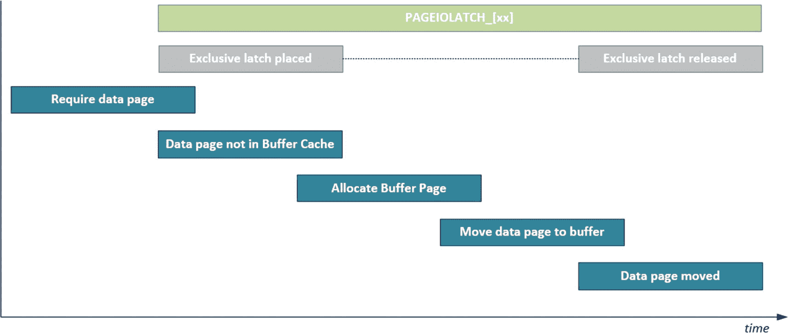

图 9-24 数据页的移动

总结以上内容，如果你看到发生了 `PAGEIOLATCH_[xx]` 等待，这意味着你的 SQL Server 实例正在从存储子系统将数据读入缓冲区缓存。因为这是一个非常常见的操作，所以很容易理解为什么 `PAGEIOLATCH_[xx]` 等待类型是任何 SQL Server 实例上最常见的等待类型之一。

### PAGEIOLATCH_[xx] 示例

为 `PAGEIOLATCH_[xx]` 等待创建一个示例极其简单——只需对一个刚重启的 SQL Server 实例运行一个 `SELECT` 查询即可。重启 SQL Server 服务将清空缓冲区缓存中的所有数据页。这将使你得到一个不含任何用户数据的缓冲区缓存。不过，还有另一种无需重启 SQL Server 服务即可清空缓冲区缓存的方法。运行 `DBCC DROPCLEANBUFFERS` 命令将从缓冲区缓存中移除所有未修改的数据页。将其与 `CHECKPOINT` 命令结合使用，可确保修改过的页也被写入磁盘，从而得到一个空的，或称“冷”的缓冲区缓存。

清单 9-3 中的查询将执行一个 `CHECKPOINT`，然后是 `DBCC DROPCLEANBUFFERS`。接着，它将重置 `sys.dm_os_wait_stats` DMV 并对 `AdventureWorks` 数据库运行一个查询。在对 `AdventureWorks` 数据库内的一些表执行查询后，我们将查询 `sys.dm_os_wait_stats` DMV 以查看 `PAGEIOLATCH_[xx]` 等待。

```sql
CHECKPOINT 1;
GO
DBCC DROPCLEANBUFFERS;
GO
DBCC SQLPERF('sys.dm_os_wait_stats', CLEAR);
GO
SELECT
SOD.SalesOrderID,
SOD.CarrierTrackingNumber,
SOH.CustomerID,
C.AccountNumber,
SOH.OrderDate,
SOH.DueDate
FROM Sales.SalesOrderDetail SOD
INNER JOIN Sales.SalesOrderHeader SOH
ON SOD.SalesOrderID = SOH.SalesOrderID
INNER JOIN Sales.Customer C
ON SOH.CustomerID = C.CustomerID;
SELECT *
FROM sys.dm_os_wait_stats
WHERE wait_type LIKE 'PAGEIOLATCH_%';
```

清单 9-3 生成 `PAGEIOLATCH_SH` 等待

图 9-25 显示了我的测试 SQL Server 实例上最后一个查询对 `sys.dm_os_wait_stats` DMV 的查询结果。

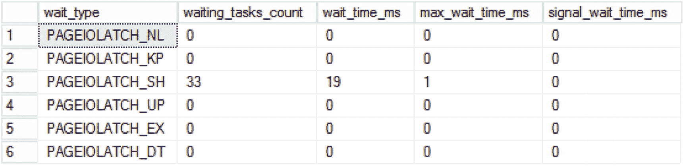

图 9-25 `PAGEIOLATCH_SH` 等待时间信息

只看到记录了 `PAGEIOLATCH_SH` 等待是有道理的，因为我们执行的是 `SELECT` 查询而不是进行数据修改。如果我们要对行执行某种形式的数据修改，我们将在结果中看到 `PAGEIOLATCH_EX` 等待。


### 降低 `PAGEIOLATCH_[xx]` 等待

如果你阅读了前一节，你可能会理解，看到 `PAGEIOLATCH_[xx]` 等待发生是 SQL Server 内部完全正常的行为。在许多情况下，你的数据库大小超过了系统中可用的 RAM 量，因此与存储子系统发生一些交互是意料之中的。即使你的数据库小于系统中的 RAM 量，并且可以完全放入缓冲区缓存中，在 SQL Server 启动期间，你仍然会注意到 `PAGEIOLATCH_[xx]` 等待的发生，因为这是 SQL Server 开始将数据页从存储子系统移入缓冲区缓存的时间（如果有任何查询活动，SQL Server 自身不会将数据从存储子系统移入缓冲区缓存）。

既然看到 `PAGEIOLATCH_[xx]` 等待发生对于每个 SQL Server 实例来说都是完全正常的，那么为等待时间维护一个基准就非常重要（第 4 章“构建一个可靠的基准”可以帮到你）。当等待时间保持在该等待类型的基准值范围内时，就不应该有任何担忧的原因。如果等待时间远高于你的预期，可能有必要调查高于正常等待时间的来源。导致看到高于正常水平的 `PAGEIOLATCH_[xx]` 等待时间的原因有很多，我将描述一些比较常见的原因。

当我注意到高于正常水平的 `PAGEIOLATCH_[xx]` 等待时间时，我首先查看的是 SQL Server 日志，以查明 SQL Server 是否已重启。SQL Server 可能因为崩溃而重启，也可能在发生故障转移时重启。这些事件将导致高的 `PAGEIOLATCH_[xx]` 等待时间，这可能不会反映在你的基准中，尤其是在 SQL Server 重启不频繁发生的情况下。由于我们的基准测量通常使用平均值进行计算，随着更多测量值被纳入平均基准中，SQL Server 启动期间的 `PAGEIOLATCH_[xx]` 等待时间会逐渐降低。如果你在特定时间范围内获取的测量值上创建基准，并且在此时间范围内 SQL Server 没有重启，那么你的基准测量值也会显著降低。正如我们在示例部分读到的，`DBCC DROPCLEANBUFFERS` 也会从缓冲区缓存中移除数据页，导致命令完成后出现更高的 `PAGEIOLATCH_[xx]` 等待时间。遗憾的是，与 `DBCC FREEPROCCACHE` 命令不同，执行 `DBCC DROPCLEANBUFFERS` 命令不会记录在 SQL Server 日志中。

我看到关于降低 `PAGEIOLATCH_[xx]` 等待时间的一个比较常见的建议是，将注意力集中在存储子系统上。由于 `PAGEIOLATCH_[xx]` 等待类型表示数据从你的存储子系统移动到缓冲区缓存，因此存储子系统在等待时间中扮演着至关重要的角色是合乎逻辑的，但不要自动假设这是根本原因！如果你确实存在与存储相关的问题，这可能会在 `PAGEIOLATCH_[xx]` 等待时间中体现出来，因此检查存储子系统的性能是值得的。

开始监控存储性能的一个好地方是性能监视器 (Perfmon)。Perfmon 有各种计数器，可以显示存储子系统的当前性能。以下列表中的那些是我在监控存储性能时最常用的：

*   `PhysicalDisk\Avg. Disk sec/Read`：这将显示你正在监控的磁盘上的平均读取延迟。延迟越低越好，作为一般准则，延迟值应低于 20 毫秒（在 Perfmon 中为 0.020，因为它以秒为单位报告延迟）。
*   `PhysicalDisk\Avg. Disk sec/Write`：这将返回你正在监控的磁盘上的平均写入延迟。与读取延迟一样，作为一般准则，写入延迟应低于 20 毫秒。
*   `PhysicalDisk\Disk Reads/sec`：这显示每秒的读取 IOPS（输入输出操作）数量。如果你的磁盘遇到容量问题，这些信息可能会有所帮助。
*   `PhysicalDisk\Disk Writes/sec`：与 `PhysicalDisk\Disk Reads/sec` 相同，但这一个显示写入 IOPS 的数量。
*   `PhysicalDisk\Disk Read Bytes/sec`：此计数器显示每秒从磁盘读取的字节数。同样，这些信息对于检测可能的容量问题很有用。
*   `PhysicalDisk\Disk Write Bytes/sec`：这与 `PhysicalDisk\Disk Read Bytes/sec` 相同，但此计数器显示每秒写入磁盘的字节数。

利用这些 Perfmon 测量提供的信息，你应该能够识别可能的与存储相关的瓶颈。这些信息对于存储管理员（如果有的话）也很有帮助，他可以将其与他/她管理的存储的测量值进行比较。

作为一个额外的诊断工具，或者如果你无法使用 Perfmon，你也可以运行 Paul Randal 基于 `sys.dm_io_virtual_file_stats` DMF 创建的 IO 性能脚本，如清单 9-4 所示。该脚本以及描述该脚本的博客文章可以在 Paul 的博客上找到：[`www.sqlskills.com/blogs/paul/how-to-examine-io-subsystem-latencies-from-within-sql-server/`](http://www.sqlskills.com/blogs/paul/how-to-examine-io-subsystem-latencies-from-within-sql-server/)。

```sql
SELECT
[ReadLatency] =
CASE WHEN [num_of_reads] = 0
THEN 0 ELSE ([io_stall_read_ms] / [num_of_reads]) END,
[WriteLatency] =
CASE WHEN [num_of_writes] = 0
THEN 0 ELSE ([io_stall_write_ms] / [num_of_writes]) END,
[Latency] =
CASE WHEN ([num_of_reads] = 0 AND [num_of_writes] = 0)
THEN 0 ELSE ([io_stall] / ([num_of_reads] + [num_of_writes])) END,
[AvgBPerRead] =
CASE WHEN [num_of_reads] = 0
THEN 0 ELSE ([num_of_bytes_read] / [num_of_reads]) END,
[AvgBPerWrite] =
CASE WHEN [num_of_writes] = 0
THEN 0 ELSE ([num_of_bytes_written] / [num_of_writes]) END,
[AvgBPerTransfer] =
CASE WHEN ([num_of_reads] = 0 AND [num_of_writes] = 0)
THEN 0 ELSE
(([num_of_bytes_read] + [num_of_bytes_written]) /
([num_of_reads] + [num_of_writes])) END,
LEFT ([mf].[physical_name], 2) AS [Drive],
DB_NAME ([vfs].[database_id]) AS [DB],
[mf].[physical_name]
FROM
sys.dm_io_virtual_file_stats (NULL,NULL) AS [vfs]
JOIN sys.master_files AS [mf]
ON [vfs].[database_id] = [mf].[database_id]
AND [vfs].[file_id] = [mf].[file_id]
-- WHERE [vfs].[file_id] = 2 -- 日志文件
ORDER BY [Latency] DESC
-- ORDER BY [ReadLatency] DESC
-- ORDER BY [WriteLatency] DESC;
GO
```

清单 9-4
IO 性能脚本

图 9-26 显示了在我的测试 SQL Server 实例上执行清单 9-4 中的 IO 性能脚本的部分结果，按延迟排序。

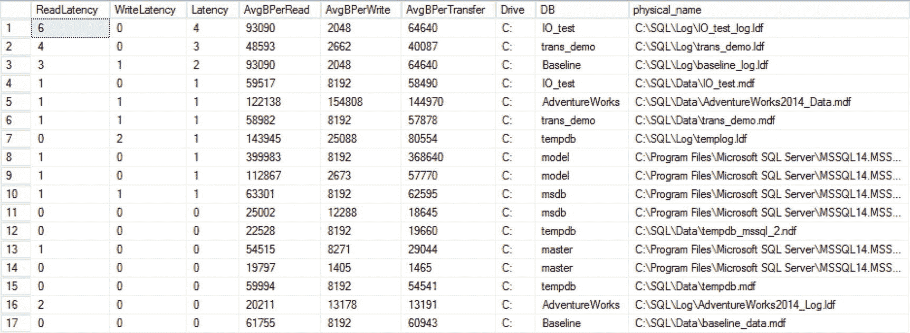

图 9-26
我的测试 SQL Server 实例上的 IO 性能

使用 IO 性能脚本时要记住的一个重要点是，其值是从 SQL Server 服务启动开始累积的。它们不显示执行查询时的即时情况。如果你有兴趣使用此脚本监控 IO 性能，可以考虑在特定时间间隔将输出捕获到表中，并计算增量（就像我们在第 4 章“构建一个可靠的基准”中所做的那样）。


除了存储子系统的性能外，查询的行为也会影响 `PAGEIOLATCH_[xx]` 等待类型的等待时间。查询请求的数据越多（这些数据不在缓冲区缓存中），需要从存储子系统读取到缓冲区缓存的数据量就越大。例如，如果我们修改清单 9-3 中的查询，如清单 9-5 所示，使其更具选择性以返回更少的数据，那么 `PAGEIOLATCH_[xx]` 的等待时间也应该更少。

```
CHECKPOINT 1;
GO
DBCC DROPCLEANBUFFERS;
GO
DBCC SQLPERF('sys.dm_os_wait_stats', CLEAR);
GO
SELECT
SOD.SalesOrderID,
SOD.CarrierTrackingNumber,
SOH.CustomerID,
C.AccountNumber,
SOH.OrderDate,
SOH.DueDate
FROM Sales.SalesOrderDetail SOD
INNER JOIN Sales.SalesOrderHeader SOH
ON SOD.SalesOrderID = SOH.SalesOrderID
INNER JOIN Sales.Customer C
ON SOH.CustomerID = C.CustomerID
WHERE SOD.CarrierTrackingNumber BETWEEN 'F467-41BF-8B' AND 'F4E4-4739-B4'
;
SELECT *
FROM sys.dm_os_wait_stats
WHERE wait_type LIKE 'PAGEIOLATCH_%';
```
清单 9-5 修改后的清单 9-3 查询

图 9-27 显示了最后针对 `sys.dm_os_wait_stats` DMV 执行的查询的结果。

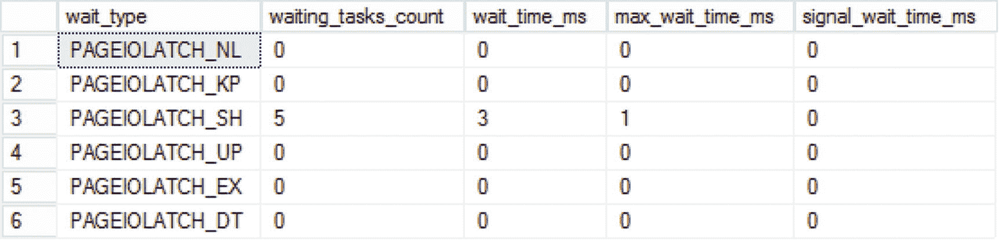

图 9-27 PAGEIOLATCH_SH 等待时间信息

如图 9-27 所示，`PAGEIOLATCH_SH` 等待类型的等待时间从 19 毫秒急剧下降到 3 毫秒。这个例子规模很小，我们处理的是非常小的结果集，但它说明了问题。

然而，您并非总能奢侈地修改每个查询使其更具选择性。也许查询是由应用程序生成的，您甚至无法修改它们，或者查询就是需要大的结果集。值得庆幸的是，作为 DBA，我们也可以通过简单地执行数据库维护来帮助最小化 `PAGEIOLATCH_[xx]` 等待时间。索引碎片和过时的统计信息会显著增加 `PAGEIOLATCH_[xx]` 等待时间。如果索引碎片化，检索所需数据需要执行更多的磁盘 I/O，这意味着 I/O 锁定需要保持更长时间，从而导致更高的 `PAGEIOLATCH_[xx]` 等待时间。过时的统计信息也可能导致更多的磁盘 I/O，因为 SQL Server 预期的行数与实际返回的行数不同。因此，请确保您定期执行索引和统计信息维护，以确保磁盘交互量尽可能小。

最终影响 `PAGEIOLATCH_[xx]` 等待时间的领域是系统的内存。如果数据页在特定时间段内未被访问，SQL Server 将从缓冲区缓存中移除它们，以便为缓冲区缓存腾出空间。SQL Server 执行此清理操作的间隔取决于进入缓冲区缓存的数据量以及缓冲区缓存中的可用空间量。如果对缓冲区缓存中数据页的请求非常高，SQL Server 将被迫将最少访问（或一段时间未访问）的数据页换出，以腾出空间给当前需要的页面。这种数据页在缓冲区缓存中移入移出的操作将导致更多的 `PAGEIOLATCH_[xx]` 等待。在理想情况下，您的数据库应完全适合 SQL Server 实例的缓冲区缓存。在这种情况下，SQL Server 只需要将数据页从存储子系统移动到缓冲区缓存一次，它们将一直保留在那里直到 SQL Server 再次重启。尽管我们现在可以使用非常大的 RAM，但在许多情况下，我们无法简单地将整个数据库放入 SQL Server 实例的缓冲区缓存中，因此可以预期会发生一些数据页从缓冲区缓存换回到存储子系统的情况。为系统增加更多 RAM 将提高缓冲区缓存可以存储的数据页数量，并有助于缓冲区缓存将这些页面在内存中保留更长时间。

有两个 Perfmon 计数器可以帮助您深入了解缓冲区缓存的使用情况：`SQLServer:Buffer Manager\Buffer cache hit ratio` 和 `SQLServer:Buffer Manager\Page life expectancy`。`SQLServer:Buffer Manager\Buffer cache hit ratio` 将显示可以在缓冲区缓存中找到而无需对存储子系统进行物理读取的页面百分比。`SQLServer:Buffer Manager\Page life expectancy` 计数器将显示数据页在缓冲区缓存中停留的秒数。如果您看到这两个计数器的值持续低于您的基线，可能意味着 SQL Server 正在遇到内存压力，需要将数据页从缓冲区缓存移回磁盘以释放内存。然而，这两个计数器并不完美，关于它们的工作原理（特别是它们的理想值）已有大量论述。我们不会深入讨论这些计数器应该达到什么好值，因为这需要参考您的基线，但我相信它们是调查缓冲区缓存内存压力的良好起点。

### PAGEIOLATCH_[xx] 总结

到目前为止，`PAGEIOLATCH_[xx]` 等待类型是最常见的与锁存相关的等待类型。它与 `CXPACKET` 等待类型一起，可能是任何 SQL Server 实例上最常见的等待类型。`PAGEIOLATCH_[xx]` 等待类型与数据页从存储子系统移动到 SQL Server 实例的缓冲区缓存内存直接相关。SQL Server 使用缓冲区缓存来最小化对（慢得多的）存储子系统的交互次数，从而最大化性能。每当一个数据页被读入缓冲区缓存时，就会记录为此操作所花费时间的 `PAGEIOLATCH_[xx]` 等待类型。有许多方法可以降低 `PAGEIOLATCH_[xx]` 的等待时间。经常被建议的“使用更快的存储”并不总是成立，尽管快速存储确实会直接影响 `PAGEIOLATCH_[xx]` 等待时间。优化查询使其需要移动到缓冲区缓存的数据页更少、对索引和统计信息执行维护，以及分析内存性能，都可能有助于降低 `PAGEIOLATCH_[xx]` 等待时间。


