# 第 10 章 高可用性与灾难恢复等待类型

SQL Server 中一直有多种选项可用，以确保您的数据库始终对用户可用，和/或将数据库内的数据复制到另一台服务器，从而最大程度地降低数据丢失的可能性。就像执行定期数据库备份以确保在发生崩溃或数据损坏时可以恢复到数据库的先前状态一样，规划并维护高可用的数据库环境是数据库管理员工作的一部分。

如今，数据对许多公司变得极其重要，对高可用性数据库服务器的需求日益增长，许多数据库管理员会发现自己在管理高可用解决方案（如镜像）或灾难恢复配置（如日志传送）中的 SQL Server 实例。伴随着这些类型的 SQL Server 高可用性和灾难恢复配置，出现了一组专用的等待类型，它们与您的高可用性和灾难恢复（HA/DR）配置的运行状况直接相关。随着 SQL Server 2012 中 SQL Server AlwaysOn 可用性组的发布，配置 HA/DR 解决方案有了更多选项，同时出现了与 AlwaysOn 可用性组直接相关的新等待类型。

在本章中，我们将探讨在 HA/DR 配置中最常见的一些等待类型。本章中等待类型的主要关注点是 AlwaysOn 可用性组，因为 Microsoft 正在弃用许多先前属于现在统称为 AlwaysOn 可用性组名下的功能，例如镜像。作为此规则的一个例外，我选择了一个与镜像相关的等待类型，它在高度使用的镜像配置中相对常见。所有其他等待类型都与 AlwaysOn 可用性组相关。

对于本章中的示例，我使用了多个虚拟机来创建一个镜像和一个 AlwaysOn 可用性组配置。这些虚拟机的配置可以在附录 I 示例 SQL Server 机器配置中找到。

## DBMIRROR_SEND

本章我想讨论的第一个等待类型是 `DBMIRROR_SEND` 等待类型。正如您可能从等待类型名称中猜到的那样，`DBMIRROR_SEND` 与数据库镜像相关。

数据库镜像是在 SQL Server 2005 中引入的功能，但在 SQL Server 2012 中被宣布弃用。这并不意味着您不能在 SQL Server 2012 或 SQL Server 2014 中使用数据库镜像，但这确实意味着它计划被移除。整个功能将被 AlwaysOn 可用性组取代，后者提供了与数据库镜像相同的配置选项。

数据库镜像是一种提高 SQL Server 数据库可用性的解决方案，并且与故障转移群集等不同，它可以基于每个数据库进行配置。数据库镜像的工作原理是在镜像数据库上重做主数据库（在数据库镜像术语中称为 `principal`）上发生的每个数据修改操作。通过将活动的事务日志记录流式传输到镜像服务器来实现每个数据库修改操作的重做，镜像服务器将按照它们插入主数据库事务日志的顺序在镜像数据库上执行这些操作。

数据库镜像提供两种不同的操作模式，它们会影响镜像配置的可用性和性能：同步（或高安全）模式和异步（或高性能）模式。尽管两种模式执行相同的动作以确保数据修改操作也在镜像数据库上执行，但性能可能存在很大差异，因此发生的等待也可能不同。

同步镜像模式确保在主服务器上执行的每个数据修改操作也直接在镜像上执行。它通过等待向客户端发送事务确认消息，直到事务成功写入镜像上的磁盘来实现这一点。图 10-1 描绘了同步镜像。

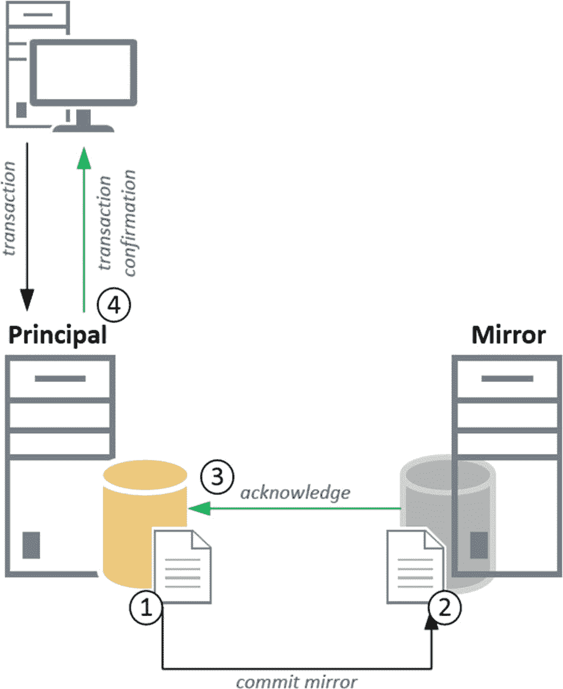

**图 10-1 同步镜像**

尽管同步镜像确保主服务器和镜像上的数据完全一致，但它也有一些缺点。其中之一是，在同步镜像配置中，数据库的性能高度依赖于镜像处理数据修改操作的速度，因为每个事务必须先在镜像上提交。

数据修改事务的流程描述如下：

1.  当接收到事务时，主服务器会将事务写入事务日志，但此时事务尚未提交。
2.  主服务器将日志记录发送到镜像。
3.  镜像将日志记录固化到磁盘，并向主服务器发送确认。
4.  主服务器收到确认后，将向客户端发送事务已完成的确认消息，事务随即在主服务器的事务日志中提交。

异步模式的工作方式非常相似；不同之处在于，它不会在向客户端发送事务确认消息之前等待来自镜像的确认消息。这意味着事务在主服务器上提交到磁盘后，才被写入镜像上的磁盘。使用异步镜像将提高镜像性能，因为消除了同步镜像的延迟开销。这种性能提升的代价是，在发生灾难时，异步复制可能导致数据丢失，因为事务可能尚未在镜像上提交。图 10-2 显示了异步镜像上的事务日志流；虚线表示这些动作不是直接执行的。

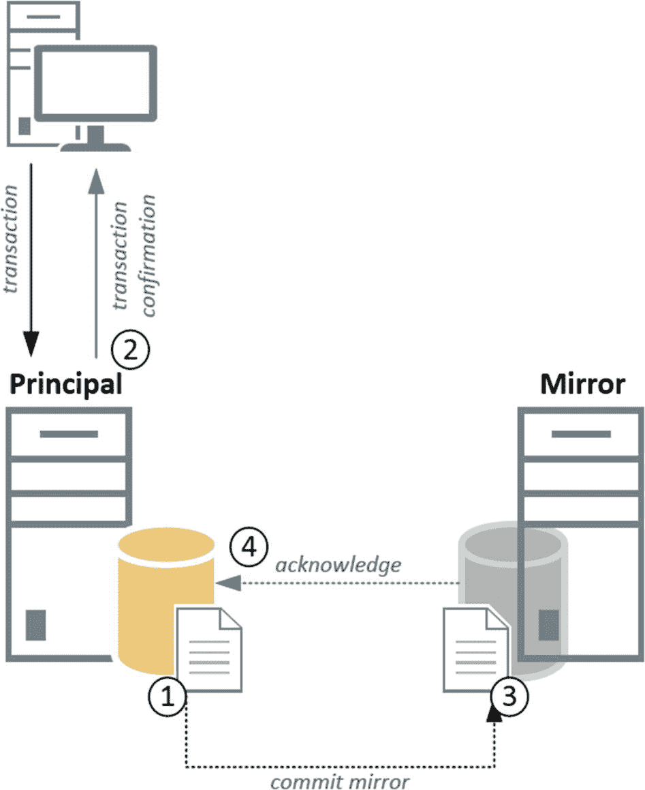

**图 10-2 异步镜像**

### 什么是 DBMIRROR_SEND 等待类型？

`DBMIRROR_SEND` 等待类型最常与同步镜像配置相关。联机丛书中对 `DBMIRROR_SEND` 等待类型的描述是“当任务正在等待网络层上的通信积压清除以便能够发送消息时发生。表示通信层开始变得过载并影响数据库镜像数据吞吐量。”在这种情况下，联机丛书的描述相当准确，但网络并不是唯一可能影响 `DBMIRROR_SEND` 等待时间的因素。例如，连接到镜像数据库的磁盘子系统速度慢也可能导致 `DBMIRROR_SEND` 等待时间增加。

另一个需要记住的重要点是，高的 `DBMIRROR_SEND` 等待时间通常只记录在镜像实例上，而不是主服务器上。通常可以看到在主服务器和镜像上都发生 `DBMIRROR_SEND` 等待类型的等待，但在主服务器上通常非常低。在镜像上它们仍然可能达到较高的值，因为一般来说，两个 SQL Server 实例之间总是存在一些延迟。由于预期的延迟，我建议您使用基线测量来识别 `DBMIRROR_SEND` 等待类型的等待时间是否高于正常水平。


### DBMIRROR_SEND 示例

在本例中，我在两个测试 SQL Server 实例之间构建了一个同步镜像，使用 `AdventureWorks` 数据库作为在两个实例之间镜像的数据库。

在 `AdventureWorks` 数据库内部，我使用清单 10-1 中的脚本创建了一个简单的表。

```
USE [AdventureWorks]
GO
CREATE TABLE Mirror_Test
(
ID UNIQUEIDENTIFIER PRIMARY KEY,
RandomData VARCHAR(50)
);
清单 10-1
创建 Mirror_Test 表
```

表创建后，我清除了 `sys.dm_os_wait_stats` DMV，并使用清单 10-2 中的查询向 `Mirror_Test` 表插入了 10,000 行数据。在运行清单 10-2 中的脚本之前，我也确保清除了镜像上的 `sys.dm_os_wait_stats` DMV。

```
DBCC SQLPERF('sys.dm_os_wait_stats, CLEAR')
INSERT INTO Mirror_Test
(
ID,
RandomData
)
VALUES
(
NEWID(),
CONVERT(VARCHAR(50), NEWID())
);
GO 10000
清单 10-2
向 Mirror_Test 表插入 10,000 行数据
```

在脚本运行期间，我使用以下查询查看镜像和主体服务器上的 `DBMIRROR_SEND` 等待时间：

```
SELECT *
FROM sys.dm_os_wait_stats
WHERE wait_type = 'DBMIRROR_SEND'
```

此查询的结果如图 10-3 所示，显示了镜像上的 `DBMIRROR_SEND` 等待时间。图 10-4 显示了主体服务器上的 `DBMIRROR_SEND` 等待时间。


**图 10-4** 主体上的 DBMIRROR_SEND 等待时间


**图 10-3** 镜像上的 DBMIRROR_SEND 等待时间

如你所见，在镜像上，我们花费了相当多的时间等待 `DBMIRROR_SEND` 等待类型，而在主体上则没有 `DBMIRROR_SEND` 等待。

### 降低 DBMIRROR_SEND 等待

降低 `DBMIRROR_SEND` 等待时间最常见的建议之一是将镜像模式从同步更改为异步。虽然这无疑会降低等待时间，但也意味着当主体发生灾难时，你可能会丢失数据。降低 `DBMIRROR_SEND` 等待类型的等待时间将对你查询的持续时间产生积极影响。例如，在上一节的例子中，在我的测试 SQL Server 镜像配置上，插入 10,000 行大约需要 30 秒。当我将镜像模式从同步更改为异步时，不仅 `DBMIRROR_SEND` 等待类型的等待时间下降了，10,000 次插入的总执行时间也下降到 3 秒。这提升了近 30 秒！

尽管这些改进听起来非常诱人，但有时更改镜像模式并不可行。例如，你公司的灾难恢复策略可能要求同步镜像配置。在我看来，将镜像模式从同步更改为异步应该是最后的选择（如果它确实是一个可行的选择）。还有其他部分会影响 `DBMIRROR_SEND` 等待时间，比如镜像上的存储配置或主体和镜像 SQL Server 实例之间的网络连接。这两个部分都可能成为两个实例之间的瓶颈，导致 `DBMIRROR_SEND` 等待时间增加。

除了检查你的存储子系统和网络连接的性能外，SQL Server 还有一个数据库镜像监视器，它会提供有关镜像配置的状态信息。你可以通过右键单击属于镜像一部分的数据库，选择“任务” ➤ “数据库镜像监视器”来找到数据库镜像监视器。图 10-5 显示了针对我的测试镜像配置的监视器。

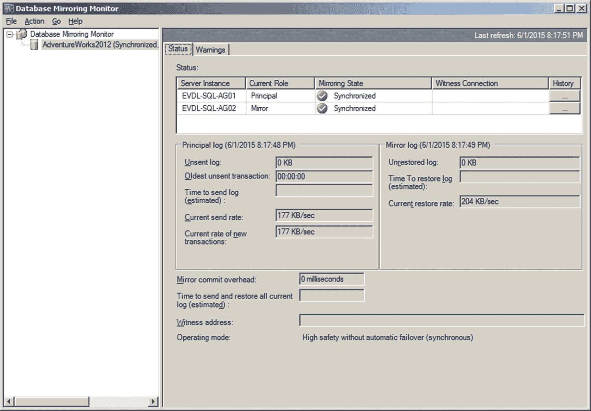
**图 10-5** 数据库镜像监视器

如你所见，数据库镜像监视器可以为你提供一些非常有趣的额外信息，例如仍需发送或还原的日志记录数量、镜像当前落后的程度，以及发送和还原速率。在我处理数据库镜像的许多情况下，当涉及镜像配置的性能问题时，数据库镜像监视器是我会首先检查的地方。

### DBMIRROR_SEND 总结

`DBMIRROR_SEND` 等待类型与数据库镜像直接相关。在大多数镜像配置上看到 `DBMIRROR_SEND` 等待发生是相当正常的。这使得使用基线来识别等待时间峰值成为必要。镜像模式在 `DBMIRROR_SEND` 等待时间中扮演着重要角色。使用同步镜像时，`DBMIRROR_SEND` 等待时间通常会高于使用异步镜像时。不过，不仅镜像模式影响 `DBMIRROR_SEND` 等待时间。镜像 SQL Server 实例上的存储子系统无法跟上负载也会影响 `DBMIRROR_SEND` 等待，主体与镜像之间的网络连接也是如此。

## HADR_LOGCAPTURE_WAIT 和 HADR_WORK_QUEUE

`HADR_LOGCAPTURE_WAIT` 和 `HADR_WORK_QUEUE` 等待类型都与 AlwaysOn 可用性组相关。所有与 AlwaysOn 相关的等待类型都可以通过其等待类型名称中的 `HADR_` 前缀轻松识别。AlwaysOn 可用性组在 SQL Server 2012 中引入，作为各种 SQL Server 高可用性和灾难恢复功能（如数据库镜像）的替代品。与 AlwaysOn 相关的等待类型相当多，在 SQL Server 2017 中总计有 65 种。并非所有这些等待类型都必然表明你的 AlwaysOn 配置中某处存在性能问题。`HADR_LOGCAPTURE_WAIT` 和 `HADR_WORK_QUEUE` 都是良性等待类型的完美例子，它们会随时间自然发生，并不直接指示性能问题。由于这两种等待类型在每个 AlwaysOn 配置上都有较高的相关等待时间，因此非常常见，我想在本章中包含它们，以帮助你更好地理解它们的功能。

### 什么是 HADR_LOGCAPTURE_WAIT 和 HADR_WORK_QUEUE 等待类型？

正如我在前一节提到的，`HADR_LOGCAPTURE_WAIT` 和 `HADR_WORK_QUEUE` 这两种等待类型都出现在 AlwaysOn 配置中。它们发生在 AlwaysOn 配置内部的不同位置，并且功能略有不同。

根据联机丛书记载，`HADR_LOGCAPTURE_WAIT` 等待类型表明 SQL Server 正在“等待日志记录变得可用。可能发生在等待连接生成新日志记录时，或在读取非缓存中的日志时等待 I/O 完成。如果日志扫描已进行到日志末尾或正在从磁盘读取，这是预期的等待。” `HADR_LOGCAPTURE_WAIT` 等待类型发生在 AlwaysOn 可用性组中托管主数据库的 SQL Server 上。可以将主数据库视作数据库镜像配置中的主体。

AlwaysOn 的工作方式与数据库镜像非常相似，并且也提供两种不同的模式（在 AlwaysOn 内部称为可用性模式）：同步提交和异步提交。这两种可用性模式的工作方式与我们本章前面讨论的数据库镜像对应模式相同。这意味着，在同步提交模式下，主副本会等待将事务提交到事务日志，直到辅助副本完成其自身的日志固化；而在异步提交模式下，主副本将直接提交事务到事务日志，而无需等待辅助副本的确认。

当主副本等待工作时，SQL Server 会将其等待新事务可用的时间记录为 `HADR_LOGCAPTURE_WAIT` 等待类型。这意味着，看到 `HADR_LOGCAPTURE_WAIT` 等待类型的高等待时间，实际上意味着 SQL Server 正在等待新事务变为可用，以便将其传输到辅助副本。这与你为 AlwaysOn 可用性组配置的可用性模式无关。无论你的 AlwaysOn 配置如何，`HADR_LOGCAPTURE_WAIT` 等待类型总会发生。图 10-6 展示了一个 AlwaysOn 可用性组配置以及主副本上因等待新事务发送到辅助副本而出现的 `HADR_LOGCAPTURE_WAIT` 等待类型。

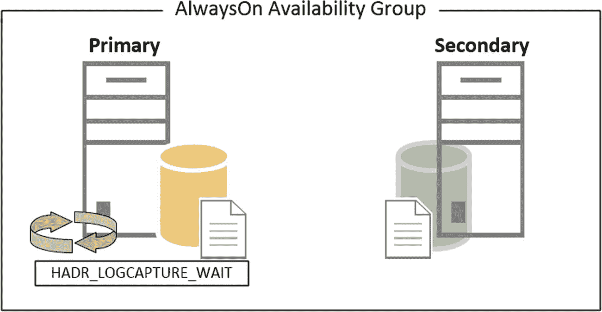

图 10-6
AlwaysOn 可用性组与 HADR_LOGCAPTURE_WAIT 等待类型

尽管我在图 10-6 中将 `HADR_LOGCAPTURE_WAIT` 等待类型放在了主副本上，但它也会在辅助副本上记录 `HADR_LOGCAPTURE_WAIT` 等待类型，尽管这些值通常会远低于主副本上的值。

`HADR_WORK_QUEUE` 等待类型的功能几乎与 `HADR_LOGCAPTURE_WAIT` 等待类型相同。联机丛书对此等待类型的描述非常出色：“AlwaysOn 可用性组的后台工作线程等待分配新工作。当有就绪的工作线程等待新工作时，这是预期的等待，属于正常状态。” 这两种等待类型的主要区别在于，`HADR_LOGCAPTURE_WAIT` 等待类型专门用于等待新事务变得可用，而 `HADR_WORK_QUEUE` 表明有空闲线程正在等待工作。与 `HADR_LOGCAPTURE_WAIT` 等待类型一样，`HADR_WORK_QUEUE` 也会出现在主副本和辅助副本上，但 `HADR_WORK_QUEUE` 等待类型在两个副本上都更为普遍。事实上，`HADR_WORK_QUEUE` 等待类型通常会成为每个属于 AlwaysOn 可用性组的 SQL Server 上最主要的 AlwaysOn 相关等待类型，尤其是在工作负载较低的情况下。

图 10-7 展示了一个类似于图 10-6 的 AlwaysOn 可用性组，但这次我在图中添加了 `HADR_WORK_QUEUE` 等待类型。

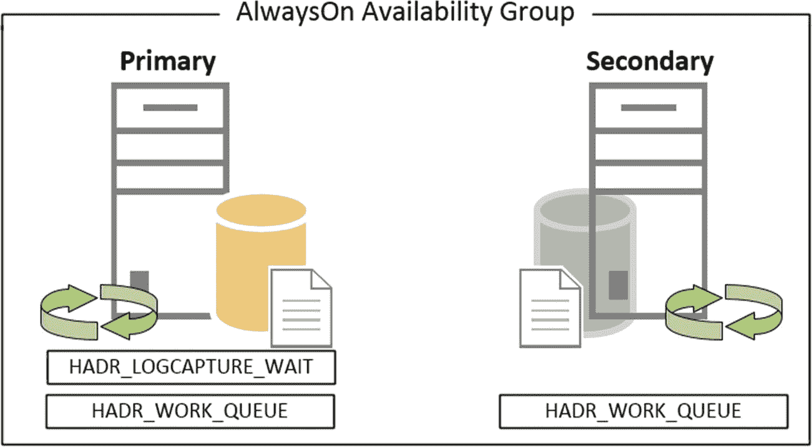

图 10-7
HADR_LOGCAPTURE_WAIT 与 HADR_WORK_QUEUE 等待类型

由于 `HADR_LOGCAPTURE_WAIT` 和 `HADR_WORK_QUEUE` 这两种等待类型都会随时间自然出现，我没有包含关于这两种等待类型的示例。此外，由于这两种等待类型与性能问题没有直接关系，因此包含关于降低它们等待时间的部分没有意义。

### HADR_LOGCAPTURE_WAIT 和 HADR_WORK_QUEUE 总结

`HADR_LOGCAPTURE_WAIT` 和 `HADR_WORK_QUEUE` 这两种等待类型都是良性的等待类型，出现在每个属于 AlwaysOn 可用性组的 SQL Server 上。因为 `HADR_LOGCAPTURE_WAIT` 和 `HADR_WORK_QUEUE` 等待类型与性能问题没有直接关系，所以没有必要直接关注降低它们，在大多数情况下可以安全地忽略。

## HADR_SYNC_COMMIT

`HADR_SYNC_COMMIT` 等待类型是另一个与 AlwaysOn 相关的等待类型，在 SQL Server 2012 中引入。在很多方面，`HADR_SYNC_COMMIT` 等待类型与我们本章前面讨论的 `DBMIRROR_SEND` 等待类型非常相似。然而，这两种等待类型之间存在一些差异，我们将在下一节中讨论。

### 什么是 HADR_SYNC_COMMIT 等待类型？

`HADR_SYNC_COMMIT` 等待类型表示主副本等待辅助副本固化日志记录所花费的时间。`HADR_SYNC_COMMIT` 等待只会在主副本上发生，并且只发生在同步复制 AlwaysOn 可用性组中。一旦主副本接收到事务并将其发送到辅助副本进行固化，`HADR_SYNC_COMMIT` 等待时间就会开始记录。`HADR_SYNC_COMMIT` 等待时间只有在辅助副本发送确认，表明已写入辅助事务日志完成后才会停止记录。图 10-8 在时间线内展示了 `HADR_SYNC_COMMIT` 等待时间的生成过程。

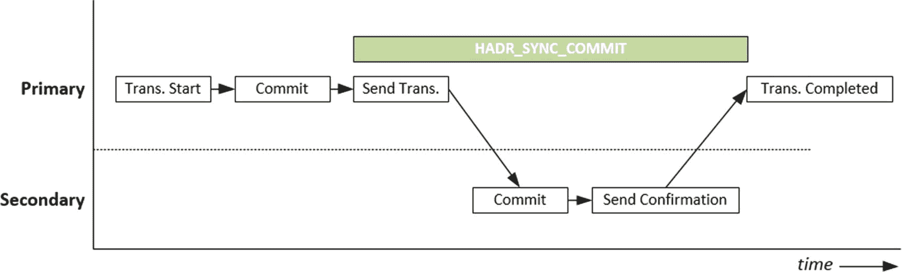

图 10-8
HADR_SYNC_COMMIT 与同步复制

由于 `HADR_SYNC_COMMIT` 等待类型总会出现在每个同步复制的 AlwaysOn 可用性组中，因此预期会有一定的等待时间是正常的。但就像 `DBMIRROR_SEND` 等待类型一样，`HADR_SYNC_COMMIT` 等待类型的等待时间高度依赖于辅助副本处理日志记录的速度。这意味着两个副本之间缓慢的网络连接或辅助副本上存储子系统的性能都会影响 `HADR_SYNC_COMMIT` 等待时间。因此，了解你的 AlwaysOn 配置中 `HADR_SYNC_COMMIT` 等待类型的正常等待时间非常重要，这样你才能轻松识别出高于正常水平的等待时间。


### HADR_SYNC_COMMIT 示例

在本示例中，我构建了一个配置为使用同步复制的 AlwaysOn 可用性组。我所用测试机器的配置可在附录 I 示例 SQL Server 机器配置中找到。我不会详细介绍如何配置 AlwaysOn 可用性组，因为互联网上有大量信息可帮助您进行配置。一个好的起点是在线丛书中的“[‘入门 AlwaysOn 可用性组’](https://msdn.microsoft.com/en-us/gg509118)”文章。我使用了 `AdventureWorks` 数据库作为我的 AlwaysOn 可用性组中需要被复制的数据库。

配置好 AlwaysOn 可用性组后，我使用清单 10-3 中的脚本，在 `AdventureWorks` 数据库中添加了一个名为 `AO_Test` 的额外表。

```sql
USE [AdventureWorks]
GO
CREATE TABLE AO_Test
(
ID UNIQUEIDENTIFIER PRIMARY KEY,
RandomData VARCHAR(50)
);
-- 清单 10-3
-- 创建 AO_Test 表
```

表创建后，我首先清空然后查询 `sys.dm_os_wait_stats` DMV，使用以下查询检查主副本和辅助副本上当前 `HADR_SYNC_COMMIT` 的等待时间：

```sql
SELECT *
FROM sys.dm_os_wait_stats
WHERE wait_type = 'HADR_SYNC_COMMIT';
```

即使等待几分钟后，`HADR_SYNC_COMMIT` 等待类型的等待时间仍保持为 0，如图 10-9 所示。这符合我的预期，因为到目前为止我们尚未在主副本上执行任何数据修改。


图 10-9

主副本和辅助副本均无活动期间的 HADR_SYNC_COMMIT 等待信息

这与 `HADR_LOGCAPTURE_WAIT` 和 `HADR_WORK_QUEUE` 不同，后者即使（或因为）AlwaysOn 可用性组内没有用户活动，也会累积等待时间。

现在表已就位，让我们通过执行一些插入操作来生成一些事务。清单 10-4 中的脚本将向我们之前创建的 `AO_Test` 表中插入 10,000 行。

```sql
INSERT INTO AO_Test
(
ID,
RandomData
)
VALUES
(
NEWID(),
CONVERT(VARCHAR(50), NEWID())
);
GO 10000
-- 清单 10-4
-- 向 AO_Test 表插入 10,000 行
```

当清单 10-4 中的脚本完成后，我再次在主副本和辅助副本上检查 `sys.dm_os_wait_stats` DMV 内的等待统计信息。图 10-10 显示了在主副本上此查询的结果，图 10-11 显示了在辅助副本上的结果。


图 10-11

辅助副本上的 HADR_SYNC_COMMIT 等待


图 10-10

主副本上的 HADR_SYNC_COMMIT 等待

查看这两个图表时，您首先会注意到 `HADR_SYNC_COMMIT` 等待只发生在主副本上，而不是辅助副本上，这是预期行为。第二个有趣的事情是发生的等待次数。这与我们插入的行数完全相同。同样，这也是预期行为。由于我们执行了一次插入并重复了 10,000 次，每次插入都生成了一条需要复制的事务日志记录。利用发生的等待次数和等待时间，可以计算出一次插入操作在副本上提交所花费的平均时间。本例中是 1.53 毫秒 (15342/10000)，这是一个相当不错的值。

### 降低 HADR_SYNC_COMMIT 等待

看到 `HADR_SYNC_COMMIT` 等待发生并不一定意味着存在问题。只要您的主副本上有数据修改，`HADR_SYNC_COMMIT` 等待就会始终发生。当您将等待时间与您的基线测量值进行比较，发现等待时间远高于预期时，它们才可能表明存在问题。

将 AlwaysOn 操作模式更改为异步复制将完全消除 `HADR_SYNC_COMMIT` 等待，但存在灾难发生时丢失数据的风险。此外，为了满足您公司的灾难恢复或高可用性需求，您通常无法随意更改 AlwaysOn 操作模式，我建议您不要仅仅为了降低 `HADR_SYNC_COMMIT` 等待时间而更改它。

值得庆幸的是，您可以使用许多不同的方法来监控 AlwaysOn 可用性组的性能，包括 AlwaysOn 仪表板、DMV 和 Perfmon 计数器。

您可以通过右键单击 AlwaysOn 可用性组并选择“显示仪表板”选项来打开 AlwaysOn 仪表板。默认情况下，AlwaysOn 仪表板会提供一些关于 AlwaysOn 可用性组的通用信息，例如可用性组内的服务器和同步状态，如图 10-12 所示。

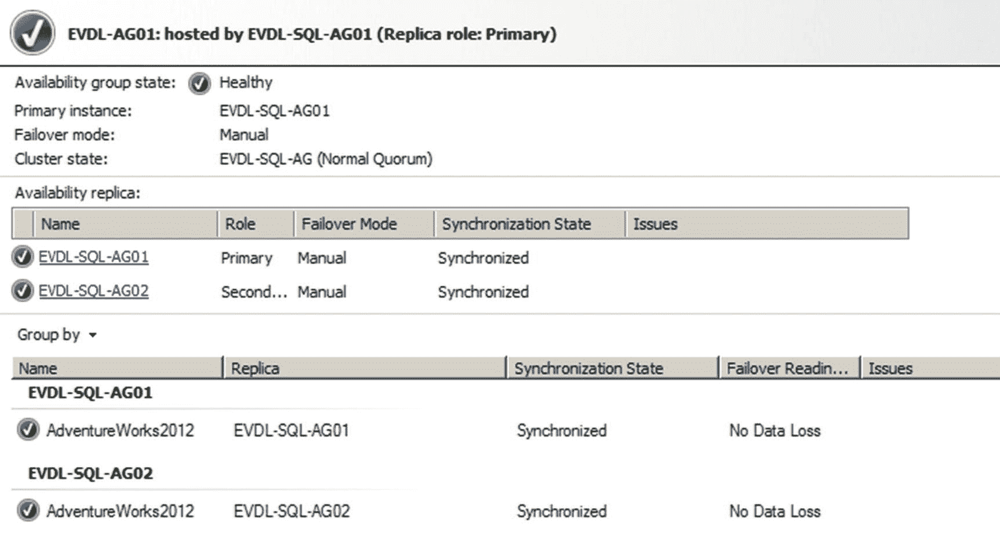

图 10-12

AlwaysOn 仪表板

AlwaysOn 仪表板的默认视图并未提供太多可用于故障排除的信息。值得庆幸的是，您可以通过右键单击列栏并选择您感兴趣的信息来配置视图以适应您自己的需求，如图 10-13 所示。

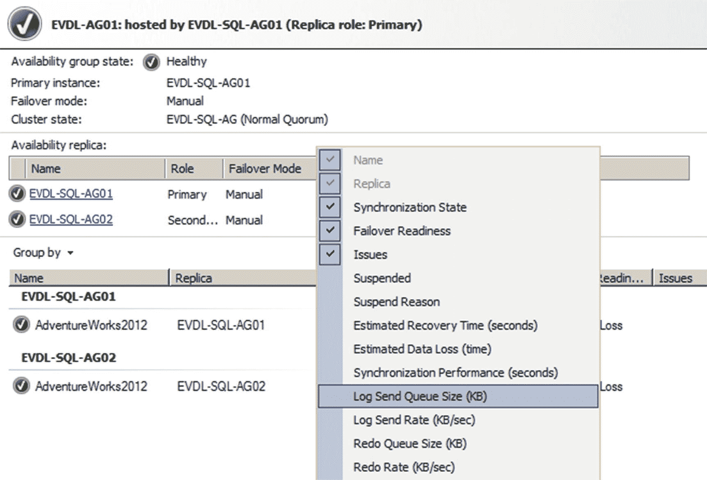

图 10-13

AlwaysOn 添加列

有许多列对于排查同步问题很有用，我建议花时间了解它们，以便确定哪些列最适合您的情况。

AlwaysOn 仪表板显示的信息最初记录在各种与 AlwaysOn 相关的 DMV 中。这使您可以自己查询这些信息。所有与 AlwaysOn 相关的 DMV 都可以通过 DMV 名称中的 `dm_hadr` 前缀轻松识别，例如包含您可在 AlwaysOn 仪表板内访问的大部分信息的 `sys.dm_hadr_database_replica_states` DMV。

除了 AlwaysOn 仪表板和与 AlwaysOn 相关的 DMV 外，还有大量专门显示 AlwaysOn 性能的 Perfmon 计数器。这些计数器分组在 Perfmon 的 `SQLServer:Availability Replica` 和 `SQLServer:Database Replica` 组中。图 10-14 显示了 `SQLServer:Database Replica` 组中可用计数器的一部分。

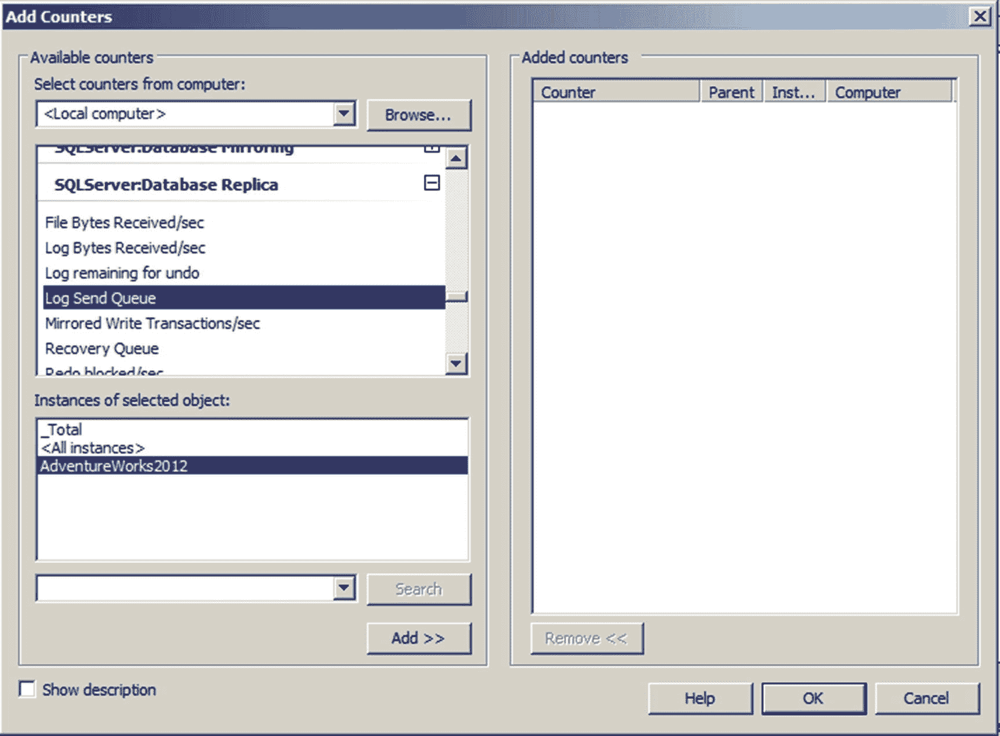

图 10-14

与 AlwaysOn 相关的 Perfmon 计数器

如您至此所读，您有大量选项可用于分析副本之间的 AlwaysOn 性能。


## 基于我迄今为止向您展示的各种来源的信息，您应该能够检查 AlwaysOn 可用性组的整体健康状况。然后，您可以将这些信息与其他影响辅助副本性能的指标结合起来考虑，例如存储子系统和网络连接的性能。由于 `HADR_SYNC_COMMIT` 等待类型与辅助副本直接相关，因此您应重点关注托管辅助副本的 SQL Server。例如，如果您的存储子系统无法跟上需要在辅助副本上提交的事务数量，您会在更高的 `HADR_SYNC_COMMIT` 等待时间以及 AlwaysOn 仪表板、DMV 或 Perfmon 中的各种计数器中注意到这一点。

很难就如何降低 `HADR_SYNC_COMMIT` 等待时间给出通用建议，因为它们高度依赖于无数变量，也取决于您的工作负载。当您的工作负载由大量读取查询组成时，您会注意到 `HADR_SYNC_COMMIT` 等待时间低于执行大量数据修改操作的工作负载。这意味着分析和优化您的查询工作负载也有助于降低 `HADR_SYNC_COMMIT` 等待时间。

### HADR_SYNC_COMMIT 总结

`HADR_SYNC_COMMIT` 等待类型仅发生在配置为使用同步复制模式的副本所组成的 AlwaysOn 可用性组上。`HADR_SYNC_COMMIT` 等待类型将让您深入了解辅助副本将事务提交到磁盘所花费的时间。由于 `HADR_SYNC_COMMIT` 会在同步复制期间始终记录等待时间，因此您只需在等待时间远高于预期时才需要关注。值得庆幸的是，有多种方法可供您分析 AlwaysOn 可用性组的性能，包括 AlwaysOn 仪表板、DMV 和 Perfmon 计数器。

由于辅助副本的性能对 `HADR_SYNC_COMMIT` 等待时间影响最大，在排查此等待类型问题时，您的注意力应集中在辅助副本上。存储子系统和网络连接在辅助副本将其日志记录写入其事务日志的速度方面都起着重要作用。您的工作负载也会影响 `HADR_SYNC_COMMIT` 等待时间，优化工作负载以使数据修改更好地分散开，将导致更低的 `REDO_THREAD_PENDING_WORK` 等待时间。

## REDO_THREAD_PENDING_WORK

本章最后一个等待类型是 `REDO_THREAD_PENDING_WORK` 等待类型。尽管它缺少标识 AlwaysOn 相关等待类型的特征性 `HADR_` 前缀，但它确实与 AlwaysOn 相关。`REDO_THREAD_PENDING_WORK` 等待类型，与 `HADR_LOGCAPTURE_WAIT` 和 `HADR_WORK_QUEUE` 等待类型一样，是一种在没有工作可做时会随时间累积的等待类型。并且就像 `HADR_LOGCAPTURE_WAIT` 和 `HADR_WORK_QUEUE` 等待类型一样，在大多数情况下可以忽略它，因为它并不表示存在性能问题。

尽管这是一个在 99% 的情况下都可以安全忽略的等待类型，但我仍想将其包含在本章中，原因有二。它通常是 AlwaysOn 可用性组辅助副本上排名靠前的等待类型之一，而且理解其与 SQL Server 内部相关的过程将使您对 AlwaysOn 的内部工作原理有更好的理解。

### 什么是 REDO_THREAD_PENDING_WORK 等待类型？

`REDO_THREAD_PENDING_WORK` 等待类型与仅发生在 AlwaysOn 可用性组内部辅助副本上的一个进程相关，即 Redo Thread（重做线程）。

在本章的前面部分，我们讨论了 AlwaysOn 可用性组中的辅助副本如何处理日志记录、将其持久化到自己的事务日志，并向主副本发送确认。当使用同步复制时，主副本会在向启动事务的客户端发送事务完成消息之前等待；而当使用异步复制时，消息会在不等待辅助副本持久化的情况下发送。但到目前为止，我们还没有讨论将在辅助数据库中执行日志记录中所描述修改的进程。这就是辅助副本上 Redo Thread 的用武之地。该线程负责执行主副本发送给它的日志记录中所记录的数据修改。与 Redo Thread 相关的一个非常重要的概念是：它不影响来自辅助副本的提交确认。这意味着，在事务已被告知客户端提交（主副本和辅助副本均已持久化日志记录，并且 AlwaysOn 可用性组处于同步状态）之后很长时间，Redo Thread 可能仍在执行工作。

这意味着，即使您的 AlwaysOn 可用性组已同步，辅助数据库中的数据也未必与主数据库完全相同。这实际上比您第一眼想到的要次要一些。因为辅助副本已将日志记录持久化到其磁盘上的事务日志中，所以它拥有执行重做操作所需的所有信息。如果主副本发生故障，事务不会丢失，因为辅助副本在其自己的事务日志中拥有所有已执行的事务，并且可以重做所有事务。这与独立的 SQL Server 实例的工作方式非常相似，在独立实例中，事务也是在数据实际更改之前先持久化到磁盘。如果 SQL Server 在这种情况下崩溃，SQL Server 将使用事务日志来重做或撤消数据修改。图 10-15 展示了同步复制与 Redo Thread 一起工作的示例。请注意，Redo Thread 是一个独立的操作，不影响事务完成消息的持续时间。

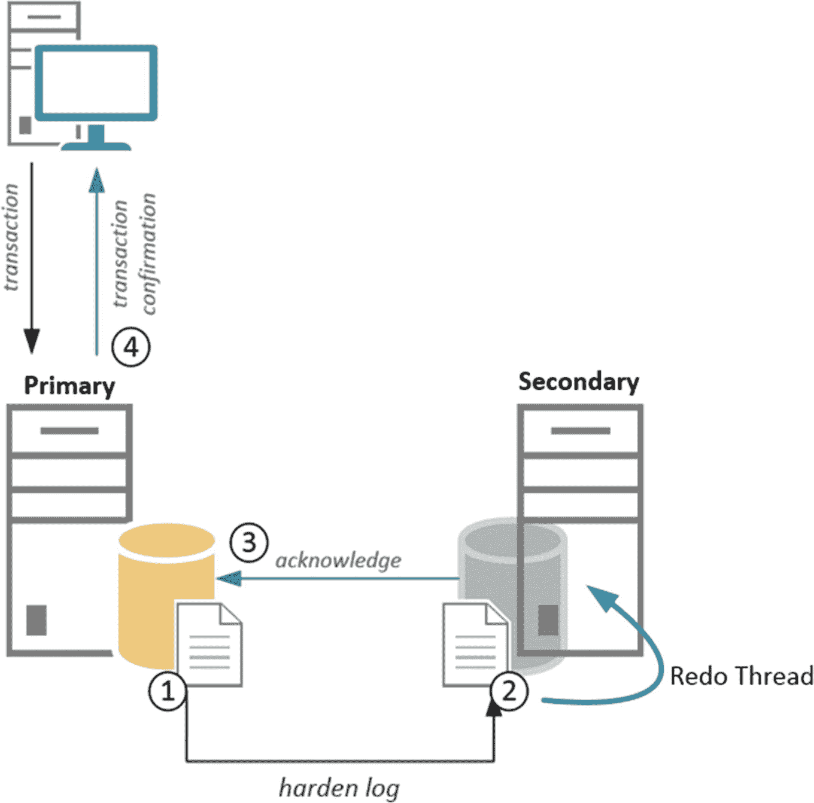

**图 10-15** 同步 AlwaysOn 可用性组与 Redo Thread

那么，`REDO_THREAD_PENDING_WORK` 等待类型从何而来？嗯，如果 Redo Thread 正在等待工作到达，它将把不活动的时间记录为 `REDO_THREAD_PENDING_WORK` 等待类型的等待时间。这种情况在同步和异步复制模式下都会发生，但仅限于辅助副本上。

因为该等待类型只表示 Redo Thread 没有执行任何工作，所以除了极其罕见的情况外，可以安全地忽略它。而且，由于在没有工作可做时，`REDO_THREAD_PENDING_WORK` 等待类型的等待时间会自然累积，因此无需编写示例来演示此等待类型。针对辅助副本上的 `sys.dm_os_wait_stats` DMV 运行一个简单的查询来检索 `REDO_THREAD_PENDING_WORK` 等待类型信息，将向您显示等待时间在增加，尤其是在没有针对 AlwaysOn 可用性组的用户活动时，如图 10-16 所示。


**图 10-16** REDO_THREAD_PENDING_WORK 等待信息


### REDO_THREAD_PENDING_WORK 等待类型概述

`REDO_THREAD_PENDING_WORK` 等待类型是一种与 AlwaysOn 相关的等待类型。当 AlwaysOn 可用组没有数据修改活动时，该等待类型会自然累积等待时间。`REDO_THREAD_PENDING_WORK` 等待类型与 AlwaysOn 可用组中辅助副本内的重做线程相关，表示重做线程当前正在等待工作。由于这种等待类型会发生在每个辅助副本上，尤其是在用户数据修改极少或没有发生时，因此可以安全地忽略它。

## 11. 抢占式等待类型

在第 1 章“等待统计内部原理”中，我们简要介绍了 SQL Server 用于执行线程调度和管理的非抢占式调度模型。与 SQL Server 不同，Windows 操作系统使用抢占式调度来管理和调度线程。有时，SQL Server 必须通过操作系统使用 Windows 函数来执行特定操作，例如检查 Active Directory 权限。当这种情况发生时，SQL Server 必须从 Windows 操作系统（SQL Server 外部）请求一个线程，从而使得 SQL Server 无法管理该线程。当 SQL Server 等待 Windows 操作系统内的抢占式线程完成时，它将记录一个针对抢占式等待类型的等待。图 11-1 展示了此行为的图示。

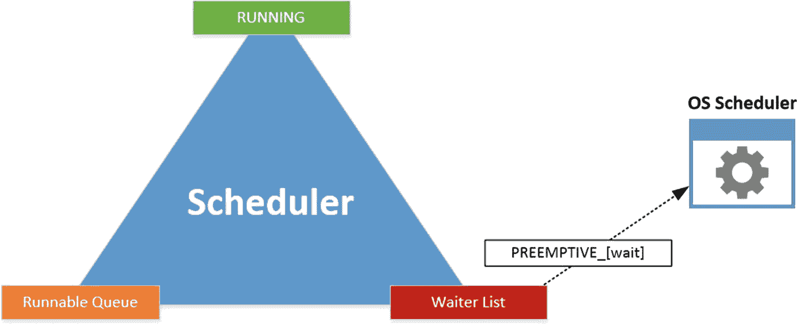

*图 11-1 发生抢占式等待*

SQL Server 内部存在许多不同的抢占式等待类型；在撰写本书时，SQL Server 2017 有 203 种不同的抢占式等待类型。当在 SQL Server 外部请求线程时记录哪种抢占式等待类型，取决于线程访问的 Windows 函数。SQL Server 中的每种抢占式等待类型都对应一个不同的 Windows 函数（除了一些作为不同函数的“全能”等待类型的例外情况），并且在许多情况下，等待类型的名称与 Windows 函数的名称相同。这非常有帮助，因为您可以在 MSDN 上搜索特定的 Windows 函数并了解其功能。如果您知道该函数的功能，也就知道了 SQL Server 为何等待或在等待什么。例如，如果您注意到 `PREEMPTIVE_OS_WRITEFILEGATHER` 等待类型的等待时间很长，您可以移除 `PREEMPTIVE_OS_` 部分，并在 MSDN 上搜索 `WRITEFILEGATHER` 函数。图 11-2 显示了我搜索 `WRITEFILEGATHER` 函数得到的结果。

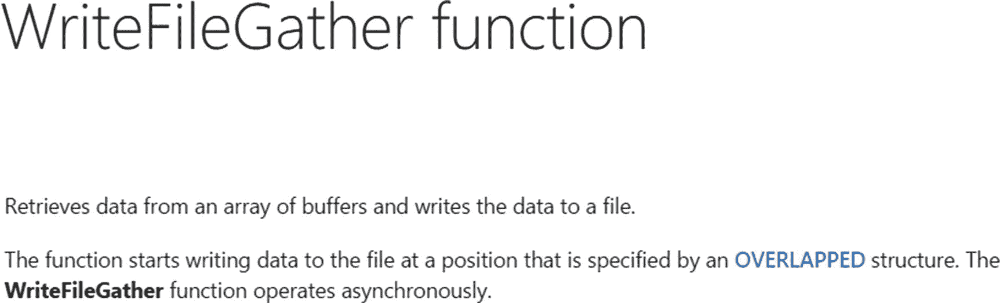

*图 11-2 WriteFileGather Windows 函数*

通过阅读相关文章，我们可以了解很多关于此函数的信息；显然，该函数用于将数据写入文件，并且必须在 SQL Server 外部执行。我不会在这里剧透更多，因为我们将在本章后面更详细地讨论 `PREEMPTIVE_OS_WRITEFILEGATHER` 等待类型。

我不会在本章中描述每一个可能的抢占式等待类型，因为实在太多了。相反，我专注于最常见的抢占式等待类型。如果您遇到一个本章未详细讨论的抢占式等待类型，建议您使用前述方法在 MSDN 上查找有关该 Windows 函数的更多信息。希望这些信息能帮助您弄清楚等待发生的原因。

## SQL Server on Linux

在本章的引言中，我提到了 SQL Server 如何从其内部访问 Windows 操作系统功能。然而，从 SQL Server 2017 开始，SQL Server 不再局限于在 Microsoft Windows 操作系统上可用。在 2016 年 3 月的一次革命性宣布中，Microsoft 宣布下一个版本的 SQL Server（2017）将不再是 Windows 独占的产品，也将可在 Linux 上使用。不用说，这个声明引起了相当大的轰动，因为这是没人预料到会发生的事情。

我现在提及 SQL Server 在 Linux 操作系统上的支持，是因为 SQL Server 内部发生的抢占式等待是平台无关的。这意味着，对仅在 Windows 操作系统中可用的函数的调用，在查看 SQL-on-Linux 实例的等待统计时也会被记录。这之所以可能，与 Microsoft 用于将 SQL Server 移植到 Linux 的底层技术有关。

为了使 SQL Server 能在 Linux 上运行，Microsoft 采用了一个称为平台抽象层（Platform Abstraction Layer，简称 PAL）的概念。PAL 的思想是将运行 SQL Server 所需的代码与操作系统交互所需的代码分离。由于 SQL Server 以前从未在 Windows 以外的系统上运行过，其代码中充满了操作系统引用。这意味着，让 SQL Server 在 Linux 上运行将需要耗费大量时间来解决所有的操作系统依赖问题。因此，SQL Server 团队寻找不同的方法来解决这个问题，并在名为 Drawbridge 的 Microsoft 研究项目中找到了答案。Drawbridge 的定义可以在其项目页面 [`www.microsoft.com/en-us/research/project/drawbridge/`](http://www.microsoft.com/en-us/research/project/drawbridge/) 上找到，其描述为：

> *Drawbridge 是一种用于应用程序沙盒化的新虚拟化形式的研究原型。Drawbridge 结合了两种核心技术：首先，是一个 picoprocess，它是基于进程的隔离容器，具有最小的内核 API 表面。其次，是一个库操作系统（Library OS），它是经过优化以在 picoprocess 内高效运行的 Windows 版本。*

吸引 SQL Server 团队的主要部分是 Drawbridge 项目中的库操作系统技术。这种新技术可以处理非常广泛的 Windows 操作系统调用，并将其转换为主机（在本例中是 Linux）的操作系统调用。当时，SQL Server 团队并没有完全照搬 Drawbridge 技术，因为该研究项目存在一些挑战。其中之一是研究项目已正式完成，这意味着项目不再提供支持。另一个是 SQL Server 操作系统（SOS）和 Drawbridge 技术在功能上有大量重叠。两种解决方案都有自己的内存管理和线程/调度处理功能。最终决定将 SQL Server OS 和 Drawbridge 合并为一个名为 SQLPAL（SQL 平台抽象层）的新平台层。使用 SQLPAL，SQL Server 团队可以像以往一样进行开发，而将操作系统调用的转换工作留给 SQLPAL 处理。图 11-3 展示了在 Linux 上运行 SQL Server 时各层之间的交互。

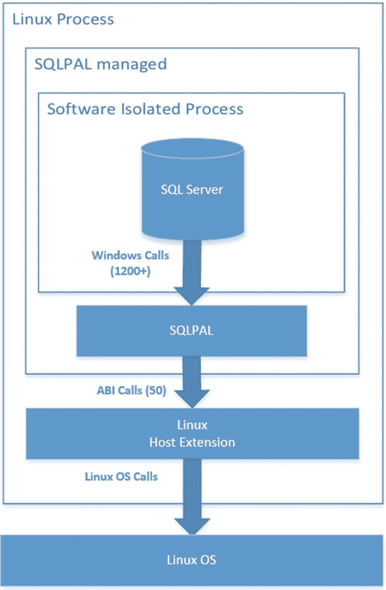

*图 11-3 SQL-on-Linux 上的 PAL 层交互*


关于 SQLPAL 的功能及其设计选择，各大微软博客提供了大量信息。如果你想了解更多关于 SQLPAL 的内容或其诞生历程，推荐阅读《Linux 上的 SQL Server：如何实现？简介》这篇文章，链接如下：[`https://cloudblogs.microsoft.com/sqlserver/2016/12/16/sql-server-on-linux-how-introduction/`](https://cloudblogs.microsoft.com/sqlserver/2016/12/16/sql-server-on-linux-how-introduction/)。

在本章的剩余部分，我将频繁提及 Windows 操作系统所使用的函数。如果你是在 Linux 上运行 SQL Server，请记住：本章描述的功能在 Linux 上由 SQLPAL 处理，但其功能表现与在 Windows 上相同。

## PREEMPTIVE_OS_ENCRYPTMESSAGE 和 PREEMPTIVE_OS_DECRYPTMESSAGE

本章我们要讨论的第一种抢占式等待类型是 `PREEMPTIVE_OS_ENCRYPTMESSAGE` 和 `PREEMPTIVE_OS_DECRYPTMESSAGE`。从等待类型的名称你大概能猜到，这些函数与通过 Windows 操作系统加密或解密消息有关。

### PREEMPTIVE_OS_ENCRYPTMESSAGE 和 PREEMPTIVE_OS_DECRYPTMESSAGE 等待类型是什么？

正如我在前一节提到的，`PREEMPTIVE_OS_ENCRYPTMESSAGE` 和 `PREEMPTIVE_OS_DECRYPTMESSAGE` 等待类型与消息的加密和解密相关。更具体地说，它们涉及加密和解密进出 SQL Server 实例的网络流量。一个使用场景是：当你使用证书连接 SQL Server 实例以加密客户端与 SQL Server 实例之间发送的数据时。在这种情况下，SQL Server 需要访问 Windows 操作系统来执行消息加密，或者解密收到的消息。这与例如透明数据加密（TDE）不同，后者的加密/解密过程完全在 SQL Server 内部完成。

`PREEMPTIVE_OS_ENCRYPTMESSAGE` 和 `PREEMPTIVE_OS_DECRYPTMESSAGE` 这两种等待类型不一定表示存在性能问题。它们只是表明加密功能正在被使用，因此通常无需对这些等待类型进行故障排除。加密和解密消息的开销非常小，很少导致严重问题（我尚未遇到因使用证书连接 SQL Server 而导致性能问题的案例）。

### PREEMPTIVE_OS_ENCRYPTMESSAGE 和 PREEMPTIVE_OS_DECRYPTMESSAGE 示例

为了展示 `PREEMPTIVE_OS_ENCRYPTMESSAGE` 和 `PREEMPTIVE_OS_DECRYPTMESSAGE` 等待类型的示例，我将配置一个证书来加密到 SQL Server 实例的连接。为使此示例可复现，我包含了创建自签名证书的步骤。通常在生产环境中，你会使用由证书颁发机构颁发的证书，但出于测试目的，自签名证书是可以的。

要生成自签名证书，我做的第一件事是在我的测试虚拟机上安装 Internet 信息服务（IIS）。IIS 使得生成自签名证书变得非常简单。

安装完 `IIS` 后，我从管理工具中打开 `IIS 管理器`。然后，我点击我的计算机名称，并在功能视图中选择 `服务器证书` 选项，如图 11-4 所示。

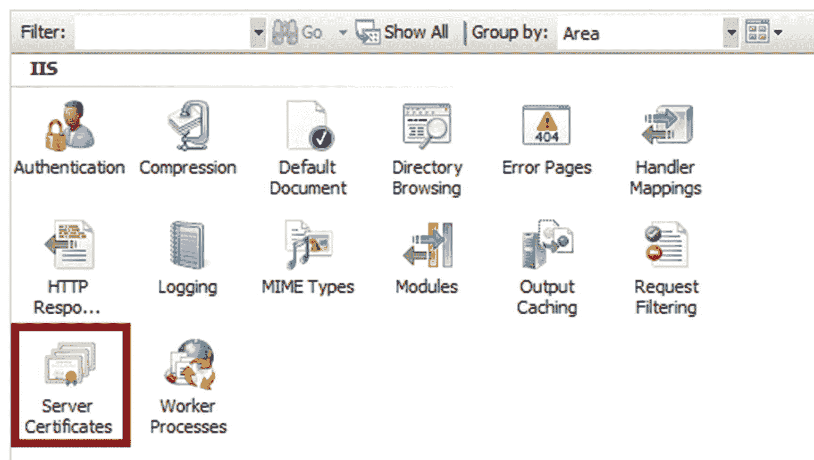

图 11-4: IIS 管理器内的功能视图

这将在 `IIS 管理器` 内打开一个新的 `服务器证书` 视图。在操作窗格中，我点击 `创建自签名证书` 选项。然后系统会要求我提供证书的名称，于是我填写了我的测试虚拟机的名称，如图 11-5 所示。

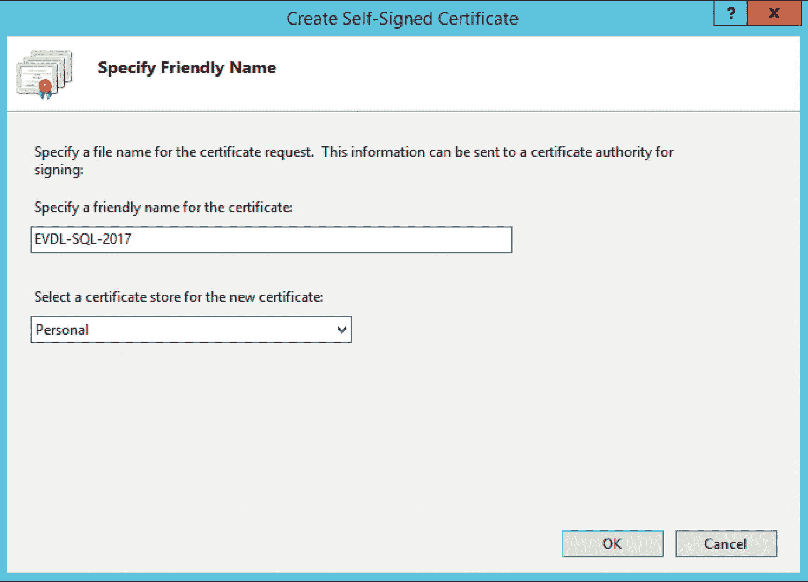

图 11-5: 创建自签名证书

我点击 `确定`，自签名证书将被创建并自动放置在我计算机上正确的证书存储区中（`本地计算机 ➤ 个人 ➤ 证书`）。

现在我的自签名证书已经创建并存储在证书存储区中，我需要确保运行 `SQL Server` 服务的账户具有访问证书的权限。我通过点击 `开始 ➤ 运行`，输入 `MMC`，然后点击 `确定` 来打开 `MMC`（微软管理控制台）。`MMC` 控制台打开后，我需要添加证书管理单元。为此，我点击 `文件 ➤ 添加/删除管理单元`，选择 `证书` 管理单元，然后点击 `添加`。当系统提示我选择要管理哪个账户的证书时，我选择 `计算机账户`，如图 11-6 所示，然后点击 `下一步` 和 `完成`。

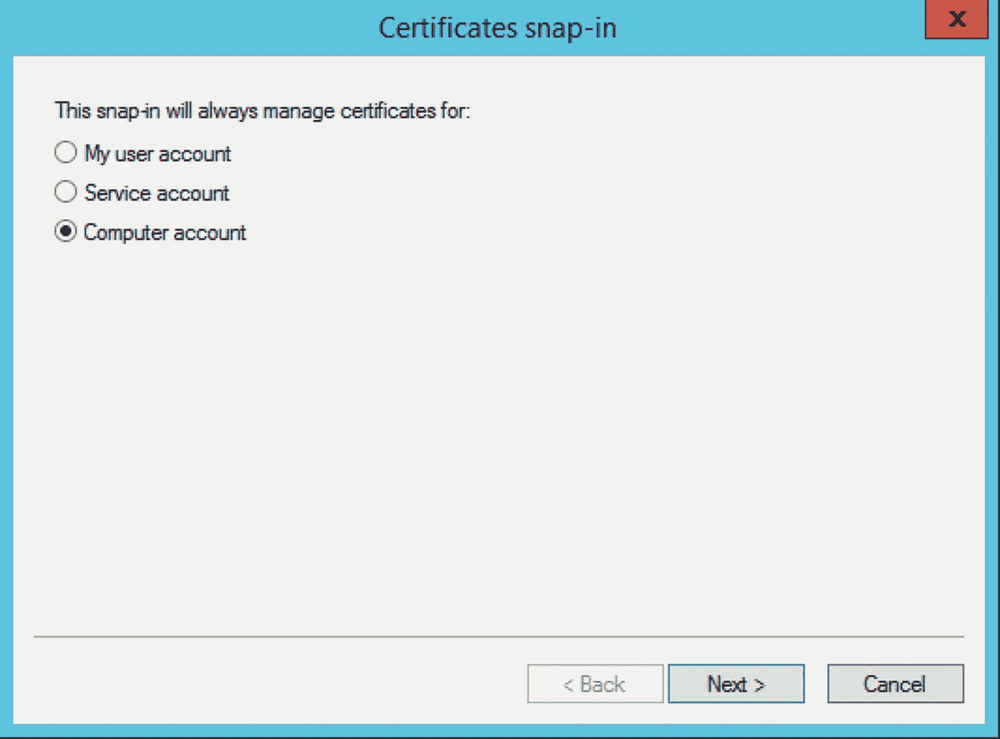

图 11-6: 证书账户选择

在 `证书` 控制台中，我打开文件夹 `证书（本地计算机） ➤ 个人 ➤ 证书`。如果在 `IIS` 中生成自签名证书的步骤正确，我应该能在这里看到该证书。图 11-7 显示了我的测试虚拟机上的证书。

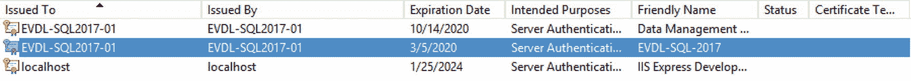

图 11-7: 自签名证书

我右键单击自签名证书，选择 `所有任务 ➤ 管理私钥`。此时会打开一个权限对话框。在这里，我需要添加运行 `SQL Server` 服务的账户。在我的案例中，这是默认添加的本地管理员用户。如果你的 `SQL Server` 服务在另一个账户下运行，该账户只需要对该证书拥有读取权限即可，如图 11-8 所示。

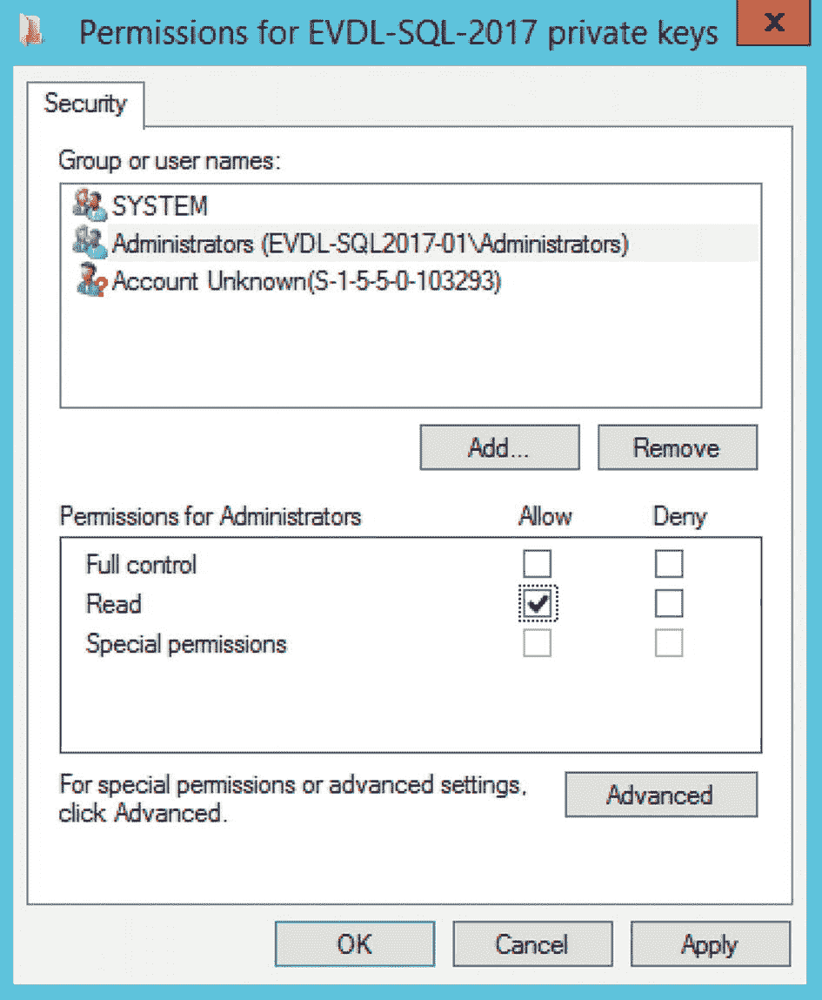

图 11-8: 自签名证书权限


### 配置 SQL Server 使用自签名证书加密连接

在添加账户并选择了正确的权限后，我点击“确定”关闭对话框。现在权限已设置正确，SQL Server 服务账户能够访问证书，我需要将自签名证书添加到我希望启用加密的 SQL Server 实例的网络配置中。我打开“SQL Server 配置管理器”并点击“SQL Server 网络配置”选项。右键单击应使用自签名证书的 SQL Server 实例，然后选择“属性”。接着，我打开“证书”选项卡并选择我们之前创建的自签名证书。图 11-9 显示了在我测试虚拟机上的对话框。

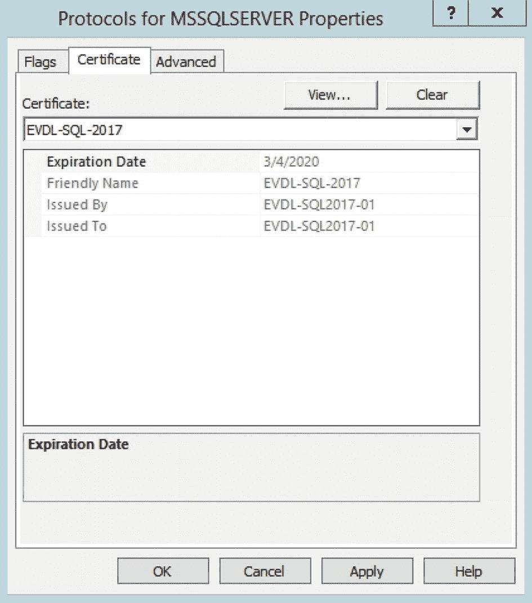
图 11-9 证书选择

选择自签名证书后，我点击“确定”关闭对话框。系统通知我证书将在重启 SQL Server 服务后生效，因此我执行了 SQL Server 服务的重启。

目前，SQL Server 已可以使用自签名证书，但为确保网络消息被加密，我必须连接到 SQL Server 实例并告知它需要使用加密。在此示例中，我将使用位于与 SQL Server 实例同一虚拟机上的 SQL Server Management Studio 连接到该实例。如果您从另一台计算机连接到 SQL Server 实例，则需要确保该机器上也提供了自签名证书。当 SQL Server Management Studio 中出现“连接到服务器”对话框时，我点击对话框右下角的“选项”按钮。这将打开到 SQL Server 实例连接的附加属性。我勾选“加密连接”复选框，如图 11-10 所示，然后连接到我的 SQL Server 实例。

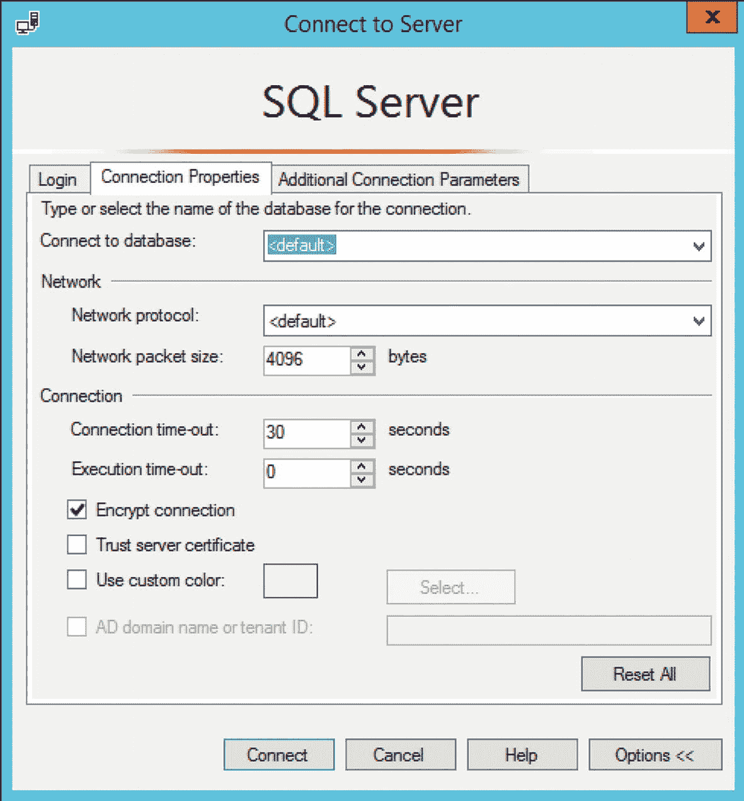
图 11-10 SQL Server Management Studio 中的连接属性

至此，我已完成所有配置，确保 SQL Server 将使用自签名证书加密 SQL Server 实例与 SQL Server Management Studio 之间的消息，因此我终于可以查看 `PREEMPTIVE_OS_ENCRYPTMESSAGE` 和 `PREEMPTIVE_OS_DECRYPTMESSAGE` 等待类型了！

现在生成 `PREEMPTIVE_OS_ENCRYPTMESSAGE` 和 `PREEMPTIVE_OS_DECRYPTMESSAGE` 等待非常简单。基本上，我现在从 SQL Server Management Studio 执行的每个查询都将被加密，即使我在与 SQL Server 实例相同的机器上运行 SQL Server Management Studio 也是如此。我使用清单 11-1 中的查询重置 `sys.dm_os_wait_stats` DMV，连接到 `AdventureWorks` 数据库，执行一个简单查询，然后查看在 `PREEMPTIVE_OS_ENCRYPTMESSAGE` 和 `PREEMPTIVE_OS_DECRYPTMESSAGE` 等待类型上发生的等待。

```sql
DBCC SQLPERF('sys.dm_os_wait_stats', CLEAR)
USE AdventureWorks
GO
SELECT *
FROM Sales.SalesOrderDetail;
SELECT *
FROM sys.dm_os_wait_stats
WHERE wait_type = 'PREEMPTIVE_OS_ENCRYPTMESSAGE'
OR wait_type = 'PREEMPTIVE_OS_DECRYPTMESSAGE';
-- 清单 11-1 使用加密连接的选择查询
```

在我的测试 SQL Server 实例上，这些查询的结果如图 11-11 所示。


图 11-11 PREEMPTIVE_OS_DECRYPTMESSAGE 和 PREEMPTIVE_OS_ENCRYPTMESSAGE 等待

如您所见，`PREEMPTIVE_OS_ENCRYPTMESSAGE` 等待时间和等待次数更多。这是合理的，因为我执行了一个选择查询，它只需要解密来自客户端的确认网络消息。查询结果必须由 SQL Server 加密，这导致 `PREEMPTIVE_OS_ENCRYPTMESSAGE` 等待类型的等待时间更高。

### 降低 PREEMPTIVE_OS_ENCRYPTMESSAGE 和 PREEMPTIVE_OS_DECRYPTMESSAGE 等待

在正常情况下，无需专注于降低 `PREEMPTIVE_OS_ENCRYPTMESSAGE` 和 `PREEMPTIVE_OS_DECRYPTMESSAGE` 等待类型。它们大多只表示正在发生消息加密，这可能是在配置 SQL Server 实例时做出的选择。禁用加密将显著降低 `PREEMPTIVE_OS_ENCRYPTMESSAGE` 和 `PREEMPTIVE_OS_DECRYPTMESSAGE` 等待时间，但会以安全性为代价。

### PREEMPTIVE_OS_ENCRYPTMESSAGE 和 PREEMPTIVE_OS_DECRYPTMESSAGE 总结

`PREEMPTIVE_OS_ENCRYPTMESSAGE` 和 `PREEMPTIVE_OS_DECRYPTMESSAGE` 等待类型表示 SQL Server 实例与客户端之间正在进行加密。这些等待类型通常可以忽略，因为它们并不直接表明存在性能问题。降低它们可以通过禁用加密来实现，但这会牺牲安全性。

## PREEMPTIVE_OS_WRITEFILEGATHER

`PREEMPTIVE_OS_WRITEFILEGATHER` 等待类型与存储交互有关，更具体地说是通过 Windows 操作系统写入文件。

### 什么是 PREEMPTIVE_OS_WRITEFILEGATHER 等待类型？

`PREEMPTIVE_OS_WRITEFILEGATHER` 等待类型与 Windows 操作系统内部的 `WriteFileGather` 函数有关。如果我们在 Books Online 上查找此函数的定义，会得到以下描述：“从缓冲区数组中检索数据并将数据写入文件。” 从这个描述我们可以推断，当需要向文件写入数据时，会调用此函数。然而，这并非 SQL Server 内部的每一次存储子系统写入操作都如此。通常，SQL Server 不需要超出其自身引擎范围去等待一个抢占式操作。但是，存在一些例外情况，这些情况可能导致 `PREEMPTIVE_OS_WRITEFILEGATHER` 等待（取决于用于执行存储子系统交互的 Windows 函数）。SQL Server 内部一个总会导致 `PREEMPTIVE_OS_WRITEFILEGATHER` 等待的特定操作是数据文件的增长。每当 SQL Server 想要增长一个数据文件时，它需要在存储子系统上分配额外的空间并“清零”新空间以便 SQL Server 使用。额外空间的分配不是在 SQL Server 引擎内部发生的，因此必须进行一个抢占式操作，这可能导致在 `WriteFileGather` 函数上发生抢占式等待。


### PREEMPTIVE_OS_WRITEFILEGATHER 示例

为了向您展示一个 `PREEMPTIVE_OS_WRITEFILEGATHER` 等待发生的示例，我将复现我在前一节中描述的情况，即扩展数据库数据文件。在这个示例中，我将还原 `AdventureWorks` 数据库的备份；在 SQL Server 2016 版本的数据库中，只存在一个大小为 208 MB 的数据库数据文件，如图 11-12 所示。

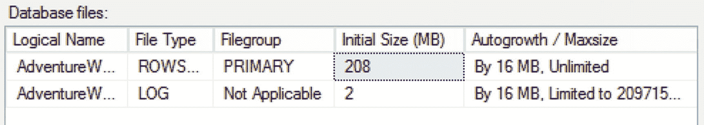
图 11-12：AdventureWorks（2016 版）的默认数据库文件配置

我将把该数据库数据文件的大小扩展到 10 GB。由于数据文件所需额外空间的分配是在 SQL Server 外部执行的，这应该会导致 `PREEMPTIVE_OS_WRITEFILEGATHER` 等待。

为了执行扩展数据库数据文件的操作，我使用了清单 11-2 中所示的脚本。此脚本将清除 `sys.dm_os_wait_stats` DMV，将 `AdventureWorks` 数据文件增大到 800 MB，然后查询 `sys.dm_os_wait_stats` DMV 中的 `PREEMPTIVE_OS_WRITEFILEGATHER`。

```sql
DBCC SQLPERF('sys.dm_os_wait_stats', CLEAR)
USE [master]
GO
ALTER DATABASE [AdventureWorks]
MODIFY FILE
(
    NAME = N'AdventureWorks2016_Data',
    SIZE = 819200KB
);
GO
SELECT *
FROM sys.dm_os_wait_stats
WHERE wait_type = 'PREEMPTIVE_OS_WRITEFILEGATHER';
```
清单 11-2：扩展 AdventureWorks 数据库数据文件

在我的测试 SQL Server 实例上，清单 11-2 中的查询几乎瞬间完成，它的存储速度非常快，并导致了如图 11-13 所示的关于 `PREEMPTIVE_OS_WRITEFILEGATHER` 等待类型的等待信息。


图 11-13：PREEMPTIVE_OS_WRITEFILEGATHER 等待

请注意，`PREEMPTIVE_OS_WRITEFILEGATHER` 等待类型只有一次单独的等待，其持续时间实际上与执行数据文件扩展操作所需的时间一样长。

### 降低 PREEMPTIVE_OS_WRITEFILEGATHER 等待

当您注意到 `PREEMPTIVE_OS_WRITEFILEGATHER` 等待类型的等待时间高于正常水平时，这意味着 SQL Server 内部的一个进程正在通过 Windows 操作系统对存储子系统执行操作。首要行动应是调查是哪个进程发起了导致 `PREEMPTIVE_OS_WRITEFILEGATHER` 等待的操作。很多时候，这将是数据库数据文件或日志文件的（自动）增长。如果您允许数据或日志文件在已满时自动增长，那么每当发生自动增长事件时，您都可能看到 `PREEMPTIVE_OS_WRITEFILEGATHER` 等待发生。这不一定意味着存在问题，但如果自动增长事件因为（例如）存储子系统出现性能问题而需要很长时间才能完成，您的查询也可能会经历性能下降。

有一个我经常看到未配置的 Windows 设置，即即时文件初始化。我们已经在第 6 章“I/O 相关等待类型”中关于 `ASYNC_IO_COMPLETION` 等待类型的部分讨论过此设置以及如何启用它，因此我不会再详细说明如何启用该设置。图 11-14 显示了在启用即时文件初始化后，清单 11-2 中查询的结果，正如您所看到的，花费在 `PREEMPTIVE_OS_WRITEFILEGATHER` 等待类型上的等待时间完全消失了。


图 11-14：开启即时文件初始化后的 PREEMPTIVE_OS_WRITEFILEGATHER 等待

除了使用即时文件初始化外，存储子系统的性能在 `PREEMPTIVE_OS_WRITEFILEGATHER` 等待时间中也起着重要作用。您的存储子系统性能越好，`PREEMPTIVE_OS_WRITEFILEGATHER` 等待类型的等待时间就越低。

另一个可能导致 `PREEMPTIVE_OS_WRITEFILEGATHER` 等待时间高于正常水平的 SQL Server 操作是执行数据库还原。与扩展数据文件类似，在 SQL Server 可以还原数据库之前，它需要为其分配空闲存储空间。这也与即时文件初始化有关，它将像扩展文件一样加快数据库还原速度。

### PREEMPTIVE_OS_WRITEFILEGATHER 总结

`PREEMPTIVE_OS_WRITEFILEGATHER` 等待类型表明 SQL Server 正在请求 Windows 操作系统对存储子系统执行一项操作。并非所有操作都可以在 SQL Server 引擎和操作内部处理；例如，扩展数据文件需要执行 Windows 函数来在存储子系统上分配所需空间。即时文件初始化是 Windows 中的一个设置，可以大幅减少 `PREEMPTIVE_OS_WRITEFILEGATHER` 等待时间，但存储子系统本身的性能也在 `PREEMPTIVE_OS_WRITEFILEGATHER` 等待时间中扮演重要角色。

## PREEMPTIVE_OS_AUTHENTICATIONOPS

`PREEMPTIVE_OS_AUTHENTICATIONOPS` 等待类型是另一种抢占式等待类型，与各种 Windows 身份验证函数相关。

### 什么是 PREEMPTIVE_OS_AUTHENTICATIONOPS 等待类型？

每当 SQL Server 需要执行账户身份验证时，例如在 Windows 登录名连接到 SQL Server 时对其进行身份验证，就会记录 `PREEMPTIVE_OS_AUTHENTICATIONOPS` 等待类型。看到 `PREEMPTIVE_OS_AUTHENTICATIONOPS` 等待发生是预料之中的事，尤其是在您的 SQL Server 实例中使用混合模式身份验证和 Windows 登录名时。

关于 `PREEMPTIVE_OS_AUTHENTICATIONOPS` 等待类型的一个常见误解是，它仅与在域内使用 Windows 身份验证的 SQL Server 登录名相关。这并不完全正确。虽然确实在使用 Active Directory 账户连接到 SQL Server 时，`PREEMPTIVE_OS_AUTHENTICATIONOPS` 等待时间通常会更高，但如果 SQL Server 实例安装在域外的机器上，`PREEMPTIVE_OS_AUTHENTICATIONOPS` 等待也会发生；不过等待时间通常会较低。

图 11-15 展示了一个简化的图像，说明 SQL Server 如何连接到 Active Directory 域控制器以验证 SQL Server Windows 登录名。请记住，Windows 操作系统负责处理域控制器和 SQL Server 之间的通信，因此是抢占式等待类型。

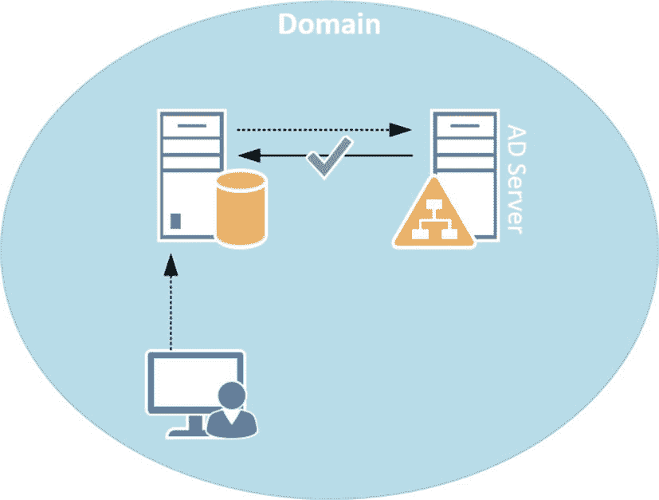
图 11-15：域内的 SQL Server Windows 登录名身份验证

在安装了 SQL Server 实例但不在域中的机器上，Windows 登录名的身份验证将在本机（本地账户）上进行。

由于通过域控制器对 Windows 登录名进行身份验证通常需要更长时间（请求必须通过网络传输并在另一台机器上进行身份验证），因此对于域内的 SQL Server 实例，`PREEMPTIVE_OS_AUTHENTICATIONOPS` 等待类型的等待时间通常会更高。


### PREEMPTIVE_OS_AUTHENTICATIONOPS 示例

要生成一个出现 `PREEMPTIVE_OS_AUTHENTICATIONOPS` 等待的示例，我无需执行任何复杂操作。只需使用 Windows 身份验证打开一个到 SQL Server 实例的新连接即可。一种便于测量的方法是：使用 SQL Server Management Studio 并通过 Windows 身份验证连接到 SQL Server 实例。图 11-16 展示了 SQL Server Management Studio 连接到我的测试 SQL Server 实例的对话框。请注意，我的测试 SQL Server 实例不在域中，我使用的是本机上的本地管理员账户进行连接。

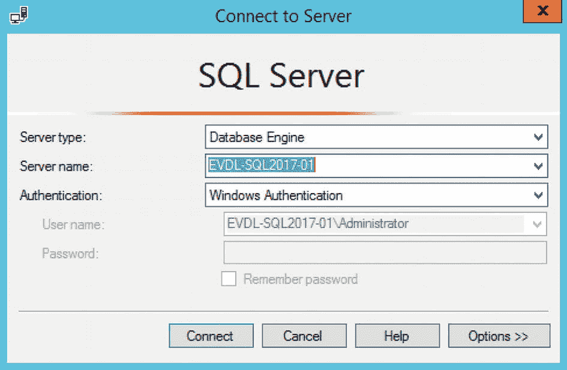

图 11-16

使用本地 Windows 身份验证连接 SQL Server Management Studio

接下来，我在 SQL Server Management Studio 中打开一个新的查询窗口，并执行清单 11-3 所示查询中的步骤。

```sql
-- Step 1 Clear sys.dm_os_wait_stats
DBCC SQLPERF('sys.dm_os_wait_stats', CLEAR);
-- Step 2 Open a new Query Window inside
-- SQL Server Management Studio
-- Step 3 go back to this Query Window
-- and run the query below
SELECT *
FROM sys.dm_os_wait_stats
WHERE wait_type = 'PREEMPTIVE_OS_AUTHENTICATIONOPS';
```
清单 11-3
生成 `PREEMPTIVE_OS_AUTHENTICATIONOPS` 等待

如果你遵循清单 11-3 脚本注释中的步骤，在运行步骤 3 中的查询后，你应该能看到 `PREEMPTIVE_OS_AUTHENTICATIONOPS` 等待出现。图 11-17 显示了在我的测试机器上执行步骤 3 查询的结果。


图 11-17

`PREEMPTIVE_OS_AUTHENTICATIONOPS` 等待

如你所见，发生的等待次数及其等待时间都非常低。本示例的目的不是展示非常高的 `PREEMPTIVE_OS_AUTHENTICATIONOPS` 等待时间，而是展示当连接到 SQL Server 实例时，它们是如何自然发生的。因为我在 SQL Server Management Studio 中打开了一个新的查询窗口，所以将使用我连接到 SQL Server 实例的 Windows 登录名建立一个新的连接。由于这是一个新连接，用于连接的账户必须经过身份验证，从而导致了 `PREEMPTIVE_OS_AUTHENTICATIONOPS` 等待。

### 降低 PREEMPTIVE_OS_AUTHENTICATIONOPS 等待

在示例中，我已向你展示了每当连接到 SQL Server 实例时，`PREEMPTIVE_OS_AUTHENTICATIONOPS` 等待是如何自然发生的。现在想象这样一种情况：你的 SQL Server 实例是域环境的一部分，并且它使用 Windows 身份验证来针对 Active Directory 验证域用户（或组）。在这种情况下，你的身份验证请求必须通过网络传输以执行账户验证。有许多因素会影响身份验证请求的速度；例如，如果你的域控制器负载很大，执行身份验证可能需要更长时间，或者如果你的网络出现性能下降，也会影响身份验证请求。这些因素也会导致 `PREEMPTIVE_OS_AUTHENTICATIONOPS` 等待类型，并可能导致更高的等待时间。

我想向你描述一个我在客户那里遇到的涉及 `PREEMPTIVE_OS_AUTHENTICATIONOPS` 等待类型的案例，让你了解如何降低 `PREEMPTIVE_OS_AUTHENTICATIONOPS` 等待时间。

该客户使用一个应用程序，该应用程序使用运行该应用程序的计算机上登录的 Windows 账户连接到 SQL Server。这些计算机和 SQL Server 都属于一个域。从安全角度来看，该应用程序设计良好，因为它不需要单独的 SQL Server 用户（这些用户需要在数据库上拥有权限），也没有使用通用账户连接到 SQL Server 实例并执行查询。在数据库内部，特定对象（如表）也基于域用户和组进行了保护。

在将应用程序部署到公司内部所有（超过 3000 台）计算机后，客户端开始遇到应用程序内部的服务器性能问题。客户的 DBA 没有发现任何问题，SQL Server 实例上没有基础设施相关的性能问题，在 SQL Server 实例本身执行查询也没有发现问题。当我们查看等待统计信息时，我们注意到最常见的等待类型是 `PREEMPTIVE_OS_AUTHENTICATIONOPS` 等待类型。我们还注意到，应用程序会连接到 SQL Server 实例，运行一个查询，然后再次断开连接。因为有如此多的并发用户在使用该应用程序，导致产生了大量的 Windows 身份验证请求，数量之多以至于域控制器无法处理，从而导致身份验证请求处理变慢。

在这个案例中，域控制器是一台虚拟机，在增加了更多的处理器和内存资源后，它就能够跟上大量的身份验证请求了。

从这个案例中可以看出，看到较高的 `PREEMPTIVE_OS_AUTHENTICATIONOPS` 等待时间并不一定意味着你的 SQL Server 实例遇到了问题，尤其是在域环境中，因为你的域控制器性能在 `PREEMPTIVE_OS_AUTHENTICATIONOPS` 等待时间中也扮演着重要角色。

这个故事的寓意是，如果你注意到 `PREEMPTIVE_OS_AUTHENTICATIONOPS` 等待时间高于正常水平，你需要调查的远不止 SQL Server 实例本身。如果你在域内使用 Windows 身份验证，请务必检查域控制器的性能。检查 SQL Server 实例和域控制器之间的每一个基础设施部分，如网络交换机、防火墙等。所有这些基础设施部分都会为每个身份验证请求增加额外的延迟，从而导致更高的 `PREEMPTIVE_OS_AUTHENTICATIONOPS` 等待时间，使其成为一种难以排查的等待类型。

### PREEMPTIVE_OS_AUTHENTICATIONOPS 总结

`PREEMPTIVE_OS_AUTHENTICATIONOPS` 等待类型与 Windows 操作系统执行身份验证请求有关。看到 `PREEMPTIVE_OS_AUTHENTICATIONOPS` 等待发生是正常的，尤其是在你的 SQL Server 实例是域的一部分并使用 Windows 身份验证来验证用户时。高于正常水平的等待时间可能表明身份验证请求完成所需的时间比正常情况更长。这并不一定意味着你的 SQL Server 实例遇到了性能问题。如果域控制器无法足够快地处理身份验证请求，将导致更高的 `PREEMPTIVE_OS_AUTHENTICATIONOPS` 等待时间。到域控制器的网络连接缓慢、防火墙或交换机配置也可能影响 `PREEMPTIVE_OS_AUTHENTICATIONOPS` 等待时间。

## PREEMPTIVE_OS_GETPROCADDRESS

本章要讨论的最后一个等待类型是 `PREEMPTIVE_OS_GETPROCADDRESS`。`PREEMPTIVE_OS_GETPROCADDRESS` 等待类型与 SQL Server 中扩展存储过程的执行有关。

扩展存储过程允许您使用 T-SQL 以外的语言（例如 C# 编程语言）创建外部例程。这些扩展存储过程通过 `.dll` 文件加载到 SQL Server 中，能够扩展 SQL Server 编程的能力，允许您执行在 T-SQL 中无法完成的操作，比如读写 Windows 注册表项。

扩展存储过程自 SQL Server 2008 起已被标记为弃用，应使用公共语言运行时（CLR）来替代它们。然而，SQL Server 中仍然存在一些需要扩展存储过程的情况，并且一些第三方软件供应商仍然依赖它们。

### 什么是 PREEMPTIVE_OS_GETPROCADDRESS 等待类型？

每当加载扩展存储过程内的入口点时，就会记录 `PREEMPTIVE_OS_GETPROCADDRESS` 等待类型。每当 SQL Server 加载或卸载扩展存储过程的 `.dll` 文件时，都会调用该入口点。在正常情况下，加载入口点的操作应该很快完成，导致 `PREEMPTIVE_OS_GETPROCADDRESS` 等待时间非常低（如果有的话）。但根据扩展存储过程的不同，或与加载扩展存储过程 `.dll` 文件相关的问题，可能会注意到更高的等待时间。需要牢记的重要一点是，`PREEMPTIVE_OS_GETPROCADDRESS` 等待类型仅记录加载 `.dll` 文件入口点所花费的时间，而不是扩展存储过程的执行时间。图 11-18 展示了 SQL Server 执行扩展存储过程的（简化）概览。

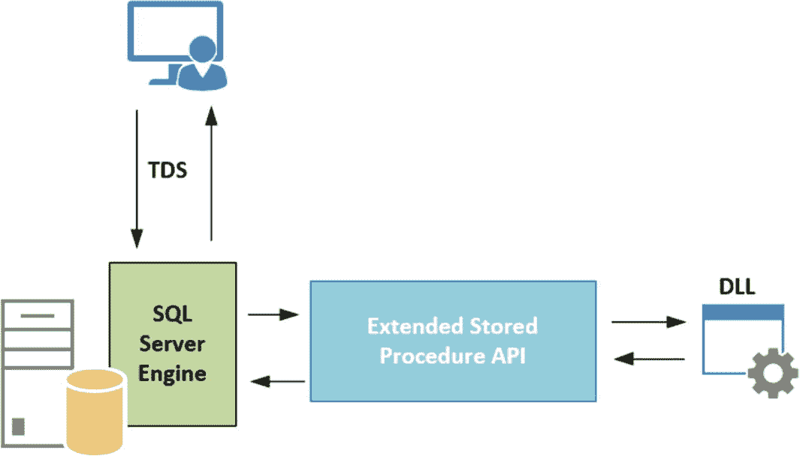

图 11-18 执行扩展存储过程

您不仅可以编写自己的扩展存储过程来执行 T-SQL 无法完成的操作，SQL Server 本身也自带了许多不同的扩展存储过程。其中大多数可以通过扩展存储过程名称中的 `xp_` 前缀来识别，尽管并非所有都有此前缀。图 11-19 展示了在我的测试 SQL Server 实例的 `master` 数据库中选择的一部分扩展存储过程。

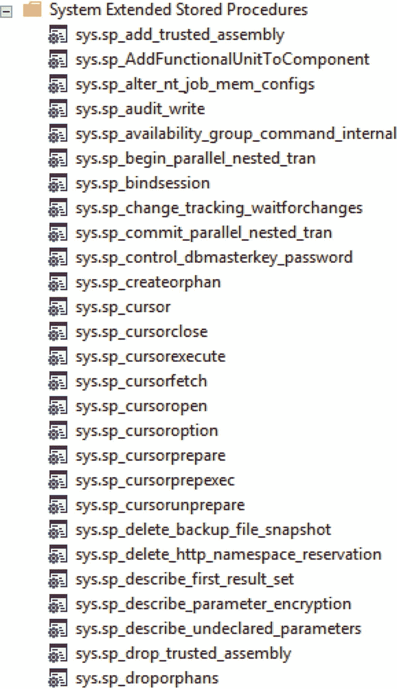

图 11-19 master 数据库中的扩展存储过程选集

可能最臭名昭著的扩展存储过程是 `xp_cmdshell`。`xp_cmdshell` 扩展存储过程使得从 SQL Server 内部在 Windows 命令 shell 中执行命令成为可能。如果您的 SQL Server 实例遭到入侵，这是一个巨大的安全风险，因为它提供了可以影响整个 Windows 操作系统的命令访问权限。值得庆幸的是，默认情况下无法运行 `xp_cmdshell` 扩展存储过程；您必须通过配置一个高级配置设置来特别允许其使用。

### PREEMPTIVE_OS_GETPROCADDRESS 示例

在这个示例中，我将执行 SQL Server 中已有的一个扩展存储过程 `xp_getnetname`，而不是编写一个自定义扩展存储过程，这远远超出了本书的范围。`xp_getnetname` 是一个未公开的扩展存储过程，它返回托管 SQL Server 实例的计算机的 NETBIOS 名称。在执行 `xp_getnetname` 扩展存储过程之前，我清除了 `sys.dm_os_wait_stats` DMV，然后在执行 `xp_getnetname` 之后，我查询该 DMV 以获取 `PREEMPTIVE_OS_GETPROCADDRESS` 等待信息。清单 11-4 显示了我在测试 SQL Server 实例上执行的整个查询。

```
USE [master]
GO
DBCC SQLPERF('sys.dm_os_wait_stats', CLEAR);
exec xp_getnetname;
SELECT *
FROM sys.dm_os_wait_stats
WHERE wait_type = 'PREEMPTIVE_OS_GETPROCADDRESS';
```
清单 11-4 执行 xp_getnetname 并查询等待统计信息

清单 11-4 中查询的结果可以在图 11-20 中看到。

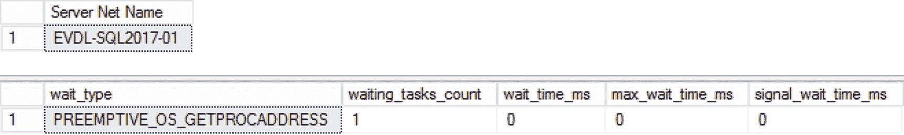

图 11-20 PREEMPTIVE_OS_GETPROCADDRESS 等待

结果并不引人注目。显然，`xp_getnetname` 扩展存储过程在加载 `.dll` 入口点时不会引起任何问题，因为没有记录到等待时间。但是，如 `waiting_tasks_count` 列所示，等待确实发生了，只是 SQL Server 加载入口点花费了不到一毫秒的时间。

### 降低 PREEMPTIVE_OS_GETPROCADDRESS 等待

由于 `PREEMPTIVE_OS_GETPROCADDRESS` 等待类型与执行扩展存储过程直接相关，因此您调查的第一步应该是检测正在执行的是哪个扩展存储过程以及它的功能是什么。

我曾看到 `PREEMPTIVE_OS_GETPROCADDRESS` 等待在多个客户那里发生，因为他们使用的是使用扩展存储过程执行数据库备份的第三方备份应用程序，但高 `PREEMPTIVE_OS_GETPROCADDRESS` 等待时间可能还有更多其他原因。了解正在执行哪个扩展存储过程可以帮助您追踪是哪个进程在执行该扩展存储过程。

在 SQL Server 2008 和 2008R2 中也有一些已知的错误，会报告高于正常的 `PREEMPTIVE_OS_GETPROCADDRESS` 等待时间，因为扩展存储过程的执行时间也被记录在等待时间中，而不仅仅是入口点加载时间。如果您仍在 SQL Server 2008 或 2008R2 上运行，并且遇到非常高的 `PREEMPTIVE_OS_GETPROCADDRESS` 等待时间，升级到最新的 Service Pack 并检查 `PREEMPTIVE_OS_GETPROCADDRESS` 等待时间是否下降可能是值得的。或者更好的是，升级到更高版本的 SQL Server，因为 SQL Server 2008R2 已于 2019 年 7 月 9 日标记为生命周期结束。

### PREEMPTIVE_OS_GETPROCADDRESS 总结

`PREEMPTIVE_OS_GETPROCADDRESS` 等待类型与扩展存储过程的执行直接相关。扩展存储过程可以用多种编程语言（如 C#）编写，允许您执行在 T-SQL 中原本不可能的操作。每当加载扩展存储过程 `.dll` 内的入口点时，就会记录 `PREEMPTIVE_OS_GETPROCADDRESS` 等待类型的等待时间。在正常情况下，`PREEMPTIVE_OS_GETPROCADDRESS` 等待类型的等待时间非常低。看到高的 `PREEMPTIVE_OS_GETPROCADDRESS` 等待时间可能表明入口点加载遇到了问题。在 SQL Server 2008 和 2008R2 中也存在与计算 `PREEMPTIVE_OS_GETPROCADDRESS` 等待类型相关的错误。如果您正在运行 SQL Server 2008 或 2008R2 并遇到高的 `PREEMPTIVE_OS_GETPROCADDRESS` 等待时间，升级到最新的 Service Pack 或迁移到更高版本的 SQL Server 可能是值得的，因为 SQL Server 2008R2 已于 2019 年 7 月 9 日标记为生命周期结束。

