# 12. 背景与其他等待类型

SQL Server 内部存在许多可能陷入特定等待类型等待的不同进程，到目前为止我们已经讨论了其中不少。其中一些内部进程在 SQL Server 中持续运行，等待着有工作需要处理。当这些通常被称为 `后台进程` 的进程在等待工作到达时，SQL Server 会将它们等待工作的时间记录为与这些后台进程相关的特定等待类型的等待时间。虽然这些后台等待类型与性能问题没有直接关系，但它们通常拥有最高的等待时间，并且在你按等待时间排序查询顶级等待类型时，会出现在列表的顶部。

这些后台等待类型常被称为 `良性` 的，可以安全地忽略，因为它们仅仅表明一个内部进程正在等待工作到来。这个逻辑同样适用于本章将要讨论的等待类型。不过，我不仅想告诉你们在分析等待统计信息时可以忽略它们，还想提供一些关于它们的背景信息，以便你们了解它们度量的是什么，以及为什么可以安全地忽略它们。请记住，我们这里讨论的是 SQL Server，这意味着是否能完全忽略这些后台等待类型“取决于”许多因素。你不会是第一个遇到性能问题，最后却发现问题根源竟是一个被忽略的后台进程的人。所以我的建议是：忽略它们，但不要忘记它们！

除了后台等待类型，我还加入了一些难以归类到前面章节的其他等待类型，因为它们不太符合那些章节的等待类型类别。

由于本章中的后台等待类型在其关联进程等待工作时会持续记录等待时间，因此我没有为这些等待类型包含示例章节或降低等待时间章节。

## CHECKPOINT_QUEUE

本章的第一个等待类型是那种会随时间累积大量等待时间的后台等待类型之一：`CHECKPOINT_QUEUE`。在许多情况下，`CHECKPOINT_QUEUE` 等待类型可以安全地忽略，但了解它代表什么以及为何有如此高的等待时间并无坏处。

### CHECKPOINT_QUEUE 等待类型是什么？

`CHECKPOINT_QUEUE` 等待类型与 SQL Server 中的检查点进程相关，该进程负责将“脏”（已修改的）数据页从缓冲区缓存写入磁盘上的数据文件。在第 6 章“与 I/O 相关的等待类型”中，我们在讨论 `SLEEP_BPOOL_FLUSH` 等待类型时已经详细探讨了检查点进程，因此这里不再重复所有信息。需要了解的重要一点，也是此等待类型通常可以被忽略的原因是：`CHECKPOINT_QUEUE` 等待类型表明检查点进程正在等待工作。这意味着 `CHECKPOINT_QUEUE` 等待类型的等待时间并不表示任何性能问题；它们仅表示检查点进程花在等待工作上的时间。在 SQL Server 实例负载不重，或者没有太多数据修改操作的情况下，其等待时间可能达到非常高的值。

在 `sys.dm_os_wait_stats` 和 `sys.dm_os_waiting_tasks` 这两个 DMV 中记录 `CHECKPOINT_QUEUE` 等待时间是通过一个特定的内部例程进行的，该例程可能会返回意外的等待时间（例如基线内的突然峰值）。图 12-1 展示了在我的测试 SQL Server 实例上查询 `sys.dm_os_wait_stats` 和 `sys.dm_os_waiting_tasks` DMV 以获取 `CHECKPOINT_QUEUE` 等待类型等待信息的结果。

`../images/340881_2_En_12_Chapter/340881_2_En_12_Fig1_HTML.jpg`

图 12-1：CHECKPOINT_QUEUE 等待

这里值得注意的是，`sys.dm_os_wait_stats` DMV 中的累积等待时间保持为 0，而 `sys.dm_os_waiting_tasks` DMV 中的等待时间则非常高。我的测试 SQL Server 实例在后台没有执行太多工作，因此检查点进程大部分时间都在等待工作是合乎逻辑的。两个 DMV 之间等待时间的差异与 SQL Server 执行检查点操作的方式有关。这两个 DMV 中显示的等待时间仅由自动检查点进程记录。手动检查点的执行不会影响等待时间。作为自动检查点进程的一部分，`sys.dm_os_waiting_tasks` DMV 中的等待时间会被转移到 `sys.dm_os_wait_stats` DMV 并重置为 0。因此，如果你在 `sys.dm_os_waiting_tasks` 中注意到非常高的 `CHECKPOINT_QUEUE` 等待时间，这意味着自动检查点进程已经有一段时间没有运行了。

为了向你们简单演示这个行为，我创建了一张表，重置了 `sys.dm_os_wait_stats` DMV，向表中插入了几行数据，执行了一次手动检查点，然后查询了 `sys.dm_os_wait_stats` 和 `sys.dm_os_waiting_tasks` DMV，如清单 12-1 所示。

```sql
-- 在 AdventureWorks 数据库中创建表
USE [AdventureWorks]
GO
CREATE TABLE check_test
(
ID UNIQUEIDENTIFIER,
RandomData VARCHAR(50)
);
GO
-- 清除 sys.dm_os_wait_stats
DBCC SQLPERF('sys.dm_os_wait_stats', CLEAR);
-- 向表中插入几行数据
INSERT INTO check_test
(
ID,
RandomData
)
VALUES
(
NEWID(),
CONVERT(varchar(50), NEWID())
);
GO 100
CHECKPOINT 1;
-- 查询等待统计信息
SELECT *
FROM sys.dm_os_wait_stats
WHERE wait_type = 'CHECKPOINT_QUEUE';
SELECT *
FROM sys.dm_os_waiting_tasks
WHERE wait_type = 'CHECKPOINT_QUEUE';
```

清单 12-1：CHECKPOINT_QUEUE 示例

图 12-2 显示了针对 `sys.dm_os_wait_stats` 和 `sys.dm_os_waiting_tasks` DMV 查询的结果。

`../images/340881_2_En_12_Chapter/340881_2_En_12_Fig2_HTML.jpg`

图 12-2：CHECKPOINT_QUEUE 等待

如你所见，手动检查点并没有在 `sys.dm_os_wait_stats` DMV 中生成任何等待。同时，自动检查点也没有发生，因为插入 100 行产生的日志记录太少，不足以触发自动检查点。

如果我们插入更多行，应该能够触发自动检查点。在这种情况下，我运行了以下查询，向我们在清单 12-1 中创建的表插入 100,000 行。在插入运行时，我反复查询了 `sys.dm_os_wait_stats` 和 `sys.dm_os_waiting_tasks` DMV，以查看是否有任何变化。如下所示：

```sql
INSERT INTO check_test
(
ID,
RandomData
)
VALUES
(
NEWID(),
CONVERT(varchar(50), NEWID())
);
GO 100000
```

几秒钟后，我注意到 `CHECKPOINT_QUEUE` 等待类型的等待时间被转移到了 `sys.dm_os_wait_stats` DMV 中，如图 12-3 所示。

`../images/340881_2_En_12_Chapter/340881_2_En_12_Fig3_HTML.jpg`

图 12-3：CHECKPOINT_QUEUE 等待

显然，我们插入了足够的日志记录导致自动检查点发生。从这个例子可以看出，只有自动检查点才会将 `CHECKPOINT_QUEUE` 的等待时间写入 `sys.dm_os_wait_stats` DMV。

当你注意到 `sys.dm_os_wait_stats` DMV 中突然出现非常高的等待时间值时，你应该记住这个行为。这通常只发生在 SQL Server 实例工作负载非常小，或者工作负载主要由读取操作而非数据修改操作组成的情况下。

### CHECKPOINT_QUEUE 概述

`CHECKPOINT_QUEUE` 等待类型与 SQL Server 内部的检查点操作相关。当 SQL Server 正在等待自动检查点操作发生时，会记录 `CHECKPOINT_QUEUE` 等待类型的等待时间。这通常是一种可以安全忽略的等待类型，因为它并不表示存在任何性能问题。`CHECKPOINT_QUEUE` 等待类型的等待时间在 `sys.dm_os_wait_stats` 和 `sys.dm_os_waiting_tasks` 这两个 DMV 中的记录方式不同，这可能导致在查询 `sys.dm_os_wait_stats` DMV 时出现突然的高等待时间。当你在 `sys.dm_os_wait_stats` DMV 中注意到较高的 `CHECKPOINT_QUEUE` 等待时间时，请记住这一行为。

## DIRTY_PAGE_POLL

`DIRTY_PAGE_POLL` 等待类型是在 SQL Server 2012 中随间接检查点功能引入的，其行为与我们之前讨论的 `CHECKPOINT_QUEUE` 等待类型非常相似。自动检查点进程以 1 分钟的固定间隔运行，而间接检查点功能允许你基于每个数据库配置特定的检查点间隔。即使你未使用间接检查点，`DIRTY_PAGE_POLL` 等待类型仍会累积等待时间。

### 什么是 DIRTY_PAGE_POLL 等待类型？

`DIRTY_PAGE_POLL` 等待类型是另一个通常可以安全忽略的后台等待。该等待类型与用于间接检查点功能的恢复写入器进程相关，该进程在 SQL Server 实例的后台持续运行。由于这种关联，让我们快速了解一下什么是间接检查点以及它们如何工作。

我们知道，SQL Server 内部的检查点进程负责将缓冲区缓存中修改过的数据页写入磁盘上的数据库数据文件。默认情况下，检查点进程每分钟自动运行一次，或者在生成了足够多的日志记录时运行。当发生崩溃时，检查点进程在 SQL Server 数据库的恢复持续时间中扮演着至关重要的角色。以以下场景为例：当你在 SQL Server 实例中对数据库执行大量修改操作时，发生崩溃。幸运的是，你能够简单地重启 SQL Server 服务以使一切恢复运行。SQL Server 首先要做的是启动恢复过程。恢复过程将检查事务日志，查找崩溃发生时未提交的任何事务，并执行回滚。恢复过程还将检查已提交事务修改的数据页是否因为仅在缓冲区缓存中被修改而未写入数据库数据文件。

如果发现任何这样的页面，SQL Server 将使用事务日志重做这些事务。现在想象你有一个繁忙的 SQL Server 实例，每分钟执行成千上万的修改操作。这意味着有大量脏页尚未写入磁盘的可能性相当高。如果你的 SQL Server 随后崩溃（或者，例如发生故障转移），恢复过程将需要更多时间来完成。间接检查点可以帮助我们尽可能缩短这个恢复过程。通过配置此功能，我们可以告诉 SQL Server 更快地将修改过的数据页写入磁盘；例如，每 10 秒一次。图 12-4 展示了数据库属性中间接检查点功能的位置和名称。

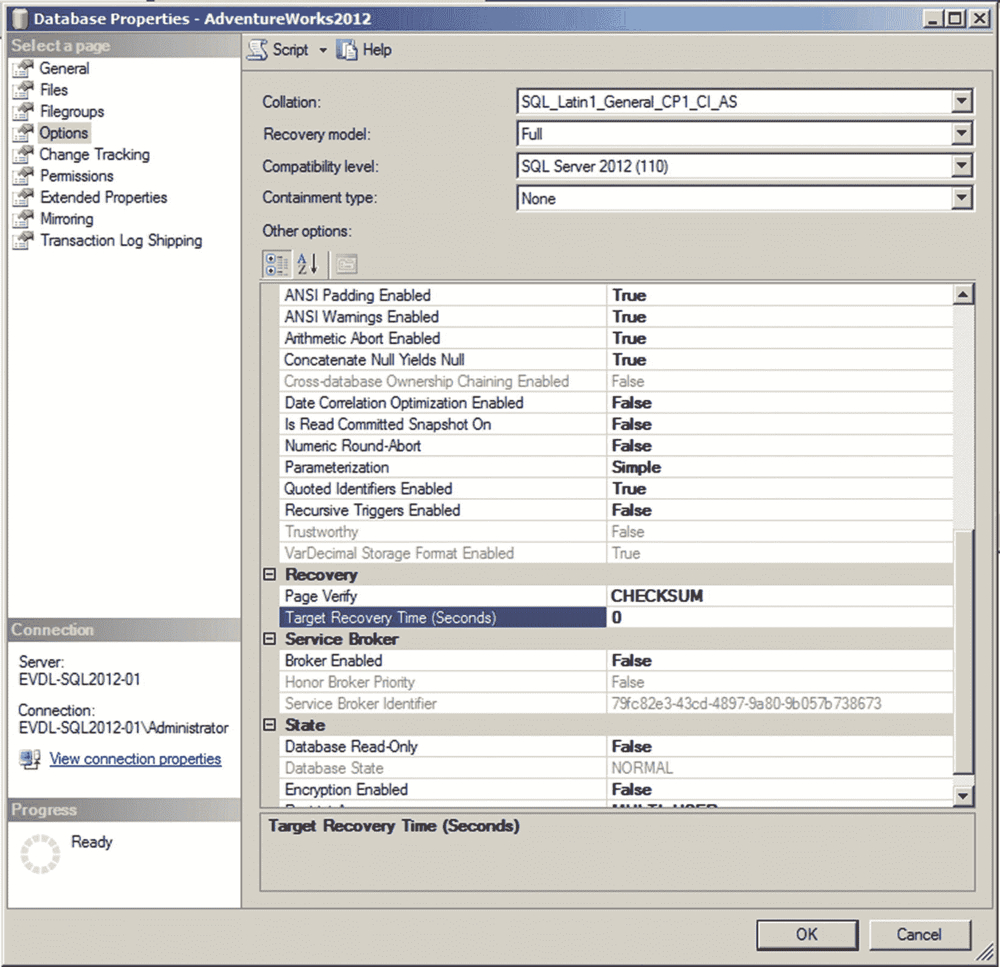

图 12-4
间接检查点功能的位置和值

默认情况下，**Target Recovery Time (Seconds)** 配置选项的值为 0。这意味着未使用间接检查点。如果你将该值修改为 0 以外的任何值，则会以你指定的秒数间隔发生间接检查点。

从 SQL Server 2016 开始，当你在 SQL Server 实例中创建新数据库时，会自动配置间接检查点。在这些情况下，**Target Recovery Time (Seconds)** 将被设置为 60 而不是 0。

然而，你在 **Target Recovery Time (Seconds)** 选项中配置的时间并不意味着每 *x* 秒就会执行一次检查点进程。通过设置此值，SQL Server 将计算在需要将脏页写入数据库数据文件之前可以存在多少脏页，以确保恢复过程永远不会超过指定的时间。例如，如果你将 **Target Recovery Time (Seconds)** 选项配置为 15 秒，SQL Server 将以这样的间隔将脏页写入数据库数据文件：当 SQL Server 实例发生故障时，它可以在 15 秒内恢复。

为了监控缓冲区缓存中有多少脏页，以便 SQL Server 知道何时达到脏页阈值，引入了恢复写入器。即使你未配置 **Target Recovery Time (Seconds)** 选项，`DIRTY_PAGE_POLL` 等待仍会发生，因为恢复写入器进程仍会轮询缓冲区缓存内的脏页数量，尽管不会针对该数字采取任何操作。如你在图 12-5 中所见，即使不使用间接检查点，等待时间也很容易达到很高的值。


图 12-5
DIRTY_PAGE_POLL 等待

```
-- 查询等待统计信息
SELECT *
FROM sys.dm_os_wait_stats
WHERE wait_type = 'DIRTY_PAGE_POLL';
```

间接检查点也存在相关风险。将 **Target Recovery Time (Seconds)** 选项配置为非常低的值可能导致存储子系统负载增加，因为脏页会被持续写入磁盘。在将此设置配置到生产 SQL Server 实例之前，请务必对其进行广泛测试。

### DIRTY_PAGE_POLL 概述

`DIRTY_PAGE_POLL` 等待类型是在 SQL Server 2012 中随间接检查点功能引入的（该功能最终成为 SQL Server 2016 或更高版本中新建数据库的默认设置）。即使你不使用间接检查点，由于新的恢复写入器进程，`DIRTY_PAGE_POLL` 等待类型仍会累积等待时间。通常，`DIRTY_PAGE_POLL` 等待类型并不表示性能问题，因此在分析 SQL Server 实例上的等待统计信息时，可以安全地忽略它。

## LAZYWRITER_SLEEP

`LAZYWRITER_SLEEP` 等待类型，不出所料，与 SQL Server 内部的 lazywriter 进程相关。lazywriter 进程与我们本章前面讨论的检查点进程有一些相似之处，因为它也将脏页从缓冲区缓存写入数据库数据文件。然而，相似之处仅此而已，因为 lazywriter 进程将这些页面写入数据库数据文件的原因与检查点进程完全不同。


### 什么是 LAZYWRITER_SLEEP 等待类型？

正如我们在本章讨论的其他等待类型一样，`LAZYWRITER_SLEEP` 等待类型出现在一个内部 SQL Server 进程（此处是惰性写入器进程）等待工作时。惰性写入器是一个后台进程，它会在特定的时间间隔被激活。当它被激活时，它会扫描缓冲区缓存的大小，并判断其中是否有足够的可用页。在缓冲区缓存中始终保持一定数量的可用页非常重要，这样新的页请求可以直接分配空间，而无需先换出其他页。如果惰性写入器进程判断缓冲区缓存中有足够的可用页，它就会再次进入休眠，并在休眠期间记录 `LAZYWRITER_SLEEP` 等待类型。然而，如果缓冲区缓存中没有足够的可用页，惰性写入器进程会在检查点之间检测缓冲区缓存中哪些“脏页”一段时间未被访问，将它们写入数据库数据文件，并从缓冲区缓存中清除它们。因此，如果缓冲区缓存中有多余的可用页，惰性写入器进程就没什么工作要做。如果你的 SQL Server 实例正经历内存压力，惰性写入器进程在换出脏页和腾出缓冲区缓存空间时将会忙碌得多。图 12-6 通过流程图展示了检查点进程与惰性写入器进程之间的关系。

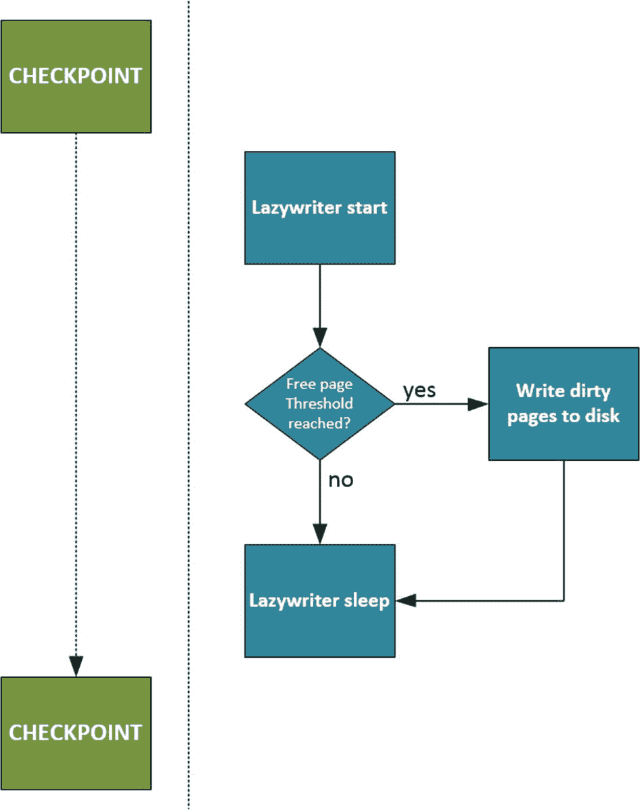

图 12-6
检查点与惰性写入器进程

由于 `LAZYWRITER_SLEEP` 等待类型表示惰性写入器进程处于休眠或等待工作的时间，它是另一种可以安全忽略的等待类型。然而，有一个需要注意的地方——如果惰性写入器进程持续工作，将脏页从缓冲区缓存移动到数据库数据文件，这可能表明你的 SQL Server 实例正在经历内存压力。这对性能不利，因为每个页在读取或修改之前都必须先移动到缓冲区缓存。这种行为可能导致 `LAZYWRITER_SLEEP` 等待类型的等待时间低于正常水平。

### LAZYWRITER_SLEEP 总结

`LAZYWRITER_SLEEP` 等待类型与 SQL Server 内部的惰性写入器进程相关。惰性写入器进程按固定的时间间隔启动，如果缓冲区缓存中没有足够的可用页，它负责将脏数据页写入数据库数据文件。`LAZYWRITER_SLEEP` 等待类型表明惰性写入器进程当前未在运行，或处于休眠状态，直到收到唤醒信号并检查缓冲区缓存。由于 `LAZYWRITER_SLEEP` 等待类型仅向我们展示惰性写入器进程处于非活动状态的时间，因此在大多数情况下可以忽略。

## MSQL_XP

在第 11 章“抢占式等待类型”的最后部分，我们讨论了 `PREEMPTIVE_GETPROCADDRESS` 等待类型。我们了解到，`PREEMPTIVE_GETPROCADDRESS` 等待类型在加载扩展存储过程的入口点时记录等待时间。我注意到的一个重要点是，`PREEMPTIVE_GETPROCADDRESS` 等待类型不记录扩展存储过程的执行时间，只记录加载入口点的时间。扩展存储过程的执行时间实际上由另一种等待类型 `MSQL_XP` 来跟踪。

### 什么是 MSQL_XP 等待类型？

`MSQL_XP` 等待类型记录 SQL Server 实例上扩展存储过程的执行时间。`MSQL_XP` 等待类型也用于在使用多活动结果集时检测死锁情况。MARS 是一项功能，允许通过单个 SQL Server 连接执行多个（并发的）批处理。我们不会深入探讨 MARS 的细节，但你可以在这里找到更多信息：[`https://msdn.microsoft.com/en-us/library/ms131686.aspx`](https://msdn.microsoft.com/en-us/library/ms131686.aspx)。

看到 `MSQL_XP` 等待类型的等待时间高于正常水平的最常见原因是扩展存储过程的执行。只要扩展存储过程的执行时间保持不变，这并不一定意味着存在问题。然而，如果某个扩展存储过程花费的时间比预期长，当你将等待时间与基线进行比较时，肯定会注意到 `MSQL_XP` 等待时间的增加。

### MSQL_XP 示例

为了证明扩展存储过程执行时会发生 MSQL_XP 等待，我使用清单 12-2 中的脚本创建了一个简单的例子。该脚本将重置 `sys.dm_os_wait_stats` DMV，执行一个扩展存储过程（此处是 `master` 数据库中的 `xp_dirtree` 扩展存储过程），然后查询 `sys.dm_os_wait_stats` 以获取 MSQL_XP 等待信息。

```
DBCC SQLPERF('sys.dm_os_wait_stats', CLEAR);
EXEC master..xp_dirtree 'c:\windows';
SELECT *
FROM sys.dm_os_wait_stats
WHERE wait_type = 'MSQL_XP';
```
清单 12-2
MSQL_XP 示例

在我的测试 SQL Server 实例上执行清单 12-2 的查询结果如图 12-7 所示。顶部窗口显示了 `xp_dirtree` 的结果，底部窗口显示了对 `sys.dm_os_waits_stats` DMV 的查询结果。

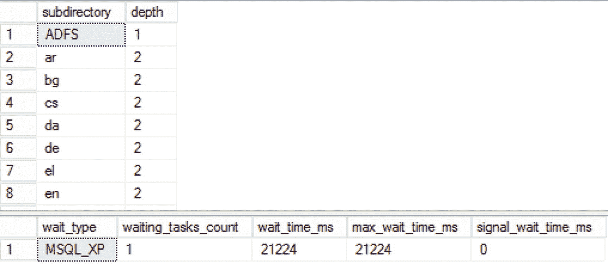

图 12-7
MSQL_XP 等待

`sys.dm_os_wait_stats` DMV 中的信息显示，在 `MSQL_XP` 等待类型上发生了一次等待，等待时间为 21,224 毫秒。在我的测试 SQL Server 实例上，这与执行清单 12-2 中查询所花费的时间（21 秒）几乎相同。

### 降低 MSQL_XP 等待

当注意到 `MSQL_XP` 等待类型的等待时间高于正常水平时，很可能是正在使用的扩展存储过程完成所需的时间比正常情况要长。你的首要行动点应该是识别正在使用哪些扩展存储过程以及它们的用途。由于扩展存储过程也可以在 SQL Server 之外执行任务，它们可能会遇到其他可能使其变慢的 Windows 进程。了解扩展存储过程的函数及其功能，可以帮助你快速识别它遇到问题的位置。

如果你正在使用 MARS，你可能遇到了 MARS 连接的死锁。已经发布了多个 SQL Server 更新来减少 MARS 死锁发生的机会，因此请确保你的 SQL Server 实例已打好补丁。同时务必检查使用 MARS 执行查询的应用程序代码是否存在潜在问题。

### MSQL_XP 总结

`MSQL_XP` 等待类型做两件不同的事情：它检测执行扩展存储过程所需的时间，并为 MARS 连接提供死锁检测。频繁看到 `MSQL_XP` 等待类型的等待时间高于正常水平，通常表明某个扩展存储过程完成所需的时间比正常情况长。尝试检测正在执行哪个扩展存储过程及其功能，这将使对扩展存储过程进行故障排除更容易。

## OLEDB

每当 SQL Server 必须访问对象链接与嵌入数据库提供程序时，就会出现 `OLEDB` 等待类型。SQL Server 使用 OLEDB 客户端提供程序的原因有多种，每当它使用时，SQL Server 都会在 OLEDB 等待类型上记录等待时间。


### OLEDB 等待类型是什么？

SQL Server 在内部执行许多不同操作时会使用 OLEDB 客户端提供程序。例如，链接服务器的流量会通过 OLEDB 客户端提供程序，并导致 OLEDB 等待。其他操作，尤其是当 SQL Server 需要从外部源检索数据时，也可能导致使用 OLEDB 客户端提供程序。

SQL Server 内部的一些操作也会使用 OLEDB 客户端提供程序，即使这些操作发生在内部。一个很好的例子就是 `DBCC` 命令，我将在下面的示例部分进行演示。

### OLEDB 示例

一个使用 OLEDB 客户端提供程序的有趣过程是 SQL Server 内部的 `DBCC` 命令。每当你执行一个 `DBCC` 命令时，你肯定会看到 `OLEDB` 等待出现。代码清单 12-3 展示了一个在执行 `DBCC CHECKDB` 后出现 `OLEDB` 等待的示例。该示例脚本将清除 `sys.dm_os_wait_stats` DMV，对 `AdventureWorks` 数据库执行 `CHECKDB`，然后查询 `sys.dm_os_wait_stats` DMV 中的 `OLEDB` 等待。

```
DBCC SQLPERF('sys.dm_os_wait_stats', CLEAR);
DBCC CHECKDB('AdventureWorks');
SELECT *
FROM sys.dm_os_wait_stats
WHERE wait_type = 'OLEDB';
代码清单 12-3
生成 OLEDB 等待
```

在我测试的 SQL Server 实例上执行代码清单 12-3 中的查询，其结果如图 12-8 所示。

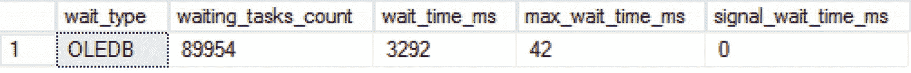

图 12-8 OLEDB 等待

从图 12-8 可以看出，执行 `DBCC CHECKDB` 会导致 `OLEDB` 等待。

### 降低 OLEDB 等待

正如你在前面的示例中所看到的，对数据库执行 `DBCC CHECKDB` 会导致 `OLEDB` 等待。然而，这并不意味着存在与 OLEDB 客户端提供程序相关的问题；相反，它只是表明 `DBCC CHECKDB` 命令利用了 OLEDB 客户端提供程序。运行 `DBCC CHECKDB` 是确保数据库健康的重要部分。为了避免降低 `OLEDB` 等待时间而放弃一致性检查，这种做法是糟糕的，我强烈建议不要这样做。在 `DBCC` 命令之外看到较高的 `OLEDB` 等待时间可能表明你的 SQL Server 环境中某处存在性能问题。如果你正在处理远程源，例如链接服务器或 Excel 文件，你也会受到远程源性能的影响。例如，如果你从链接服务器查询信息，而该链接服务器正遇到性能问题，这很可能也会反映在 `OLEDB` 等待时间上。此外，某些操作，如排序，也会影响链接服务器上的查询持续时间。到远程源的网络连接也可能在导致高于正常的 `OLEDB` 等待时间中起到作用。如果你访问远程源所经过的网络连接出现性能下降，你将再次在 `OLEDB` 等待时间中注意到这一点。

由于 `OLEDB` 等待可能因多种原因而发生，其中一些是良性的，如 `DBCC` 命令，而另一些则可能与性能问题相关，我建议你不要忽略 `OLEDB` 等待类型，而是要像其他指示性能的等待类型一样对其进行监控。

### OLEDB 总结

`OLEDB` 等待类型可能由于各种使用对象链接与嵌入数据库 (OLEDB) 客户端提供程序的源而发生。大多数源与远程数据源（如链接服务器）相关。一些内部进程也使用 OLEDB 客户端提供程序，最显著的就是 `DBCC` 命令。看到 `OLEDB` 等待类型出现高于正常的等待时间不一定意味着存在性能问题，特别是当它们可以与计划的 `DBCC` 命令执行相关联时。当你在使用链接服务器等远程数据源时，在 `DBCC` 命令之外看到高于正常的等待时间可能意味着远程数据源正在经历性能问题。在这种情况下，请专注于数据源；如果源有问题，它必然也会影响 `OLEDB` 等待时间。

## TRACEWRITE

`TRACEWRITE` 等待类型是一种特殊的等待类型，仅在跟踪运行时（最常见的是 SQL Profiler 跟踪）才会收集等待时间。跟踪是 SQL Server 中的一个后台进程，它收集各种通常是用户指定的关于 SQL Server 实例性能的信息。例如，可以使用 SQL Server Profiler 来捕获当前正在执行的查询，过滤到单个数据库，并包含运行时信息。SQL Server 中有多种跟踪方法可用，但影响 `TRACEWRITE` 等待类型最常见的是 SQL Server Profiler 跟踪。

SQL Server Profiler 是 SQL Server 的一部分应用程序，从 SQL Server 2016 开始，它也包含在独立的 SQL Server Management Studio 产品中，允许用户创建和监视针对 SQL Server 实例的跟踪。Microsoft 在引入 SQL Server 2012 时宣布 SQL Server Profiler 已弃用，并建议使用 Extended Events 来捕获跟踪。尽管 SQL Server Profiler 已被弃用，但它在 SQL Server 2014 中仍然可用，并且从 SQL Server 2016 开始，无论何时部署独立的 SQL Server Management Studio 产品，它都会被安装。许多人仍然依赖 SQL Server Profiler 跟踪而非 Extended Events 来排查和监视查询性能。

使用 SQL Server Profiler 的坏消息是，在执行跟踪时可能会导致一些性能开销。Microsoft 发布的一篇文章得出结论，在繁忙的系统上运行 SQL Server Profiler 跟踪可能对每秒事务数量产生 10% 的影响；你可以在此处找到该文章：[`https://msdn.microsoft.com/en-us/library/cc293614.aspx`](https://msdn.microsoft.com/en-us/library/cc293614.aspx)。由于 SQL Server Profiler 跟踪可能对系统性能产生如此大的影响，我认为监控 `TRACEWRITE` 等待时间非常重要。

### TRACEWRITE 等待类型是什么？

正如我们刚才指出的，当使用 SQL Server Profiler 对 SQL Server 实例执行跟踪时，`TRACEWRITE` 等待类型就会出现在你的系统上。由于 SQL Server Profiler 跟踪可能对 SQL Server 实例的性能产生如此大的影响，建议你监控此等待类型以检测是否有任何 SQL Server Profiler 跟踪正在执行。

你可能希望运行 SQL Server Profiler 跟踪的原因有很多；例如，如果你想排查一个非常具体的查询问题，或者监视某个特定查询被执行的次数。尽管存在 SQL Server Profiler 的替代方案，如服务器端跟踪和 Extended Events，但 SQL Server Profiler 工具与通常很复杂的 Extended Events 相比，非常易于使用。


### TRACEWRITE 示例

为了向你展示一个发生 `TRACEWRITE` 等待的示例，我们需要启动一个 SQL Server Profiler 跟踪。SQL Server Profiler 程序是“管理工具 - 完整版”功能的一部分，在安装低于 SQL Server 2016 版本的 SQL Server 时，或者向现有安装添加功能时，你可以选择此功能。如果你安装的是独立的 SQL Server Management Studio 产品，Profiler 功能也会随之自动安装。图 12-9 展示了 SQL Server 2012 安装程序中的该功能。

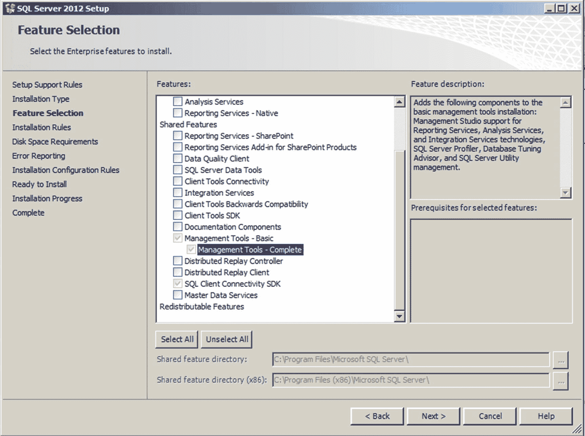

图 12-9.
SQL Server 2012 安装程序中的“管理工具 - 完整版”功能

安装了“管理工具 - 完整版”功能后，你可以在“开始”菜单下的 SQL Server ➤ 性能工具 文件夹中找到 SQL Server Profiler，或者在 `C:\Program Files (x86)\Microsoft SQL Server\[版本号]\Tools\Binn` 文件夹中找到它。
如果你安装的是独立的 SQL Server Management Studio 产品，那么 Profiler 可以在 `C:\Program Files (x86)\Microsoft SQL Server\140\Tools\Binn` 文件夹中找到。

启动 SQL Server Profiler 后，你可以通过点击图 12-10 所示的“新建跟踪”按钮，或者选择 文件 ➤ 新建跟踪，来启动一个新跟踪。

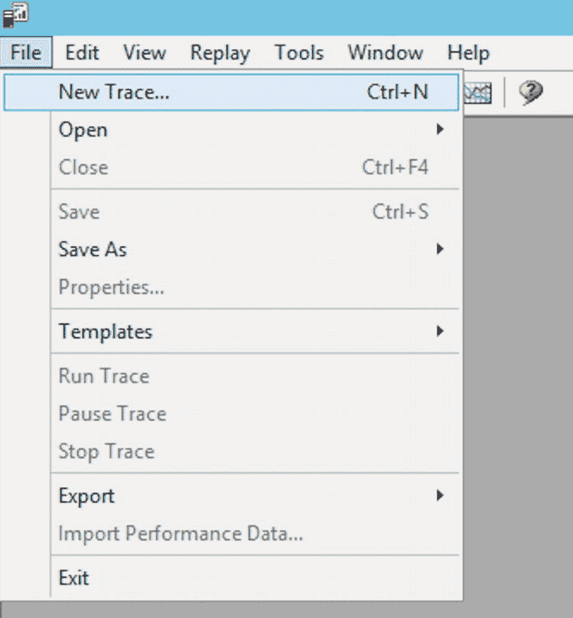

图 12-10
新建 SQL Server Profiler 跟踪

启动新跟踪时，你需要连接到要跟踪的 SQL Server 实例。在本例中，我连接到了我的测试 SQL Server 实例。登录到 SQL Server 实例后，“跟踪属性”窗口将会打开。这个窗口提供了多种选项来配置你的跟踪以及你希望如何存储跟踪数据。在这个示例中，我们不会更改“常规”选项卡中的任何内容，而是直接转到“事件选择”选项卡。在那里，我们可以选择要捕获的事件，并可选择为这些事件提供筛选器。默认情况下，启动新跟踪时会预加载一个选择，如图 12-11 所示。

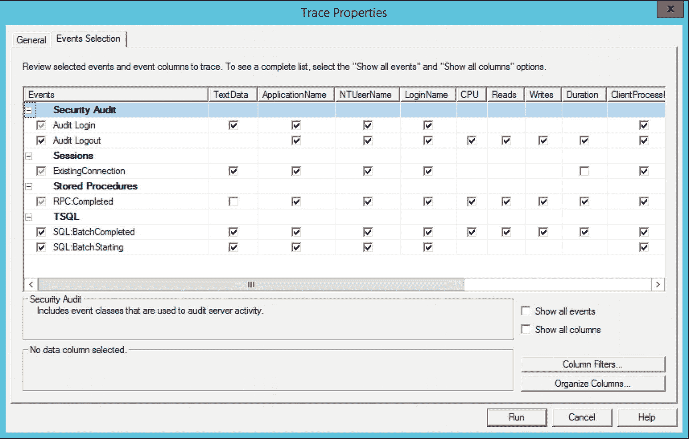

图 12-11
SQL Server Profiler 默认事件选择

对于本示例，我们不需要默认选择的所有额外事件。在这种情况下，我们勾选“显示所有列”复选框，并且只选择 `SQL:BatchCompleted` 事件，如图 12-12 所示。这将记录所有针对测试 SQL Server 实例执行的 T-SQL 语句，并捕获该事件所有可用的信息。

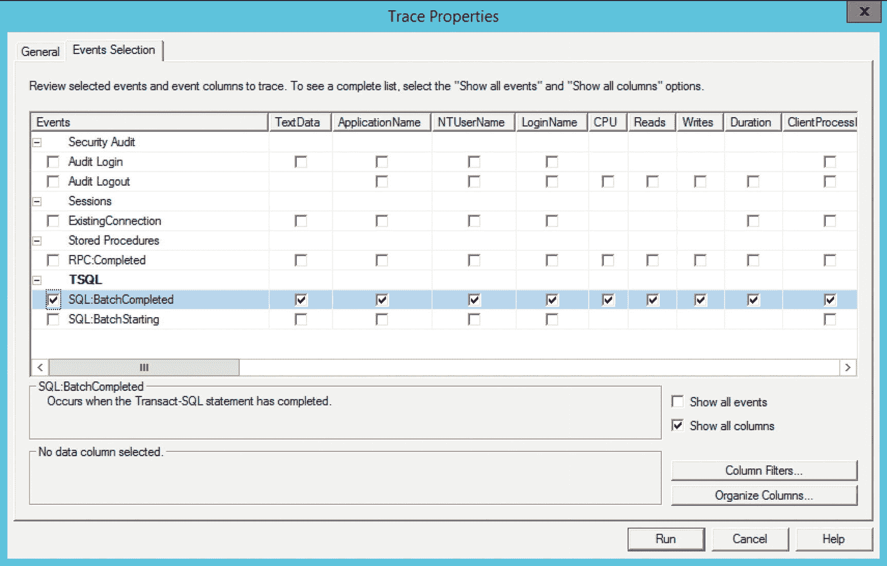

图 12-12
选择了 `SQL:BatchCompleted` 事件

我们不会对该事件配置任何筛选器，因此将捕获针对 SQL Server 实例执行的每一条 T-SQL 语句。我们点击“运行”以启动跟踪，这将打开跟踪窗口，该窗口会在事件发生在 SQL Server 实例上时显示它们，以及在此情况下有关查询的附加信息。

现在我们的 SQL Server Profiler 跟踪正在运行，我们应该能够注意到 `TRACEWRITE` 等待的发生。我们在 SQL Server Management Studio 中针对 `sys.dm_os_waiting_tasks` 动态管理视图 (DMV) 执行以下查询：

```sql
SELECT *
FROM sys.dm_os_waiting_tasks
WHERE wait_type = 'TRACEWRITE';
```

此查询的结果如图 12-13 所示。

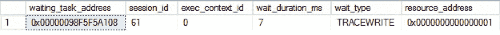

图 12-13
TRACEWRITE 等待

即使我们没有在测试 SQL Server 实例上运行任何工作负载，`TRACEWRITE` 等待类型仍会被记录。这是正常的，因为只要 SQL Server Profiler 跟踪处于活动状态，`TRACEWRITE` 等待类型就总是会被记录。

### 降低 TRACEWRITE 等待

正如我之前提到的，如果你注意到发生了 `TRACEWRITE` 等待，这意味着有人正在对你的 SQL Server 实例运行 SQL Server Profiler 跟踪。因为 SQL Server Profiler 跟踪可能对 SQL Server 实例的性能产生很大影响，所以了解是谁在运行 SQL Server Profiler 跟踪以及为什么运行非常重要。

值得庆幸的是，有一个目录视图我们可以查询以查看跟踪活动——即 `sys.traces` 视图。`sys.traces` 目录视图会为你提供针对 SQL Server 实例处于活动状态或暂停状态的跟踪概览。以下查询将检索 `sys.traces` 目录视图中的所有信息：

```sql
SELECT *
FROM sys.traces;
```

在测试 SQL Server 实例上运行此查询，返回的信息如图 12-14 所示。（某些列未完全显示在图片中）。

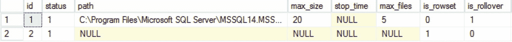

图 12-14
sys.traces

我想从 `sys.traces` 目录视图中重点强调的一些重要列是 `status` 和 `reader_spid` 列。`status` 列返回 0 或 1，其中 0 表示跟踪已停止或暂停，1 表示跟踪当前正在运行。`reader_spid` 列返回启动跟踪的会话的会话 ID。我们可以使用此信息来检测是谁在运行跟踪。

在我们的例子中，示例中启动的跟踪 ID 为 2，而 ID 为 1 的是为后台 SQL Server 跟踪保留的，默认情况下它始终处于活动状态。此默认跟踪收集有关 SQL Server 实例运行状况的特定信息，可在故障排除时使用。因为它是一个所谓的服务器端跟踪，所以在其运行时不会记录 `TRACEWRITE` 等待时间。

现在你能够识别运行跟踪的用户，如果你认为该跟踪对 SQL Server 实例的性能有负面影响，就可以采取措施。

为了降低 `TRACEWRITE` 等待时间而停止 SQL Server Profiler 跟踪后，如果你确实需要捕获 SQL Server 实例的跟踪，还有其他可用的方法。最合乎逻辑的方法是在扩展事件 (Extended Events) 会话中重建你的 SQL Server Profiler 跟踪。扩展事件的开销比 SQL Server Profiler 跟踪小得多，并且在捕获跟踪时允许使用更多的事件和选项。

如果你仍然希望使用 SQL Server Profiler 来分析跟踪，一个好方法是将通常在 SQL Server Profiler 应用程序中运行的跟踪转换为服务器端跟踪。与扩展事件一样，与通过 SQL Server Profiler 应用程序执行的跟踪相比，服务器端跟踪的开销极小。让我们将在示例部分创建的 SQL Server Profiler 跟踪转换为服务器端跟踪，并监控其对 `TRACEWRITE` 等待类型的影响。

转换 SQL Server Profiler 跟踪最简单的方法是在 SQL Server Profiler 应用程序中定义跟踪但不启动它。转而选择 文件 ➤ 导出 ➤ 脚本跟踪定义 ➤ 适用于 SQL Server 2005 – SQL2017 选项，如图 12-15 所示。

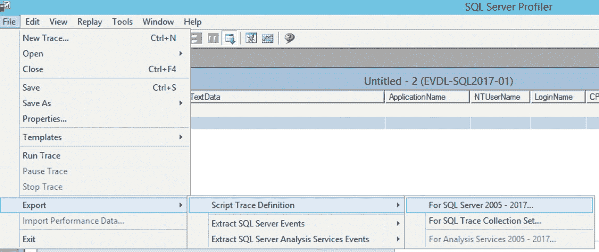

图 12-15
将 SQL Server Profiler 跟踪导出为跟踪定义


