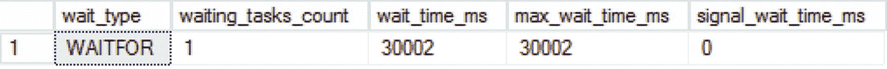

# 13. 与内存 OLTP 相关的等待类型

## WAITFOR

本章最后介绍的这种等待类型，是少数几种与特定 T-SQL 命令直接相关的等待类型之一。`WAITFOR` 等待类型并不表示性能问题，但它肯定会影响执行相关 `WAITFOR` T-SQL 命令的查询的持续时间。

## 什么是 WAITFOR 等待类型？

每当执行使用了 `WAITFOR` 命令的查询时，`WAITFOR` 等待类型就会被记录。`WAITFOR` T-SQL 命令会停止查询的执行，直到经过特定的时间或到达特定的时间点。届时，查询执行将继续。`WAITFOR` 命令经常在查询或脚本中使用，以强制查询执行暂停。例如，在第 4 章“建立可靠的基线”中，我们使用了 `WAITFOR` 命令来等待特定时长，以便我们可以比较相隔 15 分钟进行的两次测量。

在使用 `WAITFOR` 命令暂停查询执行时，持有该 `WAITFOR` 命令的事务将保持打开状态，直到整个事务完成。这意味着事务占用了线程，这些线程无法用于其他进程。SQL Server 还为 `WAITFOR` 命令保留了专用线程；如果太多线程与 `WAITFOR` 命令关联并发生线程不足，SQL Server 将随机选择 `WAITFOR` 线程并终止它们以释放更多线程。

在许多情况下，`WAITFOR` 命令是由编写查询或脚本的人显式使用的，从这个意义上说，它只影响特定的查询或脚本；因此，当看到高 `WAITFOR` 等待时间时，无需惊慌。它只是表明查询正在使用 `WAITFOR` 命令。

### WAITFOR 示例

为了向你展示 WAITFOR 等待类型的快速示例，你可以执行清单 12-4 中的查询。该查询将重置 `sys.dm_os_wait_stats` DMV，执行一个导致脚本执行等待 30 秒的 `WAITFOR DELAY` 语句，然后查询 `sys.dm_os_wait_stats` DMV 以获取 `WAITFOR` 等待。

```
DBCC SQLPERF('sys.dm_os_wait_stats', CLEAR);
WAITFOR DELAY '00:00:30';
SELECT *
FROM sys.dm_os_wait_stats
WHERE wait_type = 'WAITFOR';
```
**清单 12-4**
WAITFOR 等待

当清单 12-4 中的查询完成时，你应该会看到发生了一次 WAITFOR 等待，总等待时间约为 30 秒，如图 12-18 所示。


**图 12-18**
WAITFOR 等待

### WAITFOR 总结

`WAITFOR` 等待类型是少数几种与 T-SQL 命令执行直接相关的等待类型之一，这里指的是 `WAITFOR`。`WAITFOR` 等待类型并不表示你的 SQL Server 实例存在任何性能问题，它只是表明查询或脚本正在使用 `WAITFOR` 命令。`WAITFOR` T-SQL 命令只会影响使用它的查询或脚本的执行时间；因此，降低 `WAITFOR` 等待时间的唯一方法是移除查询中的 `WAITFOR` 命令。

