# 13. 与内存 OLTP 相关的等待类型

随着 SQL Server 2014 的发布，微软引入了一项全新的 SQL Server 功能，称为内存 OLTP（或代号 Hekaton）。内存 OLTP 是一个内存优化的数据库引擎，直接集成到 SQL Server 2014 引擎中。内存 OLTP 是一项仅适用于企业版的功能，旨在通过将表完全放入 SQL Server 实例的内存中来提高性能——根据微软的说法，性能可提升高达 20 倍。这些内存优化表是完全持久的，并使用无锁和无闩锁的结构来优化并发控制。

随着内存 OLTP 的引入，SQL Server 2014 中添加了各种新的等待类型。其中大多数可以通过等待类型名称中的 `_XTP_`（或 eXtreme Transaction Processing）部分来识别。在本章中，我们将了解 SQL Server 2014 或更高版本中可用的一些新的、与内存 OLTP 相关的等待类型。

在深入研究这些等待类型之前，让我们先（简单且简要地）了解一下内存 OLTP 是什么以及它是如何工作的。本章我将重点关注内存优化表。内存 OLTP 还引入了其他功能，如本机编译存储过程和哈希索引，但这些超出了本章的范围。

单击“文件”->“导出”->“脚本跟踪定义”->“适用于 SQL Server 2005 – SQL2017”选项后，系统将要求我们保存一个 `.sql` 文件。整个跟踪定义将被脚本化到这个 `.sql` 文件中。我们可以在 SQL Server Management Studio 中打开此文件，修改脚本中的文件位置和其他一些选项，然后执行它。这将返回我们刚创建的跟踪的 ID，并将跟踪信息保存到我们在脚本顶部指定的文件中。图 12-16 显示了在我们的测试 SQL Server 实例上导出的跟踪定义的一部分。

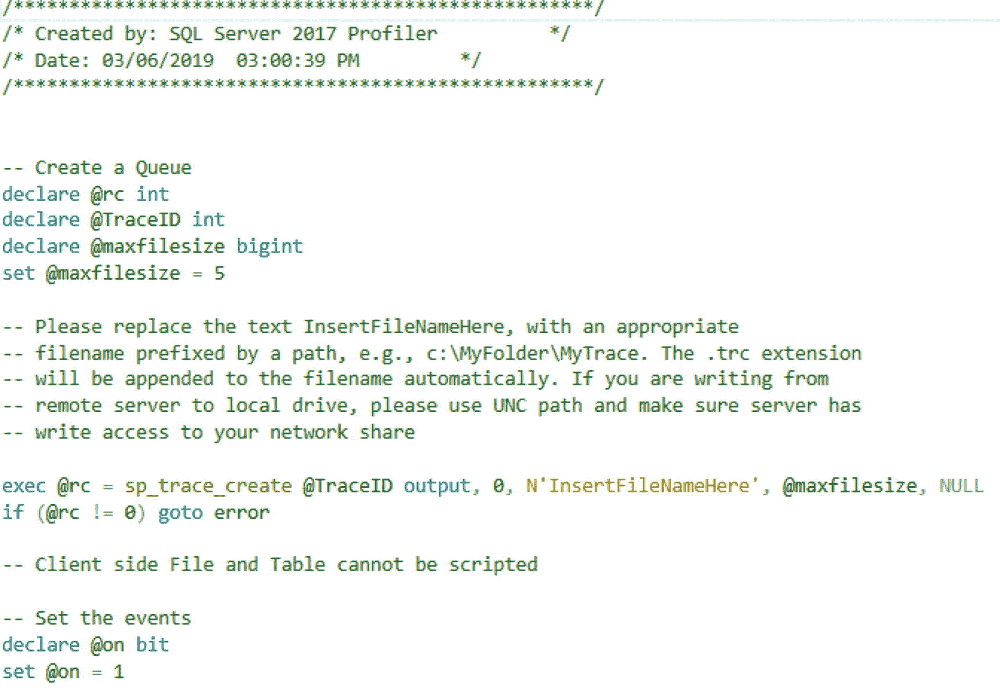
**图 12-16**
跟踪定义

执行脚本以创建服务器端跟踪后，我们收到了一个跟踪 ID 为 2。跟踪 ID 非常重要，因为它是启动或停止服务器端跟踪的唯一方法。创建后，服务器端跟踪会自动启动。如果我们查询 `sys.traces` 目录视图，我们可以看到刚刚创建的服务器端跟踪，如图 12-17 所示。

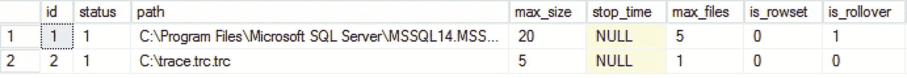
**图 12-17**
sys.traces

与我们创建的服务器端跟踪交互的唯一方法是执行 `sp_trace_setstatus` 存储过程并提供跟踪 ID 和状态 ID。例如，执行以下查询将停止跟踪 ID 为 2 的服务器端跟踪：

```
EXEC sp_trace_setstatus 2, 0
```

要重新启动它，我们可以执行此命令：

```
EXEC sp_trace_setstatus 2, 1
```

最后，要完全关闭跟踪，我们可以执行以下命令：

```
EXEC sp_trace_setstatus 2, 3
```

然而，这并不会删除服务器端跟踪。事实上，服务器端跟踪只能通过重启 SQL Server 服务来移除。

因为服务器端跟踪只能捕获到跟踪文件，所以你可以导航到在服务器端跟踪定义中提供的文件，并在 SQL Server Profiler 中打开该文件。这样，你可以捕获与使用 SQL Server Profiler 应用程序相同的信息，但性能开销要低得多。

### TRACEWRITE 总结

`TRACEWRITE` 等待类型表明当前正在针对 SQL Server 实例执行 SQL Server Profiler 跟踪。SQL Server Profiler 跟踪可能对 SQL Server 实例的性能产生相当大的影响，因此监控针对 SQL Server 实例运行的跟踪数量非常重要。值得庆幸的是，有一些 SQL Server Profiler 跟踪的替代方案。你可以选择将 SQL Server Profiler 跟踪转换为扩展事件会话，或者使用服务器端跟踪执行 SQL Server Profiler 跟踪。


## 内存 OLTP 简介

传统的基于磁盘的表与内存优化表之间的主要区别在于，内存优化表完全驻留在 SQL Server 实例的内存中。与传统表（其数据页会在磁盘和内存之间来回移动）不同，内存优化表在 SQL Server 启动时被移入系统内存，并且永远不会离开内存（当然，除非内存优化表被删除）。虽然这乍听起来可能有点吓人，但默认情况下，内存优化表是完全持久的。这意味着如果你的 SQL Server 实例崩溃，内存优化表的数据不会丢失。

当然，让整个表驻留在 SQL Server 实例的内存中也有其缺点。你需要确保有足够的空闲内存来容纳整个内存优化表（以及一些额外的内存来容纳访问此类表时使用的行版本）。计算内存需求可能很困难，但下面这篇文章可以帮你：[`https://msdn.microsoft.com/en-us/library/dn282389.aspx`](https://msdn.microsoft.com/en-us/library/dn282389.aspx)。

你为内存优化表保留的内存会被 SQL Server 占用，并且不会被清除；如果你的内存优化表使用了太多内存，你的 SQL Server 实例将面临内存不足的问题，导致性能下降，或者在最坏的情况下导致 SQL Server 崩溃。这是一个主要区别，例如，与缓冲区缓存不同，在缓冲区缓存中，当内存压力发生时，页面会从内存中清除。

另一个缺点是，许多数据类型或 SQL Server 功能不支持用于内存优化表。可以使用和不可以使用的完整列表可以在 [`https://msdn.microsoft.com/en-us/library/dn246937(v=sql.120).aspx`](https://msdn.microsoft.com/en-us/library/dn246937(v=sql.120).aspx) 和 [`https://msdn.microsoft.com/en-us/library/dn133181(v=sql.120).aspx`](https://msdn.microsoft.com/en-us/library/dn133181(v=sql.120).aspx) 找到。随着 SQL Server 2016 的发布，一些主要的限制得到了解决，使该功能更具吸引力，限制更少。

那么，内存优化表是如何工作的，为什么它们的性能比传统的基于磁盘的表快那么多？让我们来看看内存 OLTP 的一些内部机制。

### CFPs（检查点文件对）

正如我之前提到的，默认情况下内存优化表是持久的（你可以选择创建一个非持久表，其内容在 SQL Server 服务重启时被清除，但你必须明确指定这一点）。实现这种持久性的方式是通过所谓的检查点文件对（`CFPs`）。`CFPs`由两个文件组成，一个数据文件和一个增量文件，它们存在于一个特殊的内存优化文件组中，你必须为你希望使用内存优化表的数据库创建这个文件组。

与传统表将行数据存储在数据页内不同，数据文件存储`所有`内存优化表的行。我强调“所有”这个词，是因为单个数据文件可以容纳许多内存优化表的行，这与为单个表存储行数据的数据页不同。数据文件内的行是根据它们插入到内存优化表的时间顺序存储的。这与数据页不同，数据页在传统表的区中保存行信息。因为行在数据文件中是顺序存储的，所以读取行时性能有所提升，因为它消除了从传统表读取行时发生的随机读取。图 13-1 显示了数据文件及其所包含行数据的抽象视图。

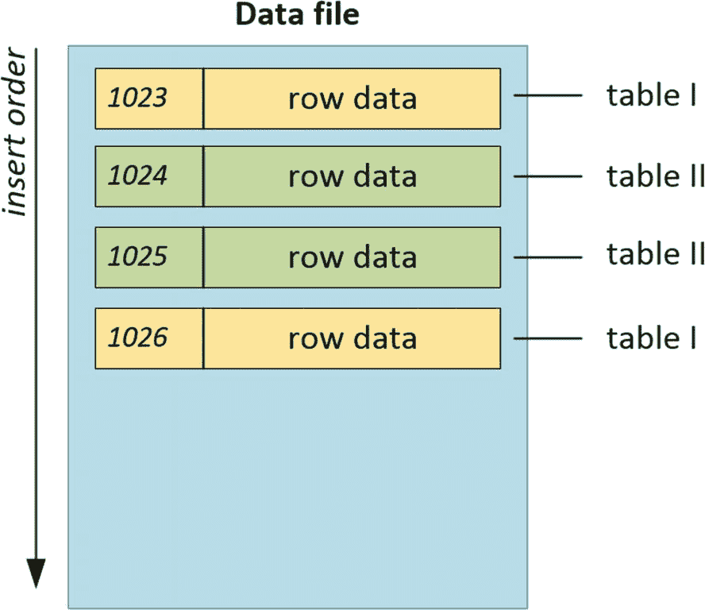

图 13-1 内存优化表的数据文件

内存优化文件组中总是有多个数据文件。当你第一次创建内存优化文件组时，SQL Server 会自动在文件组的文件位置预分配一定数量的数据文件。数据文件的大小总是固定的，在内存超过 16 GB 的系统上为 128 MB，在内存小于或等于 16 GB 时为 16 MB。当一个数据文件满了时，会自动创建一个新的数据文件，新的行将被插入到这个新数据文件中。

重要的是要知道，数据文件根据将行插入到数据文件中的事务提交时间戳（如图 13-1 中的数字所示）来跟踪行。即使添加了新的数据文件并且行分布在多个数据文件上，数据文件也总是具有连续的事务范围。图 13-2 显示了多个数据文件以及与这些数据文件相关联的事务提交时间戳。

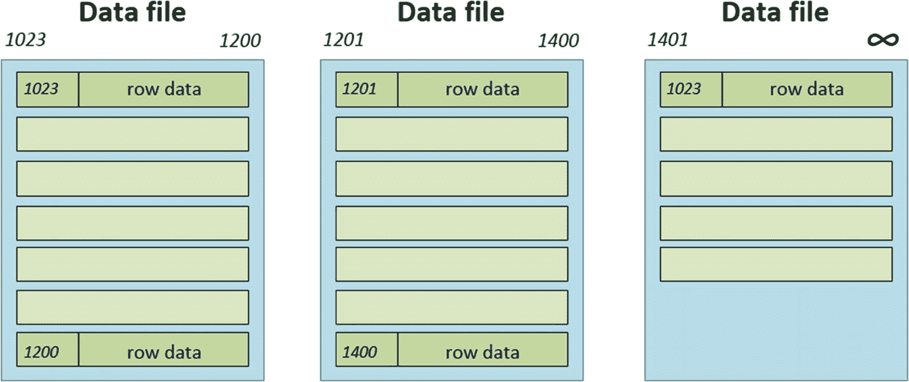

图 13-2 数据文件和事务时间戳

注意在图 13-2 中，最后一个数据文件仍有空间容纳新行——它没有表示文件已满的事务时间戳，因此新行将被添加到该文件中。

数据文件的另一个重要特征是，被删除的行不会直接从文件中移除。相反，它们由与数据文件关联的增量文件跟踪。增量文件记录数据文件中进行的任何删除操作，并通过事务时间戳范围与数据文件连接。内存优化表的行更新被跟踪为删除和插入操作。

数据和增量文件的填充是由一个后台线程执行的——称为离席检查点线程——它持续在 SQL Server 后台运行。这与用于传统表的检查点过程不同，后者是将页面按间隔写入数据库数据文件。离席检查点线程监视事务日志中对内存优化表执行的操作，并直接写入数据和增量文件。

随着时间的推移，当数据文件累积了更多已删除的行时，将发生合并操作，将多个数据文件合并为一个数据文件。合并操作将创建新的数据和增量文件，并将一个或多个数据和增量文件的内容移动到新文件中，但它不会移动标记为已删除的行。新的数据和增量文件中的事务提交时间戳将被调整，以匹配被合并文件的时间戳。图 13-3 显示了数据文件级别合并操作的简化视图。请记住，合并也会影响增量文件。

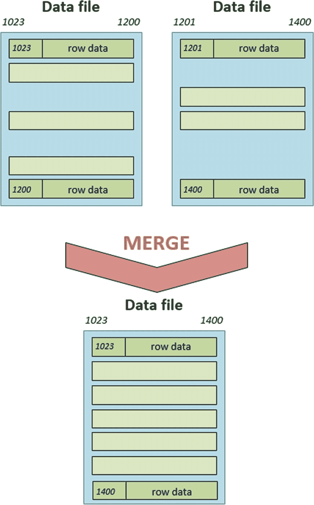

图 13-3 合并操作


### 隔离

对内存优化表的并发访问通过基于快照的事务隔离处理。该隔离级别与我们可以在基于磁盘的表上使用的快照隔离共享许多特征，但也存在一些差异以优化吞吐量。首先，基于快照的事务隔离在并发事务希望访问同一行时使用行版本。与常规快照隔离将行版本存储在 TempDB 数据库中不同，内存优化表的行版本是**内联**存储在数据文件本身的。

另一个区别是基于快照的事务隔离采用乐观并发控制。这意味着 SQL Server 假设并发事务访问相同数据时不会发生事务冲突。由于此假设，无需锁或闩锁来保护内存优化表数据。然而，存在一种冲突检测机制是活跃的，当它检测到冲突发生时，将终止其中一个事务，该事务需要重试。

无需放置和维护锁与闩锁，这是 In-Memory OLTP 性能的另一个主要贡献。

### 事务日志更改

本节要讨论的最后差异是针对内存优化表的事务日志行为的修改。对于传统表，无论事务是否提交，都会在事务启动时生成日志记录。对于内存优化表，日志记录仅在事务开始提交处理时才生成。这意味着不会记录已回滚事务的任何信息。这最大限度地减少了与磁盘上事务日志的交互，从而提高了性能。

另一项修改是，对内存优化表上索引的更改不会记录在事务日志中。由于在内存优化表上创建的索引也完全在内存中维护，因此无需记录更改。内存优化表上的索引在 SQL Server 服务启动时重新生成。

我想提到的最后一个差异是将多个事务分组到一个日志记录中。对于传统表，每个事务将至少生成一个日志记录。针对内存优化表的事务被分组在一起，然后作为一个日志记录写入（当前最大大小为 24 KB）。例如，如果你对传统表有 200 次插入操作，将至少生成 200 个日志记录。如果我们可以将 100 次插入操作容纳到一个内存优化表的日志记录中，我们只需要两个日志记录，而不是至少 200 个。同样，这提高了内存优化表的吞吐量。

现在，我们已经（简化且简短地）了解了内存优化表的一些内部工作原理，接下来让我们看一些与 In-Memory OLTP 相关的等待类型。本章将讨论的三种等待类型中的大多数，都或多或少地与 In-Memory OLTP 引入的新脱机检查点进程有关。

## WAIT_XTP_HOST_WAIT

本章我们将讨论的第一个等待类型是 `WAIT_XTP_HOST_WAIT`。这种等待类型与我们已在第 12 章“后台和杂项等待类型”中讨论过的 `CHECKPOINT_QUEUE` 等待类型共享一些特征，即它似乎持续运行，但仅在特定条件下才将其等待信息写入 `sys.dm_os_wait_stats`。

### WAIT_XTP_HOST_WAIT 等待类型是什么？

如果我们在在线丛书（Books Online）上查找关于 `WAIT_XTP_HOST_WAIT` 等待类型的一些信息，我们会得到一个不那么有用的定义：“当等待由数据库引擎触发并由主机实现时发生。”这并没有给我们太多关于可能与 `WAIT_XTP_HOST_WAIT` 等待类型相关的进程的线索，这意味着我们需要自己做一些深入调查。

在我们开始研究 `WAIT_XTP_HOST_WAIT` 等待类型之前，我们需要创建一个内存优化表。我使用了清单 13-1 所示的脚本，创建了一个包含单个内存优化表的新数据库。此脚本中有一些路径引用，您需要更改这些引用以确保数据库数据和日志文件在正确的位置创建。

```sql
-- 创建数据库
-- 如果需要，请确保更改文件位置
USE [master]
GO
CREATE DATABASE [OLTP_Test] CONTAINMENT = NONE
ON PRIMARY
(
NAME = N'OLTP_Test', FILENAME = N'E:\Data\OLTP_Test_Data.mdf' , SIZE = 51200KB , FILEGROWTH = 10%
)
LOG ON
(
NAME = N'OLTP_Test_log', FILENAME = N'E:\Log\OLTP_Test_Log.ldf' , SIZE = 10240KB , FILEGROWTH = 10%
);
GO
-- 添加内存优化文件组
ALTER DATABASE OLTP_Test ADD FILEGROUP OLTP_MO CONTAINS MEMORY_OPTIMIZED_DATA;
GO
-- 向新创建的文件组添加一个文件。
-- 如果需要，请更改驱动器/文件夹位置。
ALTER DATABASE OLTP_Test ADD FILE (name='OLTP_mo_01', filename='E:\data\OLTP_Test_mo_01.ndf') TO FILEGROUP OLTP_MO;
GO
-- 创建我们的测试表
USE [OLTP_Test]
GO
CREATE TABLE OLTP
(
ID INT IDENTITY (1,1) PRIMARY KEY NONCLUSTERED,
RandomData1 VARCHAR(50),
RandomData2 VARCHAR(50),
ID2 UNIQUEIDENTIFIER
)
WITH (MEMORY_OPTIMIZED=ON);
GO
清单 13-1
创建测试数据库和内存优化表
```

现在我们有了一个可用于测试的内存优化表，让我们使用以下查询查看 `sys.dm_os_wait_stats` 和 `sys.dm_os_waiting_tasks` DMV 中的 `WAIT_XTP_HOST_WAIT` 等待类型：

```sql
SELECT *
FROM sys.dm_os_waiting_tasks
WHERE wait_type = 'WAIT_XTP_HOST_WAIT';
SELECT *
FROM sys.dm_os_wait_stats
WHERE wait_type = 'WAIT_XTP_HOST_WAIT';
```

在我的测试 SQL Server 实例上执行此查询的结果可以在图 13-4 中看到。

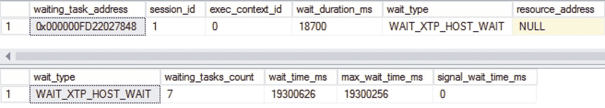

图 13-4

WAIT_XTP_HOST_WAIT 等待

您会注意到的第一件事是，`WAIT_XTP_HOST_WAIT` 等待类型持续出现在 `sys.dm_os_waiting_tasks` DMV 中，并且随着时间的推移等待时间增加。此外，与 `WAIT_XTP_HOST_WAIT` 等待类型相关的 `session_id` 表明它是记录等待的内部 SQL Server 线程。根据这些信息，我们已经可以对 `WAIT_XTP_HOST_WAIT` 等待类型得出一些结论：它与一个持续运行的内部后台进程相关。同样有趣的是，如果您第二次运行该查询，`sys.dm_os_waiting_tasks` DMV 中的等待时间会增加，但 `sys.dm_os_wait_stats` 中的等待时间保持不变。到目前为止，我们遇到过另一种共享此特征的等待类型，即 `CHECKPOINT_QUEUE` 等待类型，我们在第 12 章“后台和杂项等待类型”中讨论过。

由于 `CHECKPOINT_QUEUE` 等待类型具有有趣的行为，即仅在发生自动检查点时才将 `sys.dm_os_waiting_tasks` DMV 中累积的等待时间写入 `sys.dm_os_wait_stats` DMV，我决定使用清单 13-1 创建的 `OLTP_Test` 数据库简单地运行一个检查点命令，然后再次查询这两个 DMV。对 `WAIT_XTP_HOST_WAIT` 等待类型等待时间的影响可以在图 13-5 中看到。

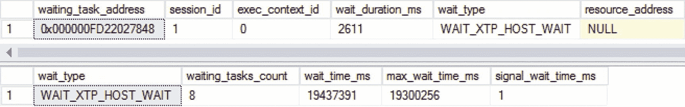
**图 13-5** 检查点后的 `WAIT_XTP_HOST_WAIT` 等待信息

如图 **13-5** 所示，`sys.dm_os_waiting_tasks` DMV 中的等待时间再次变得非常小，但 `sys.dm_os_wait_stats` DMV 中的等待时间却大幅增加。基于这种行为，我认为 `WAIT_XTP_HOST_WAIT` 等待类型与内存优化表相关的离线检查点进程有关。

为了验证我的猜测，我需要更深入地研究在对内存优化表执行检查点时，SQL Server 内部发生了什么。为此，我创建了一个扩展事件会话，用于捕获每当 SQL Server 遇到 `WAIT_XTP_HOST_WAIT` 等待时的调用堆栈。我不会在此详述创建此扩展事件会话的具体方法，但 Paul Randal 写了一篇精彩的博客文章，介绍了如何在特定等待发生时捕获调用堆栈，你可以参考它来收集一些调用堆栈。你可以在这里找到 Paul 的博客文章：[`www.sqlskills.com/blogs/paul/determine-causes-particular-wait-type/`](http://www.sqlskills.com/blogs/paul/determine-causes-particular-wait-type/)。

我捕获 `WAIT_XTP_HOST_WAIT` 等待发生时调用堆栈的扩展事件会话结果如下：
```
sqldk.dll!XeSosPkg::wait_info::Publish+0x138
sqldk.dll!SOS_Scheduler::UpdateWaitTimeStats+0x2bc
sqldk.dll!SOS_Task::PostWait+0x9e
sqlmin.dll!EventInternal::Wait+0x1fb
sqlmin.dll!HkHostWait::Wait+0xce
hkengine.dll!CkptFilePair::CreateInstance+0x61b
sqlmin.dll!HkHostReportFailure::KillProcess+0x372
sqldk.dll!SOS_Task::Param::Execute+0x21e
sqldk.dll!SOS_Scheduler::RunTask+0xa8
sqldk.dll!SOS_Scheduler::ProcessTasks+0x279
sqldk.dll!SchedulerManager::WorkerEntryPoint+0x24c
sqldk.dll!SystemThread::RunWorker+0x8f
sqldk.dll!SystemThreadDispatcher::ProcessWorker+0x3ab
sqldk.dll!SchedulerManager::ThreadEntryPoint+0x226
kernel32.dll!BaseThreadInitThunk+0xd
ntdll.dll!RtlUserThreadStart+0x21
```

我发现的第一部分非常有趣，它包含了一个新的 .dll 文件 `hkengine.dll`。由于内存 OLTP 的代号是 Hekaton，我猜测这个 .dll 文件包含了新的内存 OLTP 函数，因此让我们仔细看看那个特定的调用：
```
hkengine.dll!CkptFilePair::CreateInstance+0x61b
```
看到函数名，我猜它与检查点文件对相关，而 `CreateInstance` 部分表明在我执行 `CHECKPOINT` 命令时创建了一个新的 CFP。我们可以通过访问清单 **13-1** 中创建的内存文件的位置来验证这一点。向内存文件组添加文件的一个有趣之处在于，它实际上会创建一个目录，在此目录中有一个具有唯一 ID 字符串的文件夹。如果你进一步深入目录树，最终会到达一个包含编号文件的文件夹。图 **13-6** 展示了我的测试机器上该文件夹内容的一部分。
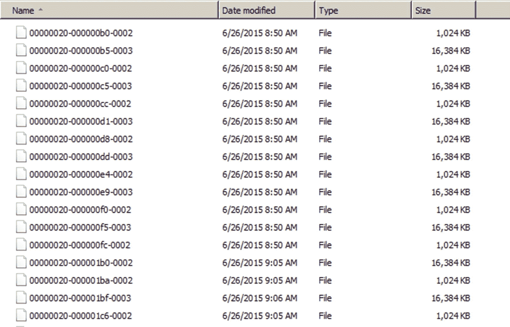
**图 13-6.** 内存文件组文件

事实上，你在这里看到的文件是与我们之前创建的内存优化表相关联的数据文件和增量文件。1 MB 的文件是增量文件，16 MB 的文件是数据文件。

由于我猜测检查点会创建另一个 CFP，我在执行 `CHECKPOINT` 之前检查了文件夹中的文件数量，为 28 个文件。然后我执行了 `CHECKPOINT` 命令，并再次查看了文件数量，结果发现检查点之后现在有 30 个文件。

### WAIT_XTP_HOST_WAIT 总结

我认为 `WAIT_XTP_HOST_WAIT` 等待类型与新检查点文件对的创建有明确的关系。显然，手动运行 `CHECKPOINT` 语句会为内存优化表生成一个新的 CFP。因为 `WAIT_XTP_HOST_WAIT` 等待类型会在后台持续生成等待时间，并将其写入 `sys.dm_os_wait_stats` DMV（当新的 CFP 被创建时——无论是通过手动检查点、当现有 CFP 已满、还是当 `Merge` 操作发生时），我相信 `WAIT_XTP_HOST_WAIT` 等待类型并不直接表示性能问题。它主要表示已向内存文件组添加了一个新的 CFP。然而，这并不意味着这是唯一产生 `WAIT_XTP_HOST_WAIT` 等待的过程。也可能存在其他同样会导致此等待的过程，但到目前为止，它们只发生在需要添加新 CFP 的时候。

## WAIT_XTP_CKPT_CLOSE

`WAIT_XTP_CKPT_CLOSE` 等待类型是 SQL Server 2014 中引入的另一个新等待类型。顾名思义，它似乎与内存 OLTP 功能引入的新离线检查点进程有关。


### 什么是 `WAIT_XTP_CKPT_CLOSE` 等待类型？

`WAIT_XTP_CKPT_CLOSE` 等待类型似乎与 SQL Server 2014 引入内存中 OLTP 时一同推出的新离线检查点进程相关。根据我对该等待类型行为的分析，它似乎只在检查点发生时记录等待时间，无论是自动检查点还是手动检查点。`WAIT_XTP_CKPT_CLOSE` 等待类型所代表的等待时间，似乎是检查点操作完成所需的时间。

我们可以通过对我们之前在讨论 `WAIT_XTP_HOST_WAIT` 等待类型时创建的数据库和表执行一条 `CHECKPOINT` 命令来轻松验证这一点。我使用了清单 13-2 中的脚本来清除 `sys.dm_os_wait_stats` DMV，向内存优化表中插入几行数据，执行一个 `CHECKPOINT` 操作，然后查询 `sys.dm_os_wait_stats` DMV 以获取 `WAIT_XTP_CKPT_CLOSE` 等待类型信息。

```sql
USE [OLTP_Test];
GO
-- Clear sys.dm_os_wait_stats
DBCC SQLPERF('sys.dm_os_wait_stats', CLEAR);
-- Insert some rows
INSERT INTO OLTP
(
RandomData1,
RandomData2,
ID2
)
VALUES
(
CONVERT(VARCHAR(50), NEWID()),
CONVERT(VARCHAR(50), NEWID()),
NEWID()
);
GO 1000
-- Perform a CHECKPOINT
CHECKPOINT
-- Query sys.dm_os_wait_stats for WAIT_XTP_CKPT_CLOSE waits
SELECT *
FROM sys.dm_os_wait_stats
WHERE wait_type = 'WAIT_XTP_CKPT_CLOSE';
```

清单 13-2 生成 `WAIT_XTP_CKPT_CLOSE` 等待

结果可以在图 13-7 中看到。

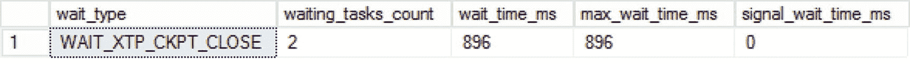

图 13-7 `WAIT_XTP_CKPT_CLOSE` 等待

就像我处理 `WAIT_XTP_HOST_WAIT` 等待类型一样，当发生 `WAIT_XTP_CKPT_CLOSE` 等待时，我也捕获了调用堆栈：

```
sqldk.dll!XeSosPkg::wait_info::Publish+0x138
sqldk.dll!SOS_Scheduler::UpdateWaitTimeStats+0x2bc
sqldk.dll!SOS_Task::PostWait+0x9e
sqlmin.dll!EventInternal::Wait+0x1fb
sqlmin.dll!HkCheckpointCtxtImpl::WaitForCkptComplete+0xd0
sqlmin.dll!HkHostWaitForCkptComplete+0x13a
sqlmin.dll!CheckpointWithOptionalTruncate+0xe6
sqllang.dll!CStmtCheckpoint::XretExecute+0xe7
sqllang.dll!CMsqlExecContext::ExecuteStmts+0x427
sqllang.dll!CMsqlExecContext::FExecute+0xa33
sqllang.dll!CSQLSource::Execute+0x86c
sqllang.dll!process_request+0xa57
sqllang.dll!process_commands+0x4a3
sqldk.dll!SOS_Task::Param::Execute+0x21e
sqldk.dll!SOS_Scheduler::RunTask+0xa8
sqldk.dll!SOS_Scheduler::ProcessTasks+0x279
sqldk.dll!SchedulerManager::WorkerEntryPoint+0x24c
sqldk.dll!SystemThread::RunWorker+0x8f
sqldk.dll!SystemThreadDispatcher::ProcessWorker+0x3ab
sqldk.dll!SchedulerManager::ThreadEntryPoint+0x226
kernel32.dll!BaseThreadInitThunk+0xd
ntdll.dll!RtlUserThreadStart+0x21
```

我认为最有趣的一行是 `sqlmin.dll!CheckpointWithOptionalTruncate+0xe6`，它似乎是执行截断操作的函数。紧随其后的是 `sqlmin.dll!HkCheckpointCtxtImpl::WaitForCkptComplete+0xd0` 这一行，我认为它记录了先前检查点函数所花费的时间，该时间随后被发布到等待统计 DMV 中。

我不认为看到 `WAIT_XTP_CKPT_CLOSE` 等待发生是需要直接担忧的原因。它们表明检查点正在被执行。我可以想象，`WAIT_XTP_CKPT_CLOSE` 等待类型的突发高等待时间可能表明存在性能问题。正如我们在上一节中看到的，对内存优化表执行检查点将导致创建额外的 CFP。我猜测，如果 CFP 的分配耗时很长，那么检查点操作完成所需的时间也会更长，从而导致更高的 `WAIT_XTP_CKPT_CLOSE` 等待时间。

检查点需要处理的数据量可能也意味着更高的 `WAIT_XTP_CKPT_CLOSE` 等待时间。由于检查点将数据写入存储子系统，存储的性能也可能会影响 `WAIT_XTP_CKPT_CLOSE` 等待时间。

### `WAIT_XTP_CKPT_CLOSE` 总结

`WAIT_XTP_CKPT_CLOSE` 等待类型似乎与执行检查点操作密切相关。它表明对内存优化表执行的检查点完成所需的时间。我不认为这直接表明性能问题，因为它只是记录检查点完成所花费的时间。

检查点需要处理的工作量可能会导致更高的 `WAIT_XTP_CKPT_CLOSE` 等待时间。存储子系统的性能可能也会影响 `WAIT_XTP_CKPT_CLOSE` 等待时间。

## `WAIT_XTP_OFFLINE_CKPT_NEW_LOG`

本章要讨论的最后一个与内存中 OLTP 相关的等待类型是 `WAIT_XTP_OFFLINE_CKPT_NEW_LOG` 等待类型。这是另一个与 SQL Server 2014 中引入的离线检查点进程相关的等待类型。


### 什么是 WAIT_XTP_OFFLINE_CKPT_NEW_LOG 等待类型？

`WAIT_XTP_OFFLINE_CKPT_NEW_LOG` 等待类型看起来是一种良性的等待类型，它记录离线检查点进程等待工作的时间长度。这一点已由联机丛书证实，其定义如下：“当离线检查点正在等待要扫描的新日志记录时发生。”

正如本章前面所讨论的，离线检查点进程监视事务日志中影响内存优化表的事务，以便这些事务可以被记录在数据和增量文件中。这是 SQL Server 后台持续运行的一个进程，这意味着当你查询 `sys.dm_os_waiting_tasks` DMV 时，你会看到一个具有 `WAIT_XTP_OFFLINE_CKPT_NEW_LOG` 等待类型的内部进程，如图 13-8 所示。

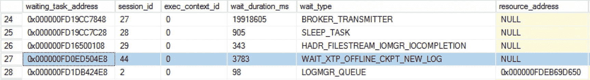

图 13-8. `sys.dm_os_waiting_tasks` 内部的 WAIT_XTP_OFFLINE_CKPT_NEW_LOG 等待

与 `WAIT_XTP_HOST_WAIT` 等待类型不同，后者仅在特定条件发生时才将其等待时间信息写入 `sys.dm_os_wait_stats` DMV，而 `WAIT_XTP_OFFLINE_CKPT_NEW_LOG` 等待类型似乎会等待大约 5 秒，将等待时间添加到 `sys.dm_os_wait_stats` DMV，然后再次重置 `sys.dm_os_waiting_tasks` DMV 中的等待时间。这可能表明离线检查点进程以大约 5 秒的间隔检查是否有新工作。

为了更深入地了解离线检查点进程，我在每次发生 `WAIT_XTP_OFFLINE_CKPT_NEW_LOG` 等待时捕获了一个堆栈转储。该堆栈转储让我们对该进程本身有了一些有趣的见解，如下所示：

```
sqldk.dll!XeSosPkg::wait_info::Publish+0x138
sqldk.dll!SOS_Scheduler::UpdateWaitTimeStats+0x2bc
sqldk.dll!SOS_Task::PostWait+0x9e
sqlmin.dll!EventInternal::Wait+0x1fb
sqlmin.dll!SequencedObject,0>::WaitUntilSequenceAdvances+0x160
sqlmin.dll!OfflineCheckpointWorker::GetNextLogBlock+0x10d
sqlmin.dll!OfflineCheckpointWorker::DoWorkInternal+0xf7
sqlmin.dll!OfflineCheckpointWorker::DoWork+0x3aa
sqlmin.dll!OfflineCheckpointWorker::WorkLoop+0x3fc
sqldk.dll!SOS_Task::Param::Execute+0x21e
sqldk.dll!SOS_Scheduler::RunTask+0xa8
sqldk.dll!SOS_Scheduler::ProcessTasks+0x279
sqldk.dll!SchedulerManager::WorkerEntryPoint+0x24c
sqldk.dll!SystemThread::RunWorker+0x8f
sqldk.dll!SystemThreadDispatcher::ProcessWorker+0x3ab
sqldk.dll!SchedulerManager::ThreadEntryPoint+0x226
kernel32.dll!BaseThreadInitThunk+0xd
ntdll.dll!RtlUserThreadStart+0x21
```

最有趣的部分是调用 `OfflineCheckpointWorker` 函数时。为了便于阅读，这里是涉及 `OfflineCheckpointWorker` 函数的部分：

```
sqlmin.dll!SequencedObject,0>::WaitUntilSequenceAdvances+0x160
sqlmin.dll!OfflineCheckpointWorker::GetNextLogBlock+0x10d
sqlmin.dll!OfflineCheckpointWorker::DoWorkInternal+0xf7
sqlmin.dll!OfflineCheckpointWorker::DoWork+0x3aa
sqlmin.dll!OfflineCheckpointWorker::WorkLoop+0x3fc
```

看到这个堆栈转储让我相信，离线检查点进程启动后，通过从事务日志读取日志记录 (`LogBlock`) 来开始寻找工作，抓取它需要处理的第一个 `LogBlock`，并循环处理直到所有 `LogBlock` 处理完毕。完成之后，我推测离线检查点会再次进入休眠状态，等待大约 5 秒，然后唤醒并检查是否有新的日志记录。

这种行为让我相信 `WAIT_XTP_OFFLINE_CKPT_NEW_LOG` 等待类型是无害的。它仅仅表明离线检查点进程正在等待工作到达。

### WAIT_XTP_OFFLINE_CKPT_NEW_LOG 总结

`WAIT_XTP_OFFLINE_CKPT_NEW_LOG` 等待类型与离线检查点进程相关，并表明该进程正在等待工作到达。由于 `WAIT_XTP_OFFLINE_CKPT_NEW_LOG` 等待类型仅表示离线检查点进程在等待工作，我认为该等待类型不表示任何性能问题，可以安全地忽略。

## SQL Server 机器配置示例

在本书的写作过程中，我使用了几个不同的测试系统来生成示例。本附录将描述我在示例和等待类型演示中使用的系统配置。如果需要修改系统以演示特定的等待类型或发生的情况，这将在包含演示的章节内的文本中说明。

我所有的测试系统都是我在 Oracle VirtualBox 内部创建的虚拟机，这是一个可免费使用的虚拟化软件产品，你可以从 [`www.virtualbox.org/`](http://www.virtualbox.org/) 下载。

我在示例中经常使用的另一个工具是 Ostress。Ostress 是提供的用于管理 SQL Server 性能的 RML 实用工具的一部分。你可以使用此链接下载 RML 实用工具：[`www.microsoft.com/en-us/download/details.aspx?id=4511`](http://www.microsoft.com/en-us/download/details.aspx%253Fid%253D4511)。

### 默认测试机

下面的表格显示了本书大部分内容中使用的虚拟机配置，第 10 章“高可用性和灾难恢复等待类型”（讨论高可用性和灾难恢复等待类型）除外。

| 配置 | 值 |
| --- | --- |
| 计算机名 | EVDL-SQL2017-01 |
| vCPU 数量 | 2–4 |
| 体系结构 | 64 位 |
| 内存 | 4 GB |
| 存储 | 50 GB 系统驱动器 C:\ (SSD) 25 GB 数据驱动器 D:\ (SSD) |
| 数据驱动器布局 | D:\Data, MDF 文件 D:\Log, LDF 文件 D:\Backup, 备份文件 |
| 操作系统 | Windows Server 2012R2 |
| SQL Server 版本 | SQL Server 2017 企业版 |
| SQL Server 功能 | 数据库引擎服务 |
| SQL Server 实例名称 | MSSQLSERVER (默认实例) |

### HA/DR 测试机

下面的表格显示了如第 10 章“高可用性和灾难恢复等待类型”所述，用于演示高可用性和灾难恢复等待类型的虚拟机配置。

| 配置 | 值 |
| --- | --- |
| 计算机名 | EVDL-DC-01 |
| 角色 | 域控制器 (PROWAITS) |
| vCPU 数量 | 1 |
| 体系结构 | 64 位 |
| 内存 | 512 MB |
| 存储 | 20 GB 系统驱动器 C:\ (SSD) |
| 操作系统 | Windows Server 2012R2 |
| 计算机名 | EVDL-SQL-AG01 |
| 角色 | 主体 (镜像) 主副本 (AlwaysOn) 故障转移群集节点 |
| vCPU 数量 | 2 |
| 体系结构 | 64 位 |
| 内存 | 2 GB |
| 存储 | 25 GB 系统驱动器 C:\ (SSD) 20 GB 数据驱动器 D:\ (SSD) |
| 数据驱动器布局 | D:\Data, MDF 文件 D:\Log, LDF 文件 D:\Backup, 备份文件 |
| 操作系统 | Windows Server 2012R2 |
| SQL Server 版本 | SQL Server 2017 企业版 |
| SQL Server 功能 | 数据库引擎服务 |
| SQL Server 实例名称 | MSSQLSERVER (默认实例) |
| 计算机名 | EVDL-SQL-AG02 |
| 角色 | 镜像 (镜像) 副本 (AlwaysOn) 故障转移群集节点 |
| vCPU 数量 | 2 |
| 体系结构 | 64 位 |
| 内存 | 2 GB |
| 存储 | 25 GB 系统驱动器 C:\ (SSD) 20 GB 数据驱动器 D:\ (SSD) |
| 数据驱动器布局 | D:\Data, MDF 文件 D:\Log, LDF 文件 D:\Backup, 备份文件 |
| 操作系统 | Windows Server 2012R2 |
| SQL Server 版本 | SQL Server 2017 企业版 |
| SQL Server 功能 | 数据库引擎服务 |
| SQL Server 实例名称 | MSSQLSERVER (默认实例) |


## 自旋锁

微软将自旋锁描述为“轻量级同步原语”。这个描述与用于门闩的描述非常相似，门闩被称为“轻量级同步对象”。这并非巧合，因为自旋锁和门闩有很多共同点，两者都用于串行化对内部数据结构的访问。当需要对对象的访问保持非常短的时间时，会同时使用门闩和自旋锁。

虽然自旋锁和门闩的用途完全相同，但它们之间有一个很大的区别。每当您无法获取门闩时，例如因为已存在另一个不兼容的门闩，您的请求将被迫等待，它会离开处理器并返回到等待器列表（请求接收“挂起”状态）。然后，它被迫在等待器列表中等待，直到可以获取门闩，接着它会通过可运行队列移动，直到最终能够回到处理器上。由于门闩被视为查询执行的资源，它们与等待统计信息密切相关。SQL Server 甚至记录了等待获取不同类型和类别门闩的时间，我们在第 9 章“与门闩相关的等待类型”中讨论过这一点。与门闩相关的开销相对较大，因为如果无法立即获得门闩，它必须再次经历调度程序的不同阶段，然后请求才能获取其门闩并在处理器上执行。

自旋锁的工作方式与门闩非常不同，因为每当自旋锁必须等待另一个已存在的自旋锁才能放置自身时，线程不必离开处理器。相反，自旋锁会“自旋”直到可以获取。图 AII-01 显示了当门闩或自旋锁需要等待才能获取时的区别。

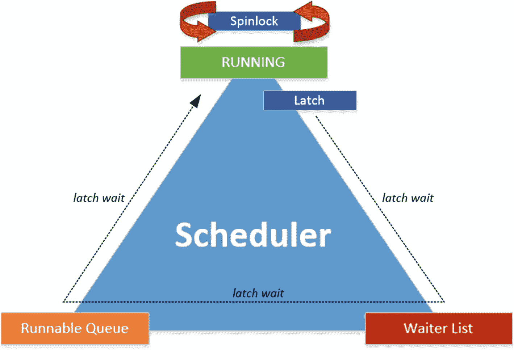

图 AII-01: 自旋锁和门闩及其等待阶段

使用自旋锁而不是门闩来同步线程访问的主要优点是，自旋锁是比门闩更“轻”的同步对象。每当门闩需要等待才能获取时，都会导致额外的上下文切换。自旋锁不会导致上下文切换，因为它们永远不会离开处理器。由于自旋锁不会导致上下文切换，它们被用于保护 SQL Server 中那些使用最密集的区域。然而，自旋锁并非保护数据结构访问的万能良药。因为它们从不离开处理器，所以即使在等待时也会消耗处理器时间。为了避免自旋锁消耗过多处理器时间，每经过*x*次自旋后，自旋锁会停止自旋并进入休眠。自旋锁休眠的间隔由内部算法计算。

在非常繁忙的系统上，如果使用了许多自旋锁，可能会遇到一种称为自旋锁争用的现象。如果自旋锁争用变得足够严重，您可能会注意到处理器时间的增加，而这可能难以进行故障排除，因为通过分析等待统计信息并不总能显示这一点。

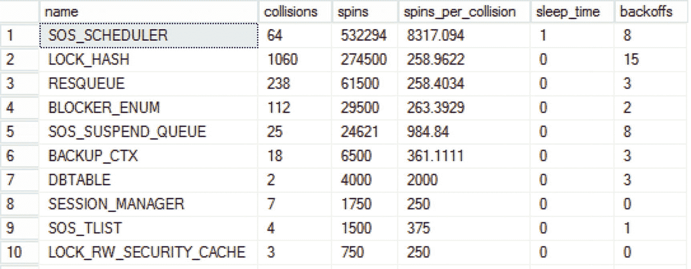

图 AII-02: sys.dm_os_spinlock_stats

值得庆幸的是，就像门闩一样，SQL Server 内部有一个自旋锁 DMV，用于跟踪特定的自旋锁类（在 SQL Server 2017 中有 325 个）、自旋锁在获取前必须等待的时间，以及该自旋锁类发生的自旋总次数。我们可以通过查询 `sys.dm_os_spinlock_stats` DMV 来访问此信息，如下查询所示：

```sql
SELECT *
FROM sys.dm_os_spinlock_stats
ORDER BY spins DESC;
```

这将返回如图 AII-02 所示的结果。

`sys.dm_os_spinlock_stats` 返回的列描述如下：

*   `name`：显示自旋锁类的名称。
*   `collisions`：返回此自旋锁类遇到等待事件的次数，原因是另一个自旋锁已存在。
*   `spins`：当自旋锁必须等待时，它会执行一次自旋。`spins` 列显示此特定自旋锁类发生自旋的次数。您可以将一次自旋视为自旋锁在获取前必须等待的时间量。
*   `spins_per_collision`：每次冲突的平均自旋次数。
*   `sleep_time`：此自旋锁类花费在休眠上的时间。
*   `backoffs`：自旋锁进入休眠以允许其他线程使用处理器的次数。

虽然 `sys.dm_os_spinlock_stats` DMV 返回的所有列都提供了宝贵的信息，但当您怀疑存在自旋锁争用情况时，`backoffs` 列可能是最有趣的。如果您注意到 CPU 使用率非常高，并且无法将高 CPU 使用率直接与查询或特定等待类型相关联，但某个特定自旋锁类的 `backoffs` 数量非常高且快速增长，那么您可能遇到了自旋锁争用情况。

自旋锁争用难以进行故障排除，因为它可能有非常多的原因。此外，关于特定自旋锁类的信息通常缺乏，这增加了故障排除自旋锁争用的难度。在分析自旋锁争用时，您可以使用的一种方法是构建 `sys.dm_os_spinlock_stats` DMV 的基线，方法是以特定间隔捕获该 DMV 的内容，如我在第 4 章“构建可靠的基线”中所述。此基线可以为您提供有关 SQL Server 实例内部自旋锁使用情况的宝贵见解。诊断自旋锁争用的另一个优秀工具是扩展事件。通过使用扩展事件，您可以跟踪各种与自旋锁相关的事件，例如自旋锁回退。

要真正分析自旋锁类争用发生的原因，您必须更深入地研究，通过调试 SQL Server 内存转储并查看调用堆栈以找到正在访问哪个自旋锁类。调试 SQL Server 内存转储以识别自旋锁争用超出了本书的范围，并且需要深入了解 SQL Server 的内部工作原理。值得庆幸的是，有一份关于自旋锁争用的免费 Microsoft 白皮书，可以为您提供一些处理自旋锁争用时的指导。您可以在 [`www.microsoft.com/en-us/download/details.aspx?id=26666`](http://www.microsoft.com/en-us/download/details.aspx%253Fid%253D26666) 获取该白皮书。


## 锁存器类

| 锁存器类 | 在线书籍说明 | 补充信息 |
| --- | --- | --- |
| `ALLOC_CREATE_RINGBUF` | 由 SQL Server 内部使用，用于初始化分配环形缓冲区创建的同步。 | 用于创建环形缓冲区时。环形缓冲区在内存中短暂保存内部事件信息，用于诊断。 |
| `ALLOC_CREATE_FREESPACE_CACHE` | 用于初始化堆的内部空闲空间缓存的同步。 | 为堆（没有聚集索引的表）分配空闲空间。 |
| `ALLOC_CACHE_MANAGER` | 用于同步内部一致性测试。 | |
| `ALLOC_FREESPACE_CACHE` | 用于同步访问包含堆和二进制大型对象（BLOB）可用空间的页面缓存。当多个连接同时尝试向堆或 BLOB 插入行时，可能会发生此类锁存器上的争用。您可以通过对对象进行分区来减少这种争用。每个分区都有自己的锁存器。分区会将插入操作分布到多个锁存器上。 | |
| `ALLOC_EXTENT_CACHE` | 用于同步访问包含未分配页面的区缓存。当多个连接同时尝试在同一个分配单元中分配数据页时，可能会发生此类锁存器上的争用。通过对该分配单元所属的对象进行分区可以减少这种争用。 | |
| `ACCESS_METHODS_DATASET_PARENT` | 用于在并行操作期间同步子数据集对父数据集的访问。 | 在并行操作期间与 `ACCESS_METHODS_SCAN_RANGE_GENERATOR` 锁存器类一起使用，以在多个线程之间分配工作。 |
| `ACCESS_METHODS_HOBT_FACTORY` | 用于同步访问内部哈希表。 | |
| `ACCESS_METHODS_HOBT` | 用于同步访问 HoBt 的内存中表示形式。 | |
| `ACCESS_METHODS_HOBT_COUNT` | 用于同步访问 HoBt 页面和行计数器。 | 用于堆和 B 树的页面和行计数增量。 |
| `ACCESS_METHODS_HOBT_VIRTUAL_ROOT` | 用于同步访问内部 B 树根页面的抽象。 | 用于访问有关索引根页面的元数据时。有关示例，请参见第 8 章“与锁存器相关的等待类型”。 |
| `ACCESS_METHODS_CACHE_ONLY_HOBT_ALLOC` | 用于同步临时表访问。 | 用于同步访问在查询执行期间创建的透明临时表。 |
| `ACCESS_METHODS_BULK_ALLOC` | 用于同步批量分配器内部的访问。 | |
| `ACCESS_METHODS_SCAN_RANGE_GENERATOR` | 用于在并行扫描期间同步访问范围生成器。 | |
| `ACCESS_METHODS_KEY_RANGE_GENERATOR` | 用于在键范围并行扫描期间同步访问预读操作。 | |
| `APPEND_ONLY_STORAGE_INSERT_POINT` | 用于同步快速仅追加存储单元中的插入操作。 | |
| `APPEND_ONLY_STORAGE_FIRST_ALLOC` | 用于同步仅追加存储单元的首次分配。 | |
| `APPEND_ONLY_STORAGE_UNIT_MANAGER` | 用于快速仅追加存储单元管理器内部数据结构访问的同步。 | |
| `APPEND_ONLY_STORAGE_MANAGER` | 用于同步快速仅追加存储单元管理器中的收缩操作。 | |
| `BACKUP_RESULT_SET` | 用于同步并行备份结果集。 | |
| `BACKUP_TAPE_POOL` | 用于同步备份磁带池。 | |
| `BACKUP_LOG_REDO` | 用于同步备份日志重做操作。 | |
| `BACKUP_INSTANCE_ID` | 用于同步备份性能监视器计数器的实例 ID 生成。 | |
| `BACKUP_MANAGER` | 用于同步内部备份管理器。 | |
| `BACKUP_MANAGER_DIFFERENTIAL` | 用于同步与 DBCC 的差异备份操作。 | |
| `BACKUP_OPERATION` | 用于备份操作（如数据库、日志或文件备份）内部的数据结构同步。 | |
| `BACKUP_FILE_HANDLE` | 用于同步还原操作期间的文件打开操作。 | |
| `BUFFER` | 用于同步对数据库页面的短期访问。读取或修改任何数据库页面之前都需要一个缓冲区锁存器。缓冲区锁存器争用可能表明存在多个问题，包括热点页面和缓慢的 I/O。此类锁存器涵盖了页面锁存器的所有可能用途。`sys.dm_os_wait_stats` 区分了由 I/O 操作引起的页面锁存器等待与页面上的读写操作引起的等待。 | 与缓冲区锁存器直接相关。当看到等待时间高于预期时，请检查是否遇到了与缓冲区锁存器相关的争用。 |
| `BUFFER_POOL_GROW` | 用于缓冲池增长操作期间的内部缓冲区管理器同步。 | |
| `DATABASE_CHECKPOINT` | 用于序列化数据库内的检查点。 | |
| `CLR_PROCEDURE_HASHTABLE` | 仅内部使用。 | |
| `CLR_UDX_STORE` | 仅内部使用。 | |
| `CLR_DATAT_ACCESS` | 仅内部使用。 | |
| `CLR_XVAR_PROXY_LIST` | 仅内部使用。 | |
| `DBCC_CHECK_AGGREGATE` | 仅内部使用。 | |
| `DBCC_CHECK_RESULTSET` | 仅内部使用。 | |
| `DBCC_CHECK_TABLE` | 仅内部使用。 | |
| `DBCC_CHECK_TABLE_INIT` | 仅内部使用。 | |
| `DBCC_CHECK_TRACE_LIST` | 仅内部使用。 | |
| `DBCC_FILE_CHECK_OBJECT` | 仅内部使用。 | |
| `DBCC_PERF` | 用于同步内部性能监视器计数器。 | |
| `DBCC_PFS_STATUS` | 仅内部使用。 | |
| `DBCC_OBJECT_METADATA` | 仅内部使用。 | |
| `DBCC_HASH_DLL` | 仅内部使用。 | |
| `EVENTING_CACHE` | 仅内部使用。 | |
| `FCB` | 用于同步对文件控制块的访问。 | |
| `FCB_REPLICA` | 仅内部使用。 | |
| `FGCB_ALLOC` | 用于同步对文件组内轮询分配信息的访问。 | |
| `FGCB_ADD_REMOVE` | 用于同步对文件组执行 `ADD` 和 `DROP` 文件操作时的访问。 | 在向文件组添加或删除文件时，或者文件增长时，会使用此锁存器。如果遇到争用，请检查自动增长配置。 |
| `FILEGROUP_MANAGER` | 仅内部使用。 | |
| `FILE_MANAGER` | 仅内部使用。 | |
| `FILESTREAM_FCB` | 仅内部使用。 | |
| `FILESTREAM_FILE_MANAGER` | 仅内部使用。 | |
| `FILESTREAM_GHOST_FILES` | 仅内部使用。 | |
| `FILESTREAM_DFS_ROOT` | 仅内部使用。 | |
| `LOG_MANAGER` | 仅内部使用。 | 表示事务日志增长，因为日志无法清除或截断。 |
| `FULLTEXT_DOCUMENT_ID` | 仅内部使用。 | |
| `FULLTEXT_DOCUMENT_ID_TRANSACTION` | 仅内部使用。 | |
| `FULLTEXT_DOCUMENT_ID_NOTIFY` | 仅内部使用。 | |
| `FULLTEXT_LOGS` | 仅内部使用。 | |
| `FULLTEXT_CRAWL_LOG` | 仅内部使用。 | |
| `FULLTEXT_ADMIN` | 仅内部使用。 | |
| `FULLTEXT_AMDIN_COMMAND_CACHE` | 仅内部使用。 | |
| `FULLTEXT_LANGUAGE_TABLE` | 仅内部使用。 | |
| `FULLTEXT_CRAWL_DM_LIST` | 仅内部使用。 | |
| `FULLTEXT_CRAWL_CATALOG` | 仅内部使用。 | |
| `FULLTEXT_FILE_MANAGER` | 仅内部使用。 | |
| `DATABASE_MIRRORING_REDO` | 仅内部使用。 | |
| `DATABASE_MIRRORING_SERVER` | 仅内部使用。 | |
| `DATABASE_MIRRORING_CONNECTION` | 仅内部使用。 | 负责控制数据库镜像之间的消息流。 |
| `DATABASE_MIRRORING_STREAM` | 仅内部使用。 | |
| `QUERY_OPTIMIZER_VD_MANAGER` | 仅内部使用。 | |
| `QUERY_OPTIMIZER_ID_MANAGER` | 仅内部使用。 | |
| `QUERY_OPTIMIZER_VIEW_REP` | 仅内部使用。 | |
| `RECOVERY_BAD_PAGE_TABLE` | 仅内部使用。 | |
| `RECOVERY_MANAGER` | 仅内部使用。 | |
| `SECURITY_OPERATION_RULE_TABLE` | 仅内部使用。 | |
| `SECURITY_OBJPERM_CACHE` | 仅内部使用。 | |
| `SECURITY_CRYPTO` | 仅内部使用。 | |
| `SECURITY_KEY_RING` | 仅内部使用。 | |
| `SECURITY_KEY_LIST` | 仅内部使用。 | |
| `SERVICE_BROKER_CONNECTION_RECEIVE` | 仅内部使用。 | |
| `SERVICE_BROKER_TRANSMISSION` | 仅内部使用。 | |
| `SERVICE_BROKER_TRANSMISSION_UPDATE` | 仅内部使用。 | |
| `SERVICE_BROKER_TRANSMISSION_STATE` | 仅内部使用。 | |
| `SERVICE_BROKER_TRANSMISSION_ERRORS` | 仅内部使用。 | |
| `SSBXmitWork` | 仅内部使用。 | |
| `SERVICE_BROKER_MESSAGE_TRANSMISSION` | 仅内部使用。 | |
| `SERVICE_BROKER_MAP_MANAGER` | 仅内部使用。 | |
| `SERVICE_BROKER_HOST_NAME` | 仅内部使用。 | |
| `SERVICE_BROKER_READ_CACHE` | 仅内部使用。 | |
| `SERVICE_BROKER_WAITFOR_MANAGER` | 仅内部使用。 | |
| `SERVICE_BROKER_WAITFOR_TRANSACTION_DATA` | 仅内部使用。 | |
| `SERVICE_BROKER_TRANSMISSION_TRANSACTION_DATA` | 仅内部使用。 | |
| `SERVICE_BROKER_TRANSPORT` | 仅内部使用。 | |
| `SERVICE_BROKER_MIRROR_ROUTE` | 仅内部使用。 | |
| `TRACE_ID` | 仅内部使用。 | |
| `TRACE_AUDIT_ID` | 仅内部使用。 | |
| `TRACE` | 仅内部使用。 | |
| `TRACE_CONTROLLER` | 仅内部使用。 | 与 SQL Trace 相关。有关 SQL Trace 的更多信息，请访问 [`https://msdn.microsoft.com/en-us/hh245121.aspx`](https://msdn.microsoft.com/en-us/hh245121.aspx)。在此锁存器类上看到争用可能意味着当时正在运行过多的跟踪。 |
| `TRACE_EVENT_QUEUE` | 仅内部使用。 | |
| `TRANSACTION_DISTRIBUTED_MARK` | 仅内部使用。 | |
| `TRANSACTION_OUTCOME` | 仅内部使用。 | |
| `NESTING_TRANSACTION_READONLY` | 仅内部使用。 | |
| `NESTING_TRANSACTION_FULL` | 仅内部使用。 | |
| `MSQL_TRANSACTION_MANAGER` | 仅内部使用。 | |
| `DATABASE_AUTONAME_MANAGER` | 仅内部使用。 | |
| `UTILITY_DYNAMIC_VECTOR` | 仅内部使用。 | |
| `UTILITY_SPARSE_BITMAP` | 仅内部使用。 | |
| `UTILITY_DATABASE_DROP` | 仅内部使用。 | |
| `UTILITY_DYNAMIC_MANAGER_VIEW` | 仅内部使用。 | |
| `UTILITY_DEBUG_FILESTREAM` | 仅内部使用。 | |
| `UTILITY_LOCK_INFORMATION` | 仅内部使用。 | |
| `VERSIONING_TRANSACTION` | 仅内部使用。 | |
| `VERSIONING_TRANSACTION_LIST` | 仅内部使用。 | |
| `VERSIONING_TRANSACTION_CHAIN` | 仅内部使用。 | |
| `VERSIONING_STATE` | 仅内部使用。 | |
| `VERSIONING_STATE_CHANGE` | 仅内部使用。 | |
| `KTM_VIRTUAL_CLOCK` | 仅内部使用。 | |


## SQL Server 等待类型参考

## 索引

### A

`ASYNC_IO_COMPLETION`：与 AdventureWorks 数据库备份操作、磁盘写入秒数（sec/write）性能计数器、即时文件初始化、执行卷维护任务、SQL Server 安装、存储子系统、`sys.dm_os_waiting_tasks` 查询的可视化表示相关。

`ASYNC_NETWORK_IO`：与 AdventureWorks 数据库、意义的图形表示、修改查询、任务管理器网络利用率相关。

### B

后台进程。

`BACKUPBUFFER`：与附加备份信息、备份/还原操作、数据库备份定义、生成过程、降低等待、`MAXTRANSFERSIZE` 选项、进程读取器和写入器、`BACKUPIO` 的结果相关。

`ASYNC_IO_COMPLETION`：定义、内部机制、降低等待、修改备份、`sys.dm_os_wait_stats` DMV 查询。

`BACKUPTHREAD`：与 AdventureWorks 数据库、降低等待、还原操作、`sys.dm_os_waiting_tasks` DMV、线程相关。

基准：操作调整与测量。

`CXPACKET`：数据库定义、过程中的陷阱、实时方法类型、统计可视化、等待统计分析、分析流程图、比较图、数据库增量捕获方法、磁盘读取延迟测量、`PAGEIOLATCH_SH`、性能分析流程图、重置捕获方法、SQL Server 代理/计划测量、`sys.dm_os_waiting_tasks`、`sys.dm_os_wait_stats`、表创建。

`WaitStats`：缓冲区锁存器。

### C

检查点文件对（CFPs）：数据与增量文件、内存优化表的数据文件、合并操作、传统表、事务时间戳。

`CHECKPOINT_QUEUE`：自动检查点操作、检查点过程、`sys.dm_os_waiting_tasks` 和 `sys.dm_os_wait_stats` 查询结果。

`CMEMTHREAD`：`EXECUTE (EXEC)` 命令、内存对象、小型转储、互斥对象、过程缓存、过程缓存查询结果、共享资源。

公共语言运行时（CLR）。

协作调度。

`CXCONSUMER`：等待类型。

`CXPACKET`：并行配置、SQL Server 2016 SP2 和 2017 CU3、等待类型、数据库配置差异、并行配置、并行查询、并行线程分布、`SELECT` 操作属性、偏斜工作负载、线程。

### D, E, F, G

`DBMIRROR_SEND`：AdventureWorks 数据库、异步模式、数据库镜像监视器、数据修改操作、降低等待的描述、`Mirror_Test` 表创建插入、主体服务器、同步镜像、`sys.dm_os_wait_stats`、事务日志流。

增量捕获方法。

`DIRTY_PAGE_POLL`。

动态管理视图（DMVs）：*与* 检测当前等待、阻塞信息查询结果、场景、`sys.dm_exec_sessions`、`sys.dm_os_waiting_tasks`、等待统计流程图、性能监视器（等待统计）、查询存储、`sys.dm_exec_requests`、`sys.dm_exec_session_wait_stats`、`sys.dm_os_waiting_tasks`、`sys.dm_os_wait_stats`。

### H

`HADR_LOGCAPTURE_WAIT` 和 `HADR_WORK_QUEUE`。

`HADR_SYNC_COMMIT`：添加列、AdventureWorks 数据库、AlwaysOn 可用性组、`AO_Test` 表创建、仪表板、降低等待、性能计数器、主副本和辅助副本模式、同步复制模式、HA/DR 测试机器。

### I, J, K

内存中 OLTP：CFPs 差异、隔离、内存优化表、事务日志更改。

`IO_COMPLETION`：AdventureWorks 数据库、备份事务日志、数据库相关操作、降低等待、`NORECOVERY`、`sys.dm_os_wait_stats` DMV、事务日志备份。

I/O 锁存器。

### L

锁存器：兼容性矩阵、`LATCH_[xx]` 模式、`PAGEIOLATCH_SH`、`PAGEIOLATCH_[xx]`、页锁存争用、`PAGELATCH_[xx]`（*参见* `PAGELATCH_[xx]`）、SQL Server 同步对象、`sys.dm_os_wait_stats` DMV、事务、等待。

`LATCH_[xx]`：`ACCESS_METHODS_HOBT_VIRTUAL_ROOT` 方法、B 树索引结构导航、累积视图、数据结构、`INDEXPROPERTY` 函数、降低等待、内存区域、非缓冲区相关锁存类、非聚集索引、`Ostress` 命令、`resource_description` 列、根页拆分、SQL Server 实例、`sys.dm_db_index_physical_stats`、测试争用表、`TRUNCATE` 命令。

`LAZYWRITER_SLEEP`。

`LCK_M_I[xx]`：`COMMIT` 命令、意向锁、降低等待、`SELECT` 语句、`sys.dm_os_waiting_tasks` DMV。

`LCK_M_SCH_S` 和 `LCK_M_SCH_M`：降低等待、`ROLLBACK` 命令、架构锁、Sch-M 和 Sch-S 锁、`SELECT` 查询、`sys.dm_os_waiting_tasks`、`sys.dm_tran_locks` DMV、事务。

`LCK_M_S` 等待类型：`COMMIT`/`ROLLBACK` 命令、降低等待、修改事务资源、`SELECT` 查询、共享锁、`sys.dm_os_waiting_tasks` DMV。

`LCK_M_U`：AdventureWorks 数据库、并发数据修改、排他锁、锁转换、降低等待、`Ostress` 实用工具、事务、更新锁模式、更新（U）模式。

`LCK_M_X`：`COMMIT` 命令、排他锁、`HumanResources.Employee` 表、降低等待、`SELECT` 语句、`sys.dm_os_waiting_tasks` DMV、`sys.dm_tran_locks` DMV。

锁定与阻塞：模式特征、`LCK_M_I[xx]`、`LCK_M_S`（*参见* `LCK_M_S` 等待类型）、`LCK_M_SCH_S` 和 `LCK_M_SCH_M`、`LCK_M_U`、`LCK_M_X` 模式与兼容性、并发锁情况、层次结构、隔离级别、级别与锁定行为、锁兼容性括号、查询信息、已提交读、`resource_description` 列、`sp_WhoIsActive`、`sql_text` 输出、`sys.dm_os_waiting_tasks` DMV、`sys.dm_tran_locks`、事务。

`LOGBUFFER` 和 `WRITELOG`：降低等待、`sys.dm_os_wait_stats`、事务、`trans_demo` 数据库。

### M

`MSQL_XP`：死锁检测、执行扩展存储过程、降低等待、`sys.dm_os_wait_stats` 查询结果。

### N

非缓冲区锁存器。

非抢占式调度。

### O

对象链接与嵌入数据库（OLEDB）：`DBCC` 命令、`Ostress` 命令。

### P

`PAGEIOLATCH_[xx]`：AdventureWorks 数据库、缓冲区缓存、磁盘操作、数据页移动、诊断工具、I/O 性能脚本、降低等待、修改、内存页、监控、存储、`SELECT` 查询、SQL Server 实例、存储子系统、`sys.dm_os_wait_stats`、等待时间信息。

页锁存争用。

`PAGELATCH_[xx]`：优势、AdventureWorks 数据库、B 树、聚集索引与映射争用、数据库设计类、`DBCC IND` 结果、图形表示、哈希分区、锁存争用影响、内存中页、`Insert_Test3` 表、最后一页插入争用、降低等待、最后一页插入争用、非分区和分区索引、`Ostress` 命令、分区函数、内存中页查询、过滤行分布、TempDB 数据库。

`PREEMPTIVE_OS_AUTHENTICATIONOPS`：身份验证请求、降低等待、混合模式身份验证、查询窗口输出结果、SQL Server 管理、Windows 登录身份验证。

`PREEMPTIVE_OS_ENCRYPTMESSAGE` 和 `PREEMPTIVE_OS_DECRYPTMESSAGE`：证书账户选择、连接属性、加密连接、解密功能视图、降低等待、输出结果、自签名证书、SQL Server 实例。

`PREEMPTIVE_OS_GETPROCADDRESS`：入口点存储过程、降低等待、主数据库选择、`xp_getnetname` 输出结果。

`PREEMPTIVE_OS_WRITEFILEGATHER`：数据库文件配置、文件初始化、存储子系统、`WriteFileGather` 函数。

抢占式调度模型：图形表示、PAL 层交互、SQL Server/Linux 类型（*参见* `PREEMPTIVE_OS_ENCRYPTMESSAGE` 和 `PREEMPTIVE_OS_DECRYPTMESSAGE`）、`WriteFileGather` Windows 函数。

### Q

查询存储：架构、*与* DMVs 对比、类别修改、输出查询、`runtime_stats_interval_id`、统计收集间隔、`sys.query_store_wait_stats`、功能、飞行记录器、等待统计、内置报告、类别、指标-等待时间、进程、类型和类别。

### R

`REDO_THREAD_PENDING_WORK`。

重置捕获方法。

`RESOURCE_SEMAPHORE`：附加内存、AdventureWorks 数据库、降低等待、`MemoryGrantInfo`、`RequiredMemory` 属性、所需内存、资源信号量队列、`resource_semaphore.sql`、`SELECT` 运算符、`SerialRequiredMemory`、`sys.dm_exec_query_resource_semaphore`、`sys.dm_os_waiting_tasks` DMV、工作区内存（KB）计数器。

`RESOURCE_SEMAPHORE_QUERY_COMPILE`：编译内存资源、`CompileMemory` 属性、争用、`DBCC MEMORYSTATUS` 命令、执行计划属性、降低等待、资源信号量、`sys.dm_os_waiting_tasks` DMV。


### S

`Shared Intent Update (SIU)` `SLEEP_BPOOL_FLUSH` `CHECKPOINT` 命令检查点进程数据修改过程 `DBCC SQLPERF` 命令产生等待降低等待 `trans_demo` 数据库类型 `SOS_SCHEDULER_YIELD` `AdventureWorks` 数据库 CPU 查询降低等待时间意义 `Ostress` 执行阶段和队列处理器 `RUNNING` 状态情况 `sys.dm_os_wait_stats` 自旋锁 backoffs 的优势闩锁轻量级同步对象 `sys.dm_os_spinlock_stats` SQL server 2005 架构 SQL server agent/Schedule 测量 SQL Server 架构 `Sys.dm_exec_queries` 查询执行计划语句和计划测试系统等待统计分析结果 `Sys.dm_exec_sessions` `Sys.dm_exec_session_wait_stats` `Sys.dm_os_tasks` `Sys.dm_os_waiting_tasks` 列返回查询结果 `Sys.dm_os_wait_stats` `Sys.query_store_wait_stats`

### T

测试机器 `THREADPOOL` 等待类型管理员连接 `AdventureWorks` 数据库 CPU 使用历史图 `CXPACKET` 公式获取访问权限 `Ostress` 工具并行处理器配置 SQL Server 实例 `sys.dm_os_schedulers` `sys.dm_os_waiting_tasks` 任务和工作线程测试机无响应用户连接工作线程 `TRACEWRITE` 事件选择降低等待管理工具输出结果 `sp_trace_setstatus` `SQL-BatchCompleted` 选择 SQL Server Profiler 跟踪 `sys.traces` 跟踪定义

### U, V

`Update Intent Exclusive (UIX)` `User Mode Scheduling (UMS)`

### W, X, Y, Z

`WAITFOR` 等待统计基线 DMV 一起扩展事件 `ALTER EVENT SESSION` 命令配置事件筛选器文件作为行实时数据选项卡管理文件夹会话文件夹结果 SQL Server Profiler `sql_text` 全局字段 `sys.dm_xe_map_values` 性能监视器历史记录每查询（执行计划）查询存储调度程序视图结果几毫秒阶段和队列请求执行时间计算可运行队列 `RUNNING` 阶段正在运行的请求等待时间和工作线程流 SQLOS `sys.dm_exec_sql_text` 任务、调度程序和工作线程协作调度请求会话 SQL server 任务工作线程线程调度 `WAIT_XTP_CKPT_CLOSE` 调用栈检查点操作离线检查点进程结果 `sys.dm_os_wait_stats` `WAIT_XTP_HOST_WAIT` .dll 文件扩展事件会话内存优化表共享结果 `sys.dm_os_waiting_tasks` 测试数据库和内存优化表 `WAIT_XTP_OFFLINE_CKPT_NEW_LOG` 工作线程 `WRITE_COMPLETION`
