# 第一部分 等待统计分析基础


## 1. 等待统计内部机制

SQL Server 等待统计是分析性能相关问题、优化 SQL Server 性能的重要工具。然而，许多数据库管理员或开发人员对其并不十分了解。我认为这与其相对复杂的性质、数量庞大的不同类型，以及许多等待统计缺乏文档说明有关。等待统计还直接与其发生的特定 SQL Server 实例绑定，这意味着即使硬件和数据库配置完全相同，也无法将服务器 A 的等待统计与服务器 B 的等待统计进行比较。从硬件固件级别到客户端计算机上 SQL Server Native Client 的配置，每一个配置选项都会影响等待统计！

因此，本书将首先回顾与等待统计相关的 SQL Server 内部机制。我们将讨论等待事件如何生成、如何查看等待事件，以及如何将其作为正确性能调优方法的一部分进行分析。然后在本书的第二部分，我们将探索和研究具体的等待事件。

本章将回顾等待统计在不同 SQL Server 版本中的历史。接下来，我们将审视 SQL 操作系统，即 SQLOS。SQLOS 的架构与等待统计以及整体性能故障排除密切相关。本章的其余部分将致力于讨论等待统计最重要的一个方面：**线程调度**。

在开始之前，我想提一下与讨论等待统计时所用术语相关的几点。在本书的介绍和前面的段落中，我提到了“等待统计”这个术语。“比较服务器 A 的等待统计与服务器 B 的等待统计”这句话在技术上是错误的，因为我们实际上是比较我们正在等待的资源的*特定等待类型*的*等待时间*（我们等待资源所花费的总时间）。从现在开始，当我使用“等待统计”这个术语时，我指的是等待统计的概念，我将在适当的地方使用正确的术语“等待时间”和“等待类型”。

### 等待统计简史

SQL Server 已经存在相当长一段时间了。SQL Server 的第一个版本可以追溯到 1989 年，当时是为 OS/2 平台发布的。直到 1995 年发布的 SQL Server 6.0，Microsoft 一直与 Sybase 合作开发 SQL Server。然而，在 1995 年，Microsoft 和 Sybase 分道扬镳。两家公司都继续活跃在数据库领域（SAP 于 2010 年收购了 Sybase）。2022 年，Microsoft 发布了 SQL Server 2022，而 SAP 则在 2014 年发布了 SAP Sybase ASE 16（但至今仍在维护），两者都是关系型企业级数据库系统。

在 SQL Server 6.0 到 SQL Server 2022 之间，许多事情发生了变化，很难将任何两个版本进行直接比较。但多年来唯一不变的是等待统计的概念。每个版本的 SQL Server 都会存储其内部进程的信息。尽管我们访问此类信息的方式多年来发生了变化，但等待统计仍然是内部日志记录过程的重要组成部分。

在早期版本的 SQL Server 中，访问等待统计需要使用未公开的命令。图 1-1 展示了如何在 SQL Server 6.5 中使用 `DBCC` 命令查询等待统计信息。

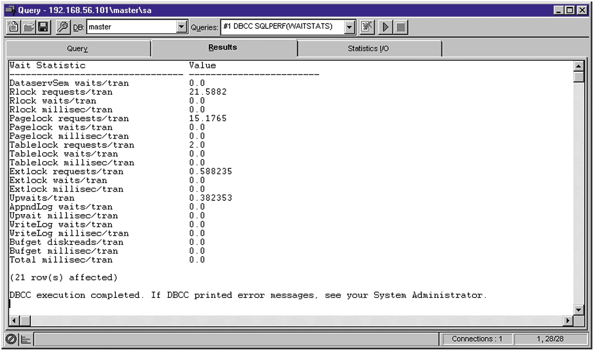

SQL Server 6.5 结果页面截图有两个列，分别是“等待统计”和“值”，共 21 行。下方文字显示，“DBCC 执行完成”。顶部有“DB”和“查询”下拉框。

图 1-1

SQL Server 6.5 的等待统计

SQL Server 2005 的一个重大变化是将许多内部函数和命令转换为**动态管理视图** (`DMVs`) 和**动态管理函数** (`DMFs`)。这使得查询和分析函数及命令返回的信息（包括等待统计信息）变得更加容易。随着 Tom Davidson 撰写的 Microsoft 白皮书 `SQL Server 2005 Waits and Queues` 的发布，一种新的性能分析方法诞生了。

在随后的 SQL Server 版本中，每当引入新功能或配置选项时，新的、不同的等待类型数量便呈指数级增长。如果你查看图 1-1，会注意到返回了 21 种不同的等待类型。图 1-2 显示了在 SQL Server 2022 中可用的等待类型数量，即返回的行数。

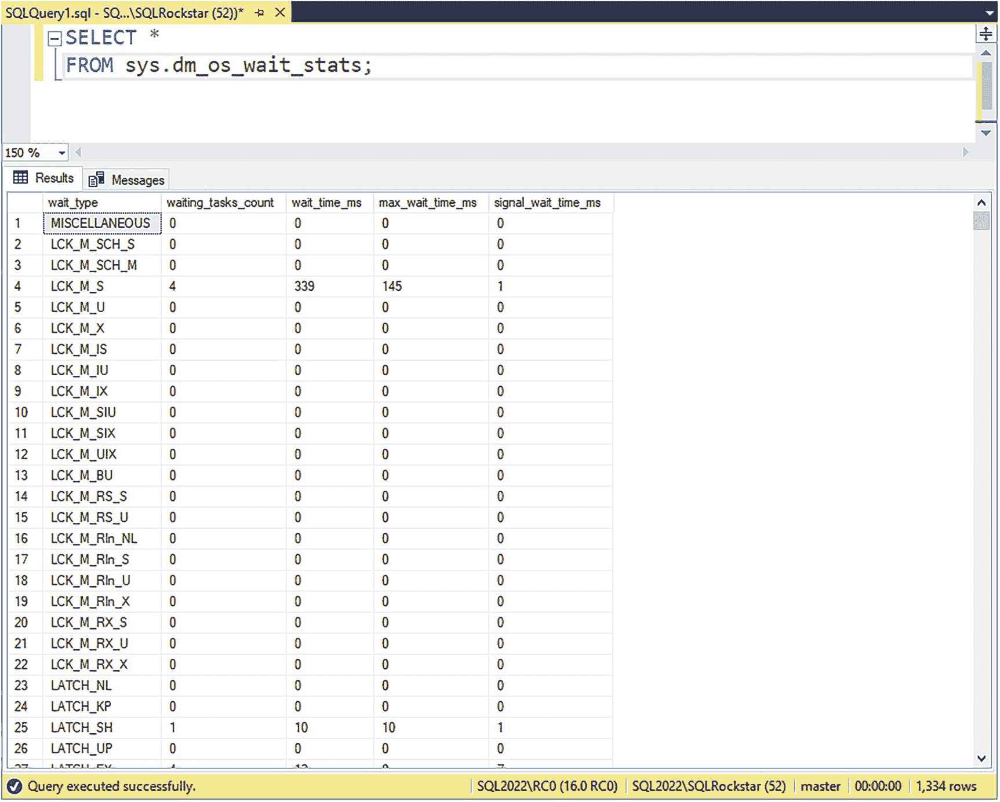

SQL Server 2022 窗口截图，包含一个查询及其下方结果，结果有 5 列：`wait_type`, `waiting_tasks_count`, `wait_time_ms`, `max_wait_time_ms`, `signal_wait_time_ms`。列名之间用下划线代替空格。底部状态栏显示行数为 1334。

图 1-2

SQL Server 2022 中的等待统计

随着 SQL Server 2022 RC0 的发布，等待类型数量增加到了超过 1300 种不同的类型！随着新功能的引入或现有功能的更改，等待类型的数量在未来的 SQL Server 版本中很可能继续增长。值得庆幸的是，现在关于等待统计的信息比在 SQL Server 6.5 时代要多得多！


### SQLOS

计算机硬件世界日新月异。几乎每年，甚至每月，我们都会在处理器中集成更多核心，提升主板的内存容量，或引入如基于 PCI 的持久化闪存存储等全新的硬件概念。数据库管理系统（DBMSs）渴望利用新的硬件趋势。由于硬件变化迅速且需要在新硬件选项可用时立即加以利用，SQL Server 团队决定从 SQL Server 2005 开始改变 SQL Server 的平台层。

在 SQL Server 2005 之前，SQL Server 的平台层受到限制，许多操作由操作系统自身执行。这意味着 SQL Server 难以跟上快速变化的服务器硬件世界，因为为了利用更快的硬件或新的硬件特性而改变一个完整的操作系统，是一项耗时且复杂的操作。

图 1-3 展示了在 SQL Server 2005 中引入 SQLOS 之前 SQL Server 的（简化）架构。

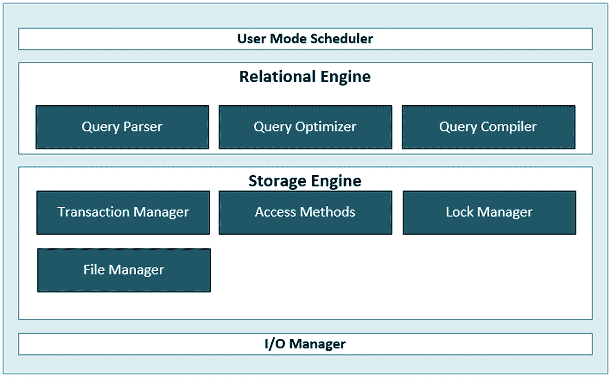

> 一张展示 SQLOS 引入前 SQL Server 软件架构的图，包含用户模式调度器、关系引擎、存储引擎和一个输入输出管理器。

**图 1-3**
引入 SQLOS 之前的 SQL Server 架构

SQL Server 2005 引入了其所见过的 SQL Server 引擎的最大变革之一，即 SQLOS。这是一个全新的平台层，功能上相当于一个用户级操作系统。SQLOS 使得充分利用当前和未来的硬件成为可能，并实现了诸如高级并行化等特性。SQLOS 高度可配置，能根据其运行所在的硬件进行自我调整，因此无论是对高端还是低端系统都具有完美的可扩展性。

图 1-4 展示了包含 SQLOS 层的 SQL Server 2005 的（简化）架构。

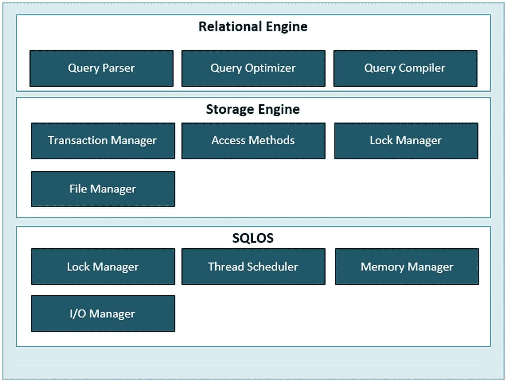

> 一张展示 SQL Server 2005 软件架构的图，包含 3 层：关系引擎、存储引擎和 SQLOS。每层下都有其组件。

**图 1-4**
SQL Server 2005 架构

SQLOS 通过引入调度器（schedulers）、任务（tasks）和工作线程（worker threads），改变了 SQL Server 访问处理器资源的方式。这使得 SQLOS 能更好地控制应如何由处理器完成工作。Windows 操作系统使用抢占式调度（preemptive scheduling）方法。这意味着 Windows 会给每个需要处理器时间的进程分配一个优先级和固定的时间片（或称量程 quantum）。这个进程优先级是根据许多变量计算得出的，如资源使用情况、预期运行时间、当前活动等。通过使用抢占式调度，Windows 操作系统可以选择在更高优先级的进程需要处理器时间时中断当前进程。这种调度方式可能对 SQL Server 生成的进程产生负面影响，因为这些进程很容易被更高优先级的进程（包括其他应用程序的进程）中断。因此，SQLOS 使用自己的（协作式 cooperative）非抢占式调度机制，确保 Windows 进程无法中断 SQLOS 进程。

**Nerd Note**
SQL Server 7 和 SQL Server 2000 也使用用户模式调度（UMS）进行非抢占式调度。SQLOS 将更多的系统组件更紧密地结合在一起，从而实现了更好的性能和可扩展性。

存在一些 SQLOS 无法使用非抢占式调度的例外情况，例如当 SQLOS 需要通过 Windows 操作系统访问资源时。我们将在本书后面的第 11 章“抢占式等待类型”中讨论这些例外情况。

### 调度器、任务与工作线程

因为 SQLOS 使用与 Windows 操作系统不同的方法来执行请求，SQL Server 引入了一种使用调度器、任务和工作线程来调度处理器时间的不同方式。图 1-5 展示了 SQL Server 调度的不同部分及其相互关系。

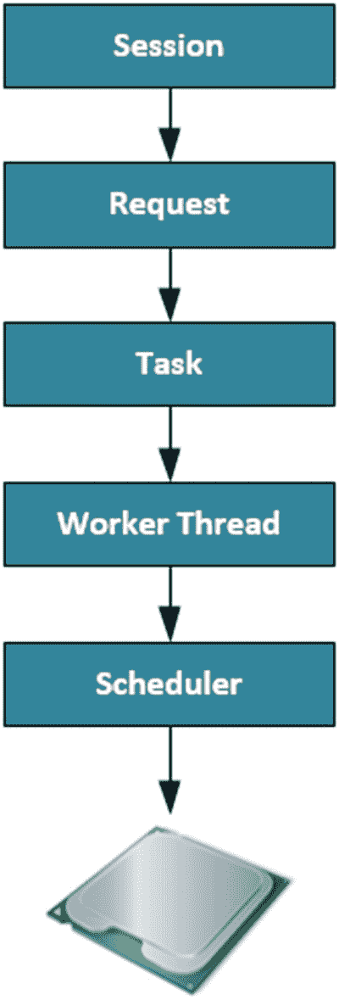

> 一张 SQL Server 调度流程图，从会话开始，接着是请求、任务、工作线程，最后以调度器结束，该调度器将调度时间发送给处理器。

**图 1-5**
SQL Server 调度

#### 会话

会话（session）是客户端成功通过身份验证后与 SQL Server 建立的连接。我们可以通过查询 `sys.dm_exec_sessions` DMV 来访问会话信息，使用以下查询：

```sql
SELECT *
FROM sys.dm_exec_sessions;
```

在旧版本的 SQL Server 中，用户会话的 `session_id` 大于 50；小于 50 的保留给内部 SQL Server 进程。然而，在非常繁忙的服务器上，SQL Server 有可能需要使用大于 50 的 `session_id`。如果您只对用户启动的会话信息感兴趣，最好使用 `is_user_process` 列来过滤 `sys.dm_exec_sessions` DMV 的结果，而不是过滤 `session_id` 大于 50。以下查询将只返回用户会话，并过滤掉内部系统会话：

```sql
SELECT *
FROM sys.dm_exec_sessions
WHERE is_user_process = 1;
```

图 1-6 展示了此查询结果的一小部分。

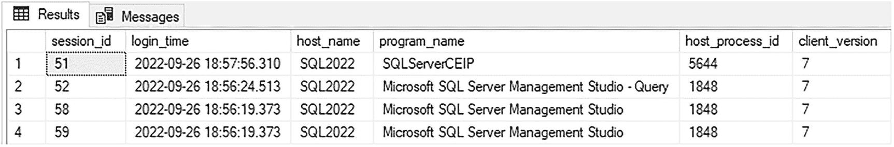

> 一张 SQL Server 2022 结果窗口的截图，包含 6 列：会话 ID、登录时间、主机名、程序名、主机进程 ID、客户端版本。有 4 行，对应 4 个不同的会话 ID。列名中的空格用下划线代替。

**图 1-6**
`sys.dm_exec_sessions` 结果

`sys.dm_exec_sessions` DMV 返回许多列，提供有关每个会话的信息。一些比较有趣的列包括：

*   `host_process_id` – 连接到 SQL Server 的客户端程序的进程 ID（PID）。对于内部会话将显示 `NULL`。
*   `cpu_time` – 自会话首次建立以来已使用的处理器时间（毫秒）。
*   `memory_usage` – 自会话首次建立以来使用的内存量（8k 页数）。
*   `reads` – 自会话首次建立以来执行的读取次数。
*   `writes` – 自会话首次建立以来执行的写入次数。
*   `row_count` – 到目前为止为此会话返回的行数。
*   `status` – 可能的值包括 `running`、`sleeping`、`dormant` 和 `preconnect`。

`status`列最常见的值是 `running`（表示当前正在从此会话处理一个或多个请求）和 `sleeping`（表示当前没有从此会话处理任何请求）。


#### 请求

请求是 SQL Server 执行引擎对由会话提交的查询的内部表示。同样，我们将使用一个 DMV（动态管理视图）来查询有关请求的信息；在本例中，我们查询 `sys.dm_exec_requests` DMV：

```
SELECT *
FROM sys.dm_exec_requests;
```

图 1-7 显示了此查询结果的一部分。

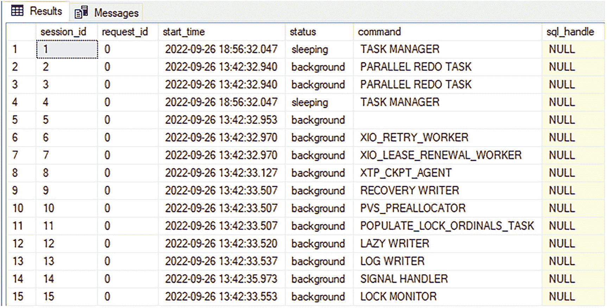

SQL Server 2022 结果窗口的屏幕截图有 6 列：会话 ID、请求 ID、开始时间、状态、命令和 SQL 句柄。它有 15 行，会话 ID 为 1 到 15。列名中使用下划线代替空格。

图 1-7

sys.dm_exec_requests 结果

`sys.dm_exec_requests` DMV 是一个功能极其强大的工具，用于排查与性能相关的问题。此 DMV 包含大量关于当前查询的信息，并有助于相对快速地检测性能瓶颈。因为 `sys.dm_exec_requests` DMV 也显示等待统计信息，我们将在第 2 章“查询 SQL Server 等待统计信息”中对它进行详细探讨。

#### 任务

任务代表 SQLOS（SQL 操作系统）要执行的工作，但任务本身并不执行任何工作。当 SQL Server 接收到一个请求时，会创建一个或多个任务来完成该请求。为一个请求生成的任务数量取决于查询请求是使用并行方式执行还是串行方式执行。

我们将使用 `sys.dm_os_tasks` DMV 来查询任务信息：

```
SELECT *
FROM sys.dm_os_tasks;
```

图 1-8 显示了此查询结果的一部分。

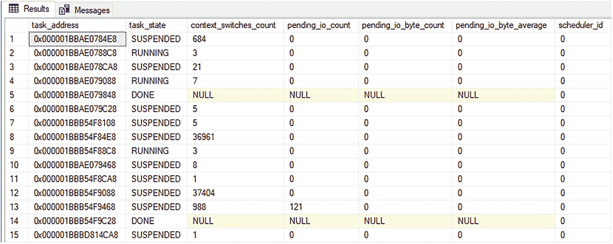

SQL Server 2022 结果窗口的屏幕截图有 7 列：任务地址、任务状态、上下文切换计数、挂起 I/O 计数、挂起 I/O 字节数、挂起 I/O 字节平均值和调度程序 ID。它有 15 行，具有不同的任务地址。列名中使用下划线代替空格。

图 1-8

sys.dm_os_tasks 结果

当您查询 `sys.dm_os_tasks` DMV 时，您会发现它返回很多结果，即使在用户活动很少的服务器上也是如此。这是因为 SQL Server 也为其自身进程使用任务。

此 DMV 中有一些有趣的列值得探讨，以了解不同 DMV 之间的关系：

*   `session_id` – 请求此任务的会话 ID。
*   `worker_address` – 与此任务关联的工作线程的内存地址。
*   `task_address` – 此任务的内存地址。
*   `task_state` – 可能的值包括“挂起”、“可运行”、“运行中”、“已暂停”、“完成”和“自旋循环”。

`task_state` 列最常见的值是“运行中”、“可运行”和“已暂停”。

#### 工作线程

创建的每个任务都会分配一个工作线程，然后工作线程执行任务请求的操作。

极客备注

工作线程本身并不执行工作；而是向 Windows 操作系统请求一个线程来执行工作。为了简单起见，并且由于 Windows 线程在 SQLOS 之外运行，我已将此步骤从图 1-5 中省略了。如果您感兴趣，可以通过查询 `sys.dm_os_threads` 来访问有关 Windows 操作系统线程的信息。

当任务请求工作线程时，SQL Server 将首先查找一个空闲的工作线程分配给该任务。如果未找到空闲工作线程，并且工作线程数已达到最大值，则该请求将进入队列，直到某个工作线程完成其当前工作并变得可用。

SQL Server 可用于处理请求的工作线程数量是有限制的。此数量在启动期间由 SQL Server 自动计算和配置。我们可以使用以下公式自己计算最大工作线程数：

| 32 位系统且逻辑处理器数 <= 4 | 256 个工作线程 |
| --- | --- |
| 32 位系统且逻辑处理器数 > 4 | 256 + ((逻辑处理器数 – 4) * 8) |
| 64 位系统且逻辑处理器数 <= 4 | 512 个工作线程 |
| 64 位系统且逻辑处理器数 > 4 | 512 + ((逻辑处理器数 – 4) * 16) |

**示例**：对于一个有 16 个逻辑处理器的 64 位系统，我们使用前面的公式计算最大工作线程数：

```
512 + ((# of logical processors – 4) * 16) =
512 + ((16 – 4) * 16) =
512 + (12 * 16) =
512 + (192) = 704
```

这将分配最多 704 个工作线程。

工作线程数的默认值为 0，允许 SQL Server 在启动时使用前面的公式设置最大工作线程数。我们可以通过更改 SQL Server 属性中的 `最大工作线程数` 选项来修改默认值，如图 1-9 所示。

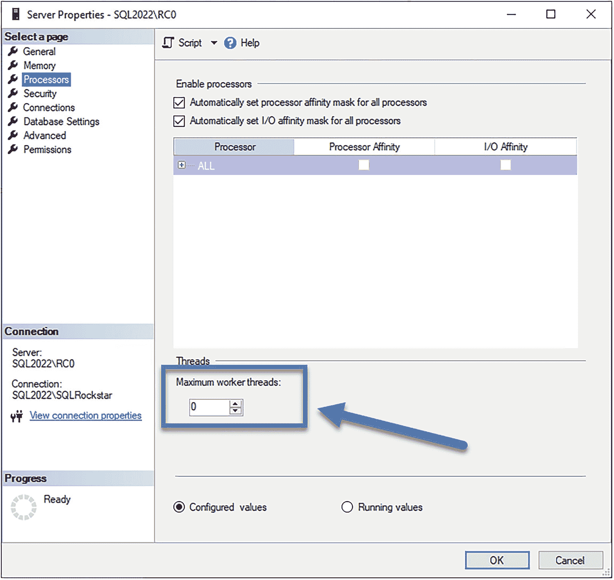

SQL Server 属性窗口的屏幕截图，左侧窗格选中了“处理器”页，下方显示连接详细信息和属性。一个箭头指向“线程”部分下值为 0 的“最大工作线程数”框。

图 1-9

服务器属性中的处理器页

一般来说，您不需要更改 `最大工作线程数` 选项，我的建议是保持原样，因为它只应在非常特殊的情况下更改（我将在第 5 章“与 CPU 相关的等待类型”中讨论一个潜在情况，届时我们将谈到 `THREADPOOL` 等待）。

需要记住的一点是，工作线程需要内存才能工作。对于 32 位系统，每个工作线程需要 512 KB；64 位系统则需要为每个工作线程分配 2048 KB。因此，更改工作线程数可能会影响 SQL Server 的内存需求。这并不意味着您需要为工作线程准备大量内存——SQL Server 会在 15 分钟后或当 SQL Server 面临严重内存压力时自动销毁空闲的工作线程。

SQL Server 提供了一个 DMV 供我们查询有关工作线程的信息，即 `sys.dm_os_workers`。图 1-10 显示了此查询的部分结果：

```
SELECT *
FROM sys.dm_os_workers;
```

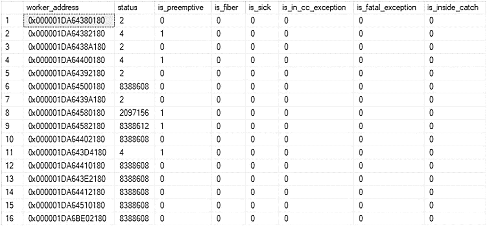

SQL Server 2022 结果窗口的屏幕截图有 8 列：工作线程地址、状态、是否为抢占式、是否为纤程、是否异常、是否处于 C++ 异常中、是否为致命异常、是否在 catch 块中。它有 16 行，具有不同的工作线程地址。列名中使用下划线代替空格。

图 1-10

查询 sys.dm_os_workers 的结果

`sys.dm_os_workers` DMV 大而复杂，许多列被 Microsoft 标记为“仅限内部使用”。然而，`task_address` 和 `scheduler_address` 这两列可用于连接我们迄今为止讨论的不同 DMV。

工作线程在暴露于处理器时会经历不同的阶段，我们在检查 `sys.dm_os_workers` DMV 中的 `state` 列时可以观察到：

*   `INIT` – 工作线程已由 SQLOS 初始化。
*   `RUNNING` – 工作线程当前正在处理器上执行工作。
*   `RUNNABLE` – 工作线程已准备好在处理器上运行。
*   `SUSPENDED` – 工作线程正在等待某个资源。

工作线程在执行工作时经历的状态是本书的主要关注点。每当工作线程不处于“运行中”状态时，它就必须等待，SQLOS 会记录这些信息，从而让我们深入了解工作线程一直在等待什么以及等待了多久。


#### 调度器

调度器组件的主要任务是——毫不意外地——在物理处理器上以任务的形式安排工作。当一个任务请求处理器时间时，正是调度器将工作线程分配给该任务，以便请求得到处理。调度器还负责确保工作线程相互协作，并在它们的时间片（或量子）到期时让出处理器。我们称之为协作式或非抢占式调度。工作线程需要在处理器时间到期时让出的原因是，调度器一次只允许一个工作线程在处理器上运行。如果工作线程无需让出，一个工作线程可能会在处理器上停留无限长的时间，从而阻塞该处理器的所有使用。

处理器和调度器之间是一一对应的关系。如果你的系统有两个处理器，每个处理器有四个核心，那么将会有八个调度器可供 SQLOS 用于处理用户请求，每个调度器映射到一个逻辑处理器。

我们可以通过查询 **sys.dm_os_schedulers** DMV 来获取有关调度器的信息：

```sql
SELECT *
FROM sys.dm_os_schedulers;
```

查询结果如图 1-11 所示。

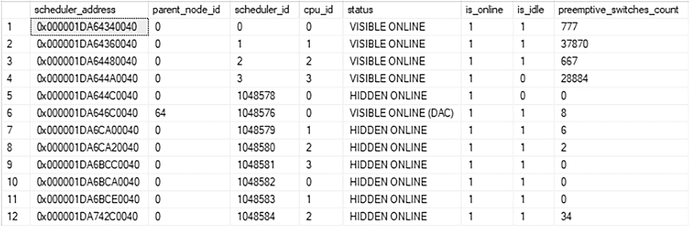

图 1-11：`sys.dm_os_schedulers` 查询结果

我运行此查询的 SQL Server 有两个双核处理器，这意味着应该有四个调度器来处理用户请求。然而，如果我们查看图 1-11，会注意到查询返回的调度器多于四个。SQL Server 使用自己的调度器来执行内部任务，这些调度器被 DMV 返回并在 `status` 列中标记为“HIDDEN ONLINE”。可用于用户请求的调度器被标记为“VISIBLE ONLINE”。还有一种特殊类型的调度器，其状态为“VISIBLE ONLINE (DAC)”。这是专用于专用管理员连接（DAC）的调度器。当 SQL Server 无响应时（例如，处理用户请求的调度器上没有空闲的工作线程），此调度器使得连接成为可能。

我们可以通过查看 `current_workers_count` 列来查看调度器关联的工作线程数。此数字还包括未执行任何工作的工作线程。`active_workers_count` 向我们显示特定调度器上处于活动状态的工作线程。这并不意味着它们正在处理器上运行，因为状态为“RUNNING”、“RUNNABLE”和“SUSPENDED”的工作线程也计入此数字。`work_queue_count` 也是一个有趣的列，因为它提供了有多少任务正在等待空闲工作线程的洞察。如果你在此列中看到很高的数字，可能意味着你遇到了 CPU 压力。

#### 综合运用

上面讨论的所有 SQL Server 调度部件都是相互连接的，因为每个连接、会话和查询请求都通过这些相同的组件进行处理。以下文本是一个查询请求如何被处理的示例：

*   用户通过应用程序连接到 SQL Server。
*   ↓
*   登录过程成功完成后，SQL Server 创建一个会话。
*   ↓
*   当用户向 SQL Server 发送查询时，会创建一个任务和一个请求来表示需要完成的工作单元。
*   ↓
*   调度器将分配工作线程给任务，以便任务能够完成。

要在 SQL Server 中查看此信息，我们需要连接一些讨论过的 DMV。清单 1-1 中的查询将向你展示如何组合不同的 DMV 来获取特定会话（本例中 ID 为 55 的会话）的调度信息。

```sql
SELECT
    r.session_id AS 'Session ID',
    r.command AS 'Type of Request',
    qt.[text] AS 'Query Text',
    t.task_address AS 'Task Address',
    t.task_state AS 'Task State',
    w.worker_address AS 'Worker Address',
    w.[state] AS 'Worker State',
    s.scheduler_address AS 'Scheduler Address',
    s.[status] AS 'Scheduler State'
FROM sys.dm_exec_requests r
CROSS APPLY sys.dm_exec_sql_text(r.sql_handle) qt
INNER JOIN sys.dm_os_tasks t
    ON r.task_address = t.task_address
INNER JOIN sys.dm_os_workers w
    ON t.worker_address = w.worker_address
INNER JOIN sys.dm_os_schedulers s
    ON w.scheduler_address = s.scheduler_address
WHERE r.session_id = 70;
```

清单 1-1：连接不同的 DMV 以查询调度信息

图 1-12 显示了在我的测试 SQL Server 上该查询返回的信息。为了保持结果可读，我只从 DMV 中选择了部分列以显示它们之间的关系。

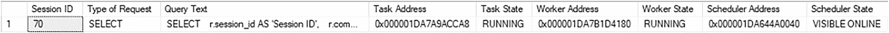

图 1-12：清单 1-1 查询的结果

在结果中，我们看到会话 ID 70 发出了一个 SELECT 查询请求。在清单 1-1 的查询中，我们使用交叉应用（`CROSS APPLY`）和 `sys.dm_exec_sql_text` 动态管理函数获取了查询请求的文本。然后，该请求被映射到一个任务，该任务开始运行。接着，该任务被映射到一个工作线程，并且该任务现在处于运行状态。这意味着查询开始在处理器上进行处理。`Scheduler Address` 列显示了我们的工作线程是在哪个具体的调度器上运行的。


## 等待统计

到目前为止，我们已经深入探讨了为 SQL Server 执行调度的不同组件以及它们是如何相互关联的。现在，我们将注意力转向本书的主要主题：等待统计。

在本章前面关于工作线程的部分，我描述了工作线程在调度程序上执行工作时所处的状态。当一个工作线程执行其工作时，它会在调度程序进程中经历三个不同的阶段（或队列）。根据工作线程所在的阶段（或队列），它会进入“运行中”、“可运行”或“已暂停”状态。图 1-13 展示了一个调度程序及其不同阶段的抽象视图。

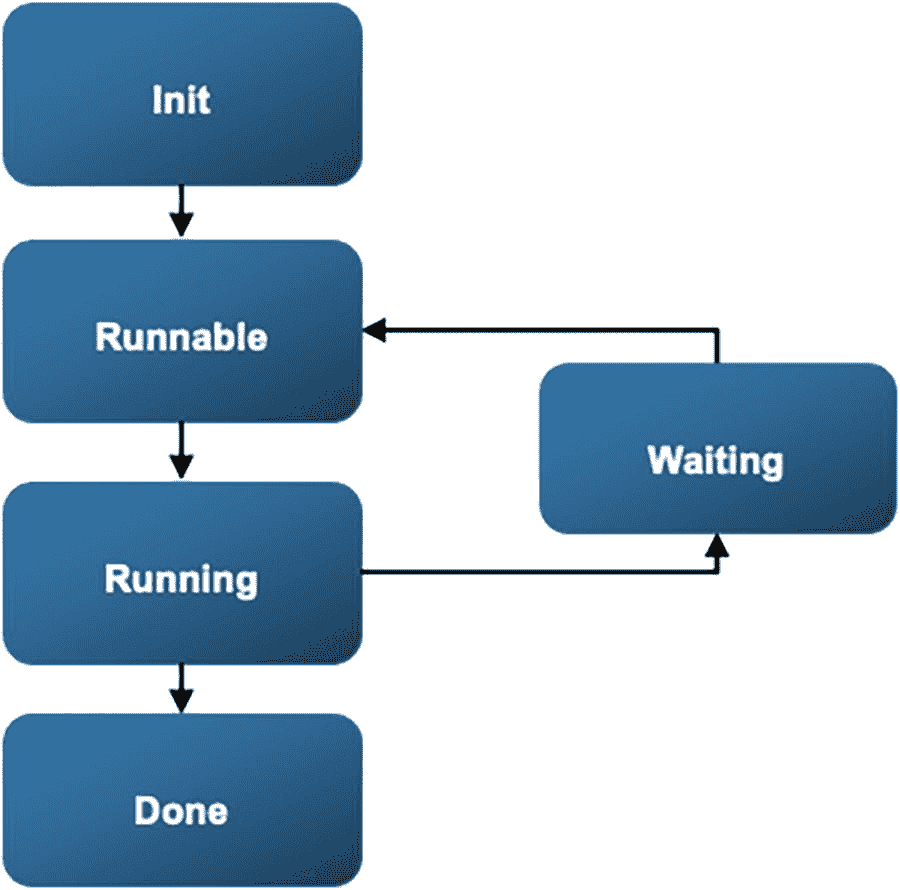

调度程序队列阶段的流程图有五个块：初始化、可运行、运行中、完成和等待中。

图 1-13

调度程序及其阶段和队列

当一个工作线程获得访问调度程序的权限时，它通常会在等待者列表中启动，并被分配为“已暂停”状态。等待者列表（在图 1-13 中显示为 Waiting）是一个无序列表，包含所有处于“已暂停”状态并等待资源可用的工作线程。这里的资源是指系统上的任何东西，例如数据页或锁请求。当一个工作线程在等待者列表中时，`SQLOS` 会记录它继续工作所需的资源类型（这就是等待类型），以及该特定资源变为可用之前它所花费的等待时间（这就是资源等待时间）。

当一个工作线程获得所需资源的访问权限时，它将移动到可运行队列。这是一个先进先出的列表，包含所有已获得资源访问权限并准备好在处理器上运行的工作线程。工作线程在可运行队列中花费的时间被记录为信号等待时间。

可运行队列顶部的工作线程将移动到“运行中”阶段，在此阶段它将获得处理器时间以执行其工作。它在处理器上花费的时间被记录为 CPU 时间。与此同时，可运行队列中的其他工作线程会向上移动，而已获得所需资源的工作线程则从等待者列表移入可运行队列。

极客笔记

可运行队列是一个先进先出的列表。如果不是这样，在繁忙的系统中，理论上一个任务可能永远无法从可运行状态转为运行中状态。然而，等待者列表不是先进先出的。

当工作线程处于“运行中”阶段时，可能会发生三种情况：

1.  工作线程需要额外的资源；在这种情况下，它从“运行中”阶段移动到等待者列表（即我们看到的“已暂停”状态）。
2.  工作线程耗尽了其时间配额（固定值为 4 毫秒），因此必须让出处理器；该工作线程被移动到可运行队列的底部。
3.  工作线程完成了其工作并离开调度程序。

工作线程总是在三个不同的阶段中移动。一个工作线程循环多次直到所有工作完成是很常见的。

了解请求在三个不同阶段之一所花费的不同时长，可以计算总的请求执行时间，以及请求为等待处理器时间或资源时间所花费的总时间。

用数学公式表示，总的请求执行时间如下所示：
`总请求执行时间 = 运行时间 + 可运行时间 + 暂停时间`

也可以写成如下形式：
`总请求执行时间 = CPU 时间 + 信号等待时间 + 资源等待时间`

由于 SQL Server 中工作线程的调度涉及大量术语，让我们通过一个例子来说明工作线程是如何在调度程序中移动的。

图 1-14 展示了一个等待队列、可运行队列和一个正在执行请求的处理器的抽象图。

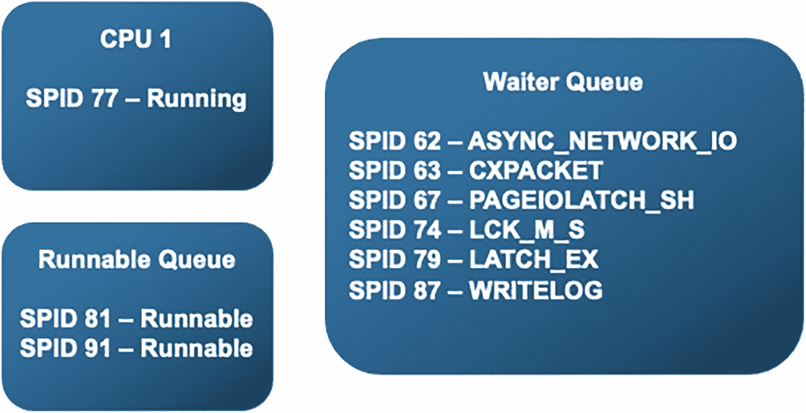

调度程序及其请求的块图包含 3 个块。一个 C P U 1 块，其中 S P I D 77 请求正在运行。一个可运行队列块，包含 2 个请求。一个等待队列块，包含 6 个请求。

图 1-14

带有请求的调度程序

在此示例中，我们看到一个来自 `SPID 77` 的请求正在处理器上运行；该请求将处于“运行中”状态。等待队列中有等待资源的请求。我不会详细介绍列出的等待类型，因为我们将在本书的第二部分介绍等待类型。当这些会话在等待队列中时，SQL Server 会将花费的时间记录为等待时间，并且等待类型将被标记为代表它们正在等待的资源。如果我们查询有关这些线程的信息，它们将处于“已暂停”状态。`SPID 81` 和 `SPID 91` 已准备好资源，正在可运行队列中等待 `SPID 77` 在处理器上完成其工作。当它们在可运行队列中等待时，SQL Server 将它们在此处花费的时间记录为信号等待时间，并将此时间添加到总等待时间中。这些工作线程将处于“可运行”状态。

在图 1-15 中，我们向前移动了几毫秒；注意调度程序和工作线程是如何在不同的阶段和队列中移动的。

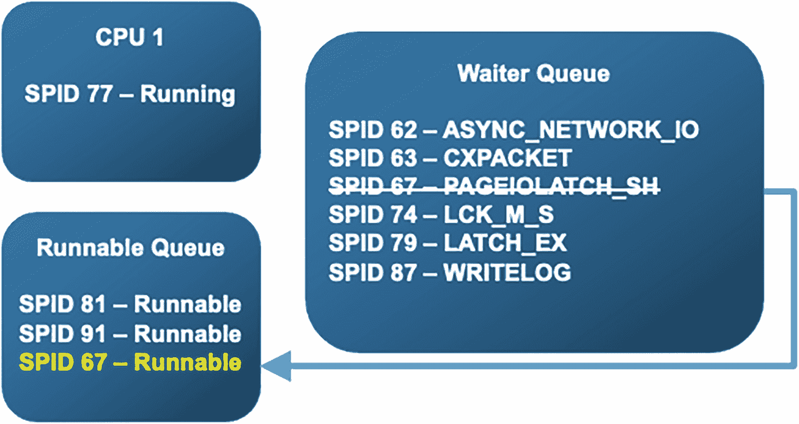

几毫秒后调度程序的块图显示：C P U 1 块中 S P I D 77 仍在运行。可运行队列块从等待队列块接收了 S P I D 67 请求，现在有 3 个请求。等待队列块现在有 5 个请求。

图 1-15

几毫秒后带有请求的调度程序

`SPID 67` 已完成对 `PAGEIOLATCH_SH` 等待类型的等待，并已移动到可运行队列的底部。图 1-16 显示了接下来的几毫秒。

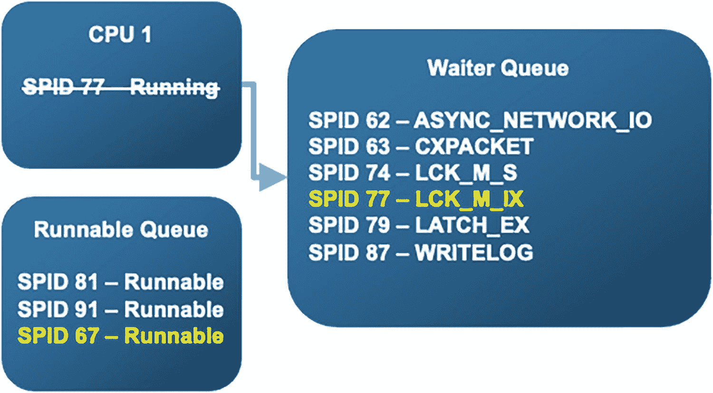

再过几毫秒后调度程序的块图。S P I D 77 请求从 C P U 1 块移动到等待队列块。等待队列现在有 6 个请求。可运行队列块有 3 个请求。C P U 1 块没有请求。

图 1-16

再过几毫秒

`SPID 77` 需要额外的资源，并被放回等待队列。这里我选择将其放在图像的中间，以更好地表示等待队列不是先进先出队列。图 1-17 显示了接下来的几毫秒。

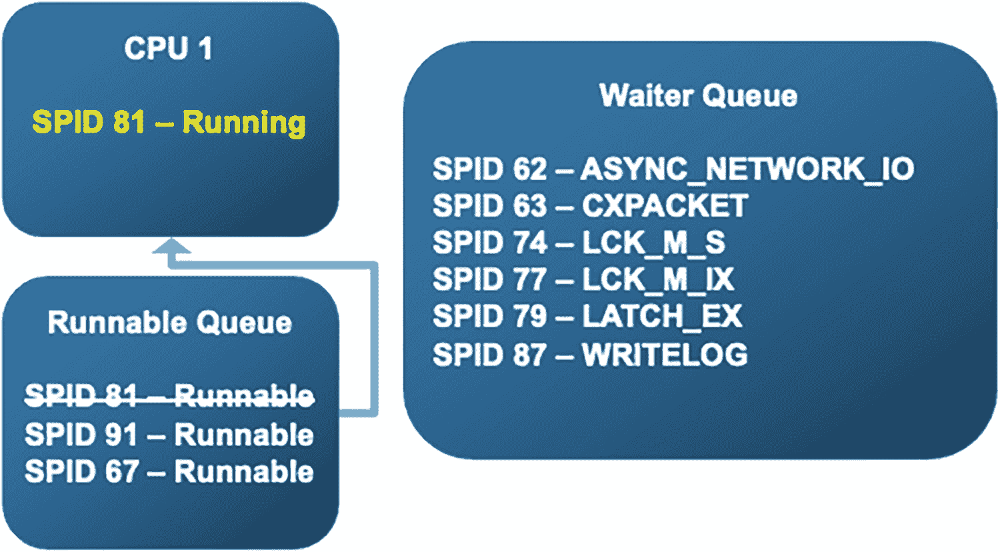

调度程序的块图。S P I D 81 请求从可运行队列移动到 C P U 1 块并正在运行。可运行队列块现在有 2 个请求。C P U 1 块现在有 1 个请求。等待队列有 6 个请求。

图 1-17

再过几毫秒

`SPID 81` 是可运行队列中的第一个工作线程，现在处理器空闲，它从可运行队列移动到处理器，状态从“可运行”变为“运行中”。

这就是工作线程如何从“已暂停”到“可运行”再到“运行中”移动，直到请求完成并退出调度程序的。


## 2. 查询 SQL Server 等待统计信息

### 摘要

在本章中，我们回顾了不同版本 SQL Server 中等待统计信息的历史。随着 SQL Server 2005 中 SQLOS 的引入，SQL Server 处理请求的方式发生了很大变化，引入了调度器、工作线程和任务。所有这些不同部分的信息都存储在动态管理视图（DMV）或动态管理函数（DMF）中，它们易于查询，并返回大量关于 SQL Server 内部运行的信息。

通过使用这些 DMV，我们可以查看请求在 SQL Server 调度器处理过程中的进度，并了解它们是否在等待任何特定资源。请求所等待的资源以及它们等待这些资源所花费的时间被记录为等待统计信息，这也是本书的主要主题。

随着 SQL Server 2005 中动态管理视图（DMV）和动态管理函数（DMF）的引入，查看和分析等待统计信息变得更加容易和省力。在 SQL Server 2005 之前的版本中，用户只能通过 `DBCC SQLPERF('WAITSSTATS')` 命令来查看等待统计信息。如今，有多种 DMV 可以返回与等待统计信息相关的信息，在本章中，我们将详细查看四个最有用的 DMV：`sys.dm_os_wait_stats`、`sys.dm_os_waiting_tasks`、`sys.dm_exec_requests` 和 `sys.dm_exec_session_wait_stats`。

查看等待统计信息不仅限于 DMV。我们还可以使用性能监视器（Performance Monitor，或 Perfmon）来查看等待统计信息。

SQL Server 2008 引入了另一个查看等待统计信息的选项：扩展事件（Extended Events）。在 SQL Server 2008 中，扩展事件使用起来很困难（您必须用 T-SQL 编写整个扩展事件会话），但 Microsoft 在后续版本中极大地改进了扩展事件，使其更加用户友好且易于使用。

SQL Server 2016 SP1 引入了两种访问等待统计信息的新方法：通过一个名为 `sys.dm_exec_session_wait_stats` 的新 DMV，以及在执行计划中按查询为基础添加等待统计信息。

在 SQL Server 2017 中，Microsoft 通过将等待统计信息包含在查询存储（Query Store）中，进一步推进了记录等待统计信息的功能。查询存储是 SQL Server 2016 中引入的一项功能，它就像您查询工作负载的飞行记录器，记录查询语句、性能和资源利用情况。

在本章中，我们将查看上文提到的捕获等待统计信息的来源，从 DMV 开始。由于查询存储功能对故障排除和分析查询性能（包括等待统计信息）有重大影响，我们将在第 3 章“查询存储”中对其进行深入探讨。

#### sys.dm_os_wait_stats

`sys.dm_os_wait_stats` DMV 是关于等待统计信息最重要的 DMV 之一。这个 DMV 是 SQL Server 2005 之前使用的 `DBCC SQLPERF('WAITSTATS')` 命令的替代品。`DBCC SQLPERF('WAITSTATS')` 命令返回的所有信息都包含在 `sys.dm_os_wait_stats` DMV 中，甚至还多一些。

`sys.dm_os_wait_stats` DMV 显示自 SQL Server 实例启动以来，每个等待类型的总等待时间。它是累积性的，将等待时间添加到不同的等待类型中，导致总数不断增加。查询 `sys.dm_os_wait_stats` DMV 可以深入了解查询请求在等待什么。如果您想查看每个等待类型的总等待时间，这很有帮助，但很多时候您可能对特定时间段或查询的等待时间感兴趣。在这种情况下，可以使用以下命令重置 `sys.dm_os_wait_stats` DMV，而无需重启 SQL Server：

```
DBCC SQLPERF('sys.dm_os_wait_stats', CLEAR);
```

这将把等待统计信息重置回 0，这意味着您会丢失重置之前的所有信息。在第 4 章“建立可靠的基线”中，我们将研究一种不会完全重置 `sys.dm_os_wait_stats` 计数器的方法。

与 SQL Server 中的每个 DMV 一样，我们像查询表一样对 `sys.dm_os_wait_stats` DMV 执行查询，例如：

```
SELECT *
FROM sys.dm_os_wait_stats;
```

此查询的结果如图 2-1 所示。

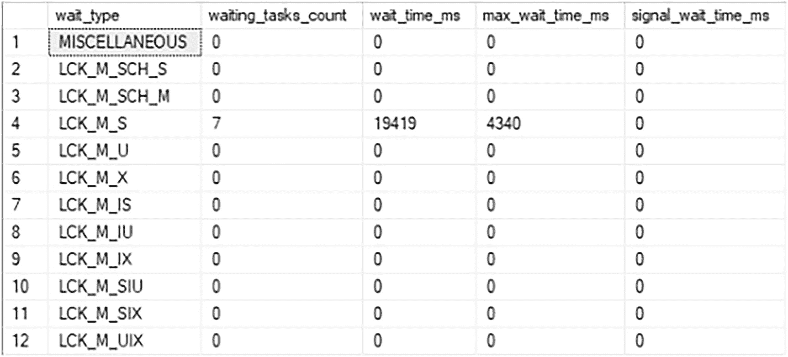

图 2-1: sys.dm_os_wait_stats

以下是 `sys.dm_os_wait_stats` DMV 中可用的列，以及每列所代表含义的描述：

*   `wait_type` – 等待类型的名称。`sys.dm_os_wait_stats` 会为特定 SQL Server 安装中可能的每个等待类型返回一行。
*   `waiting_tasks_count` – 工作线程必须等待该特定等待类型的次数计数。
*   `wait_time_ms` – 自 SQL Server 实例启动或上次手动重置以来，该特定等待类型的总等待时间（以毫秒为单位）。这是工作线程在“SUSPENDED”状态（挂起状态）下处于等待者列表（Waiter List）中所花费的时间。它还包括工作线程在“RUNNABLE”状态（可运行状态）下处于可运行队列（Runnable Queue）中，等待调度器授予其处理器时间所花费的时间。
*   `max_wait_time_ms` – 工作线程在该特定等待类型上等待的最长时间（以毫秒为单位）。
*   `signal_wait_time_ms` – 工作线程在可运行队列中等待可用处理器所花费的时间（以毫秒为单位）。

**极客注**

在处理大量查询、所有查询都请求处理器时间的系统中，信号等待时间（Signal wait time）是不可避免且正常的。信号等待时间也是检测 CPU 压力的一个重要指标。一般来说，根据您系统的硬件情况，看到信号等待时间指标超过总等待时间的 **15%** **可能**表明存在 CPU 压力，因为工作线程正在等待处理器变为可用状态。

您可能已经注意到 `sys.dm_os_wait_stats` DMV 没有返回资源等待时间（resource wait time）的列。如果我们想将资源等待时间作为附加列显示，我们需要自己计算这个值。

列表 2-1 展示了一个用于分析 `sys.dm_os_wait_stats` DMV 的查询。除了常规列之外，它还将为返回的每个等待类型添加两列：资源等待时间和平均等待时间。


### 监控 SQL Server 等待统计信息

#### 列出等待统计信息

查询`sys.dm_os_wait_stats`可获取更详细的等待信息：

```sql
SELECT  wait_type AS 'Wait Type',
        waiting_tasks_count AS 'Waiting Tasks Count',
        (wait_time_ms - signal_wait_time_ms) AS 'Resource Wait Time',
        signal_wait_time_ms AS 'Signal Wait Time',
        wait_time_ms AS 'Total Wait Time',
        COALESCE(wait_time_ms / NULLIF(waiting_tasks_count,0), 0) AS 'Average Wait Time'
FROM sys.dm_os_wait_stats;
```
*清单 2-1*
*包含附加信息的 sys.dm_os_wait_stats*

此查询返回的结果类似于图 2-2 所示。

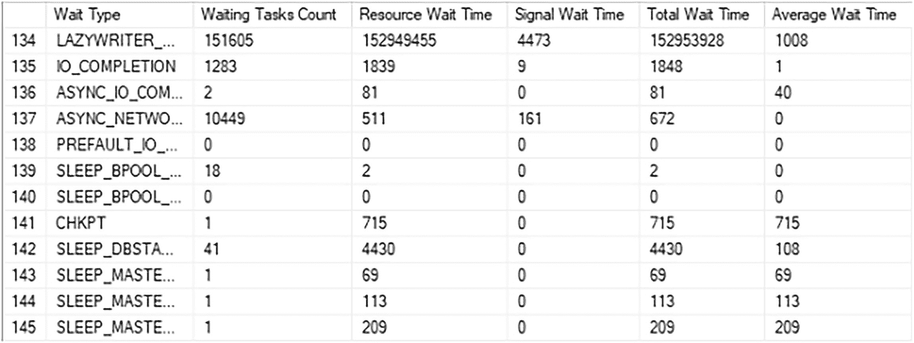
*图 2-2*
*扩展了更多等待信息的 sys.dm_os_wait_stats*

通过同时获取特定等待类型的出现次数和总等待时间，可以计算平均等待时间（如图 2-2 中的`Average Wait Time`列所示），计算方法是将`wait_time_ms`值除以`waiting_tasks_count`值。

`sys.dm_os_wait_stats`是一个强大的 DMV，包含关于不同等待类型的信息。它将作为第 4 章“构建可靠基线”中概述的等待统计信息基线方法的基础。

#### sys.dm_os_waiting_tasks

虽然`sys.dm_os_wait_stats` DMV 提供累积的等待统计信息，但**sys.dm_os_waiting_tasks** DMV 提供有关 SQL Server 实例等待队列的信息。查询此 DMV 可以概览所有工作线程正在等待列表或可运行队列中等待资源或处理器时间的任务。

##### 理解 sys.dm_os_waiting_tasks

由于`sys.dm_os_waiting_tasks` DMV 显示当前正在等待的任务，因此它通常是审查 SQL Server 实例性能的第一个 DMV。它还提供了某些等待类型的附加信息，在故障排除时非常有用。

图 2-3 显示了以下查询的结果：

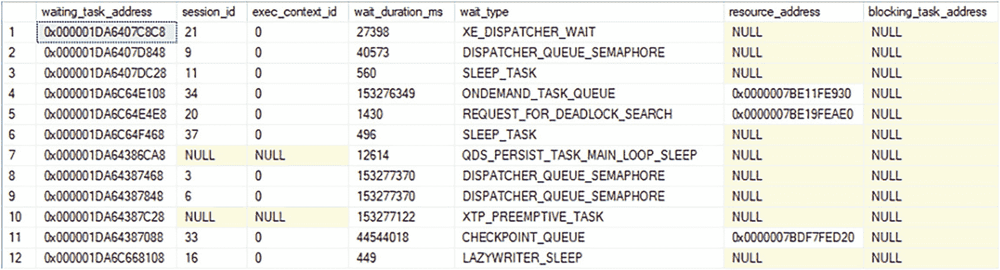
*图 2-3*
*sys.dm_os_waiting_tasks*

```sql
SELECT *
FROM sys.dm_os_waiting_tasks;
```

以下是`sys.dm_os_waiting_tasks` DMV 返回的列列表及其返回信息的描述：

*   `waiting_task_address` – 当前等待的任务地址。
*   `session_id` – 与特定任务关联的会话 ID。
*   `exec_context_id` – 执行上下文的 ID。只有当任务使用并行性（任务使用多个线程而不是单个线程）执行时，此值才会从默认值 0 更改。
*   `wait_duration_ms` – 任务已等待的时间（毫秒）。与`sys.dm_os_wait_stats` DMV 一样，此时间包括资源等待时间和信号等待时间。
*   `wait_type` – 任务当前正在等待的等待类型。
*   `resource_address` – 有关我们当前正在等待的资源的内存地址信息。并非所有等待类型都会记录此内存地址，因此它经常作为`NULL`返回。
*   `blocking_task_address` – 当前阻塞等待任务的任务地址。当任务未被其他任务阻塞时，此列将返回`NULL`。
*   `blocking_session_id` – 当前阻塞任务的会话 ID。与`blocking_task_address`一样，仅当此任务当前被另一个任务阻塞时才包含此信息。当没有阻塞或无法检索或识别阻塞任务的会话信息时，它将返回`NULL`。我们将在第 8 章“锁相关等待类型”讨论锁等待类型时解释阻塞和锁定。
*   `blocking_exec_context_id` – 另一个专门用于阻塞信息的列。在这种情况下，它将返回执行上下文的 ID。仅当使用并行性执行任务且其中一个线程负责阻塞时，才会返回非`NULL`的结果。然后，`blocking_exec_context_id`可用于识别哪个线程负责阻塞。
*   `resource_description` – 有关任务正在等待的资源的附加信息。此列的等待类型不多——最常见的是并行性以及锁或闩锁相关的等待类型。在分析锁或闩锁相关的等待类型时，这是一个非常有用的列；在这些情况下，我们可以精确指出我们正在等待其可用性的数据库对象（数据页、行、表等）。本书后面的一些示例（最著名的是第 8 章“锁相关等待类型”和第 9 章“闩锁相关等待类型”）将使用此列来收集有关我们正在等待的资源的额外信息。


##### 查询 `sys.dm_os_waiting_tasks`

由于 `sys.dm_os_waiting_tasks` DMV 返回了丰富的信息，根据您想要分析或排查的具体问题，有多种不同的使用方式。

在互联网上的各种论坛中可以找到如下查询：

```sql
SELECT *
FROM sys.dm_os_waiting_tasks
WHERE session_id > 50;
```

此查询旨在过滤掉 SQL Server 内部会话 ID，并返回源自用户会话的等待任务。正如第 1 章“等待统计信息内幕”所述，我们了解到为了识别用户会话的目的，不应通过 `session_id` 进行过滤。在我的测试 SQL Server 上，此查询的结果如图 2-4 所示。


`sys.dm_os_waiting_tasks` 查询的输出截图。表格输出有 8 列和 1 行。会话 ID 54 的等待任务地址被突出显示。

图 2-4
`sys.dm_os_waiting_tasks`，其中 `session_id` 大于 50

尽管这种过滤掉 SQL Server 内部进程的方法对于许多等待类型似乎效果良好，并提高了可读性，但在运行此查询时，某些特定的等待类型不会被返回。

一个例子是 `THREADPOOL` 等待类型，我们将在第 5 章“与 CPU 相关的等待类型”中讨论。这种等待类型通常对 SQL Server 的性能有很大的负面影响，但如果您只过滤用户会话，它将不会被返回。这会影响您的分析，因为您会遗漏重要的事实！

另一个不应该通过会话 ID 过滤的原因，是对会话 ID 与会话是用户还是内部会话之间关系的误解。不能保证大于 50 的会话 ID 就是用户会话。SQL Server 完全有可能拥有超过 50 个内部会话，在这种情况下，您有可能会误将内部会话当作用户会话。

我认为查询 `sys.dm_os_waiting_tasks` DMV 的最佳方式是选择所有内容，并在查找特定等待类型或会话时应用过滤器。与过滤 `session_id` 大于 50 相比，这将返回更多的行，如图 2-5 所示，但它展示了完整的画面，并最大限度地降低了您可能错过重要等待类型的机会。一个好主意是按 `session_id` 列排序，使结果更易读，同时也不会忽视内部会话。

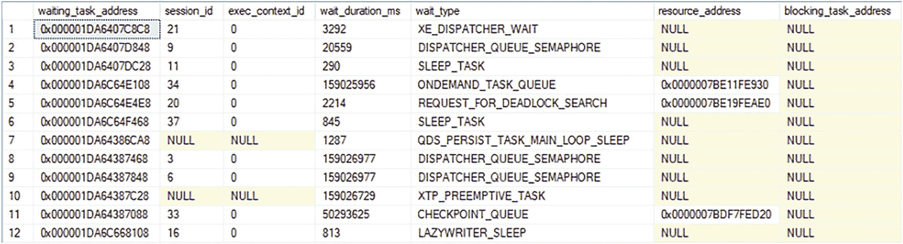

`sys.dm_os_waiting_tasks` 查询的输出截图。表格输出有 8 列和 12 行。最后 2 列中的 null 输出被突出显示。

图 2-5
`sys.dm_os_waiting_tasks`

#### `sys.dm_exec_requests`

`sys.dm_exec_requests` DMV 返回有关当前在 SQL Server 引擎内执行的每个请求的信息。

##### 理解 `sys.dm_exec_requests`

与之前的 DMV 类似，我们按如下方式查询 `sys.dm_exec_requests`：

```sql
SELECT *
FROM sys.dm_exec_requests;
```

这将返回当前正在执行的每一个查询请求。图 2-6 显示了我的测试 SQL Server 上的部分结果。

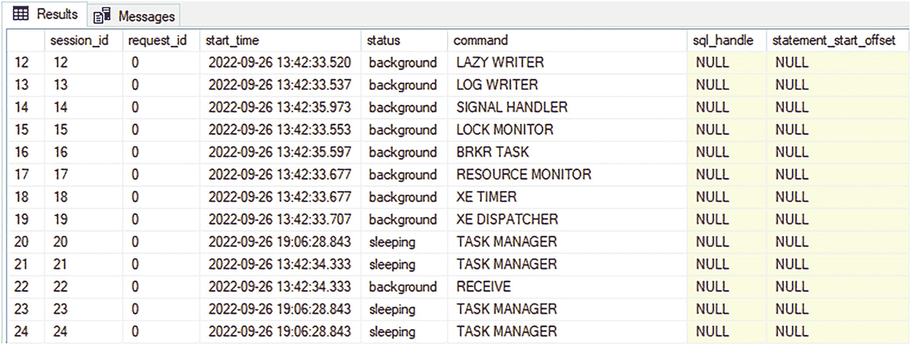

`sys.dm_exec_requests` 查询的输出截图。表格输出有 8 列和 13 行。最后 2 列中的 null 输出被突出显示。

图 2-6
`sys.dm_exec_requests`

`sys.dm_exec_requests` DMV 返回的列比前面讨论的 `sys.dm_os_wait_stats` 或 `sys.dm_os_waiting_tasks` DMV 更多。为了保持可读性，我将只描述常用于等待统计信息分析的列。以下是我的列表：

*   `session_id` – 此请求所属会话的 ID。
*   `start_time` – 请求到达的日期和时间。对于长时间运行的查询，这可能与您查询 DMV 的时间不同。
*   `command` – 请求正在执行的操作。最常见的命令与查询相关，如 `SELECT`、`INSERT`、`UPDATE` 和 `DELETE`，但根据请求的不同，还有更多命令。
*   `sql_handle` – 在请求中执行的批处理或存储过程的哈希值。并非所有请求都有句柄，通常只有当请求是由用户会话发起并且涉及查询时，您才会看到句柄。`sql_handle` 哈希被用作 `sys.dm_exec_sql_text` 动态管理函数 (DMF) 的输入，以检索查询文本。
*   `plan_handle` – 执行计划的哈希值。执行计划将向您展示 SQL Server 在执行查询时执行的操作，是查询执行信息的绝佳来源。我们使用 `plan_handle` 的方式与 `sql_handle` 相同，作为 `sys.dm_exec_query_plan` DMF 的输入，以返回查询的执行计划。
*   `wait_type` – 如果请求处于“SUSPENDED”或“RUNNABLE”状态，则为当前的等待类型。当请求当前正在运行（即未等待）时，此值将为 `NULL`。
*   `last_wait_type` – 如果请求在执行期间等待过，则为它遇到的上一个等待类型。
*   `total_elapsed_time` – 自请求到达以来的总时间（毫秒）。

此 DMV 中还有更多可用的列，并且都有各自的用途。完整的描述可在 Microsoft MSDN 页面 [`https://slrwnds.com/f6glon`](https://slrwnds.com/f6glon) 上找到，我鼓励您阅读该文章。`sys.dm_exec_requests` DMV 是您 DBA 工具包中的一个很棒的工具，也是除了分析等待统计信息之外，您将经常用于各种目的的 DMV 之一。


##### 查询 `sys.dm_exec_requests`

`sys.dm_exec_requests` 动态管理视图通过返回 `sql` 和 `plan` 句柄，提供了访问查询语句及其对应执行计划的途径。如果你对此信息感兴趣——大多数情况下你确实会感兴趣——必须将 `sql_handle` 和 `plan_handle` 传递给各自的动态管理函数，以便将哈希值转换为人类可以阅读和理解的形式。

`清单 2-2` 展示了一个针对 `sys.dm_exec_requests` 动态管理视图的查询，该查询同时检索查询语句和执行计划。为了保持此示例的结果集较小，我排除了当前的会话 ID，并忽略了小于 50 的会话 ID。

```sql
SELECT
r.session_id AS 'Session ID',
r.start_time AS 'Request Start',
r.[status] AS 'Current State',
r.[command] AS 'Request Command',
t.[text] AS 'Query',
p.query_plan AS 'Execution Plan'
FROM sys.dm_exec_requests r
OUTER APPLY sys.dm_exec_sql_text(r.sql_handle) AS t
OUTER APPLY sys.dm_exec_query_plan(r.plan_handle) p
WHERE r.session_id > 50
AND r.session_id <> @@SPID;
```

在我的系统上，结果显示在 `图 2-7` 中。

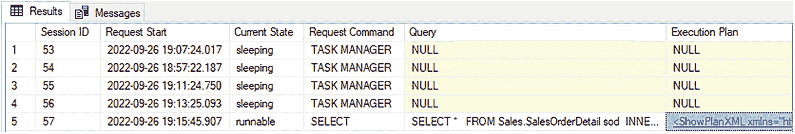

清单查询结果的截图。表格输出有 7 列和 5 行。最后一行中 select 查询的执行计划被高亮显示。

`图 2-7` `清单 2-2` 的结果

使用 `清单 2-2` 中的查询，我们立即看到会话 ID 64 正在执行一个 `SELECT` 查询，并且“查询”列显示了执行的完整语句。“执行计划”列以 XML 格式返回了执行计划。我们可以点击 XML 链接来查看图形化的执行计划，如 `图 2-8` 所示。

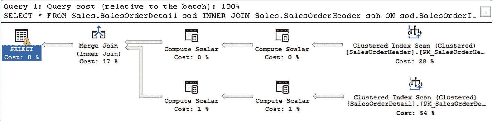

一个 select 查询执行计划的流程图。事件按以下顺序列出。聚集索引扫描，成本 28%和 54%。计算标量，成本 0%和 1%。合并，成本 17%。从右到左选择，成本 0%。

`图 2-8` 执行计划

利用执行计划，我们可以深入了解查询是如何被 SQL Server 引擎执行的。本书不会深入探讨执行计划的细节，但在优化查询性能时，你会频繁使用它们，因此了解如何从 `sys.dm_exec_requests` 动态管理视图访问它们是很重要的。

**技术说明**

执行查询时，SQL Server 引擎利用查询优化器来确定返回结果的最高效方式。查询优化器的输出称为查询执行计划，有时也称为查询计划或执行计划。我们将在本章后面简要讨论执行计划，但如果你想了解更多关于执行计划以及如何利用它们进行性能调优的细节，请查阅 Grant Fritchey 的系列书籍。

#### `sys.dm_exec_session_wait_stats`

与等待统计信息相关的动态管理视图中，较新的成员之一是 `sys.dm_exec_session_wait_stats` 动态管理视图。它在 SQL Server 2016 SP1 中引入，返回**每个会话级别**的等待统计信息。如果你还记得`第 1 章`“等待统计信息内部原理”中的内容，会话是用户或进程与 SQL Server 之间的一个活动连接。一个会话可以有多个请求，而这些请求又可以有多个任务来执行查询所需的操作。

`图 2-9` 展示了该动态管理视图的列，以及来自我测试系统的一些等待统计信息。

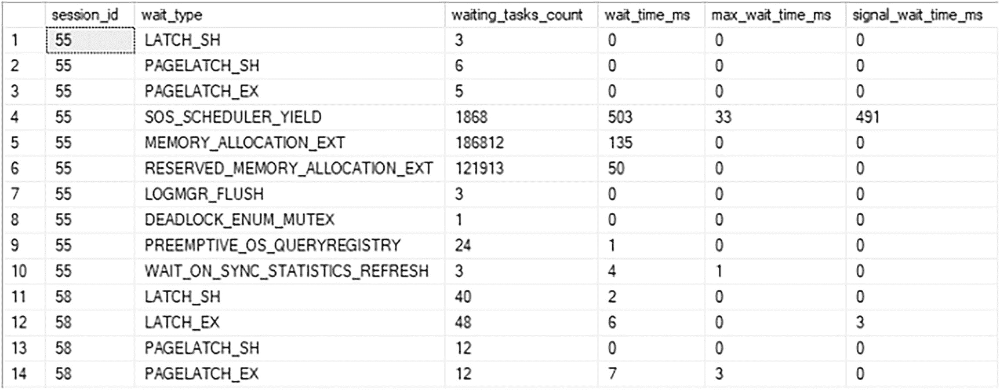

`sys.dm_exec_session_wait_stats` 查询输出的截图。表格输出有 7 列和 14 行。它列出了会话 ID、等待类型、任务和计时。

`图 2-9` `sys.dm_exec_session_wait_stats`

前面的图看起来眼熟吗？可能确实如此，因为它实际上与 `sys.dm_os_wait_stats` 动态管理视图几乎完全相同，只是多了一个 `session_id` 列。

但不仅仅多了一个列。通过 `sys.dm_exec_session_wait_stats` 记录的等待统计信息是**某个特定会话在处于活动状态期间所执行的所有请求的累计值**。例如，如果你在一个会话内执行了十个不同的查询，该动态管理视图返回的等待时间是这十个查询的总等待时间。这意味着理解会话生命周期内发生了什么非常重要。也许该会话执行了大批量的查询，或者只执行了一个查询语句。在使用此动态管理视图分析会话等待统计信息之前，了解其工作负载是很重要的。

此外，会话 ID 在会话关闭后会被重用，这意味着你会看到新会话和旧会话混合在一起的等待统计信息。当会话 ID 被重用（或在连接池中被重置）时，该动态管理视图中特定会话的等待统计信息也会被重置。

考虑到以上信息，我们得出结论：当报告性能缓慢时，此动态管理视图并不能直接作为“首先查看的地方”。不过，它仍然有其用武之地，特别是当你能用涉及多个查询的特定操作重现某个特定的性能问题时。在这种情况下，你可以聚焦于特定的会话 ID 并重现问题，捕获查询执行期间发生的所有事件的等待统计信息。


### 结合 DMV 检测当前发生的等待

我们已经回顾了用于等待统计分析的重要的 DMV；现在，让我们看一个如何使用 DMV 找出 SQL Server 变慢原因的示例。收集这些信息不会立即解决您的所有问题，但它将提供一个线索，指明从何处开始寻找解决方案。

**技术备注**
等待和队列调优方法的核心思想是资源消耗，其中资源包括物理资源（`CPU`、`内存`、`磁盘 I/O`、`网络`）以及逻辑资源（`锁定/阻塞`）。因此，这里的诀窍在于，当涉及到调优资源消耗时，您只有两个选择：`用得更少`或`买得更多`。一旦理解了这一点，它就能指导您针对性能问题可能采取的行动和解决方案。

考虑以下场景：您是一家大型公司的数据库管理员（DBA），该公司使用单个数据库存储所有销售信息。该数据库运行在一个 SQL Server 实例上，每天有几百名用户查询该数据库。

通常，一切运行良好——用户能快速访问他们想要的信息，所有需要使用数据库的人也很满意。然而，今天对您这位 DBA 来说可不是个好日子。从上午 10 点开始电话就响个不停，一些用户聚集在您的办公室门口，眼神里充满愤怒——查询和插入销售信息的速度慢得令人难以置信。

既然本书是关于等待统计的，让我们看看如何分析与场景中性能问题相关的等待统计信息。

我们知道 `sys.dm_os_wait_stats` DMV 显示的是累积的等待统计信息，因此对于此场景帮助不大。一个好得多的起点是 `sys.dm_os_waiting_tasks` DMV，因为它会向我们显示当前所有正在等待的任务。

我们针对 `sys.dm_os_waiting_tasks` DMV 运行以下查询：

```sql
SELECT *
FROM sys.dm_os_waiting_tasks
ORDER BY session_id DESC;
```

在查看结果时，我们看到许多用户会话都有等待任务，如图 2-10 所示。

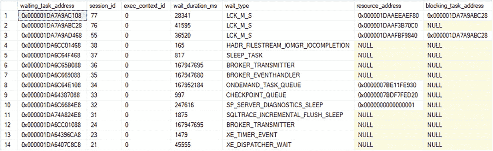

一个查询结果的截图。表格输出包含 8 列 14 行。最后 2 列的空值输出被阴影覆盖。

**图 2-10** 针对 `sys.dm_os_waiting_tasks` DMV 查询的结果

我们注意到会话 55、76 和 77 的等待时间似乎很高，并且我们还注意到它们都在以等待类型 `LCK_M_S` 等待。在不深入探讨这种特定等待类型的细节下（将在第 8 章“与锁定相关的等待类型”中详细讨论），知道此等待类型与锁定相关就足够了。会话 52、56 和 57 正在等待获取锁，并被另一个在相同对象上持有锁的进程所阻塞。我们可以通过查看 `blocking_columns` 从 `sys.dm_os_waiting_tasks` DMF 中提取锁定和阻塞信息。为了可读性，我修改了前面的查询，使其只从 `sys.dm_os_waiting_tasks` DMV 返回阻塞信息。图 2-11 显示了这些列。

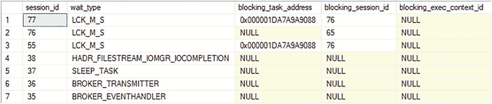

一个阻塞信息的截图。表格输出包含 6 列 7 行。它列出了会话 ID、等待类型和阻塞数据。

**图 2-11** 来自 `sys.dm_os_waiting_tasks` DMV 的阻塞信息

从我们这里看到的情况，会话 55 和 77 正在被会话 76 阻塞。然而，会话 76 却正在被会话 65 阻塞。我们在 `sys.dm_os_waiting_tasks` DMV 的返回结果中没有看到此会话 ID，这意味着该会话并未在等待任何资源。

让我们检查另一个 DMV，`sys.dm_exec_requests`，以获取关于会话 65 的信息：

```sql
SELECT *
FROM sys.dm_exec_requests
WHERE session_id = 65;
```

图 2-12 显示了此查询的结果。


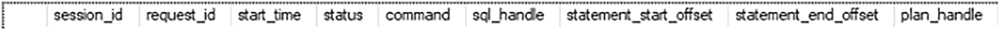

查询结果的屏幕截图。表格输出有 10 列和 0 行。其中一些列包括会话和请求 ID、开始时间、状态和命令。

图 2-12
对 `sys.dm_exec_requests` 的查询结果

还记得我写过 `sys.dm_exec_requests` DMV 返回当前正在处理的请求信息吗？显然，会话 65 没有未完成的请求，因为没有返回任何信息。

如果我们想找出关于这个会话的更多信息，可以使用第 1 章“等待统计内部原理”中讨论的 `sys.dm_exec_sessions` DMV，执行以下查询：

```sql
SELECT session_id,
status,
host_name,
program_name,
login_name,
is_user_process,
open_transaction_count
FROM sys.dm_exec_sessions
WHERE session_id = 65;
```

此查询返回的结果如图 2-13 所示。

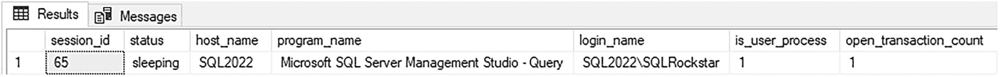

`sys.dm_exec_sessions` 结果的屏幕截图。表格有 8 列和 1 行。列出了会话 65 的信息。

图 2-13
`sys.dm_exec_sessions` 的结果

因此，我们假设会话 ID 65 没有正在运行的请求，因为其状态为“sleeping”，这就是为什么对 `sys.dm_exec_requests` 的查询没有返回任何信息。如果我们查看 `program_name` 列，可以看到这个会话是由 SQLRockstar 用户通过 Microsoft SQL Server Management Studio (SSMS) 程序发起的。

我包含了 `is_user_process` 列以确认这是一个用户会话，而 `open_transaction_count` 列显示这个用户会话有一个未关闭的事务。

我们现在掌握了足够的信息来采取纠正措施。我们知道是谁在阻塞其他任务，并决定给他们打电话询问他们正在运行（或没有运行）什么。然后我们可能会决定结束他们的会话。使用 `KILL [session_id]` 命令结束用户会话应该是最后的手段，因为我们可能正在中断某些重要的事情。使用 `KILL` 命令结束会话将导致正在运行的事务回滚，撤销其执行的所有更改，这可能需要很长时间才能完成。在这种情况下，我接受回滚的风险，并将自己结束该会话：

```sql
KILL 65;
```

在我们终止会话 65 之后，用户立即报告他们的查询再次运行。如果我们查询 `sys.dm_os_waiting_tasks` DMV，那些会话 ID 不再存在，意味着它们不再被阻塞。

> 极客笔记
>
> 这种问题在于锁定/阻塞，解决方案是终止特定用户会话的场景相当常见。不止一次，我作为生产数据库管理员在深夜被叫去解决性能问题，而根本原因是一个用户在意外的时间运行报告。能够快速诊断此类问题很有价值，但构建你的应用程序代码以避免此类问题则是无价的。

希望这个例子让你深入了解了如何使用 SQL Server 中可用的各种 DMV 来收集关于当前等待任务的信息。在这个例子中，示例包含一个阻塞其他查询的事务，我们决定终止造成阻塞锁的用户会话。在许多情况下，解决方案并非如此简单，但收集等待统计信息以深入探究问题根源的方法几乎可以用于每个与性能相关的事件。

正如我在本节开头提到的，仅仅查看等待统计本身在大多数情况下不会解决性能问题，但它是一个开始调查的良好起点。为了获得系统性能的完整图景，我们经常将等待统计信息与其他指标相结合，例如性能监视器、其他 DMV 或特定于供应商的信息（如存储指标）的信息。

图 2-14 展示了一个流程图，说明你如何使用等待统计信息来分析性能问题。

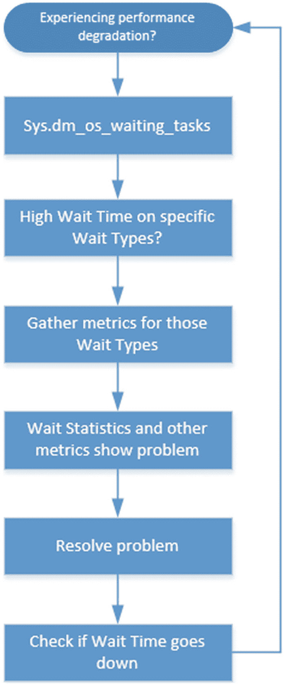

问题解决的循环流程图。如果性能下降，运行命令列出等待类型，收集指标，并解决问题。检查等待时间并重复该过程。

图 2-14
等待统计流程图

我们将在第 4 章“构建可靠基线”中扩展这个流程图，届时我们将基线引入等待统计分析方法。

## 使用 Perfmon 查看等待统计

分析等待统计所需获取额外指标的工具之一是性能监视器（Performance Monitor），或称 Perfmon。Perfmon 可在 Windows 操作系统中使用，包含操作系统相关的指标，包括与 SQL Server 相关的性能计数器。你可以通过从 Windows 运行对话框或命令行执行 `Perfmon` 命令来启动它。

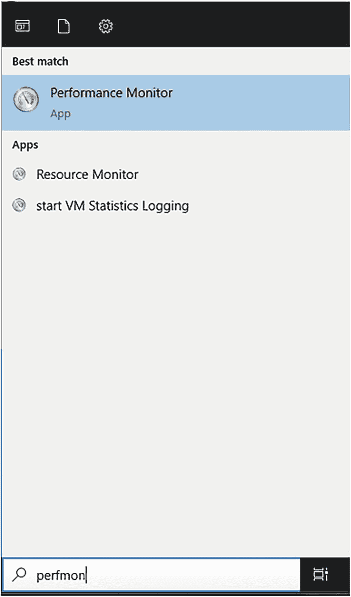

Perfmon 应用程序搜索过程的屏幕截图。底部的搜索栏中输入了 perfmon。屏幕将性能监视器应用列为最佳匹配并高亮显示。

图 2-15
从开始菜单执行 Perfmon

除了提供有关系统性能的信息外，Perfmon 也显示等待统计。这些计数器位于 `SQLServer:Wait Statistics` 类别下，如图 2-16 所示。

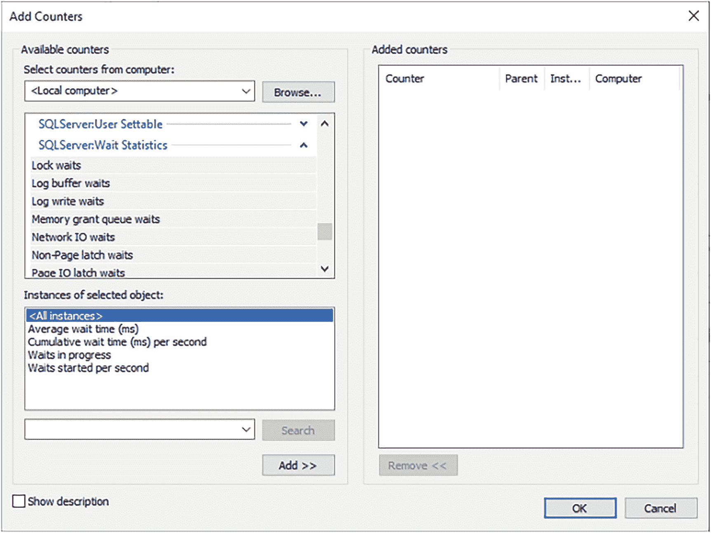

添加计数器部分的屏幕截图。可以从左侧的下拉菜单中选择计算机的计数器，添加的计数器在右侧。

图 2-16
Perfmon 内的等待统计计数器

在图 2-16 中你会注意到，Perfmon 中的等待统计按类别分组。我们在这里找不到关于特定等待类型的信息，因此如果我们想使用 Perfmon 分析等待统计，需要对特定等待类型在 Perfmon 中所属的类别有一个大致的了解。Perfmon 能够显示每个等待统计类别的平均等待时间、累计等待时间、当前总等待次数以及新启动的等待数量。如果我们对更高级别的视图感兴趣——例如，我们想知道有多少任务正在等待与锁相关的等待类型——我们可以使用 Perfmon 来获取该信息。如果我们想了解特定任务的特定等待类型的详细信息，我们会使用前面讨论过的 `sys.dm_os_wait_stats` 或 `sys.dm_os_waiting_tasks` DMV。

Perfmon 的一个很好的特性是它可以将测量结果直接转换为图形，为我们提供一种更直观的方式来查看信息，而无需自己创建图形。图 2-17 是一个图形示例，其中显示了“Lock waits”类别的“平均等待时间”和“每秒启动的等待次数”。

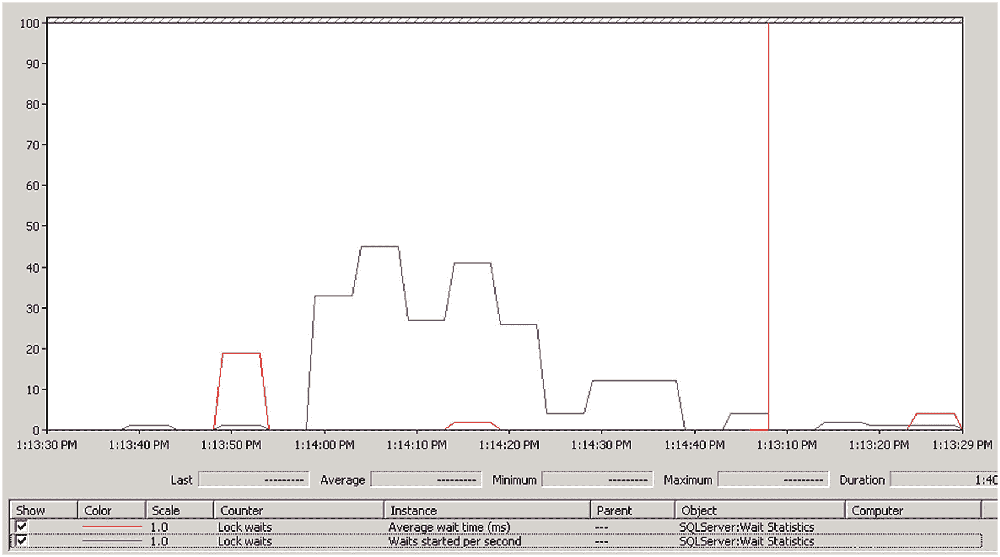

Perfmon 应用程序中图表的屏幕截图。图表有彩色线条及其比例、计数器、实例、父级和对象的信息。

图 2-17
显示等待统计信息的 Perfmon 图表

对于本书，我们将使用 Perfmon 来分析与特定等待类型相关的指标，例如 CPU 时间、磁盘延迟和内存使用情况。我们不会过多使用 Perfmon 内部的等待统计计数器，因为 SQL Server DMV 提供了完整分析所需的详细级别。


## 使用扩展事件捕获等待统计信息

SQL Server 中的大多数等待统计信息都是累计记录的，并且由于许多内部进程也会生成等待统计信息，因此很难检测单个查询的影响。借助扩展事件，可以捕获查询遇到的确切等待时间以及查询正在等待的等待类型。这些信息将帮助我们分析对系统影响最大的查询，从而优化查询性能，将其影响降至最低。或者，如果愿意，我们也可以捕获在执行时遇到特定等待类型的查询。

扩展事件在 SQL Server 2008 中引入，用于替代 SQL Server Profiler 中的非安全事件。扩展事件比 Profiler 具有更强的可扩展性，并且随着 SQL Server 每个版本的发布，扩展事件所包含的事件数量也在持续增长。

**技术笔记**

当 SQL Server 2008 引入扩展事件（用于非安全事件）和 SQL Server 审核（用于安全事件）时，人们认为 SQL Server Profiler 的消亡已为期不远。在撰写本文的 2022 年，Profiler 依然健在，并且永远不会消亡。#TeamProfiler

扩展事件向来以难以使用而闻名，这在 SQL Server 2008 中首次引入它们时尤为如此。从 SQL Server 2012 开始，首次可以使用 SSMS 创建扩展事件会话，这使得使用扩展事件变得容易得多。

使用扩展事件时，有许多不同的与等待相关的事件可用。我们可以通过查询 `sys.dm_xe_map_values` DMV 来查看这些事件，该 DMV 保存了所有不同扩展事件的事件类型：

```sql
SELECT *
FROM sys.dm_xe_map_values
WHERE name = 'wait_types';
```

图 2-18 显示了此查询结果的一小部分。

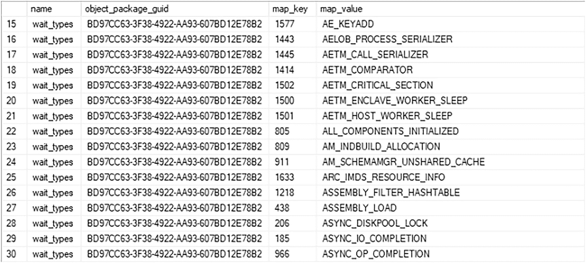

部分结果的屏幕截图。表格输出包含 5 列和 16 行。列名称包括名称、对象、映射键和映射值。

图 2-18

`sys.dm_xe_map_values` 的部分结果

在 SQL Server 2022 RC0 中，总共有大约 1500 个不同的等待统计信息相关事件可用。这些事件与不同的等待类型并非一一对应，在某些情况下，即使含义相同，等待类型的名称也可能与事件名称不匹配。例如，ASYNC_NETWORK_IO 等待类型在扩展事件中被命名为 NETWORK_IO。虽然本书不会深入探讨扩展事件的细节，但我会向您展示如何在 SSMS 中使用扩展事件以及直接使用 T-SQL 来捕获等待统计信息相关的信息。

### 为特定查询捕获等待统计信息

让我们看看如何为捕获特定查询的等待统计信息配置扩展事件会话。我们将在特定会话上设置筛选器，然后执行要分析的查询。

我们首先打开 SSMS 并连接到 SQL Server 实例（请注意，扩展事件是从 SQL Server 2012 开始的 SSMS 版本中添加的）。连接后，我们打开“管理”文件夹，然后选择“扩展事件”选项。我们右键单击“会话”文件夹并选择“新建会话”选项，如图 2-19 所示。

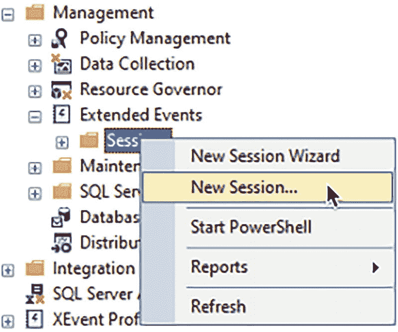

新建扩展事件会话的屏幕截图。管理文件夹展开后显示扩展事件选项，其中包含会话文件夹。该文件夹的菜单中突出显示了“新建会话”选项。

图 2-19

添加新的扩展事件会话

将出现“新建会话”对话框，我们在其中输入此扩展事件会话的名称并设置其他选项。我们现在将忽略这些选项，只需填写扩展事件会话的名称，如图 2-20 所示（注意顶部的错误消息；在添加要捕获的事件之前，这是预期的。）

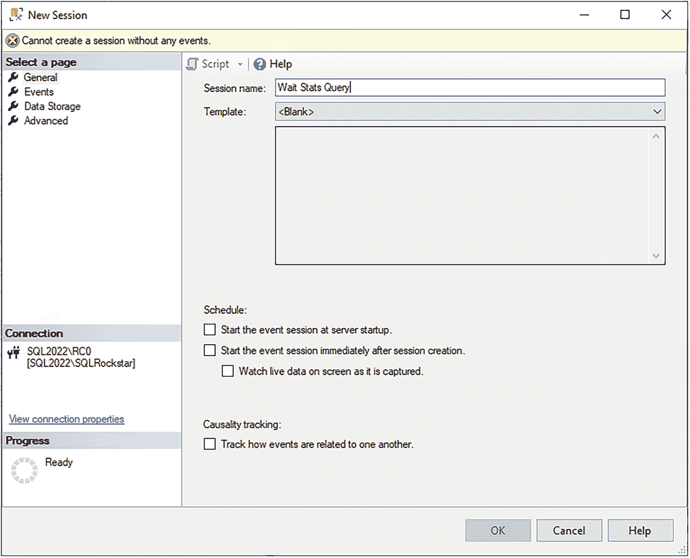

新建会话对话框的屏幕截图。顶部文本显示“没有任何事件则无法创建会话”。左侧面板有一个用于选择页面的菜单，包括“常规”、“事件”、“数据存储”和“高级”。

图 2-20

配置等待统计信息扩展事件会话

下一步是配置此扩展事件会话将监视的事件，我们通过选择“新建会话”对话框中的“事件”选项卡（图 2-21 中的标注号 1）来完成。

由于我们对等待统计信息感兴趣，我在“事件库”中搜索了 `wait_info` 事件（图 2-21 中的标注号 2）并将其添加到“选定的事件”框中（图 2-21 中的标注号 3），如下所示：

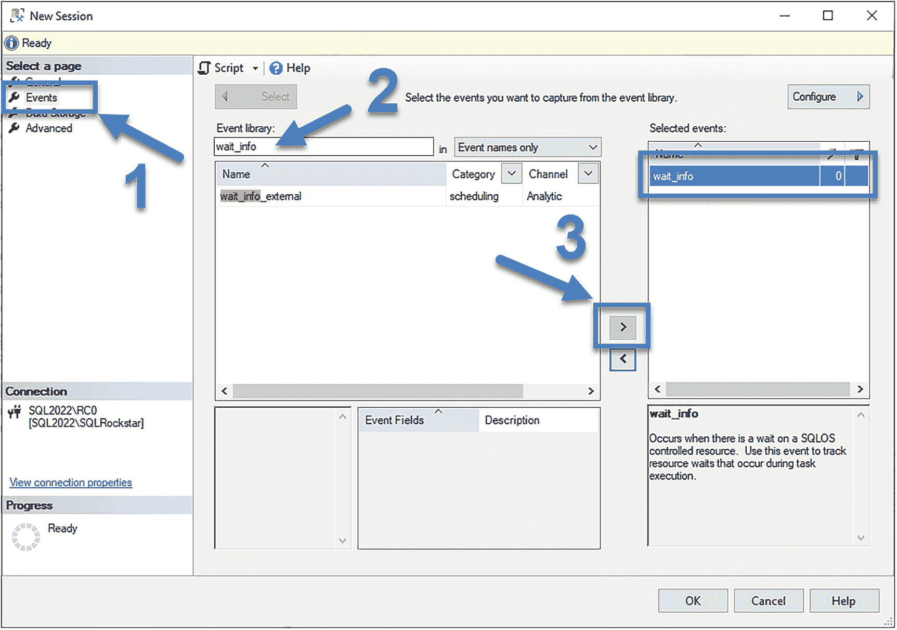

事件选择过程的屏幕截图。步骤如下：1. 从左菜单中选择事件。2. 在事件库中输入 wait_info。3. 选定的事件在右侧。

图 2-21

选择要监视的事件

由于我们对特定查询相关的等待统计信息感兴趣，我们配置一个筛选器，仅返回特定会话的等待统计信息。为此，我们单击“新建会话”对话框中的“配置”按钮，该按钮打开一个新部分，我们在其中选择“全局字段”，这些字段将在触发 `wait_info` 事件时记录额外信息。在这种情况下，我勾选了 `sql_text` 全局字段，如图 2-22 所示，这样当捕获事件时，我们将看到实际的查询。

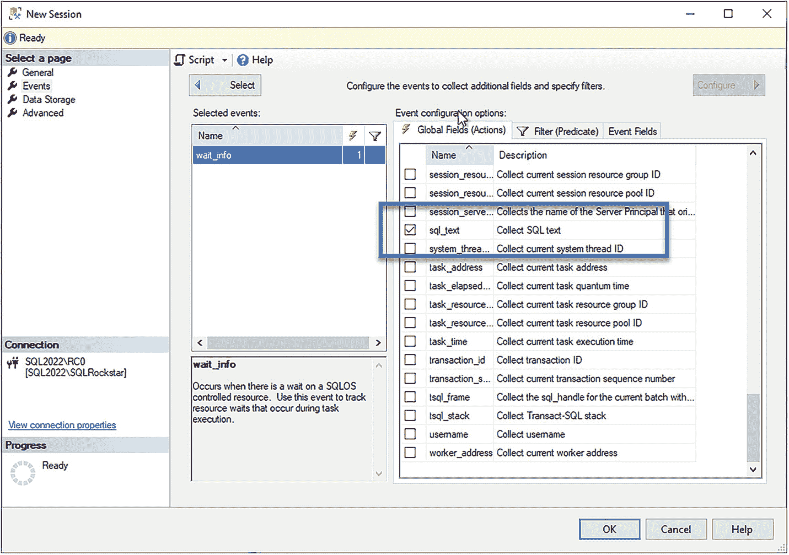

所选事件的事件配置选项屏幕截图。事件 wait_info 在右侧打开一个全局字段列。名称 S Q L_text 被选中。

图 2-22

设置 `sql_text` 全局字段

接下来是“筛选器（谓词）”选项卡。在这里，我们设置筛选器以仅捕获来自特定会话 ID 的事件。我们通过单击“字段”框内部并选择 `sqlserver.session_id` 字段，然后将“值”设置为我们要监视的会话 ID 来实现。在这种情况下，我配置了筛选器以仅捕获会话 ID 为 76 的事件，如图 2-23 所示。

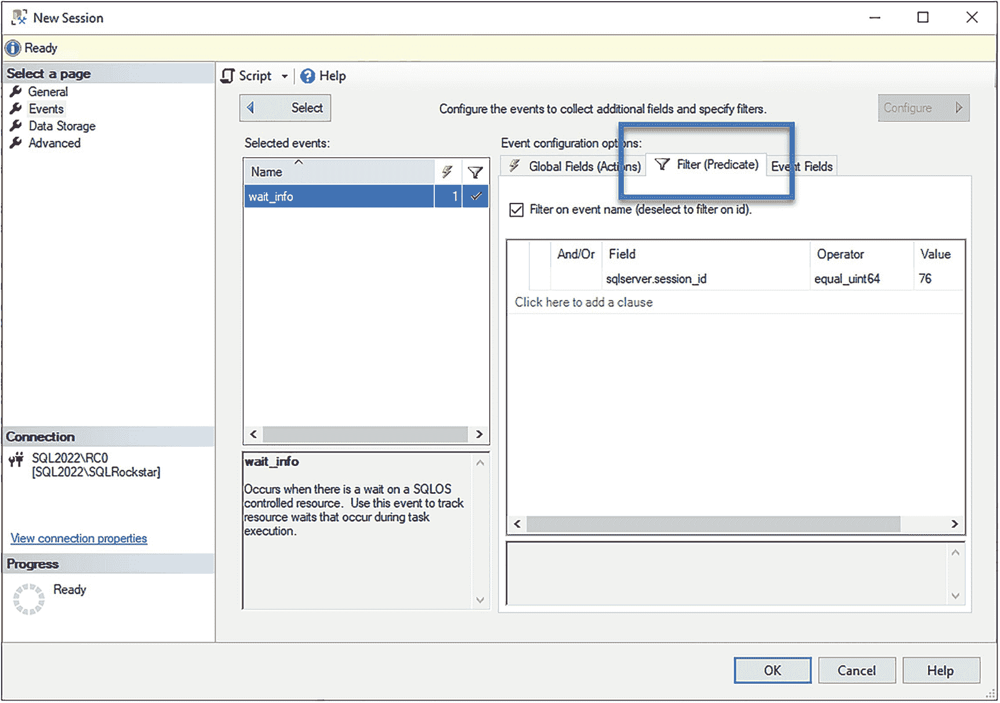

所选事件的筛选器选项屏幕截图。选定的事件位于中心，右侧的筛选器选项提供字段、运算符和值信息。

图 2-23


### 设置事件过滤器

目前这就是我们需要配置的全部内容，因此我们单击“确定”关闭此对话框并保存 `Extended Event` 会话。

默认情况下，这个新建的 `Extended Event` 会话在创建后不会自动启动。要启动会话，我们必须再次打开 `Sessions` 文件夹，方法是在 `SQL Server Management Studio` 中导航到 `Management` ➤ `Extended Events` 文件夹。我们右键单击刚刚创建的 `Extended Event` 会话，然后选择 `Start Session` 选项，如图 2-24 所示。

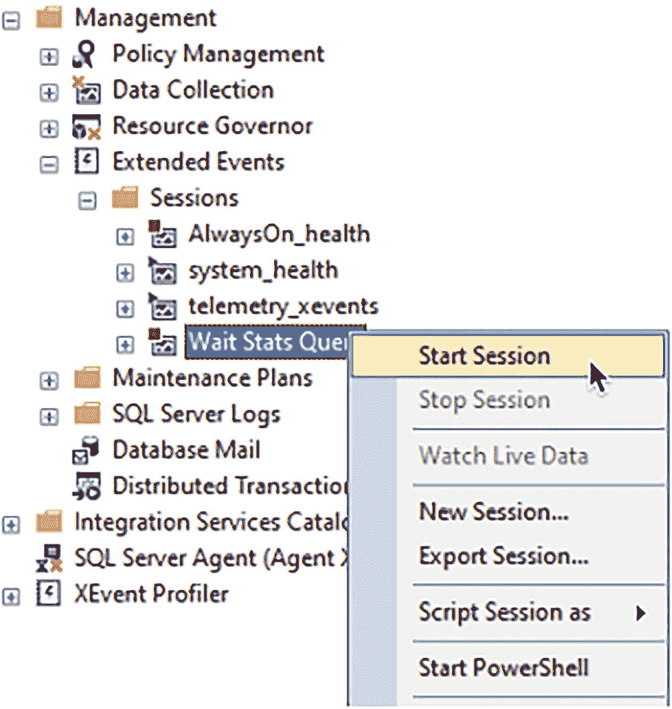

启动会话选择路径的屏幕截图。Management 文件夹打开 Extended Event，其中包含 Session 文件夹。该文件夹中的“等待统计”菜单高亮显示了“启动会话”选项。

图 2-24
启动 `Extended Event` 会话

启动 `Extended Event` 会话后，它将开始收集信息。我们通过选择 `Watch Live Data` 选项来查看此信息。这将在 `SQL Server Management Studio` 中打开一个新选项卡，我们可以在其中监视 `Extended Event` 会话。如果您担心查看实时数据的开销，可以选择将 `Extended Event` 会话写入事件文件，方法是在 `Extended Event` 会话的 `Data Storage` 页面中添加文件位置。

对于此示例，我对 `GalacticWorks` 数据库执行了一个简单的查询，以返回 `Person.Person` 表中的所有内容，如下所示：

```sql
SELECT *
FROM Person.Person;
```

在设置 `Extended Event` 会话中的过滤器时，我非常注意使其与我在 `SQL Server Management Studio` 中执行查询的选项卡的 `session ID` 相匹配。`session ID` 可以通过查看选项卡上括号内的数字找到。`Extended Events Live Data` 选项卡返回了如图 2-25 所示的信息。

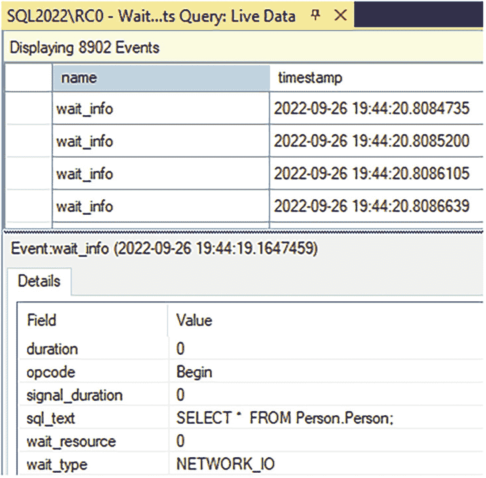

实时数据窗口的屏幕截图。上部区域显示事件，底部区域提供所选事件的信息。

图 2-25
来自 `Extended Event` 会话的实时等待统计信息

如图 2-25 所示，我们的请求遇到了 `NETWORK_IO` 等待类型。这是 `Extended Events` 中的等待名称与等待统计 DMV 中的名称不匹配的一个例子。`NETWORK_IO` 等待名称与 `SQLOS` 使用的 `ASYNC_NETWORK_IO` 等待类型相同。我们可以在 `sql_text` 字段中查看我们执行的查询。

在 `Extended Event` 会话中，还有许多其他可以包含的全局字段可能值得捕获，例如 `Execution Plan` 句柄或 `Task Execution Time`。全局字段将在返回 `Extended Event` 会话信息时提供额外的详细信息，为您提供大量详尽的细节。

如果出于某种原因，您不想使用 `SSMS` 来创建和运行 `Extended Event` 会话，或者您正在运行 `SQL Server 2008`，则可以使用 `T-SQL` 来创建和配置一个。要使用 `T-SQL` 创建与上面相同的 `Extended Event` 会话，请执行清单 2-3 中的查询。

```sql
CREATE EVENT SESSION [WaitStats Query] ON SERVER
ADD EVENT sqlos.wait_info
(
ACTION(sqlserver.sql_text)
WHERE ([sqlserver].[session_id]=(76))
)
ADD TARGET package0.event_file
(
SET filename = N'E:\Data\WaitStats_XE.xel', metadatafile = N'E:\Data\WaitStats_XE.xem'
);
```
清单 2-3
创建等待统计 `Extended Event` 会话

#### 极客笔记

我们在前面的脚本中通过设置 `metadatafile` 参数包含了元数据文件。如果您运行的是 `SQL Server 2012` 或更高版本，则不再需要此参数。

记录 `Extended Event` 会话的最简单方法是将其保存到文件；在本例中，我的文件名是 `E:\Data\WaitStats_XE.xel`（`SQL Server` 会向文件名添加唯一的数字标识符；在本例中，实际文件名是 `WaitStats_XE_0_132969501905230000.xel`）。我还包含了对 `session ID` `76` 的过滤器，以捕获该会话生成的等待统计信息。

接下来我们要做的是启动 `Extended Event` 会话，我们通过执行 `ALTER EVENT SESSION` 命令来完成：

```sql
ALTER EVENT SESSION "WaitStats Query" ON SERVER STATE = start;
```

然后，我们在我们正在过滤的会话下执行与原始示例中相同的查询。让 `Extended Event` 会话运行一小段时间后，我们可以使用 `ALTER EVENT SESSION` 命令停止它：

```sql
ALTER EVENT SESSION "WaitStats Query" ON SERVER STATE = stop;
```

停止 `Extended Event` 会话后，我们接下来将文件中的信息（作为 `XML`）导入到一个表中，以查看会话捕获的内容；我们使用 `sys.fn_xe_file_target_read_file` 函数来完成此操作。然后，我们解析 `XML` 信息，以更可读的格式返回结果。清单 2-4 中的查询可用于读取 `Extended Event` 文件，将其导入临时表，并将结果作为行返回。

```sql
-- Check if temp table is present
-- Drop if exist
IF OBJECT_ID('tempdb..#XE_Data') IS NOT NULL
DROP TABLE #XE_Data
-- Create temp table to hold raw XE data
CREATE TABLE #XE_Data
(
XE_Data XML
);
GO
-- Write contents of the XE file
-- into our table
INSERT INTO #XE_Data
(
XE_Data
)
SELECT  CAST (event_data AS XML)
FROM sys.fn_xe_file_target_read_file
(
'E:\Data\WaitStats_XE_0_132969501905230000.xel',   'E:\Data\WaitStats_XE_0_132969501905230000.xem',   null,   null   );
GO
-- Query information from our temp table
SELECT
XE_Data.value ('(/event/@timestamp)[1]', 'DATETIME') AS 'Date/Time',
XE_Data.value ('(/event/data[@name="opcode"]/text)[1]', 'VARCHAR(100)') AS 'Operation',
XE_Data.value ('(/event/data[@name="wait_type"]/text)[1]',
'VARCHAR(100)') AS 'Wait Type',
XE_Data.value ('(/event/data[@name="duration"]/value)[1]', 'BIGINT') AS 'Wait Time',
XE_Data.value ('(/event/data[@name="signal_duration"]/value)[1]',
'BIGINT') AS 'Signal Wait Time',
XE_Data.value ('(/event/action[@name="sql_text"]/value)[1]', 'VARCHAR(100)') AS 'Query'
FROM #XE_Data
ORDER BY 'Date/Time' ASC;
```
清单 2-4
将扩展事件文件作为行返回

清单 2-4 中的查询结果如图 2-26 所示。

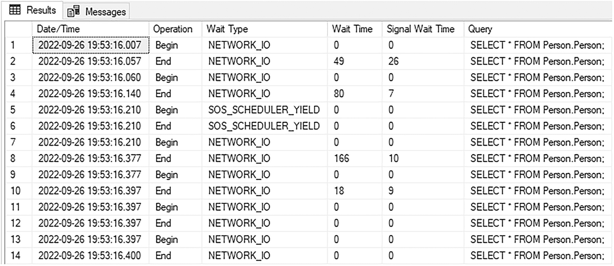

扩展事件文件查询输出的屏幕截图。表格输出有 7 列和 14 行。这些列列出了日期和时间、操作、等待类型、等待时间、信号等待时间和查询。

图 2-26
清单 2-4 中查询的结果

大多数列根据它们返回的行数据就不言自明。有两列值得额外解释：`Operation` 列和 `Wait Time` 列。`Operation` 列将向您显示等待事件的开始或结束。`Wait Time` 列将以毫秒为单位返回等待时间，但它只会在操作结束时被记录。


## 通过执行计划按查询分析等待统计信息

到目前为止，我们已经查看了由各种后台进程或我们自己执行的查询所产生的聚合等待时间。由于我是唯一在测试机器上执行查询的人，因此很容易将等待时间与特定查询关联起来。不幸的是，在繁忙的系统中，许多会话并发地不断执行各种查询，各类等待统计信息 DMV 很难用于分析特定查询的等待类型和等待时间。

值得庆幸的是，SQL Server 2016 SP1 的发布引入了在查询执行计划内部捕获的等待统计信息。这使得任何人都能看到查询在运行时遇到的等待类型和等待时间。尽管这看起来显而易见，但这也意味着，只有在查看**实际执行计划**而非**估计执行计划**时，才能获得按查询统计的等待信息。

### 技术说明

实际执行计划是查询执行期间实际使用的执行计划。SSMS 中有一个选项可以查看估计执行计划。使用该选项时，SQL Server 引擎会编译在查询执行期间*最可能被使用*的执行计划；但是，它并不实际执行查询本身。由于没有查询执行，因此在编译估计执行计划时也没有等待统计信息可供记录。

公开按查询统计的等待信息最简单的方法是启用 `包含实际执行计划` 选项（如图 2-27 所示），可通过点击 “查询 – 包含实际执行计划” 菜单项或使用快捷键组合 `CTRL_M` 来实现，然后再执行您的查询。

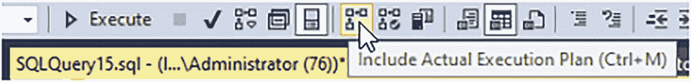

执行菜单栏的截图。光标指向已高亮显示的“包含实际执行计划”图标。

图 2-27
包含实际执行计划选项

当您启用了 `包含实际执行计划` 选项来执行查询时，查询结果会返回一个名为 `执行计划` 的额外选项卡。点击该选项卡将显示执行查询时所用执行计划的可视化表示。图 2-28 展示了一个实际执行计划的示例。

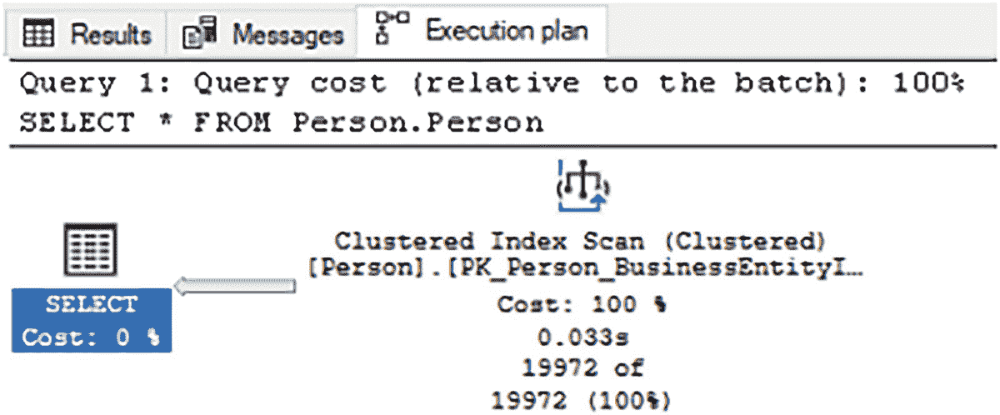

“执行计划”选项卡的截图。所选查询的执行路径如下：从右到左，聚簇索引扫描成本占 100% 指向 SELECT 操作成本占 0%。

图 2-28
执行计划

打开 `执行计划` 选项卡后，我们可以通过右键单击第一个运算符（在图 2-29 的例子中是 `SELECT` 运算符）并选择 `属性` 来访问按查询统计的等待信息。这将在 SSMS 中打开执行计划属性窗口，并揭示大量信息，例如查询执行时使用的并行度或处理的行数，以及我们所选运算符的各种属性。

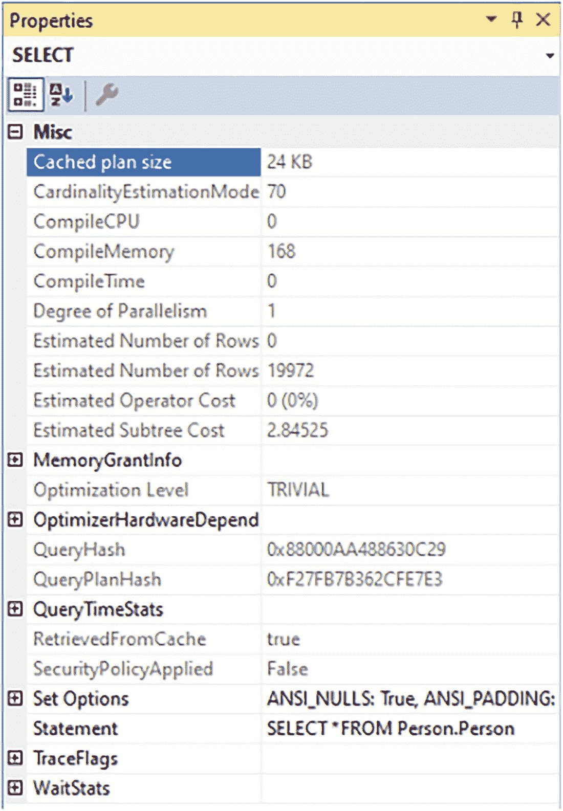

属性对话框的截图。在“杂项”部分中，“缓存的计划大小”被选中。

图 2-29
执行计划属性

`WaitStats` 属性位于属性窗口的底部。展开 `WaitStats` 属性后，您将找到此特定查询在执行过程中经历的所有等待类型和等待时间。图 2-30 显示了此特定示例查询的按查询统计的等待信息。

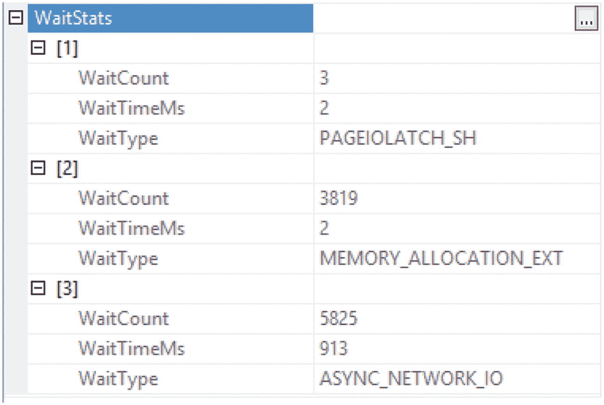

等待统计信息窗口的截图。它有 2 列，列出了 3 种等待类型的等待计数和等待时间。

图 2-30
执行计划属性中的按查询统计等待信息

在本例中，我们的查询在执行时遇到了三种不同的等待类型：`PAGEIOLATCH_SH`、`MEMORY_ALLOCATION_EXT` 和 `ASYNC_NETWORK_IO`。对于每种等待类型，我们都能看到花费了多少等待时间以及等待该类型的次数。此信息在查看单个查询在执行期间遇到的等待统计信息时非常有用，并且或许能为调整查询性能提供思路。例如，如果您看到查询经常遇到与存储相关的等待统计信息，那么研究如何最小化该特定查询的存储访问以使其执行更快可能是值得的。

我想再次指出的一点是，按查询统计的等待信息只记录在实际执行计划中。我再次提及的原因是，实际执行计划只能通过**在查询执行前启用该选项**来获得。没有其他方法可以访问实际执行计划，即使通过查询存储也不行，我们将在下一章看到。事实上，存储在 SQL Server 计划缓存中的执行计划是估计执行计划，而不是实际计划。这意味着，如果您期望通过计划缓存检索按查询统计的等待信息，您将会失望。

值得庆幸的是，尽管查询存储功能不记录实际执行计划，但它（随着 SQL Server 2017 的发布）确实会记录等待统计信息和其他查询运行时信息，并与估计执行计划一同存储。将这些信息混合在一起意味着，通过查询存储，我们可以回溯历史，查看查询遇到了哪些等待统计信息！

### 本章小结

在本章中，我们回顾了访问等待统计信息的多种方法。我们深入探讨了关于等待统计信息的一些最重要的 DMV —— `sys.dm_os_wait_stats`、`sys.dm_os_waiting_tasks`、`sys.dm_exec_requests` 和 `sys.dm_exec_session_wait_stats` —— 描述了它们的功能和返回的数据，并为您提供了一些可用于查询这些 DMV 的示例。我们还经历了一个示例场景，其中我们组合使用了部分 DMV 来分析示例中是什么拖慢了 SQL Server。示例中展示的步骤是在性能问题发生时分析系统问题的绝佳方法。简要地，我们查看了性能监视器（Perfmon），以及如何从其内部获取等待统计信息。之后，我们仔细研究了扩展事件，以及如何使用扩展事件 GUI 或 T-SQL 来捕获特定查询或会话的等待相关信息。最后，我们探讨了执行计划中记录的等待统计信息。

## 3. 查询存储

随着 SQL Server 2016 的发布，微软引入了一种分析和排查查询性能的新方法：查询存储。查询存储通常被称为 SQL Server 的“飞行记录仪”，因为它提供了查询何时执行、执行性能如何以及执行期间使用的执行计划等方面的洞察。虽然查询存储最初并未公开等待统计信息，但 SQL Server 2017 的发布包含了这一备受期待的补充功能。

由于查询存储在查询性能分析和调优方面极具价值，我认为为了最大化此功能的效益，值得对其给予一些额外的关注。


### 什么是查询存储？

查询存储（Query Store）功能最早在 SQL Server 2016 中发布，其目标是以一种可访问的方式公开并持久化查询性能信息。在查询存储出现之前，查询性能分析是一项具有挑战性且耗时的过程，需要对 SQL Server 如何处理查询以及如何通过各种 DMV（动态管理视图）分析信息有透彻的了解。虽然查询执行的经验和知识仍然有帮助，但查询存储能帮助你保留必要的性能信息，而无需自己开发解决方案。

查询存储直接集成在 SQL Server 引擎内部，在查询执行时捕获并分析它们。这是与通过其他方法（如执行计划缓存挖掘）进行查询分析的一个主要区别，后者只能在后期阶段获取查询运行时信息。查询存储的另一个优势是它将查询运行时信息持久化到磁盘。这允许你查看查询运行时指标的历史记录，以及比较历史和当前的运行时统计数据。这与 DMV 不同，后者只在 SQL Server 运行期间记录信息，并在 SQL Server 重启时清除所有已记录的信息，这意味着所有计数器又从 0 开始。继续比较查询存储与 DMV，虽然所有 DMV 都在 SQL Server 实例级别记录信息，但查询存储允许你基于每个数据库来捕获查询运行时指标。这使得分析包含多个数据库的实例中特定数据库的性能变得相当容易和快捷。

### 启用查询存储

在 SQL Server 2022 中，新数据库默认启用查询存储（处于 `READ_WRITE` 模式）（新的 Azure SQL 数据库也默认启用）。对于更早版本的 SQL Server，用户必须手动启用查询存储才能开始收集查询执行信息。启用查询存储可以通过两种方式完成：使用 SQL Server Management Studio（`SSMS`）和使用 T-SQL 语句。

#### 使用 SSMS 启用查询存储

由于查询存储是在每个数据库级别配置的，要启用查询存储，你需要导航到 `SSMS` 中的一个数据库，右键单击并选择 `属性`，如图 3-1 所示：

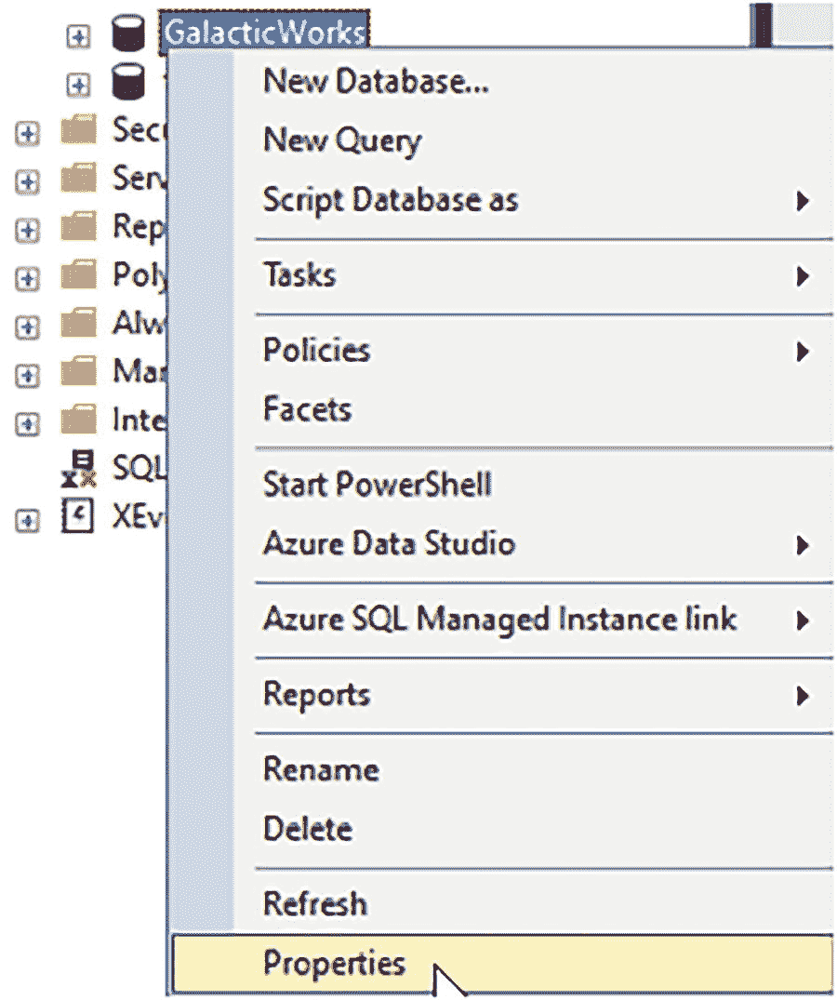

一个 Galactic Works 下的菜单截图，其中选择了属性选项。

图 3-1

在 `SSMS` 中选择数据库属性

选择后，将打开“数据库属性”屏幕，从那里你将在左侧选择 `查询存储` 选项卡（在图 3-2 中显示为数字 1）。选项卡打开后，你将选择 `操作模式（请求）` 选项，并选择 `读写`，如图 3-2 中的数字 2 所示：

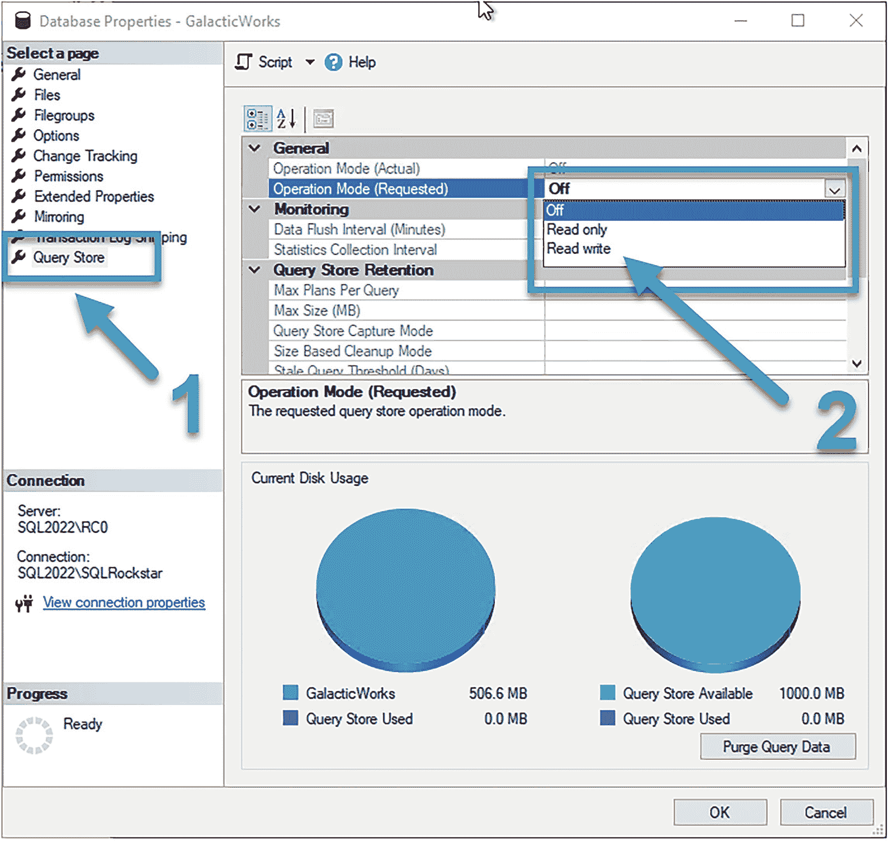

一个数据库属性 Galactic Works 窗口。它列出了一个菜单，其中查询存储选项卡被高亮显示，常规下的操作模式被更改为关闭。它有 2 个数据使用圈。

图 3-2

将查询存储设置为 `读写`

选择 `确定`，查询存储将开始收集数据库内查询执行的信息。对于 SQL Server 2022，收集此数据的默认最大大小为 1024 MB。如果达到限制，查询存储将更改为 `只读` 并停止收集新数据。你需要定期监控查询存储中使用的空间。

#### 使用 T-SQL 启用查询存储

使用 T-SQL 启用查询存储可以通过清单 3-1 中所示的代码完成：

```
ALTER DATABASE GalacticWorks
SET QUERY_STORE = ON (OPERATION_MODE = READ_WRITE);
清单 3-1
使用 T-SQL 启用查询存储
```

执行该语句，查询存储将开始收集数据库内查询执行的信息。

查询存储提供了许多优势以及配置选项。由于这是一本关于等待统计信息的书，我不会涵盖查询存储提供的所有内容。有关查询存储更深入的细节，你可以在此处查看：[`slrwnds.com/bdsxgt`](https://slrwnds.com/bdsxgt)。

### 查询存储架构

为了了解查询存储如何工作，图 3-3 中的图像显示了查询运行时信息被记录并存储在查询存储内部。如果你想将查询存储作为分析查询性能和等待统计信息的工具，这些知识很重要。

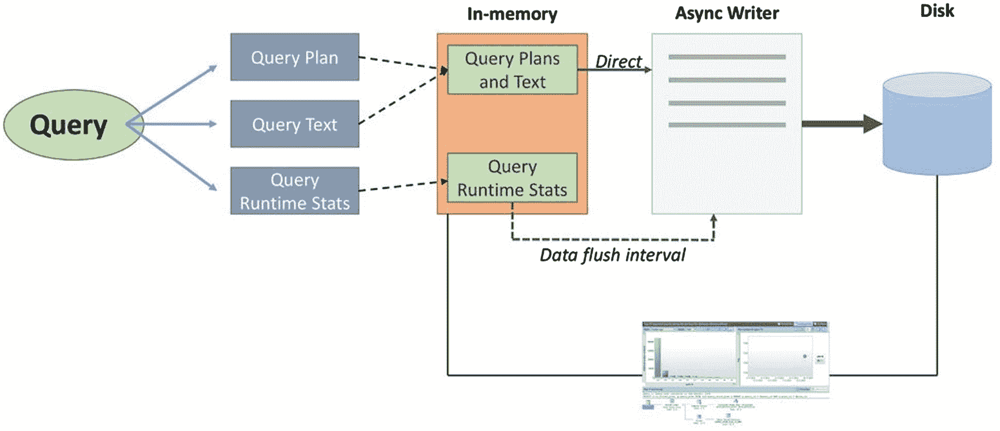

一个流程定义，说明查询如何拆分为计划、文本和运行时，并通过内存中和异步写入器到达磁盘，以及它们的读数。

图 3-3

查询存储架构

查询一开始执行，查询存储就将查询运行时信息分成三个部分：查询执行计划、查询文本和查询执行的运行时统计信息。执行计划和查询文本都在编译执行计划期间立即记录到查询存储中。运行时统计信息（包括等待统计信息）在查询执行完成后添加到查询存储中。

所有查询存储指标首先存储在 SQL Server 的保留内存区域中。这意味着这些指标可以通过查询或内置报告直接访问，但尚未固化到磁盘（一个例外是新的执行计划；这些会直接固化）。基于查询存储中一个名为 `数据刷新间隔` 的可配置设置，你可以配置查询存储将信息固化到磁盘的速度。

我们通过两种方法访问查询存储中的所有信息：查询存储 DMV 和内置查询存储报告。为了公开查询存储中的等待统计信息，我们将使用这两种选项，尽管在查看等待统计数据时 DMV 方法更有用。


### 查询存储中如何处理等待统计信息

在开始访问查询存储中记录的等待统计信息之前，我们将先研究查询存储如何处理等待统计信息，因为这与本书第 1 章“等待统计信息内部原理”中描述的过程不同。第 1 章描述了 SQL Server 引擎跟踪查询在特定资源（即等待类型）上等待了多长时间。此信息是在细粒度级别记录的；例如，`PAGEIOLATCH_SH` 等待类型表示查询正在等待将数据页从磁盘读取到缓冲区缓存中，而 `PAGEIOLATCH_EX` 表示查询正在等待将数据页移动到缓冲区缓存中进行修改。查询存储不是在详细级别记录等待时间，而是使用更高级别的等待类型概览，以最大程度地减少性能和资源利用率开销。查询存储将各种等待类型分组到类别中，并在类别级别记录等待时间，而不是在单个等待类型级别。

这意味着无法在查询存储中搜索特定的等待类型，并且属于同一类别的等待类型之间无法区分。举个例子，`CMEMTHREAD` 和 `RESOURCE_SEMAPHORE` 等待类型（你将在第 6 章“I/O 相关等待类型”中了解更多）在查询存储中都被记录在 `Memory` 类别下，尽管这两种等待类型指示不同的情况。

表 3-1 显示了查询存储中使用的等待类型与等待类别之间的映射关系。此表绝非映射关系的完整概览，但应能让你很好地了解特定等待类型的归属。

表 3-1

等待类型与类别之间的映射

| 等待类别 | 关联的等待类型 |
| --- | --- |
| `Unknown` | `Unknown` |
| `CPU` | `SOS_SCHEDULER_YIELD` |
| `Worker thread` | `THREADPOOL` |
| `Lock` | `LCK_M_%` |
| `Latch` | `LATCH_%` |
| `Buffer latch` | `PAGELATCH_%` |
| `Buffer IO` | `PAGEIOLATCH_%` |
| `Compilation` | `RESOURCE_SEMAPHIRE_QUERY_COMPILE` |
| `SQL CLR` | `CLR%`, `SQLCLR%` |
| `Mirroring` | `DBMIRROR%` |
| `Transaction` | `XACT%`, `DTC%`, `TRAN_MARKLATCH_%`, `MSQL_XACT_%`, `TRANSACTION_MUTEX` |
| `Idle` | `SLEEP_%`, `LAZYWRITER_SLEEP`, `SQLTRACE_BUFFER_FLUSH`, `SQLTRACE_INCREMENTAL_FLUSH_SLEEP`, `SQLTRACE_WAIT_ENTRIES`, `FT_IFTS_SCHEDULER_IDLE_WAIT`, `XE_DISPATCHER_WAIT`, `REQUEST_FOR_DEADLOCK_SEARCH`, `LOGMGR_QUEUE`, `ONDEMAND_TASK_QUEUE`, `CHECKPOINT_QUEUE`, `XE_TIMER_EVENT` |
| `Preemptive` | `PREEMPTIVE_%` |
| `Service broker` | `BROKER_%` (但不包括 `BROKER_RECEIVE_WAITFOR`) |
| `Tran Log IO` | `LOGMGR`, `LOGBUFFER`, `LOGMGR_RESERVE_APPEND`, `LOGMGR_FLUSH`, `LOGMGR_PMM_LOG`, `CHKPT`, `WRITELOG` |
| `Network IO` | `ASYNC_NETWORK_IO`, `NET_WAITFOR_PACKET`, `PROXY_NETWORK_IO`, `EXTERNAL_SCRIPT_NETWORK_IOF` |
| `Parallelism` | `CXPACKET`, `EXCHANGE`, `HT%`, `BMP%`, `BP%` |
| `Memory` | `RESOURCE_SEMAPHORE`, `CMEMTHREAD`, `CMEMPARTITIONED`, `EE_PMOLOCK`, `MEMORY_ALLOCATION_EXT`, `RESERVED_MEMORY_ALLOCATION_EXT`, `MEMORY_GRANT_UPDATE` |
| `User wait` | `WAITFOR`, `WAIT_FOR_RESULTS`, `BROKER_RECEIVE_WAITFOR` |
| `Tracing` | `TRACEWRITE`, `SQLTRACE_LOCK`, `SQLTRACE_FILE_BUFFER`, `SQLTRACE_FILE_WRITE_IO_COMPLETION`, `SQLTRACE_FILE_READ_IO_COMPLETION`, `SQLTRACE_PENDING_BUFFER_WRITERS`, `SQLTRACE_SHUTDOWN`, `QUERY_TRACEOUT`, `TRACE_EVTNOTIFF` |
| `Full text search` | `FT_RESTART_CRAWL`, `FULLTEXT GATHERER`, `MSSEARCH`, `FT_METADATA_MUTEX`, `FT_IFTSHC_MUTEX`, `FT_IFTSISM_MUTEX`, `FT_IFTS_RWLOCK`, `FT_COMPROWSET_RWLOCK`, `FT_MASTER_MERGE`, `FT_PROPERTYLIST_CACHE`, `FT_MASTER_MERGE_COORDINATOR`, `PWAIT_RESOURCE_SEMAPHIRE_FT_PARALLEL_QUERY_SYNC` |
| `Other disk IO` | `ASYNC_IO_COMPLETION`, `IO_COMPLETION`, `BACKUPIO`, `WRITE_COMPLETION`, `IO_QUEUE_LIMIT`, `IO_RETRY` |
| `Replication` | `SE_REPL_%`, `REPL_%`, `HADR_%` (但不包括 `HADR_THROTTLE_LOG_RATE_GOVERNOR`), `PWAIT_HADR_%`, `REPLICA_WRITES`, `FCB_REPLICA_WRITE`, `FCB_REPLICA_READ`, `PWAIT_HADRSIM` |
| `Log rate governor` | `LOG_RATE_GOVERNOR`, `POOL_LOG_RATE_GOVERNOR`, `HADR_THROTTLE_LOG_RATE_GOVERNOR`, `INSTANCE_LOG_RATE_GOVERNOR` |

### 通过查询存储报告访问等待统计信息

#### 查看内置报告

查看查询存储中可用等待统计信息最用户友好的方式，是在数据库上启用查询存储功能后，使用 SSMS 中提供的内置报告。`图 3-4` 显示了截至本书撰写时可用的默认内置查询存储报告。

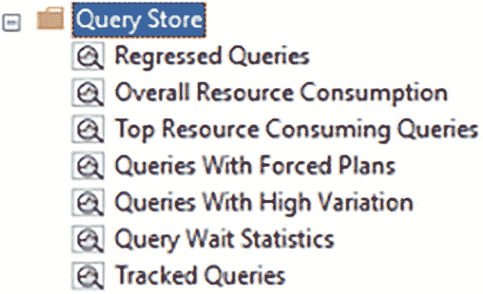

查询存储文件夹下的列表截图。其中包括：性能下降的查询、总体资源消耗、资源消耗最高的查询、具有强制计划的查询。

图 3-4

查询存储报告

如 `图 3-4` 所示，有一个专门的等待统计信息报告，即 `query wait statistics`。你可以通过双击或右键单击并选择名称 `query wait statistics` 来查看此报告。报告将打开，其外观类似于 `图 3-5`。

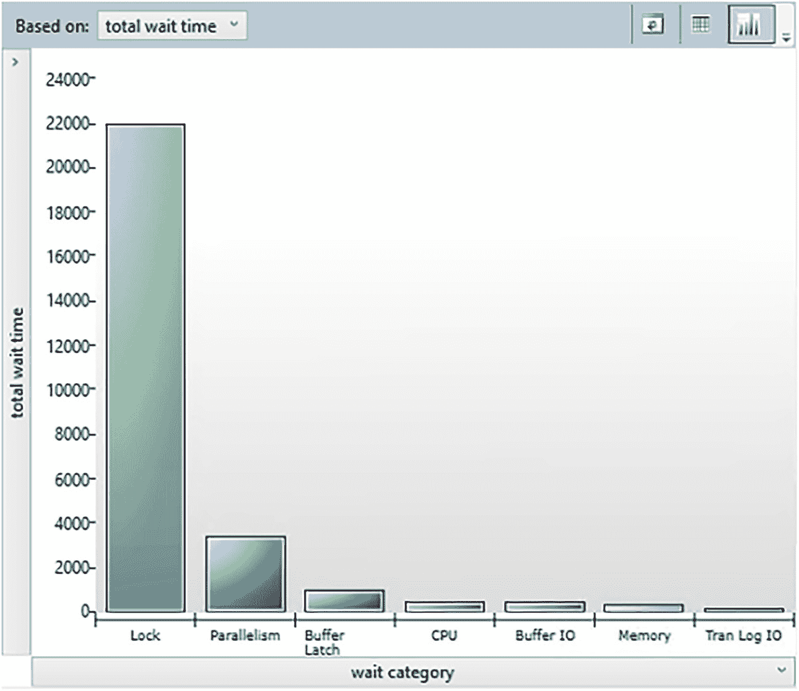

一个窗口的截图，标签为：总等待时间。它显示了一个总等待时间与等待类别的柱状图。锁的等待时间较高，约为 22000。数据为近似值。

图 3-5

查询等待统计信息报告

请注意，等待是按我们之前讨论的类别组织的。这里，大部分等待属于查询存储的 `Lock` 类别，它将所有 `LCK_M_%` 等待事件归为一组。

#### 在其他报告中显示等待类别

除了此报告，我们还可以通过在以下三个报告中特别选择 `等待时间 (ms)` 指标，来查看查询遇到的等待类别：

*   性能下降的查询
*   资源消耗最高的查询
*   波动性大的查询

要在上述任何报告中查看等待类别，你首先需要将指标配置为 `等待时间 (ms)`，如 `图 3-6` 所示。

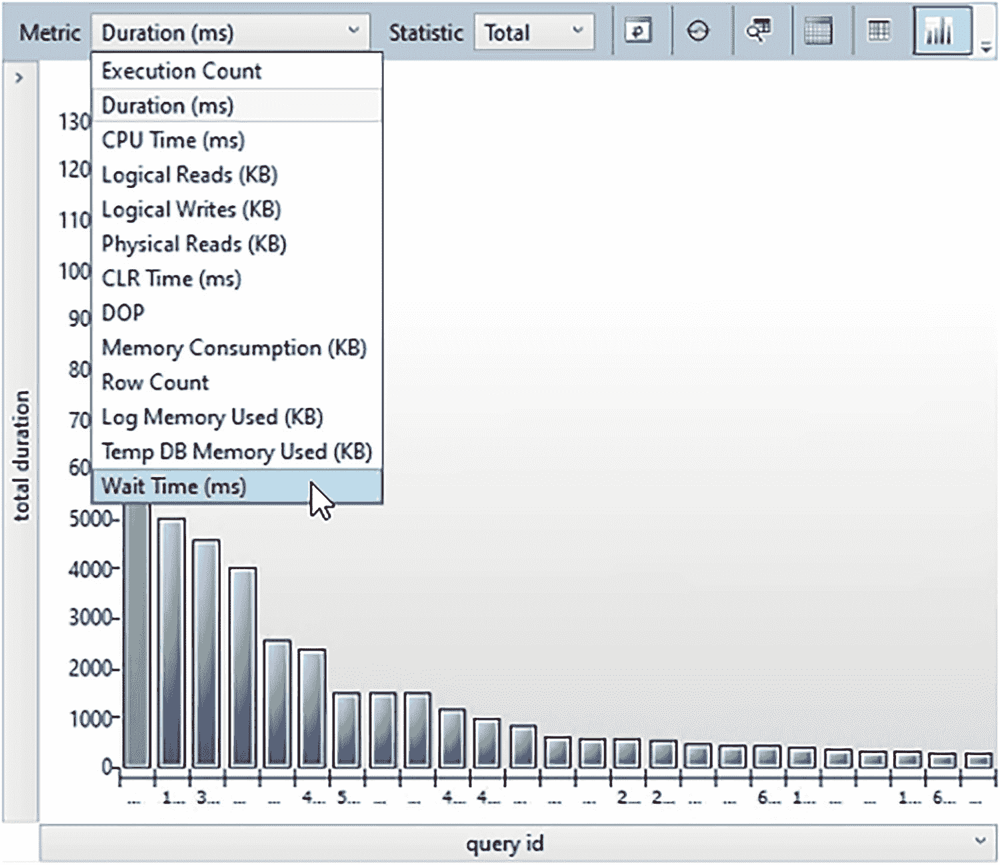

一个窗口的截图，标签为：指标：持续时间。它显示了一个总持续时间与查询 ID 的柱状图。其上覆盖着一个指标下的列表，其中选择了“等待时间”。

图 3-6

将指标配置为“等待时间 (ms)”

这会将图表更改为（默认）返回按总等待时间排序的前 25 个查询。

更改指标后，我们将鼠标悬停在图表中显示的任何列上，以检索等待类别信息，如 `图 3-7` 所示。

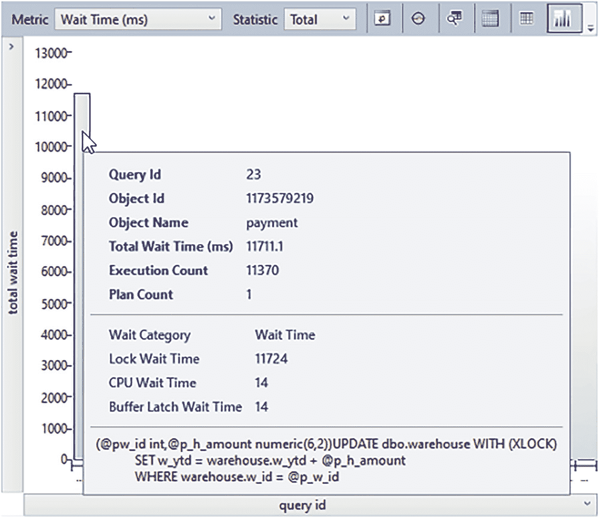

一个窗口的截图，标签为：指标：等待时间。它显示了一个总等待时间与查询 ID 的柱状图。其上覆盖着一个在柱条 1 上的图表，列出了查询 ID 的详细信息。

图 3-7

查询存储中显示的等待类别

从 `图 3-7` 可以看出，此特定查询遇到了 `Lock`、`CPU` 和 `Buffer Latch` 等待类别。我们看到了每个类别的等待时间以及所有类别的总等待时间，但如前所述，我们无法了解查询遇到的确切等待类型。


### 通过查询存储 DMV 访问等待统计信息

虽然内置的查询存储报告在可视化识别具有高等待时间的查询方面无疑很有帮助，但使用 `sys.query_store_wait_stats` DMV 可以获取更多信息。此 DMV 返回的列显示了与特定执行计划 ID 的等待类型或等待类别相关的各种统计信息。

**极客备注**

查询存储为其查询、执行计划和运行时时间间隔使用了自己独特的标识符。考虑到这一点，你可以通过查询存储查找 `Query ID` 来标识查询，或通过搜索 `plan ID` 来标识执行计划。

图 3-8 显示了为每个执行计划 ID 记录的不同统计信息，按不同的等待类别进行了划分。

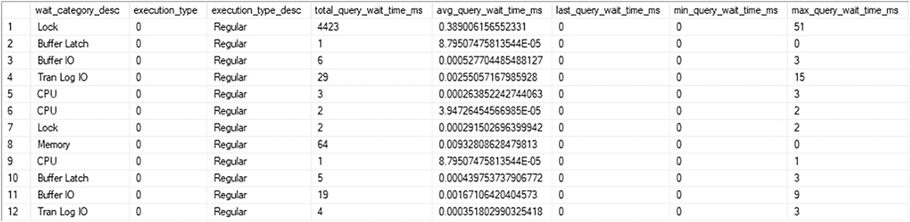

一个包含 12 行 9 列的表格。它列出了锁、缓冲区闩锁、缓冲区 I/O、事务日志 I/O、C P U、C P U、锁、内存、C P U、缓冲区闩锁、缓冲区 I/O 和事务日志 I O 等等待类别。

**图 3-8**

`sys.query_store_wait_stats` 内的等待类别统计信息

当我们查询 `sys.query_store_wait_stats` DMV 并查看每个或特定执行计划 ID 的各种统计信息时，将各种查询存储 DMV 连接在一起会获得更多信息。

例如，以下查询连接了多个查询存储 DMV，以返回遭遇高总等待时间的查询概览。

```sql
SELECT qsws.plan_id,
qsq.query_id,
qsws.runtime_stats_interval_id,
qsqt.query_sql_text,
qsws.wait_category_desc,
qsws.total_query_wait_time_ms
FROM sys.query_store_wait_stats qsws
INNER JOIN sys.query_store_plan qsp
ON qsws.plan_id = qsp.plan_id
INNER JOIN sys.query_store_query qsq
ON qsp.query_id = qsq.query_id
INNER JOIN sys.query_store_query_text qsqt
ON qsq.query_text_id = qsqt.query_text_id
ORDER BY qsws.total_query_wait_time_ms DESC;
```

**代码清单 3-2**
使用查询存储 DMV

此查询的结果见图 3-9。

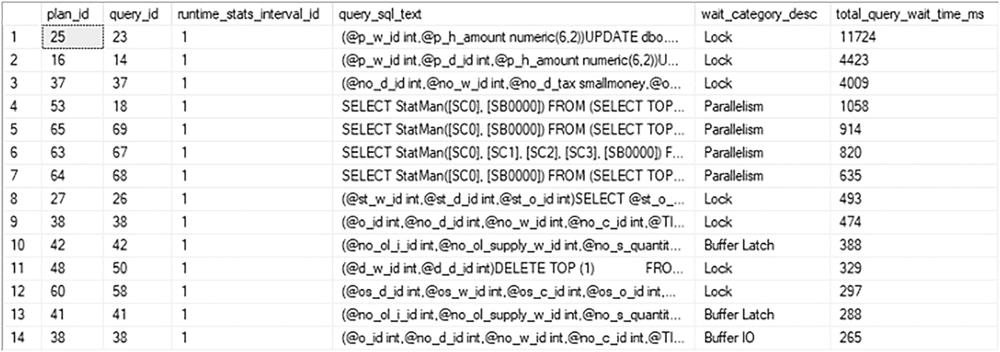

一个包含 14 行 7 列的表格。它列出了计划 i d、查询 i d、运行时统计信息间隔 i d、查询 s q l 文本、等待类别 d e s c 和总查询等待时间 m s。

**图 3-9**

来自查询存储的等待统计信息

通过修改查询，按 `Query ID` 进行筛选，我们可以专注于特定查询并分析其等待行为。以下是修改后的查询，你会看到我还添加了一些返回各种有用统计信息的额外列。

```sql
SELECT qsws.plan_id,
qsq.query_id,
qsws.runtime_stats_interval_id,
qsqt.query_sql_text,
qsws.wait_category_desc,
qsws.total_query_wait_time_ms,
qsws.avg_query_wait_time_ms,
qsws.last_query_wait_time_ms
FROM sys.query_store_wait_stats qsws
INNER JOIN sys.query_store_plan qsp
ON qsws.plan_id = qsp.plan_id
INNER JOIN sys.query_store_query qsq
ON qsp.query_id = qsq.query_id
INNER JOIN sys.query_store_query_text qsqt
ON qsq.query_text_id = qsqt.query_text_id
WHERE qsq.query_id = 8
ORDER BY runtime_stats_interval_id ASC;
```

在查询和查询结果中，有一个名为 `runtime_stats_interval_id` 的列。查询存储对运行时（和等待时间）指标进行分组的方式是基于时间间隔进行聚合。默认情况下，这些间隔是一小时的时间块，这意味着前面示例中为特定查询返回的等待统计信息是该间隔内一次或多次查询执行的聚合结果。虽然你可以通过设置查询存储属性中的 `Statistics Collection Interval` 来将间隔降低到更小的时间段，但这将对 SQL Server 实例的性能产生负面影响，因此在更改此设置时要小心。

我只展示了几个如何从查询存储内部检索等待统计信息相关指标的示例。凭借查询存储收集的所有信息，还有海量的其他信息可以与等待统计信息指标相结合。例如，按特定等待类别筛选，或检测生成不同执行计划的查询以及其对特定查询等待的影响。我建议所有使用 SQL Server 2016 或更高版本的用户启用查询存储，并探索它收集的指标。

**极客备注**

虽然查询存储仅在 SQL Server 2016 及更高版本中可用，但 William Durkin（Twitter 账号 @sql_williamd）和 Enrico van de Laar（@evdlaar）发布了一个名为 open Query Store 的项目，该项目为低于 2016 版本的 SQL Server 模拟查询存储数据收集。该项目完全开源且免费，可通过其 GitHub 页面 `https://slrwnds.com/n4mudf` 获取。

#### 总结

在本章中，我们探讨了 SQL Server 2016 中引入的一项新的查询性能和分析功能：查询存储。我们了解了查询存储的底层工作原理，以及如何访问查询存储内置报告中的查询等待统计信息。

最后，我们研究了如何使用新的查询存储 DMV 来访问查询存储等待统计信息，并展示了一些示例查询，以帮助你开始使用查询存储。


## 4. 构建稳固的基准线

在第 2 章“查询 SQL Server 等待统计信息”中，我们花了大量时间描述和使用各种访问 `等待统计` 信息的方法。这些方法大多侧重于利用这些信息来检测当前的性能问题。虽然使用这些实时方法可以找到性能问题的确切原因，但这需要深入了解各种 `等待类型`，并且——最重要的是——对你特定的 SQL Server 系统的性能有经验。

如果你管理一个 SQL Server 实例，你会很快熟悉它在不同情况下的反应方式。但如果你管理数百个 SQL Server 实例，要熟悉它们的所有性能表现几乎是不可能的。由于 SQL Server `等待统计` 很大程度上取决于特定 SQL Server 实例的工作负载，没有两个 SQL Server 实例会针对相同的 `等待类型` 有相同的 `等待时间`。这使得检测潜在问题变得困难，因为我们不能简单地说“嘿，`CXPACKET` `等待类型` 有 20,000 毫秒的 `等待时间`，所以我们出问题了。”这完全取决于你的系统配置和工作负载。一个 SQL Server 实例每分钟可能有 20,000 毫秒（20 秒）花在 `CXPACKET` `等待类型` 上，却没有任何性能问题；而另一个实例只有 1,000 毫秒的 `等待时间`，用户却持续抱怨性能不佳。

如果我们想对 `等待统计` 或任何 `性能相关数据` 进行深入分析，我们需要一种收集 `性能相关指标` 并赋予其意义的方法。仅仅检测到 10,000 毫秒的等待资源没有任何意义，因为我们不知道它是否导致了性能问题。是的，也许你的用户正在抱怨性能糟糕，同时你注意到了这 10,000 毫秒的 `等待`，但无法确定这个 `等待` 是否明确导致了用户遇到的特定性能问题。有人可能会猜测，并简单地假设特定的资源 `等待` 就是性能问题的根源。作为一名前生产环境 DBA，我可以告诉你，DBA 不喜欢猜测是什么拖慢了我们的数据库服务器。我们想要确定性能问题的来源。这就是 `基准线` 能发挥作用的地方。

`基准线` 通过提供系统正常状态的定义，帮助赋予 `性能指标` 意义。没有 `基准线`，我们无从知晓系统或应用程序是运行在最佳状态还是极其缓慢。`基准线` 非常重要；事实上，它们如此重要，以至于我决定在本书中用一整章来讨论它们。没有稳固的 `基准线`，你的测量结果毫无意义！尽管本书侧重于 `等待统计`，但 `基准线` 对于你可以在系统上捕获的每一个 `性能相关指标` 都很有用，为你提供了一种宝贵的性能分析方法。

如果你阅读了上一章关于 `查询存储` 的内容，你可能会认为 `查询存储` 可以处理你所有的 `基准线`。虽然 `查询存储` 对于捕获和监控单个数据库内的查询性能很有用，但它并不提供整个 SQL Server 实例的性能概览。我个人认为 `查询存储` 是捕获和监控 `基准线` 常规流程的一个补充，而非替代。

### 什么是基准线？

如果我们查阅牛津词典中的“`基准线`”，会看到以下定义：“用于比较的最低点或起点。”这句话使用了关键词“起点”和“比较”，完美地抓住了 `基准线` 的本质。`基准线` 是起点，或者在我们的情况下，是用于与后续测量结果进行比较的度量值。理想情况下，我们在正常或标准情况下捕获 `基准线` 测量值。如果我们在以后的某个时间点再次执行相同的测量，就会将测量结果与 `基准线` 进行比较。如果在比较中我们的测量结果不同，则说明可能发生了变化。

即使你在分析性能时不使用 `基准线` 比较，无论你是否意识到，你仍然在使用 `基准线`。例如，如果你每月第一天收到工资，这是你正常的情况，或者在本章的语境下，是你的 `基准线`。如果由于某种原因，你在每月第一天没有收到工资，你会注意到与 `基准线` 的偏差。这可能成为调查你为何没有按时收到工资的原因。也许发薪日从 1 号改到了 5 号，或者在最坏的情况下，你工作的公司无法再支付你的工资。在任何一种情况下，我们都可以采取行动：要么接受变化，并由此创建一个新的 `基准线`；要么将情况恢复回 `基准线` 状态。图 4-1 展示了这个过程。

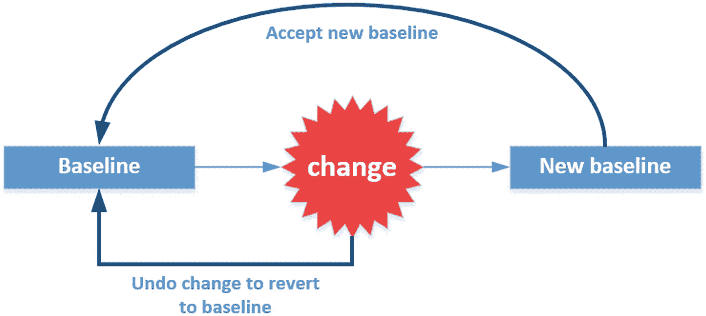

*一个流程图连接了 `基准线`、`变更` 和 `新基准线`，指向接受 `新基准线` 或撤销 `变更` 以恢复至 `基准线`。*

*图 4-1 变更影响 `基准线`*

定义和维护 `基准线` 是一个迭代过程。发生在你系统上的每一次 `变更` 都可能影响你的 `基准线`。应用程序的新版本可能会改变许多查询，或者你的公司可能授予新部门访问数据库的权限，从而增加了连接数。在这两个例子中，我们都会对 `基准线` 进行调整，因为正常情况已经发生了变化。

所有这些随着系统每次 `变更` 而调整和测量 `基准线` 的工作听起来很繁重，有时确实如此。但请相信我——拥有 `基准线` 的好处远远超过成本。`基准线` 帮助你比仅仅查看单次测量结果更快地发现问题，而在 `等待统计` 的情况下，它是找到你问题可靠、明确答案的唯一途径。让我们使用一个更技术性的例子，通过 DBA 简来说明这一点。

简维护着一个托管单一用户数据库的 SQL Server 实例。该数据库供公司每一位销售人员使用，记录公司与客户之间的每一笔财务交易。用户通过 `应用程序 X` 访问数据库。`应用程序 X` 运行的是 2.4 版本，非常稳定。性能良好，用户满意，资金持续流入。一切都很顺利，直到有一天一位顾问走进来，希望将 `应用程序 X` 升级到全新的 3.0 版本。升级到 3.0 版本轻而易举，没有出现任何问题，所有用户都喜欢新功能。

两天后电话响了。简的经理刚刚收到销售团队的消息，说 3.0 版本的性能非常糟糕，并要求立即解决。


所幸，Jane 知道基线的重要性，并在升级到 3.0 版本之前创建了一个。使用 2.4 版本的基线，Jane 将基线中的测量值与 3.0 版本中进行的测量值进行比较，并立即发现了 `锁等待时间` 测量值的巨大差异。由于其他测量值与 2.4 基线相比大致保持不变，Jane 将注意力集中在长时间运行的锁上，并识别出一个正在锁表的更新查询。Jane 回滚了该查询，情况恢复正常。随后，Jane 联系了应用程序供应商，并了解到此行为是软件中的一个错误导致的。

现在这个例子听起来可能有点牵强，但它是我几乎每天用来衡量变更影响或分析性能问题的方法的简化版本。如果没有 `锁等待时间` 的基线，Jane 就不会知道等待时间已经增加，因为 Jane 没有可比较的对象。Jane 可能会选择查看其他指标而不是 `锁等待时间`，从而浪费宝贵的时间和金钱。

这里的道理很简单：基线将帮助你更快地检测异常情况并解决性能问题！

### 可视化你的基线

基线经常通过图表进行可视化。图表使得更容易检测到与你的基线相比增幅或降幅最大的测量值。此外，可视化数据有助于清晰地传达你的观点，以证明特定配置是否影响了性能，例如，当你需要说服存储管理员存储配置的变更已经影响了性能时。如果你递给他们一张显示正常行为与变更后行为对比的图表，他们可能会更愿意提供帮助。图 4-2 中的图表显示了基线测量值与之后进行的测量值的对比。

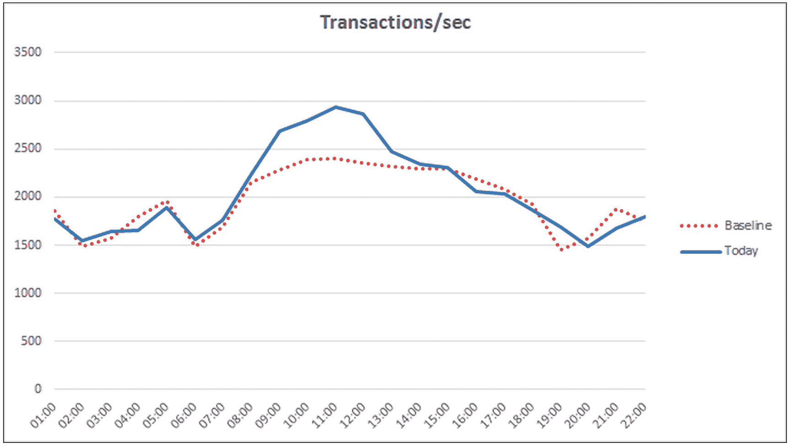

一个每秒事务数的图表，有两条波动的曲线。基线的曲线起始于 1800，下降到 1750，而“今天”的曲线起始和结束几乎都在 1750。数值为近似值。

**图 4-2** 基线图表示例

如图 4-2 所示，你能够快速识别潜在问题。显然，在 08:00 到 12:00 之间，每秒事务数高于正常情况，这可能值得花时间进行调查。

### 基线类型与统计

我们根据收集的信息使用不同类型的基线。没有一种基线能满足我们所有的需求，尤其是在将基线用于性能故障排查目的时。例如，我们可以为每种等待类型创建一个基线，或者我们选择只为对系统影响最大的等待类型创建基线。我们也可以选择为特定日期或时间段（如工作时间）创建基线，并为非工作时间创建另一个基线。

在选择了想要创建基线的指标之后，我们接下来要决定如何计算基线。这些选择涉及一些数学计算，通常需要计算聚合值，如平均值。在许多情况下，基线由许多数据点的平均值组成，这取决于在每个时间范围内执行了多少次测量。如果你长时间收集测量值并根据这些测量值计算平均值，你创建的基线将比仅基于一天测量值的基线更可靠。但是，基于平均值创建基线也有缺点，因为平均值受偏斜数据的影响很大。在不深入探讨统计细节的情况下，偏斜数据意味着非常高或非常低的值会影响你的平均值。以一组学生和考试成绩为例。我们通过计算考试的平均成绩来评估小组的表现（学生评分在 1 到 10 之间，1 表示很差，10 表示优秀；考试需要达到 6 分或以上才算通过）。图 4-3 在图表中显示了考试结果。

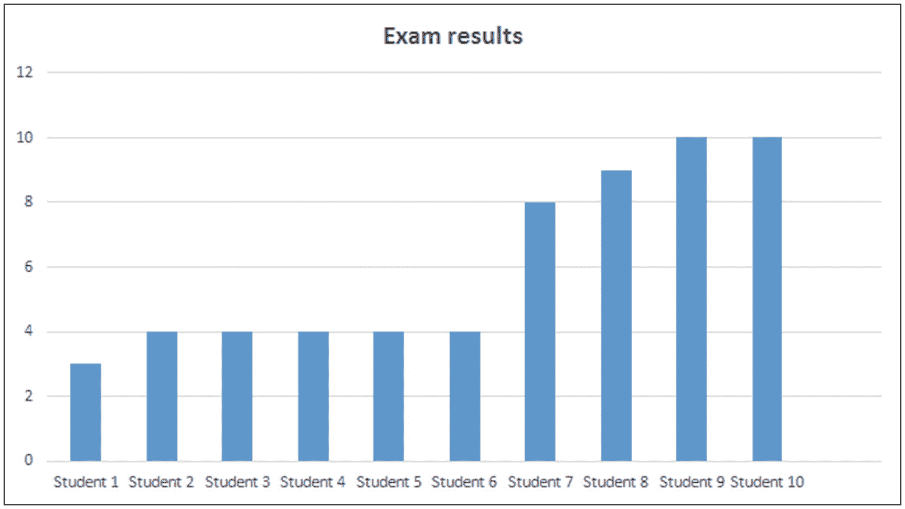

一个考试成绩的条形图，有学生 1 到 10 的条形。最高值是 10，对应学生 9 和 10。最低值是 3，对应学生 1。

**图 4-3** 考试成绩

如图 4-3 所示，只有四名学生的成绩高于通过考试所需的 6 分。小组中的其余成员成绩未达到要求。然而，如果我们看小组的平均表现，他们得了 6 分。我们可能会得出结论，小组的平均成绩为 6 分，表现足够好，但那样我们就会忽略只有十分之四的学生通过考试这一事实。在使用平均基线时，记住这一点很重要。如果你看到平均基线出现激增，这总是值得你调查的事情，因为它影响了你的基线。

有可用的统计方法来处理偏斜数据和平均值，其中一种是截尾（或截断）均值。这种方法移除序列中最高和最低测量值的 x 百分比，从而创建一个更稳定的平均值。回顾所有可用的统计方法超出了本书的范围。只需注意数据是如何收集的，是否使用了平均值，以及是否存在可能导致偏斜的异常值。

### 基线陷阱

希望上一节已经让你相信基线的重要性，但在你开始捕获每一个性能指标并将其转换为基线测量值之前，有一些陷阱需要避免。

#### 信息过载

尽管你可以自由地为环境中的每一个可能的指标创建基线，但这通常被认为是个坏主意。收集过多信息可能会在你寻找答案时蒙蔽你的双眼。每次发生性能问题时，将 100,000 个不同的指标与基线进行比较是巨大的时间浪费。这里的建议是保持指标数量较少，只包括对系统最重要的性能指标。例如，你可以包括与可用性组相关的性能指标，但如果你的系统不使用此功能，包含它们就没有用处。

#### 了解你的指标

选择性能指标的另一个重要方面是理解性能指标代表什么。没有这些知识，很难得出正确的结论。例如，如果你看到一个名为 `Locks` 的指标，你应该知道这个指标代表的是 `锁` 的总数还是每秒的 `锁` 数。

#### 关注测量值的重大变化

当将测量值与基线进行比较时，寻找任何大的增长或减少。特别是对于等待统计，等待时间的非常小的增长（1-2%）不值得担忧。如果你的某项等待时间测量值上升了 20%，那将是一个开始调查的好信号。

#### 使用固定间隔

在捕获等待统计信息时，你应该使用固定间隔。如果我们随机捕获等待时间，就不可能建立可靠的基线。自动捕获等待统计信息的一种方法是使用 `SQL Server Agent` 并将作业计划设置为固定间隔，例如每 15 分钟一次。


### 为等待统计分析构建基线

接下来，让我们开始工作，创建一个可用于等待统计分析的基线。正如我在本章开头提到的，基线对于使用等待统计信息分析性能问题至关重要。没有人的等待类型和等待时间与您的系统完全相同，因此您需要自己创建一个可供比较的基线。

在本节中，我将向您展示一种创建、维护和比较基线与测量值的方法。这只是一个示例；您可能会发现其他更适合您需求的方法。

我们将捕获 SQL Server 等待统计信息测量值，并将其存储在一个名为 `Baseline` 的数据库中，这样信息就不会丢失。由于等待统计信息是在 SQL Server 实例级别记录的，因此在每个 SQL Server 实例中创建一个单独的测量数据库是合理的。图 4-4 展示了我在 SSMS 中的 `Baseline` 数据库。

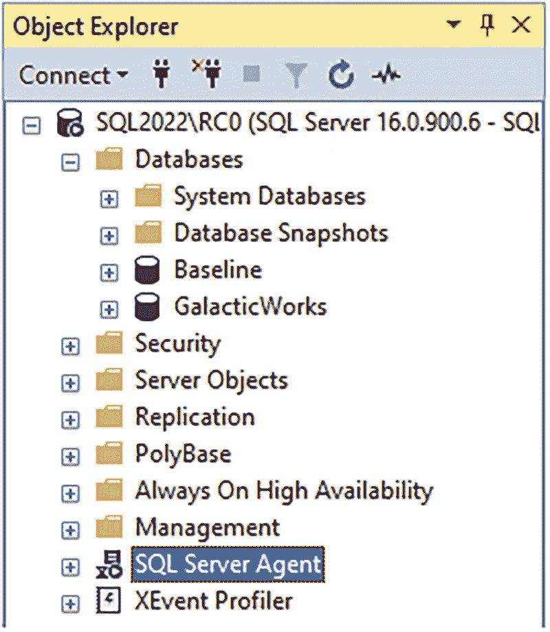

对象资源管理器的屏幕截图，其中 SQL Server 代理选项卡被突出显示。

图 4-4
`Baseline` 数据库

您可以使用清单 4-1 中的脚本自行创建该数据库，注意更改文件位置。创建时数据库数据文件将为 1.5 GB，这为捕获数周的等待统计信息提供了足够的可用空间。

```
-- Create Baseline database
CREATE DATABASE [Baseline]
ON PRIMARY     (
NAME = N'Baseline', FILENAME = N'E:\Data\baseline_data.mdf' ,
SIZE = 1536000KB , FILEGROWTH = 10%    )
LOG ON    (
NAME = N'Baseline_log', FILENAME = N'E:\Log\baseline_log.ldf' ,
SIZE = 102400KB , FILEGROWTH = 10%    )
GO;
ALTER DATABASE [Baseline] SET RECOVERY SIMPLE
GO;
```
清单 4-1
创建 `Baseline` 数据库

我们使用 `sys.dm_os_wait_stats` DMV 作为测量值的来源，这意味着保存测量值的表必须能够处理从 DMV 返回的信息。我们将存储等待类型和等待时间，并添加额外的信息来丰富数据，这样我们就可以创建多个基线。

清单 4-2 显示了一个创建名为 `WaitStats` 的表的查询，该表将用于保存我们将用于创建基线的等待统计信息。

```
USE [BaseLine]
GO
CREATE TABLE WaitStats
(ws_ID INT IDENTITY(1,1) PRIMARY KEY,
ws_DateTime DATETIME,
ws_Day INT,
ws_Month INT,
ws_Year INT,
ws_Hour INT,
ws_Minute INT,
ws_DayOfWeek VARCHAR(15),
ws_WaitType NVARCHAR(60),
ws_WaitTime BIGINT,
ws_WaitingTasks BIGINT,
ws_SignalWaitTime BIGINT);
```
清单 4-2
创建等待统计信息表

正如您在脚本中看到的，我们捕获了等待类型、等待时间、信号等待时间和等待任务数。我们还捕获了记录等待统计信息时的日期和时间。日期和时间被拆分到额外的列中，以便对数据进行分段，这样更容易基于特定的某天、小时、月份等构建特定的基线，而无需每次都转换 `datetime` 数据类型。

现在我们的表已经准备好了，是时候捕获一些等待统计信息并将它们插入到 `WaitStats` 表中。因为 `sys.dm_os_wait_stats` DMV 返回的是累积等待时间，所以我们必须计算两个捕获时刻之间等待时间的差异。如果我们只是直接从 `sys.dm_os_wait_stats` DMV 捕获信息，我们将总是获得不断增加的等待时间，使得比较变得困难。有两种方法可以捕获两次测量之间等待时间的变化，它们各有优缺点。

第一种方法，我称之为重置方法，它将从 `sys.dm_os_wait_stats` DMV 捕获等待统计信息，然后使用以下命令重置 DMV：

```
DBCC SQLPERF('sys.dm_os_wait_stats', CLEAR)
```

该方法的主要优点是使用简单，因为我们只需要捕获信息，然后再次重置它，并在下一次测量时启动相同的过程。不需要计算增量，因为在第一次测量之后，计数器被重置为 0。缺点是这个 `DBCC` 命令会重置 `sys.dm_os_wait_stats` DMV 内部的信息。这意味着我们丢失了 DMV 内部的累积信息，这是我们不想丢失的信息。图 4-5 说明了这种等待统计信息捕获方法。

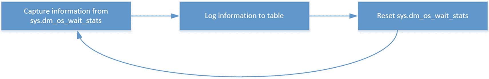

一个流程图包含三个连接的块：捕获信息、将信息记录到表中、重置。

图 4-5
使用重置方法捕获等待统计信息

第二种选择，称为增量方法，涉及计算两次测量之间等待时间的差值或增量。这种方法的优点是我们不会丢失 `sys.dm_os_wait_stats` DMV 内部的累积等待时间。缺点是计算增量比第一种方法更复杂。它通常还涉及在 T-SQL 脚本中使用 `WAITFOR DELAY` 命令来设置间隔。这可能意味着，如果您计划使用 SQL Server 代理捕获等待统计信息，您最终可能会得到一个几乎持续运行的 SQL Server 代理作业。图 4-6 说明了捕获等待统计信息的增量选项。

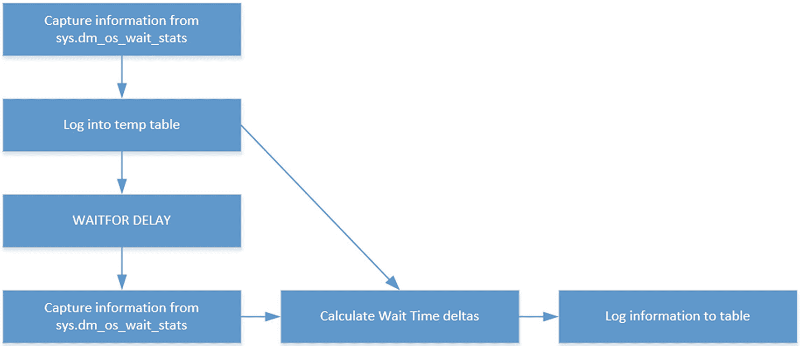

一个流程图包含六个连接的块：捕获信息、记录到临时表、等待延迟、捕获信息、计算等待时间增量、将信息记录到表中。

图 4-6
使用增量方法捕获等待统计信息

> **书呆子注释**
> 第三种选择是获取指标而不清除或手动计算增量。您将能够在以后执行任何必要的计算。或者可能只在每次插入时存储非零指标。或者只存储自上次收集以来发生更改的指标。使用最适合您和您的系统的任何选项或方法。

还有更多方法可用于捕获等待统计信息，但我最常见到的是这两种，或它们的变体。您想使用哪种方法取决于您，因为最终两者都会返回相同的结果。

#### 重置捕获方法

重置捕获方法包含一个 T-SQL 脚本，用于从 `sys.dm_os_wait_stats` DMV 捕获信息，然后重置 DMV 内部的计数器。清单 4-3 显示了用于填充我们之前创建的 `WaitStats` 表的 T-SQL 脚本。

```
USE [Baseline]
GO
-- Insert Wait Stats into Baseline table
INSERT INTO WaitStats
SELECT
GETDATE() AS 'DateTime',
DATEPART(DAY,GETDATE()) AS 'Day',
DATEPART(MONTH,GETDATE()) AS 'Month',
DATEPART(YEAR,GETDATE()) AS 'Year',
DATEPART(HOUR, GETDATE()) AS 'Hour',
DATEPART(MINUTE, GETDATE()) AS 'Minute',
DATENAME(DW, GETDATE()) AS 'DayOfWeek',
wait_type AS 'WaitType',
wait_time_ms AS 'WaitTime',
waiting_tasks_count AS 'WaitingTasks',
signal_wait_time_ms AS 'SignalWaitTime'
FROM sys.dm_os_wait_stats;
-- Clear sys.dm_os_wait_stats
DBCC SQLPERF ('sys.dm_os_wait_stats',CLEAR)
GO
```
清单 4-3
重置捕获方法


#### 增量捕获方法

增量捕获方法同样包含一个单独的 `T-SQL` 脚本，但它比重置捕获方法更为复杂。它使用一个临时表来存储第一次测量结果，等待 15 分钟后进行第二次测量，并计算差值。结果会被插入到 `WaitStats` 表中。清单 4-4 显示了如果您计划使用这种收集等待统计指标的方法时可以使用的 `T-SQL` 脚本。

```
USE [Baseline]
GO
-- 检查临时表是否已存在，如果存在则删除它。
IF EXISTS
(
SELECT *
FROM tempdb.dbo.sysobjects
WHERE ID = OBJECT_ID(N'tempdb..#ws_Capture')
)
DROP TABLE #ws_Capture;
-- 创建临时表以保存我们的第一次测量
CREATE TABLE #ws_Capture
(  wst_WaitType NVARCHAR(60),
wst_WaitTime BIGINT,
wst_WaitingTasks BIGINT,
wst_SignalWaitTime BIGINT   );
-- 将我们的第一次测量结果插入临时表
INSERT INTO #ws_Capture
SELECT wait_type,
wait_time_ms,
waiting_tasks_count,
signal_wait_time_ms
FROM sys.dm_os_wait_stats;
-- 等待下一次测量
-- 在此例中，我们将等待 15 分钟
WAITFOR DELAY '00:15:00'
-- 将第一次测量结果与新测量结果结合并计算差值
-- 将结果写入 WaitStats 表
INSERT INTO WaitStats
SELECT
GETDATE() AS 'DateTime',
DATEPART(DAY,GETDATE()) AS 'Day',
DATEPART(MONTH,GETDATE()) AS 'Month',
DATEPART(YEAR,GETDATE()) AS 'Year',
DATEPART(HOUR, GETDATE()) AS 'Hour',
DATEPART(MINUTE, GETDATE()) AS 'Minute',
DATENAME(DW, GETDATE()) AS 'DayOfWeek',
dm.wait_type AS 'WaitType',
dm.wait_time_ms - ws.wst_WaitTime AS 'WaitTime',
dm.waiting_tasks_count - ws.wst_WaitingTasks AS 'WaitingTasks',
dm.signal_wait_time_ms - ws.wst_SignalWaitTime AS 'SignalWaitTime'
FROM sys.dm_os_wait_stats dm
INNER JOIN #ws_Capture ws
ON dm.wait_type = ws.wst_WaitType;
-- 清理临时表
DROP TABLE #ws_Capture;
清单 4-4
增量捕获方法
```

### 使用 SQL Server 代理安排测量

在选择了捕获方法后，我们运行一个 `T-SQL` 脚本，用等待统计信息填充我们的 `WaitStats` 表。如前面基线陷阱部分所述，以固定间隔执行测量非常重要。这使得比较测量结果更容易，因为您比较的是相同的时间段。实现这一点的一个简单方法是使用设置为固定间隔的 `SQL Server 代理` 作业。间隔可以根据您的选择来设置——设置的间隔越大，您可以比较的时间段数量就越少。将间隔设置得更短会提供更多的时间段，但同时也意味着存储的数据量会增加。我个人倾向于将间隔设置为 15 分钟。对于大多数场景来说，这提供了足够的时间段进行比较。

这里我不详细介绍如何创建 `SQL Server 代理` 作业来捕获等待统计信息，但我想指出我的作业示例作为您可以参考的例子。我通常最终会创建一个只包含一个 `T-SQL` 脚本步骤的 `SQL Server 代理` 作业。在此步骤中，我根据想要使用的方法复制捕获脚本。图 4-7 显示了我的 `SQL Server 代理` 作业的截图。

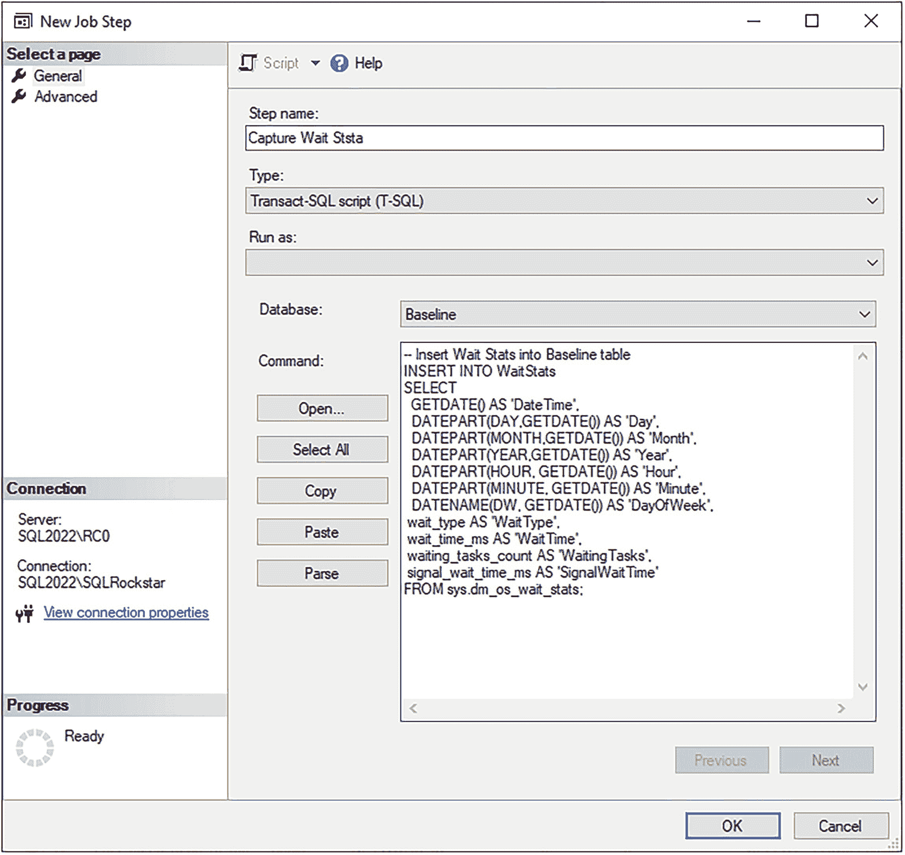

新建作业步骤页面的右侧显示了步骤名称、类型、数据库和命令。

图 4-7

捕获 `WaitStats` 的 `SQL Server 代理` 作业步骤

在此例中，我使用了重置捕获方法来将等待统计信息捕获到 `WaitStats` 表中。

图 4-8 显示了用于按固定间隔捕获等待统计信息的计划。

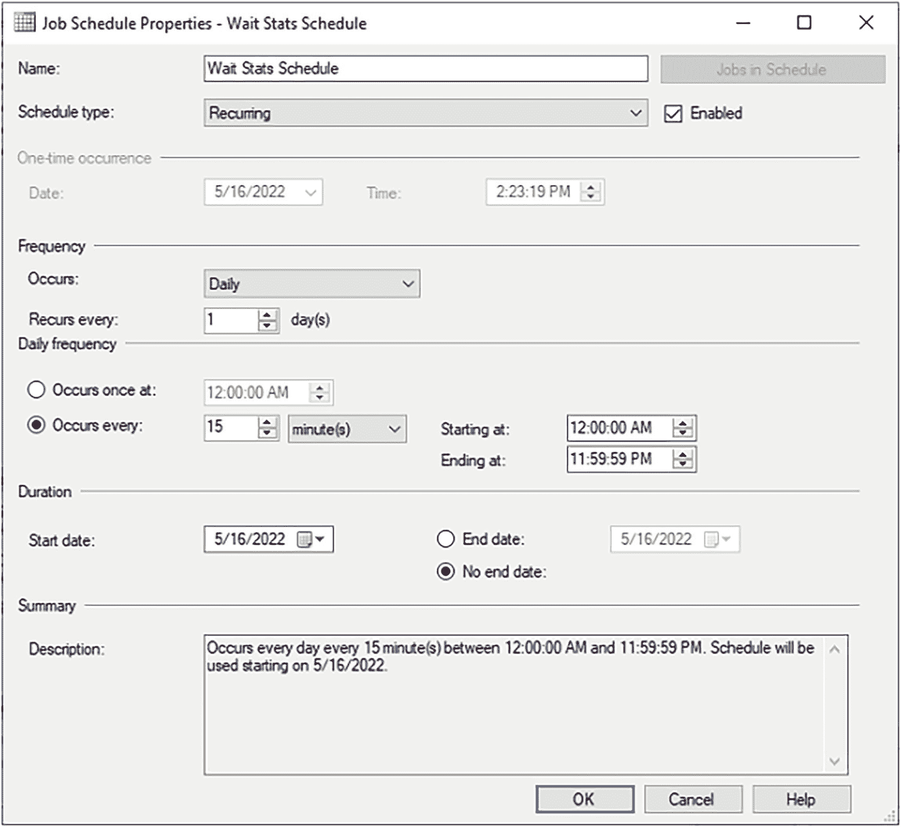

作业计划属性页面的截图，包含名称“等待统计计划”、计划类型、频率、持续时间和摘要。

图 4-8

`SQL Server 代理` 作业计划

如您所见，我将其设置为每 15 分钟运行一次，每天如此。

同样，您可以自由选择自己的捕获间隔，但请确保始终以相同的间隔长度进行捕获。

在我们创建了 `SQL Server 代理` 作业来收集等待统计信息后，我们需要让它运行一段时间。作业运行的时间越长，我们收集到的信息就越多，从而提高了我们基线的质量。

### 等待统计基线分析

当 SQL Server 代理作业收集了一段时间的等待统计指标后，我们就可以开始创建一些基线了。我们通过查询之前创建的 `WaitStats` 表来实现。我将给出一些用于创建基线以便进行对比的查询示例；不过，这些并非唯一可用的查询，我鼓励你尝试不同的查询，以返回你最感兴趣的信息。

在开始构建基线之前，我想回到第 2 章“查询 SQL Server 等待统计”中的图 2-14。在该流程图中，我向你展示了分析当前发生的资源等待可以采取的步骤。既然我们现在可以访问基线，就可以在流程图中添加一个额外的步骤。图 4-9 展示了如何完善该流程图，其中包含了基线对比步骤。

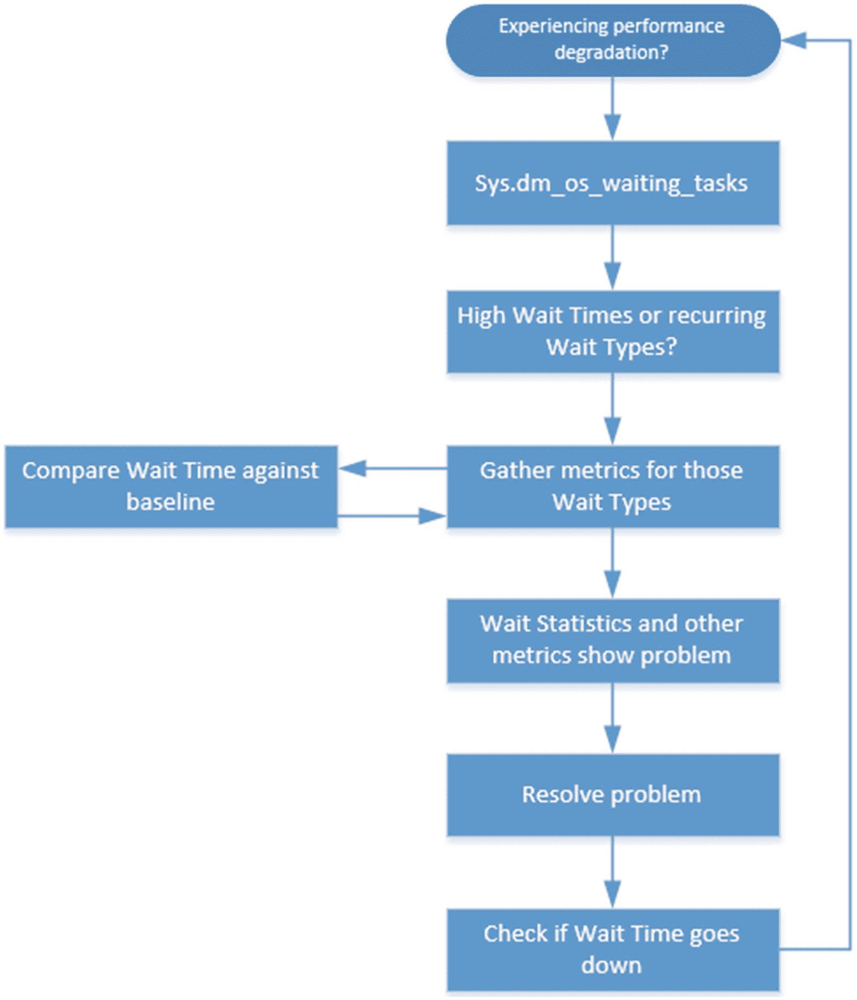

一个包含八个步骤的流程图，从性能下降开始，到检查等待时间是否下降结束。它将等待时间与基线进行对比。

**图 4-9**
**完整的等待统计性能分析流程图**

基线是在调查性能问题时收集的额外指标输入。基线是非常有价值的输入，因为它们显示了在性能问题尚未发生期间的信息。

让我们通过一个例子来走一遍流程，再次使用 DBA 简（Jane），我们将回顾图 4-9 中流程图的所有步骤。在这个例子中，我将展示针对 `WaitStats` 表的查询，用于构建一个对性能分析过程有用的基线。

星期二上午 9 点左右，简接到一个关于针对销售数据库的日常报告的电话；用户抱怨报告比平时慢。问题大约在上午 8 点开始，用户仍然遇到性能问题。这些报告是计划作业的一部分，每个工作日上午 8 点开始运行。

简做的第一件事是使用以下查询来查询 `sys.dm_os_waiting_tasks` DMV：

```sql
SELECT *
FROM sys.dm_os_waiting_tasks
ORDER BY session_id ASC;
```

简重点关注用户会话，但没有看到任何长时间的等待，如图 4-10 所示。

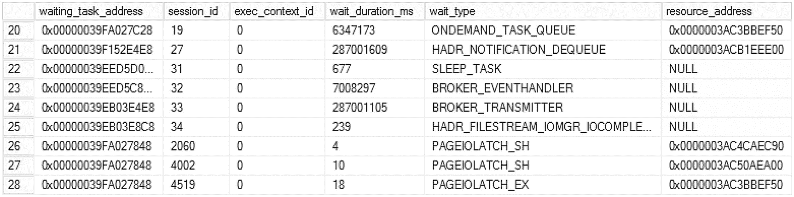

一个包含六列的表格，列名为等待任务地址、会话 ID、执行上下文 ID、等待持续时间（毫秒）、等待类型和资源地址。共有九行。

**图 4-10**
**`sys.dm_os_waiting_tasks`**

在多次执行针对 `sys.dm_os_waiting_tasks` DMV 的查询后，简注意到每次查询该 DMV 时都会返回等待类型 `PAGEIOLATCH_SH`。每次返回的等待类型都对应不同的会话 ID，但等待时间相对较短。

简使用了相同的 T-SQL 脚本，将等待统计指标捕获到 `WaitStats` 表中，正如本章前面所讨论的。因为简可以访问历史等待统计信息，她为 `PAGEIOLATCH_SH` 的等待时间创建了一个基线。

第一步是查看今天的 `PAGEIOLATCH_SH` 等待时间，筛选并显示上午 8 点到 9 点之间捕获的测量值，使用如清单 4-5 所示的查询。

```sql
-- PAGEIOLATCH_SH 等待，今天上午 8 点到 9 点之间
SELECT
CONVERT(VARCHAR(5), ws_DateTime, 108) AS '时间',
ws_WaitTime AS '等待时间'
FROM WaitStats
WHERE ws_WaitType = 'PAGEIOLATCH_SH'
AND (ws_Hour >= 8 AND ws_Hour < 9)
AND CONVERT(VARCHAR(5), ws_DateTime, 105) = CONVERT(VARCHAR(5), GETDATE(), 105);
-- 清单 4-5
-- 显示今天上午 8 点到 9 点之间 PAGEIOLATCH_SH 的等待时间
```

该查询返回了如图 4-11 所示的结果。

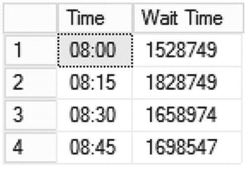

一个包含两列（时间和等待时间）和四行的表格。时间为 8 的行具有最低的等待时间。

**图 4-11**
**今天的 PAGEIOLATCH_SH 等待时间**

现在简已经获取了今天 `PAGEIOLATCH_SH` 等待类型的等待时间，下一步是利用 `PAGEIOLATCH_SH` 等待类型的历史测量值创建一个基线，以便将今天的测量值与基线进行比较。简使用清单 4-6 所示的查询来构建基线。

```sql
-- 工作日上午 8 点到 9 点的基线
-- 不包括今天完成的测量值
SELECT
CONVERT(VARCHAR(5), ws_DateTime, 108) AS '时间',
AVG(ws_WaitTime) AS '基线'
FROM WaitStats
WHERE ws_WaitType = 'PAGEIOLATCH_SH'
AND ws_DayOfWeek IN ('Monday', 'Tuesday', 'Wednesday', 'Thursday','Friday')
AND (ws_Hour >= 8 AND ws_Hour < 9)
AND CONVERT(VARCHAR(5), ws_DateTime, 105) < CONVERT(VARCHAR(5), GETDATE(), 105)
GROUP BY CONVERT(VARCHAR(5), ws_DateTime, 108);
-- 清单 4-6
-- PAGEIOLATCH_SH 基线
```

此查询构建的基线具有以下特征：返回在工作日上午 8 点到 9 点之间捕获的 `PAGEIOLATCH_SH` 等待类型的平均等待时间，但不包括今天的数据。我们排除今天的测量值，因为它们是在性能问题期间执行的，可能会影响平均值。另一个建议是仅筛选最近 x 周内捕获的数据，以限制计算平均值所用的数据量。

清单 4-6 所示查询的结果如图 4-12 所示。

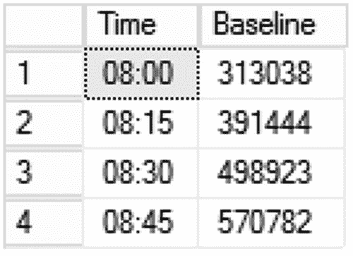

一个包含两列（时间和基线）和四行的表格。时间为 8 的行具有最低的基线。

**图 4-12**
**PAGEIOLATCH_SH 基线**

当你比较图 4-11 和 4-12 中的等待时间时，可以立即看出，今天进行的测量值远高于历史基线。为了更容易看出差异，我创建了两者的对比图，如图 4-13 所示。

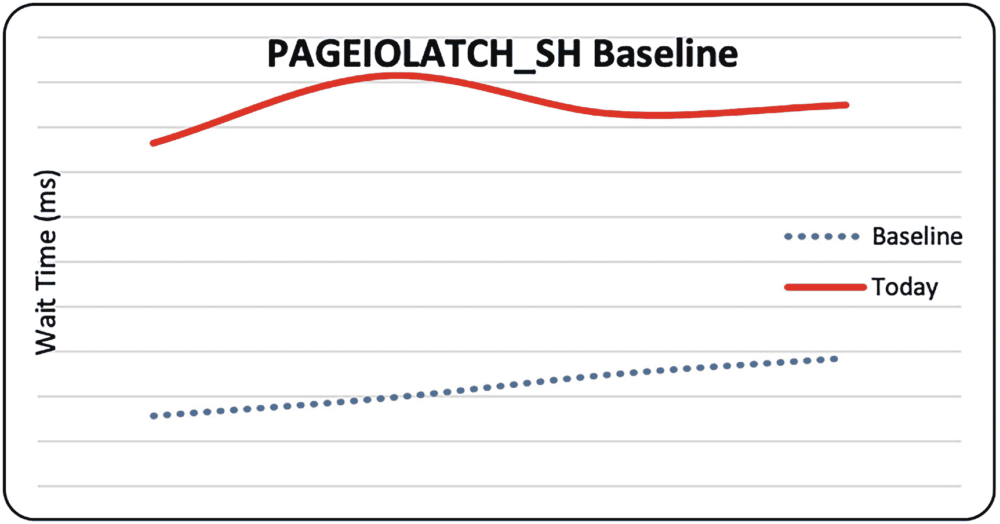

一个等待时间的图表，基线为递增的虚线，而 Pageiolatch S H 基线则呈现波动模式。

**图 4-13**
**PAGEIOLATCH_SH 等待类型的基线对比图**

由于 `PAGEIOLATCH_SH` 等待类型的基线与今天的等待时间存在如此大的差异，简认为需要进一步调查 `PAGEIOLATCH_SH` 等待类型。

#### 极客备注

我们将在第 9 章“与闩锁相关的等待类型”中详细研究 `PAGEIOLATCH_SH` 等待类型，但（非常）简短地解释一下，长时间的 `PAGEIOLATCH_SH` 等待可能表明存储存在问题。

为了进一步调查，简启动了性能监视器，查看与存储子系统相关的指标，特别是磁盘延迟计数器。如图 4-14 所示，数据库数据文件所在磁盘的延迟峰值达到了非常高的数值，超过 4000 毫秒！为了让 SQL Server 以最佳状态运行，磁盘延迟应尽可能低，理想情况下应小于 10 毫秒。

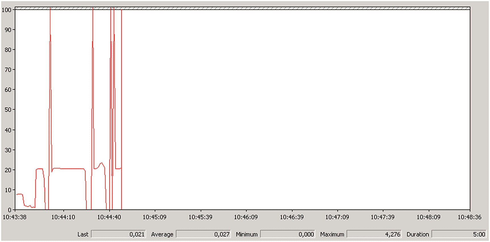

一个带有波动峰值图表的屏幕截图。底部显示了最后、平均、最大、最小和持续时间的详细信息。

**图 4-14**
**磁盘读取延迟**


结合等待统计的基线信息和`Perfmon`指标，Jane 认为问题与存储有关，并联系了存储管理员。收集到的指标对存储管理员也有帮助，因为他们可以将自己存储相关的测量结果与 Jane 提供的数据进行比较。存储管理员确认问题与销售数据库所在的磁盘有关，并通过更换磁盘阵列中的一个故障磁盘解决了问题。更换磁盘后，磁盘延迟恢复到平均 6 毫秒，高延迟峰值消失。Jane 在磁盘更换后再次从`WaitStats`表中查询等待时间，注意到`PAGIOLATCH_SH`等待类型的等待时间又接近基线值。用户也告知 Jane，报表运行再次正常。

在这个例子中，Jane 完成了图 4-9 所示的等待统计性能分析流程图的所有步骤：

1.  用户在运行报表时体验到性能下降。
2.  Jane 查询`sys.dm_os_waiting_tasks` `DMV`，以找出是否存在高等待时间或频繁出现的等待类型。`PAGIOLATCH_SH`等待类型似乎频繁出现。
3.  Jane 通过捕获今天的`PAGIOLATCH_SH`等待时间并与基线进行比较来收集指标，同时从`Perfmon`收集额外指标。
4.  所有指标都显示问题很可能与存储有关，Jane 联系了存储管理员。
5.  存储管理员更换了阵列中一个损坏的磁盘。存储延迟值降至 6 毫秒。
6.  Jane 再次检查`PAGIOLATCH_SH`等待类型的等待时间，并确认它们已接近基线值。

尽管这个例子看起来很简单，但它基于我在现实世界中遇到的一个性能问题。通过运用等待统计性能分析流程图中的步骤并结合基线指标，我能够快速识别并解决问题。

**技术宅笔记**
相关性并不意味着因果关系。虽然更换磁盘似乎解决了问题，但现实是你的基础架构很复杂。有可能真正的根本原因是别的，比如在`VM`主机上发生内核拥塞，当时显示为`PAGIOLATCH_SH`，并且大约在磁盘被更换的同时也得到了解决。

在示例中，代码清单 4-6 中的查询为`PAGIOLATCH_SH`等待类型创建了基线。这个查询是你可以用于`WaitStats`表的一个示例。你应该根据自己的需要对其进行修改；例如，你可以选择不限制工作日的结果，而是显示特定日期捕获的平均等待时间。或者，你可以请求特定日期的实际等待时间。

如果你要长时间捕获等待统计数据，将结果拆分到多个表中可能是一个好主意，以便于更快地进行查询。例如，你可以使用以下查询将三月份进行的所有等待统计测量插入到它们自己的表中：
```sql
SELECT *
INTO WaitStats_March
FROM WaitStats
WHERE ws_Month = 3;
```
这也让我们能够通过将不同的表连接在一起来比较不同时间段的特定等待时间。

**技术宅笔记**
你可以用多种方式来分析和切片这些数据，例如使用窗口函数，或者使用`PowerBI`构建一个合适的仪表板。选择最适合你的方式。

图 4-15 展示了我最终通常得到的基线数据库中的表，数据按月排序。

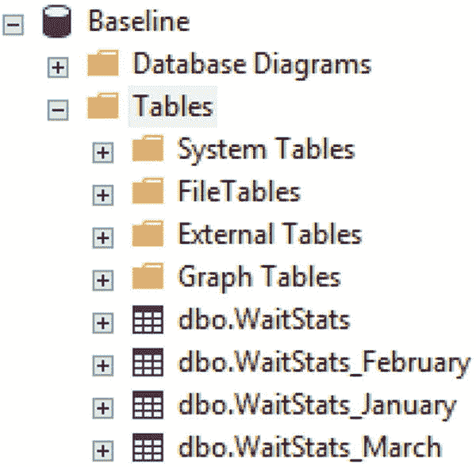

基线文件夹内的表截图包含四种类型的表：系统表、文件表、外部表和图形表。

**图 4-15**
按月拆分的等待统计测量

你应该自己决定如何拆分测量数据；也许你想为每个使用的应用程序版本在单独的表中存储等待统计测量，或者将特定等待类型的所有测量存储在单独的表中。选择权在你。

希望本章能给你一些关于如何存储等待统计测量并从这些测量创建基线的想法。我尽量避免确切地告诉你该做什么以及如何做，因为我相信单一的方法并不适合所有人。你需要编写并调整自己的查询来创建你感兴趣的基线，但我希望本章向你展示了可以进一步构建的基础。

#### 总结
在本章中，我们从理论和实践两个角度仔细研究了基线。基线对于你进行的任何类型的性能分析都极其重要。在等待统计的案例中，如果你想排查与`SQL Server`相关的性能问题，通常需要基线。由于等待统计对你的系统是唯一的，比较等待时间只有一种方法——那就是基线。

我为你提供了一些示例和`T-SQL`脚本，来创建你自己的等待统计基线表，这样你现在就可以开始捕获等待统计信息了。我们还通过一个例子，介绍了如何查询基线信息并将其与实际测量值进行比较，以排查与性能相关的事件。

