# 第二部分 等待类型

## 5. 与 CPU 相关的等待类型
在过去的几十年里，处理器经历了巨大的发展，处理器制造商每年都能制造出更快的处理器。虽然处理器的速度正在触及天花板，但制造商在处理器内集成的内核数量却在增长。在撰写本书时，你可以购买一个内含 64 核的单处理器来驱动你的系统。处理器也是系统中较难更换的部分之一。虽然扩展系统内存相对容易，但更换一个速度更快或内核更多的处理器通常需要你更换系统主板，因为`CPU`插槽不兼容。这意味着我们常常在更换整个系统之前，只能使用当前的处理器。

处理器对`SQL Server`很重要。更高的处理器速度将加速处理器相关的指令，而更多的内核意味着`SQL Server`有更多的调度器可用于请求执行。但即使是速度和核心的升级，也无法避免我们有时会等待处理器资源。在本章中，我们将探讨一些与你的系统处理器相关的等待类型。

### CXPACKET
在使用默认、开箱即用配置选项部署的`SQL Server`实例中，这是迄今为止最常见的与`CPU`相关的等待类型。它也是最容易被误解的等待类型之一，有时对你的查询性能影响很小。事实上，降低`CXPACKET`等待时间可能会降低查询性能！如果你运行的是`SQL Server 2016 SP2`或更高版本，处理`CXPACKET`等待的方式有所改变。我们将在本节末尾讨论这些更改的影响，包括与并行度相关的等待类型`CXCONSUMER`。


#### 什么是 CXPACKET 等待类型？

当查询以并行方式（即在多个 CPU 核心上）而非串行方式（单个 CPU 核心）执行时，就会出现 `CXPACKET` 等待类型。如果工作被分配给多个工作线程执行，并行执行查询相比串行执行具有性能优势。这种优势适用于返回大型结果集的查询；仅返回少量行的查询从并行中获益甚微，在许多情况下，并行反而会减慢这些查询的执行速度。这并不意味着我们应该关闭并行，因为我尚未见过一个真正的 OLTP 数据库，其中每个查询都只返回少量行。许多系统具有混合工作负载，既要处理短时间查询，也要处理大型、运行时间较长的报告和分析查询。

#### 并行查询执行与线程协调

并行查询使用多个工作线程来执行一个请求。除了为执行请求工作而创建的工作线程外，并行查询还会使用一个控制线程，也称为 `Thread 0`。该线程的任务是协调其他工作线程。当 `Thread 0` 等待其他工作线程完成分配给他们的任务时，它会记录总的等待时间为 `CXPACKET` 等待类型。为了更好地理解这种关系，请参见图 5-1。

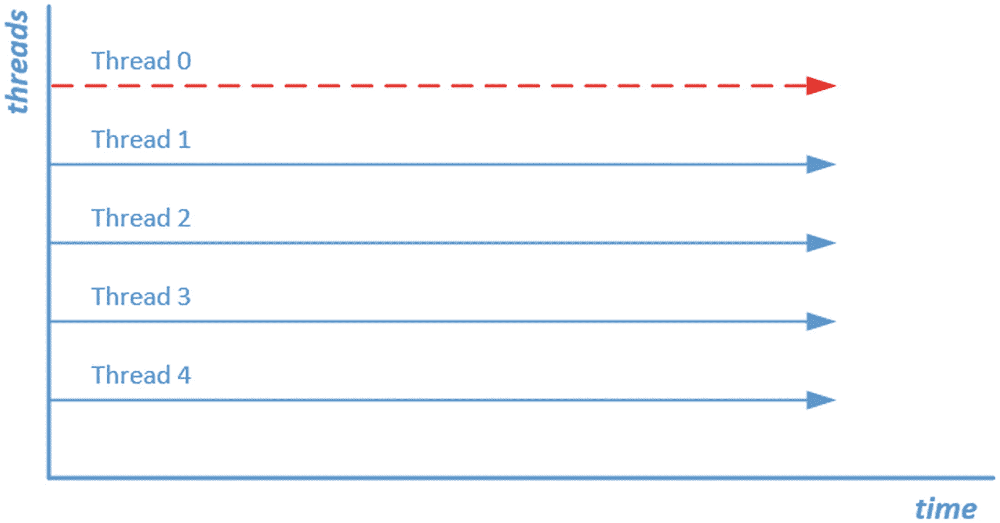

一条折线图，纵轴为线程，横轴为时间。五条指向右侧的水平箭头，标记为线程 0 到 4，长度几乎相等。最上方的线程 0 是一条带阴影的虚线箭头。

*图 5-1：并行查询线程模型*

一旦 SQL Server 查询优化器决定使用并行执行计划，你就会看到 `CXPACKET` 等待发生。如果你预期查询会并行运行并且其表现符合预期，这完全正常，无需担心。在这些情况下，你可以忽略 `CXPACKET` 等待类型上的长时间等待。然而，在某些情况下，你可能不希望使用并行，或者由于工作负载分布不均，并行正在对查询性能产生负面影响。

#### 配置并行设置

由于 `CXPACKET` 等待类型与你的 SQL Server 实例的并行设置直接相关，我们可以通过调整服务器配置设置来影响它。在 SQL Server 实例的 **服务器属性** ➤ **高级** ➤ **并行** 部分可以找到并行设置，如图 5-2 所示。

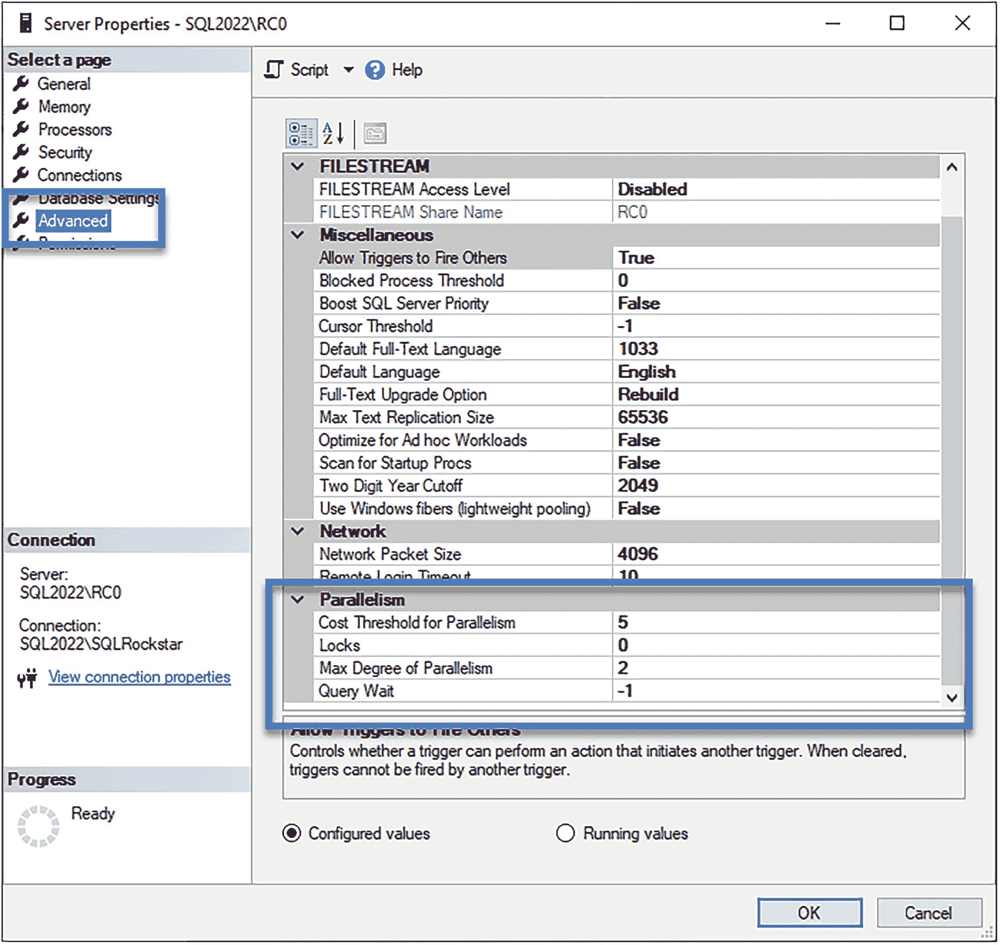

SQL Server 服务器属性窗口的截图。边框高亮了左侧菜单中的“高级”选项和底部的“并行”部分。

*图 5-2：整个 SQL Server 实例的并行配置*

在这些设置中，`并行的成本阈值` 和 `最大并行度` 设置对并行查询的影响最大。

##### 并行的成本阈值

`并行的成本阈值` 设置用于配置查询优化器决定并行执行查询的成本阈值。如果一个查询的成本高于 `并行的成本阈值` 中配置的值，查询优化器可能会决定生成并行计划而非串行计划。默认情况下，该设置的值为 5，可配置为 0 到 32,767 之间的值。

##### 最大并行度

`最大并行度` 设置用于配置执行并行计划时每个运算符使用的最大调度器数量。默认情况下，此设置配置为 0，这意味着执行并行计划时可以使用所有可用的调度器。

#### 数据库作用域的并行配置

如果你运行的是 SQL Server 2016 或更高版本，还可以通过数据库作用域配置项在数据库级别配置 `MAXDOP` 并行设置，如图 5-3 所示。

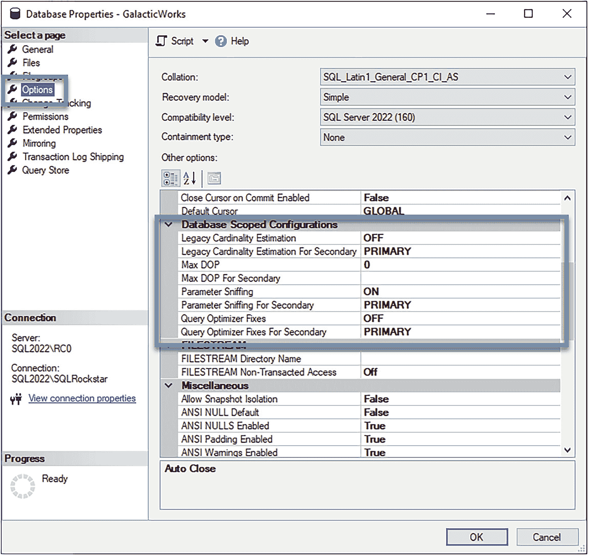

Galactic works 数据库属性窗口的截图。边框高亮了左侧菜单中的选项和右侧的数据库作用域配置部分。

*图 5-3：数据库作用域的并行配置*

引入用于并行的数据库作用域配置设置是一个受欢迎的变化。例如，考虑你在一个 SQL Server 实例中有多个数据库的情况。理想情况下，这些数据库中的每一个都将使用为其特定工作负载调整的配置设置。在 SQL Server 2016 之前，我们无法在每个数据库级别进行配置，因此通常你会坚持使用通用的配置值。现在，由于数据库作用域配置成为可能，为每个单独的数据库配置最佳设置变得很容易。

随着能够为并行设置添加数据库作用域配置值，SQL Server 引擎处理这些配置的方式有所不同：

*   仅当数据库作用域设置被设置为非默认值时，它才会覆盖当前的实例设置。
*   如果数据库作用域配置设置为其默认值，则将使用实例范围的配置设置。

例如，如果 `最大并行度` 设置在实例级别配置为 4，在数据库级别配置为 0（默认值），则并行执行的查询可能使用四个调度器。如果将数据库作用域设置更改为值 2，则针对该数据库执行的查询最多可能使用两个调度器，从而覆盖实例设置的 4。


##### 通过调整并行配置选项来降低 CXPACKET 等待时间

有多种方法可用于降低 CXPACKET 等待时间，但你必须首先确定 CXPACKET 等待是否是导致问题的原因。正如我之前所说，只要为 SQL Server 实例启用了并行，CXPACKET 等待就是正常的。互联网论坛上找到的一个解决方案是通过将 `最大并行度` 选项设置为 1 来禁用并行。在大多数情况下，这不是一个好主意。禁用并行会使 CXPACKET 等待消失，但某些查询的性能可能会变差，因为它们无法再并行运行。

降低 CXPACKET 等待的一个更好方法是调整 `并行开销阈值` 和 `最大并行度` 选项，使其与你的工作负载相匹配。这样，只有那些从并行中受益最大的查询才会并行运行。找到并行最佳平衡点的一个方法是比较查询在串行运行与并行运行时的执行时间。你通常应该关注那些访问大量信息且通常运行时间较长的查询，因为这些查询将从并行中受益最大。

考虑以下示例，我们有一个针对 GalacticWorks 数据库的查询，请求 `Sales.SalesOrderDetail` 表中的信息：

```sql
SELECT *
FROM Sales.SalesOrderDetail
ORDER BY CarrierTrackingNumber DESC;
```

要确定此查询是否适合并行执行，我们将检查查询的估计开销。要查看此信息，我们需要查看如果查询串行执行时的估计执行计划。为确保查询串行运行，我们添加查询选项 `MAXDOP 1`：

```sql
SELECT *
FROM Sales.SalesOrderDetail
ORDER BY CarrierTrackingNumber DESC
OPTION (MAXDOP 1);
```

我们选择“显示估计的执行计划”（或按 `CTRL+L`），然后在执行计划窗口中将鼠标悬停在 `SELECT` 图标上：

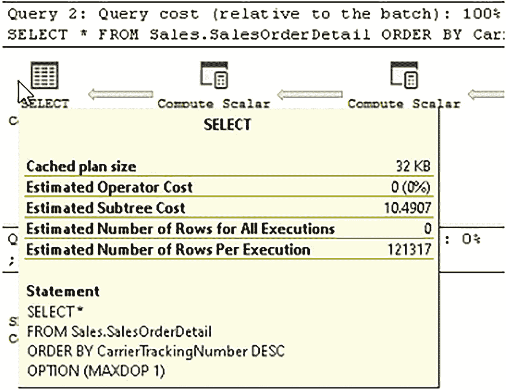

一张带有 `MAXDOP 1` 选项的 `Sales.SalesOrderDetail` 查询执行计划的截图。光标指向计划中的 `SELECT` 选项，打开一个属性菜单。

图 5-4：使用 `MAXDOP 1` 的查询估计开销

在本例中，估计开销为 10.4907。因为此实例的 `并行开销阈值` 仍为默认值 5，我确信如果移除 `MAXDOP` 查询提示，该查询将并行运行。

图 5-5 显示了在不使用 `MAXDOP 1` 选项执行查询后的实际执行计划。

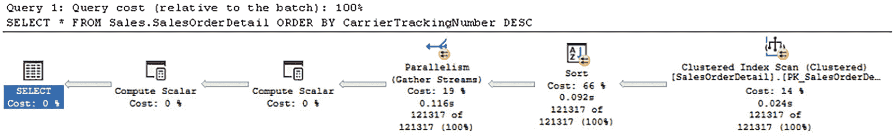

一张 `Sales.SalesOrderDetail` 查询的执行计划截图。带有开销百分比的事件包括：聚集索引扫描，14%；排序，66%；并行，19%；计算标量，0%；选择，0%。

图 5-5：不带 `MAXDOP 1` 选项的实际执行计划

如你所见，查询按预期使用了并行执行，因为其估计开销高于为 `并行开销阈值` 选项配置的值。如果我们查看实际执行计划中 `SELECT` 操作的属性，我们会发现更多信息，如图 5-6 所示。

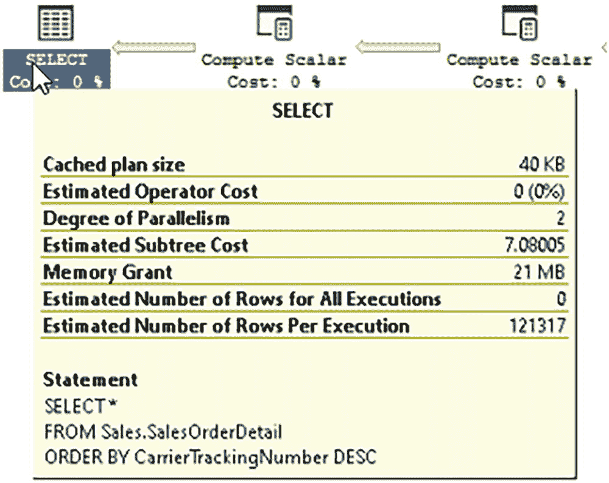

一张执行计划的截图。光标指向 `SELECT` 操作，打开一个属性菜单。菜单中有缓存计划大小和其他估计值。

图 5-6：`SELECT` 操作属性

`SELECT` 操作的属性显示该查询使用了两个线程执行，并且估计开销降低到了 7.08005。

如果我们把 `并行开销阈值` 的值改为比默认值 5 更高的数字，那么像本例中的查询可能不会使用并行，但那些报告开销更大的查询将会使用并行。请记住，此选项适用于整个实例，会影响每个数据库中的查询。

尽管估计开销降低了，但对于此示例查询，执行时间的改进很小（大约 300 毫秒）。当你使用 `并行开销阈值` 选项调整并行设置时，需要考虑执行时间（使用 `SET STATISTICS TIME`），并判断更改此设置是否有益。

###### 极客提示

默认值为 5 的 `并行开销阈值` 对于现代数据库工作负载来说已经过时。你需要测试以确定适合你特定系统的值，但对于大多数全新安装，我建议将此值设置为更高的数字，例如 50，然后根据需要进行调整。

另一个需要记住的设置是 `最大并行度` 选项。当保持默认值 0 时，查询并行运行时可以使用所有可用的调度器。但使用更多调度器并不一定意味着查询执行得更快。使用超过 8 个调度器后，其收益会递减。微软推荐以下配置（来自 [`slrwnds.com/xtvmvp`](https://slrwnds.com/xtvmvp)）：

*   对于核心数 > 8 的服务器，将 `最大并行度` 选项设置为 8。
*   对于核心数 < 8 的服务器，将 `MAXDOP` 设置为等于或小于逻辑处理器的数量。

这是一个通用建议，实际效果可能因情况而异。知识库文章还讨论了 NUMA（非统一内存访问）节点的使用、SQL Server 如何配置软 NUMA 节点以及推荐的设置。

###### 极客提示

在理想情况下，你应该将 SQL Server 实例配置为在单个 NUMA 节点内运行。这不仅包括分配给每个节点的逻辑处理器数量，还包括内存量。

`并行开销阈值` 和 `最大并行度` 这两个选项的设置取决于你系统的工作负载，需要仔细测试以找出哪些设置有效，哪些无效。不过，它们会影响你的 CXPACKET 等待时间，因此在更改 `并行开销阈值` 或 `最大并行度` 选项后，请将 CXPACKET 等待时间与基线进行比较，以衡量更改的影响。


##### 通过解决倾斜的工作负载来降低 CXPACKET 等待时间

倾斜的工作负载是指并行工作线程执行的工作量不均等的情况。这并非理想状态，因为`Thread 0`将等待运行时间最长的工作线程完成，并在此期间记录`CXPACKET`等待。图 5-7 展示了一个倾斜工作负载的抽象示例。

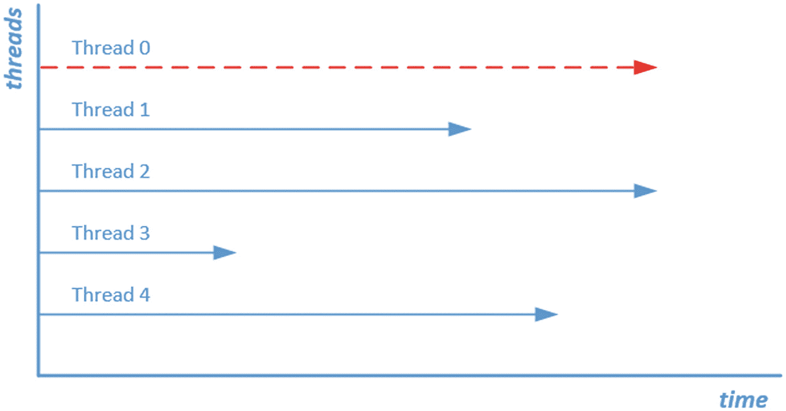

一张线程与时间关系的折线图。从上到下有 5 条长度不等、向右的水平箭头，标记为线程 0 至 4。线程 0 是一条带阴影的虚线箭头。

**图 5-7** 倾斜的并行查询线程

如果我们将`Thread 2`的部分工作分配给`Thread 3`，查询将执行得更快，并导致更低的`CXPACKET`等待时间。

我们在实际执行计划中并行操作的“实际行数”属性中查看线程分布。图 5-8 展示了一个使用并行处理执行的聚集索引扫描的属性。该操作是在前一节我们对`Sales.SalesOrderDetail`表使用的示例查询中发生的。

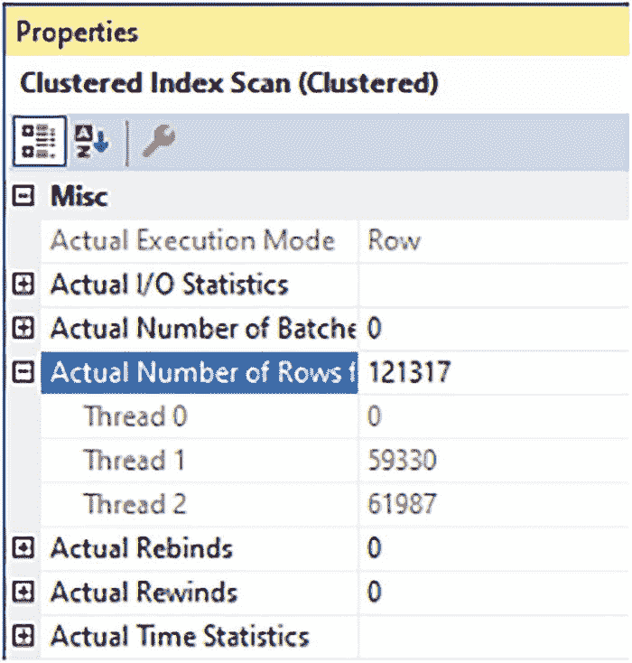

聚集索引扫描属性窗口的屏幕截图。其中“实际行数”选项被高亮显示。

**图 5-8** 并行线程分布

在这个示例中，我们看到聚集索引扫描返回了 121317 行，分布在两个线程之间（注意`Thread 0`，即协调线程，不处理任何行）。在这种情况下，行数分布相对均匀，因此我们可能没有遇到倾斜的工作负载问题。

倾斜的工作负载通常由过时的统计信息引起。如果查询优化器认为表中的行数少于（或多于）实际数量，它可能会不均衡地将工作分配到各个线程。务必定期维护统计信息，以防止工作负载倾斜。

##### CXCONSUMER 等待类型的引入

如前所述，并行处理包含两部分：生产者和消费者。理解这一点最简单的方式是将`Thread 0`视为生产者。`Thread 0`的职责是将工作分配给所有可用的并行工作线程。那些工作线程是消费者，执行生产者发送给它们的实际工作。

随着`SQL Server 2017 CU3`（及后续的`SQL Server 2016 SP2`）的发布，微软更改了并行等待的记录方式。主要目标是让`CXPACKET`并行等待更具可操作性。

在`SQL Server 2017 CU3`和`SQL Server 2016 SP2`之前，无法区分消费者是否在等待生产者发送工作。在内部，所有这些都被记录为`CXPACKET`等待时间。SQL Server 开发团队将并行等待时间拆分为两个不同的类别：`CXPACKET`和`CXCONSUMER`。通过此更改，这两种等待类型的含义也与早期的 SQL Server 版本相比发生了变化。

当消费者线程等待生产者线程发送行时，就会发生`CXCONSUMER`等待。这是预期行为，在许多情况下分析等待统计信息时可以安全地忽略。

现在记录的`CXPACKET`等待时间不包含`CXCONSUMER`等待时间，这意味着`CXPACKET`等待时间不仅表示发生了并行处理，还表明并行操作存在问题（例如，线程遇到所需缓冲区或线程同步问题）。实际上，这意味着如果你运行的是`SQL Server 2017 CU3`或`SQL Server SP2`或更高版本，`CXPACKET`等待比低版本的 SQL Server 更能指示并行问题，从而使得`CXPACKET`等待类型如开发团队所期望的那样更具可操作性。本章前面描述的处理高并行等待时间的建议仍然有效，尽管它现在对`CXPACKET`等待时间有更直接的影响。

##### CXPACKET 总结

`CXPACKET`等待类型与查询执行期间并行处理的使用直接相关。如果查询以并行方式执行，你将始终看到`CXPACKET`等待。通常这没什么好担心的，因此避免下意识地完全关闭并行处理。相反，应专注于调整`最大并行度`和`并行的成本阈值`选项，使得阈值足够高，以便你的大型查询可以从并行处理中受益，而你的小型查询不会受到负面影响。同时，通过确保统计信息是最新的，避免倾斜的工作负载。

如果你运行的是`SQL Server 2017 CU3`或`SQL Server 2016 SP2`（或更高版本），`CXPACKET`等待时间的含义略有改变，导致`CXPACKET`等待比低于这些版本的 SQL Server 版本更可能表明发生了并行问题。

### SOS_SCHEDULER_YIELD

与`CXPACKET`类似，`SOS_SCHEDULER_YIELD`是一个等待类型，它会经常出现在你系统总等待时间的前 10 位中。也与`CXPACKET`等待类型一样，`SOS_SCHEDULER_YIELD`等待时间不一定表明你的 SQL Server 实例存在问题。只要查询在你的 SQL Server 实例上执行，`SOS_SCHEDULER_YIELD`等待就会发生，并且与 SQL Server 调度密切相关。


#### 什么是 SOS_SCHEDULER_YIELD 等待类型？

在我们回答 `SOS_SCHEDULER_YIELD` 等待类型意味着什么之前，我们必须回到第 1 章“等待统计信息内部原理”，在那里我们讨论了 SQL Server 调度。还记得 `SQLOS` 如何使用其自己的协作式非抢占调度模型来确保 Microsoft Windows 进程不会中断 SQL Server 自身的进程吗？`SOS_SCHEDULER_YIELD` 等待类型与 `SQLOS` 的协作式非抢占调度模型直接相关。为了便于理解，我加入了图 5-9，您应该对它很熟悉，因为它代表了我们在第 1 章讨论过的调度器。


一个调度模型的示意图。3 个方框包含与 CPU 1、可运行队列和等待队列相关的数据。

图 5-9 调度器及其阶段和队列

如果您还记得第 1 章“等待统计信息内部原理”，工作线程会以固定顺序在不同阶段和队列中移动。通常，工作线程在等待资源时始于等待者列表（Waiter List），然后移动到可运行队列（Runnable Queue）等待在处理器上运行的轮次，最后获得处理器时间来执行其请求，进入“运行中”（RUNNING）状态。如果工作线程在“运行中”状态下需要额外资源，它会移回等待队列（Waiter Queue）列表，并开始在不同队列和阶段中的新一轮循环。

这种行为有一个例外，它发生在一个工作线程处于“运行中”状态且不需要额外资源来完成工作时。如果 `SQLOS` 允许一个工作线程只要不需要额外资源就一直占用处理器，那么处理器可能会被一个工作线程无限期地“劫持”。为了确保这种情况不会发生，调度器会给每个工作线程一个特定的时间片，它们需要在此时间内完成工作。我们称这个时间为片为 `quantum`（量程），它是一个固定不变的 4 毫秒。如果一个工作线程用完了它的量程，它必须让出处理器，并移回可运行队列的底部。它将跳过等待者列表，因为该工作线程不需要额外资源。当工作线程等待再次移动到处理器时，会记录 `SOS_SCHEDULER_YIELD` 等待类型。图 5-10 展示了这种行为。

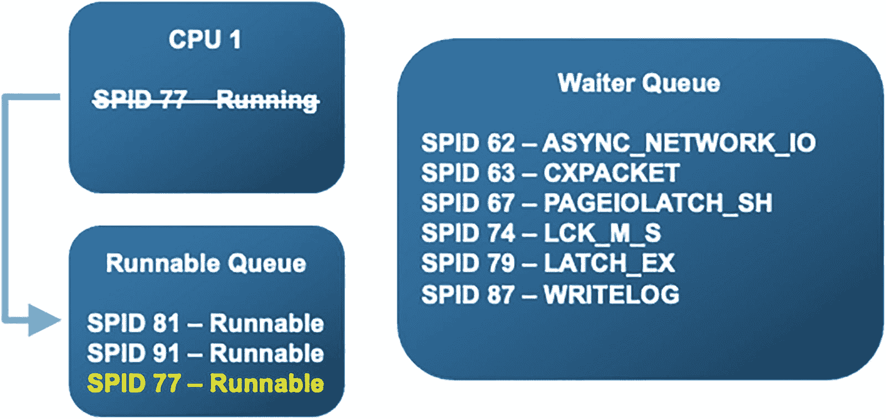

调度器操作的示意图。一个箭头从带有被划掉数据的 CPU 1 指向底部带有高亮数据的可运行队列。等待队列在右侧。

图 5-10 工作线程主动让出处理器

正如您可能猜到的那样，工作线程一直在主动让出处理器，特别是在不需要额外资源的长时间运行查询中。但请记住，只有在工作线程位于可运行队列中时，才会记录 `SOS_SCHEDULER_YIELD` 等待类型的等待时间。如果在让出处理器的工作线程前面没有其他工作线程，它将直接移回处理器而无需等待（尽管它仍会经过可运行队列）。为了向您展示一个例子，我在测试 SQL Server 上对 `GalacticWorks` 数据库执行了以下查询，其中没有任何并发：

```
-- 清除等待统计信息
DBCC SQLPERF('sys.dm_os_wait_stats', CLEAR);
-- 简单的 select 查询
SELECT *
FROM Sales.SalesOrderDetail
ORDER BY CarrierTrackingNumber DESC;
-- 检查 SOS_SCHEDULER_YIELD 等待
SELECT *
FROM sys.dm_os_wait_stats
WHERE wait_type = 'SOS_SCHEDULER_YIELD';
```

代码清单 5-1 用于显示 `SOS_SCHEDULER_YIELD` 等待的示例查询

图 5-11 显示了针对 `sys.dm_os_wait_stats` DMV 执行此查询的结果。


一个表格表示的截图，包含等待类型、计数、时间等列。它有 6 列和 1 行，等待类型是 S O S_scheduler_yield。

图 5-11 `SOS_SCHEDULER_YIELD` 等待

正如您在图 5-11 中看到的，查询在执行过程中遇到了 30 次 `SOS_SCHEDULER_YIELD` 等待类型。由于当时这是唯一执行的查询，它没有花费任何时间在可运行队列中等待另一个工作线程。如果它花费了任何时间等待另一个工作线程，`wait_time_ms` 列将返回一个大于 0 的值。

正如我在本节开头所说的，`SOS_SCHEDULER_YIELD` 等待类型通常无需担心。然而，如果等待时间明显高于您的基线值，它可能成为进行一些额外研究的原因。处理 `SOS_SCHEDULER_YIELD` 等待时，基本上会遇到三种情况，如图 5-12 所示。

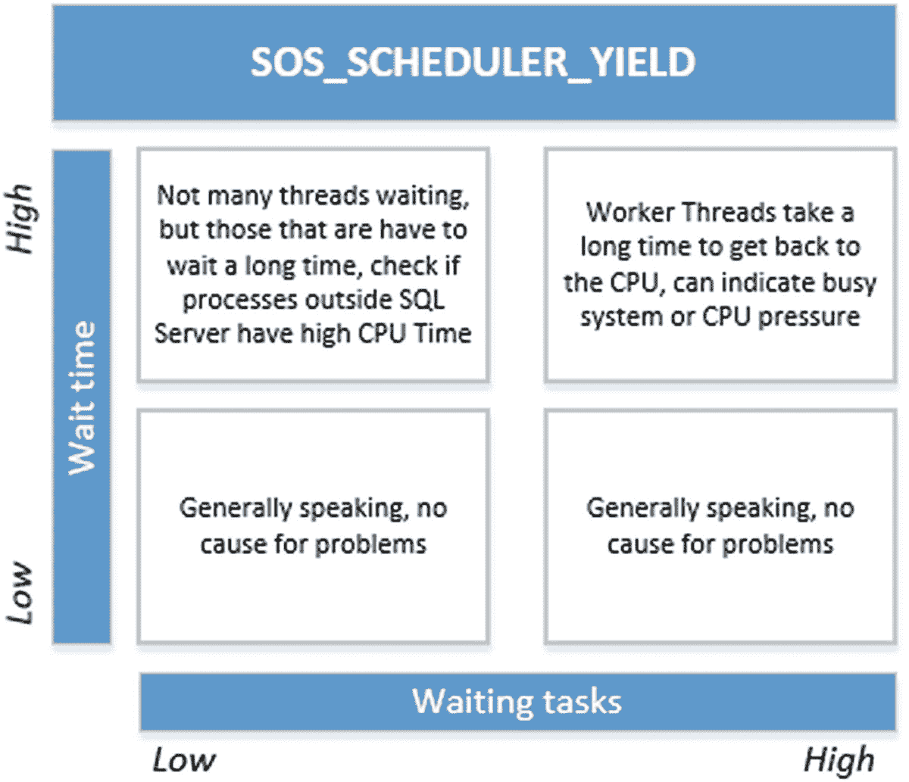

一张关于 S O S_scheduler_yield 等待类型的图表。它绘制了等待时间与等待任务的关系图。工作线程的特征分布在 4 个象限中。

图 5-12 `SOS_SCHEDULER_YIELD` 情况

让我们看看如何分析和解决 SQL Server CPU 压力问题。


##### 降低 `SOS_SCHEDULER_YIELD` 等待

如果您遇到异常高的 `SOS_SCHEDULER_YIELD` 等待时间，并且总体等待次数也很多，那么您的系统可能存在**与 CPU 相关的问题**。要降低 `SOS_SCHEDULER_YIELD` 等待，我们将重点关注图 5-12 右上角的部分，那里显示了大量的等待任务和很长的等待时间。

如果您遇到 `SOS_SCHEDULER_YIELD` 等待类型的高等待时间，同时伴有大量等待任务，那么您的 SQL Server 实例可能非常繁忙。工作线程会让出处理器，但需要很长时间才能重新回到处理器上，因为可运行队列中有许多其他线程在等待。正如我们在第 1 章“等待统计信息内部原理”中讨论的，可运行队列是一个先进先出（FIFO）列表，这意味着在可运行队列中等待的工作线程越多，工作线程通过队列所需的时间就越长。您通常会在系统上看到 `sqlservr` 进程导致很高的 CPU 使用率。

为了演示这个问题，我们将使用 `Ostress` 实用程序从多个线程同时执行一个特定查询。`Ostress` 实用程序是 SQL Server 的 RML 实用程序的一部分，可在此处获取：[`​slrwnds.​com/​ixhxj4`](https://slrwnds.com/ixhxj4)。

安装好实用程序后，我们首先将一个脚本保存到本地文件。在此例中，我们将其保存到测试服务器上的文件夹 `C:\TeamData\sos_scheduler_yield.sql`：

```
WHILE (1=1)
BEGIN
SELECT COUNT(*)
FROM Sales.SalesOrderDetail
WHERE SalesOrderID BETWEEN 45125 AND 44185
END;
```

代码清单 5-2
Ostress 脚本示例

此查询统计 `GalacticWorks` 数据库中 `Sales.SalesOrderDetail` 表里两个 `SalesOrderID` 之间的行数。它将在一个无限循环中执行此操作。将查询保存到本地文件后，我们使用如下命令启动 `Ostress` 实用程序，如代码清单 5-3 和图 5-13 所示：

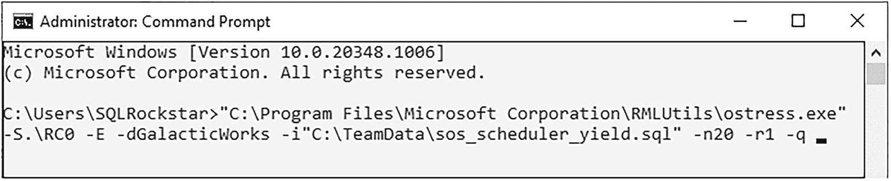

一个用于 Ostress 代码执行的窗口屏幕截图。该窗口显示了执行命令。

图 5-13

使用命令提示符执行的 Ostress 示例代码

```
"C:\Program Files\Microsoft Corporation\RMLUtils\ostress.exe" -S.\RC0 -E -dGalacticWorks -i"C:\TeamData\sos_scheduler_yield.sql" -n20 -r1 -q
```

代码清单 5-3
Ostress 示例代码

这会启动 `Ostress` 实用程序，该程序连接到 `GalacticWorks` 数据库并使用 20 个线程执行 `sos_scheduler_yield.sql` 脚本。

一旦我们启动 `Ostress`，测试 SQL Server 的 CPU 使用率立刻飙升到 100%，如图 5-14 所示。

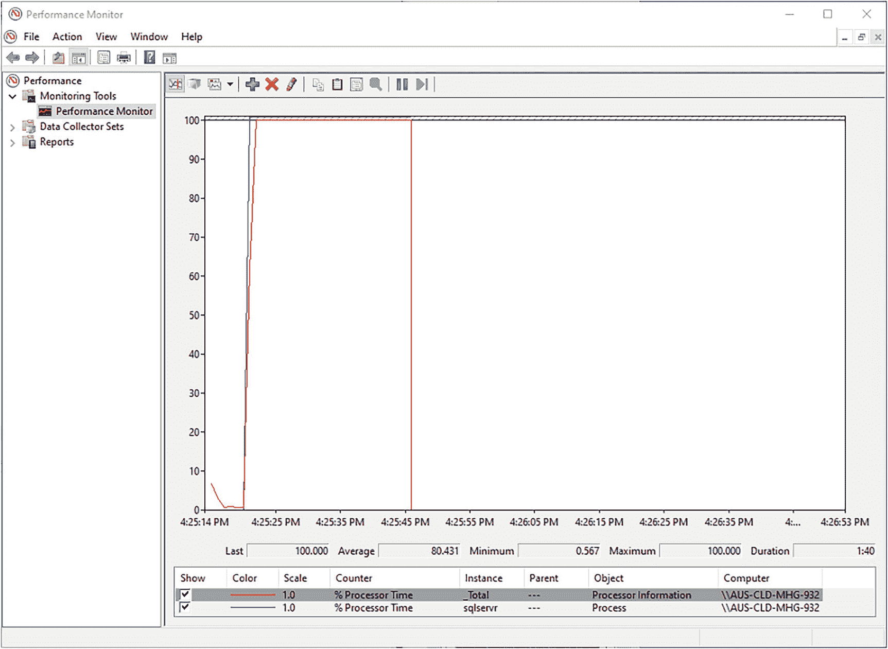

性能监视器图表的屏幕截图。该图表有两条阴影线，并提供了有关比例、颜色、计数器、实例、父项、对象和计算机的信息。

图 5-14

Ostress 对 CPU 的影响

如您在图 5-14 中所见，CPU 负载是由 `sqlservr` 进程产生的，这正是我们运行 `Ostress` 查询所针对的 SQL Server 实例。如果我们查询 `sys.dm_os_waiting_tasks` DMV 以检查 `SOS_SCHEDULER_YIELD` 等待类型是否是导致高 CPU 使用率的原因，结果可能会出乎意料，如图 5-15 所示。

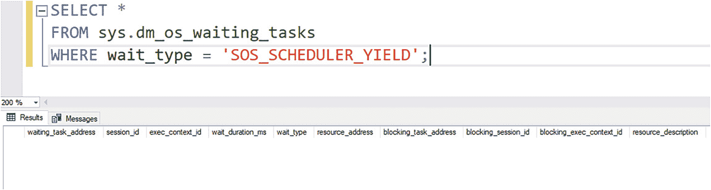

sys.dm_os_waiting_tasks 查询输出的屏幕截图。SOS_SCHEDULER_YIELD 的输出表有 11 列和 0 行。

图 5-15

未发生 `SOS_SCHEDULER_YIELD` 等待

这正是 `SOS_SCHEDULER_YIELD` 等待类型的棘手之处，因为它通常不会被 `sys.dm_os_waiting_tasks` DMV 返回——这也是需要捕获并使用等待统计信息基线的又一个原因！


为了说明高 CPU 使用率与`SOS_SCHEDULER_YIELD`等待类型相关，我们查看了累积等待统计信息 DMV——`sys.dm_os_wait_stats`。我们使用以下查询来显示按等待时间排序的前 5 种等待类型，同时运行 Ostress 工具（在启动 Ostress 工具之前重置 DMV，以使数字保持较小）：

```sql
SELECT TOP 5 *
FROM sys.dm_os_wait_stats
ORDER by wait_time_ms DESC;
```

此查询的结果如`图 5-16`所示。

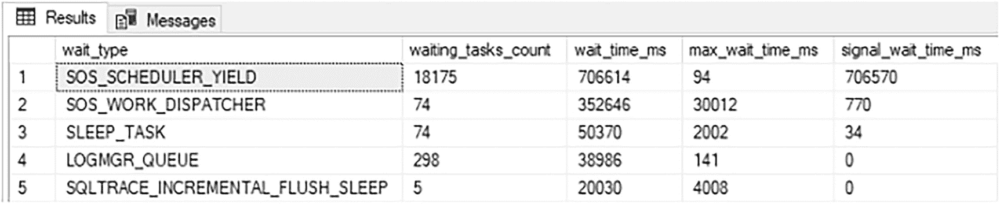

`图 5-16` - Ostress 执行期间的前 5 种等待类型

如你所见，排名第一的等待类型是`SOS_SCHEDULER_YIELD`，其`waiting_tasks_count`和总`wait_time_ms`都很高。但在第二位，我们发现了`SOS_WORK_DISPATCHER`等待，这是 SQL2019 引入的一种新等待。`SOS_WORK_DISPATCHER`等待记录的是线程处于空闲状态、等待分配工作的时间。

如果你在生产环境 SQL Server 实例上遇到 CPU 问题，你可能首先要关注非常小、非常快的查询，就像本示例中执行的那些。如果这些查询的吞吐量增加，或者执行这些查询的 SQL Server 的用户连接数增加，那么你可能会看到高 CPU 使用率。事务或用户连接的突然增长也可能导致高`SOS_SCHEDULER_YIELD`等待时间。

导致高`SOS_SCHEDULER_YIELD`等待以及极高 CPU 使用率的另一个原因，可能是一种称为自旋锁争用的现象。自旋锁被定义为“用于保护数据结构访问的轻量级同步原语”，这是一个非常高级的主题。本书后面的附录二对自旋锁进行了更详细的介绍，供有兴趣了解更多的人参考。

非常庞大、复杂的查询也可能导致更高的`SOS_SCHEDULER_YIELD`等待时间。尝试查找那些消耗大量 CPU 时间、内部包含复杂计算或数据类型转换的活动查询。我经常用来识别高 CPU 消耗查询的一个查询如`清单 5-4`所示。

```sql
SELECT TOP 10
QText.TEXT AS 'Query',
QStats.execution_count AS 'Nr of Executions',
QStats.total_worker_time/1000 AS 'Total CPU Time (ms)',
QStats.last_worker_time/1000 AS 'Last CPU Time (ms)',
QStats.last_execution_time AS 'Last Execution',
QPlan.query_plan AS 'Query Plan'
FROM sys.dm_exec_query_stats QStats
CROSS APPLY sys.dm_exec_sql_text(QStats.sql_handle) QText
CROSS APPLY sys.dm_exec_query_plan(QStats.plan_handle) QPlan
ORDER BY QStats.total_worker_time DESC;
```

`清单 5-4` - 检测高 CPU 消耗的查询

在我测试的 SQL Server 上执行`清单 5-3`中的查询结果如`图 5-17`所示。

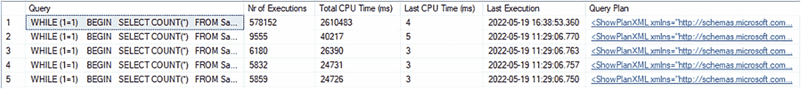

`图 5-17` - 高 CPU 消耗的查询

如你所见，与 Ostress 工具一起使用的查询是执行次数最多、消耗总 CPU 时间最高的查询。这个查询是调查的一个很好的起点。也许可以对这个查询进行优化或重写，使其不会消耗如此多的 CPU 时间。

另一种识别高 CPU 消耗查询的方法是使用查询存储。查询存储提供了一个名为“前 N 个资源消耗查询”的内置报告，允许你按 CPU 时间进行筛选，如`图 5-18`所示。

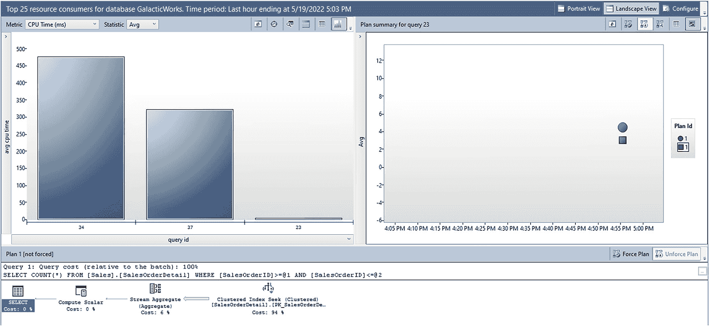

`图 5-18` - 通过查询存储可视化高 CPU 消耗的查询

##### SOS_SCHEDULER_YIELD 总结

`SOS_SCHEDULER_YIELD`等待类型将出现在每个 SQL Server 实例上，因为它与 SQL Server 用来授予工作线程访问处理器权限的调度模型直接相关。如果与基线测量相比，总等待时间或总等待任务数突然增加，则可能表明存在问题。大多数情况下，`SOS_SCHEDULER_YIELD`等待的大幅增加也意味着 CPU 负载的增加。这种增加要么是由 SQL Server 进程本身引起的，要么是由 SQL Server 外部需要大量处理器时间、从而限制了 SQL Server 访问处理器时间的另一个进程引起的。如果 CPU 负载的增加是由 SQL Server 进程负责的，你应该尝试将`SOS_SCHEDULER_YIELD`等待的增加与用户活动的增加关联起来。另一个选择是查询`sys.dm_exec_query_stats` DMV，如`清单 5-1`所示，或使用查询存储来找到那些需要最多处理器时间的查询，并专注于优化这些查询。

### THREADPOOL

最臭名昭著的等待类型之一是`THREADPOOL`。与即使在你的 SQL Server 实例没有遇到任何问题时也会发生的`CXPACKET`和`SOS_SCHEDULER_YIELD`不同，高的`THREADPOOL`等待时间通常表示存在性能问题。就像前面讨论的其他两种与 CPU 相关的等待类型一样，`THREADPOOL`等待类型与 SQL Server 调度的工作方式密切相关。


#### 什么是 `THREADPOOL` 等待类型？

如果你在系统上看到 `THREADPOOL` 等待，并且等待时间比平时更长，同时你的 SQL Server (几乎) 无响应，那么你很可能遇到了一个称为 **线程池饥饿** 的问题。线程池饥饿发生在没有空闲的工作线程来处理请求时。当这种情况发生时，当前等待被分配到工作线程的任务将记录 `THREADPOOL` 等待类型。

SQL Server 为调度程序提供一定数量的工作线程来处理请求。系统可用的工作线程数量取决于处理器数量和处理器架构。表 5-1 显示了最多具有 64 个逻辑 CPU 的系统的最大可用工作线程数量。

**表 5-1**
最大工作线程数

| CPU 数量 | 32 位架构 | 64 位架构 |
| --- | --- | --- |
| ≤4 | 256 | 512 |
| 8 | 288 | 576 |
| 16 | 352 | 704 |
| 32 | 480 | 960 |
| 64 | 736 | 1472 |

你也可以使用以下公式计算可用的最大工作线程数：

32 位架构，逻辑处理器 <= 4：256 个工作线程
32 位架构，逻辑处理器 > 4：`256 + ((逻辑处理器数量 − 4) × 8)`

64 位架构，逻辑处理器 <= 4：512 个工作线程
64 位架构，逻辑处理器 > 4：`512 + ((逻辑处理器数量 − 4) × 16)`

尽管 SQL Server 会自动计算可用的最大工作线程数（仅在启动期间计算一次），但你可以选择通过更改 SQL Server 实例的“处理器”属性中的 `最大工作线程数` 选项来覆盖默认值，如图 5-19 所示。默认情况下，`最大工作线程数` 选项的值为 0，这意味着 SQL Server 将使用前述公式计算并分配可用的最大工作线程数。

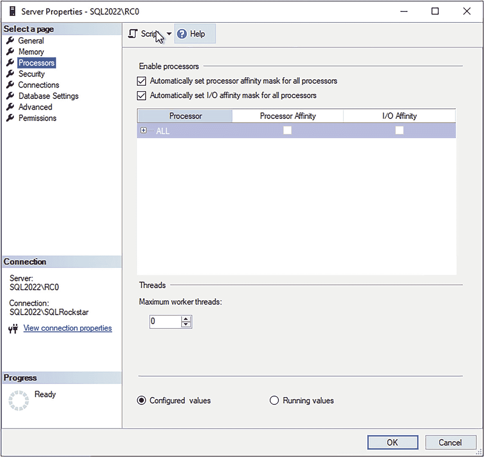

一个 S Q L Server 属性窗口的截图。左侧的处理器选项打开了所有处理器的处理器关联性和 I/O 关联性的可选设置。

**图 5-19**
SQL Server 实例的处理器配置

你也可以通过运行以下查询来查询分配给你的 SQL Server 实例的工作线程数量：
```sql
SELECT max_workers_count
FROM sys.dm_os_sys_info;
```
对于我的具有 4 个逻辑处理器的 64 位测试 SQL Server，我有 512 个工作线程可用，如图 5-20 所示。

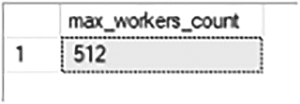

一个最大工作线程数的截图。数量 512 被突出显示。

**图 5-20**
我的测试机上的工作线程数量

互联网上关于 `THREADPOOL` 等待的一条建议是，将 `最大工作线程数` 选项更改为高于默认值的某个值。我强烈建议不要将此选项从其默认值更改。将该设置更改为高于工作线程数量的值可能会降低 SQL Server 的性能，因为上下文切换会更频繁地发生。另一个不要更改此设置的原因是，每个工作线程都需要一点内存来运行；对于 32 位系统，每个工作线程是 512 KB，对于 64 位系统，则是 2048 KB。

#### `THREADPOOL` 示例

让我们从一个 `THREADPOOL` 等待的示例开始。尽管我已经多次警告你不要在本书中将任何演示脚本运行在生产环境中，但这个例子值得特别提醒。运行本节中的演示脚本可能导致你的 SQL Server 完全无响应，不接受任何新连接，并最终可能需要重启 SQL Server 服务！`请勿在不允许变得无响应的 SQL Server 上运行此脚本`！

在这个例子中，我们再次使用 `Ostress` 实用工具来模拟对测试 SQL Server 实例的并发和负载。首先，我们创建另一个 `.sql` 文件 (`select_rnd.sql`)，其中包含我们将使用 `Ostress` 执行的以下查询：
```sql
SELECT TOP 1 *
FROM Sales.SalesOrderDetail
ORDER BY NEWID()
OPTION (MAXDOP 1);
```
此查询将从 `GalacticWorks` 数据库的 `Sales.SalesOrderDetail` 表中随机选择一行。我包含这个查询选项以串行运行此查询是有原因的，稍后我会解释。

现在，在我们启动 `Ostress` 执行查询之前，我们特意要降低测试 SQL Server 上可用的最大工作线程数。为此，我们执行此查询：
```sql
EXEC sp_configure 'show advanced options', 1;
GO
RECONFIGURE
GO
EXEC sp_configure 'max worker threads', 128;
GO
RECONFIGURE
GO
```
这将设置可用的最大工作线程数为 128，这是 64 位 SQL Server 实例的最小值。

让我们启动 `Ostress` 并执行我们之前创建的 `.sql` 脚本：
```
"C:\Program Files\Microsoft Corporation\RMLUtils\ostress.exe" -S.\RC0 -E -dGalacticWorks -i"C:\select_rnd.sql" -n150 -r10 -q
```
在这个案例中，我们启动 150 个不同的线程来执行 `select_rnd.sql` 文件中的查询 10 次。生成 150 个线程的原因是因为 150 现在高于测试 SQL Server 实例上可用的最大工作线程数，但又不至于高到让我们无法再执行查询。

当脚本正在运行时，让我们使用 `sys.dm_os_schedulers` DMV 查看正在运行和等待的工作线程数量：
```sql
SELECT scheduler_id,
current_tasks_count,
runnable_tasks_count,
current_workers_count,
active_workers_count,
work_queue_count
FROM sys.dm_os_schedulers
WHERE status = 'VISIBLE ONLINE';
```
**代码清单 5-5**
查询 `sys.dm_os_schedulers`

此查询的结果如图 5-21 所示。

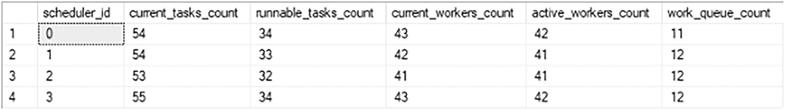

一个查询输出的截图。输出表有 7 列和 4 行。第 1 行中的调度程序 I D 0 被突出显示。

**图 5-21**
每个调度程序的任务和工作线程

这里最重要的列是 `current_workers_count`、`active_workers_count` 和 `work_queue_count` 列。`current_workers_count` 列显示与此调度程序关联的工作线程数；此数字还包括尚未分配给任务的工作线程。`active_workers_count` 列返回处于“RUNNING”、“RUNNABLE”或“SUSPENDED”状态的工作线程数。`current_workers_count` 和 `active_workers_count` 列之间的巨大区别在于，`active_workers_count` 是已分配给任务的工作线程数，而 `current_workers_count` 返回所有工作线程。`work_queue_count` 列向我们显示当前等待分配工作线程的任务数量。如果你在所有调度程序的此列中看到值长时间高于 0，那么你正在经历线程池饥饿。

让我们检查 `sys.dm_os_waiting_tasks` DMV，查找源自用户会话的等待任务。注意，我们过滤掉了所有会话 ID 小于 50 的会话，尽管我在第 2 章“查询 SQL Server 等待统计信息”中告诉过你不要这样做：
```sql
SELECT *
FROM sys.dm_os_waiting_tasks
WHERE session_id > 50;
```


如果我们检查测试 SQL Server 实例上的结果，可能会得出没有任务正在等待的结论，如图 5-22 所示。然而，测试 SQL Server 的响应速度异常缓慢，查询任何内容都需要数秒钟。


查询输出的屏幕截图。输出表包含 8 列 0 行。

图 5-22

没有任务正在等待

让我们在不筛选会话 ID 的情况下检查 `sys.dm_os_waiting_tasks` DMV：

```
SELECT *
FROM sys.dm_os_waiting_tasks;
```

如图 5-23 所示，`THREADPOOL` 等待并未记录为用户会话，其会话 ID 为空。这是我总是建议不要在 `sys.dm_os_waiting_tasks` DMV 中按会话 ID 进行筛选的原因之一。

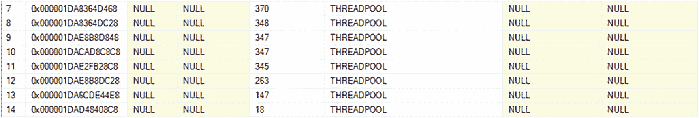

查询输出中线程池等待的屏幕截图。输出有 8 列。第三、第四、第七和第八列中的 null 输出带有阴影。

图 5-23

`THREADPOOL` 等待

存在大量的 `THREADPOOL` 等待，其等待时间各不相同，有些甚至长达数秒。不过，情况比这更糟。图 5-24 显示了我在运行 Ostress 工具时尝试连接到我的测试 SQL Server 实例时遇到的一个错误。

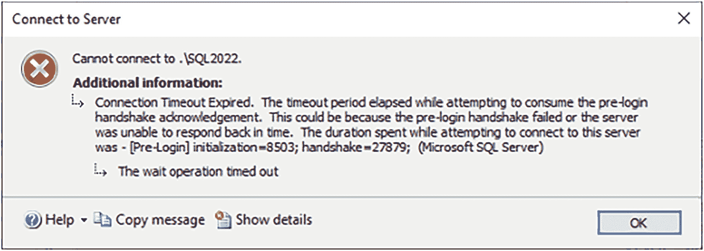

一个带有错误消息的窗口屏幕截图。标题为“连接到服务器”的窗口显示了错误消息“无法连接到 SQL Server”，并提供了附加信息。

图 5-24

发生超时且 SQL Server 无响应

此错误是 SQL Server 无法处理任何额外登录请求的结果。

现在我们已经看到了线程池匮乏可能引发的问题类型，接下来让我们看看如何降低甚至解决 `THREADPOOL` 等待。

#### 在 `THREADPOOL` 等待期间访问我们的 SQL Server

`THREADPOOL` 等待很难进行故障排查，主要是因为有多种可能导致你的 SQL Server 没有可用的空闲工作线程。此外，`THREADPOOL` 等待可能完全锁定你的 SQL Server 实例，使得连接到它（并对其进行故障排查）几乎不可能，正如你在前面的例子中看到的那样。

确保你不会陷入无法连接到 SQL Server 实例进行故障排查境地的第一步是启用专用管理员连接（或 DAC）。如果你还记得第 1 章“等待统计内部原理”中关于调度器的部分，你可能会想起一种为 DAC 保留的特殊调度器类型。这个专用调度器（如图 5-25 所示）严格保留给 DAC 使用，并且可以访问其自己的工作线程。


一个 DAC 调度器的屏幕截图。该表有 9 列 12 行。列出了调度器地址、父节点 ID、调度器 ID、CPU ID、状态、在线、空闲和切换次数。

图 5-25

专用管理员连接调度器

如果你通过 DAC 连接到 SQL Server 实例，你的会话将映射到 DAC 调度器。这使得即使所有其他调度器都有大量任务队列，也可以连接并执行查询。

你可以通过执行以下查询来启用 DAC：

```
sp_configure 'remote admin connections', 1
GO
RECONFIGURE
GO
```

如果你想使用 DAC 连接到 SQL Server 实例，需要在要连接的服务器名称前添加 `ADMIN:` 前缀，如图 5-26 所示。只有在未连接到服务器的情况下，从 SQL Server Management Studio 内部执行新查询时，才能使用 DAC 进行连接。

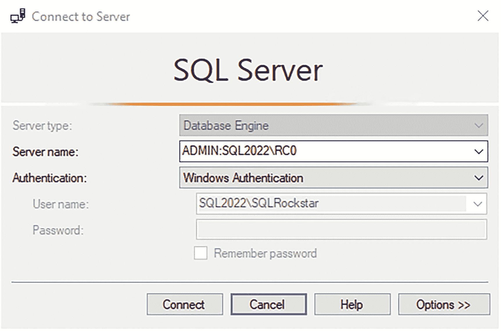

SQL Server 连接窗口的屏幕截图。该窗口有服务器类型、服务器名称、身份验证、用户名和密码的下拉菜单。服务器名称字段处于活动状态。

图 5-26

使用专用管理员连接进行连接

你也可以使用 `SQLCMD` 通过 DAC 连接，可以在声明服务器实例名称时使用 `ADMIN:` 前缀，或使用 `-A` 参数标志。一旦你能够使用 DAC 连接到 SQL Server 实例，你就始终有一条进入途径，即使 SQL Server 实例不接受任何新连接。

启用 DAC 后，让我们讨论一下 `THREADPOOL` 等待的一些常见原因。

#### 降低由并行度引起的 `THREADPOOL` 等待

`THREADPOOL` 等待最常见的原因之一与查询执行期间广泛使用并行度有关。在并行查询执行期间，会使用多个工作线程来执行所需的工作。如果你将与并行度相关的配置选项——`最大并行度` 和 `并行度的成本阈值`——保留为默认值，可能会导致比预期更多的查询并行运行。根据你的 SQL Server 可访问的处理器数量以及并行查询期间使用的工作线程数量，单个并行查询可能需要许多工作线程。

为了展示这种行为，我修改了用于生成 `THREADPOOL` 等待的查询，使其使用并行度执行。在此情况下，我注释掉了 `MAXDOP` 查询选项：

```
SELECT TOP 1 *
FROM Sales.SalesOrderDetail
ORDER BY NEWID()
-- OPTION (MAXDOP 1)
```

对于此示例，我还将 `最大并行度` 配置为其默认值 `0`，并将 `并行度的成本阈值` 选项设置为 `1`。这样我百分百确定查询将使用并行度运行。我将 `最大工作线程数` 选项保留为我们先前配置的值 `128`。

现在，我们通过执行以下命令，重复本章前面执行的相同 `Ostress` 测试：

```
"C:\Program Files\Microsoft Corporation\RMLUtils\ostress.exe" -S.\RC0 -E -dGalacticWorks -i"C:\select_rnd.sql" -n150 -r10 -q
```

如果我们查询 `sys.dm_os_waiting_tasks` DMV，应该会再次看到 `THREADPOOL` 等待发生，但这一次，由于我们的测试查询是并行执行的，我们还会发现 `sys.dm_os_waiting_tasks` DMV 返回了许多 `CX*` 等待，如图 5-27 所示。

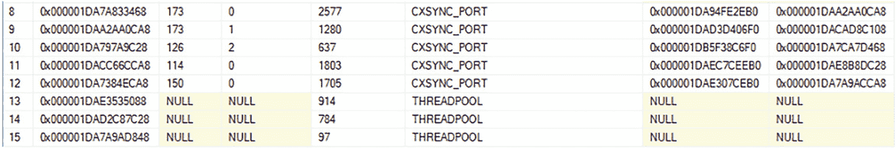

查询输出的屏幕截图。该表有 7 列 8 行。第 6 列列出了 CX SYNC underscore PORT 和线程池等待。

图 5-27

`CXSYNC_PORT` 和 `THREADPOOL` 等待

如果你在 SQL Server 实例上看到 `THREADPOOL` 和并行度等待同时出现，值得花时间检查你的并行度配置。本章第一节讨论了 `CXPACKET` 等待以及如何降低它们。另一个可能引导你朝这个方向思考的线索是，在此特定情况下 CPU 负载高于正常水平。在我的测试 SQL Server 实例中，我的所有 CPU 都达到了 100%。


##### 降低由用户连接引起的 THREADPOOL 等待

THREADPOOL 等待的另一个常见原因是用户连接和针对您的 SQL Server 实例执行查询的数量突然增加。例如，如果连接到 SQL Server 实例的应用程序使用多个连接，就可能出现此问题。这里的主要问题是这些连接保持活动状态并不断获取工作线程。

为了举例说明这个问题，我们将再次使用 Ostress 连接到我的测试 SQL Server 实例并执行查询。这次，我们将使用一个不同的 `.sql` 文件（保存为 `wait.sql`）作为 Ostress 的输入，其中包含以下查询：

```sql
WAITFOR DELAY '00:05:00'
```

此查询唯一的作用就是等待 5 分钟。5 分钟后，查询将结束，连接将断开。让我们使用 `wait.sql` 文件运行 Ostress：

```shell
"C:\Program Files\Microsoft Corporation\RMLUtils\ostress.exe" -S.\RC0 -E -dGalacticWorks -i"C:\TeamData\wait.sql" -n140 -r1 -q
```

我们将 Ostress 生成的线程数更改为 140，并再次将“最大工作线程数”选项保留设置为 128 个工作线程。

当我们使用以下查询查询 `sys.dm_exec_sessions` DMV 时，可以看到许多由 Ostress 工具生成的新用户会话处于活动状态，如图 5-28 所示。

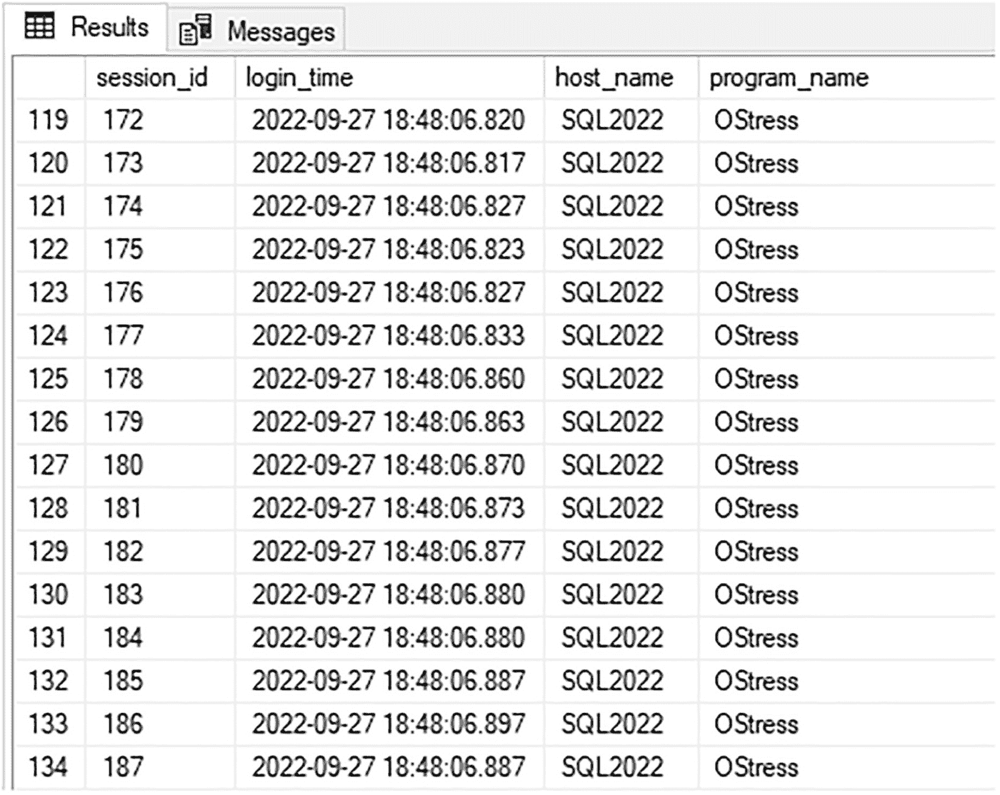

`sys.dm_exec_sessions` 查询输出的截图。输出表有 5 列和 16 行。列列出了会话 ID、登录时间、主机名和程序名。

图 5-28

Ostress 用户会话

```sql
SELECT *
FROM sys.dm_exec_sessions
WHERE is_user_process = 1;
```

如果我们查询 `sys.dm_os_waiting_tasks` DMV，也会看到 THREADPOOL 等待正在发生，如图 5-29 所示。


查询输出的截图。输出表有 8 列和 2 行。第 6 列列出了线程池等待。

图 5-29

`sys.dm_os_waiting_tasks` DMV 内部的 THREADPOOL 等待

由过度并行化引起的 THREADPOOL 等待与用户连接增加引起的等待之间的最大区别在于，在后一种情况下，我的测试 SQL Server 实例的 CPU 保持较低水平，如图 5-30 所示。

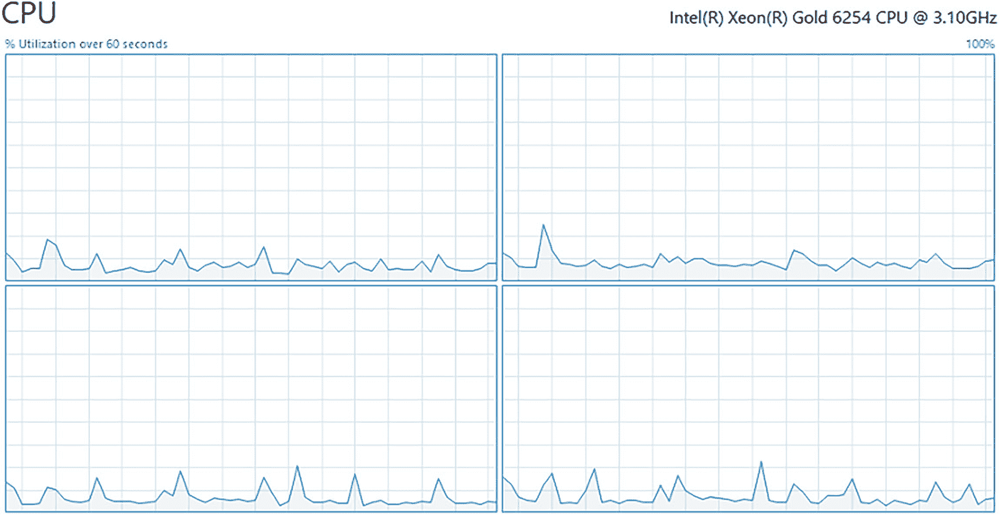

两张图表说明了 CPU 利用率。线条几乎直线移动，带有尖锐的峰值，并显示了 60 秒内的利用率百分比。两张图的右端都标记为 100%。

图 5-30

CPU 使用率

CPU 使用率历史记录图中的小尖峰是由启动 Ostress 工具引起的。之后，CPU 保持在恒定的低使用率百分比。

解决由用户连接增加引起的 THREADPOOL 等待应从源头开始。分析用户连接来自哪里，并查看这些连接正在执行的查询。我见过一些情况，应用程序在更新后突然使用了数百个活动用户连接，而 SQL Server 实例并未设计为处理如此大量的并发活动连接，从而导致出现 THREADPOOL 等待。

请记住，用户连接只有在执行查询时才应引起 THREADPOOL 等待。连接到 SQL Server 实例但未执行任何操作的用户连接不应成为 THREADPOOL 等待的原因。

此外，针对数据库的大量不同用户活动连接可能会在行或表上产生许多锁。如果您在注意到与锁相关的高等待时间的同时还存在 THREADPOOL 等待，问题可能是正在发生的大量锁和阻塞。在这种情况下，您应尝试找出导致锁等待的查询，并查看是否可以对其进行优化。我们将在第 7 章“与锁相关的等待类型”中讨论与锁相关的等待类型以及您可以采取的措施。

##### THREADPOOL 总结

THREADPOOL 等待是在 SQL Server 实例上看到的最令人担忧的等待类型之一。它们的发生是因为没有足够的空闲工作线程来处理请求，因此请求工作线程的任务必须等到新的工作线程可用。值得庆幸的是，THREADPOOL 等待并不常见，因为它们有可能完全阻止您连接到 SQL Server 实例。在这种情况下，唯一的连接方式是使用专用管理员连接（或 DAC），我强烈建议您在所有 SQL Server 实例上启用此功能。

过度使用并行化和活动用户连接的大幅增加是 THREADPOOL 等待最常见的两个原因。前者与我们之前讨论的 `CXPACKET` 等待类型直接相关，因此解决 `CXPACKET` 等待类型的方法也有助于解决 THREADPOOL 等待。后者需要深入调查活动用户连接数量突然增加的原因。也许它们是应用程序连接到 SQL Server 实例时存在错误的结果。我们还简要提到了锁和阻塞行为作为 THREADPOOL 等待的可能原因。我们将在第 7 章“与锁相关的等待类型”中更深入地探讨如何解决与锁相关的等待。

## 6. 与 IO 相关的等待类型

在本章中，我们将从最广泛的意义上研究与 IO 相关的等待类型。我说“最广泛”是因为所选的等待类型也与您系统中的存储、内存或网络组件相关。可以说大多数等待类型可以归入多个类别，您是对的，但我需要防止本章涵盖 90% 的可用等待类型。

我认为本章中的等待类型与存储、内存或网络有直接关系，但与 SQL Server 中的功能或概念没有直接关系。例如，`PAGEIOLATCH_xx` 等待类型经常与存储相关，但它们未包含在本章中。原因是它们也是一种自旋锁（latch）等待类型，我认为自旋锁等待类型由于其 SQL Server 中的功能值得单独成章。

与 IO 相关的组件的性能对 SQL Server 极其重要。SQL Server 的几乎所有部分都以某种方式与 IO 组件交互，无论是需要从磁盘读取到内存中的数据页，还是需要通过网络传输到最终用户的查询结果。如果这些组件之一无法处理 SQL Server 实例上生成的工作负载或配置不当，您的性能将会下降。

本章中的等待类型将帮助您追踪是哪个 IO 组件导致了速度下降，以便您可以采取适当措施预防或解决与性能相关的事件。

### ASYNC_IO_COMPLETION

`ASYNC_IO_COMPLETION` 等待类型是一种常见类型，当 SQL Server 在存储子系统上执行文件相关操作并等待操作完成时发生。当您执行与存储子系统交互的操作（如数据库备份、镜像或日志传送）时，会看到此等待类型。与大多数等待类型一样，如果您看到此等待类型出现，并不一定表示您的存储子系统存在问题。只有当等待时间比您根据基准值（我们在第 4 章“构建可靠的基准”中讨论过）预期的要长时，它才是一个问题。


#### 什么是 ASYNC_IO_COMPLETION 等待类型？

如果我们在联机丛书（BOL）中查找 `ASYNC_IO_COMPLETION` 等待类型，会看到以下定义：“当任务正在等待异步非数据 I/O 完成时出现”。这是一个相当简短且模糊的定义，因此让我们补充更多细节。

当任务等待与存储相关的操作完成时，就会发生 `ASYNC_IO_COMPLETION` 等待。该任务由 SQL Server 发起并监控。图 6-1 以视觉方式展示了这种等待类型。

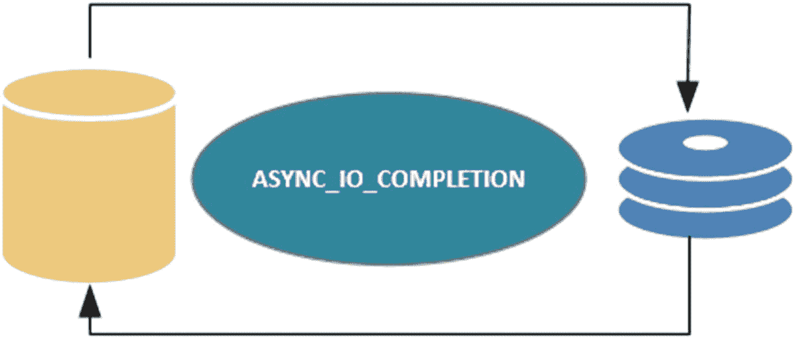

一张展示异步 I/O 完成时数据如何流经 SQL Server 的示意图。图 6-1：正在发生的 ASYNC_IO_COMPLETION 等待

只要与存储相关的操作正在运行，就会记录 `ASYNC_IO_COMPLETION` 等待时间。正如你所想，你的存储子系统（或网络带宽）越快，`ASYNC_IO_COMPLETION` 等待时间就越低。这里需要提到的关键字是**异步**；任务被移交给操作系统，并将控制权返回给 SQL Server，这使得 SQL Server 可以自由执行其他逻辑，并在稍后检查 I/O 请求是否完成。

正如我之前所说，通常 `ASYNC_IO_COMPLETION` 等待无需担心。在许多需要访问存储子系统的 SQL Server 操作中，例如备份或创建新数据库，它们会正常发生。只有当与基线测量相比，等待时间高于预期时，才需要关注。

#### ASYNC_IO_COMPLETION 示例

让我们看一个产生 `ASYNC_IO_COMPLETION` 等待的例子。我们不需要任何额外工具；仅运行数据库备份就会触发 `ASYNC_IO_COMPLETION` 等待。

在这个例子中，我将在我的测试服务器上对 `GalacticWorks` 数据库执行备份。

为了执行此操作，我将使用清单 6-1 中的查询。此查询将重置 `sys.dm_os_wait_stats` DMV，执行数据库备份，然后查询 `sys.dm_os_wait_stats` DMV 以获取 `ASYNC_IO_COMPLETION` 等待。

```sql
USE [master];
DBCC SQLPERF('sys.dm_os_wait_stats', CLEAR);
BACKUP DATABASE [GalacticWorks]
TO DISK = N'C:\TeamData\GalacticWorks.bak'
WITH
NAME = N'GalacticWorks-Full Database Backup',
STATS = 2;
SELECT *
FROM sys.dm_os_wait_stats
WHERE wait_type = 'ASYNC_IO_COMPLETION';
```

清单 6-1：生成 `ASYNC_IO_COMPLETION` 等待

在我的测试 SQL Server 实例上，备份操作耗时 <1 秒。图 6-2 展示了清单 6-1 中查询的结果。


一个有 5 列和 1 行的表格。它列出了异步 I/O 完成的等待类型，等待任务数为 4，等待时间（毫秒）为 863，最大等待时间（毫秒）为 862，信号等待时间（毫秒）为 0。图 6-2：`ASYNC_IO_COMPLETION` 等待时间

如你所见，在几乎整个数据库备份期间，都记录了 `ASYNC_IO_COMPLETION` 等待。

#### 降低 ASYNC_IO_COMPLETION 等待

正如你在示例中所见，`ASYNC_IO_COMPLETION` 等待时间过高的一个常见原因是数据库备份。如果你想知道你的 `ASYNC_IO_COMPLETION` 等待是否因正在运行备份而发生，请查找同时发生的与备份相关的等待。

如果我们修改清单 6-1 中的最后一个 `sys.dm_os_waiting_tasks` 查询，我们将看到 DMV 返回与备份相关的等待类型。

```sql
SELECT *
FROM sys.dm_os_wait_stats
WHERE wait_type IN
(
'ASYNC_IO_COMPLETION',
'BACKUPIO',
'BACKUPBUFFER'
);
```

清单 6-2：修改后的查询

图 6-3 展示了清单 6-2 中查询的结果。

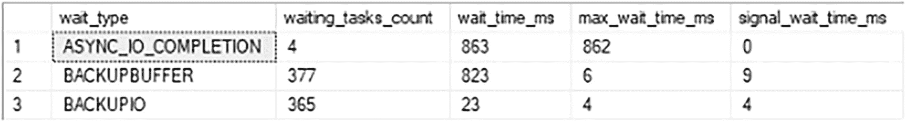

一个有 5 列和 3 行的表格。它列出了等待类型、等待任务数、等待时间（毫秒）、最大等待时间（毫秒）和信号等待时间（毫秒）。文件异步 I/O 完成被选中。图 6-3：`ASYNC_IO_COMPLETION` 等待与备份相关等待同时出现

如果你看到这两种等待同时发生，很可能是数据库备份导致了你的 `ASYNC_IO_COMPLETION` 等待。降低等待时间的一种方法是启用备份压缩。

另一种降低 `ASYNC_IO_COMPLETION` 等待的方法是配置即时文件初始化。即时文件初始化在 Windows 2003 中引入，通过省去将文件清零（在使用文件前在文件内写入零）的需要，极大地加快了在磁盘上分配空间的过程。这不会影响备份速度，但在创建数据库、向数据库添加文件或还原数据库时会提高性能。默认情况下，除非你运行 SQL Server 服务的账户具有本地管理员权限，否则不会启用即时文件初始化。从 SQL Server 2016 开始，Microsoft 在 SQL Server 安装过程中添加了一个选项来启用即时文件初始化，如图 6-4 所示。

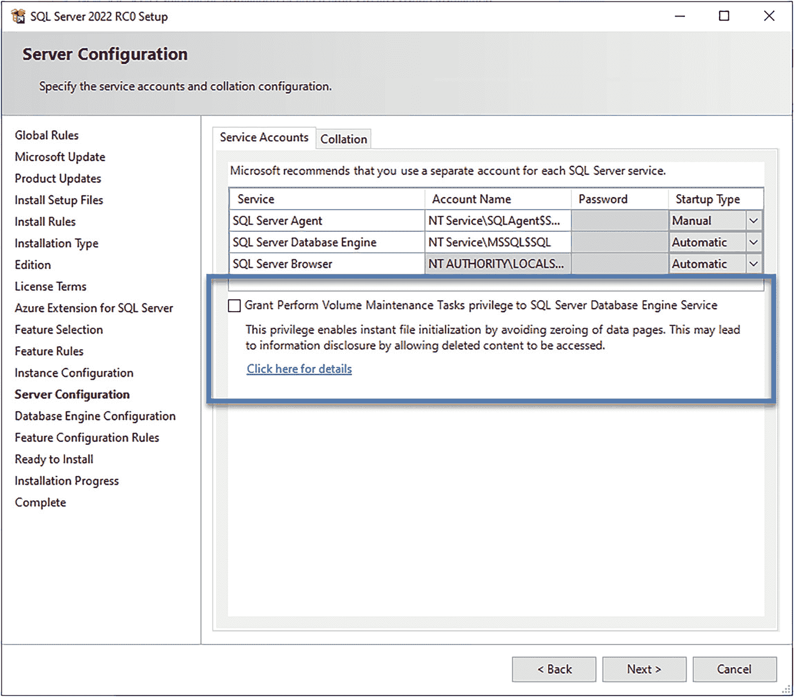

一个标有 SQL Server 2022 RC 0 安装的窗口。它在服务账户选项卡下显示服务器配置。列表下的选项“授予执行卷维护任务”被高亮显示。图 6-4：SQL Server 安装程序中的“授予 SQL Server 数据库引擎服务执行卷维护任务权限”复选框

**技术说明**

使用即时文件初始化省去了数据页清零的步骤，以换取更快的文件创建速度。这是用速度和便利性换取安全性的经典例子。通过避免清零，你为数据泄露打开了可能性，允许访问磁盘上已删除的数据。虽然风险很小，但它仍然是一个风险，你应该与你的审计团队讨论。

如果你在安装 SQL Server 时没有启用“授予 SQL Server 数据库引擎服务执行卷维护任务权限”复选框，你将必须在安装后手动配置即时文件初始化。配置即时文件初始化的方法是通过运行 SQL Server 的计算机上的本地安全策略，将你的 SQL Server 服务运行所使用的账户添加进去。较大的组织可能会选择部署组策略对象（GPO）以确保为其所有 SQL Server 实例自动配置此设置。

你可以通过打开控制面板中“管理工具”下的本地安全策略 MMC 来找到此策略。打开“本地策略” ➤ “用户权限分配”文件夹，向下滚动到“执行卷维护任务”策略，如图 6-5 所示。

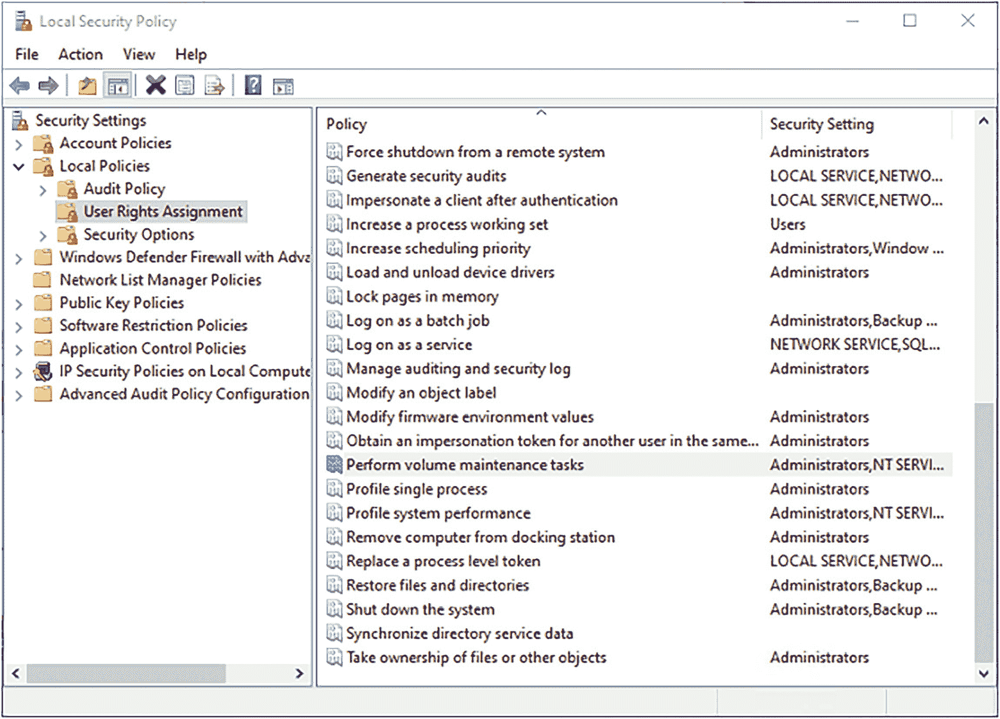

一个标有本地安全策略的窗口。选中了用户权限分配，其中列出了该策略下的文件，并且选中了执行卷维护任务。图 6-5


##### 配置执行卷维护任务本地策略

双击策略以打开它，并添加你的 SQL Server 服务运行所使用的账户。最后一步是重启你的 SQL Server 服务。重启后，SQL Server 就可以使用即时文件初始化了。

为了向你展示即时文件初始化的影响，我使用了清单 6-3 中的查询。这个查询清除了 `sys.dm_os_wait_stats` DMV，然后创建一个新的数据库，包含一个 500 MB 的数据文件和一个 100 MB 的日志文件。接着查询 `sys.dm_os_wait_stats` DMV 中的 `ASYNC_IO_COMPLETION` 等待类型。

```sql
DBCC SQLPERF('sys.dm_os_wait_stats', CLEAR);
CREATE DATABASE [IO_test]
ON  PRIMARY
( NAME = N'IO_test', FILENAME = N'E:\Data\IO_test.mdf' , SIZE = 512000KB , FILEGROWTH = 10% )
LOG ON
( NAME = N'IO_test_log', FILENAME = N'E:\Log\IO_test_log.ldf' , SIZE = 102400KB , FILEGROWTH = 10% );
SELECT *
FROM sys.dm_os_wait_stats
WHERE wait_type = 'ASYNC_IO_COMPLETION';
```
清单 6-3
测量即时文件初始化对 `ASYNC_IO_COMPLETION` 等待的影响

图 6-6 展示了配置即时文件初始化前后的等待统计信息。

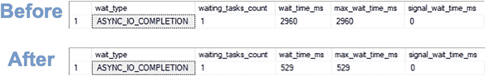

一个包含两个表格的屏幕截图。它列出了异步 I/O 完成的等待类型。之前的等待时间（毫秒）和最大等待时间（毫秒）为 2960，之后为 529，等待任务计数为 1，信号等待时间（毫秒）为 0。

图 6-6
即时文件初始化对 `ASYNC_IO_COMPLETION` 等待的影响

即使对于这个相对较小的数据库，使用即时文件初始化带来的提升也是相当大的，正如你在等待时间的差异中所见。启用即时文件初始化之前，清单 6-3 中的查询需要 3 秒完成；更改后，它降到了半秒。

如果你配置了即时文件初始化，并且同时检查到没有执行备份时却看到很高的 `ASYNC_IO_COMPLETION` 等待，那么问题可能出在你的存储子系统上。分析潜在存储问题的一种方法是使用 `Perfmon` 来监控数据库所在磁盘上的 `Physical Disk Avg. Disk/sec Read` 和 `Avg. Disk/sec Write` 计数器，如图 6-7 所示。这些计数器显示了你磁盘的读写延迟（以秒为单位）（这意味着值为 0.005 表示 5 毫秒）。SQL Server 在最大延迟为 5 毫秒时性能最佳。延迟值越高，存储相关等待类型的等待时间就越长。

**技术说明**

这些 `Perfmon` 计数器返回的值显示了 SQL Server 等待读写操作完成的时间。这些值包括总往返时间，这意味着它们包含了网络延迟或过载的 VM 内核所花费的时间，因此请注意检查 SQL Server 引擎与磁盘上存储的数据之间的所有基础设施层。

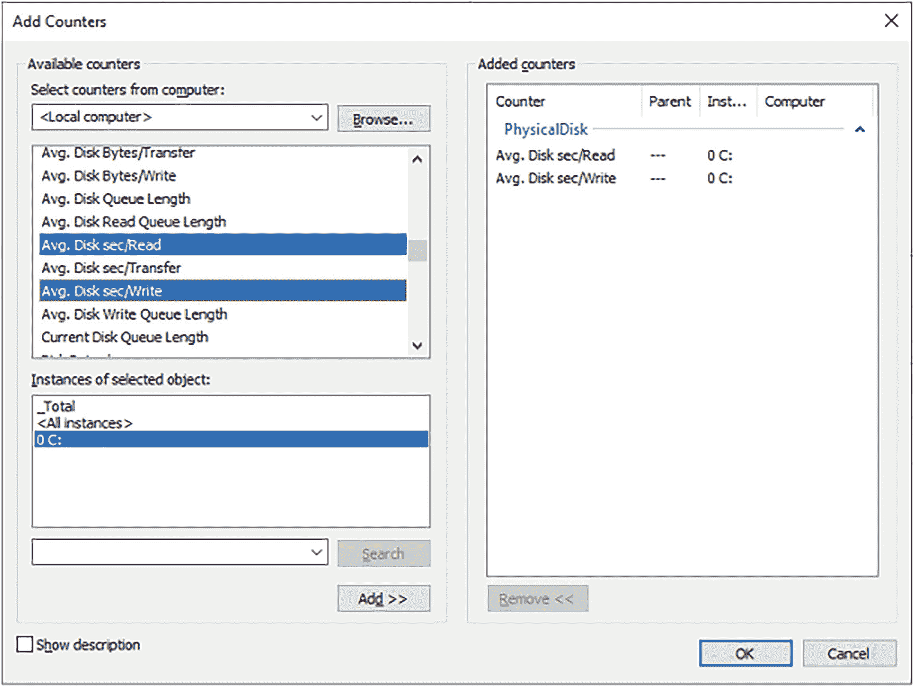

一个标记为“添加计数器”的窗口。它显示了“可用计数器”、“实例”和“已添加计数器”下的选项，其中选择了“平均磁盘秒/读取”和“平均磁盘秒/写入”。

图 6-7
`Avg. Disk sec/Read` 和 `Avg. Disk sec/Write` `Perfmon` 计数器

关于存储性能，不要急于下结论。在确定存储子系统是瓶颈之前，请务必与你的存储管理员（如果有）沟通，并向他们展示你的测量结果。存储是存储管理员的领域，他们可以帮助你分析和解决性能问题。

#### ASYNC_IO_COMPLETION 总结

`ASYNC_IO_COMPLETION` 等待类型发生在你从 SQL Server 实例执行与存储子系统相关的操作时，例如数据库备份和创建新数据库。虽然 `ASYNC_IO_COMPLETION` 等待是完全正常的，但如果等待时间高于正常值，它们可能表明存在存储相关问题。在你跑去找存储管理员之前，请确保确实存在性能问题。一种可能的方法是检查你的存储延迟，因为高延迟值也会影响 `ASYNC_IO_COMPLETION` 等待时间。同时检查较高的 `ASYNC_IO_COMPLETION` 等待时间是否与正在执行的数据库备份直接相关。降低 `ASYNC_IO_COMPLETION` 等待时间的一个好方法是，通过将你的 SQL Server 服务账户添加到 `Perfmon 卷维护任务` 本地策略来启用即时文件初始化。

### ASYNC_NETWORK_IO

与 `ASYNC_IO_COMPLETION` 等待类型类似，`ASYNC_NETWORK_IO` 也与吞吐量有关。但它不是关于存储子系统的吞吐量，而是关于你的 SQL Server 实例与客户端连接之间的网络连接。同样，看到这种特定等待类型的等待时间并不一定意味着存在网络相关问题，因为 `ASYNC_NETWORK_IO` 等待总是会发生，即使你在 SQL Server 本身查询你的 SQL Server 实例。

#### 什么是 ASYNC_NETWORK_IO 等待类型？

当客户端应用程序处理查询结果的速度不够快，或者存在网络相关的性能问题时，就会发生 `ASYNC_NETWORK_IO` 等待。前者最有可能，因为许多应用程序逐行处理 SQL Server 结果，或者不正确处理返回的数据量。SQL Server 将等待客户端应用程序确认已收到当前结果集，然后才会发送额外的结果。在 SQL Server 等待发送请求的数据时，会记录 `ASYNC_NETWORK_IO` 等待类型。另一种可能发生 `ASYNC_NETWORK_IO` 等待的情况是，当你使用链接服务器查询远程数据库时。图 6-8 展示了这一过程的图形化表示。

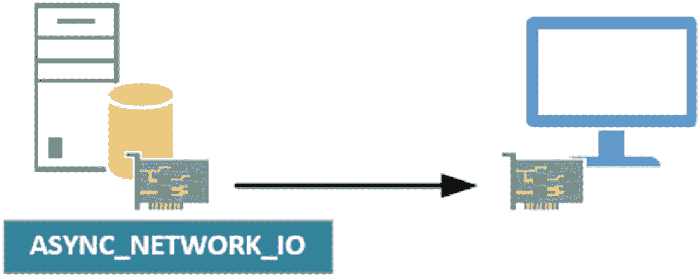

一个图形化的流程图定义了从异步网络 I/O 到本地数据库的数据流。

图 6-8
ASYNC_NETWORK_IO

#### ASYNC_NETWORK_IO 示例

展示 `ASYNC_NETWORK_IO` 等待类型的示例并不需要一个复杂的测试环境。清单 6-4 展示了一个查询，当我从另一台计算机使用 SQL Server Management Studio (`SSMS`) 针对我的测试 SQL Server 实例运行它时，它将生成 `ASYNC_NETWORK_IO` 等待，这应该就足够了。该查询将清除 `sys.dm_os_wait_stats` DMV，然后针对 `GalacticWorks` 数据库执行实际查询。最后一条语句将向我们展示 `ASYNC_NETWORK_IO` 等待类型的等待时间。

```sql
DBCC SQLPERF ('sys.dm_os_wait_stats', CLEAR);
SELECT *
FROM Person.Person;
SELECT *
FROM sys.dm_os_wait_stats
WHERE wait_type = 'ASYNC_NETWORK_IO';
```
清单 6-4
生成 `ASYNC_NETWORK_IO` 等待

图 6-9 显示了 `ASYNC_NETWORK_IO` 等待类型的等待时间。

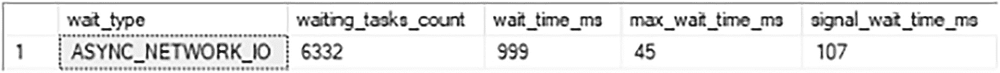

一个包含 5 列和 1 行的表格。它列出了异步网络 I/O 的等待类型，等待任务计数为 6332，等待时间（毫秒）为 999，最大等待时间（毫秒）为 45，信号等待时间（毫秒）为 107。

图 6-9
ASYNC_NETWORK_IO 等待时间

在这个例子中，针对 `GalacticWorks` 数据库的查询结果无法被 `SSMS` 应用程序处理得像 SQL Server 实例提供结果那样快，因此发生了 `ASYNC_NETWORK_IO` 等待。

**技术说明**

在这个例子中，值得再次提到这是一个单服务器；因此，没有出站网络流量。然而，对 SQL Server 来说，它被认为是一个网络等待，因为即使 `SSMS` 安装在同一台机器上，`SSMS` 也是数据库引擎的外部客户端。


#### 降低 ASYNC_NETWORK_IO 等待

降低 ASYNC_NETWORK_IO 等待的一种方法是识别那些将大量结果集返回给应用程序的查询。一个常见的例子是使用 `SELECT *` 的查询，它从一个宽表中返回所有列，而实际上只需要其中几列。在我们的例子中，如果我们修改查询只返回前 100 行，`SSMS` 也许就能跟上返回信息的速度。

```sql
DBCC SQLPERF ('sys.dm_os_wait_stats', CLEAR);
SELECT TOP 100 *
FROM Person.Person;
SELECT *
FROM sys.dm_os_wait_stats
WHERE wait_type = 'ASYNC_NETWORK_IO';
```
代码清单 6-5
限制为 100 行

此修改后的等待时间可以在图 6-10 中看到。

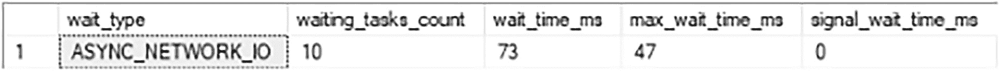
图 6-10
修改查询后的 ASYNC_NETWORK_IO 等待时间

如你所见，`ASYNC_NETWORK_IO` 等待减少了。`SSMS` 能够跟上返回的结果，因此 SQL Server 实例没有延迟将结果发送回客户端。

另一种限制返回结果的方法是使用 `WHERE` 子句过滤信息。结果集越小，`ASYNC_NETWORK_IO` 等待时间就越短。

如果你认为 `ASYNC_NETWORK_IO` 等待不是由返回给应用程序的大量结果或应用程序处理结果的速度引起的，那么可能是网络配置拖慢了你。在这种情况下，你应该首先检查你的网络利用率。遗憾的是，`Perfmon` 中并没有一个计数器可以直接显示网络利用率，而无需你进行一些计算。相反，你可以使用 `任务管理器` 的 `联网` 选项卡来查看你的网卡利用率，如图 6-11 所示。

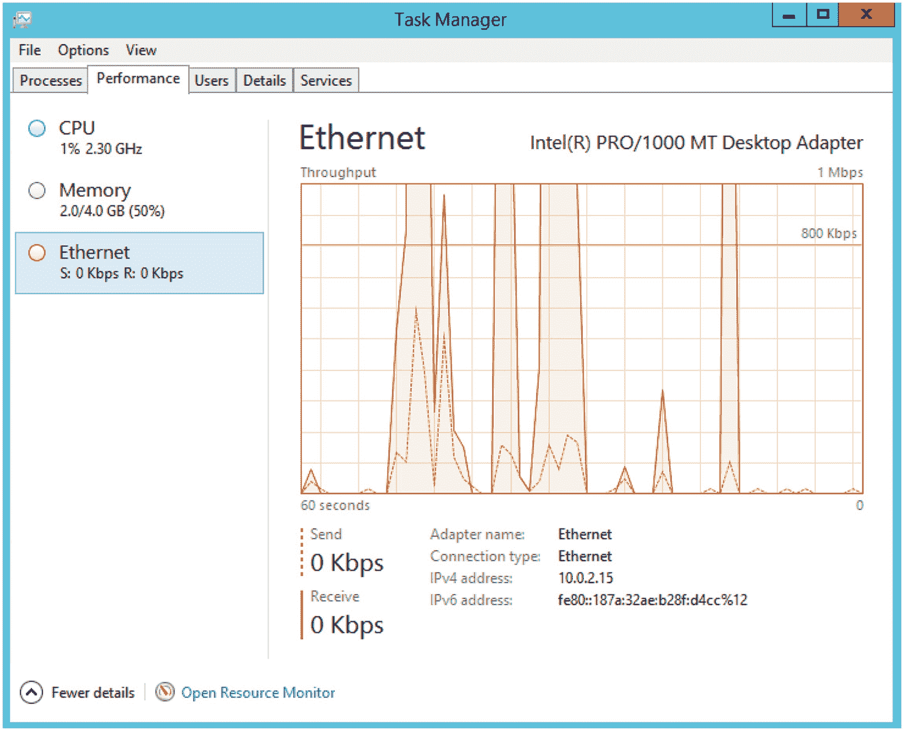
图 6-11
任务管理器网络利用率

如果你发现网络利用率很高，同时 `ASYNC_NETWORK_IO` 等待时间也高于正常水平，那么可能是网络拖慢了你。在这种情况下，最好与你的网络管理员沟通。通常，一个网络配置包含许多部分，如交换机、路由器、防火墙、网线、驱动程序、固件、操作系统的潜在虚拟化等等。所有这些部分都可能减慢你的网络吞吐量，并可能是 `ASYNC_NETWORK_IO` 等待的潜在原因。

#### ASYNC_NETWORK_IO 总结

`ASYNC_NETWORK_IO` 等待类型发生在应用程序通过网络从 SQL Server 实例请求查询结果，但处理返回结果的速度不够快时。看到 `ASYNC_NETWORK_IO` 等待发生是完全正常的，但高于正常水平的等待时间可能是由返回的查询结果发生变化或网络相关问题引起的。降低与应用程序相关的 `ASYNC_NETWORK_IO` 等待时间，可以通过减少返回给应用程序的行数和/或列数来实现。

### CMEMTHREAD

`CMEMTHREAD` 等待类型表明 SQL Server 相关的内存对象存在压力。这些内存对象为 SQL Server 的各个部分（如缓冲区和过程缓存）分配内存。每当发生 `CMEMTHREAD` 等待时，意味着多个线程试图同时访问同一个内存对象。

#### 什么是 CMEMTHREAD 等待类型？

为了解释 `CMEMTHREAD` 等待类型的产生机制，我们需要深入一些编程术语，特别是 `临界区`、`互斥` 和 `线程安全` 这几个术语。这三个概念在 `CMEMTHREAD` 等待类型的产生中起着直接作用。

一个 `临界区` 包含一段访问共享资源的代码，该资源一次只能由一个线程访问。在我们的例子中，共享资源将是 SQL Server 的一个内存对象（可能是一个数据页）。SQL Server 的内存对象一次只允许一个线程访问，以最小化内存对象损坏的风险。因为有许多线程想要访问内存对象，所以我们使用一种方法来确保一次只允许一个线程访问。这种方法叫做 `互斥`。SQL Server 使用一个 `互斥` 对象来确保并发线程在访问内存对象时不会同时处于其临界区内。`互斥` 通过将线程对内存对象的访问序列化来实现这一点。只有一个线程可以是一个 `互斥` 对象的所有者，当一个线程拥有该对象时，它才能访问共享资源。当该线程完成操作后，`互斥` 对象会移交给队列中的下一个线程。通过使用这些对象，我们创建了 `线程安全` 代码，即多个线程不会并发访问内存对象。图 6-12 展示了这种情况。

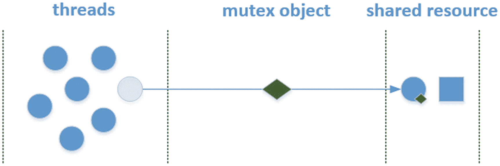
图 6-12
线程等待互斥对象以访问共享资源

这种行为的一个简化例子是，你和一大群人正在排队等待使用一台单独的售票机购买摇滚乐队演唱会的门票。在这个例子中，售票机是共享资源，一次只有一个人可以使用售票机。当我们到达售票机时，我们可以买到一张票，而排在我们后面的人必须等我们买完。我们买完票后，队列中的下一个人获得使用售票机的权利。

我们也可以在 SQL Server 中观察到这种行为，但为此我们需要使用一个调试器（如 `WinDbg`）。图 6-13 展示了 SQL Server 中的一个线程如何因为访问内存对象的权限被授予了另一个线程而等待 `互斥`。为了捕获此图，我使用了一个 `扩展事件` 会话，在发生 `CMEMTHREAD` 等待时创建了一个 SQL Server 迷你转储。然后我使用 `WinDbg` 打开该迷你转储并返回了调用栈。有关如何使用 `SqlDumper` 的详细信息，请访问 `https://slrwnds.com/32n2up`。

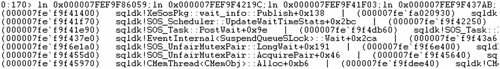
图 6-13
迷你转储中发生 CMEMTHREAD 等待的示例

这里重要的一行是 `SOS_UnfairMutexPair::LongWait`，它产生了 `CMEMTHREAD` 等待，因为我们监控的线程必须等待另一个当前拥有内存对象访问权限的线程。紧接着的下一行 `SOS_UnfairMutexPair::AcquirePair` 表示该线程获得了互斥锁，随后便通过 `CMemThread<CmemObj>::Alloc` 访问了内存对象。


#### 降低 CMEMTHREAD 等待

由于 SQL Server 中存在许多可能产生 `CMEMTHREAD` 等待的不同内存对象，因此根据被访问的内存对象，降低 `CMEMTHREAD` 等待时间的可能解决方案也有很多。

一个比较常见的发生 `CMEMTHREAD` 等待的情况是当执行大量短小的、并发的即席查询时。每次执行即席查询（无法参数化的查询）时，查询优化器都会为该查询生成一个新的执行计划。所有这些新的执行计划都会保存到计划缓存中，并且会访问一个用于分配缓存描述符的内存对象。由于该内存对象是线程安全的，如果插入速率足够高，就可能发生 `CMEMTHREAD` 等待。如果您怀疑即席查询可能导致 `CMEMTHREAD` 等待，一个很好的起点是查看过程缓存。清单 6-6 中的查询将为您提供过程缓存中执行计划数量的信息。

```sql
SELECT  objtype,
        COUNT_BIG (*) AS 'Total Plans',
        SUM(CAST(size_in_bytes AS DECIMAL(12,2)))/1024/1024 AS 'Size (MB)'
FROM sys.dm_exec_cached_plans
GROUP BY objtype;
```
**清单 6-6** 查询过程缓存

此查询的结果应如图 6-14 所示，尽管您系统上的数字会有所不同。

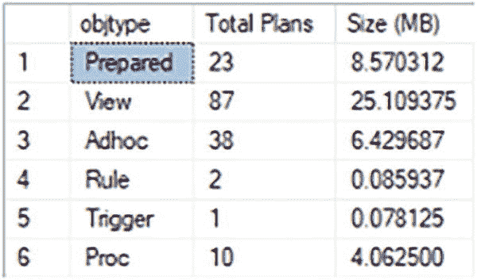

一个包含 4 列 6 行的表格。它列出了对象类型、总计划数和大小。其中“对象类型”列下的“Prepared”被选中。

**图 6-14** 查询过程缓存的结果

我们将重点关注即席执行计划的数量。如果您看到这个数字在快速增长，并且同时经历了 `CMEMTHREAD` 等待，那么值得花精力去分析这些即席查询。如果可能，尝试优化查询以使其生成可重用的计划。如果您的应用程序使用许多动态查询，那么请尝试使用 `sp_executesql` 系统存储过程，而不是 `EXECUTE (EXEC)` 命令。使用 `EXEC` 命令很可能导致只被使用一次的计划。

Microsoft 在 SQL Server 2005 SP2 中发布了针对此问题的各种修复（最值得注意的是将某些内存对象跨 CPU 分区），使得这种情况在如今变得不那么常见。即使您使用的是比 SQL Server 2005 更新的版本，升级到最新的可用 Service Pack 可能也是一个好主意，因为每个 SQL Server 版本都包含了各种与内存相关的错误修复。

#### CMEMTHREAD 总结

`CMEMTHREAD` 等待类型是一种与内存相关的等待类型。当多个线程尝试访问一次只允许单个线程访问的内存对象时，就会发生 `CMEMTHREAD` 等待。其他线程在等待轮到自己访问内存对象所花费的时间被记录为 `CMEMTHREAD` 等待时间。发生 `CMEMTHREAD` 等待的更常见情况之一是您的系统使用了大量即席查询。每次生成新的执行计划时，SQL Server 都会访问一个内存对象；如果生成了许多执行计划，这将导致线程排队等待访问该内存对象，从而导致 `CMEMTHREAD` 等待。

### IO_COMPLETION

就像 `ASYNC_IO_COMPLETION` 等待类型一样，`IO_COMPLETION` 等待发生在 SQL Server 等待存储相关操作完成时。而且与 `ASYNC_IO_COMPLETION` 等待类型一样，看到 `IO_COMPLETION` 等待类型的高等待时间并不一定意味着您的存储系统有问题。`IO_COMPLETION` 等待在您的 SQL Server 实例运行期间会正常发生，只有当等待时间远高于正常水平时才应引起关注。

#### 什么是 IO_COMPLETION 等待类型？

`ASYNC_IO_COMPLETION` 等待类型在执行数据库相关操作（如数据库备份）时记录，而 `IO_COMPLETION` 等待则在涉及非数据页时发生，例如还原事务日志备份或访问位图分配页（如 GAM 页）。当执行对存储进行读取或写入操作的查询（如合并联接运算符）时，也可能发生 `IO_COMPLETION` 等待。

#### IO_COMPLETION 示例

让我们通过还原事务日志备份来生成一些 `IO_COMPLETION` 等待。在此示例中，我们将再次使用 GalacticWorks 数据库。清单 6-7 中的查询将执行 GalacticWorks 数据库的完整备份，进行一些更改，然后执行事务日志备份。完成后，我们将再次还原完整备份，清除 `sys.dm_os_wait_stats` DMV，还原事务日志备份，并检查 `IO_COMPLETION` 等待。

```sql
-- 确保 GalacticWorks 处于完整恢复模式
ALTER DATABASE GalacticWorks SET RECOVERY FULL;
-- 首先执行完整备份
-- 否则完整恢复模式不会生效
BACKUP DATABASE [GalacticWorks]
TO DISK = N'C:\TeamData\GalacticWorks.bak';
-- 对 AW 数据库进行一些更改
USE GalacticWorks;
UPDATE Person.Address
SET City = 'Portland'
WHERE City = 'Bothell'
-- 备份事务日志
BACKUP LOG [GalacticWorks]
TO DISK = N'C:\TeamData\GalacticWorks_Log.trn'
-- 使用 NORECOVERY 还原之前的完整备份
USE [master];
RESTORE DATABASE [GalacticWorks]
FROM DISK = N'C:\TeamData\GalacticWorks.bak'
WITH NORECOVERY, REPLACE;
-- 清除 sys.dm_os_wait_stats
dbcc sqlperf ('sys.dm_os_wait_stats', CLEAR);
-- 还原最后一个事务日志备份
RESTORE LOG [GalacticWorks]
FROM DISK = N'C:\TeamData\GalacticWorks_Log.trn';
-- 检查 IO_COMPLETION 等待
SELECT *
FROM sys.dm_os_wait_stats
WHERE wait_type = 'IO_COMPLETION'
```
**清单 6-7** 生成 IO_Completion 等待

在我的测试系统上，针对 `sys.dm_os_wait_stats` DMV 的此查询结果如图 6-15 所示。

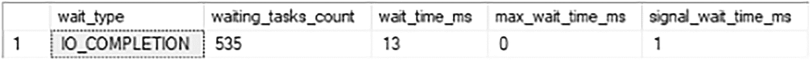

一个包含 5 列 1 行的表格。它列出了等待类型为 I O completion，等待任务数为 535，等待时间毫秒为 13，最大等待时间毫秒为 0，信号等待时间毫秒为 1。

**图 6-15** IO_COMPLETION 等待

我们使用清单 6-7 中的查询只修改了少量记录，因此由于事务日志备份还原进行得很快，总等待时间很低。

在 SQL Server 服务重启后启动数据库时，也会发生 `IO_COMPLETION` 等待时间。这意味着在重启或故障转移后，您应该预期会有 `IO_COMPLETION` 等待；这些都是完全正常的。同样，当启用 `AUTO_CLOSE` 并且数据库正在启动时，您也应该会经历 `IO_COMPLETION` 等待。

#### 降低 IO_COMPLETION 等待

大多数情况下，`IO_COMPLETION` 等待不应该引起关注。当它们远高于您基线中的等待时间时，您应该像我在“降低 `ASYNC_IO_COMPLETION`”部分描述的那样分析存储子系统性能。虽然某些查询操作也可能导致 `IO_COMPLETION` 等待，但它们通常不是等待时间高于正常水平的原因。

#### IO_COMPLETION 总结

就像 `ASYNC_IO_COMPLETION` 等待类型一样，`IO_COMPLETION` 等待发生在访问存储子系统时。当 SQL Server 等待非数据页操作（如事务日志还原操作或读取位图页（如 GAM 页））完成时，会发生 `IO_COMPLETION` 等待。看到 `IO_COMPLETION` 类型的等待发生是完全正常的，除非等待时间远高于您基线中的值，否则这些通常不需要更深入的分析。在那些情况下，首先关注您的存储子系统的性能（尤其是延迟）。

### LOGBUFFER 和 WRITELOG

我将 `LOGBUFFER` 和 `WRITELOG` 合并在本节中。这是因为这两种等待类型彼此之间、与事务日志以及与存储子系统都有密切关系。


#### LOGBUFFER 与 WRITELOG 等待类型是什么？

要理解 `LOGBUFFER` 和 `WRITELOG` 等待类型代表什么，我们需要对 SQL Server 如何写入事务日志有所了解。简而言之，每当我们在数据库内部更改或添加数据时，会发生以下事件：

1.  数据页在缓冲区缓存中被修改；如果该页尚未在缓冲区缓存中，则会先被读入缓冲区缓存。
2.  该数据页在缓冲区缓存中被标记为“脏”。
3.  表示此修改的日志记录被保存到日志缓冲区。
4.  发生日志刷新（我们稍后将详细讨论），将日志记录从日志缓冲区写入事务日志。
5.  脏数据页被写入数据文件。

为了展示此行为，我包含了图 6-16。

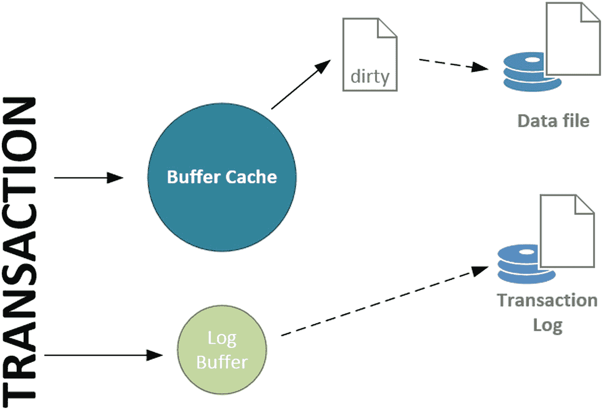

缓冲区缓存如何通过脏页与数据文件交互，以及日志缓冲区如何与事务日志交互的示意图。

**图 6-16**
事务如何移动

表示脏数据页移动的动作和将日志记录写入事务日志的动作以虚线显示。我特意这样做是为了说明这些动作不一定直接发生。

脏数据页首先在缓冲区缓存中更新，并在发生检查点操作时写入数据文件。因此，即使在事务提交后，脏页也可能保留在内存（即缓冲区缓存）中。

对于日志缓冲区内的日志记录，情况则不同。一旦事务提交，并且该事务在日志缓冲区中有活动的日志记录，日志缓冲区内的所有日志记录都会被写入（或 `刷新`）到磁盘上的事务日志。但日志刷新也会以另一种方式被触发。日志缓冲区有固定的 60 KB 大小，一旦日志缓冲区已满，它将把其中的所有记录刷新到事务日志。

由于本节是关于 `WRITELOG` 和 `LOGBUFFER` 的，现在正是将它们引入这个故事的好时机。`WRITELOG` 等待类型在 SQL Server 正在将日志缓冲区的内容刷新到磁盘上的事务日志时发生。`LOGBUFFER` 等待类型在 SQL Server 必须等待日志缓冲区中有空闲空间来插入日志记录时发生。我已在图 6-17 中它们可能发生的位置添加了这两种等待类型。

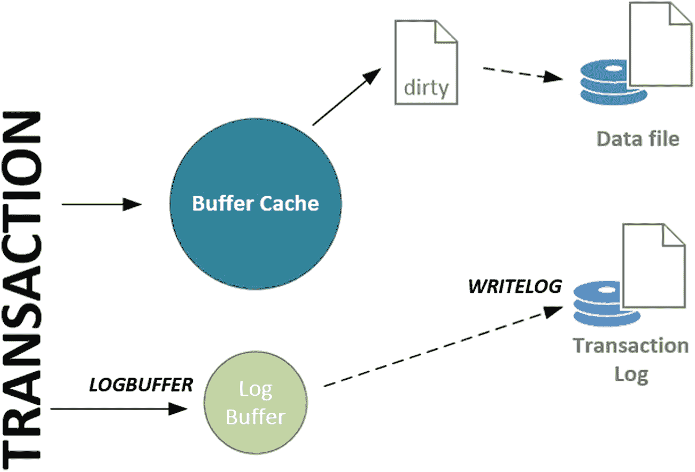

缓冲区缓存如何通过脏页与数据文件交互，以及日志缓冲区如何通过写日志与事务日志交互的示意图。

**图 6-17**
事务移动以及 LOGBUFFER 和 WRITELOG 等待类型

这就是为什么我说这些等待类型是相关的。每当发生 `WRITELOG` 等待时，如果将日志记录刷新到事务日志的进程无法跟上新日志记录进入日志缓冲区的速度，你很可能也会发现 `LOGBUFFER` 等待。

这种情况经常发生在高并发数据修改量的系统上，导致需要写入磁盘的事务。另一个常见原因是事务日志文件所在存储子系统的性能。如果存储子系统的性能不理想，你的 `WRITELOG` 等待时间会增加，如果事务量足够大，则有可能发生 `LOGBUFFER` 等待。

事务日志的性能对整个数据库的性能至关重要。事务日志性能缓慢将影响你在数据库内执行的每一项更改，因为每一次修改都必须先写入事务日志才能提交。

#### LOGBUFFER 与 WRITELOG 示例

为了给你一个 `LOGBUFFER` 和 `WRITELOG` 等待发生的例子，我使用清单 6-8 中的脚本创建一个新的数据库。

```sql
USE master;
-- Create demo database
CREATE DATABASE [TLog_demo]
ON PRIMARY  (
NAME = N'TLog_demo', FILENAME = N'C:\TeamData\TLog_demo.mdf' , SIZE = 153600KB , FILEGROWTH = 10%)
LOG ON  (  NAME = N'TLog_demo_log', FILENAME = N'C:\TeamData\TLog_demo.ldf' , SIZE = 51200KB , FILEGROWTH = 10%);
-- Make sure recovery model is set to full
ALTER DATABASE [TLog_demo] SET RECOVERY FULL;
-- Perform full backup first
-- Otherwise FULL recovery model will not be affected
BACKUP DATABASE [TLog_demo]
TO  DISK = N'C:\TeamData\TLog_demo_Full.bak';
-- Create a simple test table
USE TLog_demo;
CREATE TABLE transactions  (
t_guid VARCHAR(50) );
```

**清单 6-8**
创建 TLog_demo 数据库

既然我们已经创建了一个全新的数据库，我将使用 Ostress 工具对 `TLog_demo` 数据库生成负载。我将执行清单 6-9 中的查询（已保存到 `logbuffer_impl.sql` 文件），使用以下命令通过 200 个并发连接运行：

```sql
DECLARE @i INT
SET @i = 1
WHILE @i < 10000
BEGIN
INSERT INTO transactions
(t_guid)
VALUES
(newid())
SET @i = @i + 1
END
```

**清单 6-9**
在 TLog_demo 数据库中插入行

```
"C:\Program Files\Microsoft Corporation\RMLUtils\ostress.exe" -S.\RC0 -E -dTLog_demo -i"C:\TeamData\logbuffer_impl.sql" -n200 -r1 -q
```

在启动 Ostress 工具之前，我清除了 `sys.dm_os_wait_stats` DMV。

在我的测试 SQL Server 上大约运行 1 分钟后，Ostress 工具执行完了工作负载。如果我查询 `sys.dm_os_wait_stats` DMV 并查看 `LOGBUFFER` 和 `WRITELOG` 等待类型，会得到如图 6-18 所示的结果。


一个 5 列 2 行的表格。它列出了文件 write log 和 log buffer 的等待类型、等待任务数、等待时间毫秒、最大等待时间毫秒和信号等待时间毫秒。Write log 被选中。

**图 6-18**
WRITELOG 和 LOGBUFFER 等待


#### 降低 LOGBUFFER 和 WRITELOG 等待

通常，你可以采取两种方法来降低 `LOGBUFFER` 和 `WRITELOG` 等待，但请记住 `WRITELOG` 等待是正常现象，只有在等待时间远高于正常水平时才应引起关注。

第一种方法是仔细检查你的事务执行方式。在前面的例子中，我们隐式地提交了每条 `INSERT` 语句。这意味着一旦 `INSERT` 语句的日志记录进入日志缓冲区，就需要立即刷新。如果我们显式地提交整个 `WHILE` 循环，那么写入事务日志以进行刷新的数据块会更大，从而获得更好的性能。这是因为频繁写入小数据块通常比间隔较大地写入大数据块要慢。游标也可能产生与我们示例相同的效果，因此应尽量减少使用它们。

另一种方法基于存储子系统。如果 SQL Server 无法足够快地写入日志记录，你可能会遇到 `LOGBUFFER` 和 `WRITELOG` 等待。作为最佳实践，请务必将事务日志文件和数据库数据文件放在不同的磁盘上，这样它们在高负载时不会相互影响。同时，使用 Perfmon 中的磁盘性能计数器（如显示写入延迟的 `Avg. Disk sec/write` 和显示写入 IOPS 的 `Disk Writes/sec`）监控事务日志所在的磁盘，并检查这些值是否在可接受范围内。

如果你的 SQL Server 实例运行的是 SQL Server 2014，你可以选择使用在 SQL Server 2014 中引入的 `延迟持久性` 选项。简而言之，启用此选项后，事务提交时不再立即将日志缓冲区内容刷新到磁盘，而是等待日志缓冲区已满（`60 KB`）后再将内容刷新到事务日志。启用此选项会带来一定风险，即已提交但尚未写入事务日志的事务在发生故障时可能会丢失，因为它们只有在日志缓冲区已满时才会被写入事务日志。

#### LOGBUFFER 和 WRITELOG 总结

`LOGBUFFER` 和 `WRITELOG` 这两种等待类型都与 SQL Server 处理事务的方式有关。`WRITELOG` 等待类型在每次将日志记录写入事务日志时都会发生，通常无需担心。但当它与较高的 `LOGBUFFER` 等待时间同时出现时，较高的 `WRITELOG` 等待时间可能表明存在事务日志压力。为了降低这些等待时间，尽量避免使用游标和 `WHILE` 语句，因为游标或 `WHILE` 子句中的语句通常会被隐式提交，从而产生大量的小型写入操作。同时，检查你的存储配置，确保事务日志文件与数据库数据文件不在同一个驱动器上。如果仍然出现较高的等待时间，请分析事务日志所在磁盘的性能。

### RESOURCE_SEMAPHORE

`RESOURCE_SEMAPHORE` 等待类型是一种与内存相关的等待类型，当查询的内存请求无法立即获得批准时就会发生。这类等待发生在经历内存压力的服务器上，或者当大量并发查询为排序或联接等昂贵操作请求内存时。

#### 什么是 RESOURCE_SEMAPHORE 等待类型？

在 SQL Server 中执行查询时，在实际执行之前会发生一系列步骤。第一步是生成已编译的计划。该计划包含完成查询请求所需的逻辑指令或操作。在生成已编译计划期间，会执行一个计算来确定执行该计划中所有查询操作所需的内存数量。一些需要内存的操作，如排序和联接，会将行数据临时存储在 SQL Server 的内存中。执行这些排序或联接所需的最小内存量称为所需内存，没有它查询根本无法执行。例如，如果排序期间需要更多内存来存储内存中的行数据，则会被计算为额外内存。即使没有这部分额外内存，查询仍然可以执行，但临时行数据将被写入磁盘而非内存。

执行查询时，会根据在已编译计划中计算出的所需内存和额外内存值来确定内存授予。这个内存授予是执行一个名为 `resource semaphore` 的内部对象的内存保留所必需的。`resource semaphore` 负责保留查询执行所需的内存，同时也在过多查询并发请求内存保留或内存不足时管理内存限制。它通过维护一个请求内存的查询队列来实现这一点。如果队列中没有查询并且有新查询请求内存，`resource semaphore` 会将其授予该查询（如果有足够的可用内存）。但是，如果存在队列，新查询将被置于队列末尾，必须等待轮到它才能获得内存授予。

在 `resource semaphore` 将请求的内存授予查询之前，它会检查是否有足够的可用内存。如果由于某种原因可用内存量少于查询请求的量，该查询将被再次放入队列，直到有足够的内存可用。当查询在 `resource semaphore` 队列中等待其请求的内存时，它在队列中花费的时间将被记录为 `RESOURCE_SEMAPHORE` 等待类型。

`resource semaphore` 可使用的内存量有一个最大值，它从缓冲池中分配。`resource semaphore` 最多可以从缓冲池分配 75% 的内存用于内存授予，但单个查询获得的内存永远不能超过该总量的 25%。例如，如果我们有一个缓冲池最大可增长到 `500 MB` 的 SQL Server，那么用于内存授予的最大内存量将是 `375 MB`。在此示例中，单个查询最多只能获得 `93 MB`。可能授予查询如此多的内存可能会带来问题，因为这部分内存未被用于缓冲池，这意味着需要更多的 IO 操作来从存储子系统中读取和写入数据页。


#### RESOURCE_SEMAPHORE 示例

在本示例中，我们将针对 `GalacticWorks` 数据库执行一个涉及排序操作的查询。正如我在前一节提到的，涉及排序的查询会向资源信号量请求内存以执行排序操作。我们还将使用 `Ostress` 工具来创建一个情景，其中多个查询正在请求内存，从而在资源信号量处形成一个队列。

让我们看一下我们将要执行的查询及其内存授予信息，如清单 6-10 所示。

```sql
SELECT
SalesOrderID,
SalesOrderDetailID,
ProductID,
CarrierTrackingNumber
FROM
Sales.SalesOrderDetail
ORDER BY CarrierTrackingNumber ASC
Listing 6-10
针对 GalacticWorks 数据库的排序查询
```

如您所见，这是一个相对简单的查询，从 `Sales.SalesOrderDetail` 表返回信息，并按 `CarrierTrackingNumber` 排序。

如果我们启用“包含实际执行计划”选项并执行查询，就会发现执行它所需的内存量。在我的测试 SQL Server 上，结果如图 6-19 所示。您可以通过显示属性窗口（视图 ➤ 属性窗口）或按 F4 并选择 `SELECT` 操作符来访问这些属性。

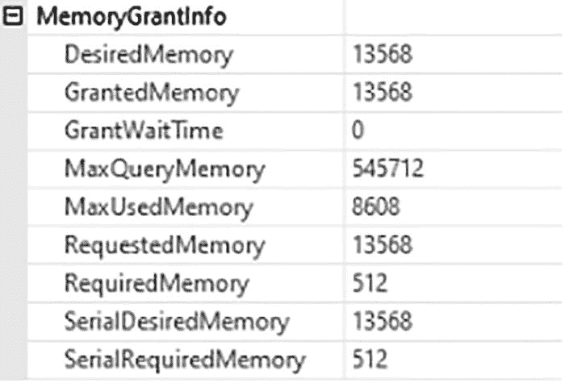

内存授予信息表的截图。显示期望内存、授予内存、请求内存和串行期望内存，其值分别为 13568、最大查询 545712、最大使用 8608、必需内存和串行必需内存 512，授予等待时间 0。

图 6-19

执行计划属性中的 MemoryGrantInfo

因为我们请求了实际执行计划，所以我们看到授予查询执行的内存量。在此案例中，查询获得了资源信号量授予的 13,568 KB (13.5 MB) 内存，如 `GrantedMemory` 属性所示。执行查询所需的最小内存量，即必需内存，为 512 KB，由 `RequiredMemory` 属性显示。查询请求了 13,568 KB 内存，如 `DesiredMemory` 属性所示，这是必需内存和额外内存的总和。我们可以看到查询得到了它所请求的，因为 `GrantedMemory` 和 `DesiredMemory` 具有相同的值。

图 6-19 中还有两个我想指出的属性：`SerialDesiredMemory` 和 `SerialRequiredMemory`。对于此查询，这两个属性的值与 `DesiredMemory` 和 `RequiredMemory` 属性相同。这是因为查询是在未使用并行度的情况下执行的。当您在查询中使用并行度时，由于工作在多个线程间分配，执行排序操作需要更多内存。图 6-20 显示了当我强制清单 6-10 中的查询使用并行度、将工作分散到四个线程时的 `MemoryGrantInfo` 属性。

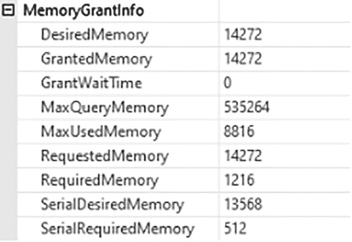

内存授予信息表的截图。其中几项是期望内存、授予内存和请求内存 14272，最大查询 535264，最大使用 8816，必需内存 1216，授予等待时间 0。

图 6-20

执行并行查询时的 MemoryGrantInfo 属性

如您所见，`SerialRequiredMemory` 与我们串行执行查询时的值相同。`RequiredMemory` 和 `RequestedMemory` 的大小增加了，以便能够使用并行度完成排序操作。当您遇到与内存相关的问题，并且您的许多查询涉及使用并行度执行的排序和联接操作时，您应该记住这个信息，因为并行度确实需要更多内存。

既然我们知道了执行清单 6-10 中查询所需的内存量，让我们使用 `Ostress` 通过多个连接来执行查询。在我启动 `Ostress` 之前，我将使用以下查询将最大服务器内存值更改为 512 MB：

```sql
EXEC sys.sp_configure N'max server memory (MB)', N'512'
GO
RECONFIGURE WITH OVERRIDE
GO
```

我已将清单 6-10 中的查询保存到名为 `resource_semaphore.sql` 的文件，并使用以下命令行执行 `Ostress`：

```shell
"C:\Program Files\Microsoft Corporation\RMLUtils\ostress.exe" -S.\RC0 -E -dGalacticWorks -i"C:\TeamData\resource_semaphore.sql" -n200 -r1 -q
```

这将使用 200 个并发连接针对 `GalacticWorks` 数据库执行 `resource_semaphore.sql` 脚本，每个连接执行查询一次。

在 `Ostress` 运行时，我查询 `sys.dm_os_waiting_tasks` DMV，寻找 `RESOURCE_SEMAPHORE` 等待；部分结果如图 6-21 所示。

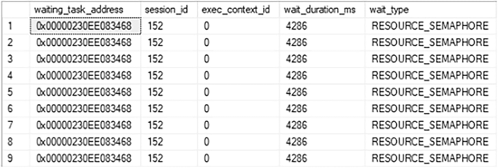

一个 9 行 5 列的表格截图。它列出了等待任务地址、会话 ID、执行上下文 ID、等待持续时间毫秒数和等待类型。选择了文件 0 x 00000 230 E E 0 83468。

图 6-21

`sys.dm_os_waiting_tasks` DMV 中的 `RESOURCE_SEMAPHORE` 等待

由于我们将最大服务器内存设置为 512 MB，并且每个查询请求 13.25 MB 内存，我们没有足够的空闲内存来授予所有请求的内存。这将导致您在图 6-21 中看到的 `RESOURCE_SEMAPHORE` 等待类型。

我们可以使用各种其他资源来分析 `RESOURCE_SEMAPHORE` 等待。资源信号量本身拥有自己的 DMV，即 `sys.dm_exec_query_resource_semaphores`，它将返回有关其内存消耗以及待处理和等待授予的信息。图 6-22 显示了在运行 `Ostress` 工作负载时，对 `sys.dm_exec_query_resource_semaphores` DMV 执行以下查询的结果：

```sql
SELECT
target_memory_kb,
max_target_memory_kb,
total_memory_kb,
available_memory_kb,
granted_memory_kb,
grantee_count,
waiter_count
FROM sys.dm_exec_query_resource_semaphores
WHERE pool_id = 2
Listing 6-11
查询 sys.dm_exec_query_resource_semaphores DMV
```

我过滤掉了 `pool_id` 1，因为这个池不处理用户查询。

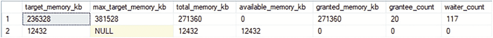

一个 2 行 7 列的表格。它列出了目标内存 KB、最大目标内存 KB、总内存 KB、可用内存 KB、已授予内存 KB、被授予者数量和等待者数量。

图 6-22

`sys.dm_exec_query_resource_semaphores`

您可能已经注意到，返回了两行。这是因为存在两个不同的资源信号量。顶行是“常规”资源信号量。这将处理请求超过 5 MB 内存的查询。第二行（由 `max_target_memory_kb` 列的 `NULL` 值标识）返回有关“小型”资源信号量的信息，它处理小于 5 MB 的查询。因为我们的查询请求了超过 5 MB 的内存，所以我们从常规资源信号量获得内存授予。

让我们来看一下对 `sys.dm_exec_query_resource_semaphore` DMV 查询返回的各列：

*   `target_memory_kb` 列返回此资源信号量计划用作其可授予查询的最大内存量的内存（以 KB 为单位）。
*   `max_target_memory_kb` 列返回此资源信号量可授予的最大内存量。
*   `total_memory_kb` 列返回资源信号量持有的总内存，是 `available_memory_kb` 和 `granted_memory_kb` 的总和。
*   `granted_memory_kb` 返回当前已授予查询的内存量。

### RESOURCE_SEMAPHORE

*   `grantee_count` 和 `waiter_count` 列返回当前已满足或正在资源信号量队列中等待的授权数量。

从这些信息中，我们看到 `granted_memory_kb` 列返回的信息是正确的，并且我们的测试查询正在请求内存授权。根据执行计划，我们知道测试查询将请求 13,568 KB。由于 `grantee_count` 列显示有两个内存请求被授予，我们可以将每个查询的内存量乘以内存请求数量（20 × 13,568 KB），结果为 271,360 KB，这与图 6-22 中的已授予内存量一致。

我们还可以使用 Perfmon 通过查看 `SQLServer:Memory Manage\Granted Workspace Memory (KB)` 计数器来监控已授予内存的总量，如图 6-23 所示。

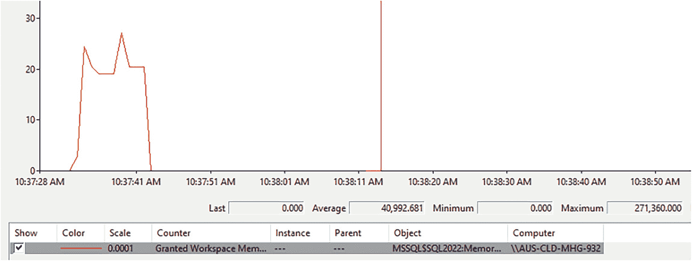

图 6-23

已授予工作区内存（KB）Perfmon 计数器

请注意图 6-23 中的峰值，它发生在执行 `Ostress` 工作负载时，并且与图 6-22 的结果一致，授予的内存量为 271,360 KB。

#### 降低 RESOURCE_SEMAPHORE 等待

有多种可能的方法可以用来降低或解决 `RESOURCE_SEMAPHORE` 等待类型的等待时间。最显而易见的方法是增加内存，但这可能是一个昂贵的解决方案，同时还存在其他成本较低的选项。

第一个可能的解决方案是查看那些请求大量内存来执行的查询。您应该重点关注执行大型排序或连接（特别是哈希连接）的查询，并检查是否可以减少需要排序或连接的行数，或者完全避免排序或连接。避免排序操作的一种方法是在执行排序的表上添加索引。如果索引内的值顺序与排序操作相同，则不再需要排序操作，因为索引已经对结果进行了排序。

另一个解决方案涉及并行度。如果查询在排序或连接操作期间使用了并行度，则会比串行执行查询时请求更多的内存。通过使用查询提示或更改整个 SQL Server 实例的并行度配置来修改查询使其不使用并行度，将导致执行查询所需的内存量减少。

另一个可能的解决方案是使用 `MAX_GRANT_PERCENT` 查询提示，该提示将授予查询的内存量限制为实例配置最大值的一个百分比。

从 SQL Server 2017+ 开始，企业版具有内存授予反馈功能，该功能会重新计算查询所需的内存，然后更新缓存计划的授权值。下次执行查询时，将使用修订后的内存授予大小。

最后，如果您运行的是企业版的 SQL Server，则可以使用资源调控器功能来配置每个资源池的内存使用情况。通过配置某个资源池可以使用的内存量，您还可以设置资源信号量可以授予的内存量。本书不会详细介绍资源调控器功能，但可以在资源调控器的 MSDN 页面 [`https://slrwnds.com/lc8dmc`](https://slrwnds.com/lc8dmc) 上找到更多信息。

#### RESOURCE_SEMAPHORE 总结

`RESOURCE_SEMAPHORE` 等待类型与查询执行某些操作（如排序和连接）所需的内存量有关。一个名为资源信号量的对象负责管理和限制查询的内存请求。如果查询请求的内存量超过了资源信号量可以授予的量，该内存请求将被移入资源信号量队列。当内存请求位于资源信号量队列中时，会记录 `RESOURCE_SEMAPHORE` 等待时间。有多种方法可以降低或解决 `RESOURCE_SEMAPHORE` 等待。您可以选择为 SQL Server 实例增加更多内存，或者优化查询，使排序和连接不需要那么多内存。另一个选项是使用资源调控器，您可以定义资源池以最小化大型内存请求的影响。

### RESOURCE_SEMAPHORE_QUERY_COMPILE

在上一节中，我们讨论了 `RESOURCE_SEMAPHORE` 等待类型，它表示某些查询操作（如排序和连接）没有足够的可用内存。与 `RESOURCE_SEMAPHORE` 等待类型类似，`RESOURCE_SEMAPHORE_QUERY_COMPILE` 等待类型也与 SQL Server 实例的内存有关。但它不是表示查询内存的短缺，而是指示在查询编译过程中的内存短缺。

#### 什么是 `RESOURCE_SEMAPHORE_QUERY_COMPILE` 等待类型？

在解释 `RESOURCE_SEMAPHORE` 等待类型时，我们讨论了资源信号量是什么以及它们的作用。对于 `RESOURCE_SEMAPHORE_QUERY_COMPILE` 等待类型的解释，我们将更深入地探讨资源信号量的内部工作原理。

你应该将资源信号量视为限制对内存资源直接访问的“网关”，因为资源信号量可以执行不同的任务。在上一节中，我们讨论了资源信号量负责为某些操作（如排序和连接）授予内存。我们还指出，有两个资源信号量负责授予此内存——常规资源信号量处理请求 `5 MB` 或更多内存的查询，而小型资源信号量处理请求少于 `5 MB` 内存的查询的内存授予。

与 `RESOURCE_SEMAPHORE_QUERY_COMPILE` 等待类型相关的资源信号量负责查询*编译*过程中所需的内存授予，*不包括*查询执行所需的内存。就像上一节中的资源信号量一样，负责编译过程中内存授予的信号量也有不同的网关。图 6-24 显示了编译内存资源信号量的不同网关。

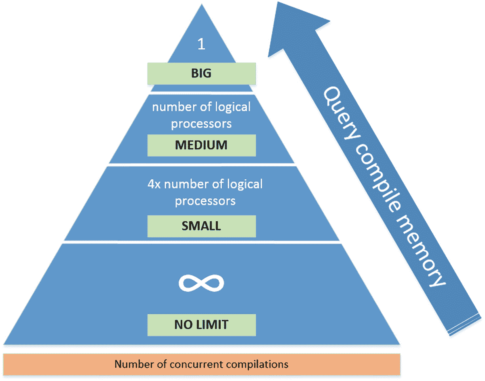

一个金字塔图示定义了查询编译内存随并发编译数的增加而增长。它分为 4 个部分。从顶部开始依次是：大、中、小、无限制。

图 6-24

编译内存资源信号量

默认有三个网关：`small`、`medium` 和 `big`。根据查询编译所需的内存量，它会被分配到这三个网关之一。如果编译所需的内存量小于 `small` 网关的内存阈值，则查询不通过任何网关。允许同时通过网关的并发编译（或查询）数量由你的 SQL Server 实例可用的 `逻辑处理器` 数量计算得出。例如，如果你的 SQL Server 实例有 `4` 个逻辑处理器，则 `small` 网关将允许 `16` 个并发编译，`medium` 网关允许 `4` 个。`big` 网关始终一次只允许一个查询进行编译。

`small` 网关的内存阈值是静态的，但对于 `medium` 和 `big` 网关，阈值是动态的。这意味着达到 `medium` 或 `big` 网关所需的编译内存在你的 SQL Server 实例运行期间会发生变化。

这些网关的全部目的是确保对编译内存的需求得到控制。这可以避免在大量大型编译内存请求被自动授予并耗尽 SQL Server 实例内存的情况下，出现内存不足的情况。

在继续之前，让我们回顾一个查询编译的例子。

假设我们有一个查询需要 `1560 KB` 的编译内存。该查询将首先请求一个网关。我们的 `small` 网关阈值是 `370 KB`，`medium` 网关阈值是 `5346 KB`，因此这个查询最终会进入 `small` 网关。如果当前 `small` 网关有任何查询正在排队，该查询将进入队列并等待轮到它，同时一直记录 `RESOURCE_SEMAPHORE_QUERY_COMPILE` 等待时间。在查询编译期间，编译过程中使用的内存量会被跟踪；如果查询最终使用了更多内存并达到了 `medium` 网关的阈值，它会被移动到 `medium` 网关。当查询编译完成时，它会从网关中移除。

我们可以通过在 SQL Server 内部执行 `DBCC MEMORYSTATUS` 命令来访问有关资源信号量网关的信息。在大量的结果中某处，你将找到如图 6-25 所示的网关信息。

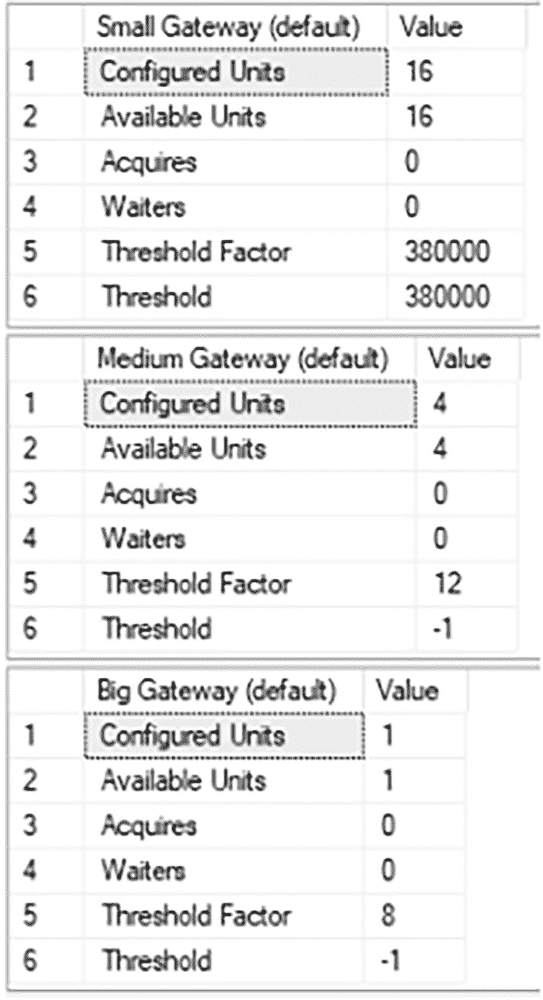

一个包含 3 个表格的截图。它列出了小、中、大网关及其对应的值。每个网关的“已配置单元”被选中。

图 6-25

`DBCC MEMORYSTATUS` 命令返回的网关信息

让我们看一下为网关返回的结果。

`Configured Units` 行返回此网关允许的最大并发编译数。这由你的 SQL Server 实例可用的 `逻辑处理器` 数量决定。因为我的测试 SQL Server 有 `4` 个逻辑处理器，所以我有 `16` 个 `small` 网关槽位（`4` × 逻辑处理器数量），`medium` 网关有 `4` 个槽位。`Available Units` 行显示此网关当前空闲的槽位数，而 `Acquires` 行显示当前被编译占用的槽位数。必须等待空闲槽位的查询数量显示在 `Waiters` 行。`Threshold` 值是以字节为单位的内存量，查询编译需要达到此值才能进入网关。对于我的测试 SQL Server 系统，`small` 网关的阈值为 `380,000 字节` 或 `371 KB`。你可能注意到图 6-25 中，`medium` 网关的阈值为 `-1`。这是因为 `medium` 和 `big` 网关的阈值是动态的。由于 `medium` 以下网关没有活动，因此暂时无需设置阈值。

#### RESOURCE_SEMAPHORE_QUERY_COMPILE 示例

为了向你展示 `RESOURCE_SEMAPHORE_QUERY_COMPILE` 等待在实际中的例子，我将使用许多并发连接多次执行清单 6-12 中的查询。该查询是一个动态查询，它从 `AdventureWorks` 数据库中的两个连接表中随机选择一行。在这里，是否返回任何结果并不重要——我们这里试图实现的是制造编译内存争用。

```sql
DECLARE @ID VARCHAR(250)
DECLARE @SQL VarChar(MAX)
SET @ID = FLOOR(RAND()*(20000-1)+1);
SET @SQL =
'
SELECT
' + @ID + ',
SUM(soh.SubTotal),
COUNT(soh.SubTotal)
FROM sales.SalesOrderHeader soh
INNER JOIN person.Person p
ON soh.SalesPersonID = p.BusinessEntityID
WHERE p.BusinessEntityID = ' + @ID + '
'
EXEC (@SQL)
```
清单 6-12: `RESOURCE_SEMAPHORE_QUERY_COMPILE` 等待查询

在我们使用许多并发连接执行该查询之前，让我们先检查一下需要多少编译内存。我们可以通过在 `SQL Server Management Studio` 中执行清单 6-12 的查询并启用实际执行计划来实现这一点。

执行查询并打开实际执行计划后，我们需要查看 `CompileMemory` 属性。你可以通过显示属性窗口（**视图** ➤ **属性窗口**）或按 `F4` 并选择 `SELECT` 运算符来访问这些属性。图 6-26 显示了我的测试 `SQL Server` 上的实际执行计划属性。

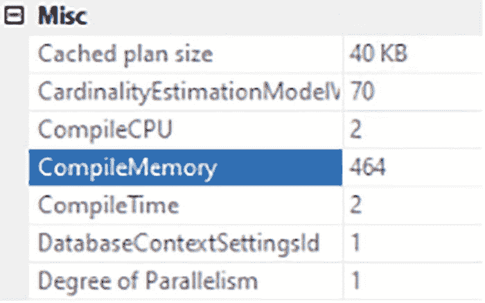

一个杂项表的截图。它列出了缓存的平面大小、基数估计模型、编译内存、编译时间等。编译内存被选中。

图 6-26: 杂项执行计划属性

`CompileMemory` 属性返回的值是以 `KB` 表示所需的编译内存量。对于此查询，编译需要 `464 KB`。在我的测试 `SQL Server` 上，小网关的阈值是 `371 KB`，所以我非常确定该查询将访问小网关。

同样，我们将使用 `Ostress` 实用程序来生成所需的并发连接以执行查询。我将清单 6-12 中的查询保存到 `resource_semaphore_compile.sql` 文件，然后将该文件用作以下 `Ostress` 命令的输入。因为查询非常快，我让每个连接执行它 100 次，这样我们就有一些时间来查看等待统计信息。

```
"C:\Program Files\Microsoft Corporation\RMLUtils\ostress.exe" -S.\RC0 -E -dGalacticWorks -i"C:\TeamData\resource_semaphore_compile.sql" -n200 -r100 -q
```

几秒钟后，在 `sys.dm_os_waiting_tasks` DMV 中可以看到许多 `RESOURCE_SEMAPHORE_QUERY_COMPILE` 等待，如图 6-27 所示。

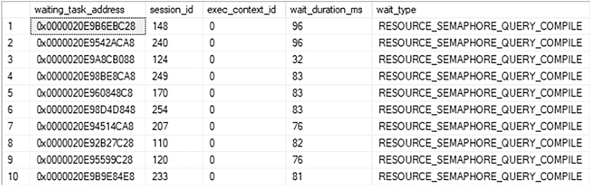

一个包含 10 行 5 列的表格截图。它列出了等待任务地址、会话 ID、执行上下文 ID、等待持续时间和等待类型。文件 0 x 00000 20 E 9 B 6 E B C 28 被选中。

图 6-27: `RESOURCE_SEMAPHORE_QUERY_COMPILE` 等待

如果我们现在执行 `DBCC MEMORYSTATUS` 命令，我们应该能够找出编译争用发生在哪个网关。图 6-28 显示了在我的测试 `SQL Server` 上 `DBCC MEMORYSTATUS` 命令的网关输出。

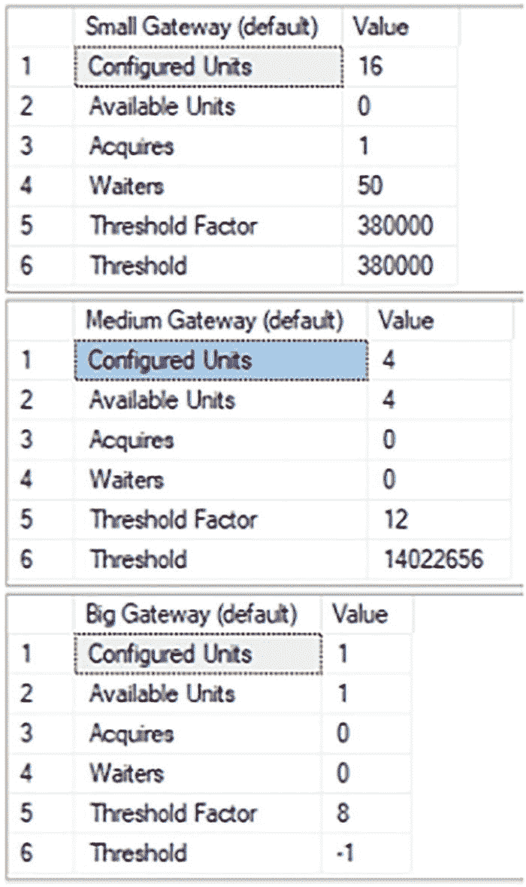

3 个表格的截图。它列出了小、中、大网关及其值。每个网关上配置的单元被选中。

图 6-28: 编译争用期间的 `DBCC MEMORYSTATUS`

如图 6-28 所示，如果我们查看 `可用单元` 的数量，已经没有可用的插槽留给新的编译内存请求了。事实上，我们有 `50` 个编译内存请求在资源信号量队列中等待。另请注意，中网关的阈值现在已从 `-1` 更改为 `14,022,656 字节` (`13,694 KB`)。既然争用发生在较低的网关上，中网关的阈值是动态确定的，即使该网关没有处理任何编译内存请求。

#### 降低 `RESOURCE_SEMAPHORE_QUERY_COMPILE` 等待

你可以用来降低 `RESOURCE_SEMAPHORE_QUERY_COMPILE` 等待类型等待时间的方法，通常与你用来降低或解决 `RESOURCE_SEMAPHORE` 等待的方法相同。就像 `RESOURCE_SEMAPHORE` 等待类型一样，`RESOURCE_SEMAPHORE_QUERY_COMPILE` 等待类型与内存相关，因此如果你能增加可用于查询编译的总内存量，就有机会降低或解决 `RESOURCE_SEMAPHORE_QUERY_COMPILE` 等待时间。

由于我们可以使用 `DBCC MEMORYSTATUS` 命令访问有关处理编译内存的资源信号量网关的非常具体的信息，因此一个好的第一步是分析网关的使用模式。如果你注意到某个特定网关持续有等待的内存请求，那么该网关的内存阈值，或者允许的并发编译内存请求的最大数量，应该能为你提供有关根本原因的一些线索。例如，如果你注意到大网关（一次只允许一个查询）有许多排队的编译内存请求，那么你的 `RESOURCE_SEMAPHORE_QUERY_COMPILE` 等待时间的来源可能是请求大量编译内存的查询。另一个原因可能是大量并发查询都需要访问小网关，这正是我们示例中的情况，导致在网关处出现排队。

在这些情况下，你应该找到导致网关排队的特定查询，并尝试优化它们，要么通过减少编译内存量，要么通过确保减少编译次数。后者可以通过确保你的查询被正确参数化来实现。每次执行时都生成即席计划的查询可能是 `RESOURCE_SEMAPHORE_QUERY_COMPILE` 等待的原因，特别是当它们被非常频繁地并发执行时。

如果你的 `SQL Server` 处于内存压力之下，也可能看到 `RESOURCE_SEMAPHORE_QUERY_COMPILE` 等待发生。这是因为中、大网关的编译内存阈值是动态的。如果 `SQL Server` 处于内存压力之下，这两个网关的阈值都会降低，从而给更多查询使用中或大网关的机会。但由于中、大网关允许的并发编译较少，在小网关中，可用的并发插槽将更快被填满。

就像 `RESOURCE_SEMAPHORE` 等待类型一样，你可以使用资源调控器将工作负载拆分到特定的资源池中。每个资源池将有自己的资源信号量，负责授予编译内存，从而可以将繁重的编译内存使用分散到多个资源池中。

#### `RESOURCE_SEMAPHORE_QUERY_COMPILE` 总结

就像用于为特定查询操作授予内存请求所需的资源信号量一样，也存在用于访问编译内存的资源信号量。这些资源信号量通过使用网关来调节对编译内存的访问。当查询被编译时，它会根据所需的编译内存量接近一个网关。然后网关可以授予所请求的编译内存，或者如果有更多请求想并发访问该网关，则将请求放入队列。当查询在其中一个队列中等待时，就会记录 `RESOURCE_SEMAPHORE_QUERY_COMPILE` 等待类型。

解决或降低 `RESOURCE_SEMAPHORE_QUERY_COMPILE` 等待时间通常通过释放更多内存或降低查询的编译内存需求来实现。


### SLEEP_BPOOL_FLUSH

`SLEEP_BPOOL_FLUSH` 等待类型与 SQL Server 内部的检查点进程直接相关。检查点进程负责将缓冲池中已修改的或“脏”数据页写入磁盘上的数据库数据文件。`SLEEP_BPOOL_FLUSH` 等待也与存储子系统的性能有关。如果我们在 Books Online 上搜索 `SLEEP_BPOOL_FLUSH` 等待类型的定义，微软将其描述为“当检查点为了阻止淹没磁盘子系统而限制新 I/O 的发出时”发生。

看到 `SLEEP_BPOOL_FLUSH` 等待发生是相当普遍的，并且通常它们并不表示存在问题。然而，在某些情况下，`SLEEP_BPOOL_FLUSH` 等待可能表明与检查点进程或存储子系统相关的性能问题。

#### 什么是 SLEEP_BPOOL_FLUSH 等待类型？

为了更好地理解 `SLEEP_BPOOL_FLUSH` 等待类型是如何被记录的，我们需要了解 SQL Server 内部的检查点进程是如何工作的。

检查点进程是一个 SQL Server 内部进程，负责将缓冲区缓存中已修改（脏）的页写入数据库数据文件。设置检查点的主要原因之一是为了在发生意外故障时加速数据库的恢复。当发生意外故障时，SQL Server 需要恢复到故障发生前的状态。它将使用事务日志的内容来重做（redo）或撤消（undo）对数据页所做的更改。如果数据页已被修改，但更改尚未写入数据库数据文件，SQL Server 将需要重做对该数据页的更改。如果检查点已经将更改的数据页写入了数据库数据文件，则不需要此步骤，这加快了数据库的恢复过程，因为 SQL Server 知道数据已经写入了数据库数据文件。图 6-29 展示了当一个数据页被修改时发生的（简化的）过程。

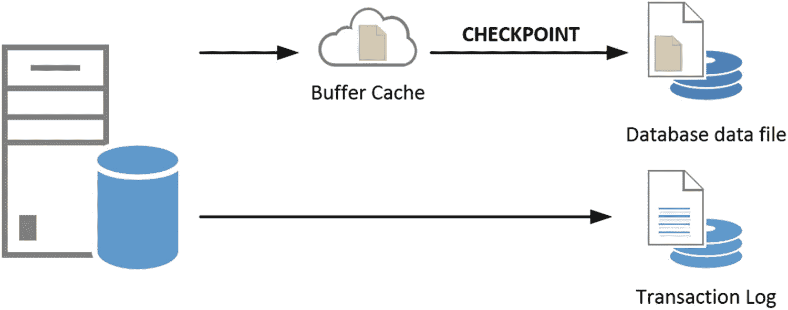

一个图形化的流程图定义了服务器如何通过缓冲区缓存（经由检查点）和事务日志将数据发送到数据库数据文件。
图 6-29：数据修改过程

当一个提交的事务修改了一个数据页时，首先发生的事情是该更改会被记录在事务日志中（首先在日志缓冲区中，然后如 `WRITELOG` 和 `LOGBUFFER` 等待类型部分所述写入磁盘）。数据页的修改将发生在缓冲区缓存中，并且该数据页将被标记为脏（红色页面图标）。当发生检查点时（原因可能有多个，我们稍后会讨论），自上一个检查点以来所有标记为脏的数据页都会被写入到存储子系统上的物理数据库数据文件中，无论创建这些脏页的事务处于何种状态（绿色页面图标）。

检查点进程由 SQL Server 自动执行，大约每分钟一次，这是早于 SQL Server 2016 版本的默认恢复时间间隔。这并不意味着检查点会精确地每分钟发生一次。你为 `recovery interval` 指定的值是检查点应发生的时间上限，检查点进程会分析未完成的 I/O 请求和延迟；限制检查点操作以避免存储子系统过载。

以下列表描述了 SQL Server 中可用的各种检查点类型：

*   **内部**检查点类型不可配置，在执行某些操作（例如数据库备份）时自动发生。
*   **自动 (Automatic)** – 在低于 2016 版本的 SQL Server 上，这些是默认检查点，当其默认值设为 `0` 时，大约每分钟发生一次。我们可以通过在 SQL Server Management Studio 的“服务器属性” ➤ “数据库设置”页面下更改 `recovery interval` 配置选项来修改检查点进程的间隔。我们只能将其更改为以分钟为单位的值，并且它将用于 SQL Server 实例内的所有数据库。
*   **手动 (Manual)** – 你可以通过发出 `CHECKPOINT` T-SQL 命令手动触发检查点。可选地，你可以指定检查点必须完成的时间（以秒为单位）。如果你发出了手动检查点，它将在当前数据库的上下文中运行。例如，在查询窗口中执行 `CHECKPOINT 10` 将在你执行查询后的 10 秒内执行一次检查点。
*   **间接 (Indirect)** – SQL Server 2012 增加了一个额外选项来配置每个数据库级别的检查点间隔。将此选项配置为大于默认值 `0` 的值将覆盖特定数据库的自动检查点进程。你可以使用以下命令为特定数据库启用间接检查点：
    ```sql
    ALTER DATABASE [db name] SET TARGET_RECOVERY_TIME = [time in seconds or minutes]
    ```
    随着 SQL Server 2016 的发布，间接检查点成为了检查点进程新的默认设置（值为 `60`）。

正如我之前提到的，如果 SQL Server 认为有必要，它会尝试限制检查点进程以避免存储子系统过载。它会监视存储子系统的未完成请求数量，并尝试检测是否存在任何延迟。利用这些信息，它将限制检查点进程生成的 I/O 量，以避免对存储子系统造成过重的负载。当检查点进程被限制时，`SLEEP_BPOOL_FLUSH` 等待类型就会被记录下来。


#### SLEEP_BPOOL_FLUSH 示例

以下示例展示了在低于 SQL Server 2016 的版本中，`SLEEP_BPOOL_FLUSH` 等待类型的影响。如前所述，在 SQL Server 2016 中，处理检查点进程的方式已发生变化，这意味着在类似下文的示例中，该等待类型出现的可能性要小得多。

生成 `SLEEP_BPOOL_FLUSH` 等待相对简单，清单 6-13 中的脚本（与我们用于 `LOGBUFFER` 和 `WRITELOG` 等待类型的脚本几乎相同）将对检查点进程施加压力，从而导致 `SLEEP_BPOOL_FLUSH` 等待发生。

```sql
USE TLog_demo;
DECLARE @i INT
SET @i = 1
WHILE @i < 100
BEGIN
INSERT INTO transactions
(t_guid)
VALUES
(newid())
SET @i = @i + 1
-- Force a checkpoint to occur within 1 second
CHECKPOINT 1
END
Listing 6-13
Generate SLEEP_BPOOL_FLUSH waits
```

由于我们也使用了与 `LOGBUFFER` 和 `WRITELOG` 等待类型示例中相同的数据库，清单 6-14 展示了在数据库不存在时创建它的脚本。

```sql
USE master;
-- Create demo database
CREATE DATABASE [TLog_demo]
ON PRIMARY  (
NAME = N'TLog_demo', FILENAME = N'C:\TeamData\TLog_demo.mdf' , SIZE = 153600KB , FILEGROWTH = 10%)
LOG ON  (  NAME = N'TLog_demo_log', FILENAME = N'C:\TeamData\TLog_demo.ldf' , SIZE = 51200KB , FILEGROWTH = 10%);
-- Make sure recovery model is set to full
ALTER DATABASE [TLog_demo] SET RECOVERY FULL;
-- Perform full backup first
-- Otherwise FULL recovery model will not be affected
BACKUP DATABASE [TLog_demo]
TO  DISK = N'C:\TeamData\TLog_demo_Full.bak';
-- Create a simple test table
USE TLog_demo;
CREATE TABLE transactions  (
t_guid VARCHAR(50) );
Listing 6-14
Create TLog_demo database
```

清单 6-13 中的脚本将执行的操作是：在一个执行 100 次的循环中，向 `transactions` 表插入一个随机的 GUID。每次插入新的 GUID 时，它都会发出一个时间限制为 1 秒的 `CHECKPOINT` 命令。这会强制检查点进程在 1 秒的时间限制内执行一个检查点。

在运行清单 6-13 中的脚本之前，我使用了 `DBCC SQLPERF('sys.dm_os_wait_stats', CLEAR)` 命令来清除 `sys.dm_os_wait_stats` DMV。

在测试 SQL Server 上运行了近 70 秒后，脚本完成。然后我执行了以下查询来查看 `SLEEP_BPOOL_FLUSH` 等待时间：

```sql
SELECT *
FROM sys.dm_os_wait_stats
WHERE wait_type = 'SLEEP_BPOOL_FLUSH';
```

查询结果如图 6-30 所示。

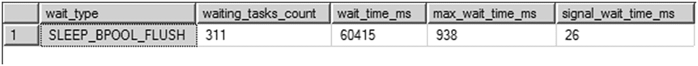

一个包含 5 列 1 行的表格。其中列出了等待类型为 sleep b pool flush，等待任务计数为 311，等待时间（毫秒）为 60415，最大等待时间（毫秒）为 938，信号等待时间（毫秒）为 26。

图 6-30
`SLEEP_BPOOL_FLUSH` 等待

如你所见，在运行清单 6-10 中的脚本后，`SLEEP_BPOOL_FLUSH` 等待时间非常高。通常情况下，你期望这些等待时间要么非常低，要么接近于零。如果我们完全从脚本中移除 `CHECKPOINT` 命令，让 SQL Server 自行决定何时运行检查点进程，我们不仅会得到完全不同的结果（如图 6-31 所示），而且脚本的运行时间也会减少到仅仅几毫秒。

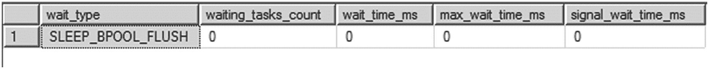

一个包含 5 列和 1 行的表格。其中列出了等待类型为 sleep b pool flush，等待任务计数为 0，等待时间（毫秒）为 0，最大等待时间（毫秒）为 0，信号等待时间（毫秒）为 0。

图 6-31
移除 `CHECKPOINT` 后的 `SLEEP_BPOOL_FLUSH` 等待时间

#### 降低 SLEEP_BPOOL_FLUSH 等待

尽管由于 `SLEEP_BPOOL_FLUSH` 等待类型导致的性能问题并不常见，但有多种方法可以降低等待时间。

最明显的方法是检查我们之前讨论过的各种可用配置选项，以手动配置恢复间隔。恢复间隔的值越低，检查点进程发生的频率就越高，遇到 `SLEEP_BPOOL_FLUSH` 等待的可能性就越大。此外，正如你在示例中所注意到的，在事务内执行频繁的 `CHECKPOINT` 命令可能导致 `SLEEP_BPOOL_FLUSH` 等待。

另一个可能的原因是数据库数据文件所在的存储子系统。如前所述，检查点进程会分析存储子系统的负载，然后决定是否需要限制其吞吐量。如果因为存储子系统繁忙而频繁需要限制，你更有可能看到 `SLEEP_BPOOL_FLUSH` 等待发生。

如果你运行的是 SQL Server 2016，你很可能永远不会遇到非常高的 `SLEEP_BPOOL_FLUSH` 等待时间，因为 SQL Server 处理该进程的默认方式已经改变。

#### SLEEP_BPOOL_FLUSH 总结

`SLEEP_BPOOL_FLUSH` 等待类型与 SQL Server 中的检查点进程密切相关。检查点进程负责将缓冲区缓存中已修改（或脏）的数据页写入数据库数据文件。检查点进程在将脏页写入磁盘之前会分析存储子系统的性能，如果存储子系统繁忙，检查点进程将限制其吞吐量，从而导致 `SLEEP_BPOOL_FLUSH` 等待。虽然看到非常高的 `SLEEP_BPOOL_FLUSH` 等待时间并不常见，但它们仍然可能影响性能。频繁执行 `CHECKPOINT` T-SQL 命令的查询，或将恢复间隔配置为非常低的值，可能是看到 `SLEEP_BPOOL_FLUSH` 等待发生的可能原因。存储子系统的性能也可能影响检查点进程，如果它被迫限制其吞吐量。

### WRITE_COMPLETION

与 `ASYNC_IO_COMPLETION` 和 `IO_COMPLETION` 等待类型一样，`WRITE_COMPLETION` 等待类型与 SQL Server 在存储子系统上执行的特定操作有关。同样，在 SQL Server 实例上看到 `WRITE_COMPLETION` 等待是很正常的，只有当等待时间远高于正常水平时，才应该引起关注。

#### 什么是 WRITE_COMPLETION 等待类型？

`WRITE_COMPLETION` 等待类型是 `IO_COMPLETION` 等待类型的近亲。但是，`IO_COMPLETION` 等待类型是针对特定的读写操作记录的，而 `WRITE_COMPLETION` 等待类型仅针对一些非常特定的写操作记录。其中一些写操作包括扩展数据或日志文件或执行 `DBCC CHECKDB` 命令。

由于 `WRITE_COMPLETION` 等待类型与将 SQL Server 数据写入存储子系统有关，其性能会对等待时间产生影响。


#### WRITE_COMPLETION 示例

为了向您展示一个 WRITE_COMPLETION 等待发生的例子，我将在执行 `DBCC SQLPERF('sys.dm_os_wait_stats', CLEAR)` 命令清除 `sys.dm_os_wait_stats` DMV 后，对 GalacticWorks 数据库执行一个 `CHECKDB`。

请记住，这个例子是一个完全正常的情况，其中可能发生 WRITE_COMPLETION 等待，它不应该阻止您执行常规的数据库一致性检查！

清单 6-15 显示了我执行以产生一些 WRITE_COMPLETION 等待的查询。

```
DBCC SQLPERF('sys.dm_os_wait_stats', CLEAR);
DBCC CHECKDB ('GalacticWorks');
SELECT * FROM sys.dm_os_wait_stats
WHERE wait_type = 'WRITE_COMPLETION';
```
清单 6-15
生成 WRITE_COMPLETION 等待

批次中最后一个查询的结果如图 6-32 所示。


一个包含 5 列 1 行的表格。它列出了等待类型为 write completion，等待任务数为 2，等待时间（毫秒）为 3，最大等待时间（毫秒）为 2，信号等待时间（毫秒）为 3。

图 6-32
WRITE_COMPLETION 等待

正如您所看到的，等待时间非常短，不会引起任何担忧。这部分也是因为 GalacticWorks 数据库非常小，而且我的测试机器的存储性能非常快。对更大的数据库运行 `CHECKDB` 可能会导致更高的等待时间。

#### 降低 WRITE_COMPLETION 等待

如果您看到较高的 WRITE_COMPLETION 等待时间，尝试找出是什么进程导致了这些等待。在许多情况下，这可能是由 `CHECKDB` 或数据库数据/日志文件增长引起的。

一个值得检查的事情是本章前面 ASYNC_IO_COMPLETION 部分讨论的即时文件初始化选项。不使用此选项会影响 WRITE_COMPLETION 等待时间的持续时间。

另一个导致 WRITE_COMPLETION 等待时间较高的、远不常见的原因是当您在页面可用空间（PFS）页面上遇到页闩锁争用时。PFS 页面跟踪数据页中的可用空间量。如果一个进程需要非常频繁地修改 PFS 页面，就有可能看到 WRITE_COMPLETION 等待与许多 `PAGELATCH_UP` 等待一起发生，我们将在第 9 章“与闩锁相关的等待类型”中讨论这一点。为了给您一个这种场景的示例，考虑大量并发查询都创建临时表、插入几行然后又删除临时表的情况。在这种情况下，`tempdb` 数据库的 PFS 页面需要非常频繁地更新以反映临时表的创建和删除。

#### WRITE_COMPLETION 总结

`WRITE_COMPLETION` 等待类型，就像 `ASYNC_IO_COMPLETION` 和 `IO_COMPLETION` 等待类型一样，与 SQL Server 执行的特定存储相关操作有关。看到 WRITE_COMPLETION 等待是非常正常的，在许多情况下不会引起担忧。`CHECKDB` 和数据库数据/日志文件增长等操作可能导致 WRITE_COMPLETION 等待。

## 7. 备份相关等待类型

备份是数据库管理中非常重要的一部分，对于您所在公司的生存至关重要。**数据是企业拥有的最关键资产**，如果灾难导致数据丢失，公司可能会损失大量资金甚至倒闭。

在灾难期间最小化数据损失的方法有很多。我们可以使用 SAN 而不是直接连接存储，并可能利用 SAN 复制。或者我们可以使用云存储。也许我们创建一个 SQL Server Always On 可用性组将数据复制到数据中心和全球区域。但我们必须做的第一步，并且希望已经采取的，是定期备份 SQL Server 数据库中的数据。

实施和安排 SQL Server 备份并不是一项非常困难的任务，没有理由不执行定期备份。备份类型和备份操作的间隔由您工作的组织的需求决定，并通常以“RTO”（恢复时间目标）和“RPO”（恢复点目标）时间表示。这些时间代表了从灾难中恢复所需的时间量，以及灾难发生时可接受的数据丢失量。这两个时间应该是您的 SQL Server 备份策略的主要输入。

注意

我说的是“备份策略”，但实际上您首先要构建的是**恢复策略**。这就是 RTO 和 RPO 至关重要的地方。一旦您知道了恢复策略，然后才配置数据库备份。

值得庆幸的是，SQL Server 开箱即有满足 RTO 和 RPO 要求的不同选项。我们可以使用 SQL Server 自己的备份机制来满足公司的 RTO 和 RPO 时间；我们不依赖于第三方备份软件。由于 SQL Server 备份操作是一个内部过程，因此有与之关联的不同等待类型，在本章中，我们将了解与执行备份和还原直接相关的三种最常见的等待类型。

注意到这些备份/还原相关等待类型的高等待时间，不太可能导致 SQL Server 实例的性能下降。但是，我们确实可以选择优化 SQL Server 备份过程，从而加快备份和还原速度。并且由于数据库的备份/还原对于公司的生存至关重要，优化备份和还原吞吐量非常值得付出努力。

### BACKUPBUFFER

要讨论的第一个备份相关等待类型是 `BACKUPBUFFER`。如果我们在 Books Online 上查找此等待类型的定义，会得到以下文本：“当备份任务正在等待数据，或正在等待用于存储数据的缓冲区时发生。此类型不常见，除非任务正在等待磁带装入。”这种措辞听起来好像我们仅在将备份写入磁带设备时才会看到此事件，但事实并非如此。在备份操作期间，无论备份文件的目标是什么，都会记录 BACKUPBUFFER 等待。原因在于 SQL Server 备份操作使用缓冲区从数据库读取数据并将其写入备份文件的方式。


#### 什么是 BACKUPBUFFER 等待类型？

要理解 BACKUPBUFFER 等待是如何产生的，我们将深入了解 SQL Server 备份过程的内部机制。无论你使用哪种备份方法（即事务日志备份、差异备份或完整备份），这些内部机制基本相同，因此也会遇到相同的等待类型。

SQL Server 为备份过程分配缓冲区。这些缓冲区将被你的数据库数据填满，并在写入备份文件的过程中移动（或者对于还原操作则相反）。缓冲区在系统内存中分配，但位于缓冲区缓存之外，以避免从缓冲区缓存中窃取内存。备份缓冲区的大小和数量由 SQL Server 自动计算，但我们可以自己将这些值配置为备份/还原命令的参数。图 7-1 展示了这些备份缓冲区如何通过一个“读取器”（从你的数据库或备份文件读取数据到缓冲区）和一个“写入器”（将数据从缓冲区写入备份文件或数据库）进行排序和移动。


一个描述缓冲操作的图示，包含源、读取器、已填充和空的缓冲区、写入器以及目标。

图 7-1
通过读取器和写入器移动的备份缓冲区

我们可以通过启用两个跟踪标志 3213 和 3605 来查看备份或还原操作期间有关缓冲区数量和大小的信息，这将把备份/还原信息输出到 SQL Server 错误日志。清单 7-1 中的查询启用了这两个跟踪标志，并对我的测试 SQL Server 上的 GalacticWorks 数据库执行了完整备份。

```sql
-- 启用跟踪标志
DBCC TRACEON (3213);
DBCC TRACEON (3605);
-- 备份数据库
BACKUP DATABASE [GalacticWorks]
TO  DISK = N'C:\TeamData\GWorks.bak'
WITH NAME = N'GalacticWorks-Full Database Backup';
-- 禁用跟踪标志
DBCC TRACEOFF (3213);
DBCC TRACEOFF (3605);
```
清单 7-1
使用备份信息跟踪标志进行完整数据库备份

请记住，SQL Server 中的跟踪标志应仅在 Microsoft 支持的指导下使用。我现在启用它们是为了在我的测试 SQL Server 上显示备份信息，但我建议不要在生产系统上使用它们。

在 SQL Server 错误日志中，记录了我们刚刚执行的备份的附加信息，如图 7-2 所示。

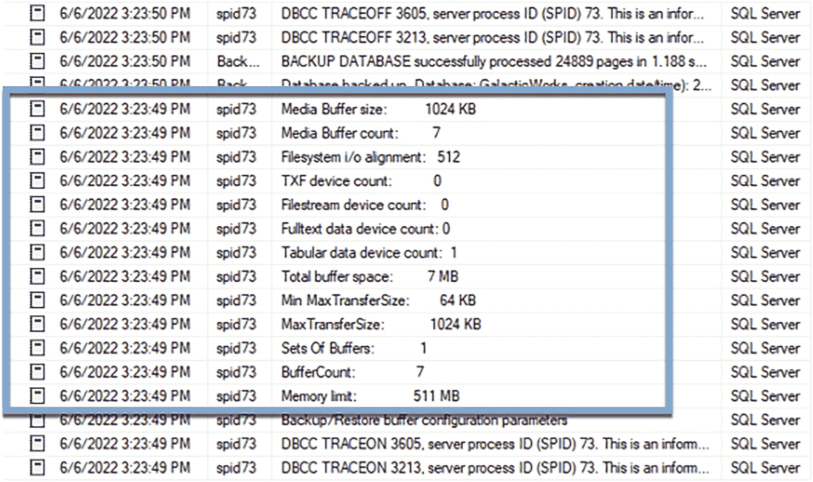

SQL Server 日志信息的 20 行文本。从“媒体缓冲区大小”到“内存限制”的 13 行文本被标记。

图 7-2
附加的备份信息

在这种情况下，备份操作创建了七个缓冲区（由 `Buffer count` 参数显示），每个缓冲区大小为 1024 KB（由 `Buffer size` 参数显示）。创建缓冲区所需的总内存量由 `Total buffer space` 参数显示，为 7 MB（`Buffer count` * `Buffer size`）。另一个有趣的信息是内存限制。这显示了备份操作在缓冲区缓存之外可以访问的最大内存量。

现在我们了解了 SQL Server 内部的备份过程是如何工作的，让我们看看 BACKUPBUFFER 等待类型出现在哪里。

如前所述，SQL Server 备份过程使用缓冲区来存储需要写入备份文件的数据。每当没有直接可用的缓冲区时，就会发生 BACKUPBUFFER 等待，使该过程等待，直到一个完整的缓冲区被写入备份文件并再次变得可用。

#### BACKUPBUFFER 示例

产生 BACKUPBUFFER 等待非常简单——只需执行一个备份操作。对于本例，我运行了清单 7-2 中所示的查询。该查询将首先重置 `sys.dm_os_wait_stats` DMV，然后对 GalacticWorks 数据库执行完整备份，最后返回 BACKUPBUFFER 等待类型的等待统计信息。

```sql
-- 清除 sys.dm_os_wait_stats
DBCC SQLPERF('sys.dm_os_wait_stats', CLEAR);
-- 备份数据库
BACKUP DATABASE [GalacticWorks]
TO DISK = N'C:\TeamData\GWorks.bak'
WITH
NAME = N'GalacticWorks-Full Database Backup';
-- 查询 BACKUPBUFFER 等待
SELECT *
FROM sys.dm_os_wait_stats
WHERE wait_type = 'BACKUPBUFFER';
```
清单 7-2
产生 BACKUPBUFFER 等待

对 `sys.dm_os_wait_stats` DMV 查询的结果如图 7-3 所示。

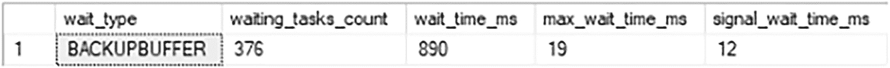

一行有五列：等待类型为 `BACKUPBUFFER`，等待任务计数为 376，等待时间（毫秒）为 890，最大等待时间（毫秒）为 19，信号等待时间（毫秒）为 12。

图 7-3
BACKUPBUFFER 等待

在我的测试 SQL Server 上，备份操作的总持续时间约为 1 秒。在这 1 秒中，有 890 毫秒花费在等待可用的备份缓冲区上。

#### 降低 BACKUPBUFFER 等待

正如本章引言所述，与备份相关的等待通常不是需要关注的原因，因为它们通常不会影响 SQL Server 实例的性能。然而，我们可以利用各种备份相关等待类型的等待统计信息来提高备份性能。

降低 BACKUPBUFFER 等待时间的最常见方法之一是为备份操作添加更多缓冲区来使用，覆盖自动分配的缓冲区。我们通过在 `BACKUP` T-SQL 命令中指定 `BUFFERCOUNT` 选项来实现这一点。然而，改变备份操作可以使用的缓冲区数量有一个注意事项。每个创建的缓冲区都会分配 `MAXTRANSFERSIZE` 选项的值；该值由 SQL Server 自动计算或通过你自己在 `BACKUP` 命令中设置（最大为 4,194,304 字节）。由于备份操作在缓冲区缓存之外分配内存，使用过多或过大的缓冲区可能会导致内存不足的问题。因此，在测试你的 SQL Server 实例的最佳值时要小心。

清单 7-3 展示了对清单 7-2 中查询的修改，我们用它来演示 BACKUPBUFFER 等待的发生。在这种情况下，我们添加了 `BUFFERCOUNT` 选项并将其配置为 200。

```sql
-- 清除 sys.dm_os_wait_stats
DBCC SQLPERF('sys.dm_os_wait_stats', CLEAR);
-- 备份数据库
BACKUP DATABASE [GalacticWorks]
TO DISK = N'C:\TeamData\GWorks.bak'
WITH
NAME = N'GalacticWorks-Full Database Backup',
BUFFERCOUNT = 200;
-- 查询 BACKUPBUFFER 等待
SELECT *
FROM sys.dm_os_wait_stats
WHERE wait_type = 'BACKUPBUFFER';
```
清单 7-3
配置了 BUFFERCOUNT 的数据库备份

对 `sys.dm_os_wait_stats` DMV 查询的结果如图 7-4 所示。


一行有五列：等待类型为 `BACKUPBUFFER`，等待任务计数为 2，等待时间（毫秒）、最大等待时间（毫秒）和信号等待时间（毫秒）均为 0。

图 7-4
BACKUPBUFFER 等待

正如你所看到的，花费在 BACKUPBUFFER 等待上的时间减少到 0 毫秒，而我们未提供 `BUFFERCOUNT` 参数时花费了 890 毫秒。这是因为我们指定的缓冲区数量足以处理备份操作，而无需分配额外的缓冲区。由于不需要额外的缓冲区，我们不会花费时间等待它们的分配。

另一个选项是在 `BACKUP` T-SQL 命令中配置 `MAXTRANSFERSIZE` 选项。这将允许缓冲区被更大的工作单元填充，最大可达 4,194,304 字节，即 4 MB。同样，为缓冲区分配更多空间将导致保留更多的内存。


#### BACKUPBUFFER 摘要

BACKUPBUFFER 等待通常在备份或还原操作期间发生，当备份/还原操作需要等待可用缓冲区再次变为可用时出现。由于这是正常现象，因此不必担心。我们确实有一些选项可以降低 `BACKUPIO` 等待时间，这也将影响备份/还原操作的持续时间。不过，这些参数应进行彻底配置和测试，因为设置得过高可能导致内存不足错误。

### BACKUPIO

就像 `BACKUPBUFFER` 等待类型一样，`BACKUPIO` 等待类型在备份或还原操作的某部分遇到争用问题时发生。有趣的是，在联机丛书中，`BACKUPIO` 等待类型的描述与 `BACKUPBUFFER` 完全相同：“在备份任务等待数据，或等待用于存储数据的缓冲区时发生。此类型并不常见，除非任务正在等待磁带装载。” 相同的描述对应两个不同的等待事件，这**完全不会令人困惑**。同样，这种等待类型在执行备份或还原操作时很常见，即使备份目标或还原源不是磁带设备。

#### 什么是 BACKUPIO 等待类型？

为了更好地理解 `BACKUPIO` 等待是如何产生的，我们必须查看图 7-5（之前作为图 7-1 展示过）。

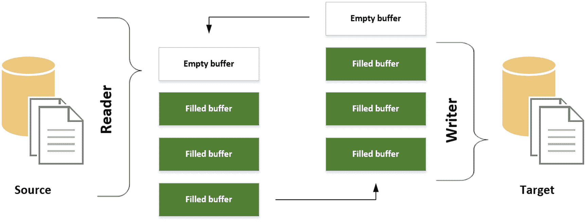
图 7-5：备份操作的内部原理

在上一节讨论 `BACKUPBUFFER` 等待类型时，我们解释了 `BACKUPBUFFER` 等待类型发生在等待空闲（空）缓冲区变为可用时。在很大程度上，`BACKUPBUFFER` 等待类型位于图 7-5 的左侧，即读取器处。而 `BACKUPIO` 等待类型主要发生在图 7-5 的右侧，即写入器部分。当 `BACKUPIO` 等待发生时，意味着写入器写入数据的时间出现了延迟。这种延迟可能由多种原因引起，例如，将备份写入慢速磁盘、将备份写入网络位置或正在还原数据库时。

在执行数据库备份或还原时，`BACKUPIO` 等待类型通常会与 `ASYNC_IO_COMPLETION` 等待同时出现。

#### BACKUPIO 示例

我们将使用与演示 `BACKUPBUFFER` 等待类型时相同的示例。我修改了查询以返回 `BACKUPIO` 等待而非 `BACKUPBUFFER` 等待，并且在对 `sys.dm_os_wait_stats` DMV 的查询结果中包含了 `ASYNC_IO_COMPLETION`。代码清单 7-4 显示了修改后的备份查询。

```sql
-- 清除 sys.dm_os_wait_stats
DBCC SQLPERF('sys.dm_os_wait_stats', CLEAR);
-- 备份数据库
BACKUP DATABASE [GalacticWorks]
TO DISK = N'C:\TeamData\GWorks.bak'
WITH
NAME = N'GalacticWorks-Full Database Backup';
-- 查询 BACKUPIO 等待
SELECT *
FROM sys.dm_os_wait_stats
WHERE wait_type = 'BACKUPIO'
OR wait_type = 'ASYNC_IO_COMPLETION';
```
代码清单 7-4：生成 `BACKUPIO` 等待

对 `sys.dm_os_wait_stats` DMV 的查询结果如图 7-6 所示。

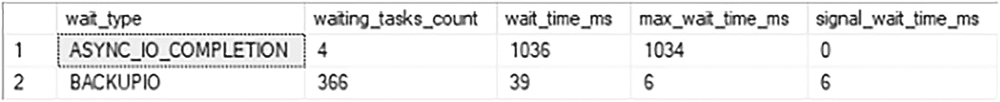
图 7-6：`ASYNC_IO_COMPLETION` 和 `BACKUPIO` 等待

如图 7-6 所示，数据库备份导致产生了两种等待类型，大部分时间花费在 `ASYNC_IO_COMPLETION` 等待上，该等待负责读取需要写入备份文件的数据页。由于我的备份目标在 SSD 磁盘上，因此我们没有遇到非常高的 `BACKUPIO` 等待时间。

#### 降低 BACKUPIO 等待

调整 `BUFFERCOUNT` 和 `MAXTRANSFERSIZE` 选项对 `BACKUPIO` 等待类型的影响，不如对 `BACKUPBUFFER` 等待类型的影响那么大。当你看到 `BACKUPIO` 等待类型的等待时间高于正常水平时，问题很可能与存储子系统或你正在写入/读取备份的网络位置的吞吐量有关。请务必检查这两个位置是否存在可能的性能问题，如高延迟或高网络利用率。

另一个可以探索的可能选项是在多个文件上进行条带化备份。条带化备份文件可能会缩短备份操作的持续时间，但可能不会降低 `BACKUPIO` 等待的总时间。

#### BACKUPIO 摘要

与 `BACKUPBUFFER` 等待类型类似，`BACKUPIO` 等待类型在执行备份或还原操作时发生。虽然 `BACKUPBUFFER` 等待类型主要与备份操作访问备份缓冲区的速度有关，但 `BACKUPIO` 等待类型则与这些备份缓冲区写入磁盘的速度有关。在执行完整数据库备份或还原时，`BACKUPIO` 等待经常与 `ASYNC_IO_COMPLETION` 等待同时出现。当看到 `BACKUPIO` 等待类型的等待时间高于正常水平时，请检查你正在写入或读取备份文件的位置的性能指标。降低 `BACKUPIO` 等待时间不会影响系统的查询性能，但会帮助加速备份和还原操作。

### BACKUPTHREAD

`BACKUPTHREAD` 等待类型在执行数据库还原操作时常见，但在备份操作期间也会发生。它发生在另一个线程等待备份/还原操作完成以便继续处理时。

#### 什么是 BACKUPTHREAD 等待类型？

当你看到 `BACKUPTHREAD` 等待发生时，意味着另一个线程想要访问一个当前正被备份或还原操作占用的资源。在线程必须等待备份/还原完成期间，系统会记录 `BACKUPTHREAD` 等待时间。这种等待的一个例子是：一个线程需要访问正在被还原的数据库数据文件，例如，正在将数据文件写入磁盘的 `ASYNC_IO_COMPLETION` 等待类型。

`BACKUPTHREAD` 等待通常不是引起担忧的原因。它们仅表示其他线程正在等待备份/还原操作完成，并且其持续时间通常与你的备份或还原完成所需的时间相同。然而，它们确实提示你，如果有其他等待的等待时间高于预期，可能值得调查。

因为一图胜千言，图 7-7 展示了 `BACKUPTHREAD` 等待类型与还原操作及其他发生的等待之间的关系。

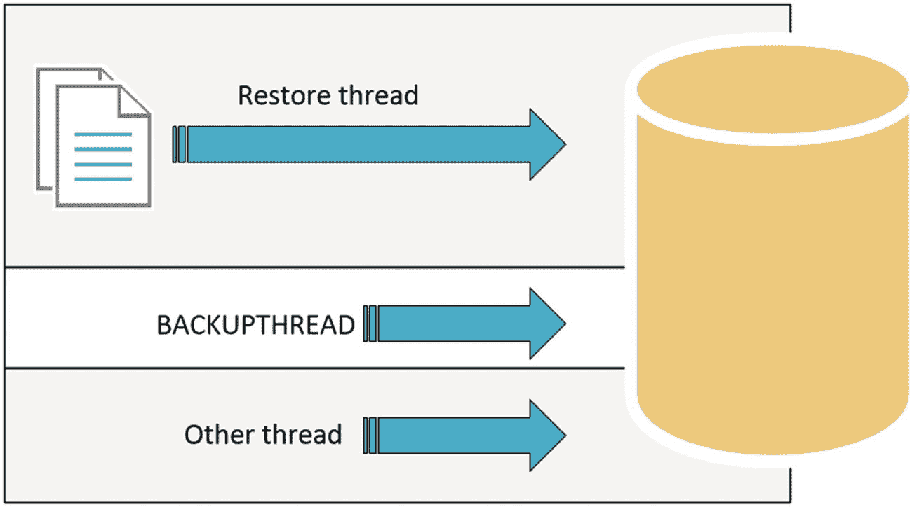
图 7-7：`BACKUPTHREAD` 与其他线程的关系

在图 7-7 中，你可以看到 `BACKUPTHREAD` 等待的发生是因为另一个线程也想要访问当前由还原操作拥有的资源。


