# BACKUPTHREAD 等待类型

## 示例

演示 `BACKUPTHREAD` 等待的一个简单方法是执行还原操作。当你执行还原时，其他进程将需要访问数据库数据文件，以将备份文件中的信息写入数据库数据文件。

清单 7-5 展示了一个用于还原我之前在测试 SQL Server 上为 GalacticWorks 数据库创建的备份文件的脚本。

```
-- 清除 sys.dm_os_wait_stats
DBCC SQLPERF('sys.dm_os_wait_stats', CLEAR);
-- 还原数据库
USE [master]
RESTORE DATABASE [GalacticWorks]
FROM DISK = N'C:\TeamData\GWorks.bak'
WITH  FILE = 1, REPLACE;
-- 查询 BACKUPBUFFER 等待
SELECT *
FROM sys.dm_os_wait_stats
WHERE wait_type IN ('BACKUPIO','BACKUPTHREAD', 'PREEMPTIVE_OS_WRITEFILEGATHER');
```

如果我们在备份运行期间查看 `sys.dm_os_waiting_tasks` DMV，我们会看到发生的等待，如图 7-8 所示，该图显示了我的测试 SQL Server 上等待选择的截图。

```
一张表有 5 列，分别是：wait_type，waiting_tasks_count，wait_time_ms，max_wait_time_ms，signal_wait_time_ms。
它有 3 行数据，对应 BACKUPIO，BACKUPTHREAD 和 PREEMPTIVE_OS_WRITEFILEGATHER。
```
图 7-8
`BACKUPTHREAD` 和其他等待

正如你在图 7-8 中所看到的，`BACKUPTHREAD` 等待类型的等待时间接近于 `PREEMPTIVE_OS_WRITEFILEGATHER` 等待类型。此等待类型负责将数据写入文件系统，我们将在第 11 章“抢占式等待类型”中深入探讨这个特定的等待类型。

#### 降低 BACKUPTHREAD 等待

虽然 `BACKUPTHREAD` 等待类型本身并不表示任何问题，但它与其他等待类型的结合可能是进行一些额外研究的原因。基本上，你可以用来加速备份或恢复过程的任何方法都会影响 `BACKUPTHREAD` 的等待时间。

一些好的起点是你可以为 `BACKUP` 和 `RESTORE` T-SQL 命令指定的 `BufferCount` 和 `MaxTransferSize` 选项。我们在讨论 `BACKUPBUFFER` 和 `BACKUPIO` 等待类型时提到过这些设置。调整这些设置可以使你的备份和还原花费更少的时间，从而导致更低的 `BACKUPTHREAD` 等待时间。

另一个可以显著改善备份和还原时间的设置是我们在第 6 章“与 IO 相关的等待类型”的 `ASYNC_IO_COMPLETION` 部分讨论过的即时文件初始化选项。

#### 总结

`BACKUPTHREAD` 等待时间并不表示对特定资源的访问，而是表示另一个进程正在等待备份或还原操作完成。看到这种等待类型非常常见，尤其是在还原操作期间。缩短备份和还原操作的持续时间也会反映在 `BACKUPTHREAD` 等待类型的等待时间上。你可以用来降低 `BACKUPTHREAD` 等待时间的方法之一是检查是否启用了即时文件初始化。此设置不会直接影响 `BACKUPTHREAD` 等待类型，但它会影响其他等待类型，进而影响 `BACKUPTHREAD` 等待时间。

## 8. 与锁相关的等待类型

锁定是每个关系数据库或关系数据库管理系统（`RDBMS`）的基本组成部分。`SQL Server` 基于关系数据库模型，因此在访问数据时会使用锁定。尽管我们经常将锁定与性能问题联系起来，但它在确保数据在并发工作负载期间的可靠性方面起着至关重要的作用。`SQL Server` 或任何其他 `RDBMS` 确保数据可靠性的方式是遵循“`ACID`”属性，这些属性最初由 `Jim Gray` 在 1970 年代定义，但在 1983 年由 `Andreas Reuter` 和 `Theo Härder` 命名。这些 `ACID` 属性被强制实施于单个操作上，我们通常将其称为*事务*。缩写 `ACID` 包含四个特征，它们保证了事务内部数据的可靠性。以下列表描述了这些特征中的每一个：

*   `Atomicity` – 原子性特征要求事务被视为一个单一单元，该单元要么完全失败，要么完全成功。这意味着如果事务的一部分失败，则整个事务失败，并且事务内所做的每个更改都需要回滚到事务开始前的状态。
*   `Consistency` – 一致性特征要求事务写入数据库的数据是有效的。这意味着数据必须排除非法或错误的输入。
*   `Isolation` – 隔离性特征要求事务对其他并发事务是隐藏的。从事务的角度来看，这意味着并发事务使数据库处于与事务顺序运行相同的状态。
*   `Durable` – 持久性特征要求每个已提交的事务即使在发生电源故障或灾难时也保持已提交状态。

正如你从阅读不同的 `ACID` 属性中可能猜到的那样，`SQL Server` 中的锁定与隔离性特征密切相关。

由于本章专门讨论与锁相关的等待类型，我们不会详细介绍除隔离性之外的 `ACID` 属性。如果你有兴趣了解更多关于 `ACID` 属性和数据库理论的信息，一个好的起点是 `Andreas Reuter` 和 `Theo Harder` 的研究论文“事务型数据库恢复原理”，该论文详细描述了 `ACID` 属性。你可以在 [`https://slrwnds.com/ba7klg`](https://slrwnds.com/ba7klg) 找到这篇论文。

为了更好地理解隔离性特征的工作原理，我们需要理解事务。一个事务代表与数据库的一次交互，它可能由多个操作组成，并且独立于其他事务运行。

为了确保我们的事务不与其他并发事务冲突，`SQL Server` 使用了*锁*。这些锁确保没有其他事务同时修改你的事务正在处理的数据。例如，如果你从银行账户中提取 100 美元，你不会希望另一次并发提取修改该金额。其他交易将等待它们的取款，直到你的交易完成。在 `SQL Server` 内部，这个过程的工作方式相同。当你从数据库请求数据时，你希望得到你请求的数据，而没有数据在被请求和返回之间被修改的风险。

当你运行事务时，它将受到 `SQL Server` 在你访问的对象上放置的锁的保护。如果另一个事务想要与同一个对象交互，则会发生阻塞。当这种阻塞发生时，后一个事务将不得不等待，直到对象上的锁被移除。然后，该事务可以在对象上放置自己的锁并开始其交互。


在 SQL Server 中，我们有许多选项可用于控制锁定的行为，其中大多数与更改针对数据库的特定或所有事务的隔离级别有关。在 SQL Server 内部，我们可以访问大量关于锁定和阻塞的信息，其中非常重要的一部分就隐藏在等待统计信息之中。事务等待访问被锁定对象的时间会被记录为特定的、与锁相关的等待类型的等待时间（具体取决于事务打算放置的锁类型）。

在本章中，我们将讨论与锁定和阻塞相关的各种等待类型，以及如何降低甚至解决它们。这需要一些关于 SQL Server 如何使用锁的知识，因此，我专门安排了一节内容来让我们熟悉锁定和阻塞，然后再深入探讨锁等待类型。

### 锁定与阻塞简介

正如我们刚才所讨论的，SQL Server 使用锁来将不同的并发事务彼此隔离，因此数据一次只能由一个事务访问或修改。SQL Server 可以使用不同类型的锁或锁模式，并且可以在各种对象级别上放置锁。更复杂的是，不同的锁模式彼此之间不一定兼容，当两个不兼容的锁相遇时，就会发生阻塞。

#### 锁模式与兼容性

首先，让我们熟悉一下 SQL Server 内部的不同类型的锁或锁模式。以下列表描述了最常见的锁模式。SQL Server 内部还有更多的锁模式，但它们只在执行非常特定的操作时才会出现。不同锁模式的完整列表可以在这里找到 [`https://slrwnds.com/m664d1`](https://slrwnds.com/m664d1)。

SQL Server 使用缩写来指示内部使用的锁模式。这些缩写显示在括号中：

*   **共享锁 (S)** – 当查询从某个资源读取数据时，会将共享锁放置在该资源上。例如，`SELECT * FROM [table]`。
*   **更新锁 (U)** – 当查询想要修改资源时，会使用更新锁模式。引入更新锁是为了防止“死锁”，即并发事务中需要修改同一资源的锁彼此等待释放的情况。
*   **排他锁 (X)** – 当事务正在修改资源时，会放置排他锁。当存在排他锁时，其他事务无法修改该资源。例如，`INSERT`、`UPDATE` 或 `DELETE` T-SQL 语句将导致排他锁。
*   **架构锁 (Sch)** – 当表正在被修改时，会使用架构锁。一个例子是向表中添加列。
*   **意向锁 (I)** – 意向锁用于指示在锁定层次结构较低级别放置的锁。我们稍后将更详细地讨论锁层次结构。

当不同的锁需要相互交互时，SQL Server 会对涉及的不同锁模式执行锁兼容性检查。并非所有的锁模式都彼此兼容，这意味着当两个不同的事务由于锁不兼容而无法同时访问资源时，就会发生阻塞。例如，当放置共享锁来读取某一行时，另一个事务想通过放置排他锁来修改该行，那么排他锁将不得不等待，直到共享锁被移除。表 8-1 显示了共享锁、更新锁和排他锁模式的锁兼容性。

表 8-1
锁兼容性

| 锁模式 | 共享 | 更新 | 排他 |
| --- | --- | --- | --- |
| **共享** | 是 | 是 | 否 |
| **更新** | 是 | 否 | 否 |
| **排他** | 否 | 否 | 否 |

让我们通过一个例子来说明锁兼容性。假设你想通过针对表执行 `SELECT` 语句来读取表中的一行。当你执行查询时，SQL Server 会检查你想要访问的行上是否已存在锁，以及该锁是否与你想要在该行上放置的锁兼容。让我们假设在你运行查询时没有锁存在。这种情况下，会在该行上放置一个共享锁，表明你的查询正在从该行读取数据。就在你执行查询之后，另一个用户发起了一个事务，想要修改你正在访问的行中的数据。SQL Server 将检测到该行上存在一个共享锁，使得第二个事务在放置其排他锁之前必须等待，因为共享锁和排他锁不兼容。运行第二个事务的用户可能会遇到延迟，因为该事务正在等待共享锁被移除，然后才能放置其排他锁。如果启动了第三个事务，它想要读取与你的事务相同的行，则不会发生锁冲突。共享锁与其他共享锁是兼容的，这意味着第三个事务不必等待放置其锁，它可以直接获取它请求的结果。

图 8-1 显示了这个例子，其中虚线表示必须等待的不兼容锁。

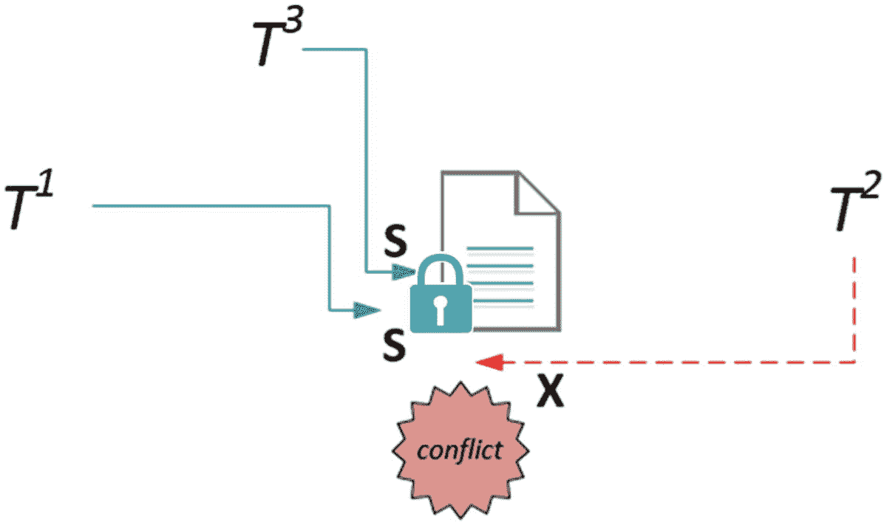

图表描绘了 S Q L 如何检测 T¹ 和 T³ 事务具有共享锁，而 T² 没有锁并导致冲突。

图 8-1
并发锁情况

#### 锁层次结构

SQL Server 使用多粒度锁来允许对不同级别的对象使用不同的锁。这样做是为了最小化锁定的开销成本。可以放置锁的最低可能对象是行，最大的是数据库。在这两个粒度级别之间有许多级别，SQL Server 自动决定应在哪个级别放置锁以最小化锁定开销。以下列表显示了最常见的锁级别，按从最高粒度到最小粒度排序：

*   数据库
*   数据库文件
*   表/对象
*   区
*   页
*   RID（堆中的行）/ KEY（聚集索引中的行）

我们之前讨论的意向锁在不同粒度级别上放置锁起着重要作用。SQL Server 会在更高粒度的对象上放置意向锁，以指示在较低级别已放置了锁。这保护了较低级别的锁免受更高粒度级别上对象更改的影响。从最高粒度级别到对象上的实际锁，所有放置的意向锁一起查看时称为锁层次结构。

图 8-2 显示了一个锁层次结构的图形化表示，用于修改行内的数据，这将需要在该行上放置排他锁，并在层次结构中更高的级别放置意向排他锁。

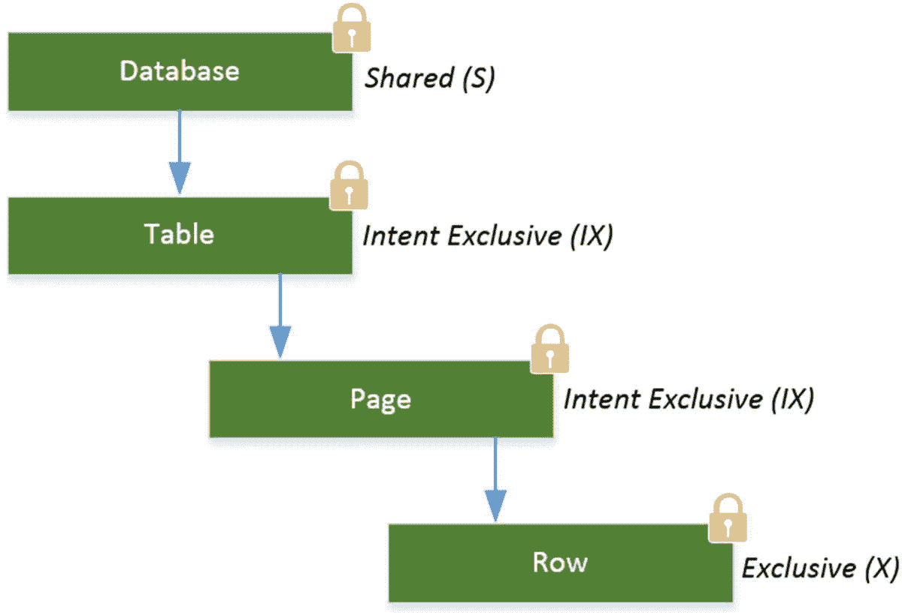

图表描绘了锁层次结构，分别在数据库、表、页和行级别具有共享锁、意向排他锁和排他锁。

图 8-2
锁层次结构示例

请注意数据库级别的共享锁。每个请求总是会放置一个共享锁，以在事务活动时保护对数据库的更改。这确保了，例如，在事务仍然活动时无法删除数据库。另请注意，意向锁将在最低级别的对象上使用相同的锁模式，在本例中是意向排他锁 (`IX`)。如果放置的是共享锁，意向锁的锁模式也会相应改变，在本例中是意向共享锁 (`IS`)。我们将在本章后面更深入地探讨意向锁。


### 隔离级别

我们可以通过更改隔离级别来控制事务所放置锁的类型。隔离级别定义了并发操作期间事务相互隔离的程度。我们可以在连接或事务的基础上更改隔离级别。更改隔离级别只会改变共享锁的行为；数据修改所需的排他锁不受影响。更改隔离级别还会引入某些现象。这些现象会影响读取事务的结果，它们的发生是由于在事务期间共享锁的放置和持有方式发生了变化。接下来的列表显示了 SQL Server 中可用的各种隔离级别（从最低的隔离形式到最高的），以及与之相关的现象：

*   `未提交读`：此隔离级别允许在另一个事务对同一对象执行修改时进行读取。它不会等待对象上的排他锁被释放。这使得读取未提交的值（称为“脏读”）成为可能。脏读可能是有害的（如果你不期望它们发生），因为它们可能返回数据库中已不再存在的值。例如，如果有人将某个值从“A”更新为“B”，而同时其他用户在同一时间查询相同的数据，则可能得到旧值“A”而不是更新后的“B”值。

*   `已提交读` – 这是 SQL Server 中的默认隔离级别。使用此隔离级别将使读取事务等待，直到并发的写入事务完成。将在行上放置一个共享锁，并在读取该行后立即释放。与此隔离级别相关的现象称为“不一致分析”。这意味着如果数据在两次读取事务之间被另一个事务修改，那么同一个读取查询可能会得到不同的结果。

*   `可重复读` – 将隔离级别设置为 `可重复读` 将锁定事务正在读取的行。但是，`可重复读` 不会在读取行后释放其上的共享锁，而是会将该锁保持到整个事务完成。`可重复读` 使得“幻读”可能发生。每当另一个事务添加或更改了尚未被读取事务锁定的数据时，就会发生幻读。

*   `可序列化` – `可序列化` 隔离级别是你可以使用的最高隔离级别，它将放置最多的锁以确保你正在读取的数据在事务运行期间不会被修改。它通过锁定你所选择的数据的整个范围（例如，整个表）来实现这一点，从而使其无法进行更改。由于你所选择的数据范围在事务开始时就被锁定，因此不可能发生任何现象。

SQL Server 2005 增加了另一种隔离事务的方法，称为行版本控制。行版本控制使用数据修改的版本，并将它们返回给读取查询，而不会导致阻塞。当一个事务修改数据时，更改将被记录为一个版本。当一个读取事务访问相同的数据时，它将收到在修改事务提交之前的更改版本。关于行版本控制的更多信息可以在在线手册中找到：`https://slrwnds.com/87n21i`。

**极客笔记**

`未提交读` 隔离级别通常通过使用 `NOLOCK` 查询提示来实现。许多开发人员错误地认为使用神奇的 `NOLOCK` 提示会使他们的查询运行得更快。这个误解不仅是错误的，而且对于依赖准确数据的重要查询来说，这是一种糟糕的做法。

因为隔离级别及其锁行为可能很复杂，难以理解，我添加了图 8-3，它展示了各种隔离级别在读取操作期间实现锁定的方式。方框代表表中的行，带有锁的行表示该行上有一个活动的共享锁。

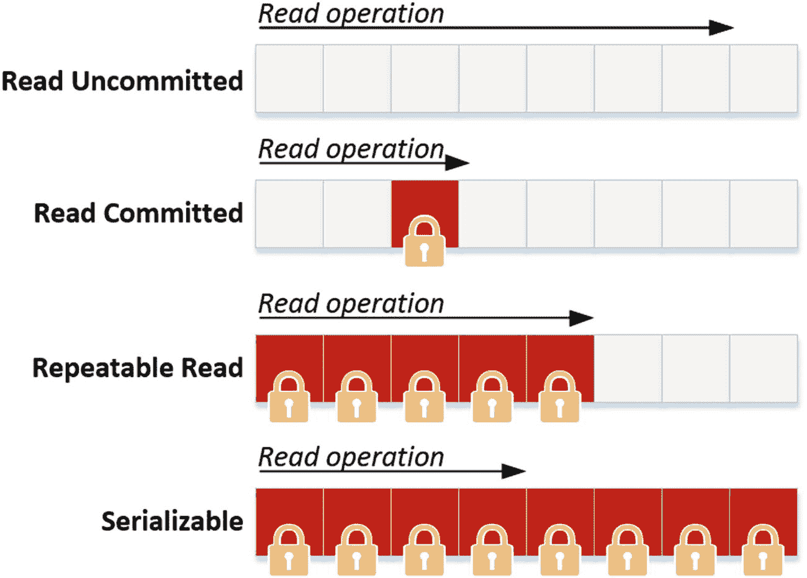

插图描绘了从 `未提交读`、`已提交读`、`可重复读` 到 `可序列化` 的不同类型隔离级别，其中 `可序列化` 具有高隔离级别。

**图 8-3**

隔离级别和锁行为

有各种原因使你会选择使用不同于默认 `已提交读` 的隔离级别。在许多情况下，这些原因与你工作负载预期的锁/阻塞量，或者你的事务返回的数据应该有多“正确”有关。例如，在默认的 `已提交读` 隔离级别下，你的事务运行期间数据可能被其他事务修改，这意味着事务结束时的结果与事务开始时的结果不同。为了确保在你的事务运行时数据不会改变，你可以使用 `可序列化` 隔离级别，但这意味着需要放置和维护更多的锁，从而在并发的 SQL Server 环境中导致更多的阻塞。

我们可以通过配置连接字符串中的不同隔离级别，或者通过提供表提示（快照隔离是一个例外，它是在数据库级别配置的）来更改默认的 `已提交读` 隔离级别。

**极客笔记**

`已提交读快照` 隔离级别（RCSI）是在数据库级别设置的，这意味着所有请求 `已提交读` 的事务将自动使用 RCSI。这种数据库级别的设置允许在不更改任何现有代码的情况下使用 RCSI 的好处。

例如，以下两个查询展示了使用 `未提交读` 隔离级别执行查询的两种不同方法。第一个查询为整个会话设置事务隔离级别：

```
SET TRANSACTION ISOLATION LEVEL READ UNCOMMITTED;
BEGIN TRANSACTION
SELECT *
FROM Person.Person
COMMIT TRANSACTION;
```

另一种方法是使用表提示将隔离级别设置为 `未提交读`：

```
SELECT *
FROM Person.Person
WITH (READUNCOMMITTED);
```

这两种方法都将达到相同的效果，但请记住，为会话设置隔离级别将导致在此特定会话中设置之后执行的所有查询都使用所选的隔离级别。


#### 查询锁信息

要查看当前已放置的锁，我们可以使用 `sys.dm_tran_locks` 动态管理视图（DMV）。此 DMV 将为 SQL Server 实例中的每个活动锁返回一行，并包含诸如锁类型、资源类型、放置锁的会话 ID 以及锁是已授予还是正在等待放置等信息。图 8-4 展示了我的测试 SQL Server 机器上该 DMV 输出的一小部分。

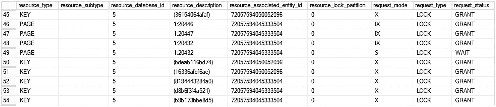

该表有 9 列，标题为资源类型、资源子类型、资源数据库 ID、资源描述、资源关联实体 ID、资源锁分区、请求模式、请求类型和请求状态。它包含 10 行条目。

图 8-4

`sys.dm_tran_locks` 输出

如果我们查看图 8-4，会看到在键锁级别授予并放置了多个排他锁（`X`）。这意味着某个事务目前正在修改聚簇索引内的数据。在键锁级别之上的页面级别，还有一个意向排他锁，表明在层次结构的较低级别存在一个排他锁。另外请注意，一个共享锁当前正等待在同一数据页（`1:20432`）上放置。该锁尚无法被授予，因为已存在一个不兼容的意向排他锁。

由于共享锁必须等待才能放置到数据页上，我们可以通过查看等待统计信息来查看它已等待的时间。图 8-5 显示了针对 `sys.dm_os_waiting_tasks` DMV 查询结果的一部分。

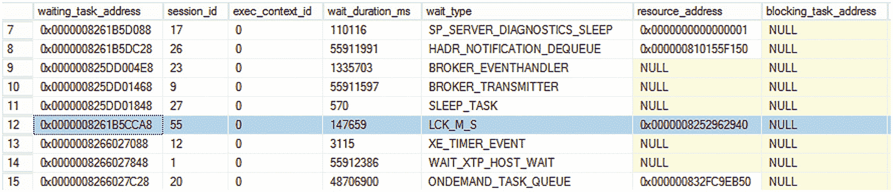

该表有 7 列，标题为等待任务地址、会话 ID、执行上下文 ID、等待持续时间（毫秒）、等待类型、资源地址和阻塞任务地址。

图 8-5

`sys.dm_os_waiting_tasks` 内的锁信息

通过使用 `sys.dm_os_waiting_tasks` DMV，我们看到会话 ID 55 当前正在等待一个名为 `LCK_M_S` 的资源。这代表一个共享锁资源类型。会话 ID 55 当前被会话 ID 53 阻塞，而会话 ID 53 恰好是与会话 ID 55 试图查询的对象上放置的排他锁和意向排他锁相同的会话。`sys.dm_os_waiting_tasks` DMV 也会返回一些信息，我们可以将其用作 `sys.dm_tran_locks` DMV 的输入。此信息将出现在 `sys.dm_os_waiting_tasks` DMV 的 `resource_description` 列中，如图 8-6 所示。

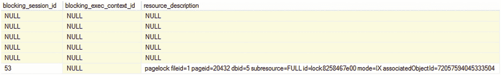

该表有三列，标题为阻塞会话 ID、阻塞执行上下文 ID 和资源描述，以及其对应的 6 行条目。

图 8-6

发生阻塞时 `sys.dm_os_waiting_tasks` DMV 的 `resource_description` 列

如果我们复制 `associatedObjectID` 并将其作为 `WHERE` 子句的输入用于查询 `sys.dm_tran_locks` DMV，我们将获得关于此任务为何以及正在等待什么资源的更多信息。以下查询将检索 `sys.dm_tran_locks` DMV 中所有 `resource_associated_entity_id` 为 `72057594045333504` 的行：

```
SELECT *
FROM sys.dm_tran_locks
WHERE resource_associated_entity_id = ' 72057594045333504';
```

在我的测试 SQL Server 上，该查询返回了 32 个锁，其中 26 个是聚簇索引内行上的排他锁；还有多个数据页上的意向排他锁，以及一个等待放置在页面上的共享锁。等待的共享锁正是由 `sys.dm_os_waiting_tasks` DMV 返回的那个。部分结果显示在图 8-7 中。

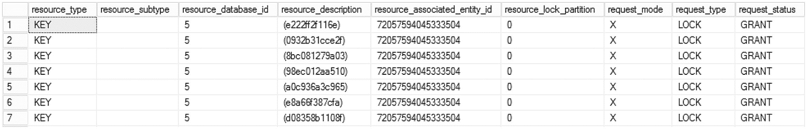

该表有 9 列，标题为资源类型、资源子类型、资源数据库 ID、资源描述、资源关联实体 ID、资源锁分区、请求模式、请求类型和请求状态。

图 8-7

来自 `sys.dm_tran_locks` 的锁信息

在锁和阻塞发生较多的系统上，通过查询 `sys.dm_tran_locks` DMV 来查找锁信息并弄清楚谁阻塞了谁可能是一个挑战，因为该 DMV 会为每个放置的锁返回一行。获取这些详细信息的一个简单方法是启用并使用阻塞进程报告（[`https://slrwnds.com/emsjqo`](https://slrwnds.com/emsjqo)）。为此，您必须首先在 SQL Server 的配置选项中启用 `blocked process threshold`（阻塞进程阈值）。您可以使用以下代码完成此操作：

```
sp_configure 'show advanced options', 1 ;
RECONFIGURE
GO
sp_configure 'blocked process threshold', 20 ;
RECONFIGURE
GO
```

阈值以秒为单位设置，最小可报告的阻塞会话时间为五秒。配置好实例后，您可以使用 SQL Trace 捕获详细信息；最简单的方法是使用 SQL Profiler。您可以在“错误和警告”事件中找到阻塞进程报告：

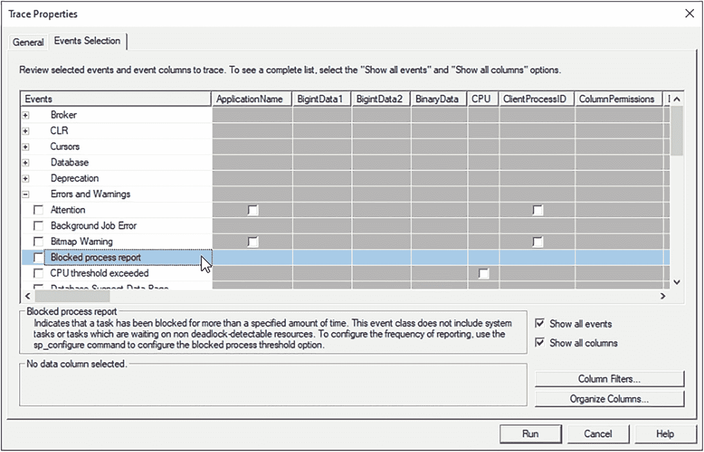

一个跟踪属性窗口的截图，其中事件选择下方有一个表格，表头为：应用程序名称、二进制数据、C P U、客户端进程 I D 和列权限。行标题有下拉框。错误和警告的下拉框已打开，其中阻塞进程报告被高亮显示。

图 8-8

阻塞进程报告

跟踪将以 XML 格式返回详细信息，包括被阻塞进程和阻塞进程的详细信息。

另一种发现阻塞的简单方法是查询 `sys.dm_os_waiting_tasks` DMV 并检查 `blocking_session_id` 列。

既然我们已经讨论了锁定和阻塞的许多方面，从锁模式和层次结构到分析锁和阻塞，我们应该准备好查看 SQL Server 内部与锁相关的等待类型了。请记住，这个关于锁定和阻塞的介绍远非该主题的完整指南，因为深入探讨 SQL Server 内部锁定和并发的工作原理本身就可以写成一本书。

### LCK_M_S

第一个与锁相关的等待类型是 `LCK_M_S` 等待类型。此等待类型表示一个任务正在等待在资源上放置共享锁。例如，如果该资源当前已有一个排他锁，则共享锁任务将等待。

#### 什么是 LCK_M_S 等待类型？

`LCK_M_S` 等待类型表明一个任务正在或曾经等待在资源上放置共享锁。如果一个任务正在等待放置锁，我们说该任务被另一个任务“阻塞”。更常用的术语是“阻塞”，阻塞是使用锁来确保 ACID 属性得以维护的数据库系统中自然发生的现象。这对于每个与锁相关的等待类型都适用，因为它们只会在发生阻塞情况时被记录。

由于 `LCK_M_S` 等待类型与共享锁相关，因此当读取操作必须等待，因为我们想要读取的资源上已存在一个不兼容的锁时，它就会发生。我们等待放置共享锁的时间被记录为 `LCK_M_S` 等待类型。

图 8-9 展示了一个导致 `LCK_M_S` 等待发生的常见情况。在此情况下，`T1` 在一个页面上放置了一个排他锁，表示数据修改。当 `T2` 想要从同一页读取数据时，它需要放置一个共享锁，但由于排他锁和共享锁不兼容，因此发生了 `LCK_M_S` 等待。

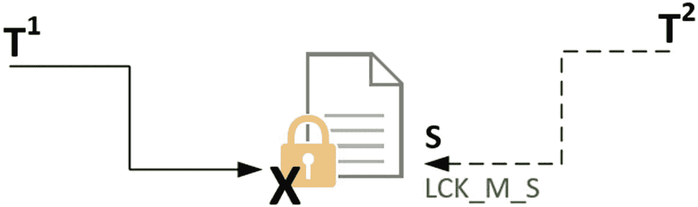

一张图示，描绘了页面如何被 `T1` 以 `X` 锁定，以及等待如何在 `T2` 处以 `LCK_M_S` 发生。

图 8-9

`LCK_M_S` 等待发生

#### LCK_M_S 示例

创建一个 `LCK_M_S` 等待发生的示例并不困难；我们将在数据修改查询和数据读取查询之间制造一个阻塞情况。

在这个示例中，我们将针对 `GalacticWorks` 数据库运行清单 8-1 中的查询。该查询将启动一个事务并修改几行数据，但不会提交或回滚该事务。由于我们通过提供 `BEGIN TRAN` 显式指定了此事务，SQL Server 将保持锁定，直到我们显式执行 `COMMIT` 或 `ROLLBACK` 命令。

```sql
BEGIN TRAN
UPDATE Sales.SalesOrderDetail
SET CarrierTrackingNumber = '4E0A-4F89-AD'
WHERE SalesOrderID = '43661';
```
清单 8-1
启动一个修改事务

当我们执行此查询时，很快会得到结果；在我的例子中，有 15 行被更新。但正如我之前所说，事务尚未完成（提交），因此它将保持打开状态，并在其修改的对象上保留锁。

到目前为止，我们并没有引起任何阻塞，因为这是测试用的 SQL Server，没有其他查询在运行。让我们改变这一点，创建一个阻塞情况。

为此，我们将在 SQL Server Management Studio (`SSMS`) 中打开第二个窗口，并执行清单 8-2 中的查询。这将对 `Sales.SalesOrderDetail` 表执行 `SELECT` 操作，这正是我们当前正在修改数据的同一张表。

```sql
SELECT *
FROM GalacticWorks.Sales.SalesOrderDetail;
```
清单 8-2
从正在执行修改操作的表中选择数据

一旦我们运行这个 `SELECT` 查询，就会注意到没有返回结果，并且查询将一直执行下去。这是一个典型的阻塞操作示例，其中一个事务正在修改我们想在另一个事务中读取的数据。

如果我们查询 `sys.dm_os_waiting_tasks` DMV，我们将看到 `LCK_M_S` 等待类型，如图 8-10 所示。

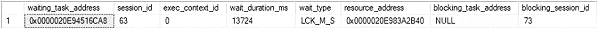
一个表格有 8 列，标题分别为等待任务地址、会话 i d、执行上下文 i d、等待持续时间毫秒、等待类型、资源地址、阻塞任务地址和阻塞会话 i d。其中有一行条目。
图 8-10
发生 LCK_M_S 等待

`LCK_M_S` 等待被解决的唯一方式是移除不兼容的锁。在这种情况下，我们将回滚在第一个 `SSMS` 窗口中启动的修改事务。我们通过在同一会话窗口中运行 `ROLLBACK` 命令来执行此操作。在执行事务回滚后，我们立即收到了 `SELECT` 查询请求的结果。查询 `sys.dm_os_waiting_tasks` 也显示 `LCK_M_S` 等待已被解决。

#### 降低 LCK_M_S 等待

看到 `LCK_M_S` 等待发生并不一定意味着出现了问题。但是，它确实表明发生了阻塞。如果您注意到 `LCK_M_S` 等待类型的等待时间很长，这意味着一个读取事务运行很长时间才能完成，因为它必须等待放置共享锁。因此，第一步是识别导致阻塞的查询。我们通过使用 `sys.dm_os_waiting_tasks` DMV 并查看 `blocking_session_id` 列来实现这一点。当只有一个活动阻塞时，这相对容易完成，但当许多并发查询被其他事务阻塞时，情况就变得复杂了。在复杂情况下，我们必须沿着阻塞链追溯，直到找到头部（也称为根或主导）阻塞者（即对象上的第一个锁）。

在隔离出导致阻塞的查询后，我们将分析该查询，看它是否是一个优化的候选对象。也许该查询请求了比它需要的更多的锁，因此需要很长时间才能完成。一种优化查询的方法是检查是否应添加任何索引，从而减少需要锁定的行数。或者，您可以将单个事务拆分为多个事务，每个事务访问更少的对象。导致锁比必要更多的另一个可能问题是过时的统计信息。统计信息用作查询计划的输入，如果它们不能准确反映表或索引的内容，可能会导致不良的查询计划，进而可能导致更多的锁。

另一种选择是更改读取事务的隔离级别，这样就不需要共享锁来读取数据。例如，将隔离级别设置为 `Read Uncommitted` 将不会放置共享锁，读取事务也不会被阻塞。这确实引入了另一个与隔离级别相关的问题，即脏读，我们在本章的“锁和阻塞介绍”一节中讨论过。除了使用 `Read Uncommitted`，您还可以使用 `快照隔离`，这将导致更少的共享锁，但不会引起脏读。快照隔离确实会给 `TempDB` 数据库带来更大的负载，因为如果许多并发事务正在修改该数据，它必须维护数据的版本。

#### LCK_M_S 总结

`LCK_M_S` 等待类型发生在资源上存在不兼容的锁，而另一个事务希望在同一资源上放置共享锁时。看到 `LCK_M_S` 等待类型意味着事务正在被阻塞。您应该尝试识别哪些查询导致了阻塞的发生，并查看是否可以对这些查询进行优化，以产生更少的锁或持续时间更短的锁。作为最后的手段，您可以选择更改读取事务的隔离级别，尽管这确实会带来其他副作用，例如脏读或增加 `TempDB` 内部的负载。

### LCK_M_U

`LCK_M_U` 等待类型与使用更新 (`U`) 模式的锁相关。当一个任务希望在资源上放置更新锁，但该资源上已经存在不兼容的锁时，就会发生 `LCK_M_U` 等待。

#### LCK_M_U 等待类型是什么？

更新锁类型是一种特殊的锁模式，表示即将发生数据修改。尽管其名称可能暗示它只与 UPDATE 查询相关，但在执行 INSERT 或 DELETE 语句时也会出现更新锁。

更新锁的主要存在目的是为了最大限度地减少死锁的发生。死锁是指两个需要修改同一资源的事务无限期地等待对方获取该资源的排他锁。要理解死锁情况如何发生，以及更新锁如何帮助防止死锁，让我们回顾一下在没有使用更新锁的情况下可能发生的情景。

当两个并发事务想要对同一资源执行修改时，两个事务会首先在它们要修改的数据所在的位置放置一个共享锁。由于共享锁与其他共享锁兼容，事务之间不会相互阻塞。当其中一个事务找到需要修改的数据时，它会将共享锁转换为排他锁，现在问题就来了。由于共享锁与排他锁不兼容，而且另一个事务也在该资源上持有共享锁，因此从共享锁到排他锁的转换无法发生。该事务需要等待另一个事务的共享锁被释放，然后才能将自己的共享锁转换为排他锁，但另一个事务也想将自己的共享锁转换为排他锁，因此两个事务最终都会互相等待，从而发生死锁。SQL Server 会自动检测死锁情况，并选择其中一个死锁事务作为牺牲品，回滚该事务，从而结束死锁情况。图 8-11 以图形方式展示了这种情况。

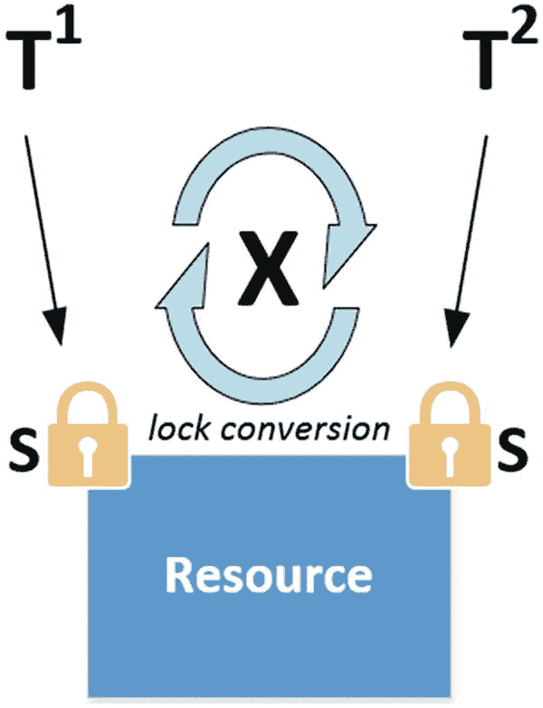

一个图表描绘了在锁转换期间，页面如何被 T<sup>1</sup> 和 T<sup>2</sup> 以共享键 X 锁定。

图 8-11：锁转换期间的死锁

当在 SQL Server 中使用更新锁时，死锁情况会大大减少。更新锁与共享锁兼容，但与排他锁或其他更新锁不兼容。在前面的情景中，第一个事务不会直接转换为排他锁，而是首先转换为更新锁。由于更新锁和共享锁兼容，因此即使另一个事务已经持有共享锁，转换为更新锁也不会有问题。然后，更新锁会转换为排他锁，以便可以进行数据修改。图 8-12 展示了这种锁行为。

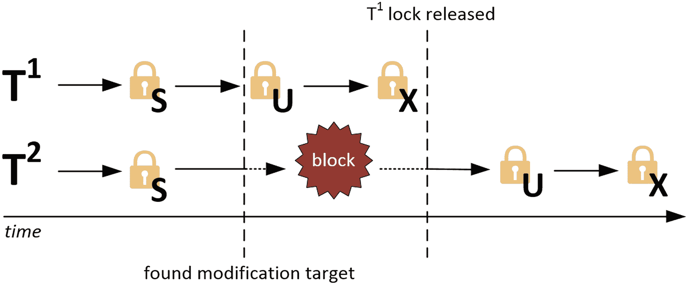

一个时间图描绘了当更新锁转换为排他锁时 T<sup>1</sup> 锁被释放，而 T<sup>2</sup> 在更新锁之前找到了数据修改。

图 8-12：并发数据修改期间的更新锁

当一个事务想要放置更新锁，但对象上已经存在不兼容的锁时（例如，一个排他锁），就会记录 `LCK_M_U` 等待类型。

#### LCK_M_U 示例

为了展示一个 `LCK_M_U` 等待发生的示例，我们将创建一个并发事务想要修改同一资源的情况。为此，我们将使用 `Ostress` 实用工具通过多个连接执行相同的查询。查询位于代码清单 8-3 中。这将对 `GalacticWorks` 数据库中的 `Person.Address` 表执行 UPDATE 操作。我将查询保存在一个名为 `LCK_M_U.sql` 的 `.sql` 文件中。

```sql
UPDATE Person.Address
SET City = 'Los Angeles'
WHERE StateProvinceID = 9;
```
代码清单 8-3：修改 Person.Address 表

保存文件后，我使用以下命令运行 `Ostress` 实用工具：

```cmd
"C:\Program Files\Microsoft Corporation\RMLUtils\ostress.exe" -S.\SQL2022 -E -dGalacticWorks -i"C:\TeamData\lck_m_u.sql" -n150 -r5 -q
```

这将创建 150 个并发连接，每个连接执行代码清单 8-3 中的查询 5 次。这应该足以造成一些阻塞。

当 `Ostress` 实用工具运行时，我查询 `sys.dm_os_waiting_tasks` DMV 以找出哪些任务正在等待。图 8-13 显示了结果的一小部分。

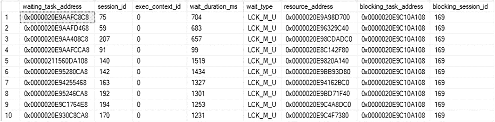

一个表格有 8 列，标题为等待任务地址、会话 ID、执行上下文 ID、等待持续时间（毫秒）、等待类型、资源地址、阻塞任务地址和阻塞会话 ID。它有 10 行条目。

图 8-13：正在发生的 LCK_M_U 等待

如图 8-13 所示，许多不同的会话正在等待获取更新锁，但被会话 ID 169 阻塞。如果我们查询 `sys.dm_tran_locks` DMV 以获取有关此会话的锁信息，可以看到它被授予了一个不兼容的意向排他锁，如图 8-14 所示。

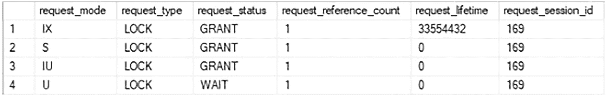

一个表格有 6 列，标题为请求模式、请求类型、请求状态、请求引用计数、请求生存期和请求会话 ID。它有 4 行条目。

图 8-14：持有意向排他锁的会话 ID 169

所有其他会话将不得不等待，直到会话 ID 161 的意向排他锁被移除。然后，其中一个会话将获取其正在请求的更新锁，将其转换为排他锁，并执行其修改。该循环将重复，直到所有会话都完成其修改。

#### 降低 LCK_M_U 等待

降低 `LCK_M_U` 等待的方法与降低 `LCK_M_S` 等待类型的方法相同：尝试识别导致阻塞发生的事务并优化其锁行为。

更改隔离级别对 `LCK_M_U` 等待时间影响很小，因为其他隔离级别主要影响执行读取的事务。这使得如果你需要降低 `LCK_M_U` 等待类型高于正常水平的等待时间，优化你的查询和/或索引是可行的方法。

#### LCK_M_U 总结

`LCK_M_U` 等待类型与使用更新锁模式的锁相关。更新锁用于防止在并发事务试图将其共享锁转换为排他锁时发生死锁。降低 `LCK_M_U` 等待时间主要通过优化可能造成阻塞的查询或索引来实现。

### LCK_M_X

另一种常见的与锁相关的等待类型是 `LCK_M_X` 等待类型。就像已经讨论过的两种与锁相关的等待类型一样，`LCK_M_X` 等待类型与特定的锁类型相关，在本例中是排他锁。而且就像其他与锁相关的等待类型一样，看到这种等待类型就意味着正在发生某种形式的阻塞。

#### LCK_M_X 等待类型是什么？

当任务等待在资源上放置排他锁时，就会发生 `LCK_M_X` 等待类型。由于排他锁几乎与所有其他锁模式都不兼容，包括其他排他锁，因此在存在大量并发修改时看到阻塞发生是很常见的。这意味着看到 `LCK_M_X` 等待是很常见的，尤其是在具有高并发事务量的系统中。


#### LCK_M_X 示例

为了演示`LCK_M_X`等待，我们将执行一条`SELECT`语句且不提交它。在执行`SELECT`之前，我们将把隔离级别设置为`Repeatable Read`。这样做可确保在事务仍在运行时，共享锁不会被移除。由于我们不提交事务，锁将保留在对象上，直到我们终止事务或执行`COMMIT`或`ROLLBACK`。清单 8-4 中的查询展示了我们将对`GalacticWorks`数据库执行的`SELECT`语句：

```sql
SET TRANSACTION ISOLATION LEVEL REPEATABLE READ
BEGIN TRANSACTION
SELECT *
FROM HumanResources.Employee;
-- COMMIT
```

清单 8-4
在`HumanResources.Employee`表上开始事务

注意，我们注释掉了`COMMIT`部分以确保锁保持在位。执行查询后很快返回了结果；仅仅 1 秒后，我就收到了`HumanResources.Employee`的所有行。如果我们查询`sys.dm_tran_locks`动态管理视图（DMV），应该能看到所有共享锁仍然在位，如图 8-15 所示。

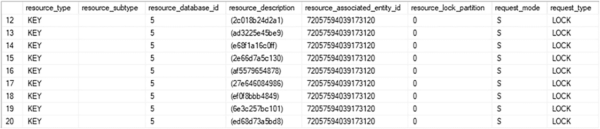

一个表格有 7 列，标题分别为资源类型、资源子类型、资源数据库 ID、资源描述、资源关联实体 ID、资源锁分区、请求模式和请求类型。它有 9 行条目。

图 8-15
共享锁仍然在位

当锁仍然在位时，我们在 SSMS 的一个新窗口中运行另一个查询。清单 8-5 中的查询将对同一个`HumanResources.Employee`表中的一行执行`UPDATE`操作：

```sql
UPDATE HumanResources.Employee
SET JobTitle = 'Tester'
WHERE BusinessEntityID = 5;
```

清单 8-5
更新`HumanResources.Employee`表

一旦我们执行上述查询，就会注意到发生了阻塞，因为查询持续运行且不返回任何结果。这是预期的，因为该行（更具体地说是索引键）上存在共享锁，阻止我们更新它。

当我们查看`sys.dm_os_waiting_tasks` DMV 时，如图 8-16 所示，会注意到第二个窗口中的查询正在等待放置排他锁，这由`LCK_M_X`等待类型指示。

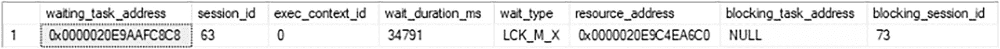

一个表格有 8 列，标题分别为等待任务地址、会话 ID、执行上下文 ID、等待持续时间（毫秒）、等待类型、资源地址、阻塞任务地址和阻塞会话 ID。它有一行条目。

图 8-16
发生`LCK_M_X`等待

如果我们结束`SELECT`查询（通过执行`COMMIT`语句或关闭 SSMS 中的窗口），共享锁将被移除，第二个查询将能够执行其`UPDATE`命令，从而结束`LCK_M_X`等待。

#### 降低 LCK_M_X 等待

要降低`LCK_M_X`等待时间，请使用与其他锁相关等待类型相同的方法。识别导致阻塞的查询，并查看是否可以优化它们以减少阻塞。

#### LCK_M_X 总结

`LCK_M_X`等待类型与排他锁被同一资源上已存在的其他锁阻塞有关。由于排他锁几乎与所有其他锁类型都不兼容，因此对于经历并发查询执行的 SQL Server 实例来说，看到`LCK_M_X`等待发生并不罕见。

### LCK_M_I[xx]

看到**`LCK_M_I[xx]`**等待类型意味着任务在放置意向锁时被阻塞。由于我们已经在本章前面讨论了对象上的各种锁模式，在讨论此等待类型时，我将用于意向锁的锁模式替换为`[xx]`。`[xx]`可以被多种不同的锁模式替换；例如，意向共享锁上的阻塞将表示为`LCK_M_IS`等待类型，而意向排他锁上的阻塞将显示为`LCK_M_IX`。

#### 什么是 LCK_M_I[xx] 等待类型？

`LCK_M_I[xx]`等待类型表示任务正在等待在资源上放置意向锁。正如我们从本章开头的“锁和阻塞介绍”部分所学，意向锁表示在锁层次结构中更低级别的对象上放置了相同类型的锁。这并不意味着意向锁仅仅是为了警告 SQL Server 在层次结构更下方存在锁。意向锁的行为就像任何其他锁一样，并且完全有可能一个意向锁阻塞另一个不兼容的意向锁。意向锁在与其他不兼容的意向锁方面确实具有更大的灵活性。例如，两个意向排他锁可以存在于同一页资源上，表示将修改不同的行。在一页资源上同时存在意向共享锁和意向排他锁也是可能的，因为这两种锁都可以读取和/或修改不同的行。

除了指示存在于锁层次结构更下方的锁类型之外，意向锁还有一些其他锁模式所没有的“特殊”模式。意向锁可以表示锁层次结构更下方级别的多种锁模式。以下列表描述了这三种意向锁模式：

*   **共享意向排他锁（SIX）** – 此锁模式表示在更低级别的所有对象上存在共享锁，而在其中一些对象上存在意向排他锁。这些锁由一个希望读取数据并同时计划修改其他数据的事务获取。当任务在尝试放置`SIX`锁时被阻塞，它将被`LCK_M_SIX`等待类型记录。
*   **共享意向更新锁（SIU）** – 此锁模式是共享锁和意向更新锁的组合。同样，单个事务有可能在同一时间在更下方级别获取并持有这两种锁模式。如果在尝试放置此锁时发生阻塞，则将使用`LCK_M_SIU`等待类型来记录等待时间。
*   **更新意向排他锁（UIX）** – 此锁模式是另外两种锁模式（更新锁和意向排他锁）的组合。此锁模式上的阻塞将由`LCK_M_UIX`等待类型表示。

在意向锁上看到高等待时间并不常见，因为意向锁在彼此不兼容性方面更灵活。通常在意向级别的阻塞少于锁层次结构更下方的级别。


#### LCK_M_I[xx] 示例

在本例中，我们将生成一个 `LCK_M_IX` 类型的等待。这意味着一个事务正在等待获取锁层次结构中更高级别的意向排他锁。

我们将使用与 `LCK_M_X` 等待类型类似的示例，通过使用 `REPEATABLE READ` 隔离级别运行 `SELECT` 语句且不完成事务来演示。接下来的查询是我将针对 GalacticWorks 数据库的 `Person.Address` 表运行的查询：

```
SET TRANSACTION ISOLATION LEVEL REPEATABLE READ
BEGIN TRAN
SELECT * FROM Person.Address;
--COMMIT
```

`COMMIT` 命令已被注释掉，以使事务保持打开状态。

如果我们查看图 8-17 所示的 `sys.dm_tran_locks` DMV，会发现在查询运行时，当前只有一个活动的锁，即在 `OBJECT` 资源类型上的共享锁。这表明整个表已被锁定。由于此锁存在于如此高的级别，因此无需在层次结构的更下层放置其他共享锁。

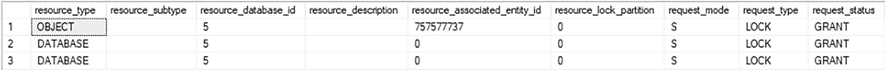

*（图表描述：一个表格有 9 列，标题分别为 `resource type`、`resource subtype`、`resource database i d`、`resource description`、`resource associated entity i d`、`resource lock partition`、`request mode`、`request type` 和 `request status`。表中有一行条目。)*
图 8-17
表上的共享锁

如果另一个事务想要更新同一表中的一行，它必须首先尝试在表级别和页面级别获取意向排他锁，然后才能在行级别获取排他锁。接下来的查询就是这样一个事务，在本例中，我们将尝试更新一行：

```
UPDATE Person.Address
SET AddressLine1 = '1227 Shoe St.'
WHERE AddressID = 5;
```

你会注意到，只要 `SELECT` 查询仍持有其表上的共享锁，前面的查询就会“挂起”。尽管意向锁在大多数情况下与同一对象上的其他意向锁兼容，但在本例中，表级别上存在共享锁而试图在层次结构的更下层执行数据修改，将导致阻塞发生。共享锁与意向排他锁不兼容。

如果我们查看 `sys.dm_os_waiting_tasks` DMV，将看到获取意向排他锁的任务正在等待，如图 8-18 所示。

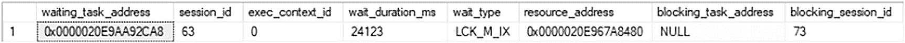

*（图表描述：一个表格有 8 列，标题分别为 `waiting task address`、`session i d`、`execution context i d`、`wait duration milliseconds`、`wait type`、`resource address`、`blocking task address` 和 `blocking session i d`。表中有一行条目。)*
图 8-18
发生的 `LCK_M_IX` 等待

#### 降低 `LCK_M_I[xx]` 等待

与前面讨论的其他与锁相关的等待类型一样，要降低 `LCK_M_I[xx]` 等待时间，重点应放在导致阻塞的查询上。因为 `LCK_M_I[xx]` 等待仅在锁层次结构更高级别的对象上持有不兼容的锁时发生，所以值得花时间调查为什么这些锁会被放置在如此高的级别。锁升级可能导致这种情况发生。当 SQL Server 在锁层次结构的更高级别放置单个锁比锁定下层多个对象更有效时，就会发生锁升级。例如，SQL Server 可以决定在表级别放置一个共享锁，而不是在行上放置数千个共享锁。这比维护数千个单独的锁所需的资源要少得多。事实上，这正是我在 `LCK_M_IX` 等待类型示例中向您展示的情况。我们用 `SELECT` 查询的 `Person.Address` 表包含超过 19,000 行。当我们对表运行 `SELECT *` 查询时，这意味着至少需要 19,000 个行锁。由于放置和持有如此多的锁会消耗大量资源，SQL Server 决定在表上放置一个共享锁，而不是在行上放置 19,000 个锁。

如果我们重写查询使其需要更少的锁，例如，只选择前 x 行而不是所有行，SQL Server 可能会选择再次锁定行，而不是锁定整个表。

#### `LCK_M_I[xx]` 总结

`LCK_M_I[xx]` 等待类型与意向锁相关，或者更确切地说，与另一个不兼容的锁阻止放置意向锁的情况相关。意向锁放置在更高级别的对象上，以指示在锁层次结构的更下层放置了锁。与之前讨论的仅代表一种锁类型的锁模式不同，意向锁可以代表锁层次结构更下层的不同锁模式。`LCK_M_I[xx]` 等待类型高发的一个常见原因是 SQL Server 将较低级别的锁升级到较高级别锁的情况。在这种情况下，意向锁将被阻塞并无法获取。

### `LCK_M_SCH_S` 和 `LCK_M_SCH_M`

本章最后两个与锁相关的等待类型是 `LCK_M_SCH_S` 和 `LCK_M_SCH_M` 等待类型。这两种等待类型都与放置在表上的锁（即所谓的架构锁）有关。本章前面我们没有过多关注架构锁，但由于它们发生时对等待时间有很大影响，我想在此说明。

#### 什么是 `LCK_M_SCH_S` 和 `LCK_M_SCH_M` 等待类型？

`LCK_M_SCH_S` 和 `LCK_M_SCH_M` 等待类型都与架构锁相关。架构锁放置在表对象级别，以在查询访问表时保护表免受修改，或在表被修改时阻止查询访问表。架构锁有两种不同的类型：架构稳定性锁 (`Sch-S`) 和架构修改锁 (`Sch-M`)。每种类型都有与之关联的不同等待类型。`LCK_M_SCH_S` 等待类型（表示读取表）在架构稳定性锁必须等待才能放置时记录，`LCK_M_SCH_M` 等待类型（表示表架构将被更改）在架构修改锁等待放置时记录。

两种架构锁都具有极高的兼容性。架构稳定性锁与除架构修改锁以外的所有其他锁类型兼容。另一方面，架构修改锁与所有其他锁类型（包括意向锁）都不兼容。

使用架构稳定性锁时，在查询当前正在读取或写入表时，无法以任何方式修改或更改表。因为架构稳定性锁与除架构修改锁以外的所有锁模式兼容，所以例如在表级别看到一个架构稳定性锁与一个意向排他锁（表示表内更下层正在发生数据修改）同时存在是完全正常的。

架构修改锁与架构稳定性锁相反，因为它们在表正在执行修改时阻止任何查询访问该表。


#### LCK_M_SCH_S 和 LCK_M_SCH_M 示例

对于第一个示例，我将向现有表中添加一个新列。正如本章前面的示例一样，我将通过不提供 `COMMIT` 或 `ROLLBACK` 命令来保持事务处于打开状态。以下查询向 `GalacticWorks` 数据库中的 `Person.Address` 表添加了一个额外的列，我将 `ROLLBACK` 命令注释掉了，以便锁保持原位：

```sql
BEGIN TRAN
ALTER TABLE Person.Address
ADD
Test VARCHAR(10);
--ROLLBACK
```

在 SSMS 的一个新窗口中，我将对 `Person.Address` 表执行一个 `SELECT` 查询，如下所示：

```sql
SELECT *
FROM Person.Address;
```

如果在两个查询都在运行时查看 `sys.dm_tran_locks` DMV，我们应该能观察到是否有任何阻塞发生。图 8-19 展示了针对 `sys.dm_tran_locks` DMV 执行 `SELECT *` 查询输出的一部分。

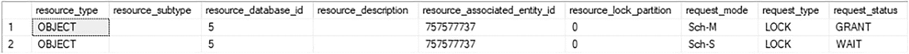

*图 8-19：Sch-M 和 Sch-S 锁*

从图 8-19 中可以看出，我们启动的第一个查询（旨在向 `Person.Address` 表添加列）导致了该表上的 Sch-M 锁。第二个 `SELECT` 查询正在等待获取同一表上的 Sch-S 锁。

如果我们查询 `sys.dm_os_waiting_tasks` DMV，会看到一个任务正在等待 `LCK_M_SCH_S` 等待类型。图 8-20 展示了在两个查询都在运行时 `sys.dm_os_waiting_tasks` 的输出。

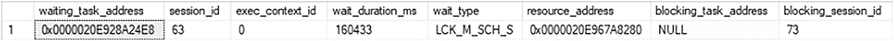

*图 8-20：发生 LCK_M_SCH_S 等待*

正如我们所料，`SELECT` 查询正在等待获取其架构稳定性锁。

如果我们反转这个示例：先启动一个读取事务并保持其打开，然后尝试修改同一个表，我们应该会遇到 `LCK_M_SCH_M` 等待，因为我们只能在目标修改表中没有活动事务时获取架构修改锁。

为了演示这种情况，我执行了以下查询。这启动了一个使用 `REPEATABLE READ` 隔离级别的 `SELECT` 查询，但我保持事务打开以便锁保持原位：

```sql
SET TRANSACTION ISOLATION LEVEL REPEATABLE READ
BEGIN TRANSACTION
SELECT * FROM
Person.Address;
-- COMMIT
```

在 SSMS 的一个新窗口中，我将执行之前用于演示 `LCK_M_SCH_S` 等待类型的表修改查询，但这次不保持事务打开：

```sql
ALTER TABLE Person.Address
ADD
Test VARCHAR(10);
```

正如执行第二个查询时您可能会注意到的，没有任何结果返回，并且查询持续运行，这明显表明发生了阻塞。

让我们再次查看 `sys.dm_tran_locks` DMV，看看能发现什么。图 8-21 展示了在我的测试 SQL Server 上的输出。

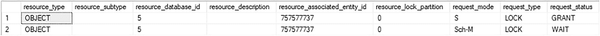

*图 8-21：Sch-M 锁等待被获取*

在这种情况下，该表上有一个来自 `SELECT` 查询的共享锁。因为我们正在从一个大表中选择信息，SQL Server 决定放置一个表锁，而不是在更低级别放置锁。由于架构修改锁与所有其他锁类型都不兼容，因此发生了阻塞，在能够执行表修改之前，我们将一直等待，直到共享锁消失。

查看 `sys.dm_os_waiting_tasks` DMV 向我们展示了预期的结果：一个 `LCK_M_SCH_M` 等待，如图 8-22 所示。

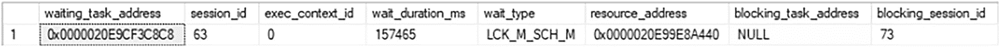

*图 8-22：发生 LCK_M_SCH_M 等待*

#### 降低 LCK_M_SCH_S 和 LCK_M_SCH_M 等待

当您看到 `LCK_M_SCH_S` 或 `LCK_M_SCH_M` 等待类型出现等待时，很可能是有一个事务正积极地想要修改表。如果在 `LCK_M_SCH_S` 等待类型上出现高等待时间，表修改事务已经在运行；而看到 `LCK_M_SCH_M` 等待时，修改操作正在等待所有活动事务移除它们在该表上的锁。

修改表并非在生产 SQL Server 实例上每天都会发生的事情（但愿如此）。修改大表尤其成问题，并且是导致高 `LCK_M_SCH_S` 等待时间的原因，而尝试查询被修改表的用户会注意到延迟。然而，如果您确实需要修改一个表，但同时有长时间运行的查询正在从该表中检索信息，那么您应该预期会出现 `LCK_M_SCH_M` 等待。

降低这两种等待类型的等待时间与对表执行修改操作直接相关。一个建议是在定义的维护窗口期间执行表修改，或者在尽可能少的并发事务访问该表时进行，而不是在针对该表有大量活动事务时执行修改。

#### LCK_M_SCH_S 和 LCK_M_SCH_M 总结

`LCK_M_SCH_S` 和 `LCK_M_SCH_M` 等待类型是由架构稳定性锁或架构修改锁被其他锁阻塞所导致的。看到这两种等待类型的高等待时间表明，要么表修改正在等待该表上所有活动锁被移除，要么表修改当前正在运行并且其他事务正被其阻塞。

## 9. Latch 相关等待类型

在第 8 章“锁相关等待类型”中，我们回顾了 SQL Server 内部的锁定和阻塞，以及指示正在发生阻塞的不同等待类型。Latches 看起来与我们之前讨论的锁非常相似；在某些情况下，它们似乎使用与第 8 章讨论的锁相同的模式。但请不要误解：*latches 与锁不同*，尽管它们似乎共享一些特性。锁用于保证事务一致性，而 latches 用于保证内存中对象的一致性。

Latches，就像锁定和阻塞一样，是 SQL Server 内部一个复杂的主题。Latches 甚至有自己的 latch 统计信息 DMV，记录了等待特定 latch 类型所花费的时间。

由于 latch 的复杂性及其在 SQL Server 内部的功能，我认为需要对其做一个介绍，以便更好地理解如何在本章后续部分对 latch 相关的等待类型进行故障排除。因此，我们将从介绍 latch 开始本章，就像我们在第 8 章“锁相关等待类型”中从介绍锁定开始一样。


### 锁存器简介

微软在联机丛书中将锁存器描述为“SQL Server 引擎用来保证内存中结构一致性的轻量级同步原语”。这个描述相当笼统，锁存器的内涵远比其初步描述所暗示的要丰富得多。

关于锁存器，首先要理解的是它与锁的区别，我们在本章引言中已经提及。乍一看，锁存器在行为和 SQL Server 内部的命名约定上确实与锁相似。就像锁一样，锁存器有各种“模式”，并且一些表示模式类型的缩写与某些锁模式是相同的。锁与锁存器的另一个共同点是，两者都在保持 SQL Server 对象一致性方面发挥作用，并且它们管理一致性的方式看似相同。虽然锁用于确保事务的一致性，在整个事务运行期间保护事务，但锁存器仅在必要时使用，其持续时间不与事务绑定。在一个事务期间，许多不同的锁存器会被获取和释放。图 9-1 直观地展示了这种行为。

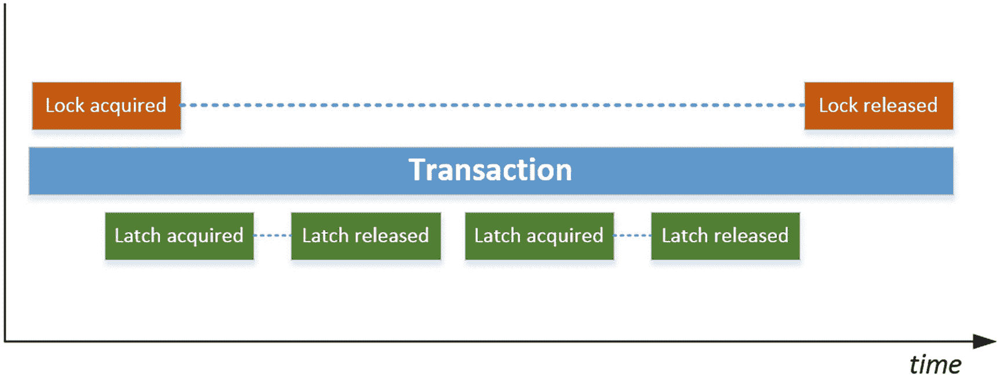

一个时间图描绘了事务期间锁存器和锁的获取与释放动作。

图 9-1: 事务期间的锁与锁存器行为

**技术要点**

一种理解锁存器的简便逻辑方式是：SQL Server 使用缓冲区锁存器来保护`已在缓冲池中`的页面，使用 IO 锁存器来保护`尚未加载到缓冲池中`的页面。这种区分将有助于理解不同的锁存器等待类型以及锁存发生在何处。

在 SQL Server 对象上放置和维护锁是一项开销较大的操作，因为锁需要在整个事务期间保持。由于锁存器是针对特定操作所需，并在操作后释放，因此它们的使用成本低于锁。这解释了微软对锁存器定义中“轻量级”这部分的含义。

关于锁存器定义的第二部分——“同步原语”，我们之前在本书中讨论过，只是名称不完全相同。如果你已通读本书，你应该已经注意到，特别是在第 6 章“与 IO 相关的等待类型”中，SQL Server 使用了多种方法来处理并发线程访问对象。在第 6 章中，我们讨论了互斥体，它确保一次只有一个线程可以访问内存对象。在同一章中，我们还讨论了实现门以限制对内存并发访问的信号量。锁存器是确保并发线程不威胁内存中对象一致性的另一种方法，其实现方式与锁非常相似。

#### 锁存器模式

锁存器有五种不同的模式用于访问对象。以下列表描述了这五种模式，其中一些可能看起来很熟悉：

*   **SH** – `SH`模式代表共享锁存器。当锁存器读取页面数据时使用此模式。
*   **UP** – `UP`锁存器模式由更新锁存器使用，每当需要修改资源时就会使用。通过使用更新锁存器，其他锁存器仍然可以读取该资源。
*   **EX** – `EX`锁存器模式，或称排他锁存器，也在发生资源修改时使用。与更新锁存器不同，排他锁存器不允许其他锁存器模式进行读或写访问。
*   **KP** – `KP`锁存器模式由保持锁存器使用。保持锁存器用于保护资源，使其不会被销毁锁存器销毁。它们与除销毁模式外的所有其他锁存器模式兼容。
*   **DT** – `DT`锁存器模式表示销毁锁存器。销毁锁存器用于从内存中移除内容；例如，当 SQL Server 想要释放内存中的数据页时。

如你所见，前三种模式与锁使用的模式非常相似，功能也大致相同。并且，就像锁模式一样，锁存器模式彼此之间是兼容或不兼容的。表 9-1 显示了锁存器兼容性矩阵，以及不同模式彼此是否兼容。

表 9-1: 锁存器兼容性矩阵

|   | SH | UP | EX | KP | DT |
| --- | --- | --- | --- | --- | --- |
| **SH** | 是 | 是 | 否 | 是 | 否 |
| **UP** | 是 | 否 | 否 | 是 | 否 |
| **EX** | 否 | 否 | 否 | 是 | 否 |
| **KP** | 是 | 是 | 是 | 是 | 否 |
| **DT** | 否 | 否 | 否 | 否 | 否 |

与部分由隔离级别和查询提示控制的锁不同，锁存器完全由 SQL Server 引擎控制。这意味着我们不能像修改锁那样修改锁存器行为。

#### 锁存器等待

每当锁存器因请求无法立即授予而必须等待时，就会发生锁存器等待。这些等待由 SQL Server 在`sys.dm_os_wait_stats` DMV 中跟踪和记录，同时也在一个专门的记录特定锁存器等待时间的 DMV `sys.dm_os_latch_waits`中记录，我们将在本章后面更详细地讨论。

图 9-2 展示了一个发生锁存器等待的情况。在此示例中，我们正在等待将数据页从存储子系统读取到缓冲区缓存中。使用锁存器是为了确保同一个存储子系统上的数据页不会被多个线程同时读入缓冲区缓存。当锁存器等待页面读入内存时，将记录`PAGEIOLATCH_SH`等待类型。

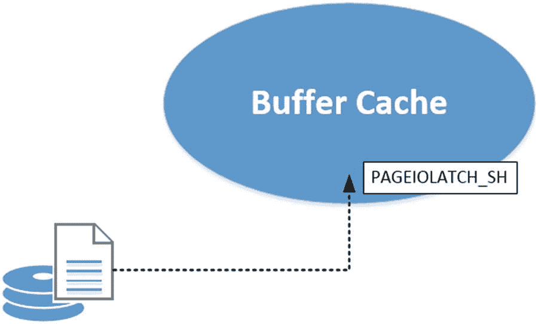

一个图表描绘了在缓冲区缓存中如何发生 PAGEIOLATCH subscript S H 等待。

图 9-2: `PAGEIOLATCH_SH`的发生

SQL Server 中定义了三种不同的锁存器等待类型，通过查询`sys.dm_os_wait_stats` DMV 可访问，它们在以下列表中描述：

*   **缓冲区锁存器** – 缓冲区锁存器用于保护缓冲区缓存内的数据页。它们不仅用于用户相关的数据页，也用于系统页，如跟踪数据页内可用空间的页可用空间（PFS）页。在`sys.dm_os_wait_stats` DMV 中，它们由`PAGELATCH_[xx]`等待类型表示，其中`[xx]`表示所使用的锁存器模式。
*   **非缓冲区锁存器** – 这些锁存器用于保护缓冲区缓存之外的数据结构。在`sys.dm_os_wait_stats` DMV 中，它们由`LATCH_[xx]`等待类型表示。
*   **IO 锁存器** – 当数据页从存储子系统读取到缓冲区缓存时，会使用 IO 锁存器。此类型由`PAGEIOLATCH_[xx]`等待类型表示。

图 9-3 显示了`sys.dm_os_wait_stats` DMV 记录的不同锁存器等待类型的数量。

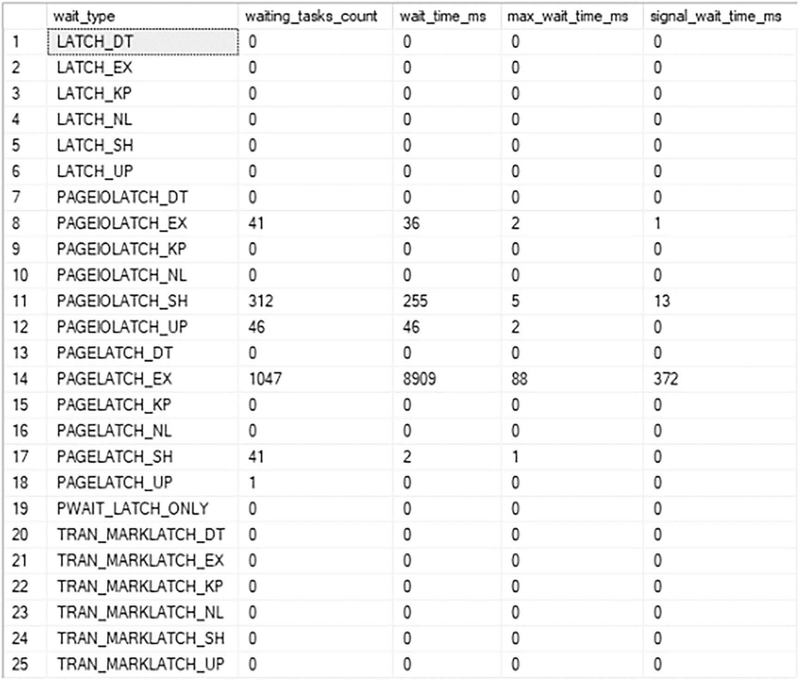

一个表格有 5 列，标题为等待类型、等待任务计数、等待时间毫秒、最大等待时间毫秒和信号等待时间毫秒，共 16 行。

图 9-3: `sys.dm_os_wait_stats`中的锁存器等待类型

当你在`sys.dm_os_wait_stats` DMV 中看到`LATCH_[xx]`等待类型时，你正在查看非缓冲区锁存器等待时间的摘要。SQL Server 内部有各种非缓冲区锁存器类，为了更便于详细分析这些非缓冲区锁存器类，新增了`sys.dm_os_latch_stats` DMV。


### 页闩锁争用

在讨论与闩锁相关的各种等待类型之前，我想先向您提供识别页闩锁争用所需的知识，因为这个问题可能出现在任何承受并发工作负载的 SQL Server 实例上，是有关闩锁时遇到的最常见问题之一。

导致页闩锁争用发生的场景多种多样，尽管我们对闩锁行为的影响有限（请记住，闩锁是由 SQL Server 引擎内部进程放置和持有的），但我们的数据库设计会影响闩锁行为。闩锁争用的一个常见原因是并发查询访问数据库内部的所谓“热点”。例如，一个存储少量行、需要被应用程序访问以获取配置信息的小表，就可能是一个潜在的热点。如果许多并发请求需要来自该表的数据，闩锁很可能会遇到其他不兼容的闩锁，导致发生闩锁等待并减慢应用程序的性能。我已多次看到不同客户遇到这个问题，这是一个真实存在的场景。我将基于其中一个案例，向您展示一个页闩锁争用的示例。

在这个案例中，客户运行一个应用程序，在特定时间会选取大量数据并将其放入临时表中。该应用程序使用了大量并发连接以加速这些临时表的创建。为了展示此示例的效果，我将使用 `Ostress` 来重现该场景，从一个表中选择行，然后将它们插入到一个临时表中。

作为 `Ostress` 实用程序的输入，我保存了一个名为 `latch_contention.sql` 的 `.sql` 文件，其中包含如清单 9-1 所示的查询。

```
SELECT TOP (20000) *
INTO #tmptable
FROM Sales.SalesOrderDetail;
清单 9-1
从 Sales.SalesOrderDetail 中选择行插入临时表
```

此查询从 `GalacticWorks` 数据库内的 `Sales.SalesOrderDetail` 表中选择前 20,000 行，并将它们插入到一个临时表 (`#tmptable`) 中。

下一步是使用 `Ostress`，并通过 300 个并发连接执行 `latch_contention.sql` 脚本。我使用的 `Ostress` 命令行如下所示：

```
"C:\Program Files\Microsoft Corporation\RMLUtils\ostress.exe" -S.\RC0 -E -dGalacticWorks -i"C:\TeamData\latch_contention.sql" -n300 -r1 -q
```

当 `Ostress` 实用程序运行时，让我们查看 `sys.dm_os_waiting_tasks` DMV，看看是否有任务正在等待。图 9-5 显示了执行以下查询时返回的部分结果：

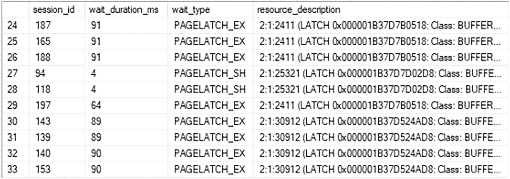

一个表格有四列，标题为会话 i d、等待持续时间毫秒、等待类型和资源描述，以及其对应的 10 行参数。

图 9-5

`PAGELATCH_[XX]` 等待

```
SELECT
session_id,
wait_duration_ms,
wait_type,
resource_description
FROM sys.dm_os_waiting_tasks
WHERE session_id > 50;
```

我们遇到了大量的 `PAGELATCH_[XX]` 等待，这表明一个闩锁正在等待更新内存中的一个页面。`resource_description` 列在这里很有用，因为它指示了闩锁想要访问的页面 ID。第一个数字代表数据库 ID，即 `tempdb` 数据库。第二个数字表示文件 ID（我的测试系统上的 `tempdb` 数据库由多个数据文件组成）。最后，最后一个数字表示页面 ID。

由于我们正在使用许多并发连接向临时表插入数据，我们需要在 `tempdb` 中找到或分配具有空闲空间的数据页面来容纳我们的行。所有这些空间使用情况都需要更新，并使用闩锁来确保一次只有一个线程能够访问。

这是 `tempdb` 数据库中页闩锁争用的一个经典示例，当许多并发查询在 `tempdb` 内创建对象时可能发生。解决这种特定闩锁争用情况的一种方法是添加更多（大小相等的）`tempdb` 数据文件。幸运的是，从 SQL Server 2016 开始，安装程序包含了在安装过程中创建多个 `tempdb` 文件的功能。

自 2016 年以来，`tempdb` 的其他改进包括：

*   将跟踪标志 `T1117` 和 `T1118` 添加为默认行为（2016）
*   乐观闩锁的改进（2017）
*   对 `PFS` 页面使用轮询机制（2017）
*   内存优化的 `tempdb` 元数据（2019）
*   并发 `PFS` 更新（2019）
*   系统页闩锁（`GAM`、`SGAM`）并发改进（2022）

既然我们已经讨论了什么是闩锁、它们如何工作，并查看了一个闩锁争用的示例，让我们继续探讨与闩锁相关的等待类型。

### PAGELATCH_[xx]

第一个要回顾的与闩锁相关的等待类型是 `PAGELATCH_[xx]` 等待类型，其中 `[xx]` 表示使用的闩锁模式（例如，`SH` 表示共享模式）。由于我们已经在本章引言中讨论了各种闩锁模式，因此本章不再重复描述。

#### 什么是 PAGELATCH_[xx] 等待类型？

`PAGELATCH_[xx]` 等待发生在闩锁必须等待才能访问内存中的页面时。这些等待的主要原因是页面上已存在其他闩锁，并且这些闩锁与我们请求的闩锁模式不兼容。与锁类似，闩锁将一直等待，直到页面上的不兼容闩锁被移除。只要不兼容的闩锁存在，我们的请求就会记录 `PAGELATCH_[xx]` 等待时间。图 9-6 显示了正在发生的 `PAGELATCH_UP` 等待的图形化表示。我使用齿轮图标表示页面上已经存在一个闩锁，以避免与 SQL Server 锁混淆。

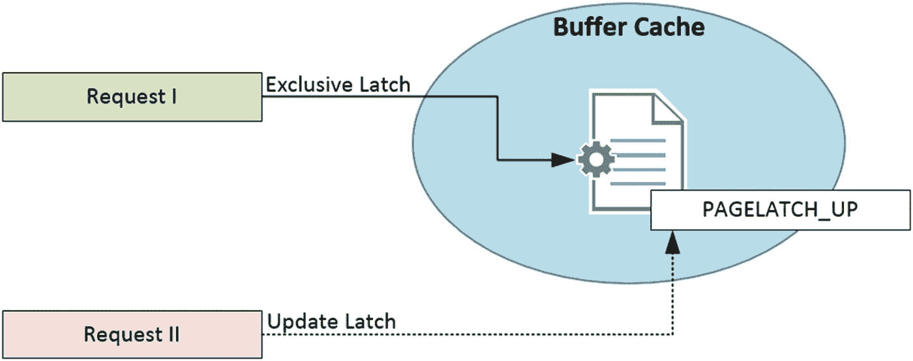

一个图表描绘了独占闩锁和更新页闩锁的请求如何在缓冲区缓存上等待。

图 9-6

`PAGELATCH_UP` 等待发生

很容易将 `PAGELATCH_[xx]` 等待与 `PAGEIOLATCH_[xx]` 等待混淆。尽管它们的名称相似，但它们是完全不同的闩锁等待类型。前者表示访问已在内存中的页面，而后者表示正在将页面从磁盘读入内存。我们将在本章后面详细讨论 `PAGEIOLATCH_[xx]` 等待类型。

#### sys.dm_os_latch_stats

`sys.dm_os_latch_stats` DMV 与 `sys.dm_os_wait_stats` DMV 非常相似。`sys.dm_os_latch_stats` DMV 显示了在闩锁类内发生等待的次数、总等待时间和最大等待时间。与 `sys.dm_os_wait_stats` DMV 相比，唯一缺少的列是 `signal_wait_time_ms`；之所以缺少，是因为闩锁不遵循与请求相同的执行过程（`RUNNING`、`SUSPENDED`、`RUNNABLE`）。

图 9-4 显示了 `sys.dm_os_latch_stats` DMV 的一部分。在 SQL Server 2022 中，有更多非缓冲区闩锁类，总计 179 个。

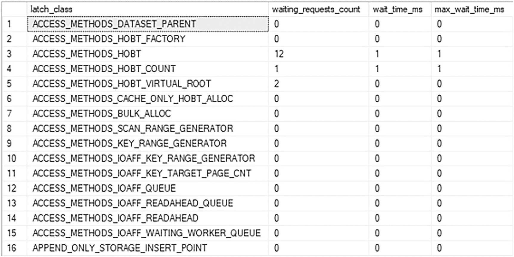

一个表格有四列，标题为闩锁类、等待请求计数、等待时间毫秒和最大等待时间毫秒，以及其对应的 16 行参数。

图 9-4

`sys.dm_os_latch_waits`

与 `sys.dm_os_wait_stats` DMV 一样，`sys.dm_os_latch_stats` DMV 是自 SQL Server 服务启动以来累积的。这意味着当您的 SQL Server 服务重新启动时，它会被重置为 0。我们也可以对 `sys.dm_os_latch_stats` DMV 使用 `DBCC SQLPERF` 命令，通过执行以下命令手动重置等待时间：

```
DBCC SQLPERF('sys.dm_os_latch_stats', CLEAR)
```


#### PAGELATCH_[xx] 示例

在本章的引言中，我们探讨了当许多并发查询从临时数据库加载数据时，`tempdb`数据库内部发生的页锁存争用。这不是 SQL Server 内部唯一的锁存争用形式。另一种形式是“末页插入争用”。正如前面讨论的页锁存争用场景一样，末页插入争用是通过观察到大量的`PAGELATCH`等待来识别的。让我们通过一个末页插入争用的例子来说明。

很可能，也许在参加数据库设计课程时，你被告知每个表都应该有一个聚集索引。你也被告知聚集索引键的最佳候选者是一个窄的、唯一的、不断增长的值，也许是一个整数。虽然这些设计选项对许多场景很有用，但在某些情况下，这种设计会导致一个称为末页插入争用的性能问题。

末页插入争用将发生在对行相对较小的表进行大量插入工作负载的数据库上；例如，一个包含`ID`列（整数数据类型，自动增长）和`Name`列（`Varchar`数据类型）的表。从最佳实践的角度来看，我们会在`ID`列上创建聚集索引，因为它完美地符合良好索引键的描述。它是窄的，对每一行都是唯一的，并且总是在增长。但由于自动增长的持续特性，每一个新添加的行都将被添加到聚集索引的末尾，从而为聚集索引的最后一个数据页创建了一个热点。

> **极客笔记**
>
> 从 SQL Server 2019 开始，`CREATE INDEX`语句添加了一个新选项`OPTIMIZE_FOR_SEQUENTIAL_KEY`，它可以缓解（但不能消除）这里讨论的末页插入场景。你可以在 [`https://slrwnds.com/hn4nih`](https://slrwnds.com/hn4nih) 阅读更多关于此选项的信息。

图 9-7 展示了行插入聚集索引内部数据页的行为，以一种所谓的 B 树结构形式，这是 SQL Server 用于排序索引的数据结构。

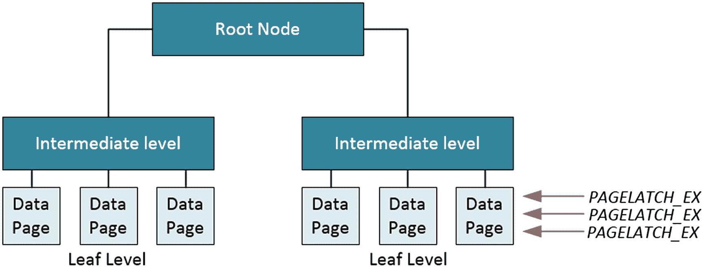
图 9-7：聚集索引末页上的末页插入争用

即使当前数据页已满，并添加了一个新的数据页，插入的目标将更改为新页面，将热点切换到新的数据页。

锁本身并不会阻止这种争用的发生。默认情况下，SQL Server 将使用独占行级锁来插入数据，而不是发出页级锁。你会记得，一个页面上可以存在多个独占行级锁。

然而，对内存中页面的访问仍然需要串行发生，因此使用锁存器来确保在任何时间只有一个线程可以访问该页面。图 9-8 展示了存在锁存器时聚集索引叶级数据页的放大视图。

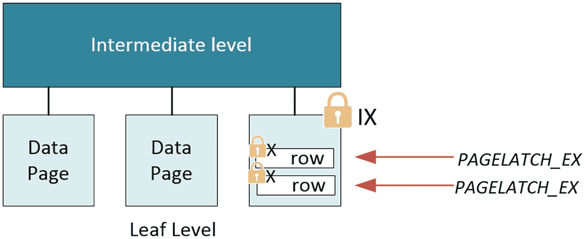
图 9-8：存在锁存器的聚集索引叶页

为了展示末页插入争用的例子，让我们使用下面的查询在`GalacticWorks`数据库中创建一个新表：

```
CREATE TABLE Insert_Test
(ID INT IDENTITY (1,1) PRIMARY KEY,
RandomData VARCHAR(50));
```

如你所见，这是一个小表，包含一个`ID`列（对插入的每一新行自动增长）和一个`RandomData`列来保存一些数据。我指定`ID`列是该表的主键，这将自动使用`ID`列作为索引键创建聚集索引。

下一步是运行`Ostress`，使用一个高度并发的工作负载将新行插入到`Insert_Test`表中。这次我没有为`Ostress`创建`.sql`输入文件，而是在`Ostress`命令行中输入以下查询：

```
INSERT INTO Insert_Test
(RandomData)
VALUES
(CONVERT(varchar(50), NEWID()))
```

现在我们创建以下`Ostress`命令行，以连接到`GalacticWorks`数据库，并使用 500 个并发连接执行我们提供的查询，每个连接执行该查询 100 次。这应该能创建足够的并发插入来演示末页插入争用：

```
"C:\Program Files\Microsoft Corporation\RMLUtils\ostress.exe" -S.\RC0 -E -dGalacticWorks -Q"INSERT INTO Insert_Test (RandomData) VALUES (CONVERT(varchar(50), NEWID()))" -n500 -r100 -q
```

当`Ostress`运行时，我查询`sys.dm_os_waiting_tasks` DMV：

```
SELECT
session_id,
wait_duration_ms,
wait_type,
resource_description
FROM sys.dm_os_waiting_tasks;
```

此查询过滤掉了一些列，以便结果的屏幕截图能放在页面上。图 9-9 显示了部分结果。

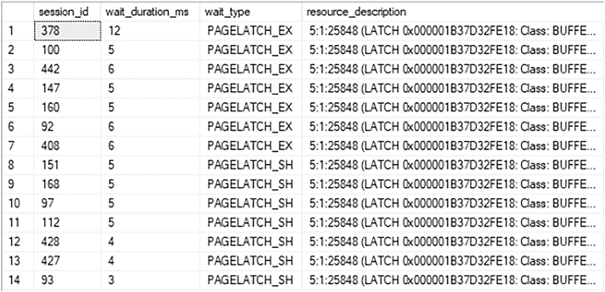
图 9-9：同一页上的`PAGELATCH_EX`等待

正如预期的那样，插入工作负载导致聚集索引内部的一个页面上出现了热点，在这个例子中是页面 ID 为`25848`的页面。图 9-9 中显示的所有任务（还有大约 200 个未显示）都在等待放置一个页锁存器（由`PAGELATCH_[XX]`等待类型指示），以便它们可以执行插入操作。

接下来，让我们使用未公开的`DBCC IND`命令来了解更多关于页面`25848`的信息。`DBCC IND`将为我们提供作为参数提供给`DBCC IND`的表相关联的每个页面返回一行，并且，除其他信息外，还将显示每个返回页面的页面类型。下表显示了`DBCC IND`返回的页面类型：

**表 9-2：`DBCC IND`返回的页面类型**

| 页面类型 | 页面 |
| --- | --- |
| 1 | 数据页 |
| 2 | 索引页 |
| 3,4 | 文本页 |
| 8 | GAM 页 |
| 9 | SGAM 页 |
| 10 | IAM 页 |
| 11 | PFS 页 |

运行以下命令将对`GalacticWorks`数据库的`Insert_Test`表执行`DBCC IND`。在运行实际的`DBCC IND`命令之前，我们启用跟踪标志`3604`，以便`DBCC IND`命令的结果在 SQL Server Management Studio (`SSMS`) 的结果选项卡中返回：

```
DBCC TRACEON (3604);
DBCC IND (GalacticWorks, Insert_Test, 1);
```

图 9-10 显示了`DBCC IND`命令的结果。突出显示的是页面`25848`，即在`Ostress`工作负载期间的插入热点页。

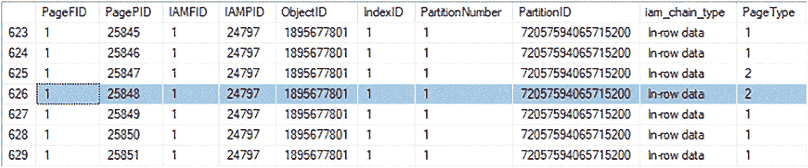
图 9-10：`DBCC IND`结果

我们感兴趣的信息位于`IndexID`和`PageType`列中。`IndexID`列返回此页面关联的索引 ID。我们在`Insert_Test`表上只有一个索引，其 ID 为`1`。`PageType`列返回特定页面的页面类型。在这个例子中，页面`25848`的`PageType`是`2`，这表明该页面是一个索引页。

请记住，`DBCC IND`是一个未公开的 SQL Server 命令，我在此包含它是为了向你展示有关发生末页插入争用的页面的信息。我强烈建议不要在生产服务器上使用它。


#### 降低 PAGELATCH_[xx] 等待

到目前为止，我们已经见过两个出现 `PAGELATCH_[xx]` 等待的例子：`tempdb` 数据库中的页闩锁争用和最后一页插入争用。还有另一种闩锁争用问题也会通过出现 `PAGELATCH_[xx]` 等待来识别，但它同时也与 `LATCH_[xx]` 等待类型有关联。因此，我将关于这种特定闩锁争用案例的解释和示例留到本章下一节，届时我们会讨论 `LATCH_[xx]` 等待类型。

降低 `PAGELATCH_[xx]` 等待具有挑战性。通常，它们与您的数据库设计和工作负载有关，而在生产环境中这些往往难以更改。然而，有许多因素会导致闩锁争用，值得花时间检查一下。

在拥有大量逻辑处理器（16 个以上）和高并发 OLTP 工作负载的系统上，常见到闩锁争用的发生。但是，逻辑处理器较少并不意味着不会发生闩锁争用。到目前为止展示的闩锁争用示例，都是在一个拥有四个逻辑处理器的虚拟机上生成的。拥有更多逻辑处理器意味着有更多线程可用于执行工作，这会导致放置更多并发闩锁，从而增加闩锁争用的机会。在遇到闩锁争用时增加逻辑处理器，在这种特定情况下，可能会导致更多的闩锁争用，而不是解决问题。减少逻辑处理器数量也不是一个可行的选项，因为这会减慢您所有其他工作负载的速度。

解决闩锁争用的最佳方法是识别争用发生的位置以及您正在处理的是哪种类型的争用。

如果您正在处理 PFS 页争用，一个好的第一步是检查您使用的是一个还是多个数据库数据文件。如果您使用一个数据库数据文件，第一步将是添加额外的、大小相同的数据文件，并测量这是否降低了发生的 `PAGELATCH_[xx]` 等待的数量。如果您已经有多个数据库数据文件，您可以尝试添加更多，但要小心不要添加太多，因为这可能引入其他性能问题。您的目标应该是找到一个数据库数据文件的“最佳点”，在这个点上，您有足够多的数据库数据文件来最小化闩锁争用的影响，但又不至于多到导致开销过高。这完全取决于您的工作负载，因此无法给出通用的建议。

在处理最后一页插入争用时，您可以考虑将索引键更改为其他内容，而不是像 `GUID` 这样顺序递增的值。使用 `GUID` 作为索引键会导致索引更大，因为 `GUID` 需要更多字节。此外，由于 `GUID` 是完全随机的，保持索引有序需要比处理一个不断递增的序列值更多的工作。如果您的应用程序或查询需要重写以适应数据类型的更改，这也可能产生影响。

其他需要考虑的因素包括索引策略、页满度以及数据库的并发连接数。此外，识别和优化对数据库内部数据的访问模式也会大有帮助。例如，如果您知道您的工作负载包含对单个表的许多非常小的插入操作，那么可能值得花时间将其中一些小插入操作合并成一个较大的批次，从而有效地减少所需的闩锁数量。

解决闩锁争用的另一个选项是一种称为哈希分区的方法。哈希分区根据计算列生成的值，将表或索引拆分成多个分区。分区是一种可以最小化或完全防止闩锁争用的方法。

哈希分区通过将表或索引切割成多个分区来工作，每个分区保存一部分数据。分区通常用于将数据从表内归档到驻留在其他（更便宜的）存储上的其他文件组，而当前数据则驻留在快速存储上。在哈希分区的情况下，我们使用计算列为表中的每一行计算一个值。根据该值，我们将行移动到某个分区。

使用这种索引分区方法的巨大优势在于，每个分区都有自己的索引树。因此，即使插入语句仍然会发生在索引的最后（最右）一页上，它也会分布在各个分区上。如果我们看图 9-11，我们看到一个最后一页插入争用的情况，并发查询正试图将行插入到索引中，正如我们在前面的例子中讨论的那样。

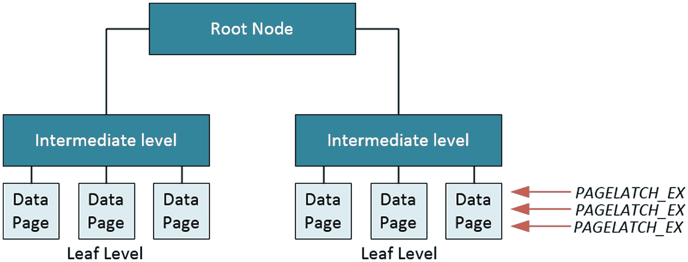

如果我们使用分区将索引切割成多个部分（此例中是三个部分），我们会得到图 9-12 所示的情况，即多个 B 树，每个树跨越一部分数据。

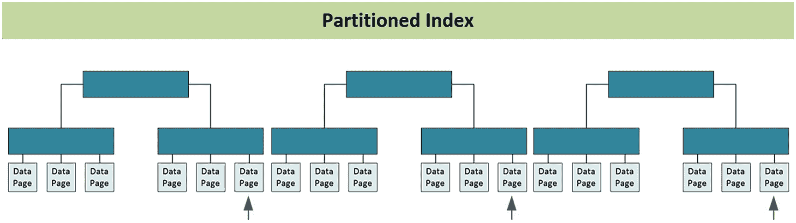

让我们看看，当我们运行工作负载来生成最后一页插入争用时，就像本章前面示例中所做的那样，哈希分区的效果如何。

我们要做的第一件事是创建一个分区函数。这将根据某一列的值，将表或索引内的行映射到分区。以下脚本将创建一个名为 `LatchPartFunc` 的分区函数，它将基于一列（我们稍后会创建）的值将行分成九个分区。参见下面的代码：

```sql
CREATE PARTITION FUNCTION [LatchPartFunc] (INT)
AS RANGE LEFT FOR VALUES
(0,1,2,3,4,5,6,7,8);
```

下一步是创建一个分区方案，将分区映射到文件组：

```sql
CREATE PARTITION SCHEME [LatchPartSchema]
AS PARTITION [LatchPartFunc] ALL TO ([PRIMARY]);
```

在这个例子中，我使用了 `PRIMARY` 文件组，但您可以自由创建额外的文件组来存放分区。

接下来是使用下面的查询创建一个名为 `Insert_Test3` 的新表。注意 `ID_Hash` 列。这是一个计算列，它将基于 `ID` 列的值计算一个介于 0 到 8 之间的值：

```sql
CREATE TABLE Insert_Test3
(ID INT IDENTITY(1,1),
RandomData VARCHAR(50),
ID_Hash AS (CONVERT(INT, abs(binary_checksum(ID) % (9)), (0))) PERSISTED);
```

最后一步是创建一个聚集索引并将其映射到分区方案：

```sql
CREATE UNIQUE CLUSTERED INDEX idx_ID
ON Insert_Test3
(ID ASC, ID_Hash)
ON LatchPartSchema(ID_Hash);
```

现在我们的分区表已经就绪，让我们重复之前示例中导致最后一页插入争用的 `Ostress` 工作负载。我将插入操作的目标表改为我们新的、分区的 `Insert_Test3` 表。

```shell
"C:\Program Files\Microsoft Corporation\RMLUtils\ostress.exe" -S.\RC0 -E -dGalacticWorks -Q"INSERT INTO Insert_Test3 (RandomData) VALUES (CONVERT(varchar(50), NEWID()))" -n500 -r100 -q
```

在两次 `Ostress` 工作负载运行期间，我使用 `Perfmon` 来监控每秒发生的闩锁等待次数。图 9-13 显示了第一次针对非分区索引的 `Ostress` 工作负载和第二次针对我们刚创建的分区索引的 `Ostress` 工作负载的 `Perfmon` 图表。

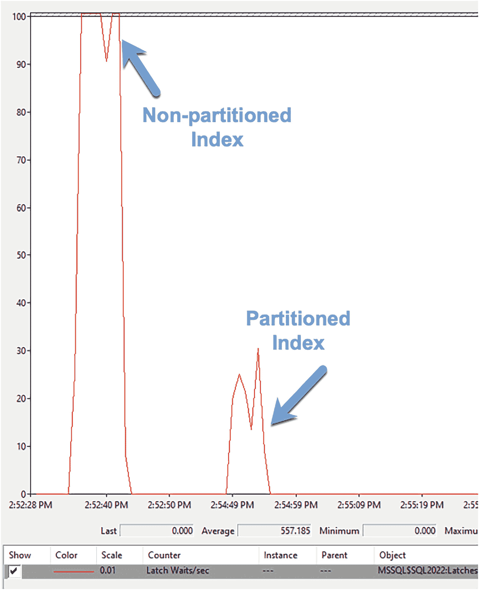


一张模拟图绘制了锁存器随时间变化的曲线。它绘制了两条波动曲线，分别为**非分区索引**和**分区索引**提供数据。非分区索引的值高于分区索引。

图 9-13

非分区索引与分区索引的每秒锁存器等待次数对比

如你所见，配置哈希分区后，发生的锁存器等待次数急剧下降！我们可以通过运行以下查询来查看行在所创建的不同分区之间的分布情况：

```sql
SELECT *
FROM sys.partitions
WHERE object_id = OBJECT_ID('Insert_Test3');
```

图 9-14 显示了我的测试 SQL Server 实例上此查询的结果。

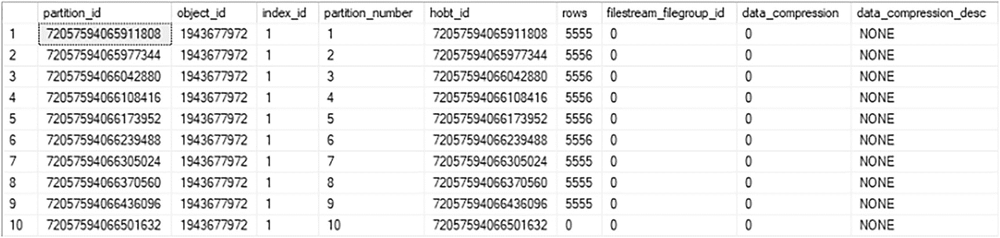

一张表格有 9 列，标题为分区 i d、对象 i d、索引 i d、分区号、主机 i d、行数、文件流文件组 i d、数据压缩和数据压缩描述。它有 10 行记录。

图 9-14

跨分区的行分布

在图 9-14 中，我们看到在 `Insert_Test3` 表上创建的九个分区，由 `partition_number` 列编号为 1 到 9。`rows` 列显示每个分区内的行数，如你所见，它们非常均匀地分布在九个分区中！`hobt_id` 返回存储此分区行的 B 树的 ID；所有分区具有不同的 ID，意味着它们各自拥有独立的 B 树结构。

尽管分区是解决锁存器争用问题的好方法，但它确实有其独特的挑战和缺点。其中一个缺点是分区可能会影响查询执行计划的生成，导致产生次优计划。在生产环境中实施前，你需要进行彻底的测试。

最后值得一提的一个选项是，如果您的业务负载和设计允许，可以使用内存中 OLTP 作为可能的补救措施。

#### PAGELATCH_[xx] 总结

`PAGELATCH_[xx]` 等待类型指示缓冲区锁存器，这些锁存器用于保护内存中的页，并遇到了其他不兼容的缓冲区锁存器。就像锁一样，锁存器在保护页时使用不同的模式，并非所有模式都相互兼容。看到大量的 `PAGELATCH_[xx]` 等待发生可能表明存在锁存器争用情况。解决锁存器争用可能具有挑战性，通常需要更改数据库设计或查询。

### LATCH_[xx]

另一种与锁存器相关的等待类型是 `LATCH_[xx]` 等待类型。正如前一节讨论的 `PAGELATCH_[xx]` 等待类型一样，`LATCH_[xx]` 等待与特定的锁存器类别相关。`PAGELATCH_[xx]` 等待类型与保护缓冲区缓存内部数据结构的锁存器有关，而 `LATCH_[xx]` 等待类型则与保护缓冲区缓存外部（但仍位于 SQL Server 内存中）数据结构的锁存器有关。

#### 什么是 LATCH_[xx] 等待类型？

当您看到 `LATCH_[xx]` 等待类型发生时，表明某一特定类别的非缓冲区锁存器正在等待。`LATCH_[xx]` 是不同非缓冲区锁存器类别等待时间的汇总，其本身并非一种锁存器类型。所有导致 `LATCH_[xx]` 等待类型所显示等待时间的不同非缓冲区锁存器类别都记录在它们自己的 DMV `sys.dm_os_latch_stats` 中。`LATCH_[xx]` 等待类型所代表的锁存器类别有很多种，在 SQL Server 2022 中总计有 179 种。图 9-15 显示了可能发生 `LATCH_[xx]` 等待的内存区域。

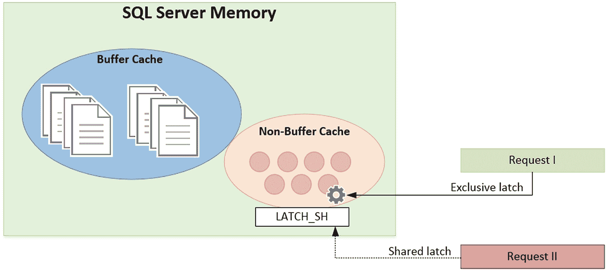

一张示意图描绘了排他锁存器和共享锁存器如何在 SQL Server 内存中的非缓冲区缓存（以及缓冲区缓存旁边）中等待。

图 9-15

LATCH_SH 等待

由于 `LATCH_[xx]` 等待类型是在特定锁存器类别上发生的等待的累积视图，您需要查看 `sys.dm_os_latch_stats` DMV 内部以找出 `LATCH_[xx]` 等待的确切原因。我们在本章开头的“锁存器简介”部分描述了 `sys.dm_os_latch_stats` DMV 的内部工作原理和列。


#### LATCH_[xx] 示例

存在一种锁存竞争情况会导致 `LATCH_[xx]` 等待。该问题发生在具有浅层 B-树结构的小型表上（我们将在本节稍后详细解释 B-树结构），并伴随大量并发插入操作。此类表的典型用例可能是作为队列使用的消息表，在消息发送后会被截断。代码清单 9-2 中的脚本将创建一个名为 `Insert_Test2` 的测试表，以及该表上的一个非聚集索引。

```sql
-- 创建表
CREATE TABLE Insert_Test2
(ID UNIQUEIDENTIFIER,
RandomData VARCHAR(50));
-- 在 ID 列上创建非聚集索引
CREATE NONCLUSTERED INDEX idx_ID
ON Insert_Test2 (ID);
```
*代码清单 9-2*
*包含非聚集索引的竞争测试表*

`ID` 列的数据类型为 `UNIQUEIDENTIFIER`，以确保生成随机、非连续的值。通过在此列上创建非聚集索引，插入操作将随机分布在与非聚集索引关联的 B-树中。

表创建完成后，我们启动 `Ostress`，其工作负载由向该表插入单行数据的查询组成。我们使用 500 个并发连接运行此工作负载，每个连接执行查询 5000 次。接下来的命令展示了使用的 `Ostress` 命令：

```bash
"C:\Program Files\Microsoft Corporation\RMLUtils\ostress.exe" -S.\RC0 -E -dGalacticWorks -Q"INSERT INTO Insert_Test2 (ID, RandomData) VALUES (NEWID(), CONVERT(varchar(50), NEWID()))" -n500 -r5000 -q
```

在工作负载运行期间，我们使用以下查询查询 `sys.dm_os_waiting_tasks` DMV，以便 `resource_description` 列能够适应截图：

```sql
SELECT
session_id,
wait_duration_ms,
wait_type,
resource_description
FROM sys.dm_os_waiting_tasks;
```

图 9-16 显示了我的测试 SQL Server 实例上此查询的部分结果。

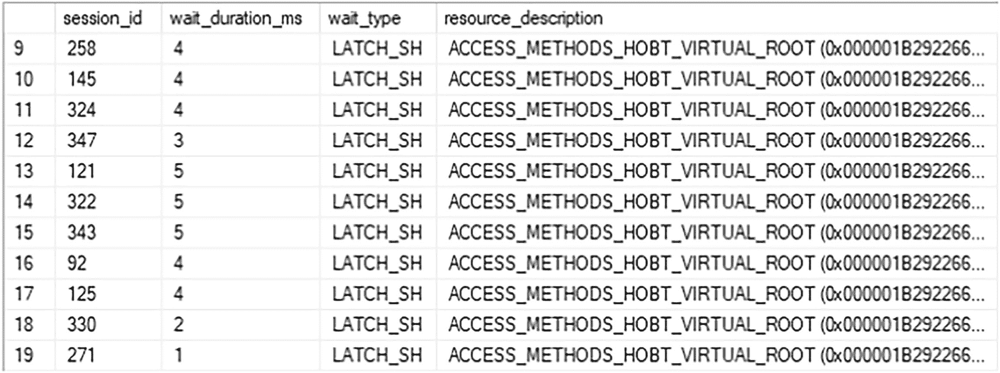

*图 9-16*

*LATCH_SH 等待*

`sys.dm_os_waiting_tasks` DMV 的 `resource_description` 列有助于识别与 `LATCH_[xx]` 等待关联的锁存类。在本例中，我们遇到的是 `ACCESS_METHODS_HOBT_VIRTUAL_ROOT` 锁存类。

接下来，我们可以查询 `sys.dm_os_latch_stats` DMV，以找出此特定锁存类的等待次数和总等待时间，使用以下查询：

```sql
SELECT *
FROM sys.dm_os_latch_stats
WHERE latch_class = 'ACCESS_METHODS_HOBT_VIRTUAL_ROOT';
```

图 9-17 显示了在我的测试 SQL Server 实例上此查询的结果。

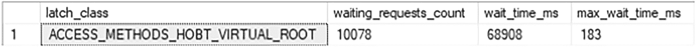

*图 9-17*

*ACCESS_METHOD_HOBT_VIRTUAL_ROOT 锁存等待*

识别出导致 `LATCH_SH` 等待的锁存类后，我们开始对其进行故障排除。根据联机丛书，`ACCESS_METHODS_HOBT_VIRTUAL_ROOT` 锁存类用于“同步访问内部 B-树的根页抽象”。尽管描述相当有限，但它为故障排除此特定问题提供了从何处开始查找的思路。本书附录 III 中包含了联机丛书描述的不同锁存类列表，并在可能的情况下提供了额外信息。

显然，与索引关联的 B-树结构发生了某些情况。由于我们在创建的表上只有一个非聚集索引 (`idx_ID`)，我们假设该索引的 B-树发生了某些情况。让我们通过查看图 9-18 来回顾一下 B-树索引结构的样子。

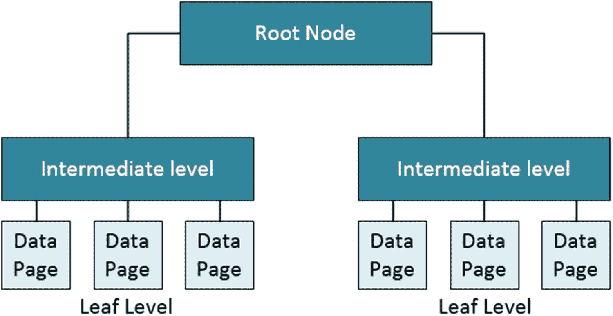

*图 9-18*

*B-树索引结构*

图 9-18 中的 B-树结构是浅的，因为它只有三层。第一层是根节点（第 0 层），第二层是中间层（第 1 层），最后在 B-树底部是保存索引键的数据页（或者对于聚集索引，是整行数据）。在图 9-18 中，我们有一层中间节点，但根据索引内的数据页数量，可能存在更多中间层。当表非常小时，数据页可能直接位于中间层，而不是 B-树中更靠下的层级。

每当 SQL Server 需要遍历 B-树时，它都会从根节点内的根页开始。根页将帮助导航到中间层中保存其所需信息的索引页。如果该页不在中间层，而是在叶层，则中间页会将请求进一步向下发送到 B-树。叶层是索引中的最后一级；它不能再向下导航。图 9-19 显示了 SQL Server 如何遍历 B-树。本例中，我使用数字作为索引键以便更容易理解。

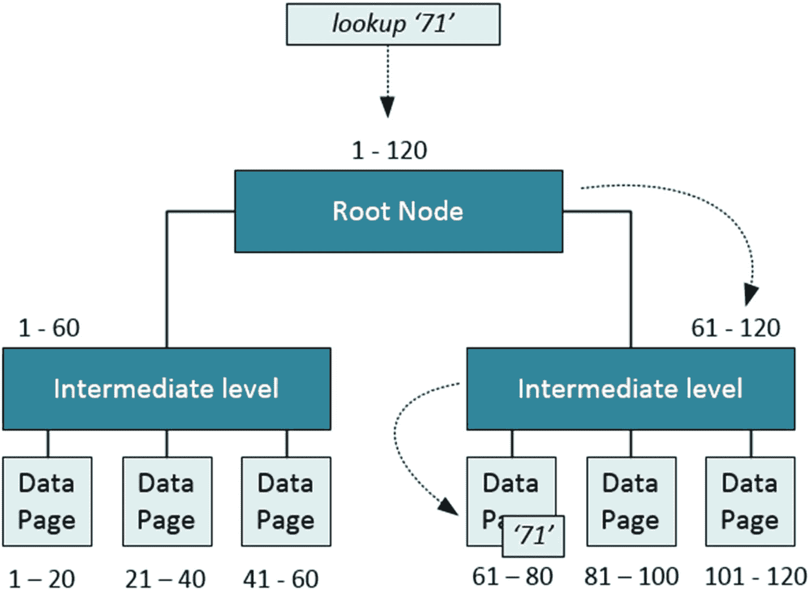

*图 9-19*

*B-树导航*

当数据添加到索引时，索引将在叶层分配新的数据页来保存索引键（请记住，聚集索引在叶层保存行）。每当插入足够的数据并且需要创建新的索引级别时，就会发生根页拆分，以便访问索引中的新级别。此根页拆分并不是将您的根页切成两个新的，始终只有一个根页，但它需要更新，以便我们可以使用它来遍历 B-树以访问新数据。

`ACCESS_METHODS_HOBT_VIRTUAL_ROOT` 锁存类是与在 B-树中创建另一个级别时发生的根页拆分相关联的锁存等待类。每当发生根页拆分时，B-树将获取一个排他锁存。所有想要向下遍历 B-树的线程都必须等待根页拆分完成，因为它们使用与排他锁存不兼容的共享锁存。但是，在我们运行 `Ostress` 工作负载时，我们看到的是 `LATCH_SH` 等待，而不是排他锁存，因为我们正在执行插入。原因很简单：在 SQL Server 知道在索引中放置新索引键的位置之前，它必须首先遍历 B-树以定位新索引键需要放置的位置，并且它在导航期间使用共享锁存。

为了向您展示在我们的 `Ostress` 工作负载期间非聚集索引添加了另一个级别，我将使用 `INDEXPROPERTY` 函数来检索我们创建的非聚集索引的深度。

首先，让我们使用 `TRUNCATE` 命令清空 `Insert_Test2` 表：

```sql
TRUNCATE TABLE Insert_Test2;
```

如果我们在该表的非聚集索引上使用 `INDEXPROPERTY` 函数，我们将看到 B-树的当前深度。接下来的查询展示了如何使用 `INDEXPROPERTY` 函数来检索此信息：

```sql
SELECT INDEXPROPERTY(OBJECT_ID('Insert_Test2'), 'idx_ID', 'indexDepth');
```

由于我们截断了表，且表中尚无行，因此索引深度应为 0。


我们再次运行 `Ostress` 工作负载，待其完成后，重新检查索引信息。这次，我们不使用 `INDEXPROPERTY` 函数，而是使用 `sys.dm_db_index_physical_stats` DMF 来返回关于索引内部索引页和数据页数量的额外信息。此查询返回如下信息：

```sql
SELECT
index_id,
index_type_desc,
index_depth,
index_level,
page_count,
record_count
FROM sys.dm_db_index_physical_stats
(DB_ID(N'GalacticWorks'), OBJECT_ID(N'Insert_Test2'), NULL, NULL , 'DETAILED');
```

图 9-20 展示了在我测试的 SQL Server 实例上执行此查询的结果。

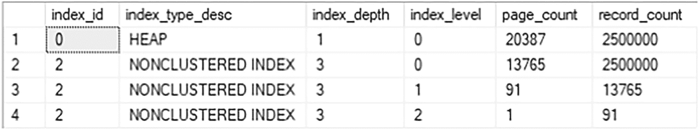

一个包含六列、名为 `index_id`、`index_type_desc`、`index_depth`、`index_level`、`page_count` 和 `record_count` 的表格，以及其在四行中的相应条目。

图 9-20

`sys.dm_db_index_physical_stats` 结果

如图中所示，非聚集索引现在具有三个级别，由 `index_depth` 列指示。`index_level` 和 `page_count` 列显示了 B 树的每个级别存在多少页。最高的 `index_level` 数字是根级别，最低的是叶级别。

虽然 B 树内部创建了新的级别，但并发的插入查询在能够导航 B 树之前必须等待，从而导致了 `LATCH_SH` 等待。

#### 降低 `LATCH_[xx]` 等待

在前面的例子中，我介绍了一个特定的锁存争用情况，当索引根页拆分以扩展 B 树结构时会发生这种情况。正如我之前提到的，`LATCH_[xx]` 等待类型报告的锁存类别还有很多。这使得描述“一刀切”的建议变得不可能。不过，我可以描述一个通用的方法，使用这里的列表：

*   如果发生 `LATCH_[xx]` 等待，请查询 `sys.dm_os_waiting_tasks`。`resource_description` 列显示了有关特定锁存类别的附加信息。如果你遇到 `LATCH_[xx]` 等待没有在 `sys.dm_os_waiting_tasks` 中显示，但在 `sys.dm_os_wait_stats` DMV 中可以看到高等待时间的情况，那么 `sys.dm_os_latch_waits` DMV 应该是你的起点。

*   另一个有用的 DMV 可能是 `sys.dm_exec_requests` DMV。与 `sys.dm_exec_sql_text` DMF 连接在一起，它可能帮助你找到导致 `LATCH_[xx]` 等待的查询。

*   查询 `sys.dm_os_latch_waits`，查看这是否与 `sys.dm_os_waiting_tasks` DMV 的 `resource_description` 列中显示的锁存类别相关。

*   查阅《联机丛书》或本书附录 III 以获取有关特定锁存类别的更多信息。

值得庆幸的是，看到 `LATCH_[xx]` 等待类型持续的高等待时间并不常见，因为可能导致 `LATCH_[xx]` 等待发生的情况通常与特定的工作负载和数据库设计有关。

#### `LATCH_[xx]` 总结

`LATCH_[xx]` 等待类型代表了 SQL Server 内部大量不同的、与缓冲区无关的锁存类别所遇到的等待。这些与缓冲区无关的锁存类别有自己的锁存等待 DMV `sys.dm_os_latch_waits`，它返回这些锁存类别的等待时间。故障排除 `LATCH_[xx]` 等待可能很困难，因为与该等待类型相关的锁存类别文档很少。值得庆幸的是，看到 `LATCH_[xx]` 等待类型出现高等待时间并不常见，因为它们只发生在非常特定的情况和工作负载下。

### `PAGEIOLATCH_[xx]`

本章我们将讨论的最后一种与锁存相关的等待类型是 `PAGEIOLATCH_[xx]` 等待类型。`PAGEIOLATCH_[xx]` 等待类型是迄今为止最常见的锁存相关等待类型，它与 `CXPACKET` 等待类型并列，是任何 SQL Server 实例上最常见的等待类型。

就像我们之前讨论的两种锁存等待类型一样，`PAGEIOLATCH_[xx]` 有不同的访问模式，我在本章中用 `[xx]` 替换了它们。由于我们已经在引言中描述了不同的锁存模式，本章将不再进一步讨论它们。

`PAGELATCH_[xx]` 等待类型与放置在缓冲区缓存内内存页面上的锁存有关，而 `LATCH_[xx]` 等待类型与非缓冲区对象上的锁存有关。`PAGEIOLATCH_[xx]` 等待类型也指示了在 SQL Server 特定区域使用锁存，这里是 IO 锁存。

#### 什么是 `PAGEIOLATCH_[xx]` 等待类型？

SQL Server 内部的磁盘操作开销非常大。访问系统的磁盘子系统需要额外的资源，并且总是比访问系统内部内存中的信息慢。因为 SQL Server 是一个数据库，其主要功能是访问和存储数据，所以 SQL Server 访问数据的方式极其重要。如果数据访问速度慢，SQL Server 的性能也会随之下降，这将导致查询或应用程序中出现明显的性能下降。为了使 IO 交互尽可能高效，SQL Server 使用缓冲区缓存将之前访问过的数据页缓存到系统的内存中。通过缓存数据页，SQL Server 只需在第一次查询请求这些特定数据页时访问一次磁盘子系统。当后续查询需要与第一个查询相同的数据页时，SQL Server 通过缓冲区管理器检测到这些页已经在缓冲区缓存中，就会从缓冲区缓存内部访问这些数据页，而不是与磁盘子系统进行额外的交互。图 9-21 展示了当查询需要来自存储子系统的数据页时，缓冲区缓存的行为。

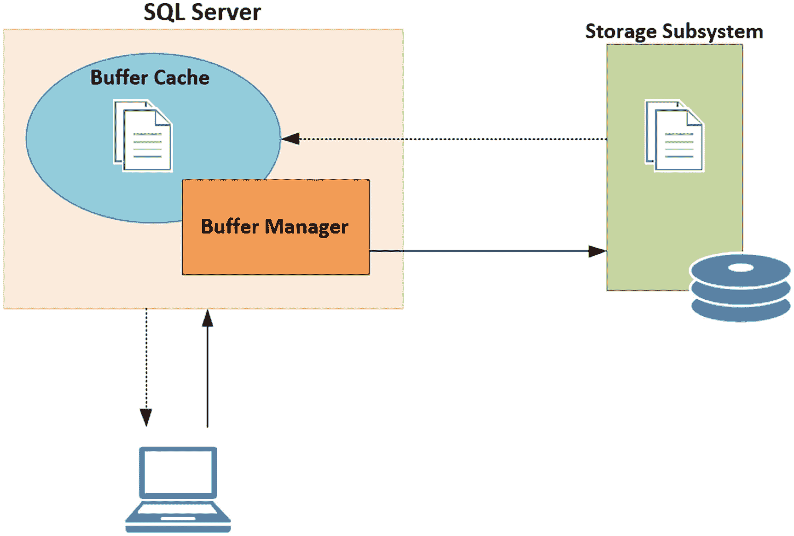

一个图表描绘了存储子系统如何将页从 SQL 服务器中的缓冲区管理器移动到缓冲区缓存并响应查询。

图 9-21

将页从存储子系统移动到缓冲区缓存

在数据页从存储子系统移动到缓冲区缓存的过程中，使用锁存来为存储子系统上的数据页“预留”一个缓冲区页。这确保没有其他并发事务分配相同的缓冲区页或同时尝试将相同的数据页从存储子系统传输到缓冲区缓存。

当 SQL Server 正在将数据页从存储子系统传输到缓冲区缓存时，将在缓冲区页上放置一个独占锁存。因为独占锁存几乎与所有其他锁存模式都不兼容（保持模式除外），所以保证在传输过程中没有其他锁存可以访问该缓冲区页。从用户的角度来看，在数据页传输期间将记录一个 `PAGEIOLATCH_[xx]` 等待。锁存的模式取决于启动数据页从存储子系统移动到缓冲区缓存的操作。如果数据是为了读取访问而移动的，将记录一个 `PAGEIOLATCH_SH`；如果数据页是为了修改而移动的，则将使用 `PAGEIOLATCH_UP` 或 `PAGEIOLATCH_EX`。图 9-22 展示了包括锁存和锁存等待在内的数据页移动过程。

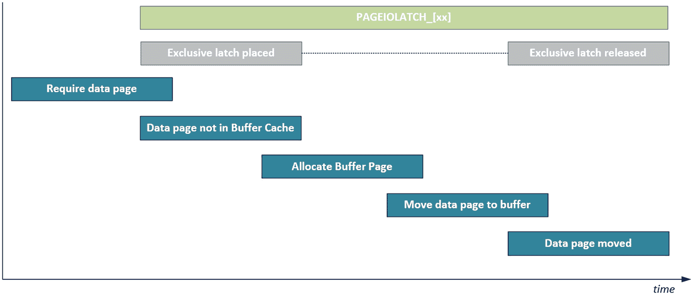

一个时间图描绘了带有锁存的数据页如何从存储子系统分 5 步移动到 SQL 服务器的缓冲区缓存中：需要数据页、数据页在缓冲区缓存中、分配缓冲区页、将数据页移动到缓冲区、数据页已移动。

图 9-22

数据页移动

总结前面的部分，如果你看到发生 `PAGEIOLATCH_[xx]` 等待，这意味着你的 SQL Server 实例正在将数据从存储子系统读取到你的缓冲区缓存中。因为这是一个非常常见的操作，所以很容易理解为什么 `PAGEIOLATCH_[xx]` 等待类型是任何 SQL Server 实例上最常见的等待类型之一。


#### PAGEIOLATCH_[xx] 示例

为 PAGEIOLATCH_[xx] 等待创建一个示例非常简单——只需在刚重启的 SQL Server 实例上运行一个 `SELECT` 查询。重启 SQL Server 服务将清空所有数据页的缓冲区缓存。这样，缓冲区缓存中就不会有任何用户数据。然而，还有一种方法无需重启 SQL Server 服务即可清空缓冲区缓存。运行 `DBCC DROPCLEANBUFFERS` 命令将从缓冲区缓存中移除所有未修改的数据页。将其与 `CHECKPOINT` 命令结合使用，可以确保修改过的页也被写入磁盘，从而留下一个空的或“冷的”缓冲区缓存。

代码清单 9-3 中的查询将执行一个 `CHECKPOINT`，然后是 `DBCC DROPCLEANBUFFERS`。接着，它将重置 `sys.dm_os_wait_stats` DMV 并对 `GalacticWorks` 数据库运行查询。在对 `GalacticWorks` 数据库中的某些表进行查询后，我们将查询 `sys.dm_os_wait_stats` DMV 以查看 PAGEIOLATCH_[xx] 等待。

```
CHECKPOINT 1;
DBCC DROPCLEANBUFFERS;
DBCC SQLPERF('sys.dm_os_wait_stats', CLEAR);
SELECT
    SOD.SalesOrderID,
    SOD.CarrierTrackingNumber,
    SOH.CustomerID,
    C.AccountNumber,
    SOH.OrderDate,
    SOH.DueDate
FROM Sales.SalesOrderDetail SOD
INNER JOIN Sales.SalesOrderHeader SOH
    ON SOD.SalesOrderID = SOH.SalesOrderID
INNER JOIN Sales.Customer C
    ON SOH.CustomerID = C.CustomerID;
SELECT *
FROM sys.dm_os_wait_stats
WHERE wait_type LIKE 'PAGEIOLATCH_%';
```
**代码清单 9-3** 生成 PAGEIOLATCH_SH 等待

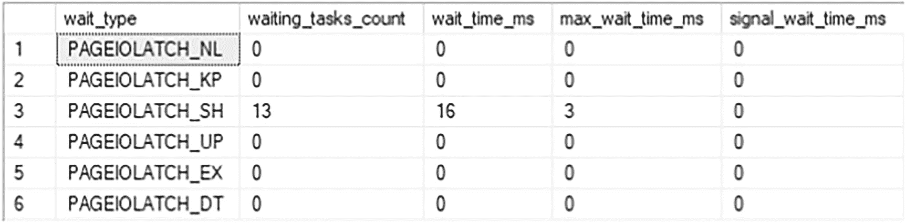

**图 9-23** PAGEIOLATCH_SH 等待时间信息

在测试 SQL Server 实例上对 `sys.dm_os_wait_stats` DMV 进行最后一次查询的结果如图 9-23 所示。表中有 5 列，标题分别为 wait type、waiting tasks count、wait time milliseconds、max wait time milliseconds 和 signal wait time milliseconds，以及其对应的 6 行条目。

只看到记录了 PAGEIOLATCH_SH 等待是有道理的，因为我们执行的是 `SELECT` 查询而不是数据修改。如果我们对行执行某种形式的数据修改，我们将在结果中看到 PAGEIOLATCH_EX 等待。

#### 降低 PAGEIOLATCH_[xx] 等待

如果你阅读了上一节，你就会明白 PAGEIOLATCH_[xx] 等待在 SQL Server 内部是完全正常的行为。在许多情况下，你的数据库大小超过了系统中可用的 RAM 量，与存储子系统发生一些交互是预料之中的。即使你的数据库小于系统中的 RAM 量，并且可以完全放入缓冲区缓存，你仍然会在 SQL Server 启动期间注意到 PAGEIOLATCH_[xx] 等待的发生，因为这是 SQL Server 开始将数据页从存储子系统移动到缓冲区缓存的时间（如果有任何查询活动，SQL Server 不会自行将数据从存储子系统移入缓冲区缓存）。

由于看到 PAGEIOLATCH_[xx] 等待发生在每个 SQL Server 实例中都是完全正常的，因此为等待时间维护一个基线非常重要（第 4 章“构建可靠的基线”可以帮到你）。当等待时间保持在该等待类型的基线值范围内时，就不应该有任何值得担忧的原因。如果等待时间比你预期的高得多，可能需要调查高于正常等待时间的原因。导致 PAGEIOLATCH_[xx] 等待时间高于正常水平的原因有很多，我将描述一些比较常见的原因。

当注意到 PAGEIOLATCH_[xx] 等待时间高于正常水平时，我首先查看 SQL Server 日志，以查明 SQL Server 是否已重启。SQL Server 可能因崩溃而重启，也可能在发生故障转移时重启。这些事件将导致高 PAGEIOLATCH_[xx] 等待时间，这可能不会反映在你的基线中，特别是因为 SQL Server 重启并不经常发生。由于我们的基线测量是使用平均值计算的，当更多测量值被纳入平均基线时，SQL Server 启动期间的 PAGEIOLATCH_[xx] 等待时间会更低。如果你在特定时间范围内创建的基线测量值，并且在此期间 SQL Server 没有重启，那么你的基线测量值也会相当低。正如我们在示例部分所读到的，`DBCC DROPCLEANBUFFERS` 也会从缓冲区缓存中移除数据页，导致命令完成后 PAGEIOLATCH_[xx] 等待时间更高。

> **极客备注**
> 遗憾的是，与 `DBCC FREEPROCCACHE` 命令不同，`DBCC DROPCLEANBUFFERS` 命令的执行不会记录在 SQL Server 日志中。

我看到的关于降低 PAGEIOLATCH_[xx] 等待时间的一个常见建议是将注意力集中在存储子系统上。由于 PAGEIOLATCH_[xx] 等待类型表示数据从存储子系统移动到缓冲区缓存，因此存储子系统在等待时间中起着至关重要的作用是符合逻辑的，但不要自动假设这是根本原因！如果你确实存在与存储相关的问题，这可能会在 PAGEIOLATCH_[xx] 等待时间中体现出来，因此检查存储子系统的性能是值得的。

开始监控存储性能的一个好地方是 Perfmon。Perfmon 有各种计数器，可以显示存储子系统的当前性能。以下列表中的计数器是我在监控存储性能时最常用的：

*   `PhysicalDisk\Avg. Disk sec/Read` – 这将显示你正在监控的磁盘的平均读取延迟。延迟越低越好，作为一般准则，延迟值应低于 20 毫秒（在 Perfmon 中为 0.020，因为它以秒为单位报告延迟）。
*   `PhysicalDisk\Avg. Disk sec/Write` – 这将返回你正在监控的磁盘的平均写入延迟。与读取延迟一样，写入延迟作为一般准则应低于 20 毫秒。


#### 分析与优化 PAGEIOLATCH_[xx] 等待类型

*   `PhysicalDisk\Disk Reads/sec` – 显示每秒的读取 IOPS（输入输出操作）。如果磁盘遇到容量瓶颈，此信息会很有帮助。
*   `PhysicalDisk\Disk Writes/sec` – 与 `PhysicalDisk\Disk Reads/sec` 类似，但显示的是每秒的写入 IOPS。
*   `PhysicalDisk\Disk Read Bytes/sec` – 此计数器显示每秒从磁盘读取的字节数。同样，此信息可用于检测可能的容量瓶颈。
*   `PhysicalDisk\Disk Write Bytes/sec` – 与 `PhysicalDisk\Disk Read Bytes/sec` 类似，但此计数器显示每秒写入磁盘的字节数。

利用这些 Performance Monitor 测量提供的信息，你应该能够识别可能的存储相关瓶颈。这些信息对存储管理员（如果有）也很有帮助，他们可以将这些测量结果与其管理的存储的测量结果进行比较。

除了存储子系统的性能外，查询的行为也会影响 `PAGEIOLATCH_[xx]` 等待类型的等待时间。查询请求的数据越多（且这些数据不在缓冲区缓存中），需要从存储子系统读取到缓冲区缓存的数据量就越大。例如，如果我们修改清单 9-3 中的查询使其更具选择性，从而返回更少的数据，那么 `PAGEIOLATCH_[xx]` 的等待时间也会减少。

然而，你并不总是能奢侈地修改每个查询使其更具选择性。也许查询是由应用程序生成的，你无法修改它们，或者查询本身就需要大的结果集。幸运的是，作为 DBA，我们也可以通过执行数据库维护来帮助最小化 `PAGEIOLATCH_[xx]` 等待时间。索引碎片和过时的统计信息也会急剧增加 `PAGEIOLATCH_[xx]` 等待时间。如果索引存在碎片，则需要执行更多的磁盘 I/O 来检索请求的数据，这意味着 I/O 锁存需要保持更长时间，从而导致更高的 `PAGEIOLATCH_[xx]` 等待时间。过时的统计信息也可能导致更多的磁盘 I/O，因为 SQL Server 预期返回的行数与实际行数不同。因此，请确保执行索引和统计信息维护，以尽可能限制磁盘交互量。

影响 `PAGEIOLATCH_[xx]` 等待时间的最后一个领域是系统的内存。如果缓冲区缓存内的数据页在特定时间范围内未被访问，SQL Server 将会移除它们以释放缓冲区缓存内的空间。SQL Server 执行此清理的时间间隔取决于进入缓冲区缓存的数据量和缓冲区缓存内的可用空间量。如果对缓冲区缓存内数据页的请求非常高，SQL Server 将被迫换出最不常访问（或一段时间内未访问）的数据页，以换入当前需要的页面。这种数据页在缓冲区缓存中进进出出的移动将导致更多的 `PAGEIOLATCH_[xx]` 等待。在理想情况下，你的数据库应该完全适合 SQL Server 实例的缓冲区缓存。在这种情况下，SQL Server 只需要将数据页从存储子系统移入缓冲区缓存一次，它们将一直保留在那里，直到 SQL Server 再次重启。尽管我们现在可以访问非常大量的 RAM，但在许多情况下，我们无法简单地将整个数据库放入 SQL Server 实例的缓冲区缓存中，因此可以预期数据页会从缓冲区缓存换出回存储子系统。为系统增加更多 RAM 将增加缓冲区缓存存储的数据页数量，并有助于缓冲区缓存将这些页面在内存中保留更长时间。

有两个 Performance Monitor 计数器可以帮助你深入了解缓冲区缓存的使用情况：`SQLServer:Buffer Manager\Buffer cache hit ratio` 和 `SQLServer:Buffer Manager\Page life expectancy`。`SQLServer:Buffer Manager\Buffer cache hit ratio` 将显示位于缓冲区缓存中且不需要在存储子系统上进行物理读取的页面百分比。`SQLServer:Buffer Manager\Page life expectancy` 计数器将显示数据页在缓冲区缓存中停留的秒数。如果你看到这两个计数器的值持续低于你的基线，则可能意味着 SQL Server 遇到了内存压力，需要将数据页从缓冲区缓存移回磁盘以释放内存。

然而，这两个计数器并不完美，关于它们的工作原理（特别是它们的理想值）有很多论述。与将这些值视为独立实体不同，我更喜欢将它们组合成我称之为“缓冲池 IO 速率”的度量标准。这是衡量数据页在缓冲池中循环的指标。

要获取缓冲池 IO 速率，请使用清单 9-4 中的代码。

```sql
SELECT counter_name, (1.0*cntr_value/128) /
(SELECT 1.0*cntr_value
FROM sys.dm_os_performance_counters
WHERE object_name like '%Buffer Manager%'
AND lower(counter_name) = 'Page life expectancy')
AS [BufferPoolRate]
FROM sys.dm_os_performance_counters
WHERE object_name like '%Buffer Manager%'
AND counter_name = 'Target pages';
-- 清单 9-4
-- 缓冲池 IO 速率
```

无法告诉你一个确定的“良好”吞吐率，因为它取决于你的系统内存和工作负载。例如，一台服务器有 56GB 的 RAM 可用于缓冲池，如果你希望页面在池中保留大约一小时（3600 秒），那么我们有 56000MB/3600 秒，即大约 15.5 MB/秒作为目标吞吐率。

这再次说明了基线的重要性。你需要经常测量 IO 速率并寻找峰值。

#### PAGEIOLATCH_[xx] 摘要

`PAGEIOLATCH_[xx]` 等待类型是迄今为止最常见的与锁存相关的等待类型。与 `CXPACKET` 等待类型一起，`PAGEIOLATCH_[xx]` 等待类型可能是任何 SQL Server 实例上最常见的等待类型。`PAGEIOLATCH_[xx]` 等待类型与数据页从存储子系统移动到 SQL Server 实例的缓冲区缓存内存直接相关。SQL Server 使用缓冲区缓存来最小化与（慢得多的）存储子系统的交互次数，从而最大化性能。每当一个数据页被读入缓冲区缓存时，`PAGEIOLATCH_[xx]` 等待类型将记录为此所花费的时间。有许多方法可以减少 `PAGEIOLATCH_[xx]` 等待时间。经常被建议的“购买更快的存储”并不总是成立，尽管快速存储确实会直接影响 `PAGEIOLATCH_[xx]` 等待时间。优化查询以减少需要移动到缓冲区缓存的数据页数量、对索引和统计信息执行维护以及分析内存性能都可能有助于减少 `PAGEIOLATCH_[xx]` 等待时间。

## 10. 高可用性与灾难恢复等待类型

SQL Server 为高可用性和灾难恢复提供了多种选项。就像执行定期数据库备份以确保在发生崩溃或数据损坏时可以回退到数据库的先前状态一样，规划和维护高可用的数据库环境也是数据库管理员（或站点可靠性工程师）工作的一部分。

随着对高可用数据库服务器需求的增长，许多 DBA 发现他们需要在高可用性解决方案（如 AlwaysOn 可用性组）或灾难恢复配置（如日志传送）中管理 SQL Server 实例。伴随这些类型的 SQL Server 高可用性和灾难恢复配置而来的，是一组专门的等待类型，它们直接关系到您的高可用性和灾难恢复（HA/DR）配置的健康状况。

在本章中，我们将探讨 HA/DR 配置中一些常见的等待类型。本章涉及的等待类型主要集中在 AlwaysOn 可用性组上，因为 Microsoft 正在弃用许多先前版本的功能（例如数据库镜像），这些功能现在统一归于 AlwaysOn 可用性组的名下。作为此规则的一个例外，我选择了一个与镜像相关的等待类型，它在高度使用的镜像配置中相对常见。所有其他等待类型都与 AlwaysOn 可用性组相关。

对于本章中的示例，我使用了几台虚拟机来创建镜像和 AlwaysOn 可用性组配置。这些虚拟机的配置可以在附录 I “示例 SQL Server 机器配置”中找到。

### DBMIRROR_SEND

本章的第一个等待类型是 `DBMIRROR_SEND` 等待类型。正如您可能从名称中推测的那样，`DBMIRROR_SEND` 与数据库镜像有关。

数据库镜像是在 SQL Server 2005 中引入的功能，但在 SQL Server 2012 中被弃用。这并不意味着您不能在 SQL Server 中使用数据库镜像，但它确实意味着该功能计划在未来被移除。整个功能将被 AlwaysOn 可用性组取代，后者提供了与数据库镜像相同的配置选项。

数据库镜像是一种提高 SQL Server 数据库可用性的解决方案，与故障转移群集不同，它可以基于每个数据库进行配置。数据库镜像的工作原理是在镜像数据库上重做发生在主体数据库（在数据库镜像术语中称为 *主体*）上的每一个数据修改操作。重做每一个数据库修改操作是通过将活动的事务日志记录流式传输到镜像服务器来实现的，镜像服务器按照这些记录插入到主体数据库事务日志中的顺序，在镜像数据库上执行这些操作。

数据库镜像提供两种不同的操作模式，它们会影响镜像配置的可用性和性能：同步（或高安全）模式和异步（或高性能）模式。尽管两种模式执行相同的动作以确保数据修改操作也在镜像数据库上执行，但它们在性能以及由此产生的等待方面可能存在巨大差异。

同步镜像模式确保在主体上执行的每个数据修改操作也直接在镜像上执行。它通过等待向客户端发送事务确认消息，直到事务成功写入镜像磁盘来实现这一点。图 10-1 描绘了同步镜像。

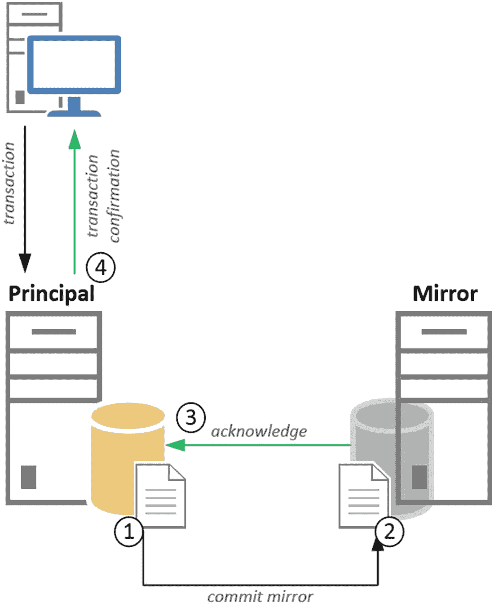

同步镜像流程图。步骤 1，在主体上执行一个事务。步骤 2，事务在镜像上提交。步骤 3，镜像向主体发送确认。步骤 4，向客户端发送事务确认。

图 10-1

同步镜像

尽管同步镜像确保主体和镜像上的数据 100% 相同，但它有一些缺点。其中之一是，在同步镜像配置中，数据库的性能高度依赖于镜像处理数据修改操作的速度，因为每个事务必须先在镜像上提交。

数据修改事务的流程描述如下：

1.  当收到事务时，主体会将事务写入事务日志，但事务尚未提交。
2.  主体将日志记录发送到镜像。
3.  镜像将日志记录固化到磁盘，并向主体发送确认。
4.  主体收到确认后，会向客户端发送一条确认消息，显示事务已完成，然后事务才在主体的事务日志中提交。

异步模式的工作方式非常相似；不同之处在于，它在向客户端发送事务确认消息之前，不会等待来自镜像的确认消息。这意味着事务在写入镜像磁盘之前，已经在主体上提交到磁盘。使用异步镜像可以提高镜像性能，因为消除了同步镜像的延迟开销。这种性能提升的代价是，在发生灾难时，异步复制可能导致数据丢失，因为事务可能尚未在镜像上提交。图 10-2 显示了异步镜像上的事务日志流程；虚线表示这些动作不是直接执行的。

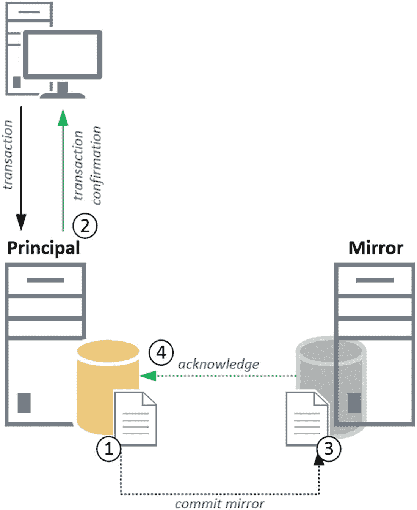

异步镜像流程图。步骤 1，在主体上执行一个事务。步骤 2，主体向客户端发送事务确认。步骤 3，事务在镜像上提交。步骤 4，镜像向主体发送确认。

图 10-2

异步镜像

#### 什么是 DBMIRROR_SEND 等待类型？

`DBMIRROR_SEND` 等待类型最常出现在同步镜像配置中。在线丛书（Books Online）中对 `DBMIRROR_SEND` 等待类型的描述是：“当任务正在等待网络层的通信积压清除以便能够发送消息时发生。表明通信层开始变得过载并影响数据库镜像数据吞吐量。” 在这个案例中，在线丛书的定义相当具有描述性，但网络并不是唯一影响 `DBMIRROR_SEND` 等待时间的因素。连接到镜像数据库的磁盘子系统速度缓慢也会导致 `DBMIRROR_SEND` 等待时间增加。

另一个需要记住的重要点是，高的 `DBMIRROR_SEND` 等待时间通常只记录在镜像实例上，而不会在主体上记录。通常在主体和镜像上都能看到 `DBMIRROR_SEND` 等待类型的发生，但这些等待时间在主体上通常较低。由于两个 SQL Server 实例之间通常存在一定的延迟，因此它们在镜像上仍然可能达到较高的值。考虑到这种预期的延迟，我建议您使用基线测量来识别 `DBMIRROR_SEND` 等待类型的异常高等待时间。


#### DBMIRROR_SEND 示例

在本例中，我在两个测试 SQL Server 实例之间构建了一个同步镜像，使用 GalacticWorks 数据库作为两个实例之间镜像的数据库。

在 GalacticWorks 数据库内部，我使用清单 [10-1] 中的脚本创建了一个简单的表。

```
USE [GalacticWorks];
CREATE TABLE Mirror_Test
(ID UNIQUEIDENTIFIER PRIMARY KEY,
RandomData VARCHAR(50));
Listing 10-1
创建 Mirror_Test 表
```

表创建完成后，我清除了 `sys.dm_os_wait_stats` DMV，并使用清单 [10-2] 中的查询向 `Mirror_Test` 表插入了 10,000 行数据。在运行清单 [10-2] 中的脚本之前，我还确保在镜像服务器上也清除了 `sys.dm_os_wait_stats` DMV。

```
DBCC SQLPERF('sys.dm_os_wait_stats', 'CLEAR');
INSERT INTO Mirror_Test
(ID,
RandomData)
VALUES
(NEWID(),
CONVERT(VARCHAR(50), NEWID()))
GO 10000
Listing 10-2
向 Mirror_Test 表插入 10,000 行数据
```

在脚本运行时，我使用以下查询查看镜像服务器和主体服务器上的 `DBMIRROR_SEND` 等待时间：

```
SELECT *
FROM sys.dm_os_wait_stats
WHERE wait_type = 'DBMIRROR_SEND'
```

此查询的结果见图 [10-3]，它显示了镜像服务器上的 `DBMIRROR_SEND` 等待时间。图 [10-4] 显示了主体服务器上的 `DBMIRROR_SEND` 等待时间。

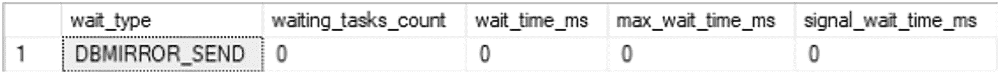

图 10-4 主体服务器上的 DBMIRROR_SEND 等待时间

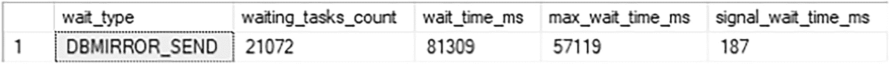

图 10-3 镜像服务器上的 DBMIRROR_SEND 等待时间

如您所见，在镜像服务器上，我们在 `DBMIRROR_SEND` 等待类型上花费了相当多的时间，而在主体服务器上则没有 `DBMIRROR_SEND` 等待。

#### 降低 DBMIRROR_SEND 等待时间

关于降低 `DBMIRROR_SEND` 等待时间的一个常见建议是将镜像模式从同步（高安全性）更改为异步（高性能）。虽然这会降低 `DBMIRROR_SEND` 等待时间，但也意味着当主体服务器发生灾难时可能会丢失数据。降低 `DBMIRROR_SEND` 等待类型的等待时间将对查询的持续时间产生积极影响。例如，在上一节的例子中，在我的测试 SQL Server 镜像配置上插入 10,000 行数据大约花费了 30 秒。当我将镜像模式从同步更改为异步时，不仅 `DBMIRROR_SEND` 等待类型的等待时间下降了，而且 10,000 次插入的总执行时间也下降到 3 秒。这几乎改善了 30 秒！

虽然这种改进听起来很有吸引力，但更改镜像模式并不总是可行的选择。例如，您公司的灾难恢复策略可能要求同步镜像配置。在我看来，将镜像模式从同步更改为异步应该是最后的选择（如果是一个可行的选项的话）。还有其他资源会影响 `DBMIRROR_SEND` 等待时间，例如镜像服务器上的存储配置或主体和镜像 SQL Server 实例之间的网络连接。这两种资源都充当实例之间的瓶颈，导致了 `DBMIRROR_SEND` 等待时间。

SQL Server 还提供了一个数据库镜像监视器，用于提供有关镜像配置的状态信息。您可以通过右键单击属于镜像一部分的数据库，选择“任务”➤“数据库镜像监视器”来找到数据库镜像监视器。图 [10-5] 显示了针对我的测试镜像配置的监视器。

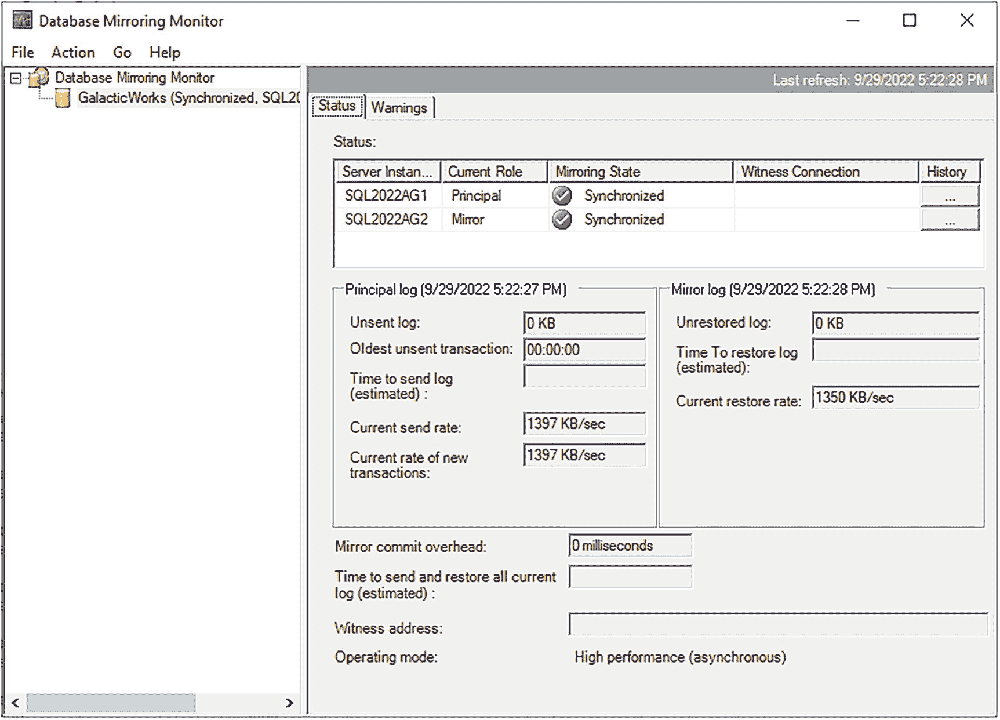

图 10-5 数据库镜像监视器

如您所见，数据库镜像监视器提供了一些非常有趣的附加信息，例如仍需要发送或恢复的日志记录量、镜像当前落后的程度以及发送和恢复速率。在我处理数据库镜像的许多情况中，当涉及镜像配置的性能问题时，数据库镜像监视器是我首先会检查的地方。

#### DBMIRROR_SEND 总结

`DBMIRROR_SEND` 等待类型与数据库镜像直接相关。在大多数镜像配置上看到 `DBMIRROR_SEND` 等待发生是非常正常的。这使得使用基线来识别等待时间峰值成为必需。镜像模式在 `DBMIRROR_SEND` 等待时间中起着巨大作用。使用同步镜像时，`DBMIRROR_SEND` 等待时间通常会比使用异步镜像时更高。然而，不仅镜像模式会影响 `DBMIRROR_SEND` 等待时间。镜像 SQL Server 实例上的存储子系统如果无法跟上负载，也会对 `DBMIRROR_SEND` 等待产生影响，主体和镜像之间的网络连接也是如此。

### HADR_LOGCAPTURE_WAIT 和 HADR_WORK_QUEUE

`HADR_LOGCAPTURE_WAIT` 和 `HADR_WORK_QUEUE` 等待类型都与 AlwaysOn 可用性组相关。所有与 AlwaysOn 相关的等待类型都可以通过等待类型名称中的 `HADR_` 前缀轻松识别。AlwaysOn 可用性组在 SQL Server 2012 中引入，作为各种 SQL Server 高可用性和灾难恢复功能（如复制、日志传送和数据库镜像）的替代品。与 AlwaysOn 相关的等待类型有很多，在 SQL Server 2022 中总共达到 70 个。并非所有这些都表明您的 AlwaysOn 配置中存在性能问题。`HADR_LOGCAPTURE_WAIT` 和 `HADR_WORK_QUEUE` 都是良性的等待类型的完美例子，它们会随时间自然发生，并不直接表明存在性能问题。由于这两种等待类型在每个 AlwaysOn 配置上都有很高的等待时间，因此非常常见，我希望在本章中包含它们，以帮助您更好地理解它们的功能。


#### HADR_LOGCAPTURE_WAIT、HADR_WORK_QUEUE 与 HADR_SYNC_COMMIT 等待类型详解

#### HADR_LOGCAPTURE_WAIT 与 HADR_WORK_QUEUE 等待类型是什么？

正如前一节所述，`HADR_LOGCAPTURE_WAIT` 和 `HADR_WORK_QUEUE` 等待类型都出现在 AlwaysOn 配置中。它们出现在 AlwaysOn 配置的不同位置，并且功能略有不同。

根据 *SQL Server 联机丛书*（Books Online）的描述，`HADR_LOGCAPTURE_WAIT` 等待类型表明 SQL Server 正在“等待日志记录变得可用。可能发生在等待连接生成新日志记录时，或者在读取不在缓存中的日志时等待 I/O 完成时。如果日志扫描已赶至日志末尾或正在从磁盘读取，则此等待是预期的。” `HADR_LOGCAPTURE_WAIT` 等待类型出现在托管 AlwaysOn 可用性组中主数据库的 SQL Server 上。可以将主数据库视为数据库镜像配置中的主体。

AlwaysOn 可用性组使用与数据库镜像类似的日志传送机制，并且也提供两种不同的模式（在 AlwaysOn 中称为可用性模式）：同步提交（Synchronous-commit）和异步提交（Asynchronous-commit）。这两种可用性模式的工作方式与本章前面讨论的数据库镜像对应模式完全相同。这意味着在同步提交模式下，主副本会等待，直到辅助副本完成自己的日志固化后才将事务提交到事务日志；而在异步提交模式下，主副本会直接将事务提交到事务日志，而不会等待辅助副本的确认。

当主副本等待工作时，SQL Server 会将等待新事务可用所花费的时间记录为 `HADR_LOGCAPTURE_WAIT` 等待类型。`HADR_LOGCAPTURE_WAIT` 等待类型的高等待时间意味着 SQL Server 正在等待新事务变得可用，以便将其传输到辅助副本。这与您为 AlwaysOn 可用性组配置的可用性模式无关。无论您的 AlwaysOn 配置如何，`HADR_LOGCAPTURE_WAIT` 等待类型始终会出现。图 10-6 展示了一个 AlwaysOn 可用性组配置以及主副本上的 `HADR_LOGCAPTURE_WAIT` 等待类型，该等待类型发生在等待新事务发送到辅助副本时。

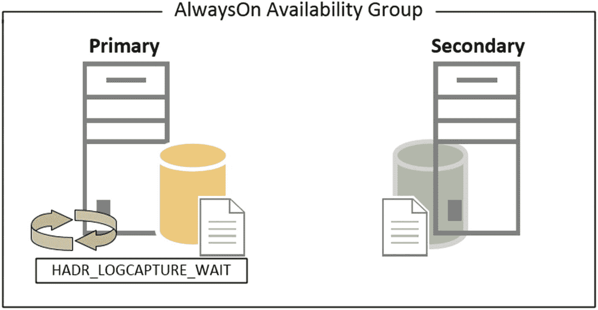

图 10-6：AlwaysOn 可用性组与 `HADR_LOGCAPTURE_WAIT` 等待类型

尽管我在图 10-6 中将 `HADR_LOGCAPTURE_WAIT` 等待类型放在了主副本上，但它也会在辅助副本上记录 `HADR_LOGCAPTURE_WAIT` 等待类型，尽管这些值通常远低于主副本上的值。

`HADR_WORK_QUEUE` 等待类型在功能上几乎与 `HADR_LOGCAPTURE_WAIT` 等待类型相同。联机丛书对此等待类型的描述非常出色：“AlwaysOn 可用性组的后台工作线程等待分配新工作。当有就绪的工作线程等待新工作时，这是预期的等待，这是正常状态。”这两种等待类型的主要区别在于，`HADR_LOGCAPTURE_WAIT` 等待类型专用于等待新事务变得可用，而 `HADR_WORK_QUEUE` 则表示空闲线程等待工作。就像 `HADR_LOGCAPTURE_WAIT` 等待类型一样，`HADR_WORK_QUEUE` 出现在主副本和辅助副本上，但 `HADR_WORK_QUEUE` 等待类型在这两个副本上都更为普遍。事实上，`HADR_WORK_QUEUE` 等待类型经常会成为 AlwaysOn 可用性组中每个 SQL Server 上与 AlwaysOn 相关的首要等待类型，尤其是在工作负载较低的情况下。

图 10-7 展示了一个类似于图 10-6 的 AlwaysOn 可用性组，但这次我在图像中添加了 `HADR_WORK_QUEUE` 等待类型。

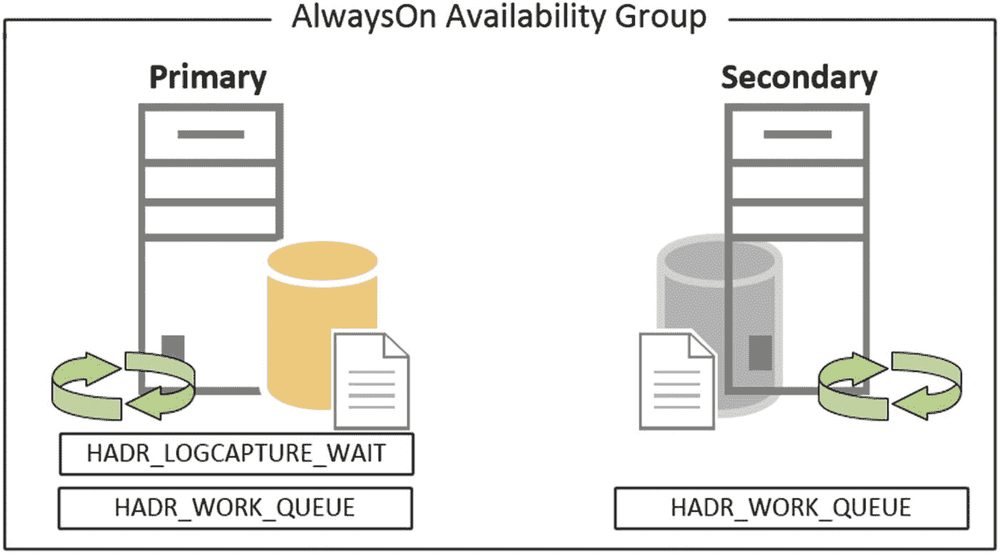

图 10-7：`HADR_LOGCAPTURE_WAIT` 与 `HADR_WORK_QUEUE` 等待类型

由于 `HADR_LOGCAPTURE_WAIT` 和 `HADR_WORK_QUEUE` 等待类型都会随时间自然出现，因此我没有提供这两种等待类型的示例。此外，由于这两种等待类型与性能问题没有直接关系，因此包含关于如何降低这两种等待类型等待时间的部分是没有用的。

#### HADR_LOGCAPTURE_WAIT 与 HADR_WORK_QUEUE 总结

`HADR_LOGCAPTURE_WAIT` 和 `HADR_WORK_QUEUE` 等待类型都是出现在每个作为 AlwaysOn 可用性组一部分的 SQL Server 上的良性等待类型。由于 `HADR_LOGCAPTURE_WAIT` 和 `HADR_WORK_QUEUE` 等待类型与性能问题没有直接关系，因此无需直接关注降低它们，在大多数情况下可以安全地忽略它们。

### HADR_SYNC_COMMIT

`HADR_SYNC_COMMIT` 等待类型是另一个与 AlwaysOn 相关的等待类型，在 SQL Server 2012 中引入。在许多方面，`HADR_SYNC_COMMIT` 等待类型与本章前面讨论的 `DBMIRROR_SEND` 非常相似。然而，这两种等待类型之间存在一些差异，我们将在以下部分进行讨论。

#### HADR_SYNC_COMMIT 等待类型是什么？

`HADR_SYNC_COMMIT` 等待类型表示主副本等待辅助副本固化日志记录所花费的时间。`HADR_SYNC_COMMIT` 等待仅发生在主副本上，并且仅出现在同步复制 AlwaysOn 可用性组中。一旦主副本接收到事务并将其发送到辅助副本进行固化，`HADR_SYNC_COMMIT` 等待时间就会开始记录。只有当辅助副本发送其确认写入辅助事务日志已完成时，`HADR_SYNC_COMMIT` 等待时间才会停止记录。图 10-8 展示了时间线内的 `HADR_SYNC_COMMIT` 等待时间生成过程。

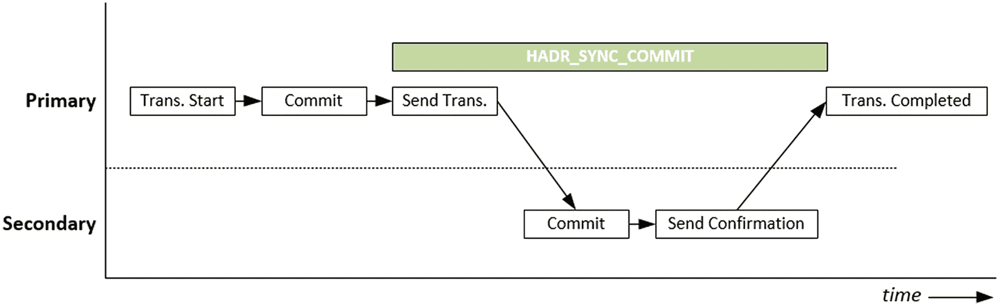

图 10-8：`HADR_SYNC_COMMIT` 与同步复制

由于 `HADR_SYNC_COMMIT` 等待类型在每个同步 AlwaysOn 可用性组中都会出现，因此预期一定量的等待时间是正常的。但就像 `DBMIRROR_SEND` 等待类型一样，`HADR_SYNC_COMMIT` 等待类型的等待时间高度依赖于辅助副本处理日志记录的速度。这意味着两个副本之间缓慢的网络连接或辅助副本上存储子系统的性能会影响 `HADR_SYNC_COMMIT` 等待时间。因此，了解您的 AlwaysOn 配置中 `HADR_SYNC_COMMIT` 等待类型的正常等待时间是多少非常重要，这样您才能轻松识别高于正常水平的等待时间。


#### HADR_SYNC_COMMIT 示例

对于这个示例，我构建了一个配置为使用同步复制的 AlwaysOn 可用性组。测试机器的配置信息可以在附录 I “示例 SQL Server 机器配置” 中找到。我不会详细介绍如何配置 AlwaysOn 可用性组，因为互联网上有大量信息可以帮助你进行配置。一个好的起点是 Books Online 上的 “Getting Started with AlwaysOn Availability Groups” 文章，你可以在这里找到：`https://slrwnds.com/yowojf`。我使用 `GalacticWorks` 数据库作为在我的 AlwaysOn 可用性组中进行复制的数据库。

配置好 AlwaysOn 可用性组后，我使用清单 10-3 中的脚本向 `GalacticWorks` 数据库添加了一个名为 `AO_Test` 的额外表。

```sql
USE [GalacticWorks];
CREATE TABLE AO_Test
(ID UNIQUEIDENTIFIER PRIMARY KEY,
RandomData VARCHAR(50));
```

清单 10-3
创建 `AO_Test` 表

表创建完成后，我先清除然后查询 `sys.dm_os_wait_stats` DMV，以检查主副本和辅助副本上 `HADR_SYNC_COMMIT` 等待时间的当前等待时间，使用以下查询：

```sql
SELECT *
FROM sys.dm_os_wait_stats
WHERE wait_type = 'HADR_SYNC_COMMIT';
```

即使等待了几分钟，`HADR_SYNC_COMMIT` 等待类型的等待时间也保持为 0，如图 10-9 所示。这是我预期的，因为到目前为止我们还没有在主副本上执行任何数据修改。

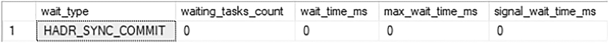

SQL Server 结果窗口的屏幕截图，有 5 列：等待类型、等待任务数、等待时间（毫秒）、最大等待时间（毫秒）和信号等待时间（毫秒）。它有 1 行，等待类型值为 `HADR_SYNC_COMMIT`，其他 4 列的值均为 0。

**图 10-9**

在主副本和辅助副本都无活动期间的 `HADR_SYNC_COMMIT` 等待信息

这与 `HADR_LOGCAPTURE_WAIT` 和 `HADR_WORK_QUEUE` 不同，后者即使在 AlwaysOn 可用性组内没有用户活动（或者正因为没有活动），也会累积等待时间。

现在表已就位，让我们通过执行一些插入操作来生成一些事务。清单 10-4 中的脚本将向我们之前创建的 `AO_Test` 表中插入 10,000 行。

```sql
INSERT INTO AO_Test
(ID,
RandomData)
VALUES
(NEWID(),
CONVERT(VARCHAR(50), NEWID()))
GO 10000
```

清单 10-4
向 `AO_Test` 表插入 10,000 行

当清单 10-4 中的脚本完成后，我再次在主副本和辅助副本上检查 `sys.dm_os_wait_stats` DMV 内的等待统计信息。图 10-10 显示了主副本上此查询的结果，图 10-11 显示了辅助副本的结果。


SQL Server 结果窗口的屏幕截图，有 5 列：等待类型、等待任务数、等待时间（毫秒）、最大等待时间（毫秒）和信号等待时间（毫秒）。它有 1 行，等待类型值为 `HADR_SYNC_COMMIT`，其他 4 列的值均为 0。

**图 10-11**

辅助副本上的 `HADR_SYNC_COMMIT` 等待

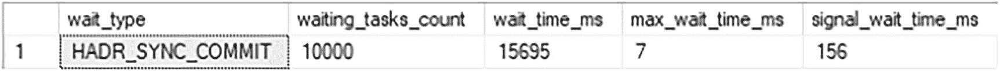

SQL Server 结果窗口的屏幕截图，有 5 列：等待类型、等待任务数、等待时间（毫秒）、最大等待时间（毫秒）和信号等待时间（毫秒）。它有 1 行，等待类型值为 `HADR_SYNC_COMMIT`，其他 4 列的值分别为 10000、15695、7 和 156。

**图 10-10**

主副本上的 `HADR_SYNC_COMMIT` 等待

当你查看这两个图时，首先会注意到 `HADR_SYNC_COMMIT` 等待只发生在主副本上，而不是辅助副本上，这是预期行为。第二个有趣的事情是等待次数。这恰好与插入的行数完全相同。同样，这是预期行为。因为我们执行了一次插入操作并重复了 10,000 次，所以每次插入都生成了一个需要复制的事务日志记录。

**技术说明**

虽然我们执行了 10,000 次单行插入，但如果你重新创建这个演示，等待任务数可能少于 10,000，这是由于网络延迟和存储速度造成的。

利用等待次数和等待时间，可以计算出平均每次插入操作在副本上提交所需的时间。在这个例子中，它是 1.57 毫秒（15695/10000），这是一个相当不错的值。

#### 降低 HADR_SYNC_COMMIT 等待

看到 `HADR_SYNC_COMMIT` 等待发生并不一定意味着存在问题。只要你的主副本上执行了数据修改，`HADR_SYNC_COMMIT` 等待就总是会发生。但如果等待时间远高于你的基线测量值，它们就可能指示存在问题。

将 AlwaysOn 操作模式更改为异步复制将消除 `HADR_SYNC_COMMIT` 等待，但这会带来灾难发生时丢失数据的风险。此外，为了满足公司的灾难恢复或高可用性需求，你通常不能随意更改 AlwaysOn 操作模式，因此我建议你不要仅仅为了降低 `HADR_SYNC_COMMIT` 等待时间而更改它。

幸运的是，你可以使用多种不同的方法来监控 AlwaysOn 可用性组的性能，包括 AlwaysOn 仪表板、DMV 和 Perfmon 计数器。

你可以通过右键单击 AlwaysOn 可用性组并选择“显示仪表板”选项来查看 AlwaysOn 仪表板。默认情况下，AlwaysOn 仪表板会提供一些关于 AlwaysOn 可用性组的一般信息，例如可用性组内的服务器及其同步状态，如图 10-12 所示。

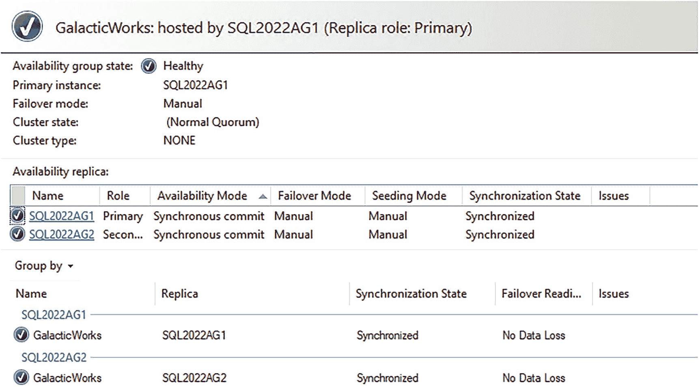

一张 AlwaysOn 仪表板的截图。页面标题显示了服务器名称和角色。可用性组状态显示了运行状况。可用性副本部分列出了实例名称、角色、可用性、故障转移和种子模式，以及同步状态和问题。

图 10-12

AlwaysOn 仪表板

AlwaysOn 仪表板的默认视图并未提供太多用于故障排查的信息。幸运的是，你可以通过右键单击列标题并选择你感兴趣的信息来自定义视图，以满足自己的需求，如图 10-13 所示。

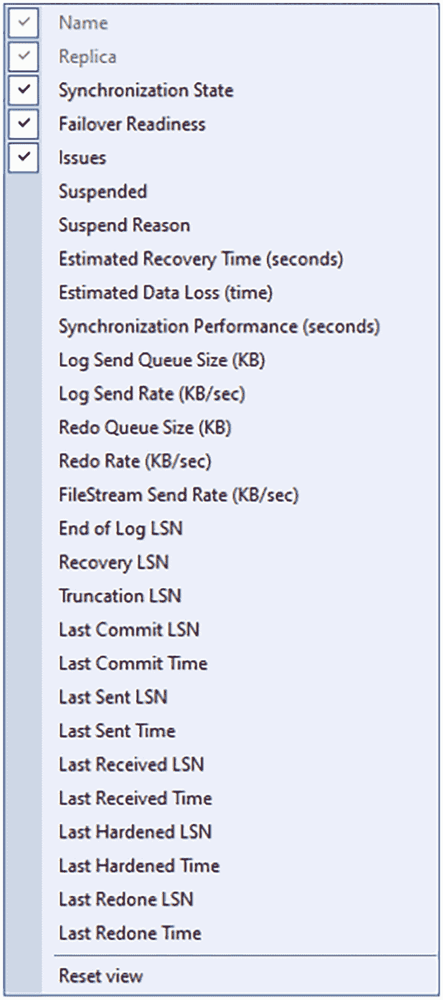

一张显示可添加到 AlwaysOn 仪表板的 28 个选项列表的截图。已选选项包括名称、副本、同步状态、故障转移准备情况和问题。

图 10-13

AlwaysOn 添加列

有很多有趣的列可用于故障排查同步问题，我建议花时间理解它们，以确定哪些列最适用于你的情况。

AlwaysOn 仪表板显示的信息最初记录在各种与 AlwaysOn 相关的 DMV 中。这使得你自己查询这些信息成为可能。所有与 AlwaysOn 相关的 DMV 在 DMV 名称中都带有 `dm_hadr` 前缀，例如 `sys.dm_hadr_database_replica_states` DMV 就包含了你能在 AlwaysOn 仪表板中访问的大部分信息。

除了 AlwaysOn 和与 AlwaysOn 相关的 DMV 外，还有用于 AlwaysOn 性能的 Perfmon 计数器。这些计数器在 Perfmon 的 `SQLServer:Availability Replica` 和 `SQLServer:Database Replica` 组中进行分组。图 10-14 显示了 `SQLServer:Database Replica` 组中可用计数器的一部分。

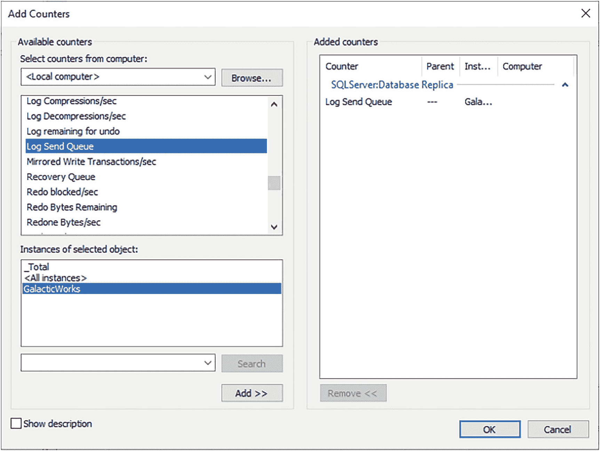

一张“添加计数器”窗口的截图。“可用计数器”部分列出了 Perfmon 计数器。“所选对象的实例”部分列出了实例。“添加的计数器”部分列出了计数器名称、父级、实例和计算机详细信息。

图 10-14

与 AlwaysOn 相关的 Perfmon 计数器

正如你目前所读到的，有大量选项可供你用于分析副本之间的 AlwaysOn 性能。

利用来自各种来源的信息，你可以检查 AlwaysOn 可用性组的整体运行状况。然后，你可以将此信息与其他指标相结合，以了解影响辅助副本性能的因素，例如存储子系统性能和网络连接性能。由于 `HADR_SYNC_COMMIT` 等待类型与辅助副本紧密相关，因此你的分析应集中在托管辅助副本的 SQL Server 上。例如，如果你的存储子系统无法跟上需要在辅助副本上提交的事务数量，你将注意到这一点，表现为更高的 `HADR_SYNC_COMMIT` 等待时间，以及 AlwaysOn 仪表板、DMV 或 Perfmon 中的各种计数器值变化。

很难给出关于如何降低 `HADR_SYNC_COMMIT` 等待时间的通用建议，因为它们高度依赖于各种变量，并且也取决于你的工作负载。当你处理包含大量读取查询的工作负载时，你会发现比执行许多数据修改操作的工作负载更低的 `HADR_SYNC_COMMIT` 等待时间。这意味着分析和优化你的查询工作负载也有助于降低 `HADR_SYNC_COMMIT` 等待时间。

#### HADR_SYNC_COMMIT 总结

`HADR_SYNC_COMMIT` 等待类型仅出现在配置为使用同步复制模式的副本所组成的 AlwaysOn 可用性组上。`HADR_SYNC_COMMIT` 等待类型将让你了解辅助副本将事务提交到磁盘花费了多长时间。由于 `HADR_SYNC_COMMIT` 在同步复制中总是会记录等待时间，因此你只应在等待时间远高于预期时才需要关注。幸运的是，有各种方法可供你分析 AlwaysOn 可用性组的性能，包括 AlwaysOn 仪表板、DMV 和 Perfmon 计数器。

由于辅助副本的性能对 `HADR_SYNC_COMMIT` 等待时间影响最大，在排查此等待类型时，你的注意力应集中在辅助副本上。存储子系统和网络连接在辅助副本将日志记录写入其事务日志的速度方面都起着重要作用。你的工作负载也影响 `HADR_SYNC_COMMIT` 等待时间，优化它以使数据修改更好地分散开，将会导致更低的 `HADR_SYNC_COMMIT` 等待时间。

### REDO_THREAD_PENDING_WORK

本章最后一个等待类型是 `REDO_THREAD_PENDING_WORK` 等待类型。尽管它缺少标识 AlwaysOn 相关等待类型的特征性 `HADR_` 前缀，但它与 AlwaysOn 有关。与 `HADR_LOGCAPTURE_WAIT` 和 `HADR_WORK_QUEUE` 等待类型类似，`REDO_THREAD_PENDING_WORK` 是一种在没有工作可做时随时间累积的等待类型。并且与 `HADR_LOGCAPTURE_WAIT` 和 `HADR_WORK_QUEUE` 等待类型一样，在大多数情况下，它可以被忽略，因为它并不表示存在性能问题。

尽管此等待类型在 99% 的情况下都可以安全忽略，但我仍想将其包含在本章中，原因有二。它通常是 AlwaysOn 可用性组辅助副本上排名靠前的等待类型之一，并且了解其与 SQL Server 内部相关的进程将使你对 AlwaysOn 的内部工作机制有更好的理解。

#### 什么是 REDO_THREAD_PENDING_WORK 等待类型？

`REDO_THREAD_PENDING_WORK` 等待类型与仅在 AlwaysOn 可用性组内的辅助副本上发生的一个进程相关，即重做线程。

在本章前面的部分，我们讨论了 AlwaysOn 可用性组内的辅助副本如何处理日志记录，将其持久化到自己的事务日志，并向主副本发送确认。当使用同步复制时，主副本在向发起事务的客户端发送事务完成消息之前会等待；而当使用异步复制时，该消息会在不等待辅助副本持久化的情况下直接发送。但到目前为止，我们还没有讨论过在辅助数据库中执行日志记录所描述的修改的过程。这就是辅助副本上的重做线程发挥作用的地方。该线程负责执行主副本发送的日志记录中所记录的数据修改。与重做线程相关的一个重要概念是：它不影响来自辅助副本的提交确认。这意味着，即使事务已经向客户端报告为已提交（主副本和辅助副本都已将日志记录持久化，并且 AlwaysOn 可用性组处于同步状态），重做线程可能仍在长时间地执行工作。

这意味着即使你的 AlwaysOn 可用性组已同步，辅助数据库内的数据也不一定与主数据库完全相同。但这并不像你想的那么重要，因为辅助副本已将日志记录持久化到其磁盘上的事务日志中，并且它拥有执行重做操作所需的所有信息。如果主副本发生故障，事务不会丢失，因为辅助副本在其自己的事务日志中拥有所有已执行的事务，并且可以重做所有事务。这与独立的 `SQL Server` 实例非常相似，在独立实例中，事务也会在数据实际更改之前先持久化到磁盘。如果 `SQL Server` 在此情况下崩溃，`SQL Server` 将使用事务日志来重做或撤消数据修改。图 10-15 展示了一个同步复制与重做线程一起工作的示例。请注意，重做线程是一个独立的操作，不影响事务完成消息的持续时间。

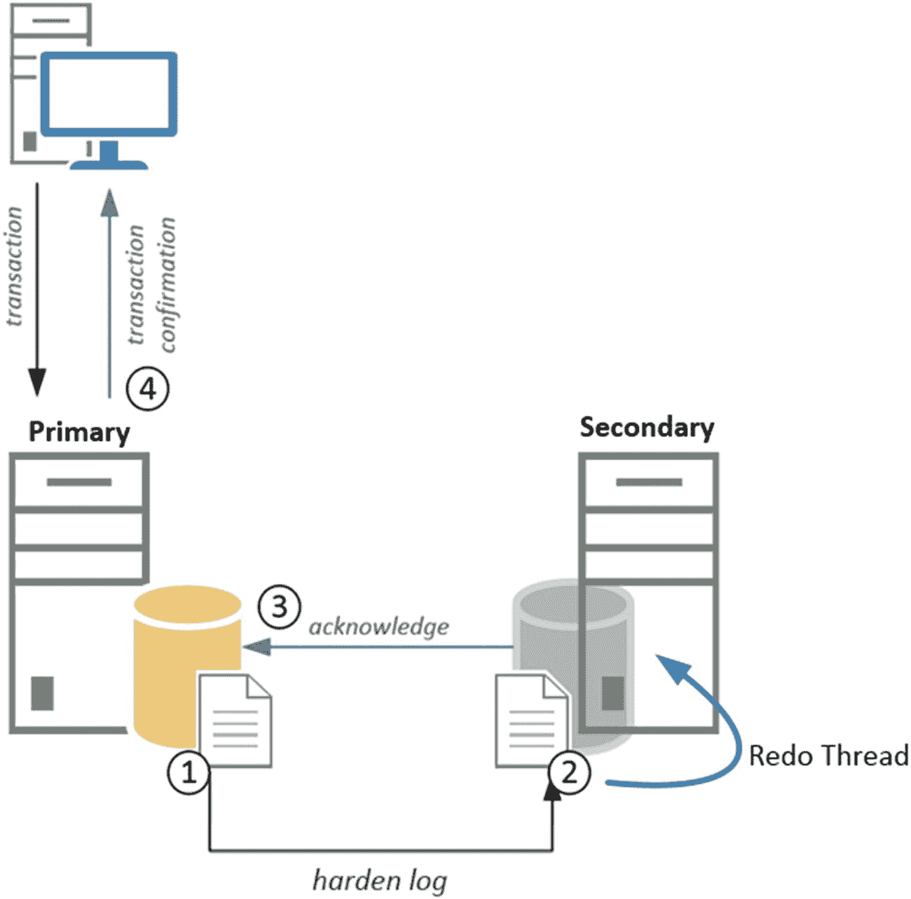
一个带有重做线程的同步 AlwaysOn 组图表。步骤 1，事务在主副本上进行。步骤 2，重做线程在辅助副本上使用已持久化的日志。步骤 3，来自辅助副本的确认被发送到主副本。步骤 4，主副本向客户端发送事务确认。
**图 10-15**
同步 AlwaysOn 可用性组和重做线程

当重做线程等待工作到达时，它会将其不活动的时间记录为 `REDO_THREAD_PENDING_WORK` 等待类型的等待时间。这在同步和异步复制模式下都会发生，但只发生在辅助副本上。

由于该等待表明重做线程没有执行任何工作，除了极少数情况外，它可以被安全地忽略。并且因为当没有工作要做时，`REDO_THREAD_PENDING_WORK` 等待类型的等待时间会自然累积，所以不需要编写示例来演示该等待类型。在辅助副本上针对 `sys.dm_os_wait_stats` DMV 执行一个简单的查询来检索 `REDO_THREAD_PENDING_WORK` 等待类型信息，你将看到等待时间在增加，尤其是在没有针对 AlwaysOn 可用性组的用户活动时，如图 10-16 所示。

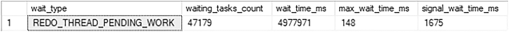
一个 SQL Server 结果窗口的截图，包含 5 列：等待类型、等待任务计数、等待时间（毫秒）、最大等待时间（毫秒）、信号等待时间（毫秒）。它有 1 行，等待类型为 REDO_THREAD_PENDING_WORK，其他 4 列有对应的值。
**图 10-16**
`REDO_THREAD_PENDING_WORK` 等待信息

#### REDO_THREAD_PENDING_WORK 总结

`REDO_THREAD_PENDING_WORK` 等待类型是一种与 AlwaysOn 相关的等待类型，当 AlwaysOn 可用性组没有数据修改活动时，它会随时间自然累积等待时间。`REDO_THREAD_PENDING_WORK` 等待类型与 AlwaysOn 可用性组内辅助副本上的重做线程相关，它表明重做线程当前正在等待工作。由于这种等待类型会出现在每个辅助副本上，尤其是在用户数据修改极少或没有发生时，它可以被安全地忽略。

## 11. 抢占式等待类型

在第 1 章“等待统计信息内部原理”中，我们回顾了 `SQL Server` 用于线程调度和管理的非抢占式调度模型。与 `SQL Server` 不同，Windows 操作系统使用 *抢占式* 调度来调度和管理线程。有时，`SQL Server` 必须使用 Windows 函数通过操作系统执行特定操作，例如检查 Active Directory 权限时。当这种情况发生时，`SQL Server` 会向 Windows 操作系统（在 `SQL Server` 之外）请求一个线程，这使得 `SQL Server` 无法管理该线程。在 `SQL Server` 等待操作系统内的抢占式线程完成期间，`SQL Server` 会记录一个抢占式等待类型的等待。

`SQL Server` 内部有许多不同的抢占式等待类型；在撰写本书时，`SQL Server` 2022 有 240 种不同的抢占式等待类型。当在 `SQL Server` 外部请求线程时记录的抢占式等待类型取决于该线程访问的函数。`SQL Server` 内部的每种抢占式等待类型都代表一个不同的 Windows 函数（除了一些作为不同函数通用等待类型的例外情况），并且在许多情况下，等待类型的名称与 Windows 函数的名称相同。这很有帮助，因为你可以搜索特定的 Windows 函数来了解其功能。如果你知道该函数的作用，你也就能知道 `SQL Server` 为何等待，或者在等待什么。例如，如果你注意到 `PREEMPTIVE_OS_WRITEFILEGATHER` 等待类型的等待时间很长，你可以移除 `PREEMPTIVE_OS_` 部分，然后在 `MSDN` 上搜索 `WRITEFILEGATHER` 函数。图 11-1 显示了 `WRITEFILEGATHER` 函数的搜索结果。

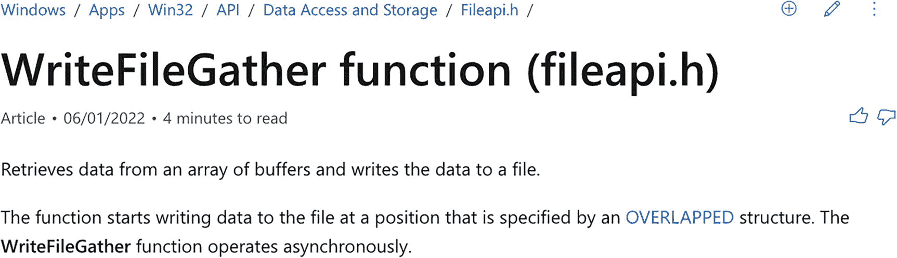
一篇文章的截图，标题为 write file gather 函数，位于 file api.h 中。文本内容为：从缓冲区数组中检索数据，并将数据写入文件。该函数从重叠结构指定的位置开始向文件写入数据。write file gather 函数以异步方式操作。
**图 11-1**
`WriteFileGather` Windows 函数

通过阅读这篇文章，我们了解了很多关于这个函数的信息；显然，这个函数在向文件写入数据时使用，并且必须在 `SQL Server` 外部发生。我不会在这里透露更多内容，因为我们在本章后面会更详细地讨论 `PREEMPTIVE_OS_WRITEFILEGATHER` 等待类型。

在本章中，我不会描述每一个可能的抢占式等待类型，因为数量实在太多了。相反，我将重点介绍最常见的抢占式等待类型。如果你遇到了本章未详细讨论的抢占式等待类型，我建议你使用前面的方法在 `MSDN` 上查找有关 Windows 函数的更多信息。希望这些信息能帮助你弄清楚等待发生的原因。

### SQL Server on Linux

自 SQL Server 2017 起，SQL Server 不再局限于微软 Windows 操作系统。在 2016 年 3 月的一次革命性宣布中，微软表示其下一版本的 SQL Server（2017）也将在 Linux 上可用。不用说，这个声明引起了相当大的震动，因为这是没人预料到会发生的事情。

SQL Server 支持 Linux 之所以重要，是因为 SQL Server 内部发生的抢占式等待是平台无关的。这意味着在查看 SQL-on-Linux 实例的等待统计时，会记录对 Windows 操作系统中可用函数的调用。其原因与微软用于将 SQL Server 移植到 Linux 的底层技术息息相关。

为了使 SQL Server 能在 Linux 上运行，微软采用了一种称为`平台抽象层`（Platform Abstraction Layer，简称`PAL`）的概念。`PAL` 的理念是将执行 SQL Server 所需的代码与与操作系统交互所需的代码分离开来。如果没有`PAL`，由于所有的操作系统依赖性，重写 SQL Server 以使其在 Linux 上运行将耗费巨大的时间。因此，SQL Server 团队寻求不同的方法来解决这个问题，并在一个名为`Drawbridge`的微软研究项目中找到了答案。`Drawbridge`的定义可以在其项目页面 [`https://slrwnds.com/izvn8c`](https://slrwnds.com/izvn8c) 上找到，其描述如下：

> *Drawbridge 是一种用于应用程序沙盒化的新虚拟化形式的研究原型。Drawbridge 结合了两种核心技术：首先，是一个`picoprocess`，这是一个基于进程的隔离容器，具有最小的内核 API 表面。其次，是一个`library OS`，这是一个经过优化以便在 `picoprocess` 内高效运行的 Windows 版本。*

吸引 SQL Server 团队的主要部分是 `Drawbridge` 项目中的`Library OS`技术。该技术可以处理各种各样的 Windows 操作系统调用，并将其转换到宿主操作系统上，在本例中就是 Linux。不过，SQL Server 团队并没有原封不动地采用 `Drawbridge` 技术，因为该研究项目存在一些挑战。其中之一是该研究项目本身已正式完成，且不再提供支持。另一个原因是 SQL Server 操作系统（`SOS`）和 `Drawbridge` 在技术上有很大的重叠。两种解决方案都有自己的功能来处理内存管理和线程/调度。最终决定将 SQL Server OS 和 `Drawbridge` 合并为一个名为`SQLPAL`（SQL Platform Abstraction Layer）的新平台层。使用 `SQLPAL`，SQL Server 团队可以像往常一样进行开发，而将操作系统调用的翻译工作留给 `SQLPAL`。图 11-2 显示了在 Linux 上运行 SQL Server 时各层之间的交互。

> 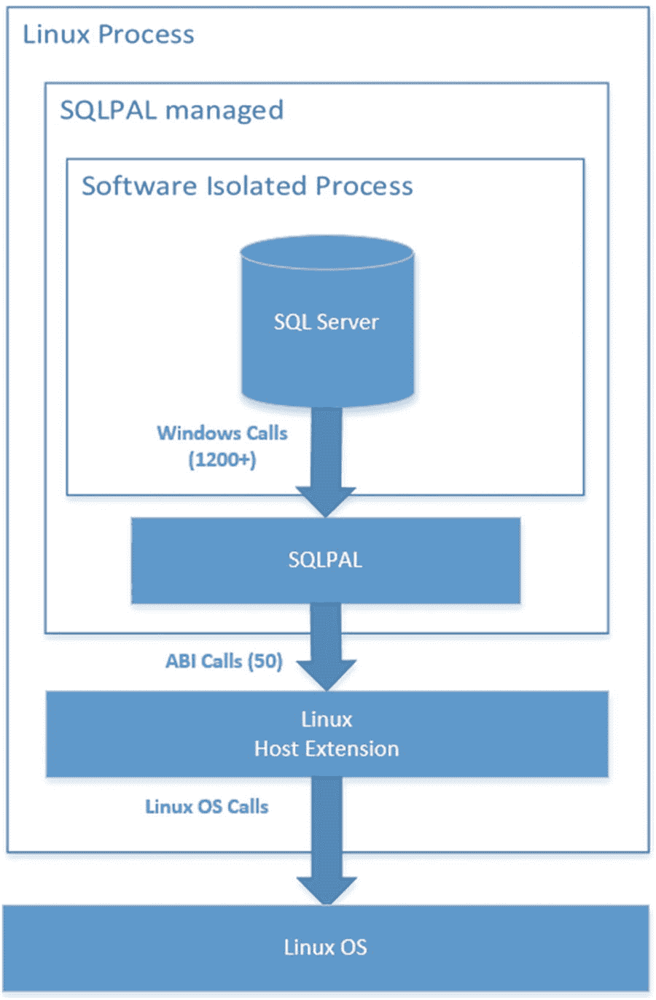
> 
> 图 11-2：SQL Server on Linux 的层交互框图。SQL Server 向 SQLPAL 发出 1200 多个 Windows 调用，SQLPAL 再向 Linux 宿主扩展发出 50 个 ABI 调用。宿主随后调用 Linux OS。
> 
> **图 11-2**：SQL-on-Linux 上的 PAL 层交互

更多关于 `SQLPAL` 的功能和设计选择的信息可以在各种微软博客上找到。推荐一篇名为“SQL Server on Linux: How? Introduction”的文章，链接为 [`https://slrwnds.com/8ldyuz`](https://slrwnds.com/8ldyuz)。

在本章的剩余部分，我将仅提及由 Windows 操作系统使用的函数。如果您在 Linux 上运行 SQL Server，请记住本章描述的功能在 Linux 上由 `SQLPAL` 处理，但其功能与在 Windows 上相同。

### PREEMPTIVE_OS_ENCRYPTMESSAGE 和 PREEMPTIVE_OS_DECRYPTMESSAGE

本章的第一个抢占式等待类型是 `PREEMPTIVE_OS_ENCRYPTMESSAGE` 和 `PREEMPTIVE_OS_DECRYPTMESSAGE`。顾名思义，这些函数与通过操作系统加密或解密消息相关。

#### PREEMPTIVE_OS_ENCRYPTMESSAGE 和 PREEMPTIVE_OS_DECRYPTMESSAGE 等待类型是什么？

如前一节所述，`PREEMPTIVE_OS_ENCRYPTMESSAGE` 和 `PREEMPTIVE_OS_DECRYPTMESSAGE` 等待类型与消息的加密和解密相关。更具体地说，它们与加密和解密进出 SQL Server 实例的网络流量相关。其中一个使用场景是当您使用证书连接到 SQL Server 实例以加密客户端和 SQL Server 实例之间发送的数据时。在这种情况下，SQL Server 将访问 Windows 操作系统来执行发送给客户端的消息的加密，或解密从客户端接收的消息。这种加密和解密并不发生在 SQL Server 内部，这与例如`透明数据加密`（Transparent Data Encryption, `TDE`）不同，后者加密/解密过程完全在 SQL Server 内部进行。

`PREEMPTIVE_OS_ENCRYPTMESSAGE` 和 `PREEMPTIVE_OS_DECRYPTMESSAGE` 这两种等待类型不一定表示任何性能问题。它们只是表明正在使用加密功能，因此实际上不需要对这些等待类型进行故障排除。加密和解密消息的开销很小，很少会引起严重问题（我尚未遇到过因使用证书连接到 SQL Server 而导致性能问题的案例，但我想一切皆有可能）。

#### PREEMPTIVE_OS_ENCRYPTMESSAGE 和 PREEMPTIVE_OS_DECRYPTMESSAGE 示例

为了展示 `PREEMPTIVE_OS_ENCRYPTMESSAGE` 和 `PREEMPTIVE_OS_DECRYPTMESSAGE` 这两种等待类型的示例，我们将配置一个证书，用于加密到 SQL Server 的连接。为了使这个示例可复现，我包含了创建自签名证书的步骤。通常，在生产环境中，你会使用由证书颁发机构签发的证书，但对于测试目的，自签名证书是可以的。

本例的第一步是在我的测试虚拟机上安装 Internet 信息服务 (IIS)。IIS 使得生成自签名证书变得非常简单。

IIS 安装完成后，从管理工具中打开 IIS 管理器。然后点击你的机器名称，并在功能视图中选择“服务器证书”选项，如图 11-3 所示。

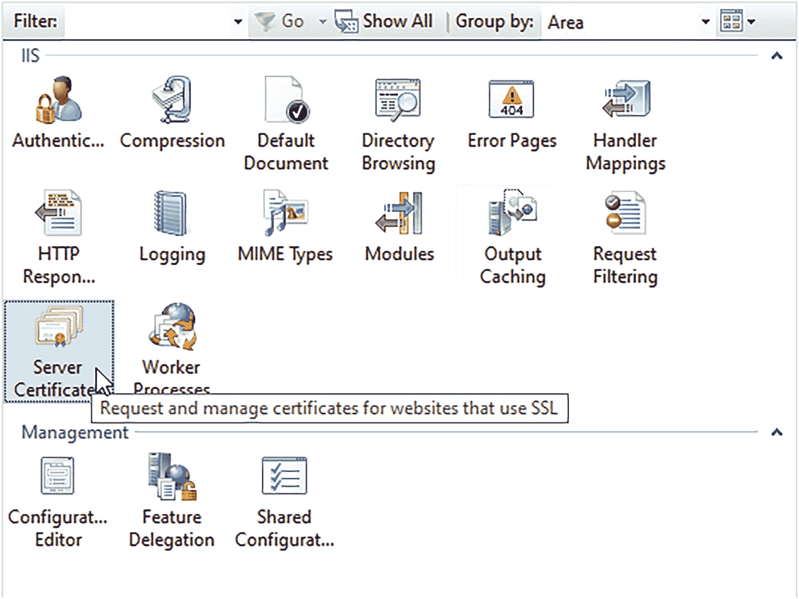

一个 IIS 管理器窗口的截图。它在 IIS 部分下显示了多个图标，其中服务器证书图标被选中。下方是包含 3 个图标的管理部分。
**图 11-3**
IIS 管理器内的功能视图

这会在 IIS 管理器内打开一个新的“服务器证书”视图。在操作窗格中，点击“创建自签名证书”选项。我们需要为证书命名，因此我填写了我的测试虚拟机名称，如图 11-4 所示。

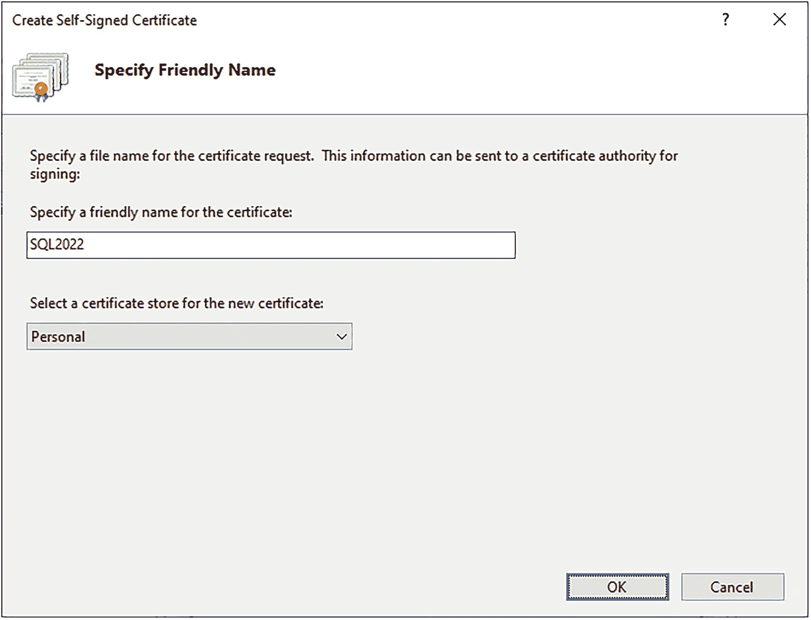

一个创建自签名证书窗口的截图。一个标签为“为此证书指定一个友好名称”的文本框中填写了文本“SQL 2022”。一个用于为新证书选择证书存储的下拉框选择了“个人”选项。
**图 11-4**
创建自签名证书

点击“确定”，自签名证书即被创建并自动放置在我计算机上的正确证书存储中（本地计算机 ➤ 个人 ➤ 证书）。

现在，自签名证书已在证书存储中，我们需要验证运行 SQL Server 服务的帐户是否具有访问证书的权限。我通过点击“开始” ➤ “运行”，输入 `MMC` 并点击“确定”来打开 Microsoft 管理控制台 (`MMC`)。在 `MMC` 控制台打开后，通过点击“文件” ➤ “添加/删除管理单元”，选择“证书”管理单元，然后点击“添加”来添加证书管理单元。当提示选择要管理证书的帐户时，我选择“计算机帐户”，如图 11-5 所示，然后点击“下一步”并“完成”。

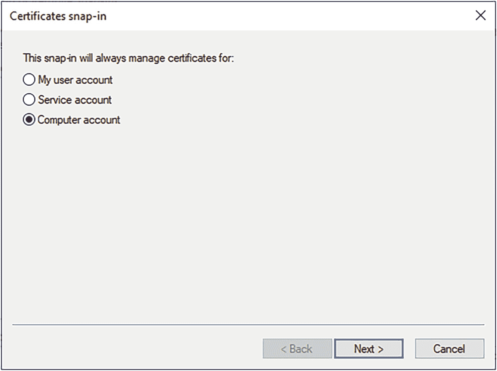

一个标有“证书管理单元”的窗口截图。它有 3 个选项来管理证书，其中“计算机帐户”单选按钮被选中，并且下方的“下一步”按钮高亮显示。其他 2 个选项是“我的用户帐户”和“服务帐户”。
**图 11-5**
证书帐户选择

在“证书”控制台中，打开文件夹“证书（本地计算机）” ➤ “个人” ➤ “证书”。如果 IIS 中的自签名证书生成正确，我应该能在这里看到该证书。图 11-6 显示了我的测试虚拟机上的证书。

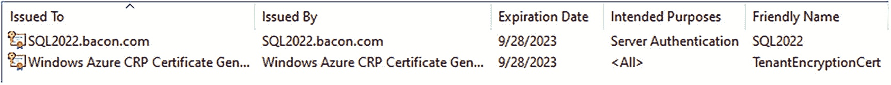

一个列表的截图。它有 5 列：颁发给、颁发者、到期日、预期目的和友好名称。有两行填写了各列下的详细信息。
**图 11-6**
自签名证书

右键单击自签名证书并选择“所有任务” ➤ “管理私钥”。将打开一个权限对话框。添加运行 SQL Server 服务所使用的帐户。如果你的 SQL Server 服务在另一个帐户下运行，该帐户只需要对证书具有读取权限，如图 11-7 所示。

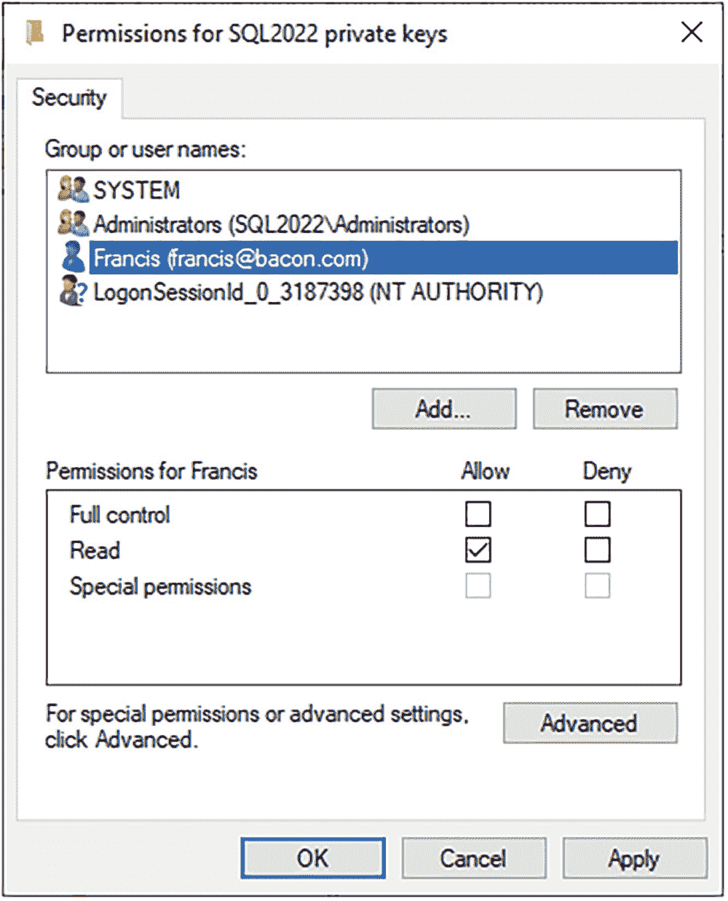

一个标有“SQL 2022 私钥的权限”的窗口截图。在“安全”选项卡下，列出了组或用户名称，其中 Francis 被选中。“权限”部分有 3 行，每行有用于“允许”和“拒绝”列的复选框。
**图 11-7**
自签名证书权限

添加帐户并选择正确的权限后，点击“确定”关闭对话框。权限正确且 SQL Server 服务帐户能够访问证书后，将自签名证书添加到 SQL Server 实例的网络配置中。打开 SQL Server 配置管理器，点击“SQL Server 网络配置”选项。右键单击 SQL Server 实例并选择“属性”。接着，打开“证书”选项卡并选择之前创建的自签名证书。图 11-8 显示了我测试虚拟机上的对话框。

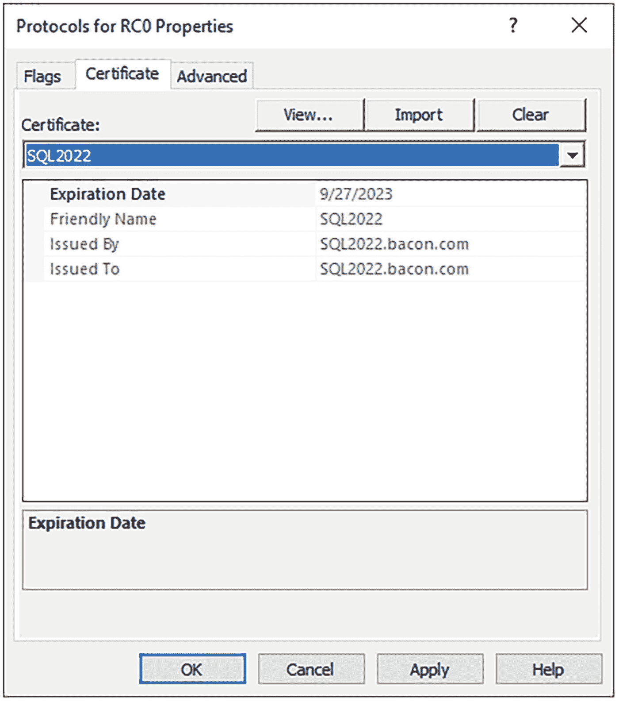

一个标有“RC0 的协议属性”的窗口截图。在证书选项卡下，选择了“SQL 2022”，下方有详细信息。其他选项卡是“标志”和“高级”。
**图 11-8**
证书选择

选择自签名证书后，点击“确定”关闭对话框。系统通知证书将在 SQL Server 服务重启后生效，因此我们执行 SQL Server 服务的重启。

现在 SQL Server 可以使用自签名证书了，但为了确保我的网络消息是加密的，我必须连接到 SQL Server 实例并告诉它我要使用加密。对于本例，我将使用与 SQL Server 实例同一虚拟机上的 SQL Server Management Studio (`SSMS`) 来连接到 SQL Server 实例。如果你从另一台机器连接到 SQL Server 实例，你需要确保自签名证书在那台机器上可用。当 `SSMS` 中出现“连接到服务器”对话框时，我点击对话框右下角的“选项”按钮。这会打开与我的 SQL Server 实例连接的附加属性。我选择“加密连接”复选框，如图 11-9 所示，然后连接到我的 SQL Server 实例。

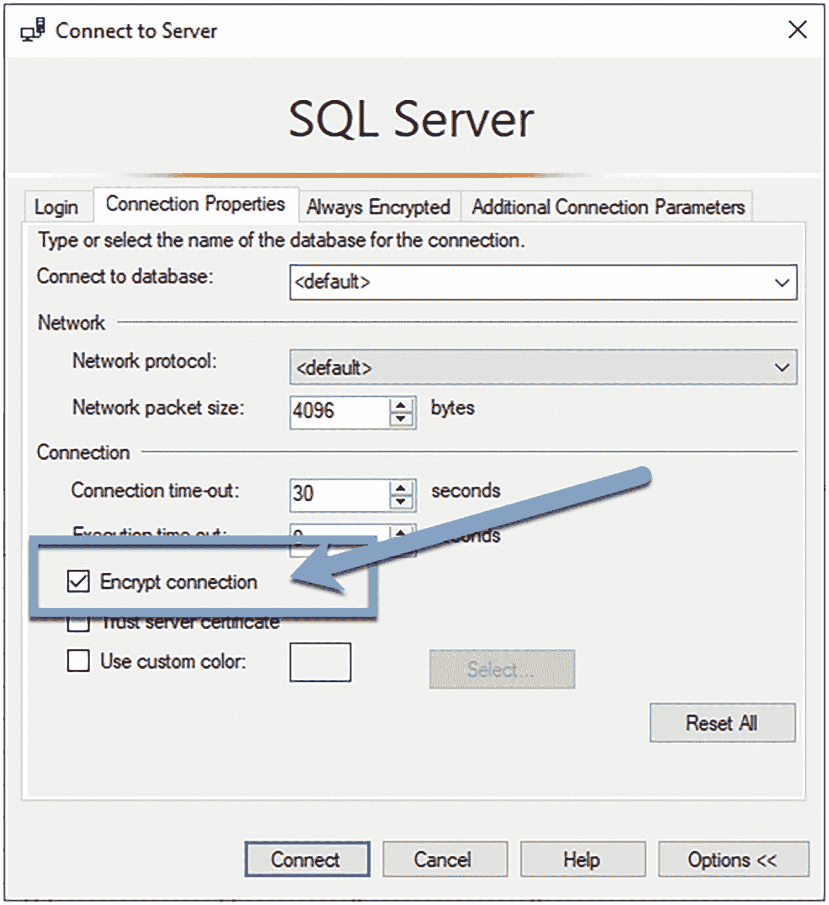

一个标有“连接到服务器”的窗口截图。在“连接属性”选项卡下，一个箭头指示了已勾选的“加密连接”复选框。“网络”和“连接”部分列出了选项，以及一个标有“连接到数据库”的下拉框。
**图 11-9**
SQL Server Management Studio 中的连接属性

现在，我们已经配置好了所有确保 SQL Server 将使用自签名证书加密 SQL Server 实例与 `SSMS` 之间消息的必要设置，因此我们最终可以来看看 `PREEMPTIVE_OS_ENCRYPTMESSAGE` 和 `PREEMPTIVE_OS_DECRYPTMESSAGE` 等待类型了！

生成 `PREEMPTIVE_OS_ENCRYPTMESSAGE` 和 `PREEMPTIVE_OS_DECRYPTMESSAGE` 等待非常简单。我现在从 `SSMS` 执行的每个查询都将被加密，即使我在与 SQL Server 实例相同的机器上运行 `SSMS`。我使用清单 11-1 中的查询来重置 `sys.dm_os_wait_stats` DMV，连接到 `GalacticWorks` 数据库，执行一个简单查询，然后查看发生在 `PREEMPTIVE_OS_ENCRYPTMESSAGE` 和 `PREEMPTIVE_OS_DECRYPTMESSAGE` 等待类型上的等待。

```
DBCC SQLPERF('sys.dm_os_wait_stats', CLEAR);
USE GalacticWorks;
SELECT *
FROM Sales.SalesOrderDetail;
SELECT *
FROM sys.dm_os_wait_stats
WHERE wait_type = 'PREEMPTIVE_OS_ENCRYPTMESSAGE'
OR wait_type = 'PREEMPTIVE_OS_DECRYPTMESSAGE';
```
**清单 11-1** 使用加密连接的查询

这些查询在 my 测试 SQL Server 实例上的结果如图 11-10 所示。

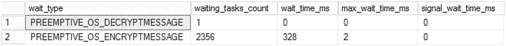


## PREEMPTIVE_OS_ENCRYPTMESSAGE 和 PREEMPTIVE_OS_DECRYPTMESSAGE 等待

一张 SQL Server 结果窗口的截图，包含 2 行 6 列。它列出了等待类型、等待任务计数、等待时间、最大等待时间和信号等待时间。其中，等待类型“preemptive OS decrypt message”被选中。

图 11-10

如你所见，`PREEMPTIVE_OS_ENCRYPTMESSAGE` 等待类型有更多的等待次数和等待时间与之关联。这是合理的，因为我执行了一个 `SELECT` 查询，它需要解密来自客户端的确认网络消息。查询的结果由 SQL Server 加密，这导致了在 `PREEMPTIVE_OS_ENCRYPTMESSAGE` 等待类型上更高的等待。

#### 降低 PREEMPTIVE_OS_ENCRYPTMESSAGE 和 PREEMPTIVE_OS_DECRYPTMESSAGE 等待

在正常情况下，应该没有必要特意去关注降低 `PREEMPTIVE_OS_ENCRYPTMESSAGE` 和 `PREEMPTIVE_OS_DECRYPTMESSAGE` 等待类型。它们表明加密正在进行，这很可能是在配置 SQL Server 实例时做出的选择。禁用加密会降低 `PREEMPTIVE_OS_ENCRYPTMESSAGE` 和 `PREEMPTIVE_OS_DECRYPTMESSAGE` 等待时间，但代价是安全性的降低。

#### PREEMPTIVE_OS_ENCRYPTMESSAGE 和 PREEMPTIVE_OS_DECRYPTMESSAGE 总结

`PREEMPTIVE_OS_ENCRYPTMESSAGE` 和 `PREEMPTIVE_OS_DECRYPTMESSAGE` 等待类型表明在 SQL Server 实例和客户端之间正在进行加密。这些等待类型通常可以忽略，因为它们并不直接指示性能问题。可以通过禁用加密的使用来降低它们，但这会牺牲安全性。

## PREEMPTIVE_OS_WRITEFILEGATHER

`PREEMPTIVE_OS_WRITEFILEGATHER` 等待类型与存储交互相关，更具体地说是通过 Windows 操作系统写入文件。

#### 什么是 PREEMPTIVE_OS_WRITEFILEGATHER 等待类型？

`PREEMPTIVE_OS_WRITEFILEGATHER` 等待类型与 Windows 操作系统内部的 `WriteFileGather` 函数相关。根据 Books Online 中对该函数的定义，“从缓冲区数组检索数据并将数据写入文件”，从这个描述来看，我们假设当 SQL Server 需要将数据写入文件时会调用此函数。然而，这并不涵盖 SQL Server 内部的每一个存储子系统写入操作。通常，SQL Server 不需要离开其自身引擎去等待一个抢占式操作。然而，存在一些例外情况，这会导致 `PREEMPTIVE_OS_WRITEFILEGATHER` 等待（取决于用于执行存储子系统交互的 Windows 函数）。SQL Server 内部的一个特定操作将始终导致 `PREEMPTIVE_OS_WRITEFILEGATHER` 等待，那就是数据文件的增长。每当 SQL Server 需要增长数据文件时，它会在存储子系统上分配额外的空间并将新空间“清零”。额外空间的分配不是在 SQL Server 引擎内部完成的；因此，发生了一个抢占式操作，这导致了对 `WriteFileGather` 函数的抢占式等待。

#### PREEMPTIVE_OS_WRITEFILEGATHER 示例

为了展示一个发生 `PREEMPTIVE_OS_WRITEFILEGATHER` 等待的例子，让我们使用上一节描述的情况，即增长数据库数据文件。对于这个示例，我将还原 `GalacticWorks` 数据库的备份，该数据库有一个大小为 194 MB 的数据库数据文件，如图 11-11 所示。

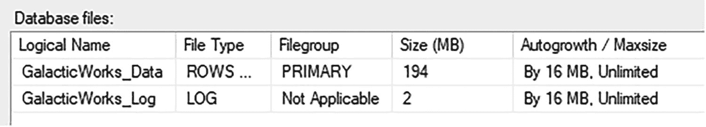

一个标有“数据库文件”的窗口截图，包含 2 行 5 列。它列出了数据库文件及其详细信息、逻辑名称、文件类型、文件组、大小、自动增长或最大大小。

图 11-11

GalacticWorks 的默认数据库文件配置

我将把唯一的数据库数据文件增长到 10 GB 的大小。由于数据文件所需的额外空间分配是在 SQL Server 之外执行的，这应该会导致 `PREEMPTIVE_OS_WRITEFILEGATHER` 等待。

> **极客笔记**
>
> 此示例依赖于“即时文件初始化”选项被禁用。更多内容将在下一节介绍。但在尝试此示例之前，有必要在此提及。

为了执行扩增数据库数据文件的操作，我使用了清单 11-2 中显示的脚本。此脚本将清除 `sys.dm_os_wait_stats` DMV，扩增 `GalacticWorks` 数据文件，然后查询 `sys.dm_os_wait_stats` DMV 中的 `PREEMPTIVE_OS_WRITEFILEGATHER`。

```
DBCC SQLPERF('sys.dm_os_wait_stats', CLEAR);
USE [master];
ALTER DATABASE [GalacticWorks]
MODIFY FILE
(NAME = N'GalacticWorks_Data',
SIZE = 10240000KB);
SELECT *
FROM sys.dm_os_wait_stats
WHERE wait_type = 'PREEMPTIVE_OS_WRITEFILEGATHER';
清单 11-2
扩增 AdventureWorks 数据库数据文件
```

在我的测试 SQL Server 实例上，清单 11-2 中的查询几乎瞬间完成；它的存储速度非常快，对于 `PREEMPTIVE_OS_WRITEFILEGATHER` 等待类型，产生了如图 11-12 所示的等待信息。


一个 SQL Server 结果窗口截图，包含 6 列和 1 行。它列出的等待类型为 preemptive O S write file gather，等待任务计数为 1，等待时间（毫秒）为 447，最大等待时间（毫秒）为 447，信号等待时间（毫秒）为 0。

图 11-12

`PREEMPTIVE_OS_WRITEFILEGATHER` 等待

请注意，在 `PREEMPTIVE_OS_WRITEFILEGATHER` 等待类型上只有一次等待，其持续时间实际上与执行数据文件扩增操作所花费的时间一样长。


#### 降低 `PREEMPTIVE_OS_WRITEFILEGATHER` 等待

当你发现 `PREEMPTIVE_OS_WRITEFILEGATHER` 等待类型的等待时间高于正常水平时，这意味着 SQL Server 内部的一个进程正在通过 Windows 操作系统对存储子系统执行操作。首要任务应是调查是什么进程发起了导致 `PREEMPTIVE_OS_WRITEFILEGATHER` 等待的操作。很多时候，这可能是数据库数据文件或日志文件的（自动）增长。如果你允许数据或日志文件自动增长，那么你应该预计到每当发生自动增长事件时，就会出现 `PREEMPTIVE_OS_WRITEFILEGATHER` 等待。这不一定意味着存在问题，但如果自动增长事件因为存储子系统出现性能问题等原因而需要很长时间才能完成，你的查询也可能经历性能下降。

有一个 Windows 设置我经常看到未配置，那就是**即时文件初始化**。我们已经在第 6 章“与 I/O 相关的等待类型”中关于 `ASYNC_IO_COMPLETION` 等待类型的部分讨论过这个设置以及如何启用它，因此这里不再赘述如何启用该设置的细节。图 11-13 展示了启用了即时文件初始化后，清单 11-2 中查询的结果。如你所见，花在 `PREEMPTIVE_OS_WRITEFILEGATHER` 等待类型上的等待时间完全消失了。


一张 SQL Server 结果窗口的截图，包含 6 列和 1 行。其中列出的等待类型为 preemptive O S write file gather，等待任务计数为 0，等待时间毫秒为 0，最大等待时间毫秒为 0，信号等待时间毫秒为 0。

图 11-13
开启即时文件初始化后的 `PREEMPTIVE_OS_WRITEFILEGATHER` 等待

除了使用即时文件初始化，存储子系统的性能在 `PREEMPTIVE_OS_WRITEFILEGATHER` 等待时间中也扮演着重要角色。你的存储子系统性能越好，`PREEMPTIVE_OS_WRITEFILEGATHER` 等待类型的等待时间就越低。

另一个可能导致 `PREEMPTIVE_OS_WRITEFILEGATHER` 等待时间高于正常水平的 SQL Server 操作是执行数据库还原。与扩展数据文件非常相似，在 SQL Server 能够还原数据库之前，它需要为其分配可用存储空间。这也与即时文件初始化相关，后者将同样加快数据库还原的速度，就像加快文件扩展一样。

#### `PREEMPTIVE_OS_WRITEFILEGATHER` 总结

`PREEMPTIVE_OS_WRITEFILEGATHER` 等待类型表明 SQL Server 正在请求 Windows 操作系统对存储子系统执行一项操作。并非所有操作都在 SQL Server 引擎和动作内部处理；例如，数据文件的增长需要执行一个 Windows 函数来在存储子系统上分配所需的空间。即时文件初始化是 Windows 中的一个设置，可以大幅减少 `PREEMPTIVE_OS_WRITEFILEGATHER` 的等待时间，但存储子系统本身的性能在 `PREEMPTIVE_OS_WRITEFILEGATHER` 等待时间中也起着重要作用。

### `PREEMPTIVE_OS_AUTHENTICATIONOPS`

`PREEMPTIVE_OS_AUTHENTICATIONOPS` 与安全交互相关，在操作系统级别等待以验证用户或登录名。

#### 什么是 `PREEMPTIVE_OS_AUTHENTICATIONOPS` 等待类型？

每当 SQL Server 执行账户验证时，例如当 Windows 登录名连接到 SQL Server 时验证该登录名，就会记录 `PREEMPTIVE_OS_AUTHENTICATIONOPS` 等待类型。看到 `PREEMPTIVE_OS_AUTHENTICATIONOPS` 等待发生是预料之中的事，尤其是在 SQL Server 实例中使用混合模式验证和 Windows 登录名时。

关于 `PREEMPTIVE_OS_AUTHENTICATIONOPS` 等待类型的一个常见误解是，它只与域内使用 Windows 身份验证的 SQL Server 登录名有关。这并不完全正确。虽然当使用 Active Directory 账户连接到 SQL Server 时，`PREEMPTIVE_OS_AUTHENTICATIONOPS` 等待时间确实通常会更高，但如果 SQL Server 实例安装在域外的机器上，`PREEMPTIVE_OS_AUTHENTICATIONOPS` 等待也会发生；不过等待时间通常会低一些。

图 11-14 展示了 SQL Server 如何连接到 Active Directory 域控制器来验证 SQL Server Windows 登录名的简化图示。请记住，是 Windows 操作系统负责处理域控制器与 SQL Server 之间的通信，因此属于**抢占式**等待类型。

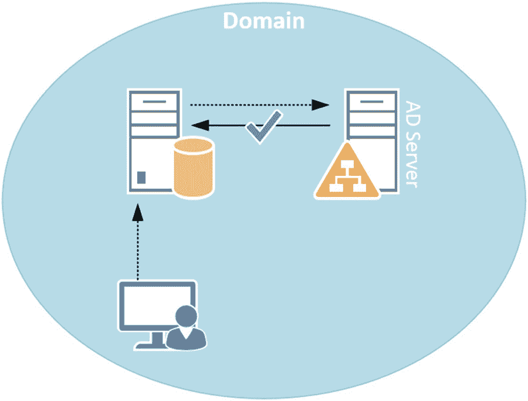
一张示意图描绘了一个域内用户通过本地服务器登录到 AD 服务器的过程。

图 11-14
域内的 SQL Server Windows 登录名验证

在安装了 SQL Server 实例但不属于域的机器上，Windows 登录名的验证将在机器本身（本地账户）上进行。

因为通常通过域控制器验证 Windows 登录名需要更长时间（请求需要通过网络传输并在另一台机器上进行验证），所以位于域内的 SQL Server 实例的 `PREEMPTIVE_OS_AUTHENTICATIONOPS` 等待类型的等待时间通常会更高。


#### PREEMPTIVE_OS_AUTHENTICATIONOPS 示例

要生成一个 `PREEMPTIVE_OS_AUTHENTICATIONOPS` 等待发生的示例，我们不需要执行任何复杂的操作。使用 Windows 身份验证打开一个到 SQL Server 实例的新连接就足够了。一种便于测量的方法是使用 SQL Server Management Studio (SSMS) 通过 Windows 身份验证连接到 SQL Server 实例。图 11-15 显示了 SSMS 连接到我的测试 SQL Server 实例的对话框。请注意，我的测试 SQL Server 实例不在域内，我使用的是本机的本地管理员账户进行连接。

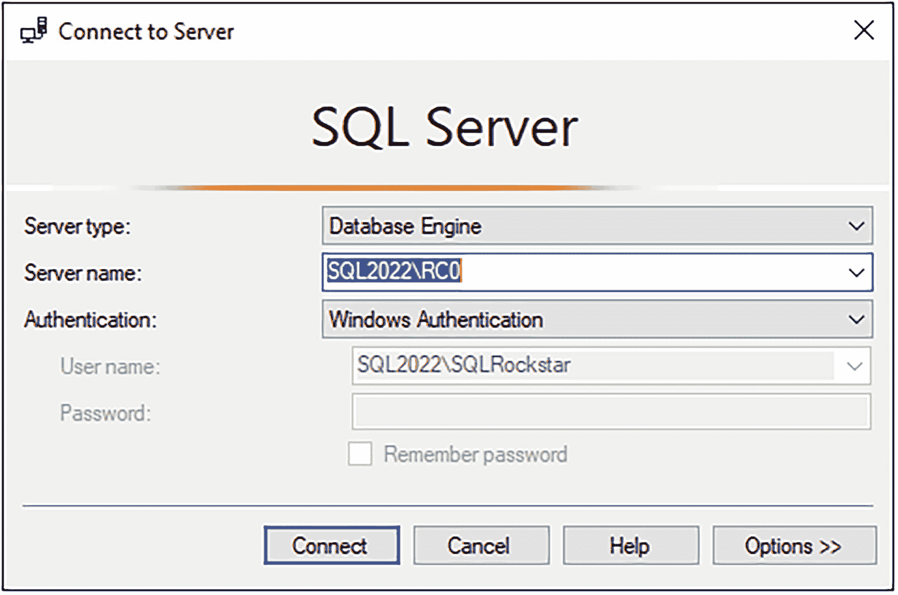

一个标有“连接到服务器”的窗口截图。标题是 SQL Server，带有三个下拉框。服务器类型是数据库引擎，服务器名称是 `SQL 2022\RC0`，身份验证是 Windows 身份验证。下面的用户名和密码框未激活。

图 11-15

使用本地 Windows 身份验证连接 SQL Server Management Studio

我执行的下一步是在 SSMS 中打开一个新的查询窗口，并在清单 11-3 所示的查询中执行步骤。

```
-- 步骤 1 清除 sys.dm_os_wait_stats
DBCC SQLPERF('sys.dm_os_wait_stats', CLEAR);
-- 步骤 2 在 SQL Server Management Studio 中打开一个新的查询窗口
-- 步骤 3 回到此查询窗口并运行下面的查询
SELECT *
FROM sys.dm_os_wait_stats
WHERE wait_type = 'PREEMPTIVE_OS_AUTHENTICATIONOPS';
```
清单 11-3
生成 `PREEMPTIVE_OS_AUTHENTICATIONOPS` 等待

如果你按照清单 11-3 脚本中注释的步骤操作，在运行步骤 3 中的查询后，你应该会看到 `PREEMPTIVE_OS_AUTHENTICATIONOPS` 等待发生。图 11-16 显示了在我的测试机器上运行步骤 3 查询的结果。

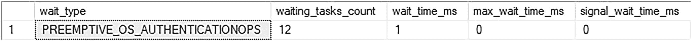

一个 SQL Server 结果窗口截图，有 6 列和 1 行。其值为：等待类型 `preemptive_os_authentication_ops`，等待任务计数 `12`，等待时间 `1` 毫秒，最大等待时间 `0` 毫秒，信号等待时间 `0` 毫秒。

图 11-16

`PREEMPTIVE_OS_AUTHENTICATIONOPS` 等待

如你所见，发生的等待次数及其等待时间都非常低。这个示例的重点不是向你展示非常高的 `PREEMPTIVE_OS_AUTHENTICATIONOPS` 等待时间，而是展示它们如何在连接到 SQL Server 实例时自然发生。因为我在 SSMS 中打开了一个新的查询窗口，所以将使用我连接 SQL Server 实例所用的 Windows 登录账户建立一个到 SQL Server 实例的新连接。由于这是一个新连接，用于连接的账户必须经过身份验证，从而导致了 `PREEMPTIVE_OS_AUTHENTICATIONOPS` 等待。

#### 降低 PREEMPTIVE_OS_AUTHENTICATIONOPS 等待

在示例中，我们看到了每当连接到 SQL Server 实例时，`PREEMPTIVE_OS_AUTHENTICATIONOPS` 等待是如何自然发生的。现在想象一种情况：你的 SQL Server 实例是域环境的一部分，并且它使用 Windows 身份验证通过 Active Directory 对域用户（或组）进行身份验证。在这种情况下，你的身份验证请求将通过网络进行以执行登录账户的身份验证。有许多因素会影响身份验证请求的速度；例如，如果你的域控制器压力很大，执行身份验证可能需要更长时间，或者如果你的网络性能下降，也会影响身份验证请求。这些因素也会导致 `PREEMPTIVE_OS_AUTHENTICATIONOPS` 等待类型，并可能导致更高的等待时间。

我想向你描述一个我在客户那里遇到的涉及 `PREEMPTIVE_OS_AUTHENTICATIONOPS` 等待类型的案例，让你了解如何降低 `PREEMPTIVE_OS_AUTHENTICATIONOPS` 等待时间。

在这个客户那里，他们使用一个应用程序，该应用程序使用运行该应用程序的计算机上登录的 Windows 账户连接到 SQL Server。这些计算机和 SQL Server 都是域的一部分。从安全角度来看，该应用程序设计良好，因为它不需要单独的 SQL Server 用户（这些用户需要数据库权限），也不使用通用账户连接到 SQL Server 实例并执行查询。在内部，特定于数据库的对象（如表）也是基于域用户和组进行保护的。

在将该应用程序部署到公司内每台（超过 3000 台）计算机后，客户端开始遇到服务器性能问题。客户的 DBA 没有发现任何问题，SQL Server 实例上没有基础设施相关的性能问题，在 SQL Server 实例本身执行查询也未发现问题。当我们查看等待统计时，我们注意到最普遍的等待类型是 `PREEMPTIVE_OS_AUTHENTICATIONOPS` 等待类型。我们还注意到，该应用程序会连接到 SQL Server 实例，运行一个查询，然后再次断开连接。由于如此多的并发用户在使用该应用程序，导致大量的 Windows 身份验证请求，多到域控制器无法处理，从而导致身份验证请求处理变慢。

在这个案例中，域控制器是一台虚拟机，在增加了更多处理器和内存资源后，它就能够跟上大量的身份验证请求。

从这个例子可以看出，看到较高的 `PREEMPTIVE_OS_AUTHENTICATIONOPS` 等待时间并不一定意味着你的 SQL Server 实例遇到了问题，尤其是在域环境中，因为域控制器的性能在 `PREEMPTIVE_OS_AUTHENTICATIONOPS` 等待时间中也扮演着重要角色。

这个故事的寓意是，如果你注意到高于正常水平的 `PREEMPTIVE_OS_AUTHENTICATIONOPS` 等待时间，你需要调查的不仅仅是 SQL Server 实例。如果你在域中使用 Windows 身份验证，请务必检查域控制器的性能。检查 SQL Server 实例和域控制器之间的每个基础设施部分，如网络交换机、防火墙等。所有这些基础设施部分都会为每个身份验证请求增加额外的延迟，这将导致更高的 `PREEMPTIVE_OS_AUTHENTICATIONOPS` 等待时间，使其成为一个难以排查的等待类型。

#### PREEMPTIVE_OS_AUTHENTICATIONOPS 总结

`PREEMPTIVE_OS_AUTHENTICATIONOPS` 等待类型与 Windows 操作系统执行身份验证请求有关。看到 `PREEMPTIVE_OS_AUTHENTICATIONOPS` 等待发生是正常的，特别是当你的 SQL Server 实例是域的一部分并使用 Windows 身份验证对用户进行身份验证时。高于正常水平的等待时间可能表明身份验证请求完成所需的时间比正常情况长。这并不一定意味着你的 SQL Server 实例遇到了性能问题。如果域控制器无法足够快地处理身份验证请求，将会导致更高的 `PREEMPTIVE_OS_AUTHENTICATIONOPS` 等待时间。到域控制器的网络连接缓慢、防火墙或交换机配置也会影响 `PREEMPTIVE_OS_AUTHENTICATIONOPS` 等待时间。


## PREEMPTIVE_OS_GETPROCADDRESS

本章最后一个等待类型是 **PREEMPTIVE_OS_GETPROCADDRESS**。`PREEMPTIVE_OS_GETPROCADDRESS` 等待类型与 SQL Server 内部执行扩展存储过程相关。

扩展存储过程允许您使用 T-SQL 以外的语言（例如 C# 编程语言）创建外部例程。这些扩展存储过程使用 `.dll` 文件加载到 SQL Server 中，通过允许执行 T-SQL 无法实现的操作（如读写 Windows 注册表项）来扩展 SQL Server 编程能力。

自 SQL Server 2008 起，扩展存储过程已被标记为不推荐使用，应改用公共语言运行时（CLR）。然而，SQL Server 内部仍存在一些需要扩展存储过程的场景，并且一些第三方软件供应商仍然依赖它们。

#### 什么是 PREEMPTIVE_OS_GETPROCADDRESS 等待类型？

每当加载扩展存储过程内的入口点时，就会记录 `PREEMPTIVE_OS_GETPROCADDRESS` 等待类型。每当 SQL Server 加载或卸载扩展存储过程的 `.dll` 文件时，都会调用该入口点。在正常情况下，入口点的加载应很快完成，导致 `PREEMPTIVE_OS_GETPROCADDRESS` 等待时间非常低。但是，根据扩展存储过程的不同（或与加载 `.dll` 文件相关的问题），可能会观察到更高的等待时间。`PREEMPTIVE_OS_GETPROCADDRESS` 等待类型记录的是加载 `.dll` 文件入口点所花费的时间，而不是扩展存储过程的执行时间。图 11-17 展示了 SQL Server 如何执行扩展存储过程的（简化）概览。

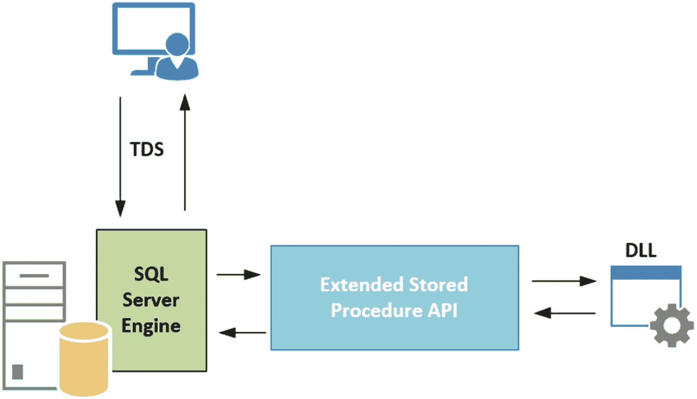

一个存储过程执行的流程图。用户向 SQL Server 引擎发送 TDS 信号，后者随后调用扩展存储过程 API 和 DLL。存储过程被执行，结果通过 SQL Server 引擎发送回用户。

**图 11-17**

执行扩展存储过程

除了编写您自己的自定义扩展存储过程外，SQL Server 还附带了许多扩展存储过程。其中大多数可以通过扩展存储过程名称中的 `xp_` 前缀来识别，尽管并非所有都有此前缀。图 11-18 展示了在我的测试 SQL Server 2022 RC0 实例的 `master` 数据库中，使用以下 T-SQL 查询到的 293 个扩展存储过程中的一部分：

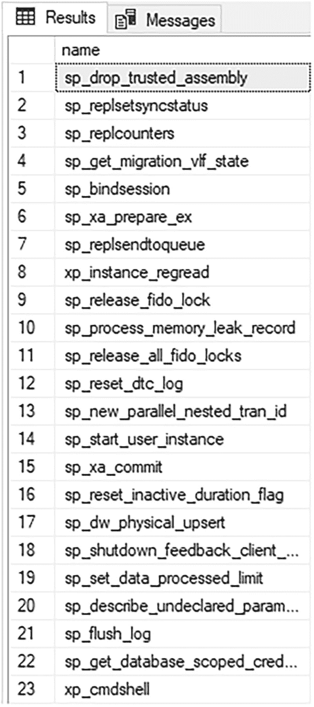

一个 SQL Server 结果窗口的截图，包含一个名称列，其中有 23 行存储过程名称。其中一些是 `sp_drop_trusted_assembly` 和 `sp_replsetsyncstatus`。

**图 11-18**

SQL Server 2022 RC0 `master` 数据库中的部分扩展存储过程

```sql
SELECT name
FROM master.dbo.sysobjects AS so
WHERE so.type = 'X';
```

可能最臭名昭著的扩展存储过程是 `xp_cmdshell`。`xp_cmdshell` 扩展存储过程使得可以从 SQL Server 内部在 Windows 命令 shell 中执行命令。如果您的 SQL Server 实例被入侵，这是一个巨大的安全风险，因为它提供了可能影响整个 Windows 操作系统的命令访问权限。幸运的是，默认情况下无法运行 `xp_cmdshell` 扩展存储过程；您必须通过配置高级配置设置来特别允许其使用。

#### PREEMPTIVE_OS_GETPROCADDRESS 示例

在本例中，我们执行 SQL Server 中已存在的一个扩展存储过程 `xp_getnetname`，而不是编写一个自定义扩展存储过程（这超出了本书范围）。`xp_getnetname` 是一个未公开的扩展存储过程，它返回托管您的 SQL Server 实例的机器的 NETBIOS 名称。在执行 `xp_getnetname` 扩展存储过程之前，我们先清除 `sys.dm_os_wait_stats` DMV，执行后，我们查询该 DMV 以获取 `PREEMPTIVE_OS_GETPROCADDRESS` 等待信息。清单 11-4 展示了我在测试 SQL Server 实例上执行的整个查询。

```sql
USE [master];
DBCC SQLPERF('sys.dm_os_wait_stats', CLEAR);
exec xp_getnetname;
SELECT *
FROM sys.dm_os_wait_stats
WHERE wait_type = 'PREEMPTIVE_OS_GETPROCADDRESS';
```

**清单 11-4**
执行 `xp_getnetname` 并查询等待统计信息

清单 11-4 中查询的结果可以在图 11-19 中看到。

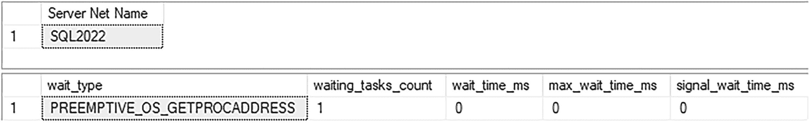

一个包含 2 个 SQL Server 结果窗口的截图。截图 1 有 1 列“server net name”，包含 1 行“SQL 2022”。截图 2 包含 `wait_type` 值为 `PREEMPTIVE_OS_GETPROCADDRESS`，以及 `waiting_tasks_count` 值为 1，而 `wait_time_ms`、`max_wait_time_ms` 和 `signal_wait_time_ms` 的值均为 0。

**图 11-19**

`PREEMPTIVE_OS_GETPROCADDRESS` 等待

结果并不惊人。显然，`xp_getnetname` 扩展存储过程在加载 `.dll` 入口点时没有引起任何问题，因为没有记录到等待时间。然而，等待仍然发生了；正如您在 `waiting_tasks_count` 列中看到的，SQL Server 加载入口点花费的时间少于一毫秒。

#### 降低 PREEMPTIVE_OS_GETPROCADDRESS 等待

由于 `PREEMPTIVE_OS_GETPROCADDRESS` 等待类型与执行扩展存储过程直接相关，您调查的第一步应该是检测是否正在执行扩展存储过程及其功能是什么。

我曾见过 `PREEMPTIVE_OS_GETPROCADDRESS` 等待的发生，是因为一个第三方备份应用程序使用扩展存储过程来执行数据库备份，但高 `PREEMPTIVE_OS_GETPROCADDRESS` 等待时间还有许多其他可能的原因。了解正在执行哪个扩展存储过程可以帮助您追踪执行该过程的进程。

在 SQL Server 2008 和 2008R2 中存在已知的错误，这些错误报告了高于正常的 `PREEMPTIVE_OS_GETPROCADDRESS` 等待时间，因为扩展存储过程的执行时间也被记录在等待时间中，而不仅仅是入口点加载。如果您仍在使用 SQL Server 2008 或 2008R2 并遇到非常高的 `PREEMPTIVE_OS_GETPROCADDRESS` 等待时间，升级到最新的 Service Pack 并检查 `PREEMPTIVE_OS_GETPROCADDRESS` 等待时间是否下降可能是值得的。或者更好的是，升级到更高版本的 SQL Server，因为 SQL Server 2008R2 已于 2019 年 7 月 9 日终止生命周期。

#### PREEMPTIVE_OS_GETPROCADDRESS 总结

`PREEMPTIVE_OS_GETPROCADDRESS` 等待类型与扩展存储过程的执行直接相关。扩展存储过程可以用多种编程语言（如 C#）编写，并允许您执行原本在 T-SQL 中不可能完成的操作。每当加载扩展存储过程 `.dll` 中的入口点时，就会记录 `PREEMPTIVE_OS_GETPROCADDRESS` 等待类型的等待时间。在正常情况下，`PREEMPTIVE_OS_GETPROCADDRESS` 等待类型的等待时间非常低。观察到较高的 `PREEMPTIVE_OS_GETPROCADDRESS` 等待时间可能表明入口点加载遇到问题。在 SQL Server 2008 和 2008R2 中，也存在与 `PREEMPTIVE_OS_GETPROCADDRESS` 等待类型计算相关的错误。如果您运行的是 SQL Server 2008 或 2008R2 并遇到高 `PREEMPTIVE_OS_GETPROCADDRESS` 等待时间，升级到最新的 Service Pack 或迁移到更高版本的 SQL Server 可能是值得的，因为 SQL Server 2008R2 已于 2019 年 7 月 9 日终止生命周期。


## 12. 背景与杂项等待类型

SQL Server 内部有不同的进程，到目前为止我们已经讨论了很多。其中一些内部进程在 SQL Server 内部持续运行，等待有工作分配给它们。当这些通常称为后台进程的进程在等待工作到来时，SQL Server 会将它们等待工作的时间记录为与这些后台进程相关的特定等待类型。虽然这些后台等待类型与性能问题没有直接关系，但它们通常具有最高的等待时间，并且当你按等待时间排序查询顶级等待类型时，它们会出现在列表顶部。

通常，这些后台等待类型可以安全地忽略，因为它们仅仅表明一个内部进程正在等待工作到来。这个逻辑对于我们在本章中讨论的等待类型同样适用，但我不仅仅是告诉你在分析等待统计信息时可以忽略它们，我还想提供一些关于它们的背景信息，让你了解它们衡量的是什么以及为什么可以安全地忽略。请记住，我们这里谈论的是 SQL Server，这意味着能否完全忽略这些后台等待类型“取决于”许多因素。你不会是第一个遇到性能问题，最后却发现是一个被忽略的后台进程导致了该问题的人。所以我的建议是：可以忽略，但不要忘记它们！

除了后台等待类型，我还添加了一些杂项等待类型，这些类型很难归类到之前的章节中，因为它们不太符合该章节的等待类型类别。

由于本章中的后台等待类型在其关联进程等待工作时会持续记录等待时间，因此我没有为这些等待类型包含示例部分或降低等待时间部分。

### CHECKPOINT_QUEUE

本章的第一个等待类型是那些会随时间积累大量等待时间的后台等待类型之一。`CHECKPOINT_QUEUE` 等待类型（在许多情况下）可以安全地忽略，但了解它代表什么以及为什么它有如此高的等待时间总没有坏处。

#### 什么是 CHECKPOINT_QUEUE 等待类型？

`CHECKPOINT_QUEUE` 等待类型是一种与 SQL Server 中检查点进程相关的后台等待，该进程负责将“脏”（已修改的）数据页从缓冲区缓存写入磁盘上的数据文件。在第 6 章 “与 IO 相关的等待类型” 中，我们在讨论 `SLEEP_BPOOL_FLUSH` 等待类型时回顾了检查点进程，因此这里不再重复所有信息。重要的是要了解，并且这也是该等待类型常被忽略的原因，即 `CHECKPOINT_QUEUE` 等待类型表明检查点进程正在等待工作。这意味着 `CHECKPOINT_QUEUE` 等待类型上的等待时间并不表示任何性能问题；它们只是表明检查点进程在等待工作上花费的时间。在不是非常繁忙或没有太多数据修改操作的 SQL Server 实例上，等待时间可能达到非常高的值。

在 `sys.dm_os_wait_stats` 和 `sys.dm_os_waiting_tasks` DMV 中记录 `CHECKPOINT_QUEUE` 等待时间的过程通过一个特定的内部例程进行，该例程可能返回意外的等待时间（例如基线内的突然峰值）。图 12-1 显示了在我的测试 SQL Server 实例上，针对 `sys.dm_os_wait_stats` 和 `sys.dm_os_waiting_tasks` DMV 查询 `CHECKPOINT_QUEUE` 等待类型信息的结果。

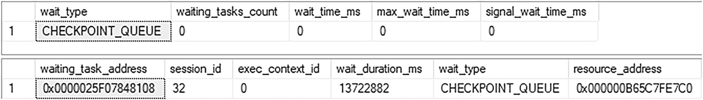

图 12-1: CHECKPOINT_QUEUE 等待

这里有趣的是，`sys.dm_os_wait_stats` DMV 中的累积等待时间保持为 0，而 `sys.dm_os_waiting_tasks` DMV 中的等待时间却非常高。我的测试 SQL Server 实例在后台没有执行太多工作，因此检查点进程大部分时间都在等待工作是合乎逻辑的。两个 DMV 之间等待时间差异的原因与 SQL Server 执行检查点操作的方式有关。两个 DMV 中显示的等待时间都是由自动检查点进程记录的。手动检查点执行不影响等待时间。作为自动检查点过程的一部分，`sys.dm_os_waiting_tasks` DMV 的等待时间会被转移到 `sys.dm_os_wait_stats` DMV 并重置为 0。因此，如果你在 `sys.dm_os_waiting_tasks` 中注意到非常高的 `CHECKPOINT_QUEUE` 等待时间，这意味着上一次自动检查点运行已经过去一段时间了。

为了演示这种行为，创建一个表，重置 `sys.dm_os_wait_stats` DMV，向表中插入几行，执行手动检查点，然后查询 `sys.dm_os_wait_stats` 和 `sys.dm_os_waiting_tasks` DMV，如清单 12-1 所示。

```
-- 在 GalacticWorks 数据库中创建一个表
USE [GalacticWorks];
CREATE TABLE check_test
(ID UNIQUEIDENTIFIER,
RandomData VARCHAR(50));
-- 清除 sys.dm_os_wait_stats
DBCC SQLPERF('sys.dm_os_wait_stats', CLEAR);
-- 向我们的表中插入几行数据
INSERT INTO check_test
(ID,
RandomData)
VALUES
(NEWID(),
CONVERT(varchar(50), NEWID()))
GO 100
CHECKPOINT 1;
-- 查询等待统计信息
SELECT *
FROM sys.dm_os_wait_stats
WHERE wait_type = 'CHECKPOINT_QUEUE';
SELECT *
FROM sys.dm_os_waiting_tasks
WHERE wait_type = 'CHECKPOINT_QUEUE';
```
清单 12-1: CHECKPOINT_QUEUE 示例

图 12-2 显示了针对 `sys.dm_os_wait_stats` 和 `sys.dm_os_waiting_tasks` DMV 查询的结果。

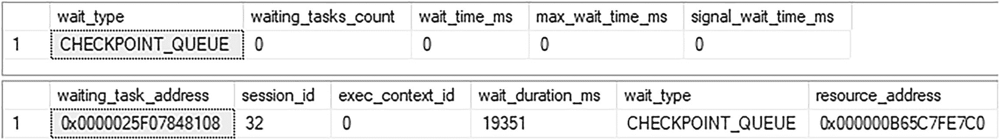

图 12-2: CHECKPOINT_QUEUE 等待

如你所见，手动检查点没有在 `sys.dm_os_wait_stats` DMV 中产生任何等待。同时，自动检查点也没有发生，因为插入 100 行产生的日志记录太少，不足以触发自动检查点。

如果我们插入更多行，应该能够触发自动检查点。在这种情况下，我运行了以下查询，向清单 12-1 中创建的表插入 100,000 行。在插入运行时，我反复查询 `sys.dm_os_wait_stats` 和 `sys.dm_os_waiting_tasks` DMV，看看是否有任何变化。请看：

```
INSERT INTO check_test
(ID,
RandomData)
VALUES
(NEWID(),
CONVERT(varchar(50), NEWID()))
GO 100000
```

几秒钟后，我注意到 `CHECKPOINT_QUEUE` 等待类型的等待时间被移到了 `sys.dm_os_wait_stats` DMV 中，如图 12-3 所示。

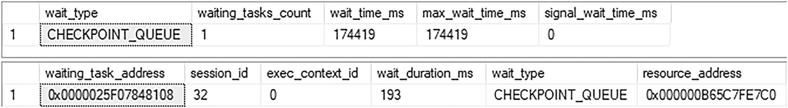

图 12-3: CHECKPOINT_QUEUE 等待

显然，我们插入了足够多的日志记录导致发生了自动检查点，并且从这个例子中你可以看到，只有自动检查点才会将 `CHECKPOINT_QUEUE` 的等待时间写入 `sys.dm_os_wait_stats` DMV。

当你在 `sys.dm_os_wait_stats` DMV 中注意到突然出现非常高的等待时间值时，你应该记住这种行为。这通常只会发生在工作负载非常小，或者工作负载主要由读取操作而非数据修改操作组成的 SQL Server 实例中。


#### CHECKPOINT_QUEUE 概述

`CHECKPOINT_QUEUE` 等待类型与 SQL Server 内部的检查点操作相关。当 SQL Server 正在等待自动检查点操作发生时，就会记录`CHECKPOINT_QUEUE`等待类型的等待时间。这通常是您可以安全忽略的一种等待类型，因为它不表示存在任何性能问题。`CHECKPOINT_QUEUE`等待类型的等待时间在`sys.dm_os_wait_stats`和`sys.dm_os_waiting_tasks`这两个 DMV 中的记录方式不同，这可能导致在查询`sys.dm_os_wait_stats` DMV 时出现突然的高等待时间。在注意到`sys.dm_os_wait_stats` DMV 中出现高`CHECKPOINT_QUEUE`等待时间时，请牢记此行为。

### DIRTY_PAGE_POLL

**`DIRTY_PAGE_POLL`**等待类型是 SQL Server 2012 引入间接检查点功能时新增的，其行为与我们前面讨论的等待类型`CHECKPOINT_QUEUE`非常相似。虽然自动检查点进程以设定的 1 分钟间隔运行，但间接检查点功能允许您为每个数据库配置特定的检查点间隔。即使您未使用间接检查点，`DIRTY_PAGE_POLL`等待类型仍会积累等待时间。

#### 什么是 DIRTY_PAGE_POLL 等待类型？

`DIRTY_PAGE_POLL`等待类型是另一种通常可以安全忽略的后台等待。`DIRTY_PAGE_POLL`与间接检查点功能使用的恢复写入器进程相关，该进程在 SQL Server 实例的后台持续运行。由于这种关联，让我们回顾一下间接检查点是什么以及它们如何工作。

SQL Server 内部的检查点进程负责将缓冲区缓存中修改过的数据页写入磁盘上的数据库数据文件。默认情况下，检查点进程每分钟自动运行一次，或者当生成了足够的日志记录时运行。检查点进程在 SQL Server 数据库崩溃时的恢复持续时间中起着至关重要的作用。例如，想象以下场景：当您在 SQL Server 实例中对数据库执行大量修改时，发生崩溃。幸运的是，您能够简单地重新启动 SQL Server 服务以使一切重新运行。SQL Server 将做的第一件事是启动一个恢复过程。恢复过程将检查事务日志中是否存在崩溃发生时未提交的任何事务，并对这些事务执行回滚。恢复过程还将检查已提交事务修改的任何数据页是否已在数据库数据文件中更新。

如果发现任何这样的页面，SQL Server 将使用事务日志重做这些事务。现在想象一下，您有一个繁忙的 SQL Server 实例，每分钟执行数千次修改。这意味着存在大量未写入磁盘的脏页的可能性很高。如果您的 SQL Server 随后崩溃（或者，例如，发生故障转移），恢复过程将需要更多时间来完成。间接检查点有助于尽可能缩短此恢复过程。通过配置此功能，我们告诉 SQL Server 更快地将修改的数据页写入磁盘，例如每 10 秒一次。图 12-4 显示了数据库属性中间接检查点功能的位置和名称。

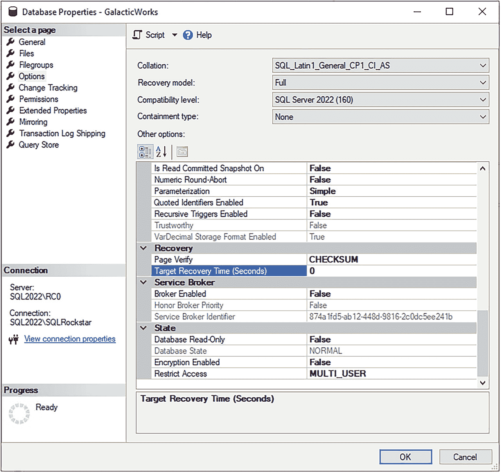

图 12-4 间接检查点功能的位置和值

默认情况下，“目标恢复时间（秒）”配置选项的值为 0。这意味着未使用间接检查点。如果将该值修改为 0 以外的任何值，则将在您指定的秒数间隔发生间接检查点。

注意

从 SQL Server 2016 开始，在 SQL Server 实例中创建新数据库时，会自动配置间接检查点。在这些情况下，“目标恢复时间（秒）”将设置为 60 而不是 0。

但是，在“目标恢复时间（秒）”选项中配置的时间并不意味着每 x 秒执行一次检查点进程。通过设置此值，SQL Server 将计算在需要写入数据库数据文件之前可以存在多少脏页，从而使恢复过程永远不会超过指定的时间。例如，如果您将“目标恢复时间（秒）”选项配置为 15 秒，SQL Server 将以这样的间隔将脏页写入数据库数据文件，以便在 SQL Server 实例发生故障时，可以在 15 秒内恢复。

为了监控缓冲区缓存中有多少脏页，以便 SQL Server 知道何时达到脏页阈值，引入了恢复写入器。即使您未配置“目标恢复时间（秒）”选项，`DIRTY_PAGE_POLL`等待仍然会发生，因为恢复写入器进程将轮询缓冲区缓存中的脏页数量，尽管不会对该数字采取任何操作。如图 12-5 所示，即使不使用间接检查点，等待时间也很容易达到很高的值。

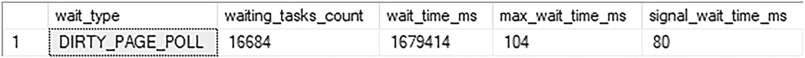

图 12-5 `DIRTY_PAGE_POLL` 等待

```
-- 查询等待统计信息
SELECT *
FROM sys.dm_os_wait_stats
WHERE wait_type = 'DIRTY_PAGE_POLL';
```

间接检查点存在相关风险。将“目标恢复时间（秒）”选项配置为非常低的值可能导致存储子系统上的额外负载，因为脏页会持续写入磁盘。在生产 SQL Server 实例上配置此设置之前，请务必进行广泛测试。

#### DIRTY_PAGE_POLL 概述

`DIRTY_PAGE_POLL`等待类型是在 SQL Server 2012 中随着间接检查点功能的引入而出现的（该功能最终成为 SQL Server 2016 或更高版本中创建的新数据库的默认设置）。即使您不使用间接检查点，由于新的恢复写入器进程，`DIRTY_PAGE_POLL`等待类型仍会积累等待时间。通常，`DIRTY_PAGE_POLL`等待类型不表示性能问题，因此在分析 SQL Server 实例上的等待统计信息时可以安全地忽略它。

### LAZYWRITER_SLEEP

**`LAZYWRITER_SLEEP`**等待类型，没错，与 SQL Server 内部的惰性写入器后台进程相关。惰性写入器进程与本章前面讨论的检查点进程有一些相似之处，因为它也从缓冲区缓存中将脏页写入数据库数据文件。但相似之处仅此而已，因为惰性写入器进程将这些页面写入数据库数据文件的原因与检查点进程完全不同。


#### SQL Server 等待类型：LAZYWRITER_SLEEP、MSQL_XP 与 OLEDB

#### LAZYWRITER_SLEEP 等待类型

##### 什么是 LAZYWRITER_SLEEP 等待类型？

与本章讨论的其他等待类型类似，`LAZYWRITER_SLEEP` 等待类型出现于一个内部 SQL Server 进程（此处是 `lazywriter` 进程）等待工作时。`lazywriter` 进程是一个后台进程，会在特定的时间间隔变为活动状态。当它活动时，会扫描缓冲区缓存的大小，以确定其中是否有足够的空闲页。在缓冲区缓存中始终保持一定数量的空闲页非常重要，这样新的页请求可以直接分配空间，而无需先换出其他页。如果 `lazywriter` 进程确定缓冲区缓存中有足够的空闲页，它将再次进入休眠状态，并在休眠期间记录 `LAZYWRITER_SLEEP` 等待类型。然而，如果缓冲区缓存中没有足够的空闲页，`lazywriter` 进程将在检查点之间检测到哪些脏页在缓冲区缓存中一段时间未被访问，将它们写入数据库数据文件，然后从缓冲区缓存中清除它们。因此，如果缓冲区缓存中有远多于足够的空闲页，`lazywriter` 进程就没有太多工作要做。如果您的 SQL Server 实例存在内存压力，在换出脏页和释放缓冲区缓存空间时，`lazywriter` 进程将繁忙得多。图 12-6 通过流程图展示了检查点和 `lazywriter` 进程的关系。

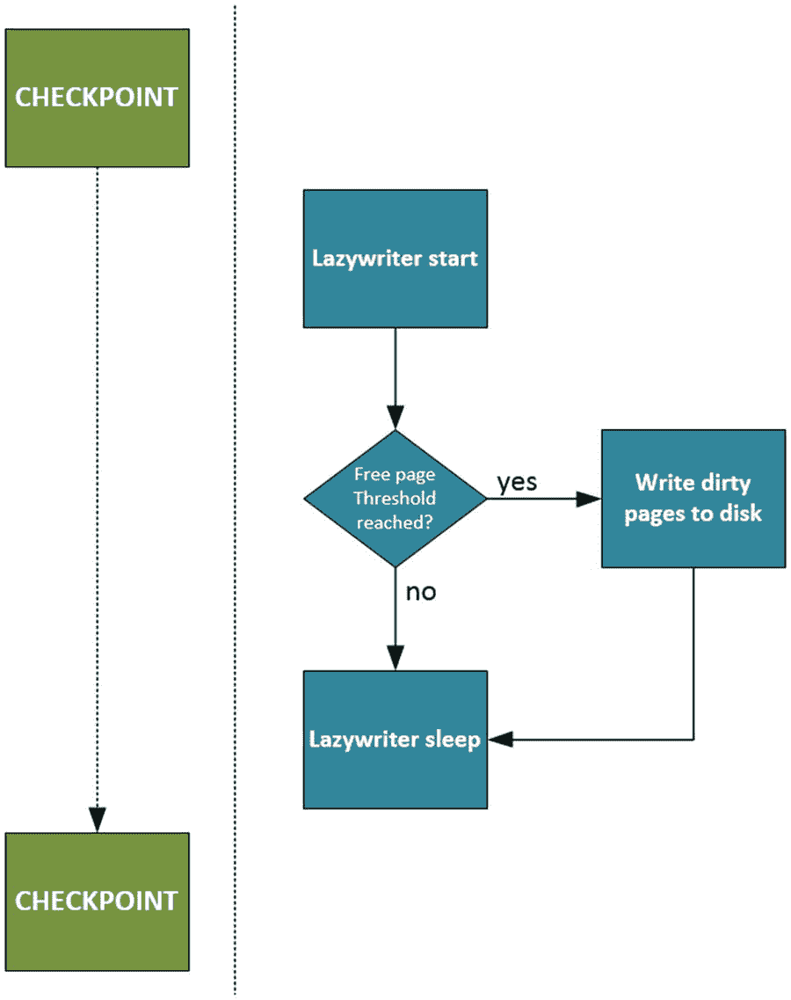
**图 12-6** 检查点与 `lazywriter` 进程

由于 `LAZYWRITER_SLEEP` 等待类型表示 `lazywriter` 进程休眠或等待工作的时间，它又属于那种您可以安全忽略的等待类型。但有一个需要注意的地方——如果 `lazywriter` 进程持续工作，将脏页从缓冲区缓存移动到数据库数据文件，这可能表明您的 SQL Server 实例正经历内存压力。这对性能不利，因为每个页在读取或修改之前都必须先移动到缓冲区缓存。这种行为可能导致 `LAZYWRITER_SLEEP` 等待类型的等待时间低于正常水平。

##### LAZYWRITER_SLEEP 总结

`LAZYWRITER_SLEEP` 等待类型与 SQL Server 内部的 `lazywriter` 进程相关。`lazywriter` 进程以固定的时间间隔启动，如果缓冲区缓存中没有足够的可用空闲页，则负责将脏数据页写入数据库数据文件。`LAZYWRITER_SLEEP` 等待类型表明 `lazywriter` 进程当前未运行，或处于休眠状态，直到收到信号唤醒并检查缓冲区缓存。由于 `LAZYWRITER_SLEEP` 等待类型仅向我们显示 `lazywriter` 进程处于非活动状态的时间，因此在大多数情况下可以忽略。

### MSQL_XP

在第 11 章“抢占式等待类型”的最后一节中，我们讨论了 `PREEMPTIVE_GETPROCADDRESS` 等待类型。我们了解到 `PREEMPTIVE_GETPROCADDRESS` 等待类型记录扩展存储过程的入口点时间。需要指出的一个重要点是，`PREEMPTIVE_GETPROCADDRESS` 等待类型不记录扩展存储过程的执行时间，只记录入口点加载。扩展存储过程的执行时间由另一个等待类型 `MSQL_XP` 跟踪。

#### 什么是 MSQL_XP 等待类型？

`MSQL_XP` 等待类型记录 SQL Server 实例上扩展存储过程的执行时间。在使用多个活动结果集（MARS）时，`MSQL_XP` 等待类型也用于检测死锁情况。MARS 是一项允许通过单个 SQL Server 连接执行多个（并发）批处理的功能。我们不会进一步详细介绍 MARS，但您可以在此处找到更多信息：`https://slrwnds.com/4y444e`。

在 `MSQL_XP` 等待类型上看到高于正常等待时间的最常见原因是扩展存储过程的执行。只要扩展存储过程的执行时间保持不变，这并不一定意味着存在问题。但是，如果某个扩展存储过程花费的时间比预期的长，当您将等待时间与基线进行比较时，您肯定会注意到 `MSQL_XP` 等待时间的增加。

#### MSQL_XP 示例

为了演示执行扩展存储过程时会发生 `MSQL_XP` 等待，请使用清单 12-2 中的脚本创建一个简单的示例。该脚本将重置 `sys.dm_os_wait_stats` DMV，执行一个扩展存储过程（此处是 `master` 数据库中的 `xp_dirtree` 扩展存储过程），并查询 `sys.dm_os_wait_stats` 以获取 `MSQL_XP` 等待信息。

```sql
DBCC SQLPERF('sys.dm_os_wait_stats', CLEAR);
EXEC master..xp_dirtree 'c:\windows';
SELECT *
FROM sys.dm_os_wait_stats
WHERE wait_type = 'MSQL_XP';
```
**清单 12-2** `MSQL_XP` 示例

在我的测试 SQL Server 实例上执行清单 12-2 中的查询结果如图 12-7 所示。顶部窗口显示了 `xp_dirtree` 的结果，底部窗口显示了对 `sys.dm_os_waits_stats` DMV 的查询结果。

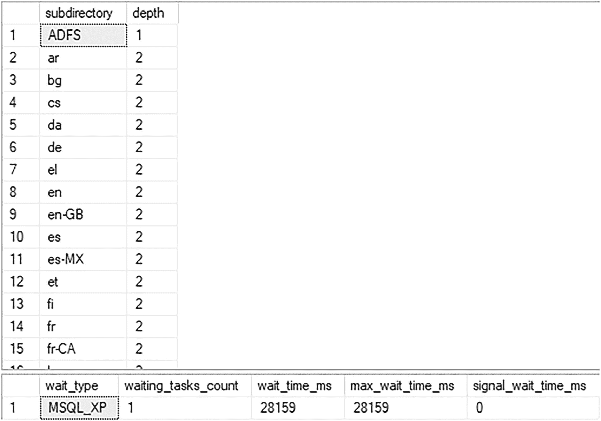
**图 12-7** `MSQL_XP` 等待

`sys.dm_os_wait_stats` DMV 中的信息显示，在 `MSQL_XP` 等待类型上发生了一次等待，等待时间为 28,159 毫秒。这几乎与执行清单 12-2 中的查询所需时间相同，在我的测试 SQL Server 实例上大约是 28 秒。

#### 降低 MSQL_XP 等待

当注意到 `MSQL_XP` 等待类型的等待时间高于正常水平时，很可能是扩展存储过程完成的时间比平时长。您的首要行动点应该是识别正在使用哪些扩展存储过程以及原因。由于扩展存储过程也在 SQL Server 之外执行任务，它们可能会遇到其他可能减慢它们速度的 Windows 进程。了解扩展存储过程函数的功能及其作用，将帮助您快速识别问题所在。

如果您正在使用 MARS，您可能遇到了 MARS 连接死锁。已发布了各种 SQL Server 更新来减少 MARS 死锁发生的机会，因此请确保您的 SQL Server 实例已打好补丁。同时，请务必检查使用 MARS 执行查询的应用程序代码是否存在潜在问题。

#### MSQL_XP 总结

`MSQL_XP` 等待类型执行两项不同的工作：检测执行扩展存储过程所花费的时间，并充当 MARS 连接的死锁检测器。经常在 `MSQL_XP` 等待类型上看到高于正常的等待时间，表明某个扩展存储过程完成的时间比平时长。尝试检测正在执行哪个扩展存储过程及其功能，这将使排除扩展存储过程故障更容易。

### OLEDB

每当 SQL Server 需要访问对象链接与嵌入数据库（OLEDB）客户端提供程序时，就会出现 `OLEDB` 等待类型。SQL Server 使用 OLEDB 客户端提供程序的原因有多种，每当它这样做时，SQL Server 都会在 `OLEDB` 等待类型上记录等待时间。


#### 什么是 OLEDB 等待类型？

SQL Server 在其内部的许多操作中使用 OLEDB 客户端提供程序。例如，链接服务器的流量将通过 OLEDB 客户端提供程序传输，并导致 OLEDB 等待。其他操作，尤其是当 SQL Server 必须从外部源检索数据时，也可能导致使用 OLEDB 客户端提供程序。

SQL Server 内部的一些操作也会使用 OLEDB 客户端提供程序，即使它们是内部发生的。一个很好的例子就是 `DBCC` 命令，我将在下面的示例部分进行演示。

#### OLEDB 示例

使用 OLEDB 客户端提供程序的一个有趣过程是 SQL Server 内部的 `DBCC` 命令。每当您执行 `DBCC` 命令时，您都必定会看到 OLEDB 等待发生。清单 12-3 展示了一个在执行 `DBCC CHECKDB` 后发生 OLEDB 等待的示例。示例脚本将清除 `sys.dm_os_wait_stats` DMV，对 `GalacticWorks` 数据库执行 `CHECKDB`，然后查询 `sys.dm_os_wait_stats` DMV 中的 OLEDB 等待。

```sql
DBCC SQLPERF('sys.dm_os_wait_stats', CLEAR);
DBCC CHECKDB('GalacticWorks');
SELECT *
FROM sys.dm_os_wait_stats
WHERE wait_type = 'OLEDB';
```

清单 12-3 生成 OLEDB 等待

在我测试的 SQL Server 实例上执行清单 12-3 中的查询，结果如图 12-8 所示。

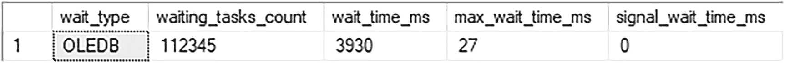

结果行包含五列，等待类型为 `OLEDB`，等待任务计数为 `112345`，等待时间（毫秒）为 `3930`，最大等待时间（毫秒）为 `27`，信号等待时间（毫秒）为 `0`。

图 12-8 OLEDB 等待

如图 12-8 所示，执行 `DBCC CHECKDB` 将导致 OLEDB 等待。

#### 降低 OLEDB 等待

如前面的示例所示，对数据库执行 `DBCC CHECKDB` 会导致 OLEDB 等待。然而，这并不意味着存在与 OLEDB 客户端提供程序相关的问题；相反，它只是表明 `DBCC CHECKDB` 命令利用了 OLEDB 客户端提供程序。运行 `DBCC CHECKDB` 是确保数据库健康的重要部分。为了避免一致性检查以降低 OLEDB 等待时间是不良做法，我强烈建议不要这样做。在 `DBCC` 命令之外看到高 OLEDB 等待时间，可能表明您的 SQL Server 环境中某处存在性能问题。如果您正在处理远程源，例如链接服务器或 Excel 文件，您也会受到远程源性能的影响。例如，如果您从链接服务器查询信息，而链接服务器正遇到性能问题，这也可能会反映在 OLEDB 等待时间中。此外，某些操作（如排序）也会影响链接服务器上的查询持续时间。到远程源的网络连接也可能在导致 OLEDB 等待时间高于正常水平方面起到作用。如果您访问远程源所通过的网络连接出现性能下降，您将再次在 OLEDB 等待时间中注意到这一点。

由于 OLEDB 等待可能因多种原因而发生，其中一些是良性的（如 `DBCC` 命令），而另一些可能与性能问题相关，我建议您不要忽略 OLEDB 等待类型，而应像其他指示性能的等待类型一样监控它。

#### OLEDB 总结

OLEDB 等待类型可能由于各种使用对象链接与嵌入数据库（OLEDB）客户端提供程序的源而发生。大多数源与远程数据源（如链接服务器）相关。一些内部进程也使用 OLEDB 客户端提供程序，最显著的是 `DBCC` 命令。看到 OLEDB 等待类型的等待时间高于正常水平并不一定意味着存在性能问题，特别是当它们可以与计划的 `DBCC` 命令执行相关联时。在使用链接服务器等远程数据源时，在 `DBCC` 命令之外看到高于正常水平的等待时间，可能意味着远程数据源正在经历性能问题。在这种情况下，应重点关注数据源；如果数据源有问题，它必然也会影响 OLEDB 等待时间。

### TRACEWRITE

`TRACEWRITE` 等待类型是一种特殊的等待类型，仅在跟踪运行时收集等待时间，最常见的是 SQL Server Profiler 跟踪。跟踪是 SQL Server 中的一个后台进程，收集关于 SQL Server 实例性能的各种（通常是用户指定的）信息。例如，可以使用 SQL Server Profiler 捕获当前正在执行的查询，过滤到单个数据库，并包含运行时信息。SQL Server 中有多种跟踪方法可用，但最常见且影响 `TRACEWRITE` 等待类型的是 SQL Server Profiler 跟踪。

SQL Server Profiler 是一个应用程序，从 SQL Server 2016 开始，它与 SQL Server Management Studio (`SSMS`) 产品分开，允许用户针对 SQL Server 实例创建和监控跟踪。Microsoft 在引入 SQL Server 2012 时宣布 SQL Server Profiler 已弃用，并建议使用 Extended Events 来捕获跟踪。尽管 SQL Server Profiler 已弃用，但它在 SQL Server 2022 中仍然可用，并且在您部署单独的 `SSMS` 产品时会随之安装。许多人仍然依赖 SQL Server Profiler 跟踪而不是 Extended Events 来排查和监控查询性能。

使用 SQL Server Profiler 的坏消息是，它在执行跟踪时可能会导致一些性能开销。Microsoft 发表的一篇文章得出结论，在繁忙的系统上运行 SQL Server Profiler 跟踪可能对每秒事务量产生 10% 的影响；您可以在 `https://slrwnds.com/j66us9` 找到该文章。

因为 SQL Server Profiler 跟踪可能对您的系统性能产生如此大的影响，我认为监控 `TRACEWRITE` 等待时间非常重要。

#### 什么是 TRACEWRITE 等待类型？

当对您的 SQL Server 实例执行跟踪时，`TRACEWRITE` 等待类型将出现在您的系统上。由于 SQL Server Profiler 跟踪可能对您的 SQL Server 实例性能产生如此大的影响，因此建议您监控此等待类型以检测是否正在执行任何 SQL Server Profiler 跟踪。

您想要运行 SQL Server Profiler 跟踪的原因多种多样，例如，如果您想排查一个非常具体的查询问题，或者监控某个特定查询被执行的次数。尽管存在 SQL Server Profiler 的替代方案，如服务器端跟踪和 Extended Events，但与通常复杂的 Extended Events 相比，SQL Server Profiler 工具非常易于使用。


#### TRACEWRITE 示例

为了演示 TRACEWRITE 等待的示例，我们将创建一个 SQL Server Profiler 跟踪。SQL Server Profiler 程序是"管理工具-完整"功能的一部分，在安装 SQL Server 2016 之前的版本或向现有安装添加功能时可以选择此功能。如果安装独立的 SSMS 产品，Profiler 功能也会自动安装。图 12-9 展示了此功能在 SQL Server 2012 安装程序中的位置。

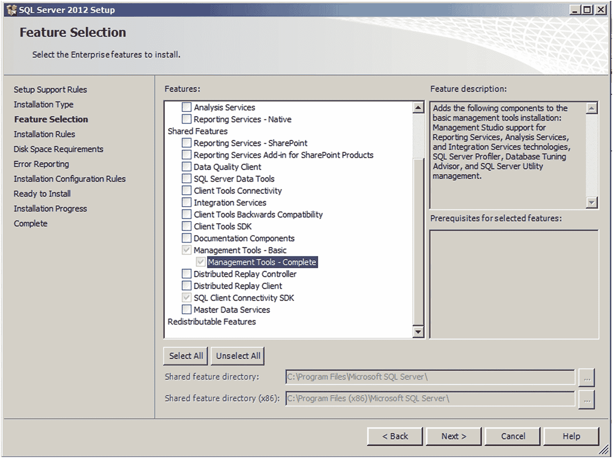

安装"管理工具-完整"功能后，你可以在"开始"菜单下的 `SQL Server ➤ 性能工具` 文件夹中，或在 `C:\Program Files (x86)\Microsoft SQL Server\[版本号]\Tools\Binn` 文件夹中找到 SQL Server Profiler。

如果安装的是独立的 SSMS 产品，则 Profiler 位于 `C:\Program Files (x86)\Microsoft SQL Server\140\Tools\Binn` 文件夹中。

启动 SQL Server Profiler 后，通过单击图 12-10 所示的"新建跟踪"按钮，或选择 `文件 ➤ 新建跟踪` 来启动新跟踪。

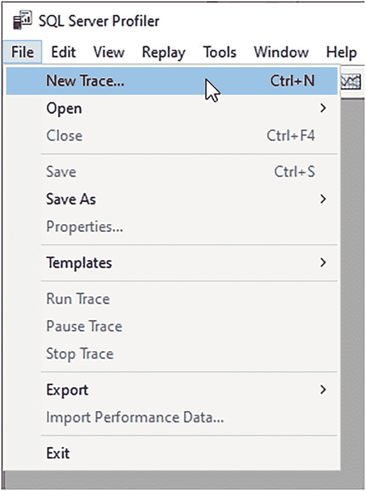

启动新跟踪时，你需要连接到要跟踪的 SQL Server 实例。在本例中，我连接到我的测试 SQL Server 实例。登录到 SQL Server 实例后，"跟踪属性"窗口将会打开。此窗口提供了多种选项来配置跟踪及其存储方式。在此示例中，我们不会更改"常规"选项卡中的任何内容，而是直接转到"事件选择"选项卡。在那里，我们选择要捕获的事件，并可选择为这些事件提供筛选器。

对于此示例，我们选择 `SQL:BatchCompleted` 事件，如图 12-11 所示。这将记录针对测试 SQL Server 实例执行的所有 T-SQL 语句，并捕获该事件的所有可用信息。

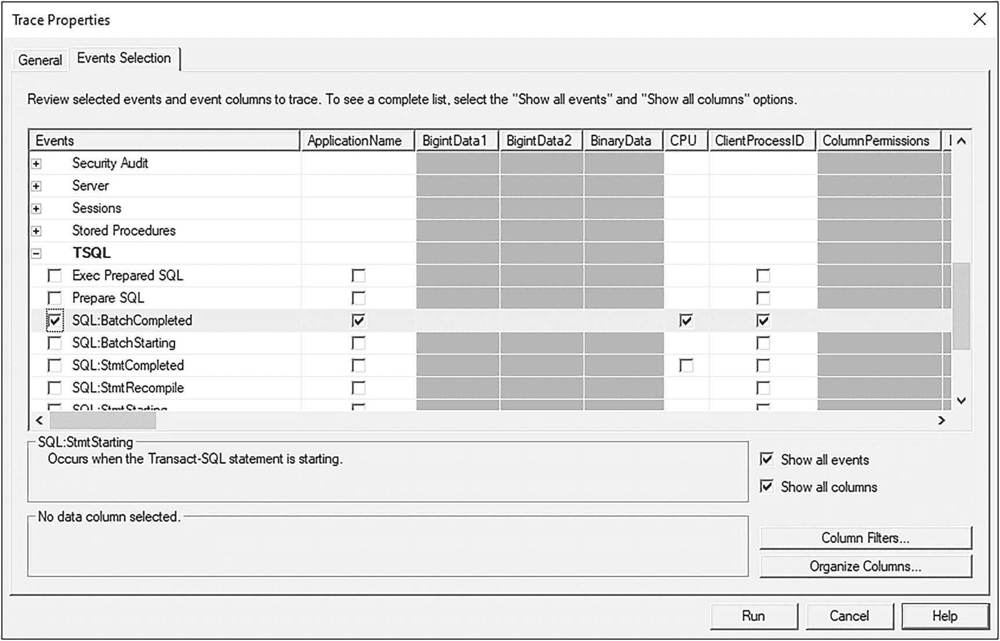

我们不会在事件上配置任何筛选器，因此将捕获针对 SQL Server 实例执行的每一条 T-SQL 语句。我们单击"运行"以启动跟踪，这将打开跟踪窗口，显示事件在我们的 SQL Server 实例上发生的情况以及附加信息（例如查询信息）。

现在我们的 SQL Server Profiler 跟踪正在运行，我们应该能够注意到 TRACEWRITE 等待的发生。我们在 SSMS 中针对 `sys.dm_os_waiting_tasks` DMV 执行以下查询：

```sql
SELECT *
FROM sys.dm_os_waiting_tasks
WHERE wait_type = 'TRACEWRITE';
```

此查询的结果如图 12-12 所示。

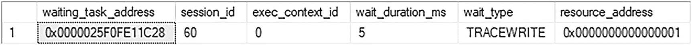

即使我们没有在测试 SQL Server 实例上运行任何工作负载，`TRACEWRITE` 等待类型仍然会被记录。这是正常的，因为只要 SQL Server Profiler 跟踪处于活动状态，`TRACEWRITE` 等待类型就会始终被记录。

#### 降低 TRACEWRITE 等待

如前所述，如果你注意到发生了 `TRACEWRITE` 等待，则意味着有人正在针对你的 SQL Server 实例运行 SQL Server Profiler 跟踪。因为 SQL Server Profiler 跟踪可能会影响 SQL Server 实例的性能，所以了解谁在运行 SQL Server Profiler 跟踪以及为何运行非常重要。

幸运的是，我们可以查询一个目录视图来查看跟踪活动——`sys.traces` 视图。`sys.traces` 目录视图将为你提供针对 SQL Server 实例活动或已暂停跟踪的概览。以下查询将检索 `sys.traces` 目录视图中的所有信息：

```sql
SELECT *
FROM sys.traces;
```

在测试 SQL Server 实例上运行此查询将返回图 12-13 所示的信息（某些列未完全显示在图片中）。

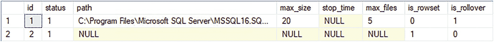

从 `sys.traces` 目录视图中需要重点注意的一些重要列是 `status` 和 `reader_spid` 列。`status` 列返回 `0` 或 `1`，其中 `0` 表示跟踪已停止或暂停，`1` 表示跟踪当前正在运行。`reader_spid` 列返回启动跟踪的会话的会话 ID。我们可以使用此信息来检测谁正在运行跟踪。

在我们的案例中，前面示例中启动的跟踪 ID 为 `2`，而 ID `1` 保留给后台 SQL Server 跟踪，该跟踪默认始终处于活动状态。此默认跟踪收集有关 SQL Server 实例运行状况的特定信息，可在故障排除时使用。由于它是一个所谓的服务器端跟踪，因此在运行时不会记录 `TRACEWRITE` 等待时间。

现在我们知道运行跟踪的用户是谁，如果该跟踪对 SQL Server 实例的性能产生负面影响，我们就可以采取行动。

除了停止 SQL Server Profiler 跟踪以降低 `TRACEWRITE` 等待时间之外，如果你需要捕获针对 SQL Server 实例的跟踪，还有其他可用的方法。最合理的方法是在扩展事件会话中重建你的 SQL Server Profiler 跟踪。扩展事件在捕获跟踪时允许更多的事件和选项。

如果你仍然希望使用 SQL Server Profiler 来分析跟踪，一个好方法是将通常在 SQL Server Profiler 应用程序中运行的跟踪转换为服务器端跟踪。让我们将示例部分中创建的 SQL Server Profiler 跟踪转换为服务器端跟踪，并监控其对 `TRACEWRITE` 等待类型的影响。

将 SQL Server Profiler 跟踪转换为服务器端跟踪的最简单方法是在 SQL Server Profiler 应用程序中定义跟踪但不启动它。而是选择 `文件 ➤ 导出 ➤ 脚本跟踪定义 ➤ 对于 SQL Server 2005 – SQL2019` 选项，如图 12-14 所示。

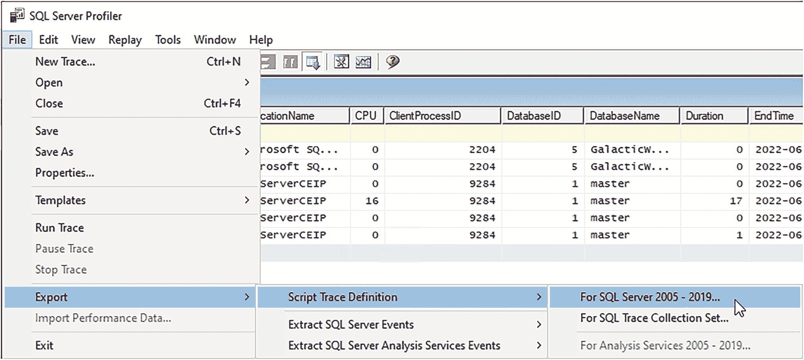

单击 `文件 ➤ 导出 ➤ 脚本跟踪定义 ➤ 对于 SQL Server 2005 – SQL2019` 选项后，系统会要求我们保存一个 `.sql` 文件。整个跟踪定义将被编写到此 `.sql` 文件中。然后我们在 SSMS 中打开此文件，修改脚本中的文件位置和其他一些选项，并执行它。这将返回我们刚创建的跟踪的 ID，并将跟踪信息保存到我们在脚本顶部指定的文件中。图 12-15 显示了在测试 SQL Server 实例上导出的跟踪定义的一部分。

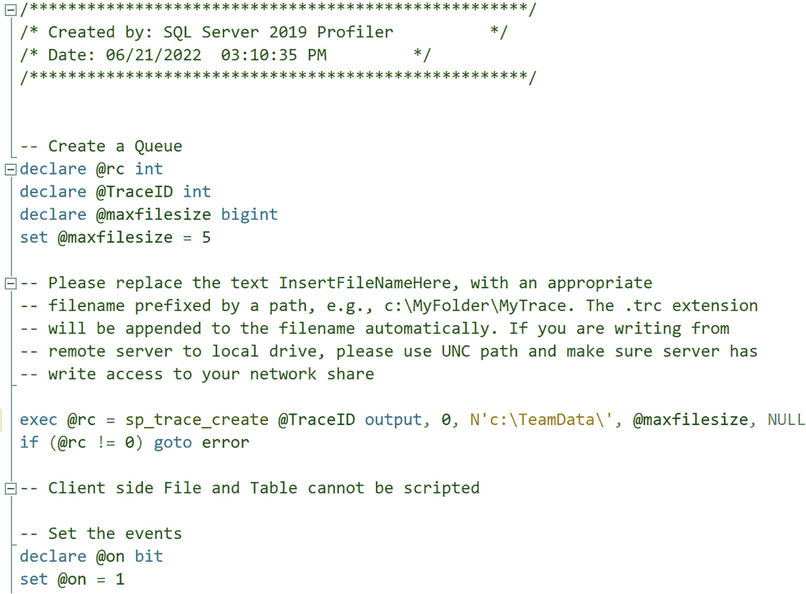


以下是对给定英文文本的中文翻译：


定义跟踪的几行代码。它包括创建队列、执行和设置事件的代码。

图 12-15
跟踪定义

执行创建服务器端跟踪的脚本后，我们收到了一个跟踪 ID `2`。这个跟踪 ID 非常重要，因为它是启动或停止服务器端跟踪的唯一方式。创建后，服务器端跟踪会自动启动。如果我们查询 `sys.traces` 目录视图，可以看到刚刚创建的服务器端跟踪，如图 12-16 所示。


该表有八列，分别为 `i d`、`status`、`path`、`max size`、`stop time`、`max files`、`is rowset` 和 `is rollover`，以及两行数据。

图 12-16
`sys.traces`

与创建的服务器端跟踪交互的唯一方式是执行 `sp_trace_setstatus` 存储过程，并提供跟踪 ID 和状态 ID。例如，执行以下查询将停止跟踪 ID 为 `2` 的服务器端跟踪：
```sql
EXEC sp_trace_setstatus 2, 0
```
要再次启动它，我们可以执行这个命令：
```sql
EXEC sp_trace_setstatus 2, 1
```
最后，要完全关闭跟踪，我们可以执行以下命令：
```sql
EXEC sp_trace_setstatus 2, 3
```
但这并不会删除服务器端跟踪。实际上，服务器端跟踪只能通过重启 SQL Server 服务来移除。

由于服务器端跟踪只能输出到跟踪文件，你必须导航到在服务器端跟踪定义中提供的文件，并在 SQL Server Profiler 中打开该文件。这样，你就可以捕获与使用 SQL Server Profiler 应用程序相同的信息，但性能开销要低得多。

#### TRACEWRITE 摘要

`TRACEWRITE` 等待类型表示当前正在对 SQL Server 实例执行 SQL Server Profiler 跟踪。SQL Server Profiler 跟踪可能对 SQL Server 实例的性能产生相当大的影响，因此，监控运行在你的 SQL Server 实例上的跟踪数量非常重要。值得庆幸的是，有一些 SQL Server Profiler 跟踪的替代方案。你可以选择将 SQL Server Profiler 跟踪转换为扩展事件会话，或者使用服务器端跟踪来执行 SQL Server Profiler 跟踪。

### WAITFOR

本章的最后一个等待类型是少数与 T-SQL 命令直接相关的等待类型之一。`WAITFOR` 等待类型并不表示性能问题，但它确实对执行相关 `WAITFOR` T-SQL 命令的查询的持续时间有影响。

#### 什么是 WAITFOR 等待类型？

每当使用 `WAITFOR` 命令执行查询时，就会记录 `WAITFOR` 等待类型。`WAITFOR` T-SQL 命令会停止查询的执行，直到经过特定的时间量或达到特定的时间点。当条件满足时，查询执行将继续。`WAITFOR` 命令经常在查询或脚本中使用，以强制查询执行暂停。例如，在第 4 章“建立可靠的基线”中，我们使用了 `WAITFOR` 命令来等待特定时间，以比较相隔 15 分钟进行的两次测量。

在使用 `WAITFOR` 命令暂停查询执行时，持有 `WAITFOR` 命令的事务将保持打开状态，直到整个事务完成。这意味着事务持有的线程不能被其他进程使用。SQL Server 还会为 `WAITFOR` 命令保留一个专用线程；如果有太多线程与 `WAITFOR` 命令关联并发生线程饥饿，SQL Server 将随机选择 `WAITFOR` 线程并终止它们以释放更多线程。

在许多情况下，`WAITFOR` 命令是由编写查询或脚本的人明确使用的，在这个意义上，它只影响特定的查询或脚本；因此，当看到较高的 `WAITFOR` 等待时间时，没有理由感到惊慌。这只是表明查询正在使用 `WAITFOR` 命令。

#### WAITFOR 示例

为了展示 `WAITFOR` 等待类型的一个简单示例，请执行清单 12-4 中的查询。该查询将重置 `sys.dm_os_wait_stats` DMV，执行一个 `WAITFOR DELAY` 语句导致脚本执行等待 30 秒，然后查询 `sys.dm_os_wait_stats` DMV 中的 `WAITFOR` 等待。
```sql
DBCC SQLPERF('sys.dm_os_wait_stats', CLEAR);
WAITFOR DELAY '00:00:30';
SELECT *
FROM sys.dm_os_wait_stats
WHERE wait_type = 'WAITFOR';
```
清单 12-4
`WAITFOR` 等待

当清单 12-4 中的查询完成时，你应该会看到发生了一个 `WAITFOR` 等待，总等待时间大约为 30 秒，如图 12-17 所示。

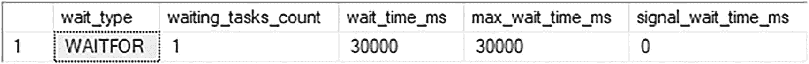

该行有五列，`wait type` 为 `wait for`，`waiting tasks count` 为 1，`wait time m s` 和 `max wait time m s` 为 30000，`signal wait time m s` 为 0。

图 12-17
`WAITFOR` 等待

#### WAITFOR 摘要

`WAITFOR` 等待类型是少数与 T-SQL 命令执行直接相关的后台等待类型之一，这里特指 `WAITFOR`。`WAITFOR` 等待类型并不表示你的 SQL Server 实例存在任何性能问题；它只是表明某个查询或脚本正在使用 `WAITFOR` 命令。`WAITFOR` T-SQL 命令只会影响使用它的查询或脚本的执行时间；因此，降低 `WAITFOR` 等待时间的唯一方法是移除查询中的 `WAITFOR` 命令。

## 13. 与内存 OLTP 相关的等待类型

随着 SQL Server 2014 的发布，微软引入了一个全新的 SQL Server 功能，称为内存 OLTP（代号 Hekaton）。内存 OLTP 是一个内存优化的数据库引擎，直接集成到 SQL Server 引擎中。内存 OLTP 旨在通过将表完全加载到 SQL Server 实例的内存中来提高性能（据微软称，性能提升可达 20 倍）。这些内存优化表是完全持久的，并使用无锁和无闩锁的结构来优化并发控制。

随着内存 OLTP 的引入，SQL Server 中增加了各种新的等待类型。其中大多数可以通过等待类型名称中的 `_XTP_`（或 eXtreme Transaction Processing）部分来识别。在本章中，我们将回顾这些与内存 OLTP 相关的等待类型。

在深入探讨等待类型之前，让我们先（简化且简要地）了解一下内存 OLTP 是什么以及它是如何工作的。本章将重点关注内存优化表。内存 OLTP 还引入了其他功能，如本机编译存储过程和哈希索引，但这些超出了本章的范围。


### 内存中 OLTP 简介

传统（基于磁盘）表与内存优化表之间的主要区别在于，内存优化表完全驻留在 SQL Server 实例的内存中。与传统表不同——传统表的数据页需要从磁盘移入内存，然后再移出——内存优化表在 SQL Server 启动时便移入系统内存，并且永不离开内存（当然，除非该内存优化表被删除）。尽管这乍听起来可能有点吓人，但内存优化表默认是完全持久的。这意味着如果你的 SQL Server 实例崩溃，内存优化表的数据不会丢失。当然，让整个表驻留在 SQL Server 实例的内存中也有缺点。你需要有足够的空闲内存来容纳整个内存优化表（以及一些额外的内存来容纳访问此类表时使用的行版本）。计算内存需求可能很困难，但以下文章会有所帮助：[`slrwnds.com/ecqxan`](https://slrwnds.com/ecqxan)。

为内存优化表保留的内存由 SQL Server 声明，并且不会被清除；如果你的内存优化表使用了过多内存，你的 SQL Server 实例将遭遇内存不足问题，导致性能下降，或者在最坏的情况下，导致 SQL Server 崩溃。这与例如缓冲池高速缓存是一个重大区别，在缓冲池中，当内存压力出现时，页会从内存中清除。另一个缺点是许多数据类型或 SQL Server 功能不支持内存优化表。关于哪些能用、哪些不能用的完整列表可以在 [`slrwnds.com/939hqx`](https://slrwnds.com/939hqx) 和 [`slrwnds.com/3cfwre`](https://slrwnds.com/3cfwre) 找到。随着 SQL Server 2016 的发布，一些主要的限制得到了解决，使得该功能更具吸引力，限制更少。

让我们来看一下内存中 OLTP 的一些内部机制、它们如何工作，以及为什么它们比传统的基于磁盘的表性能更快。

## 检查点文件对 (CFPs)

默认情况下，内存优化表是持久的（你可以选择创建一个非持久表，其内容在 SQL Server 服务重启时会被清除，但你必须显式指定）。实现持久性的方式是通过所谓的检查点文件对 (CFPs)。CFP 由两个文件组成，一个数据文件和一个 Delta 文件，它们存在于为使用内存优化表的数据库创建的特殊内存优化文件组中。

与将行数据存储在数据页内的传统表不同，CFP 数据文件存储**所有**内存优化表的行。我强调“所有”这个词，是因为一个数据文件可以容纳许多内存优化表的行，这与某些只为单个表存储行数据的数据页不同。数据文件内的行按照它们被插入内存优化表的时间顺序存储。这与数据页不同，数据页在传统表的区中保存行信息。由于行在数据文件中按顺序存储，因此在读取行时性能会有所提升，因为它消除了从传统表中读取行时发生的随机读取。图 13-1 展示了数据文件及其所容纳行数据的抽象视图。

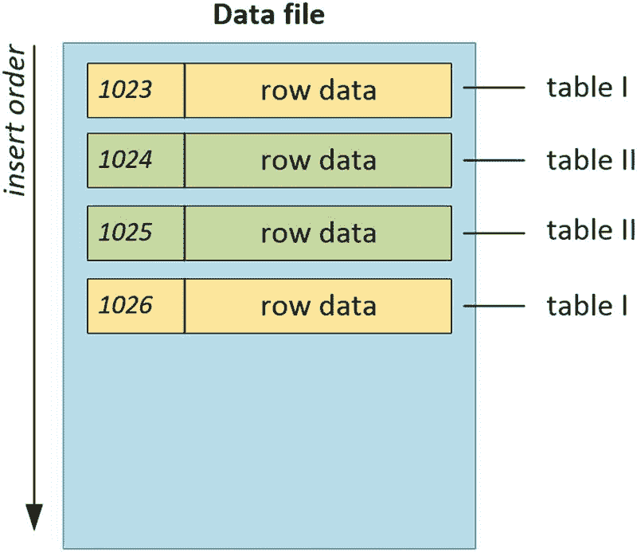

数据文件的示意图有四行。表 1 的行数据为 1 和 4，分别是 1023 和 1026。表 2 的行数据为 2 和 3，分别是 1024 和 1025。

图 13-1

内存优化表的数据文件

内存优化文件组内总是有多个数据文件。当你首次创建内存优化文件组时，SQL Server 会自动在文件组的文件位置预分配一定数量的数据文件。数据文件的大小总是固定的，在内存大于 16 GB 的系统上为 128 MB，在内存小于或等于 16 GB 的系统上为 16 MB。当一个数据文件写满时，会自动创建一个新的数据文件，新的行将被插入到新的数据文件中。重要的是要知道，数据文件根据将行插入数据文件的事务提交时间戳来跟踪行（如图 13-1 中的数字所示）。即使添加了新的数据文件，并且行分布在多个数据文件上，数据文件也总是具有连续的事务范围。图 13-2 显示了多个数据文件以及与这些数据文件关联的事务提交时间戳。

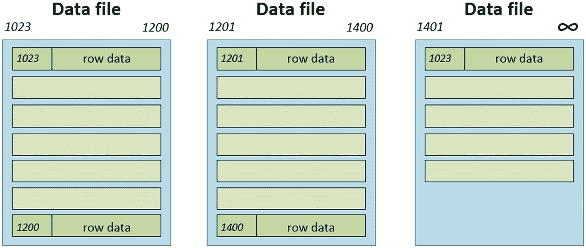

3 个数据文件的示意图分别包含从 1023 到 1200、1201 到 1400 以及 1401 到无穷大的行数据。

图 13-2

数据文件和事务时间戳

注意，在图 13-2 中，最后一个数据文件仍然有空间容纳新行——它没有一个表明文件已满的事务时间戳，因此新行将被添加到该文件中。

数据文件的另一个重要特征是，删除的行不会直接从文件中移除。相反，它们由与数据文件关联的 Delta 文件跟踪。Delta 文件记录数据文件中发生的任何删除操作，并通过事务时间戳范围与数据文件相连。内存优化表的行更新被跟踪为一次删除和一次插入操作。

数据和 Delta 文件的填充由一个后台线程执行——称为脱机检查点线程——它持续在 SQL Server 的后台运行。这与传统表使用的检查点进程不同，传统表的检查点进程是周期性地将页写入数据库数据文件。脱机检查点线程监视内存优化表上操作的事务日志，并直接写入数据和 Delta 文件。

随着时间的推移，当数据文件积累了更多已删除的行时，将发生合并操作，该操作会将多个数据文件合并成一个数据文件。合并操作将创建新的数据和 Delta 文件，并将一个或多个数据和 Delta 文件的内容移动到新文件中，但它不会移动标记为已删除的行。新的数据和 Delta 文件中的事务提交时间戳将被调整，以匹配被合并文件的时间戳。图 13-3 展示了数据文件级别合并操作的简化视图。请记住，合并操作也会影响 Delta 文件。

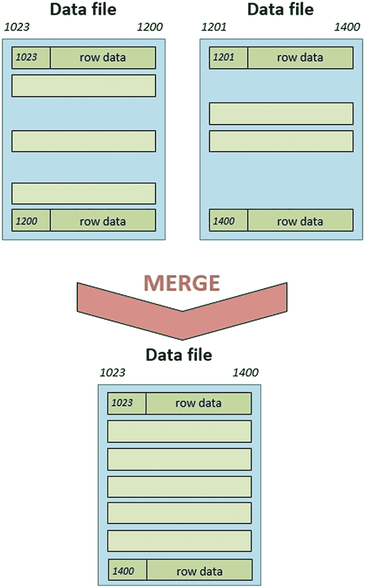

示意图显示 2 个数据文件合并为 1 个。A 的行数据从 1023 到 1200，B 从 1201 到 1400，C 的数据从 1023 到 1400。

图 13-3

合并操作


### 内存中 OLTP

#### 隔离

并发访问内存优化表通过基于快照的事务隔离来处理。这个隔离级别与我们用于磁盘上表的快照隔离有许多共同特征，但也存在一些差异以优化吞吐量。首先，基于快照的事务隔离在并发事务想要访问同一行时使用行版本。与常规快照隔离将行版本存储在 `TempDB` 数据库中不同，内存优化表的行版本内联存储在数据文件本身中。

另一个不同之处是，基于快照的事务隔离使用乐观并发控制。这意味着当并发事务访问相同数据时，`SQL Server` 假设不会发生事务冲突。由于这个假设，不需要锁或闩锁来保护内存优化表数据。然而，存在一种冲突检测机制，当它检测到冲突发生时，将结束其中一个事务，该事务需要被重试。

无需放置和维护锁与闩锁，是内存中 `OLTP` 性能表现优异的另一个主要贡献因素。

#### 事务日志更改

最后一个要讨论的不同点是，关于内存优化表的事务日志行为发生了修改。对于传统表，无论事务是否提交，都会在事务开始时生成日志记录。对于内存优化表，日志记录是在事务开始提交处理时生成的。这意味着回滚的事务信息不会被记录。这最小化了与磁盘上事务日志的交互，从而提高了性能。

另一项修改是，内存优化表上的索引更改不会记录在事务日志中。由于在内存优化表上创建的索引也完全维护在内存中，因此无需记录更改。内存优化表上的索引在 `SQL Server` 服务启动时重新生成。

我要提到的最后一个不同点是，将多个事务分组到一个日志记录中。对于传统表，每个事务将至少产生一个日志记录。针对内存优化表的事务被分组在一起，然后作为一个日志记录写入（当前最大尺寸为 24 KB）。例如，如果你对传统表有 200 次插入操作，将至少生成 200 个日志记录。如果我们可以将 100 次插入操作放入内存优化表的一个日志记录中，那么我们将只有两个日志记录，而不是至少 200 个。同样，这提高了内存优化表的吞吐量。

现在，在（简化且简短地）了解了内存优化表的一些内部工作原理后，让我们回顾一下与内存中 `OLTP` 相关的一些等待类型。本章中的大多数等待类型都与内存中 `OLTP` 引入的新脱机检查点进程有关，只是关联方式不同。

### WAIT_XTP_HOST_WAIT

本章的第一个等待类型是 `WAIT_XTP_HOST_WAIT`。这个等待类型与第 12 章“后台和杂项等待类型”中讨论的 `CHECKPOINT_QUEUE` 等待类型共享一些特征，因为它看起来一直在运行，但只在特定条件下将等待信息写入 `sys.dm_os_wait_stats`。

#### WAIT_XTP_HOST_WAIT 等待类型是什么？

如果我们在 `Books Online` 上查询 `WAIT_XTP_HOST_WAIT` 等待类型的信息，会得到一个不太有用的定义：“当等待由数据库引擎触发并由主机实现时发生。”这并没有为我们提供太多关于与 `WAIT_XTP_HOST_WAIT` 等待类型相关进程的线索，这意味着我们需要自己做一些挖掘工作。

在我们开始研究 `WAIT_XTP_HOST_WAIT` 等待类型之前，我们需要创建一个内存优化表。我使用清单 13-1 中的脚本创建了一个包含单个内存优化表的新数据库。在此脚本中有一些路径引用，您需要更改它们以确保数据库数据和日志文件创建在正确的位置。

```sql
-- 创建数据库
-- 如果需要，请确保更改文件位置
USE [master];
CREATE DATABASE [OLTP_Test] CONTAINMENT = NONE
ON PRIMARY
(NAME = N'OLTP_Test', FILENAME = N'E:\Data\OLTP_Test_Data.mdf' ,
SIZE = 51200KB , FILEGROWTH = 10%)
LOG ON
(NAME = N'OLTP_Test_log', FILENAME = N'E:\Log\OLTP_Test_Log.ldf' ,
SIZE = 10240KB , FILEGROWTH = 10%);
-- 添加内存优化文件组
ALTER DATABASE OLTP_Test
ADD FILEGROUP OLTP_MO CONTAINS MEMORY_OPTIMIZED_DATA;
-- 向新创建的文件组添加文件。
-- 如果需要，请更改驱动器/文件夹位置。
ALTER DATABASE OLTP_Test
ADD FILE (name='OLTP_mo_01', filename='E:\data\OLTP_Test_mo_01.ndf')
TO FILEGROUP OLTP_MO;
-- 创建我们的测试表
USE [OLTP_Test];
CREATE TABLE OLTP
(ID INT IDENTITY (1,1) PRIMARY KEY NONCLUSTERED,
RandomData1 VARCHAR(50),
RandomData2 VARCHAR(50),
ID2 UNIQUEIDENTIFIER)
WITH (MEMORY_OPTIMIZED=ON);
```

**清单 13-1** 创建测试数据库和内存优化表

现在有了用于测试的内存优化表，让我们使用以下查询查看 `sys.dm_os_wait_stats` 和 `sys.dm_os_waiting_tasks` DMV 中的 `WAIT_XTP_HOST_WAIT` 等待类型：

```sql
SELECT *
FROM sys.dm_os_waiting_tasks
WHERE wait_type = 'WAIT_XTP_HOST_WAIT';
SELECT *
FROM sys.dm_os_wait_stats
WHERE wait_type = 'WAIT_XTP_HOST_WAIT';
```

在我的测试 `SQL Server` 实例上执行此查询的结果如图 13-4 所示。

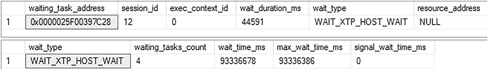

**图 13-4** WAIT_XTP_HOST_WAIT 等待

首先需要注意的是，`WAIT_XTP_HOST_WAIT` 等待类型不断出现在 `sys.dm_os_waiting_tasks` DMV 中，并且随着时间的推移等待时间增加。此外，与 `WAIT_XTP_HOST_WAIT` 等待类型相关的 `session_id` 表明这是一个内部 `SQL Server` 线程在记录等待。从这些信息中，我们已经可以对 `WAIT_XTP_HOST_WAIT` 等待类型得出一些结论：它与一个持续运行的内部后台进程相关。同样有趣的是，如果我第二次运行查询，`sys.dm_os_waiting_tasks` DMV 中的等待时间会增加，但 `sys.dm_os_wait_stats` 中的等待时间保持不变。到目前为止，我们遇到的另一种具有此特性的等待类型是 `CHECKPOINT_QUEUE` 等待时间，我们在第 12 章“后台和杂项等待类型”中讨论过。

由于 `CHECKPOINT_QUEUE` 等待类型的有趣行为在于，它仅在发生自动检查点时，才将 `sys.dm_os_waiting_tasks` DMV 中累积的等待时间写入 `sys.dm_os_wait_stats` DMV，我决定使用清单 13-1 简单地对 `OLTP_Test` 数据库运行一个 `checkpoint` 命令，然后再次查询两个 DMV。对 `WAIT_XTP_HOST_WAIT` 等待类型等待时间的影响如图 13-5 所示。

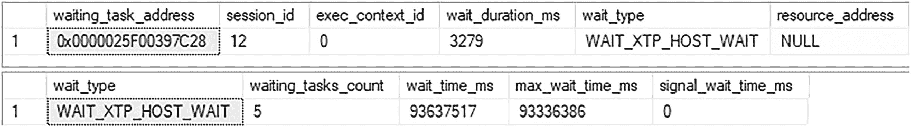


#### SQL Server 内存 OLTP 相关的等待类型

#### 2 个用于等待 XTP 主机等待的表

它包含等待任务地址、会话 ID、执行上下文 ID、等待持续时间（毫秒）、资源地址、等待任务数、等待时间（毫秒）、最大等待时间（毫秒）等信息。

**图 13-5**

**检查点后的 WAIT_XTP_HOST_WAIT 等待信息**

如图 13-5 所示，`sys.dm_os_waiting_tasks` DMV 中的等待时间很小，但 `sys.dm_os_wait_stats` DMV 中的等待时间却增加了。基于这种行为，我认为 `WAIT_XTP_HOST_WAIT` 等待类型与内存优化表相关的离线检查点进程有关。

我们通过访问清单 13-1 中创建的内存中文件的位置来验证这一点。向内存优化文件组添加文件的一个有趣之处是，它会创建一个目录，在该目录内，有一个具有唯一 ID 字符串的文件夹。如果你进一步深入目录树，最终会到达一个包含编号文件的文件夹。图 13-6 显示了在我的测试机上此文件夹的部分内容。

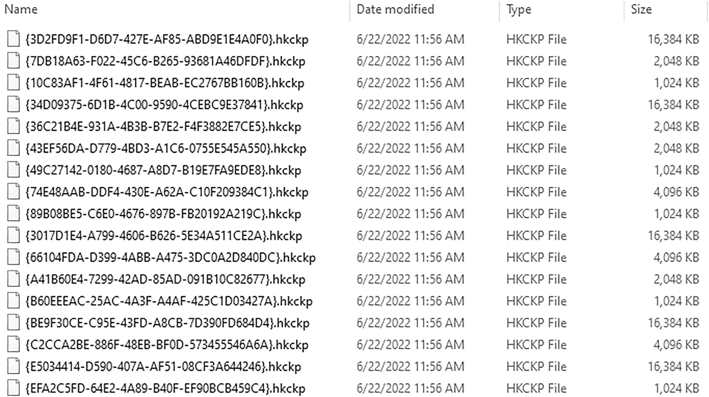

一个表格有四列，分别是名称、修改日期、类型和大小。它有 17 行。

**图 13-6**

**内存优化文件组文件**

事实上，你在这里看到的文件是与我们之前创建的内存优化表相关联的数据和增量文件。

由于我猜测检查点会创建另一个 `CFP`，我在执行 `CHECKPOINT` 之前检查了文件夹中的文件数量，当时是 18 个文件。然后我执行了 `CHECKPOINT` 命令，并再次查看文件数量，结果发现检查点之后现在有 21 个文件。

#### WAIT_XTP_HOST_WAIT 摘要

我认为 `WAIT_XTP_HOST_WAIT` 等待类型与创建新的检查点文件对有明确的关系。运行手动 `CHECKPOINT` 语句将为内存优化表生成一个新的 `CFP`。因为 `WAIT_XTP_HOST_WAIT` 等待类型在后台持续生成等待时间并将其写入 `sys.dm_os_wait_stats` DMV，一个新 `CFP` 被创建（无论是通过手动检查点，当现有 `CFP` 已满时，还是当发生合并操作时），我认为 `WAIT_XTP_HOST_WAIT` 等待类型并不直接表示性能问题。它主要表示一个新的 `CFP` 已被添加到内存优化文件组。然而，这并不意味着这是产生 `WAIT_XTP_HOST_WAIT` 等待的唯一进程。可能还有其他进程也会导致这种等待，但到目前为止，它们只在需要添加新 `CFP` 时发生。

### WAIT_XTP_CKPT_CLOSE

顾名思义，`WAIT_XTP_CKPT_CLOSE` 等待类型似乎与引入内存 OLTP 功能时带来的离线检查点进程有关。

#### WAIT_XTP_CKPT_CLOSE 等待类型是什么？

`WAIT_XTP_CKPT_CLOSE` 等待类型似乎与随内存 OLTP 发布而引入的离线检查点进程有关。分析此等待类型的行为表明，它仅在检查点发生时记录等待时间，无论是自动还是手动检查点。`WAIT_XTP_CKPT_CLOSE` 所代表的等待时间似乎是检查点操作完成所需的时间。我们通过对之前讨论 `WAIT_XTP_HOST_WAIT` 等待类型时创建的数据库和表执行 `CHECKPOINT` 命令来验证这一点。清单 13-2 中的脚本将清除 `sys.dm_os_wait_stats` DMV，在内存优化表中插入几行，执行 `CHECKPOINT` 操作，然后查询 `sys.dm_os_wait_stats` DMV 获取 `WAIT_XTP_CKPT_CLOSE` 等待类型信息。

```sql
USE [OLTP_Test];
-- Clear sys.dm_os_wait_stats
DBCC SQLPERF('sys.dm_os_wait_stats', CLEAR);
-- Insert some rows
INSERT INTO OLTP
(RandomData1,
RandomData2,
ID2)
VALUES
(CONVERT(VARCHAR(50), NEWID()),
CONVERT(VARCHAR(50), NEWID()),
NEWID())
GO 1000
-- Perform a CHECKPOINT
CHECKPOINT;
-- Query sys.dm_os_wait_stats for WAIT_XTP_CKPT_CLOSE waits
SELECT *
FROM sys.dm_os_wait_stats
WHERE wait_type = 'WAIT_XTP_CKPT_CLOSE';
```

**清单 13-2** 生成 `WAIT_XTP_CKPT_CLOSE` 等待

结果见图 13-7。

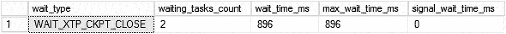

一行有五列：等待类型为 wait X T P C K P T close，等待任务数为 2，等待时间（毫秒）和最大等待时间（毫秒）均为 896，信号等待时间（毫秒）为 0。

**图 13-7**

**WAIT_XTP_CKPT_CLOSE 等待**

我不认为看到 `WAIT_XTP_CKPT_CLOSE` 等待发生是直接需要关注的原因。它们表明检查点正在被执行。我可以想象，`WAIT_XTP_CKPT_CLOSE` 等待时间的突然激增可能表示性能问题。如前一节所述，对内存优化表执行检查点将导致创建额外的 `CFP`。我猜测，如果 `CFP` 的分配花费了很长时间，检查点操作完成的时间也会更长，从而导致更高的 `WAIT_XTP_CKPT_CLOSE` 等待时间。检查点需要处理的数据量也可能意味着更高的 `WAIT_XTP_CKPT_CLOSE` 等待时间。由于检查点将数据写入存储子系统，你的存储性能也可能影响 `WAIT_XTP_CKPT_CLOSE` 等待时间。

#### WAIT_XTP_CKPT_CLOSE 摘要

`WAIT_XTP_CKPT_CLOSE` 等待类型似乎与执行检查点操作密切相关。它表示针对内存优化表执行的检查点完成所需的时间。我不认为这直接表明性能问题，因为它只记录了检查点完成所需的时间。检查点需要处理的工作量可能会导致更高的 `WAIT_XTP_CKPT_CLOSE` 等待时间。存储子系统的性能也可能影响 `WAIT_XTP_CKPT_CLOSE` 等待时间。

### WAIT_XTP_OFFLINE_CKPT_NEW_LOG

本章最后一个与内存 OLTP 相关的等待类型是 `WAIT_XTP_OFFLINE_CKPT_NEW_LOG` 等待类型。这是另一个与离线检查点进程相关的等待类型。

#### WAIT_XTP_OFFLINE_CKPT_NEW_LOG 等待类型是什么？

`WAIT_XTP_OFFLINE_CKPT_NEW_LOG` 等待类型似乎是一种无害的等待类型，记录了离线检查点进程等待工作的时间长度。这一点在联机丛书中得到了证实，其定义如下：“当离线检查点正在等待要扫描的新日志记录时发生。”

正如本章前面所讨论的，离线检查点进程监视影响内存优化表的事务的日志，以便这些事务被记录在数据和增量文件中。这是 SQL Server 后台中一个持续运行的过程，这意味着当你查询 `sys.dm_os_waiting_tasks` DMV 时，你会看到一个内部进程具有 `WAIT_XTP_OFFLINE_CKPT_NEW_LOG` 等待类型，如图 13-8 所示。

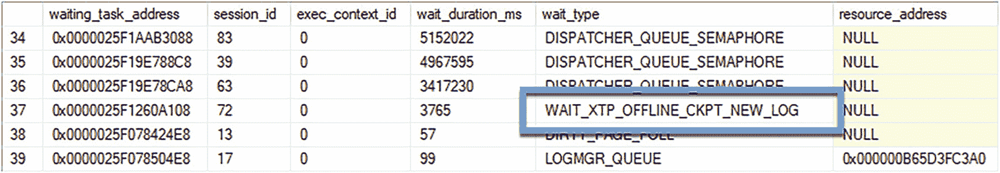

一个表格有六列：等待任务地址、会话 ID、执行上下文 ID、等待持续时间（毫秒）、等待类型和资源地址，以及六行。Wait x t p offline c k p t new log 在一个方框内高亮显示。

**图 13-8**

**sys.dm_os_waiting_tasks 内部的 WAIT_XTP_OFFLINE_CKPT_NEW_LOG 等待**

与 `WAIT_XTP_HOST_WAIT` 等待类型仅在特定条件发生时将等待时间信息写入 `sys.dm_os_wait_stats` DMV 不同，`WAIT_XTP_OFFLINE_CKPT_NEW_LOG` 等待类型似乎等待大约 5 秒钟，将等待时间添加到 `sys.dm_os_wait_stats` DMV，然后再次重置 `sys.dm_os_waiting_tasks` DMV 中的等待时间。这表明离线检查点进程以大约 5 秒的间隔检查新工作。

看到这种行为让我相信 `WAIT_XTP_OFFLINE_CKPT_NEW_LOG` 等待类型是无害的。它只是表明离线检查点进程正在等待工作到达。


#### `WAIT_XTP_OFFLINE_CKPT_NEW_LOG` 摘要

`WAIT_XTP_OFFLINE_CKPT_NEW_LOG` 等待类型与离线检查点进程相关，表示该进程正在等待工作到达。由于此等待类型仅表明离线检查点进程处于空闲等待状态，我认为它不代表任何性能问题，可以安全地忽略。


