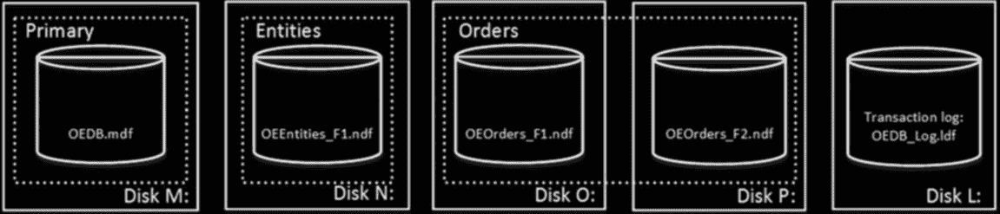

# 第 1 章

## 数据存储内幕

SQL Server 数据库是一个对象的集合，这些对象允许您存储和操作数据。理论上，SQL Server 每个实例支持 32,767 个数据库，尽管典型安装通常只包含几个数据库。显然，SQL Server 能处理多少数据库取决于负载和硬件。托管几十甚至几百个小数据库的服务器并不少见。

本章我们将讨论数据库的内部结构以及 SQL Server 如何存储数据。

#### 数据库文件与文件组

每个数据库由一个或多个事务日志文件以及一个或多个数据文件组成。`事务日志`存储有关数据库事务和每个会话中所有数据修改的信息。每次数据被修改时，SQL Server 都会在事务日志中存储足够的信息，以便撤销（回滚）或重做（重放）此操作，这使得 SQL Server 能够在发生意外故障或崩溃时将数据库恢复到事务一致的状态。

每个数据库有一个主数据文件，默认扩展名为 `.mdf`。此外，每个数据库还可以有次要数据库文件。这些文件默认扩展名为 `.ndf`。

所有数据库文件被分组到文件组中。`文件组`是一个逻辑单元，用于简化数据库管理。它允许数据库对象和物理数据库文件在逻辑上分离。当您创建数据库对象（例如表）时，您可以指定它们应放入哪个文件组，而无需担心底层数据文件的配置。

清单 1-1 展示了创建名为 `OrderEntryDb` 的数据库的脚本。该数据库由三个文件组组成。主文件组有一个数据文件存储在 M: 驱动器上。第二个文件组 `Entities` 有一个数据文件存储在 N: 驱动器上。最后一个文件组 `Orders` 有两个数据文件，分别存储在 O: 和 P: 驱动器上。最后，还有一个事务日志文件存储在 L: 驱动器上。

***清单 1-1.*** 创建数据库

```
create database [OrderEntryDb] on
primary
(name = N'OrderEntryDb', filename = N'm:\OEDb.mdf'),
filegroup [Entities]
(name = N'OrderEntry_Entities_F1', filename = N'n:\OEEntities_F1.ndf'),
filegroup [Orders]
(name = N'OrderEntry_Orders_F1', filename = N'o:\OEOrders_F1.ndf'),
(name = N'OrderEntry_Orders_F2', filename = N'p:\OEOrders_F2.ndf')
log on
(name = N'OrderEntryDb_log', filename = N'l:\OrderEntryDb_log.ldf')
```

**电子补充材料** 本章的在线版本（[doi: 10.1007/978-1-4842-1964-5_1](http://dx.doi.org/10.1007/978-1-4842-1964-5_1) ）包含补充材料，可供授权用户使用。

© Dmitri Korotkevitch 2016

D. Korotkevitch, *Pro SQL Server Internals*, DOI 10.1007/978-1-4842-1964-5_1



第 1 章 ■ 数据存储内幕

您可以在图 1-1 中看到数据库和数据文件的物理布局。共有五个磁盘，包含四个数据文件和一个事务日志文件。虚线矩形代表文件组。

***图 1-1.** 数据库和数据文件的物理布局*

能够在文件组中放置多个数据文件，使我们能够将负载分散到不同的存储上。


