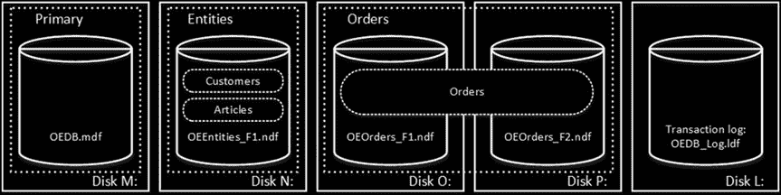
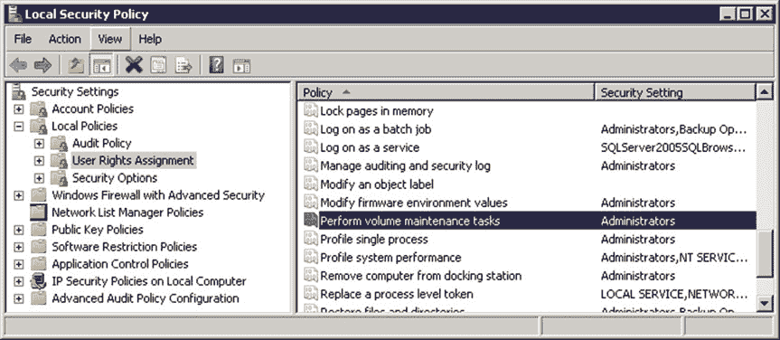

# 第 1 章 ■ 存储内部原理

驱动器有助于提升系统的 I/O 性能。然而，在这样做时，您应该考虑存储子系统的冗余性。如果其中一个存储驱动器发生故障，数据库将变得完全或部分不可用。

另一方面，事务日志吞吐量并不会从多个文件中受益。SQL Server 按顺序处理事务日志，在任何给定时间只会访问一个日志文件。

**注意** 我们将在第 30 章“事务日志内部原理”中讨论事务日志的内部结构及其相关最佳实践。

让我们创建几个表，如清单 1-2 所示。`Customers` 和 `Articles` 表被放置在 `Entities` 文件组中。`Orders` 表则位于 `Orders` 文件组中。

***清单 1-2.*** 创建表

```sql
create table dbo.Customers
(
/* 表列 */
) on [Entities];

create table dbo.Articles
(
/* 表列 */
) on [Entities];

create table dbo.Orders
(
/* 表列 */
) on [Orders];
```

图 1-2 展示了数据库中和磁盘上的表物理布局。



***图 1-2.*** 表的物理布局*

文件组中的逻辑对象与物理数据库文件之间的分离，使我们能够微调数据库文件布局，以充分利用存储子系统，而无需担心破坏系统。例如，将产品部署到不同客户的独立软件供应商（ISV），可以根据底层 I/O 配置和预期数据量，在部署阶段调整数据库文件的数量。这些更改对于将数据库对象放置到文件组而非数据库文件中的开发人员来说是透明的。

**最佳实践** 除了系统对象外，不要将 `PRIMARY` 文件组用于任何其他用途。为用户对象创建单独的文件组或一组文件组，可以简化数据库管理和灾难恢复，特别是在大型数据库的情况下。我们将在第 31 章“备份与恢复”中更深入地讨论这一点。

在创建数据库或向现有数据库添加新文件时，您可以指定初始文件大小和自动增长参数。SQL Server 在选择将数据写入哪个数据文件时，使用一种*按比例填充*算法。它写入的数据量与该文件中的可用空间成比例——文件的可用空间越多，它处理的写入操作就越多。

**提示** 无论底层存储配置如何，OLTP 系统和包含易变数据的文件组通常从拥有多个数据文件中受益。文件的最佳数量取决于工作负载和底层硬件。根据经验，如果服务器拥有多达 16 个逻辑 CPU，则创建四个数据文件，此后保持文件与 CPU 数量比例为 1:8。

为同一文件组中的所有文件设置相同的初始大小和自动增长参数，并且增长大小应定义为兆字节（MB）而非百分比。这有助于按比例填充算法在各个数据文件上均匀平衡写入活动。

为文件组中的所有文件设置相同的初始大小和自动增长参数通常足以保持按比例填充算法的高效运行。然而，在一些罕见情况下，即使有此设置，SQL Server 也可能不均匀地增长文件组中的文件。

SQL Server 2016 引入了两个选项——`AUTOGROW_SINGLE_FILE` 和 `AUTOGROW_ALL_FILES`——用于在文件组级别控制自动增长事件。使用 `AUTOGROW_SINGLE_FILE`（这是默认选项），SQL Server 2016 会在需要时增长文件组中的单个文件。使用 `AUTOGROW_ALL_FILES`，当文件组中的任一文件空间不足时，SQL Server 会增长该文件组中的所有文件。




