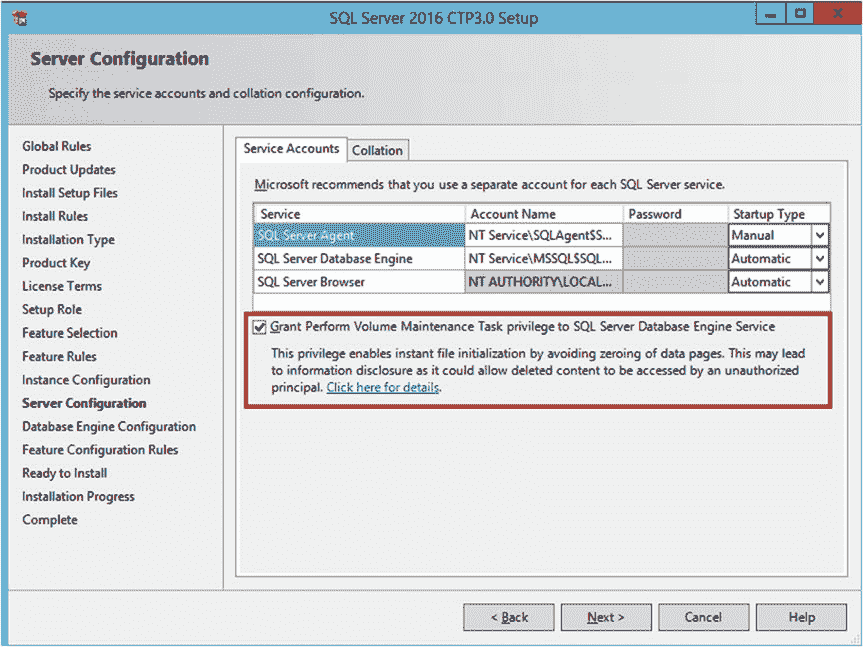
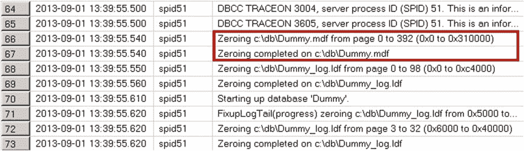
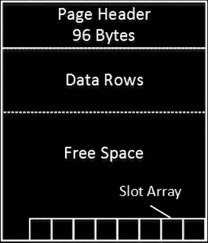
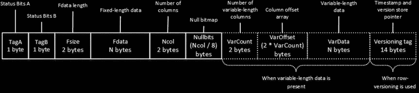
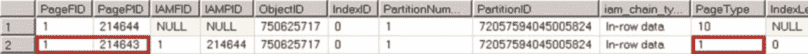
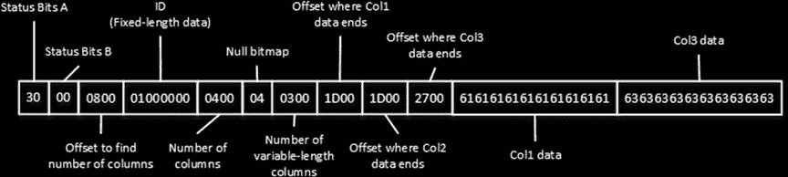
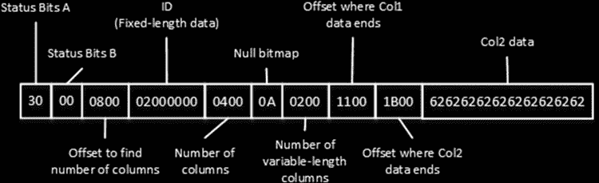
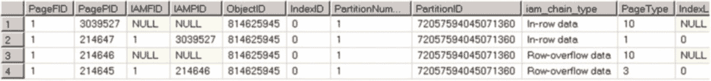

# 第一章：数据存储内部原理

## T1117 跟踪标志与文件增长

在使用 SQL Server 2016 之前的版本时，你可以使用 `实例级` 跟踪标志 `T1117` 来控制此行为。启用此标志后，只要文件组中的任何一个文件空间不足，SQL Server 就会强制增长文件组中的所有文件，这与 `AUTOGROW_ALL_FILES` 文件组选项类似。除非我持续遇到文件组文件大小不均的问题，否则通常不会使用此标志。

每次 SQL Server 增长文件时，都会用零填充新分配的空间。此过程会阻塞所有正在向相应文件写入的会话，或者在事务日志增长的情况下，会阻塞正在生成事务日志记录的会话。

SQL Server 总是将事务日志清零，且无法更改此行为。不过，你可以通过启用或禁用 `即时文件初始化` 来控制数据文件是否被清零。启用 `即时文件初始化` 有助于加快数据文件的增长速度，并缩短创建或还原数据库所需的时间。

> **注意：** 启用 `即时文件初始化` 存在较小的安全风险。启用此选项后，数据文件中未分配的部分可能包含先前已删除的操作系统文件的信息。数据库管理员能够检查此类数据。

你可以通过将 `SA_MANAGE_VOLUME_NAME` 权限（也称为 `执行卷维护任务`）添加到 SQL Server 启动帐户来启用 `即时文件初始化`。这可以在本地安全策略管理应用程序 (`secpol.msc`) 中完成，如图 1-3 所示。你需要打开 `执行卷维护任务` 权限的属性，并将 SQL Server 启动帐户添加到该列表中。

**图 1-3：** 在 `secpol.msc` 中启用 `即时文件初始化`

> **提示：** SQL Server 会在启动时检查 `即时文件初始化` 是否已启用。在向 SQL Server 启动帐户授予相应权限后，你需要重新启动 SQL Server 服务。

SQL Server 2016 允许你在安装过程中通过向 SQL Server 启动帐户授予 `执行卷维护任务` 权限来启用 `即时文件初始化`。图 1-4 说明了这一点。



**图 1-4：** 在 SQL Server 2016 安装程序中启用 `即时文件初始化`

## 检查即时文件初始化状态

为了检查 `即时文件初始化` 是否已启用，你可以使用清单 1-3 中所示的代码。此代码设置两个跟踪标志，强制 SQL Server 将其他信息写入错误日志，创建一个小数据库，然后读取错误日志文件的内容。

**清单 1-3：** 检查 `即时文件初始化` 是否已启用

```
dbcc traceon(3004,3605,-1)
go
create database Dummy
go
exec sp_readerrorlog
go
drop database Dummy
go
dbcc traceoff(3004,3605,-1)
go
```

如果 `即时文件初始化` 未启用，SQL Server 错误日志会显示，除了将日志 `.ldf` 文件清零外，SQL Server 还在将 `.mdf` 数据文件清零，如图 1-5 所示。当启用 `即时文件初始化` 时，它只会显示日志 `.ldf` 文件被清零。



**图 1-5：** 检查 `即时文件初始化` 是否已启用 —— SQL Server 错误日志

## 自动收缩选项

另一个控制数据库文件大小的重要数据库选项是 `自动收缩`。启用此选项后，SQL Server 会每 30 分钟收缩一次数据库文件，减小其大小并将空间释放给操作系统。此操作非常消耗资源，而且几乎无用，因为当新数据进入系统时，数据库文件又会增长。此外，它还会大大增加数据库中的索引碎片。`自动收缩` **绝不应该启用。** 此外，微软将在未来版本的 SQL Server 中移除此选项。

> **注意：** 我们将在第 6 章“索引碎片”中更详细地讨论索引碎片。

#### 数据页与数据行

数据库中的空间被划分为逻辑上的 8KB `页`。这些页从零开始连续编号，可以通过指定文件 ID 和页号来引用。页编号始终是连续的，因此当 SQL Server 增长数据库文件时，新页会从文件中最大页号加一開始编号。类似地，当 SQL Server 收缩文件时，它会从文件中移除编号最大的页。

## SQL SERVER 中的数据存储

一般来说，SQL Server 存储和处理数据库中的数据有三种不同的方式或技术。使用经典的 `基于行的存储` 时，数据存储在数据行中，这些行将所有列的数据组合在一起。

SQL Server 2012 引入了 `列存储索引` 和 `基于列的存储`。该技术按列而不是按行存储数据。我们将在本书的第七部分介绍基于列的存储。

最后，还有一组在 SQL Server 2014 中引入并在 SQL Server 2016 中进一步改进的内存技术。尽管为了冗余目的，它们会将数据持久化到磁盘上，但其存储格式与基于行和基于列的存储截然不同。我们将在本书的第八部分讨论内存技术。

本书的这一部分专注于基于行的存储以及经典的 B-Tree 索引和堆。



## 数据页结构

**图 1-6：** 数据页结构

一个 96 字节的页头包含有关页面的各种信息，例如页面所属的对象、页面上的行数和可用的剩余空间、如果页面在索引页链中则包含指向前一页和后一页的链接，等等。

页头之后是实际数据存储的区域。其后是剩余空间。最后，有一个 `槽阵列`，它是一个包含两字节条目的块，用于指示页面上相应数据行开始的偏移量。

`槽阵列` 指示页面上数据行的逻辑顺序。如果需要按索引键顺序对页面上的数据进行排序，SQL Server 不会物理地对页面上的数据行进行排序，而是根据索引排序顺序填充槽阵列。槽 0（图 1-6 中最右侧）存储页面上具有最小键值的数据行的偏移量；槽 1 存储第二小的键值；依此类推。我们将在下一章更深入地讨论索引。

## 数据类型与存储

SQL Server 提供了丰富的系统数据类型，可以逻辑上分为两组：固定长度和可变长度。固定长度的数据类型，如 `int`、`datetime`、`char` 等，无论其值如何，始终使用相同的存储空间，*即使值为 NULL 时也是如此*。例如，`int` 列始终使用 4 字节，`nchar(10)` 列始终使用 20 字节来存储信息。

相比之下，可变长度的数据类型，如 `varchar`、`varbinary` 等，会根据需要使用尽可能多的存储空间来存储数据，外加两个额外的字节。例如，`nvarchar(4000)` 列存储一个五字符字符串时可能仅使用 12 字节，而在大多数情况下，存储一个 NULL 值仅需两个字节。我们将在本章后面讨论可变长度列不为 NULL 值使用存储空间的情况。

## 数据行结构

让我们看一下数据行的结构，如图 1-7 所示。



**图 1-7：** 数据行结构


行的前两个字节，称为`Status Bits A`和`Status Bits B`，是位图，包含有关行的信息，例如行类型、行是否已被逻辑删除（幽灵化），以及行是否包含 NULL 值、可变长度列和版本控制标签。

接下来的两个字节用于存储数据固定长度部分的长度。其后是固定长度数据本身。

固定长度数据部分之后，是一个`null bitmap`，它包含两个不同的数据元素。第一个两字节元素是行中的列数。第二个是空位图数组。该数组为表中的每一列使用一个位，无论该列是否可为空。

即使表没有可为空的列，在堆表或聚集索引叶行的数据行中也始终存在空位图。但是，在非叶索引行中，或者当索引中没有可为空的列时，非聚集索引的叶级行中不存在空位图。

空位图之后是行的可变长度数据部分。它以一个两字节的行中可变长度列数开始，后跟一个列偏移数组。SQL Server 为行中的每个可变长度列存储一个两字节的偏移值，即使该值为 NULL。其后是数据的实际可变长度部分。最后，在行的末尾有一个可选的 14 字节版本控制标签。此标签用于需要行版本控制的操作期间，例如联机索引重建、乐观隔离级别、触发器等。

■ **注意** 我们将在第 6 章讨论索引维护，在第 9 章讨论触发器，在第 21 章讨论乐观隔离级别。

让我们创建一个表，用一些数据填充它，然后查看实际的行数据。代码如代码清单 1-4 所示。`Replicate`函数将第一个参数提供的字符重复十次。

***代码清单 1-4*** 数据行格式：表创建

```sql
create table dbo.DataRows
(
    ID int not null,
    Col1 varchar(255) null,
    Col2 varchar(255) null,
    Col3 varchar(255) null
);

insert into dbo.DataRows(ID, Col1, Col3) values (1,replicate('a',10),replicate('c',10));

insert into dbo.DataRows(ID, Col2) values (2,replicate('b',10));
```



第 1 章 ■ 数据存储内部原理

```sql
dbcc ind
(
    'SQLServerInternals' /*Database Name*/
    ,'dbo.DataRows' /*Table Name*/
    ,-1 /*Display information for all pages of all indexes*/
);
```

一个未公开但众所周知的`DBCC IND`命令返回有关表页分配的信息。你可以在图 1-8 中看到此命令的输出。

***图 1-8*** `DBCC IND`输出

属于该表的有两个页。第一个，`PageType=10`，是一种特殊类型的页，称为`IAM allocation map`。此页跟踪属于特定对象的页。不过，现在不要关注它，因为我们将在本章后面讨论分配图页。

■ **注意** SQL Server 2012 引入了另一个未公开的数据管理函数（DMF），`sys.dm_db_database_page_allocations`，它可以用作`DBCC IND`命令的替代品。与`DBCC IND`相比，此 DMF 的输出提供了更多信息，并且可以与其他系统 DMV 和/或目录视图联接。

`PageType=1`的页是包含数据行的实际数据页。`PageFID`和`PagePID`列显示该页的实际文件和页号。你可以使用另一个未公开的命令`DBCC PAGE`来检查其内容，如代码清单 1-5 所示。

***代码清单 1-5*** 数据行格式：`DBCC PAGE`调用

```sql
-- 将 DBCC PAGE 输出重定向到控制台
dbcc traceon(3604);

dbcc page
(
    'SqlServerInternals' /*Database Name*/
    ,1 /*File ID*/
    ,214643 /*Page ID*/
);
```


```
,3 /*输出模式：3 - 显示页头和行详细信息*/

);

`清单 1-6` 展示了与第一个数据行对应的 `DBCC PAGE` 的输出。SQL Server 以**字节交换顺序**存储数据。例如，两字节值 `0001` 会被存储为 `0100`。



# 第 1 章 ■ 数据存储内部机制

`清单 1-6.` 第一行的 `DBCC PAGE` 输出

```
Slot 0 Offset 0x60 Length 39
Record Type = PRIMARY_RECORD Record Attributes = NULL_BITMAP VARIABLE_COLUMNS
Record Size = 39
Memory Dump @0x000000000EABA060
0000000000000000: 30000800 01000000 04000403 001d001d 00270061 0................'.a
0000000000000014: 61616161 61616161 61636363 63636363 636363 aaaaaaaaacccccccccc
Slot 0 Column 1 Offset 0x4 Length 4 Length (physical) 4
ID = 1
Slot 0 Column 2 Offset 0x13 Length 10 Length (physical) 10
Col1 = aaaaaaaaaa
Slot 0 Column 3 Offset 0x0 Length 0 Length (physical) 0
Col2 = [NULL]
Slot 0 Column 4 Offset 0x1d Length 10 Length (physical) 10
Col3 = cccccccccc
```

让我们更详细地看一下这个数据行，如 `图 1-9` 所示。

`图 1-9.` 第一个数据行

如你所见，行以两个状态位开始，后跟一个两字节值 `0800`。这是 `0008` 的字节交换值，它是行中“列数”属性的偏移量。此偏移量告诉 SQL Server 行中固定长度数据部分的结束位置。

接下来的四个字节用于存储固定长度数据，在我们的例子中是 `ID` 列。之后是一个两字节值，表示数据行有四个列，然后是一个一字节的 `NULL` 位图。对于仅仅四个列，位图中的一个字节就足够了。它存储的值是 `04`，其二进制格式为 `00000100`。这表明行中的第三列包含一个 `NULL` 值。

接下来的两个字节存储行中可变长度列的数量，即 3（字节交换顺序为 `0300`）。其后是一个偏移数组，其中每两个字节存储一个可变长度列数据结束位置的偏移量。如你所见，即使 `Col2` 是 `NULL`，它仍然使用了偏移数组中的一个槽位。

最后，是来自可变长度列的实际数据。

现在，我们来看第二个数据行。`清单 1-7` 展示了 `DBCC PAGE` 的输出，`图 1-10` 展示了行数据。



`图 1-10.` 第二个数据行数据

`清单 1-7.` 第二行的 `DBCC PAGE` 输出

```
Slot 1 Offset 0x87 Length 27
Record Type = PRIMARY_RECORD Record Attributes = NULL_BITMAP VARIABLE_COLUMNS
Record Size = 27
Memory Dump @0x000000000EABA087
0000000000000000: 30000800 02000000 04000a02 0011001b 00626262 0................bbb
0000000000000014: 62626262 626262 bbbbbbb
Slot 1 Column 1 Offset 0x4 Length 4 Length (physical) 4
ID = 2
Slot 1 Column 2 Offset 0x0 Length 0 Length (physical) 0
Col1 = [NULL]
Slot 1 Column 3 Offset 0x11 Length 10 Length (physical) 10
Col2 = bbbbbbbbbb
Slot 1 Column 4 Offset 0x0 Length 0 Length (physical) 0
Col3 = [NULL]
```

第二行中的 `NULL` 位图表示二进制值 `00001010`，这表明 `Col1` 和 `Col3` 是 `NULL`。尽管表中有三个可变长度列，但行中的可变长度列数表明偏移数组中只有两个列/槽位。SQL Server 不会维护行中尾部的 `NULL` 可变长度列的信息。

■ **提示** 你可以通过以下方式减少数据行的大小：以一种特定的方式创建表，将通常存储空值的可变长度列定义为 `CREATE TABLE` 语句中的最后一列。这是 `CREATE TABLE` 语句中列顺序唯一重要的情况。

固定长度数据和内部属性必须适应单个数据页上可用的 8,060 字节。如果无法满足，SQL Server 不允许你创建表。例如，`清单 1-8` 中的代码
```

产生错误。



