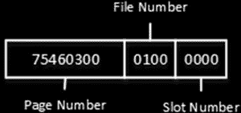

# 第 1 章 ■ 数据存储内部原理

## ***清单 1-8.*** 创建数据行大小超过 8,060 字节的表

```sql
create table dbo.BadTable
(
Col1 char(4000),
Col2 char(4060)
)
```

消息 1701，级别 16，状态 1，第 1 行
创建或修改表 'BadTable' 失败，因为最小行大小将为 8,067 字节（包括 7 字节的内部开销）。这超过了最大允许的表行大小 8,060 字节。

#### 大对象存储

尽管行的固定长度数据和内部属性必须容纳在单个页面中，但 SQL Server 可以将变长数据存储在不同的数据页上。根据数据类型和长度，有两种不同的数据存储方式。

##### 行溢出存储

SQL Server 将不超过 8,000 字节的变长列数据存储在称为 `行溢出页面` 的特殊页面上。让我们创建一个表，并用 清单 1-9 所示的数据填充它。

## ***清单 1-9.*** 行溢出数据：创建表

```sql
create table dbo.RowOverflow
(
ID int not null,
Col1 varchar(8000) null,
Col2 varchar(8000) null
);

insert into dbo.RowOverflow(ID, Col1, Col2) values
(1,replicate('a',8000),replicate('b',8000));
```

如你所见，SQL Server 创建了表并插入了数据行，没有任何错误，即使数据行大小超过了 8,060 字节。让我们使用 `DBCC IND` 命令查看表的页面分配。结果如图 1-11 所示。

## ***图 1-11.** 行溢出数据：DBCC IND 结果*



