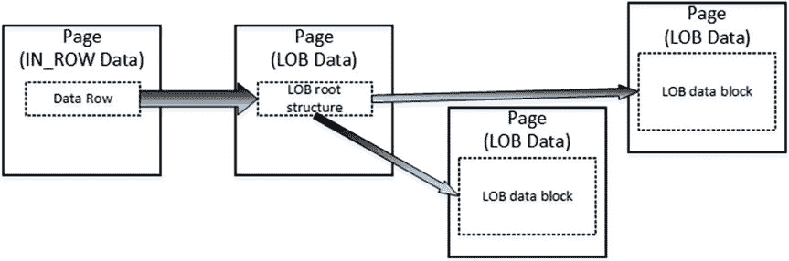

# 第 1 章 ■ 数据存储内部原理

现在你可以看到两组不同的 IAM 和数据页。`PageType=3` 的数据页表示存储行溢出数据的数据页。

让我们看一下数据页 214647，这是存储主要行数据的行内数据页。页面 `(1:214647)` 的 `DBCC PAGE` 命令部分输出如 清单 1-10 所示。

## ***清单 1-10.*** 行溢出数据：行内数据的 DBCC PAGE 结果

```
Slot 0 Offset 0x60 Length 8041

Record Type = PRIMARY_RECORD Record Attributes = NULL_BITMAP VARIABLE_COLUMNS
Record Size = 8041
Memory Dump @0x000000000FB7A060
0000000000000000: 30000800 01000000 03000002 00511f69 9f616161 0............Q.iŸaaa
0000000000000014: 61616161 61616161 61616161 61616161 61616161 aaaaaaaaaaaaaaaaaaaa
<Skipped>
0000000000001F40: 61616161 61616161 61616161 61616161 61020000 aaaaaaaaaaaaaaaaa…
0000000000001F54: 00010000 00290000 00401f00 00754603 00010000 ..…)…@…uF.....
0000000000001F68: 00
```

如你所见，SQL Server 将 `Col1` 数据存储在行内。然而，`Col2` 数据已被一个 24 字节的值替换。前 16 字节用于存储行外存储元数据，例如类型、数据长度和其他一些属性。最后的 8 字节是指向行溢出页面上该行的实际指针，该指针由文件号、页号和槽位号组成。图 1-12 详细显示了这一点。请记住，所有信息都以字节交换顺序存储。

## ***图 1-12.** 行溢出数据：行溢出页指针结构*

如你所见，槽位号是 0，文件号是 1，页号是十六进制值 `0x00034675`，即十进制的 214645。该页号与图 1-10 中显示的 `DBCC IND` 结果匹配。

页面 `(1:214645)` 的 `DBCC PAGE` 命令部分输出如 清单 1-11 所示。

## ***清单 1-11.*** 行溢出数据：行溢出数据的 DBCC PAGE 结果

```
Blob row at: Page (1:214645) Slot 0 Length: 8014 Type: 3 (DATA)
Blob Id:2686976
0000000008E0A06E: 62626262 62626262 62626262 62626262 bbbbbbbbbbbbbbbb
0000000008E0A07E: 62626262 62626262 62626262 62626262 bbbbbbbbbbbbbbbb
```

如你所见，`Col2` 数据存储在该页的第一个槽位中。



