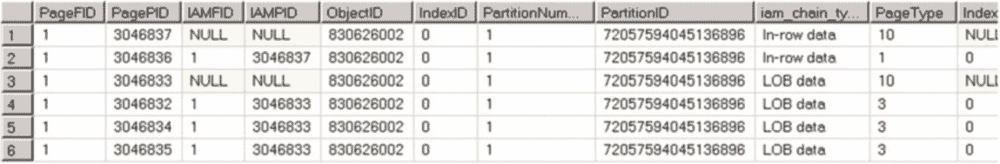

# 第 1 章 ■ 数据存储内部原理

## LOB 存储

对于 `text`、`ntext` 或 `image` 列，SQL Server 默认将数据存储在行外。它使用另一种称为 `LOB 数据页面` 的页面。

**注意** 你可以在一定程度上通过使用“行内文本”表选项来控制此行为。例如，`exec sp_table_option dbo.MyTable, 'text in row', 200` 强制 SQL Server 将小于或等于 200 字节的 LOB 数据存储在行内。大于 200 字节的 LOB 数据将存储在 LOB 页中。

逻辑 LOB 数据结构如 图 1-13 所示。

## 图 1-13. LOB 数据：逻辑结构

与行溢出数据类似，这里有一个指向另一段信息的指针，称为 `LOB 根结构`，其中包含一组指向其他数据页和行的指针。当 LOB 数据小于 32 KB 并且可以放入五个数据页时，LOB 根结构包含指向实际 LOB 数据块的指针。否则，LOB 树开始包含额外的中间级指针，类似于索引 B 树，我们将在下一章讨论。

让我们创建表并插入一行数据，如 清单 1-12 所示。我们需要将 `replicate` 函数的第一个参数强制转换为 `varchar(max)`。否则，`replicate` 函数的结果将被限制为 8,000 字节。

### 清单 1-12. LOB 数据：表创建

```sql
create table dbo.TextData
(
    ID int not null,
    Col1 text null
);

insert into dbo.TextData(ID, Col1) values (1, replicate(convert(varchar(max),'a'),16000));
```

该表的页分配情况如 图 1-14 所示。



## 第 1 章 ■ 数据存储内幕

### 图 1-14. LOB 数据：DBCC IND 结果

如你所见，该表有一个用于行内数据的数据页和三个用于 LOB 数据的数据页。我不会检查行内分配的数据行结构；它与行溢出分配类似。然而，对于 LOB 分配，表在指针中存储的元数据信息较少，使用 16 字节而不是行溢出指针所需的 24 字节。

存储 LOB 根结构的页的 `DBCC PAGE` 命令结果如 清单 1-13 所示。

### 清单 1-13. LOB 数据：包含 LOB 根结构的 LOB 页的 DBCC PAGE 结果

```text
Blob row at: Page (1:3046835) Slot 0 Length: 84 Type: 5 (LARGE_ROOT_YUKON)
Blob Id: 131661824 Level: 0 MaxLinks: 5 CurLinks: 2
Child 0 at Page (1:3046834) Slot 0 Size: 8040 Offset: 8040
Child 1 at Page (1:3046832) Slot 0 Size: 7960 Offset: 16000
```

如你所见，有两个指向包含 LOB 数据块的其他页的指针，这些数据块与 清单 1-11 中显示的 blob 数据类似。

SQL Server 存储来自 `(MAX)` 列（如 `varchar(max)`、`nvarchar(max)` 和 `varbinary(max)`）的数据的格式取决于实际数据大小。SQL Server 尽可能将其存储在行内。当无法进行行内分配且数据大小小于或等于 8,000 字节时，它将作为行溢出数据存储。超过 8,000 字节的数据将作为 LOB 数据存储。

**重要提示** `text`、`ntext` 和 `image` 数据类型已弃用，并将在未来版本的 SQL Server 中移除。请改用 `varchar(max)`、`nvarchar(max)` 和 `varbinary(max)` 列。

同样值得一提的是，SQL Server 始终使用行内分配来存储适合单个页面的行。当一页没有足够的可用空间来容纳一行时，SQL Server 会分配一个新页并将该行放在那里，而不是将其放在半满的页面上并将一些数据移动到行溢出页面。

## SELECT * 和 I/O

使用 `SELECT *` 运算符从表中选择所有列有很多缺点。它会通过传输客户端应用程序不需要的列来增加网络流量。它还使查询性能调优变得更加复杂，并且在表架构更改时会引入副作用。

## 第 1 章 ■ 数据存储内幕

建议避免使用这种模式，而是显式指定列列表。


##### SELECT * 与 I/O

客户端应用程序如何访问数据至关重要。这在行溢出和大对象（LOB）存储的情况下尤其重要，因为一行数据可能被分散存储在多个数据页中。SQL Server 需要读取所有这些页面，这会显著降低查询性能。

## 示例：表创建与数据插入

以 `dbo.Employees` 表为例，其中有一列用于存储员工图片。**清单 1-14** 创建了该表并填充了一些数据。

```sql
create table dbo.Employees
(
    EmployeeId int not null,
    Name varchar(128) not null,
    Picture varbinary(max) null
);

;with N1(C) as (select 0 union all select 0) -- 2 rows
,N2(C) as (select 0 from N1 as T1 cross join N1 as T2) -- 4 rows
,N3(C) as (select 0 from N2 as T1 cross join N2 as T2) -- 16 rows
,N4(C) as (select 0 from N3 as T1 cross join N3 as T2) -- 256 rows
,N5(C) as (select 0 from N4 as T1 cross join N2 as T2) -- 1,024 rows
,IDs(ID) as (select row_number() over (order by (select null)) from N5)
insert into dbo.Employees(EmployeeId, Name, Picture)
select
    ID, 'Employee ' + convert(varchar(5),ID),
    convert(varbinary(max),replicate(convert(varchar(max),'a'),120000))
from Ids;
```

该表包含 1,024 行数据，二进制数据总量为 120,000 字节。假设客户端应用程序中的代码需要 `EmployeeId` 和 `Name` 来填充下拉菜单。如果开发者不注意，可能会使用 `SELECT *` 模式编写查询语句，尽管该场景并不需要图片数据。

## 性能对比

让我们比较两个查询的性能：一个选择所有数据列，另一个只选择 `EmployeeId` 和 `Name`。**清单 1-15** 展示了实现代码。在我的计算机上，执行时间和读取次数如**表 1-1** 所示。

```sql
select * from dbo.Employees;

select EmployeeId, Name from dbo.Employees;
```

**表 1-1. 两个 SELECT 操作的执行时间**

| 查询语句 | 读取次数 | 执行时间 |
| :--- | :--- | :--- |
| `select EmployeeID, Name from dbo.Employees` | | 2 ms |
| `select * from dbo.Employees` | 90,895 | 3,343 ms |

