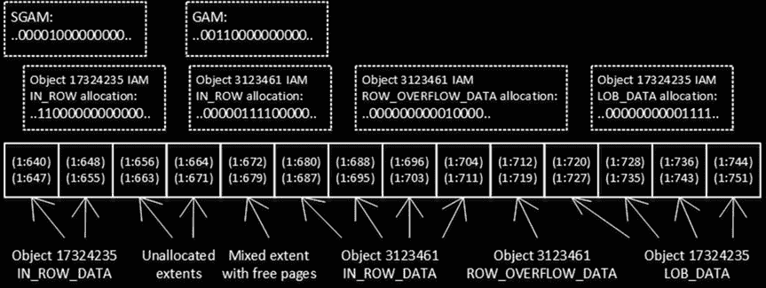

# 第一章 ■ 数据存储内部机制

如你所见，第一个查询读取了 LOB 数据并将其传输到客户端，比第二个查询慢了几个数量级。这在客户端应用程序使用对象关系映射（ORM）框架时变得极其重要。开发者倾向于在应用的不同部分复用相同的实体对象。结果，即使许多情况下并不需要所有数据，应用程序也可能加载所有属性/列。

更好的做法是根据具体的用例，定义具有最小必要属性集的不同实体。在我们的例子中，最好创建独立的实体/类，例如 `EmployeeList` 和 `EmployeeProperties`。`EmployeeList` 实体将包含两个属性：`EmployeeId` 和 `Name`。`EmployeeProperties` 则在前两者基础上增加 `Picture` 属性。这种方法可以显著提升系统性能。

#### 区与区分配映射页

SQL Server 在逻辑上将八个页面分组为 64 KB 的单元，称为**区**。有两种类型的区可用：**混合区**存储属于不同对象的数据，而**统一区**存储同一对象的数据。

默认情况下，创建新对象时，SQL Server 将其前八个对象页面存储在混合区中。此后，该对象的所有后续空间分配都使用统一区完成。

SQL Server 使用一种称为**分配映射**的特殊页面来跟踪文件中区和页面的使用情况。SQL Server 中有几种不同类型的分配映射页。

**全局分配映射（GAM）** 页跟踪区是否已被任何对象分配。数据以位图的形式表示，其中每个位指示一个区的分配状态。零位表示

相应的区正在使用中。值为 1 的位表示对应的区是空闲的。每个`GAM`页覆盖大约 64,000 个区，即近 4GB 的数据。这意味着每个数据库文件每约 4GB 的文件大小就有一个`GAM`页。

## 共享全局分配映射（SGAM）页
*共享全局分配映射（`SGAM`）* 页跟踪混合区的信息。与`GAM`页类似，它是一个位图，每个区对应一个位。如果对应的区是混合区并且至少有一个可用的空闲页，则该位的值为 1。否则，该位被设置为 0。与`GAM`页一样，一个`SGAM`页跟踪大约 64,000 个区，即近 4GB 的数据。

## 区分配状态
`SQL Server`可以通过查看`GAM`和`SGAM`页中对应的位来确定区的分配状态。表 1-2 显示了位值的可能组合。

### **表 1-2.** 区的分配状态
| **状态** | **SGAM 位** | **GAM 位** |
| :--- | :--- | :--- |
| 空闲，未使用 | 0 | 1 |
| 至少有一个可用空闲页的混合区 | 1 | 0 |
| 统一区或已满的混合区 | 0 | 0 |

## 查找区
当`SQL Server`需要分配一个新的统一区时，它可以使用`GAM`页中位值为 1 的任何区。当`SQL Server`需要在混合区中查找一个页时，它会搜索两个分配映射图，寻找在`SGAM`页中位值为 1 且在`GAM`页中对应位为 0 的区。如果没有这样的区可用，`SQL Server`会根据`GAM`页分配新的空闲区，并在`SGAM`页中将对应位设置为 1。

尽管混合区在数据库中能节省的空间微不足道，但它们需要`SQL Server`执行更多对分配映射图页的修改，这在繁忙的系统中可能成为争用的来源。这对于`tempdb`数据库尤其关键，因为小对象通常会以极快的速度被创建。

## 配置混合区分配
`SQL Server 2016`允许您通过设置`MIXED_PAGE_ALLOCATION`数据库选项，在数据库级别控制混合区的空间分配。默认情况下，该选项对于用户数据库是启用的，而对于`tempdb`是禁用的。在大多数情况下，此配置应该足够。

在 2016 之前的`SQL Server`版本中，您可以使用跟踪标志`T1118`在整个实例上禁用混合区的空间分配。设置此标志可以显著减少繁忙`OLTP`服务器上的分配映射图页争用，特别是对于`tempdb`数据库。**我建议您在每个`SQL Server`实例上将此标志设置为启动参数。**

## 分配映射图页的位置
每个数据库文件都有自己的`GAM`和`SGAM`页链。第一个`GAM`页始终是数据文件中的第三页（页号 2）。第一个`SGAM`页始终是数据文件中的第四页（页号 3）。接下来的`GAM`和`SGAM`页每隔 511,230 页出现在数据文件中，这使得`SQL Server`在需要时能够快速浏览它们。

## 索引分配映射（IAM）页
`SQL Server`使用另一组称为*索引分配映射（`IAM`）*的分配映射图页，来跟踪属于某个对象的不同类型页面（`IN_ROW_DATA`、`ROW_OVERFLOW`和`LOB`页）所使用的页和区。每个表/索引都有自己的一组`IAM`页，这些页被组合成称为*`IAM`链*的独立链表。每个`IAM`链覆盖自己的*分配单元*——`IN_ROW_DATA`、`ROW_OVERFLOW_DATA`和`LOB_DATA`。

链中的每个`IAM`页覆盖一个特定的`GAM`区间。`IAM`页代表一个位图，其中每个位指示相应的区是否存储了属于特定对象的特定分配单元的数据。此外，对象的第一个`IAM`页存储了对象前八个页的实际页地址，这些页存储在混合区中。

图 1-15 展示了分配映射图页位图的简化版本。

### **图 1-15.** 分配映射图页
■ **注意** 分区表和索引的每个分区都有单独的`IAM`链。我们将在……讨论

