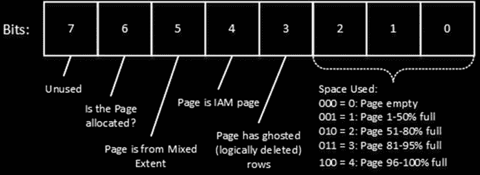
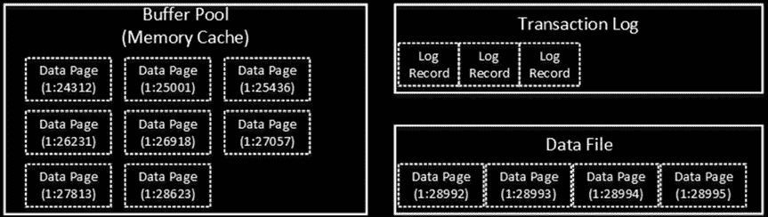
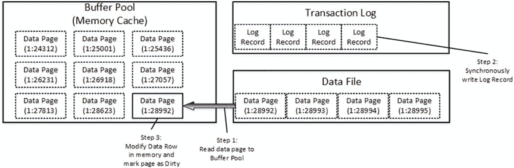
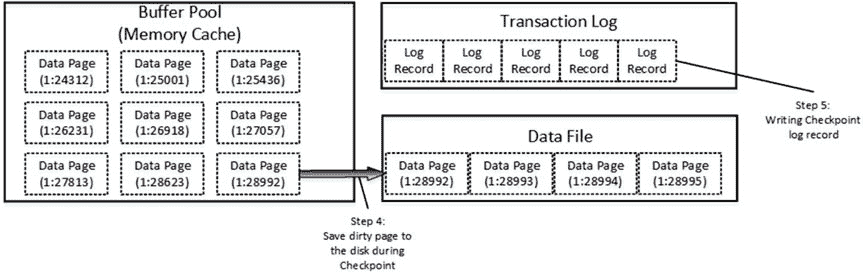

# 第 1 章 ■ 数据存储内部原理

分区表将在[第 16 章，“数据分区”](http://dx.doi.org/10.1007/978-1-4842-1964-5_16)中进行更详细的讨论。

还有另一种类型的分配映射页，称为*页空闲空间 (PFS)*。尽管名称如此，PFS 页跟踪的是几种不同的信息。我们可以将 PFS 视为一个字节掩码，其中每个字节存储关于特定页的信息，如图 1-16 所示。



***图 1-16.** PFS 页中的页状态字节*

该字节的前三位表示页面上已用空间的百分比。SQL Server 会跟踪行溢出数据和 LOB 数据的已用空间，以及堆表中行内数据的已用空间，我们将在下一章讨论这些内容。这些是页面上空闲空间量唯一重要的情况。

当你从表中删除数据行时，SQL Server 并不会将其从数据页中移除，而是将该行标记为已删除。第 3 位表示页面是否具有逻辑删除（幽灵）行。我们将在本章后面讨论删除过程。

第 4 位表示该页是否为 IAM 页。第 5 位表示该页是否在混合区中。最后，第 6 位表示该页是否已分配。

每个 PFS 页跟踪 8,088 个页面，大约 64 MB 的数据空间。它总是文件中的第二个页面（页面 1），并且此后每 8,088 个页面重复一次。

还有另外两种类型的分配映射页。文件中的第七个页面（页面 6）称为*差异更改映射 (DCM)*。这些页面跟踪自上次完整数据库备份以来已被修改的区。SQL Server 在执行差异备份时使用 DCM 页。

最后一个分配映射称为*批量更改映射 (BCM)*。它是文件中的第八个页面（页面 7），指示自上次事务日志备份以来，哪些区在最小日志记录操作中被修改。BCM 页仅在大容量日志数据库恢复模型中使用。

**注意：** 我们将在本书的第六部分讨论不同类型的备份和恢复模型。

DCM 和 BCM 页都是位掩码，覆盖数据文件中的 511,230 个页面。

#### 数据修改

SQL Server 不会直接读取或修改磁盘上的数据行。每次访问数据时，SQL Server 都会将其读入内存。

让我们看看数据修改过程中发生了什么。图 1-17 显示了更新操作之前的数据库初始状态。有一个称为*缓冲池*的内存缓存，缓存了一些数据页。




***图 1-17.** 数据修改：初始阶段*

假设你想要更新页面`(1:28992)`中的数据行。此页面不在缓冲池中，SQL Server 需要从磁盘读取该数据页。

当页面在内存中时，SQL Server 更新数据行。此过程包括两个不同的步骤。首先，SQL Server 生成一个新的事务日志记录，并将其*同步*写入事务日志文件。接着，它修改数据行并将数据页标记为已修改（脏页）。图 1-18 说明了这一点。

***图 1-18.** 数据修改：修改数据*

即使数据行的新版本尚未保存到数据文件中，事务日志记录也包含足够的信息，以便在需要时重做（重做）该更改。

最后，在某个时间点，SQL Server 将脏数据页*异步*保存到数据文件中，并将一个特殊的日志记录写入事务日志。此过程称为*检查点*。图 1-19 说明了检查点过程。



***图 1-19.** 数据修改：检查点*

插入过程的工作方式类似。SQL Server 将需要插入新数据行的数据页读入缓冲池，或者在需要时分配一个新的区/页。之后，SQL Server...


同步保存事务日志记录，在页面中插入一行，并异步将数据页保存到磁盘。

删除操作的过程也类似。如前所述，当你删除一行时，SQL Server 并不会从页面中物理删除该行，而是通过状态位将被删除的行标记为**幽灵（已删除）**。这加速了删除操作，并在必要时允许 SQL Server 快速撤销它。

删除过程还会在 PFS 页面中设置一个标志，指示该页面上存在幽灵行。SQL Server 通过一个名为 `ghost cleanup` 的任务在后台移除这些幽灵行。

SQL Server 还有另一个名为 `lazy writer`（惰性写入器）的进程，它可以将脏页保存到磁盘。与检查点（checkpoint）相反，检查点在保持脏数据页在缓冲池的同时将其保存；而惰性写入器则处理**最近最少使用**的数据页（SQL Server 在内部跟踪缓冲池页面使用情况），将它们从内存中释放。它会同时释放脏页和干净页，在此过程中将脏数据页保存到磁盘。可以想见，惰性写入器在遇到内存压力或 SQL Server 需要将更多数据页放入缓冲池时运行。

有两个关键点你需要记住。首先，当 SQL Server 处理 DML 查询（`SELECT`、`INSERT`、`UPDATE`、`DELETE` 和 `MERGE`）时，它总是先将数据页加载到缓冲池，然后才处理数据。其次，当你修改数据时，SQL Server 会同步将日志记录写入事务日志。而修改后的数据页则在后台被异步保存到数据文件中。

## 关于数据行大小的详细探讨

如你所知，SQL Server 是一个 I/O 密集型应用程序。SQL Server 可以产生巨大的 I/O 活动，尤其是在处理由大量并发用户访问的大型数据库时。

影响查询性能的因素有很多，而涉及的 I/O 操作数量是重中之重；也就是说，一个查询需要执行的 I/O 操作越多，它需要读取的数据页就越多，速度也就越慢。

数据行的大小影响着一个数据页能容纳多少行。较大的数据行需要更多的页面来存储数据，因此会增加扫描期间的 I/O 操作次数。此外，对象在缓冲池中也会占用更多内存。

让我们看下面的例子，并创建两个表，如 清单 1-16 所示。第一个表 `dbo.LargeRows` 使用 `char(2000)` 定长数据类型来存储数据。结果是，无论 `Col` 数据大小如何，每个数据页只能容纳四行。第二个表 `dbo.SmallRows` 使用 `varchar(2000)` 变长数据类型。让我们用相同的数据填充这两个表。

### 第 1 章 ■ 数据存储内部机制

***清单 1-16.*** 数据行大小与性能：表创建

```sql
create table dbo.LargeRows
(
    ID int not null,
    Col char(2000) null
);

create table dbo.SmallRows
(
    ID int not null,
    Col varchar(2000) null
);

;with N1(C) as (select 0 union all select 0) -- 2 行
,N2(C) as (select 0 from N1 as T1 cross join N1 as T2) -- 4 行
,N3(C) as (select 0 from N2 as T1 cross join N2 as T2) -- 16 行
,N4(C) as (select 0 from N3 as T1 cross join N3 as T2) -- 256 行
,N5(C) as (select 0 from N4 as T1 cross join N4 as T2) -- 65,536 行
,IDs(ID) as (select row_number() over (order by (select null)) from N5)
insert into dbo.LargeRows(ID, Col)
select ID, 'Placeholder' from Ids;

insert into dbo.SmallRows(ID, Col)
select ID, 'Placeholder' from dbo.LargeRows;
```

现在，让我们运行扫描数据的 SELECT 查询，并比较 I/O 操作次数和执行时间。你可以在清单 1-17 中看到代码。我在自己计算机上得到的结果如表 1-3 所示。

***清单 1-17.*** 数据行大小与性能：SELECT 语句

```sql
select count(*) from dbo.LargeRows;
select count(*) from dbo.SmallRows;
```

***表 1-3.*** *查询的读取次数和执行时间*


## 读取次数

## 执行时间

```sql
select count(*) from dbo.SmallRows
```

5 ms

```sql
select count(*) from dbo.LargeRows
```

16,384

31 ms

如你所见，在扫描 `dbo.LargeRows` 数据时，SQL Server 需要执行大约多 70 倍的读取操作，这导致了更长的执行时间。

### 减少数据行的大小

你可以通过减小数据行的大小来提高系统性能。实现这一目标的方法之一是在创建表时，使用能够覆盖字段值域的最小数据类型。例如：

•   使用 `bit` 而不是 `tinyint`、`smallint` 或 `int` 来存储布尔值。`bit` 数据类型每八个列使用一个字节的存储空间。
•   根据你需要的精度，选择合适的日期/时间数据类型。例如，订单录入系统可以使用 `smalldatetime`（4 字节存储空间）或 `datetime2(0)`（6 字节存储空间），而不是 `datetime`（8 字节存储空间），只要一分钟或一秒的精度就足够了。
•   尽可能使用 `decimal` 或 `real` 而不是 `float`。同样，存储货币值时使用 `money` 或 `smallmoney` 数据类型，而不是 `float`。
•   除非数据总是被填充且大小固定，否则不要使用大型定长 `char`/`binary` 数据类型。

### 表设计示例

作为一个例子，我们来看表 1-4，它展示了为收集位置信息的表设计的两种不同方案。

**表 1-4.** 收集位置信息的表

```sql
create table dbo.Locations
(
    ATime datetime not null, -- 8 bytes
    Latitude float not null, -- 8 bytes
    Longitude float not null, -- 8 bytes
    IsGps int not null, -- 4 bytes
    IsStopped int not null, -- 4 bytes
    NumberOfSatellites int not null, -- 4 bytes
)
```

总计：36 字节

```sql
create table dbo.Locations2
(
    ATime datetime2(0) not null, -- 6 bytes
    Latitude decimal(9,6) not null, -- 5 bytes
    Longitude decimal(9,6) not null, -- 5 bytes
    IsGps bit not null, -- 1 byte
    IsStopped bit not null, -- 0 bytes
    NumberOfSatellites tinyint not null, -- 1 byte
)
```

总计：18 字节

表 `dbo.Locations2` 每行数据少用了 18 字节的存储空间。在单行数据的范畴内，这看起来并不特别令人印象深刻；然而，它很快就会累积起来。如果一个系统每天收集 1,000,000 个位置，每行节省 18 字节意味着每天大约节省 18 MB 的空间——每年则节省 6.11 GB。除了数据库空间之外，这还会影响缓冲池内存使用、备份文件大小、网络带宽以及其他一些方面。

对于云中的数据库来说，这一点尤其重要，因为过量的数据通常会迫使你使用更高层级的虚拟机和云服务，并升级到高级存储。所有这些都可能显著增加你每月的服务成本。

同时，你需要谨慎使用这种方法，不要过于吝啬。例如，为 `CustomerId` 列选择 `smallint` 作为数据类型并不是一个明智的举动。即使当你刚开始开发一个新系统时，32,768（甚至 65,536）个客户看起来足够用了，但将来将数据类型从 `smallint` 更改为 `int` 的代码重构和变更成本可能会非常高。

#### 表的修改

让我们看看当你修改表时会发生什么。SQL Server 可以通过三种不同的方式处理，如下所示：

1.  修改只需要更改元数据。此类修改的例子包括删除列、将不允许为空的列更改为允许为空，或向表中添加一个允许为空的列。
2.  修改只需要更改元数据，但 SQL Server 需要扫描表数据以确保其符合新定义。你可以将把一个允许为空的列更改为不允许为空作为一个例子。在更改表元数据之前，SQL Server 需要扫描表中所有数据行，以确保特定列中没有存储空值。另一个例子是将列数据类型更改为值域范围更小的类型。如果


