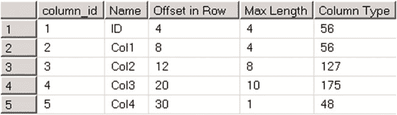
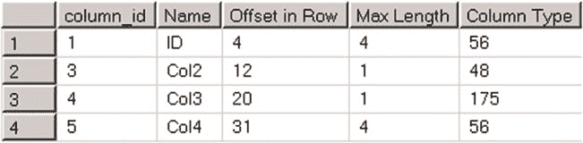
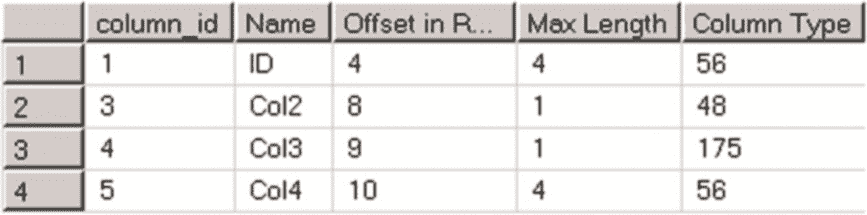

# 第 1 章 ■ 数据存储内部机制

## 3.

修改操作不仅需要更改元数据，还需要更改每个数据行。此类操作的一个示例是更改列数据类型，且这种更改需要采用不同的存储格式或进行类型转换。例如，当你将固定长度的 `char` 列更改为 `varchar` 时，SQL Server 需要将数据从行的固定长度部分移动到可变长度部分。另一个示例是将 `char` 数据类型更改为 `int`。只要所有 `char` 值都可以转换为 `int`，此操作就有效，但 SQL Server 必须物理更新表中的每个数据行以进行数据转换。

值得注意的是，修改期间的表锁定行为因版本和版本而异。例如，SQL Server 2012 的企业版允许添加一个新的 `NOT NULL` 列，即时将信息存储在元数据级别，而无需更改表中的每一行。再举一个例子，SQL Server 2016 增加了在线更改列以及添加和删除主键及唯一约束的选项，其底层使用的技术与在线索引重建相同。

■ **注意** 我们将在本书第三部分更详细地讨论 SQL Server 锁定和并发模型。

不幸的是，表修改永远不会减少数据行的大小。当你从表中删除列时，SQL Server 不会回收该列曾经占用的空间。

当你将数据类型更改为更短的数据长度时，例如从 `int` 改为 `smallint`，SQL Server 会继续使用与之前相同大小的存储空间，同时检查行值是否符合新的数据类型域值。

当你将数据类型更改为更长的数据长度时，例如从 `int` 改为 `bigint`，SQL Server 会在底层添加新列，并将原始数据复制到所有数据行中的新列，同时保留旧列使用的空间不变。

让我们看下面的例子。代码清单 1-18 创建了一个表并检查了表上的列偏移量。

***代码清单 1-18.*** 表修改：创建表并检查原始列偏移量

```sql
create table dbo.AlterDemo
(
    ID int not null,
    Col1 int null,
    Col2 bigint null,
    Col3 char(10) null,
    Col4 tinyint null
);

select
    c.column_id, c.Name, ipc.leaf_offset as [Offset in Row]
    ,ipc.max_inrow_length as [Max Length], ipc.system_type_id as [Column Type]
from
    sys.system_internals_partition_columns ipc join sys.partitions p on
        ipc.partition_id = p.partition_id
    join sys.columns c on
        c.column_id = ipc.partition_column_id and
        c.object_id = p.object_id
where p.object_id = object_id(N'dbo.AlterDemo')
order by c.column_id;
```





图 1-20 显示了查询结果。表中的所有列都是固定长度的。`Offset in Row` 列表示数据列在行中的起始偏移量。`Max Length` 列指定了该列使用了多少字节的数据。最后，`Column Type` 列显示了该列的系统数据类型。

***图 1-20.** 表修改：修改前的列偏移量*

现在，让我们执行一些修改操作，如 代码清单 1-19 所示。

***代码清单 1-19.*** 表修改：修改表

```sql
alter table dbo.AlterDemo drop column Col1;
alter table dbo.AlterDemo alter column Col2 tinyint;
alter table dbo.AlterDemo alter column Col3 char(1);
alter table dbo.AlterDemo alter column Col4 int;
```

如果你再次检查列偏移量，会看到如图 1-21 所示的结果。

***图 1-21.** 表修改：修改后的列偏移量*



尽管我们删除了 `Col1` 列，但 `Col2` 和 `Col3` 列的偏移量并未改变。此外，`Col2` 和 `Col3` 列都只需要一个字节来存储数据，尽管它


