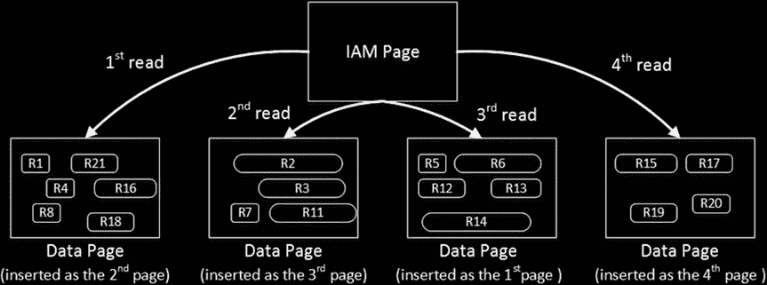
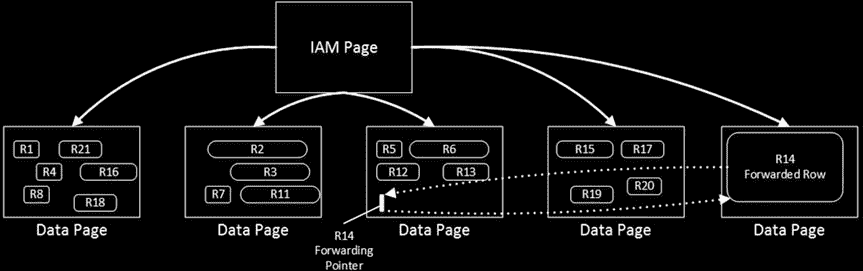

# SQL Server 数据存储内部机制

最后，`Col4` 列的偏移量已被更改。该列的数据长度已增加，而 SQL Server 创建了新列以容纳新的数据类型值。

在修改之前，一行需要 27 字节来存储数据。此次修改将所需存储空间增加到了 31 字节，即使实际数据大小仅为 10 字节。这样每行浪费了 21 字节的存储空间。

回收空间的唯一方法是重建堆表或聚集索引，我们将在第 6 章中讨论这一点。

如果你使用 `ALTER TABLE dbo.AlterDemo REBUILD` 命令重建表，并再次检查列偏移量，你将看到如图 1-22 所示的结果。

**图 1-22.** 表修改：表重建后的列偏移量

正如你所见，表重建从行中回收了未使用的空间。

最后，表修改要求 SQL Server 在表上获取一个架构修改锁。这会使该表在修改期间对其他会话不可访问。我们将在第 23 章“架构锁”中详细讨论架构锁。

#### 总结

SQL Server 将数据存储在由一个或多个事务日志文件和一个或多个数据文件组成的数据库中。数据文件被组合到文件组中。文件组将数据库文件结构与数据库对象抽象开来，这些对象在逻辑上存储在文件组中，而不是数据库文件中。你应该考虑为任何存储易失性数据的文件组创建多个数据文件。

在数据库还原和日志文件自动增长期间，SQL Server 总是将事务日志清零。默认情况下，它也会将数据文件清零，除非启用了即时文件初始化。即时文件初始化显著减少了数据库恢复时间，并使数据文件自动增长成为即时操作。然而，即时文件初始化存在一个小的安全风险，因为数据库未初始化的部分可能包含先前删除的操作系统文件的数据。尽管如此，如果这种风险可以接受，建议你启用即时文件初始化。

SQL Server 将信息存储在组合成扩展区的 8,000 个数据页中。有两种类型的扩展区。混合扩展区存储来自不同对象的数据。统一扩展区存储属于单个对象的数据。SQL Server 将前八个对象页存储在混合扩展区中。之后，在对象空间分配期间仅使用统一扩展区。你应该考虑启用跟踪标志 `T1118` 以防止混合扩展区空间分配，并减少分配映射页争用。

SQL Server 使用特殊的映射页来跟踪文件中的分配。有几种分配映射类型。`GAM` 页跟踪哪些扩展区已分配。`SGAM` 页跟踪可用的混合扩展区。`IAM` 页跟踪对象（分区）级别的分配单元使用的扩展区。`PFS` 存储页面的几个属性，包括堆表以及行溢出和 `LOB` 页中页面上的可用空间。

## 第 1 章 ■ 数据存储内部机制

SQL Server 将实际数据存储在数据行中。有两种不同的数据类型可用。定长数据类型始终使用相同的存储空间，无论值是什么，即使是 `NULL`。变长数据存储使用实际的数据值大小。

行的定长部分和内部开销必须适合单个数据页。变长数据可以根据实际数据大小和数据类型存储在单独的数据页中，例如行溢出和 `LOB` 页。

SQL Server 将数据页读取到称为缓冲池的内存缓存中。当数据被修改时，SQL Server 将日志记录同步写入事务日志。它在检查点和延迟写入器进程中异步保存修改后的数据页。


SQL Server 是一个 I/O 密集型应用程序，减少 I/O 操作次数有助于提升系统性能。通过使用最优的数据类型来减小数据行的大小是有益的，这允许你在数据页中存放更多行，并减少扫描操作期间需要处理的数据页数量。

修改表时需要小心。这个过程永远不会减小行的大小。行中未使用的空间可以通过重建表或聚集索引来回收。

## 表和索引：内部结构与访问方法

SQL Server 将数据存储在表和索引中。它们代表属于单个实体或对象的数据页及其行的集合。

默认情况下，表中的数据是未排序的。你可以通过在表上定义聚集索引，以排序顺序存储数据。此外，你可以创建非聚集索引，它们会持久化保存索引列数据的另一份副本，并以不同的顺序排序。

在本章中，我们将讨论索引的内部结构，介绍 SQL Server 如何使用它们，并探讨如何以高效利用它们的方式编写查询。

#### 堆表

`堆表`是没有聚集索引的表。堆表中的数据是未排序的。SQL Server 不保证也不维护堆表中数据的排序顺序。

当你向堆表插入数据时，SQL Server 会尽可能填满数据页，尽管它并不分析页面上实际可用的剩余空间。它使用的是 `页面可用空间 (PFS)` 分配图。SQL Server 采取谨慎策略，在估算期间使用 PFS 可用空间百分比范围中的低值。

例如，如果一个数据页存储了 4,100 字节的数据，因此有 3,960 字节的可用空间，PFS 会指示该页面的填充度为 51–80%。如果新行的大小超过页面大小的 20%（`8,060 字节 * 0.2 = 1,612 字节`），SQL Server 就不会将该新行放入此页面。让我们通过清单 2-1 中的代码来检查此行为并创建表。

***清单 2-1.*** 向堆表插入数据：创建表

```
create table dbo.Heap
(
    Val varchar(8000) not null
);

;with CTE(ID,Val)
as
(
    select 1, replicate('0',4089)
    union all
    select ID + 1, Val from CTE where ID < 20
)
insert into dbo.Heap
select Val from CTE;

select page_count, avg_record_size_in_bytes, avg_page_space_used_in_percent
from sys.dm_db_index_physical_stats(db_id(),object_id(N'dbo.Heap'),0,null,'DETAILED');
```

清单 2-1 代码的输出如下：

结果：每页一行。使用了 4,100 字节。每页有 3,960 字节可用。

```
page_count avg_record_size_in_bytes avg_page_space_used_in_percent
----------- ------------------------- -------------------------------
20          4100                      50.6548060291574
```

此时，表存储了 20 行，每行 4,100 字节。SQL Server 分配了 20 个数据页——每行一页——每页有 3,960 字节可用。PFS 会指示这些页面的填充度为 51–80%。

清单 2-2 中的代码插入了一个小的 111 字节行，大约是页面大小的 1.4%。结果，SQL Server 知道该行可以放入现有的某个页面（所有现有页面都至少有 20% 的可用空间），因此不应分配新页面。

***清单 2-2.*** 向堆表插入数据：插入一个小行

```
insert into dbo.Heap(Val) values(replicate('1',100));

select page_count, avg_record_size_in_bytes, avg_page_space_used_in_percent
from sys.dm_db_index_physical_stats(db_id(),object_id(N'dbo.Heap'),0,null,'DETAILED');
```

清单 2-2 代码的输出如下：


结果：已向现有页之一插入了一行 100 字节的数据（100 字节 ≈ 页大小的 1.4%）

```
page_count avg_record_size_in_bytes avg_page_space_used_in_percent
----------- ------------------------- --------------------------------
20 3910.047 50.7246108228317
```

最后，第三个插入语句（如代码清单 2-3 所示）的行需要 2,011 字节，大约是页大小的 25%。SQL Server 不知道现有页中是否有足够的空闲空间来容纳该行，因此它会分配一个新页。通过检查实际空闲空间并利用 PFS 数据进行估算，你可以看到 SQL Server 并未访问现有页。



## 第 2 章 ■ 表和索引：内部结构与访问方法

**代码清单 2-3.** 向堆表插入数据：插入大行

```sql
insert into dbo.Heap(Val) values(replicate('2',2000));

select page_count, avg_record_size_in_bytes, avg_page_space_used_in_percent
from sys.dm_db_index_physical_stats(db_id(),object_id(N'dbo.Heap'),0,null,'DETAILED');
```

以下是代码清单 2-3 的输出：

```
结果：已为 2000 字节的行分配新页（2000 字节 ≈ 页大小的 25%）

page_count avg_record_size_in_bytes avg_page_space_used_in_percent
----------- ------------------------- -------------------------------
21 3823.727 49.4922782307882
```

这种行为导致 SQL Server 不必要地分配新的数据页，留下大量未使用的空闲空间。当行的大小各不相同——在这些情况下，SQL Server 最终会用较小的行填充空隙——这并不总是问题。然而，特别是在所有行都相对较大的情况下，最终可能导致数据页上存在大量未使用的空间。

当从堆表中选择数据时，SQL Server 使用*索引分配映射（IAM）*来查找需要扫描的页和区。它分析哪些区属于该表，并根据它们的分配顺序进行处理，而不是根据数据插入的顺序。图 2-1 说明了这一点。

**图 2-1.** 从堆表中选择数据

当你在堆表中更新一行时，SQL Server 会尝试在同一页面上容纳它。如果没有可用的空闲空间，SQL Server 会将该行的新版本移动到另一页，并用一个特殊的 16 字节行（称为*转发指针*）替换旧行。该行的新版本称为*被转发行*。图 2-2 说明了这一点。



## 第 2 章 ■ 表和索引：内部结构与访问方法

**图 2-2.** 转发指针

使用转发指针主要有两个原因。首先，它们可以防止更新引用该行的非聚集索引键。我们将在本章后面更详细地讨论非聚集索引。

此外，转发指针有助于最小化重复读取的数量；即，在表扫描期间多次读取同一行的情况。让我们以图 2-2 为例，假设 SQL Server 按从左到右的顺序扫描页面。进一步假设，在 SQL Server 读取第 4 页时，第 3 页中的行在页面被读取之后被修改。该行的新版本将被移动到第 5 页，而该页尚未处理。如果没有转发指针，SQL Server 将不知道旧行版本已被读取，并会在扫描第 5 页时再次读取它。有了转发指针，SQL Server 会忽略被转发的行——它们在数据行的*状态位 A* 字节中设置了一个位。

尽管转发指针有助于最小化重复读取，但它们同时也会引入额外的读取操作。SQL Server 会跟随转发指针并读取行的新版本。


