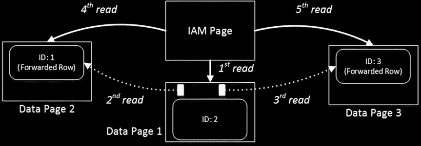
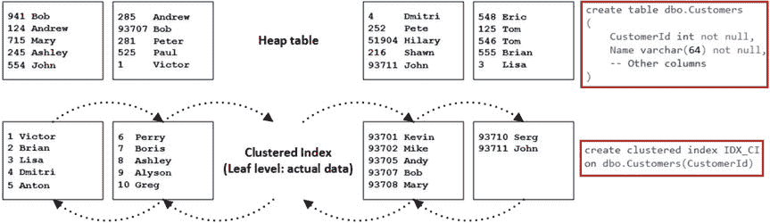
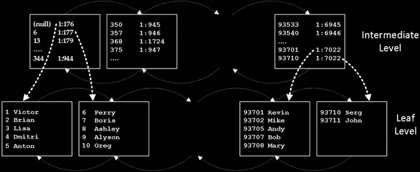
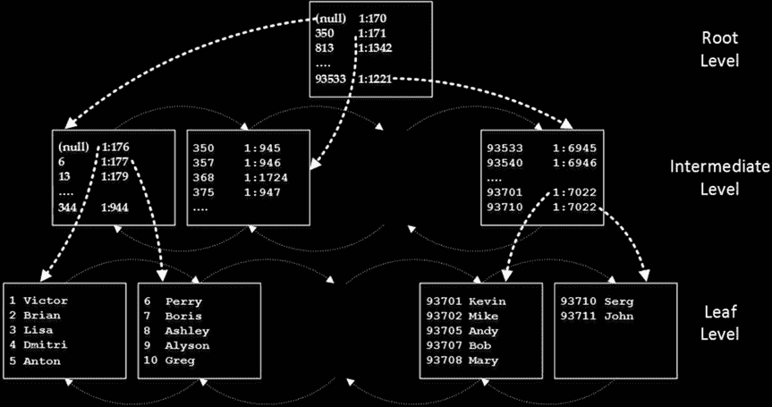

# 第 2 章 ■ 表与索引：内部结构与访问方法

在遇到行时立即处理它们。这种行为可能会导致过多的 I/O 操作。

让我们来看下面的例子，创建表，并使用清单 2-4 中所示的代码插入三行数据。

## 清单 2-4. 转发指针与 I/O：表创建及插入三行数据

```sql
create table dbo.ForwardingPointers
(
    ID int not null,
    Val varchar(8000) null
);

insert into dbo.ForwardingPointers(ID,Val)
values(1,null),(2,replicate('2',7800)),(3,null);

select page_count, avg_record_size_in_bytes, avg_page_space_used_in_percent
    ,forwarded_record_count
from sys.dm_db_index_physical_stats(db_id(),object_id(N'dbo.ForwardingPointers'),0
    ,null,'DETAILED');

set statistics io on

select count(*) from dbo.ForwardingPointers;
```


以下是清单 2-4 代码的输出：

```
page_count avg_record_size_in_bytes avg_page_space_used_in_percent forwarded_record_count
--------- ---------------------- --------------------------- --------------------
1 2612.333 98.8742278230788 0

Table 'ForwardingPointers'. Scan count 1, logical reads 1
```

正如你在图 2-3 中所见，所有三行都容纳在单个页面中，SQL Server 在扫描表时只需读取该页面。

## 图 2-3. 转发指针与 I/O：表创建后的数据页

现在，让我们通过增加其中两行的大小来更新它们。更新后的行版本将不再适合该页面，这导致分配两个新页面和两个转发指针。清单 2-5 展示了此操作的代码。

## 清单 2-5. 转发指针与 I/O：增加行的大小

```sql
update dbo.ForwardingPointers set Val = replicate('1',5000) where ID = 1;
update dbo.ForwardingPointers set Val = replicate('3',5000) where ID = 3;

select page_count, avg_record_size_in_bytes, avg_page_space_used_in_percent, forwarded_record_count
from sys.dm_db_index_physical_stats(db_id(),object_id(N'dbo.ForwardingPointers'),0,null
    ,'DETAILED');

set statistics io on

select count(*) from dbo.ForwardingPointers
```

以下是清单 2-5 代码的输出：

```
page_count avg_record_size_in_bytes avg_page_space_used_in_percent forwarded_record_count
--------- --------------------- ---------------------------- --------------------
3 3577.4 73.6800963676798 2

Table 'ForwardingPointers'. Scan count 1, logical reads 5
```

当 SQL Server 从第 1 页读取转发指针行时，它会跟随指针并立即读取第 2 和第 3 页。之后，在常规的 IAM 扫描过程中，SQL Server 会再次读取这些页面。结果是，我们得到了五次读操作，即使我们的表只有三个数据页。图 2-4 说明了这一点。



## 图 2-4. 转发指针与 I/O：存在转发指针时的读取数据

如你所见，大量的转发指针会导致额外的 I/O 操作，并显著降低访问数据的查询的性能。本书的附带材料包含一个脚本，该脚本通过一个包含大量数据的表以较大的规模演示了这个问题。

当通过另一次更新减小了已转发行的大小，并且带有转发指针的数据页有足够空间容纳该行的更新版本时，SQL Server 可能会将其移回原始数据页并删除转发指针行。然而，消除所有转发指针唯一可靠的方法是重建堆表。你可以使用 `ALTER TABLE REBUILD` 语句来实现。

堆表在暂存环境中可能很有用，例如当你需要导入大量数据时。


#### 聚集索引

尽快将数据插入系统。将数据插入堆表通常比插入带有聚集索引的表更快。然而，在常规工作负载下，具有聚集索引的表通常比堆表性能更好，因为空间控制不佳以及由转发音指针引入的额外 I/O 操作会影响堆表性能。

聚集索引决定了表中数据的物理顺序，数据按照聚集索引键进行排序。一个表只能定义一个聚集索引。

假设你想在包含数据的堆表上创建一个聚集索引。如图 2-5 所示，第一步，SQL Server 会创建数据的另一份副本，然后根据聚集键的值对其进行排序。数据页在一个双向链表中链接，每个页面都包含指向链中下一个和上一个页面的指针。这个列表被称为索引的 `叶子层级`，它包含了实际的表数据。





第 2 章 ■ 表与索引：内部结构与访问方法

**图 2-5.** 聚集索引结构：叶子层级

**注意：** 页面上的排序顺序由槽位数组控制。页面上的实际数据是未排序的。

## 叶子层级、中间层级和根层级

当叶子层级由多个页面组成时，SQL Server 开始构建索引的 `中间层级`，如图 2-6 所示。

**图 2-6.** 聚集索引结构：中间层级与叶子层级

中间层级为每个叶子层级页面存储一行。它存储两条信息：物理地址和它引用的页面上索引键的最小值。唯一的例外是第一页的第一行，SQL Server 在此处存储 `NULL` 而不是最小索引键值。通过这种优化，当您插入具有表中最低键值的行时，SQL Server 无需更新非叶子层级的行。

中间层级上的页面也链接在双向链表中。SQL Server 添加越来越多的中间层级，直到存在一个仅包含单个页面的层级。该层级被称为 `根层级`，它成为索引的入口点，如图 2-7 所示。



第 2 章 ■ 表与索引：内部结构与访问方法

**图 2-7.** 聚集索引结构：根层级

如您所见，索引始终有一个叶子层级、一个根层级以及零个或多个中间层级。唯一的例外是索引数据能放入单个页面时。在这种情况下，SQL Server 不会创建单独的根层级页面，索引仅由单个叶子层级页面组成。

## 索引层级计算

索引中的层级数量主要取决于行大小和索引键大小。例如，在 4 字节整数列上的索引，在中间和根层级每行需要 13 字节。这 13 字节包括一个 2 字节的槽位数组条目、一个 4 字节的索引键值、一个 6 字节的页面指针和一个 1 字节的行开销，这对于不含可变长度和 `NULL` 列的索引键来说是足够的。

因此，您每页可以容纳 `8,060 字节 / 13 字节/行 = 620 行`。这意味着，仅有一个中间层级，您就可以存储最多 `620 * 620 = 384,400` 个叶子层级页面的信息。

如果您的数据行大小为 200 字节，您可以在每个叶子层级页面存储 40 行，并且在仅有三层的索引中存储多达 15,376,000 行数据。向索引添加另一个中间层级基本上可以覆盖所有可能的整数值。

**注意：** 在实际应用中，索引碎片会减少这些数字。我们将在第 6 章讨论索引碎片。

## 从索引中读取数据

SQL Server 可以通过三种不同的方式从索引中读取数据。第一种是 `有序扫描`。假设我们要运行 `SELECT Name FROM dbo.Customers ORDER BY`


