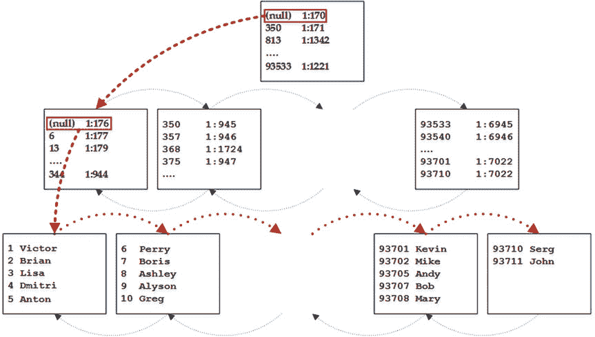
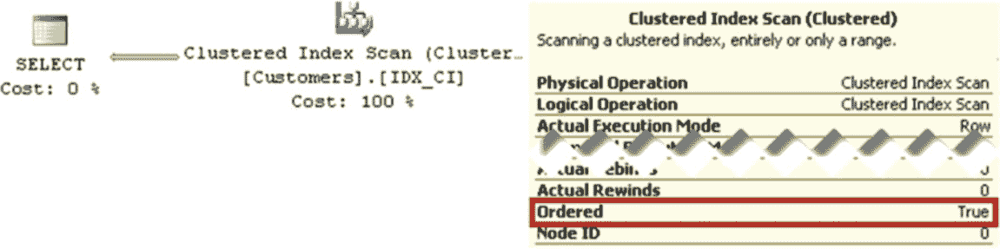
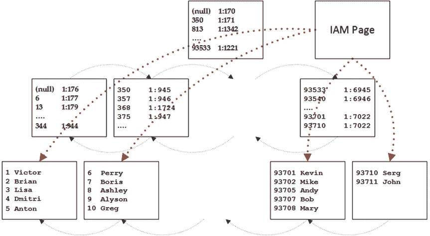
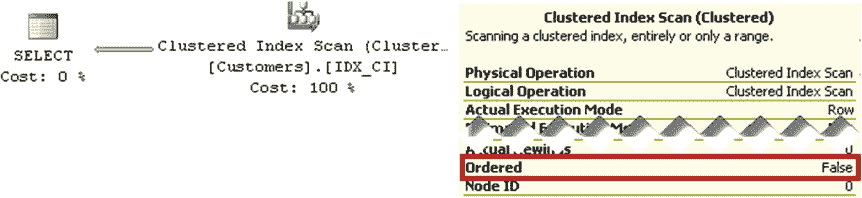
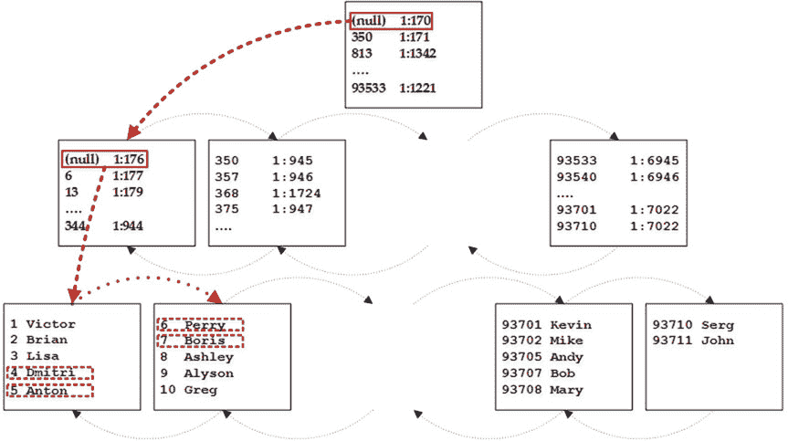

# 第二章 ■ 表与索引：内部结构与访问方法

## CustomerId 查询

索引叶子层的数据已经根据 `CustomerId` 列值排序。因此，`SQL Server` 可以从索引叶子层的第一页扫描到最后一页，并按存储顺序返回这些行。

`SQL Server` 从索引的根页开始，读取其中的第一行。该行指向一个中间页，该中间页包含表中具有最小键值的行。`SQL Server` 读取该页并重复此过程，直到找到叶子层的第一页。然后，`SQL Server` 开始逐行读取，沿着页面的链表移动，直到所有行都被读取。图 2-8 展示了这一过程。

## 图 2-8. 有序索引扫描

前述查询的执行计划显示了 **Clustered Index Scan** 运算符，其 **Ordered** 属性设置为 `true`，如图 2-9 所示。

## 图 2-9. 有序索引扫描执行计划

值得一提的是，触发有序扫描并不需要 `ORDER BY` 子句。有序扫描仅意味着 `SQL Server` 按照索引键的顺序读取数据。

`SQL Server` 可以双向导航索引，向前或向后。然而，有一个重要的方面您必须牢记：在向后索引扫描期间，`SQL Server` 不使用并行处理。

### 提示
您可以通过检查执行计划中的 `INDEX SCAN` 或 `INDEX SEEK` 运算符属性来查看扫描方向。但请注意，`Management Studio` 在执行计划的图形表示中不显示这些属性。您需要通过在执行计划中选择运算符并选择 `View/Properties Window` 菜单项或按 `F4` 键来打开 `Properties` 窗口才能看到它。

`SQL Server` 的 `Enterprise Edition` 有一项名为 `merry-go-round scan`（循环扫描）的优化功能，允许多个任务共享同一次索引扫描。假设您有一个正在扫描索引的会话 `S1`。在扫描过程中的某个时刻，另一个会话 `S2` 运行了一个需要扫描相同索引的查询。通过 `merry-go-round scan`，`S2` 会加入到 `S1` 当前的扫描位置。`SQL Server` 每页只读取一次，将行传递给两个会话。

当 `S1` 的扫描到达索引末尾时，`S2` 会从索引开头开始扫描数据，直到其开始扫描的点。`merry-go-round scan` 是另一个例子，说明为什么不能依赖索引键的顺序，以及为什么在顺序重要时应始终指定 `ORDER BY` 子句。

## 分配顺序扫描

有序扫描之后的下一个访问方法称为 `allocation order scan`（分配顺序扫描）。`SQL Server` 通过 `IAM` 页访问表数据，类似于处理堆表的方式。查询 `SELECT Name FROM dbo.Customers WITH (NOLOCK)` 和图 2-10 展示了这种方法。图 2-11 显示了该查询的执行计划。

## 图 2-10. 分配顺序扫描

## 图 2-11. 分配顺序扫描执行计划

不幸的是，检测 `SQL Server` 何时使用 `allocation order scan` 并不容易。尽管执行计划中的 **Ordered** 属性显示为 `false`，但这仅表明 `SQL Server` 不关心行是否按索引键顺序读取，而非表明使用了 `allocation order scan`。

对于扫描大型表，`allocation order scan` 可能更快，尽管其启动成本较高。对于小表，`SQL Server` 不使用此访问方法。另一个重要的考虑因素是数据一致性。在具有聚集索引的表中，`SQL Server` 不使用转发指针，并且

