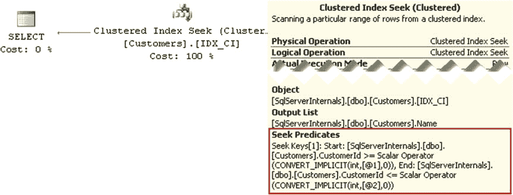

# 第 2 章 ■ 表与索引：内部结构与访问方法

分配顺序扫描可能会产生不一致的结果。由于分页拆分引起的数据移动，某些行可能被跳过或被读取多次。因此，除非在 `READ UNCOMMITTED` 或 `SERIALIZABLE` 事务隔离级别下读取数据，否则 SQL Server 通常避免使用分配顺序扫描。

■ **注意** 我们将在第 6 章“索引碎片”中讨论分页拆分和碎片问题，并在第三部分“锁、阻塞与并发”中探讨锁与数据一致性。

## 索引查找

最后一种索引访问方法称为 `索引查找`。查询 `SELECT Name FROM dbo.Customers WHERE CustomerId BETWEEN 4 AND 7` 和图 2-12 说明了此操作。

***图 2-12.** `索引查找`*

为了读取表中该范围内的行，SQL Server 需要找到范围内键值最小的行，即 4。SQL Server 从根页开始，其第二行引用的页的最小键值为 350。这个值大于我们要查找的键值（4），因此 SQL Server 读取根页第一行引用的中间级别数据页（1:170）。类似地，中间页引导 SQL Server 到达第一个叶级别页（1:176）。SQL Server 读取该页，然后读取 `CustomerId` 等于 4 和 5 的行，最后从第二个页读取剩余的两行。

执行计划如图 2-13 所示。

***图 2-13.** `索引查找`执行计划*

如你所想，`索引查找` 比 `索引扫描` 更高效，因为 SQL Server 只处理行和数据页的子集，而不是扫描整个表。

### 单点查找

从技术上讲，有两种 `索引查找` 操作。第一种称为 `单点查找`，有时也称为 `点查找`，即 SQL Server 查找并返回单行。你可以将 `WHERE CustomerId = 2` 谓词视为一个例子。另一种 `索引查找` 操作称为 `范围扫描`，它要求 SQL Server 找到键的最低或最高值，然后（向前或向后）扫描行集，直到达到扫描范围的末尾。谓词 `WHERE CustomerId BETWEEN 4 AND 7` 会导致范围扫描。这两种情况在执行计划中都显示为 `INDEX SEEK` 操作。

如你所想，范围扫描完全有可能迫使 SQL Server 处理索引中的大量甚至全部数据页。例如，如果你将查询改为使用 `WHERE CustomerId > 0` 谓词，即使执行计划中显示的是 `Index Seek` 运算符，SQL Server 也会读取所有行/页。在查询性能调优时，你必须牢记这种行为，并始终分析范围扫描的效率。

## SARG 可优化谓词

关系型数据库中有一个概念叫做 `SARGable 谓词`，代表 `Search Argument able`。如果存在索引时 SQL Server 能够利用 `索引查找` 操作，则该谓词是 `SARGable` 的。简而言之，当 SQL Server 能够分离出单个值或索引键值范围进行处理，从而限制谓词评估过程中的搜索时，这些谓词就是 `SARGable` 的。显然，尽可能使用 `SARGable` 谓词编写查询并利用 `索引查找` 是有益的。

`SARGable` 谓词包括以下运算符：`=`, `>`, `>=`, `<`, `<=`, `IN`, `BETWEEN`, 以及 `LIKE`（用于前缀匹配的情况）。非 `SARGable` 运算符包括 `NOT`, `<>`, `LIKE`（用于非前缀匹配的情况），以及 `NOT IN`。

另一种使谓词变为非 `SARGable` 的情况是对表列使用函数或数学计算。SQL Server 必须对它处理的每一行调用函数或执行计算。幸运的是，在某些情况下，你可以重构查询以使此类谓词变为 `SARGable`。表 2-1 展示了其中一些例子。

