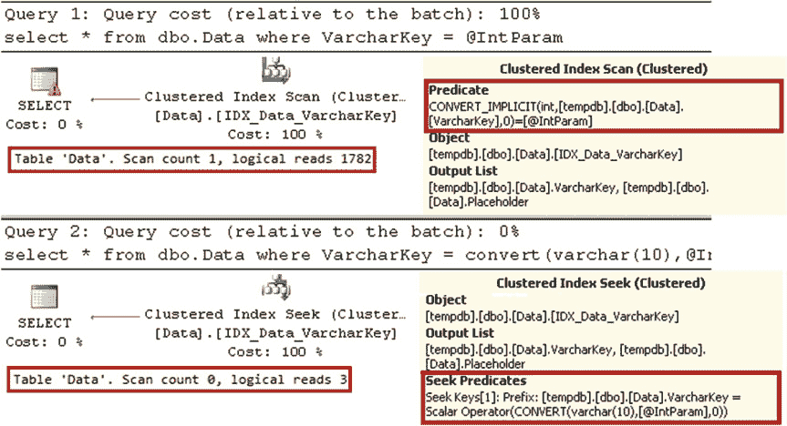
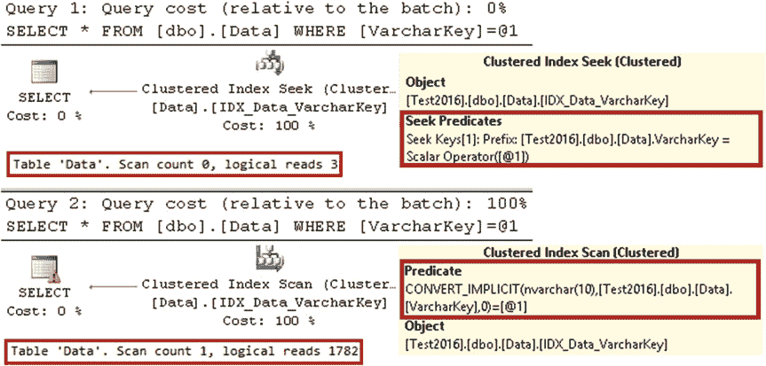
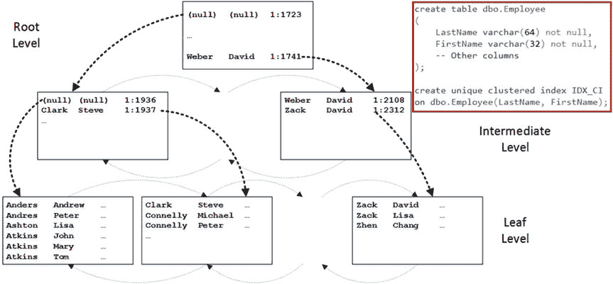
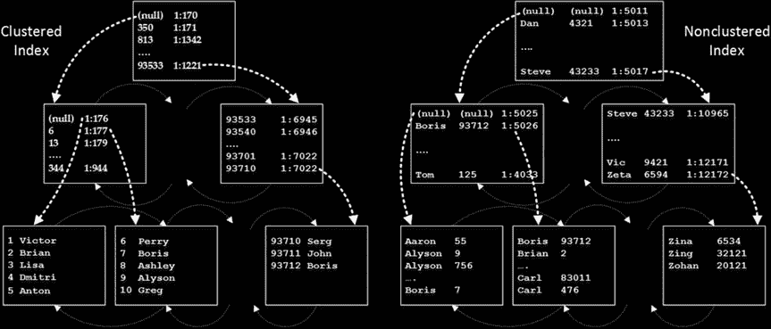
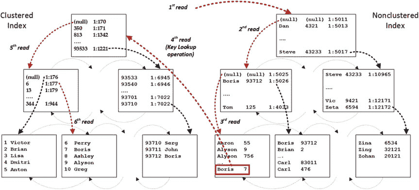
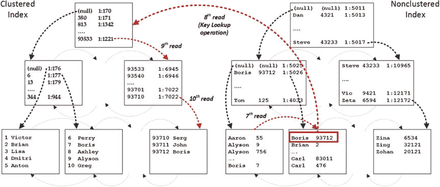

# 第 2 章 ■ 表与索引：内部结构与访问方法

### 表 2-1. 将非 SARGable 谓词重构为 SARGable 谓词的示例

**操作** | **非 SARGable 实现方式** | **SARGable 实现方式**
---|---|---
数学计算 | `Column - 1 = @Value` <br> `ABS(Column) = 1` | `Column = @Value + 1` <br> `Column IN (-1, 1)`
日期操作 (在 SQL Server 2008 之前的版本中) | `CAST(Column as date) = @Date` <br> `DATEPART(year,Column) = @Year` <br> `DATEADD(day,7,Column) > GETDATE()` | `Column >= @Date and Column < DATEADD(day,1,@Date)` <br> `convert(datetime, convert(varchar(10),Column,121))` <br> `Column >= @Year and Column < DATEADD(year,1,@Year)` <br> `Column > DATEADD(day,-7,GETDATE())`
前缀搜索 | `LEFT(Column,3) = 'ABC'` | `Column LIKE 'ABC%'`
子串搜索 | `Column LIKE '%ABC%'` | 使用全文搜索或其他技术

另一个你必须牢记的重要因素是*类型转换*。在某些情况下，使用不正确的数据类型会使谓词变为非 SARGable。让我们创建一个包含`varchar`列的表，并填充一些数据，如清单 2-6 所示。

### 清单 2-6. SARG 谓词与数据类型：测试表创建
```sql
create table dbo.Data
(
    VarcharKey varchar(10) not null,
    Placeholder char(200)
);

create unique clustered index IDX_Data_VarcharKey
    on dbo.Data(VarcharKey);

;with N1(C) as (select 0 union all select 0) -- 2 行
,N2(C) as (select 0 from N1 as T1 cross join N1 as T2) -- 4 行
,N3(C) as (select 0 from N2 as T1 cross join N2 as T2) -- 16 行
,N4(C) as (select 0 from N3 as T1 cross join N3 as T2) -- 256 行
,N5(C) as (select 0 from N4 as T1 cross join N4 as T2) -- 65,536 行
,IDs(ID) as (select row_number() over (order by (select null)) from N5)
insert into dbo.Data(VarcharKey)
    select convert(varchar(10),ID) from IDs;
```

聚集索引键列被定义为`varchar`，尽管它存储的是整数值。现在，让我们运行两个查询，如清单 2-7 所示，并查看其执行计划。



### 清单 2-7. SARG 谓词与数据类型：使用整数参数的 Select 查询
```sql
declare
    @IntParam int = '200'

select * from dbo.Data where VarcharKey = @IntParam;

select * from dbo.Data where VarcharKey = convert(varchar(10),@IntParam);
```

如图 2-14 所示，在整数参数的情况下，SQL Server 扫描聚集索引，对每一行都将`varchar`转换为整数。在第二种情况下，SQL Server 在开始时就将整数参数转换为`varchar`，并利用了更高效的*聚集索引查找*操作。

### 图 2-14. SARG 谓词与数据类型：使用整数参数的执行计划

■ **提示** 注意联接谓词中的列数据类型。隐式或显式的数据类型转换会显著降低查询性能。

在使用 Unicode 字符串参数的情况下，你会观察到非常相似的行为。让我们运行清单 2-8.所示的查询。图 2-15 显示了这些语句的执行计划。

### 清单 2-8. SARG 谓词与数据类型：使用字符串参数的 Select 查询
```sql
select * from dbo.Data where VarcharKey = '200';

select * from dbo.Data where VarcharKey = N'200'; -- unicode 参数
```



### 图 2-15. SARG 谓词与数据类型：使用字符串参数的执行计划

如图所示，对于`varchar`列，Unicode 字符串参数是非 SARGable 的。这是一个比表面看起来严重得多的问题。虽然你很少像清单 2-8 所示那样编写查询，但如今大多数应用程序开发环境都将字符串视为 Unicode。因此，除非参数数据


## varchar 参数与 SARGable 性

`type` 被显式指定为 `varchar`。这会使得谓词变为非 SARGable 的，并可能导致严重的性能损失，因为即使 `varchar` 列上存在索引，也会引发全索引扫描。

■ `重要` 始终在客户端应用程序中指定参数的数据类型。例如，在 ADO.Net 中，应使用 `Parameters.Add("@ParamName",SqlDbType.Varchar, <Size>).Value = stringVariable` 这种重载，而不是 `Parameters.Add("@ParamName").Value = stringVariable`。在 ORM 框架中，应使用映射来显式指定类中的非 Unicode 属性。

值得一提的是，对于 `nvarchar` 这类 Unicode 数据列，使用 `varchar` 参数是 SARGable 的。

#### 复合索引

拥有多个键列的索引称为 `复合（或组合）索引`。复合索引中的数据按照从左到右的列顺序逐列排序。图 2-16 展示了复合索引的结构。



第 2 章 ■ 表与索引：内部结构与访问方法

***图 2-16.** 复合索引结构*

复合索引的 SARGable 性取决于其最左侧索引列上谓词的 SARGable 性。表 2-2 以图 2-16 中的索引为例，展示了 SARGable 和非 SARGable 谓词。

***表 2-2.** 复合索引上的 SARGable 和非 SARGable 谓词*

**SARGable 谓词**

**非 SARGable 谓词**

`LastName = 'Clark' and FirstName = 'Steve'`

`LastName <> 'Clark' and FirstName = 'Steve'`

`LastName = 'Clark' and FirstName <> 'Steve'`

`LastName LIKE '%ar%' and FirstName = 'Steve'`

`LastName = 'Clark'`

`FirstName = 'Steve'`

`LastName LIKE 'Cl%'`

#### 非聚集索引

聚集索引指定了表中数据行的物理排序方式，而非聚集索引则为列或列集定义了一个独立的逻辑排序顺序，并将其作为单独的数据结构持久化。

我们可以用一本书来打比方。书的页码代表了这本书的 `聚集索引`。

书末的索引按字母顺序显示了书中术语的列表。每个术语都引用了它出现的页码。这个索引就代表了这些术语的 `非聚集索引`。

当你需要在书中查找一个术语时，你可以在索引中查找它。这是一个快速高效的操作，因为术语是按字母顺序排序的。然后，你可以使用那里指定的页码快速找到术语出现的页面。如果没有索引，你唯一的选择就是一页一页地阅读整本书，直到找到所有对该术语的引用。

非聚集索引的结构与聚集索引的结构非常相似。让我们使用 `CREATE NONCLUSTERED INDEX IDX_NCI ON dbo.Customers(Name)` 语句，在 `Customers` 表的 `Name` 列上创建一个非聚集索引。图 2-17 展示了这两种索引的结构。



第 2 章 ■ 表与索引：内部结构与访问方法

***图 2-17.** 聚集索引和非聚集索引结构*

非聚集索引的叶子层级根据索引键值排序——在我们的例子中就是 `Name`。叶子层级的每一行都包含键值和一个 `行 ID`。对于堆表，`行 ID` 是行的物理位置，定义为 `文件:页:槽`，大小为八字节。

■ `注意` SQL Server 在堆表中使用转发指针的另一个原因是，防止当原始行在更新后移动到另一个数据页时，非聚集索引行被更新。非聚集索引保留旧的 `行 ID`，该 `行 ID` 指向转发指针行。

对于带有聚集索引的表，`行 ID` 代表该行的聚集索引键值。

■ `重要` 这是一个非常关键的要点。非聚集索引并不存储关于

```
CREATE NONCLUSTERED INDEX IDX_NCI ON dbo.Customers(Name)
```


物理行位置。当表具有聚集索引时，非聚集索引将存储聚集索引键值作为行定位器。

与聚集索引类似，非聚集索引的中间层和根层为它们引用的每一页存储一行。该行由物理地址和该页键的最小值组成。此外，对于非唯一索引，它还存储该行的行 ID。

■ **注意** 当数据唯一时，将非聚集索引定义为唯一是重要的。唯一索引的中间层和根层行更紧凑，因为 SQL Server 不需要在那里维护行 ID。此外，索引的唯一性有助于查询优化器生成更高效的执行计划。

SQL Server 2016 允许定义键大小高达 1,700 字节的非聚集索引。早期版本的 SQL Server 将其限制为 900 字节。在所有版本中，聚集索引键的最大大小为 900 字节。

SQL Server 允许创建键大小可能超过此限制的索引（由于可变长度列），尽管您将无法将此类行插入表中。清单 2-9 展示了这样的一个示例（如果您在 SQL Server 2014 或更早版本上运行它，则需要使用 900 字节阈值）。



## 第 2 章 ■ 表与索引：内部结构与访问方法

### 清单 2-9. 索引键大小的 1700 字节限制

```
create table dbo.LargeKeys
(
    Col1 varchar(1000) not null,
    Col2 varchar(1000) not null
);

-- Success with the warning
create nonclustered index IDX_NCI on dbo.LargeKeys(Col1,Col2);
```

Warning:
Warning! The maximum key length is 1700 bytes. The index 'IDX_NCI' has a maximum length of 2000 bytes. For some combination of large values, the insert/update operation will fail.

```
-- Success:
insert into dbo.LargeKeys(Col1, Col2) values('Small','Small');

-- Failure:
insert into dbo.LargeKeys(Col1, Col2) values(replicate('A',900),replicate('B',900));
```

Error:
Msg 1946, Level 16, State 3, Line 4
Operation failed. The index entry of length 1800 bytes for the index 'IDX_NCI' exceeds the maximum length of 1700 bytes.

让我们看看 SQL Server 如何使用非聚集索引，假设您运行以下查询：

```
SELECT * FROM dbo.Customers WHERE Name = 'Boris'
```

如图 2-18 的第一步所示，SQL Server 从非聚集索引的根页开始。键值 `Boris` 小于 `Dan`，因此 SQL Server 转到根层页第一行引用的中间页。

### 图 2-18. 非聚集索引用法：步骤 1



## 第 2 章 ■ 表与索引：内部结构与访问方法

中间页的第二行表明该页上的最小键值是 `Boris`，尽管该索引未定义为唯一，且 SQL Server 不知道第一页上是否存储了其他 `Boris` 行。因此，它转到索引的第一个叶页，并在那里找到键值为 `Boris` 且行 ID 等于 7 的行。

在我们的例子中，非聚集索引除了 `CustomerId` 和 `Name` 之外没有任何数据，因此 SQL Server 需要遍历聚集索引树并从那里获取其他列的数据。此操作称为*键查找*。

在下一步中，如图 2-19 所示，SQL Server 返回到非聚集索引并读取叶级别的第二页。它找到另一个键值为 `Boris` 且行 ID 为 93712 的行，并再次执行键查找。

### 图 2-19. 非聚集索引用法：步骤 2

如您所见，SQL Server 不得不读取数据页十次，尽管查询仅返回两行。I/O 操作的数量可以根据以下公式计算：（非聚集索引中的级数）+（从非聚集索引叶级别读取的页数）+（找到的行数）*（聚集索引中的级数）。正如您可能猜到的，


