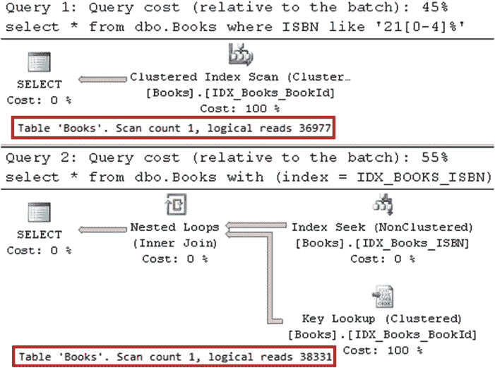

# 第二章：表与索引：内部结构与访问方法

## 代码清单 2-12. 非聚集索引使用：为五个前缀选择数据

```sql
-- 12,500 行
select * from dbo.Books where ISBN like '21[0-4]%'

select * from dbo.Books with (index = IDX_BOOKS_ISBN) where ISBN like '21[0-4]%'


```

## 图 2-21. 为五个前缀选择数据：执行计划

如你所见，在我们的案例中，使用非聚集索引查找来选取 12,500 行数据，与扫描整表相比，引入了更多的逻辑读取。值得一提的是，12,500 行数据占表中总行数的比例不到 1%。*这个阈值是变化的，尽管通常很低*。我们将在下一章讨论 SQL Server 如何执行此类估算。

> **重要提示**：如果 SQL Server 估算需要大量的键查找或 RID 查找操作，它将不会使用非聚集索引。

非聚集索引有助于提高查询性能，但这需要付出代价。它们维护着索引列数据的副本。当列被更新时，SQL Server 需要更新它所包含的每一个索引。

尽管 SQL Server 根据版本不同，允许每张表创建 250 或 999 个非聚集索引，但创建大量索引并非良策。我们将在第七章“索引设计与调优”中讨论索引策略。

#### 总结

聚集索引定义了表中数据的排序顺序。非聚集索引存储表中部分列数据的副本，这些数据按照键列的定义顺序进行排序。

聚集索引和非聚集索引都存储在一个称为 **B-树** 的多级树状结构中。每一级的数据页通过双链表链接。

聚集索引的叶级存储实际的表数据。中间级和根级页存储来自下一级的每页一行数据。每一行都包含其引用的页中键的物理地址和最小值。

非聚集索引的叶级存储索引列的数据和行 ID。对于包含聚集索引的表，行 ID 就是该行的聚集键值。非聚集索引的中间级和根级与聚集索引类似，不过当索引不是唯一时，这些行除了存储最小索引键值外，还会存储行 ID。将索引定义为唯一索引是有益的，因为这可以使中间级和根级更紧凑。此外，唯一性有助于查询优化器生成更高效的执行计划。

SQL Server 需要遍历聚集索引树来获取任何不属于非聚集索引列的数据。这些操作被称为 **键查找**，在 I/O 方面开销很大。如果 SQL Server 预计需要大量的键查找或 RID 查找操作，它将不会使用非聚集索引。

包含聚集索引的表通常比堆表性能更好。因此，在大多数情况下，为表定义聚集索引是有益的。

SQL Server 可以以两种独立的方式利用索引。第一种是**索引扫描**操作，即读取索引中的每一页。第二种是**索引查找**操作，即 SQL Server 仅处理索引页的子集。在查询中使用 SARGable 谓词是有益的，这允许 SQL Server 通过精确匹配索引中的行或行范围来执行索引查找操作。

你应该避免对数据列进行计算和/或函数调用，因为这会使谓词...


