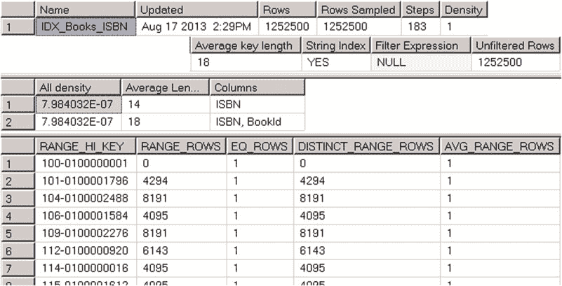

# 第三章
## 统计信息

SQL Server 查询优化器在为查询选择执行计划时，采用基于成本的模型。它会评估不同执行计划的成本，并选择成本最低的那个。但请记住，SQL Server 并不会为查询寻找*最佳*的执行计划，因为评估所有可能的备选方案非常耗时且对 CPU 的消耗很大。查询优化器的目标是*足够快*地找到一个*足够好*的执行计划。

基数估计（即估计查询执行每个步骤需要处理的行数）是查询优化中最重要的因素之一。这个数字会影响连接策略的选择、查询执行所需的内存量（内存授予）以及其他许多方面。

在访问数据时选择使用哪些索引也属于这些因素之一。正如你所记得的，键查找和 RID 查找操作在 I/O 方面代价高昂，当 SQL Server 估计需要进行大量此类操作时，它就不会使用非聚集索引。SQL Server 会在索引上（有时也在列上）维护统计信息，这些信息有助于进行此类估计。

### SQL Server 统计信息简介

SQL Server 统计信息是系统对象，其中包含有关索引键值（有时是常规列值）数据分布的信息。统计信息可以在任何支持比较操作（如 `>`、`<`、`=` 等）的数据类型上创建。

让我们来看一下上一章（清单 2-15）中创建的 `dbo.Books` 表的 `IDX_BOOKS_ISBN` 索引统计信息。你可以使用 `DBCC SHOW_STATISTICS ('dbo.Books',IDX_BOOKS_ISBN )` 命令来完成此操作。结果如图 3-1 所示。

© Dmitri Korotkevitch 2016

D. Korotkevitch, *Pro SQL Server Internals*, DOI 10.1007/978-1-4842-1964-5_3

**图 3-1.** DBCC SHOW_STATISTICS 输出

如你所见，`DBCC SHOW_STATISTICS` 命令返回三个结果集。第一个包含关于统计信息的一般元数据信息，例如名称、更新日期、更新统计信息时索引中的行数等。第一个结果集中的 `Steps` 列表示直方图中的步数/值数（稍后会详细介绍）。`Density` 值查询优化器并不使用，仅出于向后兼容性目的而显示。

第二个结果集称为 `density vector`（密度向量），包含有关统计信息（索引）中键值组合的密度信息。它是根据 `1 / 不同值的数量` 公式计算的，表示平均每个键值组合有多少行。尽管 `IDX_Books_ISBN` 索引只定义了一个键列 `ISBN`，但它也包括聚集索引键作为索引行的一部分。我们的表有 1,252,500 个唯一的 `ISBN` 值，`ISBN` 列的密度为 `1.0 / 1,252,500 = 7.984032E-07`。所有 (`ISBN`, `BookId`) 列的组合也是唯一的，并且具有相同的密度。

最后一个结果集称为 `histogram`（直方图）。直方图中的每条记录（称为一个 `histogram step` 直方图步骤）都包含统计信息（索引）中最左侧列的样本键值，以及从上一个 `RANGE_HI_KEY` 值到当前 `RANGE_HI_KEY` 值范围内的数据分布信息。让我们更深入地研究一下直方图列。

`RANGE_HI_KEY` 列存储键的样本值。该值是由直方图步骤定义的范围的上界键值。例如，在图 3-1 的直方图中，`RANGE_HI_KEY = '104-0100002488'` 的记录（步骤）#3 存储了从 `ISBN > '101-0100001796'` 到 `ISBN <= '104-0100002488'` 的区间的信息。

