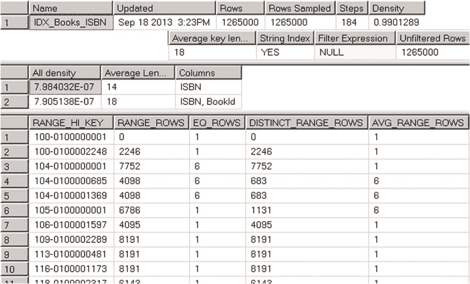
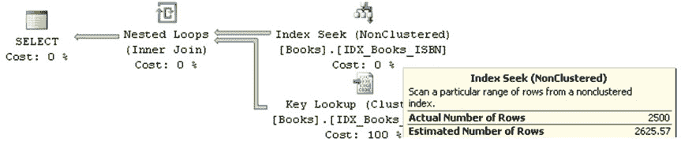

# **第 3 章 ■ 统计信息**

`RANGE_ROWS` 列估算区间内的行数。在我们的例子中，由记录（步骤）#3 定义的区间有 8,191 行。

`EQ_ROWS` 表示有多少行的键值等于 `RANGE_HI_KEY` 的上限值。在我们的例子中，只有一行数据的 ISBN = '104-0100002488'。

`DISTINCT_RANGE_ROWS` 表示区间内有多少个不同的键值。在我们的例子中，所有键值都是唯一的，因此 `DISTINCT_RANGE_ROWS = RANGE_ROWS`。



`AVG_RANGE_ROWS` 表示区间内每个不同键值的平均行数。在我们的例子中，所有键值都是唯一的，因此 `AVG_RANGE_ROWS = 1`。

让我们使用清单 3-1 . 中所示的代码，向索引中插入一组重复的 ISBN 值。

***清单 3-1.*** 将重复的 ISBN 值插入索引。

```sql
;with Prefix(Prefix)
as ( select Num from (values(104),(104),(104),(104),(104)) Num(Num) )
,Postfix(Postfix)
as
(
select 100000001
union all
select Postfix + 1 from Postfix where Postfix < 100002500
)
insert into dbo.Books(ISBN, Title)
select
convert(char(3), Prefix) + '-0' + convert(char(9),Postfix)
,'Title for ISBN' + convert(char(3), Prefix) + '-0' + convert(char(9),Postfix)
from Prefix cross join Postfix
option (maxrecursion 0);
-- 更新统计信息
update statistics dbo.Books IDX_Books_ISBN with fullscan;
```

现在，如果你再次运行 `DBCC SHOW_STATISTICS ('dbo.Books',IDX_BOOKS_ISBN )` 命令，你将看到如图 3-2 所示的结果。

***图 3-2.** DBCC SHOW_STATISTICS 输出*



现在，以 104 为前缀的 ISBN 值有了重复项，这影响了直方图。值得一提的是，第二个结果集中的密度信息也发生了变化。重复的 ISBN 值的密度高于仍然唯一的 (ISBN, BookId) 列组合的密度。

让我们运行 `SELECT BookId, Title FROM dbo.Books WHERE ISBN LIKE ‘114%’` 语句并检查其执行计划，如图 3-3 . 所示。

***图 3-3.** 查询的执行计划*

大多数执行计划运算符都有两个重要属性。*实际行数* 表示在运算符执行期间处理了多少行。*估计行数* 表示在查询优化阶段 SQL Server 为该运算符估算的行数。在我们的例子中，SQL Server 估计有 2,625 行数据的 ISBN 以 114 开头。如果你查看图 3-2 所示的直方图，你会看到步骤 10 存储了包含你正在选择的值的 ISBN 区间的数据分布信息。即使使用线性近似，你估算的行数也会接近 SQL Server 确定的值。

关于统计信息，有两件非常重要的事情需要记住。

1.  直方图仅存储最左侧统计（索引）列的数据分布信息。统计信息中包含有关键值的多列密度的信息，但仅此而已。直方图中的所有其他信息都只与最左侧统计列的数据分布有关。
2.  SQL Server 在直方图中最多保留 200 个步骤，无论表的大小以及表是否分区。随着表的增长，每个直方图步骤覆盖的区间会增大。这导致在大表的情况下统计信息准确性降低。

在复合索引的情况下，当索引中的所有列在所有查询中都被用作谓词时，将具有较低密度/较高唯一值百分比的列定义为索引的最左侧列是有益的。这将使 SQL Server 能够更好地利用统计信息中的数据分布信息。然而，你应该考虑谓词的 **SARG** 性。例如，如果所有查询


在 where 子句中使用 `FirstName=@FirstName` 和 `LastName=@LastName` 谓词时，最好将 `LastName` 作为索引的最左侧列。然而，对于像 `FirstName=@FirstName` 和 `LastName<>@LastName` 这样的谓词，情况并非如此，因为此时 `LastName` 不是 SARGable 的。

#### 列级统计信息

除了索引级统计信息，你还可以创建单独的列级统计信息。此外，在某些情况下，SQL Server 会自动创建此类统计信息。

让我们看一个例子，创建一个表并填充 `Listing 3-2` 中所示的数据。

