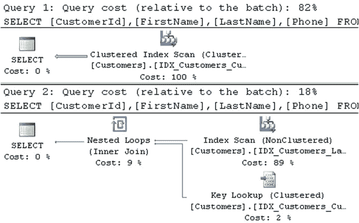

# 第 3 章 ■ 统计信息

### 清单 3-2. 列级统计信息：表创建

```sql
create table dbo.Customers
(

CustomerId int not null identity(1,1),
FirstName nvarchar(64) not null,
LastName nvarchar(128) not null,
Phone varchar(32) null,
Placeholder char(200) null
);

create unique clustered index IDX_Customers_CustomerId
on dbo.Customers(CustomerId)
go

-- Inserting cross-joined data for all first and last names 50 times
-- using GO 50 command in Management Studio
;with FirstNames(FirstName)
as
(
select Names.Name
from
( values('Andrew'),('Andy'),('Anton'),('Ashley'),('Boris'),('Brian'),
('Cristopher'),('Cathy')
,
('Daniel'),('Donny'),('Edward'),('Eddy'),('Emy'),('Frank'),('George'),
('Harry'),('Henry')
,
('Ida'),('John'),('Jimmy'),('Jenny'),('Jack'),('Kathy'),('Kim'),('Larry'),
('Mary'),('Max')
,
('Nancy'),('Olivia'),('Olga'),('Peter'),('Patrick'),('Robert'),('Ron'),
('Steve'),('Shawn')
,('Tom'),('Timothy'),('Uri'),('Vincent') ) Names(Name)
)
,LastNames(LastName)
as
(
select Names.Name
from ( values('Smith'),('Johnson'),('Williams'),('Jones'),('Brown'),('Davis'),('Miller')
,('Wilson'), ('Moore'),('Taylor'),('Anderson'),('Jackson'),('White'),('Harris') )
Names(Name)
)
insert into dbo.Customers(LastName, FirstName)
select LastName, FirstName from FirstNames cross join LastNames
go 50

insert into dbo.Customers(LastName, FirstName) values('Isakov','Victor')
go

create nonclustered index IDX_Customers_LastName_FirstName
on dbo.Customers(LastName, FirstName);
```

在第一个 `INSERT` 语句中指定的每个名字和姓氏的组合都已插入表中 50 次。此外，由第二个 `INSERT` 语句插入了一行，名字为 `Victor`。



