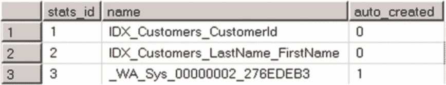
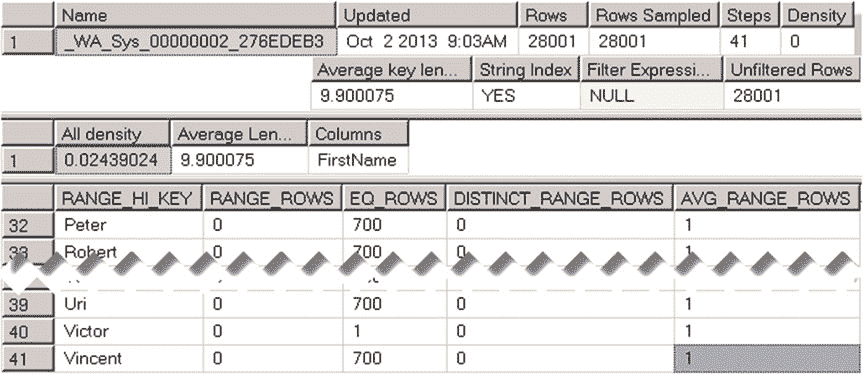
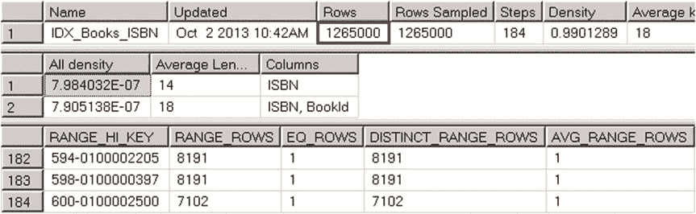
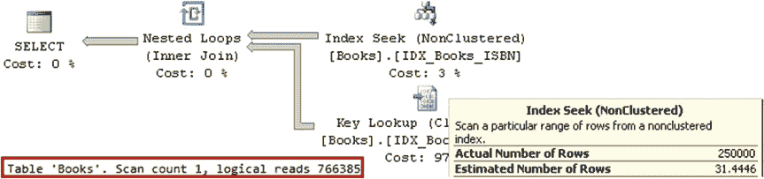
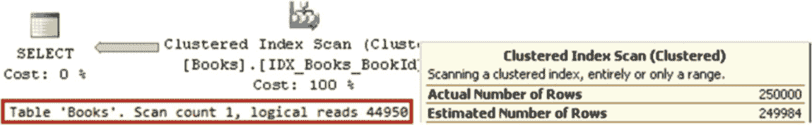

# 第三章 ■ 统计信息

## 图 3-4. 列级统计信息：执行计划

如你所见，SQL Server 决定对返回 700 行的第一个 `SELECT` 使用聚集索引扫描，对返回单行的第二个 `SELECT` 使用非聚集索引扫描。

现在，让我们查询 `sys.stats` 目录视图并检查表的统计信息。代码如清单 3-4 所示。或者，你也可以在 SQL Server Management Studio 中浏览 `dbo.Customers` 表的 *统计信息* 节点。





## 清单 3-4. 列级统计信息：查询 sys.stats 视图

```sql
select stats_id, name, auto_created
from sys.stats
where object_id = object_id(N'dbo.Customers')
```

查询返回了三行，如图 3-5 所示。

## 图 3-5. 列级统计信息：查询结果

前两行对应表中的聚集索引和非聚集索引。最后一行以 `_WA` 前缀命名，显示的是列级统计信息，这些信息是在 SQL Server 优化我们的查询时自动创建的。值得注意的是，SQL Server 在创建这些列级统计信息后，不会自动删除它们。

**提示** 考虑重命名自动创建的 `_WA` 统计信息，以简化数据库管理。

让我们用 `DBCC SHOW_STATISTICS ('dbo.Customers', _WA_Sys_00000002_276EDEB3 )` 命令来检查它。如图 3-6 所示，它存储了关于 `FirstName` 列数据分布的信息。因此，SQL Server 可以估算我们用作参数的名字的行数，并为每个参数值生成不同的执行计划。

## 图 3-6. 列级统计信息：在 FirstName 列上自动创建的统计信息

你可以使用 `CREATE STATISTICS` 命令在列或多列上手动创建统计信息。在多列上创建的统计信息类似于在复合索引上创建的统计信息。它们包含关于多列密度的信息，尽管直方图仅保留最左列的数据分布信息。

维护列级统计信息会有开销，尽管这远小于索引维护的开销，因为索引需要在每次数据修改时更新。在某些情况下，当特定查询不经常运行时，你可以选择创建列级统计信息而不是索引。列级统计信息有助于查询优化器找到更好的执行计划，即使这些执行计划由于涉及的索引扫描而并非最优。同时，统计信息在数据修改操作期间不会增加开销，并且它们有助于避免索引维护。然而，这种方法仅适用于很少执行的查询。你需要创建索引来优化经常运行的查询。

最后，当你向表中添加新索引时，不要忘记重新评估并删除冗余的列级统计信息。

#### 统计信息与执行计划

默认情况下，SQL Server 会自动创建和更新统计信息。数据库级别有两个选项控制此行为：

1. *自动创建统计信息* 控制优化器是否自动创建列级统计信息。此选项不影响索引级统计信息，因为索引级统计信息总是会被创建。`自动创建统计信息` 数据库选项默认是启用的。
2. 当 *自动更新统计信息* 数据库选项启用时，SQL Server 会在每次编译或执行查询时检查统计信息是否已过时，并在需要时更新它们。`自动更新统计信息` 数据库选项默认也是启用的。

**提示** 你可以通过 `STATISTICS_NORECOMPUTE` 索引选项在索引级别控制统计信息的自动更新行为。默认情况下，此选项设置为 `OFF`，表示统计信息会自动更新。另一种在索引或表级别更改自动更新行为的方法是使用 `sp_autostats` 系统存储过程。

SQL Server 根据影响统计信息列的 `INSERT`、`UPDATE`、`DELETE` 和 `MERGE` 语句执行的更改次数来确定统计信息是否已过时。SQL Server 统计的是统计信息列被更改的次数，而不是被更改的行数。例如，如果你更改同一行 100 次，它将被计为 100 次更改，而不是 1 次更改。

SQL Server 会在三种不同的情况下将统计信息标记为过时，这三种情况称为 *统计信息更新阈值*，有时也称为 *统计信息重新编译阈值*。

1. 当表为空时，向表中添加数据会使统计信息过时。
2. 当表少于 500 行时，统计信息列每发生 500 次更改，统计信息就会过时。
3. **在 SQL Server 2016 之前以及兼容级别 < 130 的 SQL Server 2016 中：** 当表有 500 行或更多行时，统计信息列每发生 `500 + (表中总行数的 20%)` 次更改，统计信息就会过时。
   **在兼容级别 = 130 的 SQL Server 2016 中：** 大表的统计信息更新阈值变为动态，并取决于表的大小。表中的行越多，阈值就越低。对于拥有数百万甚至数十亿行的大表，统计信息更新阈值可能仅占表中总行数的一个很小的百分比。此行为也可以通过跟踪标志 `T2371` 在 SQL Server 2008R2 SP1 及更高版本中启用。

表 3-1 总结了不同版本 SQL Server 中的统计信息更新阈值行为。

## 表 3-1. 统计信息更新阈值与 SQL Server 版本

| **SQL Server 2016 之前** | **SQL Server 2016（数据库兼容级别 < 130）** | **SQL Server 2016（数据库兼容级别 = 130）** |
| :--- | :--- | :--- |
| **默认行为** | 静态（~20%）阈值 | 静态（~20%）阈值 | 动态阈值 |
| **T2371** | 在 SQL Server 2008R2 SP1 及更高版本中为动态阈值 | 动态阈值（跟踪标志被忽略） | 动态阈值 |

这引出了一个非常重要的结论。使用静态统计信息更新阈值时，触发统计信息更新所需的统计信息列更改次数与表的大小成正比。表越大，统计信息自动更新的频率就越低。例如，对于一个有 10 亿行的表，你需要执行大约 2 亿次统计信息列的更改才能使统计信息过时。**建议尽可能使用动态更新阈值。**

让我们看看这种行为如何影响我们的系统和执行计划。此时，表 `dbo.Books` 有 1,265,000 行。让我们向表中添加 250,000 行，前缀为 `999`，如清单 3-5 所示。在这个例子中，我使用的是 SQL Server 2012，没有启用 `T2371`。如果你在启用动态统计信息更新阈值的情况下运行它，会看到不同的结果。此外，SQL Server 2014 中引入的新基数估算器也可能会改变行为。我们将在本章后面讨论它。

## 清单 3-5. 向 dbo.Books 添加行

```sql
;with Postfix(Postfix)
as
(
    select 100000001
    union all
    select Postfix + 1
    from Postfix
    where Postfix < 100250000
)
insert into dbo.Books(ISBN, Title)
select
    '999-0' + convert(char(9),Postfix)
    ,'Title for ISBN 999-0' + convert(char(9),Postfix)
from Postfix
option (maxrecursion 0);
```

现在，让我们运行 `SELECT * FROM dbo.Books WHERE ISBN LIKE '999%'` 查询，该查询选择所有具有此前缀的行。






如果你检查如图 3-7 所示的查询执行计划，你会看到非聚集索引查找和键查找操作，即使它们在需要从表中选择近 20%行的情况下效率低下。

**图 3-7.** 选择以 999 为前缀的行的查询执行计划

在图 3-7 中，你还会注意到索引查找操作符的估计行数与实际行数之间存在巨大差异。SQL Server 估计表中只有 31.4 行的前缀为 999，而实际上有 250,000 行具有此前缀。结果，生成了一个效率极低的计划。

让我们通过运行 `DBCC SHOW_STATISTICS('dbo.Books', IDX_BOOKS_ISBN)` 命令来查看 `IDX_BOOKS_ISBN` 的统计信息。输出如图 3-8 所示。如你所见，尽管我们向表中插入了 250,000 行，统计信息并未更新，且直方图中没有前缀 `999` 的数据。第一个结果集中的行数对应于上次统计信息更新时表中的行数。它不包括刚刚插入的 250,000 行。

**图 3-8.** `IDX_BOOKS_ISBN` 统计信息

现在，让我们使用 `UPDATE STATISTICS dbo.Books IDX_Books_ISBN WITH FULLSCAN` 命令更新统计信息，然后再次运行 `SELECT * FROM dbo.Books WHERE ISBN LIKE '999%'` 查询。该查询的执行计划如图 3-9 所示。现在的估计行数是正确的，SQL Server 最终得出了一个高效得多的执行计划，该计划使用聚集索引扫描，I/O 读取次数比之前减少了约 17 倍。



第 3 章 ■ 统计信息

**图 3-9.** 更新统计信息后，选择以 999 为前缀的行的查询执行计划

如你所见，错误的基数估算可能导致效率极低的执行计划。过时的统计信息或许是导致基数估算错误的最常见原因之一。`你可以通过检查执行计划中的估计行数和实际行数来锁定其中一些情况。这两个值之间的巨大差异通常表明统计信息不正确。` 更新统计信息可以解决此问题并生成更高效的执行计划。

#### 统计信息与查询内存授予

SQL Server 查询需要内存来执行。执行计划中的不同操作符有不同的内存需求。例如，索引扫描操作符逐行获取行，不需要在内存中存储多行。其他操作符——例如排序操作符——需要在开始执行前访问整个行集。

SQL Server 尝试基于行大小和基数估算来估计查询及其操作符所需的内存量（内存授予）。内存授予的正确性很重要。低估和高估都会引入效率问题。高估会浪费 SQL Server 内存。此外，在繁忙的服务器上，分配大额内存授予可能需要更长时间。

另一方面，低估可能导致执行计划中的某些操作符内存不足。如果排序操作符没有足够的内存进行内存中排序，SQL Server 会将行集溢出到 `tempdb` 并在那里排序数据。哈希表也会出现类似情况。SQL Server 在需要时会使用 `tempdb`。无论哪种情况，使用 `tempdb` 都会显著降低操作乃至整个查询的性能。

让我们看一个例子，创建一个表并填充一些数据。代码清单 3-6 创建了表 `dbo.MemoryGrantDemo` 并填充了 65,536 行数据。`Col` 列存储从 0 到 99 的值，每个值对应 655 或 656 行。在 `Col` 列上有一个非聚集索引，它是在


