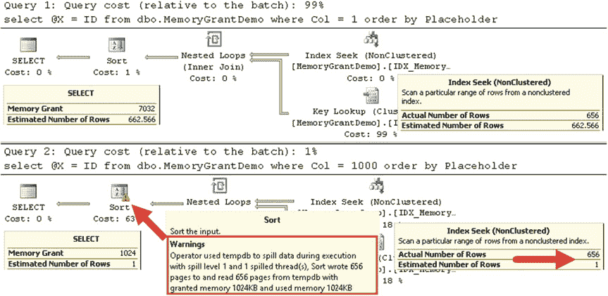

# 第三章 ■ 统计信息

脚本结束。因此，该索引上的统计信息是准确的，SQL Server 能够正确估计表中每个 `Col` 值对应的行数。

## 清单 3-6. 基数估计与内存授予：表创建

```sql
create table dbo.MemoryGrantDemo
(
    ID int not null,
    Col int not null,
    Placeholder char(8000)
);

create unique clustered index IDX_MemoryGrantDemo_ID
    on dbo.MemoryGrantDemo(ID);

;with N1(C) as (select 0 union all select 0) -- 2 rows
,N2(C) as (select 0 from N1 as T1 cross join N1 as T2) -- 4 rows
,N3(C) as (select 0 from N2 as T1 cross join N2 as T2) -- 16 rows
,N4(C) as (select 0 from N3 as T1 cross join N3 as T2) -- 256 rows
,N5(C) as (select 0 from N4 as T1 cross join N4 as T2) -- 65,536 rows
,IDs(ID) as (select row_number() over (order by (select null)) from N5)
insert into dbo.MemoryGrantDemo(ID,Col,Placeholder)
    select ID, ID % 100, convert(char(100),ID) from IDs;

create nonclustered index IDX_MemoryGrantDemo_Col
    on dbo.MemoryGrantDemo(Col);
```

下一步，如清单 3-7 所示，我们向表中添加 656 行新数据，其中 `Col=1000`。这仅占总表数据的 1%，因此，统计信息不会过时。如你所知，直方图将不会包含任何关于 `Col=1000` 值的信息。

## 清单 3-7. 基数估计与内存授予：添加 656 行

```sql
;with N1(C) as (select 0 union all select 0) -- 2 rows
,N2(C) as (select 0 from N1 as T1 cross join N1 as T2) -- 4 rows
,N3(C) as (select 0 from N2 as T1 cross join N2 as T2) -- 16 rows
,N4(C) as (select 0 from N3 as T1 cross join N3 as T2) -- 256 rows
,N5(C) as (select 0 from N4 as T1 cross join N2 as T2) -- 1,024 rows
,IDs(ID) as (select row_number() over (order by (select null)) from N5)
insert into dbo.MemoryGrantDemo(ID,Col,Placeholder)
    select 100000 + ID, 1000, convert(char(100),ID)
    from IDs
    where ID <= 656;
```

现在，让我们尝试运行两个查询，它们使用带有 `Sort` 运算符的执行计划来选择 `Col` 列上带有谓词的数据。实现此功能的代码如清单 3-8 所示。我使用变量来阻止结果集返回客户端。我在 SQL Server 2012 中运行此代码。SQL Server 2014 中引入的新基数估计器在这种情况下会导致不同的估计，我们将在本章后面讨论。

## 清单 3-8. 基数估计与内存授予：选择数据

```sql
declare
    @Dummy int
set statistics time on
    select @Dummy = ID from dbo.MemoryGrantDemo where Col = 1 order by Placeholder;
    select @Dummy = ID from dbo.MemoryGrantDemo where Col = 1000 order by Placeholder;
set statistics time off
```

`查询优化器`将能够正确估计 `Col=1` 的行数。然而，对于 `Col=1000` 的谓词，情况并非如此。请看图 3-10 所示的执行计划。



## 图 3-10. 基数估计与内存授予：执行计划

尽管执行计划看起来非常相似，但基数估计和内存授予是不同的。另一个区别是第二个查询中的 `Sort` 运算符图标有一个感叹号。如果你查看运算符属性，会看到一个警告，表明此操作溢出到 `tempdb`。

在我的计算机上，查询的执行时间如下：

```
SQL Server Execution Times:
   CPU time = 0 ms,  elapsed time = 17 ms.
SQL Server Execution Times:
   CPU time = 16 ms,  elapsed time = 88 ms.
```

如你所见，由于内存授予不正确并导致 `tempdb` 溢出，第二个查询比执行内存中排序的第一个查询慢了大约五倍。

你还可以通过捕获 `Sort Warning` 和 `Hash Warning` 事件，使用扩展事件和 SQL Server Profiler 来监控 `tempdb` 溢出。此外，SQL Server 2016、SQL Server 2014 SP2 和 SQL Server 2012


SP3 在执行计划中显示与溢出相关的附加信息。它包括并行执行计划中涉及溢出的数据页数量、溢出线程数量，以及内存授予信息。当您需要估算溢出引入的性能影响时，这些信息极为有用。

> **注意** 我们将在第 25 章“查询优化与执行”和第 28 章“系统故障排除”中更详细地讨论内存授予。

## 第三章 ■ 统计信息

#### 统计信息维护

正如我已经提到的，默认情况下 SQL Server 会自动更新统计信息。这种行为对于小表通常是可接受的；但是，对于拥有数百万或数十亿行的大表，除非您使用的是 SQL Server 2016 且数据库兼容级别为 130 或启用了跟踪标志 `T2371`，否则不应依赖自动统计信息更新。触发统计信息更新所需的更改数量（20% 的更新阈值）会非常高，因此更新可能不会频繁触发。

在这种情况下，建议您手动更新统计信息。在选择最佳统计信息维护策略时，必须分析表的大小、数据修改模式和系统可用性。例如，如果系统在非工作时间没有高负载，您可以决定每晚更新关键表上的统计信息。别忘了，统计信息和/或索引维护会给 SQL Server 增加额外负载。您必须分析它对同一服务器和/或磁盘阵列上的其他数据库的影响。

在设计统计信息维护策略时，另一个需要考虑的重要因素是数据如何被修改。对于具有始终递增或递减键值的索引，例如当索引中最左侧的列定义为标识符或使用序列对象填充时，您需要更频繁地更新统计信息。如您所见，如果特定键值超出直方图范围，SQL Server 会严重低估行数。这种行为在 SQL Server 2014 到 2016 中可能不同，我们将在本章后面看到。

您可以使用 `UPDATE STATISTICS` 命令来更新统计信息。当 SQL Server 更新统计信息时，它会读取数据样本，而不是扫描整个索引。您可以使用 `FULLSCAN` 选项来更改此行为，该选项强制 SQL Server 读取并分析索引中的所有数据。正如您可能猜到的那样，该选项提供了最准确的结果，尽管在大表的情况下可能引入大量的 I/O 活动。

> **注意** 当您重建索引时，SQL Server 会更新统计信息。我们将在第 6 章“索引碎片”中更详细地讨论索引维护。

您可以使用系统存储过程 `sp_updatestats` 来更新数据库中的所有统计信息。建议在升级到新版本 SQL Server 后，使用此存储过程并更新数据库中的所有统计信息。您应该与 `DBCC UPDATEUSAGE` 存储过程一起运行，该过程更正目录视图中不正确的页和行计数信息。

有一个名为 `sys.dm_db_stats_properties` 的动态管理视图 (DMV)，它显示自上次统计信息更新以来对统计信息列所做的修改次数。使用该 DMV 的代码如清单 3-9 所示。

```sql
-- 清单 3-9. 使用 sys.dm_db_stats_properties
select
    s.stats_id as [Stat ID],
    sc.name + '.' + t.name as [Table],
    s.name as [Statistics],
    p.last_updated,
    p.rows,
    p.rows_sampled,
    p.modification_counter as [Mod Count]
from
    sys.stats s
    join sys.tables t on s.object_id = t.object_id
    join sys.schemas sc on t.schema_id = sc.schema_id
    outer apply
        sys.dm_db_stats_properties(t.object_id, s.stats_id) p
where
    sc.name = 'dbo' and t.name = 'Books';
```


