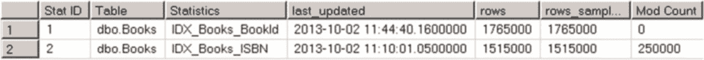
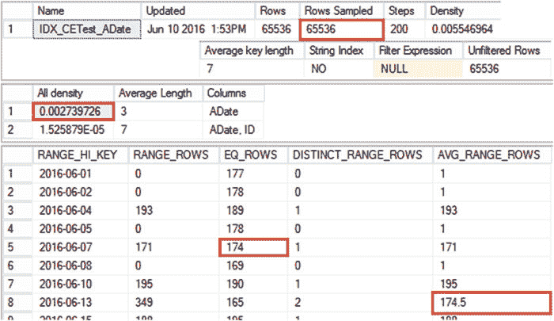
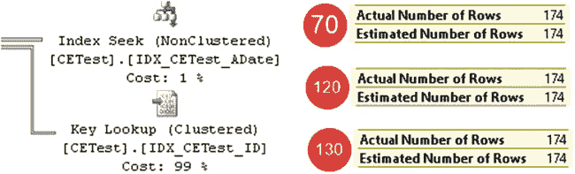

# 第 3 章：统计



如图 3-1 所示，查询结果表明自上次统计信息更新以来，统计信息列已发生了 250,000 次修改。你可以构建一个统计信息维护例程，定期检查 `sys.dm_db_stats_properties` DMV 并重建那些修改计数器值较大的统计信息。

**图 3-11。** `Sys.dm_db_stats_properties` 输出

## 异步自动更新统计信息

另一个与统计信息相关的数据库选项是 `异步自动更新统计信息`。默认情况下，当 SQL Server 检测到统计信息已过时时，它会暂停查询执行，同步更新统计信息，并在统计信息更新完成后生成新的执行计划。而在异步统计信息更新模式下，SQL Server 会使用基于过时统计信息的旧执行计划来执行查询，同时在后台异步更新统计信息。建议除非系统具有非常短的查询超时时间（在这种情况下，同步统计信息更新可能导致查询超时），否则应保持同步统计信息更新。

最后，当你创建新索引时，SQL Server 不会自动删除列级统计信息。你应该手动删除冗余的列级统计信息对象。

## 新基数估计器（SQL Server 2014–2016）

正如你已了解的，查询优化的质量依赖于准确的基数估计。SQL Server 必须正确估计查询执行每个步骤中的行数，以生成高效的执行计划。SQL Server 2005-2012 中使用的基数估计模型最初是为 SQL Server 7.0 开发的，于 1998 年发布。显然，在 SQL Server 的新版本中，该模型进行了一些细微的改进和更改；然而，从概念上讲，该模型保持不变。

该模型使用了四个主要假设，包括：

-   **均匀性**：在没有统计信息的情况下，该模型假设数据分布是均匀的。例如，在直方图步骤内，假定所有键值都是均匀分布的。
-   **独立性**：该模型假设实体中的属性是相互独立的。例如，当一个查询针对同一表的不同列有多个谓词时，它假设这些列之间没有任何关联。
-   **简单包含**：该模型假设用户查询的是表中实际存在的数据。例如，当你连接两个表时，在没有统计信息的情况下，该模型假设一个表中的所有不同值都存在于另一个表中。此模型中连接操作符的选择性是基于连接谓词的选择性。
-   **包含**：该模型假设当一个属性与常量进行比较时，总是存在匹配项。

尽管这些假设在许多情况下能提供可接受的结果，但它们并不总是正确的。不幸的是，该模型的原始实现使其非常难以重构，这导致了在 SQL Server 2014 中决定重新设计它。新的基数估计器使用了一套不同的代码，更易于支持，并且模型中有几个不同的假设，包括：

-   **相关性**：新模型假设查询中的谓词之间存在相关性；与 `独立性` 假设模型相比，这更符合现实查询中的许多情况。
-   **基本包含**：该模型假设用户可能查询表中不存在的数据。除了连接谓词的选择性外，它还将基础表的直方图纳入连接操作中进行考量。

在 SQL Server 2014 和 2016 中，你可以通过数据库兼容级别设置在每数据库级别选择基数估计模型，或者使用跟踪标志在服务器、会话甚至查询级别进行选择。此外，SQL Server 2016 中的新基数估计器允许你在 SQL Server 2014 和 2016 的实现之间进行选择。


### 注意事项

你可以通过分析执行计划根元素的`CardinalityEstimationModelVersion`属性来查看基数估计模型的版本。它可能具有 70、120 和 130 这些值，分别对应旧版、SQL Server 2014 和 2016 实现。

表 3-2 根据数据库兼容性级别和追踪标志 T2312 / T9481，说明了 SQL Server 2014 和 2016 中的基数估计器模型选择。这些追踪标志可以在服务器和查询级别使用。需要提醒的是，120 和 130 的数据库兼容性模型分别对应 SQL Server 2014 和 2016。

**表 3-2. SQL Server 2014 与 2016 中的基数估计器模型选择**

| 兼容性级别 < 120 | 兼容性级别 = 120 | 兼容性级别 = 130 |
| :--- | :--- | :--- |
| 默认行为 | 在 SQL Server 2014 和 2016 中均为 120 | 在 SQL Server 2014 和 2016 中均为 120 |
| T2312 | 在 SQL Server 2014 和 2016 中均为 120 | 在 SQL Server 2014 和 2016 中均为 120 |
| T9481 | 在 SQL Server 2014 和 2016 中均为 120 | 在 SQL Server 2014 和 2016 中均为 120 |

SQL Server 2016 的一个新功能是*数据库范围配置*，它允许你覆盖基于数据库兼容性级别的基数估计器模型选择。你可以使用 `ALTER DATABASE SCOPED CONFIGURATION SET LEGACY_CARDINALITY_ESTIMATION = ON` 语句来启用旧版估计器。表 3-3 显示了当启用 `LEGACY_CARDINALITY_ESTIMATION` 数据库范围配置时的模型选择。

**表 3-3. 当 `LEGACY_CARDINALITY_ESTIMATION=ON` 时，SQL Server 2016 中的基数估计器模型选择**

| 兼容性级别 < 120 | 兼容性级别 = 120 | 兼容性级别 = 130 |
| :--- | :--- | :--- |
| 默认行为 | T2312 | T9481 |

旧版和新版基数估计器的一个关键区别在于它们如何处理多语句表值函数。旧版基数估计器总是期望函数返回单行。而 120 和 130 估计器则期望返回 100 行。这两种模型都不正确；然而，在许多情况下，当多语句表值函数返回大量数据时，估计为 100 行效果更好。我们将在第 11 章详细讨论用户定义函数。

让我们检查几个不同的例子，并比较旧版和新版基数估计器的行为。

### 比较基数估计器：最新统计信息

作为第一个测试，让我们看看当统计信息是最新的时，两个模型如何执行估计。清单 3-10 构建了一个测试表，用一些数据填充它，并在表上创建了聚集和非聚集索引。

**清单 3-10.** 比较基数估计器：测试表创建

```sql
create table dbo.CETest
(
    ID int not null,
    ADate date not null,
    Placeholder char(10)
);

;with N1(C) as (select 0 union all select 0) -- 2 rows
,N2(C) as (select 0 from N1 as T1 cross join N1 as T2) -- 4 rows
,N3(C) as (select 0 from N2 as T1 cross join N2 as T2) -- 16 rows
,N4(C) as (select 0 from N3 as T1 cross join N3 as T2) -- 256 rows
,N5(C) as (select 0 from N4 as T1 cross join N4 as T2) -- 65,536 rows
,IDs(ID) as (select row_number() over (order by (select null)) from N5)
insert into dbo.CETest(ID,ADate)
select ID,dateadd(day,abs(checksum(newid())) % 365,'2016-06-01') from IDs;

create unique clustered index IDX_CETest_ID on dbo.CETest(ID);
create nonclustered index IDX_CETest_ADate on dbo.CETest(ADate);
```

如果你使用 `DBCC SHOW_STATISTICS('dbo.CETest', IDX_CETest_ADate)` 命令检查非聚集索引统计信息，你会看到类似于图 3-12 所示的结果。当你运行脚本时，实际的直方图值可能不同，因为 `ADate` 值是随机生成的。现在忽略图中的高亮部分，稍后我会提到它们。





**图 3-12.** `IDX_CETest_AData` 统计信息


