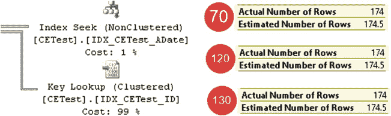
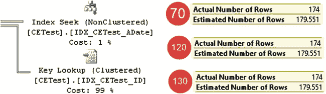
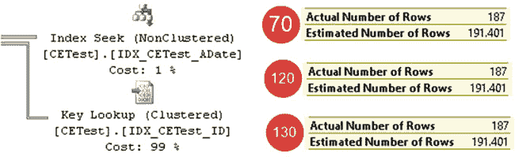
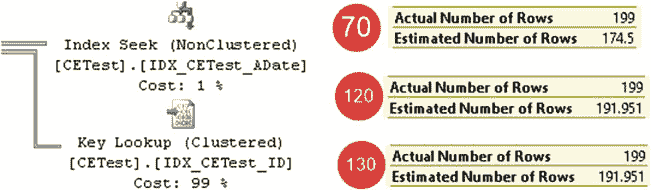
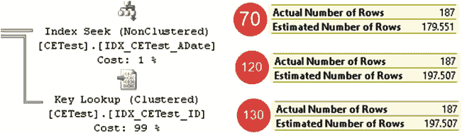
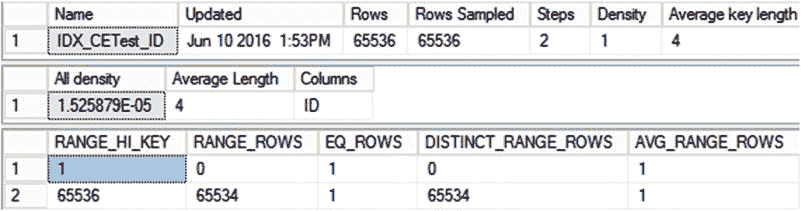
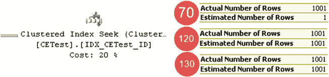

# 第三章 ■ 统计信息

如你所见，该表有 65,536 行。现在，让我们测试一下，当我们使用一个值作为谓词，而这个值是直方图某个步骤中的键时，基数估计的情况。查询如代码清单 3-11 所示。我将在 `110`、`120` 和 `130` 兼容性级别下运行它，并比较所有模型的结果。

***代码清单 3-11.*** 最新的统计信息：为直方图步骤中作为键的值选择数据

```sql
alter database SQLServerInternals set compatibility_level = 110 /* 120; 130 */

go

select ID, ADate, Placeholder

from dbo.CETest with (index=IDX_CETest_ADate)

where ADate = '2016-06-07';
```

如图 3-13 所示，所有情况下的结果都是相同的。SQL Server 使用第五个直方图步骤中 `EQ_ROWS` 列的值进行估计。

***图 3-13.*** 最新的统计信息：为直方图步骤中作为键的值进行基数估计





现在，让我们运行一个查询，选择 `ADate = '2016-06-11'` 的数据，这个值在直方图中不作为键存在。如图 3-14 所示的结果对于所有模型都是相同的。SQL Server 使用第八个直方图步骤中 `AVG_RANGE_ROWS` 列的值进行估计。

***图 3-14.*** 最新的统计信息：为直方图步骤中不作为键的值进行基数估计。

最后，让我们运行一个参数化查询，如代码清单 3-12 所示，使用局部变量作为谓词。在这种情况下，SQL Server 使用索引中的平均选择性，通过将键的密度乘以索引中的总行数来估计行数：`0.002739726 * 65536 = 179.551`。所有模型都产生了相同的结果，如图 3-15 所示。

***代码清单 3-12.*** 最新的统计信息：为未知值选择数据

```sql
declare
@D date = '2016-06-07';

select ID, ADate, Placeholder

from dbo.CETest with (index=IDX_CETest_ADate)

where ADate = @D;
```

***图 3-15.*** 最新的统计信息：为未知值进行基数估计

如你所见，当统计信息是最新的时，所有模型提供的结果都相同。

## 比较基数估计器：过时的统计信息

不幸的是，在具有非静态数据的系统中，数据修改总是会使统计信息过时。让我们通过向表中插入 6,554 行新数据（占总行数的 10%）来看看这如何影响基数估计。代码清单 3-13 展示了实现此操作的代码。我还在数据库中禁用了自动统计信息更新选项，以避免在兼容性级别 `130` 中因达到动态统计信息更新阈值而导致的统计信息更新。在使用本书配套资料中的其他演示脚本时，别忘了之后重新启用它。





***代码清单 3-13.*** 比较基数估计器：添加新行

```sql
alter database SQLServerInternals set auto_update_statistics off

go

;with N1(C) as (select 0 union all select 0) -- 2 rows
,N2(C) as (select 0 from N1 as T1 cross join N1 as T2) -- 4 rows
,N3(C) as (select 0 from N2 as T1 cross join N2 as T2) -- 16 rows
,N4(C) as (select 0 from N3 as T1 cross join N3 as T2) -- 256 rows
,N5(C) as (select 0 from N4 as T1 cross join N4 as T2) -- 65,536 rows
,IDs(ID) as (select row_number() over (order by (select null)) from N5)

insert into dbo.CETest(ID,ADate)
select ID + 65536,dateadd(day,abs(checksum(newid())) % 365,'2016-06-01')
from IDs
where ID <= 6554;
```

现在，让我们重复测试。图 3-16 展示了代码清单 3-11 中查询的基数估计，其中该值在直方图步骤中作为键存在。如你所见，所有模型都估计为 `191.401` 行，比之前多了 10%。SQL Server 将表中的行数与统计信息中原始的 `Rows` 值进行比较，并相应地调整第五个直方图步骤中 `EQ_ROWS` 列的值。

***图 3-16.*** 过时的统计信息：为直方图步骤中作为键的值进行基数估计

图 3-17 显示了代码清单 3-11 中查询的基数估计，其中该值在直方图步骤中不作为键。你可以看到这里的差异。新模型考虑了行数 10% 的差异，类似于前面的例子。而旧的 `70` 模型仍然使用直方图步骤中的 `AVG_RANGE_ROWS` 值，即使表中的行数与统计信息中保存的行数不匹配。

***图 3-17.*** 过时的统计信息：为直方图步骤中不作为键的值进行基数估计





代码清单 3-12 中的参数化查询也发生了同样的情况。新模型根据行数差异调整估计值，而旧模型则忽略了这些差异。图 3-18 展示了这些估计。

***图 3-18.*** 过时的统计信息：为未知值进行基数估计

两种方法各有优缺点。当新数据在索引中分布均匀时，新模型能产生更好的结果。这正是在我们案例中发生的情况，当 `ADate` 值是随机生成的。另一方面，当新值分布不均而旧值分布未改变时，旧模型效果更好。你可以把键值始终递增的索引作为一个例子。

## 比较基数估计器：具有始终递增键值的索引

下一个测试比较了当值超出直方图范围时，基数估计器的行为。这在具有始终递增键值的索引中经常发生，例如基于标识符或序列列的索引。目前，我们在 `IDX_CETest_ID` 索引中就遇到了这种情况。在插入新行后，索引统计信息未更新，如图 3-19 所示。

***图 3-19.*** 具有始终递增键的索引：直方图

代码清单 3-14 展示了为某些不在直方图中的参数选择数据的查询。图 3-20 显示了基数估计结果。

***代码清单 3-14.*** 具有始终递增键值的索引：测试查询

```sql
select top 10 ID, ADate
from dbo.CETest
where ID between 66000 and 67000
order by PlaceHolder;
```



***图 3-20.*** 具有始终递增键的索引的基数估计

如你所见，旧模型只估计了一行，而新模型基于索引中平均数据分布进行了估计。新模型提供了更好的结果，并让你避免了为具有始终递增键值的索引频繁手动更新统计信息。

## 比较基数估计器：连接

让我们看看两个模型如何处理连接，并创建另一个表，如代码清单 3-15 所示。该表有一个 `ID` 列，其中填充了来自 `dbo.CETest` 表的数据，并通过外键约束引用该表，我们将在第 8 章更深入地讨论这个约束。

***代码清单 3-15.*** 基数估计器与连接：创建另一个表

```sql
create table dbo.CETestRef
(
ID int not null
constraint FK_CTTestRef_CTTest foreign key references dbo.CETest(ID)
);

insert into dbo.CETestRef(ID) -- 72,090 行
select ID from dbo.CETest;

create unique clustered index IDX_CETestRef_ID on dbo.CETestRef(ID);
```


