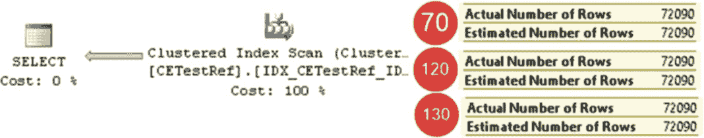
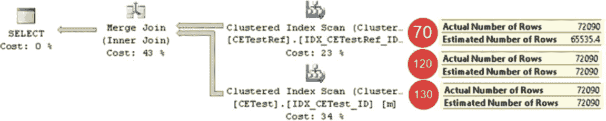
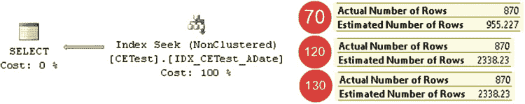

# 第三章 ■ 统计

## 比较基数估算器：多谓词

首先，让我们运行一个带联接的查询，如代码清单 3-16 所示。该查询仅从 `dbo.CETestRef` 表返回数据。外键约束保证了 `dbo.CETestRef` 表中的每一行在 `dbo.CETest` 表中都有对应的行；因此，SQL Server 可以从执行计划中消除该联接。我们将在[第 10 章](http://dx.doi.org/10.1007/978-1-4842-1964-5_10)详细讨论联接消除。

***代码清单 3-16.*** 基数估算器与联接：测试查询 1

```sql
select d.ID
from dbo.CETestRef d join dbo.CETest m on
d.ID = m.ID
```

图 3-21 展示了该查询的基数估算结果。如图所示，两种模型的工作方式相同，都正确地估算出了行数。





***图 3-21.** 包含联接消除的基数估算*

现在让我们修改查询，将引用表的一列添加到结果集中。执行此操作的代码如代码清单 3-17 所示。

***代码清单 3-17.*** 基数估算器与联接：测试查询 2

```sql
select d.ID, m.ID
from dbo.CETestRef d join dbo.CETest m on
d.ID = m.ID
```

尽管外键约束保证了结果集的行数将与 `CETestRef` 表的行数一致，但旧版基数估算器并未将其考虑在内，因此低估了行数。新版基数估算器表现更好，给出了正确的结果。图 3-22 说明了后者，展示了 *联接* 运算符的估算情况。

***图 3-22.** 包含联接的基数估算*

值得一提的是，新版模型在涉及联接时并非总能提供 100% 正确的估算。不过，其结果通常优于旧版模型。

## 选择模型

新版基数估算模型移除了独立性假设，并期望实体属性之间存在一定程度的相关性。当查询包含涉及表中多列的多个谓词时，它采用不同的估算方法。代码清单 3-18 展示了此类查询的示例。图 3-23 显示了两种模型的基数估算结果。

***代码清单 3-18.*** 带多个谓词的查询

```sql
select ID, ADate
from dbo.CETest
where
ID between 20000 and 30000 and
ADate between '2017-01-01' and '2017-02-01';
```



***图 3-23.** 包含多个谓词的基数估算*

旧版基数估算器假设谓词相互独立，并使用以下公式：
（第一个谓词的选择性 * 第二个谓词的选择性）*（表中的总行数）=（第一个谓词的估算行数 * 第二个谓词的估算行数）/（表中的总行数）。

新版基数估算器则期望谓词之间存在某种相关性，它采用另一种称为 *指数退避算法* 的方法，公式如下：
（最具限制性谓词的选择性）* SQRT(次具限制性谓词的选择性) *（表中的总行数）。

这一变化完全属于“视情况而定”的范畴。如我们的例子所示，当属性/谓词之间没有相关性时，旧版基数估算器效果更好。而在存在相关性的情况下，新版基数估算器能提供更好的结果。我们将在下一章的“筛选统计信息”一节中看一个这样的例子。

如你所见，旧版（`70`）基数估算器与 SQL Server 2014 引入的新版基数估算器（`120`）行为差异显著。而 SQL Server 2014（`120`）与 SQL Server 2016（`130`）模型之间的差异则不太明显。SQL Server 2016 在以下若干方面有一些


