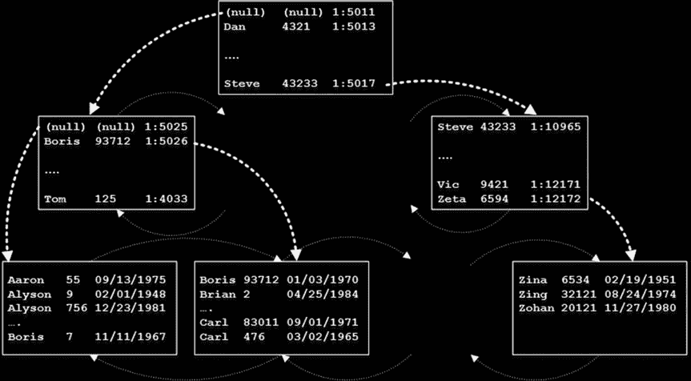

# 第四章 ■ 特殊索引与存储特性

索引与包含列、筛选索引与统计信息、数据压缩以及稀疏列。

## 索引与包含列

正如你已知的，当 SQL Server 预计需要进行大量 `Key` 或 `RID` 查找操作时，它很少使用非聚集索引。这些操作通常会导致大量的逻辑读和物理读。

在键查找操作中，SQL Server 每次需要获取单行数据时，都必须从聚集索引的不同层级访问多个数据页。尽管根层级和中间索引层级通常缓存在缓冲池中，但对叶级页的访问会产生随机且通常是物理的 I/O 读取，这在磁盘驱动器的情况下尤其缓慢。

对于堆表也是如此。尽管非聚集索引中的行 ID（RID）存储了堆表中行的物理位置，并且 RID 查找操作不需要遍历聚集索引树，但它们仍然会引入随机 I/O。此外，如果一行被更新并移动到另一个页面，转发表指针可能会导致额外的读取。

键或 RID 查找的存在是此处的**关键**因素。非聚集索引中的行比聚集索引中的行要小。非聚集索引使用更少的数据页，因此更高效。只要不需要进行键或 RID 查找，即使预计需要选择大量行，SQL Server 也会使用非聚集索引。

回想一下，非聚集索引存储索引键列的数据和行 ID。对于具有聚集索引的表，行 ID 就是索引行的聚集键值。所有索引中的这些值都是相同的：当你更新一行时，SQL Server 会同步更新所有索引。

当查询所需的所有数据都存在于非聚集索引中时，SQL Server 就不需要执行键或 RID 查找。这些索引被称为 `覆盖索引`，因为它们提供了查询所需的所有信息，本质上**覆盖**了查询。

使非聚集索引成为覆盖索引是最常用的查询优化技术之一。过去，实现这一目标的唯一方法是将查询引用的列作为最右侧的索引键列添加进去。尽管这种方法通常有效，但它有一些缺点。

首先，SQL Server 根据索引键值存储排序的索引行。更新索引键列可能导致一行需要移动到索引中的不同位置，这会增加 I/O 和事务日志负载，以及碎片。

其次，新的列会增加索引键的大小，这可能会增加索引的层级数量，使其效率降低。

© Dmitri Korotkevitch 2016

D. Korotkevitch, *Pro SQL Server Internals*, DOI 10.1007/978-1-4842-1964-5_4



最后，根据 SQL Server 版本的不同，非聚集索引键不能超过 900 或 1,700 字节。因此，你无法向索引中添加大量数据或 LOB 列。尽管创建大的索引行不一定是个好主意，但在某些情况下可能会有帮助。

SQL Server 2005 引入了一种创建覆盖索引的新方法：将列存储在索引中而不将它们添加到索引键。这些列的数据仅存储在叶级，不影响索引行的排序顺序。因此，当包含列被修改时，SQL Server 不需要将行移动到索引中的不同位置。包含列不计入 900/1,700 字节的索引键大小限制，如果绝对需要，你甚至可以存储 LOB 列。

图 4-1 展示了一个包含列的索引结构，该索引在表上定义为以下 SQL 语句，其中 `CustomerId` 是聚集索引：

```sql
CREATE INDEX IDX_Customers_Name ON dbo.Customers(Name) INCLUDE(DateOfBirth)
```

***图 4-1.** 包含列的索引结构*


