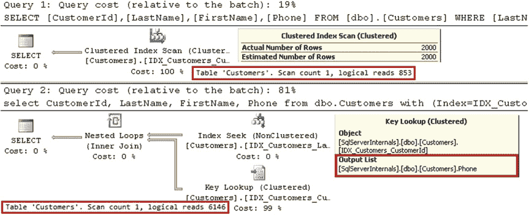
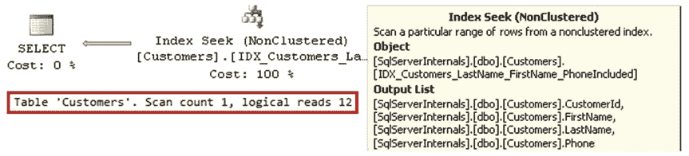

# 包含列的索引如何助力查询优化

让我们来看看包含列的索引如何帮助我们优化查询。我们将使用 `dbo.Customers` 表，该表在上一章的清单 3-3 中创建并填充了数据。

该表在 `CustomerId` 列上有一个聚集索引，在 `(LastName, FirstName)` 列上有一个复合非聚集索引。

我们来选择一个姓氏为 *Smith* 的客户的数据。我们将运行两个查询。在第一种情况下，我们将让 SQL Server 自行选择执行计划。在第二种情况下，我们将通过索引提示强制 SQL Server 使用非聚集索引。实现此目的的代码如 清单 4-1 所示。图 4-2 显示了查询的执行计划。

***清单 4-1.*** 选择姓氏为 'Smith' 的客户的数据
```sql
select CustomerId, LastName, FirstName, Phone
from dbo.Customers
where LastName = 'Smith';
```


CHAPTER 4 ■ SPECIAL INDEXING AND STORAGE FEATURES
```sql
select CustomerId, LastName, FirstName, Phone
from dbo.Customers with (Index=IDX_Customers_LastName_FirstName)
where LastName = 'Smith';
```

***图 4-2.** 查询的执行计划*

如您所见，SQL Server 正确估计了 `LastName = 'Smith'` 的行数，并决定使用聚集索引扫描而非非聚集索引查找。*非聚集索引查找* 和键查找引入了七倍以上的读取操作来获取数据。

查询从表中选择了四个列：`CustomerId`、`LastName`、`FirstName` 和 `Phone`。`LastName` 和 `FirstName` 是非聚集索引键中的键列。`CustomerId` 是聚集索引键，这使其成为非聚集索引中的行 ID。唯一不在非聚集索引中的列是 `Phone`。您可以通过查看执行计划中键查找运算符属性中的输出列表来确认这一点。

让我们通过包含 `Phone` 列来使我们的索引成为覆盖索引，然后观察它如何影响执行计划。实现此目的的代码如 清单 4-2 所示。图 4-3 显示了新的执行计划。

***清单 4-2.*** 创建覆盖索引并再次运行查询
```sql
create nonclustered index IDX_Customers_LastName_FirstName_PhoneIncluded
on dbo.Customers(LastName, FirstName)
include(Phone);

select CustomerId, LastName, FirstName, Phone
from dbo.Customers
where LastName = 'Smith';
```


CHAPTER 4 ■ SPECIAL INDEXING AND STORAGE FEATURES

***图 4-3.** 使用覆盖索引的执行计划*

新索引包含了所有必需的列，因此不再需要键查找。这导致了效率高得多的执行计划。表 4-1 显示了所有三种情况下的逻辑读取次数。

***表 4-1.** 不同执行计划下的逻辑读取次数*

| 聚集索引扫描 | 无覆盖索引的非聚集索引查找 | 有覆盖索引的非聚集索引查找 |
| :--- | :--- | :--- |
| 853 次逻辑读取 | 6,146 次逻辑读取 | 12 次逻辑读取 |

■ **注意** 新的覆盖索引 `IDX_LastName_FirstName_PhoneIncluded` 使得原始的非聚集索引 `IDX_LastName_FirstName` 变得冗余。我们将在[第 7 章](http://dx.doi.org/10.1007/978-1-4842-1964-5_7) “设计和调整索引”中更详细地讨论索引整合。

尽管覆盖索引是优化查询的强大工具，但它们是有代价的。索引中的每个列都会增加其叶级行大小以及它在磁盘和内存中使用的数据页数量。这会在索引维护期间引入额外的开销，并增加数据库大小。此外，当扫描索引的全部或部分时，查询需要读取更多的页。在小范围扫描时，与使用键查找相比，多读取几个页的效率要高得多，因此覆盖索引不一定引入明显的性能影响。然而，它们可能会对……产生负面影响


