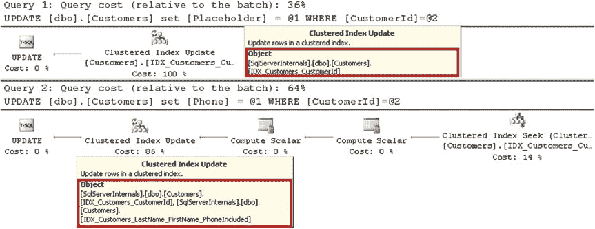
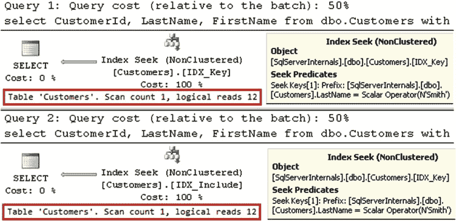
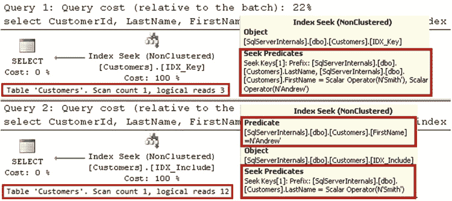

# 第 4 章 ■ 特殊索引与存储特性

## 数据修改查询的性能

那些需要扫描大量数据页或整个索引的查询的性能。

通过向非聚集索引中添加列，你会将数据存储在多个位置。这提高了选择数据的查询的性能。然而，在执行更新操作时，SQL Server 需要更改包含被更新列的所有索引中的行。

让我们看一个示例，运行两个 `UPDATE` 语句，如**代码清单 4-3** 所示。第一条语句修改了 `Placeholder` 列，该列未包含在任何非聚集索引中。第二条语句修改了 `Phone` 列，该列被包含在 `IDX_Customers_LastName_FirstName_PhoneIncluded` 索引中。

### 代码清单 4-3. 在 dbo.Customers 表中更新数据

```sql
update dbo.Customers set Placeholder = 'Placeholder' where CustomerId = 1;

update dbo.Customers set Phone = '505-123-4567' where CustomerId = 1;
```

如**图 4-4** 所示，第二条 `UPDATE` 语句的执行计划要求 SQL Server 同时更新聚集索引和非聚集索引中的数据。



### 图 4-4. UPDATE 语句的执行计划

这种行为会降低数据修改查询的性能，在系统中引入额外的锁，并导致索引碎片化。你需要谨慎行事，并根据具体情况权衡将索引设为覆盖索引的利弊。

> **注意** 我们将在第三部分“锁、阻塞与并发”中详细讨论锁。

## 包含列与键列

了解何时向索引键添加列以及何时将其设为包含列非常重要。虽然在这两种情况下该列都存在于索引的叶级，但在包含列上的谓词**不具有搜索参数**。让我们比较两个索引，如**代码清单 4-4** 所示。

### 代码清单 4-4. 包含列与键列：创建索引

```sql
drop index IDX_Customers_LastName_FirstName_PhoneIncluded on dbo.Customers;

drop index IDX_Customers_LastName_FirstName on dbo.Customers;

create index IDX_Key on dbo.Customers(LastName, FirstName);

create index IDX_Include on dbo.Customers(LastName) include(FirstName);
```

`IDX_Key` 索引中的数据首先基于 `LastName` 排序，然后基于 `FirstName` 排序。`IDX_Include` 中的数据仅基于 `LastName` 排序。`FirstName` 根本不影响索引中的排序顺序。`LastName` 在两个索引中都**具有搜索参数**。这两个索引在搜索特定的 `LastName` 值时都支持*索引搜索*。当 `LastName` 是查询中唯一的谓词时，性能没有差异。**代码清单 4-5** 和**图 4-5** 说明了这一点。

### 代码清单 4-5. 包含列与键列：仅按 LastName 选择

```sql
select CustomerId, LastName, FirstName
from dbo.Customers with (index = IDX_Key)
where LastName = 'Smith';

select CustomerId, LastName, FirstName
from dbo.Customers with (index = IDX_Include)
where LastName = 'Smith';
```





### 图 4-5. 包含列与键列：仅按 LastName 选择

然而，当你向查询中添加 `FirstName` 谓词时，情况就发生了变化。使用 `IDX_Key` 索引，查询能够使用 `LastName` 和 `FirstName` 作为搜索谓词进行*索引搜索*。这对于 `IDX_Include` 索引来说是不可能的。SQL Server 需要扫描具有特定 `LastName` 的所有行，并检查 `FirstName` 列上的谓词。**代码清单 4-6** 和**图 4-6** 说明了这一点。

### 代码清单 4-6. 包含列与键列：按 LastName 和 FirstName 选择

```sql
select CustomerId, LastName, FirstName
from dbo.Customers with (index = IDX_Key)
where LastName = 'Smith' and FirstName = 'Andrew';

select CustomerId, LastName, FirstName
from dbo.Customers with (index = IDX_Include)
where LastName = 'Smith' and FirstName = 'Andrew';
```


## 第四章：特殊索引与存储特性

***图 4-6.** 包含列与键列：通过 `LastName` 和 `FirstName` 进行选择*

正如你所看到的，如果你预计会针对某列使用 **SARGable** 谓词，那么将该列添加为键列是更好的选择。否则，最好将该列添加为包含列，这样可以使非叶子索引层级更小，并避免维护额外列排序的开销。

最后，当我们讨论覆盖索引时，无法避免提及 `SELECT *` 模式。`SELECT *` 返回表中所有列的数据，这实际上使你无法创建覆盖索引来对其进行优化。你不应在代码中使用 `SELECT *`。

#### 筛选索引

*筛选索引*（*Filtered Indexes*）在 SQL Server 2008 中引入，允许你仅对数据的一个子集进行索引。这减少了索引的大小和维护开销。

考虑一个包含需要处理数据的表。该表可以有一个 `Processed` 位（bit）列，用于指示行的状态。列表 4-7 展示了一个可能的表结构。

**列表 4-7.** 筛选索引：表创建

```sql
create table dbo.Data
(
    RecId int not null,
    Processed bit not null,
    /* Other Columns */
);

create unique clustered index IDX_Data_RecId on dbo.Data(RecId);
```

假设你有一个后端进程，它基于列表 4-8 中所示的查询加载未处理的数据。

**列表 4-8.** 筛选索引：读取未处理数据的查询

```sql
select top 1000 RecId, /* Other Columns */
from dbo.Data
where Processed = 0
order by RecId;
```

这个查询可以从以下索引中受益：`CREATE NONCLUSTERED INDEX IDX_Data_Processed_RecId ON dbo.Data(Processed, RecId)`。然而，所有键值为 `Processed=1` 的索引行都是无用的。它们会增加索引大小，浪费存储空间，并在索引维护期间引入额外开销。

筛选索引通过允许你仅索引未处理的行来解决这个问题，使索引小巧而高效。列表 4-9 阐明了这个概念。

## 第四章：特殊索引与存储特性

**列表 4-9.** 筛选索引：筛选索引

```sql
create nonclustered index IDX_Data_Unprocessed_Filtered
    on dbo.Data(RecId)
    include(Processed)
    where Processed = 0;
```

**重要提示** SQL Server 查询优化器存在一个设计限制，当筛选条件中的列未出现在叶子级索引行中时，可能导致次优的执行计划。务必将筛选条件中的所有列作为键列或包含列添加到索引中。

筛选索引有一些限制。仅支持简单的筛选条件。你不能使用逻辑 `OR` 运算符，也不能引用函数和计算列。

筛选索引的另一个重要限制与计划缓存有关。当执行计划需要被缓存，并且该索引无法与某些参数值组合一起使用时，SQL Server 可能无法使用筛选索引。例如，即使编译时 `@Processed=0`，`IDX_Data_Unprocessed_Filtered` 索引也无法用于列表 4-10 中所示的参数化查询。

**列表 4-10.** 筛选索引：参数化查询

```sql
select top 1000 RecId, /* Other Columns */
from dbo.Data
where Processed = @Processed
order by RecId;
```

SQL Server 无法缓存使用了筛选索引的计划，因为对于 `@Processed=1` 的调用，该计划将是错误的。这里的解决方案是使用带有 `(recompile)` 选项的语句级重编译、使用动态 SQL，或者添加一个 `IF` 语句，如列表 4-11 所示。

**列表 4-11.** 筛选索引：使用 `IF` 语句重写参数化查询

```sql
if @Processed = 0
    select top 1000 RecId, /* Other Columns */
    from dbo.Data
    where Processed = 0
    order by RecId;
else
    select top 1000 RecId, /* Other Columns */
    from dbo.Data
    where Processed = 1
    order by RecId;
```


